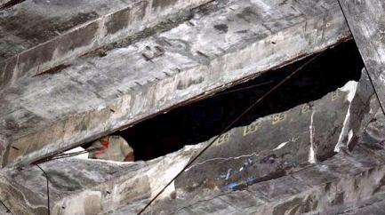
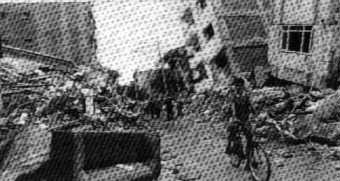
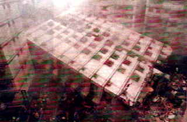
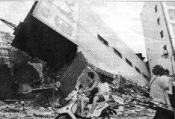
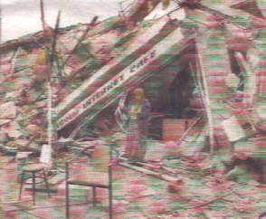

[🠔 Zur Übersicht: Stahlbeton](2beton.md)  
# Architekturphantasien aus Stahlbeton - Der Turmbau von Babel
**Über den Hochmut moderner Stahlbeton-Architektur und das bittere Erwachen, wenn utopische Entwürfe an der mangelnden Langlebigkeit des Materials zerbrechen.**  
_von Konrad Fischer_

## Der Stahlbeton und der Zement 11

Inhaltsverzeichnis der Betonkapitel 

**11: Beton-Architekturphantasien** 

## 11 Architekturphantasien aus Stahlbeton - Der Turmbau von Babel - Architektursprache oder Sprachverwirrung?

Die schlimmsten Schäden nahm der Baubeton bisher jedenfalls immer, wenn er betonwidrig für Architekturphantasien mißbraucht wurde. Das wird hier unter Verweis auf die Schadensanfälligkeit und die Schadensursachen mit entsprechenden Publikationszitaten - meist aus der Tagespresse - dokumentiert. Problem: Obwohl sich selbst Tageszeitungen mehr und mehr der Betonproblematik widmen (s.u.), bleibt das offenbar ohne jede Wirkung auf die Baubranche. Warum wohl? Trägheit, Dummheit, korruptive Geneigtheit? Wer weiß? Ein neuerer tragischer Fall ist der überraschende Einsturz eines Tribünenteils des Octávio-Mangabeira- / Bahia-Stadions Bahia, Ladeira das Fontes das Pedras, Salvador, Brasilien, eingeweiht am 28. Januar 1951. Mitten im begeisterten Gehopse der brasilianischen Fans krachte am 24. November 2007 eine Fußbodenplatte aus Stahlbetonbau nahe der obersten Tribühnenebene in sich zusammen, 7 Besucher stürzten in die Tiefe aus etwa 20 Metern und kamen dabei um, 30 Verletzte wurden in die umliegenden Krankenhäuser eingeliefert. Das Foto zeigt, in welchem Zustand dieser Jahrhundertbaustoff war - offene korrodierte / verrostete Bewehrungseisen glotzen aus dem mürben Beton, ein Abgrund hat sich aufgetan und die armen Fußballfreunde in den Tod gerissen: 

 [Bildquelle: Globoesporte.globo.com](http://globoesporte.globo.com/ESP/Noticia/Futebol/Campeonatos/0,,MUL191741-9743,00.html)

Am 2.2.09 stürzt mitten im Spiel des Interligas-Turniers zwischen Ovetense und Santanidann die Zugangsrampe aus dem Jahrhundertbaustoff Stahlbeton im Nationalstadion "Defensor del Chaco" in Asuncion, Paraguy ein. Dabei fielen zwei Polizisten durch das sich plötzlich auftuende Loch sieben Meter in die Tiefe und verstarben nach dem Aufschlag auf dem harten Beton. Fünf weitere Polizisten plumpsten auch in die Tiefe, wurden dabei verletzt und mußten ins Krankenhaus eingeliefert werden. Alle waren Mitglieder einer Anti-Krawall-Einheit.

Obermain Tagblatt Lichtenfels, 28.5.1986:

Bildunterschrift (Bild: Eingerüstetes Hochhaus in Stahlbetonbauweise): _"SANIERUNGSBEDÜRFTIG ist das jüngste Hochhaus im "Dreigestirn" an der Grünewaldstraße. Erst Ende 1979 bezogen, zeigen sich bereits an "allen Ecken und Enden" Spuren von Rost an den Beton-Balkons, wie Experten sich gestern überzeugten. Die Instandsetzung dürfte ganz schön teuer zu stehen kommen. Fragt sich nur, wer die Rechnung begleichen muß! Foto: ski"_ Das war schnell klar: Die doofen Appartmentkäufer. Wer sonst? Geniale Betonkonstruktionen führen auch in Hamburg zu unliebsamen Überraschungen, Zitat aus dem 

Hamburger Abendblatt online 11.7.01:

**_""Es war wie eine Explosion"_**

**_Sieben Menschen tranken vor ihren Häusern Kaffee, als das Unglück geschah: Am Finkenwerder Norderdeich stürzten Betonplatten ein. Eine Rentnerin starb. ..._**

_Von HINNERK BLOMBACH, KRISTINA JOHRDE und BIRGIT SCHMIDT_

_... Die Mieter des Mehrfamilienhauses Finkenwerder Norderdeich 108 tranken auf ihren Terrassen Kaffee. Es ist kurz vor 17 Uhr, als die Idylle am Elbdeich zerstört wird. Mit einem ohrenbetäubenden Knall stürzte der Dachüberhang aus Stahlbeton acht Meter in die Tiefe. Die schweren Betonplatten begruben drei Frauen unter sich. Herta S. (65) starb unter den Trümmern. Heike N. (32) erlitt lebensgefährliche Verletzungen, Gisela K. (66) schwerste Prellungen. Zwei Männer kamen mit einem Schock ins Krankenhaus, ein Kleinkind trafen die Betonteile ins Gesicht."Es war einfach furchtbar", sagt Rentner Karl-Heinz K. (70). ... "Plötzlich krachten die Platten nach unten, direkt auf den Kopf meiner Frau Gisela." Die Frau sackt zusammen. Der Sohn Malte K. (33), der wenige Meter danebensteht, zieht die Mutter unter den Trümmern hervor. Auf der Nachbarterrasse die gleiche schreckliche Szene: Hermann N. (76) versucht, die Betonplatten von seiner Schwiegertochter Heike (32) zu wuchten. Auch er wird dabei verletzt. Am anderen Ende des Hauses sitzt die Familie H. in der Sonne. Der kleine Finn-Tobias (1) läuft über die Terrasse, als Trümmerteile sein Gesicht treffen. Vater Tim H. (33) bricht mit einem Schock zusammen. Die Mutter greift nach dem Kind und bringt es zu einem der Rettungswagen, die wenige Minuten nach dem Unglück am Norderdeich eingetroffen sind. ... Eine Nachbarin ... wurde ... vom Knall aufgeschreckt: "Es war wie eine Explosion, dann hörte ich auch schon die Schreie der Leute von unten." ... Die schweren Betonplatten waren auf einer Länge von 50 Metern unterhalb des Dachüberstands zwischen Hausfassade und Regenrinne angebracht. Zum einen sollte dadurch verhindert werden, dass Windböen die Dachpfannen ausheben, zum anderen dienten sie einfach nur als optische Verkleidung. Die Betonplatten waren untereinander mit einem Stahlseil verbunden. Ein Architekt erklärte gegenüber dem Hamburger Abendblatt gestern, dass sich dadurch möglicherweise der Einsturz auf der gesamten Länge erklären lasse. Wenn an einer Stelle der Beton breche, dann reiße das Stahlseil auch die restlichen Platten in die Tiefe. " ..."_

Im Obermain-Tagblatt Lichtenfels dann am 12.7.01 ergänzend: _**"50-Meter-Sims brach ab: zwei Frauen tot**

**HAMBURG:** Ein herabstürzender Dachsims aus Beton hat am Dienstag in Hamburg-Finkenwerder zwei Frauen erschlagen.

"Materialermüdung und Korrosion an der Aufhängung des Dachgesims verdichten sich als Unglücksursache", sagte Hamburgs Polizeisprecher Reinhard Fallak am Mittwoch. ..."

_

Neue Presse Coburg, 27.1.1994: **_"Supermarkt eingestürzt_** 
**_"Wie bei einem Beben"_** 
**_Mindestens zehn Tote bei Unglück in Nizza/Dach fiel ein_** _

NIZZA. - Nach dem Einsturz des Betondachs eines Supermarktes in Nizza (Südfrankreich) haben Rettungstrupps am Mittwoch abend mindestens zehn Tote in den Trümmern entdeckt. Zwei Leichen wurden nach Behördenangaben bereits geborgen. Nach unterschiedlichen Angaben wurden zwischen 80 und 90 Personen verletzt, ein Teil davon schwer. [...]

Auch Stunden nach dem Unglück war noch ungewiß, wie viele Menschen sich noch unter den Trümmern befanden. Nach Ansicht eines Experten wurden sie vom Gewicht der Decke regelrecht erdrückt. "So eine Decke hat fast 420 Tonnen Gewicht", sagte Michel Chevalet am Abend dem französischen Fernsehen.

Der Supermarkt, eine klassische Pfeiler-Konstruktion mit aufgesetztem Flachdach, hatte in Kürze wegen Erweiterungsbauten geschlossen werden sollen. Nach ersten Vermutungen hat möglicherweise ein zentraler Stützpfeiler nachgegeben. [...]"

_ Thema Restaurierung und Denkmalpflege mit "elastischem Beton": Neue Presse Coburg, 29.9.1997: _"**Sisiphus-Arbeit hat begonnen**_ 
**_Nach dem Erdbeben in Italien hat jetzt die Arbeit begonnen_** 
_Von Peer Meinert_

_**Assisi**. Der Gottesdienst in Assisi fand am Sonntag im Freien statt, alle Kirchen sind nach dem Erdbeben geschlossen. [...]_

Auf dem großen Platz vor der gotischen Basilika werden unterdessen die Trümmer aus dem Kirchenschiff gesichtet. "Die Sisiphus-Arbeit hat begonnen", kommentiert ein Kunsthistoriker [...] Insgesamt 40 Quadratmeter Gewölbe sind an zwei Stellen der Oberkirche herausgebrochen. [...] 

Die schlimmsten Schäden hätten verhindert werden können, wenn man bei den Restaurierungsarbeiten in den 50er Jahren nicht so schlampig und so billig vorgegangen wäre, behauptet ... Federico Zeri, einer der bekanntesten und lautstärksten Kunstkritiker Italiens. "Was geschehen ist, war Wahnsinn. Man hat die Holzbalken durch Stahlbeton ersetzt." Die Gewölbe seien dadurch mit noch mehr Gewicht belastet und zudem unbeweglich geworden.

Gegner halten dagegen, man habe damals aus Gründen des Feuerschutzes auf Holz verzichtet, überdies sei Beton elastisch und eigne sich sehr wohl gegen Erdbeben - wenn er richtig verarbeitet sei. Doch die Frage bleibt: Siebenhundert Jahre hat die Basilika samt der Fresken heil überstanden, schlimmsten Erdbeben hielt sie stand. Warum gerade jetzt, nur wenige Jahre nach den Restaurierungen, so katastrophale Schäden? [...]"

Ja, warum wohl? Fragen Sie Ihren Planer und verlangen Sie mindestens eine 20-Jahres-Garantie, wenn er in seiner Arroganz weiter auf Stahlbeton als Konstruktion für Neubau oder Sanierung beharrt. Anders kommen diese Brüder der Zunft nicht ins Nachdenken. Und fragen Sie sein Wissen und seinen Literaturbestand zum Thema Instandsetzung von Betonruinen ab. Diese Web-Seite liefert Ihnen dazu den Stoff. Als Einstieg empfehle ich: 

G. Ruffert: **Schäden an Betonbauwerken, Ursachen - Analysen - Beispiele** , Verlagsgesellschaft R. Müller. 
Als ehemaliger Meister des Spritzbetons aus dem Hause Torkret kann Ruffert hier schonungslos vorgehen - seine Branche verdient ja am Instandsetzen durch Betonpampenbespritzung der traurigen Ruinenreste, die die abgeplatzen, abgenagten, abgepickelten und heute sogar abgespülten (mit Wasserstrahlmethode) Betonkrusten im "Sanierungsfall" hinterlassen. Das Buch "Schäden an Spritzbetonsanierungen" dürfen Sie halt nicht von ihm erwarten. Dazu braucht es aber gar keines - schauen Sie sich bei der nächsten Brennerfahrt nach Italien nur ein bischen um und achten Sie auf Rost in grauer Umgebung. Und natürlich hält Ruffert wenig bis garnix von der alternativen Sanierkaschierung mit schnellversprödenden Kunstharzbrühen. Da muß man ihm wieder mal recht geben, nicht nur, weil das das Geschäft mit der Zementsoße stört ...

Weitere Nachrichten zum Thema "Erdbebensicheres Bauen" 

Neue Presse Coburg, 21.3.1992:

**_"Erdbeben in Erzincan verbittert Türkei_** 
_Fragen an Regierung_ 
_**Versagen bei Katastrophe vorgeworfen**

Erzincan. - Nach der Katstrophe von Erzincan haben die Türken, die alle paar Jahre von Erdbeben heimgesucht werden, angefangen, der Regierung in Ankara und ihren Provinzverwaltungen peinliche und bohrende Fragen zu stellen. Warum trifft die Regierung eines Landes, das zu 95 Prozent als erdbebengefährdet gilt, keine Vorkehrungen gegen künftige Katastrophen? [...] Wieso sind in Erzincan vor allem öffentliche Bauten zusammengestürzt? [...]

_

Bildunterschrift (Bild: Bagger räumt Trümmer eines eingestürzten viergeschossigen Stahlbetonbauwerks weg): _"Nach dem Erdbeben in Erzincan stellen sich immer mehr Türken Fragen. Wieso ist das Land nicht aus Erdbeben vorbereitet und wieso sind in erster Linie öffentliche Gebäude eingestürzt?"_

Antwort: Weil höchste Stellen am erdbebenunsicheren Bauen verdienen und "Billig"-Stahlbetonbauweise vorwiegend an öffentlichen Bauten "gepflegt" wird. Hierzu: 

VfA-Profil 4/94:

_**"Planung à la Demirel**

"Nichts hält ewig"; diese alte Weisheit hat sich - wie schon so oft - auch kürzlich bei dem Erdbeben in der Türkei wieder bewahrheitet.

"Wenn ein Gebäude nach 29 Jahren einstürzt, kann man dem Planer keine Vorwürfe mehr machen", so der türkische Ministerpräsident Süleynam Demirel. Diese Worte kamen ihm nicht ohne Grund über die Lippen: Als Architekt hatte Demirel ein Krankenhaus konzipiert, in dem bei dem schweren Beben 48 Menschen ums Leben kamen."

_ Nachtrag: Obermain-Tagblatt 19.8.1999 - nach dem neuerlichen türkischen Erdbeben mit 15.000 Toten _**"Pfusch am Bau rächte sich bei Erdbeben**

ISTANBUL. Das Erdbeben hat vor allem schlecht gebaute Häuser zum Einstürzen gebracht. In Istanbul, Yalova, Izmit und anderen betroffenenen Städten fielen mehrstöckige Häuser wie Kartenhäuser um. "Das Erdbeben hat sich die schlechten Gebäude herausgepickt", sagte ein Mitglied der türkischen Architektenkammer, Ülkü Özer, der Zeitung "Milliyet". Die eingestürzten Häuser bestünden meist aus schlechtem Material oder seien falsch gebaut worden. ...

_

**[Hinweis K.F.: Alle Fotos aus dem Erdbebengebiet zeigen: Das schlechte Material ist Stahlbeton, die falsche Bauweise die klassische Stahlbetonbauweise.]**

_"Nicht das Erdbeben, sondern schlechte Häuser töten", sagte ein Erdbebenforscher. Ein Politiker der Istanbuler Stadtverwaltung hatte bereits am Dienstag den verwüsteten Stadtteil Avcilar auf der europäischen Seite besichtigt und die Billigbauweise beklagt. "Sie bauen zehnstöckige Häuser auf die gleiche Weise wie einstöckige", sagte er. "In meinen Augen ist das ein Verbrechen.""_

Richtig. Und die "Weise" heißt Stahlbetonbauweise. Das wurde den Architekten und Ingenieuren im Studium ja feste eingetrichtert, ohne die Randbedingungen guten Konstruierens und Bauleitens angemessen zu würdigen. Wie man gut, schön, dauerhaft und richtig für Menschen baut, war offensichtlich nicht im Lehrstoff. 

Bildbeispiel (_"Foto: Reuters"_) aus der Süddeutschen Zeitung vom 27. August 1999 zum Artikel: **_"Erdbeben in der Türkei: Schlag gegen die Kritik am Versagen des Staates"_**

 
_"Wenig Hilfe für Adapazari: Ein türkischer Staatsminister machte sich inkognito ein Bild von der katastrophalen Lage in der zerstörten Stadt"_

Ein Scherz am Rande:

Was ist der Unterschied zwischen einem Pfau und einem Truthahn? Ein Pfau ist ein Truthahn mit Architekturstudium. 
(Ich verdanke diesen Witz meinem geschätzten Kollegen Dr. Arch. Rinaldo Ruvidotti aus Bozen.)

Für Altbau und Denkmalpflege lernen wir:

Niemals Stahlbeton. Da verstehen wir Ingenieure leider nichts davon. Tabellenwerterfüllung hilft hier nicht weiter. Es geht um dauerhaftes, schadensarmes und auch langfristig wirtschaftliches Bauen. Mit Stahlbeton nach heutigen Vorstellungen ist das nicht zu machen. Der funktioniert ja nicht mal am Neubau. Von den Römern lernen und nicht auf das Geschwafel vom "Opus caementititium" reinfallen. Stahlbeton und Portlandzement ist damit nicht gemeint gewesen.

Trauriger Nachtrag 2: Dresdner Neueste Nachrichten 22.9.1999:

**_"Jahrhundert-Erdbeben erschüttert Taiwan - Tausende Tote und Verletzte_**

_Wie ein Baum fiel dieses Hochhaus in Taiwans Hauptstadt Taipeh um. Bei dem stärksten Erdbeben dieses Jahrhunderts in Taiwan mit einer Stärke von 7,6 auf der Richterskala sind in der Nacht zu gestern rund 1700 Menschen ums Leben gekommen. 4000 weitere wurden verletzt [...]. Die Retter befürchteten, dass unter den Trümmern eingsetürzter Gebäude noch 2650 Menschen liegen. [...] Die Regierung rief den Notstand aus." >_

Im Bild (Foto:_rtr_) dazu auf Seite 1 in Farbe: 

Das umgestürzte Hochhaus in Stahlbeton-Bauweise. Den folgenden Meldungen war zu entnehmen, daß es die "neuen" Stahlbetonbauten waren, die dem Beben nicht standhielten. Seit wann fragen Architekten, Ingenieure, Unternehmer und Produzenten nach dem künftigen Wohl und Wehe der Menschen, die in ihren "Werkleistungen" ihr kümmerliches Leben dahinfretten müssen? Hauptsache, die Kasse stimmt. War der Turm von Babel aus Stahlbeton? 

Im Obermain-Tagblatt vom 22.9.1999 erschien zum Artikel** _"Ich habe darauf gewartet zu sterben - Viele hundert Tote bei schwerem Erdbeben in Taiwan"_** folgendes Bild:

 
_"Ganze Hochhäuser sind bei dem Erdbeben in der taiwanesischen Stadt Nantou zur Seite gekippt. Angesichts solcher Bilder scheint es eine glückliche Fügung, dass die Katastrophe weniger Opfer forderte als das Beben in der Türkei"_

Obermain-Tagblatt 15.11.1999

_**"Türkei kommt nicht zur Ruhe** 
Neuer schwerer Erdstoß löst Panik aus - Fieberhafte Suche nach Überlebenden 

**_ISTANBUL_** 
**Von Claudia Steiner**

Das Beben hat die Frontwand des Hauses in Düzce einfach weggerissen. Gefährlich neigt sich das Gebäude nach vorne. Es sieht fast so aus, als würde das Schlafzimmer gleich aus dem Haus rutschen. ... Andere Häuser sind wie Kartenhäuser zusammengefallen. Von fünfstöckigen Appartmenthäusern ist nur noch ein großer Schutthaufen übrig. ...

Nur drei Monate nach dem katastrophalen Erdbeben im Nordwesten der Türkei hat ein weiterer starker Erdstoß das Land erneut ins Chaos gestürzt und Leid über die Menschen gebracht. Das Beben vom Freitagabend hatte eine Stärke von 7,2 auf der Richterskala. Der Erdstoß hat Hunderte von Menschen das Leben gekostet und ganze Städte in ein Trümmerfeld verwandelt. Es sieht aus, als ob die Städte Düzce, Kaynasli und Bolu bombardiert worden wären. Häuser sind zusammengebrochen, Straßen abgerutscht, die Minarette vieler Moscheen stürzten ein und durchschlugen Dächer. [...]">

_ Dazu das Bild auf der Seite 1 (Quelle: dpa): 

 
Ein Ehepaar in den Stahlbetontrümmern seines ehemaligen Geschäftes - ein Internet-Cafe, wie am Sturzbalken noch zu lesen ist.

Den Überlebenden gilt unser Mitgefühl, den Toten unsere Trauer. Den dafür mitverantworlichen Planern, Wissenschaftlern; Baufirmen und Behörden?

Auch die grauenhaften Erdbeben am 26.1.2001 in Indien und dann im Herbst 2005 in Kaschmir erwiesen wieder die besondere Gefährdung neuzeitlicher Stahlbetonbauten. Sie produzierten hohe Opferraten, ihre Trümmer zierten die Gazetten.

Ebenso am 4.11.02, Erdbeben in Italien mit 29 Toten unter einer eingestürzten Betondecke der Schule in San Giuliano di Pulia:

Obermain Tagblatt 4.11.02 (die grauenhaften Bilder sparen wir uns):

**_"Maria, Luigi, Elisa, Luca ..."_**

_... Sechs, sieben und acht Jahre alt waren die Kinder, die unter dem tonnenschweren Betondach ihrer Schule starben, das erst vor einem Jahr schlampig repariert worden war und dann auf sie herabstürzte. ..._

Es ist immer das Gleiche bei Erdbeben in Italien: Die alten Gebäude, gerade die jahrhundertealten, die solide gebauten, halten stand. Es sind die im Wirtschafts- und Bauboom der 60er und 70er Jahre hastig hochgezogenen (Stahlbeton-)Gebäude, die schon bei kleineren Beben zusammenbrechen. ..."

Wie steht es nun eigentlich mit den schönen Fernsehtürmen aus Stahlbeton, die der geniale Statiker Fritz Leonhardt 1965 für Stuttgart erstmals auf den Markt geschmissen hat (alternativ zu den bis dato gebräuchlichen und windlastunempfindlicheren und besser rostgeschützten Stahlgittertürmen), und die inzwischen auch schon genug Anlaß für oberflächliche Beton-Kunstharz-Schmierereien im Zuge der unumgänglichen Sanierung vermorschter und verrotteter und verrosteter Oberflächen inkl. der Acrylisierung ihrer tieferen Risse? Wer inspiziert hier regelmäßig, wie alles hält und wie es in der Konstruktionstiefe aussieht, und ob die Nadelabweichungen immer noch der Statik entsprechen - wo doch alles so schön nach Normtabellenwert verläuft. Na ja, wird schon nix passieren (hat man bei den Hallendächern auch immer gedacht ...).

Und dann die folgenreiche Erdbeben im April 2009 rund um L'Aquila in den Abruzzen mit über 290 Toten:

Aus RP Online 14.04.09:

_"Nach vorläufigen Schätzungen sind ... 60000 Häuser betroffen. ... mehr als 20000 Gebäude nicht nach den Vorschriften errichtet.... Nach Angaben der Staatsanwaltschaft wurden ... beim Bau des Krankenhauses und des Studentenwohnheims weniger als die vorgeschriebenen tragenden Elemente für das Stahlgerüst verwendet. Zweifel gibt es auch an der Güte des Betons. "Die eingestürzten Gebäude sind der Beweis dafür, dass das System faul ist", sagte der Bauunternehmer Giovanni Frattale aus L'Aquila dem "Corriere della Sera". Mindestens ein Drittel der Branche sei "skrupellos", verwende minderwertiges Material und sei nur auf den eigenen Gewinn fixiert."_

Aha. Und die Zement- und Betonmafia gibt es bestimmt auch nur in Polen und Italien, oddä?
