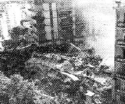
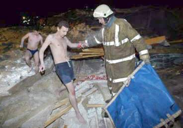
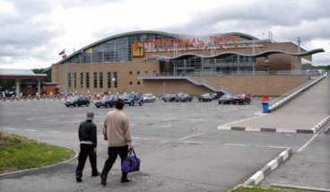
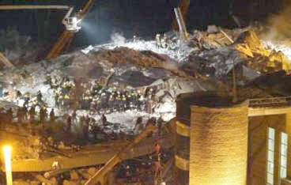
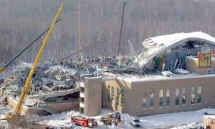

[🠔 Zur Übersicht: Stahlbeton](2beton.md)  
# Materialtücke Beton: Wenn die Bauchemie zur Zeitbombe wird
**Eine tiefgehende Analyse der verborgenen Zerfallsprozesse in Stahlbeton – von chemischer Rekristallisation bis zur schleichenden Korrosion, die moderne Bauten unbemerkt schwächen.**  
_von Konrad Fischer_

## Der Stahlbeton und der Zement 12

Inhaltsverzeichnis der Betonkapitel 

## 12 Stahlbeton - Materialdetails und Materialheimtücke 

Warum baut man Architektur aus Stahlbeton? Weil bewährte Bauweisen nicht mehr beherrscht werden? Dann müssten die Planer ja ganz anders konstruieren und Anschlüsse und Verbindungen und Profile detaillieren können, anstelle zwei Parallelstriche mit strichlierter Füllung als sauer erschwitztes Ergebnis ihres tiefgrüblerischen Nachdenkens auf's Papier zu setzen. Echt witzig der aktuelle Architekturstil: aus dem Lot geratener Dekonstruktivismus. Hier kündigt das Bauwerk an, daß es bald mit ihm vorüber ist. Symbolismus pur. 

Als Alternative zur Stahlbetonbauweise für Fabrik- oder Lagerhallen, Supermärkte und andere Großbauwerke gäbe es beispielsweise auch Breitflachstahl. Neben Lebensmittelkonservendosen oder Autokarosserien kann man damit auch tragende Baukonstruktionen errichten. Entsprechend Budget und gestalterischem Anspruch gibt es also viele Möglichkeiten, Großgebäude auch ohne dämmstoffbeklebte oder frei bewitterte Stahlbetonfassaden zu verwirklichen. Wobei dann freilich der Brandschutz geklärt werden muß. Doch auch dafür gibt es nicht nur die brandhemmende Anstriche oder Verkleidungen.

Warum also so oft Ingenieurbauwerke aus Stahlbeton? Vielleicht, weil es dafür eine gut softwaregängige bzw. gut von Hand zu rechnende Formelsammlung gibt? Ob die auch nach 5 Jahren Karbonatisierungsangriff und chemischer Korrosion des rostverseuchten Baustahls noch stimmt? Diese Frage ist dem Inschenör auch mal zu schwör.

Durchaus von Interesse für den meist auf die Baustahlkorrosion fixierten Tunnelblick der Betonsanierer könnte dieses Zitat zum Kristallisationsphänomen von Prof. Dr. Wolfgang Vetters, Institut für Geologie der Universität Salzburg, sein - Thema: 

**Materialermüdung durch Aus- und Rekristallisation** 

_Charakteristisch für Zement ist der amorphe beziehungsweise mikrokristalline Zustand nach dem Ablöschen, wodurch Zement und Beton nur eine begrenzte Lebensdauer aufweisen, denn im Verlauf von einigen Jahrzehnten erfolgt die Aus- oder Rekristallisation des Zements. 

Mit dieser Rekristallisation verliert der Beton seine Festigkeit, denn diese ist abhängig von verschiedenen mechanischen, chemischen und thermischen Einflüssen und schwankt zwischen 40 und 80 Jahren. Der Einbau eines Stahlgerüsts in Betonbauten erhöht die mechanische Belastbarkeit, ändert jedoch nur wenig an der Lebensdauer, die nur durch Erneuerung verlängert werden kann. Zement und Beton verhalten sich als nicht kristalliner Baustoff ähnlich wie Glas. 

Auch Glas ist nicht kristallisiert. Feinst gesponnenes Glas hat nur eine Lebensdauer von ein bis zwei Jahrzehnten und ist daher als dauerhafter Baustoff - auch zur Wärmeisolation - nur bedingt geeignet. Thermische Belastungen bei Fassaden mit unter dem Putz verlegter Glaswolle oder Kunststoffen (Styropor usw.) beschleunigen die Rekristallisation ebenso wie Mikrovibrationen durch den Verkehr auf Schiene und Strasse._ (aus: StonePlus 3/2008: "Naturstein - sichtbare Ökologie", S. 39) 

**Korrosionsüberwachung**

Wie schlimm es insgesamt steht um den Baustoff Stahlbeton zeigen selbstverständlich auch die Neuentwicklungen zur Beobachtung des Korrosionsfortschrittes: Mit elektronischen Sensorsystemen wird das Eindringen der Depassivierungsfront in den Beton infolge von Chloriden und Karbonatisierung bzw. der korrosionsfördernde Feuchtegehalt infolge Bewitterung bzw. Kondensation in der Betonrandzone systematisch gemessen. Das alles, um das Schlimmste - Versagen des Werkstoffes - rechtzeitig zu prognostizieren und durch Gegenmaßnahmen (Abbruch / kostenintensive Sanierung, wenn der Bauherr mitmacht) Personenschaden zu verhüten. In Zukunft müssen wir uns Betonbauwerke also mit zusätzlichen Meßeinheiten aufgerüstet vorstellen, die den Betrieb von Betonbauwerken bestimmt sicherer, sicher aber nicht einfacher, billiger und wirtschaftlicher machen werden. 

Näheres für Stahlbetonfreaks in: _Schießl, P.; Weydert, R.: Überwachungssysteme für die Korrosionsgefahr des Stahles im Beton. Institut für Bauforschung (ibac), RWTHAachen, Juli 1998_

**Querzug**

Nicht uninteressant auch die neuerdings bei Großexplosions-Versuchen zum Reaktorbau in Albuquerque, New Mexico offenbar gewordenen Probleme des Betonverbunds bei Querzug. Querzug tritt planmäßig auf, wo in Platten, Behältern und Schalen aus Stahlbeton in zwei Hauptrichtungen Zugspannungen vorliegen. Dabei verschlechtert der Querzug mit Rissen entlang der zugbeanspruchten Bewehrungsstäbe das Verbundverhalten des Stahlbetons. Trotzdem bleibt er bei der Bewehrungsberechnung meist unbeachtet. Im Experiment (Herausziehversuch mit kurzverankerten Betonstählen) zeigte sich, daß schon die zugelassenen praktisch vorhandenen geringen Risse den Verbund schwächen. Wegen der heute gültigen falschen Rechenannahmen überschreiten die Rißbreiten im Verankerungsbereich das im Gebrauchszustand zulässige Maß viel zu sehr. 

Näheres in: _Eibl, J.;Idda, K.; Lucero-Cimas, H.-N.: Verbundverhalten bei Querzug. Schlussbericht. Institut für Massivbau und Baustofftechnologie, Universität Fridericiana zu Karlsruhe (TH), Juni 1998._

**Betonvergütung durch Silicastaub und Steinkohlenflugasche**

Der Zusatz von Silicastaub und Steinkohlenflugasche sollen die Dauerhaftigkeit von Beton verbessern. Damit experimentiert die Betonindustrie schon recht lange herum. Nun hat man herausgekriegt, daß man mit diesen künstlichen Puzzolanen im Stahlbeton die korrosionsschützende Alkalitätsreserve vollständig abbauen kann und damit wieder einmal den Teufel durch Beelzebub austreibt - das traditionelle Konzept modernen Bauens. 

Näheres zum Thema und eine angeblich praxistaugliche Rezeptur in: _Wiens, U: Erweiterte Untersuchungen zur Alkalität von Betonen mit hohen Puzzolangehalten. Abschlussbericht. Institut für Bauforschung, RWTH Aachen, Nov. 1998._

**Nachbehandlung**

Das perfekte Nachbehandeln - Voraussetzung der gewünschten Eigenschaften des Stahlbetons - ist eine Aufgabe für Baustellenapotheker: Folien und Schalungen als Abdeckung des mit Wasserversorgung nachbehandelten Stahlbetons müssen während der Einwirkdauer immer vollkomen dicht sein. Ob das oft gelingt? Und wirklich zum dauerbeständigen Bauteil führt? 

Lesenswert dazu: Grübl, P.; Kern, R.;: Wirksamkeit von Nachbehandlungsverfahren. Schlußbericht, Institut für Massivbau, Techn. Universität Darmstadt, Juli 1997.

**Materialheimtücke des Stahlbetons**

Süddeutsche Zeitung 25.1.1988: 

_"Wie Beton und Stahl mürbe werden_ 
_Bundesanstalt warnt vor Kontaktkorrosion in Fundamenten_

_Stahl und Beton bürgen immer noch gleichsam symbolhaft für die Beständigkeit von technischen Bauten. Allerdings gibt es immer wieder unerwartete Unfälle mit nicht mehr standfesten Stahl-Beton-Konstruktionen. Die Bundesanstalt für Materialforschung und -prüfung (BAM) in Berlin weist in diesem Zusammenhang besonders auf zwei neuere Unfälle mit Kindern hin: Kürzlich wurde ein Kind durch ein umstürzendes Klettergerüst verletzt; in einem anderen Fall tötete eine umfallende Skulptur ein spielendes Kind. Die Ursache: Die Stahlverankerungen in den Betonfundamenten waren durch Kontaktkorrosion unbemerkt zerstört worden._

_Im einzelnen spielen sich bei der Kontaktkorrosion die gleichen elektrochemischen Vorgänge ab, wie in einem galvanischen Element oder auch in einem Bleiakkumulator. Taucht man zwei Stifte aus verschiedenen Metallen in ein Wasserbad, dem man etwas Säure zugegeben hat, um es elektrisch leitend zu machen, so kann man zwischen ihnen - ähnlich wie an den Polen eines Akkumulators - eine elektrische Spannung messen. Diese ist desto größer, je weiter voneinander entfernt beide Metalle in der chemischen Spannungsreihe sind, je edler also das eine und je unedler das andere Metall ist. Eine Drahtverbindung außerhalb des Wassers zwischen beiden Stiften schließt den Stromkreis. Im Wasserbad fließt nun ein Strom geladener Materieteilchen (Ionen) vom unedleren zum edleren Metall. Das unedlere Metall "geht in Lösung". Der Metallstift verschwindet mit der Zeit. Wie ist dieses elektrochemische Phänomen nun auf die Vorgänge am Betonfundament zu übertragen?_

_Wird ein Stahlanker in Beton eingebettet, so wird seine Oberfläche durch den Beton chemisch verändert; es bildet sich eine sehr dünne Schutzschicht. Durch diese "Passivierung" wird der einbetonierte Teil des Ankers elektrochemisch gesehen edler als der herausragende Teil: die beiden unterschiedlich edlen Pole des galvanischen Elementes sind damit vorhanden. Die Drahtverbindung zwischen den Elektroden erübrigt sich, denn der Anker selbst verbindet ja sein edles mit seinem unedlen Ende._

_Wasser, das im Freien allgegenwärtig ist, umgibt Stahlanker und Betonfundament und ersetzt das leitende Wasserbad. Der elektrische Strom in dem Element kann fließen und der unedlere Teil des Ankers beginnt in Lösung zu gehen. Durch Wasser und Sauerstoff wird das Eisen sofort weiter oxidiert, die Rostbildung wird erheblich beschleunigt. So wird der der Stahl außerhalb des Betons zersetzt bis die Statik nicht mehr stimmt. Das Gebilde bricht schließlich unerwartet und scheinbar grundlos zusammen._

_Obwohl diese Vorgänge schon länger bekannt sind, werden sie häufig nicht genügend berücksichtigt. Üblicherweise entwickelt sich die Kontaktkorrosion meist im Verborgenen und wird oft oft erst zu spät entdeckt. Die Wissenschaftler der BAM apellieren daher an alle Verantwortlichen, die Standfestigkeit von Gegenständen, die durch diese Korrosion gefährdet könnten, regelmäßig und gründlich zu untersuchen. Noch besser wäre es, anfällige Verankerungen aus unlegiertem Stahl durch solche aus nichtrostendem Chrom-Nickel-Molybdän-Stahl zu ersetzen, denn da sind die beschriebenen elektrochemischen Vorgänge nicht möglich. [...]_ 
_LISELOTTE BECKER"_

Zum Thema Materialheimtücke des Stahlbetons in seiner beliebten Anwendungsform "Spannbeton" auch das Obermain-Tagblatt im Juli 1988: **_"Stalldecken vom Einsturz bedroht_**

_WÜRZBURG. Tausende von Spannbetondecken in Viehställen sind vom Einsturz bedroht. Darauf hat das Innenministerium hingewiesen. [...] Auf Grund der hohen Feuchtigkeit in Viehställen könnte es zur Korrosion der im Beton eingebetteten Spanndrähte kommen. Dadurch könnten Decken einstürzen, ohne daß vorher Schäden sichtbar geworden sind. Das Innenministerium habe deshalb die Landratsämter angewiesen, die Eigentümer zu informieren und aufzufordern, unverzüglich die Decken abzustützen._

_Laut Ministerium sind knapp 6000 Stalldecken betroffen [...]. Die Warnung erfolgte auf Grund mehrjähriger Untersuchungen bei den drei [Hersteller-] Firmen, die nach dem Einsturz zweier Stalldecken in den Jahren 1980 und 1984 eingeleitet wurden._

_Für die Kosten müßten die Eigentümer aller Voraussicht nach selbst aufkommen._ 
_Im Hinblick darauf, inwieweit Regreßansprüche gegenüber den Firmen geltend gemacht werden könnten, zeigte sich der Sprecher "überfragt". Die Firmen hielten sich nicht für verantwortlich und argumentierten, daß die Vorschriften nicht ausreichen gewesen seien."_

Welche "Vorschriften" das sind, wissen wir: [DIN - lesen Sie hier ein Urteil zu ihrem technischen Wert.](2mbu.md)

Die "grauenhafte" Materialheimtücke lauert nicht nur in Schweineställen - Obermain-Tagblatt 11.5.1985

**_"Hier hatte keiner eine Chance"_** 
**_Augenzeugenbericht zum Deckeneinsturz in Schweizer Hallenbad - Zwölf Tote_** 
**_VON FRANK HEIDMANN_**

_**USTER.** "Erst flackerte das Licht, dann gab es ein Knacken, doch keiner achtete darauf. Plötzlich kam die Decke runter - es dauerte nur fünf Sekunden. Keiner hatte eine Chance, hier herauszukommen."_

_So schilderte ein Augenzeuge das grauenhafte Unglück im Hallenbad von Uster, der 25000-Einwohner-Stadt bei Zürich, das zwölf Menschen das Leben kostete. [...] Unter den Unglücksopfern, die von den herabstürzenden Betonmassen entweder erdrückt wurden, oder im Schwimmbecken ertrunken sind, ist auch eine Mutter von zwei Kindern._

_1972 war der Bau [...] errichtet worden. Es ist ein grauer, schmucklos-moderner Betonklotz mit hohen Fensterfronten. Am Morgen nach dem Unglück bietet sich beim Blick durch die zersplitterten Glasscheiben ein gespenstisches Bild: Fast das ganze 25-Meter-Becken ist wie mit einem grauen Leichentuch aus Beton bedeckt. [...]"_

Das erinnert an folgende Meldung der gleichen Zeitung vom 17.4.1986: 

_**"Betonbauer-Klage:** Der Baustoff Beton hat ein "erschreckend schlechtes Image. Er ist Synonym für alles Häßliche, Kalte, Unnatürliche und Unmenschliche schlechthin", sagte Peter von Foerster, Präsidiumsmitglied des Bundesverbands der Deutschen Zementindustrie.[...]"_ Gegenwehr: Die Kampagne Beton - Es kommt drauf an, was man draus macht - also: Schuld haben die Planer und Anwender. Doch zurück nach Uster: 

_"Alles konzentriert sich jetzt auf die Frage, wie sicher die Spannbetondecke war. "Da und dort" habe es schon mal Mängel an dem Bau gegeben, meinte Bezirksanwalt Brunner. [...]"_ Nun, die Antwort blieb nicht aus: Deutsches Architektenblatt DAB 11/85, Bauschäden-Sammlung: 

**_"Abgehängte Decke im Hallenbad USTER (CH)_** 
**_Deckeneinsturz infolge transkristalliner Spannungsrißkorrosion der Stahlbügel_**

_Chloridhaltige Luft führte zu transkristalliner Spannungsrißkorrosion der Stahlbügel, mit denen die Sichtbetondecke abgehängt war. Sekunden nach dem Bruch der Bügel stürzte die Decke ein und begrub zwölf Menschen unter sich._

_[...] Die Aufhängebewehrung, Bügel Querschnitt 10 mm, war in ganz unterschiedlichen Höhen gerissen, nämlich oben in der Nähe der Tragkonstruktion bis zur Punktschweißstelle an der Armierung der abgehängten Decke. Die Bruchflächen der Aufhängebewehrung zeigen teils starke Einschnürungen an duktilen, zähen Stäben mit intakten Oberflächen, die nur sehr kleine Lochfraßstellen aufweisen, teils spröde Stellen ohne wesentliche Querschnittsveränderungen, bei welchen bis über 50% der Querschnittsfläche durchkorridiert sind und deren Oberfläche Risse und Flecken aufweisen.[...]_

_In einzelnen Stäben entstand eine Spannungsrißkorrosion. Voraussetzung dazu ist ein bestimmter Zugspannungszustand im Stahl und das Vorhandensein einer wässrigen Lösung, welche Chlorionen enthält. Nach den ersten Rissen an der Oberfläche der Stahlbügel steigt die Spannung im Stahl an, was die Korrosion zusätzlich beschleunigt. Beim Bruch einzelner Stäbe erhöht sich die Belastung der anderen Stäbe._

_Dieser Vorgang setzt sich solange fort, bis bei benachbarten Stäben die Zugfestigkeit und damit die Tragfähigkeit überschritten wird und selbst noch intakte Bügel in einer Art Reißverschlußprinzip einer nach dem anderen abreißen. [...]_

_Metallurgen wußten schon seit längerer Zeit, daß sogenannter rostfreier Stahl unter bestimmten Voraussetzungen dennoch rosten kann. Diese Erkenntnis ist breiten, praktisch tätigen Kreisen nicht bekannt gewesen und vielleicht auch heute in der allzu großen Informationsflut untergegangen. [....]_

_Alfred de Luigi"_

Also doch - die Desinformationsgesellschaft. Es kommt halt auch bei "Information" darauf an, was man draus macht. Weiteres Informationsbeispiel: Bildzeitung Herbst 1985: 

**_"Spannbeton!_** 
**_Brücke stürzte ein_**

_Ein Nostalgiezug der Bundesbahn mit 400 Fahrgästen war gerade unter der 35 Meter langen Spannbetonbrücke bei Kirchen (Siegen) durchgefahren - da krachte der 1,5 Meter breite Gehweg auf die Gleise, riß die Oberleitung. Die Spannbetonbrücke wurde erst vor 12 Jahren für 670.000 Mark gebaut. Die Ursache ist noch unbekannt."_

- aber nur der Bildzeitung, oder? Und hier das Todesurteil für den Stahl im Beton aus dem Striezelbäckerland (woher denn sonst?): 

Obermain-Tagblatt 24.4.1999:

**_"Dresdner Forscher entwickeln Textilbeton_** 
_Dresdner Forscher haben einen nicht rostenden Textilbeton entwickelt. Bauteile mit diesem Beton seien viel leichter und erhielten eine verbesserte Tragfähigkeit, teilte die Technische Universität Dresden mit. Nach sechs Jahren Forschung sei es gelungen, den rostanfälligen Stahlkern im Beton durch außergewöhnlich belastbare Textilien zu ersetzen. Nach Ansicht der Professoren Peter Offermann und Manfred Curbach gehört dem nicht rostenden Textilbeton die Zukunst im Bauwesen. Der neue Beton könnte den herkömmlichen Stahlbeton vom Markt verdrängen."_ Na ja. So fing´s beim Stahlbeton auch mal an. Wie dauerstabil sind eigentlich nichtrostende Unterhosen? Und auch hier bleibt gültig: Steter Tropfen höhlt den Stein. Auch an Krankenhausfassaden: 

Obermain-Tagblatt 3.11.1999:

**_"Einstürzende Fassade tötete vier Menschen_**

_**SANTANDER.** Beim Einsturz der Fassade eines Krankenhauses in der nordspanischen Küstenstadt Santander sind vier Angestellte der Klinik getötet worden, 15 weitere erlitten Verletzungen. Zwei Menschen wurden gestern noch unter den Trümmern vermisst._

_Bei dem Unglück war die gesamte Betonverkleidung einer Mauer des Hospitals "Marques de Valdecilla" auf einen tiefer gelegenen Gebäudeteil gestürzt, in dem sich Operationssäle und Büroräume befanden._

_Die Trümmer durchschlugen das Dach des Vorbaus und zerstörten das Gebäude fast vollständig. Offenbar war die Bausubstanz der Fassade in einem schlechten Zustand gewesen._

_Zunächst war vermutet worden, eine Gasexplosion habe den Einsturz verursacht. Diese Hypothese wurde später verworfen. Die Fassade hatte sich ab der Höhe des siebten Stockwerks gelöst._

_In einem der Operationssäle musste wegen des Unglücks eine Herzoperation abgebrochen werden."_

Ja Freunde, das habt ihr nun von der herzlosen und schlecht konstruierten Architektur der 2. H. 20. Jh des ausklingenden Spätfrancoismus. Wo der Mensch nur als erstarrte Staffagenfigur im Modell der Schwarzhemd-Architekten zu brauchen ist. Ach ja, wir wissen es schon - der Handwerker ist dran schuld. Und wie weiter? Die Zeit des Stahlbetons läuft gnadenlos ab, und immer öfter schrillt der Wecker: 

Obermain-Tagblatt 12.11.1999 (S.1):

**_"Baufälliges_ [Stahlbeton-]_Haus krachte zusammen: Dutzende Tote in Italien"_**

_Rettungskräfte suchten gestern im süditalienischen Foggia nach Überlebenden in den Trümmern eines fünfstöckigen Wohnhauses, das in der Nacht zuvor binnen Sekunden eingestürzt war. Bis zu 50 Todesopfer werden befürchtet. Ursache der Katastrophe waren nach ersten Ermittlungen Baumängel."_

Wer den Stahlbetonbau und seine Normung Stand 60er Jahre kennt, weiß wovon wohl die Rede ist: Korrodierte Armierung der tragenden und nichttragenden Stahlbetonbauteile. So sieht das aus der Vogelperspektive dann aus: 

Foggia 11.11.1999: Das eingestürzte Stahlbeton-Wohnhaus. Es ist 30 Jahre alt geworden. Original-Bildunterschrift: _"Nur ein rauchender Trümmerhaufen, in dem Helfer verzweifelt nach Überlebenden suchen, blieb von dem Mietshaus in Foggia übrig."_ (Foto: Scan aus Obermain-Tagblatt, dort ohne weiteren Bildnachweis)

Der Artikel auf S. 22:

**_"Opfer im Schlaf erschlagen_** 
_Foggia: Haus stürzt wahrscheinlich wegen Baumängeln ein._

**__FOGGIA__** 
_Beim Einsturz eines Mietshauses im süditalienischen Foggia sind vermutlich bis zu 50 Menschen ums Leben gekommen. Das fünfstöckige Gebäude stürzte mitten in der Nacht zu gestern nach ersten Ermittlungen wegen Baumängeln innerhalb von Sekunden in sich zusammen. 70 Bewohner wurden unter den Trümmern begraben. Unmittelbar nach dem Unglück regte sich erste Kritik an laxen Baubehörden._

_Retter gruben teilweise mit bloßen Händen in den Schuttbergen nach Überlebenden. Die 25-jährige Nica Crincoli zog ihren einjährigen Neffen Antonio Raio mit bloßen Händen aus dem Trümmerberg. "Ich habe seine Hand gesehen und wie eine Wilde gesehen und wie eine Wilde gegraben." Das Kind habe zuerst geweint, dann sei es plötzlich ganz still geworden und in einen Schock verfallen. Das Areal mitten in einem Wohngebiet sah aus wie nach einem Bombeneinschlag. Von dem 30 Jahre alten Gebäude blieb nur ein drei Meter hoher Trümmerhaufen übrig, unter dem auch der Bauherr des Gebäudes begraben wurde, der selbst dort wohnte._

**_Weinende Angehörige_**

_Auf Treppen der Nachbarhäuser in der Via Giotto drängten sich weinende Angehörige. Sie beteten für ihre verschütteten Verwandten. Ein "Zwillingsgebäude" des Unglückshauses, das 1968 vom selben Bauherr errichtet worden war, wurde vorsichtshalber geräumt. Das Unglück ereignete sich gegen drei Uhr morgens und überraschte die Menschen im Schlaf. Ein Mann, der sich mit seiner Familie retten konnte, hatte kurz zuvor ein bedrohliches Rumoren gehört. Er versuchte vergeblich, Mitbewohner zu warnen: "Ich habe Sturm geklingelt bei den anderen Mietern, aber nach wenigen Minuten stürzte das Haus in einer gewaltigen Staubwolke in sich zusammen."_

**_Millionen Häuser überprüfen_**

_Angeblich wurden an dem Gebäude erst kürzlich Bauarbeiten ausgeführt. Bereits seit Tagen soll es bedrohlich geknarrt haben. Erst vor knapp einem Jahr war ebenfalls wegen Baumängel ein Mietshaus in Rom eingestürzt. 27 Menschen kamen ums Leben. "Dies beginnt zu einem wiederkehrenden und beunruhigenden Phänomen zu werden", kritisierte der Chef des italienischen Zivilschutzes, Franco Barberi. Ingenieure meinten, die tragenden Pfeiler des Hauses seien nicht ausreichend mit Eisen verstärkt worden. Ein Geologe sagte, wegen des vor allem in Süditalien weit verbreiteten "wilden Bauens" müssten etwa 25 Millionen Häuser überprüft werden._

_Die Staatsanwaltschaft in Foggia eröffnete eine Ermittlung wegen fahrlässiger Tötung gegen Unbekannt. In den vergangenen 20 Jahren starben bei acht größeren Hauseinstürzen in Italien mehr als 150 Menschen."_

**Ortung von Spannstahlbrüchen** Natürlich ist es inzwischen mehr und mehr bekannt, daß der "unverwüstliche" Spannstahl im Verborgenen vor sich hin reißt. Wie kommt man diesem Problem auf die Spur, wo doch der Einbauort des Stahl oft ganz woanders liegt, als die Ingenieurplanung sich es ausgedacht hat? Mit dem "Remanenzmagnetismus-Verfahren" lassen sich die Brüche der Spanndrähte im Spannbeton mit nachträglichem Verbund zerstörungsfrei orten. Vorher ist ihre von der Planung abweichende Lage mit Radarverfahren festzustellen. Natürlich gelingt das nur, wenn die zerstörten Spannglieder nicht von anderen verdeckt sind - also immerhin. Ein Bravo der immer raffinierteren Untersuchungstechnik! 

Näheres in: Hillemeier, B.; Scheel, H.: Ortung von Spannstahlbrüchen in metallischen Hüllrohren. Abschlußbericht, Institut für Bauingenieurwesen, FG Baustoffkunde und Baustoffprüfung, TU Berlin, August 1996

**Zum wasserstoffinduzierten Sprödbruch hochfest vergüteter Spannstähle der 60er Jahre** Die bis Mitte der 60er verwendeten hochfest vergüteten Spannstähle sind ohne passivierende Alkalienschicht an ihrer Oberfläche - Ergebnis der unvermeidbaren Karbonatisierung - rettungslose Versager. Der Zutritt von Feuchte und Sauerstoff - im normalen Gebrauch immer gegeben - führt dann zur Spannungsrißkorrosion. Schon die sollgemäße Gebrauchslast führt das Versagen der ankorrodierten Spannlitzen und -drähte herbei. Ein recht dynamischer Vorgang: Geringfügigste Überschreitungen der zulässigen Beanspruchungen vergrößert die wasserstoffinduzierte Sprödbruchgefahr. Wie sieht das dereinst mit den aktuellen Spannstahlgüten aus, an die wir wieder mal bedingungslos glauben sollen? Abwarten und Tee trinken. 

Näheres in: Mietz, J.; Pasewald, K.; Isecke, B.: Untersuchungen zum wasserstoffinduzierten Sprödbruch vergüteter Spannstähle. Bundesanstalt für Materialforschung Berlin, Jan. 1998

**Zur Dauerhaftigkeit von Spannbeton** Die Dauerhaftigkeit von Spannbetonbauten ist durch viele Faktoren gefährdet: 

- Unplanmäßige Risse, die die Spannbewehrung kreuzen, 
- Plötzliche Brüche empfindlicher Spannstähle, 
- Abgeminderte Ermüdungsfestigkeiten der Spannbewehrung, 
- Korrosion der Stahlteile; 
- Verringerte Ermüdungsfestigkeit der Spanngliedkopplungen, 
- Wasserstoffinduzierte Spannungsrisskorrosion der Spannstähle usw. 

Schadensursachen und die möglichen Gegenmaßnahmen faßt zusammen: 
König, G.; Schießl, P. u.a.: Dauerhaftigkeit von Spannbeton, Schlussbericht. Institut für Massivbau und Baustofftechnologie der Universität Leipzig in Koop. mit den Lehrstühlen für Baustoffkunde und Massivbau der TU München, Dez. 1998

Obermain-Tagblatt 18.11.1999 

**_"Rost ist tödlich_** 
_Alte Balkone sind "tickende Zeitbomben"_

_Balkone an Altbauten aus der Zeit um die Jahrhundertwende können "tickende Zeitbomben" sein. Das berichtet das Sonderheft "besser bauen" der in Hamburg erscheinenden Zeitschrift "Zuhause Wohnen". Gefahr bestehe vor allem durch Rost an den Stahlträgern der Balkone._

_In früheren Zeiten sei so genannter Konkretbeton verbaut worden, der poröser sei und mehr Wasser als heutiger Fertigbeton ziehe. Gelange noch Sauerstoff in die Schadstelle, roste das Metall._

[Einschub: Aber heute hat der moderne Beton durch feiner als früher gemahlenen Zement und demzufolge geringeren Zementgehalt eine entsprechend geringere Alkalitätsreserve. Dadurch schreitet die karbonatisierungsbedingte Rostfront erheblich schneller voran als bei "altem" grobzementreichem Beton!] 

_In der Folge entstehen dann neue Risse, bis kleine, später größere Teile abplatzen. Im schlimmsten Fall könne der Balkon abbrechen._

_Besonders bedroht sind dem Bericht zufolge klassische Altbaugebiete in Großstaädten wie Berlin, München und Hamburg. [...] Neben Kontrollen durch Bauprüfungsämter können auch Vermieter und Mieter selbst vorsorgen, und zwar, indem sie auf Risse und aufgeplatzte Stellen im Beton am eigenen Balkon und am darüber liegenden achten. Dort seien mögliche Schadstellen auch daran zu erkennen, dass Träger rostig durchschimmern oder die Farbe abblättert."_

Ein ebenso interessantes Phänomen sind auch die mehr und mehr sich häufenden Abstürze der an Betonkisten angebappten "Vorhängfassaden". Wenn die rostenden Verankerungssysteme nicht mehr mögen, geht es rapide bergab. Die Hannoverschen Zeitungen nennen aktuelle Fälle: 80 qm Klinker-Vorhangfassade der Adventistenkirche in der Südstädter Schlägerstraße am 17.9.2006 - ein schmuck-verkleideter Betonbau von 1954, vorher das Telefunken-Hochhaus am Ricklinger Kreisel, wo vor einigen Jahren schon mehrere vorgehängte Fassadenquadratmeter aus heiterem Himmel abstürzten, Anfang September 06 stürzen einige Teile der Verblendung der Volkshochschule herunter, ähnliche Schäden auch an mehreren Schulfassaden, am Landtag und dem Altbau der Nord/LB. Modernes Bauen kann also ganz schön überraschen, nicht immer, aber immer öfter. Und Vorsicht: Es kann auch ziegelmäßig aussehen, was eine Betonruine ist. 

Auch die österreichische Fachpresse jammert - Bau&Immobilien Report 10/02: 

**_"Desolate Kläranlagen_**

_Rund ein Viertel der neu erbauten Kläranlagen weist erhebliche Schäden in der Betonoberfläche auf. Die Untersuchungen über die Ursachen laufen._

_Gemeinden, Abwasserverbände, Versicherungen, Baufirmen und Baustofflieferanten haben ein Problem. Aus Sachverständigenkreisen ist zu erfahren, dass 20 bis 25 Prozent aller in den vergangenen Jahren errichteten Kläranlagen erhebliche Schäden aufweisen. Ähnlich die Situation in der Steiermark, Salzburg und einem weiteren Bundesland. "Es handelt sich um einen lösenden Angriff der Oberfläche", erklärt ein Informant dem Report. Was zur Zerstörung führt, ist derzeit noch nicht klar. Möglicherweise sind es die Rezepturen von hochfesten und sulfatbeständigen Betonen, die in der Önorm B 4710 geregelt sind. ..."_

So schön waren noch die Bordellbesuche, die den Härren Enschinör mit dem Kläranlagen-Bauausschuß zusammenschweißten, so fett die Fraßpackerl für den Bürgermeister, und nun dieser Ärger!

Am 24.7.2006 purzelt an der Waschbetonfassade des betonbrutalen Schulzentrums in Langenhagen bei Hannover urplötzlich und aus heiterem Nachthimmel ein 800 kg schweres Stahlbetonfertigteil vom 2. Stock auf das Hochbeet im Pausenhof herunter - gottseidank wird dank Ferien niemand verletzt. Das abgestürzte Teil wird zufällig von Handwerkern entdeckt. Vor wenigen Jahren erst wurde der Fassade noch sachverständigenseits guter Zustand bescheinigt! Nun schreibt die Nordhannoversche Zeitung am 24.8.2006 vom "Versagen ohne Vorankündigung", die von außen nicht sichtbaren Eisenanker und die innere Bewehrung des Stahlbetons waren durchgerostet, der Beton im Verankerungsbereich war abgeplatzt, die Verankerung fand "keinen Halt" mehr. Das Tückische wäre, daß es keinerlei äußere Kennzeichen gab, die auf des immer weiter steigende Absturzrisiko hinwiesen. Man wird nun endlich aktiv: Die Gemeinde läßt die weiteren vorgehängten Teile auch an allen anderen Bautrakten abbauen und warnt alle weiteren Schulträger im Umkreis, die ebenfalls brutalstmögliche Betonarchitekturen ihren Schülern gönnten und nun erschüttert die Materialheimtücke kennenlernen müssen. 

Na ja, sogar im modernen Rußland kracht es zuweilen im Betongebälk, wie bei diesem Russen (Planer)-Türken (Baufirma)-Joint-Venture-Projekt: Aquapark Moskau: Auszug aus Neue Presse Coburg 16.2.04, Bildzitate aus [T-Online-Bildserie](http://epikur.t-online.at/index2.php?site=http://t-online.at/toat/Nachrichten/inhalte/Reportagen/Artikel/endPrefix/templateId=content/id=448866.html) 

_"BAUMÄNGEL BRACHTEN MOSKAUER SCHWIMMHALLE ZUM EINSTURZ_ 
**_Die tödliche Tragödie im Spaßbad_** 
_Badende flüchteten panisch in die frostige Moskauer Nacht_ 
_von FRIEDEMANN KOHLER_

**_Albtraum im Moskauer Spaßbad: Beim Einsturz der modernsten Schwimmhalle der Stadt sind am Samstagabend mindestens 28 Menschen von Trümmern erschlagen worden, davon sechs Kinder._**

_**MOSKAU** - Mehr als 110 Erwachsene und Kinder wurden verletzt, als die Betondecke aus 30 Metern Höhe herabfiel. Über Schutt und Glassplitter flüchteten die Badenden in Panik barfuß in die 15 Frostgrade kalte Nacht._

_Bis zu 800 russische Rettungsleute suchten am Sonntag teils mit bloßen H#änden, teils mit schwerem Gerät nach Opfern. ..._

_Als Unglücksursache vermuten Experten Baumängel an dem zwei Jahre alten Aquapark "Transvaal" im südlichen Stadtteil Jassenowo. ..._

_Tödliche Unglücke mit abgenutzten Bauten der Sowjetzeit sind in Moskau zur traurigen Gewohnheit geworden. Im Jahr 2000 brannte der Fernsehturm Ostankino. ..._

_Doch der im Sommer 2002 in Betrieb genommene Aquapark "Transvaal" war ein Symbol des neuen, modernen Moskaus._

_... Am Samstagabend um 19.15 Ortszeit ... kündigte sich das Unglück mit einem lauten Knall an. Den Schwimmern blieb nur kurze Zeit zur Flucht. Die geschwungene Betondecke stürzte in sich zusammen und riss auch die Glaswände der Halle ein. Die Trümmerflut zermalmte Palmen, Rutschen und den künstlichen Strand._

_..."Es ist alles voller Blut", gab eine Journalistin telefonisch an ihre Redaktion durch._

_... "Die Kinder haben vor allem Knochenbrüche, Quetschungen und andere Verletzungen", sagte ein Arzt der Morosow Kinderklinik, in der zahlreiche Verletzte behandelt wurden. Außerdem stünden sie unter Schock. Insgesamt wurden 90 Verletzte in Krankenhäusern ärztlich versorgt._

_Das Kuppeldach sei nicht wie zunächst angenommen unter der Schneelast kollabiert, sagte Moskaus Bürgermeister Luschkow._

_Architekten vermuten einen Konstruktions- oder Materialfehler des von einer türkischen Firma errichteten Baus. Auch könnte der Gegensatz zwischen der heißen, feuchten Luft innen und dem Frost außen die Betondecke mürbe gemacht haben. ... (dpa)_

dann NP am 17.2.04: 

**_Aquapark: Retter ohne Hoffnung_**

_**MOSKAU** - Nach dem Einsturz der gigantischen Betondecke im Moskauer Aquapark haben die Rettungskräfte die Hoffnung auf Überlebende aufgegeben. Gestern Abend lag die Zahl der Todesopfer offiziell bei 25. Bis zu 13 weitere Badegäste werden noch vermißt. Ermittler bezeichneten Konstruktionsmängel wie auch Pfusch am Bau als mögliche Ursachen. Präsident Wladimir Putin sprach von einer Tragödie und forderte eine Bestrafung der Verantwortlichen. ..._

_Die 5000 Quadratmeter große Decke was am Samstagabend eingestürzt, mehr als 100 Menschen wurden verletzt. Die Rettungskräfte stellten ihre Suche nach Überlebenden gestern ein. (dpa)_

Weiter ... [13: Stahlbeton und Krebsalarm](2beton13.md) 

---

**\+ + + Den armen Menschenopfern moderner Spaßplanung ein EHRENDES ANGEDENKEN! + + +**

