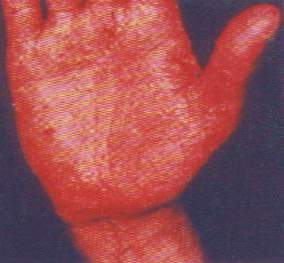
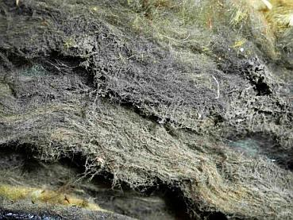
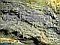
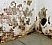
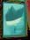
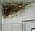

[🠔 Zur Übersicht: Stahlbeton](2beton.md)  
# Zement: Der schmutzige Mythos vom sauberen Baustoff
**Von der Chromat-Allergie zur Umweltbilanz: Hintergründe zu Zement als einem der gesundheitsschädlichsten Materialien und die unterschätzten Risiken der 'Maurer-Krätze'.**  
_von Konrad Fischer_

## Kritisches zu Stahlbeton und Zement 15

Inhaltsverzeichnis der Betonkapitel 

### Maurerkrätze-Ekzem als Folge von Zementverarbeitung.

 
Foto: Amt für Agrarstruktur, aus: 
_Bauhandwerk/Bausanierung 4/2000_ 
(Die Hand ist im "scharfen" Druckoriginal tatsächlich so rot und gelb bepustelt!)

Krätze kommt vom Kratzen! Hier erhalten Sie ein paar Hintergrundinformationen zu einem der dreckigsten und gesundheitsschädlichsten Baustoffe der Welt, die Ihnen die Zementindustrie gönnt - auf Kosten des Handwerks - und zwar die vorwiegend durch den giftigen Chromatanteil des Zements (nicht durch Krätzmilben / Sarcoptes scabiei!) hervorgerufene Maurer-Krätze (eine Chromat-Allergie im Unterschied zur Krätzmilben-induzierten ansteckenden Hautkrankheit Skabies / Acarodermatitis). 

  Wobei die Problematik des Zements gering gegen die Personengefährdung - das heißt also Mann, Frau und Kind, Opa, Oma, Onkel und Tante, Freund und Feind, Mieter und Vermieter - durch Wärmedämmung und nasse Häuser ist, und da trifft es eben nicht nur die Handwerker. Wenn Sie auch dazu mehr wissen wollen - 

hier bitteschön: 

 [ Wärmedämmung?](213baust.md) [ Feuchte/Salz?](2aufstfe.md) [ Heizung?](7temper.md) [ Fenster schwitzen?](23bausto.md) [ Schimmelpilz wuchert?](7schim.md) 

Doch nun zum krankmachenden Zement in Baustoffen. Dieser Zement steckt nun in unterschiedlichsten Zementsorten in allem Möglichen drin und kann auch unerwarteterweise in unter dem irreführenden Label "Kalk" angepriesenen Produkten drinstecken, wo ihn kein Kunde / Bauherr / Baulaie vermuten würde. 

Man bekommt ja sogar von renommiertester Herstellerquelle brilliant-edelsteinhaft benamst organisch verschnittenen "Mineralputz", der lt. Kleingedrucktem dann synthetisch erzeugte Methylcellulose / Methylzellulose und sogar Vinylacetat-Copolymerisate - "natürlich" als austrocknungsblockierende und die vom Kunden erwartete und gewünschte Feuchtepufferung eines echten Mineralputzes stark behindernde Plastik-Dispersionsbindemittel! - enthält. Man gönnt sich ja sonst nix. 

So gerissen ist die Zementmafia freilich schon lange, die ja auch durch ständige kundenschädigende Kartellabsprachen und Monopolaffären das schlechterdings Menschenmöglichste zur extremen Vernichtung ihres noch nie guten Rufes beiträgt. 

Die ges. gesch. Ökoindustrie hat sich offensichtlich von dort ihre Strategien eingeholt ... : 

[ 
Ökokrätze - eine weltweite Klimawandel-Seuche?](7argus.md)

Zement (Normzement gem. DIN EN 197-1 und DIN 1164) als Portlandzement (PZ, CEM I, feingemahlener Portlandzementklinker), Eisenportlandzement (EPZ, mit Beimischung von latent hydraulischem Hüttensand aus gemahlener Hochofenschlacke), Portland-Schiefer-Zement, Portland-Kalkstein-Zement, Portland-Kompositzement, Portland-Flugaschezement, Portland-Silicastaubzement, Portland-Puzzolanzement (CEM II), Hochofenzement (HOZ, CEM III, mit hohem Anteil Hüttensand), Puzzolanzement (CEM IV), Traßzement (TrZ, mit latent hydraulischem Traß anstelle Hüttensand), Antisulfatzement (HS-Zement, stabiler gegen Sulfatangriff/Gips mit der Gefahr von Ettringit-/Thaumasit-/Treibmineralbildung), Kompositzement (CEM V), Weißzement (ein besonders beliebtes Bindemittel zur Herstellung angeblicher reiner Kalkmörtel!), Blitzzement und Fixzement (Spezialbindemittel, nicht aus Portlandzementklinker) findet sich je nach Rezeptur in seiner für die Haut problematischen erst pulverigen, dann flüssigen (und zuletzt - für die Haut unproblematischen abgebunden festen / erstarrten) Form im Beton, Stahlbeton, Ortbeton, Fertigbeton, im Zementmörtel, Kalkzementmörtel, Hydraulischen Kalkmörtel / Hydraulkalkmörtel / NHL-Kalkmörtel, Traßmörtel, Traßzementmörtel, Traßkalkmörtel, Kalkmörtel PIc und PII (MG Ic und MGII), in hydraulisch abbindenden Vergußmassen, Bodenausgleichsmassen, Dichtungsschlämmen, Fliesenklebern, Fugenmörteln und allen Zementestrichsorten / Zementestrichen. 

Konrad Fischer: Fassaden energetisch richtig und kostensparend sanieren 1 

[Teil 2](http://www.youtube.com/watch?v=Y1NSxAW15Cc) [Teil 3](http://www.youtube.com/watch?v=RAT7VzBo8k0) [Teil 4](http://www.youtube.com/watch?v=6TBII25iVQk) [Teil 5](http://www.youtube.com/watch?v=Kb0C4KiZvVA) 

Und wenn man nun als Maurer oder Putzer und Hautallergiker Probleme mit dem Zement bis hin zum Kontaktekzem sowie weiteren chromatbedingten Hauterkrankungen bekommt und diese sicher vermeiden will, gäbe es neben den zementbasierten Alternativen wie chromatarmer Zement und Hautschutz bis zum Abwinken eben auch die offenbar unbekannte, aber historisch bewährte 

### [Bindemittel-Alternative für das Mörtelrezept: Reiner Hydratkalk (Luftkalk).](2prokalk.md)

ibau-Planungsinformationen 26.7.1999:

_**"Kombinierte Schutzmaßnahmen gegen Maurerkrätze**

Wiesbaden - Die Berufsgenossenschaften der Bauwirtschaft weisen darauf hin, daß die Maurerkrätze die häufigste Hauterkrankung am Bau ist. Besiegt werden kann sie nur durch die Kombination dreier Schutzmaßnahmen: Schutzhandschuhe, Hautschutz und den konsequenten Einsatz von chromatarmem Zement.

70 Millionen DM im Jahr müssen allein die Berufsgenossenschaften für Behandlung, Umschulung, Renten und Abfindungen aufgrund von Maurerkrätze aufwenden. Für den Unternehmer entstehen direkte Kosten durch Ausfall des Mitarbeiters und den gestörten Produktionsablauf. Hinzu kommen Lohnfortzahlung und Behandlungskosten bei den Krankenkassen sowie Rentenzahlungen durch Berufsunfähigkeit. Zusammengenommen schlägt die Maurerkrätze am Ende eines jeden Jahres volkswirtschaftlich mit einer dreistelligen Millionenhöhe zu Buche.

Die Maurerkrätze ist die häufigste Hauterkrankung am Bau. Sie wird durch den Chromatgehalt des Zements verursacht und durch die Alkalität des Frischmörtels bzw. -betons verstärkt. Maurerkrätze entsteht durch häufigen und intensiven Hautkontakt beim Verarbeiten von Zement. Da die Maurerkrätze eine allergische Erkrankung ist, kann sie auch nach dem Abheilen eines Ekzems wieder auftreten, wenn es erneut zu Hautkontakt mit Zement bzw. Frischmörtel kommt."

_ 

ibau-Planungsinformationen 17.3.1998: 

_"Verursacht wird die Maurerkrätze durch den Kontakt mit Zement. Zement ist im Verarbeitungszustand ausgesprochen alkalisch (pH-Werte über 13) und kann auf der ungeschützten Haut juckende und nässende Ekzeme, im Extremfall aber auch Verätzungen hervorrufen. Darüber hinaus reizen mechanische Einflüsse - etwa Sandkörner - die Haut noch zusätzlich und fördern so die Entstehung der Maurerkrätze.

Besonders schädlich sind aber die Chromate im Zement. Diese sind eigentlich nur Verunreinigungen, die keine technische Auswirkung auf das fertige Zementprodukt haben. Durch monatelangen oder gar jahrelangen Hautkontakt mit solchen wasserlöslichen Chromaten kann die unangenehmste und häufigste Form der Maurerkrätze entstehen, die Chromatallergie. Sie macht bis zu 90 Prozent aller zementbedingten Hautkrankheiten aus. Bei stark ausgeprägter Allergie ist der Erkrankte nicht selten gezwungen, seinen bisherigen Beruf aufzugeben."

**Chromatanteil muß gesenkt werden**

Bei den in Deutschland bisher produzierten Zementsorten ist der Gehalt an wasserlöslichen Chromaten oft sehr hoch. In manchen Fällen beträgt er bis zu 25 ppm (engl. parts per million, d.h. Teile pro Million). Einige in Deutschland verwendete Zemente aus Polen oder Tschechien weisen mit bis zu 40 ppm sogar noch höhere Chromatanteile auf. [...]"

_ 
Inzwischen gilt nach 17.01.2005 und Umsetzung der Richtlinie 76/769/EWG vom 18. Juni 2003, daß alle zementhaltigen Produkte chromatarm bzw. chromatreduziert sein müssen. Der Richtwert für den Chrom(VI)-Gehalt liegt bei maximal 2 ppm. Das heißt aber noch lange nicht "chromatfrei", wenn hier erst mal verschärfte Grenzwerte eingehalten werden. 

Wie die Praxis lehrt, ist aber nicht nur der Chrom(IV)-/Chromatanteil der Zementsorten für die Haut der Verarbeiter ein Problem - ebenso traurig ist ja der ungeschützte Umgang mit dem zementhaltigen Frischbeton bzw. Frischmörtel, da dieser nicht nur allergen, sondern eben aufgrund seiner hohen Alkalität auch ätzend ist und deswegen schwere Hautschäden durch Verätzung hervorrufen kann. Immer wieder kommt es zu schwersten Hautschädigungen bis hin zu Hauttransplantationen an verätzten Gliedmaßen bzw. Hautbereichen, die zu lange mit dem zementären Frischbeton/Frischmörtel in direkten Kontakt / Hautkontakt gerieten. Hier ein paar Links zur weiterführenden Gefahrstoffinfo: 

[GISBAU: Hauterkrankungen durch Zement](http://www.gisbau.de/BUCH/23_1.HTM) 
[Bauchemie Webverzeichnis - Chromate im Zement](http://www.baustoffchemie.de/db/chromate-im-zement/) 
[STERN: Allergisches Kontaktekzem - Was hat meine Haut berührt?](http://www.stern.de/allergie/erkrankungen/:Allergisches-Kontaktekzem-Was-Haut/584519.html) 

[3sat in "Die verpackte Republik" [Kritisch kommentierte Version]](https://www.youtube.com/playlist?list=PLsv5nPUU0m4WhiWCFT6OQoP1CxMoirnhX)

Eine andere Frage des Gesundheitsschutzes ist der Umgang mit Asbestzementschindeln (Eternit) im Zusammenhang mit der Sanierung bzw. sogar angeblich "energetischen" Sanierung von in die Jahre gekommenen Fassaden. Auch hier wird viel Schindluder getrieben, weil man die Sanierungsfähigkeit solcher Asbestzementsysteme völlig falsch einschätzt und die Vorschriftenlage - die sehr wohl das Sanieren gealterter und ansonsten intakter Asbestezementfassadenplatten gem. Asbestrichtlinie / TRGS 519 zuläßt (da Asbest fest gebunden!) - zum Nachteil des gelackmeierten Kunden zu Unrecht dramatisiert. 

Interessante Details rund um den Chromatgehalt des Zements können wir auch einem Interview entnehmen, das Bautenschutz+Bausanierung 2/2000, S. 6, vor der Umsetzung der Chromatrichtlinie mit Dr. Godehard Helmke, Diplom-Chemiker führte: 

_"[...]**B+B:** Wie viel gegen die Maurerkrätze können Bauchemie und Zementhersteller denn insgesamt branchenweit eigentlich erreichen - bislang erkrankten ja jährlich um die 400 Anwender. Zu dem persönlichen Leid kommen für die Betriebe Ausfallzeiten und für die Unfallversicherungen enorme Kosten._

**Helmke:** Wir können eine ganze Menge tun. Aber es bleibt dabei, dass chromatreduzierter Silozement in Deutschland praktisch nicht verfügbar ist, und jeder Mörtelformulierer seine eigenen Überlegungen zur Vermeidung des Chromatgehaltes anstellen muss. Wenn aber - und das erlaubt die Branchenregelung immer noch - weiterhin der Zement vielfach nur zu Mörtel "verdünnt" und nicht echt chromatreduziert wird, sehe ich nur wenig Änderung in der Erkrankungszahl voraus. Dann tritt womöglich nur beim Sackzement eine qualitative Änderung ein - und nicht auch bei den Trockenmörteln, die ja allesamt aus Silozement hergestellt werden und deren Einsatz immer noch zunimmt.

_**B+B:** Konkret: Glauben Sie, dass wir in fünf Jahren [...] eine Verschärfung des 2-ppm-Wertes erleben?_

**Helmke:** Davon gehe ich aus. Schließlich kann die Inkubationszeit bei Maurerkrätze bis zu 15 Jahre betragen. Je schwächer jede neue Chromat-"Dosis", desto besser also. Denn: Beim händischen Verarbeiten von zementären Produkten treten auch alkalische Hautreizungen auf. Dann können Chromate die Hand sowieso leichter angreifen."

Mein Kommentar: Wäre das Bauen ohne Zement, nicht auch eine Alternative für viele Fälle? Unzählige historische Altbauten zeigen, daß das auch mal ganz gut ging, sogar schön. Nun bietet die [Bauberufsgenossenschaft](http://www.bgbau.de) ihren gemeldeten Mitgliedern ja einigen Schutz bei den durch die Zementkrätze hervorgerufenen Berufskrankheiten. Doch warum nicht die exklusive [Verarbeitung von reinen Kalkprodukten](2kalk.md)? Nicht nur für den Mauerer oder Putzer wäre das besser, auch für viele Bauherren und die Umwelt. Denn Kalk läßt sich mit wesentlich weniger Energie herstellen, als Zement. Wegen der niedrigeren Brenntemperatur. 

Weiter: [16: Zement - ein unreiner Baustoff](2beton16.md)
