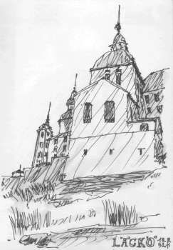
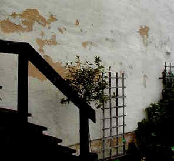
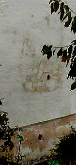
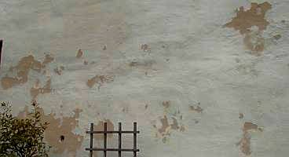
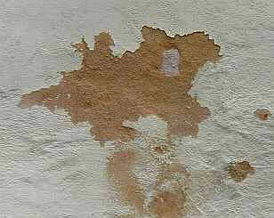

[🠔 Zur Übersicht: Kalk](26bausto.md)  
# Kalkputz und Mörtel am Baudenkmal
**Vortrag auf dem Internationalen Euro-Lime-Forum Mainz 1998: Kalkmörtel am Baudenkmal und Fallbeispiele aus Architektensicht.**  
_von Konrad Fischer_

## Luftkalkmörtel und -anstrich in der Praxis

## Internationales Euro-Lime-Forum Mainz 1.-3.5.1998 
Kalkputz und Mörtel am Baudenkmal. Fallbeispiele aus der Sicht des Architekten

(Und wer für die Unterbringung während der mehrtägigen Veranstaltung ein Hotel suchte, bekam von der Tagungsorganisation geholfen). 

Dipl.-Ing. Konrad Fischer, Architekt, Hochstadt am Main 

Vorabdruck ohne Abbildungen, leicht gekürzt und aktualisiert, aus: EURO _LIME_ Newsletter No. 3: 
_Kalkmörtel in der Denkmalpflege, Neue Ergebnisse in Forschung und Anwendung_ , Mainz 1999 

erschien 1999 bei: 
IFS Institut für Steinkonservierung e.V. 
Gemeinsame Einrichtung der staatl. Denkmalpflege Hessen, Rheinland-Pfalz, Saarland und Thüringen 
Große Langgasse 29, 55116 Mainz 

Kalk ist ein Lieblingsbaustoff der Denkmalpflege. Trotz der vielen Schäden mit modernen Baustoffen sind aber auch Kalkprodukte nicht unproblematisch. Mißerfolge beeinträchtigen deren Ansehen. Darf man Kalkprodukten überhaupt Vertrauen schenken, oder sind diese bestenfalls ausnahmsweise einzusetzen? Will der Architekt reine Kalkprodukte anwenden, ohne chemische oder hochhydraulische Zutaten, drohen ihm regelmäßig drei Gefahren: 

1. Der von der Industrie belehrte Handwerker meldet Bedenken. Die Gewährleistung für Baustellen-Kalkmörtel bzw. -tünchen wird abgelehnt, die "allgemein anerkannten Regeln der Bautechnik" scheinen verletzt. Ergebnis: Der Bauherr und der Architekt geben auf - technisch minderwertige zement- bzw. kunststoffhaltige Industrieprodukte bzw. zumindest latent hydraulische/niedrig hydraulische Bindemittelrezepturen mit oft schweren Nachteilen für den Bestand und die Haltbarkeit werden ersatzweise angewendet. 

2. Der Handwerker tauscht die geforderten reinen Kalkprodukte gegen verschnittene und besser maschinengängige industrielle Ersatzprodukte aus. Die Verwendung des Begriffs "Kalk-" erleichtert dabei traß-, zement-, hüttensand- oder kunststoffhaltigen Produkten, die den Mörtel im krassen Unterschied zum reinen hydratischen Kalkprodukt mit vielerlei Schadsalz-Alkalien, hohen Sulfatbestandteilen, Überhärten, überhöhter Wasserrückhaltung und schlechterer Austrocknung, Kapillartrocknungs-Blockade und überhöhter Temperaturdehnung belasten und befrachten den Zugang zum Denkmalmarkt. Der mutigere Handwerker jedoch gibt bei Baustellenmischungen dem Kalkmörtel das berühmte Schäufelchen Zement, der Kalktünche den "Spritzer" Kunststoffbinder dazu. Gibt es Schäden, dann ist dennoch der Architekt schuld (zumindest in seiner gesamtschuldnerischen Haftung), der ja keine "üblichen" Industriebaustoffe der einschlägig bekannten Werktrockenmörtel-Hersteller wollte. 

3. Das angewendete Rezept funktioniert nicht. Früher übliche Vergütungszusätze werden nicht mehr sachgerecht verwendet. Manche Experimentalmörtel der Denkmalpflegeämter und ihrer Beratungsinstitutionen kann man mit dem Finger aus dem Burgmauerwerk wieder herauskratzen. 

Dagegen lassen die zementären Injektions- und Verfugungsmörtel, mit denen nach 1990 eine Unmenge von historischen Bauwerken besonders in Thüringen unter den Augen und mit Fördermitteln der materialtechnisch und von den sonstig gebotenen "Verlockungen" offensichtlich überforderten Denkmalpflege "saniert" wurden, diesen inzwischen zusammenbrechen. Ihr Bauzustand ist oft wesentlich schlimmer, als vor der Sanierung mit "modernen" Methoden und Werktrockenmörteln der renommierten Hersteller. 

Grund: Die Bausubstanz besteht aus gipshaltigen Steinen, aus gipshaltigen Mörteln. Und diese reagieren bei ausreichender Feuchte - wirklich kein Problem bei Naßmörtelanwendungen! - durch Treibmineralbildung. Ettringit und Thaumasit (Zementbazillus) - aluminathaltige Treibmineralien, die durch Kristallwasseranlagerung ungeheueres Volumenwachstum mit entsprechenden Sprengkräften im Mauerwerk entfalten sind die logische Folge solcher "Handwerkskunst". Wie wenig die gesamte Denkmal-, Restaurierungs- und Sanierungsbranche sich um die Fortbildung kümmert, kann dabei nur Kopfschütteln auslösen. Immerhin sind genau solche Schäden schon Jahrzehnte vorher von der niedersächsischen Denkmalpflege (Baudirektor Werner) umfangreich publiziert worden. Der Fassadeneinsturz der Johanneskirche Lüneburg war damals in aller Munde, jetzt das Nordthüringer Schloß Wiehe im Kyffhäuserkreis und die Runneburg. Hat auch hier Gier das Hirn aufgefressen? 

Da nahezu alle historischen Bauwerke ausweislich der Mörtelanalysen für zementäre Mörtelsysteme problematische sulfathaltige Beimengungen oder Reaktionsprodukte aufweisen, verbietet sich der besinnungslose Zementeinsatz, wie er zu nahezu 100 Prozent auf Denkmalbaustellen weltweit und auch vom denkmalnahen Institut für Steinkonservierung IFS und seinen empfohlenen industriellen Helfershelfern (jeder kennt die Namen) praktiziert wird, eigentlich von selbst. 

Die Untersuchung des Fraunhoferinstitutes Holzkirchen "Kalkputz in der Denkmalpflege" dokumentiert dagegen spektakuläre Schäden der von der Restaurierungswerkstatt des Bayer. Denkmalamtes beratenen Kalkputze. Ergebnis: "daß die Anwendung reiner Luftkalkputze ohne Zusatzmittel in der Praxis nicht vertretbar ist, da mit zu großen Schadensrisiken verbunden"[1]. (Dieser Bericht wird vom Bundesverband der Deutschen Mörtelindustrie bezeichnenderweise als Sonderdruck kostenlos unter der deutschen Architektenschaft verbreitet, wohl als Werbemittel gegen die wesentlich preisgünstigeren und technisch oft wesentlich besseren Baustellenmischungen.) 

Warum diese Unsicherheit, warum die Schäden? 

Hochglanzbeworbenen Fertigprodukte gaukeln dem Handwerker Sicherheit, geschwinde Verarbeitbarkeit und damit hoher Gewinn vor. Auf Anwendungs- und Gesundheitsrisiken, Volldeklaration und Risikobeschreibung, die Verträglichkeit mit dem Bestand und die Praxistauglichkeit auf Dauer wird dabei kaum eingegangen. Das Handwerkervertrauen zum "Systemlieferanten" raubt ihm seine baumeisterlichen Grundlagen, die Abhängigkeit von konfektionierten Baustoffen das Materialverständnis. Schnelle Verarbeitbarkeit ist nun wichtiger als dauerhafte Objekteignung. 

Doch wie sieht es bei uns Architekten aus? 

Unsere Ausbildung und die tägliche Produktpropaganda haben das Baustoffverständnis kaum erweitert. Denkmalpflege und -forschung bieten uns eher kunst- und baugeschichtliche Einblicke, Inventarisationssystematik und Forderungskataloge jenseits der technischen und wirtschaftlichen Rahmenbedingungen als für das Bauwerk und den Bauherrn praktisch umsetzbares Fachwissen. Hygroskopisch und kondensatbedingt anlagernde Sockelfeuchte mißdeutet der Architekt somit weiter als ["aufsteigende" Feuchte](2aufstfe.md), die es im Mauerwerk gar nicht geben kann, für den Holzschutz fordert er weiter Gift anstelle [giftfreier Präparate](2hsm.md), die auch energetisch unübertreffbare Massivbauweise schädigt oder ersetzt er durch [funktional unwirksame und zwangsläufig durch Betauung absaufende Wärmedämmung](7fehrtab.md) (der k-Wert/U-Wert gilt nur im Labor [2], zum Heizenergieverbrauch steht er in keinem mathematischen Verhältnis [3]), statt auf bewährte Baustoffe setzt er auf ständig neu rezeptierte Bauchemie- und Zementprodukte. Die von den "Pharmareferenten" respektive Industrie-Sanierberatern der Bauchemie und Baustoffindustrie umsonst und geschenkbestückt angelieferten Sanierplanungen von der Bestandsaufnahme über die Kostenschätzung bis zum ausgearbeiteten Leistungsverzeichnis nimmt er dankbar an und verkauft sie gewissenlos und gleichermaßen HOAI- wie VOB-widrig an seine Bauherrn weiter - leicht, aber meist erst zu spät erkennbar am Produktnamen / der Produktbezeichnung, tückisch getarnt mit "oder gleichwertig" im Leistungsverzeichnis. 

**Tipp: Vor Auftragsvergabe prüfende Einsichtnahme in Referenz-Leistungsverzeichnisse für Fassade, Ausbau und Haustechnik**

Auf ihm theoretisch erscheinende Forderungen der Denkmalpflege reagiert er solange mit Unverständnis, bis es dafür Honorar und Haftungseinschränkung gibt. 

Und die Denkmalpflege? 

Immer neue Rezepturvarianten erscheinen am Baudenkmal. Kunstharze, Silikone und Silikate, alkalireiche Traßmehle und hochhydraulische "Kalke", beide oft zementär "vergütet", werden zum Denkmalbaustoff - wie sich an den erwähneten Ettringitschäden nicht zum ersten Mal erwiesen hat. Der Denkmalpflege zuarbeitende Mineralogen liefern Baustoffkompositionen, die zwar gewisse, aber nicht alle guten Eigenschaften des historischen Vorbilds nachahmen können. Regionaltypische Rezepte aus der Chemieküche beanspruchen plötzlich ausschließliche Geltung und werden in Verbindung mit wohlklingenden "Fachgutachten" zur Marktblockade gegen fremde Handwerker ausgenutzt (z.B. geschäumte Zementmörtel und Kunststoff-Steinersatzmörtel im für derlei Strategien offenbar besonders anfälligen Thüringen). 

Die Fehlversuche des Denkmalexperiments werden dann nicht dem falschen Rezept zugeordnet, sondern dem Baustoff Kalk und/oder dem Verarbeiter. Das erklärt die Kalkangst des Handwerkers viel mehr, als alle Gegenpropaganda der Industrie. Der Schaden am Kalk, der durch wiederholte Veröffentlichung eines solchen Versagensfalles am "reinen Kalkputz in "historischer" Rezeptur nach Angabe der dort zuständigen Denkmalbehörde" [4] am BMFT - Projekt in Schloß Lustheim, Bayern hervorgerufen wurde, ist entsprechend hoch einzuschätzen (vgl. hierzu auch [1]). 

Nach den Fehlschlägen am Denkmal und den Salzhysterie-Gutachten mit ihren oft grotesken Saniervorschlägen ([Sanierputz](2sanipuz.md), der auch nach Herstellerwissen weder entfeuchten noch entsalzen kann und fallweise die Treibmineralbildung begünstigt! [11]) und Schadensanalysen ([Aufsteigende Feuchte](2aufstfe.md)!) ist ein reiner Kalkmörtel und -anstrich im Altbau mit vorbelasteten Untergründen ein vorprogrammierter Reinfall. Die simplen "Entlastungstechnologien" zur Entsalzung schadsalzbefrachteter Untergründe werden fallweise zugunsten hochpreisiger Wahnsinnstrockenlegungen konsequent verheimlicht bzw. bleiben dem betroffenen Bauherren unbekannt. So ist es nur logisch, daß auch die Denkmalwissenschaft und -praxis in Deutschland vorwiegend mit mehr oder weniger schadsalzverseuchten hydraulischen und synthetischen Zutaten experimentiert, sei es Ries- oder Eifeltraß, hydraulischer (NHL) oder hochhydraulischer (Romankalk) Kalk. Letztlich schreckt man auch vor wohldosierten Zementbeigaben nicht zurück. Rezept vom mindestens doktorierten "Experten". Die Verzweiflung ist also groß. 

Doch es gibt auch andere Erfahrungen. 

Haben wir nicht überraschend viele "unter Verwendung von natürlichen Zusatzmitteln" hergestellte Luftkalkmörtel als "dauerhafte Hochleistungsputze" [5], die jahrhundertelang funktionieren - dank einer ausgewogenen Sieblinie, bester Porenbildung und perfekter Verarbeitung hinsichtlich der Jahreszeit und technischen Behandlung? Sei es an Kirch- und Burgtürmen, an hohen Schloß und Klosterfassaden, an belasteten Erdgeschossen, im Mauerwerk vieler altehrwürdiger Sakral- und Profanbauten. Leider gelangen diese "historischen" Erfolgsfälle kaum in die breite Bauöffentlichkeit. 

Allerdings verlieren wir derartig bewährte Putzflächen, wenn Anstrichsysteme mit hochfesten bzw. verdichtenden Silikat- und Kunstharzbindemitteln die traditionellen Kalktünchen ersetzen. So zerstört der Maler / Restaurator / Kirchenmaler oft wertvolle Altputzflächen und begünstigt damit deren Abschlagen und Ersatz durch Neuputz [6, 7]. 

Die bauphysikalische Zahlenmystik der Industrieprodukte betreffend z.B. Kapillarität, Abdichtung und Festigkeit hat mit der Wirklichkeit am Bau wenig zu tun. Laborwerte können in der Praxis wesentlich schlechter sein (Diffusionswiderstandswerte bei Kalk-Zementputz bis ca. 50-fach, bei Silikatfarbe bis ca. 100-fach [8], Druckfestigkeitswerte bis ca. 5-fach, jeweils über Laborwert). Im Schadensfall war es dann aber ein Verarbeitungsfehler des Handwerkers, meist verbunden mit einem Planungs- bzw. Aufsichtsfehler des Architekten. 

Die genannten Werte für die Dampfdiffusion haben mit dem Verhalten des Baustoffs gegenüber eingedrungenem Wasser bzw. Kondensat in flüssiger Form - der Regelfall! - sowieso nichts zu tun. Abweisen nach außen heißt auch Einsperren nach innen. Folge: Feuchteanreicherung im Bauwerk mit entsprechenden konstruktiven und gesundheitlichen Folgen. Der nach DIN für manche Farbsysteme erlaubte 5%-ige Dispersionszusatz entspricht ca. 10-15% bei der üblichen Verwendung von Hochkonzentraten. Das vereint hohe Wasserabweisung mit schädlicher Sperrwirkung. Die mit Kunststoffdispersion vergüteten Farben neigen zu Staubanlagerung und Algenbewuchs. Sie verspröden zu Farbschichtinseln zwischen Netzrissen (Craquelee), durch die Feuchte kapillar eingesaugt und nachfolgend geradezu eingesperrt wird. Nachfolgend abdichtende Reparaturanstriche verstärken dann die Putzzerstörung. 

Auch "Sanierputze" funktionieren nicht ganz so, wie gehofft: "Die Luftporen werden nicht mit Salz ausgefüllt" [9], da die Schadsalzlösung in hydrophobierte Poren nicht einwandern und auskristallisieren kann. Ihr hoher hydraulische Bindemittelanteil erzeugt bei mißlungener Luftporenbildung nicht selten "Putze" in Betonqualität. 

Demgegenüber bieten handwerksgerechte Kalkmörtel und -anstriche technische Vorteile: Sie sind im Vergleich zu kunststoff- und zementhaltigen Produkten störungstolerant, sperren eindringendes Wasser nicht ein, sondern geben es schnell wieder ab. Bei nach außen abnehmender Körnung und Porigkeit des Putzaufbaus (wichtige Funktion Schweißputz / Anstrich!) wird der Feuchteübergang nach innen beschränkt: Von Kleinporen in Großporen ist Kapillartransport so gut wie unmöglich, er funtioniert nur in umgekehrter Richtung. Damit ähnelt der Putz funktional einem Dachziegel, der im Porengefüge aufnehmbare Feuchte als Dichtungsmittel benutzt und weitere Feuchte abperlen läßt. Schadsalzbelastete Untergründe werden durch Kalkmörtel andererseits nicht abgesperrt. Der Salzanreicherung bzw. -umlagerung im Bestand (bei Sanierputz nicht ausschließbar) wirkt ihre nach außen kapillaroffene Porenstruktur entgegen. Auch bestandsschädigende Überfestigkeit ist bei ihnen ausgeschlossen. Notfalls "opfern" sie sich für den belasteten Bestand. Zwei Voraussetzungen sind dafür aber zu berücksichtigen: 

1. Ein mit dem Kalk vertrauter Handwerker, der mit gebotener Sorgfalt von der Untergrundvorbereitung bis zum Endanstrich seine Regeln einhält, und 

2. Ein Baustoffrezept, das die Kombination Zuschlag, Bindemittel und Vergütungszusätze im Sinn der historisch bewährten Kalk-Hochleistungsprodukte berücksichtigt und objektgerecht einsetzt. 

In diesem Sinne versuche ich in meinem Büro seit 1979 traditionelle Kalkprodukte an Baudenkmalen, aber auch Neubauten einzusetzen. Dabei kommt mir auch die Erfahrung meines handwerksverbundenen Vaters, dessen seit 1958 auf Denkmalpflege und Sakralbau spezialisiertes Architekturbüro ich damals übernahm, und eines zweijährigen Volontariats am Bayer. Landesamt für Denkmalpflege von 1982-84 zugute. Nicht zu vergessen sind auch intensive Kontakte in die Labors der Baustoffindustrie und zu Restauratoren und Kirchenmalern. Aus über 350 Denkmalinstandsetzungen seit 1979 folgen einige Beispiele zum Kalkeinsatz. 

Beispiel 1: Ein barockes Fachwerkhaus in Eggenbach, Oberfranken 

Dieses Haus stand 25 Jahre leer, es wurde von 1985-89 instandgesetzt. (Bild 1, 2) Alle vorhandenen Lehmgefacheputze innen und außen wurden erhalten: Innen unter baustellengemischten Rohrmatten-Luftkalkputzen (Bild 3) oder mit Beiputzung der Fehlstellen mit Kalkglätte, außen - ebenfalls nach Beiputzung kleinerer Fehlstellen bzw. Ergänzung fehlender Gefachputze im Ganzen - unter einer mit je 1% Quark und Leinöl vergüteten Kalktünche. Das Anheben des gesamten Hauses um 50cm zum Austausch der Fußschwellen überstanden die Altputzfragmente schadlos. Wir schützten sie unter einer Kaschierung aus Japanpapier bis zur abschließenden Restaurierung (Bild 4). Die Fachwerkhözer wurden zunächst mit Kalkkaseinfarbe nach Malerrezept gestrichen und erhielten - nach einigen trocknungsbedingten Farbabplatzungen - einen Schlußanstrich aus Leinölfarbe. Diese erhaltende Instandsetzung bietet wirtschaftliche Vorteile, die geschätzten Kosten wurden hier um 200.000.-DM unterschritten. 

Beispiel 2: Ein ehem. Gerichtsgebäude in Weißenfels, Sachsen-Anhalt 

Auch hier waren Rohrmattenputze über den Altputzflächen vorgesehen. Leider tauschte die Restaurierungsfirma den geforderten groben Kalkmörtel (Unterputz 0-8, Oberputz 0-4 mm) heimlich gegen maschinengängigen, mit hochhydraulischem Roman-"Kalk" verschnittenen feinkörnigen Fertigputz (0-0,8mm) aus. Zunächst ein Kostenvorteil - im Ergebnis katastrophal: Nach den Malerarbeiten entstanden "Spätrisse" (Bild 5). Die Putzfestigkeit stieg durch die Baustellenverhältnisse (geringe Temperatur, hohe Luft- und Untergrundfeuchte) weit über den Laborwert mit 4,5N/mm2 hinaus bis etwa 14 N/mm2. Die Verfestigung erfolgte schichtenweise nach innen zu den noch kaum karbonatisierten Bereichen (Bild 6). Bei Reparaturversuchen geschlossene Risse öffneten sich folglich immer wieder - über viele Monate. Für über 100.000.-DM mußten letztlich die meisten Rohrmattenputze mit weicheren Mörteln erneuert werden - ein Schaden, den zwar der Handwerker tragen mußte, der aber auch an mir nicht spurlos vorüberging, sondern meine Baustoffneugier dramatisch verstärkte. Leider darf man sich auch bei allerbestens beleumundeten und von der einfältig-arglosen Denkmalpflege sogar wärmstens empfohlenen Restauratoren im Putz- und Malerhandwerk sowie insbesondere auch bei den Steinrestauratoren / in der Steinrestaurierung nicht nur durch gewüöhnlichste "Sorgfalt" immer wieder mal "überraschen" lassen. Bei letzteren nicht nur durch Abrechnungstricks im Umfeld der Steinfestigung "auf Nachweis", sondern auch beim Produktaustausch bzw. der Produktfälschung. Man muß als kontrollierender Bauleiter also dazu übergehen, entweder alle einzusetzenden Baustoffe im Namen des Bauherren selbst zu ordern oder deren Bestellung durch Beteiligung des Stofflieferanten strengstens gegenzukontrollieren. Der Zement- und Plastikpfuscherei sowie der Materialpanscherei scheinen gerade in der Denkmalpflege und auch an hochwertigsten Baudenkmälern keine Grenze gesetzt zu sein - so jedenfalls meine langjährige und grausame Erfahrung in dieser offenbar von der Wurzel her verrotteten Branche. Ausnahmen bestätigen die Regel. 

Beispiel 3: Die Gartenmauer des Klosters Waldsassen, Oberpfalz 

Schon nach kurzer Zeit zeigte sich die Untauglichkeit des hier vor meiner Zuständigkeit verwendeten schadsalzreichen "Denkmalpflege"-Kalk-Traßmörtels (Bild 7). Auch die versuchsweise angebrachten Industrie- und Sanierputze hielten der Belastung nicht stand, platzten und rissen an Bauteilkanten ab oder lösten sich wegen zu großer Festigkeit bzw. Salzkorrosion / Ettringitbildung gleich schalenweise vom geringerfesten Untergrund (Bild 8). Dieser Versagensfall wurde dennoch als uneingeschränkt gelungene Saniervariante im Hinblick auf wirksame Putzhydrophobierung veröffentlicht [10]. 

Beispiel 4: Die Fassaden des Klosters Waldsassen 

Die Lehren aus den vorigen Beispielen sollten dem Barockkloster zugutekommen. Problem: Der Zerstörungsgrad der dreigeschossig reich gestalteten Fassade. Sie hatte unter den zuletzt verwendeten reinen Silikatfarbenanstrichen eines mehr als renommierten Herstellers und üblicher Witterungsbelastung schwer gelitten. Große Bereiche der Altputzschichten lagen hohl, vom Wasserglas durchdrungen scherten sie wegen nun erhöhter Festigkeit und Dichtheit ab (Bild 9). Die obersten Putz- und Farbschichten waren oft netzförmig craqueliert. Eine mit pottaschenabspaltendem Wasserglas verhärtete, hygroskopisch belastete und verdichtete Farb- und Mörtelschicht reagiert auf Temperatur- und Feuchtebelastung über weicherem Untergrund immer gleich: Sie reißt schollenartig ab. Ende einer Wasserglasbehandlung (Bild 10). 

Die Bestandsaufnahme bis zum Putzgrund offenbarte teils schadsalzbelastetes Ziegelmauerwerk, durchsetzt mit verschiedenen Natursteinen, Ausgleichsschichten aus Lehmputz, armdicke und durchgehende Baurisse und erhaltenswerte Originalputzlagen - teils durch Holzkohlenstaub graugefärbt und mit Caput-mortuum-Pigment lasiert (Granit-Imitation) oder freskal in Grau- und Weißtönen gestrichen. 

Neuputzmuster für die Ergänzung des erhaltenswerten Restbestands wurden geprüft auf Verarbeitbarkeit (Anmachen, Transport, Anwerfen, Abbindung, Nachbearbeitung für die erforderlichen, teils aufwendigen Gestaltungen, Nachrezeptierbarkeit mit unterschiedlichen Körnungen und Dachshaaren für einen handwerklich richtigen Putzaufbau vom tiefen Riss bis zum Oberputz), Festigkeitsentwicklung, Elastizität und erzielbare Oberflächentextur - technische und gestalterische Kriterien (Bild 11). Dabei setzte sich eine für uns und den beteiligten Restaurator des Denkmalamtes neuartige Baustellenmischung gegen Industrie- und sonstige Baustellenmischungen durch: Aus örtlichen Sanden, frischem Löschkalk und mit 1‰ eines patentierten Zusatzmittels entstand auf Vorschlag des beauftragten Kirchenmalers ein reiner Luftkalkmörtel. Er wurde bis in die winterliche Frostperiode hinein verarbeitet. Gestrichen wurde in Freskotechnik eine mit natürlichen Zutaten (Öl, Kasein u. a.) vergütete Kalkfarbe nach Rezept des Kirchenmalers. Heute, nach drei Wintern Standzeit, zeigt sich die unter strengen Witterungsbedingungen belastete Fassade noch in bester Verfassung (Bild 12, 13). 

Auch ein Verpreßmörtel (Bild 15) auf Luftkalkbasis wurde erfolgreich eingesetzt. Die bisher übliche Altbauverseuchung mit zementären, traßhaltigen, alkalien-, wasser- und feinteilreichen Suspensionen kann nun auf die reine Anker-/Nadeleinbindung beschränkt werden. In einem vorausgehenden Verfüllvorgang wird das in Zusammensetzung und Körnung zum Altmörtel kompatible Kalkprodukt eingesetzt. Es kann durch die Entwicklung der kalktypischen Adhäsionsfestigkeit und gefördert durch die Zugabe geeigneter Zusätze (Zucker, kieselsäurehaltige Stoffe, Mineralpulver) auch unter Luftabschluß aushärten. 

Als Anstrich setzen wir eine Kalktünche ein, die sowohl unter dem Aspekt der Haltbarkeit, Wasserabweisung und -aufnahmefähigkeit, CO2-Durchlässigkeit, Topfstabilität, Verarbeitbarkeit, Ergiebigkeit und Gestaltung bei richtiger Verarbeitung - immer wieder leider ein Problem des nicht mehr an Kalk gewöhnten Handwerks - gute Praxisergebnisse liefert. Ohne Kunststoff. 

Unser [Raumbuchsystem für die Bestandsaufnahme](11rabus.md) und das [Positionsbausteinsystem für die Ausschreibung](9pbs.md) erleichtern die nachtragssichere Vergabe auch der Putz-, Stuck- und Malerarbeiten. Die Bieter werden vollständig und eindeutig zum Bestand, dem Ziel der Leistung und dem geforderten Leistungsumfang informiert - Ergebnis einer maßnahmenbezogenen Bestandsaufnahme. Unqualifizierte Bieter werden durch die ausgefeilte und kaum fette Nachträge verheißende Leistungsbeschreibung eher abgeschreckt und geben kein Angebot ab. Dadurch erhalten nur erfahrene Handwerker den Auftrag, nur ihnen gelingt die wirtschaftlichste Preisbildung. Das sind die Voraussetzungen für denkmalgerechtes, aber gleichwohl kostengünstiges Bauen. Ohne rechtsmißbräuchliche Regionalisierung des Wettbewerbs. Für die Baustoffe rund um Mörtel, Putz und Anstrich fordern wir grundsätzlich die Volldeklaration der Inhaltsstoffe und den Verzicht auf synthetische und hydraulische Zutaten. Ob das dann ein Baustellenmörtel oder ein Werktrockenmörtel ist, spielt keine Rolle. Haben sich Produktrezepturen bei vorhergehenden Bemusterungen als tauglich erwiesen, lassen wir dennoch den Austausch gegen nachweisbar gleichwertige entsprechende Baustoffe zu, um den Wettbewerb anzufeuern und um Einseitigkeiten zu vermeiden. 

Die manchmal erhobene Forderung nach regionaler Materialbasis für Denkmalbaustoffe scheitert oft am fehlenden Rezeptwissen mit Haftungsbereitschaft sowie der Finanzierung für dafür zusätzlich anfallende Architektenleistung. Die EU-Vergabebedingungen behindern ebenfalls lokale Spitzfindigkeiten, wenn man sie nicht (Thüringen: z.T. Ausschluß Nichtthüringer Firmen von der Auftragsvergabe am Denkmal) - vielleicht sogar rechtsmißbräuchlich - erzwingt. An vielen unserer Projekte arbeiten nach öffentlicher Ausschreibung Firmen, die über keine eigenen Baustoffrezepte verfügen. Von Herstellerseite kontrollierte Produkte vereinfachen dann die Bauleitung und Gewährleistung - ein Stück Überlebensstrategie am Denkmal. 

Vorgefertigte Baustoffe haben in der Denkmalpflege allerdings nur mit Volldeklaration ihre Berechtigung. Sie bieten dem Bauherrn, dem Handwerker und vor allem dem Bauwerk wirtschaftliche und technische Alternativen zu den Möglichkeiten der modernen Bauchemie und Experimentaldenkmalpflege. Interessierte Handwerker können im Idealfall durch den Produkthersteller im Umgang mit Kalkprodukten eingewiesen und benötigen dennoch scharfe Überwachung und Dauerkontrolle. Das beugt Ausführungsfehlern und Materialmanipulationen besser vor, als die sich allzuoft einschleichende Vertrauensseligkeit. Selbst von renommiertesten Restaurierungsfirmen werden ja genug gefälschte "Billigmischungen" in Originalgebinden auf die Kalkbaustelle geschleppt. Auch die undeklarierte Unterjubelung von unerwarteten, wasserrückhaltenden und ausblühanfälligen Hydraulbindemitteln - man denke nur an den alkalienreichen Hüttensand in "absolut zementfreien" Muschelkalkmörteln oder "frostsicheren Luftkalkmörteln" - gehört in der Sanierungsbranche zum Alltag. Für uns Architekten in unserer allumfassenden gesamtschuldnerischen Haftung ein oft schwer zu überblickender Risikobereich. 

Ein abschließender Tipp: Die gerade bei Kalkarbeiten am Baudenkmal immer möglichen Überraschungen lassen sich mit einem Wartungsvertrag etwas eingrenzen. 

Bildverzeichnis 
1 -15 

Literaturangaben 
[1] H. Künzel, G. Riedl: Werk-Trockenmörtel, Kalkputze in der Denkmalpflege, in: Bautenschutz u. Bausanierung 2/96, auch: Sonderdruck für Bundesverband der Deutschen Mörtelindustrie e.V., Duisburg. 
[2] DIN 4108 Teil 7 Nr. 5 
[3] H. Menkhoff, G. Achterberg, K. Bade u.a.:Realisierung des Wettbewerbs Therma, Schriftenreihe "Wettbewerbe" des Bundesministers für Raumordnung, Bauwesen und Städtebau 05.007, Bonn 1983 
[4] C. Arendt: Praxisvergleich von Sanierputzen-Untersuchungsteilergebnisse aus dem BMFT-Forschungsprojekt "Diagnose und Therapie überhöhter Feuchte-/Salzbelastung in historischen Mauerwerkskomplexen; in: Hrsg. H. Kollmann: Sanierputzsysteme, WTA-Schriftenreihe Heft 7, Aedificatio-Verlag, Freiburg und Unterengstringen 1995 
[5] F. Wittmann in: [4], a.a.O. 
[6] J. Osswald: Wasser geht - Gel kommt, Neue Erkenntnisse über die Abbindereaktionen in Silikatfarben, in: Bautenschutz und Bausanierung 3/98 
[7] H.G. Meier: Beschichtungsschäden auf verputzten Flächen, in: Bausubstanz 4/98 
[8] G. Koch: Sanierung historischer Bausubstanz, in: Der Stukkateur 3/1988 
[9] P. Kaiser, D. Heling: Salztransport in Standard-Sanierputzen, in: [4], a.a.O. 
[10] K. Droll, H.G. Meier: Querschnittshydrophobierung von Sanierputzen - Langzeiterfahrungen, Teil 2, in: Bautenschutz und Bausanierung 4/96. 
[11] Hrsg. Prof. Dr. Helmut Weber, Autor: Hermann Gustav Meier: Sanierputze: Ein wichtiger Bestandteil der Bauwerksinstandsetzung, Renningen-Malsheim 1999 

RILEM-Workshop University of Paisley, Scotland 
12.-15. Mai 1999 
"Characterisation of old mortars with respect to their repair" 
Dipl.-Ing. Konrad Fischer: [Traditional craftsmanship in modern mortars - does it work in practice?](2rilem.md)

---

# 🇨🇭 EUROLIME-Meeting 2005 - Ballenberg

Mitschrift der Tagung von [Konrad Fischer](1refernz.md) _(mit Kommentar KF)_ 
Link zu [Fotoexkursion durch Freilichtmuseum Ballenberg](8balberg.md) 

4. Eurolime Treffen, Ballenberg Schweiz, 4. – 6- August 2005 
92 Teilnehmer aus 9 Ländern 

1. Konrad Zehnder, Einführung 
Kalk ist widerspenstig und überraschend. „Den“ Kalkmörtel gibt es gar nicht. 

2. Christine Bläuer – Böhm 
Kalk kann unter [organosilikatischen Anstrichen](22bau4.md) gar nicht abbinden _(KF: was die industrieregierten Experten offenbar nicht wissen oder nicht wissen wollen)_! 500 Jahre bewitterte Kalkputzflächen beobachtbar. 

3. Edwin Huwyler: [Ballenberg – Museum](http://www.ballenberg.ch) im Unterschied zu Deutschland hat Objekte nicht „gem. Konzept“ gesucht und entsprechende Abbrüche – oft gegen Denkmalpflege – organisiert, sondern nur angebotene Objekte aufgenommen (pro Jahr ca. 30 Angebote). Objekte kommen von 1/3 Schlitzohren, die Schutzabjekte so abbrechen wollen, 1/3 kommen nicht in Frage, ca. 30 Objekte werden geprüft. Heute kommen fast alle Objekte durch Denkmalpflege-Vermittlung. Baudoku wird extern vergeben _(KF: entspricht aber nicht dem Mader-Standard der Bauforschung)_. Bei Objektübernahme wird Objektausschuß gebildet: Wissenschaft, Denkmalpflege, Haus-/Bauernhausforschung, Museum. _(KF: Objekt- und Exponatkorrosion durch Feuchteaufnahme und Temperaturschwankungen sowie Abhilfe durch bestandsgerechte[Hüllflächentemperierung](7temper.md) (noch?!) kein Thema)_. Finanzierung: 7% öffentl. Zuschüsse, Rest muß aus eigenen Einnahmen erwirtschaftet werden. Träger ist eine Stiftung. Jedes Jahr ein „Jahresthema“, auf das Kurse ausgerichtet werden. 

4. Walter Trauffer: Vom Kalkstein zum Mörtel (Kalkbrennen) 
Warum Kalk selbst brennen? Externer Kalk vom Markt sehr teuer _(KF: und selber brennen??)_ , Qualität oft dubios (Aussage wird auf Nachfrage abgeschwächt), großer Bedarf, Technik paßt ins Museumskonzept, Ballenberg liegt im Kalkgebiet. Zementbrand mit Verklinkerung ~ 1450°C, Hydraulkalk ~ 1200°C, Luftkalk ~ 1000°C. 

Brennarten: 
Kalkmeiler – nur ein Brand möglich 
Schachtofen – Mehrfachbrand möglich 
Feldofen – Mehrfachbrand möglich 
Qualitätstest für Proben 
- Gewichtsverlust (~38-42%) 
- Reaktionszeit (200g Wasser auf 60°C erhitzt) – große Unterschiede 
Einbau der Steine in Ofen ist große Kunst. 
Steingröße 15-25 cm. Flache Steine nicht legen, (Wärmestau), sondern stellen 
- Aufheizen 8-12 Std. 
- Abdecken 
- Feuern 3-5 Tage 
Kriterien des fertigen Brandes: 
- Glühen 
- Dumpfer Ton, gräuliche Verfärbung, grüner Niederschlag auf Ziegel, Regenbogenglasur 
- Schließen der Einfeuerung und Abkühlen 
Abdeckung: 1. Strohauflage, 2. Lehmaufguß 3 cm, 3. Luftlöcher stoßen, 4. Mit Ziegelstein Löcher schließen. 
Löschen 
-1. Wässern, 2. Rühren, 3. Mischen, 4. Sieben, 5. Einsumpfen, 6. Konservieren (luftdicht). 
Alles von Hand! 
Kalkgrube 
Aus Beton (früher Lehm), 3 Kammern 
Schichten von oben in Grube - 1: reines CaOH (für Pigment, Tünche), 2: recht gut buttrig (für Mörtel, Tünche) 3: noch ungelöschte Teile (nur für Mörtel). 

Sandzuschlag zu Eigenmischungen im Museum verschiedenst, kein klares Konzept, mit abhängig von gewünschter Mörtelfarbe, regionale Sande werden für Objekt zugeliefert, Nachstellung von Analyseergebnissen. Praktisch dann Hydraulzuschläge nach Belieben - Beispiel Hof von Novazzano, die Tragfähigkeit verlangts ja. 

Dr. Edwin Huwyler und Walter Trauffer, Mitglieder der Geschäftsleitung des Freilichtmuseums Ballenberg, [zu Rätseln und Schwachstellen der musealen Objektkonservierung](http://web.archive.org/web/20070428153815/http://www.hausinfo.ch/home/de/bau_unterhalt/fenster/holzschutz_/freilichtmuseum_ballenberg.html) ohne [giftfreien Holzschutz](2hsm.md) und ohne [konservatorische Temperierung](7temper.md). 

5. Thomas Danzl/Holger Bönisch: Das produzierende Denkmal Ziegelei Hundisburg: Initiative zur Wiedereinführung von Kalk- und Anhydrit-Techniken in der Baudenkmalpflege; 
Roland Lenz, Dresden – Hochbrandgipsproduktion im Technischen Denkmal Ziegelei Hundisburg 
Allerlei zur Gipsbrennerei in Hundisburg. Problem: Sehr schädliche Mörtelsalze (Magnesiumsulfate u. a. Schadsalze) können aus Verunreinigungen des Gipssteines entstehen. Bei Gipsestrich: Wassertransport von unten nach oben bildet glasurharte Gipsanreicherung an Oberfläche. 

6. Ewa Sandström-Malinowski, Schweden: Örtliche Kalkproduktion für Restaurierungsbedarf 
Bei Cato „De agricultura“ erste Beschreibung Brennofen für Kalk. Für Restaurierung von Läcko slott  wurde wieder lokal Kalk gebrannt mit Holz – in kleinem „Experimentalofen“. Danach Kalkbrand in alter Ziegelhütte – besseres Brandergebnis, keine Kalkspatzen (pop-ups). An Läckoslott z. T. Kalk:Sand=5:1! 

7. John Hughes, Großbritanien: Kalkbrennen in kleinem Maßstab 
Kalkbrennen mit Kohle-Anthrazit-Mischung, im Kalk viele Hydraulen, Brenntemperatur bis 1300°C, Umweltproblem stellt sich vielleicht. 

8. Maria Isabel Kanan, Brasilien: Kalkfarben in Brasilien 
Muschelkalk als Bindemittel, Kaktussaft und Bananenharz als Zusätze. Kalktünche für Flächenfassung, Rahmen und Faschen farbig abgesetzt als Natursteinimitation, Sockel in Blau, Rot, Grau. Bis 19. Jh. Kalk nur in Küstenregion, Anilin und Erdpigmente für Kalkfarben. Heutzutage Plastikfarben als Sanieranstrich für historische Fassaden – als minderwertigster Ersatz für bewährte Kalkfarben. Häuser und Fachwerkhäuser der Deutschen in Brasilien Fassung mit Lehm und Kalktünche, auch über Fachwerkhölzer. Moderne Qualitätsarchitektur (Arch. Marcelo Ferrez) wieder mit pigmentierten Kalktünchen. Pigmentierte Mörtel werden auch benutzt. Hauseigentümer sind jedoch durch Werbebrutalitäten und -schwindel auf Plastikfarben geeicht. Bei Kalktünchen mindestens 7 Anstrichlagen. 

9. Sylvia Stürmer, Deutschland: Praktische Erfahrungen mit Kalkfarben als Fassadenanstrich in der Denkmalpflege 
Kalke im Innenbereich. 1. Beispiel: Levi Strauss-Museum in Buttenheim. Gute Feuchtepuffereigenschaft Kalkanstrich auf Kalkputz. Test Feuchteabsorption: Gipsputz nimmt ~ 30% weniger Feuchte auf als Kalkanstrich auf Lehmputz.Kalkprobleme: Bindung auf versalzten Oberflächen, unzureichende Pigmentbindung bei intensiven Farben. Reversibilität von Kalkfarben auf Stuck nicht optimal, dort besser Leimfarben. Andererseits ist Untergrundbindung auf Fassadenputzen auch für Dauerstabilität wichtig. Mögliche Pigmentmenge in Kalktünchen lt. Schönburg 2,5-3,5% Volumenanteil. 

Diskussion: Pursche: Reversibilität im denkmalpflegerischen Sinn geht auf Wiederholbarkeit der Intervention: Historische Fassungen sollen auch erhalten werden. Es kommt eben nicht unbedingt drauf an, ob der Neuanstrich komplett wieder runter geht. Wichtig: Altschichten soweit wie möglich mitverwenden als tragfähigen Untergrund für Neuanstrich. 

10. Petra Egloffstein/Heike Dreuse/Christel Nehring: Moderne Kalkfarben in der Denkmalpflege 
Beispiel: Marksburg Rheinbau 2002: „Mit (Colfirmit-)Hydraulkalkmörtel (Brandenburger) und -Kalkanstrich gestrichen“ _(KF: Im Gegensatz zu Manuskript im Vortrag kein Hinweis auf Acrylatzugabe in Farbe sowie damit zusammenhängende Anstrichschäden wie Algenbewuchs dank Trocknungsblockade und erheblichen Anstrichverlust an der Sockelzone , Aufnahme 3/04, hinter der nur z.T. ein undichter Zisternenspeicher für erhöhte Mauerwerksfeuchte sorgte. Hier die immer noch weiter auftretenden Schäden nach mehreren Reparaturversuchen am 29.10.04 aufgenommen: 
 . . .)_ 

2. Beispiel: St.Peter in Merzig „Caparol-Calcimur mit Acrylat vergütet, kleinere Probleme sind aufgetreten“. IFS-Untersuchung von „Kalkfarben“ – alle mit Acrylat/-Dispersion/-Leinöl „vergütet“. Ergebnis: Konfektionierte (Dispersionszusätze!) Anstriche „besser“ als Selbstmischungen. _(KF: Gilt doch nur im Rahmen des eingeschränkten Untersuchungsprogramms, historische und gut funktionierende Vergütungstechnik wie mit Zucker und im Löschvorgang aufgeschlossenes Kasein offenbar total unbekannt.)_ Leinölzusätze wirken hydrophobierend. Tests auf verschiedenen Gründen in Erfurt: Kein Luftkalkputz hat Winter überstanden!_(KF: Ja mei, das zeigt nur die angewendete Rezepturkunst, nicht die Mindereignung von Kalkmörtel an sich!)_ Auf Sandstein haben alle untersuchten Farben einigermaßen gut gehalten. Leinöl verzögert Carbonatisierung, Acrylatdispersion nicht. _(KF: Das mag glauben, wer will. Die kapillarblockierenden Acrylatzusätze verhindern Trocknung des Frischmörtels und damit Entwicklung Adhäsionsfestigkeit und CO2-Zutritt für Carbonatisierung, mindestens ebenso fraglich die andauernde Empfehlung blühsalzreicher Mörtelrezepturen (mit Zement+Trass bis zum Abwinken "vergütet"!), die in, zwischen und hinter Altmauern eingebaut werden und durch überraschendste Effloreszenzen bei entsprechender Feuchte schon allerlei Bauherrn (z.B. Waldweiler Kirche) zur Verzweiflung brachten, außerdem die hochproblemreichen Hydraulkalkmörtel, die bei Hinternässung und Dauerfeuchte im Untergrund nach anfänglicher Überharte bis zur Rieselung entfestigen (Hydratphasen brechen nach einiger Zeit zusammen) und zur Landkartenrißbildung darüber gesetzter Kraßzementmörtel führten, weil diese ihre gigantischen Abbindespannung in nach ca. einem Jahresablauf erweichte Hydraulkalk-Unterputze nicht mehr einbringen können.)_ Deckkraft, Abkreidung, Haftfestigkeit bei konfektionierten Farben besser. 

In Diskussion scharfe Kritik Prof. Hassler, Pursche (Bayerisches Landesamt für Denkmalpflege München): Altmannsteiner Kalk pur als Referenzanstrich grottenfalsch. Stingl (Denkmalamt Wien): Vorgeführte Kalkfarben sind in Wahrheit gar keine, da außerhalb der historisch üblichen Rezepturtechnik mit allerlei (kalkschädlichen) Bindemitteln (oder eben gar nicht) vergütet! 

11. Roz Artis-Young (GB): Fortschritte bei Kalktünchen 
Scottish lime Center möchte Kalkanwendung für Alt- und Neubauten fördern. Probleme in Kalktünchen ist Aggloneration von Kalkpartikeln. Vorteile, wenn sehr kleine Partikelgröße in Tünche -> bessere Bindung. Je höhe Anteil Feinteile, desto besser Pigmentbindung – 1 µm Partikelgröße vorteilhaft. Geringere Neigung zur Partikelaggloneration. Schnellere Karbonatisierung, höhere Abriebfestigkeit. Durch längere Einsumpfzeit mehr Partikelfeinheit 1-3 µm. 8 Tünchschichten. Einsumpfzeit bis ca. 1 Jahr! Zementbasierte Testmethoden sind ungeeignet für Kalkprodukte. _(KF: Bravo in jeder Hinsicht. Das ist handwerksgerechtes Know-how für Rezeptur und Anwendung.)_ 

12. Christian Brandes (D): Erfahrungen mit Kalkfarben im Aussenbereich: Präziser: "Anstrichsysteme auf Basis von Kalk" (Calcimur von Caparol – acrylatvergütet). Silikatfarben setzen unbedingt Kalkzementputze voraus, sonst [Schäden](22bau4.md). Probleme Kalkfarben: Flecken, Ansätze, Ausblühungen. Temperaturen unter 10°C, über 25°C sehr kritisch. Verbesserung Abwitterungsbeständigkeit durch Füllstoffe -> erhöhte Schichtdicke. Hydrophobierung -> keine Patinabildung (Trocknungsblockade!). Abdeckungen sinnvolle Schutzmethode. 

Calcimur hat ca. 2,5% Acrylharzzusatz. Kreidungsstabilität nur durch Ca(OH)² nicht herstellbar, es müssen deswegen org. Zusätze sein, 0,5% Leinölzusatz. Hydrophobierungszusätze blockieren Untergrundtrocknung. Gelbtöne gut machbar, Rottöne milchig. Untergrundeignung: Gute Saugfähigkeit! Auf gering saugfähigen Untergründen schlechte Bindung. Verarbeitung: Vornässen nur bei hellen Farbtönen. Nachnässen nur bei hellen Tönen. Bei dunklen Tönen bringt Nachnässen weißliche Kalkausblühung. Beispiel: Merzig: St. Peter, Tittmoning Burg: St. Josefkapelle, St. Petersburg: Peterhof, Graz: Odilienheim. 

13. Lothar Goretzki (D): Praxiserfahrung mit Kalkfarben 
Weimar, Residenzschloß. Kalkputz + freskale Kalkfassung. Mörtelanalyse -> Mörtelnachstellung. Exakte Materialanalyse aufwendig, Verwertbarkeit der Analyseergebnisse sehr gering. Altersbedingte „Gebrechen“ (Feuchte, Salz, Abwitterung) bringen Probleme. Ausgangsmaterialien des Originals nicht identisch nachstellbar, Anwendungspraxis gem. Original nicht verfügbar. Deswegen wichtig: Bemusterung. Auf Feuchte + Salz: Sanierputz (porenhydrophob) als Unterputz! Ergebnisse zufriedenstellend. _(KF:[Sanierputz ist aber Sperrputz](2sanipuz.md)) _Auswaschungen gut reparierbar. Grafitti gut abnehmbar. 
Algenbesiedlung im Spitzmauerbereich wg. Org. Zusätzen. 

14. Klaus Häfner (D): Kalk zur konservatorischen Behandlung von Architekturoberflächen – Handwerkliche Anwendung, Schlämmen und Einsatz bei Gipsbelastung, Problem: Industrie schätzt Kalkprodukte nicht gut ein, Beispiel: Prüfnorm fordert 28 Tage, Kalk benötigt mindestens 90 Tage für Endfestigkeit. Beispiel Kelheim, Befreiuungshalle, Kalkschlämme als Opferschicht auf Kalksteinsulpturen. Auch im Original gab es schon Kalkanstrich auf Skulptur. Skulptur zeigte Kittungen, Ausbrüche, Algenbewuchs, Gipskrusten. Auf Fassade war Steinschnitt imitierende Kalkfassung auf Putz. Maßnahme an Skulptur: Naßreinigung, Endreinigung, Festigung, Kittung mit disp. Kalkhydrat, weißzement Kalkschlämme. Schichtdicke ca. 1 mm. Ziel: verminderter Wassereintrag. 
Beispiel Residenz München, versalzte Gipsreliefs im Portalbogen. Ausblühung: Magnesiumsulfat (aus Reaktion Calciumsulfat + Magnesiumcarbonat (in Dolomit). Magnesiumsulfat + Ca(OH)² Magnesiumhydrogencarbonat + CaSO4 -> Abbau der MGSO4-Fracht in gewissem Maße durch Kalksinterwasser-Spülung. Methode geeignet für maximale Bestandserhaltung. 

Diskussion: Lenz: Gebrannte Dolomit-Kalke liefern MgO, dass dann vorwiegend in Schadsalz MGSO4 reagiert und ausblüht. Dieses Problem wird vor allem durch Feuchtebelastung verursacht. Bläuer-Böhm: Evtl. hat Fluatierung mit Magnesiumsulfat zu tun? Antwort: Nein, nur Grotte wurde fluatiert. 

Menghini (Denkmalamt CH): Es gibt auch eine andere Denkmalpflege, die **nicht** eine Prostituierte der Industrie ist! Entsetzliche Beispiele, die bisher gezeigt wurden, soweit Industrie"kalk"anstriche gezeigt wurden. 
Antwort: Man muß doch froh sein, wenn Industrie „auf den Kalkzug aufspringt“ (Häfner, Mörsch). Im Unterschied zu Industriestandpunkt der 70er schon große Fortschritte. Auch in Industrie sind Menschen tätig (Stürmer). 
Begriffsklärung erforderlich – Kalktünche, Kalkschlämme Kalk+Sand (Pursche) – kalkbasierte kunststoffmodifizierte Anstrichsysteme sind eigentlich keine originären Kalksysteme. 

15. Jürg Goll (CH): Kalkmörtel in Müstair. Man glaubt an die Gründung durch Karl den Großen, Ende 8. Jh.. Archäolog. Befund: Karol. Mörtelmischer D 3,20-3,40 m, ottonische Mörtelmischer. Keine Sumpfgruben gefunden -> Heißkalktechnik? Kalksplitterschicht als karolingische „Leitschicht“. Ziemlich „lagiges“ Mauerwerk mit dichter Schichtung. Aussendekoration: Backsteingliederung, Zickzackfries. Mit Schlagschnur abgedrücktes Muster für Flechtbandfries. Boden: Lehmschlag, Rollierung pflasterartig, Gußmörtelboden, z. T. Ziegelmehlüberzug. [www.muestair.ch](http://www.muestair.ch) 

16. Anja Diekamp (A): Kalkputz und Kalkfarbe in Tirol – Bestand, Untersuchung, Restaurierung 
Wesentliche Bindemittelgruppen: Hydraulische Anteile + Dolomitmörtel. 
Klause Altfinstermünz: Got. Putz in Fächerstruktur Wollantonit-Nadeln (Ca(SiO)3) deutet auf Hydraulphasen im Bindemittelbereich. Ca-SiO 85:15 und 18:62 zeichnen sich hell und dunkel in Probenstück (Dünnschliff in Durchsicht) ab. 
Turm in Oetz: Dolomitkalkmörtel. Hydraulmörtel müssen trocken gelöscht und heiß verarbeitet werden, da die Hydraulbestandteile nicht einsumpffähig sind, sondern unter Wasser abbinden. 

17. Andreas Küng (CH): Ein Atlas historischer Mörtel der Schweiz – MA ~ 1850. Keine Zementmörtel, nur Kalk,Gips, Lehm. 
Ladakh-Palast: Lehmsteine-Lehmgrob und –feinputz; darüber Tünche aus Kalksteinmehl! 
Atlasprojekt: Mörteldatenformular in Checkliste für Datenbank. Schwerpunkt: Zuschlagstoffe. Zweck: Dokumentation in allerlei Hinsicht. Mörteldoku als Quelle für allerlei historische Ereignisse. Abfallprodukt: Probenarchiv in Datenbank, ähnlich Steinatlas in Deutschland._(KF: Ja mei, für was es alles Geld gibt! Hungert Afrika nicht mehr?)_ 

18. Philipp Rück (CH): Vom Kalkmörtel zum Zementmörtel im Brückenbau (1850-1920) (der Schweizer Bundesbahn). Inventar als Beleg der Beständigkeit der verschiedenen Mörtel. ~1850: große Quader, keine Fugen, heiße Vergußmörtel für Gewölbe, allg. Kalkmörtel mit hydr. Zusatz. Mörtel heute oft mürbe. 
Ab 1880: kleinere Steine, breitere Fugen, Fugenanstrich, höhere Hydraulbestandteile, heute meist mürbe. Typisch: starke Sinterbildung an Gewölbeuntersicht, wenn Abdichtung defekt. Hochofenschlacke. 
Bis 1290 Mauerwerk wie vor, PZ. In Bogenbereich reiner PZ-Mörtel, darüber hydr. Kalkmörtel. Guter Zustand. Zerstörungsbild: Mauerscheiben lösen sich vom Kern, bauchen aus. Kantenabsplitterung überlasteter Fugenflanken. 
Fazit: Bei engen Fugen und eher monolithischem Mauerwerk ist Mörtelkorrosion von geringem Einfluß. Bei breiten Fugen größere Probleme. Zerfallsgeschichte = Durchfeuchtungsgeschichte. Reparaturen: tiefenbindende feste Reparaturfugen verursachen konzentrierte Lastüberlagerung in Schale. 
Frostbereich an vorderen Mauerzonen-> Abscherung. Nur an Frostbereich eingebaute linsenförmige Versiegelung als Abwitterungsschutz mit durch Schwund entstandenem Abriß von ob. Fugenflanke verursacht kein Abscheren. Dichtere Fugen Problem bei durchlässigem Stein. 

Diskussion: Pursche: Kalkspatzen sind ungelöschte Branntkalkstückchen, die Nachlöschen und trichterförmig ausplatzen – ein Schadensfaktor. Alles andere sind **nicht** nachlöschgefährdete „taube“ Kalksteinsplitter. 

19. Steffen Laue (D): Konservierung magnesiumsulfat-belasteter Wandmalereien des Kapitelsaals in Riesa/Sachsen 
Dolomit-brennen-CaO + MGO-löschen-Ca(OH)2 \+ MG(OH)2 – Glätten – MGCO3 \+ MG(OH)2 \+ ... + CaCO3 – SO2 ausLuft >MGSO4 x 7H2O (Epsomit) x 6H2O..(Hexahydrit) x 4H2O (Starkeyit) 
Bei Phasenumwandlung Lösung-Kristallisation entstehen Volumenveränderungen, die Mörtelmaterie zerstören. 
In Riesa hohe Salzbelastung durch Ionengemisch. Forderung: Luftfeuchte -> 60% um Phasenumwandlung Magnesium-hexahybrit ->Epsomit zu vermeiden < 18%, Minimum Salzkristallisation. Grenzfeuchtemeßgerät an Wandoberfläche steuert Klima und ggf. Wasserzugabe zur Luft. Monitoring von Prolbem-Referenzflächen. Klimavorgaben entsprechend Salzbelastung! (KF: Altertümliches, teures und unsicheres Konzept angesichts [Hüllflächentemperierung](7temper.md)) 

Diskussion: Zehnder: Magnesiumhydrate in Vergesellschaftung mit anderen hygroskopischen Ionengemischen verändern Phasengrenzen. Exakte Klimavorgaben relativieren sich dadurch. 

20. Ruedi Krebs (CH): Zwanzigjährige Erfahrung mit Sumpfkalk in der Schweiz 
Zusammenarbeit mit Putzer Germann (+). Herrliche Praxisbeispiele, zurückhaltende Bauwerksreparaturen mit Sumpfkalkmörtel. Gleiches mit Gleichem flicken. Bodenbeispiel: Platten in Erde verlegt, Kalkmörtelverfugung. Beispiel: alter Mörtelboden, auch aus Anhydrit. Küchenboden-Platten Zementfugen mit Ausblühung, Zementmörtel wurde entfernt aus Fugen, denn Fugen nur ausgewischt._(KF: Das war echt spitze, warum nicht mehr solche echten Fachleute der Praxis?)_ 

21. Günther Stanzl (D): Kalkmörtel in der Denkmalpflege von Burgruinen 
Saniertradition an Ruinen vorwiegend mit Traßzement-Mörtel bevorzugt in Spritzmörteltechnik. Riesenschäden wie Ausbrüche und Salzausblühungen, Feuchtestau die logische Folge. Umdenken: Kalkmörteleinsatz. Dann aber Schäden, da sich Restauratoren nicht auskannten. Nächste Phase: Märkertraßmörtel mit geringerer Ausblühneigung. NHL-Kalke für Putze scheinbar besser, nicht für Mauerkronen. Frost + Sieblinie + Nachbehandlung + Verarbeitung brachten Probleme. Dann feuchtestauende Hydrophobierung der Flächen und wieder Auswaschen der Fugen mit Hochdruck. Heute gepflegte Zusammenarbeit mit Industrie. Volldeklaration, Sulfadurzugabe (sulfatbeständiger Zement) sind erste Erfolge des denkmalamtlichen Einwirkens. Ebenso Einweisung der Handwerker vor Ort, Spritz- + Handtechnik. Spritztechnik erfordert geringere Korngröße. Beispiel Aquädukt. Bei Sanierung römischer Aquädukte wurde vor 20 Jahren hydrophobiert. Auf Nachfrage: Dadurch über 2 cm „Bröckelzerfall“ aller betroffenen Oberflächen. Barbarathermen in Trier seit 100 Jahren 9mal unter Aufsicht und tatkräftiger Mitwirkung der Denkmalexperten kaputtsaniert. Vielerlei aktuelle Projekte mit Hydraulkalkmörteln. 

Diskussion: Menghini: Beste Konservierung wäre Schutzabdeckung gewesen. 

22. Peter Widmer (CH) – Anleitung zur Mörtelrestaurierung mit „Mörtelcheckliste“. Praktische Hilfe für Beteiligte – von Bestandsaufnahme bis Ausführung/Dokumentation, Benutzung, Handwerkertraining._(KF: Akademisch. Wer braucht das wirklich?)_ 

23. Bernhard Nydegger (CH) – Sumpfkalk – Heißkalk – Kalkhydrat und Hydraulischer Kalk 
Turmverputz in Rheinfelden mit hydr. Hochofenschlacke aus Eisenverhüttung 14. Jh.. Viele Ziegelteile von Feinmehl bis Brocken. Zusammensetzung von grob bis fein mit sonst gleicher Zusammensetzung, Hydraulfaktoren aus Brand binden bei Einsumpfen ab -> werden latent hydraulisch. Wichtig: historische Vergütung, bisher und warum eigentlich so dermaßen unerwähnt? 1 kg Kalk + 1 Würfelzucker -> sehr gute Bindung der Farbtünche. Deckenanstrich: Seifengrundierung. Öl + Kalk -> Kalkseife: dicht und hart. In röm. Thermen angewendet. Warum keine Erforschung der histor. Vergütungstechnik? Hydrophobierte Kalkanstriche sind vorprogrammierte Schadensfälle der Industrie. Industrieberatung will keine Verantwortung. Haftung des Handwerkers kann nicht versichert werden. Hydrophobierung ist im Untergrund tatsächlich dauerstabil, inversibel. Der "Abbau" von Hydrophobierung ist ein Irrglaube! Anstand im Verkauf muß über Gewinnmaximierung stehen! 

24. Karl Stingl/Barbara Kosednar (A) – Kalkanwendung in Österreich – Beispiele aus der Denkmalpflege 
Österreich hat inzwischen auch schon Kalköfen. Es gibt auch reine Kalkfassaden auf nicht abgeschlagenem Originalkalkputz. Mauerbach bildet Handwerker aus. Start bei Null. Hinterfüllen und Festigen soll bei Stingls Projekten nur mit reiner Kalktechnik erfolgen. Hydraulzuschläge reagieren bei Trockenlöschung zur Erhöhung der Frühfestigkeit. Umgebungsgerechte Bestandsergänzung. Mitwirkung bei ROCEM-Projekt. 

---

_KF: Und was haben wir gelernt? Es gibt viel zu erforschen. Die Frage ist nur die Richtung._ 

---

# Kirchenmalertagung am 26. Oktober 2009 in München, Schloß Nymphenburg

## Kalk – Bindemittel in der Restaurierung

### Programm

09:30 Grußworte 
Prof. Dr. J.E. Greipl (Generalkonservator des Bayerischen Landesamtes für Denkmalpflege) 
B. Mayrhofer (Vorsitzender der Fachgruppe Kirchenmaler) 
10:00 Chemie (und Physik) rund um das Kalkbrennen, Kalklöschen und Verarbeiten. (Dipl.-Rest. M. Eiden, Rimpar) 
10:30 Mörtelanalyse und Umsetzung in Vorgaben für Mörtelergänzungen / neue Mörtel. (Dr. K. Kraus, IfS Mainz) 
11:30 Historische Bedeutung der Hydraulefaktoren bei Kalkputzen in der Denkmalpflege. (Dr. K.G. Böttger, Universität Siegen) 
12:00 Kalk-Fassadenanstriche an Bauwerken der Bayerischen Schlösserverwaltung; Beispiele und Erfahrungen. (S. Wolf, Bayerische Verwaltung der staatlichen Schlösser, Gärten und Seen, München) 
12:30 Angewandte Kalktechniken in der Ersdiözese München-Freising. (Dr. H. Rohrmann, Kunstreferat der Diözese München-Freising.) 
14:30 Zur Bedeutung des Materials Kalk, seine Geschichte der Anwendung als Bindemittel und Beschichtungsstoff und die historische Technologie der Reparatur. (Prof. Dr. I. Hammer, Wien) 
15:00 Materialien schreiben Kunstgeschichte. (Prof. Dr. A. Reller, Universität Augsburg) 
15:30 Erfahrungsbericht Sachsen-Anhalt, Hundisburg. (Prof. Dr. Dott. T. Danzl, Hochschule für Bildende Künste Dresden) 
16:00 „Positiv- und Negativbilanz der Kalkpolitik“ in Österreich seit 30 Jahren. (Prof. Dr. habil. M. Koller) 
16:30 Diskussion / Tagungsende 

Unautorisierte und kommentierte Tagungsmitschrift von Konrad Fischer 

### Grußworte/Eröffnung

Prof. Dr. Greipl: Grußwort 
Kalk ist ehrwürdig und einer der 4 Grundstoffe unserer Baudenkmäler. Aber auch etwas Schwieriges. 
Kommentar KF: Ob das "Schwierige" der Grund dafür ist, daß ausgerechnet die Deutschen Denkmalämter seit altersher kalk- und bestandsfeindlichste Technologien mit Industrieprodukten der Bauchemie fördern, empfehlen, durchsetzen und erzwingen? Beispiele gefällig? Wer kennt ihn nicht, den weltweit größten Wasserglaspanscher aus Bayern? Und den bayerisch-wackeren Urstoffproduzenten der Silikatchemie mit all den zur Natursteinverhunzung mißbrauchten synthetischen Silikatderivaten rund um Silane, Siloxane und Silicone? 

B. Mayrhofer: Begrüßung, Kalknutzung seit ca. 14.000 Jahren. Vielfältige Anwendung, nicht nur im Bauwesen. 

### Dipl.-Rest. M. Eiden: Chemie (und Physik) rund um das Kalkbrennen, Kalklöschen und Verarbeiten.

Moderne Mörtelindustrie mit Zement-Kunstharz-Hydrophobierung bedrohen Erhaltung historischer Originaloberflächen von Baudenkmalen. Sumpfkalke + Stuckkalke sind als Mörtelbindemittel wichtig. Trockenlöschung liefert gute Qualitäten. Luftkalkmörtel im Außenbereich seit dem 16. Jh. an Moldaukllöstern perfekt erhalten. Restaurator Thomas Kenter hat am Schloß Ludwigsburg, seit über 10 Jahren gut erhaltene Putzmörtel aus trockengelöschtem Kalk. Tonhaltige Kalksteine liefern problematische (hydraulische) Alkalien im Kalkbindemittel. Antike Beispiele Pompeij und Herculaneum. Feuchte und Salze bedrohen Kalkmörtel und Kalkanstriche. Beispiel Kalkbrennen im Meilerofen mit selbsttragendem Steingewölbe, Ofenanlage an Hanggelände. Brennen: Ca CO3 > CaO + CO2. CaO+H2O > Ca(OH)2 (löschen) > Branntkalk und griesiger Kalk/Kalkgrieß. Abbindung: Ca(OH)2+CO2 > CaCO3+H2O. Naßlöschverfahren: Stuckkalke sind in Wanne mit Wasserüberschuß verrührt und als Milch in Kalkgrube abgelassen. Trockenlöschung: Stuckkalk wird in Sandmischung in mehreren Lagen aufgeschichtet und mit kontrollierter Wassermenge gelöscht. Dabei „gedeiht“ Kalk mit 2-3facher Volumenvergrößerung. Ergebnis: „Kalkspatzen“ und homogen verteiltes Kalkbindemittel. Kloster Gradenburg 1635 zerstört und als Ruine mit Kalkputzen und Fugen sehr gut, trotz Extrembewitterung, erhalten. Anzunehmen ist auch historische Verarbeitung des noch nassen, frisch gelöschten und warmen Kalkmörtels. Problem durch ungelöschte Kalktreiber. Palladio – Putz stark verdichtet und feinkörnig. 400-500 Jahre bewitterte Kalkaußenputze gibt es im Tessin. Kalkspatzen wirken als Wasserspeicher, verhindern das Aufbrennen und begünstigen Karbonatisierung des Frischmörtels. 

### Dr. K. Kraus: Mörtelanalyse und Umsetzung in Vorgaben für Mörtelergänzungen / neue Mörtel.

IFS – von Denkmalbehörden gegründetes wissenschaftliches Institut. Analyse: Frage nach Rezeptur, welche Ausgangsstoffe in welchen Mengen. Bauforschung: Herkunft der Rohstoffe, Restaurierung: Nachstellung Konservierung. Anorg. Bindemittel: Kalk, Gips, Lehm, Probenentnahme: Funktion – Setzmörtel, Putzmörtel, Fugenmörtel. Zeitstellung Zweck der Analyse. Probemenge 30-50 g. Gefüge intakt! IFS: chemisch-mineralogischer Analysengang: Auflösen in Salzsäure, Sieblinienanalyse, Dünnschliffe. Was sagt Analyse? Was wird gefunden? Kalkstein, Dolomit. Mergeliger Dolomit: Dolomitierter, mergeliger Kalkstein. MgO-Gehalt, säurelöslich, SiO2 Gehalt. Zuschläge: Silikatische Zuschläge. Großes Spektrum der Korngröße, farbige Zuschläge. Carbonatische Zuschläge. Säureempfindliche Zuschläge schwierig nachweisbar, z.B. Bims und Kalkzuschläge. Puzzolane als Zuschläge Traß, Schlacken, Ziegelmehl, Fasern (Haare, Flachs, Hanf, Heu), Holzkohle! Zusatzmittel: Milch, Blut, Öle, Fette, Eier > Gasbläschen in Mörtelgefüge (Porenbildner) hist. Mischungsverhältnisse oft 1:2 Zuschlag zu Bindemittel. Zusatzmittel der Moderne sind erlaubt! Sanierputz! Realität: IFS empfiehlt Rezepturen, die „sich am historischen Befund orientieren“ – aber mit hydraulischen Bindemitteln, auch Portlandzement. Moderne Mörtelkunde geht aus von Hohlraumvolumen der natürlichen Sande > 3:1, 4:1 z.B. Werktrockenmörtel von Firmen. Beispiel Kloster Heydau mit Kalkspatzen. Dortige Schäden werden von Dr. Kraus nicht angesprochen. „Wir weichen auch manchmal ab!“ Beispiel Neues Schloß in Idar-Oberstein. Kalkzement als Bindemittel (HL 5). Gellershausen, Kirche: Werktrockenmörtel mit DL 85 S. Nachstellung historischer Mörtel ist teuer, eine Analyse ~ 400 EUR. 

Kommentar KF: Werbefeldzug für hydraulische Werktrockenmörtel, nicht für reine Luftkalkmörtel. Aber so kennt man das IFS und seine Trockenmörtler. Nahtlos schließt sich in diesem Sinne an ein gewisser 

### Dr. K.G. Böttger: Historische Bedeutung der Hydraulefaktoren bei Kalkputzen in der Denkmalpflege.

2500 v.Chr. schon hydraulischer Kalk mit hoher Bindung/Festigkeit. In Cheopspyramide war Ziegelmehl in Kalk. Pantheon in Rom hatte Puzzolan-Mörtel als Vergußmörtel. Magdalenberg 28 v. Chr.: Metallschlacke in Mörtel – bis 10N/mm² Druckfestigkeit. Brenntemperatur 1000 °C: Kalk, über 1000 < 1200 °C: NHL, 3/5, 5/5, > 1200 °C: Zemente. Wasserbedarf korrespondiert mit Schwinden, Schwinden beeinflußt Festigkeit. Gröbere Bestandteile – geringeres Schwinden – bessere Festigkeit. C2S, CaO, C3A (entstehen bei Temp. > 1200°C) binden ab als Calciumsilikathydrate, Calciumaluminate und CaCO3. Schwinden der Kalkmörtel: „starkes Schwinden in der Form“, geringeres Schwinden des Festmörtels. Festigkeitsentwicklung abhängig von der Zusammensetzung. Feuchtelagerung verhindert in Luftkalkmörtel Erhärten! Das CO2 kommt dann nicht in die Mörtelsubstanz, da dort noch das Wasser sitzt. Bei 90% rel. Feuchte + 1% CO2-Atmosphäre bekommt auch Luftkalkmörtel LKM Festigkeit. Hygrisches Verhalten: Mit zunehmender Festigkeit nimmt Wasseraufnahme ab, aber auch Wasserabgabe (Trocknung). Alkali- und Sulfatgehalte steigen mit Hydrauleanteile K2O+Na2O+SO3. NHL darf normgemäß bis 6% Gipsanteil („SO3“) haben. Gipszugabe in NHL! Bisher auch organische Bindemittel in NHL erlaubt. Ausblühverhalten der Mörtel: keine Ausblühungen in LKM, in NHL schon. Sulfatwiderstand von NHL werden bei Gipskontakt zerstört (Treibmineralien). Beispiel Martinikirche Halberstadt: Mörtelzermürbung durch Thaumasitbildung im hydraulischen Mörtel. Festigkeitssteigerung durch Hydraulen > 10 N/mm² mit Ölschiefer, Metakaolin, Traß, Hüttensand; < 10 N/mm² mit Ziegelmehl; Ziegelmehl, Metakaolin und Hüttensand führten zu keinen Ausblühungen, andere hydraulische Bindemittel/Zusatzstoffe schon. Verwendung von Zement „in dosierter Form“ sinnvoll für Restaurierung. Weniger Nachbehandlung. 

Kommentar KF: Tarnsprache. Wer viel weiß vom Problemfeld, erwirbt damit die ultimative Berechtigung, dann selbstverständlich Zement in den Kalkmörtel reinzuhauen. Das vom lieben Gott höchstpersönlich verliehene Primat der doktorierten Mikroskopblinzler und Suppenpanscher. 

### S. Wolf: Kalk-Fassadenanstriche an Bauwerken der Bayerischen Schlösserverwaltung; Beispiele und Erfahrungen.

Beispiele Blutenburg: 1979 Fassade alles in Kalk, 1995/97/02: Dispersions-Silikatfarbe als Bauunterhalt. Vergleich 2008: Ähnliches Abwitterungsverhalten. 2. Feldafing, Casino auf Roseninsel, bauzeitlich originale Traß- u. Romankalkmörtel im Bestand an Fassade. Ursprünglicher Fassadenanstrich Kalkkasein, Instandsetzung Putzfassaden 2001/03, Probenreihe für verschiedene Anstrichsysteme. Sumpfkalk SK, SK + Seife, Kalkkasein, Gelsilikat, Industrie-Kalkfarbe. Restauriermörtel 3 SK, 1 Traß+Sand. Mit Marseiller Seife aufgespritzt wird Kalkanstrich wasserabweisend, ohne Diffusionseigenschaften zu verschlechterten. Umgesetzt: Kalkkasein, auf W-Seite hydrophobiert, Seifenzusatz war anstrichtechnisch negativ, Bläschenbildung. S-N-O-Seite gut erhalten, auf W-Seite starke Verwitterung. Genau in Rissen stärkere Karbonatisierung, weniger Rückwitterung. Teils Anstrichablösungen. Starke Sockelschäden. (KF: Angeblich) [„Aufsteigende Feuchte“](2aufstfe.md) (KF: in Wahrheit keine Nitrat-Entsalzung vor Neuverputz!!! Fachleute und Experten!). 3. Burg Trausnitz, Landshut, Damenstock, 2003/4 Kalkschlämmen. Umfangreiche Bemusterung inklusive hydraulischem Bindemittel (Portland?), auch Acrylat (Primal), Leinölfirnis. Kalk + Leinöl bestes Ergebnis. Acrylate bildeten „Puddingkeit“ (puddingartige Erscheinung) in Oberfläche, Mischungen mit HL5 sind durchgefallen (Wasseraufnahme + Abriebfestigkeit als Testkriterien). Acrylatzusatz: führt zu deutlichst mehr Wasseraufnahme! Aktueller Zustand: Sockelschäden (KF: Ja, die Nitratsalze/der Mauersalpeter, den man drinließ). Zementputz + Dispersionsilikat stark geschädigt auf Kamin. Fazit: Handwerkliche Fehler machen Kalkanstriche problematisch, doch im technischen und gestalterischen Vergleich gute Gesamteigenschaften! Unabhängige Kontrolle durch Fachbehörden unangenehm für Handwerker, aber wichtig. Kritik: verschiedene bauchemische Vergütungen könnten entfallen, wenn handwerksgerecht gearbeitet wird (gutes Vornässen), was aber - unausgesprochen, aber gewissermaßen durch die Blume oder zwischen den Zeilen gesagt - von typischen Kirchenmalern nur in Ausnahmefällen zu erwarten wäre. Apell! 

Kommentar KF: Sehr gut die vortragsimmanente Radikalkritik an den in reicher Zahl anwesenden Zement- und Chemieschmieraxlern. 

### Dr. H. Rohrmann: Angewandte Kalktechniken in der Ersdiözese München-Freising.

Kalk nie umunstritten, Außen immer Problem. 1. Beispiel: Egling, Kirchturm, Luftkalkmörtel + Kalktünche gewünscht. Ergebnis: LKM + Purkristallat/Wasserglasfarbe. 2. Beispiel: Bad Tölz, Kreuzkirche: Außenfassade als Altararchitektur farbig in Kalkmalerei marmoriert. Überwitterte Bemusterung mit Abriebtests. Auf Romanputz lösen sich z.T. Kalkanstriche ab, sonst auf altem + neuem LKM gute Erfahrung. 2. Beispiel: Aufkirchen, St. Johann Baptist / Johannes der Täufer, 1726 ff. Stark verdichtete LKM-Oberflächen, annähernd spiegelnde Effekte. Extrem gut erhaltene Kalkglätte. Barocke Räume und Inventar wirken nur, wenn originale Lichtwirkung an originaler / originalgleicher Oberfläche der Wand erhalten ist. 4. Beispiel: Tuntenhausen, Pfarr- u. Wallfahrtskirche Mariä Himmelfahrt. Rosafarbenes Stuckgewölbe. Rückführung der ursprünglichen Kalk-Lasur-Oberfläche. 5. Beispiel: Au bei Berchtesgaden, Hl. Familie, Sockel in Dipersionsfarben der letzten Restaurierung geschädigt / schädlich. Mit Silikatfarben ist originaler kristallin-brillanter Kalkton nicht zu erreichen. Entscheidung: Freilegung, und retuschierende Ergänzung mit Smalte-Kalk. – Vorstellung der Kirchengemeinde: „Nur Rausweißeln , wir haben einen günstigen Maler, muß kein Kalkanstrich sein“. Kein Qualitätsbegriff bei den Verantwortlichen vor Ort, jedoch im Diözesanbauamt. Kalkoberflächen sind gut zu reinigen. Sehr schlechte Erfahrungen mit typischem Dispersionsanstrich-System. Auch Kirchenmaler sollten für Kalk eintreten! Viele arbeiten mit Dispersion! Qualitätsbewußtsein für Kalk-Rohstoff fehlt. Kalklasurtechnik wird von Kirchenmalern nicht beherrscht. Acrylate werden eingesetzt. Über 0,5% Leinölfirnis! Dispergiertes Weißkalkhydrat?! Material- und Verarbeitungstechnik müßte dringend entwickelt werden, Merkblatt wäre erforderlich, um Standards zu klären. Auch für Vergleichbares ausschreiben. Spachtelmassen mit Kunstharz? Gütekriterien einer Fassung! Kritik an den immensen Desideraten im von seinen kalkigen Ursprüngen entfremdeten Malerhandwerk. 

Kommentar KF: Sehr gut auf die Pauke gehauen. Wie immer total "vergessen" oder pure Scheinheiligkeit des Kirchenreferenten: Daß die allgemeine Korruption der Planer durch gratifikationsgestützte Umsonstplanung seitens Bauchemie / Bauindustrie / Bauhandwerk - ein Muß bei den Honorarbedingungen in der Denkmalpflege, vor allem auch bei allen kirchlichen Planungsaufträgen! - eben genau den vielbejammerten bauschädlichen Industriemüll an die Wand bringt. Und nicht nur dort. 

### Prof. Dr. Ivo Hammer: Zur Bedeutung des Materials Kalk, seine Geschichte der Anwendung als Bindemittel und Beschichtungsstoff und die historische Technologie der Reparatur.

Kalk seit 7000-6000 v.Chr. nachweisbar als Putz verwendet, soweit die archäologisch greifbaren Befunde. Seit ca. 11000 v. Chr. im Gebrauch. Kalkbrennen: Unterschiedliche Temperaturen im Kalkofen ergeben unterschiedliche Materialqualitäten. Kalkqualität muß handwerklich am Objekt bemustert werden. Früher immer sandige Feinanteile in Kalktünchen (Aufschlämmen von ungewaschenem Sand) tonig + silikatisch + pigmentierend \+ Beschleunigung Kristallisation und Carbonisation durch ungleich große Kornpartikel + latent hydraulischer Effekt. Feinstsand quarzitisch 0,01 mm. Mineralisches System auf Kalkbasis im Vergleich zu allen konkurrierenden Systemen günstiger in vielerlei Hinsicht: - Mikrorisse nicht festigen/fixieren wie mit krustenbildendem Silikat-Fixativ, sondern elastifizieren (thermische Dilatation), - hydrophil (wasserdurchlässige Porosität), - keine schädliche Salzabspaltung wie bei Silikatprodukten / Wasserglasprodukten, - Schnelltrocknung (1000x schneller als Dampf), - bauschädliche Salze aus dem Untergrund blühen an durchlässiger / kapillaraktiver Oberfläche aus, nicht in Poren, - gute Reparierbarkeit. Entsalzung Untergrund z.B. mit Putz-Zellstoff-Kompressen. Gipsumwandlung/Krustenminderung durch Hirschhornsalz, danach Entsalzungs-Kompressen. Oberflächenreinigung z.B. durch Dampf und Eispartikel (CO2-), auch Laser. 

Kommentar KF: Das große Loblied des Kalks - wieder mal in den verkeimten Wind gesprochen. Bezeichnend die Gesichtsausdrücke so einiger der anwesenden Kirchenmaler (und Architekten). 

### (Terminbedingte Programmumstellung) Prof. Dr. habil. M. Koller: „Positiv- und Negativbilanz der Kalkpolitik“ in Österreich seit 30 Jahren.

Gewährleistung – nur eine gesellschaftliche Konvention. Früher: Große Gebäude alle 100 Jahre instandgesetzt, kleinere alle 20 Jahre. Bildbeispiele: Tamsweg im rauhen Lungau, Kirche 1560: Originaler Kalkputz und Anstrich gut erhalten. Marbach am Felde, Speicher, 350 Jahre alte Kalkputzfassade, 95% original. Ehemalige Kartause Mauerbach, Kalkputze original aus dem 17. Jh. Melk Kirche, 1948: Kalk, 1978: Silikat (Purkristallat), 1981 schon wieder Silikat, da Oberfläche hinüber: Keine!!! erhöhte Dauerhaftigkeit der Industriesysteme und von der ekelhaften Industriepropaganda als überlegen hochgelobten Chemiepampen. Wien, Unteres und Oberes Belvedere, Kalkanstrich auf Feinputzglätte, Sockelschäden auf versalztem Untergrund. Schönbrunn, Westfassade, Silikatdispersion 1996, Südfassade Kalk 2007. Benamsung der übelst beluemundeten industriellen Pampenbastler, Danke, Koller! - Hier verzichten wir aber lieber darauf ... 

Kommentar: Ach, wenn es doch solche Leute in Deutschland gäbe! 

### Prof. Dr. A. Reller: Materialien schreiben Kunstgeschichte.

Nevali Çori: Beispiel für antike Kalkverwendung. Verschiedene Bildungsformen in Kalkkristallen. Stahl und Zement erzeugen mehr als 14% des anthropogenen Kohlendioxids (KF: Ha, ha, selten so gelacht - als ob das ein Problem wäre!), Kalk + Zement ca. 7%. Mineralien im antiken Ägypten, durch Suche nach künstlichem Blau (Azurit/Lapislazuli war teuer) viele chemische Entdeckungen. > Ägyptisch Blau: Calcium-Kupfer-Silikat. Auch Chinesen haben Blau synthetisch hergestellt: Bariumcarbonat, Michelangelo hat venezianisches Blau verwendet (Kobaltfritte) und hat unter Farblasur reflektierendes Kalkpulver verwendet. 

### Prof. Dr. Dott. T. Danzl: Erfahrungsbericht Sachsen-Anhalt, Hundisburg.

Mystische und mythische Überhöhung der zweifellos überlegenen Eigenschaften von Kalk – reziprok zur vermehrten Verwendung von Zement und Kunstharzbindemitteln. „Kunstharzbindefarben“ treten in Nazizeit ihren Siegeszug an. Auch in der DDR dann PVAc-Latexfarben und Silikatfarben (Berlin-Grimma). Historische Werktechniken waren in der DDR bald nur noch auf VEB Denkmalpflege beschränkt. Im Alltag verschwanden sie. Diktum: "Die Qualität der Restaurierung bestimmt die Qualität der Denkmalpflege, die Qualität der Denkmalpflege bestimmt die Qualität der Restaurierung". Restaurierungswellen in der ehem. DDR fanden quasi ohne Kalk statt. Bauchemie hat ehem. DDR / Ossis mit ihren bekannten Praktiken nach Wende noch weiter überrollt. „Interdisziplinärer Diskurs“ in Zerbst zur Förderung einer Kalkrenaissance installiert. Trockenlöschexperimente, unterstützt von Fels-Werken. Kooperation mit Ziegelei Hundisburg (Kommentar K.F.: Hoch subventionierte Spaß-Projekte): Hochbrandgips-Produktion in Hundisburg. Dessau und Keim: Schon ein Architekt Gropius setzte marktbeeinflussendes "Sponsoring" von Keim in Gang. Bauhaus-Atelier-Fassade zeigt: Kalkrestaurierung, stabiles Ergebnis. Marketingkeule der bauchemischen Industrie sichert Produktverkauf zu Apothekerpreisen. „Oder gleichwertig“-Schwindel in den korrupten Ausschreibungsbüros ist zu verurteilen. 

Kommentar KF: Den Finger auf besonders auch unter vielen anwesenden Tagungsteilnehmern schwärende Wunden gelegt. Bravo! 

### Diskussion

Die vorgesehene Diskussion fand - leider, leider! - nicht statt. So sind meine entfallenen Diskussionsbeiträge auf die Kommentare und überspitzte Exzerption hier beschränkt. Wer dazu was antworten oder hinzufügen will, soll es mir mailen. Zensur findet wenigstens auf diesen Seiten nicht statt. Ende der Veranstaltung! 

# Kirchenmalertagung am 11. November 2010 in Thierhaupten, ehem. Kloster, jetzt Bauarchiv des Bayerischen Landesamts für Denkmalpflege

## Kalk - Bindemittel in der Restaurierung - Erfahrungsberichte

### Konrad Fischer: Kalk am Baudenkmal - Scheitern und Gelingen

Publikationstext (30.03.2011) 

Kalk am Bauwerk früher 

_"Nur der Baumeister, der in den bescheidenen Maßen der Neuzeit Fialen, Erkerhelme und Turmspitzen zu schaffen hat, sinnt mit einer Mischung von Neid über das Geheimnis des Zaubermörtels nach, der jene Märchenpracht durch die Jahrhunderte zusammenhielt, während ihm der zerborstene Prunk der anderen Bauten mit den neuzeitlichen Mörteln drohend und ängstigend in Erinnerung ist. Ja, wie mag der Mörtel des baufreudigen Mittelalters beschaffen sein?"_ (Max Hasak, aus dem Vorwort zu: Was der Baumeister vom Mörtel wissen muß, Kalkverlag, Berlin 1925) 

Viele Mauermörtel und Putze an unseren Baudenkmälern und "normalen" Altbauten bestanden über viele Jahrhunderte aus hydratisch abbindendem "Luftkalkmörtel". Seine Bestandteile waren Gruben- oder Flußsand als Zuschlag und als Bindemittel baustellengelöschter Branntkalk, teils auch angereichert mit noch ungelöschtem Branntkalk. Die dabei enthaltenen Feinstanteile hielten genug Anmachwasser zurück für die nachfolgende Bildung von Kohlensäure (infolge Kohlendioxidaufnahme aus der Luft in den Baustoffporen) und förderten so gleichzeitig ein optimales Abbinden, das Schwundverhalten und die Verarbeitung. Je nach Beschaffenheit der zum Brand verwendeten Kalksteine konnten auch leicht hydraulische Bestandteile enthalten sein (Wasserkalk, Schwarzkalk). 

Auch für die Anstriche an der Fassade und in den Innenräumen wurden Luftkalktünchen verwendet. Die Lehmgefache erhielten meist eine Schweißmörtellage aus Luftkalkmörtel und Luftkalktünche als Endbeschichtung. Diese fungizide Oberfläche konnte das Kondensat aus zeitweise überschüssiger Luftfeuchte schnell absorbieren, damit unter die schimmelkritische Konzentration abpuffern und später schnell wieder abtrocknen. Die feuchteverträgliche "Kalkhaut" erhöhte auch an der bewitterten Oberfläche von Lehmstein- und Strohlehmgefachen die Beständigkeit 

Als Vorteile der Kalktechnik bestechen auch heute noch ihre einfache und preisgünstige Rezeptur, die erfreuliche Ästhetik gekalkter Oberflächen während ihrer gesamten Lebensdauer sowie die an vielen Bauwerken erwiesenen Langlebigkeit, für die vor allem zwei Eigenschaften verantwortlich sind: Die sehr geringe Temperaturdehnung - gegenüber Zementmörtel etwa die Hälfte, gegenüber Kunstharzmörtel etwa ein Drittel, und die hohe Austrocknungsgeschwindigkeit: zehnfach besser als die Zementmörtel, von den kapillartrocknungsblockierenden Kunstharzmörteln und -beschichtungen ganz zu schweigen. Hinzu kommen die hygienischen Vorzüge - frische Kalkschichten sind stark alkalisch und keimtötend, ihre sich mit der Erhärtung einstellende Sorptionsfähigkeit kann Oberflächenkondensat sofort in der Mörtelschicht verteilen und entzieht damit dem mikrobiellen Befall die Lebensgrundlage: Wasser in ausreichender Konzentration. Nachteilig sind die geringe Frostbeständigkeit stark aufgenäßter Kalkmörtelschichten beispielsweise am Sockel und verarbeitungsbedingte Aufbrennerscheinungen wie entfestigte Mörtel und kreidende Oberflächen, die immer aus Unkenntnis der drei großen Kalkgeheimnisse entstehen: Wasser, Wasser und nochmals Wasser. Also: 

- Kalkmörtel nur auf ausreichend gewässertem Putzgrund, um das Entfestigen der Mörtelschicht durch überhöhte Absorption des Bindemittels im Untergrund zu vermeiden, dann 
- ausreichend Wasserzugabe zur Tünche, um zu dicke, aufbrenn- und rißanfällige Malschichten zu verhindern, und zuguterletzt 
- eine ausreichende Nachbehandlung der frischen Kalkfläche mit aufgesprühtem Wasser, soweit vorschnelles Auftrocknen droht. Das Abbinden (Karbonatisieren) von Kalkbindemittel nach dem System Säure (H2CO3 - Kohlensäure) + Lauge (Ca(OH)2 - Kalklauge) = Salz (CaCO3 - Kalkstein) + Wasser (H2O) setzt nämlich ausreichend Wasser in den nach dem Anwerfen im Mörtel entstandenen Luftporen und ebenso in der Malschicht voraus, das nach Kohlendioxidaufnahme aus der Luft die für den Chemismus benötigte Kohlensäure liefert. Die hohe adhäsionsbedingte Frühfestigkeit des Kalkmörtels infolge seiner schnellen Trocknung, etwa 70 Prozent der nach seinem vollständigen Karbonatisieren entstehenden Endfestigkeit, garantiert außerdem ein geschwindes Verarbeiten fast ohne Wartezeiten beim Mauern, Verfugen und Verputzen. Wobei wir genug "unabgebundene" Kalk-Mauermörtel kennen, die auch nach Jahrhunderten nur dank ihrer enormen Adhäsionsfestigkeit zusammenhalten. 

Die Ablösung der Kalktechnik durch moderne Produktsysteme und ihre Folgen 

_"Sie werden sich selbst wie ihren Bauherren viel Ärger, Kummer und Kosten ersparen, wenn sie eine richtige Mörtelwahl treffen, und sie werden eine größere Zahl unangenehmer Erscheinungen auf den neuzeitigen Bauten, Hochbauten wie Ingenieurbauten, vielleicht nun mit anderen Augen ansehen und sie nicht mehr so unerklärlich und gespensterhaft finden, wie dies auch mir als jungem Baumeister ergangen ist, ehe ich die wahren Schuldigen [Zementbindemittel] auffand und die allzeit getreuen und zuverlässigen Freunde [Kalkbindemittel] erkannte. ... "Man kann mit dem besten Zementmörtel mauern und die vorzüglichsten Verblendsteine verwenden, es hilft nichts! Es reißt alles kurz und klein!""_ (Hasak, S. 9) 

Seit dem 19. Jahrhunderts wurde dem Kalkmörtel vor allem im Fassadenbereich mehr und mehr Portlandzement oder sonstige Zementarten zugesetzt. Dies geschah vor allem in der Hoffnung, dadurch die Festigkeit und Frostbeständigkeit zu erhöhen. Im Zuge der folgenden "Sanierungen" historischer Bausubstanz wurden dann auch die Fehlstellen der alten Luftkalkmörtel mit zementären Mörteln ergänzt und nach dem Zweiten Weltkrieg die Kalktünchen mit "moderneren" Anstrichsystemen auf der Grundlage kunstharz- oder kaliwasserglashaltiger Bindemittel überfaßt oder ersetzt. Der gut saugfähige Luftkalkmörtel im Malgrund wurde dann "grundiert" - also mit trocknungssperrenden und straff aushärtenden Lösungen (Tiefgrund, Fixativ) getränkt. Trocknungsblockade und überhöhte Temperaturdehnung der "modernen" Systeme waren die logische Folge ihrer physikalischen Eigenschaften, die Aluminate der Hydraulbaustoffe (C3A-Bestandteile) begünstigten zusammen mit Feuchte und den im einst sauer beregneten Kalkmörtel immer anzutreffenden Sulfaten die Treibmineralbildung (Ettringit, Thaumasit). Die Kaliwasserglasanstriche spalten bei ihrer Abbindung Pottasche - ein ausblühfähiges und hygroskopisch wirkendes Schadsalz - ab. Hohlstehende Putzschollen, sich ablösende Malschichtkrusten und -schwarten, kapillar saugende Risse und Mikrorißcraquelée, Frostschäden im Malgrund und an der Oberflächenbeschichtung, Algen an der Fassade und Schimmelpilzbefall an den Raumoberflächen sind die Schadensbilder, die der falschen Baustoffwahl zwangsläufig folgen. 

Vergabekriminalität vs. Kalktechnik 

Wie kam es zu diesen immer mehr umsichgreifenden Brutalverstößen gegen die althergebrachten Regeln der Baukunst? Zunächst mal ist dafür die bauphysikalische und bauchemische Ahnungslosigkeit aller Beteiligten verantwortlich. Dieser könnte man durch entsprechende Aufklärung wohl leicht begegnen, wozu dieser Aufsatz gerne ein bißchen beitragen möchte. Das wohlfeile - in aller Regel mit einschlägigen Firmen- und Produktnamen angereicherte - Geschreibsel, das den Materialverstand und die aus Sonntagsreden bekannte Forderung nach bestandsgerechtem Restaurieren gleichermaßen verhöhnt, ziert leider arg viele "Gutachten" und "Stellungnahmen", nicht nur der Vorkriegsdenkmalpflege. 

Noch verrückter sind aber die unsäglichen Manipulationen der Hersteller und Verarbeiter von Fertigmörteln und Anstrichen, deren Bestechung der Bauplaner der Anwendung von baustellengemischten Kalkmörteln und -tünchen Entscheidendes entgegensetzen: 

Sie liefern "umsonst" die Maßnahmenplanung bis zur Ausschreibung und glänzen dann zumindest beim folgenden Weihnachtsbesuch mit überquellenden Präsentkörben. Die mit Fiktiv- und absichtlich vergessenen Nachtragspositionen manipulierten Leistungsverzeichnisse aus Verarbeiterhand als Grundlage seiner später erfolgreiche Teilnahme am "selbstgemachten Vergabewettbewerb" übergehen wir hier. Zwei typische Beispiele verdeutlichen das produzentenmäßige "Ausschreiben": 

Erstens eine Ausschreibung aus dem Amt Mannheim, Vermögen und Bau Baden-Württemberg, Vergabe-Nr. 09-08505, Projektbezeichnung: Schwetzingen, Justizakademie, Schloss -linker Flügel-, Putz und Stuckarbeiten - für ein _"Kulturdenkmal nach § 2 Denkmalschutzgesetz, ... derzeit als Fachhochschule für Rechtspflege genutzt."_ 

Und was finden wir da unter den Vorbemerkungen unter der Nummer 4.1? Zum Beispiel diese Forderung: 

_"Sämtliche Putz- und Anstrichmaterialien sind von (Trockenmörtelfirma X-Y) GmbH & Co. KG, Werk (Z) zu beziehen ... Der Ausschreibung liegen die Materialien der Firma (X-Y) zugrunde. Alternativ-Angebote sind, ausser von der Fa. (XYfarben), nicht zulaessig."_ 

In den folgenden Positionen wird der ganze Produktkatalog inkl. der _"Art.Nr."_ vom schadsalzalkalienbereicherten Trass-Kalk-Mörtel, Trass-Vorspritzmoertel, Trass-Kalk-Leichtputz über den Trass-Kalk-Porengrundputz, Trass-Kalk-Sanierputz WTA bis zur Flex-Dichtschlämme runterzitiert und auf das historische - also luftkalkvermauerte und -verputzte Barockmauerwerk losgelassen. Und dann aus der Ausschreibung eines denkmalamtbevorzugten Architekturbüros für die barocke Luftkalkfassade eines mittelfränkischen Schlosses: 

_"Technische Ausführungen und Gestaltung sind mit dem Restaurator oder dem ebenfalls tätigen Fachberater der Firma [Wasserglasanstrichhersteller / Putzlieferant] abzusprechen. ... Die Arbeiten [des Fachberaters] werden unentgeltlich durchgeführt. ... Bei dem zu bearbeitenden Fassadenputz handelt es sich unseres Erachtens um einen reinen Kalkmörtelputz. ... [Spritzbewurf, Ausgleichsputz, Sanieroberputz] erfolgt mit [X-Sanierputz]-Trass-Zementputz ... Aufbringen eines deckenden Schutzanstriches im [Z-Silikatdispersionsanstrich]-System"._ 

Mit solch kalkfeindlichen Vergabetricks, die sinngemäß wohl viele öffentlich geförderten und auch privat finanzierten Denkmalsanierungen zieren, haben Kalksysteme - so sinnvoll sie im Einzelfall auch sein mögen - niemals eine über das spaßige Treiben weniger Fanatiker hinausgehende Chance. Wer wollte das bestreiten, wer den bundesweiten Eifer - meist mühsam und dennoch sofort erkennbar getarnt mit dem ebenfalls verbotenen Zusatz "oder gleichwertig" - der beamteten und freiberuflichen Unternehmerfreunde auf Kosten der Denkmalsubstanz, des Haushaltsrechts und der Fördervorschriften am Baudenkmal beschönigen? So sehen die _"unangenehmen Erscheinungen"_ (Hasak), die einer wahren Bauqualität entgegenstehen, heute überall aus. Das _"Gespenstertreiben"_ im Hintergrund des Bauens und auch der "Denkmalpflege" hat uns allen wohlbekannte Namen, deren Handynummern sind als Favoriten gespeichert. Oder? 

Ob es künftig helfen wird, daß das OLG Düsseldorf im Beschluß vom 23.03.2010, Verg 61/09 unmißverständlich sagt, daß eine mit "Leitfabrikaten" produktmanipulierte Ausschreibung auch trotz Gleichwertigkeitshinweis wiederholt werden muß? Aber: Solange die Denkmalpfleger, Städtebauförderer und Bauherren ihre Sanierungsprojekte weiterhin nur den am meisten mindestsatzunterschreitenden Planern anvertrauen und der alle Ebenen durchseuchende Vergabebetrug zugunsten der Industriebaustoffe nicht durch Behördenkontrollen, Rechnungsprüfer, Gerichte und das Planergewissen gestoppt wird, brauchen wir uns eigentlich weder über echte Planungsqualität, noch über Kalk am Baudenkmal weiter zu unterhalten. 

Kalkbestand und moderne Zutaten 

Die modernen Bauschäden an Denkmaloberflächen zeigen immer auch die naturgegebenen technischen Grenzen systemfremder Baustoffe auf mit Hydratkalk vermörtelten, verfugten oder verputzten Bauteilen auf: Abgesprengte und zermürbte Schichten sowie Rißbildung sind das Ergebnis der physikalischen und chemischen Unverträglichkeiten moderner Baustoffsysteme. Sie sind zu hart, zu dicht, fördern mikrobiellen Befall und produzieren schädliche Nebenwirkungen wie Treibmineralien, ausblühfähige Alkaliensalze und die meist unvermutet auftretende und unbekannt gebliebene Spätentfestigung nachkarbonatisierender Hydraulkalkmörtel. Die Vortragsbeispiele zeigen nur das, was wir alle täglich vor den Augen haben. Und geflissentlich weggucken. 

Daß historische Kalkmörtel und -tünchen vorzugsweise mit möglichst gleichartigen Kalkbaustoffen ergänzt und überfaßt werden sollten, ergibt sich nicht nur aus dem denkmalpflegerischen Prinzip der bestandsgerechten Ergänzung. Auch eine sachverständige bauphysikalische, bauchemische und baubiologische Bewertung käme zu diesem Ergebnis. Gleichwohl ist die Renovierung mit rein hydratisch abbindenden Kalkbaustoffen auf rein hydratischen Untergründen nur sehr, sehr selten. Eigentlich absurd aus bautechnischer, wirtschaftlicher und raumhygienischer Sicht. 

Am 30. März 2011 offenbart Karl Weber, Chef der "Staatlichen Schlösser und Gärten Hessen" der hessischen Schlösserverwaltung in dem verzweifelten Appell "Bröckeln Hessens Schlösser weg?" auf hr-online die ganze Wahrheit rund um den industrieberatenen Sanierpfusch auch seines Amtes (in dem es möglicherweise auch noch nie eine VOB-gerecht-produktneutrale Ausschreibung von Bauwerkssanierungen gegeben hat und je geben wird): 

_"Teilweise wurden Schäden falsch oder kostensparend behoben, sodass die Arbeiten der vergangenen Jahrzehnte sich zur folgenträchtigen Sanierungssünde entwickelt haben. Putz rieselt etwa am Bad Homburger Schloss und legt ein blaues Plastiknetz frei. Hier müsse alles erneuert werden, so Weber. ... Hätte man vor allem mit dem richtigen Material repariert, wäre das nicht passiert. Oft wurden schadhafte Fugen mit Zement ausgebessert, der das Wasser aber ins Mauerwerk drückt und dies letztendlich zu Sand zermalmt. Von außen sei das nicht immer zu sehen. Richtig behandelt, halten die Mauern Jahrhunderte. Regelmäßige Pflege mit den traditionellen Materialien sei nötig, sagt Webers Mitarbeiterin Anja Dötsch. Auf Dauer sei das auch billiger."_ 

Wer die von der staatlichen und kirchlichen Bauverwaltungen zwischen Alpen und Meer abgeschlossenen Planerverträge (nicht nur) in solchen Fällen studiert, wird so gut wie niemals HOAI-Konformität mit korrekter Einordnung aller honorarbildenden Faktoren finden. Auch alle staatlichen Förderrichtlinien boykottieren Planerhonorare, die HOAI-konform und auskömmlich wären. Damit ist der Ausgangspunkt für die Planerbestechlichkeit durch die firmenseitige Umsonstplanung geradezu automatisch gelegt. Ist es vielleicht das dürftige Praxisverständnis unserer Baubehörden, das dieser logischen Erkenntnis entgegensteht? 

So kommt es, daß die herstellerseitigen "Pharmareferenten-Sanierberater" im Hintergrund fast aller ausschreibenden Stellen nur die zementär, silikatisch und polymerchemikalisch aufgeputschten Industriemörtel und -farben ihrer Chemiebuden in die Restaurierungs-LVs landauf und -ab befördern. Ihr Umsatzinteresse - ideal gepaart mit der technischen, wirtschaftlichen und ethischen Ignoranz von Planern, Denkmalpflegern und den Baubehörden sowie ihrer Finanzierungsrichtlinien - sind damit das entscheidende Hindernis für jede einwandfreie Fachplanung und damit leider auch für die Kalktechnik. 

Kalk, Baustoffexperten und Haftung 

Nicht zu unterschätzende Hindernisse für die Kalkanwendung bieten aber auch die von der Bauindustrie für sich selbst im DIN e.V. gestalteten Industrienormen, ihre Baustoffpropaganda und entsprechend industriegläubige oder haftungsverängstigte Handwerker. Bei der mißlungenen Ausführung von Luftkalkprodukten durch unerfahrene Handwerker kommen dann im gerichtlich organisierten Beweissicherungsverfahren meist ahnungslose oder industrieseitig beeinflußte Schwachverständige zum Zug, die sich nur auf das Herunterbeten der angeblichen Fachregeln und DIN verstehen und damit für jeden engagierten Kalkplaner ein extremes Existenzrisiko darstellen. Bei absichtsvollem Verstoß gegen selbst untauglichste Industrienormen kann dem kalkverliebten Planer auch der Versicherungsschutz für die grundsätzlich ausführungs- und handwerksbedingten Schadensfälle entzogen werden, für die er wegen "Bauleitungsschaden" im Endergebnis der gesamtschuldnerischen Rechtsfigur oft ganz alleine haften muß. Auch wenn der Handwerker vorsätzlich gegen alle qualitätssichernden Planungsvorgaben der Ausschreibung als Grundlage seines Bauvertrags verstoßen hat. In diesem Problemfeld liegt eine erhebliche Tragik begründet, die ihrerseits der Kalktechnik entgegensteht. 

Es ist also nicht nur die Planerkorruption, sondern auch Handwerks-, Sachverständigen- und Juristenpfusch, die eine Kalkrenaissance behindern. Die vielfältigen Verstöße, die das Handwerk mangels Handwerkskunst und der Sachverständige mangels Sachverstand dem Planer und/oder dem unverschnörkelten Kalkrezept in die Schuhe schieben, sind Legion. Die Expertengremien, die sich den Kalk auf die Fahnen schreiben und in Wirklichkeit das industrietypische Aufpeppen der Kalkmischung mit salzigen Hydraulverstärkern, wasserrückhaltenden Zellulosestäuben und pappigen Polymerklebern vorantreiben, ebenfalls. 

Beispiele: 

WTA-Merkblatt 2-7-01/D - Kalkputze in der Denkmalpflege - [8]: Abschnitt 3.3 "Grenzen der Anwendung": 

_"Kalkputze sind nur erfolgreich bei nicht dauerfeuchten Fassaden einzusetzen. Bei stark feuchtebelasteten Fassaden und Mauern kann es durch Bindemittelauswaschungen zu extremen Kalksinterbildungen auf den Oberflächen kommen, es kann keine Carbonatisierung stattfinden und somit keine ausreichende Festigkeit bzw. ausreichender Frostwiderstand aufgebaut werden. Bei dauer- oder wechselfeuchten Fassaden ist mit Fleckenbildung, mit einer schnelleren Verschmutzung und biologischer Besiedlung der Putzoberflächen sowie im Extremfall mit einer Schädigung des Putzes zu rechnen. Auch stark bewitterte Fassaden ohne Dachüberstand sind problematisch."_ 

IFS (Institut für Steinkonservierung)-Bericht Nr. 19-2004 [9]: 

_"Recht häufig sind Schäden vorprogrammiert durch Anwendung bei Belastungen, denen Kalkmörtel ohne hydraulische Anteile nicht dauerhaft standhalten können. Dies betrifft in erster Linie Mauerwerksbereiche mit hoher Salz- und/oder Feuchtebelastung. Auch an Bauwerksflächen, die extremen Witterungsbedingungen ausgesetzt sind, insbesondere an horizontalen, regenexponierten Flächen muss mit baldigen Schäden gerechnet werden, wenn hier mit überwiegend carbonatisch erhärtenden Mörteln verfugt oder verputzt wird."_ 

Aus einem Beweissicherungsgutachten von Dr.-Ing. Nasser Altaha vom Fachverband Ziegelindustrie: 

_"Der vorhandene Fugenmörtel ist mangelhaft, weil es sich um einen reinen Luftkalkmörtel handelt, der für die Fugensanierung der Fassade eines durch Schlagregen stark beanspruchten Gebäudes nicht geeignet ist. Es zeigen sich als Folge dieser falschen Mörtelanwendung massive irreversible Schäden am Fugenmörtel, die nur beseitigt werden können, wenn der vorhandene Fugenmörtel durch einen geeigneten Mörtel ausgetauscht wird. Als Fugenmörtel muss ein Mörtel mit hydraulischem Bindemittel verwendet werden. ... Als Mörtel kann z. B. ein Mörtel der Mörtelgruppe MG II oder MG IIa gemäß DIN 1053-1 verwendet werden."_ 

Das alles hätten sich die altehrwürdigen Kalkbaumeister unserer Baudenkmale von den Kathedralen und Domen, Burgen und Schlössern bis hin zum schlichtesten Bauernhäusel nun mal wirklich hinter die Ohren schreiben müssen. Auch hydraul-, silikat- und polymerverliebte Denkmalgutachten mit qualitätssichernder Produktnamensnennung gab es damals noch nicht. Die Armen im Geiste mußten ohne solch herrlichen Geistesfrüchte ihr mühseliges Tagwerk schaffen. Schade? 

Wie funktioniert's? 

Nur wenige technische Zutaten wie frost- und regenbehindernde Gerüsteinhausung und materialgerechtesVerarbeiten inklusive aufbrennverhinderndes Vor- und Nachbehandeln braucht es, um die simplen Materialkombinationen aus vorzugsweise baustellengemischtem Sand und Kalkhydrat/Branntkalk zu einem guten Ergebnis zu befördern. Und da das alles ohne ausreichende Erfahrung an keinem Objekt gelingen wird, sind beweisführende Musterflächen selbstverständlich Pflicht. Außen wie Innen! Nur so kann es auch heute noch gelingen, trotz aller Haftungsnöte gute Kalkarbeiten abzuliefern. Doch ohne einen kompetenten Bauherren, der sich den Verführungsreizen der Billigstplaner mit ihrer Vergabemanipulation und dem DIN-gespreizten Expertentum zu widersetzen weiß, wird das auch weiterhin entweder ein frommer Wunsch oder krasse Ausnahme bleiben. Amen.
