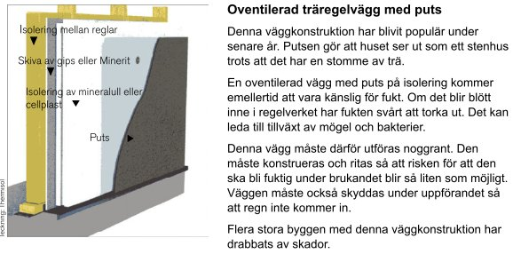

## Das Fertighaus - Schlüsselfertig bauen ohne Probleme, Reue, Fluch oder Segen? 
Eine Tirade

 _"Zum Unglück hat sich mit der Industrie ein System verbunden, 
das Profit als den eigentlichen Motor des gesellschaftlichen Fortschritts betrachtet, 
den Wettbewerb als das oberste Gesetz der Wirtschaft, 
Eigentum an den Produktionsgütern als absolutes Recht, ohne Schranken, 
ohne entsprechende Verpflichtung der Gesellschaft gegenüber. [...] 
Noch einmal sei feierlich daran erinnert, dass Wirtschaft im Dienst des Menschen steht."_ 
Papst Paul IV. (in seiner Enzyklika über den Fortschritt der Völker - [POPULORUM PROGRESSIO - Volltext deutsch](http://www.christusrex.org/www1/overkott/populo.htm)) 

_"Die (massiv gebauten) Häuser von 1900 bis 1940 sind ja hervorragend. ... 
Die Gebäude aus der Zeit 1969 bis 1990 sind die allerschlimmsten. 
Die müsste man ... eigentlich wegen ihrer schlechten Energie- und Bauqualitäten abreißen."_ 
Prof. Volker Hartkopf, Architekt, Gründer und Leiter des "Centre for Building Performance and Diagnostics", 
Carnegie Mellon University (in einem Interview mit der Süddeutschen Zeitung am 2.6.2007) **Das Bild zum Thema:** [Frans Francken - Der Tod und der Kaufmann (1620)](http://www.religionsunterricht.de/ifr/ifr45zd2.htm) 

Modernes Bauen - das heißt industrielles, billiges, auch für ärmere Schichten erschwingliches Bauen, das von der traditionelle Zunft gerne als Baupfusch und Schund verteufelt wurde und wird. Ganz zu Unrecht? Als Massenprodukte des industriellen Billig-Bauens für Hinz und Kunz heißen die jedermann bekannten Resultate der Neuzeit: Plattenbau in Ost und West für die Massenhaltung des zum Sozialisten oder Sozialschmarotzer verkommenen Menschen (herrlich individualisiert durch Pappen-Blech-Plexiglas-Bretterbude im Schrebergarten am Bahngleis oder sozialistischer Einheitsdatsche auf Junkerland und eben das Fertighaus, egal, ob von Okal, Streif, Neckermann, Kampa, Helma, Jöda, Weiss, Heinz von Heiden, Tchibo, Fischer, Ikea, Wolf, Zenker, Brauchl, Massa, oder, oder, oder usw. für den sich als Individualisten gerierenden Massenmenschen im uniform bizarren Kunterbunt des Neubaugebiet-Allerleis inkl. gartenverzwergtem Vorgarten Typ Vorstadteinerlei, -zweierlei oder auch dreierlei. Wer dort am rötesten, blauesten, grünsten, knalligsten und krassesten heraussticht, hat gewonnen. Bis morgen der nächste Angeber sein inzwischen teils sogar massivverportes Stopfmüllzelt aufschlägt. 

Während also der Plattenbau meist mit Spar-Mietern, Prekariat und Volkspartei-Wählern gefüllt wurde und wird, verwirklichte der minderbemittelte "Individualist" und Spargeizgeilkunde von Neckermann, Quelle, IKEA, Otto-Versand, Penny, Norma oder Aldi seinen geschmackbefreiten Eigenheimbau gerne mit einem möglichst billigen, architektenbefreiten, aber (genau deswegen?) grundsoliden und herrlich schönen Fertighaussystem in wohl- und sowieso buntestbedachten leichtester Leichtbauweise aus dem buntbeglänzten Haus-Katalog. Ausgedacht ursprünglich wohl für polackische Saisaonarbeiter in preußischen Staatsdomänen, dann als Billigkaserne und temporäre Herberge für das hierzulande immer wieder mal zur Reduzierung giftgasgefährlicher CO2-Emittenten einberufene Kanonenfutter, in den 1930ern dann zur RAD-Reichsarbeitsdienstbaracke der Organisation Todt OT kurzfristig umfirmiert, Seuchen- und sonstigen Härtetest im Konzentrationslagerdienst der Kriegs- und in den dann besetzten Ostgebieten vor allem auch Nachkriegszeit, auch als Notunterkunft für Vertriebene und Dorfbettler im Westen bestens bestanden und letztlich - nach der Bewährung im Massenwohnungsbau unter wechselnden Insassen in etwas gefälligerer Individualform von vielen einfallsreichen Schreinermeistern konsequenterweise weiter- und weiterentwickelt zum gasausdünstfreundlichen harzleimverklebten Preßpatten-Juckwollen-Holzschutzgift-Ständerbau, gerne maskiert mit ultradünnen Backsteinpappriemchen Marke "Friesenwatt", "Sylter Nacktarsch", "Ziegelpappe Decofix" oder meinetwegen auch "Fliegender Holländer", inzwischen auch mit kundenfreundlichem Kunststoff-Backsteinimitat - die im Vergleich mit Porensteinen besonders lauen "Steine". 

 
Deutsche Giftmischer zum Wohle der Umsätze in der Baubranche 

Das kostet wenig, ist von der Grundidee her in Baracken-Bauweise aus Holzständern (1949 OKAL-Patent des Schreinermeisters **O** tto **K** reibaum **A** us **L** auenstein / Salzhemmendorf für die Röhren-Spanplatte im Industrie-Strangpreßverfahren - Motto mit ewigem Haltbarkeitsdatum und extremem Wahrheitsgehalt: "Aus Defiziten werden Ideen") mit wuseligstem Splitterkratzjuck-Mineralwolle-Glaswolle-Dämmstoff verstopft und verzwirbelt, verspricht - Architekten aufgepaßt und hingehört! - Baukostensicherheit von Anfang an und bietet sogar die Möglichkeit der kostensparenden Eigenleistung für Bastler, Bohrer, Nagler, Kleber, Laubholzsäger, Hobbyschnitzer und sonstige Liebhaber von baumarktversorgter Uhu-Schnüffelei und Haus-Verseuchung mit Holzschutzmittel und/oder toxischem Boratsalz - Schädlingsbefall und Brand soll das Salz hemmen! - bis ins letzte Zellulose-Hanf-Wolle-Zipfelchen. 

Der kostenbewußte Bauherr sucht sich dann für den DIY-Billigausbau die billigsten Produkte, nur Sonderangebote!, im OBI-/Praktiker-/Hagebau-/Hornbach-/XY-Baumarkt um die Ecke heraus und verschönert damit sehr individuell alle seine Tag- und Nacht-Träume vom besseren Wohnen im Grünen rund um sein verkleistertes Dämmwollzelt. So machen es Abermillionen. 

Die notwendige Info dazu gibt es gratis in den schön bunten Werbebeilagen der Wochenendausgaben unseres Heimatboten. Studieren Sie doch mal diese Fallbeschreibung, die bestimmt noch mehr Stoff zum Nachdenken als diese kleine Publikumsbeschimpfung bietet: 

[Sanierung der Wärmedämmung in den Außenwänden eines Fertighauses](http://www.bau.de/forum/werhat/2070.htm) 

Nun gibt es freilich auch die Fertighaus-Hersteller, die versprechen, in "Massivbauweise" Stein auf Stein zu setzen. Das ist okay, nach all den Giftmülldeponien, die der industrielle Tischler-Fertighaus-Chemiewaffen-Angriff besonders von etwa 1960 bis 1980 zur Beeinträchtigung der Volksgesundheit hervorbrachte. 

Doch was, wenn es sich bei diesen Steinen um versteinerte Porenschwämme mit erstklassig aufnässender Feuchterückhaltung handelt? Also 
- [weich-porosierte Hochlochziegel](29bau14.md) aus vielleicht auch als Schadstoffdeponie mißbrauchtem Ton-Gemisch (sog. ["Giftziegel"](29bau14.md)), 
- Porenbeton-/Gasbeton-"Steine" aus geschäumtem Sand-Zement oder eben 
- lumpige, mit wasserabweisendem und trocknungsblockierendem zementmörtel verfugte Klinkerriemchen oder 
- über kurz oder bald sicher [schlagregenundichte Backstein-Vormauerklinker](http://www.ask-jeff.co.uk/cavity.html) oder deren Imitate, 
- dahinter aufnässende Luftfeucht-Dämmstoffe und luftfeuchte Luftschichten, die jederzeit in die nicht ausreichend wärmespeicherfähigen, da allzuleichten und deswegen schnellstens in der Nacht auskühlenden Baustoffe abdunsten können, oder auch 
- Ständerwerk oder 
- Kalksandsteine, 
- alles innen und vielleicht auch außen mit wasserrückhaltenden und trocknungsblockierenden Mörteln und Dispersions-Silikonharz-Acrylat-Polyvinyl-Acetat-Anstrichen beschichtet, 
- mit Isolierfenstern verrammelt und 
- mit [Keimschleudern namens Wärmerückgewinnungs-Klimaanlagen / Lüftungsanlagen](213baust.md) bewaffnet 
eben das buntgescheckte Sammelsurium der zweischaligen oder mehrschaligen oder durchgeporten Bauweise, die vielleicht durch [Schimmelpilz](7schim.md) und [Algenbefall, Nässeschäden](2133bau.md) und Risse, Muff und Moder zu glänzen vermag, aber eben nicht unbedingt und immerdar durch all die Vorzüge der echten, traditionll bewährten Massivbauweise in vollem Backstein-/ Ziegelstein-/ Naturstein-/ Bruchstein-Mauerwerk genießt, wie wir es von den wirklichen Massivbauten in baumeisterlicher Qualität der jahrtausendelangen Baugeschichte her kennen und schätzen gelernt haben. 

Dann hat man zwar massiv bestellt und massiv gezahlt, aber dennoch nicht - wie gewünscht und gedacht - wirklich massiv und gut gebaut. Doch das merkt man dann erst hinterher und wird dabei sehr viel und massiv klüger. 

Wobei auffällig ist, daß es die Fertighausbranche angesichts der unfaßbaren Vertrauensseligkeit des Menschheit mit buntglänzenden Werbeprospekten ohne weiteres geschafft hat, die dümmsten Erfindungen des Neuzeit-Bauens wie den [kondensatspeichernden Dämmstoff](213baust.md), den Holzständer-Barackenbau mit Schadstoff-ausgasenden Ersatzbaustoffen, den [feuchte- und rißgefährdeten Porenstein](29bau12.md), das [schimmelpilzerzwingend-hermetisch dichte Fenster](23bausto.md), die [Solaranlage und/oder Photovoltaik-PV-Anlage](7temp23.md) der leichtgläubigen Kundschaft als marktentscheidenden Vorteil aufzuschwätzen. Sodaß es der Fertigbaukundschaft auch heute noch ohne weiteres gelingt, die schäbigste, schadstoffkonzentrierteste, riß- und nässestaufreundlichste Bauweise planen und auch realisieren zu lassen, die man sich nur vorstellen kann. Wie auch anders, wenn man auf solche und ähnliche Erfolgs-Werbesprüche hereinfällt (sinngemäß aus Firmenanzeige für plattenbauvorgeschädigte Ossikunden 2011): 

_"Alle Planungsleistungen, sämtliche Entwurfsleistungen und auch die vollständigen Ausführungszeichnungen sind für den Hauskäufer absolut kostenfrei."_ 

Na, was wollen die Kostenlos- aber-nicht-umsonst!-Kunden dafür an gehobener Planungsqualität erwarten? Mehr als dämliches Planungsgestöpsel mit minderwertigen Katalogbaustoffen, zusammengeschusterte Allerweltsarchitekturen Marke "Wir verschandeln die Landschaft am meisten und lassen uns dabei nur von uns selbst übertreffen!" Marke "Schnäppchen" oder "Nachschmeiß", "Ramsch", "Geiz ist geil" oder eben "Alles muß raus!"? Dafür mit Finanzierungsangebot zu günstigem Zinssatz! 

Doch auch bei dem Marktsegment des Eigenheimbaus Marke Fertighaus gilt oft bis allzuoft das gewöhnliche Bauerrenmotto "Penny wise and Pound foolish - Saving the Penny and losing the Pound", aber Englisch versteht man dort bestimmt nicht immer. 

Und Vorsicht! Auch bei individuell geplantem Architektenhäusern gelingt es bestimmt nicht immer, sich vom Fertighausbauwahn zu befreien, sodaß sich auch dort inzwischen alle miesen Baustoffe und Baukonstruktionen und Haustechnikbestandteile finden lassen, die den neuzeitlichen Fertig-Pfuschbau charakterisieren. Mit manchmal noch mehr Dämmstoffoffensive, Isoglasausrüstung, PV-Quadratmetern usw., die sich der Fertighauskunde schon finanziell nicht leisten könnte - jedoch bestimmt würde, wenn er nur könnte ;-) 

Die entscheidenden Tricks der Branche, für die unterste Bauqualität noch mehr Geld, als je gedacht, aus dem gutgläubigen Bauherren herauszupressen, finden sich in den Propagandaschriften ebensowenig, wie in den Beratungsgesprächen vor der Vertragsunterzeichnung. Zu nennen wären beispielsweise: 

- Wichtige Planungsleistungen wie statische Berechnung, Baugrundgutachten, Entwässerungsplanung, Wärmebedarfsberechnung, Vermessungsleistungen (u.a. Garageneinmessung auf Grundstück), Anschlußkosten für Gas, Wasser, Strom, Kanal fehlen in den Vertragsvereinbarungen. Folge: Diese Leistungen müssen extra bezahlt werden. 

- Die Qualität der Baustoffe und der Ausstattung wird nicht genau konkretisiert und ausreichend detailliert. Später sucht sich der arglose Bauherr irgendwelche schönen Türen, Böden, Fliesen und Sanitärobjekte / Sanitärausstattungen aus - und darf sich dann über exorbitante Zusatzkosten freuen. 

- Obendrein werden gerne auch die Baustelleneinrichtung oder diverse Bauversicherungen dem Bauherren als notwendiges Extra draufgenudelt, selbstverständlich erscheinen diese Zusatzkosten auch nicht im versprochenen Preis oder dem Vertrag. 

- Und der Super-Gau blüht bei so manchen unsoliden Fertighausbaufirmen - sie sacken die "üblichen" Vorauszahlungen ein - und gehen dann in die Insolvenz. Dann steht der arme Bauherr noch ärmer da - mit oder gar ohne angefangene Fertigbauruine und vielleicht trotz [Baufertigstellungsversicherung](versicherung.md) und [schufafreiem Auslandskredit](kredite.md). 

Doch der Knüller ist folgender: Niemand erzählt dem Fertighausinteressenten, daß seine Bude allen genormten Schwachsinn unseres unseligsten Industrievermarktungstreibens enthält, nicht aus Überzeugung der beteiligten Bauleute, nein aus purer Angst vor dem prozessierenden Kunden. Und niemand verrät dem Bauherren, daß beispielsweise seine kartonverkleideten Dachgeschoße im Sinne einer Wartungsfuge aus Silikon - der Vergleich stammt übrigens vom sehr geschätzten Kollegen, ö.b.u.v. Sachverständigen und Dipl.-Phys. Rainer Bolle - eben auch eine Wartungsebene sind, die alle paar Jährli mal weggerupft und weggezupft gehören, um die dahinter versagenden Luftdichtheitsebenen und aufgenässten Dämmstoffe wieder rauszuentsorgen und neuen Normshit hineinzupressen und festzukleben und anzutackern. Wie es aussieht hinter deutschen Normdachausbauten finden Sie auf [diesem Link](21316bau.md). Vorsicht Grusel! 

Und haben Sie schon mitbekommen, daß die bei uns gebräuchlichen Wärmedämmverbundsysteme WDVS in den USA seit langem von den Baubehörden verboten wurden, wenn der Dämmuntergrund ein Holzständerbau bzw. Holzständer-Fertighaus ist. Warum? Wegen einer Unzahl von Hausschwammfällen unter der aus bauphysikalischen Grunden zwangsweise aufgenäßten Dämmebene. Die US-WDVS-Industrie hat natürlich nicht lange gefackelt, sondern sofort eine drainiertes WDVS (Drainage-EIFS mit Drainageschlitz und Luftspalt hinter der Dämmschicht) auf den US-Markt geschmissen, ebenso schon in Schweden (Zweischicht-WDVS mit Luftspalt hinter Vorsatzschale, selbstversändlich etwas unaufwendiger, minderwertiger und billiger als US-Variante), das natürlich auch so seine Macken hat. Die deutsche WDVS-Mafia erzählt das dem dummen Michel aber nicht gerne. Hier mal ein paar WDVS-Absaufereien aus Schwedens Fertighaus-Landschaft: 

 (Links: Querschnitt WDVS, Bildquelle: ncc.se) Hamse übrigens auch geglaubt, daß sich die Dämmbauweise in Schwedens Industrie-Fertighäusern aus Holzspreißeln und Holzschnipselharzplatten doch so dolle bewährt hat? Dann gucken Sie gleich mal folgende Links zum größten schwedischen Klimaschutz- und Bauskandal aller Zeiten an - die WDVS-Pfusch-Bauweise mit Schimmel und Rott nur kurz nach dem Einzug: 

Die "Enstegsmetoden" - auf Deutsch: Wärmedämmverbundsystem WDVS - Schwedische Links: 
[kvp.se: Sein neues Haus wurde durch Schimmelpilzbefall geschädigt](http://www.kvp.se/nyheter/1.1285878/hans-nya-hus-var-skadat-av-mogel) - Bauschäden an 201 Neubauten in Lund (Annehem / Annenheim) und Bjärred (Melbavägen / Melbaweg und Norra Villavägen / Nördlicher Villenweg) 
[sydsvenskan.se: Pfuschtechnik wird weiter verwendet - Polystyrol, Holzständer und Gipskarton - Feuchte- und Schimmelpilzgeschädigte Wände mit Wärmedämmverbundsystem](http://sydsvenskan.se/sverige/article330061/Utdomd-teknik-anvands-fortfarande.html) 
[byggindustrin.com: NCC's Villen in Lund sind durchfeuchtet](http://www.byggindustrin.com/teknik/nccs-villor-i-lund-fuktskadade__4913/) - Alle 175 Villen, die NCC in Annehem, Lund baute, haben Feuchteschäden. Die Putzfassaden sind nach der kritisierten WDVS-Methode konstruiert. 
[sydsvenskan.se: WDVS-Bauskandal in Annehem](http://sydsvenskan.se/system/topicRoot/Byggskandalen_p__Annehem/) 
[byggvarlden.se: Dick gedämmte WDVS-Wände erhöhen das Schimmelrisiko](http://www.byggvarlden.se/energi_miljo/article348898.ece) - Die Passivhaus-Bauweise teilt die Baubransche in zwei Lager. 
[sydsvenskan.se: Feuchteproblem in schonischen Heimen](http://sydsvenskan.se/system/topicRoot/Fuktproblem_i_sk_nska_hem/) 
[byggnadsvardsnytt.wordpress.com: WDVS-Skandal](http://byggnadsvardsnytt.wordpress.com/tag/enstegstatning/) - Laute Debatte über Baupfusch und WDVS-Fassaden nach Aufklärung über Feuchteschäden / Immer mehr Geschädigte fragen wegen Schimmelproblemen in WDVS-Neubauten nach / NCC saniert 175 durchfeuchtete WDVS-Neubauten in Annehem, Lund / Botrygg tauscht Fassadensystem nach Feuchtealarm aus 
[ncc.se: An den WDVS-System der Neubau-Siedlung Annehem in Lund hat die Baufirma NCC seit dem Herbst 2007 die Feuchte gemessen und sämtlich WDVS-Fassaden untersucht.](http://www.ncc.se/sv/OM-NCC/Press-och-media/om-putsade-fasader/Annehem/) Das Resultat belegt, daß es Häuser mit umfangreichen Bauschäden und Mängeln gibt ... 
[byggvarlden.se: Skandal!](http://www.byggvarlden.se/byggprojekt/article73253.ece) - 95 Prozent aller neu gebauten Mehrfamilienhäuser mit Wärmedämmverbundsystem-Fassaden können tickende Schimmelpilz-Zeitbomben sein 

[sydsvenskan.se: In Bjärred / Kommune Lomma wurden hunderte neu Wohnhäuser mit nicht hinterlüfteten WDVS-Fassaden gebaut](http://sydsvenskan.se/sverige/article330056/Fuktskadade-hus-aven-i-Bjarred.html) - Ein Teil davon hat schon Feuchteschäden. 
[sydsvenskan.se: Neue WDVS-Wohnhäuser mit Mängeln und eingebauten Schimmelfallen](http://sydsvenskan.se/sverige/article330062/JM-infor-forlangd-garanti.html) 
[Boverket (Staatl. Gebäudebehörde/Zentralamt für Wohnungswesen): 36 Prozent der schwedischen Wohnhäuser - darunter viele WDVS-Objekte - haben Feuchteschäden und Schimmelpilzbefall!](http://www.boverket.se/Om-Boverket/Nyhetsarkiv/Manga-smahus-drabbade-av-fukt-och-mogel-/) 

Und hier übersetze ich Ihnen mal, was die Schwedische Baupresse - hier "Allt om Bostad" (Alles zur Wohnung) zum Thema WDVS und Nässerisiko bzw. Feuchteschaden auf gedämmten Holzständerwänden im Fertighaus-Bau zum besten zu geben weiß ([Link zur Bild-Quelle](http://www.alltombostad.se/byggabodialogen-23404/nyhet-files/91_Yttervaggar.pdf)): 

_**Unbelüftete Holzriegelwand mit Putz** 

Diese Wandkonstruktion wurde in den letzten Jahren beliebt. Der Putz bewirkt, daß das Haus wie ein Massivbau aussieht, obwohl es ein Holzrahmenbau ist. 

Die unbelüftet Wand mit verputzter Wärmedämmschicht (WDVS-Bauweise) ist jedoch empfindlich gegenüber Feuchtigkeit. Wenn es innerhalb des Holzrahmen-Wandaufbaues naß wird, kann die Feuchtigkeit kaum wieder austrocknen. Das kann zum Wachstum von Schimmelpilzen und Bakterien führen. 

Deshalb muß diese Wandkonstruktion sehr sorgfältig ausgeführt werden. Sie muß so geplant und im Detail gezeichnet werden, daß das Risiko so gering wie möglich wird, wärhend der Gebrauchsdauer aufzunässen. Diese Wandbauweise muß auch während der Bauphase vor eindringendem Regen geschützt werden. 

Mehrer Großbauten mit dieser Wandbauweise haben entsprechende [WDVS-Durchfeuchungs-]Bauschäden erlitten."_ 

Ja du meine Güte, das ist schön dahergeschwätzt. Denn die Erfahrung in den USA und auch hierzlande und selbstverständlich auch in Schweden haben doch ausgiebig gelehrt, daß es über eine etwas längere Perspektive - und ich meine hier nur wenige Jahre! - so gut wie unmöglich ist, das innere Kondensieren im WDVS zu unterbinden, und eben auch das Eindringen und Hinterdringen von Tau- und Regenwasser über den WDVS-Querschitt und durch alle sich bietenden Fugen. 

Mein mit Zitaten angereicherter Beitrag im Fachwerkforum ["Feuchtigkeit zwischen Dampfbremse und Klemmfilz"](http://www.fachwerk.de/goForum.html?id=169655) kann das Problem vielleicht noch etwas näher beleuchten: 

"Auch ich dämme, aber noch anders: 

- Weil Kondensat gibts dort immer, da braucht man halt kapillaraktive Konstruktionen, die das schadenstolerant bzw. feuchtetolerant verkraften, nicht Schimmelzucht-Absauf-Schäume, -Gespinste und geflockte Schüttungen. Siehe Massiv-Wand. Das Sommerkondensat in einer hinterlüfteten Konstruktion hat Fraunhofer (Künzel) auch schon mal gemessen und beschrieben. Da hat die Dachbranche aber getobt. 

- Und ganz bestimmt ohne Kondensatfangfolien. Die sind reines Gift, denn an diesen Dünnschicht-Tropfenfängern konzentriert sich das Problem, da sie eben am meisten und schnellsten auskühlen. Siehe Einscheiben-Fensterglas. 

- Und selbst wenn die Luftdichtigkeit dort oben dauerhaft gelänge, käme es trotzdem über kurz oder lang zur inneren Kondensation. Siehe erblindendes Isolierglas mit "versiegelter" Randausbildung. Und da ist die Luftdichtheit über einige Zeit doch wesentlich leichter herstellbar als in einem Holzständer-Klapperatismus, egal ob Dach oder Wand. 

Die Wahl besteht zwischen Bauphysik und Baupfuisick. Jeder muß das für sich entscheiden. 

Konrad Fischer 
Massivbedenkenträger 

PS. Zitat Hartwig Künzel aus: "Richtiger Einsatz von Dampfbremsen bei der Altbausanierung", WTA-Journal 1/03 S. 6-25 

_" Häufig sind traditionelle Wand- und Dachkonstruktionen, wie z.B. Fachwerkwände oder Steildächer mit dampfdichter Vordeckung (Dachpappe) darauf angewiesen, auch zur Raumseite hin austrocknen zu können. Wird dies durch Dampfsperren verhindert, können kleine Ausführungsmängel rasch zu großen Feuchteschäden führen. 

Durch die Betrachtung des instationären Temperatur- und Feuchteverhaltens von Außenbauteilen wird deutlich, dass der Versuch einer hermetischen Abdichtung in der Regel scheitert und besser durch ein kontrolliertes Feuchtemanagement ersetzt werden sollte. ... 

Überkommene Feuchteschutzparadigmen, wie z.B. das allseitige Abdichten von Bauteilen gegenüber Dampfdiffusionsvorgängen haben in der Vergangenheit zu zahlreichen Schäden geführt, da in der Praxis unvermeidbare Feuchteeinträge während und nach der Bauphase nicht ausreichend berücksichtigt wurden. 

Selbst lufttrockene Bauteile enthalten aufgrund ihrer Sorptionsfähigkeit häufig mehrer Liter Wasser pro Quadratmeter, d.h. deutlich mehr als die maximal zulässige Tauwassermenge von 1000 g/m² gemäß DIN 4108-3. 

Auch bei sorgfältigster Ausführung der dampfdichten Schichten ist eine Feuchtezufuhr durch einbindende Bauteile, die sog. Wasserdampfdiffusion durch Flankenübertragung, nicht auszuschließen. 

Hinzu kommen häufig trotz zufriedenstellender Luftdichtheit der Gebäudehülle, konvektive Wasserdampfeinträge durch kleine Fehlstellen, die zu lokalen Feuchteanreicherungen führen können. 

Da echte Dampfsperren in beiden Richtungen nahezu dampfdicht sind, lassen sie auch keine Austrocknung zu, so dass selbst kleine Ursachen eine große Schadenswirkung besitzen. ... 

Bei winterlichen Außenlufttemperaturen steigt die Temperatur der Blecheindeckung von nachts –15°C auf 70°C in der Mittagszeit an. Dieser starke Temperaturanstieg treibt die Feuchte der Holzschalung (Tragschalung für die Blecheindeckung) in das Dachinnere. In der Folge steigt die Feuchte zwischen Dampfbremse und Dämmung mit einer gewissen Verzögerung von unter 10% auf über 90% r.F. an. 

In der Nacht, wenn die Dachoberflächentemperatur wieder unter die Temperatur des beheizten Innenraumes fällt, dreht sich der Dampfdiffusionsstrom um und die relative Feuchte hinter der Dampfbremse geht nach einiger Zeit auf den Ausgangszustand zurück. 

Diese Messungen zeigen deutlich die täglichen Feuchteschwankungen, die in einem Bauteil durch Dampfdiffusion auftreten können. 

In der Regel ist jedoch der nächtliche Diffusionsstrom im Winter größer als die sonnenbedingte Umkehrdiffusion, so dass die Feuchte im Winter über einen längeren Zeitraum betrachtet nach außen wandert. 

Im Sommer nimmt die Umkehrdiffusion entsprechend zu, so dass sich die Feuchte größtenteils nach innen verlagert bzw. zur Raumseite hin austrocknet, wenn sie nicht durch eine Dampfsperre daran gehindert wird. ... 

Bei einigen typischen Sanierungsfällen, beispielsweise bei der nachträglichen Vollsparrendämmung außen dampfdichter Schrägdächer (Bitumenpappe als Vordeckung bzw. Blech oder Schiefer als Eindeckung) oder bei der Innendämmung alter Fachwerkgebäude, reicht die Rücktrocknung durch eine diffusionshemmende Dampfbremse nicht aus, um eine langfristige Feuchtesicherheit der Konstruktion zu gewährleisten."_ 

Die feuchteadaptive Dampfbremse wird dann beschworen. Taugt aber auch nix, wie Prof. Möhring festgestellt hat, da die Bremse schnell verschleimt und mikrobiell be- und durchwachsen wird und damit ihre angebliche Funktion einbüßt. Möhrings Nahaufnahmen der besiedelten Feuchtedaptionsdampbremse waren ein Schocker im Saal der Professorentagung in Bad Dürckheim anno dunnemals. Ein Blick in die Abgründe der Hölle ... 

PPS. Und wenn irgendeiner jemals verstanden hätte, was hier steht, verstünde er eben, was in Dach- und Fassadendämmschichten wg. "Bauphysik" passiert. Und würde keine grausamen Ratschläge zur Dämm-Pfuschmaximierung mehr geben. Und könnte dann genauso bauen und dämmen, wie ich, oder bestimmt noch besser. Denn so schwierig ist das nun auch wieder nicht ... ;-) " 

Am Deutschen Markt muß man wohl noch länger auf die sich in den USA und Schweden abzeichnenden Novitäten rund um das drainierte WDVS mit Hinterlüftung und wasserabführender Ebene hinter dem Dämmstoff und vor der Wandkonstruktion warten. Erst mal hat sich die Ewald Dörken AG die Außenheizung für WDVS patentieren lassen, auch an der RWTH Aachen forscht man fleißg daran und mitteldeutsche drittmittelbegüterte FH-Professoren der Unis Wismar, Neubrandenburg und Lausitz empfehlen das dem naßverdämmten Kunden als wirtschaftliche Lösung für sein Energiesparproblem an der Fassade, Forschungsbericht unter "Etwas Wärme braucht die Wand" in B+B 5/2010. Der Energiespar-[Stachanow und -Hennecke](http://de.wikipedia.org/wiki/Stachanow-Bewegung) lassen grüßen. Weitere Details hier: [Alptraum WDVS/Nightmare EIFS](2133bau.md#eifs) 

Doch all das rund um die Dauer-Sanierbaustelle Fertighaus wird gerne vergessen, denn der oft wichtigste Vorteil eines Fertighauses läßt jeden normalen Bauherrn jubeln und alle sonst gesunde Vorsicht den Bach hinunter rutschen: 

Die künftige massenindividuelle Bauherrschaft kann sich ein von Vorzugskunden bewohntes möglichst neues Musterhaus / Testbüdli im zur gehobenen Selbstverwirklichung immer topaktuellen Stylish-Chick: Erkerwarzen rund oder dreieckig, Dachdeckung bunt bis Kaleidoskop, oder auch WOW! - Bauhaus-Kistenstil Marke Alter Dessauer Käse am Wochenende angucken. Die Vorzugsbewohner preisen alles in den höchsten Tönen, vielleicht winkt ja ein schnuckeliges Provisiönchen und außerdem ist man ja gerne von seiner Entscheidung und sich selbst überzeigt und nutzt dafür jede Möglichkeit der Autosuggestion. 

Und wozu über die bei der Musterbude nach langem Hin und Her schlußendlich ausgemerzten unbekannten Problemchen grübeln?, da steht es satt und fett in der bunten Landschaft, zum Anfassen, zum Reinriechen, zum kuschelig Wohlfühlen. Und so nette Bewohner, die können doch nicht irren! Da brauchtes also keine Phantasie mehr, na freilich, die Fliesen dürfen zum ultimativen Individualisieren schon noch geändert werden (kostet extra), auch die Dachfarbe von massanhaftem mausbraungrau zu noch massenhafterem papageiengelbgrünblau individuell gewechselt. Luft-Luft-Wärmepumpe oder Wasser-Wasser-Wärmepumpe oder Luft-Wasser-Wärmepunpe oder eben Wasser-Luft-Wärmepumpe als Augenauswisch-Vermarktungsmodul des Fertighaus-Moguls neuerer Art für den Massen-Individualisten. Was braucht es dazu einen Besserwisser-Architektenschnösel? Eigene Meinung? Durch Unterordnung und Demut, durch BEscheidenheit und Bauqualiät, durch Ästhetik und Solidität aus der Menge im Neubaugebiet herausstechen? Jössen, wo kämen wir denn da hin? Nein Danke! Wozu hat man denn seine gediegenen Massen-Vorurteile und notfalls das Fertighaus-Onlineforum mit seiner Massenmeinung hier und dort? Soweit, so gut und Amen, Schwamm drüber. 

Zum Nachlesen: Gustave Le Bon, [Psychologie der Massen (Psychologie des foules)](http://www.textlog.de/le-bon-psychologie.html)

Doch welche Qualitäten sind damit erfahrungsgemäß erreichbar? Hier helfen uns eben doch nur Erfahrungswerte weiter. Was kommt heraus, wenn die fertighaustypischen Baustoffe und Bausysteme im Wohnumfeld zum Einsatz kommen?: 

- Mit Holzschutzmittel vergiftete Holzkonstruktionen 
- Schadstoffcocktailbefrachtete Beplankungen aus Spanplatten und anderen Plattenwerkstoffen 
- Weichmacher- und lösemittelbelastete, langfristig ausgasende Beschichtungen und Fußbodenbeläge 
- Leichtbaukonstruktionen mit geringer Schallschutzwirkung und Wärmespeicherfähigkeit 
- Nässespeichernde Betondachsteine, Betonbodenplatten, Wandbildner, Wärmedämmung, Mörtel, Putze, Anstriche und Tapeten 
- Superdichte Fenstersysteme mit Isolierglas und Gummilippendichtung 
- Zwangslüftungstechnik und lufterhitzendes Heizsystem 
- Feuchteriskanter Ausbau der Naßräume und des Dachgeschosses mit kunstharzverklebten Luftdichtebenen - hauchzarte Plastefolien (!) mit Ewigkeitsgarantie + drei Tage 
- Versagensanfällige Dichtungssysteme an allen Fugen innen und außen, siehe vor 

Diese ergänzenden Links können erweiternd eine kleine Übersicht über das Problemspektrum liefern (tote Links bitte melden!): 

Schadstoffprobleme im Fertighaus?: [www.umweltanalytik.com/ing6.htm](http://www.umweltanalytik.com/ing6.htm) 
Wohngifte: [www.baupraesent.de/wohngifte.htm](http://www.baupraesent.de/wohngifte.htm) 
Fertighaus-Geruch: Chloranisole wahrscheinlicher Verursacher [www.arguk.de/mitteilungen03.htm#News03-03](http://www.arguk.de/mitteilungen03.htm#News03-03#News03-03) 
Kauf Okal-Haus Typ 169 von 1977 [www.bau.net/forum/fertighaus/104.htm](http://www.bau.net/forum/fertighaus/104.htm) 
Fertighaus-Kernsanierung, Muff-Gestank, Stinke-Geruch und Modergeruch: [www.modergeruch.de/](http://www.modergeruch.de/) 
Warum hatten wir soviel Ungeziefer?: [www.modergeruch.de/ungeziefer01.htm](http://www.modergeruch.de/ungeziefer01.htm) 
Umweltgifte im Wohnraum: [www.obstkeller.de/TM_Wohngifte.htm](http://www.obstkeller.de/TM_Wohngifte.htm) 
Holzschutz- und Fertighaussanierung: [www.bau.de/forum/schaden/1667.htm](http://www.bau.de/forum/schaden/1667.htm) 
Sanierung der Wärmedämmung in den Außenwänden eines Fertighauses: [www.bau.de/forum/werhat/2070.htm](http://www.bau.de/forum/werhat/2070.htm) 
Streif-Haus und Schimmelbildung?: [www.bau.de/forum/werhat/2089.htm](http://www.bau.de/forum/werhat/2089.htm) 
Okal Fertighaus von 1973 Schadstoffe: [www.bau.de/forum/fertighaus/131.htm](http://www.bau.de/forum/fertighaus/131.htm) 
Okal Haus Bj. 1970, sanieren oder abreissen?: [www.bau.de/forum/schaden/2234.htm](http://www.bau.de/forum/schaden/2234.htm) 
Rechtsanspruch bei Formaldehydbelastung eines Okal-Fertighauses: [www.bau.de/forum/schaden/2410.htm](http://www.bau.de/forum/schaden/2410.htm) 
Albtraum Traum-FERTIGhaus ??? !!!: [www.bau.de/forum/sonst/512.htm](http://www.bau.de/forum/sonst/512.htm) 
Fertighäuser gasen auch nach Jahrzehnten noch hohe Konzentrationen an Schadstoffen aus!: [www.baubiologie.net/docs/pm_fertighaus.shtml](http://www.baubiologie.net/docs/pm_fertighaus.shtml) 
Übersicht zu Beeinträchtigungen der Luftqualität in Innenräumen: [www.u-archiv.de/fiuc/wohngifte.htm](http://www.u-archiv.de/fiuc/wohngifte.htm) 
Umweltbelastungen und Schadstoffe (Formaldehyd, PCB, PCP usw.) in Innenräumen: [www.fertighaus.de/umweltbelastungen_und_schadstoffe_in_innenraeumen.htm](http://www.fertighaus.de/nxs/891/holzinfo//fertighaus/47/42/alt/umweltbelastungen_und_schadstoffe_in_innenraeumen.htm) 
Muffiges Okalfertighaus: [www.fachwerk.de/wissen/okal-fertighaus-5774.html](http://www.fachwerk.de/wissen/okal-fertighaus-5774.html) 
Wohngifte die Todesursache?: [www.hennek-homepage.de/mcs-zeitung/ak24.htm](http://www.hennek-homepage.de/mcs-zeitung/ak24.htm) 
Schimmel im Fertighaus - Wie sanieren??: [www.energiesparhaus.at/denkwerkstatt/allgemein_a.asp?Thread=515_1](http://www.energiesparhaus.at/denkwerkstatt/allgemein_a.asp?Thread=515_1) 
Ausblühungen am Fertighaus-Klinker: [www.bau.de/forum/aussenwaende/45.htm](http://www.bau.de/forum/aussenwaende/45.htm) 
Gebaut und abgerissen: [www.sr-online.de/statisch/Programm/Fernsehen/ARD/Plusminus/20000328/thema03.shtml](http://www.sr-online.de/statisch/Programm/Fernsehen/ARD/Plusminus/20000328/thema03.shtml) 
Schadstoffbelastung bei Streif - Fertighaus 1973: [www.baukatalog.de/forum/index.php?forum=63&msg=22947](http://www.baukatalog.de/forum/index.php?forum=63&msg=22947) 
OLG Nürnberg: Unbewohnbarkeit eines Fertighauses wegen zu hoher Formaldehyd- und Lindan-Konzentration - Hersteller muss dem Käufer die Kosten der Neuherstellung ersetzen - Umstrittene Grenzwerte: [www.justiz.bayern.de/olgn/presse/info/ziv/prziv071.htm](http://web.archive.org/web/20080109011331/http://www4.justiz.bayern.de/olgn/presse/info/ziv/prziv071.htm) 
Gesundheitsschädigende Stoffe in Fertighäusern: [www.schadstoffe-schimmelpilze.de/fertighaeuser.html](http://www.schadstoffe-schimmelpilze.de/fertighaeuser.html) 
Schadstoffbelastung in einem Fertighaus Bj.1972: [www.bau.de/forum/schaden/2109.htm](http://www.bau.de/forum/schaden/2109.htm) 
"Das Haus hat uns krank gemacht": [www.hausbaulogik.de/OZHRO/OSTSEE-ZEITUNG1.htm](http://www.hausbaulogik.de/OZHRO/OSTSEE-ZEITUNG1.htm) 
Modergeruch-Fertighaus SOS: [fachwerkhaus.historisches-fachwerk.com/fachwerk/Forum%7C29305](http://fachwerkhaus.historisches-fachwerk.com/fachwerk/index.cfm?ly=1|0|forum|a|showForum|29305)

Im Ergebnis klagen Fertighausbetroffene über seltsame Gerüche, Gestank, Modergeruch und Muff, gesundheitliche Beeinträchtigungen von Triefnase, tränenden Augen, Erkältungen, Asthma, über Hautausschlag, Allergie, Dauerkopfschmerz und Übelkeit bis zu schweren Erkrankungen sogar mit Todesfolge, komplizierte bis unmögliche Sanierung, Probleme bei der Durchsetzung von Gewährleistungsansprüchen, Schadensersatz und Haftung, Schwierigkeiten bei der Ortung der Schadstoffbelastung und -herkunft. Motto: Modern modern. Und zwar vor sich hin! Natürlich - siehe entsprechende Links - stürzt sich eine ganze Armada von professionellen Wohltätern (Schadstoffdiagnostiker und Profisanierer) auf die fertighausgeplagten Betroffenen als leicht auszubeutende Kundschaft. 

Wobei der unbedingte Spar-Geiz der Fertighausbewohner es natürlich darauf anlegt, durch hermetisch versiegelte Fensterkonstruktionen, Isolierfenster und Wärmeschutzglas-Fenster mit einfach-zweifach-dreifach umlaufenden Dichtungslippen im Blockrahmen und Flügelrahmen alle Voraussetzungen zu möglichst hoher Schadstoffkonzentration, Gestank, Raumluftfeuchte und bakteriellem Wachstum im Haus zu optimieren. Man gönnt sich ja sonst nix. Und diese Marotte behält man natürlich auch nach einer Fertighaussanierung tapfer bei. 

Andererseits behauptet sich die Fertighausindustrie durch Abwiegelung, Ausreden und Verantwortungsverlagerung sowie mit immer neuen Versprechungen, daß heutzutage alles viel besser wäre, was als Bau- und Wohnqualität der Fertighaushersteller geliefert würde. Auch die Häuser von allerlei flotten Bauträgern zeichnen sich hin und wieder aus durch zielgenaue Treffer, wie man minderwertigste Feucht- und Giftdünstbaustoffe einsetzt, und dem gläubigen Sparbauherrn als "aktuell", "Niedrigenergiebauweise" und aufschwatzt. 

Wie hat doch das Landesberufsgericht Baden-Württemberg anno 1988 so schön geurteilt (zitiert nach DAB 09/08, S. 38)?: 

_"Derjenige, der ein Bauwerk auf eigene Rechnung errichtet und schlüsselfertig anbietet, ... verdient ... im Gegensatz zum freien Architekten daran, wenn er das Bauwerk 'billig' herstellt, Mängel vertuscht usw. Vor allem in Krisensituationen besteht die Gefahr, daß er durch 'Einsparungen' seinen Gewinn zu vermehren und seinen Verlust zu vermindern versucht. Deshalb kann ihm keine Sachwalterstellung zukommen. Vielmehr ist er ein echter 'Vertragspartner', der nach Gewinn strebt, dem gegenüber deshalb kritische Wachsamkeit angebracht ist. Gerade um ihn zu überwachen bedarf es des freien Architekten."_ 

Na, und wie schön allerlei Bauträerlein dem leichtgläubigen Bauherren ihre Pappendeckelbauten mit Plastefolienabdichtung und schütteren Gespinsten aufschwatzen können - leichter kann man mit kurzlebigem Baupfusch - jawohl: alles nach DIN! - kaum Geld verdienen. Was es damit dann praktisch auf sich hat, können Sie prüfen - benutzen Sie die obigen Links und die weiteren Infolinks: [Baustoffqualitäten Wand und Konstruktion ](29bau09.md) [Baustoffqualität allgemein](20bausto.md) 

War es nebenbei bemerkt nicht die Fertighauslobby, die uns die unselige, da schädigende, [Bauschäden verursachende](213baust.md) und in der Sache [wirkungslose Wärmedämmung](7fehrtab.md) dank geschickter Einflußnahme auf willfährige Bauwissenschaftler, Ministerialbeamter und Politiker eingebrockt hat? Als ultimata ratio und des Pudels Kern, was Energiesparen betrifft? Hat man dazu nicht sogar die Parole ausgegeben, daß zukünftig über Wärmespeicherfähigkeit, Temperaturamplitudendämpfung und Phasenverschiebung nicht mehr geredet und geforscht werden darf, da diese Energiesparfaktoren des Massivbaus den Absatzchancen der Fertighaus-Leichtbaukonstruktion - lustigerweise als "Energiesparhaus/Niedrigenergiehaus/Passivhaus" dem durch ängstlich neurotisierten Energiespargeiz besonders kritiklos-verdooften Michel angedreht, abträglich sein dürfte? Lieber Styrol ausgasende Polystyroldämmung, sogar auf Tapeten (Dämmtapete) kaschiert, formaldehydhaltige und lungengängige Mineralfaserwolle, brand- und fraßschutzgiftbehandelte Naturdämmstoffe mit - dank luftiger Faser-/Woll-/Schüttungs-Struktur bester Kondensateinspeicherungsfähigkeit und Schimmelsubtsratqualität auf, über und unter der Bude? Auf diesem Link mehr dazu - [ Wärmedämmung dämmt keine Wärme?](2139bau.md) 

Und hier finden Sie Info zum Thema ["Gesundes Heizen mit Strahlungswärme/Strahlungsheizung und Hüllflächentemperierung"](7temper.md). 

Mein Tip zum Sanieren von Fertighäusern: Macht kaputt, was Euch kaputt macht - raus mit dem schadstoffbelasteten und schadstoffausgasenden Plunder, raus mit den irren Fensterabdichtungen und rein mit guten, unvergifteten und wirklich bewährten Baustoffen, dann richtig - also stetig heizen und lüften - und dann könnte es angehen. Bei allen Sanierversuchen, die das nicht berücksichtigen, ist es nur ein Herumdoktern an den Symptomen - Sanierung=Heilung ist damit nicht wirklich verbunden. Punktum. Und nachdämmen, also weitere Wärmedämmschichten auf die Fertighaus-Fassade aufpicken, aufdübeln, aufkleben oder aufschnallen? [Nein!](213baust.md)

Ein Aufsatz von Josef Spritzendorfer in Bauhandwerk 3/2009 befaßt sich mit den Effekten angeblicher Hilfsmittel zur Sanierung bzw. dem Abbau der Formaldehydbelastung in verseuchten Innenräumen - besonders zutreffend gerade bei alten und modernen Fertighäusern. Daraus einige Facts: 

Fünf Prozent der deutschen Haushalte sind mit über dem Grenzwert von 0,1 ppm krebserregend eingestuftem Formaldehyd belastet. Formaldehyd-Giftstoff-Quellen: Bauplatten, Spanplatten, Farben, Bodenbeläge, Kleber, Dichtstoffe, Bindemittel in Dämmstoffen usw. usf. Baumüll also, wie er sich heutzutage in nahezu jedem Niedrigenergiehaus, Passivhaus, EnEV-gerechtem sowie KfW-40- oder KfW-60-Haus - jedoch auch in wohl den meisten energetisch sanierten Altbauten in Hülle und fülle finden läßt und sich infolge möglichst dichter - oft sogar Blowerdoor-gesicherter Bauweise bestens auf Brutalowerte in der Raumluft - nebenbei unser wichtigstes Nahrungs- und Lebensmittel - anreichert. Dank einerseits der industrieabhängigen Planer und Handwerker, die sich einen feuchten Kehricht um die gesundheitlichen Belange ihres schändlich auf Gewinnmaximierung gerichteten Tuns scheren. Nicht zu vergessen andererseits auch all die geizgeilen Doityourselfer, die den übelsten Baumüll jedes Wochenende aus dem Baumarkt heimschleppen, um damit die eigenen vier Wände maximal zu vegiften. Gerade die Fertighäuser der 1970er und 80er Jahre sperren sich nun dem einfachsten Saniermittel - Ausbau der verseuchten Spanplatten und bieten deswegen einen dollen Markt für allerlei Sanierungsversprechungen, als da wären: 

- Absperrlacke auf Schellackbasis. Sie zeigen aber nach vollständiger Aushärtung lacktypische Versprödungserscheinungen und Durchringbarkeit, die zu neuerlichen Belastungen führt. Eine Rundumbeschichtung der ausgasenden Platten und sonstigen Bauteile ist damit freilich kaum möglich, deswegen strömt das Gift aus den besonders stark emittierenden Shcnittflächen weiter aus. 

- Wandfarben mit Titandioxyd. Tatsächlich kann Titandioxyd unter Laborbedingungen Formaldehyd abbauen. Die dafür nötige UV-Intensität bzw. Lichtintensität ist aber in Wohnräumen Illusion (Untersuchung WDR Ratgeber Technik im Juli 2007). 

- Katalytisch ausgerüstete Teppichböden und "proaktive" Holzböden mit katalytischen Pulvern auf Metallbasis bzw. mit Aminosäre. Hier fand das Eco-Labor Köln für den ARD Ratgeber Bauen & Wohnen heraus, daß der angepriesene Teppichboden selbst im Vergleich zu nicht katalytisch ausgerüsteten Teppichböden die dreifach höhere Schadstoffmenge ausgast. Je länger der Teppich in der Prüfkammer exponiert war, umso höher stiegen die Giftwerte. Na Bravo! 

- Alufolien und PE-Folien. Sie können nicht dauerhaft 100%ig dicht machen. Und wer möchte nach der "Sanierung" mit solchen Dichtbaustoffen dann in einer Thermoskanne wohnen? 

- Ammoniak und Natur-Schafwolle. Ammoniak kann Holz verfärben und bleibt einige Zeit riechbar, Schafwolle darf nicht mit mit Mottenfraßschutz und Brandschutz versiegelt sein - und liefert damit neues Risikopotential. Nun, am besten sit es freilich, erst mal gar keine Giftstoffe ins Haus zu holen und dann das Haus nicht pottdicht zu versiegeln. Mit moderner Energiesparbauweise ein Ding der Unmöglichkeit - mit bewährten Baumethoden nach alter Väter Sitte die leichteste aller Übungen. Sie entscheiden!

Bei der Durchsetzung von Ansprüchen bei Baupfusch nutzen Sie die hier im [Online-Magazin](start.md) angebotenen Informationen und suchen Sie das Gespräch mit dem Ihrer Meinung nach Verantwortlichen zur außergerichtlichen Einigung. Das spart Zeit, Geld und Nerven. Wenn das nichts fruchtet und Sie Zeit, Geld und Nerven immer noch sparen wollen, verzichten Sie auf Ansprüche und sanieren oder räumen Sie die Pappendeckelbude. Hierzu nehmen Sie ggf. professionelle Hilfe in Anspruch, um nicht allzuviel verkehrt zu machen. Oder wenn Sie Zeit, Geld und Nerven ohne Ende haben - gleich zum Rechtsanwalt und ein Beweissicherungsverfahren mit einem vom Gericht bestellten Sachverständigen ([Gutachter-Probleme finden Sie hier angesprochen](3gutacht.md)) angestrengt - nicht erst das Geld in ein im Gerichtsgang fast unerhebliches Privatgutachten gesteckt. Hier einige Fachinfo zum [Schimmelpilzbefall und seiner Beseitigung](7schim.md). Vorsicht - lassen Sie sich nicht durch Dämmstoff-Fanatiker hereinlegen, die Ihnen weismachen wollen, mit mehr Dämmung ließe sich Schimmel vermeiden und [angeblich Energie sparen](7fehrtab.md). Die Feuchte muß weg, darauf kommt es an! 

Nicht vergessen: Bei gesundheitlichen Beschwerden gleich zum Facharzt - Umweltmediziner. Schimmelbefall, chemische Schadstoffe, überhöhte Raumluftfeuchte - all das macht Sie und Ihre Familie krank! Hier noch zwei Youtubelinks zu öffentlich-rechtlichen Fernsehsendungen: 
[Sind ältere Fertighäuser Sondermüll?](https://youtu.be/55iPewQgsIg) - Die Fertighaus-Holzschutzmittel-Opfer - Legal vergiftet, dann vergessen - [Teil 1](https://youtu.be/DPMANK4KIhc) und [Teil 2](https://youtu.be/s6yGIaM9eSI) 

Mein Tip für Bauherren in spe: Denken Sie an die Zukunft ihrer Lebensinvestition, mit der Sie einen geruhsamen Lebensabend und ein an Ihre Nachkommen hochwertig vererbares Häusel erwerben wollen: 

Bauen Sie massiv mit gutem Backstein ohne Zerporung und Zerlöcherung und/oder mit massivem Holz, der Rest dann Kalkmörtel ohne Zement, Kalktünche, Tonziegel, Holzfenster ohne Gummilippendichtung, Ausbau mit bewährten, nicht irgendwelche Schadstoffe ausgasenden Naturbaustoffen, Stahl, Glas - und vor allem keine sinnlosen und vor allem feuchteriskanten Leicht-Dämmstoffe, egal aus welchem Schaum-Gespinst-Faser-Material. Weder unter und vor dem Fundament verbuddeln, noch irgendwo am Haus außen oder innen oder sonstwo dazwischen kleben, stopfen oder montieren. Keine Zwangs-, sondern gute, alte Fenster-Fugenlüftung und eben keine eine ausreichend wärmestrahlende Heizung ohne sinnlose Wärmetransportverlust. Zum Thema Elektrosmog und Feng shui haben Sie sicher eine gediegene eigene Meinung, ich sag da nichts dazu außer Ähleckdro-Schmock und Scheen Pfui. 

Denken Sie auch daran, daß Ihr Haus nicht nur die ganze Welt klimaschützen muß, sondern vor allem Ihnen ganz persönlich Schutz vor dem Klima bieten muß. Selbst wenn wir glauben, daß in wenigen Jährlein uns dauernd Hurrikane und Tornados, Boras und Shirokkos, Taifune, Überschwemmungen, Hitzen und Kälten, Eisberge und Sandstürme um die Ohren fliegen, wie es uns die Politik verheißt (Motto: Die Rente ist sicher!) - was glauben Sie, welches Häusel dann und genau dann am besten nutzt? Ich wünsche

Viel Erfolg beim Guten Bauen! 

Dieser kleine Nachtrag zur Dauerstabilität von Wohnhäusern kann den Fertigbauinteressierten vielleicht auch noch interessieren: Wie verhält sich eigentlich die Gesamtwirtschaftlichkeit eines Fassadensystems, wenn man eine längere Zeitperiode betrachtet? Dirk Fanslau-Görlitz, Martin Pfeiffer, Janet Simon und Yasemin Wildebrand stellten sich diese drängende Frage auch und geben in ihrem "Atlas - Bauen im Bestand", Verlagsges. Müller, 2008, im Kapitel I.3: "Nachhaltige Modernisierung" auf Seite 59 eine Tabelle an, aus der die folgenden Kostendaten und Instandsetzungszyklen für verschiedene Fassadensysteme -auch für das vorgenannte Holzständerwerk mit Holzverschalung - bei Betrachtung einer Periode von 80 Jahren aufgeführt werden. Dieses Buch kann als wahre Fundgrube bezeichnet werden, soweit man sich für Baukosten und Wirtschaftlichkeitsbetrachtungen gerade im Zusammenhang mit derzeit anstehenden Neubauten oder auch Sanierungen interessiert. 

Und wenn der schlaumeiernde Leser denkt, daß man ja die Instandhaltungszyklen fast nach Belieben dehnen kann, nur das: Dann steigen halt die jeweils anfallenden Instandhaltungskosten entsprechend. Vielleicht sogar exponentiell. 

Hier nun ein wohl mehr als aufschlußreicher Auszug aus der aufschlußreichen Tabelle, die auf einer entsprechende Untersuchung des Instituts für Bauforschung e.V. IFB in Hannover (Erklärte Ziele u.a.: Kostengünstiges Planen, Bauen und Betreiben) aus dem Jahre 2001 aufbaut: 

Tabelle I.45: 
**Instandsetzungsintervalle und Instandsetzungskosten ausgewählter Bauteile im Wohnungsbau** [Auszug] 
Bauteil, Art der Leistung Instand- 
setzungs- 
intervall Kosten Jahre Kosten nach 80 Jahren 
[inkl. Neben- 
kosten + Ust 
Inflation 2%) Kosten im 
Jahresdurch- 
schnitt 
Außenwände [Jahre] [EUR/m²] 5 10 15 20 25 30 35 40 45 50 55 60 65 70 75 80 [EUR/m²] [EUR/m²] 
Außenwand mit Verblendmauerwerk 284,73 3,56 
Verfugung ausbessern 20 7,67 . . . x . . . x . . . x . . . x 89,10 1,11 
Gerüstvorhaltung 20 7,67 . . . x . . . x . . . x . . . x 89,10 1,11 
Mauerwerk säubern 40 15,34 . . . . . . . x . . . . . . . x 106,53 1,33 
Außenwand mit Standardputz (mit Anstrich) 566,36 7,08 
Neuer Anstrich 15 25,56 . . x . . x . . x . . x . . x . 333,09 4,16 
Putzausbesserung 15 10,23 . . x . . x . . x . . x . . x . 133,32 1,67 
Gerüstvorhaltung 15 7,67 . . x . . x . . x . . x . . x . 99,95 1,25 
Außenwand aus Holzständerwerk mit Holzschalung 650,47 8,13 
Streichen 5 5,11 x x x x x x x x x x x x x x x x 205,92 2,57 
Gerüstvorhaltung 5 7,67 x x x x x x x x x x x x x x x x 309,63 3,87 
neue Holzschalung 50 51,13 . . . . . . . . . x . . . . . . 134,92 1,69 
Außenwand mit Wärmedämm-Verbundsystem 1.314,05 16,43 
Reinigung und Pflege 5 7,67 x x x x x x x x x x x x x x x x 309,63 3,87 
Gerüstvorhaltung 5 7,67 x x x x x x x x x x x x x x x x 309,63 3,87 
Putzausbesserung 10 7,67 . x . x . x . x . x . x . x . x 162,21 2,03 
Neues WDVS 40 76,69 . . . . . . . x . . . . . . . x 532,58 6,66 

Nun soll mir mal ein Planer oder Energieberater erklären, wie sich das grottige WDVS-Ergebnis in der oberen Tabelle mit dem Umweltschutz, dem Klimaschutz, der Energieeinsparung und vor allem der Wirtschaftlichkeit verträgt? Ist es angesichts dieser wissenschaftlich erhobenen Daten nicht geradezu ein abscheulicher Betrug, unkundigen und vertrauensseligen Bauherren weiszumachen, daß WDVS zu großen Vorteilen führe? Und selbst der dickste KfW-Zuschuß - von den mickrigen Zinsvorteilen gar nicht zu reden - kann die hier wohl Jedem auf den ersten Blick sichtbare Unwirtschaftlichkeit der WDVS-Bauweise jemals heilen. Geschweige denn die selbst gemäß DIN und EnEV "regelrechte" Ermittlung der Heizkostenersparnis als Grundlage der Anfangsinvestition in ein Wärmedämmverbundsystem. Und aufgepaßt: Ein Bauherr kann wohl mit Fug und Recht erwarten, daß sein studierter Planer und auch sein zertifizierter Energieberater die einschlägige Fachliteratur zum Thema beherrscht und seinen Bauherrn deswegen auf Basis gesicherter Erkenntnis vollumfänglich auch wirtschaftlich korrekt berät! Wenn nicht? Das ist dann eine Frage für die Gerichte ...
