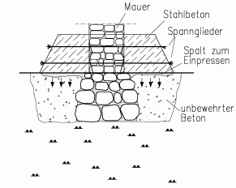
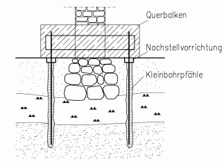
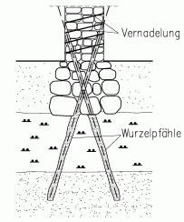
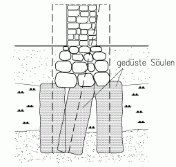

[🠔 Zur Übersicht: Fundament](28bausto.md)  
# Zur Instandsetzung historischer Gründungen durch konstruktive Verstärkungen oder Stopfen des Bodens
**Der Artikel stellt gängige konstruktive Verstärkungen historischer Gründungen vor und beleuchtet kritisch, wann auf Eingriffe verzichtet oder durch Stopfen nachgeholfen werden kann, inklusive Kombinationsmöglichkeiten.**  
_von Prof. Dr.-Ing. Gerd Gudehus_

## Bautechnik und Baudenkmal - Denkmalschutz und Sanierungstechnik

### Prof. Dr.-Ing. Gerd Gudehus, Karlsruhe

## Zur Instandsetzung historischer Gründungen
durch konstruktive Verstärkungen oder Stopfen des Bodens

**Worum es geht**

Historische Bauwerke sind oft auf weichen, d.h. wenig konsolidierten tonigen oder organischen Böden gegründet. Die wenig bis gar nicht vermörtelten Fundamente stehen in lockerer, Baureste enthaltender Auffüllung, der natürliche Boden darunter gibt allmählich nach. (Auf Holzbalken und Holzpfähle und deren Verrottung wird hier nicht eingegangen.) Die Fundamente bilden die älteste Denkmalsubstanz des Bauwerks. Dank ihrer geringen Vermörtelung konnten ihnen unterschiedliche Setzungen wenig anhaben. Salzhaltiges Bodenwasser konnte in ihren großen Poren kaum aufsteigen. Eine Stabilisierung ist notwendig, um das Bauwerk vor weiteren Setzungsschäden oder gar vor dem Einsturz zu bewahren, erst recht wenn Lasterhöhungen für eine andere Nutzung vorgesehen sind. Dabei soll die historische Bausubstanz möglichst weitgehend erhalten und die Standsicherheit überall und jederzeit gewährleistet bleiben. Selbstverständlich muß die Stabilisierung baubetrieblich durchführbar und wirtschaftlich vertretbar sein.

Heute werden verschiedene konstruktive Bauweisen vorgeschlagen, bei denen Tragwerke aus Beton und/oder Stahl an, neben und unter die alte Gründung gesetzt werden. Dabei wird der Fundamentbereich irreversibel eingekapselt und wesentlich beeinträchtigt. Durch das Füllen des Porenraums mit Zement oder Chemikalien werden Kapillartransport und Reaktionen ausgelöst, die dem Bauwerk darüber schaden können. Aus denkmalpflegerischen, aber auch aus wirtschaftlichen Gründen wäre es aber besser, den erhaltenswerten und funktionstüchtigen Fundamentbereich möglichst unangetastet zu lassen. Nicht selten zeigt eine von Vorschriften unbelastete Analyse, daß man besser auf jeden Eingriff im Gründungsbereich verzichtet, aber Erschütterungen und Lasterhöhungen vermeidet; das Bauwerk steht schließlich schon lange, und der Boden ist durch die Setzungen fester geworden. Wenn die Gründung aber künftig zu sehr nachzugeben droht, sollte allein der Boden daneben und darunter verfestigt werden. Hierfür steht eine besonders geeignete Methode zur Verfügung: Das Einstopfen bodenartiger, chemisch neutraler mineralischer Granulate vor. Anders als bei üblichen Injektionen oder Pfählen wird damit der Untergrund nicht verfremdet, sondern nur fester und steifer.

Die gängigen konstruktiven Verstärkungen werden kurz vorgestellt und kritisch beleuchtet. Dann wird dargelegt, inwieweit man auf Eingriffe verzichten oder durch Stopfen schadlos nachhelfen kann. Einige Bemerkungen zur Kombination konstruktiver Verstärkungen mit unveränderten oder gestopften Gründungen bilden den Schluß.

**Konstruktive Verstärkungen**

_Fundamentverbreiterung_

Zur Verbreiterung von Fundamenten kommen beidseitige Balken aus Beton in Betracht. Eine statisch saubere Lösung wäre das abschnittweise Ersetzen der Grundmauern durch Stahlbeton. Vorgeschlagen wird oft das Anklemmen der Betonbalken an das Mauerwerk über dem losen Fundamentbereich mittels Spanngliedern (Skizze). Dauerhaft werden die Schubkräfte von den Balken in das Mauerwerk nur übertragen, wenn dieses fest genug ist oder in sich stabilisiert wird und die Spannkraft trotz Relaxation groß genug bleibt. Die Balken müssen durch Einpressen einer mineralischen Paste in Spalten kraftschlüssig mit dem Boden verbunden werden, um zusätzliche Setzungen klein genug zu halten. Kraftumlagerungen und Verformungen im Gründungsbereich sind schwer zu durchschauen und zu kontrollieren, die historische Gründungssubstanz wird irreversibel eingekapselt.

_Querbalken auf Pfählen_

Beidseits des Fundaments lassen sich Kleinbohrpfähle störungsarm bis zum tragfähigen Boden niederbringen. Ein Anschluß mit gegen das Mauerwerk vorgespannten Streichbalken führt auf die oben dargelegten Probleme. Ein Anschluß mit durch das Mauerwerk geführten Querbalken (Skizze) ist statisch einwandfrei, wenn die Konstruktion aus Beton und/oder Stahl besteht. Das dafür durchlöcherte Mauerwerk ist dieser zusätzlichen Beanspruchung aber oft nicht gewachsen und muß dann verstärkt oder durch Beton oder Stahl ersetzt werden. Wie bei Bergschadensicherungen muß die Konstruktion zur Herstellung eines verformungsarmen Kraftschlusses nachstellbar sein und ist dadurch sehr aufwendig. Ein erheblicher Teil der Denkmalsubstanz geht verloren. Balkenkonstruktionen sind in sichtbaren Raum- und Außenbereichen funktional-gestalterisch störende Fremdkörper.

_Wurzelpfähle_ 

Sogenannte Wurzelpfähle können schräg und über Kreuz durch das Gründungsmauerwerk bis zum tragfähigen Boden führen (Skizze). Bei Ziegel- und Werksteinmauerwerk hat sich diese Bauweise im Ausland bewährt, kam aber in Deutschland wegen statischer Bedenken nicht zur Anwendung. Geschwächtes Mauerwerk muß zunächst durch Verpressen und Vernadeln verstärkt werden. Feldsteinunterlagen bilden praktisch unüberwindliche Bohrhindernisse. 

_Düsenstrahlverfahren_

 

Ein Einpressen von erhärtenden Lösungen, Emulsionen oder Pasten in den Untergrund ist anfechtbar, weil deren räumliche Ausbreitung und Beständigkeit sich schwer kontrollieren lassen. Mit dem Düsenstrahlverfahren lassen sich grundsätzlich Säulen unter alten Fundamenten herstellen (Skizze). Lockere Auffüllung und unvermörtelte Fundamentsockel können jedoch in die durch den Düsenstrahl erzeugten Schlammblasen einbrechen, und die Form der durch Düsen erzeugten Tragkörper läßt sich infolge der Inhomogenitäten des gründungsnahen Bodens schwer kontrollieren. (Das Düsenstrahlverfahren ist bei nicht zu lockerem nichtbindigen Boden zur Sicherung benachbarter Baugruben dagegen gut geeignet.)

_Stopfen des Bodens_

Von schrägen Bohrlöchern beidseits des Fundaments aus kann chemisch neutrales mineralisches Granulat (z.B. Sand) in den Untergrund und die Auffüllung eingetrieben werden (Skizze). Die Bohrlöcher sind noch dünner als für Kleinbohrpfähle und lassen sich durch Verdrängen mit vorsichtigem Schlagen gefahrlos herstellen. Das Granulat wird mittels rückwärts gedrehter Schnecke bei konstanter Axialkraft eingetrieben. Dabei treten praktisch keine Setzungen auf. Anders als beim Einpressen von Fluiden breiten sich eingestopfte neutrale Granulate kontrollierbar aus und verändern sich danach nicht. Der Untergrund nimmt um so mehr Granulat auf, je weicher er anfangs ist, und wird zu einem genügend festen und steifen Baugrund. Alle organischen oder tonigen weichen Böden lassen sich so verdichten und verspannen. Die Auffüllung neben den Fundamenten wird mit geringerem Materialeintrag verdichtet. 
Die Fundamente können sich dadurch nicht spreizen und setzen sich auch unter erhöhter Last nur wenig. Tragfähigkeits- und Verformungsnachweise lassen sich nachprüfbar durchführen. Die historische Substanz bleibt vollständig erhalten, der Bodenaustausch ist sogar reversibel (etwa für spätere archäologische Grabungen). Arbeits-, Geräte- und Materialaufwand sind geringer als bei den vorher genannten Verfahren.

**Schlußbemerkungen**

_Keine Eingriffe_

Durch den erhöhten Druck infolge des Bauwerksgewichts ist der weiche Boden unter den Fundamenten allmählich etwas dichter und damit fester und steifer geworden. Die berechenbaren weiteren (sogenannten sekundären) Setzungen können vom Tragwerk verkraftet werden, wenn dies nicht nahe dem Platzen oder Umkippen ist. Sekundäre Setzungen können allerdings nichttragenden Bauteilen (z.B. Putz) schaden. Ihre Zunahme läßt sich durch Verminderung des Bodendrucks (z.B. Abtragen von Schutt) weitgehend vermeiden. Selbstverständlich ist der Boden vor Erschütterungen und Grundwasserveränderungen zu bewahren.

_Kombinationen mit konstruktiven Verstärkungen_

Gelegentlich wird vorgeschlagen, einen Teil der Bauwerkslasten durch Konstruktionsteile in tragfähigeren Untergrund zu leiten, einen Teil über die Gründungssohle in weichere Bodenbereiche. Das Tragverhalten ist dann aber selbst bei Neubauten auf gutem Boden (z.B. Hochhäuser auf Frankfurter Ton) mechanisch schwer und bei historischen Gründungen auf weichem Untergrund kaum noch zu durchschauen. Statisch einwandfrei wäre allein das Nachstellen durch hydraulische Pressen an Pfählen, der Aufwand ist aber enorm. Schwierig ist auch eine Nachgründung mit Pfählen in nur einem Teil des Bauwerksgrundrisses: Der Übergang kann nur mit kontrollierbar nachgiebigen oder nachstellbaren Pfählen so gestaltet werden, daß Setzungsschäden ausbleiben.

[Klaus Maisch: Stabilisierung durch Stopfen im Detail](stopfen.md) 
[Uni Karlsruhe, Institut für Bodenmechanik und Felsmechanik Abteilung 1,](http://www.ibf.uni-karlsruhe.de/) ehem. Leitung, jetzt Mitarbeiter: Prof. em. Dr.-Ing. Gerd Gudehus
