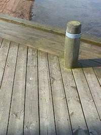
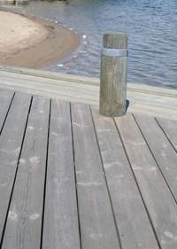

[🠔 Zur Übersicht: Wand & Fachwerk](29bau09.md)  
# Holzschutz ohne Gift: Sanierung statt Vergiftung
**Der ultimative Leitfaden gegen Hausschwamm, Hausbock und Fäule: Warum konstruktive Trockenlegung jede Chemie schlägt und wie Sie holzzerstörende Pilze und Insekten ohne gesundheitliche Risiken stoppen.**  
_von Konrad Fischer_

## Holzschutz mit und ohne Gift

### Holzschutz-Fachinfo zu Holzschädlingen und holzzerstörenden Befall wie Korrosionsfäule, Destruktionsfäule, Naßfäule, Trockenfäule, Moderfäule, Würfelbruch und Holzfraß durch Hausschwamm (Serpula lacrymans), Brauner Kellerschwamm/Kellerwarzenschwamm (Coniophora puteana), Weißer Porenschwamm (Antrodia vaillantii), Moderfäule, Gemeiner Hausbock (Hylotrupes bajulus L.), Brauner Splintholzkäfer (Lyctus brunneus), Holzwurm (Anobium punctatum, Anobien), Gescheckter/Bunter Nagekäfer, Totenuhr (Xestobium rufovillosum), Termiten usw.

 
Der echte Hausschwamm: Drei Fruchtkörper auf dem Holzdielen-Fußboden im Erdgeschoß eies alten Bauernhauses (Quelle: Bauberatung) - [Zur Fallbeschreibung Hausschwammbefall](29bau19.md)

Eines Tages in den 80ern erschien die Kripo in meinem Büro, um die Todesursache eines an Krebs gestorbenen Handwerkers zu ermitteln. Er arbeitete vorher in einem normgerecht holzschutzbehandelten Dachstuhl als Trockenbauer. Kurz danach fragten Pfarrer in von uns sanierten Fachwerk-Pfarrhäusern nach angewendeten Holzschutzmitteln. Dann eine Anfrage der Landeskirche wegen einer in einem Fachwerkhaus erkrankten Dekansfamilie. 

Unsere Normengläubigkeit muß also auf den Prüfstand, denn es kann doch nicht das Gelbe vom Ei sein, mit Giften wie Lindan, PCB und auch Natriumborat (Borax), Kupferlösungen und Chromaten im Haus das Wohnumfeld und die Baukonstruktion gegen allerlei Tierchen, Schimmel und Mikroorganismen herumzuschützen, und dabei den Menschen außer Acht zu lassen. Dabei ist zur Wirkung der üblichen Giftkeulen anzumerken, daß sie zwar zugelassen sind, weil sie für Lebewesen tödliche Gifte enthalten, daß aber die Norm-Prüfverfahren für die Zulassung der vergifteten Tunke diese im Einsatz am Bau nur bedingt bis überhaupt nicht prüfen und damit eine echte Schutzwirkung im gewollten Sinne nicht unbedingt vorliegt. Wer sagt denn, daß ein Schadinsekt so dumm ist, und die vergiftete Oberfläche frißt und nicht ausspuckt? Und wer sagt denn, daß die Toxizität noch im gewollten Sinne vorliegt, wenn das Gift in die sonstige Suppe gemischt wurde? Die Fälle des Neubefalls trotz Vergiftung sind Legion! Wir müssen also nach Alternativen zu den gängigen und genormten Gefahrstoffen suchen, in den Methoden und den anzuwendenden Mitteln. Am Markt gibt es dafür ja verschiedene Lösungen, allerdings mangels Gift (!) bisher nicht RAL-, normungs- und zulassungsfähig.

 
Deutsche Giftmischer zum Wohle der Umsätze in der Baubranche 

Wobei die Nachfrage nach Lösungen, die das schädlingsbefallene Haus nicht dauerhaft in eine Sondermülldeponie verwandelt, durchaus auch Seltsamkeiten erzeugt. Wer sagt denn beispielsweise, daß nach einer Vergasungsbehandlung mit Giftgasen ein neuer Schädlingsbefall sicher ausgeschlossen ist? Ebenso wie bei einer thermischen Heißluftbehandlung, die zwar wie das Giftgas im Anwendungszeitraum absolut tödlich und vernichten sein mag, dafür Holz- und Kosntruktionsrisse wegen thermischer Erhitzung, Temperaturspannung und Trocknungsschwund erzeugt, dem zwar durch Befeuchtungstechnik vorgebeugt werden soll, aber auf alle betroffenen Bauteile dennoch erheblichen mechanischen/klimatischen Streß ausübt. Und wenn wir darüber nachdenken - ja, das dürfen wir uns durchaus gönnen, auch bei solch kritischen Fragen voller Angst, Zweifel und Pein, Schmer, Not und Märchenhaftem, daß Holzschädlinge nun mal leben, und als vom lieben Gott erschaffene raffinierte Überlebenskünstler wie wir alle nur darauf warten, daß wieder günstigere Zeiten kommen und der Tisch wieder mal besser gedeckt sein wird, als im ausgedörrten oder vergasten Trockenholz, dann wird uns sofort bewußt, worum es wirklich geht beim dauerhaften Holzschutz: 

Die Lebensbedingungen der lieben, aber gefräßigen Hausgesellen am und im Holz sind die entscheidende Frage, die es zu lösen gilt. Nicht die Vernichtung derer Existenzen. Und schon ist klar - nur Methoden, die dauerhaft die Lebensbedingungen unter das lebenswerte Level der "Schädlinge" senken, kommen für ein überzeugendes Holzschutkonzept in Frage. Und sonst eigentlich nix. 

Wenn wir da nur an all die Angriffe auf die Restauratoren denken, die ihnen ihre lieben Zunftgenossen im Holz-Kunstwerk hinterlassen haben, ohne dessen Umgebungsbedingungen (Klima: Wärme+Feuchte) so zu verbessern, daß es für die vom Holz lebenden Viecher total uninteressant wird und bleibt, kann es einem schon schlecht werden. Wie bei so vielem in der Sanier-Zunft. Doch genau gegenteilig arbeitet die Holzschutzbranche, denn sie will am auf Dauer vergeblichen Holzschutz mit falschem Konzept eben dauerhaft verdienen. Auch ein Standpunkt. 

So unternimmt der Holzschutz-Normenapparat Übermenschliches, um den dauerhaften Holzschutz ohne Gift zu bekämpfen, vorzubeugen und sich und den Kunden und sein Holz davor bestmöglich zu schutzen. Mit Holzschutz-Schutzmitteln, die beißen! 

Selbst der konstruktive Holzschutz, den ich schon aus Grundsatzüberlegungen bevorzuge, kommt durch die total der Lobby unterworfene und bürgerfeindliche EU-Normentwicklung unter die Räder. Zukünftig muß dann wohl alles Bauholz - egal wo es zum Einsatz kommt - soweit man nach der perfiden Umsatzsteigerungsnormierung arbeitet (und freilich machen da alle auf Kosten des doofen Bauherren allzugerne mit!) vergiftet werden. Da reiben sich die üblichen Verdächtigen wieder mal die Hände. Perfekte Normung - wofür bezahlt man denn seine Leute?

Dabei muß man doch nur ein bisserl wissen, wie und wo die guten Tierlein und Schwämmchen so gerne leben, um ihnen die entwicklungsmöglichkeiten mit konstruktiver Vergrämung ausreichend madig zu machen und sie zu vergrausen. Doch Holzschutzschwachverständige ergehen sich für ihr Schlechtachten lieber in teuerster und papierverschwendenster Analytik, verleihen den Holzverspeisern deutsche und lateinische (oft sogar falsch geschriebene) Vornamen und empfehlen dann den chemieverkeulten Rundumschlag und Rückschnitt bis zum Bauwerksabbruch. Selbstverständlich mit Meldepflicht. Für derart vorhersehbare Ergebnisse hätte man sich freilich alle Bestimmerei als typisch verwissenschaftlichten und vorsätzlichen Betrug schenken können.

Dabei hätte ein bisserl konstruktiver Durchblick genügt, erstens nur die nicht mehr tragfähigen Holzteile - sie werden durch geeignete Voruntersuchung wie Freilegung, Abbeilen, Bohrwiderstandsmessung BWM (Resistographie), statische Berechnung der Tragfähigkeit des Restquerschnitts usw. ermittelt - auszubauen - und wenn der Rest noch trägt, nicht mal diese! - und durch Neuholz fachgerecht zu ersetzen. Und zweitens die Baukonstruktion durch geeignete Maßnahmen wie ausreichenden Witterungsschutz, Belüftung (keine den Raum hermetisch abdichtenden Isolierglasfenster mit Gummilippen!) und/oder ein kondensatvermeidendes Heizsystem (Hüllflächentemperierung oder gezielte Bauteiltemperierung) so trocken zu halten, wie es sich eben gehört und keinem Holzschädling mehr gefällt. Auch das kann das Ergebnis einer Bauwerksuntersuchung / -begutachtung mit Schadensermittlung, Schadensanalyse, Schadensgutachten, Bauberatung, Sanierungsplanung und Bauwerksinstandsetzung sein.

Was passiert dagegen in der expertengesteuerten Baupraxis? [Isolierung, Abdichtung und Volldämmung](213baust.md) mit energetisch wirkungslosen aber [feuchtesaugenden "Dämm-Baustoffen"](2134bau.md), damit die Bude auch garantiert bis zur letzten Ecke absäuft und "bekämpfende/vorbeugende" Vollvergiftung und Verwandlung des Bauwerks in menschenfeindlichen Sondermüll. Inzwischen sollen die WDVS-Fassaden gegen das Absaufen durch die bisher unvermeidliche nächtliche Kondensataufnahme der schnell nachtgekühlten Dämmhaut beheizt werden - die Ewald Dörken AG hat dafür 2011 das Patent zur Elektroheizung und Warmwasserbeheizung der WDVS-Oberfläche erhalten. Anstrengungen über Anstrengungen. Der Kunde zahlt ja für das Zeugs, das ihm die moderne Marketing-Massenhalluzinations-Erzeugungstechniken eingeflüstert hat. Selbstverständlich wiederum nach lobbybereichernder Norm und letztlich freilich alles unwirksam. Modern modern heißt die Devise. Wenn nämlich die Lebensbedingungen stimmen, beißt sich der Schädling schon durch, siedelt sich das Pilzlein schon an, frißt sich die Alge fest. 

Außerdem sind alle Gifte mehr oder weniger wasserlöslich und bauen sich dadurch im nassen Bauteil ab. Die Chemiekampfstoffe altern auch, gasen aus, verlieren damit ihre sollgemäße Wirkung, die freilich auch nur auf seltsamen Labortests beruht und nicht immer den Tatsachen am und im Bauwerk entspricht. Das merkt der betrogene Bauherr bloß nicht so schnell. Und wenn, dann ist die Gewährleistungszeit meist vorbei. Mein Tipp: Wer sowas will, soll sich die irre Kosten für die konstruktiv und bauklimatisch meist ahnungslosen bzw. nicht ausreichend sattelfesten "Experten" besser sparen, und gleich den Verkäufer / Sanierberater / Pharmareferenten der Giftmittel und Feuchtefallen kommen lassen. Der macht im Ergebnis das Gleiche für weniger Geld. Gerne auch beim privaten Bauherren. 

Und der spart sich so die geschenkebeladenen Besuche des Pharmareferenten bei "seinen" Experten, denen er meist sowieso das ganze Sanierprojekt hinter dem Bauherrenrücken ausarbeitet und "kostenfrei" zuschanzt. Die Planungsleistung ist im Produktpreis ja schon inbegriffen. Deutschland gestern, heute und morgen!

Ach ja, ausgerechnet in Glücksburg hat die Evangelische Kirchengemeinde für ihr altes Pastorats-Gebäude (Pfarrhaus) in der Rathausstraße die schreckliche Nachtrags-Rechnung der Giftspritzer präsentiert bekommen: 

Am 7. August 2009 kann man den dortigen Zeitungen entnehmen, daß das Haus hauptsächlich wegen seiner Vergiftung durch die bei der laufenden "Entkernung" zutage getretenen schadstoffbelasteten Althölzer abgerissen werden muß, da es sonst weitere 300.000 EUR zur Sanierung brauchen wird. Da waren offensichtlich ausschließlich ausgewiesene nordische Experten am Werk: 

Erst ohne ausreichende Voruntersuchung auf Schadenssituation und Bestandskontamination - ein Muß bei jeder fachgerecht vorbereiteten Generalsanierung! - eine geradezu irre Baumaßnahme anlaufen lassen, bei der bis zum "überraschenden" Sanierungsabbruch schon flotte 200.000 EUR Planungs- und Baukosten vergurkt wurden. Immer während der mühselig finanzierten und dann anlaufenden Sanierung stellten sich dann immer weitere Mängel heraus, gegen die ja kein billiges, sondern nur Nachtrags-Kraut zu Nachtrags-Preisen (Jeder, sogar in Bayern, weiß, was das im Klartext heißt!) wachsen konnte. Eine herrliche Wunschbaustelle für baukostenabhängig honorierte Planer und nachtragsbejubelnde Handwerker mit Kostenexplosionen ohne Ende. Und dann eben als vorläufiger Höhepunkt einer auf Sand gebauten Baumaßnahme: Sanierungsstop und Neubau, der angeblich wesentlich billiger kommen soll. 

Typische Folge einer Norm-Holzschutz-Vergiftung? Und ob der arme Pastor Thomas Rust, der mit seiner siebenköpfigen Familie dort 5 lange Jahre im giftgeschwängerten Bau hausen mußte, noch befriedigende Blutwerte aufweist, ebenso die detaillierten Umstände des gesundheitlichen Befindens seiner ebenso holzschutzgiftexponierten Frau und Kinderschar, ist hier nicht bekannt. 

Das schon neu draufgesetzte Kirchendach und die ebenfalls erneuerten Fenster (gummilippendicht, klaro), will man aus Ersparnisgründen beim Neubau weiterverwenden. Ob die Hölzer schon auf Norm-Giftgehalt untersucht wurden? Ob mit den neuen Fenstern und dem damit verbundenen hohen Schimmelrisiko nun der Pfarrersfamilie endlich doch der Garaus gemacht werden soll entzieht sich unserer Kenntnis. Ebenso, ob man nicht die Schadstoffkontamination durch die gängigen Techniken zur Maskierung / Isolierung inkl. sachgerechte Raumlüftung unter Beibehaltung der Altfenster und den Bau insgesamt durch reparierende Instandsetzungstechnologie wesentlich besser und billiger hätte sanieren können, ebenfalls. Mein Tipp: Holzauge, sei wachsam!

Wer es lieber "klassisch" giftig mag, benutze die Surftipps für Dialektiker. Hier gibt es kein Meinungsmonopol, sondern freie Information!

---

Ein Beitrag für den Holznagel, Mitteilungsblatt der [Interessensgemeinschaft Bauernhaus IGB e.V.](http://www.IGBauernhaus.de) zur Anwendung eines alternativen (nur in der Schweiz zugelassenen) giftfreien mineralischen Holzschutzmittels bei Hausschwamm (leicht gekürzt): 

**_"Schwammsanierung - selbst gemacht!_**

_Beim Lesen des letzten Holznagels [August 2000] habe ich mich besonders gefreut, einen alten Bekannten wiederzutreffen, Herrn Konrad Fischer. Wie es zu dieser Bekanntschaft kam will ich kurz schildern._

Wir haben Anfang 1998 ein altes Bauernhaus im Land Brandenburg gekauft. Ende 99 war es dann so weit, die Wohnung war fast bezugsfertig. Das Dach war erneuert, im Erdgeschoss die Elektrik neu, alles verputzt, in einem Raum neue Dielen, im anderen sollten die schönen alten Dielen erhalten bleiben und abgeschliffen werden. 

An einem Arbeits-Wochenende fiel mir auf, dass zwischen der Wand und den neuen Dielen etwas wie Bauschaum hervorquoll. Bei näherer Betrachtung ergab sich der Bauschaum als Pilz. Hausschwamm! Diese Diagnose war schrecklich. Mir wurde geraten, mich unbedingt an einen Sanierungsfachbetrieb zu wenden. Zudem schwebte das Damoklesschwert der Meldepflicht über uns. Erst viel später erfuhren wir, dass im Land Brandenburg gar keine Meldepflicht bei Hausschwammbefall besteht.

Der von mir eingeschaltete Fachmann riet uns zur Komplettsanierung, also dem Austausch des gesamten Mauerwerks im Kellerbereich und Erdgeschoss und dem Herausnehmen, Entsorgen und Erneuern aller Holzteile. Die dafür angesetzten Kosten waren so hoch, dass wir sie gar nicht hätte tragen können, denn von unserem Haus wäre nicht mehr viel übrig geblieben. Die von ihm anvisierte chemische Keule zur Nachbehandlung und Vorsorge hätte uns möglicherweise ein Leben in diesem Haus unmöglich gemacht.

In meiner Not machte ich mich bei Nacht und Nebel auf ins Internet! Auf der Seite des [Bau.Net Forums](http://www.bau.net/) waren etliche Beiträge zu diesem Thema. Und hier traf ich schließlich Herrn Konrad Fischer, der Ratsuchenden antwortete. Ich surfte zunächst auf seiner [Homepage ](index.md)(was sich wirklich lohnt!) und wandte mich dann direkt an ihn. Herr Fischer empfahl, die Sanierung mit [GMH] durchzuführen: einem völlig giftfreien Mittel, das den Schwamm verkieselt.

Zunächst war ich von diesem Konzept begeistert, aber doch noch etwas skeptisch. Also entschloss ich mich, den Erfinder zu besuchen, weil ich sichergehen wollte, dass die Sanierung mit [GMH] auch in einem so krassen Fall durchführbar wäre. Theoretisch war mir danach die Sache völlig klar, aber wie würde es sich in der Praxis bewähren?

Und wie es sich bewährt hat! Zunächst hatten wir alle betroffenen Fußböden herausgenommen und die Sandschüttung darunter entsorgt. Die freigelegten Kappendecken haben wir besprüht, in die betroffenen Mauerteile weiträumig mit einem 16 mm starken Schlagbohrer Lochreihen gebohrt und diese dann mit [GMH] getränkt. Die herausgenommenen Dielen wurden mit [GMH] eingestrichen und werden nun zum größten Teil wieder verwendet. [GMH] wirkt wie gesagt, sowohl im Holz als auch im Mauerwerk: Das Resultat wird nach kurzer Zeit sicht- bzw. fühlbar: das Holz, sogar die vom Schwamm zersetzten Bereiche, erhärteten sich zusehends, das Lehm-Mauerwerk verfestigte sich an den geschädigten Stellen enorm und die Myzelstränge (Wurzeln, bzw. Verästelungen) wurden durch die Verkieselung zerstört. Unser Haus ist nicht vergiftet! Wir konnten das Problem selbst lösen, ohne konventionellen Sanierungsfachbetrieb, ohne aufwendigen Mauerwerksaustausch und das alles ohne jegliche chemische Keule!

R. K."

Anmerkung: Die Bekämpfung und Vorbeugung von Holzschädlingen hat allerdings wesentlich mehr Aspekte, als das Finden des angemessenen Holzschutzmittels. Ohne Klärung des Wirkungszusammenhanges, daß es überhaupt zum Schädlingsbefall kam, hat die schönste Anwendung nämlich keinen großen Sinn. Also: Woher kommt die Feuchte, die erst das Leben der Schädlinge - egal ob Hausbock (Hylotrupes bajulus), Scheibenbock, Parkettkäfer, bunter/gescheckter Nagekäfer (Xestobium rufovillosum), Trotzkopf (Coelostethus pertinax) und Holzwurm (Anobien, Anobium punctatum), oder holzzerstörende Pilze und Schwämme wie echter Hausschwamm (Serpula lacrymans), Weißfäule und Braunfäulepilze - ausgebreiteter Hausporling (Donkioporia expansa) - Eichenporling, Brauner Kellerschwamm und Weißer Porenschwamm, Sklerotien Hausschwamm (Leucogyrophana mollusca), Gelbrandiger Hausschwamm (Leucogyrophana pinastri) und Kleiner bzw. Balkenbewohnender Hausschwamm (Leucogyrophana pulverulenta), Blättlinge wie Zaunblättling und Balkenblättling, Porlinge wie Eichenporling, Hausporling sowie allerlei sonstiger Porenschwämme ermöglicht. Dabei muß man sich hüten einmal vor der oft nur vermeintlich hilfreichen detaillierten Bestimmung der ungeheuerlichen Vielfalt diverser Schädlinge in deutschen und lateinischen Begrifflichkeiten durch sog. Holzschutzsachverständige, die doch nur - trotz aller Pseudo-Exaktheit! - in der handelsüblichen Chemiekeulen-Anwendung "eine für alles" landen, aber vielleicht noch mehr vor den gängigen, aber falschen Deutungsmustern wie ["kapillar aufsteigende Feuchte"](2aufstfe.md) (in Mauerwerk so gut wie ausgeschlossen) oder fehlende Bodenabdichtung ([Folien und Dämmstoffe](213baust.md) wirken bei üblichen Konstruktions- und Nutzungsverhältnissen geradezu als Feuchtefalle und -reservoir). Hier braucht es halt doch den Konstruktionsdurchblick mit sachgerechter Analyse der objektbezogenen Nutzungszusammenhänge von den tatsächlichen Feuchtequellen bis zur [schädlichen und befallsfördernden Heizungs- und Klimatechnik](7temper.md). Wie oft kam nach der DIN-gerechten - und damit meist völlig überzogenen, unsinnigen und gesundheitsschädlichen Holzschutzmaßnahme erst recht der Totalangriff des Hausschwamms! Hintergrund: Planungs- und Ausführungsmängel. Und außerdem kann man bei vielen HSM-Anwendungen ja nicht davon ausgehen, daß wirklich jeder Holzbestandteil erfolgreich "erwischt" wurde. Deswegen:

An erster Stelle steht immer die Beseitigung der Lebens- und Fortpflanzungsbedingungen für Holzschädlinge. Erst danach sollte man über den Einsatz von objektbezogen geeigneten Holzschutzmitteln HSM nachdenken. Ausnahme: Voll bewitterte bzw. voll angegriffene Hölzer (Gartenholz, Zäune, Fenster, Außentüren, Schwellen, in Boden eingelassene Hölzer, Schiffsbauholz, ...).

Vor allem bei der Hausschwammangst müssen völlig unbegründete Märchen, die wohl die Giftmischer und Giftspritzer zur Umsatzförderung in die Welt gesetzt haben, überwunden werden: 

Es gibt keinen lebensfähig-aktiven Hausschwamm auf trockenem Holz, der sich von irgendwo seine Nässe zieht! Ganz im Gegenteil braucht das Myzelanwachsen bzw. Keimen von Hausschwammsporen immer mindestens 20 % Holzfeuchte, eine Luftfeuchtigkeit der Umgebungsluft von mehr als 82 % und so gut wie absolute Windstille bzw. keine Luftbewegung. 

Und selbstverständlich müssen bei Hausschwamm, der sein Holzzerstörungswerk ausschließlich von der Holzoberfläche her betreibt, keine über den zerstörten, nicht mehr ausreichend tragfähigen Bereich hinausgehende Sicherheitsrückschnitte der Holzquerschnitte erfolgen, oft genügt nur das leichte Ausstemmen der nur an der Oberfläche geschädigten Holzbereiche, wenn überhaupt. Denn der Befallsherd und alle Pilzbestandteile können im denkmalpflegerischen oder kostenmäßigen Härtefall auch einfach an Ort und Stelle - nach denkmalpflegerisch geblähtem Sprachgebrauch "in situ" belassen werden, soweit die o.g. Randbedingungen für den Befall künftig sicher vermieden werden können. 

Und deswegen ist auch alle Bohrlochtränkung von Mauerwerk rund um den Hausschwammbefall reine kostentreibende - oder wegen dessen auffeuchtender und giftkontaminierender Wirkung sogar äußerst schädliche - Augenauswischerei, die nur die Planungshonorare unterfinanzierter Planerpfeifen und Baukosten nach oben treibt, selbst wenn von "denkmalerfahrenen" und "von der Denkmalpflege empfohlenen" Fachleuten für die Sanierung denkmalgeschützter Burgen und Schlösser, Bürgerhäuser, Villen und Bauernhäuser, Holzbrücken, historischen Dachtragwerken und Stadeln wärmstens und ahnungslosest empfohlen, die oft besser den Titel "zertifizierter Denkmalvernichter" oder auch "kompetent-erfahrener Zuschußmittelvergeudungsprofi" verdienen würden. Denn wer von den normgläubigen Denkmalpflegeplanern - egal ob Architekten, Bauingenieure, Bautechniker, Holzschutzsachverständige oder sonstige Experten - hat sich außer der Auswendiglernerei der DIN 68800, insbesondere deren § 4.2.1, nach dem 

_"alle befallenen Holzteile ... ein ausreichendes Stück über den sichtbaren Befall hinaus zu entfernen (sind), ... bei Echtem Hausschwamm und verwandten Hausschwammarten um mindestens 1 m in Längsrichtung der Hölzer. ... Im Zweifelsfall ist so zu verfahren, als ob Befall durch den Echten Hausschwamm vorliegt"_ 

und weiter dem 

§ 4.3.3: _"Ist das Mauerwerk von Myzel durchwachsen, ist grundsätzlich eine Bohrlochtränkung oder durch Druckinjektion ein Verpressen mit einem chemischen [=hochgiftigen!] Schutzmittel [gräßlicher Euphemismus] nach § 3.1 zur Bekämpfung von Schwamm im Mauerwerk vorzunehmen. Bei Mauerwerk aus Hohlkammersteinen und bei zweischaligem Mauerwerk sind die Hohlräume ausreichend auszuspritzen. Der Sanierungsbereich – einschließlich eventueller Putzentfernung – soll sich auf 1,5 m in alle Richtungen vom letzten erkennbaren Pilzmyzel erstrecken."_ 

- egal ob der "Befall" nun Fall A: aktiv oder Fall B: 100.000 Jahre alt und seit ewig abgestorben ist (!), und evtl. dem Ankauf des "Grosser" (Dietger Grosser: Pflanzliche und tierische Bau- und Werkholz-Schädlinge) für die Fachbbibliotheksvitrine wirklich mit den Lebenstatsachen der possierlichen insektuösen Holznagerli und liebreizenden holzfressenden Pilzchen beschäftigt und kann deswegen wirklich sinnvolle und kostengünstige und gesundheitlich unkritische und substanzschonendste Holzschutzmaßnahmen im Kleinen oder Großen planen und bauleiten und durchführen bzw. an deren Verwirklichung sachgerecht mitwirken? Und zwar ganz ohne die beliebten schwammfördernden DIN-Kondensatfangdachfolien und [schimmelpilzzüchtenden hermetischen Energiesparfensterkonstruktionen neumodischster Verrücktheit](23bausto.md)? Bitte bei den Denkmalpflegeämtern melden, dieses eine mal vielleicht auch ohne die obligatorischen Rotweinfässchen oder Frankenweinkistchen betr. Beziehungspflege. 

Und bitte stellen Sie sich jetzt mal nur spaßeshalber das zweischalig, in der Außenschale oder auch Innenschale meinetwegen gerne mit Hohlkammersteinen oder Hohlziegeln oder Lochsteinen gemauerte, an einigen Deckenbalkenköpfen hausschwammbefallene Villengebäude der Gründerzeit oder rißdurchzogene mittelalterliche Burgmauerwerk vor, das nun "vorschriftsgemäß" vollgetränkt wird, obwohl sich kein einziges Holztrumm dort verbirgt, das irgendwie unter ungünstigen Randbedingungen neu befallen werden könnte und deswegen eigentlich 

DIN 68800 § 4.3.4: _"Auf die Durchführung chemischer Maßnahmen kann verzichtet werden, wenn im Befallsbereich sämtliche Hölzer entfernt und durch nicht befallbare Baustoffe und/oder Bauteile (z.B. Beton, Stahlbeton, Stahl) ersetzt werden, auch anderweitig kein Holz und/oder Holzwerkstoffe neu eingebaut werden ..."_ 

ziehen würde. Was glauben Sie, wieviel Giftbrühe (ich kenne den/die Hersteller/Verarbeiter und auch deren Lieblingsplaner, Sie vielleicht auch?) da reinfließen kann? Und wenn es um die Zentimeterfeilscherei geht, wer kennt da nicht den Ossiholzschutzschwachverständigenspruch, der auch im Westen leider weit genug verbreitet ist: "Darf's sicherheitshalber ein bisserl mehr sein?" Armes Bauwerk und Armer Bauherr!

Ernstgemeinter Literaturtipp, dem ich einige Faktendetails und auch DIN-Argumentationen verdanke - in vollständiger Übereinstimmung mit meiner Erfahrung an zig Fällen: Dr. Ingo Nuss (ein Mykologe aus Mintraching), Der Hausschwamm - Mythos und Wahrheit, in: Der Bausachverständige 6/2009.

Fazit: 1. Korrekte Befallsanalyse, 2. Ursachen beseitigen, 3. Neubefall mit einfachsten Mitteln verhindern.

Ein paar schöne Beispiele aus Skandinavien zeigen, wohin man mit einem giftfreien Holzschutzsystem kommen kann, wenn man dauerstabilen Schutz an bewitterten Problemkonstruktionen anstrebt:

Vorzustand - ein Bootsteg mit angegrünten, bei Regen recht schmierigen Oberflächen - wer kennt das nicht? Das wurde nun abgedampft, mit giftfreiem (!) und umweltverträglichem mineralisierendem Holzschutz getränkt, darüber ein zum System passender (sonst Ablöseeffekte!) und oberflächenstabilisierender Wetterschutzanstrich wirkt gegen Ausspülung/Auswaschung des Holzschutzmittels, und fünf Jahre stehen gelassen. Pflegeaufwand? Frühling und Herbst einmal dampfstrahlen um den sich unvermeidbar ansetzenden Staub und Dreck wegzuspülen.

Der Bootsteg nach 5 Jahren. Im Detail.

Das gleiche Schutzsystem - durch Ausbildung der Mineralisierung nach einiger Standzeit aufgehellt - auf einer Gartenterrasse durch die Jahreszeiten Sommer 05-Winter-Frühling-Sommer 06: 

.

Schneefracht auf der Holz-Terrasse Winter 05 im Detail: 

Am 15. August 2008 von mir persönlich nach drei Jahren Bewitterung fotografiert:  

Und ein paar Häuser weiter, das gleiche Schutzsystem, offenbar ansteckend:    

Ein Nachbar war schlauer und hat seine Terrasse lackiert. Das Ergebnis nach einem Jahr: 
 

Doch nicht so schlimm, wenn er renoviert, kann er ja auch was Gscheites nehmen ... 

In der gleichen Siedlung probieren Hausbesitzer das neue Schutzsystem auch an der Fassade aus. Sie haben Lärchenholz-Verkleidungen. Raten Sie, welche zwei Fassaden geschützt sind: 

 
Und zwar einfach durch Überstreichen der schon schwarz angewitterten Lärchenbretter. Die so bei den "ungeschützten" Nachbarn aussehen: 

 
Kann man auch sehen. Verwittert halt vor sich hin,wie es will. Macht das was aus? 

Ist die geschützte Oberfläche zu schön, zu sauber, zu geleckt, zu geschniegelt? 
 
Ist halt Geschmackssache. 

So sieht es hochalpin dann aus, nach einigen Jährchen Bewitterung - erst mal die UV-belasteten und deswegen natürlicherweise verschwärzten / schwarz gewordenen / geschwärzten Sonnenseiten Ost, Südgiebel (ebenso West): 

 

Und so an der Nordseite: 
 
Auch schön, oder? Das ist eben typisch Lärche, im UV-Bereich verschwärzend, im Nordbereich vergrauend / grau werdend. Wir Bergfreunde können damit leben - Triheiholzderjöh! ... Noch einige Lärchen-Impressionen: 

 
Wenn etwas Wasser auf die frische Lärchenoberfläche kommt, wäscht es auf unbehandelten Holzoberflächen zunächst mal die lärchentypischen leicht löslichen Holz-Inhaltsstoffe aus. Das ist dekorativ! Und mit der Zeit verwächst / verwäscht sich das doch ... 

 
Baujahr 1994, Aufnahme 2008. So schnell geht es also gar nircht, wenn das Holz gut überdacht ist. Wo die Sonne hinkommt, setzt freilich die Verschwärzung ein. 

.  
Natürliche Oberflächen bieten im Bewitterungsfall freilich keinen Schutz gegen Insektenbefall. Wo sich Feuchte in Ritzen, Fugen und Hirnholzbereichen anreichern kann, hat so ein Nagetierchen leichtes Spiel. 

. . 

OK, Lärche - egal ob frisch, vergraut oder geschwärzt - schmeckt dem Holzbock - na und? 

. 

Weitere Fallbeispiele: 

. . 

Und daß ungeschützte Lärchenschindeln gut total verwittern, ist auch keine Neuigkeit. Sieht irgendwie sogar grafisch dekorativ und toll aus, oder? Wenn nämlich genug Wasser dran kommt, wäscht das schwärzende Zeugs aus dem Lärchenholz in recht kurzer Zeit vollkommen aus und die Oberfläche der Lärchenschindel wird total silbergrau. So wollen wir es haben. Freilich leidet darunter auch die Stabilität der Holzfaserbindung. Nobody ist perfekt ... 

. . 
Eine Almhütte 

.  
Ein herrlicher Bergstall aus Lärche pur, schon ein paar Jährchen bewittert. 

 
Dieses Lärchenschindeldach hat auch schon ein paar Jahre auf dem Buckel. Ein mineralisierendes und wetterstabiles / regensicheres Holzschutzsystem wäre vielleicht eine Idee gewesen ... 

 
So geht's doch auch! 

**Fachliteratur und Angebote Holzschutz** 

---

**Surftipps für Dialektiker - Gegenteilige/Ergänzende Links - Nix und niemand glauben - Bilden Sie sich eine eigene Meinung - Wundermittel darf es nicht geben, oder?: 
**[Holzschutzmittel: Materialkunde - heimwerker.de](http://www.heimwerker.de/service/heimwerker-lexikon/holzschutzmittel.htm) <> [Was sind Holzschutzmittel?](http://rhein-zeitung.de/on/96/11/17/topnews/holz1.html) <> [Giftige Holzschutzmittel im Wohnbereich? Pressinfo](http://www.umweltdaten.nuernberg.de/info/v984_02.html) <> [Bundesweite Selbsthilfegruppe Multiple Chemical Sensitivity (MCS) - Chronic Fatigue Syndrom (CFS) e.V.](http://klinik-tv.de/mcs/) <> [Gefährdungsklassen Holzschutzmittel](http://www.fertighaus.de/f_haus/info/holzsch.htm) <> [Gefährliche Holzschutzmittel?](http://mainz-online.de/old/96/11/18/topnews/holzneu.html) <> [Ansprechpartner zum Thema Holzschutzmittel](http://mainz-online.de/old/96/11/17/topnews/holz5.html) <> [Noch nicht alle Wirkungen vom Holzschutzmittel PCP in der Bevölkerung bekannt! - Tote schweigen.](http://www.free.de/WiLa/Arbeitsschutz/pcpmhqh3.htm) <> [BAULINKS.de: Hersteller von Farben, Lacke, Dispersionsfarben, Grundierungen, Grundierung, Holzlasuren, Wasserlacke](http://www.archmatic.com/) <> [Selbsthilfegruppe der Chemikalien- und HSM-Geschädigten](http://www.wuerzburg.de/shg-chemholz/) <> [BAUHERR.DE Farben Lacke Farbstoffe Pigmente Lösemittel Kalkfarben Kunststoffdispersionsfarben Silikatfarben Leimfarben Anstrichstoffe Holzschutzmittel Naturharz-Dispersionfarben](http://www.bauherr.de/baustoffe/farbe_lack.htm) <> [Deutscher Holzschutzverband - Homepage](http://www.holzschutz.com/)
