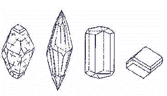

[🠔 Zur Übersicht: Kalk](26bausto.md)  
# Luftkalkmörtel und seine aktuelle Vergütungspraxis 1
**Aufklärung und ein paar kritische Worte zum Problem der Rezeptur von Kalkprodukten**  
_von Konrad Fischer_

> [!abstract]+ Kapitelübersicht: Luftkalk Vergütung  
> 1. **Luftkalkmörtel und seine aktuelle Vergütungspraxis 1**
> 2. [Luftkalkmörtel und seine Vergütung 2](2kalk1.md)

## Luftkalkmörtel und seine Vergütung

Aufklärung und ein paar kritische Worte 
zum Problem der Rezeptur von Kalkprodukten

## Mit Verweis auf Materialprüfungen an Luftkalkmörteln

_"Putz ist ein Baustoff, dessen Haltbarkeit 
durch entsprechende Verwendung, Mischung und Antragsart 
vorher bestimmt werden kann. 
Wenn Putz zu billigem Sparmaterial herabgewürdigt wird, 
um nicht länger als 5 Jahre zu halten, 
so schließt das nicht aus, 
daß auch heute noch Putze hergestellt werden können, 
die Jahrhunderte ihren Zweck erfüllen können._

_Häuser sollen nicht nur von Stein und Mörtel, 
sondern vor allem von einem sie beherrschenden Geiste gebaut werden." 
_(aus den _"Schriften zur deutschen Handwerkskunst"_)

_"Spektakuläre Entdeckungen: 
Große Mengen originalen Mauerwerks aus dem 13. und 14. Jahrhundert wiesen keinerlei Beanstandungen auf. 
Der ursprünglich verwendete Mörtel war besser als jedes moderne Material. 
Im Turm wurden in Mauerfugen Fingerabdrücke von Arbeitern aus dem Jahr 1295 gefunden."_ 
(aus Hamburger Abendblatt 27.11.2012 [_"Eröffnung - Hauptkirche St. Katharinen für 23 Millionen Euro saniert"_](http://www.abendblatt.de/hamburg/article111537210/Hauptkirche-St-Katharinen-fuer-23-Millionen-Euro-saniert.html))

[Jedoch: Kalk ist kein Baustoff für materialtechnisch und handwerklich unerfahrene Pfuscher!](26bausto.md#jedoch: kalk#jedoch: kalk)

_"Das Wahre und Echte würde leichter in der Welt Raum gewinnen, 
wenn nicht die, die unfähig sind, es hervorzubringen, 
zugleich verschworen wären, 
es nicht aufkommen zu lassen."_ 
(Arthur Schopenhauer, in: _"Die Welt als Wille und Vorstellung"_)

_Es geht um mehr oder weniger geeignete Baustoffe am Altbau. Damit aber keine Einseitigkeiten aufkommen - es gibt auf diesen Seiten kein Meinungsmonopol -, benutzen Sie bitte die hier gebotenen**[Surftipps für Dialektiker!](2kalk1.md#surftipps+fã¼r+dialektiker)**_

**1. Warum Luftkalkmörtel?**

Die Praxistauglichkeit "moderner" Mörtelkompositionen auf Basis der hydraulischen / latent hydraulischen Bindmittel Zement, HS-Zement, Traß und Romanzement/hochhydraulischem Kalk entsteht durch modifizierende Zusatzmittel. Auch der traditionelle Kalkmörtel wird erst durch geeignete Zusätze zum "_Hochleistungsputz_ " (so Prof. Dr. Folker H. Wittmann, Vorwort zu: _Sanierputzsysteme_ , WTA-Schriftenreihe Heft 7, Freiburg/Unterengstringen 1995). Ganz im Unterschied zum unvergüteten "_Volksputz_ " (nach Wittmann, s.o.), der nach kurzer Zeit zum altbekannten Versagensfall werden kann. 

In der Baudenkmalpflege tauchen seit einigen Jahren zunehmend - wie auch immer - vergütete Luftkalkmörtel auf, die versuchen, seit Jahrhunderten bewiesene Qualitäten historischer Luftkalkmörtel, als da sind: Bestandsverträglichkeit, ästhetisch überzeugendes Erscheinungsbild, Dauerbeständigkeit und Reversibilität, durch die Zusetzung von mineralischen, organischen oder auch synthetischen Zusätzen wiederzugewinnen. Um die brauchbare Rezeptur der Zusatzmittel zu Kalkmörtel bemühen sich auch international viele Institutionen, Forscher, Baustoffhersteller und Restauratoren.

Themenlink: Auszug [Dissertation](http://web.archive.org/web/20070424223528/http://www.martin-heide.de/Dissertation/dissertation.html) von Dr. Martin Heide zum Thema "Brennprodukte von Tonen als Puzzolane für hydraulisch erhärtende Mörtel: früher und heute"

"Das Geheimnis historischer Kalkmörtel - Können wir es lösen?" heißen typische Tagungsbeiträge auf internationalen Seminaren der Kalkforscher. Derartige Fragen stellte sich selbstverständlich auch der Verfasser dieser Zeilen in seiner Altbau- und Denkmalpflegepraxis - vor allem nach Reinfällen mit den als "modern" gepriesenen Kalkersatzstoffen und Pseudo-Luftkalkmörteln, die von der bauchemisch orientierten Trockenmörtelindustrie in Umlauf gebracht werden, oft aber eher Chemieschlämmen als Mörtel im hergebrachten Sinn gleichkommen.

Natürlich können - wie bei jedem Mörtelprodukt - auch beim Luftkalkmörtel-Hochleistungsputz Verarbeitungsfehler und falsche Anstrichsysteme zu [Versagensfällen](2kalkfel.md) führen. Glücklicherweise werden diese aber schnell sichtbar und eindeutig zuordenbar, wobei auch schädigende Konstruktionsmischung mit überdichten und/oder überfesten Mörtel- bzw. Anstrichsystemen ein Rolle spielt. Die Schadensbeseitigung gelingt dann selbst in einer auf zwei Jahre verkürzten Gewährleistungsfrist. Die technische und rechtliche Endabnahme bewitterter Kalkmörtel und -anstriche sollte folglich erst nach Überwinterung erfolgen. [Kalk verzeiht keinen Fehler, deswegen muß der Planer ein schlüssiges Qualitätsicherungssystem in seiner Planung von der Bestandsaufnahme bis zur Abnahme verankern, die ihn, den Bauherrn und das Bauwerk vor typischem Kalkpfusch hinreichend schützt!](26bausto.md#jedoch: kalk#jedoch: kalk) Dabei sind oft Handwerk und Produktion gemeinsam am Fassadenpfusch beteiligt, um ihn dann später gemeinsam während der Entstehung zu "decken", wenn der Schaden auf der Hand liegt sich gegenseitig zuzuschustern und am Ende möglichst dem Planer und dem Bauleiter die ganze Schuld unterzujubeln. Das kostet Geld, Zeit und Nerven.

Im Gegensatz zum kalktypischen Schnellversagen stehen die Schadensfälle an verkrusteten und spätrißgeschädigten modernen Hydraul-/Silikat-/Kunstharz-Produkten: Sie zeigen oft erst nach der fünfjährigen Gewährleistungszeit ihr wahres Gesicht. Einstürzende bzw. abplatzende [Betonkonstruktionen werden](2beton.md) heute überall sichtbar. Ebenso die abplatzenden und bestandsversalzenden Zementmörtel und [Silikatanstriche](22bausto.md#silikatproblem) bzw. die veralgt und verschimmelt abschollenden Kunstharzbeschichtungen an Fassaden. 

Aus Schaden wird man klug, sollte man meinen. Und so wenden sich viele unabhängige Fachleute - vor allem der Denkmalpflege - ab von den regelmäßig substanzschädigenden Ersatzbaustoffen unserer Zeit - hin zum Bewährten - wenn man nur die Kenntnisse, das Geschick und die Kunst alter Väter Sitte wiedererwecken könnte!

Konrad Fischer: Fassaden energetisch richtig und kostensparend sanieren 1 

[Teil 2](http://www.youtube.com/watch?v=Y1NSxAW15Cc) [Teil 3](http://www.youtube.com/watch?v=RAT7VzBo8k0) [Teil 4](http://www.youtube.com/watch?v=6TBII25iVQk) [Teil 5](http://www.youtube.com/watch?v=Kb0C4KiZvVA) 

Stark beeinflußt haben die seit Jahren wahrnehmbare Kehrtwende der Baupraxis zurück zum traditionsbewährten Bauen mit Kalk vor allem traurige Versagensfälle mit Neuzeitprodukten. Jahrzehnte praktischer Forschung vergingen auf der Suche nach geeigneter Vergütungspraxis für die bei den Vorfahren bewährten Kalkbaustoffe. Ihr Erfahrungswissen wurde verwertet. Es ging um die natürlichen organischen (z.B. Zucker, Fruchtsäure) und mineralischen (z. B. Ziegelmehl, Feintone, Borax, Aschen, Erden, Quarz- und Marmorsande und -mehle) Zutaten, die dem Baumeister traditionell für die Baustoffvergütung bereit standen. Nur fand sich nirgends ein brauchbares Rezept, nach dem die natürlichen Mörtelzusätze einst zugegeben wurden. Und auch die überall geübte Analyse historischer Mörtelproben konnte da wenig weiter helfen, denn die nachweisbaren Zutataten halten sich in recht engen Grenzen. Die gängigen Analysenmethoden versagen bei den meisten organischen Substanzen, und können ja nicht mal den Anteil von abbindefähigem Weißkalkhydrat vom Anteil tauben Kalkgesteins trennen. Über recht allgemein gehaltene Empfehlungen und Nennungen bestimmter Produkte geht die verfügbare historische und neue Literatur ja kaum hinaus. Offenbar schrieben ja nicht die Handwerker selbst, die ihr Erfahrungswissen vorwiegend mündlich tradierten, sondern "akademische" Baufachleute.

Eine gewisse Ausnahme macht da [Heinrich Burchartz](http://de.wikipedia.org/wiki/Heinrich_Burchartz), Mitarbeiter und später Leiter am staatlichen Materialprüfungsamt Berlin (Lichterfelde/Dahlem). In der Zusammenfassung seiner langjährigen Kalkforschung in _"Luftkalke und Luftkalkmörtel, Ergebnisse von Versuchen, ausgeführt im Königlichen Materialprüfungsamt zu Groß-Lichterfelde West, 194 Seiten mit 80 Textfiguren, Verlag von Julius Springer, Berlin 1908"_ , bringt er durch solides und ergebnisoffenes Forschen viele durch ausreichende Testanzahl statistisch abgesicherte und entsprechend tabellengestützte Erkenntnisse in die Baubranche, die heute leider mehr oder weniger wieder in Vergessenheit gerieten. Als für den modernen Kalkforscher und vor allem den Kalkpraktiker wesentliche Punkte seien hier genannt (Numerierung nicht im Text): 

_"1. Einfluß der Art des Ablöschens auf die Erhärtungsfähigkeit von Luftkalk 

... die Art des Ablöschens (ist) ohne Einfluß auf die Güte und Erhärtungsfähigkeit des Kalkes gewesen. Der mit einem Überschuß an Wasser abgelöschte Kalk hat sogar etwas höhere Festigkeiten ergeben ... Es steht ... wohl außer Zweifel, daß gut zu Pulver abgelöschtes Kalkhydrat ebensogut erhärtet, wie zu Kalkteig abgelöschtes, vorausgesetzt, daß die Ablöschung vollkommen ist. Ungelöscht gebliebene Stücke sind entweder auf einem genügend feinen Sieb auszuhalten oder aufs feinste zu zerkleinern, um die schädigende Wirkung des Nachlöschens zu verhindern. Der Kalk löscht nicht immer gleichmäßig ab. Einzelne ("träge"/namentlich tonhaltige, etwas zu stark gebrannte) Teile löschen erst allmählich nach ... (S. 14) 

2. Einfluß der Dauer der Lagerung des Kalkteiges auf die Festigkeit des Mörtels 

... die Dauer der Lagerung (ist) ohne erkennbaren Einfluß auf die spätere Erhärtungsfähigkeit der aus dem verschieden alten Kalkteig hergestellten Mörtel. Eine Verbesserung des Kalkbreies wird also, entgegen der allgemeinen Anschauung, durch längeres Einsumpfen nicht bewirkt. Im Interesse größerer Sicherheit ist jedoch, namentlich wenn der Kalk zur Bereitung von Putzmörtel verwendet werden soll, das Einsumpfen zu empfehlen, vor allen Dingen aber die Aushaltung gröberer ungelöschter Stücke bei dem Einlassen der Löschmasse in die Löschgruben. (S. 17) 

3. Einfluß der Art (Eigenschaften) der Zuschlagstoffe (Sand) auf die Erhärtung (Festigkeit) der Zuschlagstoffe 

... Gemischtkörniger Sand, ... in dem alle möglichen Korngrößen vertreten sind, besitzt geringeren Undichtigkeitsgrad, d. h. weniger Hohlräume, als Sand von gleichmäßigerem Korn, sei es nun fein, mittelkörnig oder grob. Verwendet man ... [KF: wie die modernen Trockenmörtelfabrikanten aus Gründen der besseren Pumpfähigkeit und Verarbeitbarkeit] Sand von gleichmäßigem Korn, so wird der Kalkteig im Mörtel [nach der Verarbeitung am Bauwerk] zu stark schwinden und infolgedessen der Zusammenhang des Mörtels gelockert. (S. 23) 

... Während ... Proben aus Normalsand, der bekanntlich gleichmäßige Körnung besitzt, vielfach im Inneren rissig und mürbe waren, zeigten solche aus gleichmäßigem feinkörnigem Mauersand wesentlich dichteres Gefüge. (S. 24) ... Aus den Raumgewichtswerten geht hervor, daß der gemischtkörnige Sand ... die dichtesten Körper ergeben hat, die nächst dichteren, dem Raumgewicht der Sande selbst entsprechend, der feine Sand und die am wenigsten dichten der Normalsand. Die Druckversuche lieferten für den mittelkörnigen Mauersand die höchsten Werte, die zunächst niedrigeren der Normalsand und die niedrigsten der feine Sand. Bei den Zugversuchen ergab der feine Sand die höchsten Werte, die nächst niedrigen der Mauersand und die ungünstigsten der Normalsand. Dies Ergebnis entspricht dem Verhältnis der Porenraumfüllung. (S. 29) 

4. Einfluß der Kornbeschaffenheit und Kornform des Sandes 

... Nach Versuchen von Gary, die dieser mit Normalsand aus verschiedenen Ländern ausgeführt hat, haben die aus Quarzitgestein gebrochenen, sehr scharfkantigen Sande, wenn auch verhältnismäßig hohe Zugfestigkeiten, so doch geringere Druckfestigkeiten ergeben, als die übrigen Sande, die aus Natursand (Gruben- oder Seesand) von mehr oder weniger rundlichem Korn gewonnen waren. 

5. Reinheit des Sandes (Gehalt an abschlämmbaren - tonigen oder lehmigen Bestandteilen) 

... Tonige oder lehmige Bestandteile, die fest an der Oberfläche der Körner haften, wirken schädigend auf den Zusammenhang zwischen Bindemittel und Zuschlagstoff, weil sie die innige Verkittung zwischen beiden verhindern und damit ungünstig auf die Erhärtung des Mörtels wirken. Als lose Beimischungen sind Lehm und Ton nicht besonders nachteilig, vorausgesetzt, daß deren Gehalt nicht zu hoch ist. (S. 30) 

6. Einfluß der chemischen Beschaffenheit des Sandes auf die Festigkeit von Kalkmörtel 

... chemische Einwirkung des Kalkes auf Quarzsand und etwaige Bildung von Kalksilikat (findet) unter normalen Umständen nicht (statt). (S. 34) 

7. Wirkungsfähigkeit der löslichen (verbindungsfähigen) Kieselsäure und der Stoffe mit solcher 

Um die verbindungsfähige Kieselsäure, sei sie nun als reines Silikat (Zement, hydraulischer Kalk, Si-Stoff usw.) oder in Form sogenannter hydraulischer Zuschläge (Puzzolan, Traß, Santorinerde, Vulkansand, Bimssand, Schlackensand [=Hüttensand] usw. [Ziegelmehl]) vorhanden, in den "lockeren" Mörteln zur vollen Wirksamkeit zu bringen, müssen besondere Bedingungen erfüllt werden, ...: 

1. die Silikatzuschläge müssen eine gewisse Feinheit haben; 
2. der aus ihnen in Verbindung mit Kalkhydrat hergestellte Mörtel muß gut verdichtet sein und 
3. während des Erhärtens muß genügende Feuchtigkeitszufuhr stattfinden können. 

... die Festigkeit des Kalkmörtels, namentlich die Anfangserhärtung, (wird) durch den Zusatz von Si-Stoff außerordentlich begünstigt ... (und nimmt) mit fortschreitendem Alter zunächst (zu), von einem gewissen Zeitpunkte aber (ab). Die Festigkeitsabnahme ist bei Reihe 3 (5 M-% Si-Stoff) so groß, daß die Festigkeit des Si-Stoff-Mörtels bei 180 Tagen sogar geringer ist, als die des gewöhnlichen [Luft-]Kalkmörtels. Die Festigkeitsunterschiede zwischen den (Mörteln mit und ohne latent hydraulischen Zuschlag) werden infolge des Rückganges mit zunehmendem Alter stetig geringer. ... Tatsache ist, daß Mörtel aus Kalk und (latent hydraulischer) Santorinerde, die bei Lagerung unter Wasser große Härte und Festigkeit erlangen können, bei Lagerung an der Luft ihren Zusammenhang einbüßen und zerfallen, wenn nicht genügend Feuchtigkeit zugeführt wird. Ähnliche Beobachtungen hat man bei Traß-Kalkmörteln gemacht ... die anfänglich größere Festigkeit aufwiesen als (reine Luftkalkmörtel), ... jedoch bei fortschreitendem Alter (als Luftproben) wenig oder gar nicht an Festigkeit zunahmen oder schließlich sogar in der Festigkeit zurückgingen ... da die Erhärtung dieses Mörtels auf der Bindung der im Traß enthaltenen löslichen Kieselsäure mit dem Kalkhydrat zu Kalkhydrosilikat [Kalksilikathydrat / CSH] beruht. Diese Bindung kann sich bekanntlich nur bei Gegenwart von Feuchtigkeit - im trockenen Zustand wirken Kalkhydrat und Kieselsäure nicht aufeinander - vollziehen; bei zu geringer Feuchtigkeitszufuhr geht sie nur mangelhaft oder gar nicht vor sich. Der Rückgang der ... Festigkeit mit zunehmendem Alter (geschieht, da) die Kohlensäure, welche in die löcherige, poröse [abgebundene Mörtelmasse] überall eindringen kann, sich allmählich des Kalkes bemächtigt und die Kieselsäure [als Mörtelausblühung] ausgeschieden und somit der Zusammenhang ganz aufgehoben wird. ... Zu einem in dieser Beziehung maßgebenden Urteil wird man erst auf Grund von Versuchen gelangen, die sich auf genügend alte Proben erstrecken. (S. 34-52) 

8. Einfluß der Höhe des Sandzusatzes (Mischungsverhältnis) auf die Mörtelfestigkeit 

Die Festigkeit des reinen Kalkes wird durch Sandzusatz bis zu einem gewissen Mischungsverhältnis erhöht. ... Mit Zunahme des Sandzusatzes über 1:1 hinaus nimmt die Festigkeit der Mischungen gesetzmäßig ab, jedoch von einem bestimmten Mischungsverhältnis (1:3) nicht in dem Maße, wie man es sich nach der Höhe des Sandzusatzes erwarten sollte. ... Normalen Erhärtungsverlauf, d. h. stetig fortschreitende Festigkeitszunahme zeigen im wesentlichen nur die Körper aus reinem Kalk und aus Mörtel 1:1. Die mageren und insbesondere die sehr mageren Mischungen zeigen keinen regelmäßigen Erhärtungsverlauf ... Einzelne Mörtel gehen sogar ... bei gewissem Alter in der Festigkeit zurück ... vielleicht ist der Schluß nicht unberechtigt, (daß dies) auf Kohlensäureaufnahme aus der Luft und dadurch bewirkte Umwandlung des Kalkhydrats in kohlensauren Kalk [Karbonatisierung als Calciumcarbonat] zurückzuführen ist; eine Umwandlung, die bei den mageren und porösen Mörteln schneller und intensiver vor sich geht, als bei den fetteren und daher dichteren. ... Die Lockerung des Zusammenhanges infolge Kohlensäureaufnahme läßt sich damit erklären, daß der sich bildende kohlensaure Kalk einen geringeren Raum einnimmt, als ursprünglich das Kalkhydrat (bekanntlich hat kohlensaurer Kalk ein höheres spezifisches Gewicht als Kalkhydrat) und sich infolgedessen die in den mageren Mörteln ... befindlichen ... Hohlräume noch mehr vergrößern, wodurch die Festigkeit des ganzen sich verringert. ... wegen ihres starken Schwindens (sind übermäßig fette Mörtel) für die praktische Verwendung (nicht) die zweckmäßigsten. (S. 53-63) 

9. Einfluß des Grades der Verdichtung (Dichtigkeitsverhältnisse) auf die Festigkeit der Kalkmörtel aus Luftkalk 

Sind Mörtelbestandteile (Bindemittel, Zuschlagstoffe, Anmachewasser) und ein bestimmtes Mischungsverhältnis der Bestandteile gegeben, so hängt der Dichtigkeitsgrad des daraus bereiteten Mörtels und dessen spätere Festigkeit ab von: 

1. der Art der Bereitung (Menge des Anmachewassers), 
2. der Art und Energie des Mischens (Gleichmäßigkeit der Mischung), 
3. der Beschaffenheit der Mauersteinmaterialien (Grad der Porosität bezw. Wasseraufnahmefähigkeit), 4. dem Druck der Steinschichten (Verdichtung infolge mechanischer Einflüsse); 
denn alle diese Umstände bedingen mehr oder weniger den Grad der Verdichtung des Mörtels. 

... In der Praxis wird Kalkmörtel mit so viel Wasser angemacht, daß er sogenannte mauer- (mörtel- oder kellen-) gerechte Steife erlangt; der Mörtel läuft in diesem Zustande glatt von der Kelle. Die Wassermenge muß auch möglichst dem zur Verwendung gelangten Steinmaterial angepaßt sein, da je nach Wasseraufnahmefähigkeit der Steine mehr oder weniger Wasser [KF: Bindemittelleim!] aus dem Mörtel aufgesaugt wird und eine zu schnelle Absaugung ... nicht wünschenswert ist. (In der Praxis werden daher die Mauersteine vor dem Vermauern gewässert.) Zu viel Wasser im Mörtel wirkt schädlich, da der wasserreiche Mörtel nach dem Vermauern und nachdem das Wasser durch Aufsaugung und Verdunsten entfernt ist, poröser wird als der weniger Wasser enthaltende. ... Das im Mörtel enthaltene Wasser wird ... von den Bausteinen zum Teil aufgesogen, wobei der Kalkteig ... zusammenschrumpft, was engeres Aneinanderliegen ... vorher weiter auseinanderliegenden Mörtelteilchen nach sich zieht und je nach dem Fettigkeitsgrade des Mörtels dessen spätere Festigkeit ... beeinflußt. Dieses durch das Absaugen des Wassers bewirkte Eintrocknen und Festwerden des Mörtels ist das erste Stadium der Erhärtung und wird "Anziehen" oder "Abbinden" genannt. ... Dieser rein mechanische Vorgang ist jedoch nicht identisch mit dem beim Anmachen von Zement mit Wasser ... ebenfalls mit "Abbinden" bezeichneten Prozeß ..., denn das Abbinden des Zementes beruht im wesentlichen auf einem chemischen Vorgange (chemische Wasserbindung). ... (Das weitere Festwerden), das eigentliche "Erhärten" des Kalkmörtels beruht auf der allmählichen Umwandlung des vorhandenen Kalkhydrates in kohlensauren Kalk durch Aufnahme von Kohlensäure aus der Luft. Dieser chemische Vorgang, der von einer Wasserabgabe (CaOH2 geht durch die Aufnahme von CO2 über in CaCO3 und H2O) begleitet ist, spielt sich nur sehr langsam ab, und zwar in dem Grade langsamer, in dem sich die Schicht kohlensauren Kalkes verdickt und der Luft, d. h. der Kohlensäure der Zutritt zum Kalkhydrat im Mörtel erschwert wird. Bekannt ist, daß häufig in sehr dicken Mauern der Kalk noch nach Jahrhunderten als Kalkhydrat vorhanden ist. Trotz der bei der Erhärtung, d. h. der Zersetzung des Kalkhydrates vor sich gehenden Wasserabsonderung schreitet der Übergang des Hydrates in Karbonat nur dann nennenswert fort, wenn dem Mörtel von Zeit zu Zeit Feuchtigkeit zugeführt wird, wie denn bekannt sein dürfte, daß der Mörtel an derjenigen Seite von Mauern, die dem Regen am meisten ausgesetzt ist, weit fester wird als an solchen, die mit Feuchtigkeit wenig oder gar nicht in Berührung kommen. ... ein lebhafter, für Bauzwecke ... in Betracht kommender Erhärtungsverlauf (findet nur statt) bei einem Wassergehalt des Mörtels von mehr als 1 v. H. und weniger als 6 v. H. ... "Solange die feinen Hohlräume des Mörtels mit Wasser gefüllt sind, findet eine Überführung von Ätzkalk in kohlensauren Kalk [die Karbonatisierung] überhaupt nicht statt und ebenso hört dieser Vorgang vollkommen auf, sobald der Wassergehalt des Mörtels auf 0,6 % seines Gewichts gesunken ist." ... Die Benetzung des Mörtels (mit Wasser) bewirkt wahrscheinlich Ausscheidung von Kalk durch Umlösung, die größere Verdichtung und Verkittung der Mörtelmasse zur Folge hat. Durch das jedesmalige Befeuchten wird immer wieder Kalk gelöst, ausgeschieden, in kohlensauren Kalk übergeführt und so die Festigkeit des Mörtels gesteigert. ... Kalkmörtel (erhärtet) nur dann wirksam ... und (nimmt) die ihm nachberühmte Steinhärte nur an, wenn er, wie dies nur bei Bauten, die allen Witterungseinflüssen ausgesetzt sind, der Fall ist, Gelegenheit hat, zeitweise Wasser aufzunehmen und wieder auszutrocknen. (S. 66-96) 

10. Woher kommen die Kieselsäurebestandteile in historischen Kalkmörteln? 

"Da die (in mittelalterlichem) Mauerwerk verbundenen Steine oder Ziegel (nach den Untersuchungen Nußbaums) vielfach weder Quarz noch sonstige Bestandteile aufwiesen, aus denen Kieselsäure durch Aufschließung (unter der Einwirkung des Ätzkalkes) in dem Mörtel übergegangen sein konnte, so muß die Kieselsäure in irgend einer Form (Puzzolan, Traß, Ziegelmehl u. dgl.) dem Kalkmörtel absichtlich zugesetzt sein." Die früher vorherrschende Anschauung, daß die Bildung löslicher Kieselsäure (durch Einwirken des Ätzkalkes auf silikatische / Quarzsand-Zuschläge) an der Erhärtung teilnehme, entbehrt ... jeder Begründung. (S. 83-84) 

11. Einfluß des Zusatzes von Magermilch zu Kalkmörtel auf dessen Erhärtung 

Die Festigkeit des mit (1:1) verdünnter Milch ( und mit Weißkalkhydratpulver mauergerecht angemachten) Mörtels (ist) geringer, die des mit reiner Milch angemachten höher ausgefallen, als die mit Wasser angerührten. ... mit Milch angemachte Kalkmörtel (saugen) Wasser ... langsamer auf, als mit Wasser gemischte. Der Unterschied ... ist indes nur merklich, wenn zum Anmachen nur reine Milch verwendet wird. Nach vorliegenden Versuchen können daher Milchmörtel nicht als durchaus wasserabweisend angesehen werden. (S. 183-187) 

Hiermit ist die Reihe der Umstände, die die Güte der Luftkalkmörtel beim Anmachen und deren Verhalten nach dem Vermauern, also bei der Erhärtung, beeinflussen können, im wesentlichen erschöpft. Es bliebe noch übrig, auf das Verhalten von Luftkalkmörtel bei Einwirkung von Frost (Frost- oder Wetterbeständigkeit) und Feuer (Feuerbeständigkeit) einzugehen. Es kann aber hiervon Abstand genommen werden, da Kalkmörtel nach den vorliegenden, Jahrhunderte alten Erfahrungen genügende Widerstandsfähigkeit gegen Witterungseinflüsse und Feuerbeanspruchung aufweisen, soweit Anforderungen überhaupt nach dieser Richtung an sie gestellt werden. (S. 99)"_ 

Und die hier sachverständig vorgetragenen vertieften Kenntnisse vergleich wir nun mal mit der denkmalpflegerischen Praxis allerorten. Traßmörtel! Hydraulkkalke! Fertigmörtel mit quasi Monokornstruktur! Von angeblichen Denkmalpflegern gefordert und sogar rezeptiert. Heiliger Heinrich, hilf! 

Das in der Literaturrecherche in alten "Mörtelbüchern", der Handwerkspraxis, der Untersuchung herausragend erhaltener Altputze und Versuchsreihen gewonnene Wissen mündete bei einigen Mörtelforschern in der Wiedergewinnung und wohl auch Verbesserung der alten Rezepturgeheimnisse. Verschiedene vergütende Mörtelzusätze mit Wirkungsspektrum hinsichtlich Verarbeitung und Dauerstabilität am Bauwerk und klarer Differenzierung bzw. Mörtelverbesserung hinsichtlich Wasserbedarf und Porosität stehen heute zur Verfügung. Viel wichtiger sind aber die handwerklichen Grundsätze für Rezeptur und Verarbeitung. Denn diese sind durch rein gar nichts zu ersetzen.

Die Mörtelbestandteile müssen sich dabei bei hoher Packungsdichte und geringem Porenvolumen gut verkrallen können. Es kommt also auf eine ausgewogene Sieblinie mit ausreichend Feinanteilen in den Sandkörnern an. Bei gewaschenen Sanden aus der Grube erst mal nicht gegeben. Die Geheimnisse eines ausreichend angemessenen Wasserbedarfs beim Anmachen des Mörtels, minimierte Rißbildung beim Abbinden, bestes Anhaften am Untergrund mit glatter oder auch stark saugfähiger Oberflächenbeschaffenheit, optimale Wasseraufnahme und Trocknung bei späterer Beregnung - all diese Faktoren können durch ausgewogene Mischungen und geeignete Nachbehandlung sowie Aufbereitung der Kleinstanteile des Zuschlags und des Bindemittels, ja sogar des Anmachwassers (!) optimiert werden. Wie immer: Gewußt wie! 

Besonders interessant ist auch das optimale Abbinden der Oberfläche zu einer versteinerten und nicht mehlig abkreidenden Konsistenz, das durch die einfachste Nachbehandlung der Frischtünchschichten mit geeigneten Methoden erreicht werden kann. Wenn der Rezepteur und Handwerker Erfahrung hat und irgendwann mal ausreichend Bescheid sowohl in bauphysikalischer wie auch bauchemischer Hinsicht weiß. 

Die hier durchaus festzustellenden Erfolge bringen Gewinn und verführen die Mitbewerber am Mörtelmarkt zum Aufsprung auf diesen Zug. Doch Vorsicht: 

Es ist nicht alles traditioneller Luftkalkmörtel, was als "alternativer" Kalkmörtel angepriesen wird. Und auch ein noch so historisch rezeptierter Kalksandhaufen muß trotz jahrundertelang gelagertem edelholzgebranntem Sumpfkalkbrei - selbst wenn alle tauben Körndl ausgesiebt sind - noch lange nicht der Weisheit letzter Schluß sein. Der ist mit billigstem Kalkpulver oft viel besser hinzukriegen - und mit einem Kalksackl für 7 Euros läßt sich dann die ganze Bude rausmalen - in kristallkalkigem Weiß oder auch mit kalkechten Pigmenten lichtstrahlend. Ulkigste Sicherheitszutaten der Mörtelchemie versuchen bei den Großen der Branche, die typische Pfuscherei unserer lieben Hanswursten in den Griff zu kriegen. Nicht immer zum Wohl des Bauwerks, dafür schweinderlteuer. Fragen Sie im Zweifelsfall immer nach der Volldeklaration, Portlandzement-/Weißzement oder Hüttensand-Anteilen und allerlei wasserrückhaltenden Zusätzen wie Methylcellulosen / Tylosen in als "pures" oder "reines" Kalkprodukt angepriesenen Creationen und lassen Sie sich Analysen und Referenzen vorweisen. Wer sich hier auf angebliche Betriebsgeheimnisse beruft, mauert auf Ihre Kosten. Und wer behauptet, irgendein jahrtausendjährig herumgesumpfter Kalkbrei oberster Preislage würde irgendwas besser bewirken, als ein dahingegen geradezu unverschämt billiges Weißkalkpulver von sonstwo, der sollte das durch klare Beweise untermauern und zweifelsfrei begründen. Oder stille sein.

Erst im direkten Vergleich merken Sie, was los ist: ein guter Luftkalkmörtel geht frisch von der Kelle und haftet dennoch sehr gut an Wand und Decke, ohne abzutropfen. Mit wasserrückhaltend tylosierter Chemieschlämpe (Zellulosezusatz) verschnittener Mörtel mit Kalkgehalt bappt am Werkzeug. Und was bappt, hat sehr viele künstliche, wasserrückhaltende und abdichtende Inhaltsstoffe, die genau das behindern, was einen echten Luftkalkmörtel ausmacht: Selbstheilung, Bestandsverträglichkeit, schnelle Trocknung und Karbonatisierung - also alle Eigenschaften, die für die Dauerhaftigkeit und Langzeitbewährung wesentlich sind. Deswegen analysieren und testen "Mineralogenprofis" Luftkalkmörtel nach den Methoden und Normen der Zementchemie. So wird die kalktypische Carbonatisierung, Festigkeitsentwicklung, Frost-Tau- und Salzbeständigkeit am sichersten nicht nachzuweisen sein. Was hinwiederum den Wettbewerbern nicht ungelegen kommt. 

Wer hat denn und warum anno dunnemals die Zementnormen erfunden?? Und wer hat in der Kalkmörtel-DIN festgelegt, daß in Luftkalkmörtel - frech deklariert als P Ia bzw. MG Ia, inzwischen nur noch P I, um den Kunden noch frecher im Ungewissen zu lassen und damit hereinzulegen - wunderliche Mengen an Portlandzement, manchmal raffiniert als "Weißzement" (mit besonders hohem C3A-Gehalt und damit Treibmineralrisiko!) getarnt - hineingeschmissen werden "dürfen". Und als was wird er nicht alles verkauft, der so geschändete "Kalkputz/Kalkmörtel"! Inzwischen muß sogar der Begriff "Klima" herhalten, um 10 bis 15 Prozent Portlandzement in einem angeblichen Kalkputz reinzunudeln. Ja, erlaubt ist hier, was dem treugläubigen Kunden bestimmt gar nicht gefällt und deswegen in den technischen Merkblättern auch zu 99 Prozent schamhaft verschwiegen wird. Ist es nicht dennoch Schwindelei? 

Deswegen mein Tipp: Immer ins sogenannte "Sicherheitsdatenblatt gem. 1907/2006/EG, Artikel 31" gucken, das muß jeder Hersteller öffentlich präsentieren und da muß es dann dennoch peinlicherweise reingeschrieben werden, aus Gründen der Ersten Hilfe und Verletzungen durch den ätzenden Zementgehalt und anderen Chemiewohltaten, die dem Verarbeiter und Endkunden möglicherweise zu Leibe rücken.

Gewissenlose Akademiker und Kaufleute beherrschen den Baustoffmarkt mit seinem von Vermarktungsinteressen regierten Wissenschaftsbetrieb. Manche Planer lassen sich die produktmanipulierten Ausschreibungen von den Herstellern hinten reinstecken und verlangen für die dem Bauherren meist verheimlichte Hintenrum-Umsonstplanung dennoch Honorar. Lassen Sie sich also von Ihrem Planerliebling zunächst mal eine alte Fassadenausschreibung vorlegen. Stehen Produkte drin "oder gleichwertig" - stammt das manipulativ vom Hersteller und verletzt die auf absolute Produktneutralität und Herstellerunabhängigkeit bauende Treuepflicht des Planers. 

Wem als Planer an der Anerkennung traditionsbewährter, guter und gesunder Bautechnik gelegen ist, weiß, welches Durchhaltevermögen und welche Treue zum echten Handwerk und zum eigenen Gewissen das fordert. Die für sich sprechenden praktischen Ergebnisse an Baudenkmälern, Forschungseinrichtungen und Handwerksausbildungsstätten gaben den Ausschlag für die marktgängige Ausgestaltung der Erfindungen, teils Wiederfindungen aus dem Handwerk. Und natürlich die Katastrophenschäden mit modernen Ersatzbaustoffen, die weder halten, was sie mit pseudowissenschaftlicher Brillanz vorgaukeln, noch gerne bereit sind, die Produkthaftung für derlei gefälschte Baustoffe und ihre den ahnungslosen Handwerkstropf und seinen vertrauensseligen Kunden dann doch überraschenden Brutalergebnisse (vgl. die o.g., den allzumodernen Mörtelentwicklern offenbar unbekannt gebliebenen Langzeit-Erkenntnisse des Heinrich Burchartz!) ungeschmälert zu übernehmen. Da kann es dann freilich nicht verblüffen, wenn heutige "Kalk-Spezialisten" - wie auch auf der 2010er Tagung der Bayerischen Kirchenmaler in Thierhaupten: "Kalk - Bindemittel in der Restaurierung - Erfahrungsberichte" zuallermeist von irgendwie hydraulisch oder gar hochhydraulisch aufgepeppten "Kalkmörteln" zu berichten und empfehlen wußten, kaum jedoch von den einzig wahren und reinen, edlen und im Dauerstandsverhalten grundsätzlich - soweit korrekt verarbeitet und nicht mit synthetisch verseuchten und versprödenden und verkrustenden Farbbeschichtungen wie Acrylatkalkfarbe, Dispersions-Silikatfarbe usw. erstickten und trocknungsblockierten und überbeanspruchend bekrusteten beschmiert - jedem Zementpamp tausendfach überlegenen Hydratkalkmörteln bzw. Luftkalkmörteln. Auch eine produktneutrale Ausschreibung ist diesem auf öffentliche Bauwerke spezialisierten Kreise auf persönliche Nachfrage noch nicht untergekommen. So ernährt man Planer, Schwachverständige und Advokaten.

Ohne [Volldeklaration](2volldek.md) sollte ein Restaurierungsprodukt, egal ob von einem industriellen Hersteller oder aus Handwerkserfahrung auf der Baustelle gemischt, jedenfalls nicht eingesetzt werden. Dabei sollte auch die Zusammensetzung im Hinblick auf die Bestandsverträglichkeit und das spätere Alterungsverhalten deklariert werden.

Geeignete Zusatzmittel können die kristallinen Kalkeigenschaften beeinflussen. So entwickeln sich bei der Abbindung von Luftkalkmörteln spitzprismatische und skalenoedrische Calcitkristalle, die dem Mörtel bessere Verzahnung und höhere Stabilität verleihen, oder eben nur die gedrungenen Kristallformen.

 
[1] Calcit - Mögliche Kristallformen, 
von links: a-skalenoedrisch; b-spitzprismatisch; c-prismatisch; d- rhomboedrisch

Abbildungen [1-3] aus Peter Boos: 
_Mineralogische und physikomechanische Untersuchungen an Mörtelsystemen 
aus dem Aufgabenbereich der Baudenkmalpflege_, 
Diplomarbeit zur Erlangung des Grades eines Diplom-Mineralogen 
im Fachbereich Chemie der Westfälischen Wilhelms-Universität Münster, 
Münster 1998 
Siehe hierzu auch: 
[Kalkputze in der Baudenkmalpflege und Bausanierung - Zusammenfassung Forschungsbericht Peter Boos](http://web.archive.org/web/20001009212144/http://www.uni-muenster.de/Chemie/MI/people/Conny/PUTZ.HTM) 
[KALKMÖRTELSYSTEME IN DER BAUDENKMALPFLEGE UND BAUSANIERUNG](http://web.archive.org/web/20020708052944/http://mindepos.bg.tu-berlin.de/GEO98/abstracts/PF9.31-01.html) - zum o.g. Forschungsbericht

Außerdem gibt es weitere Möglichkeiten, um die Abbindung von Luftkalkmörteln positiv zu beeinflussen, wie es die Zugabe von Ziegelsplitt in römische Mörtel belegt. Daß dann eine optimale Kornwahl und Sieblinie des Mörtelsandes zur Erzielung ausreichender Porendichte Voraussetzung ist, dürfte selbstverständlich sein. Allerdings nicht jedem industrieinfizierten Trockenmörtler. Hinzu kommen kleine und traditionell verbürgte Kniffe zur Verbesserung einer erhöhten Abbindungsrate, aber das ist Handwerkswissen. 

### [Luftkalkmörtel und seine Vergütung 2](2kalk1.md)

Vielleicht nützliche Links: 
[Bauberatung Putz, Anstrich usw.](2berat.md) 
[Baustoffseite](2baustof.md) 
[Instandhaltung historischer Putze](22bausto.md) 
[Luftkalkmörtel für die verschiedenen Bauaufgaben](26bausto.md#6.+reine+luftkalkmã¶rtel+fã¼r+mauerwerk,+innen-+und) 
[Krachende Schwarten? Ein kritischer Blick auf Mörtel, Putz und Anstriche am Baudenkmal](http://www.dimagb.de/info/baualt/ahfas01.html) 
[Kalkputz und Mörtel am Baudenkmal](2prokalk.md) 
[Kalkputz und Mörtel am Baudenkmal. Fallbeispiele aus der Sicht des Architekten - Vortragstext bei EUROLIME, Mainz 1998](2eurolim.md) 
[TRADITIONAL CRAFTMANSHIP IN MODERN MORTARS – DOES IT WORK IN PRACTICE?](2rilem.md#international) 
[Erfarenheter av luftkalk och hantverk vid restaureringar i Tyskland](2rilem.md#visby01) 
[Die häufigsten Schadensursachen bei Kalkmörteln](2kalkfel.md) 
[Interessante Putzprobleme und -befunde in Venedig](http://www.jc-r.net/venezia/putze/) 
[Anstrich auf Kalkmörtel](26bausto.md#7.+mineralische+untergrundvertrã¤gliche) 
[Technische Informationen Kalk-Tünche](2kalkfrb.md) 
[Sanierputz - Heilt er?](2sanipuz.md) 
[Periodensystem](https://www.lenntech.de/pse/pse.htm) komplett erklärt. Gesundheitliche und umwelttechnische Auswirkungen der Stoffe und ihrer Verbindungen inkl.
