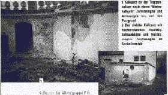
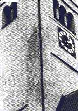
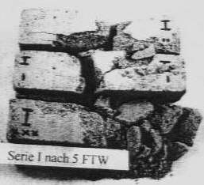
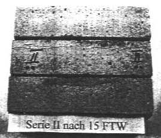

[🠔 Zur Übersicht: Luftkalk Vergütung](2kalk.md)  
# Luftkalkmörtel und seine Vergütung 2
**Zur Vergütung von Luftkalkmörtel unter Berücksichtigung von typischen Schadensphänomenen und Einsatzgrenzen bei falscher Verarbeitung und Polymerbeschichtung.**  
_von Konrad Fischer_

Aufklärung und ein paar kritische Worte 
zum Problem der Rezepturen von Kalkprodukten

**[Luftkalkmörtel und seine Vergütung 1](2kalk.md)**

**2. Zur Vergütung von Luftkalkmörtel unter Berücksichtigung von typischen Schadensphänomenen und Einsatzgrenzen bei falscher Verarbeitung und Polymerbeschichtung**

Der vereidigte Sachverständige für werkstoffgerechte Sicherung und Sanierung historischer Bauwerke Gerold Koch aus Bad Liebenzell stellte zu den verarbeitungsbedingten Schäden beim traditionsorientierten Bauen schon 1986 fest: _"..., daß unsere Handwerker es nahezu verlernt haben, mit den traditionellen Baustoffen, aus denen Mauerwerk gefügt und mit denen Mauerwerk geschützt wird, umzugehen. Aber auch die Baumeister, Architekten und Bauingenieure können meist nicht mehr materialgerecht denken."_ [in: _Putzfassaden an historischen Gebäuden_ , DER STUKKATEUR 7/1986]. Dies gilt selbstverständlich auch für so manche Sachverständige und Kunsthistoriker. Selbst der leiderfahrenste Bauprofi lernt ja immer wieder das Staunen, wie pfuschig Baupfusch pfuscht.

Deswegen gelingt der schadensträchtige Großangriff auf das Baudenkmal durch die "moderne" Bauweise so glänzend. Deswegen kann man manchen Denkmalschützern, die "ihr" Bauwerk so gerne hundertprozentig schützen, weismachen, daß dies mit den modernen überfesten bzw. überdichten Baustoffcreationen am besten gelänge. Silikat-, Kunstharz und Hydrophobierungsbeschichtungen in jeder denkbaren Komposition vernichten die auf Kapillarentfeuchtung und Baustoffverträglichkeit angewiesenen Bauwerke landauf und landab. Sogar Kalkmörtel bietet man schon werksseitig "hydrophobiert" an - obwohl damit genau die besten Eigenschaften eines echten Luftkalkmörtels zunichte gemacht werden. Wasserabweisung - und das ist nämlich die "Hydrophobie" - wirkt bei Beschichtungen/Putzen nämlich nicht nur nach außen, sondern auch nach innen. Im Klartext: Der Putz trocknet schlechter aus, ist frostgefährdeter, und im Eigenschaftsprofil meilenweit von bestandsverträglichen Traditionsmörteln entfernt. Dafür aber voller undeklarierter "Hilfsstoffe" aus dem Chemielabor. Die Handwerker und Verbraucher werden vom Marketing für solchen Bauschund als oberdoof eingeschätzt: in der Sache nichts bringende Schwindelargumente wie "allerbeste Dampfdiffusion" oder "stabil gegen Umweltverschmutzung" oder gar "gegen aufsteigende Feuchte" und "Mauerwerksentsalzend und entfeuchtend durch hohes Porenvolumen" beherrschen die Szene.

Das Problem der Chemikalienfreunde beginnt, sobald das Thema Silkat/Wasserglas oder Kunst-/Siliconharz Schaden nehmen könnte.

Bei den Alternativprodukten aus Zement, Kunstharz und anderen Chemiewaffen gibt es allerdings Probleme bei der Deklaration: Weder deren nicht gerade unschädlichen Inhaltsstoffe noch ihre objektschädigenden Nebenwirkungen thematisiert die Produktinformation. Oder las man z.B in Wasserglasfarbeninfos von Herstellerseite jemals etwas über deren erhebliche Pottaschenabspaltung oder Überbeanspruchung des Malgrundes im Abbindevorgang? Predigt man von mauerwerkszerreißenden Treibmineralien, wenn man hochhydraulisch/zementär verpressen und vernadeln will? Gibt man zu, daß die dichten [Sanierputzporen weder Salz und Feuchte in nennenswerten Mengen aufnehmen](2sanipuz.md) können? 

Verrät man dem Kunden, daß unter hydrophob-wasserabweisenden Beschichtungen erhöhte Salz- und Feuchtekonzentrationen geradezu erzwungen werden? Hierzu [H.G. Meier in "_Sanierputze_ ", Renningen 1999](8wetz.md#hermann g. meier): _"Es ist leider so, daß die meisten Hersteller nicht bereit sind die Zusammensetzung ihrer Sanierputzsystem weitgehend offenzulegen."_ Das gilt auch für Anstrichsysteme und insgesamt für Einsatzgrenzen und "Nebenwirkungen" moderner Baustoffkompositionen! Wüßte die Kundschaft, wieviel modifizierende Kunstharzpampe in angeblich "puren" bzw. "reinen" oder gar "Bio"-, "Mineral"-, "Klima"-Farben und Putzen drinsteckt, hätte man zumindest am Baudenkmal voraussichtlich erheblichen Erklärungsnotstand. Gerade in Anbetracht deren [Schadensbilder](22bausto.md#silikatproblem), bei deren Berücksichtigung die folgende Aussage besonders merkwürdig anmutet:

_"Kalkfarben [...] sind nur von geringer Beständigkeit an der Fassade. Das Bindemittel wird durch die Luftschadstoffe relativ schnell in lösliche Salze (Calciumsulfat = Gips und Calciumnitrat) überführt und weggewaschen. Art des Kalkes, des Brennmaterials, der Einsumpfdauer sind für die Beständigkeit einer Kalkfarbe gegenüber den Luftschadstoffen völlig unerheblich. Klar ist, daß eine Kalkfarbe umso beständiger wird, je mehr Kunstharzdispersion ihr zugegeben wird. Nur ist dies dann keine Kalkfarbe im Sinne der DIN 18 363. Kalkfarben sollte man nur innen einsetzen und im übrigen den Restauratoren überlassen._

Verlangt ein Bauherr unter dem Einfluß eines Denkmalpflegers außen eine Kalkfarbe, so sollte man zumindest (schriftlich!) Bedenken bezüglich der Beständigkeit anmelden.

Beständig sind außen also nur

_
 * Silikatfarben (ohne organische Zusätze),
 * Dispersionssilikatfarben (mit bis zu 5 Prozent organischen Anteilen),
 * Kunststoffdispersionsfarben,
 * Siliconharzemulsionsfarben."
_

aus: Dr. Uwe Erfurth: _Farbe bekennen, Anstriche unter physikalischen und ökologischen Gesichtspunkten_ , in: Stuck.Putz.Trockenbau 9/98

So kann man es sehen. Doch nur, wenn man nicht weiß, wie einfach es sein kann, einen Kalkanstrich durch richtige Nachversorgung des Frischanstrichs marmorfest abbinden zu lassen. Das wäre Handwerkswissen aus alter Zeit. 

Durch sogenannte Produkt-Fachberater, die vor allem den HOAI-unterschreitenden Architekten mit VOB-widrig leitproduktangereicherten Ausschreibungstexten gerne zur Hand gehen, oder gar aus Chemiebuden als plumpestmögliche Vermarktungshilfe herausgegründete Fachplanungs-"Institute" mit zielgerichtet auf Eigenprodukte zielender Analytik werden dann bestandsschädigende Baustoffe und Pseudo-Kalkmörtel mit meistens absichtlich verschwiegenen hydraulischen oder synthetischen Zusätzen ohne Hinweis auf deren Risiken in den gerade bei staatlichen, kommunalen und kirchlichen Bauherrschaften unendlich aufnahmefähigen Markt gepreßt. (Link: [Praxisbeispiel](10hoai22.md)). Der erfahrene Baufachjournalist K.M. Bresch aus Burgpohl bringt da von den Stoffzusammenhängen schon handfestere Information [Hervorhebungen KF]:

_**"Kunststoff contra Mineral 
Betrachtungen zu Außenputzalternativen** 
(in: DER STUKKATEUR 9/1986):_

**Umweltprobleme**

[...] Wie auch in anderen Bereichen menschlicher Reaktionen, bringt die Feststellung verstärkter Umweltprobleme teils Schnellreaktionen hervor. Aktionismus entwickelt sich. Vielfach aus naheliegend-praktischen, z.T. auch aus politischen Gründen wird dann etwas gemacht, nur des Machens wegen, und das verschlimmbessert die Situation. "Kurzschlüsse" werden als Dauerlösungen angeboten, einfache Erklärungen leuchten ein und bewirken eine Pseudobestätigung bestimmter Denkrichtungen. Durch laufende Wiederholung einer halbrichtigen Behauptung wächst zumindest beim breiten und meist unkritischen Publikum (unkritisch, was die wissenschaftliche Fundamentierung anbelangt) die Meinung: Die haben anscheinend doch recht!

In unserem Falle geht es, um das Kind beim Namen zu nennen, konkret darum, die sehr weitgehenden Pauschalbehauptungen negativer Art über mineralische Putzsysteme aufzunehmen, zu relativieren und zu widerlegen. [...]

**Erfahrungen mit mineralischen Außenputzen**

[...] Insbesondere ist die Langzeithaltbarkeit dieser [historischen Lehm- und Kalkmörtel-] Putzschichten enorm. Der Einwand, daß dies gerade der Beweis dafür ist, daß durch die heutige Umweltverschmutzung andere, schwerwiegendere Probleme vorherrschen als früher, zieht nicht. [...] Die "natürliche Luftverschmutzung" [z.B. durch Vulkaneruptionen] kann in ihrer Intensität viel stärker, viel größer sein, als diejenige durch Auspuffgase von Verbrennungsmotoren.

[...] Wald- und Steppenbrände verschmutzen die Luft, ganz zu schweigen von den großen Brandkatastrophen im Mittelalter, bei denen ganze Städte in Schutt und Asche gelegt wurden.

Denken wir ferner an das Mittelalter - die Hygiene in den Städten war unter heutigen Gesichtspunkten katastrophal. Die Luftverschmutzung durch offene Feuer in den Häusern war mit Sicherheit vor Ort, bezogen auf die einzelnen Plätze, hochgradig ... und gerade in alten Städten, die uns ohne große Beschädigung bis heute erhalten geblieben sind, können wir feststellen, daß, von der Oberflächenverschmutzung der Fassaden abgesehen, **die damals zum Einsatz gelangten Putze technisch völlig intakt blieben**. [...]" ...

Anmerkung: Und das waren, wie inzwischen unzählige Untersuchungsergebnisse aus europäischen Labors belegen - zum allergrößten Anteil traditionsgerechte Luftkalkmörtel! Aber eben nicht [deppert auf die Baustelle gebracht und deppert aufgeschmiert](2kalkfel.md).

_... "**Mineralische Putze im Klimatest**_

_[...] Es ist allgemein bekannt, daß schädliche Einflüsse durch die Anwesenheit von Schwefeldioxid (SO 2) und Kohlendioxid (CO2) in der Luft und im Regenwasser bewirkt werden. Jedoch ist dieser Einfluß auf eine intakte Putzfläche nur sehr gering. Das Bundesministerium für Raumordnung, Bauwesen und Städtebau bringt im Heft 04.112 der Schriftenreihe 04 "Bau- und Wohnforschung" im Zusammenhang mit diesen Oberflächen die richtige Feststellung, daß eine Schädigung nur dort auftritt, wo planungs- und ausführungstechnische Schwachstellen vorhanden sind. Der "Dauerbeschuß" durch SO2 bzw. CO2 hat also nur dort Chancen, wo sich Risse, Öffnungen, undichte Stellen usw. zeigen, die entweder durch mangelhaftes Arbeiten oder durch nachträgliche Beschädigungen entstanden sind, nicht jedoch im direkten Einwirken auf eine intakte Putzfläche."..._

Anmerkung: Zu den bemerkenswerten Rißursachen gehört natürlich auch die weitverbreitete Fassadenschädigung durch überfeste bzw. überdichte Anstrichsysteme auf Silikat- und/bzw. Kunstharzbasis. Sie befördern innere Kondensation und Krustenbildung, Putzflächenablösung und viele weiteren [Schadensbilder](22bausto.md#silikatproblem), die dann z.T. frech auf den historischen Luftkalkmörtel geschoben werden. Auch wenn der vor seiner Vergewaltigung durch "moderne Anstrichsysteme" jahrhundertelang prima aushielt.

_... "Wissenschaftliche Arbeiten über Schäden an unbehandelten Putzoberflächen gibt es nur in geringem Umfang. Eine minimale Einflußnahme des SO 2 ist bei alten Putzflächen in der oberen Schicht nachzuweisen. Jedoch führt diese Beeinflussung nicht zu einer Schädigung im Sinne von Ablösungen und Rißbildungen. Normale, solide, mineralische Putzflächen verkraften dies."..._

Anmerkung: Im Unterschied zu der thermischen und hygrischen Belastung aus modernen Anstrichsystemen. Ein Luftkalkmörtel hat systemgemäß ja freie Kalkreserven, mit denen er Bindemittelverluste und bewitterte Rißverläufe in bestimmtem Umfang wieder "heilen" kann. So ist immer wieder zu beobachten, daß er gerade an stark beregneten Fassadenflächen besondere Festigkeit und Widerstandskraft durch entsprechende Sinterbildung ausbilden kann. Er braucht also keine Hydrophobie, sondern beste Austrocknungsfähigkeit. Diese wird gerade durch Wasserabweisung blockiert.

_..." Andere Schadstoffe wie Stickoxide, Ammoniak, Chlor, Chlorwasserstoff haben nachgewiesenermaßen als Schadstoff den Putzoberflächen bisher nichts anhaben können. [...]_

Wenn ein solches offenporiges, kapillar wirkendes System mit einer Farbe gestrichen wird, die einen Filmbildner (Haut) enthält, schließen sich alle Öffnungen und wir besorgen nicht das Geschäft der Renovierung, sondern präparieren die Fassade für Schäden."...

Anmerkung: Das gilt auch in Bezug auf die abdichtende und überfestigende Wirkung von Wasserglas/Silikat und Hydrophobierungsmittel, die zwangsläufig zur inneren Kondensation führen.

_... "Bei nichtfunktionierender Dampfdiffusion_ [und eben auch Kapillarentfeuchtung, Anm. KF] _entstehen Risse und damit wiederum Öffnungen für den Angriff des "saueren Regens" und anderer Einflüsse von außen. Bei Renovierungen und Sanierungen sollte man sich stets darüber im klaren sein, systemverwandte Produkte einzusetzen. [...]_

_Falsch wäre es zu behaupten, daß es bei diesen Filmen überhaupt keine Dampfdiffusion gibt. Aus verschiedenen Arbeiten ist zu entnehmen, wie groß diese Faktoren sind. Sie bewegen sich aber - und das ist unbestritten - in einem viel niedrigeren Bereich als Werte mineralischer Putzsysteme.[...]"_

Anmerkung: Wobei es ja auf die Dampfdiffusion überhaupt nicht ankommt, sondern auf die Fähigkeit einer Oberflächenbeschichtung, das flüssig in den Poren vorliegende Wasser kapillar an die Oberfläche zu transportieren, wo es dann verdunstet. 1000 zu 1 ist das Verhältnis Kapillartransport zu Dampfdiffusion bei den Feuchtetransporten in baustoffen. Und genau die Kapillartrocknung ist es, die von harzhaltigen Beschichtungen - egal ob Kunstharz oder Naturharz - blockiert wird. Und wie wir heute wissen bzw. wie es aus Gerold Kochs entsprechenden analytischen Untersuchungen an Fassadenschäden hervorgeht, sind die sog. Laborwerte für die bauphysikalischen "_Faktoren_ " moderner Baustoffe oft bis zum zig-fachen an der Fassade übertroffen. Verarbeitungsprobleme und Denkfehler im labor- bzw. DIN-gemäßen Versuchsaufbau sind daran schuld. Dies verschweigen die Hersteller lieber in den typischerweise haftungsbeschränkenden Produkt-"Informationen" und in den gerichtsnotorischen Auslassungen der von ihnen abhängigen Auftrags-"Sachverständigen". Genau das sind wohl die Betriebsgeheimnisse, die Produktvertreter bei kritischer Nachfrage nach Volldeklaration ihrer Chemieschlämmen so gern ins Feld führen. Und so ist es zumindest für den haftungsgefährdeten Praktiker logisch, daß nur Kalkfarben auf Kalkputze gehören. Dies sieht auch Dipl.-Ing. (FH) Albrecht Böttinger im Arbeitsblatt "_Kalkanstriche_ " des Fortbildungszentrums für Handwerk und Denkmalpflege, Probstei Johannesberg Fulda e.V. so: 

_"Mit den Kalkfarbenanstrichen wurden auch die angegriffenen oder angewitterten Oberflächen des [Luftkalk-]Putzes recarbon[at]isiert und somit und somit tragfähig für den Anstrich gestaltet. Wir müssen heute feststellen, daß kalkfremde Anstrichsysteme die Kalkoberfläche "abtrocknen", d.h. die bereits angegriffene Oberfläche nicht reaktivieren, sondern das Absanden beschleunigen. Dies hat zur Folge, daß sich die Farbbeschichtung einschließlich der anhängenden Quarzkörner des Putzes sich ablösen. [...]_

_Nachdem sich die wasserglasgebundenen Farben bei der Sanierung alter Bauten einen erheblichen Marktanteil zurückerobert haben, bleibt zu hoffen, daß sich Industrie und Handwerk wieder mehr dem Kalkanstrich, seiner Herstellung und Verarbeitung zuwenden. Dies nicht nur, um die Brillanz der Farben, ob innen oder außen, sicherzustellen, sondern auch um alte Kalkinnen- und Kalkaußenputze zu erhalten"_

Dafür sorgen am fleißigsten die [denkmalverheerenden Bauschäden](22bausto.md#silikatproblem) der "wasserglasgebundenen Farben", dazu ein typisches Beispiel:

. 
Abschiefernde, durch "pures" Wasserglas-Anstrichsystem überfestigte und abgedichtete Kalkputzschollen

Auch in "Gerhard Klotz-Warisloher: _Putzergänzung - Hinweise zur Ausführung am Beispiel der Südscheune in Thierhaupten_ " in: Reparatur in der Baudenkmalpflege, Arbeitsheft 101 des Bayerischen Landesamtes für Denkmalpflege, wird den für die Bestandserhaltung ungeeigneten modernen Anstrichsystemen eine klare Absage erteilt:

_"Anstrichsysteme auf Silikat- bzw. Dispersionssilikatbasis zeichnen sich entsprechend tragfähigen Gründen durch eine sehr hohe Widerstandsfähigkeit aus. Da Altputze die damit verbundenen Tragfähigkeitsansprüche nicht immer in ausreichendem Maße erfüllen, sind solche modernen Beschichtungssysteme in diesen Fällen nicht unproblematisch._

_Lokale Überfestigungen und Schalenbildungen können nicht immer zweifelsfrei ausgeschlossen werden. Mangelnde Reversibilität sowie eine geringe Reparaturfreundlichkeit müssen als weitere Kennzeichen bedacht werden. Bei nicht vollständig carbonatisierten Mörteln besteht zudem die Gefahr, daß Anstrichsysteme auf Silikatbasis gelieren."_

Also: Kein Silikat- bzw. Kunstharzdispersionsanstrich auf Luftkalkmörtel. Und natürlich auch keine derartigen Chemiebomben in den Luftkalkmörtel! Siehe hierzu auch:

Prof. Oskar Emmenegger zu [Problemen der Mineralfarbenmalereien](http://www.restaurator.tv/Lectures/Restaurierungsprobleme_der_Mineralfarbenmalerei.htm)

Prof. Dr. Ivo Hammer: [DIE MALTRÄTIERTE HAUT](2ivo.md), Anmerkungen zur Behandlung verputzter Architekturoberfläche in der Denkmalpflege, Roland Möller zu Ehren: Dresden 1995 (Ein praxisnaher Beitrag auch zur Problematik von Wunderbaustoffen an der Fassade)

Das wurmt die Verfechter der Silikat- und Kunstharztechnik natürlich mächtig gewaltig.

Vgl. [Schlütter/Juling: Mikroskopische Untersuchungsmethoden in der Analytik historischer Putze und Mörtel](http://www.mpa-bremen.de/pdf/Nimbschen2000.pdf) (Thema u.a.: wie zementartiger Hydraulmörtel als Kalkmörtel verkauft wird und wie geringfügigste Synthetik"vergütungen" die Kalk-Karbonatisierung blockieren können)

Leider vertrauen die "modernen" Handwerker in klarer Selbsterkenntnis ihrer bescheidenen Handwerkskunst auf die Fähigkeiten des Baustoffs, schlechte Arbeit durch Materialvorzüge auszugleichen. Fachgerechtes Arbeiten wird dann durch Materialvergewaltigung und Verstoß gegen die Fachregeln ersetzt. Das muß schiefgehen. Die bauphysikalisch vorteilhaften Eigenschaften von Kalkprodukten sind durch unbesonnene [Anwendungsfehler](2kalkfel.md) schnell auszulöschen. Seine physikalisch vorteilhafte Struktur, sein bestandsschonendes Abbinden, seine Beständigkeit im Einzelfall - alles Ergebnisse der Verarbeitungsbedingungen, wie bei jedem anderen Mörtel ja auch.

Aus einem Artikel von Dr. Uwe Erfurth, veröffentlicht in bausubstanz 1-2/2000 unter dem Titel _"Kalkputze aussen - ein Risiko?"_ stammen folgende Bild- und Textzitate:

Beispiel 1: Schloßtreppenanlage Alteglofsheim

 
Bildbeischrift: 
_"1_[links] _Kalkputz an der Treppenanlage nach einem Winterhalbjahr: Zerstörungen und Ablösungen bis auf den Putzgrund 
2 _[rechts]_Der gleiche Kalkputz mit hochreichenden Feuchtigkeitsschäden und frostbedingten Zerstörungen im Sockelbereich"_

Was im Artikel unerwähnt bleibt:

1. Die Mauer der Treppenanlage ist frei bewittert und fallweise von der Oberseite des Treppenpodests her mit ablaufendem Regen überspült. Im Winter bilden sich demzufolge auf der Mauerfläche von oben her dicke Eisschichten.

2. Der durch Frostsprengung abgefallene Luftkalkmörtel wurde durch Terminversäumnisse des Handwerkers im Winter vier Tage vor einsetzendem Frost aufgebracht - entgegen der Verarbeitungsvorschrift, daß die aufgebrachten Lagen vor weiterem Aufputz erst hinreichend angesteift sein müssen und die Arbeiten an diesem besonders feuchtegefährdeten Bauteil vor der frostgefährdeten Periode - spätestens im August abgeschlossen sein müssen.

3. Entgegen der Handwerksregeln wurde das bewitterungsbedingt ständig durchnässte Mauerwerk nicht vor den Putzarbeiten durch Abdeckung geschützt, sodaß es als zulässiger Putzgrund ausreichend abgetrocknet wäre.

4. Entgegen der Herstellervorschrift wurde der Putz "putzsichtig" belassen und gegen die vorauszusehende Wasserbelastung nicht durch Anstrich geschützt.

Plastik- und Zementfreunde - zeigt her Euren Putz, der derartige Randbedingungen besser übersteht. Immerhin sind - was aus dem publizierten Bildmaterial natürlich nicht hervorgeht, ca. 60% der betroffenen Fläche schadensfrei durch zwei Winter gekommen, ist das nichts? Und hätte sich Dr. Erfurth mal in Alteglofsheim umgesehen, wozu er übrigens vom Bauherrenvertreter unmißverständlich aufgefordert wurde, hätte er folgendes bemerken dürfen:

und 
Abfallender Sockel aus Silikatanstrich auf Sanierputz WTA. Und umfangreiche Hohlstellen an der gesamten Fassade wegen Ablösung der überharten Kalk-Zementputzschwarten.

Der Autor, ein Dr. der Chemie der sich obendrein als _"Fachplaner für die Sanierung historischer Gemäuer"_ versteht, verteilt im Fall Alteglofsheim im o.g. "Fach"-Artikel dann auch die Verantwortung:

**_"Verantwortliche_**

_Die Bautafel zeigte neben dem planenden Universitätsbauamt und dem beauftragten Planungsbüro auch zahlreiche Fachplaner und die ausführenden Firmen, aber keinen Fachplaner für die Sanierung historischer Gemäuer. Den hat man sich mal wieder gespart. Hätte eine fundierte Sanierungsplanung solche Schäden vermeiden können? Mit Sicherheit [...]."_ 

Recht hat er! Oder?

Zu diesem Fall erschien dann in "bausubstanz 3/2000" folgende Stellungnahme des verantwortlichen Universitätsbauamtes (Produkt anonymisiert):

_"Sehr geehrte Frau Reich,_

in dem Beitrag "Kalkputze außen - ein Risiko?!" der Ausgabe Januar 2000 Ihrer Zeitschrift Bausubstanz werden von dem Autor Uwe Erfurth Instandsetzungsfehler auf Grund der Verwendung von Luftkalkputz auf Außenmauerwerk am Beispiel der Sanierung von Schloss Alteglofsheim bei Regensburg dargestellt. Als für die Sanierung verantwortliche Baubehörde erlauben wir uns, die über Schloss Alteglofsheim getroffenen Aussagen richtig zu stellen und zu ergänzen:

1. XY-Luftkalkputz wurde nicht am Schlossgebäude verwendet, sondern an Teilen eines zu einem Gästehaus um- und ausgebauten historischen Nebengebäudes sowie an Teilen der Park- und Gartenmauer.

2. Die Frage nach einem alternativen Putzsystem zum Sanierputz hat sich dem Bauamt nach Schäden und den daraus resultierenden Erfahrungen mit Sanierputz am Schlossgebäude, ausgeführt 1995-96, gestellt. Die Entscheidung zu XY-Luftkalkputz wurde nach Prüfung der Erfahrungen mit diesem Putzsystem bei ausgeführten Objekten getroffen.

3. Die im Beitrag des Herrn Erfurth abgebildeten Schadenbeispiele zeigen eine Gartenstützwand und eine Gartenmauer, deren Schadenursache auf Frostschäden durch verspätet ausgeführte Putzarbeiten im Herbst 1998, zum Teil bei gleichzeitig mangelhafter Untergrundvorbereitung, zurückzuführen sind.

4. Die XY-Putzflächen am Gästehaus sind zum jetzigen Zeitpunkt im zweiten Winter nach Fertigstellung schadensfrei. Soweit im Sockelbereich der Gartenmauer geringfügige Schäden auftreten, so sind diese jedenfalls derzeit geringer als die Schäden am Sanierputz des Schlossgebäudes und verursachen weniger Bauunterhalt.

Insofern ist Schloss Alteglofsheim als "Aufhänger" und Beweis für den oben genannten Beitrag sicher nicht geeignet. Über eine gründliche Recherche zur Putzproblematik Schloss Alteglofsheim, die über ein Kurztelefonat mit einem der Sachbearbeiter hinausgegangen wäre, hätten wir uns gefreut.

Mit freundlichen Grüßen 
i.A. Norbert Sterl, Bauoberrat, Regensburg"

Beispiel 2: Kirchturm Irsee

 
Bildbeischrift 
_"Auch an der Kirche in Irsee zeigten sich nach dem zweiten Winter erhebliche Schäden. Verwendet hatte man hier Luftkalkputz und Kalkfarbe mit Dispersion"_

Zum Schadenshergang:

1. Der 4-lagige Putzaufbau (Vorspritz 4mm+Dachshaar, Grund- bzw. Ausgleichsputz 4mm+Dachshaar, Deckputz 2mm, Gliederungen 1mm) aus XY- Luftkalkmörtel wurde - gegen den herstellerseitigen Rat - vor ausreichender Abtrocknung einen Tag nach Beendigung der Putzarbeiten mit einer italienischen und mit falscher bzw. ungenügender Deklaration in Denkmalkreisen vertriebenen Kunstharz-Kalk-Farbe 3-fach freskal gestrichen. Folge: Trocknungs- und Karbonatisierungsblockade, das mühsam austreibende Wasser des Frischmörtels bildete später in der Kunstharzschicht Risse.

2. Über der geschädigten Fläche im bewitterten Eckbereich des Turms war die Putzstärke durch erhöhten Putzausgleich etwas stärker als in den benachbarten Flächen. Die Kunstharz-Kalk-Farbe verzögerte dort die Karbonatisierung mehr als in den dünneren Flächen. Sie mag zwar lt. Labor "dampfdiffusionsoffen" sein, da sie jedoch wasserabweisend wirkt, sperrt sie die immer kapillar funktionierende Putz- und Bauteilentfeuchtung dramatisch ab. Das gilt auch gegenüber dem täglich eindringenden Kondensat, das im Bauteil immer flüssig als Porenwasser, nie als "Dampf" eingelagert wird.

3. Im Winter war die geschädigte Turmecke mehrmals mit einer Eisschicht überzogen und verstärkten Frost-Tau-Wechseln ausgesetzt. Der dort noch nicht vollständig abgebundene Luftkalkmörtel fror, wie im Bild zu sehen, partiell ab. Die gerissenen Flächen wurden erneuert.

Stimmt Dr. Erfurths folgende Aussage in seinem o.g. Artikel zur Beeinflussung von Kalkmörtel durch vergütende Zusätze?

_"Der XY-putz ist ein Putz mit Weißkalkhydrat als Bindemittel und einigen Zusätzen im Promille-Bereich, die aber an der Chemie des Kalkes nichts ändern können."_

Untersuchungsergebnisse von Hochschulinstituten oder Materialprüfanstalten sprechen dazu allerdings eine andere Sprache. Wobei selbstverständlich auch der wie auch immer bestvergütetste Mörtel gegen die klassischen Verarbeitungsfehler des Handwerks nicht gefeit ist.

**3. Auszüge aus _"Untersuchungen zum Einfluß eines Mörtelzusatzmittels "XY" auf die Eigenschaften und die Beständigkeit von Kalkmörteln"_** 
_durch: HAB Weimar, ..._

Untersucht wurden die Versuchsreihen I-V, davon II-Luftkalkmörtel und IV hydraulischer Kalkmörtel jeweils mit 0,1%igem XY-Zusatz. Die Ergebnisse des XY-Luftkalkmörtel waren in der Tendenz übertragbar auf den XY-Hydraulkalkmörtel. Hier einige Ergebnisse im Vergleich Luftkalkmörtel ohne (LKM) und mit (**S-LKM**) XY-zusatz nach sonst identischer Eigenrezeptur (Rheinsande, Walhalla-Weißkalkhydrat) des Untersuchungslabors, wie sie sich an den vorher 8 Wochen in freier Bewitterung exponierten Proben ergaben:

Unter- 
suchungs- 
bereich Karbonati- 
sierungs- 
grad % Biegezug- 
festigkeit 
N/mm2 Druck- 
festigkeit 
N/mm2 Wasser- 
aufnahme- 
koeffizient 
(w-Wert) 
kg/m2h0,5 Wasser- 
dampf- 
diffusions- 
widerstands- 
zahl 
µ Max. 
Wasser- 
aufnahme 
(Sättigungs- 
feuchte) 
Ma.-% Masse- 
verlust bei 
Salz- 
sprengtest 
Ma.-% 
LKM 

57,4

1,0

1,59

0,39

17

10,77

63

**S-LKM** 

**62,1**

**1,83**

**2,41**

**0,21**

**21**

**11,88**

**59**

Aus der Fotodokumentation des Untersuchungsberichts:

**Luftkalkmörtel ohne XY(Serie I/LKM) 
nach 5 Frost-Tau-Wechseln**

**XY-Luftkalkmörtel (Serie II/S-LKM) 
nach 15 Frost-Tau-Wechseln**

Aus der Ergebnisdiskussion:

_"Die Phasenanalyse zeigte bei den Mörtelproben mit XY-zusatz einen höheren Carbonatisierungsgrad als bei den nichtmodifizierten Proben. Der Carbonatisierungsgrad der Probe II_[= S-LKM]_war 8% höher, als bei der Probe I_[=LKM]_. [...]._

Die Festigkeitswerte der Proben mit XY-zusatz wiesen eine deutliche Zunahme auf. [...] Man kann davon ausgehen, daß XY festigkeitssteigernd wirkt.

Der w-Wert der mit XY modifizierten Proben liegt deutlich niedriger. [...] Dies läßt sich mit der wasserabweisenden Wirkung des XY und einer Gefügeverdichtung erklären.

Die µ-Werte unterscheiden sich ebenfalls. [...] Durch den höheren Grad der Carbonatisierung ist das Gefüge verdichtet und somit für Wasserdampf undurchlässiger. [...]

Auch die Werte der Sättigungsfeuchten der modifizierten Proben sind niedriger [...]. XY bewirkt somit eine Verringerung der maximalen Wasseraufnahme.

Die Ausgleichsfeuchte bei 60% rel. Luftfeuchte war bei der Serie II [=S-LKM]_um 11% [...] höher. Dies begünstigt das Langzeitcarbonatisierungsverhalten. [...]_

Die Frost-Tau-Wechselbeständigkeit der Luftkalkproben wird durch XY-zusatz verbessert. Dies kann damit erklärt werden, daß die Proben der Serie II eine höhere Festigkeit, einen geringeren w-Wert und eine geringere Sättigungsfeuchte besaßen. [...]

Die Beständigkeit gegenüber Salzsprengkräften wurde mit XY-zusatz erhöht. [...]

Weiterhin wird die Beständigkeit gegenüber SO2 durch einen XY-zusatz verbessert. Als Maß für die Beständigkeit diente die Änderung des ph-Wertes einer verwendeten Schwefelsäure während einer nassen Depositionszeit. Die Proben sind umso beständiger, je langsamer sich der ph-Wert ändert. So ist die ph-Wertänderung der Serien II und IV [also mit XY] nach einer bestimmten Meßdauer geringer bzw. der Anstieg erfolgt langsamer.

Zusammenfassung

Ein Einfluß von XY auf die Mörteleigenschaften kann anhand der vorliegenden Arbeit eindeutig festgestellt werden. [...]"

---

**2.2 Auszüge aus _"Mineralogische und physikomechanische Untersuchungen an Mörtelsystemen aus dem Aufgabenbereich der Baudenkmalpflege"_** 
_Diplomarbeit zur Erlangung des Grades eines Diplom-Mineralogen in Fachbereich Chemie der Westfälischen Wilhelms-Universität Münster, vorgelegt von Peter Boos aus Bad Bentheim, Münster 1998, Labortechnische Untersuchungen im chemischen Labor des Mineralogischen Instituts der WWU Münster und bei Remmers Bauchemie, Löningen._

Untersucht wurde in dieser Arbeit ohne Auftraggeber u.a. ein Luftkalkmörtel als Werktrockenmörtel.

_"9.2.2.1 Röntgenpulverdiffraktometrie_

_Die röntgenpulverdiffraktometrische Untersuchung des Werktrockenmörtels wurde zum einen an der Kornfraktion > 63µm, zum anderen an der Kornfraktion < 63µm durchgeführt. [...] Es konnte Calcit, Dolomit, Portlandit [=Ca(OH)2], Freikalk, Quarz und Feldspat (Plakioglas, Mikroklin) nachgewiesen werden. Außerdem bestätigte die Untersuchung der Kornfraktion < 63µm, daß außer dem Ziegelmehl keine hydraulischen Anteile zugesetzt werden. Die übrigen vom Werk angegebenen Bestandteile_ [gemeint: Zusatzbestandteile XY] _sind in so geringer Menge enthalten, daß sie röntgenpulverdiffraktometrisch nicht nachgewiesen werden konnten."_

_"9.2.1.3 Naßchemische Untersuchung_

_[...] Der Anteil löslicher Kieselsäure in dem Ziegelmehl beträgt 0,51 Masse-% und ist unter der Berücksichtigung, daß die Werkzugabe zum gesamten Trockenmörtel unter 10% liegt, so gering, daß eine eventuelle hydraulische Reaktion keine entscheidende Auswirkungen auf die Endfestigkeit des Materials haben wird."_

_"9.2.2 Frischmörteluntersuchung_

_[...] Die wiedergegebenen Daten zeigen, daß die beiden Werktrockenmörtel [XY-Luftkalkmörtel Körnung 2 u. 4 mm] identische Frischmörteleigenschaften aufweisen. Dies weist auf eine homogene und genau dosierte Zusammensetzung durch das Werk hin. [...]"_

_"9.2.3.1 Druck- und Biegezugfestigkeiten_

_Die Druck- und Biegezugfestigkeiten der Mörtelproben [ XY-Luftkalkmörtel Größtkorn 2 bzw. 4 mm, selbstgemischer Luftkalkmörtel ohne XY zum Vergleich (WKH)] wurden nach 28- und 56tägiger Lagerung gemessen. Bei den in Tabelle 9.2.3.1-1 dargestellten Meßergebnissen handelt es sich um die Mittelwerte von mindestens 4 (Druckfestigkeit) bzw. 2 Messungen (Biegezugfestigkeit). Die Festigkeiten der Kalkmörtel liegen im untersten Meßbereich der Prüfgeräte, so daß diese Werte stark fehlerbelastet sind und die Einzelergebnisse erhebliche Schwankungen aufweisen. Trotz dieses Meßfehlers sind die Tendenzen der Festigkeitsentwicklung aus den Druck- und Biegezugfestigkeiten ablesbar und zur vergleichenden Charakterisierung der Mörtelproben geeignet._

_Tabelle 9.2.3.1-1: Druck- und Biegezugfestigkeiten_

**Druckfestigkeit 
[MPa]** **Druckfestigkeit 
[MPa]** **Biegezugfestigkeit 
[MPa]** **Biegezugfestigkeit 
[MPa]** 
**Mörtelart** 

**28 d**

**56 d**

**28 d**

**56 d**

**XY- 
Luftkalkmörtel (4 mm)** 

0,4

1,6

0,3

0,5

**XY- 
Luftkalkmörtel (2 mm)** 

0,2

1,0

0,3

0,4

**Kalkmörtel (WKH)** 

0,1

0,5

0,1

0,2

_Der XY-Luftkalkmörtel (4 mm) erreicht nach 56tägiger Lagerung mit einer durchschnittlichen Druckfestigkeit von 1,6 MPa und einer durchschnittlichen Biegezugfestigkeit von 0,5 MPa die höchste Festigkeit dieser Probenreihe. Die durchschnittliche Druckfestigkeit des XY-Luftkalkmörtel (2 mm) beträgt demgegenüber nur 1,0 MPa bei einer durchschnittlichen Biegezugfestigkeit von 0,4 MPa. Der Oberputz des XY-Luftkalkmörtelsystems (2 mm) besitzt demnach eine geringere Festigkeit als der Unterputz (4mm). Damit ist die von DIN 18550 gestellte Anforderung erfüllt, daß bei einem Putzsystem der Oberputz entweder eine geringere Festigkeit als der Unterputz aufweisen muß oder beide Putzschichten gleichfest sein müssen, um Putzschäden verursachende innere Spannungen zu unterbinden. [...]"_

Anmerkung: Dieses aufeinander abgestimmte Festigkeitsprofil jedes korrekt rezeptierten Luftkalkmörtelsystems wird bei Aufbringen der für ihre dramatische Festigkeitsentwicklung bekannten wasserglasgebundenen Silikatfarben zerstört - mit tendenziell und praktisch übelsten Folgen. Deswegen: Nur Kalkanstrich auf Kalkmörtel!

Zu den erstaunlichen mineralogischen Untersuchungsergebnissen für das XY-Luftkalkmörtelsystem s.o. bzw. diesen **LINK**.

_"9.2.5 Ergebnis_

_Der Werktrockenmörtel ist dem Kalkmörtel in den physikomechanischen Eigenschaften überlegen. Dies ist einmal auf die Wahl des Zuschlags für die WKH-Proben und der an der DIN 18550 orientierten Zusammensetzung - die dem Bindemittelanspruch nicht gerecht wird - zum anderen aber auch auf die unterschiedliche Gefügeentwicklung zurückzuführen.[...]"_

Jedoch, glauben soll man gar nichts. Deswegen:

**Surftipps für Dialektiker 
Gegenteilige/Andere/Zusätzliche Informationsquellen - Bilden Sie sich eine eigene Meinung:**

[Bundesverband der Deutschen Kalkindustrie e.V.](http://www.kalk.de/) <> [Gütegemeinschaft Kalkstein, Kalk und Mörtel e.V.](http://www.gg-cert.de/bauprodukte/freiwillige-gueteueberwachung/ral-baukalk/) <> [Kalkputzen: Professionelle Putzsanierung - heimwerker.de](http://web.archive.org/web/20010210033352/http://www.heimwerkerwelt.com/beratung/abdichten/professionelle_putzsanierung/kalkputzen.htm)

Vielleicht sonstig nützliche Links: 
[Bauberatung Putz, Anstrich usw.](2berat.md) 
[Baustoffseite](2baustof.md) 
[Instandhaltung historischer Putze](22bausto.md) 
[Luftkalkmörtel für die verschiedenen Bauaufgaben](26bausto.md#6.+reine+luftkalkmã¶rtel+fã¼r+mauerwerk,+innen-+und) 
[Krachende Schwarten? Ein kritischer Blick auf Mörtel, Putz und Anstriche am Baudenkmal](http://www.dimagb.de/info/baualt/ahfas01.html) 
[Kalkputz und Mörtel am Baudenkmal](2prokalk.md) 
[Kalkputz und Mörtel am Baudenkmal. Fallbeispiele aus der Sicht des Architekten - Vortragstext bei EUROLIME, Mainz 1998](2eurolim.md) 
[TRADITIONAL CRAFTMANSHIP IN MODERN MORTARS – DOES IT WORK IN PRACTICE?](2rilem.md#international) 
[Erfarenheter av luftkalk och hantverk vid restaureringar i Tyskland](2rilem.md#visby01) 
[Die häufigsten Schadensursachen bei Kalkmörteln](2kalkfel.md) 
[Interessante Putzprobleme und -befunde in Venedig](http://www.jc-r.net/venezia/putze/) 
[Anstrich auf Kalkmörtel](26bausto.md#7.+mineralische+untergrundvertrã¤gliche) 
[Technische Informationen Kalk-Tünche](2kalkfrb.md) 
[Sanierputz - Heilt er?](2sanipuz.md) 
[Periodensystem](https://www.lenntech.de/pse/pse.htm) komplett erklärt. Gesundheitliche und umwelttechnische Auswirkungen der Stoffe und ihrer Verbindungen inkl.
