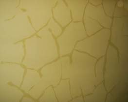

[🠔 Zur Übersicht: Kalk Anwendungsfehler](2kalkfel.md)  
# Kalk Anwendungsfehler 3: Der Schwindel mit den Fertigmischungen
**Ein Expertenbericht über gefälschte Kalkmörtel: Warum undeklarierter Zement Ihren Altbau ruiniert und wie Sie echte Luftkalkprodukte von industriellen Mogelpackungen unterscheiden.**  
_von Konrad Fischer_

## Die häufigsten Fehler bei der Anwendung von

Luftkalkmörtel, 
Kalkputz und Kalkanstrich 3

## Ein Ratgeber und Erfahrungsbericht aus 30 Jahren Anwendungspraxis

[Einleitung](2kalkfel.md)

---

Sehr genaues Erfahrungswissen muß also im Planungs-, Handwerks- und Produzentenbereich zusammengeführt werden, um für die unterschiedlichsten Fälle jeweils das geeignetste Produktrezept aus der ganzen Palette der Möglichkeiten auszusieben. Ohne praxisnahe und handwerklich korrekte Betestung der Untergrundsituation und Mörteleignung inkl. Salz-, Wasser- und Frostangriff geht es trotz hoffnungsfroher Ansagen der Beteiligten gerne daneben. Den objektiven Wahrheitsgehalt des Planer-, Handwerks- und Produzentensprüchleins dürfen wir ja nicht nur betreffend Terminzusagen, Lieferfristen, Ausführungsqualität, Leistungsumfang, Kostenprognose, Beschimpfung Abwesender und Reinwaschung seiner Selbst anzweifeln.

Man sollte schon wissen, welche Folgen für die Termin- und Kostenplanung, die Ausführung und Dauerstabilität sich aus den unterschiedlichsten Produktrezepturen und ihren jeweiligen Besonderheiten bis zum Aufzäumen der Bemusterung vor Ort abzuleiten sind. Dann kann es trotz aller menschlichen und technischen Hindernisse klappen, die beste Ausführungsvariante zu verwirklichen.

Und noch eins: Der korrupte Geist in unserer Bauindustrie zeigt sich auch in gefälschten Kalkrezepturen: Angebliche Luftkalkmörtel P (Putzgruppe) oder MG (Mörtelgruppe) Ia werden dann undeklariert mit Weißzement verschnitten, Hydraulprodukte unter dem guten Namen Kalk als Putzgruppe IIa oder gar Ic-Produkte (!) an den arglosen Kunden vermarktet. 

 
Verschmierte Spätrißschäden eines Hydraulkalkputzes. Die betonhart erstarrte Schwartenkruste des Industrieputzes / Werktrockenmörtels mit - dank Zement - hoher Druckfestigkeit bekommt ihre Abbindespannung nicht in den weicheren luftkalkvermörtelten Putzgrund und bildet deswegen Hohllagen mit Landkartenrissen aus.

Der gewiefte Skeptiker muß schon sehr genau hinsehen, um diesen Grausamkeiten mit vorprogrammierten Mißerfolgen und Bauschäden rechtzeitig auf die Schliche zu kommen: Verarbeitungszeiten von nur wenigen Stunden und hohe Untergrundanforderungen (MG II, gar III) - dem Technischen Merkblatt kleingedruckt beiläufig aber produkthaftungsausschließend zu entnehmen - verweisen auf solche Hydraulebeimengungen. Tipp: Ein halbes Wasserglas mit verdächtigen "Kalk"-Mörteln bis zum Rand mit Wasser füllen, über Nacht stehen lassen und die nasse Pampe morgens wegkippen, den hydraulisch-verfestigten Rest auf dem Boden des Glases bewundern. Ein echtes, nur hydratisch abbindendes Luftkalkprodukt wird dabei natürlich keinerlei Ansteifung erfahren.

Fazit: Rezptieren ist eine Kunst. Die Bedingungen des Marktes verführen zur Beimengung verarbeitungsfördernder Bestandteile, die sich auf Dauer negativ auswirken können. Und vergleichen wir die Kalkmörtelpreise von Fertigmischungen mit traditionellen Baustellenmischungen, wird es uns schlecht.

[Weiter: Kalkfehler 4](2kalkf04.md) 

