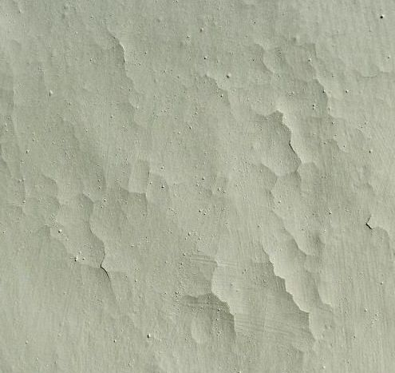

[🠔 Zur Übersicht: Kalk Anwendungsfehler](2kalkfel.md)  
# Kalk Anwendungsfehler 8: Warum Putze von der Wand fallen
**Ein Expertenbericht über die Tücken der Haftvermittlung: Warum chemische Grundierungen die Verbindung zum Stein blockieren und wie Sie durch Vornässen eine unlösbare Bindung schaffen.**  
_von Konrad Fischer_

## Die häufigsten Fehler bei der Anwendung von

Luftkalkmörtel, 
Kalkputz und Kalkanstrich 8

## Ein Ratgeber und Erfahrungsbericht aus über 30 Jahren Anwendungspraxis

### Ertrinken und Verdursten, Absumpen und Ausdörren, Erfrieren und Erhitzen, Überwässern und Vertrocknen - wie Kalkschichten garantiert mißlingen

[Zur Einleitung](2kalkfel.md)

---

**7. Witterungsbedingte/jahreszeitbedingt verzögerte Abbindung - das Ertrinken von Kalkmörtel und Kalkputz im Anmachwasser und Regen**

Der beste Zeitraum für die Herstellung von Kalkmörtel im Außenbereich sind die frostfreien Monate (Ende April – Mitte September), denn dann ist die Chance am größten, daß sie rechtzeitig und ausreichend abbinden können. Kalkmörtel erhärten nämlich eigentlich nicht einfach durch "Aufnahme von Kohlendioxid (CO2) aus der Luft", wie es viele meinen, sondern durch die Zuführung von Kohlensäure (aus Anmachwasser + Luft-CO2) nach dem auch für die Kalkkbindung / Kalkerhärtung gültigen Salz-Reaktionssystem Säure (im Falle Kalkabbindung eben die Kohlensäure H2(CO3)2)+ Lauge (Ca(OH)2) = Salz (Kalkkarbonat CaCO3) + Wasser (H2O). Vorher muß aber ausreichend Wasser aus dem Putz abtrocknen, denn nur dann bilden sich die bisher vom Wasser verfüllten und dann luftdurchlässigen Baustoffporen, die dann aus dem wenigen im Luftgemisch vorhandenen Gasanteil von 0,38 Promille (380 ppm) Kohlendioxid soviel aufnehmen, daß sich mit dem im Porenraum noch restlich verbliebenen Anmachwasser die reaktionsentscheidende Kohlensäure entsteht.

Neben der langsam fortschreitenden Karbonatisierung/Carbonatisierung, also der Umwandlung der Kalklauge und der Kohlensäure in das kohlensaure Salz des Kalkes namens "Kalkstein" ([Calcit](http://de.wikipedia.org/wiki/Calcit)), als Ergebnis der chemischen Kalkabbindung setzt die physikalische Abbindung als "Frühfestigkeit" aber auch durch die Trocknung selbst ein. Dabei rutschen die Mörtel-/Anstrichpartikel im Zuge der Wasserabgabe immer näher zusammen, bis schlußendlich Londonkräfte (van-der-Waalsche Bindung) entstehen, bei den die eigentlich negativ geladenen Elektronenhüllen an der Außenseite der Partikel so nahe zusammenstoßen, daß der eigentlich gegebene Abstoßungseffekt negativer Ladungen (vgl. Magnet) zu einer "Umpolung" durch Umlagerung der Ladungen der Elektronenhüllen führt und die Moleküle sich dipolartig anordnen und sich dabei magnetähnlich aneinander verketten. Dieser dabei enstehende extreme Bindungseffekt wird auch bei der Bindung von Nanopartikeln genutzt. Ein richtig rezeptierter und verarbeiteter Luftkalkmörtel mit ausreichend Feinpartikeln - in den monokornartigen Werktrockenmörteln der Putzhersteller meist nicht ausreichend oder nur durch überhöhte / synthetische Bindemittelzugabe oder auch feinstgemahlenen sonstigen Bestandteilen wie Tylose/Methylzellulose gegeben - erreicht deshalb ausreichende Stabilitität und Frostsicherheit, auch wenn er noch lange nicht komplett durchcarbonatisiert ist. Voraussetzung für beide - die chemischen und die physikalischen Festigungsprozesse / Abbindungen ist immer die ausreichende Trocknung ohne Aufbrennen und verfrühtes Trockenfallen der frischen Kalkschicht. 

Im Klartext: 

Die physikalische Abbindung erfordert Trocknung, die chemische Abbindung ausreichende Restfeuchte im Frischmörtel/Anstrich aus Kalkhydrat-Bindemittel (Luftkalk)!

Hohe Luftfeuchte (Herbst) schränkt nun die Wasserabgabe (Trocknung) aus der frischen Schicht, den davon abhängigen CO2-Zutritt und die Kohlensäurebildung und die daraus chemisch erfolgende Putzerhärtung ein. Dafür ist dann die Aufbrenngefahr, also das vorschnelle Verdursten der Kalkbschichtung aus Mörtel und / oder Anstrich etwas gemildert. Frischer Luftkalkputz sollte weitgehend im Jahr des Mörtelauftrages durchtrocknen. Terminverzögerungen und mangelnder Fassadenschutz währen der Ausführung und Frischmörtelphase gefährden diese kalktypische Anforderung. Schon ein Gewitterguß in den frischen Mörtel wäscht diesem die noch löslichen Bindemittel aus, es kommt zu Ausblühungen, die sich dann als festsitzende Sinterschicht / Sinterhaut an der Oberfläche anlagern und der bindemittelausgemagerte Mörtelrest ist natürlich keinesfalls mehr geeignet, ordentliche Bindung und Fassadenschutz zu gewährleisten. 

Der mißratene Mörtel / Anstrich (Kalktünche) bindet dann überhaupt nicht mehr unter seiner ausspülungsbedingten und CO2-blockierenden Sinterhaut ab, auch wenn schwach saugfähige Mauersteine seine innere Austrocknung behindern und zusätzlich ständiges Zuströmen neuer Regenmengen für Dauerfeuchte sorgen. Die maßgebliche Adhäsionsfestigkeit durch die oben beschriebene physikalische Abbindung, die dem Mörtel schon nach kurzer Zeit hohe Anfangsfestigkeit verleiht, unterbleibt im dauerfeuchten Milieu ebenfalls.

Falscher Bauablauf verzögert bzw. unterbricht also die Mörtelhärtung. Ungenügend abgebundene Flächen sind dann im Folgewinter besonders frostempfindlich, da sie große Mengen Wasser im schlecht oder kaum abgebundenen Mörtel aufnehmen können, das dann durch Frost Eiskristalle mit erhöhtem Volumen und entsprechendem Sprengeffekt bildet. Derartig mißlungene Mörtelschichten frieren dann schichtenweise und blätterteigartig ab. Zu dicke, von außen oder vom Putzgrund her wasser- bzw. salzbelastetete bzw. hinterläufige Putzlagen und ungenügende Trocknungszeiten der einzelnen Putzlagen steigern diesen Risikobereich. Dem Ersaufen der Frischmörtelschichten folgt dann deren Erfrieren.

> **8. Falsche, fehlende, unterlassene, eingesparte und nicht ausreichende Nachbehandlung frischer Kalkschichten - Das Aufbrennen und Verdursten**

Durch Fehler bei der Nachbehandlung der Frischmörtel, frischer Kalkspachtelungen und Anstriche kann es ebenfalls zu bedeutenden Störungen des Abbindeprozesses und entsprechenden Schäden der Kalkschicht-Gefügestruktur kommen. Und zwar nicht nur bei Baustellenmischungen, die oft besonders gute Baustoffqualitäten zu extrem günstigen Preis bieten, sondern gerade bei fertig konfektionierten teuersten Industriemischungen beziehungsweise "Markenprodukten" aus dem Trockenmörtelwerk oder der Farbfabrik. Das Vertrauen basiert dann auf dem Exptrempreis, was es der Industrie auch erleichtert, Supiteuerprodukte an Superdimpfl, Bauoberluschen und Handwerksexperten abzusetzen. 

Genau bei der Verarbeitung von Fertigprodukten erlauben sich das Putzer-, Stukkateur- und Malergewerbe oft die schlimmsten Verfehlungen gegen die für Kalk geltenden Handwerksregeln, denn die Fertigprodukte - seien es jahrtausendelang eingesumpfte eichen- oder buchenholzgebrannte Löschkalkchargen namens "Sumpfkalk", die technisch für Anstrich und Mörtel in Wahrheit um keinen Deut, kein Jota besser sind als jedes trockengelöschte Weißkalkhydrat-Pulver, da es nur auf den möglichst hohen Kalkgehalt der eigentlich verwunderlich billigen Handelsware "CL 90" in Säcken ankommt, seien es die mit wunderlichen Handelsnamen geschmückten "vergüteten" Werktrockenmörtel-Luftkalkprodukte im Mörtelsack oder Mörtelsilo - spiegeln durch nichts begründete Sicherheitsreserven und Spezialqualitäten vor, die keineswegs zutreffen und nur in geistig ausgedünnten Hirnen allzuviel Vertrauen hervorrufen, den üblichen Handwerkspfusch zu tolerieren und gleichwohl ein gutes Handwerksergebnis garantieren oder abliefern zu können. Genau die für Kalk besonders unqualifizierte Handwerkerschaft versucht also ihre Lücken an Arbeitswillen, Qualitätssicherung, Baustoffwissen, Erfahrung, Interesse, Fleiß und Hingabe durch den Rückgriff auf "Fertigprodukte/Topf-/Sack-Beutel(schneider?)produkte" zu schließen. Natürlich mit nur geringem bis keinem Erfolg. 

Die Industrie kennt freilich ihre Pappenheimer. Und schüttet genau deswegen gerne und notfalls geradezu unmögliche und meist undeklarierte Substanzen in die Produkte, die das vorprogrammierte Versagen des verfaulten Handwerkerlümmels auf Kosten der Endqualität für den Bauherrn abmildern, kaschieren oder auf später verlagern sollen. Was dann meist auch nicht recht gelingt, sondern nur noch kompliziertere Schadensbilder, vielleicht sogar Gesundheitsschäden hervorruft. 

Gering saugfähige Untergründe wie zum Beispiel hartgebrannte Klinkersteine mit geringer Saugfähigkeit, alte geleimte Kalkputze, auf denen mal Tapeten aufgeklebt waren, übermäßig durch synthetische oder "natürliche" bindemittelhaltige Grundiermittel und sogenannte "Haftvermittler" porenverstopfte Untergründe erfordern unbedingt ein besonders sachgerechtes Nachversorgen der Frischkalkfläche mit Wasser!, Wasser!, Wasser!, um das abbindestörende Aufbrennen zu verhindern. 

Der erhöhte Bedarf an sachgerechter Nachversorgung und Feuchtepflege betrifft nicht nur dicke Kalkmörtelschichten, sondern in weit höherem Maße dünnere Beschichtungen (Dünnputzlagen, feinkörnige Kalkspachtel, Anstrichtünchen, Kalklasuren, Marmorino, Stuckkolustro, etc.), deren Dünnhäutigkeit ja eben genau kein großes Reservoir für das zugegebene Anmachwasser bieten. Ein sachtes Benebeln oder Besprühen durch den kundigen Handwerker - und jawoll, auch durch den kundigen Bauherren! bringt sicher das beste Ergebnis. Wie lange? Wie viel? Mindestens 24 Stunden soll die frische Fläche feucht stehen. Besser 36 oder auch 48 Stunden. Wir züchten Kristalle! Und je besser die Wasserzufuhr in der Wachstumsphase der Kalkkristalle gelingt, umso länger werden sie, umso besser verankern sie sich im saugfähigen Untergrund, umso besser verfilzen und verkrallen sie sich miteinander zu einer perfekt versteinerten Oberfläche ohne Stauben, Mehlen und Kreiden und zu einer am Untergrund hammerhart angebundenen Schicht ohne Ablösungsrescheinungen, Hohlstellen und Abrisse. So einfach ist das, so wenig Verstand bräuchte es dafür, und wirklich nur reines Leitungswasser! 

Und wenn die Umstände der Baustelle mit zugigen und warmluftgeschwängerten Räumen oder die Umstände der Witterung mit herrlichst heiße Sonnenstrahlung, Hitze und warmen Winden bis Stürmen besonders trocknungsfördernd sind, müssen die Frischflächen besonders liebevoll mit Nachbefeuchtung gehegt und gepflegt werden. Dazu gibt es freilich branchenübliche Hilfsmittel wie ständig wasserbesprengte Sackrupfen-Gerüstabhängung, Sprühpumpen, wasergetränkte Abhängtücher für Nacht und Wochenende, Plastikfolienbespannung usw., die alle nur eines bezwecken: Das vorzeitige Trockenfallen und Aufbrennen der Frischkalkfläche. 

Doch die Praxis zeigt, daß alle diesbezüglichen technischen Möglichkeiten und magischen Beschwörungsformeln wertlos sind, da die schlauen Handwerker lieber rauchen, saufen, vom Gerüst fallen, schnarchen, Mittag machen, nach Hause gehen oder ins Wochenende fahren. Und ihr frisches Werk, für das der Bauherr teuer zahlen soll, lieber verkümmern, verdursten, verbrennen und verrecken lassen. Das Kalkbaby wird also mit viel Mühsal, Angst und Schweiß geboren, ihm dann aber die nährende Mutterbrust konsequent verweigert. Weil eben die meisten Handwerker keine mütterlichen Gefühle gegenüber ihrem Werk entwickeln sondern nur für den schnöden Mammon lustlos und stumpf arbeiten. Und dann dem Untergrund und / oder Material die Schuld am grauenvollen Tod ihres Kindes geben. 

Besonders abscheulich: Sie lassen die frischen Flächen durch Bosheit und / oder Dummheit und / oder Faulheit aufbrennen, und ertränken danach - schuldbewußt oder nicht - die Kalk-Leiche im Wasser. Das kann natürlich die aufgebrannte Fläche nicht mehr retten, das Kalkkind ist verbrannt in den Brunnen gefallen. Denn gerade Dünnschichten karbonatisieren geschwind, binden also besonders schnell ab und bilden anstelle langnadeliger, bestens im Untergrund und miteinander verankerter Calcitkristalle nur dürftigste Mikrokristallchen, die dann als taubes Gesteinsmehl schon beim Hingucken von der Wand pudern. Und da hilft auch kein noch so dolles Nachnässen und Nachklebern mit Magermilch als Kaseinlösung mehr. 

Auf staubende Kalkoberflächen muß dann höchstens pappige Leimfarbe oder Kunstharzlösung als Nachkleber hin, doch das ist ein anderes Thema und nur für den aufkreidenden Pulverkalk unter gewissen Umständen denkbar. Der dann wie die in den Leimfarben übliche Rügener oder sonstige Schlämmkreide zu verstehen und mit reichlich Methylzellulose-Leim (schimmelpilzgefährdet!) ist. Ablösende Kalkspachtel oder Mörtelschichten kann man damit nicht vernünftigerweise retten wollen, die müssen runter. Und für staubige Kreidetünchen gilt das letztlich genauso. 

 
_So sieht ein auf ungenügend vorgenäßtem und naßgehaltenen Altuntergrund aufgebrannter und verdursteter Kalkanstrich auf. Die dicke Anstrichschicht hebt sich ab, reißt, craqueliert und blättert unwiderruflich ab. Das Aufbrennen kann dabei entweder die ganze neu aufgetragene Anstrichfläche, oder auch nur lokale Bereiche betreffen. Mit Zuschlagsstoffen wie Kreide, Kalkmehl, Marmormehl, Dolomitmehl und Titandioxid-Pigment gefüllte - sozusagen verbesserte / vergütete Kalktünchen - bieten zwar dank höherer Schichtstärken eine logischerweise verbesserte Deckfähigkeit / Deckkraft und auch etwas günstigere Wasserrückhaltung und können deswegen schon nach lediglich zwei Anstrichen volle Flächendeckung bieten. Dafür sind solche Farben aber trotzdem besonders aufbrennriskant bzw. vom Aufbrennen betroffen, da sie eben in viel dickeren Schichtstärken und verstoß gegen die Dreikornregel: Schichtdicke höchstens drei mal Größkorndurchmesser! - verarbeitet werden, als eine dünne und viel wasserreichere Kalktünche / Kalkmilch, die dann auch bei üblicher Verarbeitung erst nach vier oder mehr Anstrichen eine ausreichende Deckfähigkeit / Deckkraft / Deckung erreicht. Ist dann noch das Bindemittel-Zuschlagsverhältnis etwas zu mager und die ausreichende Nachpflege des Kalkreifens durch Nachversorgung mit Wasser unterbleibt, kreiden auch solche "vergüteten" Kalkfarben hinreichende gerne mehlig ab._

Wird aber das Nachfeuchten in der entscheidenden Reifephase handwerkstypisch durch übergroße Wasserspülungen heftig, mächtig und gewaltig beschleunigt (Sprühanlage! Lehrlingsgenie oder Facharbeiterkanone mit Wasserschlauch oder Feuerwehrspritze), gelangt eben viel zu viel Wasser in die Fläche, der Kalk überwässert, bindet am und im Untergrund überhaupt nicht richtig an, da das Überschußwasser eine Sperrschicht ausbildet, und so wird am Ende die Kalklauge (Kalkhydroxid) sogar von der Fassade weg oder aus der Kalkschicht mehr oder weniger ganz herausgespült. So können sich ebenso wie bei vorzeitiger Beregnung auch lokale Sinterkrusten bilden, die je nach Spülergebnis sonstwo, notfalls am Fundament oder dem Erdboden davor "anbacken".

Am Anfang kann eine so unkundig mißhandelte Oberfläche bei der Bauabnahme noch annehmbar erscheinen, spätestens die erste Frostperiode sorgt dann für ein entsprechendes Schadensbild des Abfallens und Abfrierens und Ablösens und Hohlstehens. 

Wie eine Bauleitung Deppenarbeit und Baupfusch von sich teils kompetent brüstenden Handwerksleuten sicher verhindern will? Die Antwort fällt leicht: Sie müßte entweder auf jeder Baustelle Dauerpräsenz zeigen, die Kalkhandwerker mit wohlgezielten Bierflaschenwürfen, Leberkässemmelnkanonaden, wenn das nicht hilft auch Nilpferdpeitschenhieben oder Geißelungen mit der neunschwänzigen Katz immer rechtzeitig aus ihrer Lethargie und Erstarrung erlösen (was Widerstände wie die gehässigste Totalverweigerung bis zur massiven Gegenwehr auslöst), und deshalb am besten alle Arbeiten gleich selber ausführen oder, oder, oder: 

Jedes Leistungsergebnis gleich einer akribischen laborgestützten Nachuntersuchung unterwerfen und bei Fehlleistungen den Nachbesserungsbedarf so gleich vor der Abnahme aufspüren und in Ersatzvornahme von geeigneteren Kalkexperten ausführen lassen. Alternative: Erst mal vom Baustellenpersonal (!!!) eine qualifizierte Musterfläche abverlangen, die auch noch nach drei Wochen einwandfrei steht. Dann könnte es - vielleicht möglicherweise unter günstigen Umständen ausnahmsweise - später klappen. Muß aber nicht sein, ich verspreche nichts!

[Weiter: Kalkfehler 9](2kalkf09.md) 

[Kalkfehler Einleitung](2kalkfel.md) [Kalkfehler 1](2kalkf01.md) [Kalkfehler 2](2kalkf02.md) [Kalkfehler 3](2kalkf03.md) [Kalkfehler 4](2kalkf04.md) [Kalkfehler 5](2kalkf05.md) [Kalkfehler 6](2kalkf06.md) [Kalkfehler 7](2kalkf07.md) **Kalkfehler 8** [Kalkfehler 9](2kalkf09.md) [Kalkfehler 10](2kalkf10.md) [Kalkfehler 11](2kalkf11.md) [Kalkfehler 12](2kalkf12.md) [Kalkfehler 13](2kalkf13.md)
