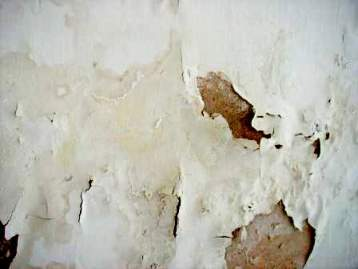
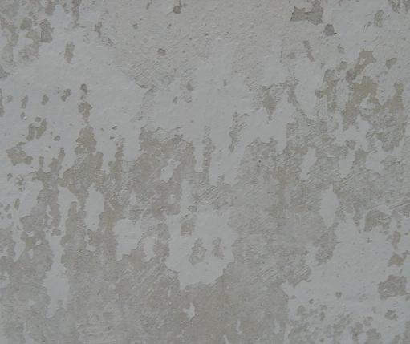
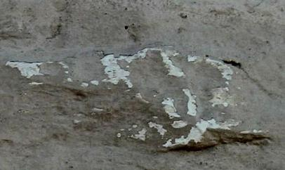
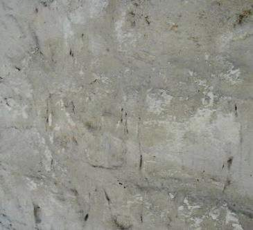

[🠔 Zur Übersicht: Kalk](26bausto.md)  
# Technische Informationen zu altbaugeeigneten Baustoffen - Anstrich auf mineralischen Oberflächen
**Anforderungen an die Deklaration von Kalkanstrich / Kalkfarbe / Kalktünche in technischen Merkblättern und Verarbeitungsrichtlinien**  
_von Konrad Fischer_

Konrad Fischer 

## Technische Informationen zu altbaugeeigneten Baustoffen
- Anstrich auf mineralischen Oberflächen

## Anforderungen an die Deklaration von Kalkanstrich / Kalkfarbe / Kalktünche in technischen Merkblättern und Verarbeitungsrichtlinien

Eine Volldeklaration nach branchenüblichem Muster genügt oft nicht, um den typischen Eventualitäten und dem [Kalkpfusch](2kalkfel.md) vorzubeugen. 

Die nachfolgend aufgelisteten Themenbereiche - in der jeweils erforderlichen Vollständigkeit und technisch verständlichen Sprache für Handwerker, Bauherren und Selbermacher! - gehören unbedingt dazu, um zu einem befriedigenden Ergebnis zu kommen:

---

**FARBE**

**DAS PRODUKT UND SEINE BESTANDTEILE**

**Volldeklaration und Wirkungsweise**

**Grundierung:** 
**Anstrich:** 
**Bindemittel:** 
**Zuschlag unter 10%:** 
**Eigenschaftsvergütende Zusätze unter 2% und deren Wirkung:**

**DIE ANSTRICHEIGENSCHAFTEN**

**Zusammenfassung:** 
**Anwendungsfälle: 
Unverträglichkeiten: 
Reversibilität: 
Alterungsverhalten: 
Festigkeitsentwicklung gegenüber Malgrund: 
Carbonatisierung und Abbindeverhalten** 
**Wasserdampfdurchlässigkeit und Kapillarsorption: 
Trocknungsverhalten / Wasseraufnahme: 
Verbrauch/Ergiebigkeit: 
Einsatzgrenzen** . 

**DIE VERARBEITUNG**

**Musterflächen: 
Untergrundvorbereitung:** 
**Mischen / Maschinentechnik:** 
**Anstrichauftrag / Applikation:** 
**Lagerung:** 
**Instandhaltung / Wartungsintervalle:**

Vielleicht auch ergänzende Hinweise auf die Herstellerbeteiligung bei der Beurteilung der Objekteignung, Anlegen von Musterflächen, technische Einweisung und Abnahmen.

Horrorbilder - Thema: [Mißlungener Kalkanstrich](2kalkfel.md):

 
_Ein Fallbeispiel: Abplatzende Innenfarbe auf durchfeuchteter Backsteinwand._

 
_Da hilft auch keine Temperierung: Die Wand bleibt nach Sanierung nass._

 
_Methylzellulosehaltiger Kalkanstrich auf Schellackschicht. 
So sehr können leichtfertige Herstellerempfehlungen auf feuchtebelastetem Untergrund in die Hose gehen. 
Das beschimmelt auch dank organischer "Verbesserung" der Kalktünche, bis der Raumnutzer erkrankt. 
Man muß der Sache schon etwas genauer auf den Grund gehen, bevor man auf wohlfeile Herstellerberatung vertraut._

 
_Abplatzender Spezial-Kalktünchanstrich nach einem Jahr. 
Nach persönlicher Untergrundprüfung durch den Herstellermeister als tauglich empfohlenes Kalkprodukt. 
Durch einen Meisterhandwerkerbetrieb auf selbst vorbereitetem Malgrund (alte Kalktünchen auf Kalkzementputz) verarbeitet. 
Hersteller und Malermeister nach dem Mangel: "Der Untergrund des Kunden ist schuld"._

. 
_Abplatzende und -sandende Spezial-Kalkschlämme auf historischem Kalkstein nach einem Jahr 
Herstellerbeteiligung an Untergrundprüfung, Materialwahl und -rezeptur, Mustererstellung, Verarbeitungseinweisung und Baubetreuung bis Abnahme 
Ausführung durch Restaurierungsfachbetrieb von Untergrundvorbereitung bis Oberflächenfinish 
Nach Auftreten der Mängel: 
Verarbeiter: "Architekt, Produkt und Untergrund sind schuld" 
Hersteller: "Architekt und Verarbeiter sind schuld"._

**Surftipps für Dialektiker** 
**Gegenteilige/Andere/Zusätzliche Informationsquellen - Bilden Sie sich eine eigene Meinung:**

[BAUHERR.DE Farben Lacke Farbstoffe Pigmente Lösemittel Kalkfarben Kunststoffdispersionsfarben Silikatfarben Leimfarben Anstrichstoffe Holzschutzmittel Naturharz-Dispersionfarben](http://www.bauherr.de/baustoffe/farbe_lack.htm) <> [Bundesverband der Deutschen Kalkindustrie e.V. : Mitglieder des Bundesverbandes der Deutschen Kalkindustrie e.V.](http://www.kalk.de/static/50.htm) <> [Gütegemeinschaft Kalkstein, Kalk und Mörtel e.V.](http://www.gueteschutz.de/go.htm) <> [Kalkputze in der Baudenkmalpflege und Bausanierung ](http://www.uni-muenster.de/Chemie/MI/people/Conny/PUTZ.HTM)<> [KALKMÖRTELSYSTEME IN DER BAUDENKMALPFLEGE UND BAUSANIERUNG ](http://mindepos.bg.tu-berlin.de/GEO98/abstracts/PF9.31-01.html)<> [putzer.de - Was ist Grauputz?](http://www.putzer.de/innen/grau.htm) <> [Kalkputzen: Professionelle Putzsanierung - heimwerker.de](http://www.heimwerkerwelt.com/beratung/abdichten/professionelle_putzsanierung/kalkputzen.htm) <> [Tipps & Ratschläge zum Thema Putz - SV HLADIK](http://www.hladik.at/Tipps_und_Ratschlaege.htm)

