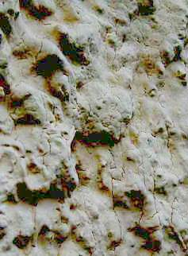

[🠔 Zur Übersicht: Fassade & Anstrich](22bausto.md)  
# Hydrophobierte oder gar wärmedämmende Kunstharzfarben: Einführung
**Produktversprechungen der Farben und Beschichtungen mit wasserabweisenden und selbstreinigenden Effekten kritisch betrachtet.**  
_von Konrad Fischer_

Konrad Fischer 

## Hydrophobierte oder gar wärmedämmende Kunstharzfarben -

Wunderbaustoff mit Nanoeffekt oder Fassadenpest? 

## Produktversprechungen der Farben und Beschichtungen mit wasserabweisenden und selbstreinigenden Effekten - kritisch betrachtet

Einführung

Wärmedämm-Farben und der angebliche Lotuseffekt oder gar Nanoeffekt, der auf den leidigen WDV-Systemen und CO2-bebremsten Betonfassaden die bekannte Schnellverschmutzung inkl. Veralgung und Verschimmelung verhindern soll, sorgen für Wirbel in der Wärmedämm- und Fassadenbranche und ausreichende Verunsicherung auf Bauherrnseite, vor allem wenn man schon ein veralgtes Wärmedummverbundsystem an der einst guten Fassade sein eigen nennt. 

Das drittmittelgesponsorte Fraunhofer-Institut unterstützte den Vertrieb solcher Wunderfarben durch eine "wissenschaftliche Untersuchung" ("Kurzversuch" sozusagen als Eignungsexpertise, unterzeichnet 21.1.1999, Riedl, Sedlbauer, Künzel). 

Aber: Zitat aus dem mir vorliegenden Antrag von Mitgliedern einer Eigentümergemeinschaft gegen den Anstrich mit Lotusan auf einer veralgten Betonfassade (Algenbildung und erhöhte Durchfeuchtung erst nach gem. "Sachverständigen"-Gutachten durchgeführter [Hydrophobierung](29bausto.md#wasserabweisung/hydrophobierung)/Kunstharzfarbbeschichtung als krönender Abschluss einer [Betonsanierung](2beton.md) vor wenigen Jahren): 

_"Anlass für den Antrag ist u.a. die Beobachtung, dass der Probeanstrich mit Lotusan an Haus 5 schon nach 1 ½ Jahren deutliche Spuren von Algenbildung zeigt. Der Test muss deshalb als gescheitert angesehen werden. ..._

__Unverständlich_ : Das negative Testergebnis wird ignoriert und hat offensichtlich auch keinen Einfluss auf das Leistungsverzeichnis/die Ausschreibung des Ing.-Büros [...]. Der Eigentümergemeinschaft wird also zugemutet, für einen Anstrich zu stimmen, der sich bereits im Vorfeld als wenig geeignet erwiesen hat. ..."_

Ja, was mag denn der Grund dafür sein, daß ein Ing. zu einem offenbar ungeeigneten Produkt hält? [Fallbeispiele](10hoai22.md).

 
_Abbildung:_

_So oberflächentrocken sieht z.B. ein vor ca. 10 Monaten mit "Lotus"-Farbe gestrichener Münchner Rauhputz 5 Minuten nach einer Wolkenbruchberegnung aus. Kein Tröpfchen steht noch auf der "wasserabweisenden" Kunstharzbeschichtung. In kürzester Zeit hat das Wasser den Weg in das Kapillarrissnetz geschafft._

_Bravo, lieber Handwerksmeister F. aus M., das wollte der Bauherr, als er eine "möglichst offene" Farbe für den Putz auf seinem verrotteten Fachwerkhaus bestellte und dafür dann von Dir das teuerste Produkt aufgeschwätzt bekam._

_Ob der Wassertransport heraus genauso schnell geht?_

Konrad Fischer: Fassaden energetisch richtig und kostensparend sanieren 1 

[Teil 2](http://www.youtube.com/watch?v=Y1NSxAW15Cc) [Teil 3](http://www.youtube.com/watch?v=RAT7VzBo8k0) [Teil 4](http://www.youtube.com/watch?v=6TBII25iVQk) [Teil 5](http://www.youtube.com/watch?v=Kb0C4KiZvVA) 

Der Malerzeitschrift "Die Mappe" 10/99 entnehmen wir folgende Ausführungen zu den Lotuseffekten (gekürzt ist das Schaulaufen, zu dessen Übersicht ich den Originalartikel sehr empfehle):

**_"Immer wieder Diskussionsstoff_**

_Selten sorgte ein Beschichtungsstoff für so viel Aufsehen in der Branche wie Lotusan. Ausgerechnet eine Siliconharzfarbe bringt diese Farbengattung wieder ins Gerede, die schon Anfang der neunziger Jahre die Meinungen polarisierte. Wie ist es um die Siliconharzfarben bestellt und wie geht der Maler damit um? Die "Mappe" fragte nach. [...]_

[Weiter ...](2lotus2.md) 

Noch Fragen? [Hier!](2frag.md)

> [!abstract]+ Kapitelübersicht: Kunstharzfarben I  
> 1. **Hydrophobierte oder gar wärmedämmende Kunstharzfarben: Einführung**
> 2. [Hydrophobierte Kunstharzfarben 2: Wunderbaustoff oder Fassadenpest?](2lotus2.md)
> 3. [Hydrophobierte Kunstharzfarben 3: Wunderbaustoff oder Fassadenpest?](2lotus3.md)
> 4. [Hydrophobierte Kunstharzfarben 4: Wunderbaustoff oder Fassadenpest?](2lotus4.md)
> 5. [Hydrophobierte Kunstharzfarben 5: Wunderbaustoff oder Fassadenpest?](2lotus5.md)
> 6. [Hydrophobierte Kunstharzfarben 6: Wunderbaustoff oder Fassadenpest?](2lotus6.md)
> 7. [Hydrophobierte Kunstharzfarben 7: Wunderbaustoff oder Fassadenpest?](2lotus7.md)
> 8. [Wärmedämmende Kunstharzfarben 8: Wunderbaustoff oder Fassadenpest?](2lotus8.md)

