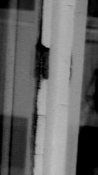
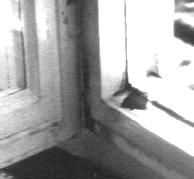

[🠔 Zur Übersicht: Slavisk](slavisk.md)  
# Лакокрасочные покрытия деревянных поверхностей и их применение в строительстве
**Среди маляров и плотников, мастеров-самодельщиков, а так же среди плановиков-архитекторов сегодня все чаще встречается незнание (или непонимание) красок и лакокрасочных покрытий, которые могут успешно противостоять суровым условиям погоды.**  
_von Konrad Fischer_

Статья: архитектора Конрада Фишера ([Dipl.-Ing. Konrad Fischer](1refernz.md)) 
Перевод, примечания и дополнения: [Андреаса Лаукарта](http://www.arwela.info/ruweb/startru.htm) (Dipl.-Ing. Andreas Laukart) 

_Среди маляров и плотников, мастеров-самодельщиков, а так же среди плановиков-архитекторов сегодня все чаще встречается незнание (или непонимание) красок и лакокрасочных покрытий, которые могут успешно противостоять суровым условиям погоды. Не так уж и редко (или даже всегда) отдается предпочтение яро рекламируемых, но не пригодных для строительства продуктов. На что следует обращать внимание? Об этом пойдет речь в этой краткой статье с некоторыми техническими разъяснениями._ 

**Требуемые свойства лакокрасочных покрытий:** 
Отвод осадков (дождевых брызг) 
Связь светозащитных пигментов на поверхности 
Защита древесных конструкций от вредителей и ультрафиолетовых лучей 
Устойчивость самих покрытий к изменениям погодных условий 
Защита грунтовых слоев от колебаний температуры, образований росы и конденсата 
Оформление поверхностей 
Хорошие технологические свойства 

**Характерные свойства лакокрасочных покрытий:** 
Эластичность и твердость 
Образование слоя / вязкость / способность к хорошему нанесению слоя 
Время высыхания 
Глянец и шероховатость 

### Основные составные части красочных покрытий

#### Вяжущие вещества:

вяжущие вещества служат для соединения пигментов между собой, а так же с красящей поверхностью. Они отвечают за водостойкость, паропропускную способность, впитывание, твердость, эластичность, склонность к загрязнению и интенсивность последующего ухода. Вяжущие вещества состоят из масел, растительных или искусственных (синтетических) смол, гумми-смол, резины, воска, казеина. С давних времен по наше время оправдало себя (даже с сегодня используемыми синтетическими компонентами) льняное масло. 

> **Льняное масло из семян льна** 
> Происхождение семян льна (в основном из Аргентины, Индии, Швеции, Германии, Прибалтики) оказывает значительное влияние на содержание масла и соотношение находящихся в нем ненасыщенных жирных кислот. Молекулы льняного масла примерно в 50 раз меньше молекул синтетических смол и примерно в 10 раз меньше самых плотных пор дерева. Именно благодаря этому краски из "чистого" (без лишних добавок смол, отвердителей и т.п.) льняного масла намного превосходят синтетические краски как в хваткости, так и по эластичности, что соответствует и старому правилу: "от более твердого, к более мягкому". Это в противоположность синтетическим краскам, которые не выдерживают свойственную дереву "работу" под изменениями температурного и климатического режима – лопаются или вздуваются и шелушатся. 
> 
> Цвет: 
> Из холодного прессования: лимонного до темно-лимонного цвета. 
> Из горячего прессования: золотисто-желтого до легких коричневых оттенков. 
> Остается жидким до -16 oC, потом наступает фаза коагуляции (образование хлопьев), при нагреве до 40 oC становится опять прозрачным. 
> Высыхание происходит за счет реакции с кислородом воздуха, в оптимальном случае при умеренном влиянии света. Под открытым влиянием солнца, высыхает быстрее, но после 10-14 дней становится вновь мягким или даже липким. Чем чище масло, тем быстрее протекает высыхание. 
> Несколько медленное высыхание = более качественное покрытие! 
> Не сохнет в темном месте и при отсутствии воздуха! 
> Молекулы льняного масла состоят из глицерина (алкоголь) и различных жирных кислот, большинство которых находятся в "ненасыщенном" состоянии и имеют "двойные связи". Таким образом они могут накапливать атомы кислорода. Три молекулы жирной кислоты соединяются с одной молекулой глицерина, при этом образуется молекула льняного масла и три молекулы воды (образование сложных эфиров). Таким образом льняное масло это сложный эфир (кислоты + алкоголь = сложный эфир + вода). 
> Льняное масло реагирует с кислородом воздуха, изменяя при этом свою структуру, то есть молекулы кислорода "сшивают" между собой отдельные молекулы льняного масла, образуя при этом макромолекулярную структуру. 
>
>> Окисляясь, льняное масло постепенно переходит из жидкого состояния в твердое (от ухудшения вязкости и липкости, до образования твердой пленки). С принятием кислорода, льняное масло увеличивается в объеме, поэтому при нанесении слишком толстого слоя краски может привести к неприятному морщинистому вздуванию краски. 
> 
> К особым качествам льняного масла относится его превосходная способность связки с подпокрасочным покрытием. За счет "набухания" во влажной среде оно так же обладает способностью высыхать на увлажненной деревянной поверхности, что не редко встречается например у оконных рам. 
> 
> Сложность и "недостатки" масленых красок скрываются в несколько медленном (по сравнению с лаками на смолистой основе) высыхании, и возможном образовании полос при сильно большой концентрации пигмента. Однако их можно успешно предотвращать с помощью дополнительных мер: использование правильной рецептуры, принятие конструктивных защитных мер (против проникающей воды или прямых солнечных лучей во время высыхания). _При применении краски важен индивидуальный подход с соответственно продуманным и правильно выбранным решением._ Для напольных покрытий важна например определенная твердость, для окна, подвергающегося переменным погодным условиям, важна эластичность и диффузионно-пропускная способность. Так что универсальной краски (ни натуральной, ни синтетической), для всех случаев жизни быть не может!
> 
> 
> 
> 
> **Льняной Штандоль (Standoel = полимеризованное масло) / Эмаль / Глянцевые лаки** 
> льняной штандоль это льняное масло с начальным образованием молекулярного "сшивания" вследствие нагрева до 300 oC. При этом оно сгущается, но без значительного приема кислорода. В зависимости от продолжительности нагрева, зависит его вязкость и последующие качества обработки (более трудоемкая обработка, чем у олифы). Сохнет дольше т.к. в следствии молекулярного "сшивания", атомы кислорода медленнее проникают внутрь слоя. Раньше льняной штандоль производился за счет отстоя (поэтому такое имя = отстоявшееся масло, перевод с нем.) под влиянием солнца, при этом несколько обесцвечиваясь. Он улучшает качества слоя: избежание образования полос, общую твердость, особое противодействие влаге, придает поверхности глянец. Только при сгущении под солнцем (сегодня не существует в продаже) также улучшается качество высыхания и погодоустойчивость. 
> Полимеризованное масло (льняной штандоль) принимает меньше воды, и соответственно меньше разбухает. 
> Обычное применение: 10-25% для первого слоя и как заключительный прозрачный слой для глянцевого эффекта. 
> 
> **Льняное масло для лака** 
> особо чистое льняное масло. Излишние вещества удаляются посредством нагрева до 85 oC и добавления отбельной земли. При этом улучшается принятие кислорода, что ускоряет процесс высыхания. Применяется для приготовления белого лака и художественных красок. 
> 
> **Олифа** 
> это в основном льняное масло с различными добавками, ускоряющих высыхание (например оксиды металлов), которые составляют 1-3 %. Олифа является главной составной частью всех масляных красок. В отличие от чистого льняного масла олифа имеет повышенную твердость. Для следующего ускорения высыхания, часть олифы может быть заменена на твердосохнущее харттрокэноль (масло с добавками природной копаловой смолы, добываемой из некоторых тропических деревьев). При добавлении серы (в жидком сернохлористом соединении) получают олифу, которая сохнет уже после 24 часов (недостаток: слишком плохая проницающая способность). 
> 
> НО ПОМНИ: чем медленнее протекает высыхание, тем лучше и долговременнее держится покраска! 
> 
> Производители натуральных красок охотно используют в качестве ускорителей для высыхания 
> 
> **Древесное (тунговое) масло** 
> добывается путем прессования орехоподобных семян китайского или южноамериканского тунгового дерева. Использование в чистом виде не имеет смысла, так как наряду с быстрым высыханием передается повышенная хрупкость и образование трещин. Добавление 20 % тунгового масла в льняное масло, заменяет металлические присадки-ускорители, повышает высыхание и уменьшает склонность дерева к разбуханию от влаги. Макс Дёрнер пишет в своей книге "Покрасочные материалы и их применение", 12 издание: "Китайское древесное масло пока не применимо, несмотря на его некоторые положительные качества, как например хорошее просыхание, т.к. оно высыхает, образуя непрозрачную пленку. Кроме того, оно сильно склонно к пожелтению. В промышленном производстве применятся для быстросохнущих, так называемых 4-часовых красок." Тунговое масло образует твердую, смолистоподобную поверхность, которая в зависимости от погодных условий и нагрузок пользования не имеет обязательных преимуществ. 
> 
> **Хальб оль (= полуразбавленное масло)** 
> льняное масло, разбавленное 50 % на 50 % с растворителями (обычно Shell Sol Т-бензин). Улучшает размазочную наносящую способность масляных красок. В качестве растворителей можно использовать и другие масла природного (напр. рапсовое, ореховое и др. масла) или синтетического (напр. Оватрол) происхождения. 
> 
> **Харттрокэноль** 
> вареная смесь льняного масла с копаловой смолой тропических деревьев (напр. из коурбарилового дерева). Ускоряет высыхание, почти без потери эластичности. Не улучшает качества покрытия, лишь ускоряет время высыхания. Наилучшего качества можно достигнуть только избегая подобных ускорителей. 
> 
> 
> 
> **Масляный лак** 
> производится путем смешивания различных смолистых веществ с маслом. Плотнее закрывает или даже полностью закупоривает поверхность, тем самым ухудшает или полностью исключает диффузионную способность материала. Обладает большей глянцевой способностью, чем матовая масляная краска. Масляный лак склонен к образованию трещин и повышенной хрупкости. 
> 
> **Смолы** 
> ускоряют процесс высыхания, уплотняют поверхностный слой, повышая его твердость. Основной недостаток: температурные растяжения смолистых веществ и дерева протекают совершенно неоднородно друг с другом. Процесс старения смол дополнительно усугубляет эту проблему. И еще: дерево при непосредственном облучении солнцем хорошо накапливает энергию, соответственно расширяясь. В результате покрытия с меньшим фактором температурного растяжения трескаются. 
> 
> Природные смолы: 
> 
> 
> 
> * **даммаровая смола** (от дерева каури).
> * **копал** (в частности от дерева коурбарила), различается настоящий (из ископаемых останков) и современный (из живых деревьев) копал. Копал имеет высокую температуру плавления, обладает высокой твердостью.
> * **канифоль** (добывается из сосновых смол путем извлечения терпентинного масла), применяется для приготовления быстросохнущих лаков.
> 
Синтетические (искусственные) смолы: 
> * **алкидная смола** (от англ. ALKohol и acID) сильно склонна к образованию трещин, чем меньше содержание масла, тем больше склонность. Существует огромное количество разновидностей. Обогащенные путем варки с различными растительными маслами, а так же добавкой сложных алкогольных и кислотных соединений, являются все же сравнительно чувствительными к образованию поверхностных трещин.
> * **акрилатная смола** отличается высоким содержанием растворителей и очень быстрым высыханием. Производится из акрилатной кислоты, имеет запах уксуса, содержит метакрилкислоты и их сложные эфиры (особо ядовиты! в мономерном виде), которые образуют макромолекулярные соединения. Поэтому т.н. АКРИЛАТНЫЕ дисперсионные покрытия имеют низкую связную способность и плохо держатся на поверхностях (отслаиваются и вздуваются). При этом не все мономеры полимеризируются, а частично остаются в покрасочном слое.
> 

1->2->3-> 
трехлетний покрасочный слой на алкидной основе у деревянного окна. 1: шелушение, образование трещин и пузырей - 2: Разрушение оконной замазки, 3: вздутие краски внутри**Лаки:** 
это смесь из вяжущих веществ (смол, масел), растворителей, красителей, ядов против древесных вредителей, пластификаторы и др. наполнители. 

Алкидные и акрилатные краски плотно закупоривают поверхность, преграждает транспорт водяного пара, в сравнении с природными лаками недостаточно эластичны для деталей подверженных погодным и температурным изменениям. Влага проникает через сетчатые трещины и накапливается под покрасочной пленкой, разрушая тем самым деревянную конструкцию. Так при незнании свойств стройматериала, он из "охранника" конструкций уже скоро может стать ее прямым врагом. 

Для красок, содержащих алкидные соединения, особенно характерны повреждения в направлении древесных прожилок, которые можно довольно рано наблюдать у водоотводящих оконных козырьков. Проникающая под слой лакокрасочного покрытия вода, не может быстро высыхать и приводит часто к скрытому гниению дерева. Разрушающая дерево коррозия может протекать так же и при применении акрилатных покрытий. Они хоть и обещают лучшую "вентиляцию", но не способны гарантировать ее в необходимом объеме. Кроме того, их матовая поверхность является хорошим накопителем грязи, что имеет негативные последствия для находящейся под ней конструкции (биологические паразиты, накопление влаги). 

Большой проблемой является повышенное уплотнение поверхности дерева при ремонтных работах. Не редко проводятся исправительные работы только наружного слоя, при этом достигается дополнительное уплотнение покрасочного слоя. Парообразный конденсат, находящийся под ним, вредит дереву. 

Некоторые акрилатные краски на водной основе слипаются, хотя на вид выглядят высохшими (например при открытии окна или двери). В них хотя и намного меньше растворителей, но зато достаточно других проблематичных добавок (пеногасители, биоциды и т.п.). Как правило их нелегко снова удалить, т.к. они устойчивы против обычных щелочных протрав и требуют применения более агрессивных средств, удаления механическим или термомеханическим способом. 

Классификация возможна по составным компонентам (напр. алкидный), по растворителям (напр. водяной), по очередности слоя (напр. грунтовый), по применению (напр. для пола), по качественным свойствам (напр. матовый). 

В отличие от чисто масляных красок, лаки образуют "отдельные" слои (переходные границы от слоя к слою). Поэтому при ремонте и реставрации таких поврежденных слоев необходимы дополнительные работы для сглаживания (зашкуривания) подобных переходов. 

**Растворители:** 
делают покрасочный материал более жидким (легкое распределение при покраске). Разжижают твердые вяжущие вещества без изменения химических структур. 

Необходимы если: 
проводимые работы проходят в холодных условиях (напр. вне помещений); 
требуется ускоренное высыхание; 
для производства особо жидких и тощих грунтовок. 

НО ПОМНИ: много растворителя – легкий путь маляра, экономящего свои силы при растирании краски – это надежный способ испортить покрасочный слой. Из слишком жидкого слоя вместе с избыточным растворителем улетучиваются так же его стабильность и защитные свойства. Он особо склонен к образованию сетчатых трещин и при наружном использовании уже через год начинает шелушиться и отпадать. 

Возможны: 
Искусственные органические растворители (напр. в виде заменителя скипидара): растворители на основе бензолов, толуола, ксилола, а так же хлористые соединения углеводорода, нитро-растворители. Проблематика: опасны для здоровья (жалобы на сердце, кровообращение, разрушение нервной системы). Лаки на водной основе (водоэмульсионные) содержат бутиленглюкол, вызывающий резь глаз и слизистой оболочки, возможно изменение наследственного материала. 

Растительные растворители (терпентины): терпентинные и бальзамные масла (из смол хвойных деревьев), масла из кожуры цитрусовых. Проблематика: раньше с использованием нечистого растительного растворителя были связанны ряд заболеваний у маляров (напр. малярная часотка). Очищенные сегодня натуральные растворители (обычно двойной дистилляцией) практически не содержат вредных для здоровья дельта-3-каренов. Они несколько дороже искусственных заменителей, так как требуют особых методов очистки. Однако они далеко не являются лучшим натуральным продуктом с технической точки зрения. Здесь рекомендуется лучшее по техническим свойствам, а так же практически свободное от дельта-3-каренов бальзамное терпентиновое масло, добываемое из живых деревьев (напр. в Португалии). 

Другие не опасные для здоровья (отсутствие кожных раздражений) продукты из нефтепереработки: изо-додекан, изоалифаты и др. углеводородные соединения, полученные путем дистилляции нефти (свободные от вредных ароматических углеводородов; их содержание меньше 0.01%, для сравнения бензин-растворитель до 19%). Используются в Швеции, а так же среди других изготовителей натуральных красок. Проблематика: сравнительно низкая растворимая способность, поэтому необходима добавка других натуральных масел в качестве растворителей. 

**Протравливатели:** 
для удаления старых и непригодных слоев краски или лака существуют принципиально щелочные протравители (растворы едкого натра – довольно дешевое производство, сильное намокание дерева, пригодны не для всех видов касок, требуется последующая нейтрализация, опасность солевых отложений в дереве, изменяет цвет некоторых видов дерева), протравители, содержащие хлоруглеводороды (с опасным для здоровья дихлорметаном и высокими требованиями по правилам техники безопасности) и другие рецепты химической отрасли (бензилалкоголь (C6H5CH2OH), N-метил-пиролидон, сложные эфиры; в зависимости от концентрации высокие требования к технике безопасности, чем выше температура и количество жидкости, тем больше нагрузка на древесные конструкции). 

При использовании протравителей принципиально важно хорошее проветривание помещений и использование защитных средств для кожи и дыхательных путей в согласовании с инструкцией изготовителя. 

**Ускорители высыхания (Сиккативы):** 
при добавлении в масло или маслосодержащие продукты действуют как катализаторы для лучшего или более быстрого высыхания. Возможно применение синтетических соединений тяжелых металлов, смол и особых масел. Раньше применялся оксид свинца (ядовит, обозначение символом черепа обязательно, способствует протвержению масла и высыханию "изнутри", сокращает высыхание до 24 часов, сегодня поставляется только со специальным разрешением отдела памятников архитектуры) или октоат кобальта (до 36 часов, просыхание снаружи внутрь). При избыточном добавлении сиккатива возможна обратная реакция (замедление высыхания). Ядовитые соединения свинца и бария сегодня заменяют соединения циркония, кобальта и железа. Для изготовления олифы сегодня широко используется октоата кобальта (около 0,5 %). Соединения марганца способствуют равномерному (внутри и снаружи) высыханию слоя. 
Чем меньше сиккатива, тем дольше высыхание, но и лучшая стойкость покрасочного слоя в наружных условиях! Передозировка сиккатива ведет к образованию трещин, морщин и липкой поверхности. 

Другие сиккативы: нафтенат свинца и нафтенат кальция (напр. в шведских красках), соли металлов, смеси марганца, бария, кобальта, раньше так же часть (20%) олифы заменялась на тунговое масло. 

Для качественного слоя краски важно уравновешенное соотношение сиккатива, которое способствует равномерному просыханию как изнутри, так и на поверхности покрасочного слоя. 

**Пигменты (красители):** 
вещества, придающие красящим покрытиям цвет. Используются натуральные пигменты, приготовленные из природных почв, добытые из растений или металлосодержащих ископаемых, а так же искусственные пигменты, произведенные химической индустрией. 
Следует обращать внимание на зависимость нагревания конструктивных элементов от цвета. Белый цвет может нагреваться в нормальных условиях до 38 oC, темные и "природные" цвета при тех же условиях до температур свыше 70 oC. Соответственно с этим и их температурное растяжение и склонность к накоплению влаги. По возможности в вяжущее вещество добавлять светоустойчивые, невыгорающие пигменты: природные почвы, экстракты растений и оксиды металлов (в качестве "активных" пигментов, которые повышают погодостойкость посредством образования кислотных продуктов распада в вяжущем средстве; создается звездаподобная кристальная структура, которая дополнительно укрепляет пигмент с вяжущим средством). Чем дольше настаивать и перемешивать пигменты с вяжущим средством, тем экономически выгоднее их можно применять и тем меньше они открашиваются! 

Белая краска для окон раньше приготавливалась на основе активной углекислой соли свинца (белый свинец или свинцовые белила). Белый свинец токсичен, почти не склонен к пожелтению, не поражается грибком, водорослями, микроорганизмами, но практически не действует против насекомых. Он особенно устойчив при наружном применении. С технической точки зрения белый свинец превосходит все другие белые пигменты. Приобретение с заверенным разрешением на применение в целях реставрации со стороны Denkmalpflege (Охрана памятников архитектуры в Германии). Применение свинцовых белил в виде пигментной пасты при соответствующих мерах безопасности, которых следует придерживаться и с другими красками и лаками, не предоставляет собой особых проблем. В виде порошка свинцовые белила должны быть замешаны маляром в льняном масле. 

Сегодня для приготовления белых красок используются: 

- природный оксид титана (из рутила – минерал родственный с глиняной почвой); 
- высоко покрывной синтетический оксид титана; предлагается в продаже в виде пасты, замешанной на льняном масле; 
- оксид цинка (может содержать небольшое количество свинца); выглядит несколько прозрачно, склонен к пожелтению; предлагается в виде пасты, замешанной на ореховом масле (т.к. оно менее чувствительно к пожелтению); 

В случае отсутствия или отказа от свинцовых белил специалисты советуют применение смешанной краски из пигментов оксида титана (50%) и оксида цинка (50%). Для дальнейшего уменьшения опасности пожелтения (наличие важных причин при художественном оформлении), советуется соотношение 1:3 (оксид цинка к оксиду титана). 

Для создания различных красно-коричневых оттенков предпочитается использование естественных земляных пигментов (например терра ди сиена – сиенская земля), а для серых оттенков сажа. 

**Защитные средства для дерева (антисептики**) 
т.н. защитные средства для дерева действуют токсическим (т.е. с содержанием ядовитых веществ) путем на древесных вредителей (насекомых и грибков, которые питаются древесиной), например пилильщик сосновый (_lat. Diprion pini_), дровосек-усач домовой (_lat. Hylotropos bajulus_), точильщик домовой (_lat. Anobium pertinax_), гриб домовой (_lat. Merilius lacrymans_) и т.д. и т.п. Эти препараты успешно предотвращают разрушение дерева, но они содержат различные яды (напр. препараты бора, линдан...) вредные не только живым организмам, разрушающим древесину. Они наносят вред полезным насекомым и животным (пчелам, летучим мышам, домашним животным), а так же человеку. Поэтому подобные средства нужно применять как можно реже, а лучше вообще обходится без них. 

### Техническая характеристика лакокрасочных покрытий

#### Время сушки (высыхания)

Высыхание проходит в три этапа: 
1. Испарение и высыхание растворителей или растворяющих средств, 
2. Понижение и утрата липкости за счет высыхания поверхностного слоя, 
3. Просыхание всего покрасочного слоя (в глубину). 

Сушка зависит от таких факторов как содержание смол (смолы сохнут с испарением растворителей, например смола копалового дерева, сложные эфиры канифоли, алкидные смолы и т.д.), содержание харттрокэноль (см. выше), растворителей, вида и количества масла (масло высыхает посредством окисления, то есть приема кислорода), толщины слоя, подпокрасочного грунта, а так же от внешних условий (количество света, температура, относительная влажность). 

Жирные краски (мало смол, много масла) сохнут дольше, чем "бедные" краски (с высоким содержанием смол около 30%, которые почти не "дышат" и склоны к более раннему шелушению и растрескиванию). Свинцовые белила имеют особо благоприятное просыхание, так как их химические соединения с льняным маслом ускоряют просыхание (в несколько меньшей степени так же оксид цинка). В Германии их применение должно санкционироваться ответственными органами по Защите Памятников Архитектуры. 

Без добавки смол и отвердителей краски сохнут в среднем 4-7 дней. В зависимости от рецептуры полное высыхание может протекать и значительно дольше. С применением харттрокеноль примерно 24 часа, с применением алкидной смолы время сушки сокращается до 4-6 часов. Без применения смол, но с применением правильной рецептуры и дозировки сиккатива (см. выше) можно так же добиться 24 часового высыхания. 

Слой краски должен наноситься как можно тоньше, хорошо размазываться (мучь кисть, а не краску!), без излишнего количества растворителей – тогда достигается оптимальное высыхание с одновременным сохранением долговременного качества покрасочного слоя. 

При быстром, нетерпеливом нанесении слоев или при нанесении слишком толстых слоев (частая ошибка начинающих), легко создается обманчивое впечатление достаточного высыхания промежного слоя. Но воздушное окисление такого слоя произошло не достаточно, и при нанесении последующего слоя оно еще больше затрудняет полное просыхание. Образовавшуюся "корку" такого слоя (например при применении октоата кобальта в качестве сиккатива) можно сдвинуть кончиком пальца не прилипая к ней. Особо часто переоценивается продолжительность высыхания грунтового слоя. Он проникает вглубь древесины, что дополнительно продлевает его высыхание. Последующие слои краски блокируют и предотвращают полное высыхание нижнего слоя. Негативное следствие – при последующем нагревании (летом) непросохшая краска в пазах окна слипается. 

Предотвратить подобное можно лишь, нанося достаточно тонкие слои, выдерживая время для межслойной сушки при достаточной температуре высыхания. В единичных случаях необходимо многодневное просыхание отдельных слоев. 

Если заключительный слой остается особенно долго липким, то одной из причин этого является недостаточное просыхание нижнего слоя. Повышенная влажность дерева может так же служить тому причиной. Помни: использование водорастворимых защитных средств для дерева могут препятствовать процессу высыхания. В таких случаях необходим тщательный контроль влажности древесины, чтобы избежать неприятностей вследствие ее повышенной влажности. 

Другое негативное явление слишком толстого слоя – образование морщин и складок (сравни выше). 
Так как чисто масляная краска относительно трудно распределяется на поверхности, часто проводится не контролированное добавление растворителей (разбавление). При этом обедняется смесь пигментов и связующих веществ, следствие – значительное ухудшение стойкости краски. Образование корки в открытых или в не плотно закрытых банках так же нарушает оптимальное соотношение масла и пигментов в краске, поэтому в таких случаях следует добавить недостающее количество свежего масла. Иначе концентрация красящего вещества слишком высока, что может привести к преждевременному повреждению покрасочного слоя (особенно подверженных прямому воздействию погодных условий). 

_Важно:_ быстро сохнущие лаки и краски проникают за счет их схватывания не так глубоко в грунтовку, как более медленно сохнущие. Следствие: худшее закрепление, быстрый износ и выветривание. 

**Масляная краска и паропроницаемость** 
Молекулы льняного масла примерно в 50 раз меньше чем молекулы синтетических красок и составляющих их полимеров (алкидные и акрилатные смолы). Смолы предотвращают диффузию водяного пара, образуют водонепроницаемую поверхность, например карабельный / лодочный / яхтовый лак и т.п. 

Особенно у оконных рам нужно рассчитывать на водяную нагрузку в поврежденных местах покрасочного покрытия и паровое давление изнутри. Последующее испарение за счет паропроницания, без существенных повреждений конструкции, возможно только у масляных красок. 

На масляной краске вода из-за высокого поверхностного натяжения стекает каплями, а водяной пар может без проблем выходить наружу. У синтетических красок происходит накопление и усиленное образование застоя воды, которые приводят к вздуванию краски, а затем и к гниению конструкционной древесины. Проблема усугубляется при "обновлении" краски поверх старого слоя. 

**Защита от ультрафиолетовых лучей** 
Под воздействием ультрафиолетовых лучей древесина приобретает обычно темную окраску и повреждается средне- или долгосрочно. Защитой может служить достаточная пигментная окраска. Лессировка (полупрозрачное покрытие лессирующими красками) не является достаточной защитой от разрушающего влияния ультрафиолета. Темные краски способны нагревать древесину до 80 градусов Цельсия, следствие – трещины и выступление смол, разрушающих покрасочный слой. 

Особенно важна тщательная защита окон (как снаружи, так и изнутри!) и соблюдение точности размеров у окон с частой механической нагрузкой. Тщательность и точность выполнения работ особенно важны при восстановлении, ремонте и реставрации. 

**В заключение:** 
Только светлая, то есть белая масляная краска, без или по возможности с минимальной добавкой смол, с оптимально подобранными пигментами (с технической стороны свинцовые белила – идеальное решение) обеспечивают долгосрочную и надежную защиту деревянных конструкций, подверженных погодным условиям. В помещениях это совсем другое дело, здесь ничего не скажешь против улучшенных и бонифицированных лакокрасочных продуктов. Они порой способны даже лучше сохранять поверхность от механического и химического воздействия, чем более мягкая масляная краска. 

И не смотря на это, все еще встречаются так называемые "профессионалы" среди маляров, которые не соблюдают требований из описания проводимых работ. Они упорно уклоняются от применения масляных красок для наружных или реставрационных работ, прибегая к менее качественным, но более простым в применении краскам. К тому же качественная масляная краска немного дороже (20-25,- Евро/литр) простых синтетических красок (7-10,- Евро/литр). Часто используется разбавленная олифа с небольшим количеством пигмента в качестве грунтовой краски (4,- Евро/литр). Использование красок собственного изготовления, упрощает возможность манипуляции на стройке. 

Благодаря подобному мошенничеству, которое нелегко обнаружить на первый взгляд, заказчику наносится сознательный ущерб. Подобные краски имеют не только кратковременный срок жизни, быстро вздуваются и отлупляются, но и наносят ущерб дереву за счет накопления и застоя влаги под поврежденным слоем краски. Это дополнительно затрудняет последующий ремонт и восстановительные работы. 

При этом 1 литр масляной краски хватает в среднем на покрытие 14 кв.м. деревянной поверхности. Для покраски простого, одностворчатого окна размером 1,00 / 1,40 м. с общей покрасочной поверхностью 1,50 кв.м. и трехслойного покрытия затраты на материал около 2,- Евро (дешевая алкидная краска) или 5,- Евро (качественная масляная краска). Это не учитывая большую продуктивность масляных красок по сравнению с синтетическими. 

**Мой Вам совет:** 
не доверяйте пустым обещаниям по поводу надежности лаков и красок с содержанием синтетических смол. Я еще никогда не видел таких, которые бы без ущерба выдержали 24 месячный срок. А среди красок на основе натурального масла – много раз, в том числе и в собственном доме. 

Если нужно дать оценку краскам с искусственными отвердителями, то можно с уверенностью сказать, что для наружной покраски древесной конструкции они по всем качествам, кроме времени высыхания, уступают натуральным масляным краскам. Не поддавайтесь соблазну быстрого высыхания, иначе Вам придется дорого платить за постоянно необходимые восстановительные работы (что конечно же на руку обманувшему Вас маляру). 

Даже если покрасочная поверхность через год лопается и трескается, находятся эксперты, заверяющие, что это, дескать, соответствует существующим нормам, что это нормально когда наружные окна из года в год должны заново краситься. При этом ссылаясь на памятный лист Nr. 18 "Покрытия внешних деревянных конструкций, в особенности окон и входных дверей", издатель "Общество красок и защитных средств" [примечание A.L.: свободный перевод с нем.]. В этом обществе заседают в основном представители индустриального производства синтетических красок и лаков. Они преследуют только свои интересы, а не заказчика и потребителя. 

Поясните Вашему плановику или архитектору, что он должен особенно бдительно следить за соблюдением технологии и рабочей документации покраски деревянных конструкций, чтобы избежать их постоянного ремонта. Иначе он может нести ответственность (в течении 5 лет) например за регулярный ремонт дождевого козырька. Маляр быстро найдет себе отговорку для полопавшейся краски, а вот бесплатный или дешевый архитектор должен объяснить, откуда берутся повреждения. 

### Применение масляной краски для старых и новых окон

**Основные правила:** 
Для наружных работ: избегать дождя, холода, прямого солнечного света - то есть работать только при сухой и теплой погоде. Еще лучше: покраска старых окон в мастерской или закрытых помещениях. При опасности загрязнения или намокания: защита поверхности ПЭ-пленкой, без нарушения постоянного притока свежего воздуха. Маляры и другие работники должны быть подробно проинструктированы о ходе, виде и технологии проводимых работ. Им должна быть предоставлена рабочая документация проводимых работ в письменном виде. 

**Этапы проводимых работ:** 

**_1. Монтаж временной защиты на место снятых окон._** 
В зависимости от проекта, может применяться толстая полиэтиленовая пленка, которая возможно должна заменяться в зависимости от хода работ. 

**_2. Очистка поверхности от грязи, водорослей, мха, крупных остатков отошедшей краски, свободно удаляющихся остатков замазки, и т.п._** 
Тщательно зачистить переходы от краев старого слоя (который не должен быть слишком толстым) и отставшей краски. 
Поврежденные и слишком толстые слои старой краски, а так же потрескавшуюся оконную замазку удалить с помощью пригодного протравителя. 

Во время термической обработки необходима особая осторожность с оконными стеклами, поэтому для такой обработки их лучше всего вынуть из рамы. Размягчая высохшую замазку протравителем (без фтор-хлор-углеводорода (фреона)!) или специальным инструментом, уменьшается риск повреждения стекла по сравнению с "горячей" обработкой феном. 

При использовании щелочных протравителей (не особо пригодные как для материала, так и для человека, но дешево – сравни выше) хорошо промыть нитро-растворителем, иначе грозит образование солевых отложений и щелочное омыление. 

Места большого накопления смолы на поверхности выжечь и замазать замазкой для дерева. Остатки смолы (а так же остатки протравителя) могут мешать полному высыханию – краска "липнет". 

В крайних случаях возможно нанесение масляной краски на зашлифованной поверхности хорошо держащихся остатков алкидной или акрилатной краски. Но в таком случае следует рассчитывать на дополнительную блокаду для проникшего конденсата, дождевой воды и т.п. У покрытий с водоэмульсионными красками (акрилатные краски) возможны проблемы с адгезионной способностью (прилипанием к поверхности), поэтому всегда сначала провести тестирование на небольшой, не бросающейся в глаза поверхности. Только потом решать, нужно ли удалять старый слой или можно красить поверх. 

**_3. Подготовка поверхностей шлифованием._** 
По возможности идеальное шлифование поверхностей, т.к. исправление ошибок повторной шлифовкой позже практически невозможно. Длительное просыхание масляных красок дополнительно затрудняет повторное шлифование. 

**_4. По потребности осторожно смочить небольшие повреждения волокон дерева и аккуратно зачистить их мелкой наждачной бумагой. Удалить пыль._** 

**_5. Проверить влажность дерева в нескольких местах, на глубине минимум 5 мм: для хвойных пород < 15%, для лиственных < 12%._** 

Нанесение слоев (начиная с пункта 5 и далее) всегда начиная от бедной к богатой смеси краски (кол-во масла в краске в соотношении к растворителю или добавкам смолы увеличивается с каждым слоем). Так он останется эластичным и способен поддаваться (после соответствующего просыхания каждого слоя, до 6 дней/слой) дальнейшему просыханию нижних слоев. В противном случае возникают внутренние натяжения и уже после трех месяцев возможно образование трещин. Кроме того, в таких случаях наблюдается тенденция прилипания плотно прилегающих поверхностей (створки окон). 

При нагревании льняной масляной краски (на регулируемой конфорке) до 50-70 oC достигается улучшенная способность нанесения тонкого слоя, экономится краска, сокращается время сушки, улучшается проницательная способность и сцепляемость с грунтовой поверхностью. При нагреве краски может так же снижаться необходимое количество растворителя, без понижения качества нанесения слоя. 

Нанесение каждого слоя должно производиться на абсолютно сухую, не липкую, не размягченную поверхность старого слоя, в противном случае грозит неполное просыхание, плохое сцепление, вздувание и тресканье нового покрытия. 

Для хорошего высыхания особенно важно наносить очень тонкие слои. Именно в этом отношении часто допускаются ошибки, так как эта работа требует сил и терпения. Предвестники ошибки: образование морщинистой поверхности, потеки, неравномерная толщина слоя, следы кисти. 

При первом грунтовании примерно после 30 мин. удалить не впитавшиеся остатки грунтовой краски. 
Примерно 30 мин после нанесения покрасочного слоя еще раз пройтись вытертой кистью, чтобы получить равномерную, тонкую поверхность. 

План выполнения работ должен быть организован так, чтобы избежать склеивания створок окон (дверей) с конструкцией рамы. Особенно при локальной работе и применении защитной пленки важно сухое состояние рам. Обеспечить надежную защиту от осадков на протяжении проводимых работ. 

Осторожно: пропитанные маслом и краской тряпки легко воспламеняемы, растворители огнеопасны! 
Соблюдать прочую технику безопасности. 

Применяемые стройматериалы / краски и лаки, с соответствующими накладными и оригинальной упаковкой должны быть проверенны и приняты руководителем стройки / прорабом. Вопрос применяемых материалов должен быть выяснен изначально (до заключения договора). Обеспечить постоянный контроль техники выполнения работ и применяемых стройматериалов. Целесообразно может быть снятие отдельных проб применяемых стройматериалов. При нарушении рабочей техники или применении неправильных материалов – составление письменного протокола. 

Краски, не соответствующие требованиям договора и/или с не соответствующими требованиям качествами из-за неправильной техники нанесения, должны быть удалены и заменены на требуемые. Применение не декларированных стройматериалов есть намеренный обман заказчика и должен наказываться в соответствии с законом. В крайних случаях стоит прибегать к иску на возмещение ущерба, как показывает опыт судебной практики. И слава богу. 

Итак, вернемся к следующим этапам работ: 

**_6. Предварительная защита окон с помощью обклеивания._** 

Обклеить края стекол липкой лентой, поверхности стекол накрыть и обклеить для защиты от краски и прочих загрязнений (например газетами или полиэтиленовой пленкой). При необходимости так же обклеить прилежащие конструктивные элементы. 

Эти простые защитные меры служат залогом успеха и экономят время на переделку, что иначе нельзя гарантировать даже при самой осторожной и аккуратной работе. При обклеивании важно оставлять место 1-2 мм между переходом стекла и замазкой рамы. Потом этот переход должен быть хорошо закрашен, чтобы предотвратить проникание воды. 

**_7. Грунтовка (первый покрасочный слой)._** 

Распространенной защитой деревянных конструкций являются антисептики, содержащие ядовитые вещества. Применение свинцовых белил не всегда заменяет дополнительные защитные средства (антисептики), так как существуют вредители, которые разрушают (только надкусывают, но не поедают) покрасочный слой, чтобы добраться до древесины. В таких случаях советуется применять особо ядовитые контактные антисептики, свинцовые белила к таковым не относятся. 

На покрасочную поверхность нанести разбавленную 50% на 50% растворителем олифу с небольшим количеством пигмента – это для контроля – пигмент должен быть равномерно нанесен на поверхность. На сильно впитывающей в себя поверхности, почти все масло поникает внутрь, а пигмент открашивается из-за недостатка связующего масла. В таком случае необходимо повторить грунтование после достаточного высыхания. В качестве замены или для лучшего проникновения в дерево можно использовать нагретое до 50-80 oC олифу. Повышение температуры на 30 oC соответствует экономии 10% растворителя. 

После 24 часов и 18 oC поверхность начинает подсыхать, после 36 часов до одной недели (в зависимости от условий) просыхает полностью и готова к следующему слою. 

> _Важно_ : если свежее или плохо прогрунтованное дерево хорошо втягивает в себя краску, то состоит опасность, что оно позже "вытянет" вяжущее масло из оконной замазки. Бедная маслом замазка образует трещины. Подобную халтуру видно не сразу, а лишь по окончании всех покрасочных работ. К сожаленью, подобное часто встречается из-за не соблюдения очередности работ стекольщика/плотника и маляра. Свежая замазка после примерно 6 дней просыхает и готова к покраске. Обязательно обращать внимание на качественное замазывание зазора между стеклом и деревом рамы, образование водоотводящего скоса замазки, достаточное перекрытие краской между стеклом и замазкой.

Для ускорения высыхания олифы, может на половину разбавляться с харттрокэноль (сравни выше). Недостаток: содержит смолы, поэтому краска более склонна к хрупкости и ломкости, а так же из-за повышенной твердости к отлуплению от более мягкого слоя грунтовки или вследствие внутреннего напряжения (например при перепаде температур, работы дерева и т.д.). Так можно добиться (но не рекомендуется) времени высыхания до 24 часов. Лучше использовать уравновешенное добавление сиккативов (ускорителей высыхания). Многого можно так же добиться за счет нанесения очень тонких слоев (например подогревая в горячей ванной или добавляя растворитель). 

Богатую смолами древесину (сосна и т.п.) сначала обработать олифой, зашлифовать и очистить от мелкой пыли. Особо смолистые места прожечь или протравить соответствующим растворителем. В противном случае возможны последующие выступы смолы и цветовые отклонения (пятна). 

_Внимание:_ 
Торцевые стороны древесины и стыковые переходы к стенам особенно тщательно защищать против проникания воды (косой дождь, конденсат) – грунтовать трехкратным слоем с добавлением смолосодержащей олифы (добавка 50% харттрокэноль). 
В фальцах только грунтование и один очень тонкий (излишки удалить тряпкой) промежный слой с содержанием натуральных смол, чтобы предотвратить неплотное прилегание из-за слишком толстых слоев, и одновременно обеспечить защиту проникновения влаги изнутри наружу. 

Расход: около 150-200 гр./кв.м. деревянной поверхности. 

**_8. Небольшие недостатки и повреждения поверхности заполнить натуральной льняной замазкой (меловая смесь на льняном масле)_** 

Старая рецептура приготовления: смешать и замешать 1 часть свинцовых белил, 1 часть мелкого белого мела, 1/5 часть свинцового глёта с добавлением такого кол-ва льняного масла, чтобы получилась довольно твердая, легко шпатлюющая, но не жидко-мажущая масса. Не добавлять сиккатив – ухудшает последующую обработку шлифованием. 

Не использовать замазку на основе синтетических смол для наружных работ (фасад) – возможно повреждение дерева за счет накопления влаги. 

Для избегания трещин в местах глубоких повреждений, наносить шпатлевку в несколько слоев с достаточным просыханием каждого слоя. 

Все щели вокруг окна между рамой и стеклом тщательно замазать, чтобы предотвратить любое проникновение влаги (дождь, конденсат, водяной пар). 

В заключение шпаклевания зачистить наждачкой. 

Участки с особо большими повреждениями или прогнившей древесиной заменить на новые подходящие (как по размеру, так и по виду дерева, с одинаковой относительной влажностью, в лучшем случае с одинаковым возрастом) части. При склеивании использовать водостойкий клей для дерева. 

**_9. Нанесение промежуточного слоя_** 

На просохший грунтовый слой (после 3-5 дней сушки) наносится первый слой краски – замешанная на олифе пигментная паста (например смесь оксида титана и оксида цинка 50% на 50%). Только для восстановления исторических построек и реставрации сильно намокающих поверхностей лучше использовать свинцовые белила с "хальболь" (см. выше) – 10% для свинцовых белил, 25% для оксида свинца. Для наружных поверхностей применять по возможности светлые тона, ориентироваться на основании исторических данных или полагаться на собственный вкус. 

Для ускорения высыхания можно, как и у грунтовки, заменять 50% олифы на "харттрокэноль" (см. описание и примечания выше) и добиться таким образом 24 часового высыхания. Высыхание может длиться от 12 часов и до 6 дней и зависит от искусства приготовления рецепта, применяемой рабочей техники и от окружающих условий. В лучшем случае конечно, если правильно подобран рецепт с оптимальной добавкой требуемых сиккативов, используется исходный материал высокого качества, наносятся тонкие слои, производится чистовая обработка и все это при оптимальных для покраски условиях. 

Приготовление красок с низким кол-вом пигмента – лессировка – принципиально возможна, но следует учесть, что с недостатком пигмента, сокращаются или утрачиваются защитные свойства покрасочного слоя. Пигмент блокирует влияние ультрафиолетовых лучей, связующие же вещества (льняное масло, смолы) служат в первую очередь защитой от воды и влаги. 

**_10. Нанесение заключительного слоя_** 

Заключительный слой наносится только на хорошо просохший(ие) предыдущий(е) слой(и). Для конечного покрасочного слоя используется краска с большим содержанием отстоявшегося на солнце масле (= "льняной штандоль", см. выше), с небольшим содержанием пигментов и малым (вплоть до полного исключения) содержанием растворителей или смол. 

Рекомендованное соотношение масла: как рецептура для промежуточного слоя с добавлением от 5 до 25% штандоль-я (или харттрокэноль-я, в зависимости от рецепта краски для промежуточных слоев). 

Для лучшего глянцевого эффекта (блеска) несколько часов после нанесения покрасочного слоя еще раз слегка пройтись обтертой кистью по поверхности. Чтобы достичь высокого качества покраски лучше не применять для заключительного слоя сиккативов. 

Время высыхания: после 2-3 дней краска перестает липнуть, после 3 недель просыхает окончательно. При добавлении харттрокэноль или использовании хорошо подобранных рецептов – соответственно быстрее. 

**_11. Восстановление поверхностей, покрашенных масляными красками_** 

Загрязнения покрашенных поверхностей ведет к излишнему накоплению влаги, пленка масла "набухает" и становится более чувствительной к воздействию погодных условий и разрушительных микроорганизмов. Поэтому важно следить за своевременным уходом. Загрязнения лучше всего удалять слабо разведенной мыльной водой. Выветренные, матовые или потускневшие поверхности просто восстанавливаются свежим слоем олифы, которая наносится пропитанной ею тряпкой. Масляная краска выветривается сначала на верхнем слое, поэтому ее всегда легко восстановить без удаления старых слоев. При своевременном уходе покрашенная масляной краской поверхность может держаться вечно. 

Рекомендуемое время ухода: весной или осенью, а так же в соответствии со степенью загрязнения / выветривания. 

Для внутренних работ: 
дополнительная защита от ультрафиолетовых лучей не нужна. Допустимо применение прозрачных масляных лаков, но с точки зрения сохранения исторических памятников архитектуры лучше использовать лессирующую или кроющую покраску. 

При использовании правильно хранящихся, плотных пород дерева или при покраске поверх старого слоя можно отказаться от грунтового слоя и начинать с нанесения промежуточного. При покраске свежей древесины – грунтовка обязательна! 

_Внимание:_ так как давление водяного пара в большей степени происходит изнутри наружу, благоразумно использовать для внутренних малярных работ более плотную краску. Рекомендуется использовать более жирную смесь (большая доля масла) или добавление натуральных смол (для всех видов слоев замена 50% олифы на харттрокэноль). К тому же они имеют более твердую, сильнее блестящую поверхность. Влажностью и перепадами температур внутри помещений в этом случае можно пренебречь. 

В зависимости от потребности многократно производить шпатлевание и зачистку наждачной бумагой. 

---

**Все выше перечисленные указания и рекомендации не дают абсолютную гарантию успеха в единичных случаях. В первую очередь важно качество выполнения работ, за которое отвечает подрядчик. У опытного маляра есть опять таки свой стиль работы, который в зависимости от поставленной задачи – и в это очень хочется верить, так что про возможную халтуру и говорить не будем – ведет к желаемому результату. А то, что это так же возможно с применением смолосодержащих лакокрасочных продуктов, это еще надо доказать.**

---

**Используемая и другая полезная литература:** 

Louis Edgar Andes: Praktisches Handbuch fuer Anstreicher und Lackierer, Anleitung zur Ausfuehrung aller Anstreicher=, Lackierer=, Vergolder= und Schriftenmaler=Arbeiten, nebst eingehender Darstellung aller verwendeten Rohstoffe und Utensilien, 5. Auflage, A. Hartlebenґs Verlag, Wien u. Leipzig, 1922 

Louis Edgar Andes: Praktisches Rezeptbuch fuer die gesamte Lack- und Farben-Industrie, Praktisch erprobte, auserwдhlte Vorschriften fuer die Herstellung und Anwendung aller Lacke, Firnisse, Polituren, Anstrichfarben usw., 2. Auflage, A. Hartleben Verlag, Wien u. Leipzig, 1916 

Johann Michael Croekern: Der wohl anfuehrende Mahler, welcher curioese Liebhaber lehret, wie man sich zur Mahlerey zubereiten, mit Oel=Farben umgehen / Gruende, Fuernisse und andere darzu noethige Sachen verfertigen ... solle, 2. Auflage, Bey Johann Rudolf Croekern, Jena, 1736 

Max Doerner: Malmaterial und seine Verwendung im Bilde, 12. verbesserte Auflage, Ferd. Enke Verlag, Stuttgart, 1965 (Topliteratur, trotz noch nicht ganz ausgereifter Skepsis gegenueber "modernen" Anstrichstoffen!) 

Guido Hengst: Das A//B//C des jungen Malers, Ein Lehrbuch fuer junge Gehilfen und Lehrlinge, Verlag Georg D.W. Callwey, Muenchen 1944 

Wilhelm Scholz: Baustoffkenntnis, 10. Auflage, Werner-Verlag, Duesseldorf 1984 

[Ziesemann, Krampfer, Knieriemen: Natuerliche Farben, Anstriche und Verputze selber herstellen](8ziese.md), AT Verlag, Aarau 1996 

**_Линки на тему масляных красок и другая информация о краске (на русском):_** 

[www.lacki-i-kraski.com/encyclo/](http://www.lacki-i-kraski.com/encyclo/) энциклопедия лакокрасочных терминов и основных понятий из отрасли лаков и красок (Россия) 
[ www.prokraska.ru/basic/about/](http://www.prokraska.ru/basic/about/) что нужно знать о красках и покрытиях (Россия) 
[ www.ilka.ru/index.htm](http://www.ilka.ru/index.htm) хороший портал посвященный краскам и красящим средствам (Россия) 
[www.dizar.ru/color.html](http://www.dizar.ru/color.html) оптовая торговля лакокрасочными материалами (Россия) 
[www.eco-trade-group.ru](http://www.eco-trade-group.ru/) официальный представитель фирмы Kreidezeit в России 

_**Линки о льняных масляных красках и другая информация о лаках и красках (на немецком):**_ 

[Bernd Kuner: Info Naturfarben](http://home.arcor.de/bkuner/BauWissen/farben/index.html) 
[Seilnacht - Lexikon der Farbstoffe und Pigmente](http://www.seilnacht.tuttlingen.com/Lexikon/FLexikon.htm) словарь красителей и пигментов (на немецком) 
[Seilnacht: Leinoel - Herstellung und Verwendung als Bindemittel](http://www.seilnacht.tuttlingen.com/Lexikon/Leinoel.htm) о производстве и применении льняного масла (на немецком) 
[www.seilnacht.tuttlingen.com/Lexikon/](http://www.seilnacht.tuttlingen.com/Lexikon/) umfangreiches Chemie-Lexikon - химический словарь (на немецком) 
[Naturlacke und Farbinhaltsstoffe in der Diskussion (Suk 5/97)](http://www.schrotundkorn.de/1997/sk970503.htm) дискуссия о компонентах в лаках и красках (на немецком) 
[Beschichtungen von Holzfenstern](http://www.khries.de/fensteranstrich.htm) покрытия для деревянных окон (на немецком) 
[Oekopro, Chemikaliendatenbank zum produktintegrierten Umweltschutz](http://www.oekopro.de/) химическая база данных для экологических продуктов и защиты окружающей среды 

[Paint and Architectural Colour in Historic Buildings](http://members.fortunecity.com/colourman/) (на английском) 

А здесь Вы познакомитесь со взглядами другой стороны: 

[Deutsches Lackinstitut](http://www.lacke-und-farben.de/) 
[European Coatings Net - Homepage](http://www.coatings.de/index.cfm) 

О проблематике растворителей: 

[Betriebsanweisung N-Methyl-2-pyrrolidon [872-50-4]](http://www-organik.chemie.uni-wuerzburg.de/misc/betr_ein/uw-c336.html) 
[Chlorierte Kohlenwasserstoffe (CKW)](http://www.umweltbundesamt.de/uba-info-daten/daten/chlorierte-kohlenwasserstoffe.htm) 
[Chlorkohlenwasserstoff](http://www.gymueb.fn.bw.schule.de/mhamann/referate/CKW.htm) 
[Краски на органических растворителях](http://www.dom.tut.by/content/view/182/27/) (на русском)
