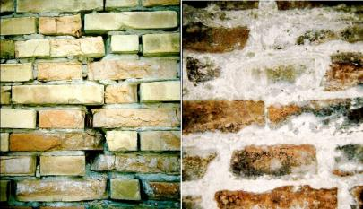
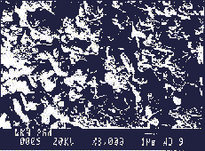
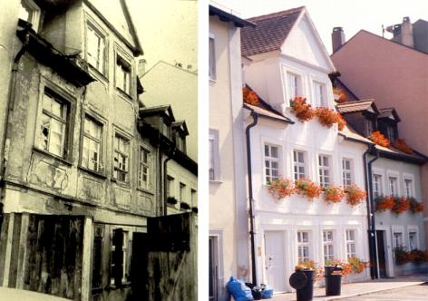
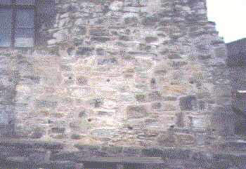
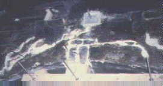
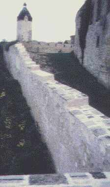
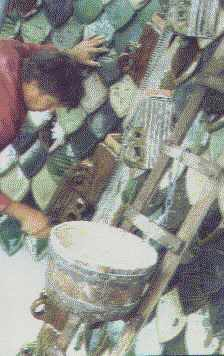
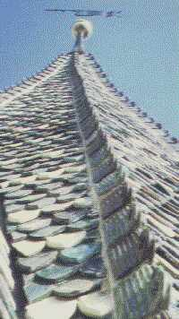
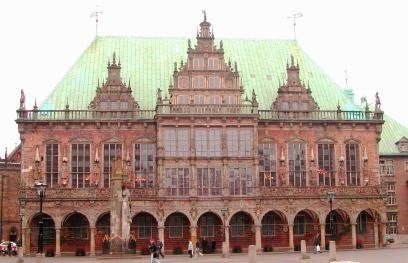
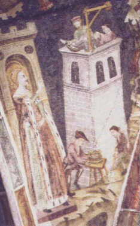

[🠔 Zur Übersicht: English: Old House Repair](english.md)  
# Traditional Craftsmanship in Modern Mortars – Does it Work in Practice?
**This article discusses the use of lime mortar in old building restoration, highlighting the need for traditional craftsmanship to avoid mistakes and damage to newly used materials and original facades.**  
_von Konrad Fischer • aktualisiert 14.11.2008_

## International Workshop 12.-15. Mai 1999 

## "Characterisation of old mortars with respect to their repair"

**(updated 14.11.08)**

### With an excursion to Glasgow Cathedral, Stirling Castle and the Historic limekilns of the Earl of Elgin in Charlestown, Fife 

[My sketches from the excursion](2rilskz.md)

Other interesting sites from Scotland, building research and lime mortar

[Historic Scotland](http://www.historic-scotland.gov.uk/) +++ [Historic Sotland II](http://www.geo.ed.ac.uk/home/research/spsi/histscot.html) +++ [www.darkisle.com/ - Places to go in scotland](http://www.darkisle.com/) 
[Scottish Lime Centre](http://www.scotlime.org) +++ [National Trust of Scotland](http://www.nts.org.uk/) +++ [Historic houses in Scotland](http://www.electricscotland.com/historic) 
[Scottish Historic Houses and Gardens](http://www.scotland-inverness.co.uk/gardens.htm) +++ [The Great Houses of Scotland](http://www.great-houses-scotland.co.uk/) +++ [Scotland's Sources - Castles](http://www.scotlandsource.com/sources/ssc58a.htm) 
[The Balbirnie House](http://www.balbirnie.co.uk) +++ [The Cameron House](http://www.devere.com) +++ [Stirling Castle](http://www.historic-scotland.gov.uk/live-scripts-historic/fram-sit.asp?monument_id=90291) 
[Catriona Fraser: Photograph of Stirling Castle](http://www.geocities.com/SoHo/Square/4638/stirling.html) +++ [The House for an Art Lover](http://www.houseforanartlover.co.uk) +++ [The vikings in England](http://www.viking.no/e/england/index.html) 
[The vikings in Scotland](http://www.visitscotland.com/library/vikings) www.visitscotland.com/library/vikings +++ [The House of Bruar](http://www.houseofbruar.com) +++ [Glasgow School of Art](http://www.gsa.ac.uk) 
[Glangoyne Distillery](http://www.glengoynedistillery.co.uk) +++ [Baxters Visitors Centre](http://www.baxters.com) +++ [The Official Rosslyn Chapel Website](http://www.rosslynchapel.org.uk/) 
[Other castles](8reise.md) 
[Watch Nessie by Video](http://www.lochness.scotland.net)

[www.biffvernon.freeserve.co.uk/lime.htm](http://www.biffvernon.freeserve.co.uk/lime.htm) - Lime. 
This is another Great Conspiracy. 
Houses used to be built with lime mortar. 
This has been going on for a couple of thousand years at least. 
It works. 
Then, in the 20th century, builders stopped using it. 
They forgot how to use it, or died. 
Young builders never learnt. ... [Read more](http://www.biffvernon.freeserve.co.uk/lime.htm)

[Castle Presevation](http://www.castles-of-britain.com/castle91.htm) 
[The Royal Commission on the Historical Monuments in England RCHME](http://www.rchme.gov.uk) 
[The Canadian Institute for Research in Construction](http://www.nrc.ca/irc/irccontents.html) 
[The Preservation Trades Network PTN](http://www.PTN.org) - 
a non-profit task force of the Association for Preservation Technology International (Rockville, MD) 
[Fresco / Frescoes / Truefresco.com](http://www.truefresco.com/) 
[Raadvad - Centeret](http://www.raadvad.dk/) - Conservation/Restoration/Building material and technology/Consulting and education (dansk/english)

[Damp and Timber Problems - Independent Surveyor - ](http://www.pdoyle.net/)[http://www.pdoyle.net](http://www.pdoyle.net/) - 
Independent surveyor's site for Damp and Timber problems in Yorkshire and surrounding counties

[Other information (german)](2baustof.md)🇩🇪 
[English information of my sites 🇬🇧

Organisation: 

Advanced Concrete and Masonry Centre of the University of Paisley 
Director Prof. P.J.M. Bartos 
Department of Civil, Structural an Environmental Engineering 
University of Paisley 
Paisley PA1 2BE 
Scotland 

Lecture: **TRADITIONAL CRAFTMANSHIP IN MODERN MORTARS – DOES IT WORK IN PRACTICE?** 
(The following text is based on the original lecture, but has been updated, revised and enriched with figures and fotos; Fotos: Konrad Fischer besides other named; version 26.10.08)

[Konrad Fischer](1refernz.md) Dip.-Ing. Univ. Architekt BYAK, [Hauptstr. 50](muehle.jpg), D-96272 [Hochstadt a. Main](http://www.hochstadt-main.de/), Germany 

**Preliminary**

Using lime mortar for the restoration of old buildings is not only offering mostly the best results in economical and technical sense but is also a technique, which needs the experience of traditional craftsmanship; otherwise mistakes and unexpected failures will damage the newly used materials and the original facade. Maria Isabel Kanan described the common lime-problems and advantages very clearly in her manual-like publication "LIME: Technical advances for conservation and case studies, Second Series N° 92 2005, 1st Edition, Notebooks of the National Monuments Council, Santiago, Chile : 

_"Lime was extensively used in the past, but the progressive disappearance of traditional binders, as well as craftsmen skilled in working with mortars, has led to the use of new materials in conservation such as cement."_ 

(KF: not to forget the awful drying blockers made from synthetical resins / artifical polymeres / silicones, acrilic chemicals and the chemical hardeners / fixatives based on water glass / potassium silicates, often combined with polymeres, which will change the hardened old surface to cracking crusts. But let's continue with Maria Isabel Kanan ...) 

_"In spite of the advantages of being a compatible and historically accurate material and all of the technical progress made over the last few years, the use of lime is still limited, because there is a need to relearn traditional craft / skills aswell as toput into practise current technical requirements with raw materials, methods of preparation and curing which are different from using cement. Lime mortars are usually executed by local contractors, technicians and professionals who usually posses little technical expertise and training in executing the work on site. The use of lime-based mortar is generally limited because it is more labor-intensive than cement-based materials, whilst life cycle costs benefits are not widely recognized; the weathering nature and behaviour of external coatings (particularly their sacrificial nature) is threatened by problems such as a lack of maintenance of rainwater systems, contamination by salts, poor detailing, and this situation is not widely understood. Furthermore the variable appearance of lime wash finishes is not often acceptable to people with the expectation of precision and uniformity of modern paints. As a result, clients may prefer the use of cement plasters, which disguise these problems, until the level of damage becomes too great to be ignored."_(p 17) 

So: Lime technics are quite supreme for many building purpose, but nobody can take advantage of it because the craftsmen and clients are too stupid? 

But: What is the part of the building industry in this game? Did'nt they gave and give at least big "help / aid" to the architects and engineers and even conservators to blockade and hinder the better and cheaper traditional methods of restoring old buildings by experienced materials? No and never? And don't the planners take perfect use of this "aiding" to overcome their mostly to bad planning fees? And the conservator's staff does not require some monetary advantages to feed the hungry mouth of the family? Oh, oh, what may be the correct answers to such critical questions? 

What can we do to manage better buildings and conservations? Is it done by all the laboratory skills which has been developed worldwide to perform better conservational practics? Are all the lime doctors able to solve the given problems or will they only waste huge sums of public money in "research" by microscoping old mortars onto the atomar shell? In my experience the big mass of tables and papers as output of scientific research is completely worthless for the building place, if there is no craftman, able to manage simple lime mortar and limewash. In my daily work I abdict the laboratory experts (their costs, studies and papers) and prefer to educate the craftsmen using lime by try and error in test fields in advance the detailed planning of every conservation project. Besides I know the scientific standards and can take advantage of very specialised and still ongoing research for better lime products regarding not only workability, but also damaging weathering, frost and salt stress. 

So the co-operation between me as architect, outstanding scientific knowledge and traditional craftsmanship may result in better solutions than can be produced by only laboratory-based compositions. This will give pure white lime / air lime products more chance to fulfil the hopes of the conservator. 

 
_Bombed Nuremberg in Ruins 1944 - Maybe Germany is most experienced in reconstruction of old buildings_

**1. Introduction**

Having projected over 400 conservations of old buildings and monuments since 1979, I am always looking for the best building materials for restoring of historic constructions.

 .  
_A baroque half-timbered framework-building before and after restoration with traditional technics and materials_

With regard to former mortar repairs, we found that mortars with hydraulic components such as cement, roman cement and trass were being destroyed after a short time, often damaging the original construction: 

· They deposit salt in the original parts of masonry and mortars. 
· They increase the risks of swelling salts, because normally there are sulfates in the historic construction. 
· They seal the surface so that water can not evaporate leaving the original parts susceptible to damage from frost. 
· Being too hard, their abrasiveness harms the underneath, stripping off the original parts of the facade. 
· Their optical effect is not due to the original surface. 

 
_'Sanierputz' / Renovation plaster according WTA - destroyed plaster because too much hardness_

 
_'Sanierputz' /WTA Renovation plaster with dense coating (Potassium silicate with dispersed synthetic resin) - one year after application_

 
_Detail from the same object_

The so-called '[Sanierputz](2sanipuz.md)' (Renovation mortar system according to WTA), which means 'healing plaster', do not help or 'heal' the old buildings either, despite the deceiving industrial promotion. Their hydrophobe compounds and the salt deposits in the original construction lead to higher concentrated salt, swelling salts (as reaction of C3A-aluminates in the cement, CaSO4-gypsum and water) and wetness levels with damaging effects on the beloved monument. Every independent research and the so damaged buildings in real life confirms these bad results of perverted marketing.

  
_Typical damages of silicate coatings on lime mortars_

Modern paints finish off the historic facades. The chemical ingredients containing highly concentrated synthetic resin and or [potash silicate](22bausto.md) destroy the ability of lime mortars of normal carbonisation and to release rainwater or condensation as easily as it comes in. The silicated regions are too hard. Therefore the mortars crack and corrode in a few years and because abused facades can not be repainted without making the damage even worse, nearly all or the entire facade has to be redone.

 
_Our documentation of a damaged facade of a baroque cistercian monastery. The corrosion of historic render is mostly caused by potash silicate coating (waterglass paints)._

_3 details of the same facade:_

(1) (2)

(3)

Maria Isabel Kanan detailed the advantages of lime based products and repairs over cement in her upon named publication also very well and straight due to my own experience: 

_"The use of lime has the advantage of being a historically accurate and compatible choice for the majority of historic fabrics built before the extensive use of Portland cement. Lime keeps the integrity of the original construction, ageing more sympathetically without causing damage. Other advantages of lime are: local practioners can learn the skills required, its conservation enables it to be easily maintained and repeated (retreatable), resulting in a sustainable technology, lower costs and public domain technology. The compatible properties of lime for the conservation of historic buildings are as follows: 

• Accurate visual appearance. 
• Good plasticity,water retention and sand carrying capacity (1:3 or 1:4). 
• Adequate microstructure (porosity and permeability): absorbs and allows moisture to evaporate - lime mortars dry fast and do not retain humidity. 
• Adequate strength / if there is any movement the masonry will not crack. 
• Plasticity and slow setting enables movement and structural integrity (hairline cracks can be subsequently resealed, "self healing" - Self healing properties, i.e. initial carbonation is different from carbonation after a long aging process. Continual cycles of wetting and drying may drive continual dissolution and precipitation of calcium carbonate within a mortar, which heals fine cracks resulting in a dense, crystalline binder). 
• Fewer soluble salts than cement. 
• Does not encourage biological growth. 
• Good performance over time."_ (p 66 ff) 

Some additional remarks regarding the behaviour of lime mortar may be useful: 

Just in opposite to the common sense of the "lime branch" the early respectively first hardening / setting of lime mortar is not a question of carbonation, which is a very long lasting process and needs optimal conditions of drying and humidity. The main thing is the adhesive and cohesive effect of the initial drying process. If there is a good (not extreme!) absorbing underlayer for the mortar and an optimal drying atmosphere at the surface (no rain, no watering, no wind nor sun and adequate temperature over 5 °C) the mortar will be stiff soon and get about 70 percent of his final hardness in the first 12 hours of his "life" - without any carbonation besides the first millimeter under the surface! After about 12 hours you can glue two heavy brick stones together by a air lime mortar so that you can take up the upper brick and the brick below won't fall down. Try it out! 

If the first drying is hindered by bad weather conditions the mortar remains wet and wether adhesive/cohesive hardening nor carbonation hardening will come to live. So the sick mortar will be harmed by every raining, sinter will be washed out and frosty weather can damage the whole work. Look here as example for a too late in autumn done joint repair with lime mortar: 

 

To improve a lime mortar regarding workability and long lasting behaviour natural compounds like sugar(building the stabile tricalciumsacharride, casein from milk products, animal or vegetal glue, fruit and plant juice, eggs, beans, wood parts, grass or other vegetal fibers and many others had been used in former times and from some experts also nowadays. The ageing of this compounds is not very clear, nor their real effects over long time periods. Some lime researchers and anxoius users give or recommend natural hydraulic lime or even white cement and also methyl-cellulosis in the lime mortar or dispersed synthetic resins in the lime wash or in disperged lime putty or calcium hydrate. All this "aliens" will improve the workability of lime products so that nearly every idiot can throw the lime products on the facade. But: finally all thus inadequate substances will make the lime mortar and / or lime wash worse (Note: It was Jeanne Marie Teutonico, now Associate Director of The Getty Conservation Institute Los Angeles, formerly in England, which found out in the 1990s Smeaton Project the damaging effects of natural hydraulic lime by long during test fields with a huge amount of different receiped weather exposed mortar cubes). Maria Isabel Kanan does also give some remarks to the negative influence of magnesium carbonates / dolomites as _"potential hazards"_ like _"slower hydration of MgO causing pitting and popping problems"_ and _"Magnesium and dolomites are more prone toover-burning, they hydrate more slowly, thus presenting lower solubility"_ (p 69) which can therefore cause damages to the historic fabrics. 

Some mortar researcher in Germany, partly depending on the knowledge, experiments and experience of Heinrich Pitschmann since about 60 years, take advantage of only mineralic oxides (which are no opposite but sympathetic for the lime mortar minerals) in very small amounts (not more than 0,1 percent of the total mortar mass) together with usual aggregates as sand, brick dust and dry hydrated high calcium lime (normally not fresh slaked lime or lime putty, which can make the production of lime mortar on the site more complicated and expensive) as binder. These mineralic oxides, well proportioned, can deliver some improving effects. Others combine mineral oxides with organic additives (see below) to improve the behaviour and workability of the lime mortar. 

But back to the remarks of Maria Isabel Kanan to the _"Effects of the overuse of Portland cement: 

In opposition to lime, the use of materials - such as Portland cement - in conservation poses problems due to the incompatible properties these cement materials reveal when it comes to conserving old fabrics built with porous materials using tradiional systems. Cement hardens more rapidly,has durable qualities and requires less care than lime on site.Despite these benefits cement possesses physical and chemical characteristics that can be incompatible with many historic old fabrics (stone types, lime plasters, soft bricks). The use of cement has led to physical damage as well as a lack of appearance in historic buildings. The potential damaging problems of Portland are as follows: 

• In case of plasters greater humidty retention inside the wall (small pores, greater capillary force), lower evaporation rates, salt crystallization (Soluble salts in the presence of water are one of the principal conservation problems in porous construction systems. Sources ofsalts could be the building materials themselves (sand, bricks, mortars) or external sources (soil, pollution, sea spray). Salts are transported into porous materials by water from rain, rising damp, infiltration or condensation and their crystallization will cause the surface fabric to deteriorate.) and the degregation of porous bricks, stones and renders. 
• Introduction of damaging substances such as sulfates inside the wall. 
• Incompatible mechanical properties causing stress to the old fabrics beased on porous materials and traditional systems."_ (p 67 ff) 

Besides there is [never (!) a "rising damp" in stone-mortar-masonry systems](2auffen.md) this is a correct description of the cement hazards and risks. Despite of this the dangerous hydraulic and polymere binders are used in all industrial products for the facade repair of historic monuments.

All the problems on facades caused by these mostly industrial sometimes from architects or staff of conservation institutes designed 'modern' products are well known in practice. But who wants to publish them? Some bad examples of non industrial designed mortar attempts can be found from the 'Denkmalamt', the office for preservation of monuments, and published by industrial sponsored authors or 'scientists' (1, 2). The many crazy effects caused by industrial products are a big deal for lawyers and experts, however, are not important enough for books or periodicals. Therefore I have to learn from my own experience to work with pure white lime based mortars and paints, which can avoid such results. And for a short time I have been able to find confirmation and help in [papers published by Prof. Dr. Ivo Hammer](2ivo.md), professor of conservation at the Fachhochschule Hildesheim (3). 

 
_A simple inventory system of grafic and verbal documentation by our multiple-choice catalogue for building construction, damages and needed repair work helps to manage the restoration work economically (see["Das Raumbuch-System"](11rabus.md))._

**2. Problems with lime mortar compositions**

Despite a long tradition of using lime mortars, it is still difficult to develop a good lime mortar composition. Traditional know-how and experience has almost been lost and the craftsmen of today are used to handling industrial products and methods. The few 'artists' who try to manage with old styled mortar compositions and dry slaking on the site have to discover the traditional method know-how to improve pure white lime / air lime mortars. Many have tried to use modern compounds of chemical origin, combining natural hydraulic limes and even trass and cement, which despite all hopes will not work correctly with the old constructions. So there are many problems with lime mortars: 

• They can not be attached in too warm or too cold environment. 
• They have problems with carbonisation and the hardening process. 
• They do not get enough porosity. 
• They are quickly damaged by frost, salt and water. 
• Modern compounds do not work as well as necessary as can be seen by looking at historic mortars that are in good shape. 

 
_Damaged trass-lime-render, developed under the conservator's guide_

 
_Left side: Damaged modern masonry with brick setting in cement mortar; right: 400 year old lime mortar in a church facade without any cracks. Note: The temperature tension of cement mortars is about 1,1 mm/m 100K, much more than of bricks and lime mortar with only ca. 0,4-0,6 mm/m 100K. And the drying factor s after Roger Cadiergues for lime mortar is 0,25, for brick stone is 0,28, for cement mortar is 2,5 - which means that cement mortar will retain the water 10 times longer than lime mortar._

The challenge is therefore to reconstruct traditional lime mortars combined with the improvement of lime mortar research and traditional craftsmanship methods. 

**3. The way of traditional craftsmanship**

During years of sampling and analysing historic lime based mortars, an experienced old craftsman tested traditional substances, which can be used to better improve pure white lime based mortar, with fewer of the above mentioned well known problems.

Inspired of Mr Pitschmann and after many experiments he created a lime mortar compound, developed from historic methods and materials. Made from mineralic borax, dextrine, alumina acetate, fruit acetate, natron, natural resin, potash, protein, talc and sugar to form a patented 'homeopathic' combination of only 1‰ of the mortar, it can be used to improve mortars of sand, lime and low burned brick dust, which can help to avoid the old problems. 

Results from scientific diagnosis and experiments confirm the technical ability of the compound. In 1995, Dr. Goretzki, Hochschule für Bauwesen in Weimar, showed that it improves the flexible and tensile strength, reduces water intake, increases resistance against damaging salts and the frost-thaw-change, improves carbonisation in the short and long term and leads to better lime mortars in all important technical aspects. A thesis carried out from Peter Boos last year at the Fachhochschule Münster showed that the compound has a positive influence on the crystallisation of calcite. 

 
_[1] Calcite - possible crystal forms, from left: a-skalenoedric; b-acute prismatic; c-prismatic; d- rhomboedric_

Using the compound, acute prismatic and skalenoedric crystal needles are built up, which greatly improves the structure of the lime mortar:

 
_[2] Lime mortar: Calcite-crystallisation after 28d with the compound_

 
[3] Lime mortar: Calcite-crystallisation after 28d without

These scientific results of using the trditional compound mixture of organic and anorganic sources can also be proven in my own projects. Nowadays we are experimenting with pure mineralic compouns also, and the results are even more convincing, regarding both the lime mortars and the lime wash. 

Produced by industry, the charming locally based mineral configuration is gone, but we have a cheap and quality controlled pure lime product. Nevertheless it is possible to adapt the industrial product to local characteristics according to special demand.

 
_Pure lime render and lime wash after four years in rough climate_

 
Detail

 
Baroque facade before and 8 years after conservation with pure lime 

All these new ideas of improving lime products helps us to use pure lime mortars for masonry, roof tile mortars, rough casting / render / harling and inner plaster, bedding of natural or brickstone for pavements, wall injection, grouting, pointing and joint filling without worry.

 
_Wall of a castle building grouted with pure lime mortar_

 
The same building from inside: Injection of pure lime mortar

 
Castle wall. Masonry repared and repointed with lime mortars 0-2/4.

 .  
Late gothic tiles set in lime mortar (Foto/Architect: Bruno Siegelin, Herdwangen)

 
_The ancient town hall of Bremen, a world cultural heritage. The complete facade repair work in the joints, the reprofiling of the bricks and the natural sand stone and the stabilizing of the sandy corroded surfaces was done by pure air lime mortars and lime wash._

Today we work with pure white lime / air lime mortars for all purposes like rendering, pointing, jointing, grouting and injecting historic masonry. So that is what I can do as an architect who restores monuments, using ideas and practices of experienced craftsmanship for improved restoration of castles, churches, monasteries and other old houses.

 
_St Barbe, patronesse of the craftsman - demanding good work with lime mortars (Vault painting, Kloster Neustift, South Tyrolia)_

**4. Annex - Extract from a Technical Guide for Lime-Mortars:**

Full declaration and efficiency XY-pure lime mortar is a mineral industrial dry mortar made from the following ingredients: 

Binder: Calcium hydrate with the following values referring to substance free of water and hydrate water: 

(Mass-%) (DIN 1060 requirement) 
CaO + MgO: 95.7 (min. 80.0) 
MgO: 0.7 (max. 10.0) 
CO²: 1.6 (max. 7.0) 
SO³: 0.3 (max. 2.0) 

Aggregate: 
Washed natural quartz sand and crushed limestone in a balanced proportion of 0-0,5/1/2/4/6/8 mm grains. The aggregate guarantees manufacturing using less water and binder with no risk of excessive hardening. The geometry of the aggregates is well suited to the pumping of the fresh mortar with machines. 

Improving additions under 10%: 
Fine clay and low burned brick dust as mild traditional hydraulic components for improvement of aggregate, hardening and constancy against weather influence.

Improving additions under 1‰: 
XY-compound with the following natural, not poisonous and reciprocal supporting ingredients in alphabetical order:

Alumina acetate 
Improves the connection to the subsoil and development of pores; 

Fruit acetate 
Improves the liquidity of the fresh mortar, prolongs the manufacturing time; 

Mineralic Borax 
Works against organic attack by bacterium and fungi; 

Natron 
Improves the porosity; 

Natural resin 
Improves the connection of the aggregates, also to the subsoil, the liquidity and the hardening process of the fresh mortar; 

Potash 
Improves the drying of fresh mortar; 

Proteins 
Improve the connection of the aggregates and work against weather attack;

Sugar 
Improves the early carbonisation and hardening of the fresh mortar; 

Talc (dusted) 
Works slightly hydrophobe and so against the water attack by rain, reduces the soiling with dust; 

**5. References**

1. Künzel H., Riedl G.: 'Werk-Trockenmörtel, Kalkputze in der Denkmalpflege', Bautenschutz u. Bausanierung (2) (1996), S. 12-18.

2. Arendt, C.: 'Praxisvergleich von Sanierputzen-Untersuchungsteilergebnisse aus dem BMFT-Forschungsprojekt 'Diagnose und Therapie überhöhter Feuchte-/Salzbelastung in historischen Mauerwerkskomplexen''; in 'Sanierputzsysteme, WTA-Schriftenreihe Heft 7' (Aedificatio-Verlag, Freiburg und Unterengstringen, 1995). 

3. Hammer I.: 'Zur Nachhaltigkeit mineralischer Beschichtung von Architekturoberflächen, Erfahrungen mit der Anwendung von Kaliwasserglas und Kalk in Österreich', in 'Mineralfarben, Beiträge zur Geschichte und Restaurierung von Fassadenmalereien und Anstrichen', Weiterbildungstagung des Instituts für Denkmalpflege an der ETH Zürich, 20.-22. März 1997 (vdf Hochschulverlag AG an der ETH Zürich, 1998).

Figures 
[1-3] Peter Boos: Mineralogische und physikomechanische Untersuchungen an Mörtelsystemen aus dem Aufgabenbereich der Baudenkmalpflege, Diplomarbeit zur Erlangung des Grades eines Diplom-Mineralogen im Fachbereich Chemie der Westfälischen Wilhelms-Universität Münster, Münster 1998

**_Technical guide for samples with the compound in laboratory and as render/rough casting outside_**

In Laboratory: 
Use a well proportioned grain in the aggregate. You can take lime putty, hydrated lime, pure white lime or hydraulic lime (which we don't prefer for real projects, because sometimes NHL will harden worse than pure white lime) 1:3. Give the compound to the mixture only 1:1000. If you take a higher grade the mortar will get too foam. The frost-thaw-change tests shall start only after atminstone 28 days specimen.

As we know that the comprssive strength from laboratory specimen is about 3-4times under the mortar at/in the wall, you may use a underneath of f.e. porous brick for the prisma/cube model to get more real results.

Outside testing: 
The best will be a course, good proportioned sand 3:1 with lime, you know. Give the compound 1:1000 (additive : complete mortar) in the lime, then add sand and water. 

Normally we work out a three layer render/internal plaster - this depends from the underneath. 

If you have historic/bad looking underneath, first clean it mechanical/with water/dry as usual. If there is salt, clean also the joints to a 2cm depth and wash out the surface until no crystallization of damaging salts is visible on the drying surface (Note: you can also use nitrate test strips from Merck to whatch the diminuishing amounts of nitrates by several washings and dryings). Then first fill the joints. Improve the adhesiveness mechanical structure of the old underneath by sprinkling a 4% solution of alumina acetate. This will also improve against salts and bring the weak underneath more stability. Then give the first layer with course mortar 0-8/6cm grain, the 2nd 0-4/2cm and the 3rd 0-2/1cm. Every layer max. 6-8 x grain size thickness! 

Work only with wooden tools. No other synthetic/chemical additives, they would "kill" the compound.

Open the surface of the 1st and 2nd layer by brushing it up with a wooden lath to crush the sinter skin. Give the following layer after about 12-36 hours, the underneath must be sufficiently dried out and hardened, may be cracked by shrinkling, thats not a problem. If you will not wait enough and cracks will come to the latest layer, you can close them with your trowel upto about 12 hours or give a thin layer over it after some days. Normally you should wait with the following layer about one day for each 0.5cm of the fresh layer.

If you will test the made of render through winter, give attention to cut the layer from soil by using a distance lath nailed between soil an render. 

I do not recommend to work in winter, even if it may happen sometimes during the day at about >5oC. The underneath/stones for masonry may than not be frosted. Under certain circumstances (you can not control and you know, that you should work with lime normally in not too cold climatic situation until early autumn) some parts of your last layer and pointing will come down during the winter. Not setted / cured calcium hydrocixide will be washed out by rain. Some buckets of mortar can usually solve such problems of too brave winterwork. We also must give attention, that high layers of snow will reach the rendered fassade. Under certain circumstances the thawing snow can fill up the render with water and if deep frost will come suddenly after the thaw period, the still not dried render can freeze off. But that's logical, is'nt it?

And: A render should have a limewash to stand the weather, we recommend frescal technics. The so coming little pores of the "skin" against the bigger pores of the "flesh" will get a perfect capillar system. Sucking not to much water in and pumping internal water (from daily condensation or other sources) out. Remember: There is - despite all belief in wrong things - no capillarity between small pored stone (like bricks) and normal/big pored mortar and no sort of any capillary ["rising damp"](2auffen.md) in masonry. So all the cut offs and cruelsome "isolating" injections are good for business but bad for buildings (and the investor). Also the results of long during research done by curious scientists/building research in Germany (Friese, Künzel, Venzmer) and the Netherlands showed this maybe "astonishing" truth.

The reason for wet situations near the soil are always the same: Hygroscopic salts (from earlier use as stable (quite normal in the countryside and little cities, also in wartime and hard winters), dirty mud (when the streets are not paved)and maybe other sources) and the daily condensation (with normally huge amount) of the wet "warm" air at the coldest parts of the building. And how to solve the problem? Throw away the salty mortar, clean the underneath by normal meanings like washing out the salty contens by clear water and plaster with the pure air lime mortar. So we did since years. Maybe some last amounts of salts will come out through the fresh mortar by drying out, but you can brush them down, wash outagain the surface and the mortar will not be destroyed.

[Index/Homepage with links to my international pages](index.md)

[Other informations to building material and technic due to historic construction (German)](2baustof.md)

[To restorate old buildings by cheap and effective methods - with many pictures and construction plans (German)](11erhins.md)

[Sketches from the RILEM Excursion ](2rilskz.md)

Upside

---

🇸🇪 **[Start Hemsidan "Restaurerings Information" / Index](index.md)**

**[Sidan på Dansk](danmark.md)**🇩🇰

Gotland Seminarium: Hantverk & Utbildning - Nordiskt Forum För Byggnadskalk, Högskolan på Gotland, Visby 31.8.2001

[Konrad Fischer](1refernz.md), Arkitekt, Hochstadt am Main, Tyskland

**[Erfarenheter av luftkalk och hantverk vid restaureringar i Tyskland](2visby.md)** 

Issues and information for your demands and needs and the search engine optimization for building and housing, regardless of whether old or new homes & houses or the architectural heritage monuments, whether farmhouse and citizens home, castles and ruins, mansion, fortress, palace, cathedral, church, chapel and dome, mosque, temple and synagogue also to the preservation (preserve / conserve) of historical monuments and the monument protection (safeguard): Are they damaged by overpopulation, overcrowded conditions, inadequate services, extensive acid rain, urban air pollution, subsoil water and high humidity, due to age / aging, weather / weathering, erosion, corrosion, frost, snow, ice, inadequate, inappropriate and improper chemical restoration and strenghtening treatments, architectural, craft's, hooligan's or punker's vandalism? Tips and recommendations for the rehabilitation of an old house / older homes / residence / residential buildings and the historic structure or building repair and fix the old building, renovation, refurbishing, rehabilitation structure, house repair, building repairs and the whole building maintenance in and of itself. The role of the memorial monument preservation theory with the practice monument protection and conservation practices are viewed critically. Do you have a wooden house, or stone house, masonry, steel or framework or half timbered house, a parsonage, a monastery or even a cloister abbey? Is your building which needs or has behalf of a building renovation or building maintenance or a house renovation or even the entire building structure modification and reconstruction really totally damaged? Not always does in private property such as houses, commercial real estate, business houses and store buildings house a complete modernization fulfill all needs in a given budget. Even not at an old City Hall, a historic mill, an abandoned train station, the dreamy water mill, or a villa (Art Nouveau villa). For owners of a family home, a multi-family house or a commercial business house or energy-saving building or passive house, who are planning a modernization for the old structure maybe even a castle renovation and want to save money on this site are many suggestions tomake it better. Even with an upcoming church repair, rehabilitation, a castle renovation and repair the simple methods may be the best ones. Yes, it may be enough with some maintenance with appropriate repair procedures, and it saves money and the nerves. No one needs everytime an overall total renovation of the building substance to renew or to renovate, and the complete renovation is not always necessary. Then suffice here repairing in an economical sense without fulfilling of all norms and building standards and regulations. Contradictory to usual ways only construction and structure repair, always based on intelligence and humble design! These questions of planning standard and execution or even a norm-contradicting action arose particularly urgent when half-timbered houses or partitions of it has to be renovated or restorated / restored. And if you will buy to owe a summer resort or a noble palace, perhaps you will find it on my luxury real estate sales offer page. The economic issues will be a priority with the cost-effectiveness calculations and cost-benefit analysis in detail. Are you interested in costs and prices, construction costs and financing (mortgage)? You need promotion, grants and subsidies for the funding of your investment? Subsidies are available not only for the construction cost but also for planning costs (fees). How to get them is discussed her. Then it goes on to the service provider as freelance architect, the architectural firm, the architects planning and the question of proper architecture. The other engineers for statics (calculated by the analyst for the Structural design), the House Technology, the performance of building chemistry and building physics, the technical equipment, electrical, water and sewage, gas air conditioning and ventilation systems (vents) and other installations often from special engineering offices, or just the done by the simple craftsman. Sometimes the customer is sufficient happy by only building advisor or supposedly inexpensive Do-It-Yourself. Not anyone who is called building or house inspector or doctor, as a toxic or mold hunter (mildew fungus hunters) has the real knowledge and best advice for your healthy living environment and / or upgrading your perfect dream house in a circumference of your budget. Many information can be found here also to save energy, including energy consultant and his energy consultancy, perhaps also a pseudo-ecological advice and recommendation or consult. "I want to build or rehab" said the house owner, and the rats come out of their holes. Cons given here is the unspeakable and legally mandated dizziness with the energy and energy-pass around the climate-protection legislation. Are you interested in the roof insulation, the benefits and hoax of insulation with normal materials, do you want to reduce costs and cost-effectively and (efficiently) insulation, perhaps also with solid insulation? Do you want - influenced by advertising - to build a passive house or a low-energy house in order allegedly heating costs and energy costs, or will you after severe structural damage as moistured thermal insulation and rotting of toxic protectors / protected wood components from floor to wall construction and the roof do repair work? Here you'll find news and tips. Similarly, the mold in the home, the mold-infestation and the algues on the facade and its causes and remedies. Is your shack by mold infestation gets moldy, the house facade green algued? Here you can get help. Feng Shui and biological or ecological, historical and natural building materials, and any natural allegedly insulation from corn and grain, seaweed, or maybe even cork, cellulose flakes, cellular glass, are in healthy living on everyone's lips, but this can be an abused trend only. It is not certain whether a poisoned wood protection or the use of algzide, pesticide, insecticide and fungicide can banish all natural friends of the house (house sponge, white sponge, brown pore sponge, green alga, black algae, lichens, wood worm, silver fish, cock roach etc. .) to eternity. Find out about alternative approaches. Detailed backgrounds and ideas against and with the trends, there is the facade renovation of the painter's work and paint work around color, paint and coating, natural stone, plaster work, as masons , the roofer and his roofing work. There are critical comments about the room work (carpentry work), leaks in the water pipes and the heating pipe. find much on building materials: limestone and clay, lime mortar, mud mortar and lime wash, cement and concrete, steel or aerated concrete renovation, the roof and cover, brick (brick masonry, roof tiles and brick, brick pores) and lime sandstone flooring as boards, and linoleum floor, colors like casein paint and alleged "mineral color, synthetic dispersion color (also synthetic, synthetic resin or plastic paint color ) in a wide range of topics, also including facts about humidity and moisture. Significance of the window in the apartment for the sustainable architecture and indoor climate and sick-building-syndromewill damage your health and the health of your children and other relatives and pets. Technical information can be found here regarding cracks, sprinkles and fissures in the masonry and render / plaster, the natural stone restoration, renovation and stone masonry restoration, radiant heating, convection heating and wall heating, also for floor heating and ceiling heating, water, air, and humidity, as well as to heating with wood pellets and chips, photovoltaic and solar energy, to room envelope heating system, to carpentry and tiling. Contributions can also be found by my colleagues like Prof. Dr.-Ing. habil. Claus Meier, Prof. Ing. Jens Fehrenberg, architect and engineer Paul Bossert, Dr. Dieter Martin, Prof. Dr.-Ing. Jörg Schulze, Mathias Bumann etc. So if you have a conservation approach you can spend here much time ;-)
