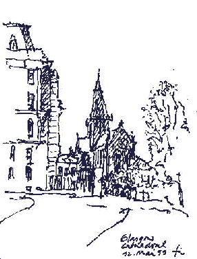
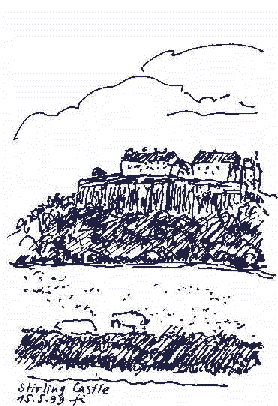
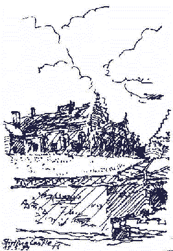
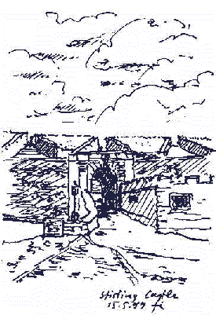
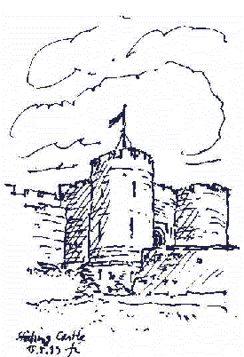
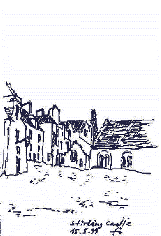
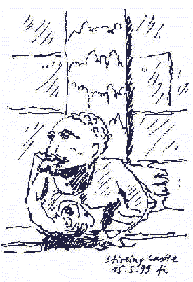
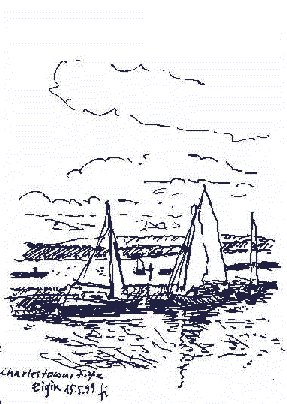
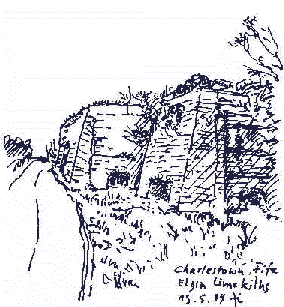
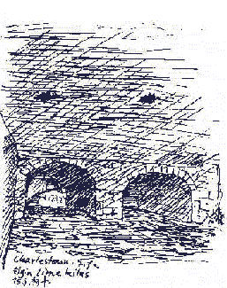

 The RILEM Excursion May 1999 in Scotland - Architectural Sketches made / designed /sketched by Konrad Fischer 

 
Glasgow - The Cathedral

  
Stirling Castle

 

 

 
Charlestown, Fife - The Firth of Forth (From here the burnt lime from the kilns had been exported over hundreds of years)

  
The historic limekilns (from out- and inside) of Charlestown, Fife

