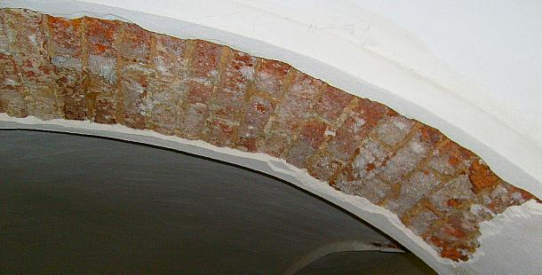

[🠔 Zur Übersicht: Sanierputz-Schwindel](2sanipuz.md)  
# Ein Bauschaden durch Sanierputzversagen auf feuchtem und salzigem Untergrund - Gutachtenauszug 5
**Gutachten zu Sanierputzschaden 5: Feuchtemessung und elektrische Leitfähigkeit**  
_von Konrad Fischer_

### Ein Bauschaden duch Sanierputzversagen auf feuchtem und salzigem Untergrund - Gutachtenauszug 5

 Inhaltsübersicht (Bild links: Doppelter Sanierputzschaden): 
**[Seite 1 - Sanierputz - Was kann er, was nicht? Heilt er?](2sanipuz.md)** 

**[2 Sanierputze am Altbau](2sani2.md)**: 1. Was sind Sanierputze? 2. Was bringen Salzanalysen? 3. Nehmen Sanierputzporen Salz auf? 

**[3 Sanierputze am Altbau](2sani3.md)**: 4. Begünstigen Sanierputze die Austrocknung des Mauerwerwerks? 5. Entsprechen die Sanierputze gem. WTA dem WTA-Merkblatt 2-2-91, Sanierputze? 

**[4 Sanierputze am Altbau](2sani4.md)**: 6. Vermindern Sanierputze die Salzbelastung? 7. Welche Anstriche sind auf Sanierputzen geeignet? 

**[5 Gewährleistung, abplatzende Sanierputzschollen, Landkarten-Putzrisse und Ettringgittreiben / Treibmineralien](2sani5.md)** 

**[6 Bauschaden duch Sanierputzversagen auf feuchtem und salzigem Untergrund - Gutachtenauszug 1](2sani6.md)** - Vorbemerkung und Schadensanalyse 

**[7 Gutachtenauszug 2](2sani7.md)** - Schadsalze - Nitrate (Mauersalpeter) 

**[8 Gutachtenauszug 3](2sani8.md)** - Sanierputz - ein Opferputz-System? 

**[9 Gutachtenauszug 4](2sani9.md)** - Sanierputz-Risse 

**10 Gutachtenauszug** 5 - Feuchtemessung 

**[11 Gutachtenauszug 6](2sani11.md)** - Sanierungsempfehlung 

## Feuchtemessung

Die von Gutachter Dr.-Ing. X bei der Feuchtigkeitsmessung mit der Gann-Hydromette festgestellten "Feuchten", die er auf möglicherweise undichte Leitungen in den Naßräumen im Obergeschoß zurückführt, können - soweit es sich tatsächlich um Feuchte und nicht lediglich erhöhte Salzgehalte handeln würde, die die elektrische Leitfähigkeit von mineralischen Baustoffen extrem beeinflussen/erhöhen können - weitere Schadsalzmobilisierungen bedingen. 

Insofern sind hier die wasserführenden Leitungen zu untersuchen und ggf. vorhandene Leckagen vor der Putzsanierung zu beseitigen. Andererseits können die festgestellten Feuchtewerte auch in Verbindung mit erhöhten Schadsalzkonzentrationen (Mauersalpeter/Salpeter/Kalknitrat/Nitrat) stehen. Der Sachverständige Dr.-Ing. X weist aus unerfindlichen Gründen nicht darauf hin, daß er mit seinem elektrischen Meßgerät im Unterschied zu einer Laboranalyse mit Eluation/Auslösung und laboranalytischer Bestimmung der Salze aus einer Bauteilprobe sowie präzise Bestimmung der Bauteilfeuchte / des Feuchtegehalts mit einem dafür geeigneten Darrversuch lediglich die elektrische Leitfähigkeit im Baustoff mißt. Diese ist nicht nur von der im Baustoff enthaltenen Feuchte, sondern ganz wesentlich vom Salzgehalt des Baustoffs - ggf. auch anderen eingelagerten elektrisch leitenden Stoffen wie unisolierte metallische Armierungen, Wasserleitungen oder Ankerkonstruktionen - beeinflußt. Damit sind im gegebenen Fall keinerlei eindeutige Rückschlüsse auf den tatsächlichen Feuchtegehalt der "gemessenen" Baustoffe zulässig. 

 
_Sanierputzschaden an Gurtbogen der Gewölbeschale/Gewölbekappe des böhmischen Kappengewölbes / Stallgewölbes im Kuhstall/Pferdestall - Die sich an der Backsteinoberfläche anreichernden Salpeter-Nitrate / Mauersalpeter-Salzkristalle sprengen die Sanierputzkruste ab._ 

Weiter: [11 Bauschaden duch Sanierputzversagen auf feuchtem und salzigem Untergrund - Gutachtenauszug 6 - Sanierungsempfehlung](2sani11.md)
