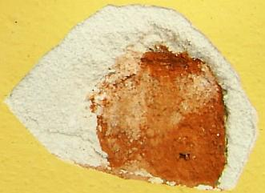

[🠔 Zur Übersicht: Sanierputz-Schwindel](2sanipuz.md)  
# Sanierputze am Altbau - Heilen sie wirklich?
**Sanierputze werden auf salzbelastetes und feuchtes Mauerwerk aufgebracht, um es zu sanieren. Ihre Fähigkeit, Kristallisationsschäden zu vermeiden, ist jedoch erschöpft, wenn ständig neue Feuchtigkeit und Salze transportiert werden.**  
_von Konrad Fischer • aktualisiert 01.10.1998_

## Sanierputz - Was kann er, was nicht? 2

 Inhaltsübersicht (Bild links: Doppelter Sanierputzschaden): 
**[Seite 1 - Sanierputz - Was kann er, was nicht? Heilt er?](2sanipuz.md)** 

**2 Sanierputze am Altbau** : 1. Was sind Sanierputze? 2. Was bringen Salzanalysen? 3. Nehmen Sanierputzporen Salz auf? 

**[3 Sanierputze am Altbau](2sani3.md)**: 4. Begünstigen Sanierputze die Austrocknung des Mauerwerwerks? 5. Entsprechen die Sanierputze gem. WTA dem WTA-Merkblatt 2-2-91, Sanierputze? 

**[4 Sanierputze am Altbau](2sani4.md)**: 6. Vermindern Sanierputze die Salzbelastung? 7. Welche Anstriche sind auf Sanierputzen geeignet? 

**[5 Gewährleistung, abplatzende Sanierputzschollen, Landkarten-Putzrisse und Ettringgittreiben / Treibmineralien](2sani5.md)** 

**[6 Bauschaden duch Sanierputzversagen auf feuchtem und salzigem Untergrund - Gutachtenauszug 1](2sani6.md)** - Vorbemerkung und Schadensanalyse 

**[7 Gutachtenauszug 2](2sani7.md)** - Schadsalze - Nitrate (Mauersalpeter) 

**[8 Gutachtenauszug 3](2sani8.md)** - Sanierputz - ein Opferputz-System? 

**[9 Gutachtenauszug 4](2sani9.md)** - Sanierputz-Risse 

**[10 Gutachtenauszug](2sani10.md)** 5 - Feuchtemessung 

**[11 Gutachtenauszug 6](2sani11.md)** - Sanierungsempfehlung 

bausubstanz-Beitrag: Kontrovers

Kontra von [Konrad Fischer](1refernz.md) 
_(publiziert in bausubstanz 10/98 gegen Pro von H.G. Meier, ergänzte Fassung)_ 

## 1. Was sind Sanierputze?

Sanierputze werden üblicherweise auf salzbelastetes und feuchtes Mauerwerk aufgebracht und ersetzen dort Altputze. Sie sollen dem Namen nach sanieren, d.h. heilen, jedoch: _"Wenn ständig neue Feuchtigkeit und neue Salze innerhalb des Mauerwerks transportiert werden, ist auch bei einem gut aufgebauten Sanierputz die Fähigkeit erschöpft, Kristallisationsschäden zu vermeiden"_ , so Heinz Kremser vom Landesinstitut für Bauwesen und angewandte Bauschadensforschung in seinem Buch "Aussenputze für historische Gebäude", Aachen 1991. 

Sanierputze haben also die Aufgabe, salzbelastetes Mauerwerk einige Zeit zu kaschieren, ohne die Ursache der Versalzung beseitigen bzw. heilen zu können. Sie sind demnach kein günstiges Allheilmittel für salzbelastetes Mauerwerk, bestenfalls ein teurer Opfer- schlimmstenfalls Sperrputz (Tonnenpreis von ca. 350.-- bis weit über 1000.--EUR), und das unter Preisgabe der Altputze des Bestands. 

## 2. Was bringen Salzanalysen?

Empfohlen wird der Sanierputz oft durch [Gutachten (besser: Schlechtachten)](3gutacht.md), in dem Salzanalysen das Geschäft mit der Angst befördern. Dem schwerkranken "Hauspatienten" wird dabei meist ein Sanierputz, neuerdings auch alternativ ein "Kompressenputz" mit verbesserter Fähigkeit zur Salzaufnahme, als Heilmittel empfohlen. Mögliche Alternativen (Belassen des Bestands und [Temperieren der weil kondensatbelastet feuchten Wand](7temper.md), Einsatz preisgünstiger [Luftkalkmörtel zur Verlagerung der Kristallisationsfront in Opferschicht](2eurolim.md), funktionierende Verkleidung durch Vorsatzkonstruktion, simpelste Entsalzung und Entfeuchtung der geschädigten Bauteile als qualifizierte Vorbereitung der Folgereparatur durch sicher (mittels Merckoquant®-Teststäbchen für Jedermann) erfolgskontrollierte Do-It-Yourself-Methoden) kommen den zumindest teilweise industriehörigen [Gut- bzw. Schlechtachtern](3gutacht.md) kaum in den Sinn. Da das Beratungsergebnis aus einer meist fehlinterpretierten Analyse salzbelasteter Bauteilproben im Sinne "üblicher" Maßnahmentherapien oft von vorneherein feststeht, kann man sich Gutachtenkosten für unnötig akribische Analyseakrobatik sparen. Wer an Analytik glaubt, sollte gleich die Marketingdienste eines Herstellerlabors nutzen, und zwar umsonst. Dies wird ebenso sicher die "gefährliche" Versalzung des Bestands nachweisen und dasselbe empfehlen. 

Bei den Gutachtern, meist Chemiker, Mineralogen o.ä, erzeugen kleinmaßstäbliche Laboranalysen die Einschätzung des Bauwerks. Für das Ergebnis ihrer Empfehlungen trifft sie wenig Verantwortung, wie Prozeßausgänge zeigen. Kann Laboranalytik überhaupt den Zusammenhang zwischen wirtschaftlichen, denkmalpflegerischen und baukonstruktiven Fragestellungen zutreffend beurteilen? Leider sind die Bauchemie und [Bauphysik](7wsvoant.md) ebenso wie [DIN-Norm](2mbu.md) und sonstige Regelwerke nicht immer frei von [Vermarktungsinteressen](2mbu.md). Eine dem Kundeninteresse verpflichtete Beschreibung der Wirklichkeit am Bau ist folglich von ihren Aussagen nicht immer zu erwarten. 

Ein typisches Gutachten für die salzbedingten Feuchteschäden entsteht hin und wieder sogar durch Empfehlung des feuchtetechnisch ahnungslosen Denkmalpflegers, der damit "geologisch-technische" Büros von sich wissenschaftlich gebärdenden diplomierten, wenn's drauf ankommt auch doktorierten Geologen ins Spiel bringt. Diese untersuchen auf Teufel-komm-raus abgepickelte Putz- und Steinpröbchen des Bauwerks, dokumentieren Feuchtezonen und Abbröckelungen, setzen einen Wust von petrographischen Untersuchungen in Szene, untersuchen mit Hilfe der Durchlichtmikroskopie die Putzzusammensetzung / Mörtelzusammensetzung, das Gefüge und den Putzaufbau, ergänzen das - der Auftraggeber hat's ja dicke - durch röntgendiffraktometrische Aufnahmen, bestimmen die bauschädlichen Salze (Sulfate: Bittersalz MgSO4 x 7 H2O, Gips/Calciumsulfat CaSO4 x 2 H2O, Glaubersalz/Natriumsulfat Na2SO4 x 10 H2O, Ettringit 3CaO x Al2O3 x 3 CaSO4 x 32 H2O; Nitrate: Magnesiumnitrat Mg(NO3)2 x 6 H2O, Calciumnitrat Ca(NO3)2 x 4 H2O, Kalksalpeter 5 Ca(NO3)2 x 4 NH4NO3 x 10 H2O; Chloride: Calciumchlorid CaCl2 x 6 H20, Kochsalz/Natriumchlorid NaCl;), bewerten den Befund (Chlorid, Nitrat und Sulfat) nach dem WTA-Merkblatt 4-5-99/D als gering, mittel oder gar hoch, um dann nach zigseitigem gespreiztem und tabelliertem Blablabla endlich zu resümieren (Auszug aus vorliegendem Gutachten, Rechtschreib- und Kommafehler gem. Original): 

_"Daher wäre hier dringend anzuraten, an Stelle des_[KF: gem. Befund als zuverlässig funktionierenden Kalk-Opferputzes] _Kalkputzes einen Sanierputz aufzubringen. ... Dabei wäre vorstellbar, den von der [Trockenmörtelfirma] vorgeschlagenen "[XY]-Sanierputz [geheimnisvoll-technoid anmutender Zahlen-Buchstaben-Code]" einzusetzen. Dieser ist lauf Merkblatt sowohl für nitrat- als auch sulfatbelastetes Mauerwerk geeignet. Vorstellbar ist auch, diesen in zusammenhängenden Teilbereichen wie etwa der gesamten rechten Gebäudeseite im Innenhof oder im Sockelbereich bis in eine Höhe von etwa 1 m einzusetzen. Um im Innenhof den Feuchtehaushalt im Sockelbereich zu regulieren, ist dringend anzuraten einen Drainage anzulegen und als Abschluss ein Kiesbett von mindestens 50 cm Breite zu verlegen. Dadurch dass der Putz hier bis auf das Bodenniveau heruntergezogen wurde, kann Feuchtigkeit ungehindert in das Ziegelmauerwerk und den Putz gelangen und so zur Schädigung des Gesamtmauerwerks führen. Aufgrund der hohen Salzbelastung der Rentei und des sich anschließenden Wirtschaftsgebäudes ist auch dort ein Sanierputz anzuraten. Der neu einzubringende Fugenmörtel müsste zudem sulfatbeständig eingestellt werden. Stark geschädigte Ziegel, wie im mittleren Bereich, müssten vorher ausgetauscht."_ 

Kommentar KF: Zur besseren Einprägung im Sinne der Rhetorikfigur "Redundanz" also nochmals: 

Um so was zu kriegen, was weder die Gebäudeschäden sachgerecht beseitigt - die Feuchte und das Schadsalz bleiben ja drin, ein dank sollgemäßer Hydrophobierung/Wasserabweisung und ungünstigem Materialgefüge immer sperrender und sehr hoch wasserrückhaltender Sanierputz sorgt für weitere zerstörerische Feuchte- und Salzbelastung (immer salzhaltiger Zement als Bindemittel, treibende Ettringitreaktion durch Kontakt zwischen trotz angeblich "sulfatbeständiger" Einstellung immer noch aluminathaltigem (C3A) Sanierputz und im Putzgrund sogar durch teure Analyse festgestelltes (!) vorhandenes Sulfat / Gips bei im abgesperrten Untergrund immer vorhander Feuchte), eine teuer verbuddelte Drainage führt weiteres Wasser an den Mauerfuß - hätte man sich den Einsatz von "Geologen" und extremer Laboranalytik lieber sparen sollen. 

Was sagt nun das WTA-Merkblatt 4-5-99/D "Beurteilung von Mauerwerk - Mauerwerksdiagnostik" zur Bewertung der in der Labor-Analytik von Mörtelproben/Mauerwerksproben festgestellten Schadsalz-Ionen? 

Hierzu die tabellarische Übersicht - Bewertung der schadensverursachenden Wirkung verschiedener Salzionen in Mauerwerkskörpern: 

Cloride < 0,2 M-% 0,2 bis 0,5M-% > 0,5M-% 
Nitrate < 0,1 M-% 0,1 bis 0,3 M-% > 0,3 M-% 
Sulfate (bez. auf leicht lösliche Sulfate) < 0,5 M-% 0,5 bis 1,5 M-% > 1,5 M-% 
Bewertung (Maßnahmenbedarf nicht nur von Salzbewertung abhängig) Belastung gering - Maßnahmen im Einzelfall erforderlich. Belastung mittel - Weitergehende Untersuchungen zum Gesamtsalzgehalt (Salzverbindung, Kationenbestimmung) erforderlich. Maßnahmen im Einzelfall erforderlich. Belastung hoch - Weitergehende Untersuchungen zum Gesamtsalzgehalt (Salzverbindung, Kationenbestimmung erforderlich. 
Maßnahmen erforderlich. 

Das ersparte Geld für die sinnlose, da ohnehin auf den Sanierputzpfusch hinauslaufende Diagnostik / Analytik (die man mit einfachsten Hilfsmitteln übrigens auch ohne weiteres selber hinbekommen könnte!) würde man dann für die zwangsläufig zu erwartenden Folgeschäden aus solchem denkmalamtsempfohlenen und pseudowissenschaftlich verbrämtem Pfusch dringend brauchen können. Und derlei "Empfehlungen" tragen einem die Sanierputzhersteller gerne auch ganz umsonst ins Haus, wenn gewünscht mit ebenfalls kostenloser Analytik. Das springt ja locker raus bei den absurden Ertragsmargen solcher Wunderheilputze. Vielleicht auch die Einladung zum nächsten Sanierindustrieseminar für derlei zuverlässige "Empfehler" (auch in Kirchbauämtern, Staatsbauämtern, Schlösserverwaltungen und Denkmalbehörden zu finden) als gutdotierte Referenten oder kostenfrei beherbergte und lecker verköstigte Ehrengäste in vornehmstem Ambiente des In- und Auslands? Man traut sich ja kaum zu fragen ... 

## 3. Nehmen Sanierputzporen Salz auf?

In Sanierputzen können salzhaltige Luftporenbildner bzw. Leichtzuschlagstoffe verhältnismäßig große Poren erzeugen. Sie sollen lt. Werbung aus dem salzhaltigen Putzgrund einwandernde und dann im Porenhohlraum kristallisierende Salze aufnehmen. Können sie das wirklich? 

_"Nach einer 490d [Tage] Salzwechselbeanspruchung wurde die Verteilung der Salze im Putzquerschnitt und Porengefüge untersucht. Leichtzuschlagstoffe und Tensidluftporen waren nicht mit Salzen gefüllt. [...] Der Putz versagte durch die Zerstörung des Kapillarporenssystems"_ ,

so Lothar Goretzki, Hochschule für Architektur und Bauwesen Weimar, Professur Bauchemie in "Sanierputzsysteme", Freiburg 1995. 

Nicht die Großporen, sondern Kleinporen nehmen also Salze auf. Warum? Weil Salze im Baustoff nur in wässriger Lösung transportiert werden, und nie von Klein- zu Großporen (vgl. "[Konrad Fischer: Aufsteigende Feuchte ist bisher nicht bewiesen](2aufstfe.md)", bs 7/98, S. 45). Und gerade dieser [salztransportierende Feuchtetransport](2salz.md) wird durch wasserabweisende (hydrophobe) Chemikalien im Sanierputz blockiert.

_"Die kapillarbrechenden Luftporen unterbinden den kapillaren Stofftransport zusätzlich durch ihre hydrophoben Oberflächen"_ ,

so P. Kaiser, Institut für Sedimentforschung, Uni Heidelberg (in: "Sanierputzsysteme", s.o.). Genau deswegen wirken Sanierputze als Sperrputz. Wassertransport in einem Bauteil erfolgt nämlich regelmäßig in flüssiger Form (im gegenüber Luft kühleren Bauteil kondensierte Luftfeuchte, eingedrungener Regen) und nicht als Dampf. Die nur im Labor gültigen Werte des für flüssiges Wasser praktisch bedeutungslosen Dampfdiffusionswiderstands der Industrieputze und -farben (Kapillartransport : Dampfdiffusion in Baustoffen = 1000 : 1!) ändern daran nichts. Entscheidend wären Angaben über die Transportfähigkeit für flüssiges Wasser aus dem feuchten Bauteil. 

 
_Sanierputzfehlstelle mit Salzausblühung aus dem Mauerziegel. Grund: Abgeplatzter hohler Sanierputz, abgesprengt von Salzkristallisation / Ausblühung in der Trennzone zwischen schadsalzbelastetem Mauerwerk und erster Putzlage. 
Die Schadsalze können nicht "bestimmungsgemäß" in den hydrophobierten Sanierputz einwandern, sondern kristallisieren im Trocknungsfall darunter aus und sprengen dann durch ihren Kristallisationsdruck den Sanierputz ab. 
Auch der kunstharzhaltig-wasserabweisende Anstrich mit Silikatdispersionsfarbe / Mineralfarbe kann das nicht verhindern._

Die Hydrophobierung versagt in kleinen Putzporen, diese saugen aus den Großporen des Untergrunds die ggf. dort vorhandene Salzlösung. Deshalb wird das Putzgefüge gerade durch die Salzkristallisation in den kleinen Poren zerstört. Die hin und wieder publizierten Makrofotos von Salzkristallen in Sanierputzporen zeigen oft zementtypische bzw. Treibsalzminerale (Ettringit, Thaumasit), die erst durch die zementhaltigen Bindemittel von Sanierputzen mit ihrem Tricalziumaluminat / C3A-Gehalt entstehen können. Eingewanderte bauwerkseigene Schadsalze sind damit nicht nachgewiesen! 

Claus Arendt, Institut für Gebäudeanalyse und Sanierungsplanung, schreibt zum Verhältnis zwischen Mauerfeuchte und Sanierputz: 

"_An allen mit Sanierputz behandelten Flächen zeigten sich in der zweiten und dritten Beprobung im oberflächennahen Ziegelbereich erhöhte Durchfeuchtungsgrade. Auch dies ist weder überraschend oder gar eine neue Erkenntnis, doch wird deshalb betont darauf hingewiesen, da immer noch einige Sanierputzhersteller mit dem Effekt einer Mauertrockenlegung werben, was nach der bestimmungsgemäßen Wirkung eines Sanierputzes gar nicht eintreffen kann: eine Behauptung also, die klar als Betrug beurteilt werden kann."_(in: "Sanierputzsysteme", s.o.)

Weiter: [3 Sanierputze am Altbau: 4. Begünstigen Sanierputze die Austrocknung des Mauerwerwerks? 5. Entsprechen die Sanierputze gem. WTA dem WTA-Merkblatt 2-2-91, Sanierputze?](2sani3.md)
