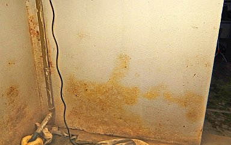
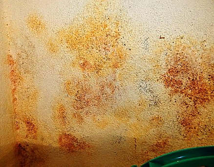

[🠔 Zur Übersicht: Sanierputz-Schwindel](2sanipuz.md)  
# Schwindel: Sanierputz auf versalzter nasser Wand - Heilt er wirklich? 3
**4. Begünstigen Sanierputze die Austrocknung des Mauerwerwerks? 5. Entsprechen die Sanierputze gem. WTA dem WTA-Merkblatt 2-2-91, Sanierputze? Pfusch? Betrug und Scharlatanerie? Abzocke? Dummes für Dummies, Doofes für Doofe, Deppertes für Deppen?**  
_von Konrad Fischer_

### Sanierputz - Was kann er, was nicht? 3

 Inhaltsübersicht (Bild links: Doppelter Sanierputzschaden): 
**[Seite 1 - Sanierputz - Was kann er, was nicht? Heilt er?](2sanipuz.md)** 

**[2 Sanierputze am Altbau](2sani2.md)**: 1. Was sind Sanierputze? 2. Was bringen Salzanalysen? 3. Nehmen Sanierputzporen Salz auf? 

**3 Sanierputze am Altbau** : 4. Begünstigen Sanierputze die Austrocknung des Mauerwerwerks? 5. Entsprechen die Sanierputze gem. WTA dem WTA-Merkblatt 2-2-91, Sanierputze? 

**[4 Sanierputze am Altbau](2sani4.md)**: 6. Vermindern Sanierputze die Salzbelastung? 7. Welche Anstriche sind auf Sanierputzen geeignet? 

**[5 Gewährleistung, abplatzende Sanierputzschollen, Landkarten-Putzrisse und Ettringgittreiben / Treibmineralien](2sani5.md)** 

**[6 Bauschaden duch Sanierputzversagen auf feuchtem und salzigem Untergrund - Gutachtenauszug 1](2sani6.md)** - Vorbemerkung und Schadensanalyse 

**[7 Gutachtenauszug 2](2sani7.md)** - Schadsalze - Nitrate (Salpeter/Mauersalpeter) 

**[8 Gutachtenauszug 3](2sani8.md)** - Sanierputz - ein Opferputz-System? 

**[9 Gutachtenauszug 4](2sani9.md)** - Sanierputz-Risse 

**[10 Gutachtenauszug](2sani10.md)** 5 - Feuchtemessung 

**[11 Gutachtenauszug 6](2sani11.md)** - Sanierungsempfehlung 

## 4. Begünstigen Sanierputze die Austrocknung des Mauerwerwerks/Mauertrockenlegung/Mauerwerkstrockenlegung?

Die Sanierputzideologen behaupten allen Ernstes, daß die durch chemische Porenbildner entstandenen Mörtelporen geeignet wären, dem feuchten, nassen, mit Kondensat/hygroskopischer Feuchte aufgenässten / befeuchteten / nassen Untergrund Nässe und Feuchte zu entziehen. Stimmt das? Ist es also wahr oder von den Sanierputzfans - also Trockenmörtelproduzenten, -vertrieblern und -verkäufern, Handwerkern und - oh Graus! - schwachverständigen Schlechtachtern bis zum hochgradig tüvzertifizierten öbuvS dumm und frech gelogen, um den salz- und feuchtegeschädigten Bauherren noch um sein letztes Hemd - Sanierputz ist ja extrem teuer - zu bringen? Wie kann es denn dazu kommen, daß ein gerademal einjähriger Sanierputz eines großen "Markenherstellers" im feuchten Kellerloch so aussieht?: 

  
Sanierputzflächen naß und auf der ebenfalls trocknungsblockierenden Dispersionssilikatfarbe buntest schimmelpilzbefallen - vom Fachhandwerker nach Verarbeitungsrichtlinie und unter Daueraufsicht der Fachbauleitung ausgeführt. Wo? Gar nicht weit vom Herstellerwerk. 

Wir interessieren uns hier für die Ergebnisse der Praxis und (fast) unabhängigen Laborwissenschaft: 

Aus der Zusammenfassung der Forschung des Dahlberg-Instituts für Diagnostik und Instandsetzung historischer Bausubstanz e.V. im Forschungszentrum der Hansestadt Wismar, nachzulesen im Tagungsband der 9. Hanseatischen Sanierungstage "Putzinstandsetzung", Kühlungsborn 1998, erschienen im Verlag für Bauwesen, Berlin 1998: 

_"Sanierputze schränken die Trocknungsvorgänge gravierend ein, sie behindern diese regelrecht. Um gleiche Verdunstungsleistungen erreichen zu können, sind Zeiten erforderlich, die um den Faktor 10 gestreckt sind gegenüber der freien Ziegeloberfläche."_

Ach so? Nanu, warum? Wegen der zementären Bindung und wasserspeichernden Feinstporenstruktur mit wasserabweisender AUskleidung. Und weiter:

_"Die Verfasser sind [...] der Auffassung, daß der Sanierputz zu einer Wunderwaffe stilisiert worden ist, die immer und überall eingesetzt werden kann, [...], obwohl die erforderlichen Anwendungsvoraussetzungen gar nicht vorhanden sind."_

(H. Venzmer, N. Lesnych, L. Kots: Modellversuche zum Trocknungsverhalten sanierputzbeschichteter Ziegel). Dieses Ergebnis der Forschung stimmt geradezu auffällig mit der Praxis am Bauwerk überein. Nur ein Planer, der keine AHnung vom Hupen und Rasen hat, kann Sanierputz empfehlen, um Feuchte im Mauerwerk zu bändigen. Oder auch gewisse Schwachverständige, vor allem auch im norddeutschen Raum, die gerne auch mal doktoriert plus diplomiert im Doppelpack auftreten. Doch wer mehr liest, als reklameabhängige Deppenmagazine für Bausimpl und Schecks der Hersteller, hat Chancen gegen den Baupfusch. Das läßt für die Zukunft hoffen ...

H.G. Meier, der "Altvater" der Sanierputzentwicklung (Fa. Colfirmit Rajasil GmbH), schreibt dazu in "Sanierputze. Ein wichtiger Bestandteil der Bauwerksinstandsetzung", expert verlag/irb 1999: 

_"Die im Mauerwerk vorhandenen gelösten Salze werden zum großen Teil im Mauerwerk verbleiben. Auch der durch die Hygroskopizität der Salze ausgelöste höhere Feuchtegehalt im Mauerwerk wird sich durch die Verwendung von Sanierputzen nicht wesentlich senken lassen. Selbst wenn über lange Zeit der niedrige Diffusuionswiderstandswert beibehalten werden kann, dann ist im Ergebnis die Transportleistung durch Diffusion wesentlich niedriger, als sie durch Kapillarität wäre. [...]_

_Sanierputze dienen deshalb primär weder für eine Entsalzung noch für eine Entfeuchtung von Mauerwerken."_

Logisch, ist doch die kapillare [Entfeuchtung nach Prof. Dr. Ivo Hammer](2ivo.md) um den Faktor 1000 mal wirksamer als die durch Dampfdiffusion.

Und genau deswegen ist Sanierputz auch eine der legendären "Wunderwaffen" gegen Schimmel/Schimmelpilz/Schimmelpilzbefall. Denn der wasserabweisende Sanierputz funktioniert in keinster Weise als Feuchtepuffer im Kondensatfall. Ganz im Gegenteil reichert sich an Sanierputzoberflächen prinzipiell jedes Kondensat aus feuchter Raumluft und zutretender Außenluft maximal an und bietet so ausreichende Wasserversorgung für den Schimmelpilz. Bei Sanierputz-Preisen von ca. 1400 bis 2000 Euro die Tonne, also ca. 35 EUR/25 kg-Sack aufwärts bis ca. 50 Euro Sackpreis bekommt man also eine mehr als zweifelhafte Qualität angeboten, was den gewünschten und versprochenen Anwendungserfolg betrifft. 

Doch damit keinesfalls genug: Da der Sanierputz mangels Sorptionsfähigkeit immer mit kunstharzhaltigen Anstrichsystemen beschichtet werden muß, kommt folglich noch einer der vorteilhaftesten Nährböden / Substrate auf seine Oberfläche, um so dem Schimmelpilzbefall geradezu allerbeste Wachstumsvoraussetzungen zu gewährleisten. Recht offenherzig schreibt dazu Olaf Janotte, ein offensichtlich durchaus ehrenwerter Anwendungstechniker beim Sanierputzvertreiber Baumit in Bauhandwerk 9/2009, S. 33: 

_"Tritt eine Feuchtebelastung an der Oberfläche durch Kondensation auf und entwickeln sich dadurch - beispielsweise in Kellerräumen - Schimmelflecken, kann ein Sanierputz nicht weiterhelfen. Ganz im Gegenteil: Hat ein Putz eine saugende Oberfläche, wird das Kondensatwasser sofort aufgenommen. Fehlt den Pilzen diese notwendige Grundlage, können sie nicht wachsen. Hat der Putz die Möglichkeit, zwischenzeitig abzutrocknen, regeneriert sich das System von selbst und bleibt schadensfrei. Erst bei fehlender Abtrocknung wird der Putz im Laufe der Zeit immer feuchter, so dass ein Bewuchs möglich ist. Setzt man nun als Wunderwaffe gegen den Schimmel Sanierputz ein, wird man sein blaues (oder besser braunes, schwarzes oder gelbes) Wunder erleben. Da Sanierputze die Kondensatfeuchte so gut wie gar nicht aufnehmen, stellen sich viel schneller pilzfreundliche Umstände ein als bei der Verwendung eines normalen Kalkputzes. Nachdem Kondensat nicht nur an der Oberfläche, sondern auch innerhalb des Sanierputz-Querschnitts auftreten kann, entsteht ein weiterer Schaden: Die Wasserabweisung wird durch Tröpfchenbildung innerhalb der Kapillaren außer Kraft gesetzt. Ist erst einmal ein durchgängiger Feuchtefilm geschaffen, haben die Salze die Möglichkeit, sich darin zu lösen und treten schließlich an die Oberfläche. ..."_ 

Zum Vergleich der Baustoffqualitäten der Trocknungsbeiwert s nach Roger Cadiergues - 

Ziegel s = 0,28 
Kalkmörtel s = 0,25 
Zementmörtel 
(z.B. Sanierputz) s = 2,5 

das heißt: Kalkmörtel trocknet um den Faktor 10 besser aus als Zementmörtel. Und paßt geradezu ideal zu den technischen Qualitäten von Ziegel. 

Der oben erwähnte Olaf Janotte geht im zitierten Aufsatz auch auf die Eignung des Sanierputzes bei drückender Feuchte ein (S. 33): _"Sanierputze besitzen eine sehr hohe Wasserabweisung, um flüssiges Wasser nicht bis an die Oberfläche gelangen zu lassen, da dieses als Transport mittel für die Salze fungiert. Um aber keine Absperrung zu bewirken, ist das Putzgefüge mit einer großen Anzahl von Poren durchsetzt, die Wasserdampf durchtreten lassen. Damit wird vermieden, dass die Feuchte weiter im Mauerwerk nach oben steigt. Leider sind diese Poren aber auch der Grund dafür, dass Wasser mit Druck durch den Putz gepresst werden kann. Die Wasserabweisung, die lediglich verhindert, dass der Putz nicht saugt, kann dies nicht verhindern. Bei Druckwasserbelastung ist Sanierputz-WTA deshalb die falsche Wahl."_ 

Was hier fehlt: Der Feuchtetransport in Baustoffen erfolgt im Verhältnis 1000:1 als Kapillartransport gegenüber der Dampfdiffusion. Deswegen eignet sich Sanierputz schon grundsätzlich nicht zur Austrocknung von feuchtem Mauerwerk. Und auch die Dampfdiffusion aus dem salznassen Untergrund wird nur marginalste Transportergebnisse zeigen. Doch das kann Herr Janotte ja gerne im nächsten Aufsatz ergänzen. 

Und so finden sich trotzdem genug Experten da draußen, die auch bei drückender Nässe Sanierputz als Mittel der Wahl verordnen. Und wer hätte das gedacht, daß dann für derartige Scharlatane auch die von den Baukosten abhängigen Umsätze / Gewinne / Honorare in Richtung Apotheke explodieren? Ich doch nicht. 

Ein Aufsatz des schon zitierten Prof. Dr. Ivo Hammer, HAWK - Hochschule für angewandte Wissenschaft und Kunst, Fachhochschule Hildesheim/Holzminden/Göttingen, Fachbereich Restaurierung: 

_"Bedeutung historischer Fassadenputze und denkmalpflegerische Konsequenzen. Zur Erhaltung der Materialität von Architekturoberfläche"_ , publiziert in den ICOMOS Heften des Deutschen Nationalkomitees XXXIX, München 2003, 183-214 (gleichzeitig erschienen in Arbeitsblätter des Bayerischen Landesamts für Denkmalpflege Bd 117, München 2003, 183-214), gibt weitere grundsätzliche Hinweise zur Tauglichkeit von Kalkmörteln bzw. "modernen" Mörtelrezepturen: 

_"Aufbauend auf den Forschungen von John Smeaton (1724-92), entwickelte James Parker den 179652 patentierten Romanzement durch Brennen von Kalk und 25-30% tonigen Bestandteilen unter hoher Temperatur. 30 Jahre später, 1824, ließ sich Joseph Aspdin das Verfahren zur „Verbesserung in der Herstellung künstlicher Steine“ patentieren, das er „Portland-Cement“ nannte. [...] Portlandzement wurde als Putzmaterial erst nach dem Zweiten Weltkrieg verstärkt eingesetzt. Beide Zementarten erzeugen einen erheblichen Eintrag von bauschädlichen Salzen. Verputze mit einem hohen Anteil an Zement an historischen Fassaden haben sich nicht bewährt. Typisch sind die Dehnungsrisse im Abstand von ca. 1 m, die sich durch die hohe Dichte des Materials ergeben. [...] 

Im Sockelbereich eines Bauwerks in Jahrzehnten oder gar Jahrhunderten im Trocknungsprozess aufkonzentrierte Salze werden bis heute oft nicht entfernt, sondern durch Porenputze, Hydrophierung mit Silikonen und durch filmbildende Anstriche unsichtbar gemacht. Die hygroskopische Wasseranziehung bleibt wirksam, die Salze kristallisieren in der Kontaktzone von Porenputz (der in euphemistischer Firmenmetaphorik „Sanierputz“ genannt wird) und Maueroberfläche und tragen so zur zusätzlichen Zerstörung von historischer Substanz bei. Das Prinzip dieser heute überall angewendeten „Sanierputze“ ist die Brechung des Kapillartransports von Wasser, entweder durch große Poren oder durch Hydrophobierung mit Siliconen. Wasser kann nur noch in Dampfform an die Oberfläche kommen, es wird dadurch unsichtbar. Durch diese Porenputze wird der Mauer kein Gramm Feuchtigkeit entzogen. Die Verdunstung ist wesentlich langsamer als bei einer Oberfläche, die durchlässig ist für Wasser in flüssiger Form. Der vorgeschriebene „Vorspritzer“, mit hohem Zementanteil und in der Praxis oft recht dicht aufgetragen, bringt nicht nur zusätzlich Salze ins Mauerwerk, sondern wirkt auch als Trocknungsblockade mit entsprechend intensivierter Verwitterung und führt längerfristig zur Zerstörung der Mauersteine durch Salze und damit auch zur Zerstörung ihrer Verbindung zum Verputz. 

Meist noch hydrophobierend „ausgerüstete“ Kunstharzanstriche haben in mehrfacher Hinsicht schädliche Auswirkungen auf den historischen Verputz. Sie wirken als Trocknungsblockade für die durch thermische Kondensation fast jede Nacht unter der Fassadenoberfläche entstehende Feuchtigkeit. Wenn das Wasser nicht direkt in flüssiger Form an der Oberfläche trocknen kann, sondern in Dampfform durch den filmbildenden Anstrich oder die Hydrophobierung diffundieren muss, ist der Trocknungsvorgang wesentlich langsamer. Die langsame Trocknung bedeutet auch, dass die chemischen, physikalischen und mikrobiologischen Schadensprozesse, die fast alle mit Feuchtigkeit verbunden sind, wesentlich intensiver einwirken können: zum Beispiel die Vergipsung von Kalk, die Eissprengung und das Wachstum von Mikroorganismen. Die Salze kristallisieren an der Verdunstungsgrenze, also hinter der hydrophoben Oberfläche und sprengen den Porenraum. Die Kunstharze, die ungefähr einen zehnfach höheren Dehnungskoeffezienten haben als ein Kalkmörtel, führen an Fassaden mit ihren oft großen Temperaturunterschieden zu erheblicher thermischer Dilatation und damit zu Scherspannungen, die den Verputz gerade an der Kontaktzone zum Anstrich buchstäblich zermürben. [...]_ 

Wenn wir also berücksichtigen, daß nach herstellervorschrift auf den wasserabweisend ausgerüsteten (hydrophobierten) Sanierputzen ausschließlich Kunstharzfarben - oft als Mineralfarbe (in Wahrheit Dispersions-Silikatfarbe) täuschend in den Handel gebracht - aufgeklebt werden können und dürfen, ist wohl klar, daß damit die trocknungsblockierende Wirkung des Sanierputzsystems noch weiter verschärft wird. 

**5. Entsprechen die Sanierputze gem. WTA dem WTA-Merkblatt 2-2-91, Sanierputze?** 
Ein WTA-Sanierputz muß gem. Merkblatt zwischen 1,5-5 N/mm2 Druckfestigkeit besitzen, also einigermaßen verträglich sein für den meist weniger festen Untergrund. Untersuchungen am Institut für Angewandte Geowissenschaften der Uni Gießen zeigen aber:

_"[Es] ist davon auszugehen, daß die Druckfestigkeiten des Sanierputzes, auch bei Einhaltung des geforderten Luftporengehaltes von 25 Vol.-% im Frischmörtel, je nach Zusammensetzung des Sanierputzes zwischen 3 N/mm 2 bis 15 N/mm2 betragen können."_

(in: "Sanierputzsysteme", s.o.). Durch zu geringe Luftporenbildung sind auch höhere Festigkeiten mit entsprechenden Schadensfolgen keine Seltenheit - nur ein Ausführungsfehler des Handwerkers, wie immer gepaart mit einem Überwachungsfehler des Architekten? Bei Luftkalkputzen der Putzgruppe Ia ist Überhärte ausgeschlossen. 

Aus verarbeitungstechnischen Gründen ist Sanierputz wie fast alle Werktrockenmörtel - im Gegensatz zu traditionellen Kalkputzen - feinkörnig, bei gleichzeitig hohem hydraulischem Bindemittelgehalt. Deswegen bewirkt ungenügende Luftporenbildung erhöhte Festigkeit, Temperaturspannung und Sperrwirkung. 

Barocke Pfeilerecke - Abgeplatzte, überharte Sanierputzscholle. So gut wie keine Salzaufnahme gem. Herstellerbegutachtung nach mehreren Jahren. Kein Wunder, wie soll denn Salzlösung in hydrophobierten Putz, der obendrein recht bald vom weniger festen Untergrund abplatzt, eindringen? Durch Tiefflugattacke in Stukamanier? 

Folge: Abplatzende betonharte Sanierputzschichten (meßtechnisch nachgewiesen [B15-B30](2beton.md)) vom weicheren Untergrund, Rißbildung mit kapillarem Eindringen von Regenwasser, nachfolgend Einsperren der Nässe hinter der hydrophobierten Putzschicht, Frostschäden und Mobilisierung der Salze, Abriß von geringerfesten Teilen des Bestands. Außerdem: Ungenügender Abtransport der von innen eindiffundierenden Raumluftfeuchte (Dampfdiffusion, die außen oberflächennah kondensiert), erhöhte Wand- ggf. auch Raumfeuchte. Insgesamt also erhöhte Belastung und Schädigung des zu heilenden Bestands. Das immer raffinierter vermarktete WTA-"Gütesiegel" schützt Sanierputz also nicht vor Schäden. Wichtig wäre hier eine Verpflichtung zur [Volldeklaration von Inhaltsstoffen, Wirkungsweise, Anwendung und Risiken](2volldek.md).

Die Problematik der Sanierputzqualität geht auch hervor aus dem Vorwort zur "Marktübersicht Sanierputzsysteme" in Bautenschutz und Bausanierung B+B 4/99:

_"[...] Da Sanierputz auf feuchtes und salzhaltiges Mauerwerk aufgetragen wird, müssen seine Inhaltstoffe auch gegen diese Bedingungen resistent sein._

_In der Praxis bedeutet dies, daß der Zuschlag dicht und inert sein muß. Als Bindemittel kommen nur hydraulisch abbindende Materialien in Frage. Karbonatisch abbindende "Kalk-Sanierputze" kann es somit nicht geben._

_Auch die Verwendung von Traß ist problematisch. Traß braucht zum Abbinden relativ viel Wasser und Zeit. Beides widerspricht den Grundeigenschaften von Sanierputz._

_Die meisten Hersteller geben an, daß ihre Produkte maschinengängig seien. Es ist jedoch festzustellen, daß bei der Maschinenverarbeitung oft der erforderliche Luftporengehalt nicht erreicht ist. [...]_

_Der Begriff Sanierputz ist nicht zu schützen. So gibt es beispielsweise gipshaltige Reparaturmörtel unter dieser Bezeichnung auf dem Markt. [...] Obwohl die im [WTA-] Merkblatt festgeschriebenen Anforderungen eindeutig sind, wurde [von Mörtelproduzenten] verschiedentlich der Eindruck erweckt, die hohen Qualitätsanforderungen seien erfüllt, obwohl hierfür kein Nachweis erbracht werden konnte!"_

Fazit: Falsch deklarierte, nach innen und außen absperrende, oft überharte (Traß-)Zementmörtel = Sanierputz.

Weiter: [4 Sanierputze am Altbau: 6. Vermindern Sanierputze die Salzbelastung? 7. Welche Anstriche sind auf Sanierputzen geeignet?](2sani4.md)
