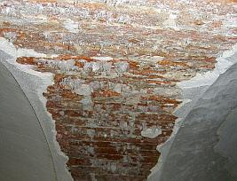
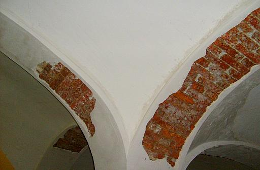
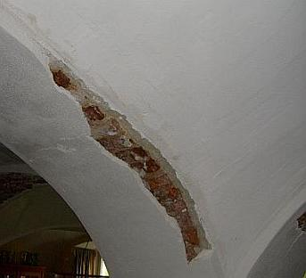

[🠔 Zur Übersicht: Sanierputz-Schwindel](2sanipuz.md)  
# Bauschaden durch Sanierputzversagen auf feuchtem und salzigem Untergrund - Gutachtenauszug 1: Vorbemerkung und Schadensanalyse
**Detaillierte Analyse des Bauschadens durch Sanierputzversagen auf versalztem Stallgewölbe und feuchtem Mauerwerk, einschließlich Vorbemerkung und erster Schadensanalyse aus einem Gutachten.**  
_von Konrad Fischer_

### Bauschaden durch Sanierputzversagen auf feuchtem und salzigem Untergrund - Gutachtenauszug 1

 Inhaltsübersicht (Bild links: Doppelter Sanierputzschaden): 
**[Seite 1 - Sanierputz - Was kann er, was nicht? Heilt er?](2sanipuz.md)** 

**[2 Sanierputze am Altbau](2sani2.md)**: 1. Was sind Sanierputze? 2. Was bringen Salzanalysen? 3. Nehmen Sanierputzporen Salz auf? 

**[3 Sanierputze am Altbau](2sani3.md)**: 4. Begünstigen Sanierputze die Austrocknung des Mauerwerwerks? 5. Entsprechen die Sanierputze gem. WTA dem WTA-Merkblatt 2-2-91, Sanierputze? 

**[4 Sanierputze am Altbau](2sani4.md)**: 6. Vermindern Sanierputze die Salzbelastung? 7. Welche Anstriche sind auf Sanierputzen geeignet? 

**[5 Gewährleistung, abplatzende Sanierputzschollen, Landkarten-Putzrisse und Ettringgittreiben / Treibmineralien](2sani5.md)** 

**6 Bauschaden duch Sanierputzversagen auf feuchtem und salzigem Untergrund - Gutachtenauszug 1** - Vorbemerkung und Schadensanalyse 

**[7 Gutachtenauszug 2](2sani7.md)** - Schadsalze - Nitrate (Mauersalpeter) 

**[8 Gutachtenauszug 3](2sani8.md)** - Sanierputz - ein Opferputz-System? 

**[9 Gutachtenauszug 4](2sani9.md)** - Sanierputz-Risse 

**[10 Gutachtenauszug](2sani10.md)** 5 - Feuchtemessung 

**[11 Gutachtenauszug 6](2sani11.md)** - Sanierungsempfehlung 

## 1. Vorbemerkung und Schadensanalyse

Adresse Auftraggeber Hochstadt, ... 20.. 

Adresse Auftraggeber, Wohnzimmer im ehem. Kuhstall/Pferdestall, böhmische Kappengewölbe/Gewölbekappen/Stallgewölbe, Sanierputzschäden/Sanierungs-Putzschäden 
Ortstermin am ... 20.. 
Kurzgutachten zu den Ursachen und Beseitigung der Putzschäden im o.g. Anwesen 
Ausgewertete Unterlagen: 
Gutachten des SV Dr.-Ing. X vom ... 20.. mit begleitenden Salzanalysen des Baustofflabors A 

1. Vorbemerkung und Schadensanalyse 

Das o.g. Anwesen, ein ehemaliges Wohnstallhaus des frühen 19. Jahrhunderts, wurde vom Vorbesitzer grundlegend saniert und umgebaut. Im Erdgeschoß wurde das böhmische Kappengewölbe des ehem. Kuhstalls 19.. mit sog. Sanierputz - ein porenhydrophobierter Zementmörtel mit Porenbildnerzusatz - verputzt. 

Der Anstrich erfolgte ausweislich der vorgenommenen Brennprobe an Farbresten mit einer kunststoffhaltigen weißen Farbe (Dispersions-Silkatanstrich?). 

Schon kurze Zeit nach Erwerb durch den Auftraggeber lösten sich vorwiegend an den Gurtbögen erhebliche Teile der Putzschale ab und wurden deswegen 20.. neuerlich mit Sanierputz der Fa. Y durch die Fa. Z erneuert. Nachdem sich danach wiederum erhebliche Sanierputzflächen vor allem von den Gurtbögen der Gewölbe ablösten und die Fa. Z die Gewährleistung verweigerte, kam es im Zusammenhang mit dem Rechtsstreit gegen die Fa. Weber zur Anfertigung des o.g. Gutachtens, das die Mängelverantwortung der Fa. Z feststellte. Darauf bezahlte diese die im Gutachten benannte Schadenssumme. 

Am ... 2007 wurde der Unterzeichner beauftragt, zur fachgerechten Sanierung des derzeitigen Schadensbildes an den Putzflächen eine gutachterliche Stellungnahme abzugeben. Zu diesem Zweck wurde am ... 2007 gemeinsam mit dem Auftraggeber eine Ortsbesichtigung durchgeführt. 

 
_Schadensübersicht an Gurtbögen des Stallgewölbes. Die absturzgefährdeten Schollen wurden nach Abstürzen von Teilflächen auftraggeberseits abgenommen. An rechter Gewölbekappe zeichnen sich die teilweise erneuerten Sanierputzflächen von den älteren,noch teilweise anhaftenen Sanierputzen ab._ 

 
_Schadensverlauf an einem Gurtbogen des böhmischen Kappengwölbes._ 

Der Unterzeichner kommt dabei zu teilweise entgegengesetzten Ergebnissen als das im Zusammenhang mit dem gerichtlichen Beweissicherungsverfahren erstellte Gutachten des Sachverständigen Dr.-Ing. X vom ... 2007. Demnach hätte das grundsätzlich funktionierende Sanierputzsystem im gegebenen Fall durch ausführungsbedingt zu geringe Putzstärken und einlagige Ausführung versagt. Dies trifft nach Auffassung des Unterzeichners jedoch nicht zu und kann auch durch die umfangreiche Analytik des Baustofflabors A, die durch Beprobung zermahlener Baustoffproben ansonsten in keiner Weise zur Fallaufklräung beitragen kann, nicht begründet werden. 

Weiter: [7 Bauschaden duch Sanierputzversagen auf feuchtem und salzigem Untergrund - Gutachtenauszug 2 - Schadsalze - Nitrate (Mauersalpeter)](2sani7.md)
