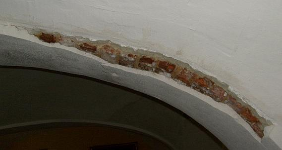
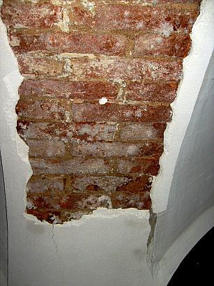

[🠔 Zur Übersicht: Sanierputz-Schwindel](2sanipuz.md)  
# Schadsalze - Nitrate (Mauersalpeter)
**Gutachten zu Sanierputz-Schaden 2: Schadsalze - Nitrate (Mauersalpeter)**  
_von Konrad Fischer_

### Ein Bauschaden duch Sanierputzversagen auf feuchtem und salzigem Untergrund - Gutachtenauszug 2

 Inhaltsübersicht (Bild links: Doppelter Sanierputzschaden): 
**[Seite 1 - Sanierputz - Was kann er, was nicht? Heilt er?](2sanipuz.md)** 

**[2 Sanierputze am Altbau](2sani2.md)**: 1. Was sind Sanierputze? 2. Was bringen Salzanalysen? 3. Nehmen Sanierputzporen Salz auf? 

**[3 Sanierputze am Altbau](2sani3.md)**: 4. Begünstigen Sanierputze die Austrocknung des Mauerwerwerks? 5. Entsprechen die Sanierputze gem. WTA dem WTA-Merkblatt 2-2-91, Sanierputze? 

**[4 Sanierputze am Altbau](2sani4.md)**: 6. Vermindern Sanierputze die Salzbelastung? 7. Welche Anstriche sind auf Sanierputzen geeignet? 

**[5 Gewährleistung, abplatzende Sanierputzschollen, Landkarten-Putzrisse und Ettringgittreiben / Treibmineralien](2sani5.md)** 

**[6 Bauschaden duch Sanierputzversagen auf feuchtem und salzigem Untergrund - Gutachtenauszug 1](2sani6.md)** - Vorbemerkung und Schadensanalyse 

**7 Gutachtenauszug 2** - Schadsalze - Nitrate (Mauersalpeter) 

**[8 Gutachtenauszug 3](2sani8.md)** - Sanierputz - ein Opferputz-System? 

**[9 Gutachtenauszug 4](2sani9.md)** - Sanierputz-Risse 

**[10 Gutachtenauszug](2sani10.md)** 5 - Feuchtemessung 

**[11 Gutachtenauszug 6](2sani11.md)** - Sanierungsempfehlung 

## Schadsalze - Nitrate (Mauersalpeter)

Die im Putzgrund vorhandenen Schadsalze sind - ohne jegliche Analytik anhand der salztypischen Ausblühungen und Kristallisationsformen (Kristall-Habitus, Farbe) erkennbar - vorwiegend Nitrate (Salpeter, Ammoniaksalze, Mauersalpeter, Kalknitrat, Kalziumnitrat, Kalksalpeter). Die schollenförmige Ablösung der Sanierungs-Putzlagen als Ganzes belegt, daß die Schadsalze beim Austrocknen des Untergrunds auskristallisierten, wegen der wasserabweisenden Ausrüstung des Sanierputzsystems dieses nicht durchdringen konnten und deswegen vorwiegend unter der wasser- und damit selbstverständlich auch salzlösungssperrenden Putzlage verblieben. 

Im Ergebnis hat dann der Kristallisationsdruck der Schadsalze auf dem Putzgrund die blockierend aufliegende wasserdichte und wasserabweisende Sperrputzlage abgehoben. Das gegebene Schadensbild ist nach Auffassung des Unterzeichners folglich auf die grundsätzlich mangelhafte Eignung des Sanierputzsystems für feuchte und salzhaltige Untergründe zurückzuführen. Die hydrophobierten, d.h. wasserabweisend und mit porenbildenden Zusätzen ausgerüsteten Sanierputze können nicht wie beworben in den Großporen Schadsalze einlagern, da diese ja wasserabweisend sind und der Salztransport nur in wässriger Lösung stattfindet. 

 
_Durch Sprengdruck der Schadsalzbelastung im Putzgrund neuerlich abgesprengter Sanierputz-Bereich an einem Gurtbogen des böhmischen Kappengwölbes._ 

 
_Die ausblühenden Schadsalze (Nitrate / Mauersalpeter) und die brüchigen verbliebenen Sanierputzschollen im Detail._ 

Nach den vorliegenden Untersuchungen zu diesem Thema (z.B. Kollmann (Hrsg.): "Sanier-putzsysteme", Heft 7 der WTA-Schriftenreihe, Aedificatio Freiburg 1995), findet das Einwandern von Salzen aus dem belasteten Untergrund lediglich in sehr begrenztem Maße und geringem Umfang statt: 

- während der kurzen Frischmörtelphase, bei der die Hydrophobie noch nicht ausgebildet ist und später 
- in die nicht hydrophobierungsfähigen Mikroporen, die aufgrund ihrer Geometrie nur sehr wenig Salze aufnehmen können, bei entsprechendem Nachschub in kürzester Zeit "gefüllt" sind und deswegen bei nachdrückenden Salzen das Abheben der Putzschale begünstigen. 

Das gegebene Schadensbild mit ausweislich der Laboruntersuchungen sehr hohen Salzwerten am Putzgrund und geringeren Werten in den Sanierputzen ist geradezu typisch für das oben beschriebene Verhalten der Sanierputze als auf salzhaltigen Untergründen vom Grundsatz her ungeeignete Sperrputzsystem. Daß der für dieses Fachgebiet zugelassene, öffentlich bestellte und vereidigte Sachverständige dieses von "seinen eigenen" Laborwerten vorgelegte Ergebnis nicht korrekt interpretieren kann, kann Zweifel an seiner fachlichen Eignung begründen. 

Weiter: [8 Bauschaden duch Sanierputzversagen auf feuchtem und salzigem Untergrund - Gutachtenauszug 3 - Sanierputz - ein Opferputz-System?](2sani8.md)
