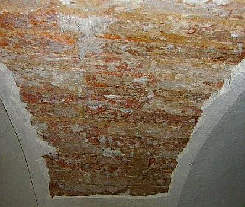
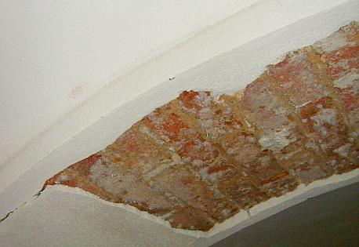

[🠔 Zur Übersicht: Sanierputz-Schwindel](2sanipuz.md)  
# Sanierputz/Sanierungsputz gem. WTA - ein Opferputz-System?
**Analyse eines Bauschadens durch Sanierputzversagen auf feuchtem und salzigem Untergrund. Dieser Gutachtenauszug 3 hinterfragt, ob Sanierputz ein Opferputz-System sein kann, und verneint dies.**  
_von Konrad Fischer_

### Ein Bauschaden duch Sanierputzversagen auf feuchtem und salzigem/Salpeterbelastetem/nitrat-/ammoniak-belastetem Untergrund - Gutachtenauszug 3

 Inhaltsübersicht (Bild links: Doppelter Sanierungsputz-Schaden): 
**[Seite 1 - Sanierputz - Was kann er, was nicht? Heilt er?](2sanipuz.md)** 

**[2 Sanierputze am Altbau](2sani2.md)**: 1. Was sind Sanierputze? 2. Was bringen Salzanalysen? 3. Nehmen Sanierputzporen Salz auf? 

**[3 Sanierputze am Altbau](2sani3.md)**: 4. Begünstigen Sanierputze die Austrocknung des Mauerwerwerks? 5. Entsprechen die Sanierputze gem. WTA dem WTA-Merkblatt 2-2-91, Sanierputze? 

**[4 Sanierputze am Altbau](2sani4.md)**: 6. Vermindern Sanierputze die Salzbelastung? 7. Welche Anstriche sind auf Sanierputzen geeignet? 

**[5 Gewährleistung, abplatzende Sanierputzschollen, Landkarten-Putzrisse und Ettringgittreiben / Treibmineralien](2sani5.md)** 

**[6 Bauschaden duch Sanierputzversagen auf feuchtem und salzigem Untergrund - Gutachtenauszug 1](2sani6.md)** - Vorbemerkung und Schadensanalyse 

**[7 Gutachtenauszug 2](2sani7.md)** - Schadsalze - Nitrate (Mauersalpeter) 

**8 Gutachtenauszug 3** - Sanierputz - ein Opferputz-System? 

**[9 Gutachtenauszug 4](2sani9.md)** - Sanierputz-Risse 

**[10 Gutachtenauszug](2sani10.md)** 5 - Feuchtemessung 

**[11 Gutachtenauszug 6](2sani11.md)** - Sanierungsempfehlung 

## Sanierputz/Sanierungsputz gem. WTA - ein Opferputz-System?

Eine erhoffte und der Werbung zu entnehmende Funktion als sog. Opferputzsystem mit untergrundentlastender Schadsalzaufnahme (Mauersalpeter/Salpeter/Nitrat/Kalknitrat/Ammoniaksalz/Chloride/Kochsalz/Sulfate) können Sanierputze folglich nicht übernehmen - egal in welcher Putzstärke auch immer. Außerdem verhindern sie - und auch das ist in mehreren wissenschaftlichen Untersuchungen (z.B. Venzmer) ausreichend abgesichert - durch ihre wasserabweisende Wirkung das Austrocknen des Untergrunds und führen deswegen typischerweise zu erhöhter Auffeuchtung und damit verbunden auch Schadsalzkonzentration an der Grenzzone zwischen Putz und Putzgrund. 

Daß die Sanierputze dennoch noch nicht vom Markt verschwunden sind, ist neben der geschickten Marketingstrategie mit umfangreicher Beeinflussung ([Hintenrum-Kostenlosplanung ohne strikte Produktneutralität/sonstige Gratifikationen](10hoai22.md)) verantwortlicher Kreise (Planer/Architekt/Ingenieur/Denkmalpfleger/Baubeamter) in gewissem Umfang wohl auch den scheinbar funktionierenden - nicht detailliert überprüften - Fällen zu verdanken. Dabei reicht die zementäre Putzbindung bei lediglich gering salzbelasteten und ausreichend festen Untergründen aus, um dem verbleibenden Salztreibdruck etwas längerfristiger zu widerstehen. 

 
_Die Schadsalzbelastung im Putzgrund kann den sperrenden Sanierputz nicht durchdringen und sprengt ihn durch Kristallisationsdruck im Austrocknungsprozeß ab._ 

Die erhebliche Schadsalzbelastung der Putzgründe im Objekt selbst ist Folge der früheren Stallnutzung des Wohnraums. Das Einkondensieren der ammoniakhaltigen (NH4) Stalluft in die Gewölbeschalen und Wände hat in Abhängigkeit von der lokalen Luftbeaufschlagung und von der unterschiedlichen Kondensatmenge im Zusammenhang mit der vorherrschenden Oberflächentemperatur der Bauteile zur Bildung der nitrathaltigen Schadsalze in unterschiedlichen Konzentrationen geführt. 

 
_Das großflächige Absprengen auch der neuen Sanierputzlagen verweist auf die nicht gegebene Eignung dieser Systeme auf stark salzhaltigen Untergründen. Sanierputze wirken als Sperrputze und können bei entsprechendem Salzgehalt dem Kristallisationsdruck trotz zementärer Bindemittel nicht standhalten._ 

Insofern ist für das dauerhafte Anbringen einer Putzbeschichtung das vorherige Entsalzen des Putzgrundes wesentliche Voraussetzung. Ein sperrendes Putzsystem kann die Problematik der Schadsalzbelastung und der davon abhängigen Kristallisationseffekte nicht lösen. 

Weiter: **[9 Ein spannender Bauschaden duch Sanierputzversagen auf feuchtem und salzigem Untergrund - Gutachtenauszug 4 - Sanierputz-Risse](2sani9.md)**
