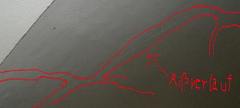
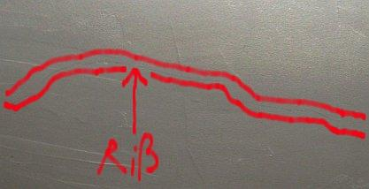

[🠔 Zur Übersicht: Sanierputz-Schwindel](2sanipuz.md)  
# Sanierputz-Risse
**Ein Bauschaden duch Sanierputzversagen auf feuchtem und salzigem Untergrund (Mauersalpeter/Kalksalpeter) - Gewölbe / Gewölbekappen / Stallgewölbe aus Backsteinmauerwerk / Ziegelmauerwerk.**  
_von Konrad Fischer_

### Ein Bauschaden duch Sanierputzversagen auf feuchtem und salzigem Untergrund innen (Mauersalpeter/Kalksalpeter) - Gewölbe / Gewölbekappen / Stallgewölbe aus Backsteinmauerwerk / Ziegelmauerwerk- Gutachtenauszug 4

 Inhaltsübersicht (Bild links: Doppelter Sanierputzschaden): 
**[Seite 1 - Sanierputz - Was kann er, was nicht? Heilt er?](2sanipuz.md)** 

**[2 Sanierputze am Altbau](2sani3.md)**: 1. Was sind Sanierputze? 2. Was bringen Salzanalysen? 3. Nehmen Sanierputzporen Salz auf? 

**[3 Sanierputze am Altbau](2sani3.md)**: 4. Begünstigen Sanierputze die Austrocknung des Mauerwerwerks? 5. Entsprechen die Sanierputze gem. WTA dem WTA-Merkblatt 2-2-91, Sanierputze? 

**[4 Sanierputze am Altbau](2sani4.md)**: 6. Vermindern Sanierputze die Salzbelastung? 7. Welche Anstriche sind auf Sanierputzen geeignet? 

**[5 Gewährleistung, abplatzende Sanierputzschollen, Landkarten-Putzrisse und Ettringgittreiben / Treibmineralien](2sani5.md)** 

**[6 Bauschaden duch Sanierputzversagen auf feuchtem und salzigem Untergrund - Gutachtenauszug 1](2sani6.md)** - Vorbemerkung und Schadensanalyse 

**[7 Gutachtenauszug 2](2sani7.md)** - Schadsalze - Nitrate (Mauersalpeter) 

**[8 Gutachtenauszug 3](2sani8.md)** - Sanierputz - ein Opferputz-System? 

**9 Gutachtenauszug 4** - Sanierputz-Risse 

**[10 Gutachtenauszug](2sani10.md)** 5 - Feuchtemessung 

**[11 Gutachtenauszug 6](2sani11.md)** - Sanierungsempfehlung 

## Sanierputz-Risse

Das nach Aussagen des Auftraggebers schon langfristig vorliegende Schadensbild der landkartenförmigen Rißnetzbildung mit Putz-Hohlstellen/-Abscherung/_Ablösung an allen Gewölbeschalen, das demnach schon kurz nach Anbringung des neuen Sanierungsputzes auftrat und sich seitdem nicht mehr verändert hat, bleibt im Gutachten des Sachverständigen Dr.-Ing. X aus nicht nachvollziehbaren Gründen unerwähnt. Diese Schäden haben folgende Ursache: 

Die zementär gebundenen Sanierputze mit hoher Endfestigkeit können beim Abbinden ihre Abbindespannungen nicht ausreichend in geringer festen Putzgrund - hier: luftkalkvermörteltes Mauerwerk mit durch die Schadsalzkristallisation teils mürben Ziegeloberflächen - einbringen. Folglich kam es zu dem vorhandenen Rißbild mit Ablösungen der starr abgebundenen Mörtelschicht und Hohllagen als Folge des dann in der Putzschale auftretenden und vom weicheren / wenig tragfesten Putzuntergrundes /Putzgrundes nicht aufnehmbaren Spannungsabbaus. 

 
_Die zementhaltige Sanierputzlage entwickelt beim Abbinden Überhärte gegenüber dem Putzgrund und kann die entstehenden Abbindespannungen nicht in den Untergrund einleiten. Als Folge enstehen umfangreiche Risse und Abscherungen in der Putzschale._ 

 
_Rißverlauf im Detail._ 

Die landkartenförmigen Risse sind als typisches Merkmal für die gestörte Abbindung zementärer und hochfester Putzsystem auf weicheren Untergründen in der Fachwelt bekannt. Sie sind gekennzeichnet durch fest am Untergrund anhaftende Putzinseln und schalenförmig abgelöste Putzzonen im Bereich der Rißnetze. 

Die punktuelle Anhaftung der Gewölbeputze wurde bei der Ortsbesichtigung durch teilweises Abklopfen der Putzflächen und entsprechende akustische Effekte (hohlklingende Schollen) bestätigt. Im Bereich der Ablösung der hohlstehenden Sanierputzflächen ist wohl ebenfalls mit auskristallisierten Schadsalzen zu rechnen, in gewissem Umfang gilt dies auch an den noch anhaftenden Putzbereichen. 

Hier gehts weiter: **[10 Ein spannender Bauschaden duch Sanierputzversagen auf feuchtem und salzigem Untergrund - Gutachtenauszug 5 - Feuchtemessung](2sani10.md)**
