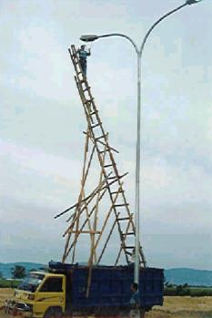
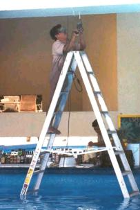
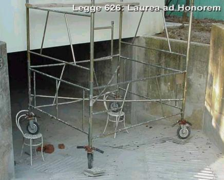
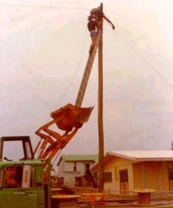
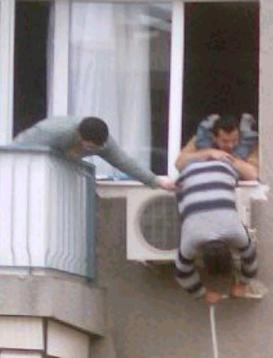

[🠔 Zur Übersicht: Haustechnik Fehler I](10ht.md)  
# Der Sicherheits- und Gesundheitsschutz im Altbau - Planungsaspekte bei denkmalgeschützter Sanierung 1
**Der SiGeKo im Altbau - Anmerkungen zu einem vernachlässigten Thema. Mit Ergänzungen des Leistungsbildes betr. Wirtschaftlichkeit und Konstruktionsberatung.**  
_von Konrad Fischer • aktualisiert 01.01.2010_

[Konrad Fischer](1refernz.md)

**Der Sicherheits- und Gesundheitsschutz im Altbau - Planungsaspekte bei denkmalgeschützter Sanierung 1**

Vortrag auf der 1. Fachtagung der Koordinatoren Deutschlands, Leipzig 7.-8.4.2000 rund um die Baustellenverordnung und EU-Baustellen-Richtlinie, das Arbeitsschutzgesetz, die Gefährdungsanalyse, den SiGePlan und die "Unterlage" 
**aktualisiert 2010**

Zur Einstimmung ein paar Bilder zum Thema Arbeitssicherheit, die Prof. Dr.jur.utr. Peter Martin Litfin zusammenstellte: 
    

Die Aufgaben des Sicherheits- und Gesundheitsschutz-Koordinators (SiGeKo) im Altbau bzw. im Baudenkmal sind bisher kaum ins Bewußtsein gerückt worden. Woran liegt das?

Die gesetzlichen Unfallversicherungsträger, aus wohlverstandenem Eigeninteresse treibende Kräfte hinter der Baustellenverordnung und der Ausbildung des SiGeKo, sind selbst vorwiegend neubauorientiert. Großbaustellen des Stahl- und Betonbaus beherrschen ihr Tätigkeitsfeld. So ist es nur natürlich, daß die Aufgaben des SiGeKo im Altbau kaum ins Blickfeld traten. Dennoch: Über 50 % des Bauvolumens werden in der Bausanierung abgewickelt - ein wichtiges Betätigungsfeld auch für den SiGeKo. Und selbstverständlich stellen sich dort die Problemstellungen oft ganz anders als im Neubau - nicht nur bei der Asbestsanierung (für die im Rahmen von Instandhaltungen und Inspektionen übrigens bemerkenswerte, hin und wieder unberücksichtigte Ausnahmen vom sonstigen Verwendungsverbot gem. § 1 der Chemikalienverbotsverordnung in Verbindung mit Abschnitt 2 der Verordnung sowie nach § 18 GefStoffV in Verbindung mit Anhang IV Nr. 1 gelten, vgl. hierzu [TRGS 16: Spezielle Regelungen für Instandhaltungsarbeiten an Asbestprodukten](http://bgbau-medien.de/site/asp/dms.asp?url=/tr/trgs519/16.htm)).

Dabei ist zu berücksichtigen, daß die "Erläuterung zur Verordnung und Gesundheitsschutz auf Baustellen" (Hochbau 1/99) hier durchaus Hinweise gibt, die die Anwendung der Baustellenverordnung im Altbau betreffen. Demnach sind unter dem Begriff "Änderung einer baulichen Anlage" als "nicht unerhebliche Umgestaltung" die Maßnahmen am Altbau gemeint. Abgegrenzt werden im § 1 "Änderung des konstruktiven Gefüges, Änderung oder Austausch wesentlicher Bauteile (z.B. Dach-, Fassaden- oder Außenputzerneuerung, Entkernung) ... auch im Rahmen von größeren Instandhaltungs- einschließlich Insatndsetzungs- und Sanierungsarbeiten" - bei denen die Verordnung greift - von "Schönheitsreparaturen oder laufende Bauunterhaltsarbeiten geringen Umfangs (z.B. Innenanstrich in Wohnungen, Austausch von Bodenbelägen, Arbeiten an der Heizung, Badrenovierung, ...)", die ohne SiGeKoordination geplant und durchgeführt werden dürfen. Ein Sonderfall ist der Abbruch baulicher Anlagen, der ebenfalls den Altbau betrifft.

Bei vielen Arbeiten im Bestand wird auch der Sicherheits- und Gesundheitsschutz-Plan (SiGePlan) erforderlich werden. Größere bzw. arbeitstechnisch gefährliche Baumaßnahmen wie die Generalsanierung eines großen Bauwerks, im denkmalgeschützten Bestand z.B. ein Rathaus, eine Kirche, eine Kloster- oder Schloßanlage, gehören hier sicher dazu. 

Wichtig: Nach § 3 Baustellenverordnung muß auch auf "kleineren" Baustellen, für die gem. § 2 keine Vorankündigungspflicht besteht und kein eigener Sicherheits- und Gesundheitsschutzplan erforderlich werden, ein "geeigneter Koordinator" bestellt werden, sobald "Beschäftigte mehrere Arbeitgeber tätig werden." Das heißt im Klartext: 

**Kommen mehr als ein Unternehmen auf der Baustelle zum Zuge, muß seitens des Bauherrn gem. BaustellV gesetzesgetreu und nachweisbar "koordiniert" werden. Egal, ob die Firmen gleichzeitig oder nacheinander anrücken.**

**[weiter Teil 2 ...](2sigeko1.md)**
