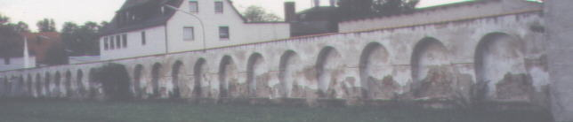
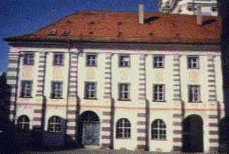
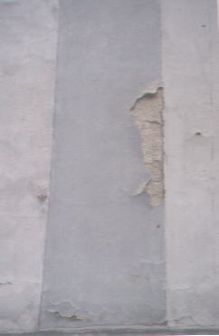
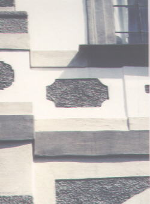
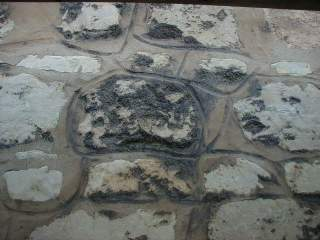
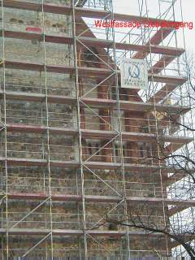
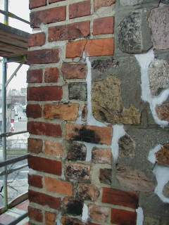
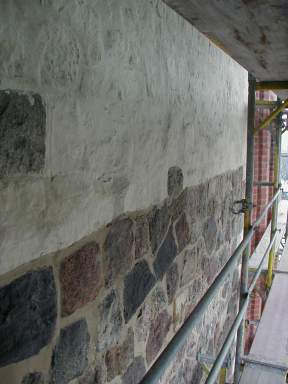
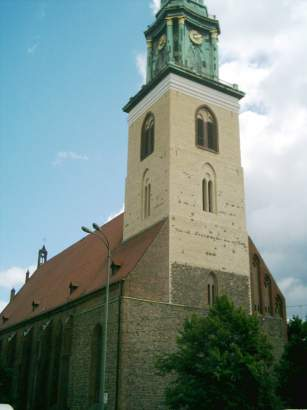

[🠔 Zur Übersicht: Nordisk](nordisk.md)  
# Erfarenheter av luftkalk, träskydd och hantverk vid restaureringar i Tyskland
**Vad kan hjälp för fasadrestaurering: Cement eller kalk, silikatfärg, syntetisk färg eller släkt kalk? Bekämpande träskydd - vad är bäst?**  
_von Konrad Fischer • aktualisiert 31.08.2001_

**International Workshop 12.-15. Mai 1999["Characterisation of old mortars with respect to their repair"](2rilem.md)**

---

Konrad Fischer 

## Erfarenheter av luftkalk, träskydd och hantverk
vid restaureringar i Tyskland

## Fasadrestaurering: Cement eller kalk, silikatfärg, syntetisk färg eller släkt kalk?

### Förläsning i Gotland Seminarium: 
Hantverk & Utbildning - Nordiskt Forum För Byggnadskalk, Högskolan på Gotland, Visby 31.8.2001

_(Flera bilder och sköna länkar finns i liknande[förläsning på engelska av RILEM-Möte 1999](2rilem.md)) _

Kära Damer och Herrar!

Svenskarna och tyskarna är mycket gammal vänner sedan länge. Och idag mycket bättre än i Gustav Adolfs och Wallensteins tid. So kommer den här gangen en tysk att hjälpa för kalkreformation och plundra buffet i sverige. Jag tackar för det möjlighet.

Kära kalkvänner! Kalk är vårt älskningsmaterial! Också i scottisk lime center – och att rädda ruiner också i Franken, vär jag är hemma.

Men: Trots de många skador som moderna material orsakat i byggnadder finns det också problem med traditionella kalkprodukter. 

Vi, men tyvärr även hantverkarna och våra byggherrar, känner kalkskador alltför väl. Kan man överhuvudtaget lita på kalkprodukter, eller gör det bara vi galna byggnadsvårdare?

Om arkitekten vill använda rena kalkprodukter hotar tre faror:

Första: Hantverkaren gör invändningar, som egentligen kommer från reklamen för industrins produkter. Garantier för kalk användnig avsägs ofta kategoriskt. Byggnadsnormerna är tydligen överträdit. Resultat: Cement, silikat, och färdigprodukter med konstharts sätts in istället.

För det andra: Hantverkaren byter i hemlighet ut de begärda rena kalkprodukterna mot industrins maskinmässiga produkter. Ute på byggplatsen tillsätter han, bakom ryggen på byggledningen, den berömda skopan cement. När det uppkommer skador – ja då är det arkitekten, som ju inte ville använda vanliga material, som får skulden.

För det tredje: Det använda receptet, som ofta kommer från cementtypiska laboratorieundersökningar, negligerar de traditionsenliga erfarenheterna. Tidigare vanliga förbättrande tillsatser och tricks för att anpassa produkten till objektet, används inte riktikt. Resultat igen: Kalkskador. 

Varför finns denna osäkerhet?, och varför dessa skador?

Reklamen för industriella färdigprodukter lovar hantverkaren säkerhet, snabb bearbetning och därigenom hög vinst. Eventuella användar- och hälsorisker, fullständig innehållsdeklaration och riskbeskrivning liksom inverkan på byggnaden och praktiska långtidsförhallandet finns där inte. 

Cementbruk hotar det gamla sulfathaltiga murverket och puts genom att Ettringit bildas. Färdigframställt byggnadsmaterial berövar hantverkarna sin materialkunskap. Snabb bearbetning är nu viktigare än materialets lämplighet för byggnaden. Om det blir skador kommer det otäcka uppvaknandet: Smarta experter, nära industrin, upptäcker brister i bearbetningen – riktigt så enkel är ju dock inte den verkliga användningen av laboratoriekompositionerna.

Hur ser det ut bland arkitekterna?

Deras utbildning vid högskolan har försummat produktkunskaperna. Arkitekten tro på uppstigande fukt och sådana dummheter och istället för beprövade byggnadsmaterial använder han ständigt nykomponerade produkter. Kunskap om recepturen förvägras honom i utbildningen och i byggmaterialindustrins propaganda. Äkta erfarenhet av produkterna får man alltså för det mesta endast i de egna projekten.

Och hur ser det ut i byggnadsvården?

Det sätts hela tiden in nya receptvarianter på kulturminnesbyggnaderna. Konstharts, silikoner och silikater, hydrauliskt kalk och puzzolaner, ofta uppblandad med cement, har så blivit byggnadsvårdsprodukter. De skador som uppkommer förtigs sedan. De misslyckade försöken med pseudo-byggnadsvårdarnas recept skylls sedan på kalken eller hantverkarna.

Även det är en förklaring till hantverkarnas rädsla för kalk.

Om man betänker de många felstegen i byggnadsvården så är rent kalkbruk och kalkfärg ett förprogrammerat misslyckande. Därför är det logiskt att även de vetenskapsmän och praktiker i Tyskland, som står minnesvården nära, experimenterar med mer eller mindre saltförorenade hydrauliska förtätande och förhårdande tillsatser. Tillsammans med ett mineralogiskt forskningsinstitut, ni känner det, tycker jag, blir äkta kalkprodukter ibland till-och-med bekämpade från byggnadsvård, och motas bort med elak metoder. 

Det finns dock även andra erfarenheter

Har vi inte överraskande mycket luftkalkputs med naturliga tillsatser, som har tjänat i århundraden på sina byggnader? Tyvärr kommer dessa framgångsexempel knappast fram i de allmänna byggnadspublikationerna.

Det är klart att vi hela tiden förlorar många värdefulla, hållbara putsytor, när traditionell kalkning ersätts av färgsystem med silikater och konsthartsbindemedel. Med dessa produkter förstör målarmästaren värdefulla gamla putsytor och gynnar därmed dess ersättning av cement- eller konsthartsputs.

Tyvärr stämmer inte de industriella produkternas byggfysikaliska laboratorievärden in, för till exempel förtätning och fasthetsgrad, på de värden som uppmäts på byggarbetsplatsen. Värdena kan i praktiken vara väsentligt sämre och orsakar därför skador. De nämnda värdena för vattenångdiffusion har så gott som inget att göra med byggmaterialets förhållande till inträngt vatten, eller kondensat i flytande form. Vattenavvisning utåt betyder också vattenspärr inåt. Följden blir, att det sker en fuktanrikning inne byggnaden med efterföljande konstruktions-, mögel- och hälsoproblem. De berömda dispersionsfärger tenderar att få dammavlagringar, algbeväxning och mikrosprickor. Fuktighet kan sedan sugas in genom det kapillärsystemet och därefter bli permanent inneslutna. Denna effekt gäller förstärkad för efterföljande reparations-strykningar, vars tilltagande tätande verkan kommer att förstöra den underliggande kalkputsen ännu mer.

Inte heller den så berömde saneringsputs, ett typiskt tysk vansinne, fungerar som man hoppats. Det beror på att den skadliga vatten-saltlösningen inte kan tränga in i de vattenavvisande porerna – i skillnad till vad reklam lovar.

I jämförelse med saneringsputsen erbjuder kalkbruk och kalkstrykningar tekniska fördelar. De har störningstoleranta egenskaper. De kan inte spärra in inträngande vatten, utan använder det, i likhet med tegelpannor, som förtätningsmedel. Dessutom stöts vattnet snabbt bort om porstruktur är riktiga och blir större inåt. Gentemot saltskadade underlag verkar den på intet sätt spärrande. I nödfall “offrar“ den sig för det belastade underlaget. Det föreligger dock två förutsättningar för dess riktiga användning:

1. En hantverkare som är väl förtrodd med de traditionella byggnadsmaterialen, och som håller på sina hantverksregler, och 2. Ett bra byggmaterialrecept.

I denna anda försöker jag använda traditionella kalkprodukter inom Byggnadsvården. Från mer än 350 byggnadsminnesprojekt, sedan 1979, följer här några exempel på kalkinsatser.

Exempel 1: En tidigare domstolsbyggnad i Weissenfels

Här ville vi sätta upp skonande och kostnadseffektiv “halmmatteputs“ över de gamla putsytorna. Tyvärr hemlighöll hantverkarna att de hade bytt ut det föreskrivna grovkorniga kalkbruket mot finkornig maskinfärdigputs, som blandats ut med hydraulisk kalk. För utföraren blir det en kostnadsfördel – för resultatet en katastrof. 

Det använda bruket fick spänningssprickor efter cirka 6 veckor. De sprickor som förslutits vid reparationsförsök öppnade sig igen, hela tiden, under flera månader. De flesta puts måste till slut bytas ut, för över 100.000 DM, mot mjukare bruk. – En kostnad som hantverkaren måste stå för.

Exempel 2: Trädgårdsmuren till klostret Waldsassen

 
Redan efter en kort tid visade det sig, att det här använda saltrika -trasskalkbruket, recepterad från byggnadsvård var en verkligen katastrof. Även den saneringsputs som sattes upp på prov. Den fick småsprickor och sprack upp i kanter, eller löstes upp i sjok från det lösare underlaget. Det sista beror på för hög fasthet och saltkorrosion.

Exempel 3: Kloster Waldsassens fasad

De svåra förhållandena i det förra exemplet, gjorde att vi tog det extra försiktigt när vi planerade renoveringen av fasadputsen. Den hade lidit svårt under den senast påförda silikatfärgen. 

 
Fasaden med silikatfärg - fint?

   
Nej!

  
Nej, nej.

  
Fasad restaurerat med ren (inte alls hydraulisk!!!) kalk. Detail efter fyra år.

Stora områden av den gamla putsen var ihålig. De gamla putsskikten, där vattenglas hade trängt igenom, lossnade på grund av sin nu höjda fasthet och täthet. De översta puts- och färgskikten sprack ofta upp i en nätform, var insjunkna och kunde tas bort med en sickel. Ett färg- och brukskikt, som har förhårdats och förtätats med mycket pottaska från vattenglas, ska snarast vara förstörd vid temperatur och fuktighetsbelastningar, speciellt om det ligger över ett mjukare underlag liksom kalkbruk. Det lossnar i flagor – Slutet på en vattenglasbehandling.

Vid den vidare inventeringen av fasadskadorna, in till putsgrunden, kom fler problemområden fram: Murverket bestod inte av ett enhetligt system. Tegel, olika naturstenar, utjämningsskikt av lerputs, genomgående armtjocka byggsprickor, och original-putslager – delvis gråfärgade av träkolsdamm och laserade med Caput-mortuuum-pigment, ställde särskilda krav på renoveringen.

Vid bedömningen av flera nya putsprover visade sig en byggplatsblandning som särskilt lämplig. 

Från lokal sand, släckt kalk och med ett promille av ett patenterade tillsatsmedlet uppstod ett luftkalkbruk. 

Han ger det önskade resultatet till hantverkaren, men också till byggnadsvårds-myndigheten och till oss ingenjörer. Vi provade då bearbetningen (vidhäftning, transport, applicering, härdning, efterbehandling för att kunna gestalta ytan, möjlighet att använda receptet med olika kornsorter och grävlingshår, för att få fram den önskade putsstrukturen från den djupa sprickan upp till översta putsen), och utvecklingen av fasthetsgraden. Bedömningen gjordes alltså efter tekniska och utseendemässiga kriterier.

Till strykning i fresk teknik användes en kalkfärg som blandats ut med naturliga oljor, tillsatsmedel och kasein.

Idag, efter sex vintrars belastning, visar det sig att den starkt väderutsatta fasaden ännu är i gott skick. 

Däremellan utvecklades nya recepturvarianter som färdigprodukt, som erbjuder lösningar för murbruk, kalkbruksgolv, sätt- och injektionsbruk, stenersättning, samt fog- och takbruk. Tillsatser som grävlingshår, pigment, lokalt grovkornigt material, träkol och så vidare, tillgodosedde de olika projektens behov. Särskilda krav på bindning till underlaget och väderstabilitet (?) Uppnås med en mekanisk höjning (ökning) av bindemedelsytan liksom med en inblandning av brandkalk. Gammal hantverksteknik med fin verkan!

Hantverksmästaren har under tiden utvecklat ett nytt tillsatsmedel för injektionsbruk med luftkalk. Nedsmittningen av äldrebyggnadsverk med cement- och trasshaltiga, alkalier-, vatten- och finkornsrika injektinsbruk kan nu inskränkas till ankarjärnets direkta omgivning. I ett föregående, fyllningsförfarande kommer den i sammansättning och kornighet, som gammalt bruk kompatibla, kalkprodukten att sättas in. Den kan, genom tillsats av lämpligt socker och kiselgur härda också till lufttäta utrymmen. 

Som strykningsfärg använder vi nu i en kalkkaseinfärg som också utvecklats av Hantverksmästaren. Färgen fungerar jättebra och självklart allt detta utan konstharts.

Exempel 4: Det gamla rådhuset i Bremen

Här har vi ett provområde där vi, över en vinters belastning, har bevisat det nya kalkreceptets lämplighet.

   
Fasadtest 

Vi har testat kalkrecepter som ersättning för natursten, ytskydd, härdning, injektion i fogars och naturstens hålrum. Det är kanske intressant att nämna att vi har kunnat behålla alla hållbara gamla cementreparationer och -fogar. Deras naturligtvis öppna sprickor har vi fyllt med kalkbruk. Med detta förfarande kan mindre vatten tränga in och vatten som redan finns inne kan torka ut.

Natursten restaurering med kalk

 
Färdig restaurerad i gammal kläder.

Exempel 5: St. Marien, Alexanderplatz, Berlin

Även i detta fall gav en grundlig provomgång, under förra vintern, den nödvändiga klarheten om hur produkten ska sättas in och om utförandetekniken. Liksom i Bremen behöll vi de historiska cementfogarna från 1894 och senare, trots att vi viste att byggnaden ursprungligen var täckt med puts. Vi kommer att reparera hela fasaden, steg för steg, med slamteknik och genom att fylla dess sprickor. 

 
Efter restaurering

Målsättningen är: Ett bättre vittringsmotstånd och upprustning utan att ändra utseendet.

 
Puts och Silikatfärg efter 100 år - restaurerat med kalk

Användning av lokala brukstillsatser, som ibland krävs av byggnadsvårdsmyndigheten, stupar ofta på bristande receptkunskaper, beredskap att ge garantier liksom med förhöjda kostnader. Marknadens regler hindrar också lokala spetsfundigheter. Kontrollerad produktion från industrin förenklar jämförelsevis för oss i flera avseenden. Det gäller för den av oss tidigare önskade blandningen på byggplatsen, Byggledningen och garantien, likaså den av oss, nu alltid fordrade delaktigheten av industrins tillverkaren i byggövervakningen, slutbesiktningen och långtids garantier för ett korrekt utförande. Utan detta kommer inte någon obekant produkt in på vår projekt. En nödvändig överlevnads-strategi! Vård - kontrakt för framtida möjliga fel för mycket utsatta konstruktioner och för väderutsatta delar minskar också eventuella överraskningar.

Genom vår [konstruktionsanalys](11rabus.md)- och [positionsbyggstenssystem](9pbs.md) för beståndsinventeringen och infordran av anbud, får vi även för komplicerade, puts-, stuckatur- och målningsarbeten pålitliga arbetsbeskrivningar [11]. De ger budgivaren en fullständig och entydig information om beståndet, målet med arbetsinsatsen och dess konkreta omfattning. Därigenom lyckas det bara för de lämpliga budgivarna att gå vidare till nästa mindre urvalsgrupp, ty endast de lyckas presentera en priskalkyl utan stora riskpåslag.

Skador på beståndet, förorsakade av dessa kalkprodukter finns inte. Dessförinnan offrar sig luftkalkbruket. Det uppkommer aldrig heller några cementrispor vid användning av kalk. De är förövrigt den vanligaste sjukan för hantverkaren, vilken beror på skadliga beståndsdelar i cementen.

Med kalk kan vi alltså undvika tekniska skador på byggnadsverket, ekonomiska- och hälsoskador hos de som är delaktiga i bygget och hos användaren. För det [och bekämpande träskyddet utan gift gentemot insekter och svampangrepp](2hsm.md), är detta sedan länge vår standard. Det pågår ju också sedan länge, här i Sverige, undersökningar i samband med marknadsintroduktionen av det giftfria träskyddsmedlet. Under namnet Improtect eller Sioosan har detta träskyddsmedel säkert också i era kretsar blivit känt.

Jag tackar min vän Herje Boström, Göteborg för översättningshjälpen och för Er uppmärksamhet.
