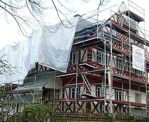
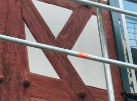
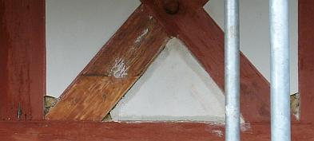

[🠔 Zur Übersicht: Altbau Restaurierung](20bausto.md)  
# Vom Mißbrauch der Behördenmacht
**Behörden - Vom Mißbrauch der Behördenmacht. Wie er funktioniert, wie man sich wehren kann.**  
_von Konrad Fischer_

## Problem: Beamte, Behörden & Politik

> [!abstract]+ Kapitelübersicht: Behörden  
> 1. **Vom Mißbrauch der Behördenmacht**
> 2. [Baurecht und Ausnahmen](41brecht.md)
> 3. [Behördenprobleme - HOAI-Mißbrauch im Vertragswesen der öff. Hand](421voef.md)
> 4. [Technische Prüfbehörden](46techpr.md)
> 5. [Behördenprobleme - Wasser-/Abwasserwirtschaft und sonstiger Tiefbau](47wass.md)
> 6. [Korruption an der Hochschule](48hoch.md)
> 7. [Die kostenexplodierende Planungsqualität im öffentlichen Bauen](4kostex.md)
> 8. [Behördenprobleme - Links](410links.md)

**[1. Baurecht und Ausnahmen](41brecht.md) 
2. HOAI-Mißbrauch** 

**Die besonderen Links -[Die Honoraranfrage](10hoai.md#honoraranfrage) - [Mindestsatzunterschreitung durch VOF-Verfahren](10vof.md)**

**[2.1 Im Vertragswesen der öffentlichen Hand](421voef.md#2. hoai)**

_"So geht´s in der Welt, 
dass, wer öffentlich stehlen und rauben kann, 
der geht sicher und frei dahin, 
von jedermann ungestraft... 
Unterdessen müssen die kleinen heimlichen Diebe, 
die sich einmal vergriffen haben, 
die Schande und Strafe tragen." 
Dr. Martin Luther im "Großen Katechismus" 

„Deutschland ist eines der wenigen entwickelten Länder, 
wo die Regierung sich nicht schämt, 
Absprachen mit der [...]industrie zu treffen. 
Diese Art von Absprachen, 
wie man sie in Deutschland sieht, 
gibt es sonst eigentlich nur in Entwicklungsländern, 
nicht in reichen, zivilisierten Staaten. 
Das ist wirklich schockierend.“ 
Prof. Stanton Glantz ,University of California, San Fransisco, im [ZDF, Frontal 21 am 28.2.06](http://www.zdf.de/ZDFde/inhalt/29/0,1872,3904477,00.html)_

**Vorbemerkung: 
Ein besonderer Dank an die hier nicht zu vergessenden vielen tüchtigen Beamten, 
die sich treu an ihren Dienstauftrag halten! 
Wenn man das [Verhalten mancher privater Bauherrn](5wiber.md#schmiergeld) berücksichtigt ...**

**Die Veröffentlichung der hier aus Zeitungsartikeln 
als Beleg für die immer mehr um sich greifende korruptive Unterwanderung unseres Gemeinwesens zitierten Problemfälle 
stehen unter dem Leitbild der 
Verwaltungsvorschrift zur Vermeidung und Bekämpfung der Korruption des Landes Sachsen-Anhalt vom 12.3.1998. 
Hieraus sei zitiert:**

**_"- Korruption muß mit aller Entschiedenheit begegnet werden._**

**_- Korruptionsfälle und -versuche sind nach Möglichkeit offenzulegen. 
Darüber hinaus gilt es, berufsethische Werte zu vermitteln."_**

**Diesen Zielen wollen wir uns verpflichten. 
Das unerreichbare(?) Vorbild - nicht nur für brave Beamte - Paul van Buitenen:**

Süddeutsche Zeitung 16.3.1999:

_**"[Paul van Buitenen](8buch.md#paul van)** 
Suspendierter EU-Beamter und Korruptionsermittler_

_Den einen gilt er als Nestbeschmutzer, den anderen als Held und Märtyrer. [...][Paul van Buitenen](8buch.md#paul van) ist der Mann, der [die mächtige EU-Kommission](5finanz.md#ein sehr guter sachwalter \(eu\)) in Gefahr _[und letztlich außer Amt, Einf. K.F.] _gebracht hat. Seine[Enthüllungen über Korruption](8buch.md#paul van) in Brüssel führten mit dazu, daß das Europaparlament "fünf Weise" mit einer Untersuchung beauftragte. Ihr Bericht, der am Montag übergeben wurde, könnte Kommissare das Amt kosten. [...]_

_[...] In seinem 34seitigen Brief nebst 700 Blatt Anhang legte er dem Europaparlament seine Erkenntnisse über Nepotismus, Mauscheleien und Vertuschungsmanöver in der Kommission dar. Später [fuhr er die Akten zum] Europäischen Rechnungshof._

_[...]__Die Kommission schlug zurück - rasch und hart. Sie suspendierte ihn vom Dienst, halbierte sein Gehalt und leitete ein Disziplinarverfahren wegen Verrats von Dienstgeheimnissen ein. [...] aus der Kommission heraus wurde er als paranoider Verräter gebrandmarkt.__[...]_

_"Ich habe das alles unterschätzt", meint[van Buitenen](8buch.md#paul van) heute. Mit einem Karriereknick habe er gerechnet, nicht aber mit den harschen Disziplinarverfahren. Sie könnten bis zu seiner endgültigen Entlassung und zum sozialen Abstieg führen. [...] er würde wieder so handeln - nur besser vorbereitet. Woher diese Hartnäckigkeit? [Paul van Buitenen](8buch.md#paul van) verweist auf seine religiöse Überzeugung. "Wenn man an Gott glaubt, muß man sich durch sein christliches Gewissen steuern lassen."_

_[Er] arbeitet [...] zuletzt in der Generaldirektion für Finanzkontrolle. Dabei wurde er auf Unregelmäßigkeiten in der Kommission aufmerksam und informierte seine Vorgesetzten. "Doch sie winkten nur ab", sagt er. Schließlich sah er keine andere Möglichkeit mehr, als den Schritt in die Öffentlichkeit, der sein Leben veränderte. [...] --- Stefan Ulrich"_

Ein Michael Kohlhaas gegen [EU-Demokratur](5finanz.md#ein sehr guter sachwalter \(eu\))? Inzwischen in der EU-Verwaltung "abserviert". Aber:

Obermain-Tagblatt 13.10.1999: 
**_"Steuerzahlerpreis für EU-Rebellen 
BRÜSSEL. _**_[Paul van Buitenen](8buch.md#paul van), der mit seinen Enthüllungen über Misswirtschaft zum Sturz der alten EU-Kommission beigetragen hat, ist in Brüssel mit dem Europäischen Steuerzahlerpreis ausgezeichnet worden. Der 42-jährige niederländische EU-Kommissionsbeamte hatte 1998 dem EU-Parlament und dem Rechnungshof Dokumente übergeben, die [Misswirtschaft und Vetternwirtschaft ](5finanz.md#ein sehr guter sachwalter \(eu\))belegten. In diesen Tagen veröffentlichte er ein [Buch mit dem Thema: "Unbestechlich für Europa"](8buch.md#paul van)."_

**Die Altbau und Denkmalpflege Informationen 
beglückwünschen Herrn Paul van Buitenen zu diesem ehrenvollen Preis 
und wünschen dem [Buch ](8buch.md#paul van)eine weite Verbreitung!**

Frankfurter Allgemeine Zeitung 27.08.02: 
_**"Van Buitenen nimmt eine Auszeit** 
fri.BRÜSSEL, 26. August. "Das Gewissen der EU", [...] hat sich eine Auszeit genommen. In den kommenden zwölf Monaten arbeitet der erste sogenannte EU-Whistleblower ("Ausplauderer") von Mißständen in der Kommission als Finanzkontrolleur in der niederländischen Polizei. "Der Druck war zu groß", sagte van Buitenen, der nach seiner Kritik vom Dienst entfernt und dann "auf eigenen Wunsch" auf einen Posten nach Luxemburg abgeschoben wurde. [...] 
(Der kritische Bericht auf Veranlassung v.B.s) attestierte der Kommission, über viele Jahre Miß- und Günstlingswirtschaft im EU-Management zugelassen zu haben - und, als Gipfel der Kritik, daß dafür offensichtlich niemand verantwortlich sei oder belangt würde. [...] Als Beleg dafür, daß die Aufarbeitung der Mißstände nicht vorankomme, unterbreitete er vor einem Jahr dem Europäischen Amt für Betrugsbekämpfung (Olaf) einen mehr als 200 Seiten umfassenden Bericht. Darin finden sich auch Hinweise auf mutmaßliche neue Mißstände und Korruptionsfälle. [...] Bis heute liegen so gut wie keine Ergebnisse (der darauf eingeleiteten Ermittlungsverfahren) vor. "Wir können - auch zum Schutze der Beteiligten - keine Auskünfte geben", heißt es seit Jahren gebetsmühlenartig in der Kommission und der ihr angeschlossenen Behörde der Betrugsbekämpfung."_

Da merkt man wieder einmal, daß die FAZ noch nicht ganz dem roten Terrorregime über die deutschen Medien angehört. 
Offener ist die EU-Demokratur und das Totalversagen der Regierung, unsere Steuern in sinnvolle Kanäle zu leiten, nicht mehr zu geißeln! Kein Thema, da man sich seine Claqueure in den eigenen Reihen auch nach dem System Schweinstall heranzüchtet. Was man da von ehrbaren Beamten und Politikhanseln gesteckt und belehrt bekommt, wie krumm man geschmierte Rückgrate biegen kann und wie man sich halt aus ehrbarsten Gründen des persönlichsten Wohlseins leider auch nicht anders verhalten kann ... 
Da muß freilich noch mehr Ökosteuer und erneuerbarer Energiemüll her. Koste es, was es wolle, Hauptsache, die eigenen Wänste werden etwas mitbedient. Und die MWSt 10% rauf löst dann alle Finanznöte am entleerten Staatshaushalt! Wie lange noch geht dieser Krug zum Wasser? Wir jedenfalls brechen doch alle schon lange! Oh ihr alten Preußen, wo seid ihr?

Zur Beamtenseele

Obermain-Tagblatt 14.9.02:

**_"Beamter muss Schmiergeld abgeben_**

**KOBLEN** Ein Beamter muss "Schmiergelder" an seinen Dienstherrn herausgeben. Diese Entscheidung des Oberverwaltungsgerichts (OVG) Koblenz ist rechtskräftig geworden (A: 10 A 10513/00; 2 C 6.01).

Ein Beamter war zunächst rechtskräftig von einem Strafgericht verurteilt worden, weil er Schmiergelder angenommen hatte. Als der Dienstherr deren Herausgabe verlangte, weigerte sich der Beamte. Er wollte nicht einmal Auskunft über deren Höhe geben. Das OVG gab dem Dienstherrn Recht. Das Bundesverwaltungsgericht folgte jetzt dem Urteilsspruch."

**2.2 Finanzierungsrichtlinien der öffentlichen Fördergeber**

Ein weiteres Problem ist die ungerechte und gegen den Gleichbehandlungsgrundsatz verstoßende Anwendung von Förderpauschalen für Planungs- bzw. Baunebenkosten. Unter Mißachtung der degressiv gestaffelten Honorartabellen werden damit "kleinere" Projekte gegenüber "größeren" erheblich und rechtsmißbräuchlich benachteiligt. Ganz abgesehen davon, daß damit der Planer "auf die schiefe Bahn" gezwungen wird, den damit verbundenen Honorarverlust hinter dem Rücken der Förderbehörde und oft auch des Bauherrn anderweitig "reinzuholen". Zu welchen Ergebnissen das regelmäßig führen kann, zeigen die u.a. Korruptionsaffären. Daß mit der Beschränkung des fachgerechten Planungsaufwandes, logische Folge der Planungspauschalen, auch viele Projekte "an die Wand" gefahren werden, ist den u.a. Fällen schlimmer Kostenexplosionen ebenfalls zu entnehmen. Ist das typisch Behörde, die korrekte Bauvorbereitung und -betreuung durch unrechtmäßige, praxisfremde und von Mißgunst getriebene Richtlinien zu beschränken? Dabei erzwingen die ungerechtfertigten Planungspauschalen auch Konflikte zwischen dem Auftraggeber und den Planern, die das Planungshonorar sachlich richtig gem. HOAI in Ansatz bringen. Derartig sture Kameraden werden mit dem Verweis, es gäbe ja genug, die mit weniger auskommen, ausgehebelt. Pressionsverhalten des Beamtenstaats, vorbei an Recht und Geset Und dann der freundliche Hinweis, "der Bauherr könne ja bezahlen was er wolle, also auch gem. HOAI." Richtig, wenn er im Finanzierungsplan Luft hätte! Das ist aber doch eher selten, oder? Namen und Dienststelle der Beteiligten auf Anfrage. Beschwerde - egal wo - zwecklos. Nicht, daß das nicht probiert wurde - bis zur Petition am Landtag. Ein echter Kohlhaas kennt da nix!

Der Amtsjurist des Bayerischen Landesamts für Denkmalpflege, RD Wolfgang Strietzel, sagte zu diesem Problem am Bayerischen Denkmaltag in Kulmbach am 7.5.1999 in öffentlicher Diskussion sinngemäß, 

_"daß die dem Denkmalamt von der vorgesetzten Behörde (Wissenschaftsministerium) auf Veranlassung des Rechnungshofes[vorgeschriebenen Planungspauschalen](10hoai.md#bayerisches landesamt) die Honorardegression und die damit verbundene Benachteiligung kleinerer Projekte unterschlagen und eher dem Architekten nicht "zuviel" Honorar gönnen." _

Doch das war den Zuhörern ohnehin klar. 

Problematisch ist die praktische Handhabung der Pauschalierungsrichtlinie: Dem Bauherrn bleibt in den Fällen der Richtlinienanwendung im Finanzierungsplan kein Freiraum. Die ungeförderten rechtmäßigen Planungshonorare kann er aus eigener Tasche oft nicht bezahlen. In Nordrhein-Westfalen wendet die Förderbehörde z.B. eine Pauschalierung der förderfähigen Planungskosten mit nur 10 Prozent der förderfähigen Baukosten an. Da braucht es schon geniale Bauherren, die dennoch in den saueren Apfel einer HOAI-gerechten Planung (etwa 25 Prozent aufwärts) beißen. Alternativ werden dem hilflosen Bauherrn von Amts wegen Planer empfohlen, die sich auf dann notwendige Unterschreitungen der HOAI-Mindestsätze einlassen (können, da sie - ist es vielleicht möglich??? - "woanders planen lassen"). Empfehlung mündlich, Telefonnummern werden diktiert. Und der treuherzige HOAI-Simpl fliegt raus. Scheinheilig erhält man dann auf schriftliche Nachfragen zu diesem Problem von allerhöchster Stelle (z.B. Oberste Baubehöre) die Auskunft: "Es bleibt dem Auftraggeber unbenommen, die nicht geförderten Nebenkosten selbständig zu honorieren".

Kommentar: Rechtsstaat heute. Da wäre ja einem das alte Rom noch lieber. Wo es in solchen Fällen immer irgendeinen Brutus gab ;-)

Dazu [der passende Link](10hoai22.md), der zeigt, was dann hinten raus kommt.

Mögliche Gegenwehr: Aufteilung des Förderfalls in ein planungsintensives Vorprojekt, in dem die Pauschale nicht greift, mit nachfolgendem Vollprojekt, dessen Förderung dann die vorher erledigten Leistungsphasen unberücksichtigt lassen kann.

Andere Möglichkeit: Täuschung der prüfenden Stelle durch geschicktes Umdeklarieren der Planungsleistungen, sodaß bei den geprüften Leistungshonoraren einige Kosten (zugunsten "anders" erscheinender Berechnungstitel/Sonderposten) unterschlagen werden. Ja, man braucht viel Phantasie, um wenigstens die allerklügsten Behördenblockaden zugunsten des Projekterfolgs durch Hintertürchen zu umgehen.

[Das Architekten-Schmiergeld-Urteil des BGH](http://www.jura.uni-sb.de/Entscheidungen/Bundesgerichte/BGH/zivil/bgh9127.html)

Zur Rubrik [Finanzierung/Förderung](5finanz.md)

[Zur Rubrik HOAI/Vertragsrecht](10hoai.md)

[Förderrichtlinien und Sanierungstreuhänder im Städtebauförderungsverfahren](5wiber.md#sanierungstreuhã¤nder)

[Öffentlicher Schwindel zu geplanten Baukosten](5finanz.md#mahnmalkosten)

[Zur Unterschreitung der Mindestsätze](10vof.md)

---

**3. VOB-Manipulationen**

Mehr Preußentum wäre auch für ausschreibende Bauämter schön. Unbekümmert werden hier "zuweilen" die bewährten Vorschriften der VOB bzw. des Haushalts- und Förderrechts umgangen, z.B.:

1. Es werden [beschränkte Ausschreibungen veranstaltet, wo öffentliche geboten wären](9cadava.md#ã–ffentlich). So entsteht das beliebteste Einfallstor für Preisabsprachen unter den begünstigetn Bietern. 

2. Es werden im Zusammenhang mit Weihnachtspäckchen [unbegründete Produktvorgaben entgegen VOB/A § 9 Nr. 5 (1) u. (2)](10hoai22.md#ausschreibungsschwindel) in die Leistungsbeschreibung aufgenommen. 

Produktnennung darf demnach nur sein, _"wenn dies durch die Art der geforderten Leistung gerechtfertigt ist."_

Dies mag hin und wieder - bei besonderen Baudenkmalanforderungen, wirklich überlegenen B. patentierten Produkten/Verfahren oder als Gegenwehr gegen ungeeignete bzw. undeklarierte Baustoffe oder Bauverfahren gerechtfertigt sein. Sonst aber nicht. 

Die Textgarnitur mit _"oder gleichwertiger Art"_ ist hier kein Ausweg. Sie wäre nur zulässig, _"wenn eine Beschreibung [für bestimmte Erzeugnisse] durch hinreichende genaue, allgemeinverständliche Bezeichnungen nicht möglich ist."_ Diese ist aber eigentlich immer - vom Fundament über die Fassade zur Haustechnik bis zum Dach - möglich, oder? Natürlich setzt das Planungsaufwand (den wer gerne bezahlt?) voraus. 

3. Es werden bei produzentengesteuerten Ausschreibungen technisch nachteilige Bausysteme und Baustoffe ([Sanierputz](2sanipuz.md), [kunstharzhaltige Anstrichsysteme](2lotus.md), [unsinnige Trockenlegungsverfahren](2aufstfe.md)) eingesetzt, die aber viel Provision und "Dankbarkeit" einspielen. 

Die sich daraus entwickelnden Bauschäden treffen leider nicht den Provisionsfonds des Produktvertreters, sondern werden durch juristische Tricks bzw. industrieabhängige "[Sachverständige](3gutacht.md)" dem Verarbeiter, Planer und Bauherrn aufgebürdet - nur in Ausnahmefällen auch mal der Kulanzabteilung oder Haftpflichtversicherung des Produzenten. Leider werden auch die Schadensfälle und ihre produktbedingten Ursachen im Vertreterkreis nicht gerne bekanntgegeben. Das könnte ja das unbekümmerte Verkaufen stören. 

4. Es werden zu große Vergabelose gebildet, vielleicht wird sogar die [Planung gleich in Generalübernehmerhand](9cadava.md#gu/gãœ) gegeben. Der läßt sich seine Planung zwar teuer bezahlen - ohne allzuviel Einflußmöglichkeiten für den Bauherrn - dafür erhofft man sich aber Arbeitsentlastung im entsetzlichen Behördenstreß.

5. Es werden Scheinpositionen gebildet, um die Bieterrangfolge zu manipulieren und durch Austausch der Scheinposition gegen teuer abgerechnete Alternativpositionen - teils bei Ausführung der billigen Ursprungsleistung - Spielraum für Bestechungsgelder freizuschaufeln. Durch hohe Bedarfskontingente an Regiestunden bleibt das von der Kostenermittlung bis zur Abrechnung unbemerkt, da die veranschlagten Summen den mit den Alternativpositionen abgerechneten Summen betragsmäßig entsprechen. Der aufgeklärte Bieter bekommt so den Auftrag, der Beamte das freie Geld. Und wenn´s schief geht: muß der Handwerker die falsch abgerechneten Positionen zurückzahlen, obwohl der beamte das Geld schon vergurkt hat. Ätsch.

Dafür gibt es Gründe (die auch bei unqualifizierten Planern gelten):

1. Bevorteilung eines bestimmten Bieterkreises aus begründeter "Dankbarkeit" bzw. um sich qualifizierte Planung, Leistungsbeschreibung und Bauleitung einzusparen.

2. Die Beauftragung qualifizierter Planer, die sich auf die [HOAI-Unterangebote](10hoai.md#honoraranfrage) nicht einlassen wollen, kann so vermieden werden.

3. Die [Übernahme der vom Produktvertreter oder Schwachverständigen gefertigten (Produkt-)Auschreibung](10hoai22.md#ausschreibungsschwindel) erleichtert die Planungsarbeit. Technisch unqualifizierte Mitarbeiter können so prunken, ohne die Mühe um das beste Planungsergebnis. 

Externe Planer erhalten sogar Honorar für die so eingesparten Aufwendungen. Vielleicht hoffen sogar einige "Ausschreiber" auf somit qualifiziertere Planung. Das ist aber recht viel verlangt von Baustoffvertretern, die von Abschlüssen und nicht von intensiven Bestandsaufnahmen bzw. Vorplanungen leben. Sie benutzen lieber ihre klugen Textlisten, aus denen sich dann recht flott ein 08/15 LV erzeugen läßt. Ob´s paßt oder nicht.

4. Für die Bauproduzenten ist das Angebot von "Leistungsbeschreibung" mit allen erlaubten bzw. unerlaubten "Nebengeschäften" der wohl effektivste Weg des Marketings. Daß hierbei gegen die VOB verstoßen wird, ist dem Produzenten nicht immer bewußt und letztlich egal, da selbst im Rechnungsprüfungsfall mit Rückforderung davon ausgegangen wird, daß mangels bezifferbarem Schaden Regreßansprüche gegen die Urheber des Verstoßes (Beratungspflicht-Verstoß mit 30-jähriger Haftung!) auszuschließen sind.

5. Die unterbesetzten Bauämter sparen sich Scherereien, wenn ihnen ein GÜ die Arbeit abnimmt oder B. das Fassadensystem (vom beratenden Produzenten inkl. LV) bzw. die kompletten Rohbaugewerke inkl. Ausbau gleich "aus einer Hand" geliefert werden.

Wem schaden diese wohlbekannten Manipulationen der Vergabe eigentlich?

1. Dem ehrlichen Steuerbürger, da deshalb zu teure und sinnlose Baumethoden im öffentlichen Bauen vorherrschen. 
2. Der betroffenen Behörde, deren Mitarbeiter mit unsauberen Manipulationen sicher keine besseren Beamten werden. 
3. Dem ehrlichen Produzenten, der auf seinen vorteilhaften Produkten sitzenbleibt. 
4. Dem ehrlichen Handwerker und Planer sowie mittelständischen Baubetrieben, die im Wettbewerb benachteiligt werden.

(Fangfrage: Gibt es den ehrlichen Menschen, der sich ehrlichere Verhältnisse durch eigenes Zutun verdient hat? Ruft nicht immer das aus dem Wald, was ich hineinrief?)

Trotzdem - Mögliche Gegenwehr:

1. Einschaltung der VOB-Beschwerdestelle durch den benachteiligten Bieter im Vergabeverfahren. Problem: Er bekommt von der betroffenen Stelle möglicherweise nie mehr einen Auftrag. Besser:

2. Einschaltung der VOB-Beschwerdestelle durch die benachteiligten Produzenten. Problem: Ihr eigenes Marketing funktioniert genauso. Man hat Angst vor eigener Benachteiligung bei flächendeckender Abschaltung der Ausschreibungsverstösse.

3. Intensive Verfahrensprüfung durch die zuständigen Aufsichts- bzw. Rechnungsprüfbehörden. Problem: Mangelhafte Kapazität, verschiedentlich Mitwirkung an HOAI-Verstößen, da man die HOAI auch als nicht besonders vorteilhaft für den öffentlichen Auftraggeber hält. Dennoch: Die o.g. Methoden sind allesamt Primitivtricks, die auch der unbedarfteste Prüfer sofort auffindet.

4. Einwirkung auf die beteiligten Baubeamten durch interne Fortbildung und verschärfte Dienstanweisungen. Problem: Wer nimmt sich behördenintern dieser Frage an?

Ach ja, die meisten Anzeigen unsauberer Behördenpraktiken mit Vorteilsannahme kommen übrigens von enttäuschten bzw. verlassenen "Gschpusis" (oder verlassenen Ehefrauen). Es ist schon ärgerlich, wenn der behördliche Gönner seine Zuwendung entzieht. Oder plötzlich anderen Maderln gönnt. Wer vermißt schon gerne Kettchen, Klunkern, Nerz, schicke Hüttchen, Sportcoupes und schöne Kurzurlaube? Tip: Üb immer Treu und Redlichkeit, bis an das kühle Grab...

Neue Presse Coburg 12.2.1997:

_**"Betrug bei Ausschreibungen 
Saarbrücken.** Betrug bei der Ausschreibung öffentlicher Bauaufträge ist nach den Erfahrungen des Hessischen Rechnungshofes "gängige Praxis". Bundesweit entstünden dadurch Schäden in Höhe von jährlich "mindestens fünf Milliarden Mark", sagte Rechnungshof-Präsident [...] Müller [...] vor allem durch Absprachen, mit denen die Baufirmen die Preise in die Höhe treiben. Außerdem erhielten Behörden-Mitarbeiter Schmiergelder."_

Allgemeine Bauzeitung 24.5.02:

__"572 JAHRE HAFT VERHÄNGT 
_**Behörden erfolgreich im Kampf gegen Korruption**_

_HOF/MÜNCHEN (dpa) - Der bayerische Weg im Kampf gegen die Korruption hat sich nach Auffassung von Experten bewährt. Seit der Bildung einer eigenen Korruptionsabteilung bei der Staatsanwaltschaft München I im Jahr 1994 seien bayernweit Haftstrafen in einer Gesamthöhe von 572 Jahren verhängt worden, berichtete Oberstaatsanwalt Thomas Janovsky [...]. Geldstrafen und Schadensersatzleistungen hätten sich seither auf 62 Millionen Euro summiert. [...]"_

Im Februar 2006 deckt die Staatsanwaltschaft ein bundesweit operierendes "Bühnen-Kartell" auf, bei dem sich vier führende Theaterbaufirmen durch Absprachen und Bestechung von technischen Direktoren (nachgewiesen in Dortmund und Ludwigsburg) ein Auftragsvolumen von 100 Millionen Euro in nachweisbar 29 Fällen zu überhöhten Preisen, Schaden vorsichtig geschätzt 5.000.000 EUR, verschafft haben. Anklagepunkte: Wettbewerbswidrige Preisansprachen, gewerbsmäßiger Bandenbetrug, Bestechlichkeit und Bestechung von Amtsträgern. 

Die positiven Auswirkungen der korrekten Anwendung der VOB stellte Friedrich von Grundherr, Ltd. Baudirektor am Staatlichen Hochbauamt Kempten in seinem Beitrag _"Kostenkontrolle und Qualitätssicherung bei denkmalpflegerischen Maßnahmen aus der Sicht der staatlichen Bauverwaltung" in: Produkt Baudenkmal, Arbeitsheft 97 des Bayer. Landesamtes für Denkmalpflege, München 1998_ heraus:

_"...anhand der Ausschreibungsunterlagen [ist] ein weiterer Schritt mit höherem Genauigkeitsgrad in der Kostenkontrolle möglich. [...]_

Bereits bei der Ankündigung einer Öffentlichen Ausschreibung empfiehlt es sich, die Arbeiten mit ihren spezifischen Anforderungen und ihrem Leistungsumfang deutlich zu charakterisieren und von den Bewerbern ausreichende Referenzen zu fordern. Ein weiteres Mittel [...]: ... ist die [sorgfältige Ausschreibungsunterlage mit einer klaren und umfassenden Leistungsbeschreibung](9pbs.md) [...].

Ein [professionell erstelltes Leistungsverzeichnis](9pbs.md) wird manchen Dilettanten auf der ausführenden Seite davon abhalten, sich am Wettbewerb zu beteiligen, und uns auf diese Weise die Mühe ersparen, einen ungeeigneten Betrieb einer Prüfung zu unterziehen.

Auch bei der Beurteilung der Firmen nach den Kriterien der VOB - und die lauten Fachkunde, Leistungsfähigkeit und Zuverlässigkeit - kann [ein präzise erstelltes Leistungsverzeichnis](9pbs.md) von großem Nutzen sein, weil es uns den Qualitätsmaßstab liefert, den wir anlegen müssen.

Dabei gibt es keinen wesentlichen Unterschied, ob wir ein Öffentliches oder ein Beschränktes Ausschreibungsverfahren durchführen. Im ersten Fall können wir die Firmen nach den genannten Kriterien erst überprüfen, wenn sie ihre Angebote abgegeben haben. In den beiden anderen Fällen geschieht dies bereits vor dem Versand der Ausschreibungsunterlagen. [...]

Gerade bei denkmalpflegerischen Arbeiten mit hohem Qualitätsanspruch gibt uns die VOB mit ihrer Prüfungspflicht ein sehr hilfreiches Instrument an die Hand, ungeeignete Bewerber und Bieter nicht in die engere Wahl ziehen zu müssen. [...]

Die Richtlinien des Vergabehandbuches liefern auf jeden Fall für technisch schwierige Arbeiten die klare Definition, daß dafür nur Firmen in die engere Wahl kommen, die bereits vergleichbare Leistungen erfolgreich ausgeführt haben. [...]"

Sehr bedenklich, wenn nicht sogar wegen der damit verbundenen Mißbrauchs- und Entartungsmöglichkeiten ganz und gar abzulehnen sind aber die - offenbar mangels VOB-Kenntnis erhobenen - Forderungen von Architekt Egon Georg Kunz zur VOB-Aufweichung in _"Kostenkontrolle und Qualitätssicherung bei denkmalpflegerischen Maßnahmen aus der Sicht des Architekten"_ im o.g. Arbeitsheft 97:

_"3. Der Architekt muß aufgrund seiner haftungsrechtlichen Einbindung eigenverantwortlich handeln können, auch wenn dies nicht den staatlichen Vergaberichtlinien entspricht, er aber zur Überzeugung kommt, daß dies sowohl für das Baudenkmal, aber auch wirtschaftlich die beste Lösung ist. [...]._

_4. Anzustreben wären beschränkte Ausschreibungen. [...]."_

Dies ist nur begründbar, wenn unzureichende Leistungsbeschreibung nach unzureichender Bestandsuntersuchung und Planung keine klare [VOB-getreue Definition der geforderten Leistungen](9pbs.md) zuläßt. Wäre dies aber HOAI-gerecht oder im Sinn des Bauherrn? Die Bauleiter-Liveshow bei Regiearbeiten ist und bleibt doch ein Vabanque-Spiel mit meist grausamen Ergebnissen. Ausnahmen mögen auch hier die Regel bestätigen.

Zumindest fragwürdig bleiben deswegen auch die Ausführungen von Giulio Marano, Leiter der Abteilung für praktische Denkmalpflege im Bayer. Landesamt für Denkmalpflege, München zu diesem Themenkreis (_"Kostenkontrolle und Qualitätssicherung bei denkmalpflegerischen Maßnahmen aus der Sicht der Denkmalfachbehörde" in: Produkt Baudenkmal, Arbeitsheft 97 des Bayer. Landesamtes für Denkmalpflege, München 1998_), der der Ausführungskompetenz unserer braven Handwerker einen oft unerreichbaren Stellenwert zumißt:

_"Die Wahl, d.h. die Vergabe spezieller Arbeiten an entsprechend spezialisierte und kundige Handwerker und Restauratoren ist für die Qualität der späteren Arbeiten maßgeblich und entscheidend._

_Es darf an dieser Stelle nicht verschwiegen werden, daß die zunehmend strengere Handhabung der VOB-Vorschriften und ihre Ausweitung auf die EU dem Landesamt für Denkmalpflege große Sorgen bereitet. Diese Vorschriften sind für Neubauten konzipiert mit deutlicher Ausrichtung auf Rationalisierung, wie sie in der industriellen Fertigung üblich und richtig sind, für die speziellen Belange der Denkmalpflege, mit ihren regionalen, handwerklichen und künstlerischen Traditionen, sind sie nur sehr bedingt anwendbar. Für die Erhaltung der gewünschten und bisher in Bayern auch weitgehend erfüllten Qualität bei denkmalpflegerischen Maßnahmen wäre aus der Sicht des Landesamtes eine flexible Handhabung dieser Vorschriften unerläßlich."_

Wieso eigentlich? Nach einer qualifizierten [Voruntersuchung ](11rabus.md)und [Planung](11planme.md) (die freilich entsprechend HOAI-gemäß vergütete Planungsleistungen und nicht industrieberaterkorrumpierte / bietermanipulierte voraussetzt!) läßt sich doch ohne weiteres - ein geeignetes [Beschreibungssystem ](9pbs.md)vorausgesetzt - eine perfekt VOB-getreue produktneutrale Leistungsbeschreibung nach Einheitspreisen - nicht Stundenschiebereien - mit hinreichenden Qualifikationsanforderungen an die Bieter (egal woher) sicherstellen. Und eine "flexible Handhabung", das heißt letztlich Aufweichung der Planungsqualität, schreit doch geradezu nach denkmalpflegetypischem Mißbrauch. Und der isteben "praktisch" gar nicht so selten, auch nicht im schönen Bayernland (genauer: Liberalitas Bavariae, also Amigosystem bis zum Abwinken), wie auch die hier dargestellten Fallbeschreibungen beweisen. 

Nur wer sich mit Billigplanung zu Honorarzone 0 Mindestsatz begnügt bzw. sich von den manipulativ bevorzugten Bietern Gegenleistungen erwarten darf, dürfte sein Heil in [VOB-widrigen Verfahren der Beschränkten Ausschreibung bzw. Freien Vergabe](9cadava.md#ã–ffentlich) suchen (von den wenigen Fällen, wo dies wegen geringen Vergabeumfangs bzw. echtem Termindruck gerechtfertigt sein mag, mal abgesehen). Bauherrenseits -was weiß er denn von den Manipulationen seines Planers im Hintergrund? - vielleicht dummerweise mit der Hoffnung auf unverdientes Glück, einen perfekten Handwerker/Restaurator zu finden, und damit einen Treffer zu landen. Wie oft gelingt das wirklich (Diese Supertypen bitte an mich melden, die stell ich ins Web!)? Und im Ergebnis wirtschaftlich, bestandsverträglich und technisch einwandfrei? 

Wäre mit guter Planungsqualität, d. h. VOB-gerechte Leistungsbeschreibung und Ausführungsplanung - also zeichnerische Lösung aller fraglichen Details - mit nachfolgender Baustellenbetreuung (was natürlich Planungszeit und -geld kostet, da haben wir schon das Problem!) nicht auch ein biederer Handwerksbursch´ an denkmalpflegerische Spitzenleistungen heranführbar? Na also. Wir sind doch alle nur Menschen.

---

**4. Stadtsanierung/Städtebauförderung/Denkmalpflege**

Ein besonderes Problem ist die von den Länderbehördern gesteuerte Einschaltung von [sog. Sanierungsträgern/-treuhändern](5wiber.md#sanierungstreuhã¤nder) in der kommunalen Städtebauförderung. Aus einer die Kommune zunächst verwaltungstechnisch beratenden Gesellschaft wird mit Rückendeckung des Landes schnell ein Wohnungsbauunternehmen und ein Planungsbüro, evtl. auch Baufirmen herausgegründet. Damit können die Mittel der Städtebauförderung nicht nur in oft unverschämter Höhe (vgl. das Zahlenmaterial in den u.g. "Dokumentationen" des Bundesbauministeriums) für "Verwaltungsarbeit/Vorbereitung" mißbraucht werden, auch die Sanierungs- und Planungsmittel wandern dann letztlich in die Tasche des Unternehmens - von einigen Feigenblattbeauftragungen freier Büros mal abgesehen. Das Verhalten dieser Sanierungsträger gegenüber den Regelungen der HOAI ist mit einer sachgerechten Vertragsgestaltung allerdings dann oft nicht zur Deckung zu bringen (s.o. "HOAI"). Aber was soll´s, die durch derartige Aufträge "begünstigten" Planer sind wohl dennoch sehr dankbar.

Wie man aus eingeweihten Kreisen erfährt, haben manche Verwalter der Fördermittel noch interessantere Verfahren gefunden, sich an dem gigantischen Subventionsstrom zu bereichern:

1. Auszahlung überhöhter Baurechnungsbeträge mit Forderung, überhöhte Beträge ganz bzw. teilweise von den rechnungsstellenden Firmen schwarz "zurück" zu bekommen. Der Bauherr weiß davon nichts.

2. Inaussichtstellung großer Förderbeträge mit der Aufforderung, davon Teilbeträge an die "lokale" Förderverwaltung (B. Kommune/Sanierungstreuhänder) zurückfließen zu lassen. Sei es schwarz oder gegen "Beratungsrechnung". Macht der Bauherr nicht mit, kriegt er eben weniger bis nix.

Bei Beschwerden von Bauherrenseite werden solche "Ungereimtheiten" von Rechnungshof, Staatsanwaltschaft, Regierungsstellen, Oberste Baubehörden als "heiße Eisen" gedeckt. Hat man vielleicht Angst, von der Machtelite, die hinter diesem Abzocksystem steckt?

Gedeckt wird die "südländische" Praxis der Totalübernahme des städtischen Sanierungsgeschehens nämlich gerne durch finanzielle Einbeziehung von öffentlichen Würdenträgern bis zum Staatssekretär der Länderbehörde in die gut verschachtelten Unternehmensstrukturen. Die von "Sanierern" bevorzugte Investition der Fördermittel in Tiefbauinvestitionen setzt am schnellsten die Mittel um, mit geringstem Aufwand und ausbleibendem Effekt für die Erhaltung der desolaten Altstadt-Bausubstan Gegenüber der schweißtreibenden Haus-für-Haus-Instandsetzung ist das Förderkontingent im Tiefbau schneller umzusetzen. Natürlich sind die Kanalisationen immer marode, die potentiell mit Marmor zu pflasternden Fußgängerzonen immer unattraktiv. Auch für die beteiligten Planer ist das honorartechnisch sehr schön. Und für den Steuerbürger? Und die Denkmalpflege?

[Förderrichtlinien und Sanierungstreuhänder im Städtebauförderungsverfahren](5wiber11.md)

Baubeamte und Mittelvergeudung - Donau-Post 6.2.03

**_"Herbe Kritik an Bayerns Siedlingspolitik_**

_München (dpa) Das millionenschwere Engagement der Staatsregierung für Modellsiedlungen im Wohnungsbau ist im Landtag unter schweren Beschuss geraten. CSU, SPD und Grüne kritisierten_ _[...]__einmütig die schlechte Entwicklung der einstigen Vorzeigeprojekte, mit denen Bayern auf der Expo 2000 vertreten war. Laut Oberstem Rechnungshof (OSH) wurden die vorgesehenen Fördermittel von 102 Millionen Euro weitgehend ausgegeben, aber nur ein Fünftel der geplanten 6 375 Wohnungen gebaut. ... In Ingolstadt stünden von 14 Modellhäusern zehn leer, die anderen seien den Bewohnern kostenlos überlassen worden."_

Tja, wer traut sich schon in Niedrigenergiehäuser? Und welcher Bauherr möchte da Geld reinstecken außer Ökomuffis und Beamte? Eben. Was sonst noch am Bau passiert - der baierische [Ökogrusel](7wsvoant.md#aecht baierischer grusel)

---

Ein kleines Beispiel für kommunale Verquicklichkeiten großer und kleiner Würdenträger am Rande: 

Obermain-Tagblatt 22.5.99:

**_"Durchsuchung bei Saarbrückens OB_**

_**SAARBRÜCKEN.** Polizei und Staatsanwaltschaft haben stundenlang die Amtsräume und ein Privathaus von Saarbrückens Oberbürgermeister Hajo Hoffmann (SPD) durchsucht. Die Staatsanwaltschaft leitete ein Ermittlungsverfahren wegen des Verdachts der Untreue und der Steuerhinterziehung ein. Dem Oberbürgermeister wird vorgeworfen, beim Bau seines Zweithauses Baustoffe und Arbeitsleistungen von etwa 50.000 Mark nicht selbst bezahlt zu haben. Hoffmann[...] ist kraft seines Amtes zugleich Aufsichtsratvorsitzender einer städtischen Sanierungsgesellschaft. [...]"_

Süddeutsche Zeitung 29.5.1999:

__"Betrugsvorwürfe 
_**Vom Saar-Filz zur Baustellen-Affäre 
**Diesmal ist Saarbrückens OB dran_

_Von Martin Zips 
**Frankfurt,** 28. Mai - Es geht um "Schmiergeld in Form von Naturalleistungen". [...]_

_Ein saarländischer Bauunternehmer hatte von der städtischen Entwicklungs- und Sanierungsgesellschaft Saarbrücken (ESG) [...] den Zuschlag für ein 24-Millionen Bauprojekt erhalten. Fast gleichzeitig soll jener Unternehmer dem Oberbürgermeister für den Bau seines Privathauses Arbeiter und Material vorbeigeschickt haben. (Lt.) Staatsanwaltschaft [...] Leistungen (im Wert von) 50.000 Mark - ein "Geschenk", das über die Firma ESG abgerechnet worden sein soll._

_In deren Aufsichtsrat sitzt Hoffmann. Der [...] weist die Vorwürfe schriftlich zurück. [...] nachdem die Vorwürfe [...] bekannt wurden, [...] Disziplinarverfahren gegen sich beantragt. So wolle er sich von dem "Verdacht des Dienstvergehens reinigen" [...]._

_[...] Parteifreunde Hoffmanns sehen [...] Zusammenhang zwischen [...] SPD-Baustellen-Affäre und [...] CDU-Saarfilz-Skandal [...]. Derzeit ermittelt die Staatsanwaltschaft nämlich auch gegen den CDU-Bürgermeister von St. Wendel, Klaus Bouillon. Mit seiner Einwilligung soll die Stadt vor vier Jahren ein Grundstück für 890.000 DM an eine Scheinfirma aus Luxemburg verkauft haben. [...] Für 2,3 Millionen Mark wurde die Gewerbefläche an eine Handelskette weiterverkauft. Die Staatsanwaltschaft überprüft [...] ob [...] Makler der Scheinfirma danach 150.000 Mark an den St. Wendeliner "Förderverein für Sport und Kultur" gezahlt hat. Dessen Vorsitzender heißt Bouillon. [...] Bouillon [...] weist alle Vorwürfe [...] zurück [...] alles nur von der SPD inszeniert. [...]"_

Wer hat uns verraten? ... 

Süddeutsche Zeitung 7.4.01:

_**"Der Oberbürgermeister soll zahlen, die Partei schweigt betreten 
**Die Staatsanwaltschaft von Saarbrücken will Hajo Hoffmann wgen Untreue eine Geldbuße auferlegen lassen - stets hatte der seine Unschuld beteuert_

_Von Detlev Esslinger 
**Saarbrücken** , 6. April ... Hans-Joachim (Hajo) Hoffmann, [...] muss um seinen Job fürchten und um seinen Ruf. Er hat sich ein großes Haus gebaut [...]. Eine Firma hat für 50 000 Mark eine Garage versetzt und eine Treppe geliefert, außerdem erhielt er für 5000 Mark Marmor aus Carrara. Die Rechnung darüber ging aber nicht an Hoffmann, sondern an die städtische Firma ESG. Die ließ gerade ein Wohn- und Geschäftshaus in Saarbrücken sanieren, und wickelte die 55 000 Mark darüber ab. Hajo Hoffmann ist der Vorsitzende ihres Aufsichtsrates._

Zwei Jahre lang haben die Staatsanwälte ermittelt, wegen des Verdachts der Untreue, und öffentlich wurde diskutiert, ob der OB korrupt sei. Die Untreue sehen die Ermittler nun als erwiesen an. [...] Nun verlangen sie eine Geldstrafe von 37 500 Mark, aber auf Bewährung. Und auf jeden Fall soll Hoffmann 60 000 Mark Bewährungsauflage zahlen. [...]

Zwei Jahre lang hat Hajo Hoffmann gesagt, an den Vorwürfen sei nichts dran. Er werde keinen Strafbefehl bekommen. "Ich habe mir nichts zu Schulden kommen lassen", schrieb er dick und fett in einem Wahlkampf-Flugblatt. "Ich habe alle an mich gestellten Rechnungen immer umgehend bezahlt." Er hat darauf spekuliert, dass die Leute in Saarbrücken nicht merken, was für ein luftiger Satz das war. Über die nicht an ihn gestellten Rechnungen sagte er nichts. [...]"

Da fragt man sich, ob unsere Polizei mit ihrer Glatzenjagd wirklich auf der richtigen Fährte ist? Was schaden eigentlich die etablierten Politiker dem Ansehen und der Verfassung und den Kassen unseres Landes und seiner Bürger?

Sehr, sehr witzig: Die Belgier zeigen nicht nur beim Kinderschänden das Format, nach dem es auch in Deutschland "demokratisch" funktioniert:

SZ 14.3.03

**_"Antwerpens Stadtspitze tritt nach Skandal zurück_**

_... die gesamte Regierung Antwerpens (ist) nach Betrugsvorwürfen zurückgetreten. [...], nachdem private Einkäufe mit dienstlichen Kreditkarten bekannt geworden waren. Auf der Einkaufsliste der Räte stand vor allem Kleidung im Wert von mehreren tausend Euro [...] Selbst Geburtstagsgeschenke für die Bürgermeisterin bezahlten deren Kollegen mit Steuergeld. [...] Die Stadträte gehören einer Koalition aus Sozialisten, Liberalen, Christdemokraten und Grünen an. [...] Profitieren dürfte der rechte Vlaams Blok, der von den demokratischen Parteien bisher strikt ausgegrenzt wurde und in Antwerpen die Opposition stellt."_ 

- na, jetzt verstehen wir besser, was heutzutage "demokratisch" ist.

[Öffentlicher Schwindel zu geplanten Baukosten](5finanz.md#mahnmalkosten)

---

Wenn dann durch Anwendung der planungsbehindernden Förderrichtlinien ungeeignete Planungen (auch dank rückgratloser Planer) zur Kostensteigerung führen, kommt es sogar zur Fördermittelrückforderung (nachzulesen in: Dokumentationen "Städtebaulicher Denkmalschutz" des Bundesbauministeriums). Derart auf´s Glatteis geführte private Bauherren büßen ihr Vertrauen in die sachgerechte Beratung durch Sanierungsberater und Landesförderrichtlinien recht herb. Besser wäre gewesen, aus ordentlichen Bestandsaufnahmen zu ordentlicher Kostenermittlung und Planung zu kommen und dann auf der Basis sicherer Finanzierung zu den kalkulierten Kosten abzurechnen. Das geht sogar unter vergleichbaren Neubaukosten, aber nicht zu den Planungskonditionen der Baubehörden und Sanierungsträger. 

Trotz aller Beschönigungen sehr informativ: Die o.g. Dokumentationen "Städtebaulicher Denkmalschutz" zu den jährlich stattfindenden Kongressen der Kommunen in Quedlinburg. 

Zitat aus Band 17/18: 

"_Am Rande der Diskussionen [zwischen Stadtverwaltungen und Bundesbauministerium] wurde mit einer gewissen Resignation festgestellt, daß Recht haben und Recht bekommen nicht dasselbe ist. So übten die Länder zuweilen in Förderfragen Druck aus, um ihre Ansicht durchzusetzen. Sie drohten mit Folgen bei künftigen Förderanträgen der Kommunen. Von daher zeigte sich bei verschiedenen Teilnehmern [der Stadtverwaltungen] der Arbeitsgruppe [Aktuelle Rechts- und Förderfragen] eine gewisse Verzagtheit._ "

Alles klar?

Für die Praxis der Stadtsanierung sehr bedenklich sind folgende manipulative Handlungsweisen von Beteiligten der Städtebauförderung im Zusammenhang mit der Finanzierungsplanung und Grundstücksfrage:

1. Die Wirtschaftlichkeitsberechnung geht von grob und bewußt falsch ermittelten Kosten und Erträgen aus. Dem privaten Bauherrn wird dadurch sein Förderfall gestoppt, das Fördergeld wandert in Marmorflächen auf dem Marktplatz und seinen Nebenstraßen. Die Verantwortlichen verdienen viel besser mit kostenintensiven aber planungsextensiven öffentlichen Tiefbauten.

2. Um dieses vorprogrammierte Ziel nach 1. zu verschleiern, wird dem Bauherrn ein oft extrem unrealistisches bzw. für die Baudurchführung unbrauchbares sog. "Modernisierungsgutachten" aufgeschwätzt und ihm dafür noch Eigenbeteiligung aus der Tasche gezogen. Diese Gutachten werden nicht selten durch mit dem Sanierungs-"Treuhänder" wirtschaftlich bzw. freundschaftlich verbundenen Planungsbüros erbracht - nach diesbezüglicher Einflußnahme selbstverständlich.

3. Im Finanzierungsplan wird der Bauherr mit Kostenpauschalen abgespeist, um den konkurrierenden Wunschprojekten im Hintergrund großzügigere Beteiligungen bis zur Vollübernahme des Kostenerstattungsbetrages (kompletter Ersatz aller unwirtschaftlichen Kosten) zu gewähren.

4. Nach außen werden Sonntagsreden von der positiven Wirkung der Städtebauförderung auf den privaten Häuslebauer gehalten, dessen alte Ruinen nicht gerade selten dennoch verkommen.

5. Bei spekulativen Verkäufen von bebauten Grundstücken im Sanierungs-/Entwicklungsgebiet partizipiert der Sanierungstreuhänder nicht ungern von überhöhten Preisen. Anstatt bei der erforderlichen Verkaufszustimmung dem überhöhten Preisniveau entgegenzutreten, wird das über dem gutachterlich ermittelten Verkehrswert liegende Kaufgebot akzeptiert und vom Verkäufer ein Anteil vom erzielten Mehrerlös abgefordert - natürlich abgedeckt durch die einfallsreichen gesetzlichen Regelungen rund um das Stätdebaurecht. 

Dieser Mehrerlös fließt in die Verfügungsmasse des Treuhänders. Toll, oder? 

Ob dann der geplagte Käufer von seinen Mitteln im Rahmen des Kostenerstattungsbetrags zur Abwendung unwirtschaftlicher Altbausanierung etwas wiedersieht, ist nicht sicher. Die Neubaulösung mit lukrativer Verwertung des Grundstücks (nach Abriß des Baudenkmals) bleibt dann die Vorzugsvariante. Ob das den Sanierungstreuhänder juckt?

Natürlich gibt es auch Fälle, in denen ein privater Bauherr etwas bekommt. Manchmal sogar erheblich mehr, wenn er unter der Hand verspricht, von der Fördersumme dem Sanierungstreuhänder etwas abzugeben - sei es gegen dubiose "Beratungsdienstleistungen" oder gleich im Kuvert unter dem Tisch. Praktiziert wird auch die Akzeptanz und Auszahlung überhöhter Firmenrechnungen, soweit die begünstigte Firma dann dem Sanierungstreuhänder etwas vom Kuchen rüberschiebt. Das geht dann ganz ohne Beleg. Wenn der überraschte Bauherr bei solchen Fällen dann die Aufsichtsbehörden, den Rechnungshof oder gar die Staatsanwaltschaft einschaltet, stößt er sofort auf die Mauer des Schweigens und Praxis des Nichtstuns. "Staat" heute.

Natürlich gibt es auch sehr gute Gegenbeispiele, vor allem wenn der private Bauherr nicht die Nerven verlor und sich dank kommunaler/denkmalbehördlicher Einflußnahme gegen die manipulativen und mißbräuchlichen Ansätze der "Treuhänder" und "Richtlinienbeamten" behaupten konnte. Ob es viele sind?

Für die allseits durch Sparen am falschen Ort zu vermissende Kostensicherheit besonders lehrreiche Denkmalpflegeprojekte belegen folgende Pressezitate, bei denen einige Namen nur als Kürzel zitiert werden. Alles Provinzpossen?

Stadtschloß Lichtenfels - Obermain-Tagblatt 8.8.1985:

**_"Stadtrat gab grünes Licht für Stadtschloß-Sanierung (**5 Mio. DM**) [...]_**

**_Lichtenfels (ski). [...] Sanierung des Stadtschlosses mit grobgeschätzten Kosten von fünf Mio Mark [...]._**

_Beim kalkulatorischen Durchdenken der einzelnen Baumaßnahmen sei man nach den Worten des Architekten von zwei Lösungen ausgegangen. Bei der Lösung A, die sich auf der Grundlage der untersten Grenze bewege, komme man auf eine Bruttosumme von**4.080.000 DM** , die Kostenüberlegung B, die entsprechenden Spielraum enthalte, erreiche **4,8 Mio DM**._

**_Wichtig war dem Architekten dabei der Hinweis, daß es sich bei diesen Zahlenangaben "um noch weniger als eine Schätzung handelt", die Unwägbarkeiten seien einfach zu groß.[...]_**

Zeit vergeht, gebaut wird nicht, dann - Obermain-Tagblatt 15.4.1988:

__"Bringt die Stadtratsitzung am Montag eine Entscheidung? 
_**Erneut Tauziehen ums Stadtschloß 
Förderung des 5-Mio-Projekts gesichert / CSU sorgt für Diskussionsstoff**_

**_LICHTENFELS. Einen Vorgeschmack auf die nächste Stadtratssitzung gab die Zusammenkunft des Hauptausschusses am vergangenen Dienstag. Im Mittelpunkt stand die CSU-Anfrage zum Planungsstand der Baumaßnahmen am Stadtschloß, einschließlich Baukosten und Finanzierung sowie Nutzungsmöglichkeiten._**

_[...] (Gem. Stadtbauamt seien) die Planungsarbeiten so weit gediehen, daß die Ausschreibungen durchgeführt werden könnten. An den ursprünglich veranschlagten Kosten in Höhe von**rund fünf Millionen Mark** ändere sich dabei kaum etwas. Die Honorare für die Architekten beziffern sich auf 580.000 DM._

_Die Verzögerung des 1986 vorgesehenen Baubeginns begründete Bürgermeister [...] damit, daß das Architekturbüro [...] die Baumaßnahme unterschätzt habe. [...]"_

Neue Presse 14.4.1988

**_"CSU-Anfrage führte im Hauptausschuß zu Grundsatzdebatte 
_Zukunft des Stadtschlosses ist wieder völlig ungewiß [...]__**

_[...] Bauamt berichtete, daß die Werkpläne für die Maßnahmen am Stadtschloß so weit ausgereift seien, daß die Ausschreibungen durchgezogen werden könnten. Der Ansatz von**runden fünf Millionen Mark Baukosten** bleibe dabei aufrechterhalten. [...] _

_Die Verzögerung des Baubeginns - bei der Beschlußfassung war der Stadtrat von einem Baubeginn 1986 und Fertigstellung 1988 ausgegangen - begründete Bürgermeister Dr. Hauptmann damit, daß das Architekturbüro [...] "die Maßnahme unterschätzt hat". [...]_

_Die Verzögerung, [...] habe sich dadurch ergeben, daß die Aufmaße nicht stimmten und das beauftragte Statikbüro das auf denkmalgeschützte Gebäude spezialisierte Statikbüro [...] , hinzugezogen habe.[...]"_

Weiter in Neue Presse 20.4.1988:

**_"Trotz Übereinstimmung zweieinhalbstündige Diskussion 
_Stadtrat erneuerte Ja zur Stadtschloßsanierung [...]__**

_[...] [Stadtbaumeister] Friedrich Nielsen ergänzte, die Obergrenze für die Baumaßnahme liege bei**5.037.000 Mar** und Dr. M. führte aus, eine exaktere Kostenschätzung ließe sich nach Vorliegen der Ausschreibungsergebnisse vornehmen. [...]"_

Neue Presse 21.6.1990:

**_"[...] Handwerker an allen Ecken und Enden, aber noch viel zu tun_**

_[...] In und um das Stadtschloß sind zur Zeit überall Handwerker zugange. Wann allerdings das historische Gebäude für die Bürger einmal zur Verfügung stehen wird, das steht noch in den Sternen. Zu viele Probleme und Details sind von Architekt und Handwerkern noch zu lösen. [...]"_

Obermain-Tagblatt 18.12.1990

**_"Warten auf Einzug ins Stadtschloß 
Sanierungsarbeiten im Innern weit im Rückstand / Im nächsten Jahr endlich Einweihung? _**_[...]"_

Endlich - Obermain-Tagblatt 29.7.1991:

_**"Neues Kapitel im Buch der Zeit 
Stadtschloß am Samstag in feierlichem Rahmen eröffnet 

**[...] Regelrecht ins Schwärmen geriet Regierungspräsident Dr. Erich Haniel bei seiner Festrede. Er rühmte am Beispiel des Lichtenfelser Stadtschlosses die besondere Qualität Oberfrankens bei der Sanierung historischer Stätten. [...] Das bisher umfangreichste Sanierungsvorhaben der Stadt Lichtenfels, das Stadtschloß, sei von der Entscheidung her "fachlich wie sachlich richtig" gewesen. [...] Mit seinen geschätzten Gesamtkosten von **7 Mio. DM** (3,4 Mio. DM aus der Städtebauförderung) für das Stadtschloß-Projekt lag der Präsident allerdings schief; die Gesamtfinanzierung dürfte sich inzwischen auf etwa **11 Millionen DM** belaufen."_

Bestätigung, eineinhalb Jahre später, nach fleißigem Problemlösen der Beteiligten - Obermain-Tagblatt 13.5.1992:

**_"Kostenexplosion beim Stadtschloß 
Sanierung inzwischen bei **10,8 Millionen** angelangt / CSU mahnt Nachtragshaushalt an_**

_[...] Sanierungskosten von ursprünglich**fünf Millionen** inzwischen auf mehr als das Doppelte gestiegen [...]_

**_Überörtliche Prüfung_**

_Der Bürgermeister gab zu, daß die Kostenüberschreitungen "weit über das übliche Maß" hinausgegangen sind; so sei der Sprung von sieben auf**10,8 Mio. DM** zuschußmäßig nicht gedeckt, sondern gehe auf Kosten der Stadt. [...]_

_"Die Haushaltsüberschreitungen waren sicher notwendig", erklärte Josef Lachner als Sprecher des örtlichen Prüfungsausschusses, doch hätte ein Nachtragshaushalt aufgestellt werden müssen. So sei eine halbe Million ohne Ermächtigung ausgegeben worden; [...] Der Kämmerer erklärte das damit, daß sich die hohen Mehrausgaben erst im Dezember und Januar herausgestellt hätten._

**_Fehlendes Bauausgabebuch_**

_Für das vom Prüfungsausschuß angemahnte Bauausgabebuch (Lachner: "Dann hätte man nicht den Überblick verloren!") wäre die vom Architekturbüro [v.B.] beauftragte örtliche Bauleitung [v.P.] zuständig gewesen [...]. Das Stadtbauamt sei für die Kostenüberschreitungen jedenfalls nicht zuständig._

"Wir haben alle gewußt, daß die Kosten für das Stadtschloß explodieren", gab Walter Grossmann zu bedenken. [...] "Das sieht ja so aus, als ob niemand schuld wäre", meinte Robert Gack (Junge Bürger). Er erinnerte nur an das Beispiel Lampen, die auf Wunsch des Architekten ausgetauscht werden mußten. "Dabei ging es nur um den lächerlichen Betrag von 280.000 Mark!" [...]"

Aus gut informierten Quellen ist man nach Abschluß der Rechtsstreitigkeiten dann bei ca. **12 Mio. DM** gelandet. Ein weiteres Beispiel für öffentliche Denkmalpflege:

Kastenhof Weismain - Neue Presse 11.7.1990:

__"500.000 Mark für die Dacherneuerung 
**Sanierung des Kastenhofes beginnt noch in diesem Jahr**__ [...]

_WEISMAIN. - [...] Die Sanierungskosten für den Kastenhof belaufen sich auf**2.337.000 Mark** und für die beiden Gebäude in der Hölle 1.140.000 Mark._

Im Kastenhof sollen in diesem Jahr noch 500.000 Mark in die Dachsanierung investiert werden, in zwei weiteren Abschnitten 1991 und 1992 jährlich je 950.000 Mark, wobei die Außenfassade als vorrangig betrachtet wird."

Neue Presse 17.7.1990:

__"Sanierung für den alten Kastenhof 
**Stadtrat ist mit den Plänen des Architekten nicht einverstanden 
**_**Sondersitzung des Stadtrats Weismain / Kostenschätzung zu niedrig**_

_[...]_

_Bürgermeister [...] erwähnte, die Kostenschätzung für die Sanierung des Kastenhofgebäudes in Höhe von**2,3 Millionen Mark** sei mit der Regierung abgesprochen worden._

[...] nach Prüfung der Unterlagen [...] mindestens eine Million Mark mehr Kosten entstehen, als in der Planung vorgesehen und daß die Gesamtsanierungskosten des Kastenhofes mit **3,5 Millionen Mark** zu veranschlagen sind. 
[...].

[...] Die beiden Stadträte [...] erläuterten im einzelnen ihre getroffenen Feststellungen bei der Prüfung der Kostenschätzung des Ingenieurbüros M.&O.. [...]

Zu gering erscheint den beiden prüfenden Architekten der Ansatz von fünf Prozent für "Unvorhergesehenes" [...]. Hier verwiesen sie auf die Kosten der Innensanierung der Stadtpfarrkirche, [...] wo sich Mehrkosten von über 100 Prozent ergeben haben. [...]

Zur Architektenhonorar-Berechnung wird im Privatbericht festgehalten, daß auf keinen Fall das Honorar mit Zone drei, sondern Zone eins anzusetzen ist, da das vorhandene Gebäude kaum verändert wird und Neuplanungen und Änderungen nicht nötig sind.

Auch die vorgesehene Grundlagenermittlung von Sonderfachleuten, mit 20.000 Mark veranschlagt, sollte überprüft werden, da dies für dieses Gebäude auf keinen Fall notwendig ist. -rk-"

Bravo für diese tolle Prüfung von berufener Seite! Noch besser wäre der Vorschlag: Honorarzone 0 Mindestsatz, 0 Grundlagenermittlungen mit 0 Bestandsaufnahme, da der Bestand ja auch da ist. Allerdings hätte ein Honorarsachverständiger gleich festgestellt: Zur Vermeidung einer Mindestsatzunterschreitung Honorarzone mindestens IV Mitte, zzgl. Umbauzuschlag mind. 33 Prozent, zzgl. Besondere Leistungen der Bestandsaufnahme 200.000 Mark aufwärts. Aber so, Schicksal nimm deinen Lauf:

Neue Presse 7.2.1991:

__"Fast ein Schildbürgerstreich 
**Weismainer Pfarrer kam vom Regen in die Traufe 
**_**In der Ausweichwohnung Dach über den Kopf weggezogen**_

_**WEISMAIN.** [...] _

_Mit 12:2 Stimmen gebilligt wurde das Nachtragsangebot der Firma S. für die Dacharbeiten im Kastenhof mit einem Beschränkungslimit der**Mehrkosten** auf **28.000 Mark**. Hierzu bemängelte Stadtrat Alois Dechant, das Architekturbüro M.-O. habe zum Nachtragsangebot keinen Stundenanteil und keinen Materialanteil beschrieben und das Angebot auch nicht zum Leistungsverzeichnis bezogen. [...]"_

Als ob es darauf ankäme. Und wie beschränkt man gerechtfertigte Mehrkosten aus unterlassener Planung? Weiter:

[Wir ersparen uns den Kommentar des Obermain-Tagblatts mit der Aufforderung zum höflichen Umgang mit einer jungen Architektin und kommen gleich zu Dechants Stellungnahme darauf]

Obermain-Tagblatt 15.2.1991:

**_"Kritik war durchaus angebracht_**

_[...] Frau Architektin O., die ein volles Honorar nach HOAI in Anspruch nimmt, kann trotz größtem Respekt gegenüber einer Dame in der freien Marktwirtschaft, keine derartigen Fehlleistungen bringen, so daß eine Kritik zweier fachkundiger Stadtratsmitglieder angebracht war, da es nicht hingenommen werden kann, daß kommunale Gelder sinnlos vergeudet werden. [...]_

_2. Die Kostenaufstellung war derart mangelhaft, daß diese um ca. 1 Mio. DM richtiggestellt werden mußte. [...]_

_Alois Dechant [...]"_

Darauf aus der Antwort der Architekten:

Obermain-Tagblatt 2/91

**_Kritik von Herrn Dechant ist nicht angebracht_**

_[...]_

_2. Zur Kostenschätzung: Die von uns erstellte Kostenschätzung entspricht dem Planungsstand zum Zeitpunkt der Bearbeitung. Änderungen der Bauherrnwünsche und der Ausstattung können Mehrkosten verursachen. Bei einem historischen Gebäude ist es möglich, daß während der Bauausführung Bauschäden zutage treten, die im Planungsstadium nicht erkennbar waren. Die genannten**Mehrkosten von einer Million Mark** sind eine Behauptung von Herrn Dechant und nicht belegbar. [...] C. M. - I. O. [...] H._

Neue Presse 14.3.1991:

__Braß auf Weismainer Bürgermeister Max Goller 
**Stadtratsbeschlüsse ignoriert 
**_**Pläne für Sanierung des Kastenhofes unterschrieben / Hickhack um Dachgeschoß**_

_WEISMAIN. - [...] Die "Sanierung des Kastenhofs" [...], war wieder dabei, ausgelöst durch eine vom 1. Bürgermeister [...] getroffenen Dringlichkeitsanordnung für die Beschaffung von 140 Meter Traufbohlen zum Preis von 2380 Mark, die nicht in der Planung vorgesehen waren, aber für die Fortführung der Dachdeckerarbeiten schnellstens beschafft werden mußten._

[...] -rk -"

Wir übergehen die Meldung des Obermain-Tagblatts vom 16.4.1991 _"Noch keine Klärung im Kastenhof-Streit, Aussprache zwischen allen Parteien [auch mit Dr. Alfred Schelter vom Bayerischen Landesamt für Denkmalpflege] brachte nicht die erhoffte Harmonie"_ und kommen zum:

Fränkischen Tag 16.4.1991:

**__"Sondersitzung des Weismainer Stadtrates zur Sanierung des Kastenhofes 
_Tiefe Gräben konnten nicht überbrückt werden 
Bürgermeister Max Goller blockierte Antrag auf Einsicht von Alternativplänen im Haus der Architektin_**

_**Weismain (WU).** [...] _

**_Mehrkosten_**

_Zu Beginn der Sitzung gab I. O. einen kurzen Sachstandsbericht. Sie sprach dabei**Kostenmehrungen** bei der Dachsanierung des Kastenhofes an, die **zwischen 15 und 20 Prozent** liegen werden und hauptsächlich auf zusätzliche Zimmermannsarbeiten zurückzuführen sind. [...]"_

Oh, oh. Ein Jahr wird gebaut, und dann:

Neue Presse 18.4.1992:

__"Weismainer Stadträte wollen Fakten sehen: 
**Kosten für Kastenhof explodieren 
**_**Sondersitzung zur Darlegung der finanziellen Situation anberaumt / [...]**_

_Zu den Kosten für die Kastenhofsanierung machte Andreas Dietz dem 1. Bürgermeister den Vorwurf, daß dem Stadtrat erst jetzt das Schreiben der Architekten M./O. vom 10. Dezember 1991 vorliege, in dem die**Kostenmehrungen** erläutert sind, beim 1. Bauabschnitt (Dachsanierung) **90 bis 95 Prozent**._

_Dietz: "Die Kostenschätzung der Bauabschnitte Dach, Fassaden und Innenausbau von M./O. lag bei**2,34 Millionen Mark** , von Alois Dechant und mir wurden damals schon **4,5 Millionen Mark** geschätzt. Jetzt liegt die Kostenermittlung von M./O. mit Außenanlagen bei **8,1 Millionen Mark**. Wir sitzen auf einem Pulverfaß und müssen Kassensturz und Baustopp machen." [...]"_

Neue Presse 14.5.1992:

__Stadtrat will eine Sondersitzung 
**Der Kastenhof wird "haarsträubend" teuer 
**_**Gewaltige Kostenüberschreitungen / [...]**_

_[...] Das Thema "Sanierung des Kastenhofs" wird in einer Sondersitzung behandelt [...], haarsträubende**Kostenüberschreitungen** für die Sanierung ankündigte, beim Bauabschnitt I sind es **75 Prozent** , beim Bauabschnitt II **74 Prozent** und beim Bauabschnitt III **255 Prozent**. [...]"_

Und die Woche darauf:

__Sondersitzung zum Weismainer Kastenhof 
**Der Sanierung geht in die Millionen 
**_**Mangelnder Informationsfluß zwischen Stadtrat, Bürgermeister, Verwaltung und Bauhof**_

_[...] es sind, so Goller, Mehrkosten da,__[...]._

_Architektin I. O.__[...]__wies auf erhebliche Massenmehrungen hin, die bei der Restaurierung eines so alten Gebäudes nicht vorhergesehen werden konnten."_

Hinweis: Wenn man den Bauherrn nicht zum erforderlichen Umfang der diese Überraschungen verhindernden Bestandsaufnahmen/Voruntersuchungen zutreffend berät bzw. dieser davon auch wegen der damit verbundenen Voruntersuchungskosten nichts hören will. Aber weiter im Text:

_" So mußten unter anderem sehr viel mehr Balken ausgetauscht werden. [...]_

_Zur Gesamtbaukostenschätzung für die Kastenhofsanierung lag vom Architekturbüro M./O. die vom Stadtrat gewünschte aktuelle Zusmmenstellung vor. Danach betragen die Kosten für die Dachsanierung 890.000, für Fassaden 1.314.620, für den Innenausbau 3.273.000 und für die Außenanlagen 750.000, insgesamt**6.227.680 Mark** , und damit, wie Stadtrat Andreas Dietz feststellte, **3,5 Millionen Mark Mehrkosten** gegenüber den ursprünglichen **2,7 Millionen Mark** geschätzten Kosten. [...]"_

Nun, man finanziert also erbittert nach, repariert das Dach und erneuert die Fassade mit [Sanierputz ](2sanipuz.md)und [Silikat-Mineralfarbe](22bausto.md), aber dann:

Neue Presse 15.4. 1995:

**_Renovierte Fassade des Kastenhofes hat wieder Risse 
Weismainer Stadtrat mit Stellungnahme des zuständigen Architekturbüros nicht zufrieden / Gutachten?_**

_Weismain (en). Die Sanierung des historischen Kastenhofes ist noch nicht abgeschlossen und wird noch Jahre in Anspruch nehmen, trotzdem treten an der neu renovierten Außenfassade Schäden größeren Ausmaßes auf._

_[...] Die Architektin sprach in ihrer ausführlichen Stellungnahme von einem Sanierputz der Firma F., der nach Auskunft des Putzherstellers C. nach Werkvorschrift ausgeführt wurde._

_Die ausführende Firma F. hat ihrerseits in einer kurzen Stellungnahme alle Schäden und Risse als bauwerksbedingt eingestuft. [...] Erschwerend sei dabei, daß der relativ dunkle[Mineralfarbenanstrich ](22bausto.md)nicht partiell ausgebessert werden könne, aus diesen Gründen habe man seinerzeit auch aus finanziellen Gründen der Stadt die weiße Farbgebung des Gebäudes empfohlen. [...]"_

Und weiter - Obermain-Tagblatt 14.12.1995:

**_"Rechtsanwalt soll eingeschaltet werden_**

_WEISMAIN. Die Jahre vergehen, der neue Putz am Kastenhof reißt und reißt, doch das Architekturbüro M.-O. schweigt beharrlich. Und das macht Stadtrat Alois Dechant (CSU) immer wütender: für die Sitzung am Dienstag hatte er einen Sachstandsbericht zur Behebung der Schäden angefordert, doch der blieb aus. 800.000 Mark Schaden prophezeite Dechant und die Gewährleistung verstreiche: "Warum wurde auf unseren Beschluß hin bis heute nichts unternommen?" [...] Schließlich stimmte das Plenum Dechants Antrag zu, ein Beweissicherungsverfahren einzuleiten, das Büro in Verzug zu setzen und mit allen Kosten zu belasten. -hei-"_

Arme Architekten. Und das zu Honorarzone III und ohne § 10.3a.

Dann, nach Architektenwechsel zu einem örtlichen Kollegen (neue Konditionen unbekannt) - Obermain-Tagblatt 11.8.01:

**_"Überraschungen beim Gebälk_**

_... Die Kosten für die Sanierung und den Umbau des Kastenhofs insgesamt wurden mit rund 6,215 Millionen Mark veranschlagt. Davon entfallen 927000 Mark für die Dachsanierung, 668000 Mark für die Fassade und Trockenlegung sowie 3,7 Millionen Mark auf die Innensanierung und die Außenanlagen. ... mul"_

Die Wirkung dieser bald vergessenen Provinzposse wird nun im Jahre 2008 noch etwas weiter gesteigert. In der Neuen Presse steht am 4. November ein skurriles Berichtspaar über den ehem. Landrat und Weismainer Bürgermeister nach Goller namens Peter Riedel und den noch amtierenden Landrat Reinhard Leutner: _""Habe damals einen Sumpf vorgefunden" Peter Riedel. Weismainer Praktiken sind vom Landratsamt immer gedeckt worden. [...] Riedel [...] habe bei seinem Amtsantritt einen Sumpf voller Ungereimtheiten bei Bauaufträgen der Stadt Weismain vorgefunden. Die Verantwortlichen seien dafür nie zur Rechenschaft gezogen worden."_ und der Landrat Leutner wird dann im 2. Beitrag _"Menschlich zutiefst enttäuschend" Reinhard Leutner. Landrat sieht sich und Amt von außen mit Schmutz beworfen"_ folgendermaßen zitiert: _"Es ist nicht einfach wegzustecken, wenn man von außen mit Schmutz beworfen wird, obwohl man jahrelang wohlwollend die Hand über jemanden gehalten hat"._ Was da wohl sumpfmäßig los war unter den allesamt CSU-Politikern auf Stadt- und Kreisebene, welche sumpfigen Geschichten - der Bericht raunt von _"zahlreichen Dienstaufsichts- und anderen Beschwerden gegen den Ex-Bürgermeister [...] Ganze Leitzordner hätten diese Vorgänge gefüllt"_ - das landrätliche Wohlwollen beanspruchte - wir können es nur vermuten und kommen zum nicht weit von Weismain entfernten Pfarrhaus Gärtenroth - Start: 

Neue Presse Coburg 5.7.1997

_**"Pfarrhaus Gärtenroth: der Kugelkäfer frißt und frißt 
... während sich die kirchlichen Behörden über die Zuständigkeiten streiten / Schon 1990 hätte der Schädling bekämpft werden müssen** 
_Von Carmen Müller_ 

**Gärtenroth.** Ein sehr beliebtes Fotomotiv ist das unter Denkmalschutz stehende, fast 300 Jahre alte Pfarrhaus in Gärtenroth. [...]_

[...] in Wirklichkeit ein bedauernswertes Etwas, von Kugelkäfern, Pilzen und Verrottungserscheinungen aller Art befallen. [...] So klaffen außen große Risse und Löcher im Fachwerk und in den Zwischenräumen.

[...] seit nunmehr über sieben Jahren wird [seitens der Kirchengemeinde] auf diese Mißstände hingewiesen und die zuständigen Stellen darüber informiert. Beschlüsse wurden gefaßt, seitenweise Schriftverkehr geführt, Fachleute befragt und Gutachten erstellt. [...] Das Haus verfällt zusehends, die Schäden nehmen von Jahr zu Jahr zu, [...] Hauptsache, der kirchenbürokratische Instanzenweg wird eingehalten.

[...] Die letzte Renovierung erfolgte 1973. [...] Seit Ende der 80er Jahre [...] Forderungen nach einer Außeninstandsetzung [...].

Bereits 1990 wurde vom Kirchenvorstand einstimmig beschlossen, [...] Bekämpfung der Kugelkäfer durch Fachleute [...] und das Pfarrhaus von außen neu gestrichen [...]. Dieses Ansinnen wurde auf dem üblichen Dienstweg zunächst an das Dekanat [...] und von dort an das Landeskirchenamt der evangelisch-lutherischen Kirche [...] geschickt.[...]

Zur Bekämpfung der Schädlinge [...] Objektbesichtigung und ein Kostenangebot einer Spezialfirma für Schädlingsbekämpfung in die Wege geleitet. [...] Angebot [...] März 1991 [...] Vergasungsaktion [...] 20.000 Mark.

**Zustimmung zur Vergasung**

[...] Ende Mai [...] aus Ansbach [...] Zustimmung zur Vergasungsaktion [...].

Im Juni [...] Feststellung, daß die notwendigen Arbeiten alle miteinander verwoben sind, man alle Maßnahmen deshalb miteinander verbinden sollte. Ein Architekturbüro wurde mit der Abwicklung beauftragt. Die Zuschußfrage konnte ohne konkrete Kostenangabe nicht geklärt werden. [...] .

Im Frühjahr 1992 bekräftigte der Pfarrer, daß die Bekämpfung der Käfer nur im Zusammenhang mit der Renovierung der Außenfassade sinnvoll und finanziell verantwortbar erscheint. Im Oktober fragte die Landeskirchenstelle, warum die Käfer noch nicht vergast wurden. Wieder kam aus Gärtenroth der Hinweis zur Koordinierung aller Baumaßnahmen. Prompt sagte man aus Ansbach zu, daß die Fassadenarbeiten in nächster Zeit fortgeführt werden. Leider fehlten noch Kostenvoranschläge und ein vom Kirchenvorstand beschlossener Finanzierungsplan. Aber man könne ja inzwischen die Käfer vergasen.

Postwendend erfolgte die Antwort [...] Zustimmung des Kirchenvorstands [...] bereits erfolgt, Kostenvoranschläge fehlten noch, [...] Ausschreibungen durch [...] Architekten noch nicht abgeschlossen [...]. Inzwischen ziehe man auch alternative Schädlingsbekämpfungsmaßnahmen in Betracht [...] .Im Februar 1993 erkannte man in der Landeskirchenstelle, daß hier die Zuständigkeitsgrenze überschritten wird, der bautechnische Sachbearbeiter demnächst in den Ruhestand geht und die Sache an das Landeskirchenamt in München weitergab. Vom Architekturbüro kam eine Auflistung aller erforderlichen Arbeiten. Ein exakter Umfang der Maßnahmen konnte selbst nach einer Sichtprüfung nicht abgeschätzt werden. [...] Summe **zwischen 140.000 und 170.000 Mark**.

**Handwerker die Schuld zugewiesen**

Im Mai stellte man [...] fest, daß das historische Pfarrhaus Schäden aufweist; die Käfer sollten vergast werden und der Architekt seinen Auftrag niederlegen. [...] im Juni erhielt man aus Ansbach die Mitteilung, daß sich die Fachwerkfassade "in einem erbärmlichen Zustand" befinde. Zudem versuchte man nun, den schwarzen Peter an einen ortsansässigen Handwerker abzuschieben.

Daß seine vor 20 Jahren durchgeführten Arbeiten damals mit Sicherheit von den zuständigen Stellen genehmigt und für gut befunden wurden, hat man hier wohl übersehen. Zudem hat der Handwerksmeister seit über 40 Jahren Berufserfahrung, auch auf dem Gebiet von Fachwerkbauten.

Kommentar KF: Was will das wirklich heißen? Vielleicht auch Erfahrung in Modernkaputtisierung anstelle heilender Sanierung?

_Im Herbst desselben Jahres teilte der neue Architekt mit, daß eine Vergasung der Käfer im üblichen [...]Sinne nicht mehr erlaubt sei, da die Gase als krebserregend gelten und zudem die Ozonschicht zerstören. Man solle daher die alternative Methode wählen, gleichzeitig in Verbindung mit einem ersten Bauabschnitt der Außenrenovierung._

**Keine Patentlösung für Renovierung**

[...]Inzwischen schrieb man das Jahr 1994. Im Mai bestätigte ein Holzfachmann, daß es keine Patentlösung für die Instandsetzung von Fachwerkfassaden gibt, er riet dazu, die Fassaden erst einmal einzurüsten, Altanstriche zu entfernen und erst danach lohne sich für ihn eine Besichtigung. [...]

Es wird Herbst 1994, als man in München erkennt, daß eine Beräumung des Dachbodens im Pfarrhaus notwendig ist, weil dort Käfer sind. "Vielleicht sollte man mit dieser Maßnahme jedoch warten, bis ein Pfarrstellenwechsel eintritt", so [...] München. Nach einigem Hin und Her sollen die Innenarbeiten von einem Zimmereiunternehmen erledigt werden. Als der Zimmerer allerdings vor Ort eintraf, weigerte er sich, den Auftrag auszuführen, da dies eine "Arbeit für Strafgefangene" wäre.

Die Kompetenzfrage der kirchlichen Behörden ist auch im Februar 1995 noch nicht geklärt und Pfarrer Schmurlack sollte sich noch mal melden, falls sich in den nächsten zwei Monaten nichts tut.

**Kirche wartet auf Vakanz**

Im Mai erinnert der Geistliche erneut an die dringend auszuführenden Arbeiten, die laut Protokoll bereits 1989 und 1990 vom Kirchenvorstand beschlossen wurden. ... Ansbach stellt [...] fest, daß München zuständig ist. In München [...] wieder [...] Feststellung, [...] geeignete Zeitpunkt für [...] Renovierung wäre [...] Pfarrstellenvakanz. Das veranlaßt den Gärtenrother Pfarrer zu der Feststellung, daß bereits 1990 die Notwendigkeit einer Renovierung deutlich erkennbar war.

Da er 1986 eingezogen ist, hätte man eine solche Maßnahme durchaus vor seinem Amtsantritt durchführen können. [...] im Mai 1996 erneut ein Ortstermin anberaumt[...]. Das restliche Jahr sollte zur Projekterstellung und dem Erarbeiten eines Finanzierungsplanes genutzt werden.

Die Bauarbeiten sollten dann 1997 durchgeführt werden. [...] Gutachten [...] Grad der Holzschädigung durch Pilze, Insekten oder sonstigen Befall durch Holzzerstörer und den Zustand der Zwischenräume. Die Käfer sollten vergast werden.

**Gutachten für Gutachten**

[...] Das Deutsche Zentrum für Handwerk und Denkmalpflege hält das Gutachten nicht für ausreichend, man wird deshalb ein Angebot für ein vereinfachtes oder für ein qualifiziertes Gutachten ausarbeiten, [...] dessen Kosten [über 15.000 Mark] [...] natürlich erst vom Landeskirchenamt genehmigt werden müssen. [...]"

Das nun folgende Ergebnis der behördlichen Bemühungen:

Obermain-Tagblatt 27.2.1999:

_**"Muß das marode Pfarrhaus nun verkauft werden?** 
Renovierungsaufwand von ursprünglich **250000 Mark** hat sich mittlerweile **vervierfacht** / Erneut Kostenschätzung / Schäden größer als gedacht_

**__GÄRTENROTH 
__**_[...]__Bleibt es bei der geschätzten Summe und lassen sich keine weiteren Geldquellen auftun, dann sieht die Landeskirche als einzigen Ausweg den Verkauf des knapp 300 Jahre alten Hauses._ [...]

_Zum Ausschreibungsergebnis von**266.400 Mark** kamen Mitte November des vergangenen Jahres weitere **130.000 Mark** und Anfang Dezember nochmals knapp **64.000 Mark** hinzu. Unterdessen wurde nicht nur die Füllung zwischen dem Fachwerk und Teile vom Fachwerk selbst herausgerissen, sondern auch Decken und Böden._

_Danach schien es, daß sich die Kosten wohl nochmals verdoppeln würden und die Millionengrenze erreichen könnten. Die Folge war der Baustopp._

_[...]__Hauptkonservator Dr. Alfred Schelter vom Amt für Denkmalpflege [...] sieht die Situation nicht so dramatisch. [...] Da es sich beim Gärtenrother Pfarrhaus um ein "ganz wertvolles Haus" handelt, seien Mehrkosten zu verantworten. Sowohl Kirche als auch der Staat stünden in der Verantwortung. Architekt [A. T.] meinte, man habe die Maßnahme vorsichtig begonnen, Zug um Zug sei das Schadensbild aber immer größer geworden._

Kommentar KF: Die typische Planungsmethode bei sorgfältiger Herangehensweise ??? Kostenexplosion also ein fachmännisches Muß?

_[...] Kritisch sieht Kreisdekan Wilfried Beyhl die Situation. Kosten in Höhe von**einer Million Mark** seien "nicht vertretbar", deshalb sei der Bau derzeit eingestellt worden, so der Kreisdekan._

_Eine genaue Kostenschätzung muß nun darüber Aufschluß geben, wie man weiter verfahre. [...]_

_Carmen Müller"_

Fragen, die in dieser verfahrenen Situation bleiben: 

1. Ist es denkmalfachlich richtig, eine Baumaßnahme an einem "ganz wertvollen Haus" ohne qualifizierte Voruntersuchung auf der Basis "gedachter" Schäden denkmalrechtlich zu genehmigen?

2. Ist es von Architektenseite vertretbar, aus "Vorsicht" den Bauherrn in eine maßnahmen- und kostenexplodierende Baumaßnahme "überregionaler/herausragender Bedeutung" hineinzutreiben? Was sagt die Rechtsprechung zur Verletzung der vertraglichen Nebenpflicht und Grundleistung der Grundlagenermittlung gem. HOAI § 15 (2), den erforderlichen Leistungsbedarf an Bestandsaufnahme und Vorplanung falsch zu beraten?

3. Hat das Technische Referat der Evangelisch-Lutherischen Landeskirche in München überhaupt keine Ahnung, wie man die Instandsetzung eines 300 Jahre alten Fachwerkpfarrhauses bautechnisch qualifiziert vorbereitet, um nicht finanztechnisch in die Katastrophe zu treiben?

Und weiter geht es:

Obermain-Tagblatt 3.4.1999:

_**"Pfarrhaus seit Monaten eine Bauruine** 
Kulmbacher Dekan Schott: "Für das Image der Kirche nicht sehr förderlich" / Renovierung mangels Finanzen unterbrochen_

__Gärtenroth 
_"Das Gärtenrother Pfarrhaus als Ruine stehen zu lassen, dürfte für das Image der Kirche in der Öffentlichkeit nicht sehr förderlich sein", schreibt Dekan G. Schott [...] an das Landeskirchenamt. Auch ein Verkauf im gegenwärtigen Zustand wäre sicher nur unter erheblichem Wertverlust möglich. [...]_

Obermain-Tagblatt 19.4.1999:

_**"Alle wollen das Fachwerkhaus retten** 
Immer noch Baustop am Pfarrhaus Gärtenroth / Neue Gesamtkostenschätzung: **Knapp 800 000 Mark** / Ortstermin_

_**Gärtenroth** 
Immer noch ruhen die Bauarbeiten am Pfarrhaus in Gärtenroth. Nachdem nun eine neue Schätzung in Höhe von **798 000 Mark** für die Generalsanierung vorliegt, trafen sich kürzlich bei einem Ortstermin zahlreiche Vertreter kirchlicher und politischer Stellen, der zuständige Architekt sowie einige Kirchenvorstände, um die weitere Vorgehensweise zu besprechen. [...]_

[...] die anfangs geschätzten **Gesamtkosten mehr als verdreifacht**. [...]

Ein Gutachten vom Deutschen Zentrum für Handwerk und Denkmalspflege bezifferte Mitte 1997 die Kosten für eine Sanierung der Außenfassade auf **250 000 DM**. "Die vorgefundenen Schäden müssen eher als gering eingeschätzt werden und beeinträchtigen die Standsicherheit des Gebäudes nicht", heißt es in diesem Gutachten. [...] nur die Außenfassade untersucht, mit dem Hauptaugenmerk auf die Ostfassade.

[...] Oktober 1998 [...] Arbeiten begonnen. Die Schädlinge waren vorher [...] vergast worden. [...] Schäden am Pfarrhaus weit größer [...] als ursprünglich absehbar und erwartet.

Mehrmals wurde Susanne Haardt vom technischen Referat des Landeskirchenamtes in München zu einem Ortstermin hinzugezogen. Anfang 1999 schätzte man die Kosten bereits auf über **460 000 DM**. Im Zuge der fortlaufenden Instandsetzungsarbeiten zeigte sich jedoch ein ständig wachsendes Schadensbild, so daß die Renovierungsarbeiten erst einmal gestoppt wurden und alle kritischen Stellen geöffnet werden sollten, um den tatsächlichen Schadensumfang ermitteln zu können.

**Nicht geplant**

Wie Architekt [T.] erklärte, fallen jetzt viele ursprünglich nicht geplante Arbeiten an. [...] So ergeben sich laut Aussage von Architekt [T.] derzeit geschätzte **Baukosten von über 650 600 DM**. Dazu kommen **Nebenkosten mit rund 147 000 DM**.

**Keine Vorwürfe**

Den Gutachtern seien nach Lage der Dinge keine Vorwürfe zu machen. [...]

Auch Dr. Alfred Schelter [Gebietsreferent Bayer. Landesamt für Denkmalpflege, München/Seehof] nahm zu der veränderten Situation Stellung. Laut seiner Ausführung seien die entstandenen Doppelkosten nicht vermeidbar gewesen. [...] -cm-"

[Einfügungen K. Fischer]

Dieser humorvolle Bericht (ein dickes Bravo der langjährig erwiesenen journalistischen Rhetorik Carmen Müllers!!), wie Totalversagen der Verantwortlichen auf Kosten des Bauherrn und des Steuerzahlers durch Paktieren der Betroffenen unter den Teppich gekehrt werden soll, veranlaßte folgenden Leserbrief:

Obermain-Tagblatt 20.4.1999:

**_"DER LESER HAT DAS WORT 

"Fazit: arme Kirchengemeinde" 
_THEMA: PFARRHAUS__**

**_Zur vorgesehenen Renovierung des Gärtenrother Pfarrhauses und dem Artikel "Alle wollen das Fachwerkhaus retten" (OT vom 19. April, S. 11) erreichte die Redaktion folgender Lesebrief:_**

_"Seit langem liest man schon vom Gärtenrother Fachwerkhaus und seinen "überraschenden" Baukosten. Was können wir davon lernen? Trau keinem Fachmann! Denn viele solche waren ja beteiligt, um die Baumaßnahme möglichst falsch anzupacken:_

_1. Keine zutreffende Beratung zum Leistungsbedarf (Vertragspflicht des Architekten mit Haftungsfolgen). 
2. Keine zutreffende Bestandsaufnahme des Schadensbildes als direkte Folge von 1. - trotz weithergereister Gutachter. 
3. Keine zutreffende Kostenermittlung (ob die neue stimmt?) und sich munter vervielfachende Baukosten. 
4. Keine dies verhindernde Fachberatung durch die beteiligten Baubehörden, die es eigentlich besser wissen müßten._

_Und nun?_

_1. 23% "Nebenkosten", also Bestandsaufnahme und Planung. Im nachhinein, das Kind liegt ja schon im Brunnen. Dieser Prozentsatz ist ziemlich normal, auch wenn die Verantwortlichen dies vorher nie wissen bzw. zugeben wollen. 
2. "Doppelkosten" und ganz sicher viele unwirtschaftliche Stundenlohnarbeiten, die es bei fachgerechter Bauvorbereitung nie gebraucht hätte. 
3. Das böse Erwachen ("Baustop/Neue Gesamtkostenschätzung"), wenn alles zu spät ist. 
4. Schönrednerei der Beteiligten, um jeden Verdacht abzulenken, es gäbe einen Schuldigen an der Misere. Als ob es nicht allgemein anerkannten Stand der Technik sei, ein Sanierungsobjekt vorher qualifiziert zu untersuchen, um Maßnahmen und Kosten richtig einzuschätzen. _

_Was würden wir unserem Zahnarzt sagen, wenn er so draufloswüten würde? Therapie ohne zutreffende Voruntersuchung, ist das nicht Scharlatanerie?_

_Fazit: Arme Kirchengemeinde._

_Wir erinnern uns: Dieses Arbeitsergebnis unschuldiger Fachleute (von 250.000.-- DM auf bisher 800.000.--DM) ist den kostenexplodierenden Projekten "Stadtschloß" (von 4 auf 12 Millionen Mark) in Lichtenfels und "Kastenhof" (über 3,5 Millionen Mehrkosten) in Weismain nicht unähnlich, doch nicht mehr überraschend. Stimmt´s?_

_Konrad Fischer, Diplomingenieur, Hochstadt am Main"_

Die gutachterliche Einschaltung und das üble Ergebnis des Deutschen Zentrums für Handwerk und Denkmalpflege des "Fachwerkpapstes" Gerner bei einem Dorfpfarrhaus überrascht. Es bleibt die Frage nach der Höhe der Mindestsatzunterschreitungen der in Gärtenroth bisher beauftragten bedauernswerten Kollegen. Im Endeffekt wird eine Gesamtfinanzierung hingeschustert, die ihresgleichen sucht: Die Denkmalförderung wird auf das zigfache erhöht, die anderen Fördergeber ziehen ein bißchen mit, Schulden werden gemacht, die Sanierung wird abgeschlossen. Finanzierungsplan: Landeskirche 280.000 DM, Kirchengemeinde 250.000 DM, Landesamt für Denkmalpflege / Entschädigungsfonds 223.000 DM, Stadt Burgkunstadt und Gemeinde Mainleus je 15.000 DM, Landkreis Lichtenfels 9.500 DM, Landkreis Kulmbach 5.000 DM, Gesamtkosten 798.000 DM. Und deshalb, Obermain-Tagblatt 7. März 2001:

_"Sanierungskrimi mit Happy End_ 
**Warum sich der Gärtenrother Pfarrer im renovierten Pfarrhaus wieder wie der "Münchner im Himmel" fühlt [...]** 
von Stephan Tiroch

"Vor allem nach dem unbegrenzten Baustopp haben wir nicht gewusst, wie's weitergeht", erinnert sich Pfarrer Dieter Schmurlack. [...] Interimslösung für zwei oder drei Monate [...] wurde eine harte Zeit. [...] zwei Jahre [...] zwischen Umzugskisten [...] mit einem Viertel ihres Hausrats [...] Bedauerlicherweise, so das Architektenehepaar [...], das die Bauleitung hatte, sei das ganze Ausmaß der Schäden erst nach Baubeginn sichtbar geworden [...] aus einer Außeninstandsetzung wurde eine Gesamtsanierung. [...] Gerettet worden sei das Projekt [...] vom zuständigen Gebietsreferenten des Landesamts für Denkmalpflege, Hauptkonservator Dr. Alfred Schelter, der Geld aus dem Entschädigungsfonds locker machte. [...] Arbeitskräfte von [...] Beschäftigungsprojekt (der Kronacher Diakonie) [...] hätten die Ausfachungen mit Lehmziegeln, die Wärmedämmung mit Strohmatten und den Lehmputz ausgeführt. ... Bereitgestellte Denkmalmittel seien vom Landeskirchenamt nicht abgerufen worden (deswegen ärgerliche Zeitverzögerung, halbes Jahr wurde deswegen vertan - so Pfarrer Schmurlack) [...] Das in der Denkmalpflege erfahrene Architektenehepaar ist "hundertprozentig zufrieden mit der Sanierung und der farblichen Gestaltung". [...] Handwerker [...] sehr gut gearbeitet [...] ausschließlich natürliche Materialien verwendet. "Den handwerklichen Traditionen der Altväter gehorchend, haben wir biologisch gebaut", erklärt (der Architekt). Lediglich bei der Messingkäfer-Bekämpfung habe man Sulfurylfluorid-Gas verwendet. Weiter versichert er: "Konstruktiv ist das Haus für die nächsten hundert Jahre in Ordnung, und grundlegende Fehler vergangener [KF: und alle unter dem Argusauge der Landeskirchlichen Bauverwaltung und ihrer beauftragten Planer veranlaßter] 'Sanierungen' wurden behoben". [...] Der Geschäftsführer der Gesamtkirchenverwaltung, Jochen Reger, [...] wies darauf hin, dass die Schlussabrechnung mit einer genauen Kostenaufstellung noch aussteht. Er gehe dennoch davon aus, dass der Kostenvoranschlag nicht überschritten werde."

Soweit so gut. Am 06.10.2001 veranstaltete dann das Colloquium Historicum Wisbergense CHW, Ortsgruppe Kulmbach, eine [Exkursion zum frisch renovierten Pfarrhaus](http://www.historisches-franken.de/container/2001.htm), und erfreut sich am neuen Glanz, das Architektenehepaar und Pfarrer Schmurlack übernahmen die Führung. 

Na ja, Pfarrer gehen und auch die Zeit vergeht. Eine gräßliche Meldung der Neuen Presse Coburg schreckt dann schon vier Jahre später, am 25.1.2005 wieder mal auf:

_Gärtenroth 
**Die Kirchengemeinde ist handlungsunfähig 
Erdrückende Schuldenlast [...]** 
VON HEINRICH RAMMING_

"Die evangelisch-lutherische Kirchengemeinde ist wegen einer erdrückenden Schuldenlast nicht mehr handlungsfähig", erklärte Pfarrerin Godila A. Baumann während einer Gemeindeversammlung. Vor einigen Jahren sind sechs Kredite über 300 000 Euro aufgenommen werden. Zwei dieser Darlehen sind unter der Bedingung gewährt worden, dass die Kirchengemeinde ihre Grundstücke verkauft. Das war aber bisher nicht möglich. [...]"

Wer kauft heutzutage auch schon teuere Äcker und Wiesen?

Und dann, eieiei: 

_"Stellvertretender Vertrauensmann Edgar Schock [...] sprach auch die Rissbildung an der nordöstlichen Seite des Pfarrhauses an. [...] Für diese Maßnahme sei eine Bedarfszuweisung von 28000 Euro zu erwarten. Die Finanzierung dürfte damit gesichert sein. [...] Man habe sich entschieden, die Unterfangung des Pfarrhauses erst nach Abschluß der Kanalbauarbeiten in Angriff zu nehmen. [...]"_

Zwischendurch - am 3. August 2008 - kommt das [Zwölfuhrläuten des Bayerischen Rundfunks mal aus Gärtenroth](http://www.br-online.de/bayern1/zwoelfuhrlaeuten/12uhr-gaertenroth-oberfranken-ID1214990800406.xml) und in der Webseite steht dazu: 

_"Aufwändig restauriertes Pfarrhaus 

Neben der Kirche mit ihrem langen spitzen Turmaufsatz steht auf der Anhöhe in der Dorfmitte auch das alte Pfarrhaus, ein Fachwerkbau von 1707. Es wurde vor wenigen Jahren aufwendig restauriert und ist wohl eines der schönsten in Franken._ 

War es das gewesen? Konstruktiv für hundert Jahre alles in Ordnung? Aber nein! Bald, allzubald? kommt es dann, wie es offenbar kommen muß, Gott ist grausam und gerecht!:

Obermain-Tagblatt Lichtenfels 6.10.09 - etwas über ein Jahr nach dem Bayerischen Rundfunk:

_"Feierliche Einführung für Pfarrer Pretzer. 
**Ein Festtag für die Kirchengemeinde**

"[...] Dekan Zinck dankte Pfarrer Gerhard Bauer und dem Pfarrersehepaar Skoda dafür, dass sie das kirchliche Leben in der Pfarrei Gärtenroth aufrechterhalten hatten. [...] Dekan Jürgen Zinck informierte darüber, dass Pfarrer Raimund Pretzer ab sofort alle kirchlichen Handlungen vornehmen wird, allerdings zunächst noch in Bamberg wohnen wird, bis das Pfarrhaus bezugsfertig ist."

_

Wie, was, wo, wie lange? Das klärt dann die Neue Presse Coburg am 5.11.09 - einen Monat später! - Uiuiui!:

  _"Bildunterschrift: 
**Leben zieht ins Pfarrhaus ein**_

"[...] Derzeit ist das Fachwerkhaus eingerüstet. Am Dach und am Fachwerk werden Sanierungsarbeiten durchgeführt. Auch im Inneren des Gebäudes wird umgebaut. Die Arbeiten sollen bis zum Frühjahr 2010 abgeschlossen sein. Foto: Ramming"

Sollen! Wobei die Bilder hier von mir persönlich - ich scheue ja wirklich keine Mühe, wenn es um die Bauaufklärung geht - justament am 5.11.09 geschossen wurden. Das linke entspricht vom Standpunkt her dem Zeitungsbild. Die Details der Schäden an den hochgelobten Bioanstrichen, dem Gefache, dem Gefacheputz und den Konstruktionshölzern / der Dachdeckung - ein kleinster Auszug aus dem Befund, der ohne Baustellenbetretung fotografierbar war - habe ich aus Interesse ergänzt. Das ganze Haus ist wieder mal eingerüstet, das komplette Dach wieder mal abgedeckt und eingeplant, die Zimmerer arbeiteten wieder mal am Dachstuhl. Die ausweislich der erbärmlichen Schadensbilder schon wieder notwendige Fassadeninstandsetzung war noch nicht im Gange. Wie mag für diese Totalsanierung wohl die Finanzierung aussehen? Und spart man schon für die folgende? 

 Und, was wurden da bei der jüngst zurückliegenden Komplettsanierung nur für Baustoffe und Reparatur-/Sanier-Konstruktionen verwendet? Was hier besonders interessieren könnte, aber niemanden der Verantwortlichen wirklich interessieren dürfte: 

War die Sanierungsplanung vollständig und waren nach HOAI alle notwendigen Leistungsbilder in der ausreichenden Intensität umfassend und vollständig beauftragt, erbracht und ohne Honorardumping - bei der evang.-luth. Landeskirche (und vielleicht nicht nur dort) Hausgebrauch, wie schon jede oberflächliche Vertragsprüfung in wohl den meisten Projekten seit anno dunnemals ergeben würde - abgerechnet? Wie sah es eigentlich mit der Qualitätssicherung im Umfeld der "Eigenleistung" bzw. der Arbeitslosen der Diakonie aus? Und war die Baustoffplanung im Leistungsverzeichnis auch vorschriftsgemäß produktneutral? Oder, oder, oder ... 

Neue Presse 19.2.98:

**_"Empörende Mehrkosten_ 
Alte Pinakothek: Landtag sperrt Mittel**

_**München.** Die prestigeträchtige Sanierung der Alten Pinakothek in München wird möglicherweise neun Millionen Mark teurer als geplant. Der Haushaltsausschuß des Bayerischen Landtags zeigte sich am Mittwoch [...] empört wegen der Kostenexplosion bei dem ursprünglich auf 71 Millionen Mark veranschlagten Mammutprojekt und sperrte 5,2 Millionen Mark der beantragten Nachtragsmittel. [...]_

_Nach Angaben der Obersten Baubehörde geht es bei den Zusatzkosten nicht nur um nachträglich notwendige gewordene Arbeiten. Vielmehr habe der beauftragte Hauptunternehmer auch enorme Summen für Bauzeitverzögerungen geltend gemacht [...]."_

Schöne Sprüche, aber die VOB-Regelungen zur Behinderung und Abrechnung werden wohl mehr greifen, jedenfalls hat man von einer Erfolgsmeldung diesbezüglich nichts mehr gehört. 

Natürlich wäre man bei den hier beschriebenen Fällen vor Kostenexplosionen weitestgehend verschont geblieben, hätte man sich an die dem Denkmalamt durchaus bekannte Tatsache der hier erforderlichen Planungsqualität erinnert, die B. Giulio Marano, Leiter der Abteilung für praktische Denkmalpflege im Bayer. Landesamt für Denkmalpflege, München so darstellt _("Kostenkontrolle und Qualitätssicherung bei denkmalpflegerischen Maßnahmen aus der Sicht der Denkmalfachbehörde" in: Produkt Baudenkmal, Arbeitsheft 97 des Bayer. Landesamtes für Denkmalpflege, München 1998):_

"Schließlich muß [in Bezug auf die "hauptsächlichen Gründe für eine "unkontrollierte" und "unvorhersehbare" Kostenmehrung" - neben Kostensteigerung durch Bauzeitverlängerung bei nur langsam tröpfelnden öffentlichen Zuschüssen, Zusatzwünsche des Bauherrn im Projektablauf sowie dabei auch auftretende zusätzliche Wünsche der Denkmalpflege) auf mangelnde Planungsleistungen hingewiesen werden, die maßgeblich für unsichere Kostenentwicklung sind.

Es sind die sattsam bekannten "unvorhergesehenen Schäden und Zustände", die aus der Sicht des Landesamtes für Denkmalpflege meist "unerkannte Schäden und Zustände" heißen müßten und die aus der Tatsache resultieren, daß die Objekte - in unseren Fällen also Baudenkmäler und ihre Ausstattungen - im Rahmen von Vorplanungen nicht ausreichend genau erfaßt und untersucht worden sind.

Das was von jedem Arzt selbstverständlich verlangt wird, Anamnese und Diagnose vor der Therapie, wird beim Baudenkmal vernachlässigt, es wird munter drauflosgebaut, d.h. therapiert, und dann, nachträglich, die Diagnose erarbeitet.

Die notwendigen Untersuchungen erfolgen nicht, sei es, weil diese von seiten der Bauherrschaft immer noch als wissenschaftlich terminierte Sonderwünsche der Denkmalpflege apostrophiert und nicht honoriert werden, sei es, daß die Planer keinerlei Erfahrung mit dem Bauen im Bestande haben und die Notwendigkeit solcher - zugegebenermaßen manchmal aufwendiger - Untersuchungen nicht einsehen. [...]" 

Und - was Herr Marano geflissentlich und gemeinerweise verschweigt - weil das Denkmalamt manchmal die Beauftragung der erforderlichen Planungsleistungen durch die Empfehlung von befreundeten "Billigmacher-Architekten" verhindert (vielleicht in der Hoffnung, Fördermittel einzusparen und HOAI-treuen Planern das Handwerk zu legen) und durch [planungsfeindliche Förderrichtlinien](10hoai.md#bayerisches landesamt) in manchen Fällen mindestens erschwert bzw. überhaupt unmöglich macht. Man erinnert sich auch bei den obigen Fällen an Maranos weitere Ausführungen zum Thema Qualitätssicherung und Kostenkontrolle:

_"Es darf bei der Frage der Qualitätskontrolle das Landesamt für Denkmalpflege im Rahmen seiner Kompetenz nicht unerwähnt bleiben. Bei allen wichtigen und allen größeren Maßnahmen wird der zuständige Referent durch Begleitung der Planungen und Betreuung der Baustelle Einfluß auf die Qualität der Arbeiten nehmen, sie nach Möglichkeit mitbestimmen und kontrollieren. [...] Es muß allerdings darauf hingewiesen werden, daß diese weniger hoheitliche und vielmehr beratende und in zahlreichen Fällen willkommene Funktion des Landesamtes aufgrund der personellen Situation ihre Grenzen erreicht, wenn nicht schon überschritten hat."_

Dem ist zuzustimmen. Wobei die Auslegung des Begriffes "personelle Situation" vieldeutig sein mag. Gleichwohl - es gibt auch viele, voraussichtlich überwiegend gutgelungene Beispiele, in denen das Denkmalamt seine Beratungskompetenz überzeugend einsetzen konnte. Das ist Fakt.

Ein rheinischer (Rhein?-)Fall:

GENERAL-ANZEIGER BONN 21.4.99:

**_"Manipulationen kosteten das Erzbistum Millionen_**

_**KÖLN.** Das Erzbistum Köln ist durch Preisabsprachen und Betrügereien bei kirchlichen Bauprojekten in den vergangenen Jahren offenbar um mehrere Millionen Mark betrogen worden. Im Rheinland seien deshalb gestern 50 Firmen, Architektenbüros und Wohnungen durchsucht worden[...]. Die Ermittler beantragten Haftbefehl gegen acht Tatverdächtigte. _

_[...] Firmen sollen in Absprache mit den jeweils beauftragten Architekten überteuerte Angebote für Kirchendachreparaturen und -erneuerungen abgegeben und dennoch den Zuschlag erhalten haben. [...] Manipulationen fielen [...] bei internen Überprüfungen auf. ap"_

Bitte aber auch die HOAI-mißbräuchlichen kirchlichen Planungsvertragsmuster und -verhandlungsmethoden überprüfen. Was der Architekt nicht direkt vom Bauherrn holt, muß er sich vielleicht auf anderem Wege sichern. Ganz ohne Einverständnis der kirchlichen Bau"fachleute"?

Na, und schon kommt´s raus:

GENERAL-ANZEIGER BONN 22.4.99:

**_"Auch Angestellte waren beteiligt 
BETRUG _**_Großer Schaden für das Kölner Erzbistum_

_**KÖLN.** In den Millionenbetrug bei Baumaßnahmen des Erzbistums Köln sind auch Mitarbeiter des Generalvikariats der Erzdiözese verwickelt. Bei den Verdächtigen handle es sich um drei Angestellte der Bauabteilung des Generalvikariats [...]. Ihnen werden Vorteilsnahme und Untreue vorgeworfen. [...] Durch Preisabsprachen, Betrug und Untreue vor allem bei Kirchendachreparaturen soll dem Erzbistum ein Schaden in mehrfacher Millionenhöhe entstanden sein. dpa"_

Ja , wer kennt sie nicht, die kirchlichen Baubeamten mit grob mißbrauchsbereiter Interpretation der HOAI und VOB? Wer als Planer für die Kirche arbeiten will, hat - bei sklavischer Befolgung der "Spielregeln" - zwar oft "langfristige" Bauherrn, im Altbau aber oft (immer?) Mindestsatzunterschreitungen durch verschiedene vom AG erzwungene HOAI-Verstöße. Und die VOB-Treue bei der Auftragsvergabe..., wie oft wurden und werden sogenannte Gemeindemitglieder manipulativ bevorzugt? Wie oft werden trotz staatlicher Förderung nur beschränkte Bieterkreise (beste Voraussetzung effektiver Korruption durch Preisabsprache) beteiligt? Undsoweiter undsofort...

GENERAL-ANZEIGER BONN 23.4.99:

**_"Kartell betrog Kirche um Millionen 
KRIMINALITÄT _**_Handwerker und Architekten haben dem Erzbistum Köln durch illegale Preisabsprachen enormen Schaden zugefügt. Auch bei Arbeiten am Bonner Münster haben sich die Täter bereichert_

_Von**Daniel Jahn**_

_**RHEIN-SIEG-KREIS.** Preisabsprachen und Betrügereien bei Baumaßnahmen im Erzbistum Köln [...] . Polizei und Staatsanwaltschaft in Köln sprechen von einer zweistelligen Millionensumme. Auch bei Bauarbeiten am Bonner Münster und in Pfarrgemeinden des Rhein-Sieg-Kreises haben sich die Betrüger - Inhaber von Bau- und Handwerksunternehmen sowie Architekten - bereichert._

_[...] Neun Bauunternehmer und Inhaber von Handwerksbetrieben nahm die Polizei [...] wegen des Verdachts auf "illegale Preisabsprachen, Betrugs- und Untreuehandlungen" fest. Auch gegen drei Mitarbeiter der Bauabteilung des Kölner Generalvikariats vollstreckte sie Haftbefehle. [...] Elf der Beschuldigten blieben von der Untersuchungshaft verschont, nachdem sie Geständnisse abgelegt hatten. [...]"_

Mein Tip: Nicht nur bei Dacharbeiten suchen. Wer sowas macht, hat alle Möglichkeiten durch ca. 30 Gewerke. Und auch was die kirchlichen Orgel- und Glockensachverständigen in ihrer heiklen Beziehung zu den ausführenden Betrieben so treiben, spottet sowieso fast jeder Beschreibung und wäre allemal einer Sonderprüfung wert... Außerdem: Jeder Milliardenskandal fängt mit ein paar Milliönchen an. Weiter:

_"Die Bauabteilung des Generalvikariats war bei einer Revision der Aufträge auf Unstimmigkeiten gestoßen und hatte Anzeige erstattet. [...] In Siegburg [Exerzitienhaus der Abtei] war das Erzbistum selbst Bauherr. Daß trotz dieser organisatorischen Nähe auch dieser Fall nicht früher ans Licht gekommen ist, begründete der Pressesprecher des Generalvikariats, Christoph Heckeley, mit der Einzigartigkeit jedes Bauvorhabens:_

_"Bei Kirchengebäuden kann es sehr schnell kommen, daß die Preise während der Bauarbeiten explodieren. Die Rechnung "Quadratmeter mal Grundpreis" funktioniert nicht, deshalb gibt es auch keine eindeutige Vergleichbarkeit. Jeder Fall ist ein Einzelfall."_

Das schlägt dem Faß dann doch den Boden aus. Als ob es nicht zum gesicherten Wissen um technisch zutreffende Planung gehörte, vor der Baumaßnahme sorgfältig den Bestand zu untersuchen und darauf aufbauend die Kosten nach Gewerkeinzelpreisen zu ermitteln. Dann fällt ein "Problem" schon auf der untersten Preisvergleichsebene auf. Dem Fachmann und dem Laien. Tja, bei der Kirche derartige "Besondere Leistungen gem. HOAI § 15" durchzusetzen, gelingt natürlich nur wenigen bis niemandem der beliebten Kirchenbauarchitekten. Die schätzen lieber Pi mal Daumen und halten sich am Nachtragsgeschehen schadlos. Eigentlich schade, aber von der reichen Kirchbaubehörde offensichtlich so gewollt. Und weiter:

_"[...] In anderen Fällen zeichnete der jeweilige Kirchenvorstand als Bauherr verantwortlich. [...] Erst ein Fall von Preiswucher im vergangenen Jahr brachte die Prüfer auf die Fährte. [...]_

Ohne die Hilfe der Mitarbeiter der Bauabteilung wäre ein Betrug dieses Ausmaßes vermutlich schwerer gewesen. Nach Angaben des Kölner Oberstaatsanwalts Hans Bernhard Jansen besteht der Verdacht, daß sich die Mitarbeiter zwar nicht aktiv beteiligt, die dunklen Geschäfte aber billigend in Kauf genommen haben."

*Einfügung K.F.

Ebenso wie hie und da mal ne Umsonstleistung am Ferienhüttchen und die alleredelsten Weihnachtströpchen im stillverschwiegenen privaten Weinkeller? Na denn Prösterchen!

Unter dem Titel "Erzbistum geprellt" berichtet die SZ und ovb-online unter "Betrug im Baureferat der Erzdiözese" am 4.7.06 von einem Baubezirksleiter - Monatsgehalt brutto 7.000 EUR! - der Erzdiözese München-Freising, der am 3.7.2006 zu sechs Jahren Haft verurteilt wurde, weil er "knapp 2,7 Millionen Euro" veruntreute. Der 59jährige Architekt hatte gestanden, in 284 (!) Fällen mit einem eigens dazu mittels Strohmann gegründeten Planungsbüro "Plansystem" Scheinrechnungen ohne Auftrag - und ohne Leistung - für angebliche Fassadenaufmaße an Kirchen, teils zwei Jahre nach deren Einweihung! - gestellt zu haben. Dies lief vor allem in seinem eigenen Zuständigkeitsgebiet - dem Rupertiwinkel - von 2000-2005 prächtig und ertragreich, bis dann die Sonne in Form eines anonymen Hinweises doch alles an den Tag brachte. Für wie viele Mindestsatzunterschreitungserpressungen in Verträgen mit externen Architekten und Ingenieuren und für wie viele korrupt-manipulativen Produktbevorzugungen in Ausschreibungen dieser kriminelle hochrangige Diözesanbaubeamte und seine entsprechenden Helfershelfer im Amt verantwortlich zeichneten, wird nicht berichtet. Das Verfahren gegen seinen Strohmann wurde abgetrennt.

Auch bei der Fraunhofer Management Gesellschaft haben Baukostenexplosionen [böse Folgen](3gutacht.md#ein interessanter).

[Urteil des BVG zur Zumutbarkeit unwirtschaftlicher Denkmalschutzforderungen](5wiber.md#bvg)

---

**5. Privatisierte, kommunale und staatliche Baubehörden /Private Hausverwaltungen**

**Privatisierte, vormals staatliche Baubehören**

[Ein Fall SPD gegen Stasi-CDU zum Einlesen](http://www.faktuell.de/Nestbeschmutzer/nolleanzeige.shtml)

Hier zeigen sich neuerdings findige Wege, die Auftragslage der outgesourcten Baubeamten gegenüber den freien Büros zu bevorteilen. Die Zuweisung öffentlicher Mittel an untergeordnete öffentliche / öffentlich-rechtliche Empfänger werden dabei in geschickter Weise mit der Beauftragung der Outgesourcten verknüpft. Es lebe der freie Architektenstand!

**Kommunale Baubehörden**

Obermain-Tagblatt 13.3.00:

_**"Standpunkt 
Schwarze Schafe 
**Es ist ja auch verlockend. Ein paar Scheinchen, ein Fläschchen Schampus oder ein kleiner Wochenend-Trip mit der Familie - und das nur für eine Unterschrift unter irgendeinen Antrag. Und je wichtiger der Antrag, desto größer die Geschenke. Ganz einfach - aber verboten. Die schwarzen Schafe in den Amtsstuben interessiert das wenig._

_Allein in Nordrhein-Westfalen sind vergangenes Jahr 1055 Fälle aufgeflogen. [...] Die Dunkelziffer dürfte viel höher liegen. [...]_

_Es fehlt das Unrechtsbewusstsein. Kein Wunder, angesichts der Tatsache, dass Schmiergelder bis vor kurzem noch steuerlich absetzbar waren.**Torsten Henke** "_

Obermain-Tagblatt 21.4.1999:

_**"Geschenke für Beamte:** Teure Geschenke für drei Mitarbeiter der Münchner Stadtwerke und des Baureferats haben dem Chef einer Baufirma eine Bewährungsstrafe eingebracht. Das Amtsgericht verurteilte den 65jährigen wegen Vorteilsgewährung in 41 Fällen und Betrugs. Die Freiheitsstrafe wurde gegen 45000 Mark Geldbuße zur Bewährung ausgesetzt."_

Und die Gegenleistung? Laßt uns rätseln. Die aktuelle Dimension des Korruptionsschadens zeigt die SZ am 12.10.01:

_**"Korruption greift um sich 
**Oberstaatsanwalt: Allein zehn Milliarden DM Schaden am Bau_

_**Frankfurt**(AP) - [...] in der Bauwirtschaft fügt Korruption dem deutschen Fiskus einen Schaden von schätzungsweise zehn Milliarden DM jährlich zu. [...] Frankfurter Oberstaatsanwalt J. Schaupensteiner [...] kritisierte, dass vorhandene rechtliche Möglichkeiten nicht ausgeschöpft würden, und forderte mehr gesetzliche Mittel im Einsatz gegen Bestechlichkeit und Wettbewerbsabsprachen. [...] _

_[...] Notwendig sei auch eine Rückbesinnung auf ethisch-moralische Standards. "Ein auf materielle Werte aufgebautes Gesellschatssystem läßt sich auf Dauer nur durch immaterielle Werte stabilisieren." Deshalb müssten sich auch Wirtschaftsführer, Politiker und Prominente auf ihre Vorbildfunktion besinnen."_

Sowas von blauäugig und weltfremd läßt uns dann doch den Kopf schütteln. Wo unsere Eliten doch gerade das unerreichbare Vorbild für das bemängelte Verhalten abgeben. Und sich lieber überlegen, wie man das wehrlose Volk möglichst umfangreich doppelmoralisch abzockt und dafür scheinheilige Ziele wie Klimaschutz, Verkehrs- und innere Sicherheit, Gesundheit usw. vortäuscht. Und uns Deppen sekt-, mehrwert- und tabaksteuergestützt wieder mal in den Weltkrieg führen, oder? Der anständigen Gesellschaft ("Zivilisation"!?) halber.

Wie es im Münchner Baureferat gelang, Beamten aller Dienstgrade auf Kosten des Bürgers maximal zu bereichern, faßt die SZ am 9.9.01 trefflich zusammen:

**_"Baureferat verstärkt den Kampf gegen Korruption_**

_Das Küchen-Kartell im Baureferat konnte nur deshalb so lange funktionieren, weil die beiden jetzt verurteilten Täter sowie der dritte, der sich in der Untersuchungshaft das Leben genommen hat, das "vertikale Vier-Augen-Prinzip" ausgehebelt hatten._

_Der Verstorbene gehörte dem mittleren Dienst, der Verurteilte Richard M. dem gehobenen Dienst und der Verurteilte Gerhard S. dem höheren Dienst an. "Dies bedeutet, dass drei Hierarchieebenen korruptiv zusammenwirkten", erklärte Baureferent Horst Haffner. Wenn die Vorgesetzten mit im Boot säßen, müssten die antikorruptiven Maßnahmen wirkungslos bleiben._

_[...] In Zukunft werde man deshalb noch stärker auf das Prinzip Job-Rotation setzen. bn"_

Das versaute Denken und Handeln durch alle Hierarchieebenen, denkt man dabei nicht auch an andere gewisse Ereignisse in unserer parteihörigen Regierungs- und Verwaltungsebene?

SZ 7.9.01:

**_"Transparency beklagt "Lippenbekenntnisse"_**

_miba.**Berlin** - Der deutsche Zweig von Transparency International hat aufs Neue die Vergabepraktiken der öffentlichen Hand angeprangert. Der Vorsitzende der Organisation, Michael Wiehen, sieht in der Politik nur geringe Bereitschaft, gegen Korruption und Filz vorzugehen. Bei einer Umfrage unter Parteien im Vorfeld der Wahlen [...] habe Transparency fast ausschließlich ausweichende Antworten erhalten. Ein Konzept für mehr Transparenz in der öffentlichen Verwaltung habe keine der Parteien vorlegen wollen. Bestenfalls hätten sie "Lippenbekenntnisse" abgegeben, klagte Wiehen. _

_[...] "Wer heute in einer Kommune einen Auftrag haben will, muss zahlen", sagte Wiehen."_

Na ja. Profis bauen lieber Luftnummern in das LV, so daß der bevorzugte Bieter, der das eben vorher weiß, dort mit Minipreisen einsteigt und automatisch "Billigster" wird. Außerdem gibt es durchaus Kommunen, wo es noch ohne Bestechung geht. Vielleicht sogar in Italien.

Nachdem Korruptionszahlungen meistens für recht materialistische (teure Autos, Jachten, Ferienresidenzen usw.) oder unmoralische (Damenbesuch, Aushalten von Gschpusis, Zocken usw.) Leidenschaften verwendet werden, erfreut folgende Nachricht das oberfränkische Künstlerherz besonders:

Obermain-Tagblatt 2.10.1999

**_"Manager mit Karten für Bayreuth bestochen 
BERLIN. _**_Die Liebe zu Wagner-Opern ist einem früheren BVG-Abteilungsleiter zum Verhängnis geworden. Wegen Vorteilsnahme [...] 12.000 Mark Geldstrafe. Er hatte sich im März 1995 von einem Straßenbau-Unternehmen zu der Oper "Parsifal" nach Bayreuth einladen lassen. 
Der Mann war maßgeblich an der Auftragsvergabe eines 4,5 Millionen Mark teuren Projekts zur Modernisierung der Straßenbahn beteiligt."_

Wie war das noch bei Wagner? "Nie sollst Du mich befragen", "Rheingold" mit nachfolgender "Götterdämmerung"? Immerhin saß der korrupte "Mann" sicher unter einigen Gleichgesinnten im erlauchten Kreis der Wagnerianer. Wer schmunzelt heute nicht bei dem urgermanischen Treuemotiv rund um Hagen und Siegfried? Und wer nimmt noch das garstig-steile Sträßchen eines tumben Thoren vom Range Parsifals auf sich? Nur Kohlhaasen. Eben.

SZ 30.4.99:

**_"Strippenzieher im Kartell 
Angestellter und Manager wegen Absprachen verurteilt_**

_Von Thomas Münster 
[...] ein Stückchen des Münchner Schmiergeldsumpfs trockengelegt. Die 6. Strafkammer verurteilte Hans S., einen Angestellten im öffentlichen Dienst mit bescheidenem Gehalt, aber wichtiger Funktion, zu drei Jahren Haft. Der Mitangeklagte Dieter Sch., Spitzenmanager eines bedeutenden Baukonzerns, bekam nur zwei Jahre, sogar zur Bewährung ausgesetzt, dafür aber mit einer deftigen Geldbuße von 500 Tagessätzen zu 1000 Mark garniert._

Die beiden gehörten zu einem Kartell von Bauunternehmern und Entscheidungsträgern der Verwaltung, die untereinander absprachen, welche Projekte anstehen, wie man den Kreis der Anbieter für öffentliche Bauvorhaben klein hält, und vor allem, wie hoch die überzogenen "Schutzangebote" ausfallen müssen, damit der jeweils ausgesuchte Mitbewerber garantiert zum Zuge kommt.

Geschädigte waren unter anderen die Autobahndirektion Südbayern und die Bayerische Versicherungskammer.

Der Vorsitzende Richter Wolf-Stefan Wiegand [...] rügte [...] indirekt die Vorgehensweise von Bauträgern der öffentlichen Hand. **Das "Einfallstor" für gesetzwidrige Absprachen vor Großprojekten wie Autobahnring Nord, Mittlerer Ring oder[Klärwerke ](47wass.md#zeitung)sei die sogenannte "beschränkte Ausschreibung". **Da wisse jeder Beteiligte im Voraus, wer mitbietet. Überraschendes Unterbieten durch außenstehende Konkurrenten müsse keiner fürchten. Die "allgemeine Akzeptanz der bequemen Methode" sei in der Verwaltung erst abgestellt worden, als andere Skandale "durch alle Gazetten gingen und die Flammen schon hochschlugen".

Gerade im Altbau ist die beschränkte Ausschreibung noch weit vertreten, da

- die "bewährten" Bieter mit grausam schlechten Leistungsbeschreibungen gut auskommen (und sich "und andere Beteiligte" über die dann möglichen Nachträge "bedienen" können),

- so die sonst qualifiziert erforderliche Bestandsaufnahme und Planung auf das Luschenniveau runtergedrückt werden kann und der Planer mit seinem 0-Mindestsatz-Honorar nach außen zurechtkommt (und sich im Nachtrags- und "Gratifikations"-geschehen ebenso schadlos halten kann).

Einzig sinnvolle Gegenwehr gegen Kostenexplosion und Ausschreibungsbetrug: Die unbeschränkte und VOB-gerechte Ausschreibung und Vergabe. Im Altbau (aber auch im Neubau) B. mit dem **[Positionsbausteinsystem](9pbs.md)** , das im Unterschied zu gebräuchlichen Standardsystemen die Anforderungen der VOB an allgemeine Verständlichkeit und Vollständigkeit erfüllt.

[Zum kommunalen Klärwerkskandal](47wass.md#zeitung)

Aus der Lokalbaukommission von M. ist aus gut unterrichteter Quelle folgende Praxis bekanntgeworden:

1. Bauwerber stellt Baugesuch. 
2. Bauwerber wird bei Lokalbaukommissionstermin im Rathaus beschieden, mit dem Gesuch gäbe es Schwierigkeiten. Es gäbe aber hier Möglichkeiten... Man kann im Rathauscafe dazu vielleicht mal Näheres erfahren. 
3. Im Cafe kommt es mit einer unauffälligen Kontaktperson zu konkreten Verhandlungen, wie dick das Kuvert und an wen. 
4. Das Baugesuch geht nach befriedigender Verhaltensweise des Bauwerbers anstandslos durch. Das spart Scherereien.

SZ 30.7.99

**_"Korruption am Bau 
Bayernweite Durchsuchungsaktion der Polizei_**

_Von Tanja Rest 
**München** - [...] Münchner Polizei am Mittwoch Unterlagen sichergestellt, die den Verdacht der Korruption gegen verschiedene Architekten, Diplomingenieure und Bauleiter erhärten. [...] bei der Vergabe öffentlicher Bauaufträge nicht immer alles mit rechten Dingen zugegangen ist. _

[...] Oberschleißheimer Bau-Amtsleiter [...] hatte an verschiedene Münchner Firmen Bieterlisten von Konkurrenz-Unternehmen weitergegeben. Als Gegenleistung hatte der Mann nicht nur Geld kassiert. Er ließ sich seine Dienste auch mit Computer-Ausrüstung, mit Küchengeräten, Autoreifen und Camping-Artikeln vergüten. [...]"

SZ 15.12.00:

**_"Millionenschaden durch Küchenkartell_**

_Von Stefan Simon 
Durch den Korruptionsfall im Münchner Baureferat ist der Stadt womöglich Schaden in Millionenhöhe entstanden. [...] Ermittelt werde nicht nur gegen Angestellte aus der Haustechnikabteilung des Baureferats, sondern auch gegen eine nicht genannte Zahl von Verantwortlichen mehrerer Firmen [wg.] Bestechnung, Bestechlichkeit, Untreue und gemeinschaftlichen Betrug sowie unbefugte Verwertung von Betriebs- und Geschäftsgeheimnissen._

[...] Bei Aufträgen der Landeshauptstadt München im Bereich der Küchen- und Kältetechnik seien die Vergaben seit mehreren Jahren abgesprochen worden. Sechs Prozent der jeweiligen Auftragsvolumina flossen dabei als Schmiergelder. [...]."

Doch nicht nur Bayern, auch hessische Beamte übertrumpfen die Untreue im Amt nach bestem Wissen und Gewissen:

Obermain-Tagblatt 11.7.01:

**_"Bestechung im Bauamt: 200 Verdächtige_**

_**FRANKFURT**. Schmiergeld-Skandal _ _[...]__Frankfurter Stadtverwaltung: Private Baufirmen sollen städtische Bedienstete mit Geld und teuren Urlaubsreisen bestochen haben, um bevorzugt Aufträge zu bekommen_ _[...].__Ermittelt werde gegen mehr als 100 Beschäftigte im Hochbauamt und der Frankfurter Aufbau AG, einer Wohnungsbaugesellschaft in öffentlicher Hand, sowie gegen mehr als 90 Verantwortliche in 65 Unternehmen. [...]"_

Ob es überhaupt einen öffentlichen Auftrag gab, der in Frankfurt (und anderswo) korrekt vergeben wurde? Man wird ja noch mal fragen dürfen.

**Staatliche Baubehörden**

Der hier allgemein bekannte Mißbrauch der HOAI mit der Folge der Beauftragung eher unqualifizierter "mitmachender/mindestsatzunterschreitender" Planungsbüros kann wohl nur durch Beteiligung vorgesetzter Dienststellen und unserer Abgeordneten bekämpft werden. Der demnächst hier dokumentierte Fall eines Kollegen mit einem Staatsbauamt aus Norddeutschland zeigt dies deutlich. Die dabei aufgedeckten Manipulationen am Vertragsrecht, durch bewußt rechtsmißbräuchliche Behördenrichtlinien gedeckt und den Planern durch massive Bedrohung aufgezwungen wie:

- mißbräuchliche Unterbietung Honorarzone und -satz, 
- mißbräuchliche Vereinbarung Zuschlagshöhe, 
- mißbräuchliche Nichtvereinbarung des HOAI § 10.3a, 
- mißbräuchliche Kappung der erforderlichen Grundleistungen, 

wohl jedem Vertragspartner staatlicher und kirchlicher Baubehörden bestens bekannt, konnte durch geschickte Beteiligung der Amtsleitung der vorgesetzten Dienstbehörde (OFD) entscheidend gemildert werden. Auszüge aus dem Schriftverkehr in dieser Sache folgen demnächst. Wenn Kollegen hier dokumentationswürdige Strategien veröffentlichen wollen (wenn gewünscht in anonymisierter Form, um dem Verfolgungsdruck zu entgehen), bitte [mailen](2berat.md#email).

Ob die behördliche Korruptionsbereitschaft im Bauvertragswesen mit der hemmungslosen Manipulationsbereitschaft gegenüber HOAI/VOB korrespondiert? Wer A sagt, muß auch B sagen?

Neue Presse Coburg 5.6.1992:

__"Staatsanwaltschaft durchsucht Wohnung von CSU-Politiker: 
_**Bestechungsaffäre um Senator 
Immunität aufgehoben / Skandal um Bestechlichkeit auch im Landratsamt Passau**_

_MÜNCHEN/PASSAU. - [...] Wohn- und Arbeitsräume von Senator Hans Z. (CSU) in München durchsucht. [...] Immunität Z.s aufgehoben. Der Politiker ist Präsident des Bayerischen Handwerkstages und Vorsitzender der bayerischen Elektriker. Der Zweiten Kammer im Freistaat gehört er seit zwölf Jahren an. Die Staatsanwaltschaft ermittelt [...] wegen des Verdachts auf Bestechung bei Elektroinstallationen im Krankenhaus Bad Tölz, die auf das Jahr 1978 zurückgehen. [...]_

Die Ermittlungen [...] schon im Juni 1991 begonnen. [...] Bestechungsaffäre im Zusammenhang mit dem Bau des neuen [Münchner Klärwerks](47wass.md#zeitung). [...]

[...] auch im Passauer Landratsamt ein Bestechungsskandal [...]: Wegen Verdachts der Veruntreuung, des Betrugs und der Bestechlichkeit wurde ein 58jähriger Baudirektor der Behörde verhafte, [...]."

Neue Presse Coburg 23.12.1992:

__Urteil in Schmiergeldprozeß: 
_**Bewährung für Ex-Senator Hans Z. 
Richter: Winzige Spitze des Eisbergs**_

_MÜNCHEN. - Der Elektro-Großunternehmer und ehemalige Senator Hans Z. (CSU) ist am Dienstag vom Landgericht München I zu einer Freiheitsstrafe von zehn Monaten wegen Bestechung verurteilt worden. Die Strafe wurde gegen Vollstreckung einer Geldbuße von 750.000 Mark zur Bewährung ausgesetzt.__[...]__mitangeklagter_ _[...]__Geschäftsführer wurde von der 6. Strafkammer wegen Verrats von Geschäftsgeheimnissen, Bestechung und Vorteilsgewährung zu einer Freiheitsstrafe von 19 Monaten verurteilt, die ebenfalls gegen eine Geldbuße von 150.000 Mark zur Bewährung ausgesetzt wurde. [...]_

[Ex-Senator Z.] habe sich aber [...] "nicht mehr viel um die Firma gekümmert" und Einzelheiten der Manipulationen nicht gekannt, hielt ihm der Vorsitzende Richter Bernd Bremer zugute.

Wettbewerbsgerechtes Verhalten sei "eher die Ausnahme", sagte Bremer. [...] Z. habe von Preisabsprachen im väterlichen Betrieb in jungen Jahren erfahren, sein Geschäftsführer sei von seinem Vorgänger eingeweiht worden. "Beide haben nie ein korruptionsfreies Verhalten kennengelernt" [...]."

Neue Presse Coburg 26.4.1991:

**_"Beamter im Bauamt geschmiert_**

_MÜNCHEN. - Der Münchner Bestechungsskandal um den Neubau des[Klärwerks](47wass.md#zeitung) hat jetzt auch das Universitäts-Bauamt erreicht. [...] 43jährigen Beamten [...] gegen 12.000 Mark Bestechungsgeld pflichtwidrig bei der Auftragsvermittlung an eine Berliner Firma mitgewirkt haben soll. [...] auch 300.000 Mark Schweigegeld erhalten habe, nachdem er angedeutet haben soll, aus der Angelegenheit aussteigen zu wollen."_

Neue Presse Coburg 20.7.1991:

__Bestechungsaffäre 
_**Abrechnungen manipuliert**_

_MÜNCHEN. - [...] Hinweise, daß es im Finanzbauamt München I bei der Vergabe von Aufträgen zu Unkorrektheiten gekommen sei, [...] Verdacht, daß bei Abrechnungen manipuliert worden sei und Bedienstete der Behörde Vorteile angenommen hätten. [...] "Reihe von Leuten" aus dem öffentlichen Dienst und der Bauwirtschaft. [...]"_

und so weiter und so fort? Sind das nicht die selben Beamten, die den Planern grob AGB-widrige Verträge (gem. RBBau, kommunale u.a. "öff." Vertragsmuster) aufzwingen? Und die so zu Kreuze Gekrochenen (wg. Überlebenskunst) zur Vorteilsannahme und Weiterverkauf von Umsonstplanungen von Firmenseite zwingen?

Und was wohl wird herauskommen in einem der bundesweit größten Korruptionsskandale rund um die Machenschaften des Bau- und Liegenschaftsbetriebs Nordrhein-Westfalen (BLB)? Lesen Sie bei RP-Online vom 17.11.2011: [BLB-Bauskandal: 360 Regalmeter Akten](http://nachrichten.rp-online.de/regional/bauskandal-360-regalmeter-akten-1.2604855)

Hier ein typisches Beispiel für die "Nebentätigkeit" in den staatlichen Baugenehmigungsbehörden:

Süddeutsche Zeitung 11.6.1999:

_**"Vom Bauamt in den Bau 
**Ein Beamter kassierte 300.000 Mark, dann flog er auf - Korruptions-Kontrollen greifen immer besser_

_Von Gesa Ufer

[...] Haftbefehl gegen den Beamten Rolf K. [...] Wer zu dem 51jährigen ins Bauaufsichtsamt Tempelhof kam, konnte sicher sein, sehr schnell und sehr unbürokratisch an die gewünschten Papiere zu kommen. Bezahlen mußte er dafür allerdings den Beamten höchstpersönlich. Über 300.000 Mark [...] in die eigene Tasche gewirtschaftet. [...] Die Wettleidenschaft wurde zur Sucht, für die K. immer neue Schmiergelder brauchte.

[...] wegen schwerer Bestechlichkeit in 32 Fällen zu vier Jahren Haft verurteilt. [...] In aller Ruhe konnte K. während der Dienstzeit für seine "Kunden" Statikgutachten und Bauzeichnungen anfertigen, die er daraufhin selbst abnahm, großzügig genehmigte und anschließend in Rechnung stellte. [...] K. war weder befugt noch befähigt, Statiken zu prüfen. [...]

Die von ihm genehmigten Häuser müssen jetzt kostspielig nachgeprüft werden. [...] schwere Mängel [...]. Zwischen 1.150 und 37.000 Mark zahlten die Leute für den prompten Service an den Beamten, wohl wissend, daß an der Sache etwas faul sein mußte. [...] Schmiergeldzahlungen [...] alle ordnungsgemäß als "Architektenleistungen" [...] versteuert. [...] die ihn geschmiert haben: Privatleute, [...] namhafte Berliner Unternehmen. K. sagte vor Gericht: "Ich habe mich nie bestechlich gefühlt." Die Gelder seien lediglich "Honorare" für seine Arbeit gewesen. Seine Kollegen hätten es doch genauso gemacht."

_

Das stimmt. Jeder weiß, wie vielfältig die Nebentätigkeiten der Baubeamten/Stadt- und Kreisbaumeister von Flensburg bis Berchtesgaden in Genehmigungssachen sind. Doch was nützt das jahrzehntelange Gejammer der freien Architekten über diese üble und von den sehr einfl&uumlußreichen Kammervertretern der "Öffentlichen" vielleicht sogar wie auch so manch andere (beispielsweise in Nebenkostenpauschalen aller Fördervorschriften oder bei der Gebäudebewertung) gedeckte Mißbrauchsformen der staatlichen HOAI-Unterschreitung? Nichts. Weiter im Text:

_" Als ein Berliner Architekt als Zeuge im Prozeß aussagt, erhärtet sich der Verdacht, daß K. wahrscheinlich nur einer von vielen ist, die sich durch Gefälligkeiten im Amt etwas dazuverdienen. "Das machen doch alle so", bestätigte er.[...]_

Den "Kunden" des Beamten K., die froh waren, so schnell an die Baugenehmigung gekommen zu sein, dürfte inzwischen der auch der Spaß vergangen sein. Ihnen allen droht ein Starfverfahren wegen aktiver Bestechung."

Warum schafft man eigentlich nicht die Genehmigungen zur Nebentätigkeit von Beamten ab? Was würde das Arbeitsplätze in der freien Wirtschaft freisetzen? (Doofe Frage, ich weiß schon!) Und was ist wohl schlimmer in seinem Wüten gegen ein geordnetes Staatswesen und die unbescholtenen Bürger - das organisierte Verbrechen in Rußland, Italien, China und Polen zusammengenommen oder der korrupte, aber bis ins Knochenmark verlogen-scheinheilige Sesselfurzer-Abschaum in deutschen Amtsstübchen mit seinen überall verkletteten Seilschaften in Partei und Politik? Wir beide wissen die Antwort, doch die wird niemandem verraten. Und noch eins: Humor ist, wenn man trotzdem lacht. Ha, ha!

Was meinen andere?

Obermain-Tagblatt 29.7.1999:

_**"118 Behörden überflüssig? 
**Umfrage: Gewaltige Einsparpotentiale bei Verwaltung_

**__KÖLN 
_Bund und Länder verschwenden nach Recherchen des Unternehmermagazins "impulse" fast drei Milliarden Mark jährlich, weil sie sich überbesetzte oder schlichtweg überflüssige Verwaltungen leisten._**

_[...] mindestens 33.000 Beschäftigte zuviel auf den Gehaltslisten der öffentlichen Hand. [...]_

Der Vorsitzende des Rechtsausschusses des Bundestags, Rupert Scholz (CDU), sagte dem Blatt, Widerstände gegen eine Zusammenlegung oder Verkleinerung seien besonders in den Führungsetagen und mittleren Hierarchieebenen der betroffenen Behörden anzutreffen. [...]

Als grotesk bewertet es das Blatt, daß der Berliner Senat in Berlin eine "Landesvertretung beim Bund" mit geschätzten Baukosten von mehr als vier Millionen Mark eröffnen wolle."

Wie es in der Immobilienwirtschaft stinkt und sich die politischen "Eliten" abschaumgleich auf Steuerzahlers und Mieters Kosten selbst bedienen und nach allerbesten Kräften unter dem Schutz der Regierenden und ihrer Gerichte schamlos und straflos bereichern, finden Sie in diesem schönen und überraschenderweise mehr als frechen Artikel der Zeit vom 16.10.2009 (man fragt sich fast, ob das ungeheuerliche Insiderwissen von Zu-Kurz-Gekommenen zugespielt wurde?): 

[Mathew D. Rose: Das ist der Berliner Filz, Filz, Filz](http://www.zeit.de/2009/43/WBM?page=all) 

Und bitte denken Sie nicht, daß das woanders anders sei ... 

Neue Seite: [**Die kostenexplodierende Planungsqualität im öffentlichen Bauen -** Mit besonderer Berücksichtigung des hauptstädtischen Bauens](4kostex.md)

Ein privater Beitrag zur Problemlösung rund um die Selbstbedienungsmentalität unserer korrupten Eliten? Urteilen Sie selbst:

Obermain-Tagblatt 20.9.1999

_**"Ex-Manager beging in U-Haft Selbstmord 
BOCHUM.** Der ehemalige Bonner Oberstadtdirektor und Veba-Immobilienmanager Dieter Diekmann hat in der Untersuchungshaft Selbstmord begangen. Der 60-Jährige erhängte sich am Samstagvormittag [...] am Fensterkreuz seiner Einzelzelle in einem Bochumer Gefängnis [...]. Gegen das frühere Vorstandsmitglied der Deutschen Bau und Grundstücks AG in Bonn wurde wegen Bestechung, Untreue und Steuerhinterziehung in Millionenhöhe ermittelt. [...]"_

Natürlich geht es auch anders, wie das Beispiel des schon durch seinen kriminellen Bruder Dieter in die Schlagzeilen gekommenen Niedersächsischen Ministerpräsidenten Gerhard Glogowski (SPD) zeigt: Nach Bekanntwerden der zugesteckten Industriegelder für seine privaten Vergnügungen (Hochzeit, Urlaub, Opernbesuche) trat er Ende November 1999 einfach zurück. Warum auch nicht? Der parteiinterne Nachwuchs wartet ja schon auf besseren Zugang zu den Fleischtöpfchen unserer sich leider immer öfter als Bananendemokratur outenden Parteienherrschaft.

**Private Hausverwaltungen**

Warum sollen es private Bauverantwortliche anders als ihre öffentlichen Kollegen machen? In einer Meldung aus der SZ am 24.4.04 wird umfangreich aus staatsanwaltlichen Ermittlungen berichtet, wonach in etwa 20 entdeckten Fällen Münchner Hausverwaltungen ihre betreuten Hausbesitzer schädigen, indem sie beauftragte Handwerker erpressen, als Vergabevoraussetzungen hintenrum Bestechungsgelder abkassieren und sogar den Heizölieferanten verdeckte Provisionen als Liefervoraussetzungen abverlangen. Nach einem befragten "Insider" wären solche Schmiergeldzahlungen branchenüblich. Pfui Deibi!

Offene Fragen: 
1. Sind die Verwaltungen unterbezahlt und kommen zu ihren Aufträgen nur in einem auf Mindestangebot beruhenden Preiswettkampf (wie viele Planer?) 
2. Wie läuft es bei dem Öleinkauf für die öffentlichen Bauwerke? Bei der Vergabe von Handwerksleistungen ist ja schon alles klar. 
3. Gilt alles nur für München?

Am 15.2.2006 berichtet die Neue Presse, Coburg, von einem Verfahren gegen einen Haus- und Immobilienverwalter aus dem Landkreis Coburg, der u.a. Eigentumswohnungen betreute und von 2002 bis 2005 aus den Rücklagen der Eigentümer für den Bauunterhalt ca. 700.000 EUR für sich persönlich abgezweigt zu haben.

---

**[6. Technische Prüfbehörden](46techpr.md)**

---

**[7. Wasser-/Abwasserwirtschaft und sonstiger Tiefbau](47wass.md)**

---

**[8. Hochschule](48hoch.md)**

---

**9. Regierungskriminalität**

Zur Einstimmung: 

Wie das fraktionslose Mitglied des Deutschen Bundestags, Henry Nitzsche, die Interessen des deutschen Volkes als einziger verteidigt und sich gegen unsere Auslieferung an die EU via "Europäische Verfassung" - vulgo "Reformvertrag / Lissabon-Vertrag" bzw. EU-Ermächtigungsgesetz inkl. Todesstrafe und Einsatz der Armee gegen eigene (renitente) Bürger stemmt. Ein spannendes Videodokument: 

Merkel unterschreibt die Todesstrafe für Deutsche 

Schlimmer als alles folgende - wie die Deutsche Regierung den Standort Deutschland aus ideologischen Gründen bekämpft und alles tut, die Massenarbeitslosigkeit weiter zu erhöhen und die unteren Bevökerungsschichten nach Kräften zu vermehren:

Obermain-Tagblatt 13.10.1999

**_"Regierung besteht auf Klimaschutz-Ziel_**

_**LUXEMBURG.** Die Bundesregierung hat Forderungen der deutschen Industrie, auf EU-Ebene getroffene Vereinbarungen zum Klimaschutz abzuschwächen, zurückgewiesen. Die Verpflichtung, die Treibhausgase in Deutschland bis 2012 um 21 Prozent zu senken, sei zwar nicht rechtlich bindend, sei aber politisch so vereinbart, betonte Umwelt-Staatssekretär Rainer Baake."_ - und so nimmt der staatliche, quasi ges.gesch. Ökoterrorismus namens Klimaschutz, CO2-Emissionshandel, Energieeinsparverordnung EnEV, Erneuerbare Energien Gesetz EEG, Erneuerbare Energien Wärme Gesetz EEWärmeG usw. usf. seinen unbeirrbaren Lauf ... 

 
Wie kurz die Beine, wie lang die Nasen der Lügen doch sind ... 
([Götz Wiedenroth zum G8-Gipfel 2009 in L'Aquila)](http://www.wiedenroth-karikatur.de)

[Weitere Info zum Volksbetrug mit Klimaapokalyptik](7argus.md)

Und nun zu Korruption, Filz, Vetternwirtschaft, Nepotismus usw.

Zunächst ein paar alte, aber nicht veraltete Meldungen rund um das allzeitbewährte Strauß'sche System, das nach Bernt Engelmann, der in seinem "Schwarzbuch Strauß, Kohl & Co." bis zu den Chemieaktivitäten der IG Farben und deren Nachfolger in Ausschwitz ff. und die nach Engelmann damit zusammenhängende Unterstützung der Nachkriegskarrieren von Kohl und Strauß ausgreift nun ein bayer. Finanzbeamter recht scharf beschreibt: Wilhelm Schlötterer: "Macht und Mißbrauch. Franz Josef Strauß und seine Nachfolger. Aufzeichnungen eines Ministerialbeamten." Als Blick hinter die Kulissen für manche aufgewecktere Zeitgenossen bestimmt spannend, ebenso vielleicht ein kleiner Einblick in den Hintergrund der kometenhafte Karriere von "KT" - Baron / Freiherr Karl-Theodor von und zu Guttenberg": 

[Das Guttenberg-Dossier 1](http://www.zeitgeist-online.de/special24.html) und 
[Das Guttenberg-Dossier 2](http://www.zeitgeist-online.de/special27.html)

Auszug Obermain-Tagblatt 21.4.1999:

_**"Zwick-Akten mit Lücken** 
Ministerium verweigert komplette Herausgabe an Gericht_

_**_Hof_ 
Von Peter Engelbrecht, RNT**_

Im Hofer Zwick-Prozeß "gärt" es bei den Richtern. Selbst am achten Verhandlungstag liegen dem Landgericht noch nicht alle entsprechenden Akten aus dem Bayerischen Finanzministerium vor.

[...] Kopien von Ministeriumsschriftsätzen, die bislang in den vorliegenden Gerichtsakten nicht enthalten sind. [...] Vermerk der bayerischen Staatskanzlei vom 6. Mai 1986, der auf Initiative des damaligen Ministerpräsidenten Franz Josef Strauß an Innenminister August Lang, Finanzminister Max Streibl und CSU-Fraktionschef Gerold Tandler "persönlich übergeben" wurde. In dem Brief wurde den CSU-Politikern mitgeteilt, daß die 70-Millionen-Steuerschuld von "Bäderkönig" Eduard Zwick gegen Zahlung von zehn Millionen Mark erledigt werden könne.

[...] Als Zeuge sagte der Rechtsanwalt von Zwick Senior, Wolfgang Wannemacher, aus. Nachdem jahrelang vergeblich versucht worden war, Steuerschulden einzutreiben, gelang es ihm, die Steuerniederschlagung im November 1990 gegen Zahlung von 8,3 Millionen Mark in der Rekordzeit von 28 Tagen auszuhandeln. [...] das Ministerium habe schnell Geld sehen wollen und die Vermögensaufstellung von Ende 1987 ohne nähere Überprüfung akzeptiert, die 25 Millionen Mark ausgewiesen hatte.

In Wirklichkeit soll der Besitz rund 300 Millionen Mark umfaßt haben. [...] ."

Offene Frage an das Finanzministerium/die Staatskanzlei: Was kosten solche Kompromisse und wem muß man die Kuverts schicken? Gibt es solche Nachlässe für jeden Steuerbürger, wenn er die richtigen Stellen im Staat beteiligt? Ausführungsrichtlinien bitte an unsere Steuerberater.

Weiter mit Obermain-Tagblatt 22.4.1999 - Rache aus dem Jenseits?:

_**""Ich kämpfe um Richtigstellung" 
**Frau von verstorbenem Finanzbeamten im Zwick-Prozeß_

**__Hof 
_Von Peter Engelbrecht, RNT_**

_**Eine Frau kämpft um die Ehre ihres verstorbenen Ehemannes. "Mein Mann kam völlig geknickt und deprimiert nach Hause", erinnert sich Helga Miehler an jenen Donnerstag abend im Winter 1993.**_

Kurt Miehler war [...] als Leiter der Steuerabteilung im Finanzministerium [...] zuständig, die 70-Millionen-Steuerschuld von "Bäderkönig" Eduard Zwick gegen Zahlung von 8,3 Millionen Mark niederzuschlagen. Dieser offenbar von "oben" abgesegnete Deal kam Ende 1993 an die Öffentlichkeit - Bayerns größter Steuerskandal war perfekt. Die Finanzminister Streibl und Tandler wußten angeblich von nichts, Miehler zeigte sich bereit, "zunächst die Rolle des Prügelknaben zu übernehmen". Kurz darauf wurde er vom späteren Finanzminister Georg von Waldenfels versetzt, starb überraschend 1996 mit 61 Jahren. [...]

[...] Auf die Frage des Gerichts, warum sie der Staatsanwaltschaft Hof acht Ordner mit Kopien von Ministeriumsakten aus dem Nachlaß ihres Mannes übergeben hatte, sagte Frau Miehler, sie habe beim Besuch der Verhandlung das Gefühl gehabt, es werde händeringend nach Notizen ihres Mannes gesucht. "Dann fielen mir die Ordner ein. Ich hatte keine Ahnung, was drin war", sagte sie . In den Akten war ein Brief-Entwurf Miehlers an Waldenfels aufgetaucht, in dem er sich als "Prügelknabe" bezeichnete und mitteilte, daß die Niederschlagung von Streibl abgesegnet worden sei und er seine Rehabilitation erwarte. [...]"

Vielleicht lebte Miehler ja noch, wenn er sich nicht so sehr um seine Sache abgehetzt hätte. Wie schade ist es eigentlich um solche verprügelbereite Karrierebeamte? Mal abgesehen davon, daß es natürlich um jeden Menschen schade ist und dem ungeheuerlichen Druck wohl niemand widerstehen könnte - oder?

Interessant ist in diesem und anderen Fällen die in der SZ am 24.2.06 dokumentierte Aussage des früheren Augsburger Staatsanwaltes Winfried Maiers, der im Fall Schreiber, Pfahls und Max Strauß ermittelte und seine Vorgesetzten beschuldigte, einen Haftbefehl gegen Pfahls verschleppt zu haben, in seinem Vortrag zum Thema "Korruption in Politik und Verwaltung an der Hochschule Speyer:

_"dass Staatsanwälte nach dem Gerichtsverfassungsgesetz dienstlichen Anweisungen ihrer Vorgesetzten nachkommen müssen. Dabei handele es sich vor allem um "verdeckte interne Weisungen, das heißt nicht dokumentierte Einflussnahmen". Darüber Dritten Auskunft zu erteilen, sei Staatsanwälten strafrechtlich untersagt."_

Wie Oberstaatsanwälte sterben?

Süddeutsche Zeitung 29.4.1999:

**_"Jörg Hillinger tödlich verunglückt 
Leitender Oberstaatsanwalt stirbt nach Kollision mit Lkw_**

_Von Conny Neumann 
**Augsburg** - Der Leiter der Augsburger Staatsanwaltschaft, Jörg Hilliger ist tot. Hilliger [...] verunglückte am Mittwoch auf der Fahrt zwischen Augsburg und Dillingen. Sein Fahrzeug geriet aus ungeklärten Gründen auf die Gegenfahrbahn und kollidierte mit einem Schwerlaster. Hillinger starb noch an der Unfallstelle. _

_[...] Prominente Beschuldigte, gegen die er ausdauernd und ohne Ansehen der Person ermittelte, versuchten ihn über politische Einflußnahme und Dienstaufsichtsbeschwerden zu schikanieren, jedoch vergebens. Hillinger blieb souverän und hatte stets die Unterstützung des Justizministeriums. [...] 1995 startete Hillinger in der sogenannten Airbus-Affäre ein spektakuläres Steuerermittlungsverfahren gegen den Kauferinger Strauß-Spezl Karlheinz**Schreiber** und dessen politische Freunde. [...]"_

Das erinnert doch gleich an den merkwürdigen Unfall eines anderen unbequemen Beamten:

Der Spiegel - Nr. 19/1999, Seite 19:

_**"Rätselhafter Tod 
**Ein ungewöhnlicher Unfall beschäftigt das Bundeswirtschaftsministerium. Ein Abteilungsleiter, zuständig für Datensicherheit, stürzte vergangene Woche unter ungeklärten Umständen aus dem Fenster seiner Bonner Privatwohnung. _

_Der Computerexperte aus dem Wirtschaftministerium hatte sich strikt dagegen ausgesprochen, die von der US-Regierung gewünschten Verschlüsselungsstandards auch in Deutschland einzuführen. Zugleich forderte er deutsche Sicherheitsverfahren, die das Abhören elektronischer Kommunikation, etwa für Geheimdienste, nahezu unmöglich machen."_

Nanu, hat der gute Abteilungsleiter - Gott sei seiner Seele gnädig - denn noch nichts von *E*C*H*E*L*O*N* gehört? Mit diesem Lauschsystem hört die *N*ational*S*ecurity*A*gency (N*S*A), Geheimdienst der USA, seit Jahren den kompletten elektronischen Datenverkehr nicht nur Europas ab. Mittels Schlüsselworttechnik werden dabei gezielt alle gesuchten Informationen aus dem Telefon-, Fax-, Internet-, eMail- und Funkverkehr herausgefischt, dauerhaft gespeichert und interessierten Kreisen zur Weiterverwendung abgegeben. Mit schriftlichem Einverständnis aller EU-Mitglieder - Aktenzeichen "*E*N*F*O*P*O*L* 112 100 37/95", 25. Oktober 1995. Dies ist der sog. patriotischen Presse - Deutsche Wochenzeitung - am 17.4.1998 zu entnehmen. Dann, über ein Jahr später, diese Meldung in der Süddeutschen Zeitung am 5.11.1999:

**_"Weltweiter Lauschangriff [...]_**

**_Weltweites Netzwerk_**

_[...] in der deutschen Botschaft in Washington ist laut Presseberichten ein Angriff auf die ISDN Anlage entdeckt worden. Dabei hätten gerade die USA wenig Grund, gezielt einzelne Telefone anzuzapfen, verfügen sie doch über das wahrscheinlich schlagkräftigste Spionage-Instrument überhaupt: Echelon. [...] weltweite Netzwerk aus Bodenstationen und Satelliten [...]. [...] als 1998 der Schotte Duncan Campell für die EU-Arbeitsgruppe STOA (Science and Technology Options Assesment Panel) eine Studie über das System erarbeitete, wurde das Phantom aktenkundig. Inzwischen bestätigte Australien offiziell die Existenz des Verbundes._

**_Was erfasst wird_**

_Die gesamte weltweite Datenkommunikation, so die [...] STOA Studie, wird systematisch nach verwertbarem Material durchforstet. [...] normale Telefonate sowie Fax und E-Mails. Alles läuft durch Computerfilter und wird auf kritische Schlagworte abgeklopft. Finanziert [...] von Großbritannien, Kanada, Neuseeland und Australien. [...] Stützpunkte [...] in Europa. Menwith Hill und Morwenstow in Großbritannien sowie Bad Aibling in Deutschland. Dort empfangen große, unter Kuppeln verborgene Empfangsschüsseln die Signale von niedrig fliegenden Satelliten, mit denen Richtfunkstrecken angezapft werden. Ausgewertet wird die Datenflut im Hauptquartier des amerikanischen Geheidienstes NSA (National Security Agency). [...]_

_...Bernd Schöne"_

Ja, wer solche Freunde hat, dem muß vor keinem Feind mehr bange sein. Und leider kommt hier nicht zur Sprache, welche entwicklungsfreudige Aktivitäten unsere lieben deutschen Behörden ergreifen und schon lange ergriffen haben, um jederzeit alle unsere Datenkommunikation via Internet, Tele-Kabel und Funk nach Schlüsselworten und unangenehmen Adressaten und URLs zu scannen/abzuhorchen und den Strafverfolgungsbehörden auszuliefern. Was hatten wir 1984 doch noch für harmlose kleine Brüder. Und auch der Stasi konnte die korrupte DDR nicht retten, das beruhigt doch irgendwie - wenn man mal die Stasi-Opfer beiseitelässt...

Ein Leserbrief im Obermain-Tagblatt 18.9.03:

**_"Rechnungshof mahnte vergeblich_**

__Thema: WAHLKAMPF__

_[...] 
Herr Gagel, zu Ihrem Leserbrief "Waa mouch denn euch?" habe ich ein paar Tatsachen: Die Landeswohnungs- und Städtebaugesellschaft Bayern (LWS) macht eine Verlust von mehr als 500 Millionen DM. Rechnungshof: Die LWS ist in einem desolaten Zustand. Der Hauptverantwortliche war der damalige Innenminister Stoiber ..._

_Die Bayerische Landessiedlungsgesellschaft, die zu 61 Prozent dem Freistaat Bayern gehört, hatte 2001 Verluste in Höhe von 3,3 Millionen Euro. Obwohl der Rechnungshof eine Verkleinerung des Managements anmahnte, stellte Landwirtschaftsminister Miller ohne Ausschreibung zwei gleichberechtigte Geschäftsführer ein ..._

_1995 startete die Bayerische Staatsregierung die Initiative "Bayern Online" die 180 Millionen Euro kostete. Rechnungshof: Durch unwirtschaftliches Handeln sind unnötige Ausgaben in zweistelliger Millionenhöhe entstanden._

_Edmund Stoiber, Laienbruder beim "Deutschen Orden", setzte sich dafür ein, dem Orden in Bayern den Status Körperschaft des öffentlichen Rechts zu gewähren. Als der Dt. Orden am 30.11.2000 seine Zahlungsunfähigkeit erklärte, wurde das unsaubere und unsoziale Geschäftsgebaren des Ordens bekannt. Die staatliche Landesanstalt für Aufbaufinanzierung musste mit einem Kredit von 2,5 Millionen Euro aushelfen. Bayerische Landesstiftung und Bayerische Forschungsstiftung hatten einen Großteil ihres Vermögens in Aktien der HypoVereins-Bank. Seit 2001 betrug der Wertverlust 800 Millionen Euro bei der Landesstiftung und 200 Millionen Euro bei der Forschungsstiftung. Schon 1993 und 1996 wies der Rechnungshof auf die "unzweckmäßige" Geldanlage in Aktien hin. Wegen der schlechten Ertragslage erhielt die Forschungsstiftung 13,8 Millionen Euro pro Jahr ..._

_1995-1998 wurde gegen Leo Kirch wegen Steuerbetrug ermittelt. Kirch bezahlte 250 Millionen DM statt 400-800 Millionen DM!! Der zuständige Staatsanwalt teilte der Steuerfahndung mit, dass die Verfahrenseinstellung keine Entscheidung der Staatsanwaltschaft, sondern eine politische Entscheidung war ..._

_2001 gewährte die Landesbank Kirch einen Kredit von einer Milliarde US-Dollar (!!) für den Erwerb der Rechte an der Formel 1. Andere Banken waren dazu nicht bereit, obwohl sich Staatsminister Huber persönlich (!) bei der HypoVereinsbank für Kirch einsetzte. Nach der Kirch-Pleite verlor die Landesbank mindestens eine halbe Milliarde Euro ..._

_Herr Gagel, sind Sie immer noch der Meinung, dass es "dou halt ährliche zugeht wie in Bälin'?"_

_Elisabeth Schardt 
Siedamsdorf"_

Obermain-Tagblatt 27.4.1999

_**"Ministerium verklagt Ex-Chef 
**Streit um Umbaukosten für Privathaus Willibald Böcks 
**_Weimar_**_

_Das Thüringer Innenministerium hat seinen ehemaligen Chef Willibald Böck (CDU) verklagt._

_Dabei geht es um Umbauarbeiten am Privathaus des ehemaligen Innenministers, in die mehr als eine halbe Million Mark Landesmittel geflossen waren.__[...]__als Sicherheitsmaßnahmen abgerechnet_ _[...]__._

_[...]__durch den Umbau eine Wertsteigerung von 270.000 Mark_ _[...]__. Dieses Geld fordert die inzwischen SPD-geführte Behörde nun zurück._

_Böck, als Innenausschußvorsitzender Widersacher von SPD-Innenminister Richard Dewes, lehnt eine Rückzahlung ab. Der Umbau sei damals vom Landeskriminalamt als notwendig angesehen worden. "Das Ganze ist ein Witz", sagte Böck. Die Sicherheitstechnik sei "Zeug, das ich nicht brauche"._

Na gut, wir lachen. Merke: Trau keinem Parteifeind. Und immer diese blöden Baukosten:

Obermain-Tagblatt 27.5.1999:

_**"Union nimmt Hombach in die Zange 
**Hausbau-Affäre: In Hannover, Düsseldorf und Bonn hagelt es Anfragen_

**__DÜSSELDORF 
_Von Torsten Henke 
_**_[...]_

_Es geht immer noch um Hombachs Hausbau 1986/87 in Mühlheim, bei dem er finanzielle Hilfe in der Höhe von 200.000 Mark vom Veba-Konzern erhalten haben soll. Hombach bestreitet das. [...]_

_Die CDU in Hannover hat sich indessen besonders den Wechsel des Ex-Managers von der Wirtschaft in die Politik vorgenommen und bezieht sich auf Berichte, nach denen Hombach bei seinem Weggang von der Salzgitter Handel GmbH eine Abfindung und Tantiemen in Höhe von 410.000 Mark erhalten hat. Zudem habe er rund 116.000 Mark erhalten: die Versorgungszusage eines Versorgungswerks der Stahlindustrie. [...]"_

Balkanische Zustände auf Deutschlands Politikerbaustellen? Obermain-Tagblatt 13.8.1999

_**Hombachs fragwürdiger Hausbau 
**Ex-Bauleiter gesteht vor Gericht unkorrekte Abrechnungen_

**__BOCHUM 
_Unkorrekte Abrechnungen beim Bau des Privathauses von Ex-Kanzleramtsminister Bodo Hombach (SPD) hat ein Ex-Veba-Bauleiter vor dem Bochumer Landgericht zugegeben._**

_Kosten für Hombachs Haus in Mülheim/Ruhr seien teils über andere Rechnungen an den Veba-Konzern abgerechnet worden, sagte der 62-jährige Ingenieur, der unter Meineid-Klage steht.__[...]_

_Der angeklagte Ex-Bauleiter hatte in einer richterlichen Vernehmung im Mai 1998 unkorrekte Abrechnungen zu Lasten seines Arbeitgebers zunächst unter Eid geleugnet. Im Januar dieses Jahres korrigierte er schließlich seine Aussage._

_Gestern ließ der Angeklagte erklären: "Die Baustelle war wie ein Albtraum für mich. Die Kosten explodierten, und die Wünsche auf Bauherrnseite wechselten ständig." Kosten "im sechsstelligen Bereich" seien damals zu Lasten der Veba verrechnet worden. Die Posten sollen in andere Rechnungen von Bau- und Handwerksfirmen an das Unternehmen eingebaut worden sein."_

Hier zeigt sich Schröder´s Witz: Hombach wurde zum "Balkan-Beauftragten" ernannt. Kurze Zeit später kommt die Balkan-Korruption in alle Gazetten. Ein echter Volltreffer - laßt uns schmunzeln. Und niemand wundert es im Spätherbst 99, als die Rissbreiten in politischen Denkmäler von Kohl bis Rau täglich mindestens einen Meter zulegen, wenn das Obermain-Tagblatt am 16.12.99 diese schnöde Meldung verbreitet:

_**HOMBACH:** Nach Erkenntnissen einer Kontrollkommission der nordrhein-westfälischen SPD hat sich der frühere Landesgeschäftsführer Bodo Hombach keine persönlichen Vorteile verschafft. Die in verschiedenen Medien geäußerten Vorwürfe seien widerlegt, hieß es. Die Kommission hatte die finanzielle Abwicklung der Wahlkämpfe aus den Jahren 1985 bis 1991 geprüft." _

Ja prüft dann die CDU oder die Staatsanwaltschaft den fragwürdigen Hausbau, und die Genossenkommission nur das was vielleicht widerlegungsfähig sein könnte?

Auch die wirtschaftliche Zusammenarbeit an einem Bonner Ministeriumsgeschäft wächst sich zum Problem aus:

Obermain-Tagblatt 10.8.1999

_**"Versicherungschef verhaftet:** Nach Informationen des "stern" wurde der Chef der Bayerischen Beamten Versicherungen, Klaus Dieter Schweickert, verhaftet. Er wird verdächtigt, mehr als sieben Millionen Mark Schmiergeld von einem Bauunternehmer erhalten zu haben."_

Obermain-Tagblatt 11.8.1999

_**"Schwere Korruptionsvorwürfe 
**Chef der Bayerischen Beamtenversicherung in Haft_

**__BOCHUM/MÜNCHEN 
_Von Anja-Maria Meister, RNT_**

**_Gleich von zwei Seiten kam man dem Vorstandsvorsitzenden der Bayerischen Beamtenversicherung (BBV), Klaus Dieter Schweickert, auf die Schliche: Sowohl die Bochumer als auch die Münchner Staatsanwaltschaft ermitteln gegen den Manager._**

_Der Vorwurf lautet Erpressung, Untreue und Steuerhinterziehung. [...]_

[...]Haftbefehl im Zusammenhang mit einem Immobilienverkauf der Düsseldorfer Veba-Immobilien AG, der BBV und der Deutschen Pfandbrief- und Hypothekenbank (DePfa), deren Aufsichtsratschef Schweickert ist. Ein Gebäude in Bonn soll 1996 nach Informationen des "stern" für 290 Millionen Mark von einem Heidelberger Bauträger an das Konsortium verkauft worden sein. Nach Erkenntnissen der Staatsanwaltschaft hat Schweickert dabei vereinbart, "den Kaufpreis so zu bemessen, dass Raum für eine nach außen hin gerade noch vertretbare Vermittlercourtage in Höhe von sechs Millionen Mark sei". Ein Makler stellte angeblich eine Scheinrechnung über die Provision aus, behielt aber nur 50.000 Mark. Von den 5,95 Millionen sollen drei an Schweickert gegangen sein. Laut "stern" soll er insgesamt sieben Millionen Mark Schmiergelder erhalten haben.

[...] "

Obermain-Tagblatt 12.8.1999

_**"BBV-Chef von allen Ämtern entbunden 
**Aufsichtsrat reagiert auf Schmiergeld-Ermittlungen_

**__MÜNCHEN 
_Der Aufsichtsrat der Bayerischen Beamten Versicherungen (BBV) hat den BBV-Vorstandsvorsitzenden Klaus Dieter Schweickert von allen Ämtern im Konzern entbunden._**

_Der 59-Jährige steht im Verdacht von Schmiergeld-Geschäften. [...] Erpressung, Untreue und Steuerhinterziehung.[...]_

Der Immobilien-Skandal dreht sich um den Verkauf eines Bonner Bürogebäudes des Ministeriums für Wirtschaftliche Zusammenarbeit. Dabei soll Schweickert drei Millionen Mark "schwarz" kassiert haben. Bei dem Verkauf im Jahr 1996 sollen [...] die BBV, die Depfa und die Veba-Immobilien AG um insgesamt sechs Millionen Mark geschädigt worden sein. [...]"

[Regierungsamtlicher Schwindel zu geplanten Baukosten öffentlicher Projekte](5finanz.md#mahnmalkosten)

Parteiübergreifende Fairness im länderübergreifenden Verkehr der Bundesrepublik? Oder gar ein katholisches Eigentor? Caritas (lat. Wohltätigkeit) heute:

Obermain-Tagblatt am 9.10.:

**_"Justiz ermittelt gegen Minister Klimmt_**

_**KOBLENZ** Die Staatsanwaltschaft Koblenz hat ein Ermittlungsverfahren gegen Bundesverkehrsminister Reinhard Klimmt (SPD) eingeleitet. [...] in der Doerfert-Affäre der Anfangsverdacht der Bestechlichkeit, der Beihilfe zur Untreue und der Anstiftung zur Untreue. [...] Hintergrund sind größere Geldbeträge, die der inhaftierte ehemalige Chef der Caritas-Trägergesellschaft Trier, Hans Joachim Doerfert, an den Fußballverein und die Werbeagentur gezahlt haben soll."_

Viel Glück, lieber Oberstaatsanwalt. Und sei im Büro vorsichtig, sonst geht´s Dir vielleicht wie weiland Falcone oder dem Dutroux-Ermittler Hubert Massa, Vater von drei Kindern, der unter sehr dubiosen Umständen - und ohne Abschiedsbrief - in seinem Büro am 14.7.1999 erschossen aufgefunden wurde:

(Süddeutsche Zeitung 18.7.1999:_"Hintergründe ungeklärt [...] Massa war_ [neben dem politisch hochrangig brisanten Kinderschänder-Prozeß]_auch mit dem Fall des stellvertretenden Generalstaatsanwalts von Lüttich, Franz-Joseph Schmitz, befaßt, gegen den er Ende 1996 die Untersuchungen einleitete. Schmitz soll mehr als 20 Jahre lang Menschen erpreßt haben, die Geldspenden auf ein "karitatives Konto" überweisen mußten."_ Caritas in Belgien?). 

Und paß auf der Straße auf und denk´an den Augsburger Staatsanwalt Jörg Hillinger, der die Schreiber-Affäre rund um die bayerischen Franz-Josef-Freunde betreute. Plötzlich war ein LKWuppdich da. Und aus war es. Mit der Affäre, die letztlich zu Aburteilungen und zum Rücktritt von Klimmt führte, natürlich nicht.

Obermain-Tagblatt 24.8.01:

_"**Amtsverlust:** Der Staatssekretär im Arbeitsministerium von Mecklenburg-Vorpommern, Joachim Wegrad (PDS), muss sein Amt aufgeben. Wegrad war in die Kritik geraten, weil die Fortbildungsgesellschaft seiner Frau überdurchschnittlich hohe Fördermittel erhalten haben soll."_

Offenbar ist die PDS durch gute Fortbildung endlich auf Westniveau.

Na ja, in Rußland ist´s ja auch nicht schlimmer:

Süddeutsche Zeitung 28.5.1999:

_**"Machterhalt als Leitmotiv** 
[...]_

Von Thomas Avenarius 
**Moskau,** 27. Mai - [...] 
Der als "Erster Vizepremier" für alle Wirtschaftsfragen zuständige Ex-Eisenbahn-Minister Nikolaj Aksjonenko war bisher Oberverantwortlicher für Weichen und Gleise. [...]

Vielleicht erklärt sich das Verhalten des neuen ökonomischen Lokführers Rußlands damit, daß er über Rückendeckung verfügt. Der berüchtigte Finanzmagnat Boris Beresowskij soll der Mentor Aksjonenkos sein. [...] Aksjonenko wäre demzufolge Beresowskijs Interessenvertreter im Kabinett. Was das bedeuten würde, ist klar. Der zwielichtige Beresowskij fände wieder Wege, sich am Staatshaushalt auf halb legale Weise zu bereichern. Das wiederum paßt ins Schema vom Machterhalt als einzigem politischen Fernziel des russischen Präsidenten. Denn Beresowskij steht angeblich in enger Beziehung zu Jelzins Familie und deren Finanzen. Die simple Gleichung, daß gut für Jelzin ist, was gut für Beresowskij ist, könnte also aufgehen. [...]"

Darf man fragen, wer unsere sieben mächtigsten Mogule sind? Und wie es bei den allbekannten Verhältnissen in Rußland zu einer solchen Meldung kommen kann?:

Obermain-Tagblatt 30.4.1999:

_"**Kredit:** Der internationale Währungsfonds und Rußland haben sich auf ein Wirtschaftsprogramm geeinigt. Der Weg für neue Kredite dürfte frei sein." _

Na, die werden ihren Umweg auf sichere westliche Bankkonten schon finden. Wie sich bei Jelzin und seiner feinen Familie inzwischen ja hinreichend erwiesen hat. America, God´s own Country und Sitz allerbester Geldwäschereien für schmutzige Gelder aus unseren und anderen Taschen. Auch sehr guter Anwaltskanzleien, das ist eh´ klar. Wie gut, daß wir dumme Deutschen auch den IWF-Topf als Faß ohne Boden benutzen. Wen schert es, daß unsere Verschuldung das Verrecken unserer nächsten drei Generationen sicherstellt? Hauptsache, nicht wieder Phosphor, Dynamit oder Uran auf´s Hirn. Selbstmord ist doch wirklich schöner, wenn ich da an die Erzählungen meiner Eltern aus den Bombennächten in München und Wien denke. Und dann noch das Befreitwerden, und die unendliche Geschichte der Wiedergutmachung. Lieber Schwamm drüber und nicht mehr weiterdenken ...

Und unser ehem. Bundeskanzler Dr. Helmut Kohl kommt im vorläufigen Höhepunkt der Schreiber / Pfahls / Strauß / Leisler-Kiep / Weyrauch / usw. - Affäre rund um "extern" aufgefütterte Geheim-/Schwarz-/Anderkonten der Ex-Regierungspartei auch in die Gazetten wie B. am 1.12.1999 - Obermain-Tagblatt Lichtenfels:

_"Der Ex-Kanzler ist nicht mehr unantastbar: Helmut Kohl wurde beim Eintreffen zur CDU-Präsidiumssitzung von Journalsiten mit FRagen bombardiert. [Bildunterschrift]_

_**Kohl gibt Geheimkonten zu 
**Ex-Kanzler übernimmt politische Verantwortung - SPD: Kein Kavaliersdelikt_

_[...] erklärte der SPD-Fraktionsvorsitzende Peter Struck, Kohl habe nur das zugegeben, was ohnehin bekannt gewesen sei. Ein Verstoß gegen das Parteiengesetz sei kein Kavaliersdelikt. Der Untersuchungsausschuss müsse klären, ob es Einfluss auf die Entscheidungen der Bundesregierung gegeben habe. [...]"_(Aufmacher S. 1)

_"[...] [Es] bleiben drängende und peinliche Fragen: Woher kam das Geld auf den verdeckten Konten, wer gab wie viel mit welcher Absicht und wer erhielt es warum. Beruhte Kohls unumschränkte Stellung in der Partei etwa auch auf seiner Macht, unkontrollierte Gelder zu verteilen? Antworten auf diese Fragen blieb der Altkanzler gestern noch schuldig. [...]"_(Kommentar von Peter Rauscher, S. 2)

_**"Kohl ist getroffen und blickt ins Leere 
**Erklärungen des CDU-Präsidiums werfen Fragen auf 
**_BERLIN 
_**Von Ulrich Scharlack_

_[...] Unklar bleibt auch, wer eigentlich auf das Verfügungskonto Kohls einzahlte: Wer waren die geheimen Spender? Schäuble sagt in der stickigen Atmosphäre der Pressekonferenz: "Wir wissen nicht im Einzelnen, woher es gekommen ist."_

Und während sich die Enthüllungen über die korrupten Praktiken unserer Staatsführung mehr und mehr überschlagen - am 8.12.99 kam auch der der SPD entstammende Bundespräsident Johannes Rau wegen privater Umsonstflüge ins Medieninteresse - hier eine Meldung aus "dem Staate Dänemark", den wir dem __"Blick in die Presse"__ der Süddeutschen Zeitung am 4.12.99 entnehmen:

_**"Kohls blinde Erben 
**Die dänische Tageszeitung _Information _meint zur Spendenkonto-Affäre um Altbundeskanzler Helmut Kohl und die CDU:_

_"Wenn die Geschichtsbücher ein Datum für das Ende der Ära Kohl nennen, wird das der 30. November (1999) sein müssen. Vor diesem Tag gab es eine glorreiche Karriere als Politiker, Parteichef und Vereinigungs-Kanzler. Seit dem Datum aber wissen wir, dass Helmut Kohl tritz aller seiner Verdienste auch ein Kassenbetrüger war ... Auch wenn Kohl jetzt versucht, seine Erben zu beschützen, indem er die alleinige Verantwortung für die Schwarzgelder übernimmt, kommen diese nicht gut davon, wenn sie ihre Unwissenheit über finanzielle Dinge in der Partei beteueren. Kohls Konten waren geheim, aber die Auszahlungen waren offen. Die Erben mit Wolfgang Schäuble an der Spitze ... schlossen die Augen, so dass sie bis heute behaupten können, sie hätten nichts gewusst.""_

[Und zur EU-Korruption](5fin08.md)

Einige Antworten zur Herkunft und zum Zweck der heimlichen Schmiergelder für die schwarzen Konten in der Verfügungsgewlt des ehemaligen deutschen Regierungschefs scheinen wohl - geht man nach dem Baubranchengeflüster und den Seltsamkeiten um die vom Bauministerium durchgepeitschte [verfassungswidrige](7enevver.md) Wärmeschutz-/Energieeinsparverordnung [WSVO/EnEV 2000](7wsvoant.md) - festzustehen: Auch von den Profiteuren auf Seiten der Dämmstoffhersteller und ihrer Rohstofflieferanten. Und die Interessenten hinter dem [Klimaschwindel](7argus.md). Und sowieso der Clan der Waffenindustrie. Und wer noch? Warten wir mal ab. Die wohl organisierte Kriminalität und käufliche Politik der angeblichen Volksparteien, die weder vor den Ministerpräsidenten der Bundesländer, noch den höchsten Staatsämtern (Bundeskanzler und -präsident) Halt macht, beleuchtet das Obermain-Tagblatt am 13.12.1999 so:

_**"Deutschland im Affärensumpf 
**Parteispenden-Vorwürfe überschatten Innenpolitik - Auch Saar-SPD unter Beschuss_

**__HAMBURG/BERLIN 
_Die deutsche Innenpolitik wird mehr und mehr von Vorwürfen des Spenden-Missbrauchs gegen die großen Parteien überschattet._**

_[...]__Ex-Bundeskanzler Helmut Kohl muss möglicherweise mit Ermittlungsgefahren wegen mehrerer Delikte - Untreue, Betrug, vielleicht Geldwäsche rechnen. [...] [Es] sollen beim Erwerb der Leuna-Raffinerie [...] 1992 mit Wissen Kohls Schmiergelder gezahlt worden sein. Kohl ließ diesen Bericht dementieren._

_Aber auch die SPD gerät an den Rand des Spenden-Sumpfs. So sind die saarländischen Sozialdemokraten Parteispenden-Vorwürfen ausgesetzt. [...] [Düsseldorfer "Flugaffäre" um Landesfinanzminister Schleußer u. Ex-Ministerpräsident, jetzt Bundespräsident Rau, "Freiflug-/Freibier-Affäre des inzwischen zurückgetretenen Niedersächsischen Ministerpräsidenten Glogowski]._

_Der Hamburger Politikwissenschaftler Michael Hereth beklagt eine allgemein verbreitete "Korruption der politischen Führungsschicht in Deutschland"."_

Das Erbärmlichste: Die offensichtlichen Lügen, "Blackouts" und hilflosen Vertuschungsbemühungen/"Dementis" der Betroffenen und Eingeweihten sowie das Aufeinandereinschlagen anstelle des Vor-der-eigenen-Tür-Kehrens im Rückzugsgefecht. Null Mumm in den Knochen, oder? Und nur feiges Lumpengesindel? Wo ist hier die gute alte Tradition der Aufklärung?

Dann (1/2000) läuft das Ermittlungsverfahren gegen Kohl und sein Generalsekretär Schäuble gibt plötzlich (am 10.1.2000) ebenfalls die Annahme von 100.000 DM Bargeld vom Waffenhändler Schreiber zu. Das wurde dann von der damaligen Regierungspartei nicht als Spende oder Bestechung verbucht, sondern unter "Sonstige Einnahmen". Und Schreiber, der sich nun auf einmal über den "persönlichen" Verbrauch seiner dem internationalen Waffenhandel so zweckdienlichen Schmiergelder ärgert - er flüchtete nach Kanada und erschröckt mit seinen grauslichen Aussagen die CDU/CSU-Granden -, fordert wie selbstverständlich seine Millionen von der CDU zurück. Während man später munkelt, Kohls Geld stammt aus der Hessen-CDU, deren rechtswidrige Finanzquellen aus der Schweiz sprudeln.

Im September 2000 geraten dann unserer francaisischen Erbfreunde, die das glückliche Österreich wegen frecher Wahrnehmung der Demokratie gerade eben noch ausgrenzten, in arges Zwielicht. Ein Video taucht auf, in dem ein verstorbener Unternehmer enthüllt, wie er durch abgezweigtes öffentliches Baugeld alle Politbosse aller etablierten Lager schmiert, was das Zeug hält. Man sieht Herrn Chirac schwitzen, aber das ging auch vorbei. 2002 ist er mit linken Stimmen und 80% zum Präsidenten der Korruptionsgesellschaft wiedergewählt worden. Die ehrenwerte Rudergesellschaft in unseren und unserer Freunde Regierungen hält ja was aus. Auch das Beatmen der Kölner SPD/CDU usw.-Beamten im Müll-Skandal. Und die Entlarvung der Politikergesinnung im peinlichen Flugmeilenskandal (private Nutzung von im staatlichen Dienst erworbenen Freiflügen - gegen das bestehende Verbot). Ob das Omerta-Prinzip ewig zieht?

Zum Abschluß: Abkassierende EU-Abgeordnete - für was eigentlich? 

---

Und ganz zum Schluß noch ein kleiner Hinweis, wie in der Urmutter aller europäischen Demokratien und folglich auch bei uns (liefere Details gerne mündlich) Gesetzgebung funktioniert: 

Im Januar 2009 bieten sich als Lobbyisten eines ausländischen Unternehmens ausgebende Journalisten der Sunday Times vier very britishen Lords des Oberhauses zum Schein ein nettes Sümmchen, um dafür manipulativen Einfluß auf Gesetzgebungsverfahren zu nehmen. Man wolle Steuererleichterungen zur landesweiten Errichtung einer Ladenkette. Na freilich sagten die Abgeordneten zu (der Gerechigkeit halber sei erwähnt, daß sich 6 ebenfalls angemachte Abgeordnete verweigerten!). Und antworteten teils, dies schon öfters so gemacht zu haben. Lustigerweise wird derartige Bereitwilligkeit dann nicht geahndet - für was gibt es denn die schöne Immunität unserer Abgeordneten? 

Überraschend die für den Verrat geforderten relativ geringen Bestechungssummen - ab 24.000 Pfund, d.h. derzeit 26.000 EUR. Mehr dürfte es auch bei uns nicht brauchen - vielleicht sogar wesentlich weniger, um auch bei uns gefällige Abgeordnete zu Strippenziehern umzudrehen. Und so manche sind ja überhaupt erst durch ihre Lobbyistentätigkeit ins Abgeordnetenamt gelangt, Man denke nur an die in Hinterzimmern ausgekartete Platzierung auf den lukrativen Listenplätzen. Trau, schau, wem? 

---

**[10. Links rund um Recht und Ordnung](410links.md)**
