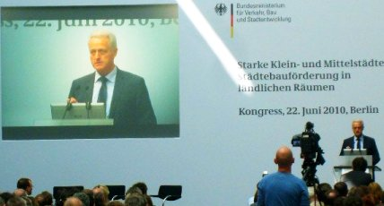
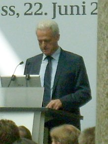
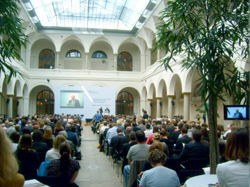

[🠔 Zur Übersicht: Wirtschaftlichkeit](5wiber.md)  
# Die Wirtschaftlichkeitsberechnung als Planungsgrundlage der Altbausanierung 13
**Konrad Fischer Die Wirtschaftlichkeitsberechnung als Planungsgrundlage der Altbausanierung 13**  
_von Konrad Fischer • aktualisiert 22.06.2010_

Konrad Fischer 

## Zwei heiße Tips für die Kollegen zum Schluß:

1. Weist die überschlägige Kostenermittlung das angemessene **[Planungshonorar](10hoai.md)** für zu erwartende Grund- und Bes. Leistungen aus, kostet das Berechnungsaufwand und weckt die Bereitschaft der sonstigen Beteiligten, angesichts erkannter Finanzierungslücken unsinnigerweise am Planungshonorar zu sparen - mit allen zulässigen und unzulässigen Folgen. Unerfahrene Bauherren kennen leider nur eines: Saving the penny and losing the pound.

Ist das Vertrauen in die Standfestigkeit und Einsicht des Vertragspartners und die Einsicht und Fairness der beteiligten Förderinstitutionen nicht 150%, am Anfang lieber eine angemessene Summe der Gesamtbaukosten ohne weitere Aufschlüsselung vorlegen (interne Vorkalkulationen des Honorarvolumens empfehlenswert, weckt die Einsicht in das Problem der weiteren Vertragsverhandlung, erforderliche Besondere Leistungen z.B. für Bestandsaufnahme, Schutz des Bestands und mitverwendete Bausubstanz rechtzeitig berücksichtigen!).

Das kostet natürlich zunächst nicht das volle Vorplanungshonorar (wg. Honorardegression/evtl. HOAI-Novelle gerade günstig bei späterer Bauabschnittsbildung, dort kann "aufgeholt" werden), stärkt aber die Vertragsbindung bis zur -fortsetzung nach gelungener Finanzierung. Danach wirkt hoffentlich Tip 5 i.V.m. Gottes Hilfe. 

Sowieso kann wirtschaftliches Bauen nur gelingen, wenn die Planung verschärften Anforderungen genügt. Mit Honorarzone 0 Mindestsatz ist Bauen ohne sinnlose Kosten nicht zu haben. Altbausanierung unter vergleichbaren Neubaukosten setzt ausreichende Bestandsaufnahme, VOB-gerechte Ausschreibung und damit marktgerechte und nachtragsarme Baudurchführung voraus. Die heimliche Verwendung von Firmen-LV´s, unvollständige und mangelhafte Planung mit der Hoffnung, honorarmäßig sogar an den dadurch steigenden Baukosten noch zu profitieren, dies aber zu Mindestmindesthonorarsätzen, klappt inzwischen wohl nur noch bei den allerdümmsten Bauherren, ohne im Architektenprozeß zu enden...

2. Unbedingt erforderlich, um große Enttäuschungen rechtzeitig zu vermeiden: 

- Erst Vertragsabschluß, dann Leistung!

- Erst bezahlte Zwischenrechnung, dann Auslieferung der wesentlichen Arbeitsergebnisse!

VIEL GLÜCK!

Ein kleines Extrazuckerli (Bilder: Konrad Fischer): 

Kongress im Bundesministerium für Verkehr, Bau und Stadtentwicklung in Berlin 22.06.10 
Starke Klein- und Mittelstädte: Städtebauförderung in ländlichen Räumen 

Der Bundesbauminister rief und viele, viele kamen. Vor allem kommunales Zubehör, städtebauförderungserfahrene Planer, und die schönen Sanierungsträger, ohne deren kräftiges Abgreifen der Fördermittel ja die Städtebauförderung (SBF) hierzulande kaum vorstellbar erscheint. Man wollte ja wissen, was sich nun tut, nach der Verkündigung des Bauministers, ca. 50 Prozent der Städtebaufördermittel des Bundes dank Griechenland usw. ersatzlos zu streichen. Prima, so macht Sparen Spaß. Und jeder weiß, wie sich das auswirken wird auf die kommunalen Befindlichkeiten landauf und -ab. Unendlich viel Baukorruption inklusive. Am 7. Juli kam es zum Kabinettsbeschluß betr. Entwurf des Bundeshausshalts 2011 und Finanzplan bis 2014. Als Schuldenbremse wurden u.a. die Mittel des Bundeszuschusses zur KfW-Förderung von 1,35 Milliarden Euro auf 450 Millionen Euro eingedampft werden, und die Städtebauförderung (2009: 569 Millionen Euro, 2010: 535 Millionen Euro) auf 305 Mio Euro für 2011 zusammengeschnurrt / gekürzt / zusammengezwickt. Typisch für die Vertrauenswürdigkeit unserer Staatslenker, hieß es doch im Koalitionsvertrag 2009 noch so schön begeisternd: _"Die Städtebauförderung leistet einen unverzichtbaren Beitrag zur lebenswerten Gestaltung von Städten und Gemeinden. Wir werden die Städtebauförderung als gemeinschaftliche Aufgabe von Bund, Ländern und Kommunen auf bisherigem Niveau, aber flexibler fortführen."_ Da werden die üblichen "Vergünstigungen" unter so manchen Beteiligten der SBF-Abwicklung aber erst mal auf kleiner Flamme weiterzukochen sein, gell. Oder jetzt - angesichts der Mittelauszehrung - erst recht? Nowbody knows, und alles hängt ja noch von der im Herbst erwarteten endgültigen Spar-Entscheidung des Bundesparlaments ab - Lobbyisten, jetzt aber hurtig! 

Und auch die Planungs- und Managementressourcen zittern und zagen - müssen sie jetzt auch zur Hälfte schrumpfen? Wie schön, daß da dieser Kongreß stattfand, um ein gaaanz neues Projekt in die Welt zu posaunen: Die ländlichen Städtlein und Kommunen sollen sich künftig um die verknappsten Mittel mittels Kooperationsprojekte bewerben (das Schlottern und Knieklappern der Teilnehmerschar hätten Sie hören und sehen sollen!). [Nachtrag 15.11.2010: Nach dem ritualisierten Gejammer der üblichen Verdächtigen hat sich der Haushaltsausschuß eines anderen besonnen: Die Kürzung erfolgt dann doch "nur" auf 455 Millionen]: 

Wo eh nix mehr ist, sollen folglich nur noch größere Einheiten bedient werden. Das erhöht die Fördereffizienz. Und so kürzt man einerseits um hunderte Millionen, um dann ein zweistelliges neues Förderprogramm stolz hinauszuposaunen. Daß anderswo - will sagen im Klimakampf gegen den CO2-Popanz rund um Elektromobilität und sonstige staatlich-lobbymäßig induzierte Ökoschmarotzerei - die Klimaschwindel-Millionen umso kräftiger weitersprudeln, wollte erst mal niemand laut sagen. Das passiert dann hinter verdruckst vorgehaltener Hand. 

Natürlich bin auch ich da hingefahren, nicht um zu sehen und gesehen zu werden (wer kennt mich schon in diesen Kreisen?), sondern um meine Homepage mit möglichst authentischem Material aus direkter Quelle anzureichern. Was tut man nicht alles für seine Leser?! Und so haben Sie nun das Vergnügen (?), die Statements aus der Szene in einer arg gekürzten stichpunktartigen Zusammenfassung des Eintagesseminars beim Bauminister hier zu lesen. Frech gewürzt mit kleinen Sottisen des Berichterstatters in den [KF: Klammern]. Das kann ich Ihnen nicht ersparen. Im "Zitat" die wortwörtliche Mitschrift der Verlautbarungen der Vortragenden. Ansonsten sinngemäß eingedampft. 

Jetzt geht's los: 

1. Dr. Peter Ramsauer, CSU-Bundesminister für Verkehr, Bau und Stadtentwicklung, "Perspektiven der Städtebauförderung in ländlichen Räumen": 18 Millionen für neues Städtebauförderprogramm "Kleinere Städte und Gemeinden - Überörtliche Zusammenarbeit und Netzwerke" bereitgestellt, da diese bisher von der Städtebauförderung und besonders im Westen - wo überhaupt nur 28 Prozent der Städte und Gemeinden gefördert wurden, gegenüber 86 Prozent in den "Neuen Ländern"! - nahezu total vernachlässigt wurden [KF, Wessidörfler: Ach wie toll, toll, toll!!!] - hier zur detaillierten Analyse des Bundesinstituts für Bau- Stadt und Raumforschung: ['Die Städtebauförderungsdatenbank des BBSR, Programmstruktur und Fördermitteleinsatzseit der Deutschen Einheit'](http://d-nb.info/100011192X/34). Andererseits sind einschneidende Sparmaßnahmen bei allen Städtebauförderungsprogrammen bzw. Bauzuschußprogrammen (Soziale Stadt, Stadtumbau West und Stadtumbau Ost, Sanierung und Entwicklung West und Sanierung und Entwicklung Ost, Zentrenprogramm, Städtebaulicher Denkmalschutz sowie Energetische Gebäudesanierung, CO2-Gebäudesanierungsprogramm) im Zusammenhang mit dem Sparpaket der Bundesregierung unausweichlich. EU-Mittel müssen in ländlichen Räumen verstärkt beansprucht werden [KF: Aha, das ist die Lösung in Zeiten der Perspektivlosigkeit! Merkwürdig, daß wir da nicht selbst draufgekommen sind, wo es doch immer so einfach ist, die wunderlichsten Förderprogramme mit ihren Ausschlußklauseln und sich widersprechenden Förderzielen unter einen Hut zu bringen! Und schlauerweise hat man dafür ja gleich den Förderboss Dr. Schweizer vom Bauernministerium mit aufs Podium eingeladen, s.u.. Der weiß ja, wie das geht. Und dem kann man vielleicht was aus seinem prallen Beutel (Dorferneuerung / Dorferneuerungsprogramm, Ziel-5b-Mittel, EU-Strukturfonds, Zuschüsse der sogenannten Gemeinschaftsaufgabe "Verbesserung der Agrarstruktur" / "Dorferneuerung" / GA-Mittel) abzwacken, ob er den feisten Schweinebraten gerochen hat??? Wobei angesichts des [Energiesparschwindels mit unwirksamer / unwirtschaftlicher Gebäudedämmung](7fehrtab.md) und der [steuergeldinduzierten Ökoabzocke](7temp23.md) eine Totaleinstampfung der sog. "Energetischen Gebäudesanierung" uneingeschränkt zu begrüßen wäre. Doch das wäre ja vernünftig und ist genau deswegen vielleicht nicht von unserer Regierung zu erwarten.]. 

2. Günter Kozlowski, Staatssekretär im Ministerium für Bauen und Verkehr des Landes Nordrhein-Westfalen: "Die Sicht der Länder" (Wörtliche Übernahme des Beitrags seines verhinderten Vorgesetzten, Bauminister NRW Lutz Lienenkämper): Gleichwertige - nicht identische - Lebensverhältnisse an jedem Ort ist Leitbild. Abwanderung stoppen als Aufgabe auch der SBF [KF: Aha]. 

3. Dr. Hans-Peter Gatzweiler, Bundesinstitut für Bau-, Stadt- und Raumforschung im Bundesamt für Bauwesen und Raumordnung, "Städtebauliche Herausforderungen in ländlichen Räumen": 1/3 aller Kommunen (Städte und Gemeinden) schrumpfen. Demographischer Wandel. Besondere Probleme für überalternde - etwa 50 Prozent aller ländlichen - Kleinstädte und Gemeinden. Sie haben weniger Infrastruktur in jeder Hinsicht (Versorgung, Dienstleistungen, ...) als wachsende Kommunen. Notwendigkeit interkommunaler Kooperationen. Bündelung der Fördermöglichkeiten verbessern, - das "Gebot der Stunde", "politische Bringschuld von Bund und Ländern"[KF: Wer hätte das gedacht?!]. 

4. Dr. Sonja Beeck, IBA-Büro GbR, Sachsen-Anhalt (S-A), "Stärken von Klein- und Mittelstädten: Eindrücke von der Internationalen Bauausstellung Stadtumbau Sachsen-Anhalt 2010": Städte sind Kernfunktionen nach allerlei Gesichtspunkten. Allerlei IBA-Beispiele städtebaulicher Projekte. Aschersleben: Drive-through-Galerie mit dollen Kunschtwärgen verdecken häßliche Abbruchlücken und städtebauliche Mißstände [KF: Potemkinsches Dorfprojekt anno dunnemals ein Dreck dagegen?]. Dessau: Allerlei Landschaftsgärtnerei [KF: Vegetationsinseln, verunkrautete Dschungelei, was sagen da die Bürger?!] zwischen Problemquartieren und auf Abbruchquartieren (KF: Natur erobert Baugrundstücke zurück). Freiflächenclaims für Bürger zum Grillen [KF: Ossi-Schrebergarten 2.0?]. "Wenn Nutzung fehlt, muß über Inhalte nachgedacht werden". Bernburg: Drei Schulen geschlossen, eine neu gebaut. Einbeziehung verschiedener Träger in Bildungsinstitutionen. Das ist Bildungsoffensive. Wittenberg: Campus Wittenberg e.V. gegen Phantomschmerz Uniabwanderung im 19. Jh. Aus Ruine Franziskanerkloster Seminarzentrum. Stadtverwaltung / Archbüro / Kirchengemeinde / IBA-Büro / Stiftung Luthergedenkstätten SA/ ... als Partner in IBA-Projekt.Wittenberg: Dreiklassenordnung für Altbaubestand: Abstufung von unbedingter Erhaltung - bis möglichem Abbruch. Implantatarchitektur auf Abbruchgrundstücken als "intelligentes Konzept" [KF: Fremdkörperei nach alter Bauhäusler Sitte. Möglichst krasse Plombe!]. Aschersleben: Kunstprojekte an Problembuden, die weiter dumm rumstehen. Bürgerbeteiligung. Quedlinburg: Bürger sanieren Altsubstanz [KF: Oho!]. 

5. Gute Beispiele der Städtebauförderung in Klein- und Mittelstädten im Interview mit Katja Baumann und Martin Karsten, Kongressbüro FORUM Huebner, Karsten & Partner, Oldenburg: 

- Oberbürgermeister Dr. Bernhard Matheis aus der Schuhstadt Pirmasens, Die Revitalisierung von Industriebrachen und militärischen Liegenschaften: Monostrukturierte Region durch Auslandsverlagerung der Schuhproduktion stark geschädigt. Schlimm auch der Abzug der US-Streitkräfte. [KF: Ja, unseren Besatzungstruppen darf man freilich viele Tränen nachweinen.] Und jetzt: Revitalisierungskonzept sucht Antworten. 

- Bürgermeister Franz Stahl, Tirschenreuth, Die Innenstadtentwicklung einer industriell geprägten Kleinstadt: Städtebauliches Entwicklungskonzept. Jugendlichenbefragung nach Zukunftsvorstellung. Marktplatzsanierung als Kern der Stadtsanierung. Bahnhofsareal war teils Brachfläche, wurde von Stadt gekauft und entwickelt. Neubauten verschiedener Verwaltungsgebäude sollen Areal neu beleben. Gartenschau als Entwicklungsimpuls in Randgebiet. Alte Brauerei Abbruch [KF: Wie toll, woanders - aber nicht in der materiall und geistig so stark ausgebluteten Oberpfalz? - hätte man vielleicht was draus gemacht, wenn man schon ein so [schmuckes Industriedenkmal - das ehemalige Kommunbrauhaus](http://www.zoigl.de/Ehemalige_Brauorte/tirschenreuth.html) - gehabt hätte!]. Investor baut nun Hotel [KF: Wieviele Insolvenzen wird es wohl brauchen, bis es auf kleiner Flamme wirtschaftlich läuft?]. Gartenschau lockt Privatinvestoren an. Städtische Initiativen werden durch regionale Verwaltung (Bezirksregierung) gebremst und blockiert. Bürokratieproblem. Der Bayer Ramsauer soll helfen. Applaus. 

- Baubürgermeister Christian Kuhlmann aus Biberach, Die Sanierung des mittelaletrlichen Stadtkerns: Zufälle brachten in Nachkriegszeit sich gut entwickelnde Unternehmen, vorher verschlafenes Nest. Intakte Altstadt ist großer Schatz. Die gut erhaltene Altstadt ist so schön, schön, schön! Besuchen !! Ortsansässige Firmen haben Eigner und Geschäftsführer, die große Bindung an Stadt haben. Abbruchlastiges 70er-Jahre-Programm "Autogerechte Stadt" gottseidank nicht verwirklicht. 50 Prozent der Altstadt stehen unter Denkmalschutz, und das ist auch gut so. Stadt muß darauf angemessen und positiv reagieren und Ressourcen bereitstellen. Zieljustierung der städtebaulichen Entwicklung in kurzen Zeiträumen, Nachjustierung! Bürgerbeteiligung kein Allheilmittel, muß richtig gesteuert werden und angemessen in Wettbewerbsprozesse für Neugestaltung öffentlicher Räume integriert werden. Stadtbildanalyse landet in Gestaltungssatzung als Regelung der Neuentwicklung, nicht als Konservierungsvorschrift. Beispiel C&A-Kaufhaus, moderner Baustil mit historisch verbürgten Elementen in bauhäuslerisch verschlichteter Neuinterpretation. Bürgermeister macht Stadtführung für Bürger, bei der er auf historische Architekturdetails hinweist. Problem: Förderschwankungen. Applaus. 

- Bürgemeister Werner Suchner aus Calau, Brandenburg, Die Entwicklung eines zentralen Schulstandortes: Früher Calauer Stiefelproduktion, dann nach dem Krieg vorwiegend Braunkohlestandort. Nach Grubenschließung starker Bevölkerungsrückgang. Jetzt Entwicklung als zentraler Schulstandort mit SBF. Sanierung der Schulgebäude mit verschiedenen Förderprogrammen. [KF: Aha.] Bündelung der Förderprogramm ein bürokratisches Problem. 

Gotthard Troll, Bürgermeister der Stadt Lößnitz und Vorsitzender des Städtebundes Silberberg, Der Städtebund aus fünft Städten und einer Gemeinde: Bis Wende Schuhindustrie, Zusammenbruch nach Wende Rückbau / Abbruch der angeschwollenen, dann leeren Plattenbauten teils erforderlich. Gründung Städtebund. Gemeinsamer Flächennutzungsplan. Gemeinsames Sportstättenkonzept. [KF: Originell!?] 

- Bürgermeister Alexander Heppe aus Eschwege, Hessen, Die Stadt-Umland-Kooperation "Mittleres Werratal" im ländlichen Raum: Koop aus acht Kommunen - Kreisstadt und sieben umliegende Gemeinden. Koop begünstigt aus gemeinsamer Arbeit im Tourismus. Regionale Arbeitskreise. Lenkungsgruppe. Gemeinsame Handlungsschwerpunkte in Region: Verwaltungszusammenarbeit, Wohnungsmarktanpassung. Gewerbeflächenangebot. Tourismus. Lebensmittelgrundversorgung. Beseitigung Geschäftsleerstand in zentralen Lagen. Stadtumbau West als Hauptförderszenario SBF. Auch "Soziale Stadt". Impulsprojekt / Beispielprojekt Altes E-Werk als Veranstaltungsbau [KF: Vgl. hingegen Brauereiabbruch in Tirschenreuth!]. Modellhaus "Musterhaus Wohnen": Altbausanierung Wanfried. Sanierung eines vergammelten Fachwerkhauses, um Bürgern vorzuführen, was da so geht. Wohnen soll aber niemand drin. [KF: Idealfall konservierender Denkmalpflege? Krass!] In Eschwege Altbausanierung Modellhaus "Energiehaus Wohnen". Hier soll ein Fachwerkhaus vorführen, wie es das Klima rettet. [KF: Maximierung von Energiesparblödsinn durch Ökoschmarotzerei?] Sanierungsprojekte, die Pilotfunktionen entwickeln sollen. Kritik an SBF-Programm: Mangelhafte Flexibilität. Fehlende Planungssicherheit mangels klarer / einheitlicher Förderstrategie in verschiedenen Landesteilen. 

6. Aufgaben der Städtebauförderung in ländlichen Räumen und das neu Programm "Kleinere Städte und Gemeinden" Podiumsgespräch - Gesamtmoderation: Martin Karsten, Forum, Oldenburg: 

Bernd Düsterwieck, Deutscher Städte- und Gemeindebund: Aktuelle Kürzung SBF um 50 Prozent aus kommunaler Sicht eine Katastrophe. Schlag ins Kontor. 1 EUR generiert bis zu 8 EUR als Konjunkturprogramm im besten Sinne. SBF müßte auf hohem Niveau konsolidiert werden. Heftiger Widerstand der Bundesländer gegen Kürzung ist zu erwarten. Kommunen stehen mit Rücken an der Wand. Frage: Können denn Projekte aus dem neuen Programm überhaupt umgesetzt werden? Wie geht es dann Flächengemeinden, können diese gefördert, auch wenn sie nicht "kooperieren"? Private Anteile sollten verstärkt in kommunalen Anteil einfließen. Viele Optimierungen erforderlich, auch und gerade bei den bestehenden Programmbestandteilen. 

Teilnehmerfragen: Wie sollen bei Mittelkürzung die Mittel aus neuem Programm verteilt werden, wird auch dieses bald halbiert? Wie kommt man ins Programm? Gibt es kritische Masse der beteiligten Kommunen? Ist auch Rückbau möglich? Wie gibt es Effizienzgewinn in neuem Programm? 

Antwort Referatsleiter Dr. Jochen Lang, Bundesministerium für Verkehr, Bau und Stadtentwicklung: Kürzung angesichts Finanzkrise leider, leider unvermeidbar. Neuverteilung wird in Gesprächsrunden festgelegt. Optimierung der SBF muß überlegt werden. Neuprogramm soll nicht betroffen werden. Auch in Flächengemeinden kann überörtliche Koop im eigenen Gemeindebereich gefördert werden. Entwicklungskonzepte müssen überörtlich erstellt werden, dann förderfähig, auch schon Planung. Auch das Management der Kooperation interkommunales Netzwerk. Keine Größengrenze, vorzugsweise kleinere Kommunen. Leitfaden als Strategiedokument wird erarbeitet, um Programmziele in Klärungsprozess mit Ländern einzubringen. Neues Programm ist Teil der Effizienzförderung der SBF. Höherer Ertrag der SBF wird erwartet. Programm ist keine Investitionsoffensive. Ziel: Entwicklung von überörtlicher Kooperationen. Vorrangig wird künftig gefördert, wer kooperiert. Benelux-Effekt. Strategische Koordinierung auf Bundesebene sinnvoll. Beamten sind gefragt, um Programme ausreichend flexibel auszulegen. Bündelung geht von Kommune aus, auf Bundesebene in interministeriellen Arbeitsgruppen hilfreich unterstützen. 

Karl Jasper, Vorsitzender der Fachkommission Städtebau und Ministerium für Bauen und Verkehr des Landes Nordrhein-Westfalen: Evtl. werden nur noch Programme aus alten Verpflichtungen abgearbeitet, was schlecht wäre. In Anbetracht der dramatischen Kürzungen wohl eine Neuprojekte mehr oder nur noch sehr wenige? Keine Einzelmaßnahmen, nur Koop-Projekte. Eventuell Auswirkung auf vernachlässigte ländliche Gebiete, die als ländlicher Raum aus SBF herausgefallen sind. (Widerspruch Dr. Schweizer). Länderspezifische Abstimmung der Programminhalte. Förderschwerpunkte NRW in Kooperationsschwerpunkte (vgl. Werratal), auch in Entwicklung als Kulturregion. SBF als Impuls für Kommunen, aufeinander zuzugehen. Sachverstand vor Ort / Beratung ist ganz entscheidend. Auch Grundlevel kommunaler Beteiligung mindestens 10 Prozent muß bestehen bleiben, dürfen nicht privat ersetzt werden, auch Vorschuß der Gemeinde-Kofinanzierung durch Landesmittel (Finanzausgleich) nur wie bisher ausnahmsweise, sonst würden SBF-Mittel "ubiquitär" einsetzbar, was ja aus Grundsatzerwägungen unbedingt zu verhindern ist. [KF: Und warum wohl? Wer hat diese Grundsatzerwägung auf alleinige Kosten der finanzschwachen Kommunen wohl ersonnen, und warum? Na, hapert's?] 

Dr. habil. Dieter Schweizer, Bundesministerium für Ernährung, Landwirtschaft und Verbraucherschutz: Dorferneuerung und Dorfentwicklung als Strukturhilfe für ländlichen Raum, der sich schon lange weg von der Agrarnutzung wegentwickelt (Höfesterben). Auch hier Anschubwirkung 1 EUR Dorferneuerung löst 6-8 EUR sonstige Investitionen aus. Milliardenschwere Gesamtförderung für ländlichen Raum, wenn man alle Förderungen betrachtet. Koop als Genossenschaft schon immer Praxis im ländlichen Raum. Kommunale Koop selbstverständlich wichtig. Viele wesentliche Entwicklungsimpulse gehen von Land, nicht nur von Stadt aus. 30 bis 50 Prozent Eigenmittel sind beste Effizienzgarantie. An Kofinanzierung soll nicht geschraubt werden. GA-Mittel sind auch knapp. Jedoch immer neue Ansätze fördern, gerade auch um Effizienzsteigerung zu optimieren. Vorsicht bei enger Programmatik (Scheineboom!). Innovationen fördern! Förderprogrammatik darf Realismus vor Ort / Vielfalt nicht im Weg stehen. Flexible Programmatik. Nahtlose Ausstrahlung der neuen SBF in den ländlichen Raum ist anzustreben. 

7. Oda Scheidelhuber, Abteilungsleiterin im Bundesministerium für Verkehr, Bau und Stadtentwicklung, Ausblick: Wir haben ihre Forderungen und ihre Kritik gehört. Wir haben gute Beispiele gesehen. Interkommunale Zusammenarbeit im ländlichen Raum wird geschehen, auch notgedrungen. Bisher zu Unrecht vernachlässigt. Das wird sich - auch dank Bauminister Ramsauer ändern, dem diente dieser Kongreß. Wir sind kein Metropolenministerium, auch wenn es so erscheint. Neues Programm als neuer Schwerpunkt zur Bewältigung Strukturwandel des ländlichen Raums. Anfang Juli mit Ländern und kommunalen Spitzenverbände Abstimmung der Folgen der Kürzungen. Neues Programm soll eher gesteigert werden. Neue Verwaltungsvereinbarung wird erheblich flexibler als bisher ausgestaltet werden. Mindestanforderungen an das überörtliche integrierte Entwicklungskonzept wird demnächst festgelegt, Flexibilisierung dann auf Landesebene und vor Ort. Problem kommunaler Eigenanteil ist sehr gut bekannt, Mindestanteil muß bleiben. Absenken und Privatmittelersatz des Kommunalanteils nicht immer möglich. Stiftungen und Privatmittel können dennoch hier und da - vielleicht auch verstärkt - in SBF integriert werden. Vorfinanzierung des Eigenanteils durch Land auch demnächst besser möglich. Schrumpfen, aber besser werden. Angemessene Grundversorgung muß auch in ausgedünnten Landregionen gegeben bleiben. Bessere Öffentlichkeitsarbeit notwendig. Wettbewerb "Menschen und Erfolge". Ehrenamtleistungen ins Rampenlicht. Vorbildwirkung für Metropolen. Mehr Demut der Behörden erforderlich. Viele Beispiele für immenses Privatengagement im ländlichen Raum. "Tue Gutes und rede darüber!" [KF: Ja, das ist die Lösung! Wenn schon die Bundesmittel abschmelzen, worauf das allgemeine Wehgeschrei der üblichen Verdächtigen durch die Lande tönt, will man unbedingt verhindern, daß durch private Drittmittelfinanzierung endlich der Flaschenhals in der Kommunalfinanzierung / Kofinanzierung der finanzschwachen Gemeinde beseitigt wird. Bravo! So bleibt dieser Königsweg weiterhin der besonderen Raffinesse der lokal beteiligten Profis vorbehalten. Und das ist auch gut so, gelle!] 

Die offizielle [Kongressdokumentation "Starke Klein- und Mittelstädte"](http://www.bmvbs.de/cae/servlet/contentblob/58914/publicationFile/29938/starke-klein-und-mittelstaedte-kongressdokumentation.pdf) (PDF) 

Und dann geht alles seinen gewohnten Weg. Die Kürzung wird zunächst etwas zurückgeschraubt, aber in der nächsten Haushaltsrunde weiter verschärft. Gejammer, Geheule und Gebärme durchzieht die Kommunen. Beispiel Redwitz an der Rodach: Am 2. April 2011 überschreibt die Neue Presse Coburg den Bericht über eine entsetzensbedingte außerordentliche Gemeinderatssitzung mit "Redwitz ist geschockt" und berichtet weiter: 

_"Die Zukunft sieht düster aus. Drastische Kürzungen beim Programm "Soziale Stadt" lassen die Visionen von Veränderungen schwinden. ... Die Gemeinde ... hat ihre Hausaufgaben im Städtebauförderprogramm ordentlich gemacht und alle Bedingungen erfüllt. Doch scheint vieles umsonst geween zu sein. Es stehen jetzt keine Mittel zur Verfügung und damit auch keine Aussicht auf Förderung. Mit diser Tatsache wurde Bürgermeister Christian Mrosek bei einem Besuch bei der Regierung von Oberfranken konfrontiert. "Die Mittel im Programm Soziale Stadt wurden um 70 Prozent gekürzt", gab er die Informationen der Regierung ... weiter. ... Abfinanziert werden nur bereits begonnene Maßnahmen." Im Städtebauförderprogramm ist Redwitz dabei, aber erst ab 2013 könnte man wieder mit Mitteln rechnen. ... Die Nachricht über das Aus der Fördermittel war wie ein K.O. in der ersten Runde. ... Die Mittel für die Soziale Stadt wurden in ganz Bayern von 13 Millionen Euro auf vier Millionen Euro gekürzt. Da bleibt für die einzelnen Gemeinden nicht viel. ..."_ 

Ja Freunde der Altstadt und der Städtebauförderung, das ist doch logisch, daß irgendwo ganz dolle geknappst werden muß, wenn Deutschland sein Steuergeld in Kriege steckt und grüne Subventionen und das auskömmliche Dotieren all der feisten Beamten im täglich weiter aufgeblähten Wasserkopf und all der nur Kommissariatsbefehle abnickenden Polithanseln in all den nur der Scheindemokratie und Scheinlegalität dienenden Heuchel-Parlamenten sonstwo. Ach so, und all der Rettungsschirme für Kreditzocker und EU-Schuldenregimes allerorten. Und die verdeckte Kriegsfinanzierung und Ausrottungspolitik gegen Palästinenser und andere Araber und Perser und sonstige Muselmänner. Soll ich endlich aufhören damit, tuts schon ordentlich weh und zwickt an den Weichteilen? Denkt mal weiter nach darüber! Dann wißt ihr, wo der Schuh wirklich drückt, den man mal in die Eckelrunde werfen sollte. Und es ist bestimmt nicht die Städtebauförderung! 

Es geht tatsächlich noch weiter: [Kapitel 14 - Das Letzte!](5wiber14.md)
