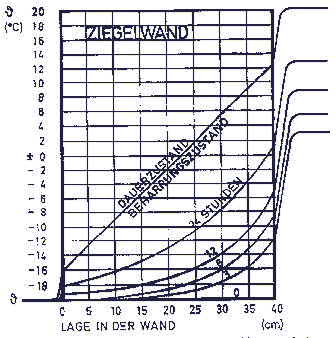
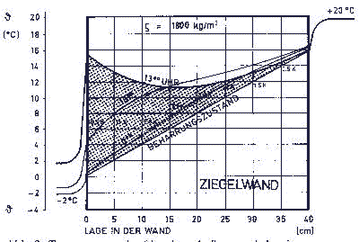

[🠔 Zur Übersicht: Dämmung Ratgeber 1](6prwsch.md)  
# DBV Praxis Ratgeber zur Denkmalpflege: Altbau und Wärmeschutz - 13 Fragen und Antworten [2]
**Informationsschriften der Deutschen Burgenvereinigung e.V. BEIRAT FÜR DENKMALERHALTUNG**  
_von Claus Meier • aktualisiert 19.12.2005_

Claus Meier 

## DBV Praxis Ratgeber zur Denkmalpflege

## Altbau und Wärmeschutz - 13 Fragen und Antworten [2]

### Informationsschriften der [Deutschen Burgenvereinigung e.V.](http://www.deutsche-burgen.org) 

BEIRAT FÜR DENKMALERHALTUNG

Text leicht aktualisiert 19.12.2005 durch Redaktion K. Fischer 

**3. Ist das Berechnungsverfahren gem. WSVO / EnEV für massive Altbauten zutreffend?**

Die Berechnungen in der WSVO/EnEV für den k(aktuell: U)-Wert nach DIN 4108 sind stationäre Berechnungen und gelten für den Beharrungszustand, der nur im Labor existiert. Sie treffen deshalb für Altbauten mit massiver und speicherfähiger Bausubstanz nicht zu. Dort herrschen instationäre, also veränderliche Verhältnisse. Dabei verbessert die absorbierte Solarstrahlung das thermische Verhalten der Außenwand. In [2] wird gesagt: "Beim Anheizen oder Auskühlen von Räumen oder bei direkter Sonnenzustrahlung liegen instationäre Verhältnisse vor, so daß diese durch die ... k(U)-Werte nicht erfaßt werden".

Wie sehen nun die Temperaturkurven bei instationärer Betrachtung aus ? 

 
Abb.1: _Beim Anheizen eines Raumes stellt sich der Beharrungszustand (stationärer Zustand) erst langsam ein - nach weit über 24 Stunden [1]. Das heißt: Bei gut speicherfähigem Material des Bauwerks gibt es im 24-Stunden-Rhythmus einer Tag / Nacht-Periode keinen Beharrungszustand. Schon allein deswegen ist die k(U)-Wert-Berechnung nach DIN 4108 praktisch sinnlos._

Durch die absorbierte Solarstrahlung ergeben sich gegenüber dem Beharrungszustand instationäre (veränderliche) Verhältnisse; dies zeigt die Abb. 2. 

Abb.2: _In einem Manuskript, das allerdings die Energiegewinne durch Speicherung negiert [3], wird eine 13 Uhr - Temperaturkurve bei winterlichen Außentemperaturen von -2 bis +2 Grad Celsius gezeigt. Damit wird gegenüber dem Beharrungszustand ein eingespeichertes "Energiepolster" von rund 980 Wh/m² erzielt, das zusätzlich von außen kostenlos zur Verfügung steht. Der "stationäre Wärmestrom" führt in 24 Stunden bei dem hier vorhandenen k(U)-Wert von 1,51 W/m²K und einer Temperaturdifferenz von 22 K zu einem Wärmeverlust von knapp 800 Wh/m². Das ergibt also einen Energiegewinn von ca.180 Wh/m² aus der Sonnenenergie - im Winter!_

Was hier exemplarisch gezeigt wird, gilt immer. Bei massiven, speicherfähigen Baustoffen liegt kein Beharrungszustand vor. Bei Altbauten ist die gängige k(U)-Wert-Berechnung nach DIN 4108 nicht anwendbar.

---

Hier weiter: [Seite 3](6prwsch3.md)
