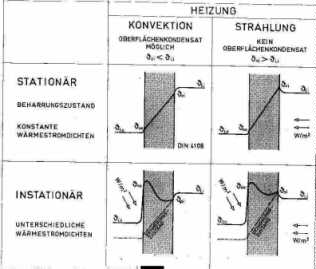

[🠔 Zur Übersicht: Dämmung Ratgeber 1](6prwsch.md)  
# DBV Praxis Ratgeber zur Denkmalpflege: Altbau und Wärmeschutz – 13 Fragen und Antworten [5]
**Teil 5 der Fragen und Antworten zum Altbau und Wärmeschutz, der die Vor- und Nachteile von Luft- und Strahlungsheizungen behandelt.**  
_von Claus Meier • aktualisiert 19.12.2005_

Claus Meier 

## DBV Praxis Ratgeber zur Denkmalpflege

## Altbau und Wärmeschutz - 13 Fragen und Antworten [5]

### Informationsschriften der [Deutschen Burgenvereinigung e.V.](http://www.deutsche-burgen.org) 

BEIRAT FÜR DENKMALERHALTUNG

Text leicht aktualisiert 19.12.2005 durch Redaktion K. Fischer 

**7. Luftheizung oder Strahlungsheizung?**

Das Natürlichste ist eine Strahlungsheizung: Sie funktioniert als Solarstrahlung schon seit ewig, der Mensch hat sich konstitutionell darauf eingestellt. Dabei erwärmt Strahlung keine Luft, sondern nur Materie - z.B. die Innenoberflächen eines Raumes. Bei einer Strahlungsheizung profitiert also die Luft erst aus "Zweithand", indem die Wand durch Wärmeübergang nur die berührenden Luftschichten erwärmt. Auch stationär und instationär ist zu unterscheiden; dies zeigt alles die Abbildung 4: 

Abb.4: _Nur bei einer Konvektionsheizung sind Feuchteschäden und damit Schimmelpilzbildung durch Kondensat möglich (s.a. Frage 10), da die Temperatur der Wand immer niedriger als die der Raumluft ist (linke Seite). Dagegen schließt eine Strahlungsheizung Kondensatbildung innen an den Wandoberflächen aus, da ihre Temperatur immer höher als die der Luft ist (rechte Seite). Auch der grundsätzliche Unterschied der Temperaturkurven im Bauteil zwischen falscher stationärer Betrachtung mit konstanten Wärmeströmen (geradlinig) und richtiger instationärer Betrachtung mit in Größe und Richtung unterschiedlichen Wärmeströmen (kurvenförmig) wird deutlich._

Von diesen vier möglichen empirischen Modellen zur Beschreibung der Wirklichkeit wird für die Berechnung von Energieströmen (u.a. in der WSVO) leider gerade das praxisfremdeste und für den Menschen physiologisch schädlichste der DIN 4108 gewählt: "Stationär mit Konvektion". 

Eine Strahlungsheizung erwärmt die Innenoberfläche des Raumes (z.B. durch [Hüllflächen-Temperierung](7temper.md) nach [10]). Das ist auch energetisch günstig: Die höhere Strahlungstemperatur der Wände ermöglicht eine niedrige Lufttemperatur. Da nach der Wärmeschutzverordnung (0,8 facher Luftwechsel) die „verbrauchte“ warme Innenraumluft innerhalb von 24 Stunden über 19 mal gegen kältere ausgetauscht wird, liefert die Strahlungsheizung einen großen energetischen Gewinn.

---

Hier weiter: [Seite 6](6prwsch6.md)
