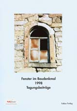

[🠔 Zur Übersicht: Startseite](index.md)  
# Linkliste zu Praxis-Ratgebern für Altbau und Denkmalpflege
**Spannende Informationen und Ratgeber rund ums Bauen und Sanieren von Altbauten und Baudenkmälern. Themen: Wirtschaftlichkeit, Finanzierung, Bauphysik, Wärmeschutz, Hausdämmung, Schimmelpilz, Fenster, Putz, Brandschutz, Mauer-Trockenlegung.**  
_von Konrad Fischer_

> [!abstract]+ Kapitelübersicht: Bauberatung  
> 1. **Linkliste zu Praxis-Ratgebern für Altbau und Denkmalpflege**
> 2. [Typische Bauberatungsanfragen und Antworten](bauberatung.md)
> 3. [Aus der Internet-Fragestunde: Einleitung](2frag.md)
> 4. [Denkmalpflege / Denkmalschutz / Restaurierung / Konservierung / Rekonstruktion / Sanierung - Kritik](6sv.md)
> 5. [Wirtschaftliches Instandsetzen von Altbauten und Baudenkmälern – Kauf, Finanzierung, Planung und Projektorganisation](6prwiins.md)
> 6. [Weitere Beratung und Information zu Denkmalpflege, Altbau usw. 1](8berat.md)

## Praxis-Ratgeber

zur Instandsetzung von Altbauten und Baudenkmälern

### Spannende Informationen rund ums Bauen und Sanieren - Online und als Druckversionen 
Themen: Wirtschaftlichkeit, Finanzierung, Bauphysik, Wärmeschutz, Hausdämmung, Schimmelpilzbefall, Fensterinstandsetzung, Fenstererneuerung, Fenstermodernisierung, Abbruch, Putzfassaden, Kalkmörtel, Brandschutz, Mauer-Trockenlegung

## Praxis-Ratgeber des Beirats für Restaurierung der [Deutschen Burgenvereinigung e.V.](http://www.deutsche-burgen.org) und anderer Institutionen

Bisher sind vom Autor dieser Seite folgende Praxis-Ratgeber erschienen: 

Holzfenster - 16 Argumente zur erhaltenden Instandsetzung 
Erhaltende Instandsetzung von historischen Putzfassaden - 12 Fragen und Antworten 
Wirtschaftliches Instandsetzen von Baudenkmälern - Finanzierung und Planung 

Bezug: Deutsche Burgenvereinigung e.V. DBV 
Marksburg 
56338 Braubach

**[E-mail DBV](mailto:dbv.marksburg@t-online.de)** 

Hier werden wir die zugehörigen Texte (z.T. ohne Abbildungen) veröffentlichen sowie die nächsten DBV-Praxisratgeber unserer Fachautoren in der Entwurfsfassung. Sie finden auch andere lesenswerte Ratgeber, die für diese Seite zur Verfügung gestellt wurden.

Praxis Ratgeber: K. Fischer, Die erhaltende Instandsetzung von historischen Putzfassaden 
[Volltext](6prputz.md)

Praxis Ratgeber: K. Fischer, Die wirtschaftliche Instandsetzung von Baudenkmälern - Finanzierung und Planung 
[Volltext aktualisierte Kurzversion 06/08](6prwiins.md) 
[Vortragsversion mit vielen Abbildungen](11erhins.md)

Praxis Ratgeber: S. Kabat, Brandschutz in historischen Bauten 
[Volltext](6kabat.md)

Praxis Ratgeber: C. Meier: Altbau und Wärmeschutz - 13 Fragen und Antworten (mit Grafiken) 
[Volltext](6prwsch.md)

Praxis Ratgeber: C. Meier: [Bauphysik des historischen Fensters - Notwendige Fragen und klare Antworten](http://www.deutsche-burgen.org/nr9.pdf) (PDF)

ARD Ratgeber Bauen & Wohnen - 8.5.04: **[Fensteraustausch](http://web.archive.org/web/20040622224645/http://www.wdr.de/tv/ardbauen/archiv/040508_3.phtml)** - Siehe hierzu Fachbuchreihe **["Fenster im Baudenkmal"](8buch06.md#leckerbissen)** mit Beiträgen von Konrad Fischer zur Erhaltungsproblematik, Bestandsaufnahme und Ausschreibung von Fensterreparaturen sowie Claus Meier zur kontroversen Fenster-Bauphysik 
 

 Sonstige Ratgeber rund ums Bauen und Finanzieren: 

IGB-Ratgeber: K. Schade, "Ratgeber" für abrißwillige Denkmalbesitzer (Mit Nachträgen: wie "Die Sprengung des Baudenkmals") 
[Volltext](8ks1.md) Konrad Fischer: [Ratgeber zur Baufinanzierung: Die Wirtschaftlichkeitsberechnung als Planungsgrundlage der Altbausanierung](5wiber.md) 

Konrad Fischer: [Ratgeber für Singles im Altbau ;-)](single.md) 

Konrad Fischer: [Schimmelpilz-Ratgeber](7schim.md) 

Konrad Fischer: [Dämmstoff-Ratgeber](213baust.md) 

Konrad Fischer: [Ratgeber zur richtigen Verarbeitung von Kalkprodukten - die häufigsten Fehler](2kalkfel.md) 

Konrad Fischer: [Ratgeber zu Feuchte im Altbau-Mauerwerk und Mauertrockenlegung](2aufstfe.md) 

Konrad Fischer: [Ratgeber zu Bauversicherungen - welche braucht der Bauherr und Hausbesitzer wirklich?](versicherung.md) 

Konrad Fischer: [Low-cost Repair, Rehabilitation, Improvement, Restoration + Refurbishing of your old House](repair.md) 

****TIPP:**[The Secretary of the Interior's Standards for Rehabilitation & Illustrated Guidelines for Rehabilitating Historic Buildings](http://www2.cr.nps.gov/tps/tax/rhb/)** - A perfect Guide for maintaining the construction of all old buildings (The U.S. National Parc Service)
