[🠔 Zur Übersicht: Bauberatung](6prxratg.md)  
# Denkmalpflege / Denkmalschutz / Restaurierung / Konservierung / Rekonstruktion / Sanierung - Kritik
**Kritische Betrachtung von Denkmalpflege, Denkmalschutz, Restaurierung und Sanierung. Eine Auseinandersetzung mit der Praxis, Ideologie und den Folgen von Eingriffen am Baudenkmal.**  
_von Konrad Fischer_

### Vorträge, pointierte Kurzfassungen - Meinungen aus und zur musealen und Baudenkmalpflege - Schloßmuseum und Museumsschloß - 
und eine reiche Literaturauswahl für die Liebhaber von Burgen und Schlössern

**Vorträge zur Denkmalpflege in Thüringen und anderswo** 
Mitschriften von [Konrad Fischer](1refernz.md) 

Kleine Einleitung 

Restaurierung und Konservierung in der Denkmalpflege sind als Tarnbegriffe für Eingriffe am Baudenkmal entstanden und werden bis heute genauso verwendet. Sie spiegeln zwar oft die "Pflege" des Denkmals vor, befriedigen letztlich aber zeitgebundene Ideologie und zweckgebunden eben auch die unheimliche Lust des Handwerkers/Restaurators/Konservators/Denkmalpflegers/Architekten/Ingenieurs, auf Kosten anderer Taschen die Macht über das Denkmal und dessen Betrachter auszuüben und damit recht vergnüglich - "Denkmalpflege" befriedigt ja sehr gut die Statusbegierde des eitlen Menschen in unserer "aufgeklärten" Gesellschaft - sein Leben zu fristen. Also: "Denkmalpflege" macht Spaß, bringt's und ist prima, soweit sie von andereren bezahlt wird. Wenn es die eigene Tasche trifft, sieht das oft anders aus. Dann ist denkmalpflegerische Erhaltungssturheit immer dann ein Horror, wenn es der eigenen Selbstverwirklichung im Wege steht oder eben nur kostet und nix bringt. 

Denkmalsprache, -diktion und -praxis 

Wir Akademiker unter den "Denkmalschützern / Denkmalpflegern" gefallen uns im Unterschied zu den Handlanger-"Kollegen" meist in wissenschaftlich triefenden Latinismen, die aber alle meist leicht übersetzbar sind: Entweder "Zementpampe" oder "Plastikschwarte", von Firma müllermeierschulze.de oder huberundkrause.de. Restaurator/Konservator, Bauherrngeiz und ahnungslose Planer sind Werkzeug und Methode der menschlichen Hybris. Und besonders lustig wird's, wenn Halb-oder gar nur Viertelgebildete "Denkmalpfleger" zur Sprachwaffe greifen und geblähte Texte absondern. Nicht gerade selten. Und immer amüsant als Einblick in die fallstrickbewehrte Großmannssucht (Hybris). In der praktischenUmsetzung der als edel, hilfreich und gut so arg beschwätzten "Denkmalpflege" wird den Objekten der Begierde, eben den Baudenkmälern, ein unendlich Leid zugefügt. Am Ende regiert nämlich nicht Ethos und Moral, sondern Kassemachen bis zum Abwinken bzw. bis zur sogenannten "Volltränkung". 

Moderne Denkmalpflege heißt nämlich vor allem - und das schon seit sie es gibt und sie wollte ja immer mit durchaus heißem Bemühen trotz aller konservativistischen Beschwörungsformeln (Dehio 1905: "Konservieren, nicht Restaurieren") bis zum Erbrechen zeitgemäß bzw. modern und niemals antiquiert sein - Verschweinsung des Baudenkmals mit allen modernen Mitteln, die die chemische Industrie (immer parallel mit der "Denkmalpflege" groß geworden) zur Verfügung stellen kann. Während also im 19. Jahrhundert unsere Dome, Kathedralen und Burgfassaden mit Hilfe von bei der Kali-/Düngerproduktion nach Liebig freigesetzter Salzsäure von alten Fassungen denkmalpflegerseits in unbarmherzigster Manier "abgewaschen" und bis ins Innerste der Steinsubstanz mit bösartigsten Rückständen verseucht wurden, kamen nur wenig später bis heute auch alle anderen Chemieprodukte, heute als "Bauchemie-Produkte" in den Markt gepreßt, vom Wasserglas über die synthetischen Tränkungs-, Festigungs- und Beschichtungsmittel bis zu brutalsten Absäuerungs-, Verätzungs- und Lösemitteln an die "gepflegte" Bausubstanz. Natürlich auch alle Errungenschaften der Technik, sei es mechanisch oder elektrisch oder beides. Regeläßig mit zwei Folgen: Erstens volle Taschen beim Anwender (Handwerk / Baufirma / Restaurator) und den mit allerlei Schmiersalben und/oder pseudwowissenschaftlichem Marketinggesumse geneigt gemachten amtlichen (Denkmalamt, Bauamt, Kirchbauamt, Hochschule ...) und/oder nichtamtlichen (Bauberater/Planer/Institutsmitarbeiter) "Befürwortern" und zweitens von derlei Denkmalhanseln regelmäßig übersehene bzw. unerwartete bzw. wegen der Schmiersalbe billigend in Kauf genommene - zuallermeist irreversible - Zerstörung am Baudenkmal. 

Na mein lieber Leser, überrascht? Oder zwickt's gar, des schon fast vergessene / betäubte Gewissen? In beiden Fällen: Glückwunsch!

Zur Einstimmung

Neu und alt plastikbeschmierte Oberflächen (aus Latex, Dispersion, Silikat, Silikon- und Alkydharz) an Denkmalen in (quasi)staatlicher Obhut in Weimar (könnte freilich überall sein) als Beleg für Denkmalschutzbusiness as usual, Aufnahmen am 28.6.2005:

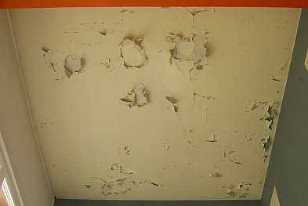. . . . . . . . . . . . . . . . . . . 
Ein Bravo der Produktberatung! Kalkfarbe und Leinölanstrich strengstens verboten?

[Hier Info zum Schmieraxeln an Denkmal- und Altbaufassaden.](22bausto.md) Plastikschwarte / Lotusfarbe / Silikonharzfarbe / Silikatfarbe und andere Chemieprodukte - Zu den beliebtesten Denkmalpfuschereien an Fassaden. 

Einige beherzte und pointierte Mitschriften von Seminaren/Kolloquien mögen das Thema Denkmalpflege aus anderer Sicht ausbreiten und verdeutlichen. Natürlich gilt nur das gesprochene, nicht das von mir gehörte und mitgeschriebene/zusammengefaßte/kommentierte Wort.

**Inhalt:**

Weimar Bauhaus-Universität Kolloquien der Fakultät Architektur, Lehrstuhl für Bauaufnahme und Baudenkmalpflege:

27.06.05, "E pur si muove!" - Denkmalpflege findet dennoch statt. 
10.10.03, "Außergewöhnliches in der Baudenkmalpflege und Bausanierung" - Gedankenaustausch über brisante Schadensfälle und ihre außergewöhnlichen Behebungen

Weimar, Residenzschloß 

19.10.01, Symposion der STIFTUNG THÜRINGER SCHLÖSSER UND GÄRTEN: "Restaurierung im Spannungsfeld wechselnder Auffassungen"

Bayreuth, Neues Schloß

02.04. – 04.04.2006: FACHARBEITSKREIS SCHLÖSSER UND GÄRTEN IN DEUTSCHLAND, Arbeitsgruppen "Bauangelegenheiten und Denkmalpflege", "Restaurierung": "Raumschale und Technik im Baudenkmal"

---

**Symposion der STIFTUNG THÜRINGER SCHLÖSSER UND GÄRTEN**

Restaurierung im Spannungsfeld wechselnder Auffassungen

Weimar, Residenzschloß, 19.10.2001 
Mitschrift als Kurzfassung und Fazits von Konrad Fischer, Mitglied des Beirats für Denkmalerhaltung der [Deutschen Burgenvereinigung e.V.](http://www.deutsche-burgen.org)

**1. Dr. Jürgen Aretz, Staatssekretär im Ministerium für Wissenschaft, Forschung und Kunst: Grußwort**

**2. Dr. Helmut-Eberhard Paulus, Direktor der Stiftung Thüringer Schlösser u. Gärten: Einführung**

Denkmal besteht aus „Materie“ und „Inhalt“. Restaurierung zielt auf Substanzerhaltung der „Materie“. Nur materielle Erhaltung/Betrachtung ist zynisch, letztlich geht es um Weitergabe des „Inhalts“, der Botschaft. Es gibt betreffend Inhalt „Orte der Faszination“ und „Steine des Anstoßes“, also gern gesehene und lästige Botschaften.

Der eigentliche Auftraggeber der Restaurierung: Die alles zerstörende Zeit.

Restaurator hat „Vermittlungsauftrag“. Gefahr des Mißbrauchs: von Propaganda bis Selbstverwirklichung.

Das Ideal des Restaurators im 19. Jh. „nunc stans“ - Stop des Verfalls - ist heute als Illusion erkannt. Statische Auffassung der Denkmalpflege (Dehio: Konservieren statt Restaurieren) ist überholt. Auch „Konservieren“ verändert. Zeitperspektive wandert immer in Restaurierungspraxis, aktuelle Rezeption ist immanent. Heute führt diese Erkenntnis zur Verunsicherung.

Zunehmender Drang zur Veränderung ergreift heute auch Denkmalpflege. Denkmalpflegerische Entscheidungen werden immer schneller hinterfragt. Denkmalpflege muß heute Antworten in Beziehung zur virtuellen Medienwelt finden. Braucht man noch „authentische Zeugnisse“ im Zeitalter der perfekten bzw. virtuellen Kopie? Beispiel: Weimarbesucher bevorzugten originales Goethe-Gartenhaus, nicht dessen perfekte Kopie. Aber: Unterscheidung zwischen Echt und Unecht setzt diffizilen Wahrnehmungsprozeß voraus. 

Restaurator als kontinuierlicher Bestandspfleger. Tradierung des Bestandes als Gegenstand gesellschaftlicher Kommunikation. Zeitgeschmack kann Wahrnehmung/Erkenntnis trüben. Künstler sein und Restaurator sein schließen sich heute überwiegend aus. Monatsstaub entfernen - Jahresringe aber wachsen lassen! Rückrestaurierung, Entrestaurierung, Restaurierung der Restaurierung, Restaurierung und Eingriff - Ein Teufelskreis. Restaurierung heute ist früherer Restaurierung nicht unbedingt überlegen.

In Kunstwelt der Medien wird Restaurierung selbst zum medialen Ereignis (Sixtinische Kapelle, Brandenburger Tor...). Am Brandenburger Tor (Verstoß gegen Prinzip des geringsten Eingriffs!) wird Berechtigung der Restaurierung gerade nicht durch Medien vermittelt.

Geringster Eingriff und kontinuierliche Pflege garantieren den Erhalt des Denkmals als Ganzes.

Fazit: Bußpredigt auf hohem Niveau

**3. Prof. Dipl.-Rest. Thomas Staemmler, FH Erfurt, FB Restaurierung: Zur Problematik der Reversibilität**

Neun Restauratorenverbände in Deutschland. Sieben wollen fusionieren. Abgrenzung erforderlich, Restaurator ist ungeschützte Berufsbezeichnung. Abgrenzung dient auch Pfründesicherung. Reversibilität als Rückversicherung des ängstlichen Restaurators. Zeitgeistabhängige Angst des Restaurators etwas falsch zu machen. Restaurierung ist Interpretation.

Reversibilität existiert in Wahrheit nicht (vgl. Dt. Nationalkomitee-Tagung/Heft: „Reversibilität, das Feigenblatt der Denkmalpflege). Zur DNK-Tagung wurde Reversibilität überwiegend abgelehnt, nur Michael Petzet forderte: Wiederholbarkeit des Eingriffs. 

1. Reversibilität als Wiederaufhebung des Eingriffs entsteht im Zusammenhang mit Retusche.

Moderne „Materialien“ lassen keine Reversibilität zu. Veränderungsprozeß schnell: z. B. Explosion: Zerstörung oder langsam: Alterung. Panta rei. Alterung, Verwitterung, Zerfall, Zerstörung. Patina: sogar wertsteigernde Alterung.

2. Schäden: an Material und an Form und Inhalt.

Materielle Alterung ist meist irreversibel, Veränderung an Form und Inhalt meist reversibel.

3. Reversibilität und Festigung Festigung: Kohäsion und Adhäsion wieder herstellen, irreversibel Klebung: Nicht vollständige Festigung, Doublierung, Einsatz Vierung - oft reversibel

4. Reversibilität und Reinigung: Reinigung ist zwangsläufig irreversibel. Firnisabnahme umstritten. Nur Dokumentation kann Vorzustand ersatzweise erhalten (vgl. Archäologie)

5. Reversibilität und Ergänzung: Ergänzung muß zwingend reversibel sein. Vorzustand muß erreichbar bleiben. Technologische Frage. Brandi-Methode (Trattegio) - gleichzeitiges Sehen des Fragments und der Ergänzung.

Selbständige Entrestaurierung - Beispiel: Ständig absandende Natursteinergänzung.

6. Reversibilität und Rekonstruktion: Petzet fordert traditionelle Technik. Nur kaputte Bereiche sollen repariert werden. Keine Totalmaßnahme.

19. Jh. Abbruch der Handwerkstraditionen.

Erneuerung in neuer Technik manchmal besser als historisierende Rekonstruktion? Gealterter Zustand ist bei Reparatur schwer erreichbar.

7. Reversibilität und Erkennbarkeit: Reparaturen sollen erkennbar bleiben.

Kommentar Paulus: Reversibilität als geistiges Leitbild für Umgang mit Original.

Fazit: Man bemüht Petzets Begrifflichkeiten und pervertiert sie in praxi.

**4. Dipl.-Rest. Holger Reinhardt, Thüring. LfD Erfurt: Definition Restaurierung - Konservierung**

Babylonische Begriffsverwirrung in der Praxis der Denkmalpflege. Begriffe Konservierung und Restaurierung oft im Doppelpack verwendet.

Nach Petzet: Konservierung ist für museales Exponat Pflicht, für bewohnte Altstadt nicht.

„Werkhistorische Information“ fällt handwerklicher Renovierung zum Opfer (Beispiel Neuanstrich auf tragfähig gereinigtem Untergrund). Renovierung kann unter Erneuerung Substanz konservieren.

Reko-Begriff vielleicht von DDR-Denkmalpflege absichtlich als falscher Begriff übernommen, um Mittel für techn. Erneuerung im Zusammenhang mit 71er Wohnungsbau-Programm zugewiesen zu bekommen.

Juli 2001 ist endlich internationales Lexikon erschienen, das Begriffe der Denkmalpflege einheitlich klären will. Modernisierung (ist angeblich nicht Denkmalpflege).

Diskussion: 

Dr. Wirth: Denkmalpflegerischer Abbruch/Eingriff als denkmalpflegerische Gestaltung (im Zusammenhang mit Wirths bekannter, aber in Diskussion nicht ausgesprochener Forderung, das Gauforum zu zerstören, um historische Blickachsen usw. wieder zu „gewinnen“). Fehlende Definitionen zu Denkmalpflegerische Konservierung durch Ergänzung, Translozierung, denkmalpflegerische Kopie müssen ergänzt werden. 

U. Großmann: Achtung: Begriffe werden zeitabhängig unterschiedlich verwendet.

Prof. Leitener: Restauratoren sollten sich lieber Konservatoren nennen, dürfen es aber nicht (unausgesprochen: da dies die Amtsbezeichnung der verbeamteten Denkmalpfleger ist).

Ein Philologe: Wie hält man Denkmal lebendig? Anderer Standpunkt: „Es geht auch ohne Goethe.“ Stichpunkt: Aktualisierung durch „Verhunzung“ der Klassiker. 

Dr. Wirth: „Aktualisierungsanspruch“ greift am Denkmal nicht. Vorwurf „Käseglocke“ gegen „Revitalisierung“. 

**5. Dipl.-Ing. Jürgen Beyer, Stiftung Weimarer Klassik: Zum Roten Turm von Schloss Belvedere bei Weimar**

Bildprogramm der Oeserschen chinoisen Raumausmalung wiedergewonnen, aber: Originalmalerei verschiedener Übermalungsphasen vernichtet zugunsten der als denkmalpflegerische Großtat „verkauften“ Reko auf Grundlage historischer Aquarellkopien. Ist das Denkmalpflege? Typisch für DDR-Reko, die auch im Westen ihre Anhänger hat. 

Oesers chinoises Bildprogramm: hat die damals kursierenden Stichvorlagen der "Chinareisenden" 1:1 umgesetzt, drapiert mit humanistisch aufgeklärten „Chinesen“. Typischer Aktualisierungsbezug.

Fazit: Lustreko.

**6. Dipl.-Rest. Jürgen Scholz, Breitungen: Zum Wandel der Auffassungen in der Restaurierung von Raumdekorationen - Das Beispiel Schloss Wilhelmsburg in Schmalkalden**

Illusionistische Wandmalerei Ende 16. Jh., schon bald Ausbesserung erforderlich. 1927 erste große Restaurierung nach Übernahme Schloß durch Museum: Tafelgemach. Übermalung durch Schmalkaldener Kunstmaler im „bräunlichen“ Malstil.

In DDR-Zeit verschiedene Restaurierungen: erst Rekonstruktion, dann Freilegung auf originale Fragmente, dann wieder Retusche und Rekonstruktion entsprechend gealtertem Zustand, der sich aber letztlich als verdreckte, schlecht gereinigte Maloberfläche erwies.

Nächste Rekonstruktion nahm Bezug auf besser gereinigte Originalfragmente, Deckenbildfehlstellen in reduzierter Darstellung rekonstruiert. Trattegioretuschen, die z. T. nicht vom Original zu unterscheiden sind.

Ab 1988 neue Restaurierungsstrategie: Dokumentation, Befund, deutlicher abgegrenzte Retusche, bessere Kenntnis der historischen Maltechnik. Unterschiedliche originale Wandbehandlung, geglättete Kalk- und Kalk-Gips-Putze, Rauhputze, Qualität der Raumschale je nach Raumfunktion. 

Forderung: Bessere Voruntersuchung, weniger Eingriffe im Original, eher Behinderung der Alterungsursachen (wie das eine [Temperierung der Hüllflächen/Raumschalen](7temper.md) leisten könnte, dies scheint aber im Teilnehmerkreis unbekannt).

Fazit: Mehr wissen und weniger, aber das Richtige tun.

**7. Dr. Michael Schmidt, BLfD München: Renovierung und Restaurierung in der frühen Neuzeit an ausgewählten Beispielen**

„Denn die Erinnerung an die Vergangenheit ist die Basis für alles Zukünftige“ (Abt Suger). Aus Ahnenverehrung entsteht Denkmalpflege. Translozierung aufgegebener Bauteile mit historisch-künstlerischem Wert (Spolie) als früher Akt der Denkmalpflege (Portal Neuenburg-Fürstensaal, ...) Historischer Romanismus in Pfeiler-/Säulenvorlagen des Domkreuzgangs Eichstätt. Romanische Bürgerhausfenster wurden als Schalllöcher in Aufstockung des Glockenturmes der Neuen Pfarre in Regensburg eingesetzt. Bedeutungssteigerung durch requirierte Zeichenhaftigkeit. Kultkopie des Heiligen Grabes in Schottenklosterkirche Eichstätt. Nach deren Abbruch Translozierung in die Kapuzinerkirche. Altfränkisch Synonym für Gotik. 

Reliquienhafte Reparatur eines von Türken zerstörten Kapellenportals (Ratting, Österreich).

Fazit: Ehrfürchtige Denkmalpflege macht Sinn.

**8. Dipl.-Rest. Reinhard: Herderkirche Weimar - zur Neufassung**

Gerüst- und Baufirma und Reinigungsgerätefirma boten Sponsoring für Reinigung Herderkirche, damit diese gegenüber frisch gelackter Umgebung (wg. Kulturhauptstadt Europa) nicht so stark „abfällt“. Dies wurde letztlich durchgesetzt. So Rekonstruktion einer angeblich historischen Farbfassung über alten Putzen. 

Fazit: Totalverlust der gealterten Oberfläche und ihrer Zeichenhaftigkeit. Dafür nun geeignetes Motiv für hochglänzenden Touri-Prospekt.

**9. Günter Schuchardt, Wartburg-Stiftung: Bau und Rückbau, Restaurierungskampagnen auf der Wartburg**

Simon, Kunstmaler sieht Wartburg als „Walhalla“, als monumentales Fürstengrab, an dem sich die Nation sammelt. Vorschlag setzt sich nicht sofort durch. Fürst Carl Alexander möchte Wartburg als nationaldynastisches Denkmal. Architekt Selzer plant Restaurierung (Rückführung) der Wartburg. Möchte gigantischen „Luthertum“ auf der Wartburg neu errichten.

F. v. Quants überzogene Neubauvorschläge rufen Forderung nach „selbstverleugnendem“ Architekten hervor (Dt. Architektenversammlung). Arch. Hugo von Rittgen trifft romantische Ader von Carl Alexander am besten: Repräsentation und Wohnfunktion für Fürst und führt Restaurierung durch.

Wartburgerneuerung wird Vorbild für Ludwigs Neuschwanstein, bleibt aber für Publikum offen. Wallfahrtsort der Lutheraner.

In DDR-Zeit leitet Asche die Wartburg. Er führt wiss. Beirat (darin u. a. Nadler) ein, der Bauarbeiten wie ein Bauausschuß begleitet. Beirat war reines Abnickgremium für Asche.

Nun sollten dekorative Romantizismen abgeschafft werden. Es kam: Abbruch und Ersatzbau, Rückbau und Architekturvereinfachung, Zerstörung vieler romantischer Malereien im Inneren. Im Ergebnis fast Totalzerstörung der inneren Raumschalen. Die von Romantisierung zur Heroisierung fortschreitende Raumgestaltung (Mosaik anstelle Malerei) sollte beseitigt werden. Asches Willkür wurde vor Ort von Bevölkerung abgelehnt. Er floh in Westen. Mosaik blieb.

Fazit: Weniger Architekt/Restaurator: Mehr Substanzerhaltung.

**9. Dipl.-Rest. Dähne, Dresden: Forschungen zur Klosterkirche Paulinzella - Portal**

Befund am Portal: Reiche Polychromie, Ornamentrapports. Seltsam: Daß Erkenntnisse zur Farbigkeit erst jetzt kommen, nach über 100 Jahren „Denkmalpflege“ am Bauwerk.

Schwarzburger Grafen vergewaltigten und zerstörten durch Blitzschlag ruinierte Kirche aus ideologischen, antikatholischen pietistischen, später „aufgeklärt/atheistischen“ Gründen.

Ab 19. Jh. Reparatur mit gipshaltigen Mörteln. 1925 Salzsäurebehandlung. 

1939: Tympanonübermalung mit Zementfarbe, Fehlstellenmörtel, Zement als Umsonstleistung eines örtlichen Malermeisters.

Geplant als Ergebnis der „Forschungen“: Irreversible Entrestaurierung und Behandlung/Volltränkung der fragmentierten Substanz mit jüngst erfundenen Chemikalien durch nichtörtlichen Dipl.-Rest. für teuer Geld.

Fazit: Es lebe das Diplom-Restauratorenhandwerk!

**10. Prof. Dr. Heinz Leitner, Hochschule für Bildende Künste, Dresden: Restaurierung im Spannungsfeld wechselnder Auffassungen**

Wir nähern uns heute wieder Ruskin - das Denkmal in Schönheit sterben lassen aber gleichzeitig - die Quadratur des Kreises - diesen Prozeß dennoch weitestgehend bremsen. Nur ein frommer Wunsch?: Restaurator sollte beabsichtigen, dem Objekt wohl zu tun.

Immer ist der Restaurator der letztentscheidende, als tatsächlich Ausführender - Kommissionen hin oder her. Unberührte Objekte sehr selten, Realität heißt Re-Restaurierung, Zurück-Restaurierung, Ent-Restaurierung usw. (vgl. Petztet: Denkmalpfleger nagt immer wieder den selben alten Knochen ab).

Restaurator kann eigentlich nicht objektiv sein, wäre er „objektiv“, käme er zu keiner Entscheidung (Anm. KF: also kein Angriff aufs Objekt, was ja oft gut und substanzschonend wäre).

Meist ist zu viel restauriert, nicht falsch restauriert worden. Selektives Handeln ist notwendig, nicht Verallgemeinerung einer lokalen Erkenntnis über 1000 qm Fläche an der Wand. Restaurator verdächtigt oft Patina als Schmutz - Schmutz muß weg. Es gibt auch Über- bzw. Abdeckung ohne Eingriff, natürlich nicht als Patentlösung. Wichtig wäre, eigenen Standpunkt immer in Frage zu stellen. Möglichkeit für Objektpräsentation (London, Victoria und Albert Museum): Beleuchtung eines Bildes (Leighton) verbessert Lesbarkeit des Objekts anstelle Restaurierung.

Präsentation - ist sehr wichtig für Kunstwerk. Cesare Brandi fragt: Was stört? Das wird weggenommen. Gegensatz zu: Was muß ich dazutun? Gestaltungspsychologische Kriterien.

Frage nach Intention. Oft ist Intention 100%iges Gegenteil der Realität.

Beispiel: Freilegung Wandmalerei zur Präsentation -> Zerstörung.

Gegenbeispiel: Übertünchung zur Vernichtung der sakralen Bildwirkung -> Jahrhunderte lange Konservierung (Christopherusgestalten im Alpenraum an frei bewitterten Kirchenfassaden). Oft verhindert Anspruch an Stilreinheit der staatl. Denkmalpflege sinnvollen Schutz durch Verdachung - auch wenn Dach früher nachgewiesen ist.

In Österreich war/ist immer Schullehrer, der nachmittags frei hat, Restaurator. Geht dann in Kirche zum freilegen. Oder Pfarrer. (Macht auch kaputt, aber kost nix.)

Restaurator muß sein Werk weiter hinterfragen. Gut wäre Schutz des qualifizierten Restaurators.

Fazit: Was ist qualifizierter Restaurator? Der nichts hinzutut? 

---

**Herbstsymposion der STIFTUNG THÜRINGER SCHLÖSSER UND GÄRTEN 
Schloßmuseum und Museumsschloß Museumsarbeiten in Schlössern und Gärten** 
Rudolstadt, Schloß Heidecksburg, Porzellangalerie 22.10.1999

**Programm:**

10.15 Direktor der Stiftung Thüringer Schlösser und Gärten Dr. Helmut-Eberhard Paulus 
**Einführung**

10.30 Hans-Peter Jakobson (Museumsverband Thüringen e.V.) 
**Museumsarbeit in Thüringer Schlössern und Gärten**

11.00 Dr. Gerhard Hojer (Bayer. Verwaltung der staatl. Schlösser, Gärten und Seen) 
**Das Museum im Schloß - Das Schloß als Museum**

11.30 Horst Fleischer (Thüringer Landesmuseum Heidecksburg) 
**Heidecksburg und seine Sammlungen**

12.00 Dr. Manfred Ohl (Schloßmuseum Sondershausen) 
**Eine Museumskonzeption und seine Umsetzung**

14.30 Dr. Friedl Brunckhorst (Staatl. Schlösser und Gärten Hessen) 
**Wilhelmshöhe und Wilhelmsthal. Zur Museumsarbeit in hessischen Schlössern**

15.00 Dipl.-Ing. Rainer Herzog (Bayer. Verwaltung der staatlichen Schlösser, Gärten und Seen) 
**Das gartengeschichtliche Museum in Schloß Fantaisie b. Bayreuth - Geschichte - Konzeption - Realisierung**

16.00 Günter Schuchardt (Wartburg-Stiftung) 
**Entstehungsgeschichte der Wartburg-Stiftung - aktueller Stand und mögliche zukünftige Entwicklung**

16.30 Rainer Sachs (Generalkonsulat der BRD in Polen) 
**Museen in schlesischen Schlössern und Burgen** - Verlesung Frau Hofmann

19.00 Dr. Burkhardt Göres (Stiftung Preußische Schlösser und Gärten Berlin-Brandenburg) 
**Das Preußische Stiftungsmodell - ein Erfahrungsbericht aus der Sicht der Museen**

Seminarmitschrift und Kommentierung: Konrad Fischer, Mitglied des Beirats für Restaurierung der Deutschen Burgenvereinigung e.V.

**Einführung Dr. Paulus**

In Thüringen ist der Begriff „Museumsschloß“ kein Thema, durch Krieg blieben Schlösser nur als Hülle für „neue“ Exponate, die wg. Rückgabeverpflichtung obendrein gefährdet sind.

„Gesamtkunstwerk Schloß“ wg. häufig erhalten gebliebener Dispositionen in Thüringen wichtiges Thema. Auch in DDR-Zeit blieb „Bauwerk Schloß“ als „Primärquelle im Wintergewande“ hinter zeitbedingter Museumseinrichtung erhalten. Ein Schloß muß als „begehbares“ Kunstwerk verstanden werden, um ihm gerecht zu werden.

„Galerieblick“ des 19. Jh. nach Winkelmann verstellte Blick auf Gesamtkunstwerk Schloß. Durch Gründung Stiftung wurde Blick auf Schloß als Kunstwerk in allen Zusammenhängen zw. Objekt, Raum, Disposition usw. wieder ins Zentrum gerückt. 

Aber: Bewährte Modelle der Schloß-Präsentation als Gesamtkunstwerk sind nun durch neue Schlagworte „Bewirtschaftung“, „Wirtschaftlichkeit“ usw. zunächst ins Hintertreffen geraten.

Neuschwanstein und Sancoussi sind Musterbeispiele für „Museumsschloß“. Dort steht Echtheit nicht im Gegensatz zur Präsentation, Zeugnis und Präsentation bilden eine Einheit. 

Grund: Nach kriegsbedingter Auflösung der Monarchie entstand Idee der „Gesamtverwaltung“ des Schlosses (= Schlösserverwaltung) als Voraussetzung seiner Erhaltung als Ganzes für das Volk! 

DDR hat für diese Idee die besten Beispiele geliefert! Natürlich ist nicht jedes Schloß als „Museumsschloß“ geeignet, aber z. B. Molsdorf, Sondershausen, Heidecksburg. Auch Museum im Schloß ist bei angemessener Unterordnung akzeptabel.

Richtlinien für den Umgang mit Schlössern gibt es keine, Einzelfall-Lösung ist also immer erforderlich, aber nicht als Ausrede. 

Das Schloß ist selbst zu respektierendes Individium - Herausforderung an wissenschaftliche und praktische Arbeit. Das gilt gleichermaßen auch für das Museum. 

Schloß und Museum sind nicht geborene Gegensätze, sondern „Geschwister“. Nur menschliche Unzulänglichkeit gebiert hier die Konflikte. Offenheit und Herangehen an Lösungsfindung ist erforderlich.

**Jakobson: Museumsarbeit in Thür. Schlösser und Gärten**

Die Thüringer Stiftung Schlösser u. Gärten ist unverzichtbar. Museumsverband und Stiftung haben gleiche Hauptziele. Für Museumsverband ist dieser kompetente Partner weitaus besser als die denkmalpflegerisch dilettierenden kommunalen und staatlichen Bauämter!

Möglichst kein Erbfolgestreit zwischen Stiftung und Museumsverband in der Nachfolge der adeligen Herrscherhäuser! 

Museen haben in Thüringen besonderen Rang, da sie das Überleben der Schlösser durch die schlimme Zeit der DDR sicherstellten. Dies zeigt sich vor allem im Vergleich zu nicht als Museen genutzter Schlösser. Konflikt kommt aus Wirtschaftlichkeitsansprüchen der Stiftung und Status-quo-Beharrungsvermögen der Museen.

Kommunalen Schlössern geht es schlechter als den Stiftungsschlössern. Problem: Museum in kommunaler Trägerschaft im Schloß der Stiftung. Problemfall Gotha, wo Stadt das Schloß abgeben möchte.

Fehlende Verwaltungsvereinbarungen Stiftung - Museum und räumlich-funktionale Überschneidung zwischen Schloß und Museum liefern Konfliktstoff. Es gibt halt auch Streit zwischen diesen „Geschwistern“. Frage: Wer gewinnt? Ehrlicher und kultivierter Streit muß sein. Wichtige Grundlage: Museumsentwicklungsplan Thüringen.

**Hojer: Das Museum im Schloß - Das Schloß als Museum**

Schlösser sind die „Eltern“ der Museen. Anfang bildeten die Kunst- u. Wunderkammern/Schatzkammern. Erst im 19. Jh. wurden deren Kunstwerke in Museen isoliert. Alte Museen hatten Bildungsprogramm, das mit Exponaten korrespondierte (Pinakotheken, Museumstempel am Münchner Königsplatz). Erst nach dem Krieg wurde im Museumsbau dieser Zusammenhalt aufgegeben. Durch Aufgabe der Schlösser als Adelssitz wurden originale Zusammenhänge aufgegeben, sie wurden Amtsgebäude, Kasernen usw.

Unverstand im Stolz auf Befreiung von feudaler Herrschaft führte zu herben Verlusten. Sogar heute werden noch Schloßinventare vernichtet, Beispiel: Stammsitz des Herzogs von Baden, Thurn- u. Taxis-Schloß Regensburg. 

Grund: Politische Ressentiments der Staatsführung und Verwaltung!

Zukunft: Ruine oder Kauf des Gebäudes durch Staat. Inventar im Kunsthandel. 

Die Schlösserverwaltung in Bayern kauft erhältliche Sammlungen auf, um sie in „leeren“ Schloßräumen zu präsentieren. „Neue“ Exponate als museale Sammlung aus ehem. Gebrauchsgegenständen der Fürstentafel (Silber, Porzellan). Dazu im Gegensatz ältere Sammlungen des 18. Jhs., die im museal bessere Konditionen, aber aus Originalzusammenhang verschickt werden (Klima-, Tageslicht-Probleme). 

Folge: Rekonstruktionen im Originalraum. Musealisierung des Originals. Präsentation des Interieurs im Ensemble im Gegensatz zu konservatorischer Forderung nach Musealisierung.

Der „demokratische“ Ansatz „die Kunst dem Volke“ wirkt auch zerstörerisch. Originale im Originalgebrauch - ohne Heizung und ohne Kunstlicht bzw. ständigen Lichteinfall, Schutz durch z.B. Klappläden, Schonüberzüge.

Durch schräge Abhängung werden schwere Tapisseren, die sich durch Eigengewicht destrukturieren besser geschützt und erhaltbar. Lichtschutz wird nicht immer gut angenommen: Franz Josef Strauß schrieb diesbezüglich: „Unser Schloß ist sowieso nur ein Kohlenkeller“ (Brief an SV).

Überwachung Münchner Residenz: 100.000 DM/Jahr Betriebskosten. Riesige Sicherheitsinvestitionen erforderlich, diese sind aber unrentierlich. Musealisierung ist wirtschaftlich und technisch problematisch. 

Originalersatz durch Kopie - wohin mit Original? Abguß von Marmoren. Beispiel: Schwetzingen. 1 Figur in Kopie - 100 TDM. In Nymphenburg 50 Figuren!

„Nutzung als Forderung in Analogie der alten Zeit“ - Problem!! Cuvillies-Theater-Aufführung „Cosi fan tutti“ mit 5000 W Licht, das schädigt originales Inventar.

Chambre de parade in Münchner Residenz wurde mißbraucht als Herberge für Staatsgäste. Antiquarium als Empfangssaal - Putzzerstörung! Klimawechsel! [Hüllflächen-Temperierung?](7temper.md)

Residenz München: Rekonstruktion mit Auflage Nutzung. 

Konzerte in Schlössern: „Die Schlösser gehören nicht den Beamten; sondern dem Volk“ (Ministerpräsident zu Konservatoren).

Teppichrekonstruktion ist heute durch Scan-Technik auf Leinwand sehr gut möglich (vgl. Werbeplakate in Großdimension).

Privatisierung von Schlössern ohne Inventar => Gaststätten mit pausenlosen Festen, „unablässige alkoholische Orgien“ der „Schloßfreunde“. Sogar schon kriminelles Problem. Typus der entleerten Schlösser bringt größtes Problem. Bei Burgen besteht bessere Situation - da war sowieso nie was drin. Beispiel: Nürnberger Burg - bestens besucht, obwohl kein Inventar.

Aber: Bei gut besuchten Burgen schnappt die Nutzungsfalle zu, jedoch nicht durch Volk, sondern politische und wissenschaftliche Elite, die dort herumfeiert im erlauchten Kreis (und ihre kulturelle Erbärmlichkeit durch Anmaßung früheren Talmis aufhübschen bzw. vergessen machen will?).

Umlagerung von Beständen geschieht oft ohne Rücksicht auf Nutzung und Objekt, ständige Praxis in SV.

Letzte Rückzugslinie des Konservators vor Nutzungsanspruch - wenn wenigstens keine Originalsubstanz zerstört wird.

Aber: Disneyworld baut Raum im Raum in Schloß Schleißheim 10/99.

„Angriff auf Würde des Bauwerks“ - schlagkräftiges Argument. Würde muß von SV herausgearbeitet werden, das ist die wichtigste Pflicht.

Schlösser sind mehr als Museen, sind Übermuseen, sind METAMUSEEN. Übergeordnetes Ganze des Schlosses vom Umgriff bis ins Detail muß verstanden und „abgestuft“ behandelt werden.

**Diskussion:**

Beispiel Glienicke Park: Verwüstung durch Medienspektakel - vorher Überweisung 80.000,- DM an Verwaltung für Wiederherstellung. Paulus: Es kommt sehr auf „Maß“ an. SV muß auch Nutzungsvakuum durch angemessene Nutzung vermeiden.

**Fleischer: Landesmuseum Heidecksburg**

Prolog 1: Gelungener Versuch, die Marktwirtschaft auf der Heidecksburg nach der Wende durch geschenkte Kasse einzuführen. 

Prolog 2: Schloßmuseum Bayreuth: Hausmeister schließt Besuchergruppe ein und läßt sie nach ½ Stunde wieder raus. Derartige „Führungsqualität“ war in guter alter DDR nicht gewöhnlich.

Das Museum zur DDR-Zeit: 

Teure Wachmannschaft, schlechte Depot-Bedingungen, schlechte Daten zur Schloßgeschichte aus ideologischer Verblendetheit. „Blut und Tränen der Untertanen“ mußte hervorgehoben werden. Ergänzung der Sammlung schwer möglich, da Staat vermarktete. Sozialistisch ausgebluteter Staat unfähig zu Bauunterhalt in 80er Jahren.

Museumaktivität durch Eigenleistung. Ideologische Exponatbetextungen wurden weitestgehend zurückgedrängt.

Hilfsargument zur Abwehr ideologischer Vereinnahmung des Museums: „Auch wenn nicht „Marxismus“ draufsteht ist doch „Marxismus“ drin.“ 

Mitteilung von Museumsgeschichten, um sich unter Fachleuten besser zu verstehen. 

Das Museum in 90ern ist nun ganz andere Sache. Personen 50 -> 20, Bes. nur noch 2/3 Besucher, denen Heidecksburg oft nicht bekannt war. Intensive staatlich Förderung. materielle Festigung des Museums, Freiheit der Forschung, Internationale Kontakte auch zum Westen, Zugriff auf Kunstmarkt.

Einheit Deutschlands als beglückende Erfahrung. 

Erklärungsbedarf des DDR’lers wird von Besuchern angefordert: „Durfte man das in der DDR schon besuchen ?“

In DDR gab es keine politische Elite. Unsicherheit der Herrschenden ließ sie Schloßbesuch vermeiden. Gebrochenes Verhältnis der Obergenossen auch noch in 80ern.

Beispiel „Kollege“ Harry Tisch, Gewerkschaftsboss, der Fürsten nur als „Prasser“ kennen wollte.

Museumsgeschichte:

1920 Entstehung des Schloßmuseums im Prinzip als Stadtmuseum, Träger: Günther-Stiftung. 1923 Übernahme Trägerschaft durch Stadt. 1940 Übergang in Stadtarchiv. 3 Museen: Schloß, Altertümer, Naturkunde seit 1923, Unfähigkeit der 3 Museen zur Kooperation schwächte Museum insgesamt. 1945 Schließung des Museums. In DDR Neugründung, aber Aufgabe 1950 wegen Stalinismus der Direktoren. 1950 dennoch noch Vereinigung der 3 Einzel-Museen zum Staatl. Museum. Entwicklung neuer Museumsabteilungen in der Folge. 1991 Neubeginn als Thür. Landesmuseum Rudolstadt. Museale Betreuung durch Vereinsmitglieder im Ehrenamt. Auch Museumsverlag nach Wiedervereinigung möglich. Sogar Verlagsauftritt auf Buchmesse Frankfurt/Main, neben wenigen deutschen Großmuseen. Förderverein veranstaltet Konzerte. Partnerschaft mit Gemeinde im Oldenburgischen. Ziel: „Wir wollen eine gemeinsame Kulturnation werden.“ Zukunft: Museumsvergrößerung, mehr ehrenamtliche Museumsarbeit. Schiller-Haus in Rudolstadt. 

Alles nicht denkbar, wenn Kommune Bauhoheit behalten hätte ! 

All’ die historischen Umnutzungen sind eigentlich unumkehrbar. Galerie in ehemaliger Schloßküche usw. . Festräume wurden in DDR-Zeit „Entfremdet“. Heute Stilzimmer mit Freminventar. Echte Rekonstruktion nicht möglich. Altes Inventar war seinerzeit modern > auch heute Museumsausstattung nicht als Traditionalismus sondern modern. Thüringer Schloßmuseen gingen in den 90ern neue Wege.

**Ohl: Schloßmuseum Sondershausen Museumskonzeption**

Seit 90ern Konzeptentwicklung Schloßmuseum mit überreginalem und regionalem Bezug: Fundus sollte besser dargestellt werden. Konzeptgrundlage für Entwicklung und Finanzierung.

Entwicklung Sondershausen als Residenzstadt war maßgeblich. Kaum andere Impulse.

Hof-Stadt-Land in wechselseitiger Beziehung als Grundlage des Museumskonzepts.

Fundus: Reste Hofinventar, bedeutende Spezialsammlung, aber nicht vergleichbar mit fürstlicher Sammlung anderer Schlösser in Thüringen. Deswegen Stadt- u. Regionalgeschichte wichtige Komponente. Sammlungslücken lassen weitübergreifende Darstellung Hof-Stadt-Land nur begrenzt zu. Kunst des Machbaren erforderlich.

Umbau/Aufbau Kassenbereich am Anfang. Höfische Bildung, Jagd, Transportmittel als Themen für höfische Kultur.

Stadt- und Regionalgeschichte:

Grundkonzept: 12 Räume in chronologischem Ablaufschema, Höhepunkte werden herausgearbeitet. Beziehungsgeflecht hist. Räume unterschiedlicher Epochen zu Exponaten verschiedenster Provenzienz. „Kasse als Drehscheibe des Museums.“ Inszenierung der goldenen Kutsche mit Pferdebespannung. 

Natur + Umwelt, Vorgeschichte, Musikalien. Insgesamt 3 Abteilungen: Hof-Geschichte-Musik.

Selbstführung durch Leitsystem und Infotexte, Führung. 

Auf Doppelblättern a 50 Pf. Themeninfo für Interessierte, (Schulklassen ...), Museumspublikationen.

Sonderführungen zu speziellen Themen (Baugeschichte, Kellerführung, Ang. hist. Tänze mit zeitgenössischer Musik in hist. Kostümen) werden gut genutzt. Besucher wählt sein Programm aus reichem Angebot.

Umfangreiches Magazinierungssystem, das gute Nutzung und Einbeziehung in Museumspädagogik sicherstellt. 

Probleme: 

Sanierung durch Stiftung unter Beachtung Museumsnutzung. Aber: Überschneidungsprobleme z. B. Heizungseinbau in schon übergebene Räume.Unterschiedliche Gestaltungsabsichten Stiftung und Museum. Bau fordert „unhistorischen“ Museumsdurchgang der Räume. Bauwerk sollte mehr Kulisse sein. Wo sind gestalterische Freiheiten des Museums ? Mehr Kommunikation Museum-Stadt Stiftung-Architekt-Denkmalpflege wäre erforderlich gewesen. Das bleibt Wunsch für Zukunft.

**Diskussion**

Hojer: Warum keine Repräsentanz fürstlichen Lebens in den „originalen“ Raumfolgen ? Ohl: Schwierige Wohnverhältnisse in früherer Zeit lassen das nur schwer zu. Argument unglaubwürdig, da doch noch ungestörte Raumfolgen existieren.

**Brunckhorst: Wilhelmsthal / Wilhelmshöhe (Hessen)**

Kunstschätze lesen lernt man nicht in der Schule. Präsentieren/Vermittlungsarbeite/Kunstvermittlung heute im Antagonismus zu Verwirtschaftung, Konsumdenken. 

Gründung SV Hessen 1946, übernahm Objekte von preußischer Verwaltung. Aufbauphase ohne fachliche Leitung. Folge: Gute Verwaltung aber kein Aufbau wissenschaftlicher, denkmalpflegerisch kompetenter Abteilungen.

SV = Liegenschaftsverwaltung und Dienstleister „Kulturvermittlung“.

Großer Personalmangel, sehr spät Aufbau wiss. Fachabteilung. Viele Objekte werden vom Hausmeistern „geführt“. 

In Wilhelmsthal jetzt neuer Weg: Kunsthistorikerin als Volontärin für Führung. Führungspreis erhält sie zu 100%. Hat eigenen Führungsdienst aufgebaut. 

Ziel: Selbsttragender Führungsdienst, selbsttragende Museumspädagogik.

Wilhelmshöhe ist heute „ahistorisch/kurios“eingerichtet, nach Zeitgeschmäcklerei der Nachkriegszeit. „Thronsaal“, der 60er Jahre, der dort nie existierte. Wie weitermachen ? Welche Zeit / Geschichtsepoche favorisieren ? Publikum liebt genau den prunkigen „falschen“ Thronsaal am meisten. 

„ Historischer Originalzustand“ = Unbegriff, existiert nicht. Tarnbegriff für bestimmte Denkmalideologie. Führungslinie Wilhelmsthal lt. Planung entsprechend historischer Nutzung.

Konflikt zwischen Objektschutz und hist. Inventarzusammenhang. Neue Aura, Entrücktheit des Einzelobjekts durch Heraussonderung in Vitrine. Gerechtfertigt, wenn im originalen Objekt ? Führer soll auf orig. Standort verweisen.

**Diskussion:**

- Paulus: Wie schafft man es, geschichtl. Prozesse angemessen in historischen Objekten zur Geltung kommen zu lassen?

- Inszenierung für Exponatpräsentation nur „vor der Wand“, ohne Befundverbindung gerechtfertigt.

- Klimaproblematik

- bisher keine Erwähnung [Konservierende Hüllflächentemperierung](7temper.md) - Problem: Museumskonzept wird entwickelt, ohne das baugeschichtliche Erkenntnisse vorliegen.

- Forderung: Bauuntersuchung vor Museumsplanung

- Raumzusammenhang geht vor Museumskonzept

- Respekt vor Bauhülle fällt manchem Museumsleuten nicht so leicht (Paulus).

**Herzog: Gartengeschichtliches Museum in Schloß Fantaisie, Bayreuth**

Bisher einzigartiges Museumskonzept, passend zur Tradition des Standorts. Gartengeschichtliches Museum Entscheidung 1991. HU Bau 7,9 Mio. DM, Planung Landbauamt Bayreuth. 4 Jahre Bauzeit. Einhaltung Kostenrahmen. 2 Jahre nach Fertigstellung Leerstand „zur Austrocknung der museumsschädlichen Baufeuchte“ genutzt. 

Da keine Exponate aus Objekt, 300 TDM aus Lottomitteln für Exponatenkauf. Dauerleihgaben aus staatl. und privaten Sammlungen. Konzept von chronologischer Ordnung zu Exemplitizierung wichtiger Aspekte geändert, dadurch „Überraschungseffekt“ für auch vorgebildete Besucher. 

Eröffnung 2000. 

Wegen Konkurrenzsituation keine weitere Erläuterung des Konzepts. Umgebung von Schloß Fantaisie: Rokokogarten. Bauherrin Elisabeth, Tochter Wilhelmine. Dorothee ließ Anlage erweitern, danach Zufügung von Stilelementen. 

Bei Übernahme 1961 war Park verwildert. Allmähliche Rückführung auf ursprüngliche Gartenräume und Sichtachsen. Gartenrekonstruktion nach alten Plänen und Fotos durch verwaltungseigenes Personal.

Thematische Beziehung des Museumsraumes durch Ausblicke in umgebenden Garten. 

Keine Überfrachtung des Gartengeländes durch Beschilderung.

**Schuchardt: Wartburg-Stiftung**

Carl Alexander erließ Veränderungsverbot für Wartburg. 1918 108T Besucher. 

1946 wurde Rüstsammlung als militaristisch versiegelt und von russischer Militärverwaltung geraubt. 

Im 3. Reich nahezu keine „Vereinnahmung“ der Burg. Ideologisch unpassend? 

In DDR wurde hingegen Wartburg zum Nationaldenkmal erhoben. Dies brachte der Erhaltung Vorteile im Gegensatz zu anderen Denkmalen. 

Eigentlicher Haushalt nach wie vor durch Entrittsgelder (8,90 DM Eintritt), 93% 1990 und 90T Besucher. Wirtschaftsbetrieb ist heute aus Stiftung herausgelöst. 49 Festangestellte. 4,5 Mio. DM Haushalt. Heute 435T Besucher.

Gegenbeispiel „Weimarhaus“ - Das Geschichtserlebnis - Eine Zeitreise durch 5 Jahrtausende: Video, Wachsfiguren. 10,80 - 12,80 DM Eintritt, keine Originale. Das beliebte Gegenkonzept als Prozellan-Marketing. 32 Minuten tolle Show ! Medientechnische Superlative. Bei Jugend beliebt, sogar vermittelte Inhalte bleiben in Erinnerung. Technisch visualisierte Geschichte im Schnelldurchgang soll nun auch auf Wartburg entstehen.

**Diskussion:**

- Berlin Humbold-Ausstellung: Nachrichten aus Humboldzeit in Tagesschau - Macher von Wickert mit Exponat-Präsentation verbunden. Kopien von Meßinstrumenten Humbolds zum Ausprobieren durch Besucher. „Leicht faßbare, besucherfreundliche Museumspädagogik.“ Neue Medien!

-Warnung: Keine Vermischung der Fachgebiete, Inszenierung im Antagonismus zu Denkmalpflege. Virtuelles Kabinett als Anreiz für Besucherstrom.

-Aber: Normale Museumspädagogik + Objektpräsentation ist eigentlich besucherfeindlich - wer liest eigentlich die Texte?

**Hofmann: Schloßmuseen in Schlesien**

Vollkommene Verwahrlosung der Schloßmuseen in Schlesien durch polnischen Staat. "Bevölkerungsaustausch" [gemeint: Vertreibung und Ermordung der deutschen Mehrheitsbevölkerung] verhinderte Identifikation der „neuen Schlesier“.

Interesse besteht vorwiegend an „urpolnischen“ Relikten, wozu sich die vaterländisch-nationalistisch aufgeladene Archäologie grundsätzlich schon immer allzugerne mißbrauchen läßt. Gebuddel nach Steinen zum Aufbau vaterlänischer Propaganda geht in Polen vor Erhaltung des deutschen Kulturwerkes. [Anm. 2007: Schön, wie die polnischen Zwillinge, einst drolligste Kinderfernsehstars Lech u. Jaroslaw Kaczynski, deren intelligenzberstender Berater Marek Tchyrotski und deren Außenministerin Anna Fotyga inzwischen der ganzen Welt offenbaren, wie es um die urpolnische Natur in Wahrheit bestellt ist. Besser kann man das sie wohl kaum demonstrieren. Ob es die durch ["Slawisierung"](8buch18.md) abhanden gekommene Identität ist, die uns hier so selbstvergessen und in geradezu mythologischer Selbstzerstörung gegenüber tritt?]

Alle schlesischen Schloßmuseen sind derzeit in „tiefer finanzieller Krise“. 

Nur Schloß in Pleß/Pszcyna ist mit Inventar erhalten, alle anderen sind leergeraubt und nur bauliche Hüllen. 

Rechtsform nur Verwaltungseinheiten in kommunistisch-polnisch-zentralistischer Tradition. Niedergang seit „Polnischer Wende“ noch verstärkt. Keine unterstützenden Freundeskreise.

Vorsichtige Umstrukturierungsversuche tendieren zum Scheitern. Besonderes Problem ist Fürstenberg. Drittgrößte Burg des Deutschen Reiches. An engl. Konsortium auf 30 Jahre für Hotel übergeben.

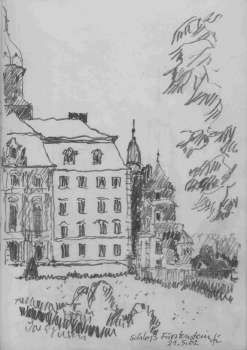 
Das schlesische Schloß Fürstenstein in einer Skizze von Konrad Fischer 

Sagan, obwohl ‘45 gut erhalten, wurde nach polnischer Übernahme wie alle anderen schlesischen Schlösser gründlich ruiniert.

**Diskussion:**

Verstaubtheit als Chance im Unterschied zur rein virtuellen Welt.

**Göres: Das Preußische Stiftungsmodell**

In Preußen und Bayern die ältesten SV’s in Folge der Ereignisse nach dem 1. Weltkrieg. Kaiserliches Vermögen von Wilhelm und Preuß. Königl. Besitz wurden 1918 beschlagnahmt. Über 5 Jahre dauerte Klärung bis zur Ausscheidung des Privatvermögens, das zurückgegeben werden sollte. Mehrere Vergleichsvorschläge werden nicht durchgeführt, dann meldete sich Denkmalpflege, die den Erhalt der dem Staat zufallenden Schlösser sowie den bei Fürsten verbleibenden Kunstbesitz forderte.

Museen forderten z. T. Auslieferung der Gemälde aus den Schlössern, da sie dort nicht genug zur Geltung kämen (z. B. Kunsthalle Bremen). Aber Denkmalpflege forderte Erhalt im Zusammenhang. Nutzung unter Beachtung „organisch gewachsener Einheit“.

Frage, wie umfangreicher Privatbesitz legal in Schlössern bleiben könne. Denkmalideologie als Argument der Enteignung!

Schlösser wurden als künstlerische und historische Denkmale verstanden (nach Dehio). Diese Haltung machte sich auch die Weimarer Republik zueigen, die Ministerialbürokratie zog mit. Begriff „Museumsschlösser“ entstand (Becker) und wehrte andere Nutzungsabsicht ab. 

Forderung nach Schlösserverwaltung unter künstlerisch-historischer Zielsetzung entstand und wurde in Preußen und Bayern umgesetzt. An Preußen wurde Status Provinzialkonservator dem Direktor der SV verliehen. Nur Fachmann könne über Umgang mit Schlössern befinden.

Enteignungsvertrag übertrug 75 Schlösser/Gebäude an SV, König behielt 39. Bei Auswahl der „Museumsschlösser“ war man auf enge Auswahl bedacht, da man sich der Folgen bewußt war (Marienburg, Königsberger Schloß, Stolzenfels, ...). 

Erste große Auswahl Meisterwerke aus preuß. Schlössern in Berlin Unter den Linden als Argumentationsausstellung. 

Wirklich große Verluste erst in Nachkriegszeit durch sytematische russische Beraubung mittels militärisch organisierter Plünderung unter Leitung von Fachleuten. 1950 Sprengung Berliner Schloß. Nachfolgeverwaltung Hessen, Rheinland-Pfalz u.a. .

60er Jahre Sprengung Königsberger Schloß. SV Ost-West konnten besser kooperieren als staatl. Museen (Kontaktverbot!) 

Nach Wende Wiedervereinigung der Ost- mit West-SV.

SV heute Status als UDB (Untere Denkmalschutzbehörde). SV heute tätig in zwei Ländern: Berlin und Brandenburg. 

Förderverein der „Freunde der Preuß. Schlösser“. sammeln Geld für Restaurierung, weniger für Inventar. 

Heute wird auch Kaiserzeit respektiert. Problem: Beraubte Möblierungen (Russen). Man träumt auch von Wiedergewinnung historischer Zustände (unter Eliminierung der Nachkriegsgeschichte!). DDR - Nutzung enteignete SV und ruinierte Objekte. Jetzt wird auf 18. Jh. zurückrestauriert. Großartige Fälschung der Objekte unter rekonstruktiven Gesichtspunkten bis ins 16. Jh. Totalvernichtung ungeliebter späterer Bauphasen. Ungesicherte Reko-Ergebnisse.

Führung: Audioguide mangels Nachfrage wieder eingestellt. Selbstführung, Führungswesen ist schwierig geworden. Zur DDR-Zeit FH-Absolventen. Info-Blätter, Führungspublikation ab 3 DM. 

Winterschließung aus Kostengründen.

Ständig Personaleinsparung trotz Übernahme neuer Schlösser. Irgenwann Restaurierung von Schlössern ohne Öffnung und Präsentation mangels Führungspersonal.

Lange Schlössernacht mit über 50.000 Besuchern sehr erfolgreich.

Tip: Keine Musik im Schloß wegen Stauproblem. Nur Aktivitäten im Garten, Schloß lediglich beleuchtet und geöffnet.

Grunewald wird nach Renaissance zurückrestauriert. Cranach und Barockgemäld und Jagdwaffen aus Zeughaus.

Oranienburg - Porzellankammer. Geschichte der Silberschätze. Freilegungen über alles. Hoffnung auf Rekonstruktion Porzellankammer. Porzellan in Museen noch in Kisten von 1945.

Potsdam, Glienicke, Caputh:

Rekonstruktion Fassade auf „Ursprung“. Gewölbesanierung durch aufbetonierte Betonrippen. Rekonstruktion gefliester Sommerspeisesaal. Deckenfreilegung Rekonstruierung mangels Kenntnisse von Vorzustand.

Charlottenburg: 

Originalräume und viele rekonstruierte Räume. Porzellankabinett mit neuem Porzellan, Raum erhalten.

Glienecke verwüstet übernommen.

Jagdhaus Stern

Rheinsberg: 

Musiakademie, früher Arztwohnung (DDR), Galerie Rekonstruktion nach Foto.

Sanssouci:

Ruinenberg, normanische Turmwand für Buga wieder aufgebaut.

Teehaus von Mercedes gesponsert.

Neues Palais, gestohlene Prunkmöbel kamen aus Rußland [Anm. 2007: Das wäre bei Polen undenkbar!) zurück

Orangerie von poln. Restauratoren für Empfänge hergerichtet in 80 Jahren, dies ist auch heute noch so genutzt. 

---

****10. 10.03, Weimar Bauhaus-Universität** Kolloquium: Außergewöhnliches in der Baudenkmalpflege und Bausanierung 
**Gedankenaustausch über brisante Schadensfälle und ihre außergewöhnlichen Behebungen 
Veranstalter: Lehrstuhl für Bauaufnahme und Baudenkmalpflege/Bennert GmbH

Aus der Mitschrift Dipl.-Ing. Konrad Fischer

Gespannt und frohgemut fuhr ich am 10. Oktober zur Bauhaus-Universität Weimar, um Außergewöhnliche Denkmalpflege kennenzulernen. Es hat geklappt. Hier einige Notizen aus meiner knappen Mitschrift, inkl. lakonische Kommentare (KF:).

1. Prof. Dr.-Ing. habil. Dr.-Ing. H. Wirth, Weimar: _Das Außergewöhnliche in der denkmalpflegerischen Methodologie_

Denkmale sind außergewöhnlich, sie bedürfen außergewöhnlicher Methoden.

KF: OK.

2. Dr. sc. techn. Dr. rer. nat. W. Bennert, Hopfgarten, Dipl.-Ing. I. Mielke, Weimar: _Den Abriß abwenden. Ein Vorschlag zum Umgang mit den Verpreßschäden von Wiehe und Eilenstedt_

Schloß Wiehe: Gigantische Treibmineralschäden durch architekteninduzierte Zementmörtelinjektion ins historische Mauerwerk. Folge: Ettringit-/Thaumasitbildung mit Entfestigung und Volumenvergrößerung des Mörtels. Verpreßplanung mit aufgeschäumtem Zementmörtel war Umsonst-Zuarbeit an Planer von Baufirma hinter dem Rücken des "sparsamen" Bauherrn (Kommune). Umsonstplanende Firma hat dann erhofften Zuschlag trotzdem nicht bekommen. So linkt man geizige Planer. Auftragnehmer hat dann HS-Trockenverpreßmörtel von renommierter Firma eingesetzt. Nun gigantische netzförmige Durchrisse im gesamten Mauerwerk. Notabstützung steht seit Jahren. Prozeß läuft erst mal gegen ausführendes Unternehmen (nicht für eigenen Pfusch versichert) anstelle gegen den Planer (Haftpflichtversichert auch für eigenen Planungs- und Überwachungspfusch). Offenbar schlechte Rechtsberatung der Kommune. Es geht um viele Millionen, gesamtes Schloßmauerwerk ist kaputt.

Treibprozess von außen nicht beeinflußbar, vollzieht sich bis zur "Sättigung". Abklingen ist berechenbar, Voraussetzung Rißbreitenüberwachung. Treibdruck bis 50 N/mm². Auch in Schloß Eilenstedt riesiger Treibmineralschaden. Elastische Sicherung der Treibkonstruktion mit gefederten Zugbändern und Stahlnetzen. Rißbeobachtung durch zeitlich unterschiedliche Rißmarkierung. Mielke: Weitere Verpreßkatastrophen an Stadtmauern Frankenhausen und Sömmerda, Burgruine Eckardsburg.

Gips-Zement-Kettenreaktion: Gips + hydraulische Aluminate -> Ettringit, CSH-Phasen + CaCO3 -> Thaumasit + Aluminatfreisetzung -> Ettringit.

KF: Wie kommt es zu derartigen Katastrophen an Baudenkmalen, wo doch in Niedersachsen schon seit 1980er Jahren diese Schadensursache bekannt und ausgiebig publiziert (Arch. Axel Werner, Landeskirchliches Bauamt Hannover) ist? Müssen auch Thüringer nur aus eigenem Schaden mit eigenen Fehlplanungen und eigenen Schlechtausführungen schlauer werden? Vom Westen nichts lernen! Das kostet Thüringer Bausubstanz und Geld. Wer den Schaden hat, ...

3. Dipl.-Ing. H. Baumgarten, Erfurt: _Abschnittsweise Sanierung von Ingenieurbauwerken mit höchsten Ansprüchen_

Schloßpark Wörlitz - wie man ein Parkbauwerk durchbetoniert mit HDI-Gründungsverstärkung, nachträglichen Bohrpfählen mit anbetoniertem Mauerfußanschluß, Mauerwerksarmierung mit einzementierten Ankern, Nadeln und Spritzbetonschalen, gefährliche Nachsetzungen bei Pfahleinbringung - 5 cm, sichtbare Erweiterung der Rißsysteme bei invasiven Bauabläufen. Staatsbauamt! Denkmalpflege jammerte fruchtlos herum. Nächste Bauabschnitte folgen, bis alles ingenieurmäßig durchbetoniert ist.

KF: Ein heroischer Sieg des Ingenieurs gegen das Baudenkmal. Wo waren ausgeblendete Fragen nach Materialgerechtigkeit, kleinstmöglichem Eingriff und Veränderung, Alterungsverhalten erstarrter Mauerkrusten, Zementeinwirkung auf Originalgefüge im Mauerinneren, Baukosten, denkmalzärtlichen Alternativen, Reversibilität, Technikbewährung, rsikoarme Reparaturtechnik?

4. Dr.-Ing. P. P. Zalewski, Weimar: _Als die Europäer bauen lernten. Außergewöhnliche Baufehler im Hochmittelalter_

Romanische Gründungsprobleme bei Großbauten. Gotik bevorzugt Mitverwendung der Vorgängerbaufundamente. Allmählich zunehmende Fundamenttiefe (Gernrode Stiftskirche 50 cm - Köln Dom 19 m). Amiens Stabilitätsvorbild. Einige Schiefstellungen (Pisa) mit Einstürzen wegen schlechter Gründung verbessern Erfahrungswerte.

KF: Spannender Vortrag über dieses wenig beachtete Sonderthema.

5. Dipl.-Ing. C. Sußmann, Magdeburg: _Sanierung des mittelalterlichen Ringankers am Nordturm des Magdeburger Domes_

Konservierung alter Ringanker auf Mauerkrone in Bitumen, Neukonstruktion mit Nadeln zementär verankert in historischem Mauerwerk. Eisenkennwerte Alteisen anisotrop - nur in eine Richtung ok, Qualität St 37. Steinverschiebung in Fassade durch Korrosion vorher unbekannter innenliegender wandparalleler Eisenanker. Kritik in Diskussion: Neuer Eichenholzanker wird durch Trocknung stark schwinden. Formschluß Problem. Nachspannen?

KF: Ob das so gutgeht? Starre Vernadelung, Zement in historischer, bewitterter Mauerkrone. Neuzeitlich-historischer Material- und Konstruktionsmix. Unbeirrter Glaube in moderne Baustoffe und -technik.

6. Dipl.-Ing. K. Grobe, Erfurt: _Die Schadensgeschichte einer Bastionsmauer der Erfurter Stadtbefestigung_

Petersbergbastion Philipp: Ausbauchung und krasse Rißbildung nach Mauerverpressung. Dort war früher schon Mauerabsturz und Absturz der ehem. Mauerüberbauung. Bastionsbebauung entwässerte über defekte Grundleitung Richtung Bastionsmauer. Erf. Rücklagepfeiler nicht 3 sondern 10 m Abstand. Mauerquerschnitt zu gering, alte Vorgängermauer: Beule, wo Rücklagepfeiler 31 m Abstand, dort barocke Schatzgräberei nach Dagobertschatz.

KF: Bauforschung nach Baukatastrophe ist ein bißchen spät, wieso derartige methodische Fehler bei so viel Fachidioten im staatlichen Bauteam?

7. Dr.-Ing. habil. H. Will, Potsdam: _Stabilisierung von romanischem Findlingsmauerwerk_

Romankalkverfugung einer brandenburgischen Kirchenfassade inkl. Schaumzementmörtelverpressung (Inhalt 0,6% Synthetik, Schaumbildner (Tenside) u. Cellulose-Ether als Stabilisatoren). Von außen alles ok nach 9 Jahren.

KF: Hoffentlich bleibt das so. Wieso derart heftige irreversible Methoden an so hochrangigen Objekten?

8. Prof. Dr.-Ing. W. Schwarz, Weimar: _Geodätische Meßtechniken in der Baudenkmalpflege_

Vorzeigen der Meßinstrumente, einige Beispiele Meßergebnisse.

KF: Von Maderscher Akribie war nicht die Rede. Geodätischer Standpunkt.

9. Prof. Dr. Ing. K. Rautenstrauch, Weimar: _Tragfähigkeitsuntersuchungen in historischen Mauerwerkskonstruktionen_

Rechnerische und grafische Simulation Destruktion Mauerwerk durch gerechnete Belastung, Prognose Sanierungswirkung durch 3D-Berechnungsmodelle. Software nur in Uni. Offenbar sehr aufwendige Eingaben.

KF. Für Sonderfälle bestimmt interessant. Für Otto Normaldenkmal?

10. Dr.-Ing. V. Lind, Halberstadt: _Mauerwerksnachweise in historischen Bauwerken - außerhalb der DIN 1053?_

Ertüchtigung von rechnerisch überbelastetem Mauerpfeiler in mit Zusatzstockwerk geplagtem Halberstadter Baudenkmal der Stadt durch je 3 eingebohrte und zementverpresste Lagen 3 Stahl-Nadeln mit definierter Lastaufnahme. Das rechnet Sicherheit.

KF: Radikalkur gegen das Denkmal. Hat historische Vorbilder.

11. Dipl.-Ing. H.-G. Schwarz, Nürnberg: Das Wagnis einer Entkernung im Kräftefluß des Bauwerks

Engagierte Renovierung, Umbau und Erweiterung der Veldener Friedhofskapelle aus den 30ern. Kein Denkmal, jedoch stilsicher behandelt. Aufmaß ist Architektensache! Basta. Durchgeplante und vom Architekten auf der Baustelle den Bauarbeitern vorgeführte und eingetrichterte Handwerkskunst nach alter Väter Sitte. Wirtschaftliches Bauen kann und muß auch schön sein! Religiöse und auch sonst sehr traditionelle Motivation des sympathischen und unverblümten Architekten beschämte manche zuhörende Betonköpfe.

KF: Frischer, lebendiger Vortrag - ein intellektueller, architektonischer, denkmalpflegerischer und emotionaler Hochgenuß des Tages. Danke, Herr Kollege!

12. Dipl.-Ing. J. Götz, Hildesheim: _Die Einheit von Architektur- und Ingenieurleistungen bei der Sanierung eines außergewöhnlichen Baudenkmals_

Faguswerke Alfeld, 1914 ff mit ständig weiterentwickelten Fassaden-Konstruktionen. Originale Fassade keine curtain-wall wie von Gropius immer fälschend behauptet, wesentlich früher (1906) hat das profilliefernde Stahlwerk schon ein Stahlstützen-Glas-Bauwerk mit 4 Fassaden ringsum gehabt. Gropius hat dafür gesorgt, daß gesamte Literatur dies unterschlägt.Seine Stahlprofile ohne ausreichenden Rostschutz , sie rosteten total dahin. Auch der Ziegelbau war konstruktiver Pfusch, keine ausreichende Aussteifung, entsprechend viele Mauerwerks- und Rißschäden. Sommer bis 54°C, Winter bis -3°C - der Alptraum einer Glasfassade. 1924 Markisennachrüstung durch Neufert. Am Original orientierte Baurestaurierung über zig Jahre mit erheblichen Konstruktionsverstärkungen, die ja auch für die Erhaltung erforderlich waren. Beprobung liefert statischen Nachweis der Schrauben außerhalb DIN und Zulassung. Gute Zusammenarbeit mit Behörden.

KF: Typisch-klassischer Bauhauspfusch, nach heutigen Maßstäben nachgebessert. Engagiertes Planungsbüro mit Langzeitwirkung.

13. Dr.-Ing. A. Löffler, Erfurt: _Die "kleine Form mit großem Inhalt". Opfer von sozialen und ökonomischen Schrumpfungsprozessen._

Hochgestochene Einleitung vom Blatt abgelesen, um zu sagen, daß man gerne mehr Geld hätte für das, was man Denkmalpflege nennt,. Alles endet dann im typischen Sanieren nach "Sanierbaustoffproduktberatung" für Burgen und Kirchen: Vermörteln, verfugen und verankern mit Traßmörtel, HS-Zement. Ach, wie soll das nur weitergehen, wenn es immer weniger Geld gibt?

KF. Vielleicht gar nicht schlecht, wenn nicht alle Baudenkmale Thüringens mangels Kröten schwuppdich schnell durchbetoniert werden? Mag die Sanierbranche ruhig etwas jammern. Armut ist die beste Denkmalpflege, Löffler liefert den Beweis. Es braucht auch in Thüringen noch ganz schön viel Nachdenkzeit.

14. Prof. Dr.-Ing. G. Förster, Dessau: _Notwendigkeit und Nutzen von diagnostischen Voruntersuchungen am Beispiel geschädigter Holzkonstruktionen_

Fachwerksanierung a la DDR-Reko, auch für reparierbare Holzquerschnitte mit nur oberflächlichem Schadensbild. Bunte Bilder von Holzschädlingen, dem Publikum schon allzubekannt.

KF: Im Osten wirklich nichts Neues. Wo bleibt substanzschonende Reparaturtechnik, giftfreier Holzschutz usw.? Im geistigen Stacheldraht hängengeblieben?

15. Dipl.-Ing. E. Jahn, Wolmirstedt: _Die besondere Problematik bei der Umnutzung von Wind- und Wassermühlen_

Aufruf gegen die typische Kaputtsanierung von Wind- und Wassermühlen mündet in aktuellem Beispiel einer Reko auf früherem Stand inkl. umfangreichem Rückbau (Wassermühle) dank 75% EU-Subvention. 

KF: Souveräne Rhetorik, lustige Beispiele verschiedener Mühlentechnik. 

Fazit: Wirklich außerordentlich außergewöhnlich, wie wenig Reversibilität, Methodenbewährung, Bestandsverträglichkeit, Alterungsverhalten und Wirtschaftlichkeit in der vorgeführten "Baudenkmalpflege und Bausanierung" eine Rolle spielen (Ausnahmen bestätigen die Regel). Ist das den beteiligten Denkmalpflegern, Gutachtern, Planern oder gar "Restaurierungsunternehmern" zuzuschreiben? Wirtschaftlich-normgemäße Standpunkte zählen da mehr. Fehlt es an Fortbildung? Sie müßte im Sinne der Denkmalpflege jedenfalls etwas anders aussehen, als diese Veranstaltung der Bauhaus-Universität mit der Bennert GmbH - in der gewöhnliche Ingenieurmethoden im eigenen Saft schwammen. Auch die Erkenntnisse des SFB 315 betr. Langzeitverhalten von verpressten Nadeln scheinen noch nicht in Thüringen angekommen zu sein. Nur ein Landesamtler war da, und der riß das Ruder nicht herum. Was man hier vorgesetzt bekam, war zwar von den Objekten her hochrangig, sonst aber teils eher wenig außergewöhnlich ;-) 

---

****27. 06.05, Weimar Bauhaus-Universität** Kolloquium: "E pur si muove!" - Denkmalpflege findet dennoch statt. 
**Veranstalter: Lehrstuhl für Bauaufnahme und Baudenkmalpflege

Aus der Ankündigung/Einladung: _"Bedauerndes Klagen über unzureichenden ideellen und materiellen denkmalpflegerischen Zuspruch, über denkmalpflegerisches Vergehen ist mehr verbreitet, als der Wille zur konstruktiven, produktiven Auseinandersetzung. Das Kolloquium soll ein Podium dafür sein."_

Und für einige überraschend war es dann auch eine akademisch niveauvolle Feier zum just am Veranstaltungstag stattfindenen 65. Geburtstag des wohl originellsten denkmalpflegerischen Lehrstuhlinhabers - Prof. Dr. phil. habil. Dr.-Ing. Hermann Wirth. 

Es folgen die kurzgefaßten Eindrücke vom Tagesablauf, angereichert mit ein paar Bildern. Wichtig: Das Kolloquium wird mit den Originalbeiträgen publiziert. Info: Bauhaus-Universität Weimar, Fakultät Architektur, Lehrstuhl für Bauaufnahme und Baudenkmalpflege, 99421 Weimar, Tel.: 03643-583129, Fax: -583080

---

Weimar, 27.06.2005 "E PUR SI MUOVE!", Denkmalpflege Kolloquium zum 65. Geburtstag und Emeritierung von Prof. Wirth 

Die Beiträge

1. Prof. Dr. Dr. Hermann Wirth, Weimar: Begrüßung 
In launigen Worten kumuliert die Begrüßung in einer Attacke gegen die von Schiller in seiner Antrittsvorlesung erwähnten "Brotgelehrten" - heute "Drittmittelforscher". Substanzfetischismus - Konservierung als in Wahrheit geringster Anteil an Denkmalpflege, die überwiegende Restaurierung bis zur Translozierung und Kopie wird eher nicht "offiziell" wahrgenommen. Erneuerungsapostel und Renditejäger verhunzen Denkmal zur beliebigen Verfügungsmasse.

2. Prof. Dr. Ernst Badstübner, Berlin: Kunstgeschichte und Denkmalpflege, Anmerkungen zur Entwicklung einer Institution und eines Berufsbildes 
Denkmalpflege - ein inflationierter Begriff - von jedermann zu mißbrauchen - auch von praktischen Denkmalzerstörern. 19. Jh. 2. Hälfte: Von Stileinheit und Stilreinheit zu Denkmalpflege. Romantische Restauration zu Beginn der Denkmalpflege (Bsp. Wartburg). Nicht nur Architektur als komplette erfindungsreiche Neuschöpfung nach Analogie und Phantasie, Architekt von Rittgen ließ dazu Skulptur und Historienmalerei als Gesamtkunstwerk zur Wiederbelebung antreten. Entrestaurierungswelle ab 1950er. Erste Neuzutaten im 19. Jh. "historisch", später aber "modernistisch". Nostalgiewelle bringt dann ab 80er des 20. Jhs.wieder Rekonstruktionen purifizierter Fassungen hervor. Restaurierung ist immer zeittypisch, Dehios Forderung nach "Konservierung" ist und bleibt Utopie.

3. Dr. Sigrid Brandt, Berlin: Gegen die Vorbildlichkeit vergangener Zeit, Joseph Gantners Interesse an Stadtbaugeschichte 
Inventarisation der Stadtbaugeschichte im Gegensatz zur Inventarisation der Einzeldenkmale. Bezug zu Camillo Sitte: Städtebau als Kunstwerk, Primat des Platzes. Stadtbaugeschichte für Denkmalpflege lange nicht so wichtige Sache.Gunzelmann und Beseler versuchen hier Umkehr. Diskussion: Zalewski - Bombardement der historischen Städte hat Interesse an neuzeitlicher Baugeschichte stark gefördert.

4. Prof. Dipl.-Ing. Manfred Gerner, Fulda: Denkmalpflege im Osten, Beispiele aus Rußland 
Dom in Königsberg: Breschenew befahl Sprengung, Bürgermeister Denisow hat das erfolgreich hintertrieben. Denkmalsanierung ab 80er Jahre teils im Sinne der nationalistischen Russifizierung, soweit Rußland mitfinanzierte. Von Engländern weggebombtes Dach (1944) in leichter Stahl-Kupfer-Konstruktion mit privater Finanzierung neu erbaut. 
Kirche in Kishi 1720. In 1950er entfernt Architekt Opolowaikow auf der gemütsrussischen Suche nach dem Originalzustand Kupferdächer und Holzverschalungen, dadurch immer weiter zunehmende fäulnisbedingte Zerstörung. Kirche von Einsturz bedroht. Schlaue russische Sanierungsvorschläge - z.B. Aufhängung nach oben an kranförmigen Überkosntruktionen hätten weitere Zerstörung bedingt. 

Gerner-Vorschlag 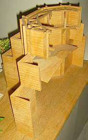(Modell Gerner) sieht Fachwerkbindersystem über Oktogon vor. 
Extreme Luftfeuchtigkeit der topografischen Lage begünstigt Holzschädlinge. (KF: Wie steht es mit [Temperierung der feuchteüberlasteten Holzbaukonstruktion zur nachhaltigen und preisgünstigen Konservierung (russisch](7tempr.md)/[deutsch](7temper.md))) 
Tjumen: Holzblockbauten stark gefährdet. Von 5000 Bestand auf 180 heute Blockbauten dank modernem Kommunismus "totgeschrumpft". Russische Denkmalpflege zwischen Reko und Vergewaltigung, Kenntnisse da, wirtschaftliche, ideologisch-philsosophische und politische Voraussetzungen aber nicht. Russismus steht Denkmalpflege im Weg.

5. Dr. Dr. Wulf Bennert, Hopfgarten: Wege zur sich selbst finanzierenden Denkmalerhaltung 
Radikale Fördermittelabsetzung der staatl. Denkmalpflege kostet mehr und mehr Denkmalsubstanz. Wie läßt sich Denkmalerhaltung finanzieren? 
A) Eigenmittel Bauherr, 
B) Steuerl. Absetzung der Aufwendungen, 
C) Staatl. Förderung, 
D) Stiftungsmittel (DSD, Bundesstiftung Umwelt, ...), 
E) Alternativen: 
1) Spenden, 
2) Sponsoring mit werblicher Darstellung, 
3) Refinanzierung des Aufwands durch verstärkte Nutzung, 
4) "Apostelfinanzierung" 
Beispiele 
zu 1) Spenden: Förderbereitschaft für Gloriosa (Glocke) Erfurt mit Videotrailer gestärkt. Mediale Problemdarstellung fördert Spendenbereitschaft und Sponsorenwerbung. 
zu 2) Beispiel Brandenburger Tor + Telekom-Werbung, 2. Beispiel Korkenzieherwerkstatt, Translozierung und Sponsorpräsentation in Trailer im Landtag und auf transportiertem Bauwerk. 
zu 3) Beispiel Brunnen auf Leuchtenburg: Reko des Schöpfrads, Finanzierung durch Verpachtung des Objekts an privaten Investor auf 12 Jahre, Pächter erhält Eintrittsgelder. 
zu 4) Apostelaltar, von Anobien zerfressen. Vorschlag: Eine der Apostel-Großskulpturen auf internationalem Kunstmarkt verauktionieren, von Erlös Restaurierung und mehr finanzierbar! Diskussion: Fischer: Schalk-Golodkowski soll Leiter einer staatlichen Auktionierungsbehörde werden.

6. Dombaumeisterin Prof. Dr. Barbara Schock-Werner, Köln: Vulgärökonomische Vernunft bei der Erhaltung des Kölner Doms (Webseite: [www.dombau-koeln.de)](http://www.dombau-koeln.de) 
Erhaltungsprobleme seit langem Aufgabenstellung der Dombauhütte. Reparaturen konstruktiv stark belasteter Teile mit "unkaputtbarer" Basaltlava. 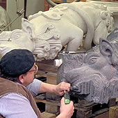Kopien (hier Wasserspeier) wie seit altersher mit Punktiergerät nach daneben liegendem Gipsmodell. 
Schlaitdorfer (tonhaltiger) Sandstein 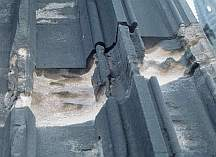mit hoher Feuchteproblematik (Quellen) wird heute durch Stein aus Bassanov/CZ ersetzt. Französischer Savonnière-Kalkstein durch Dauerfeuchte stark gefährdet und an exponierten Stellen stark erodiert, sonst in schönem Zustand. Früher: mit acrylharzgetränkten Originalsteinen von Vorgänger Wolff in Kopie ersetzt. Heute: gereinigt, restauriert, rekonstruierend ergänzt (mit zum Verständnis erforderlichen abgängigen Attributen nach Originalzustand), teils acrylharzgetränkt. 
Laserreinigung von besonderen Teilbereichen wie hier im Tympanon bzw. an wichtigen Figuren 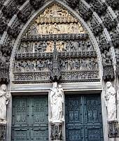schreitet wg. sehr hoher Kosten nur langsam voran. 
Neue Kopien mit Obernkircher Sandstein (aufwendige Arbeit, bessere Haltbarkeit). Teilgeschädigte Kalkfiguren werden im Original erhalten, ergänzt, konventionell gefestigt. 
Ziegelplombe nach Zerstörung durch angloamerikanische Bomber 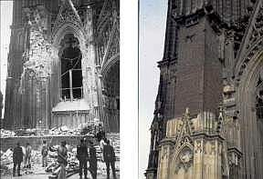 in Front eingesetzt - nach vehementer denkmalpflegerischer Diskussion durch die Gazetten: Ziegelhaut wird ca. 30 cm zurück bearbeitet und mit Quadern verkleidet gem. Original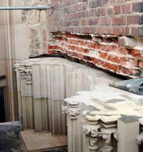. 
Kapitelle nach Naturvorbild neu erschaffen. Figurenbaldachine Neuschöpfungen als freie Kopien im historischen Stil / nach hist. Vorbildern. Hl. Benedikt Kopfergänzung mit zementärem Ersatzmörtel (im Inneren). Schadhafte Bauteile in Vierung ersetzt. 
Keine Bestandsdoku/Schadenskartierung "Bambergischer Manier", da zu hoher Aufwand und in ca. 100 Jahren kein Bedarf! Solche Dokueskapaden, die jetzt im Archiv verstauben, wurden von Vorgänger noch beauftragt, da spielte Geld noch keine Rolle. Steingerechte Doku unbrauchbar und nicht notwendig: Unterscheidbarkeit dürfte später wie heute gegeben sein und sowieso für Baumaßnahme nicht oder nur wenig verwendbar. 
Steinschäden am Obernkircher Fassadenstein vorwiegend durch Rostsprengung. Abbau, Erneuerung in Originalstein, eingebleite Edelstahlklammern. Verzinkte Blechverwahrungen werden in Blei erneuert. 
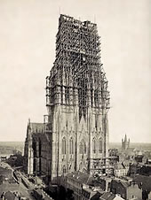Gerüstbau früher. Heute preiswerte Hängegerüste Alulegierung (teuer) ohne Verankerung in Steinmaterial (aus Bühnenbautechnik). 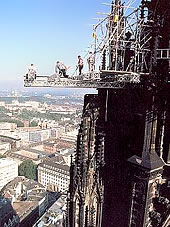Schutznetz (mobil) für Passantenschutz nur temporär im Einsatz. 
Bei Glasrestaurierung allerdings detaillierteste Dokumentation Zustand und Maßnahme (am Bildschirm an Werktisch). Fensterreko durch Stiftergelder, die sich im Fenster verewigen (Beispiel: in Saturn/Planetensymbolik). Schutzverglasung in sehr aufwendiger Bauweise. 
Gefaßte Grabmale können wegen Verbrennungsgefahr der Beschichtung nicht mit Laser, sondern nur "konventionell" gereinigt werden, von Besucherstaub verschmutzte Fassungen werden nur entstaubt. 
Jährlicher Dombaubericht. 
Fazit: Notwendige Abweichungen von wahrer Lehre der Denkmalpflege von ökonomischer Vernunft diktiert. (Alle Bilder/Bildrechte der bei diesem Vortrag verwendeten und hier wiedergegebenen Fotos: Dombauverwaltung Bildarchiv)

7. Dipl.-Ing. Volker Schweizer, IRB Stuttgart: Jeder Fall ein Präzedenzfall, Moderne Wege der Informationsbeschaffung in der Denkmalpflege 
Platons Höhlengleichnis. Wissen ist personenbezogen. Informationsmanagement, Informationshiding vermindern. Informationsbeschaffung und -bereitstellung. 
Informationkanäle - Kommunikationskanäle: persönliche Kontakte, konventionelle Medien (Print), neue Medien (digital). 
Informationsresonanz (Neill Postman) 
Informationswiderlegung. Informationsanwendung. 
Wert und Relevanz Information/Recherche muß! beurteilt werden: Herkunft (KF: interessensgesteuert, manipuliert wie DIN-Normen von Normenausschüssen, Fachartikel von Produzenten, vgl. Schweinereien im Pharmabereich - Sanierprodukte-Medikamente - alles Schiebung?) Aktualität?Vollständigkeit? > Kenntnisse über Schlüsselquellen. Berliner Erklärung: Offener Zugang zu Wissen in Internet, weltweit und frei, soweit von "wiss. Gemeinde" bestätigt. Internet nachhaltig interaktiv, transparent. IRB direkt: Wissensportal BAU Informationsmanagement: Aus Erfahrung und Schäden lernen. Kommentar: Schön wärs.

Einschub: Cantata "Dennoch bleib´ich stets an Dir" 
Zur Emeritierung des Universitätsprofessors Hermann Wirth, Komposition: Alexander Ferdinand Grychtolik, Libretto: nach Henrici (Picander) 
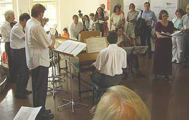v.l.: Jörg Emmrich -Viola, Ulrich Kliegel -Violine II, Jürgen Karwath - Violine I, Hans-Dieter Koch - Violone, Alexander Ferdinand Grychtolik - Cembalo, Astrid Müller - Violoncello, Ika Kruse - Sopran.

Texte aus der Cantata: 
1. Aria 
Dennoch bleib´ ich stets an Dir 
Wenn mir alles gleich zuwider; 
Keine Trübsal drückt in mir 
Die gefaßte Hoffnung nieder, 
Daß, wenn alles bricht und fällt, 
Dennoch das Bewahrte hält!

2, Recitativo 
Mein Herz, zerreiß des Mammons Kette, 
Oh Hände, streuet Gutes aus. 
Wahret ja der Väter Haus, 
Das euch angerechnet bleibet, 
Wenn der Erden Gut zerstäubet!

Dennoch, mein Herz, ich geh´mit Dir dahin: 
so wei ich mit meinem leben, 
mit Gottes höchstem Segen, 
Der höchsten Kunst verschrieben bin. [...]

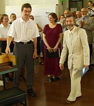Prof. Wirth dankt den Künstlern und dem Komponisten

Ja, welcher Denkmalpfleger wird wohl noch so ein Ständchen verdient haben - und dann auch bekommen?

8. Prof. Dr. Sabine Bock, Coburg: Gebaute Bilder - Oder was unterscheidet die Wartburg vom Braunschweiger Schloß? 
Nationalbewußtsein -> Geschichtsbewußtsein -> Denkmalschutz ab 1817 (Burschenschaftler auf Wartburg). Aus Denkmaltrümmern ganzes Objekt in alter Schönheit reproduzieren. Patriotische Brunst. An Heidelberger Ottheinrichsbau 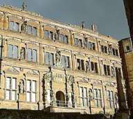entzündet sich ideologischer Streit: Restaurieren oder Konservieren? 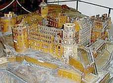(Ruinenmodell, Ottheinrichsbau vorne) 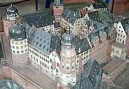(Wiederaufbaumodell) 
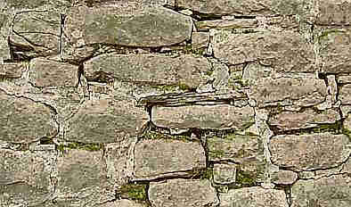(Heidelberger Schloßmauer - wäre für Denkmalpflege/Konservierung/Restaurierung bis in unsere Zeit nicht auch wichtig gewesen, die staatliche Bauwerkszerstörung durch Zementmörtel ordentlich zu kritisieren?) 
Heideloff baute Veste Coburg neugotisch wieder auf, Nachfolger Rotbarth baut dann teilweise wieder zurück, Ebhardt überformte wieder neu, immer unter Zerstörung des Originals. Ja, das ist Denkmalpflege wie heute. 
1945 Zäsur (materiell) durch angloamerikanische Zerstörung der deutschen Kernstädte. Kommunistischer/ sozialdemokratistischer Bildersturm sprengt verhaßte Baudenkmale - 1951 Stadtschloß Berlin, 1960 Braunschweiger Stadtschloß. Nostalgie rekonstruiert dann wieder (Hildesheimer Knochenhaueramtshaus, Dresdner Frauenkirche). Denkmalperversionen a la Trojanisches Pferd. 
Wiederaufbau Stadtschloß Braunschweig als Teil eines Einkaufcenters, das Schloßpark überbaut. Ach wie edel sind Denkmalkopien.

9. Dipl.-Ing. Nils Meyer, Dresden: Denkmalschutz und Denkmalwandel. Von Erhaltungs- zu Transformationsregeln? Denkmale als "prozessaler Transformationsmechanismus" im soziokulturellen Umfeld. ... Leerstand Schlösser DDR 1989: 7,7% -> 2005 28,8%, Museum 1,8% -> 8,3%, Ausbildung 32,2% -> 5,5%, öffentl. Nutzung 22,4% -> 8,6%, landwirtschaftl. 13,8% -> 2,1%, Gastronomie/Hotel 12,9% -> 10,4%. Diskussion: Wirth begriffliche Klarstellung Denkmalpflegemethodik, nur saubere Analytik gibt Auskunft ob 1) Konservierung, 2) Restaurierung, 3) Ergänzung, 4) Translozierung, 5) Kopie - mehr gibts nicht.

10. Dipl.-Ing. Gunther Wölfle, Dresden: Städtebauliche Denkmalpflege zwischen Substanzfetischismus und Kulissenzauber 
Substanzfetischismus (Petzet), Überbewertung des Alterswerts? Überzogene Ausweitung des Denkmalbegriffs? Substanzverlust als Folge der Kategorisierung (zwangsläufig) verschiedener Schutzziele. Je weniger Denkmale, um so weniger Verluste (Mörsch). Denkmalpflege für Prestigeobjekte - Paradigmenwechsel. Bauzeitliches Erscheinungbild und Entwurfsidee als Zerstörungsfaktoren am historisch gewachsenen Baudenkmal (Beispiel Bauhaus-Meister-Häuser Dessau) - nur noch "Kulissenzauberei" inkl. Aufgabe der historischen Substanz. Dagegen: Stilistische Unvereinbarkeiten schichtenweise gegeneinander stellen - polnischer Dekonstrutivismus inkl. Abstrapsen aller historischen Putze, um noch mehr "Denkmal" zu zeigen -> Denkmalporno. Kommunikatives Vermittluingsdefizit der Denkmalpflege in Breite der Gesellschaft. Ruinenbröckchen Frauenkirche in Taschenuhr -> Vom Subszanzfetischismus zum Reliquienkult. Diskussion: Fischer: Kommunikation der Denkmalpflege in Gesellschaft schwierig, da intern große Diskrepanzen zwischen "plnischem Denkmalporno" und "nostalgischem Kulissenzauber". Demokratischer Rückhalt für elitäre Denkmalpflege in Gesellschaft nicht gegeben.

11. Prof. Dr. Otfried Wagenbreth, Freiberg: Substanz- und Strukturschutz, singuläres und Flächendenkmal, Das Beispiel des Bergreviers Freiberg 
Was ist denkmalrechtlich Unterschied zwischen einmaliger Kompletterneuerung aller angemorschten Fachwerkballen eines stark bewitterten Schachtgebäudes und je 1/3-Austausch in mehreren aufeinanderfolgenden Bauabschnitten? Bleibt ein Baudenkmal? Denkmalbedeutung durch Gesamtensemble/-struktur über verschiedene Denkmalgattungen und Bauseiten. Dann Kopie legitim (Kopie-Denkmal als Teil übergeordneter Denkmalstruktur).

12. Dr. Urs Boeck, Hannover: Prima la musica, poi le parole 
Interne Schwierigkeiten in Denkmalwissenschaft sind auch für praktische Schwierigkeiten der Denkmalpflege mitverantwortlich. "GefühlterVerlust" der Geschichtszeugnisse fördert Denkmalnostalgie. Allerlei zur bunten Vielfalt denkmalpflegerischer Dokumentation und Kommunikation. Mobile Denkmale (Kunstobjekte) werden von staatl. Denkmalpflege sträflich vernachlässigt. Aufruf zu allerlei Verbesserungen in der Denkmalpflege und ihrer Organisation. Wer das leisten und bezahlen soll, wo es dafür Vorbilder gäbe, bleibt offen. Diskussion: Meckseper: "Kulturhoheit der Länder ist Hemmschuh für gemeinsame Verbesserungen in Denkmalpflege". Und nebenbei - wenn es zu einer gemeinsam organisierten "Verbesserung" käme, würde das nicht unbefriedigend enden wie Rechtschreibreform?

13. Dr. Stefan Pülz, Weimar: "Und bist du nicht willig, so brauch' ich Gewalt", Reformatio in peius im Denkmalrecht? 
Hoffman-Axthelms Aufruf zur Liquidierung der staatl. Denkmalpflege ist von außen gekommen und versandet. Dafür Novellierung der Denkmalschutzgesetze mittels administrativem Klimbim - ohne jegliche positive Wirkung und Sinn, dafür zogen gravierende Nachteile ein. Beispiel: Entfall des Vetorechts der Fachbehörde. Abschaffung des "Einvernehmens". Verschlimmbesserungen als Ergebnis der dubiosen "Unternehmensberatungen" der Denkmalpflege (die schon die Kirchen fertig gemacht haben). Folge: "Verfahrensvereinfachung" durch Verfahrensaufblähung! Erlaubnisfiktion durch Unterlassung eines Erlaubnisbescheides. Pauschaliertes Einvernehmen (Allgemeines Fachgutachten zu gemeinsamen Fallgruppen) ersetzt Stellungnahme/Beteiligung Fachbehörde. Kirchenprivilegierung gegenüber privaten Denkmalbesitzern durch Entfall des Einvernehmens in vielen Fällen. Das dürfte nicht verfassungsgemäß sein! Diskussion: Meckseper: Denkmalbegriff ist ein fiktiver Begriff. Voß: In Sachsen-Anhalt mind. 90% der Fälle im guten Einvernehmen abgewickelt worden, kein Novellierungsbedarf.

14. Prof. Dr. Gerhard Glaser, Heidenau: Vom Täter zum Betrachter 
Denkmalpflege gegen die Menschen geht nicht. Denkmalpflege geht mit Bürgern auch mal gegen "den Staat". Verrechtlichung der Denkmalpflege ist Ende der Denkmalpflege. Denkmalpfleger sind Hausärzte, die zum Patienten gehen. Untere Denkmalschutzbehörden außerhalb der Großstädte sind von größtanzunehmender Inkompetenz besetzt. Denkmale der niederen Kategorie bekommen keine fachliche Zuwendung (Hausarztbesuche) mehr. Abbruch von Baudenkmalen (leerstehende Wohngebäude) mit Fördermitteln wird "vornehm Rückbau genannt". Sächsischer Landesrechnungshof stellte fest: "Wir haben zu viele Denkmale". Wer soll an Spitze der Fachbehörde Denkmalpflege? Jurist, Betriebswirt, Bodendenkmalpfleger, Kunstwissenschaftler, Architekt? Jurist und Betriebswirt sind abhängig von externen Stellungnahmen und Gutachten, deren Wert sie gar nicht beurteilen können. Archäologe kann mit Investor nicht sinnvoll verhandeln (Kunstwissenschaftler auch nicht). Architekt gibt Denkmalwerte zugunsten Funktion und Konstruktion eher auf. "Denkmalpfleger" hat Scheuklappen. Kunstwissenschaft bleibt unverzichtbar.

Wirth in Fazit: 
Die bauhistoriologische Dokumentation hat sich verselbstständigt. "Die Dokumentation ist perfekt - das dokumentierte Objekt zerfallen." Zu teuer! Kein Bezug zur Erhaltung!

(Anmerkung KF: Madersche Akribie der wissenschaftlich und technisch sinnvollen Bauforschung wurde zum Doku-Geschäftsfeld für jedermann - und bleibt oft ohne Ergebnis außer bauherrn- und denkmalpflegerblendend bekritzeltem Papier. Praxis zeigt allerdings sekundären Nutzen der Doku: Sehr geeignet zum Einstieg der Professorenbüros in Maßnahmenbetreuung an herausragenden Baudenkmalen international) 

Zu Bock: betr. Schloßaufbau: Enkelgeneration sühnt die Kulturverbrechen der Großstädter - das ist legitim.

Zu Wölfle: Original ist Ergebnis einer Wahrnehmungsphilosophie. Man kann nie zweimal in den selben Fluß steigen. Original ist alles bzw. Original muß einer Zeitstufe zugeordnet werden. Auch der letzt übernommene Zustand ist Original. Substanz ist Träger/Substrat der Idee vom Denkmal. Denkmalpflege ist nicht/muß nicht Substanzerhalt sein. Substanzbefangenheit der Denkmalpflege!

Zu Boeck: Zentralistische Denkmalpflege war in DDR da, aber hat inhaltlich nicht funktioniert.

Zu Pülz: Wichtig ist Listeneintrag als Schutzobjekt, Handhabung des Gesetzes ist dann eher nachrangig.

Danach: Geselliger Ausklang im Weltkulturerbe HAB 
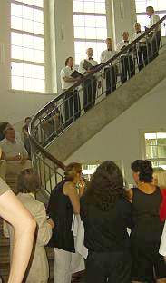Prof. Wirth lauscht dem Ständchen der Liedertafel - Gaudeamus igitur, iuvenes dum sumus!

Ad multos annos!!!

---

02.04. – 04.04.2006 in Bayreuth: **"Raumschale und Technik im Baudenkmal"** 
Veranstalter: FACHARBEITSKREIS SCHLÖSSER UND GÄRTEN IN DEUTSCHLAND 
Arbeitsgruppe Bauangelegenheiten und Denkmalpflege 
Arbeitsgruppe Restaurierung 

Organisation: Peter Seibert, Baudirektor und Dr. Katrin Janis, Abteilung Restaurierung, Bayerische Verwaltung der Staatlichen Schlösser, Gärten und Seen, Schloss Nymphenburg, 80638 München 

Teilnehmer: Geschlossene Veranstaltung der Arbeitsgruppen 
Link: [Vollständiges Programm](12akt.md#btsv) 

Programmauszug der Vorträge am 03.04.2006 

09:00 – 12.30 Uhr Fachvorträge im Gartensaal der Markgräflichen Gartenwohnung im Neuen Schloss Bayreuth 
09.00 – 09.30 Uhr Dr. Matthias Staschull: Konflikt Raumklima und Theaternutzung am Beispiel des Markgräflichen Opernhauses Bayreuth 
09.30 – 10.00 Uhr Dipl.-Ing. Architekt Peter Seibert: Anforderungen einer Gemäldegalerie contra Schutz des Baudenkmals am Beispiel der Gemäldegalerie des Neuen Schlosses in Bayreuth 
10.00 – 10.30 Uhr Dr.-Ing. Jörg Seele: Bauphysikalische Untersuchungen am Beispiel des Alten Schlosses in der Eremitage Bayreuth 
11.00 – 11.30 Uhr Dipl.-Ing. Architekt Konrad Fischer: [Konservatorische Temperierung am Beispiel von Schloss Veitshöchheim bei Würzburg](7temp17.md#veitshöchheim) 
11.30 – 12.00 Uhr Dipl.-Ing. Astrid Weller: Klima/Heizung in Schlössern 
12.00 – 12.30 Uhr Restaurator Klaus Häfner: Welches Klima vertragen museale Ausstattungen? 
13.30 – 14.00 Uhr Restaurator Stephan Wolf: Einführung: Restauratorisches Konzept für Italienischen Bau und fürstliche Gartenwohnung 

Mitschrift - Kurzfassung von Konrad Fischer 

1. Starschull: Bayreuth Opernhaus: Große Schäden an der Bausubstanz enstanden nach dem Einbau einer Klimaanlage, ab 1996 wurden deswegen Klimamessungen durchgeführt. Große Schwankungen der Klimasituation enstehen durch Nutzung. Es wurde ein wiederkehrendes Monitoring der gefährdeten historischen Ausstattung eingeführt, nachgewiesene Schäden sind: Abplatzende und krepierende Fassungen, Verstaubung, Verbund Staub + Harzölfassung der 30er Jahre. Die Klimaanlage liefert 18-20.000 m³/h Zuluft. Lichtstrahler und Erwärmung bewirkten bis zu 10 Grad Spreizung der Raumlufttemperatur im 9 m hohen Raum. Extreme Temperaturspreizungen gab es auch im Jahresablauf. Eine neue Steuerung der Klimaanlage reduziert inzwischen die Spreizung, die Raumluftfeuchte / relative Luftfeuchte RF oszilliert um 20 %. 

2. Seibert: Bayreuth, Neues Schloß: Erweiterung der Nutzung als neue Filialgalerie der Bayerischen Staatsgemäldesammlung. Der Leiter der Staatsgemäldesammlung forderte "Idealklima" für Museen: Einhaltung exakter Klimawerte: RF 50-55 %, maximale Änderung der Klimawerte < 2,5 %/Std. (%/h) und 5 %/Tag (%/d). Die Bestandssituation war dafür denkbar ungeeignet. Das Innenklima folgt logischerweise dem Außenklima. Der Vorschlag der Schlösserverwaltung zur Verbesserung der Exponatsituation und des Raumklimas auf einfachstem und substanzschonendste Maßnahme durch elektrisch erwärmte Steinplatten als Strahlplatten + Luftbedampfer zur Befeuchtung zu trockener Luft wurde seitens der Staatsgemäldesammlung abgelehnt. Eine vollautomatische ferngesteuerte RLT-Anlage (Klimaanlage) wurde stattdessen gefordert. Die Umsetzung dieser Forderung bringt negative Folgen für die historisch wertvolle Bausubstanz des denkmalgeschützten Bauwerks: untragbare Eingriffe durch Quelllüftung. Als Kompromiß wird verwirklicht: Teilklimaanlage. Klimatruhen und Wandtemperierung. Auch dieser Kompromiß bedingt immer noch gigantische Eingriffe: Der historische Fußboden muß dafür ausgebaut werden, ein Unterflur-Versorgungsschacht zur Aufnahme der Technik muß eingebaut werden. Die Wandtemperierung wird unter der historischen Lambris (den Lamberien / Wandverkleidungen der Sockelzone) und hinter der Fensterleibung installiert. Dazu kommen eine Brandmeldeanlage mit Luftsaugsystem sowie Sicherheits- Funktionsfenster als Innenvorsatzkonstruktion. Fazit: Ein Kompromiß zwischen Substanzfetischismus und optimaler bzw.maximaler Ausstattungsperfektion. Zum Schluß wurden Vorgaben mit etwas höheren Toleranzen vereinbart. (RF 45-60 %). Im Winter Temp. > 4° zulässig, für das Personal wird ein Wärmeraum /Aufwärmraum eingerichtet. Ist dieser Aufwand angesichts der geringen Besucherfrequenz im Winter gerechtfertigt? Das budgetierte Kostenvolumen der Haushaltsunterlage Bau (HU-Bau) wurde deutlich gesprengt durch die aufwendige Klimatechnik / Klimatisierungstechnik, dafür mußten Einsparungskompensationen gefunden werden. 

3. Rest. Häfner: Die historischen Raumausstattungen sind im praktisch üblichen Rahmen gut klimaverträglich. Die Klimavorgaben für Gemäldemuseen lt. Hilbert 1996: 18-25 °C Raumtemperatur, 45-55 RF +/- 2 %. Die Klimastandards zielen lediglich auf physikalische Verhältnisse (Raumluftfeuchte, Raumlufttemperatur) und nicht auf die chemischen Prozesse an den Kunstwerken selbst. Die Klimastandards wurden aus gewissen Erfahrungswerten entwickelt, daraus ergab sich die Forderung nach einer Klimaanlage. Schlösser (und vergleichbare historische Bauwerke) bergen Kunstwerke aus unterschiedlichen Materialien und Arten, sie haben im originalen Zustand keine Klimaanlage. Beispiel Linderhof: Sommer + Herbst hohe RF, die im Putz + Holzausstattung gespeichert bzw. gepuffert wird und im Winter (besucherarm) wieder abgegeben wird. Das Klimamonitoring erbrachte folgende Klimadaten für die Raumluftfeuchte: Oktober bis April 50-80% RF, Mai bis September: 55-70% RF. Hölzer, die frühzeitig Klimaschwankungen erlitten, reagieren sehr unempfindlich bzw. störungstolerant bei späteren Schwankungen. Als Werkzeuge des Monitorings kommen zum Einsatz: 1. Foto, 2. Kartierung, 3. Messung Materialverlust (Rieselmethode), 4. Laserinterfereometrie, 3D-Messung. 

4. Seele: Bauphysik an Altem Schloß der Bayreuther Eremitage. Schließung Herrenflügel wg. starkem mikrobiellem Befall. Einbau Lüftungsanlage. Kriechkeller unter Fußboden mit Anschluß an Außenluft. Decken: 2 cm Schüttung, 5-6 cm Fehlboden mit Schüttung, 3 cm Schalung, 2-4 cm Rohrmattenputz. Extreme Tauwasserbildung. Langzeitig Frost in Räumen, langsame Raumklimaänderung, aber Temperatur + Feuchteextrema. Maßnahmen zur Klimastabilisierung erforderlich. Zielparameter: Frostfreiheit bei 4° Minimaltemperatur, reduzierte RF und Oberflächen-Feuchte. Anforderung an die Bauteiltemperierung: Eingriffe unzulässig, für eine Warmluft-Bodenheizungist die Kapazität der Heizungsanlage unzureichend, zu viele Eingriffe wären damit verbunden. Deswegen Vorschlag (entsprechend [Planung Fischer in SV-Pilotprojekt Schloß Veitshöchheim](7temp17.md#veitshöchheim)): Temperierung durch mobile Marmorstrahlplatten in Heizperiode, im Sommer Deponierung in einem Lagerraum. Der damit temperierte Musterraum zeigte schon positive Wirkungen der Bauteiltemperierung: Konstante Lufttemperatur bei stark wechselndem Außenklima! Relativ konstante Oberflächentemperaturen an Hüllflächen. Das Temperierkonzept: Je Raum 2 x 1600 W MPH (Marmorplattenheizkörper, Marmorplatten-Heizstrahler, Marmorplattenheizungen), die Regelung thermostatisch u. hygrostatisch mit Fühlern in kritischen Bereichen. Winter 50-70% RF, kurzfristig 45 %. Kein Tauwasser, eine Bedingung für mikrobiellen Befall. Stromkosten ca. 1.000 EUR für das Objekt. 

5. Fischer: Die konservatorische Hüllflächentemperierung am Beispiel des barocken fürstbischöflichen Gartenschlosses Veitshöchheim bei Würzburg (siehe [Link zur Langfassung](7temp17.md#veitshöchheim)). 

6. Berlin, Schloß Charlottenburg, Neuer Flügel. 
a) Fritsche: Das Gebäude wurde bei den angloamerikanischen Bombenterror-Luftangriffen 1943 bis auf die Grundmauern zerbombt und brannte vollständig aus. Beim Wiederaufbau in der Nachkriegszeit wurde das Bauwerk für Ausstellungszwecke ohne Kleinteiligkeit der Raumstruktur neu aufgeteilt. 

b) Weller: Raumklimatisierung für den multifunktionellen Ausstellungsbereich. Typische Klimavorgaben der Raumlufttechnik mit erheblichem Anlagenaufwand und gravierenden Bauwerkseingriffen. Heizen + Kühlen + Befeuchten + Entfeuchten. Fensterertüchtigung mit Einbruch- und Wärmeschutzglas, dazu zusätzlich Lichtschutz. „Klimafenster“ + Verdunkelung. Alles unter dem (nicht gerade billigen) Motto „PC-basierte Gebäudeautomation“. 

c) Hübner: PC-basierte Gebäudeautomation in Schloß Charlottenburg, Klimafühler als Pendelfühler in Kernbohrung. Raumlufttemperatur + Feuchte. Totalkontrolle der HighTech Klimatisierung vom PC aus. 

9. Wolf: Restaurierungskonzept Bayreuth, Neues Schloß, bemerkenswerte Schwermetallbelastungen in den historischen Schlackenfüllungen im Boden, Vorstellung Baugeschichte, Schäden + Restaurierungskonzept. 

Diskussion: Überfallartiges Nutzungskonzept. Vergleich: Historisches Bauwerk (Baudenkmal) ist auch ein "Bild", wer würde in Gemälde Rauchmelder einbohren? Warum keine halogenfreien (PVC-freien) Kabel?
