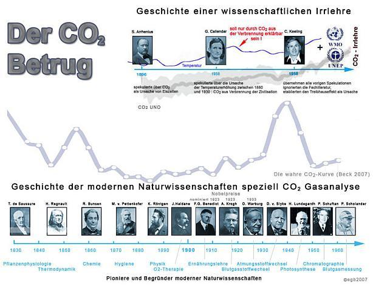
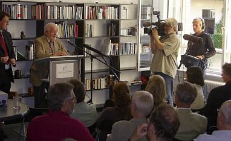
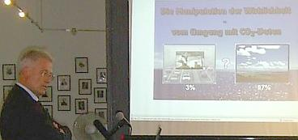
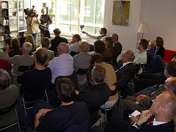

[🠔 Zur Übersicht: CO2-Wahrheiten](7arg07.md)  
# 8. CO2-Lügen und -Wahrheiten 2 - inkl. Die Ozonlochfrage
**8. CO2-Lügen und -Wahrheiten 2 - inkl. Die Ozonlochfrage**  
_von Konrad Fischer_

## Klimawandel - Wieso? Klimahorror - Cui bono?

## Wollt ihr den totalen Klimaschutz? Ökofaschismus Brutal 
Der gröbste Klotz auf den groben Keil 8

##### Wetter-Aufklärung, Kritik + Ketzereien an Politikkatastrophe, am Klimaschutz-Terrorismus, Treibhausschwindel + CO2-Emissions/Ausstoß-Minderungsprogramm, Klimaveränderung, Globale Erwärmung, Klimaerwärmung, Klimawandel-Hysterie, Panikmache + Klimafakten

## 8. CO2-Lügen und -Wahrheiten 2 - inkl. Die Ozonlochfrage

Interessiert es Sie dann vielleicht auch noch, daß: 

* CO2 und sonstige "Klimakillergase" durch nach oben abnehmende Molekulardichte in den ausgemagerten Dünnluftschichten überhaupt keine Wärmerückstrahlwirkung entfalten kann. Versuchen Sie mal das von Ihren vier Wänden reflektierte Licht auf einem Stecknadelköpfli zu spiegeln und damit den Raum besser auszuleuchten! Oder geben Sie mir täglich 100 Dollar, davon gebe ich Ihnen - versprochen, das bekommen Sie auch schriftlich! - täglich drei zurück - wollen Sie so reich werden (christliche Nächstenliebe, die unser Herrgott tausendfältig belohnt, zählt hier leider nicht!)? Aber mit dem Scharlatanerie-Konzept "radiative forcing" und einem Mißbrauch des Strahlungsausgleichgesetzes nach dem alten Prevost, der von der damals noch "unentdeckten" Strahlung grad so viel verstand wie unsere Klimaforscher vom Klima, mag selbst so ein dermaßen alle Naturgesetze hohnlachendes Wunder den Klimaleichtgläubigen wohl gelingen, also her mit den Moneten!; 
* die CO2-Konzentration der Atmosphäre nach Auswertung der Eisbohrkerne bei Klimawechsel sozusagen immer (!) der Temperaturerhöhung nachhinkte, durch alle Warm- und Eiszeiten - erhitzen Sie mal eine Flasche Mineralwasser als Selbstversuch, dann wissen Sie, wie und warum; 
* das angeblich wärmereflektierende/wärmeemittierende CO2-Treibhausdach in 6 Kilometer Höhe etwa -70 Grad Celsius (°C) aufweist (schon mal geflogen und auf die Temperaturangaben des Piloten geachtet?) und es deswegen ein Unding ist, mit eisigen "Heizkörperdecken" wärmere "Fußböden" zu erhitzen; 
* das sogenannte Weltklima und der Charakter / die Daten einer globalen Erwärmung lediglich auf einem aus mickrigen Temperaturmessungen / -aufzeichnungen aufgebauschten Rechenschwindel bestehen; 
* das kassandramäßig vorhergesagte / prognostizierte Abschmelzen der Eisschilde in Grönland, die Eisdynamik, das Szenario und die Modell-Projektionen der Emissionsentwicklung, die Übersäuerung der Ozeane, der Anstieg der Meeresspiegel /Meeresspiegelanstieg, das Umkehren des Golfstroms, zunehmende Uberflutungen und Hochwasserereignisse, kältere Winter, heißere und trockenere Sommer, zunehmende Hurrikane und Tornados usw. keine reale Datenbasis haben (Mitte 2007 wird sogar aufgedeckt, wie die NASA Horromeldungen betr. aktueller Wetterextrema durch Datenmanipulation fälschte!), es früher nach den Wetteraufzeichnungen der Klimageschichte weltweit und den Meßdaten der Geoarchive bedeutend schlimmer war, vor einigen Jahrhunderten sogar der Bischof von Trondheim in Norwegen Wein aus Eigenbau genoß; 
* nur die Wolkendecke aus Wasserdampf den Strahlungsausgleich des Bodens mit dem eisekalten Weltraum behindert, ebenso mit der glutheißen Sonne - Folge der Wolkenbedeckung nachts an der Erdoberfläche: wärmer, tags: kälter, aber auch die kalte Wolke den Boden nicht aufheizen kann, ebensowenig wie ein kalter Heizkörper einen warmen; 
* die angeblich mit dem Kipp & Zonen Pyrgeometer gemessene aufheizende Gegenstrahlung des CO2 gar nicht meßbar ist, da nur die Gesamtstrahlung erfaßt werden kann und dann der angebliche CO2-Anteil mit der WMO-Formel "herausgerechnet" wird - vgl. hierzu das [PDF-Handbuch des Meßgeräts](http://www.eol.ucar.edu/rtf/facilities/isff/sensors/kippzonen/manual_cg4.pdf). Und ausgerechnet Prof. Hans von Storch, einer der maßgeblichen deutschen Klimaforscher hat zugegeben, daß man das Konzept der CO2-Gegenstrahlung erst vor einigen Jahren eingeführt (=erfunden) hat, um die irren Klimamodelle nach Wunsch rechnen zu können, vgl. von Storch, H., Güss, S., Heimann, M., Das Klimasystem und seine Modellierung, Springer-Verlag, Berlin Heidelberg New York, 1999, S. 83, zitiert nach [Heinz Thieme: Zum Phänomen der atmosphärischen Gegenstrahlung](http://www.real-planet.eu/gegenstrahlung.htm); 
* aus all diesen Gründen kein vernünftiges Physikbuch jemals was zum Treibhausgas CO2 herumgeschwindelt hat, 
* die wahre Ursache der letzten Klimaveränderungen schon lange bekannt ist, vergleiche die Infos auf den Links: [www.ozeanklima.de/](http://www.ozeanklima.de/), [www.arctic-warming.com/](http://www.arctic-warming.com/), [www.seaclimate.com/](http://www.seaclimate.com/), [www.warchangesclimate.com/](http://www.warchangesclimate.com/), [www.whatisclimate.com/](http://www.whatisclimate.com/); 
* die CO2-Klima-Erwärmungs-Theorie ein irres Werk von Scharlatanen wie dem alten Schweden Svante Arrhenius - von den damals zumindest honorigen Herren der Kaiser-Wilhelm-Gesellschaft (heute Max-Planck-Institut MPI) herzlich ausgelacht, als er dort im 19. Jh. seine CO2-Utopie vortrug, übrigens als Verursacher der Eiszeiten - und seiner diversen Nachfolger wie G. Callendar und C. Keeling (s.u.) ist; 
* der CO2-Schwindel mit den Emissionsreduzierungen und weniger emissionsintensiven Industrieprozessen von dem beängstigend wuchernden Krebsgeschwür der internationalen und in dicken Autos und Flugzeugen herumvagabundierenden Umweltadministration als perfektes Abzockinstrument und schärfste Marketingwaffe entdeckt wurde, gegen das die verängstigten Bürger total wehrlos sind, dann von der unter Rechtfertigungsdruck geratenen Atommafia mindestens schon in den 70er Jahren des letzten Jahrhunderts dankbar aufgegriffen und erst so recht in Szene gesetzt (lies nach z.B. bei [Ulrich Waas, "Kernenergie - ein Votum für Vernunft", Deutscher Instituts-Verlag, Köln](7thu67.md#waas), seit 1978! zigmal aufgelegt, besonders ab Tschernobyl 1986 gezielt unter die Leute, vor allem die zu bestechenden Politentscheider gebracht), um die Atomangst mit der noch verrückteren Klimawandelangst und Treibhaushysterie bis zur Weltuntergangspanik zu toppen und so als quasi CO2-freier Energielieferant zu reüssieren, wobei die GRÜNEN und ÖKOS aus Eigeninteresse an gnadenloser Ausweitung der Umweltabzocke, aber auch als fünfte Kolonne der Kernkraft (ein Joschka Fischer landet nach seiner aktiven Politkarriere 2009 logischerweise als Berater für die Atomkrake RWE) fleißig mit dran schieben; 
* die ganze Klimawandelei auf vorsätzlich getürkten Computersimulationen und getürktem Datenmaterial aufbaut, nicht auf wahren Beobachtungen und absichtslos erhobenen Meßdaten - vergleichen Sie mal die Ihnen vorgeflunkerten CO2-Hockeystick-Kurven amerikanischer, schwedischer, deutscher und anderer Klimafälscher, Ökobetrüger und pseudowissenschaftlichen Scharlatane und sonstigen breitmäuligen Faselhänse (Karl Marx) mit dieser Kurve des unabhängigen (spricht natürlich aus Sicht der staatlich anerkannten Klimasimulanten gegen ihn) Diplom-Biologen und Chemikers Ernst Georg Beck, der als erster Klimawissenschaftler weltweit [hier die realen und exakten Meßdaten von de Saussure, Robert Bunsen, Max Pettenkofer, Max Warburg, Albert Krogh](http://www.biokurs.de/treibhaus/180CO2_supp.htm) und all den anderen seriösen Forschern seit dem 19. Jh. mal zusammengetragen hat (vgl. auch: [Ernst-Georg Beck bei Readers Edition: "Der CO2-Betrug, der größte Skandal der Wissenschaftsgeschichte der Neuzeit?"](http://www.readers-edition.de/2007/05/07/der-co2-betrug-der-groesste-skandal-der-wissenschaftsgeschichte-der-neuzeit)): 

 
Der CO2-Betrug von Arrhenius, Callendar, Keeling und des IPCC - Geschichte einer wissenschaftlichen Irrlehre (Bildquelle: E.-G. Beck, 2007).

Nach der sensationellen Publikation in einer englischen Fachzeitschrift (deutsche hatten den Text ängstlich abgelehnt) am 30. Mai 2007 in Berlin anläßlich einer internationalen Vortragsveranstaltung des europäischen Instituts für Klima und Energie im [Institut für unternehmerische Freiheit IUF](http://www.iuf-berlin.org/) - als "CFACT-IUF-EIKE-Fachtagung" - erstmals einem erstaunten Fachpublikum, Presse Funk und Fernsehen (ARD, RTL) vorgestellt. Daraus diese Aufnahmen: 

 
[Prof. S. Fred Singer](http://www.sepp.org/), USA, Physiker und Klimawissenschaftler der University of Virginia, ehem. Chef des US Weather Satellite Service, ehemaliger IPCC-Reviewer, Autor von: "Hot Talk Cold Science" und des Bestsellers "Unstoppable Global Warming - Every 1500 Years": _"Wie wissenschaftlich ist das IPCC?" Bericht eines Insiders - Die Klimalügen aus amerikanischer Sicht_ , rechts das Aufnahmeteam des ARD-Journalisten und Filmproduzenten Günter Ederer (aus Plus-Minus und vielen anderen Features bekannt für seine entlarvenden und schockierenden Hintergrundberichte). 
 
Dipl.-Biol. StD Ernst-Georg Beck, Freiburg, Autor von "180 Years of atmospheric CO2 Gas Analysis by Chemical Methods", Energy and Environment, vol. 18, no. 2 2007: [ _"Die Manipulation der Wirklichkeit - vom Umgang mit CO2-Daten." (Link zum Vortrag)_](http://www.eike-klima-energie.eu/daten/berlin30507/berlin1.htm) Nachtrag: [Becks Daten-Doku aus Vortrag in Leiden](http://www.eike-klima-energie.eu/daten/leiden26607/leiden1e.htm) 
 
Das internationale Publikum im vollbesetzten Vortragssaal des Instituts für unternehmerische Freiheit, Berlin. Sie genossen sichtlich den Zusammenbruch der CO2-Lüge, und freuten sich, daß damit der Moment eintrat, den sich der Physiker, Chef des Potsdam-Instituts für Klimafolgenforschung und ehem. Forschungsdirektor des britischen Tyndall Centre for Climate Change Research Hans Joachim Schellnhuber, Klimaberater der Bundeskanzlerin Angela Merkel, in einem Interview für die Süddeutsche Zeitung am 2. Juni 2007 so sehnlich herbeigewünscht hat: _"Ich wäre froh,wenn wir einen fundamentalen Fehler in unseren Klimamodellen entdeckten und alles sich in Wohlgefallen auflöste."_ Hier ist er!

* Temperaturmessungen inzwischen einen Abkühlungstrend belegen - siehe hier: [RSS Analysis of MSU and AMSU Data](http://www.ssmi.com/msu/msu_data_description.html#msu_amsu_trend_map_tls#msu_amsu_trend_map_tls) 
* die arktische Nordwestpassage schon von Roald Amundsen 1906 durchquert wurde, danach auch 1940 und 1944, insofern die aktuelle Passierbarkeit keinerlei Beweis fürmeschengemachte Globalerwärmung sein kann, ebenso das angebliche Wegtauen des Polareises durch die Rekordschneemengen und Polareisausdehnung des Winters 2007-08 in eiskältester Form widerlegt wurde, von der ständigen Zunahme der Antarktis-Vereisung seit zig Jahren mal ganz abgesehen, vgl. [boeblingen.wordpress.com: Die große arktische Eisschmelze: Alles ungerechtfertigte Panikmache](http://boeblingen.wordpress.com/2007/12/30/die-grose-arktische-eisschmelze-alles-ungerechtfertigte-panikmache/) 
* selbst bei Umsetzung der Kyoto/Kioto-Verpflichtungen durch alle internationalen Unterzeichner sich die Globaltemperatur rein rechnerisch (bestimmt nicht faktisch, da neben der Unmöglicheit des Menscheneinflusses auf das von himmlischen Kräften gemachte Wetter beispielsweise die favorisierte Energieeinsparung durch Nachrüstung der Fassade mit Gebäudeisolation / Wärmedämmung / Hausisolierung als WDVS / Wärmedämmverbundsystem kaum sinnvolle und meist nicht wirtschaftliche Energieeinsparung bewerkstelligen kann, da die dabei eingesetzten luftigen [Dämmstoffe mangels Speicherfähigkeit die Solarenergie kaum verwerten](7fehrtab.md)!) nur um lediglich lächerlichste [0,07 Grad Celsius bis 2050 senken ließe;](http://www.achgut.com/dadgdx/index.php/dadgd/article/maxeiner_hatte_recht_natuerlich/) - mit all dem Milliarden-Aufwand (s.u.), den die braungrün verdreckten Ökoschweine, Ökozecken und Ökovampire freilich fröhlich grunzend vereinnahmen werden; 
* die modernen Meteorologen und sogenannten Klimaforscher/Klimatologen (recte: Metorolügen, Klimatolügen, Klimwandel-Simulanten?) schon immer im Umfeld der sich inzwischen CO2-frei aufspielenden Atomindustrie ihr immer fetter werdendes Süppchen kochten, da sie unseren Demokratur-Tyrannen im kalten Krieg rechtzeitig zu melden hatten, wieviel Zeit nach dem Atompilz bleibt, um in den wohlgeschützten Regierungsbunker wie lange abzutauchen und auch deswegen mit dem strommonopolaren Atomkomplex nach wie vor sehr herzlich verbunden sind; 
* schon alleine die umweltpolitische Nutzung des CO2-Arguments durch die bedenkenlos weiter CO2-emittierenden Umwelt-Politiker dessen Wahrheitsgehalt logischerweise aufheben muß; 
* demzufolge der ganze von der klimaverängstigten Massenpsychose zur klimaangstbesessenen Massenhysterie und Massenpanik mutierte Klimaschutzschwindel als schwefeligste Ökoteufelei ein Werk von gewissenlosen Gangstern, Industriellen, Wissenschaftlern, Politikern, Medien, profitgeilen Mitläufern und ahnungslosen Gutmenschen ist, zu denen auch "normale Menschen" wie Du und ich gehörten oder noch gehören, und nichts anderem als der perfidesten Abzocke dient??? 

Ein bißchen Ozonloch-Aufklärung 

Sie interessiert auch die Gegenmeinung zur Ökolüge rund um Ozon, leiden als Klimaschutz-Rebell in spe vielleicht auch an dieser Klimapsychose und Klimahysterie?: 

* Ozon (O3) entsteht durch Beschuß mit Strahlung der Sonne auf die O2s (Sauerstoffmoleküle) der Atmosphärenhülle. 
* Im Winter ist weniger Solarstrahlung, es entsteht weniger Ozon; das angebliche Ozonloch entsteht immer über der Polkappe der jeweiligen "Winterseite" des Globus. Im Sommer "schließt" es sich dann wieder – eben je nach Strahlungsaktivität der Sonne. 
* Wenn nun die Winterstrahlung auf eine dünnere "Ozonschicht" stößt und "weiter" nach innen/unten vorstößt, wird sie deswegen weniger gefiltert? Aber nein, da sind doch mehr als genug O2s, halt etwas weiter unten und logischerweise mehr und mehr an Molekulardichte zunehmend, die dann zu schützendem O3 geknackt werden. Woher dann die zunehmenden Ozonwerte im Sommer? Googlen Sie doch selber mal, bis hierher haben Sie es doch auch schon geschafft. Und ich weissage Ihnen: Nicht von der sommerlich-erstarkten Ozonschicht heruntergefallen. Lesen Sie hierzu auch die blamable [Widerlegung des Ozonlochschwindlers Mario Molina vom MIT durch den Chemie-Nobelpreisträger Kary Mullis.](7wdvs04.md#mullis) 
* Wem nutzt also die Ozonpanik? Dem Besitzer des auslaufenden Patents für das Kühlmittel FCKW (ein schweres inertes Gas, das weder in die Höhe der Ozonschicht aufsteigen kann, noch mit dieser reagieren) und seinem patentierten Nachfolgeprodukt, seinen perfiden Auftragswissenschaftlern und vielen weiteren Öko- und Politbanditen. 
[ Wie das Märchen vom gefährlichen Ozonloch entstand - Die Vorlage für das Kyotoprotokoll](http://www.eike-klima-energie.eu/news-cache/wie-das-maerchen-vom-gefaehrlichen-ozonloch-entstand-die-vorlage-fuer-das-kyotoprotokoll/) 

Weiter: Teil 9: [9. Germany merkelized from East to West](7arg09.md) 

---

---

Martin Durkin: **The Great Global Warming Swindle** , CD mit dem sensationellen Klimaschocker-Film, der die mediale Aufklärung rund um den Ökoterrorismus kräftig anfeuerte.

**Empfohlene Literatur der führenden deutschen und internationalen Ökokritiker / Klimaleugner / Klimaschutzskeptiker / Wetterkundler / Klimahistoriker:** 

---

Empfohlene Links: 
[Bücher Pro & Contra Ökowahn (Crichton, Rahmstorf, Schellnhuber, Hug, Thüne, Gold u.v.a.)](8buch22.md) - Fetzige Buchrezensionen: Klimaschocker, Klimalügen und Klimaaufklärung 
[IN formation F ür A ufgeklärte S teuerbüger der F orschungsgruppe A bgeordneteninduzierte Q ualen (INFAS/FAQ)](7thu62.md) 
[Argus: Glaubensbekenntnis: Ökologie + Ökonomie müssen keine Gegensätze sein - Wie man mit einfachem Abschalten von Standby-Geräten das Klima retten kann.](7argus2.md) 
[Hintergründe, Fakten, Emotionen - Vergnügliches und Verdrießliches zur Klimaschutzsauerei und Treibhauseffektlüge](7thuene1.md) - da geht die Post ab ... 
[Zur staatlichen Vergeudung der Klimaschutzsubventionen aus Steuermitteln mittels Günstlingswirtschaft - aus einem Bundesrechnungshofbericht"](7thu54.md) 
Maria Ackermann: "[Klimawandel und Klimalügen - Fakten und Aufklärung zum Klimaschutz-Beschiß](7klima.md)" 
Marcel Ott, Anton Schönfeld: "[Der Globale Klimawandel](7klima2.md)" 
[Die Filme/Videos/Fernsehsendungen zum Klimaschwindel und Klimaschutzterror](7video.md) +++ [Dr. Helmut Böttiger: Rette die Erde und bringe Dich um!](7boet1.md) - Die Klimaapokalypse als Massenmordwaffe / Massenvernichtungswaffe 
[Dr. Helmut Böttiger: Klimakatastrophe - Warum gerade CO2? / Massenbesteuerungswaffen + Finanzsystemschutz](7boet3.md) Der Treibhausschwindel, die Klimaschutzdiktatur und ihre Klimaschutzlüge - Cui Bono? Ein entlarvender Striptease 
Dr. Albert Glatzle: "[Klimaschädlich? Kohlendioxydemissionen aus Landwirtschaft und Viehwirtschaft](7klima3.md)" 
**Brisant:**[Die perverse Geschichte der GRÜNEN](7thu68.md) 
[1. FDP EIKE Klima-Abend am 17.4.08 in Berlin](http://www.eike-klima-energie.eu/?WCMSGroup_4_3=6&WCMSGroup_6_3=1247&WCMSArticle_3_1247=350 ) - mit Dr. Hans Labohm (Ökonom, IPCC Reviewer), Prof. Dr. Horst Malberg (ehem.Direktor des Instituts für Meteorologie der Freien Universität Berlin), Dr. Dietmar Ufer (Energiewirtschaftler), Thomas Heinzow (Diplom-Sozialökonom, Diplom-Betriebswirt, Meteorologe, Forschungsstelle Nachhaltige Umweltentwicklung Uni Hamburg) +++ [Norbert Deul/Hausgeld-Vergleich entlarvt den Klimaschutzsatanismus der Poliducker und Ministerialratten](http://hausgeld-vergleich.de/Deul_weitereNews_112.htm) 
[Deutsche Webseite des Tschech. Präs. Vaclav Claus - Gegen den ÖKOTERROR](http://de.liberty.li/magazine/url.php?id=4226) 
[Prof. Dr. Gerhard Gerlich: Physikal. Grundlagen des Treibhauseffektes + fiktiver Treibhauseffekte](http://www.ib-rauch.de/datenbank/vortrag-leipzig.html) 
[Dipl.-Phys. Alvo von Alvensleben - Die falschen Klimawandel-Argumente des Merkelberaters Prof. Rahmstorf!](http://www.schulphysik.de/klima/alvens/antwort.html) 
[Dipl. Phys. M. Müller: Gedanken zum Treibhaus Erde / Widerlegung der CO2-Hypothese](http://home.arcor.de/meino/klimanews/index.html#53531198c90bc3305#53531198c90bc3305) 
[www.klimamanifest-von-heiligenroth.de/](http://www.klimamanifest-von-heiligenroth.de/) 
[www.naturschutzparadox.de/](http://www.naturschutzparadox.de/) - Naturschutzverbände und Klimahysterie 
[Ein Hammer: muslim-markt.de interviewt Prof. Dr. Gerhard Gerlich zum amtlichen Klimabeschiß](http://www.muslim-markt.de/interview/2007/gerlich.htm) 
[tcsdaily.com - Hans H.J. Labohm: Proliferation of Climate Scepticism in Europe](http://www.tcsdaily.com/article.aspx?id=110107A) 
[Climate science at it's best - global warming a hoax? See here the facts!](http://www.oism.org/pproject/s33p36.htm) 
[www.globalwarmingskeptics.info/](http://www.globalwarmingskeptics.info/) - Boring for few, exciting for many! The name is the program! 
[Andrew's "The Anti "Man-Made" Global Warming Resource, STOP the hysteria"](http://z4.invisionfree.com/Popular_Technology/index.php?showtopic=2050) - Great hot stuff! 
[Die kritisch-informative Seite des Wissenschaftsjournalists Edgar Gärtner, Autor von "Öko-Nihilismus": Analysen - Konzepte - Trends](http://www.gaertner-online.de/) 
[Marc Moreno's Thrilling Climate News and Comments - Denialism at it's best](http://www.climatedepot.com/) 
[Energiespar- und Klimaseite - Hintergründe der Klimawandel-Panikmache](7wsvoant.md) 
[ <======== **ZeitGeist 1/09: Kontra Ökobetrug**](https://zeitgeist-online.de/index.php/printausgabe/13-heft-nr-29-1-2009/96-qpottdicht-isolierte-raeume-sind-die-bausuende-nummer-einsq) 
[ **Das Skeptiker-Handbuch - Bildklick zum Download**](http://www.eike-klima-energie.eu/klima-anzeige/skeptiker-handbuch-fuer-den-rest-von-uns/?tx_ttnews%5Bpointer%5D=1) ========> 
[ZeitGeist-Magazin: Zur Klimareligion und anderen brennenden Fragen](http://zeitgeist-online.de/) 
[Joanne Nova - Das Skeptiker-Handbuch (deutsch)](http://joannenova.com.au/2009/05/16/das-skeptiker-handbuch-has-arrived/#comment-6926#comment-6926) 
[Sensation kontra Ökommunismus! Aus Monatszeitung der Kommunistischen Partei Deutschlands KPD(B): 'From Silent Spring to Global Warming – eine kleine Geschichte des Ökologismus'](http://ta.kpdb.de/archiv/16-maerz-2009/106-from-silent-spring-to-global-warming--eine-kleine-geschichte-des-oekologismus) 
[Spannend: Ein Klimaschwindler beichtet seine politisch erpressten Betrügereien](http://www.beichthaus.com/index.php?h=index&c=00023746&PHPSESSID=a8bf26ce197d1f22f8325c7289bb6cfe) 
[Steve McIntyre's Website / Blog Climateaudit](http://www.climateaudit.org/) 
[Steven Milloy presents www.junkscience.com/ - Junk climate science at it's best!](http://www.junkscience.com/) 
[Wolf Lotter in brand eins 3/2007: "Kommentar: Zweifel im Klimakterium - Das eigentliche Problem mit dem Weltklima ist der Verlust des Denkvermögens."](http://www.brandeins.de/home/inhalt_detail.asp?id=2254&MenuID=8&MagID) 
[Frankfurter Allgemeine Zeitung FAZ 3.4.07: "Wider die Klimahysterie - Mehr Licht im Dunkel des Klimawandels"](http://www.faz.net/s/RubC5406E1142284FB6BB79CE581A20766E/Doc~E128116B52BAB4E73A398F4CC7CC6388A~ATpl~Ecommon~Scontent.html) - von Christian Bartsch 
[Prof. Rahmstorf und der verzweifelte Versuch, die Klimakatstrophe zu retten](http://klimakatastrophe.wordpress.com/2008/03/16/prof-rahmstorf-und-der-verzweifelte-versuch-die-klimaerwarmung-zu-retten/#comment-456#comment-456) 
[BILD 30.3.07: "Klima-Alarm - Hat die Erderwärmung nichts mit CO2 zu tun?"](http://www.bild.t-online.de/BTO/news/2007/03/30/klima-alarm/oeko-luege.html) 
[Campo News Blog: Schönes Grün: 2022 - die nicht überleben wollen](http://www.campodecriptana.de/blog/2007/09/13/921.html) 
[EIKE, Europäisches Institut für Klima und Energie, Jena](http://www.eike-klima-energie.eu/) - der Zusammenschluß deutscher Klimaskeptiker 
[Wetter und Klima Fakten ](http://www.wetterklimafakten.eu/) - eine kritische Betrachtung der Klimadiskussion! 
[Rainer Hoffmanns Sammlung klimakritischer Dokumente ](http://web.archive.org/web/20071127014442/www.solarresearch.org/1478062.htm) - Ein Muß! 
[Financial Times Deutschland FTD: Gastkommentar von Vaclav Klaus: "Klima-Wahrheiten. Nicht die Umwelt ist gefährdet, sondern die Freiheit. ..."](http://www.ftd.de/meinung/kommentare/:Gastkommentar Klima Wahrheiten/213649.html) 
["Klimakatastrophe: Entwarnung aus dem Umweltministerium"](http://www.ef-online.de/?p=95) - Muß die Kernkraft das Klima retten? Oder die "erneuerbaren" Energien? Oder die Klimaschutzpolitik? Oder Ich und Du, Müllers Esel oder wer sonst? 
[Dipl.-Biol. E. Beck: "Der Wasserplanet. Dokumentation einer anthropogenen Irrlehre."](http://www.egbeck.de/treibhaus/) - Seriöseste Facts gegen die anschwellende Ökodiktatur der internationalen Klimaschutzterroristen 
[Klimasimulation - ein Werk von Lügnern, Wahrheits-Leugnern oder gar Schwindlern? Bilden Sie sich weiter und eine eigene Meinung zum Treibhauseffekt, lesen Sie hier!](http://www.biokurs.de/treibhaus/otreibh2.htm) 
[Hartmut Bachmann: Klimaüberraschung](http://www.klimaueberraschung.de) 
[Klimanotizen.de und feinsinnigste Klimaketzereien](http://www.Klimanotizen.de) 
[Vereinigung gegen abiträre Steuerpolitik in Luxemburg und gegen die CO2-Hysterie](http://www.gaspl.eu.tt) 
[Burghard Schmanck: Schmanckerl zum Klimaterror, Linkliste, historische und theologische Entlarvungen](http://www.schmanck.de/) - Ein Lateiner reißt allerlei Schwindeleien die Maske runter 
[Der Treibhausgas- und CO2-Betrug und die CO2-Lüge, der Hochwasser-Schwindel, das Ozon-Märchen und sonstige Grausamkeiten der Ökodiktatur - von Joh. Maas](http://www.www.co2betrug.de/) 
[Treibhauseffekt, Klimawandel, Ozonloch - profitable Lügen](http://www.chemtrails-info.de/chemtrails/klimawandel-luegen.htm) 
[treibhausluege.de - Ein neuer Info-Blog](http://www.treibhausluege.de/) 
[wahrheiten.org - Info zur Klimalüge](http://www.wahrheiten.org/blog/klimaluge/) 
[klimaskeptiker.info - Der Name ist Programm](http://www.klimaskeptiker.info/) 
[Der kritische Wissenschaftsjournalist und Hydrobiologe Edgar Gärtner im Magazin Novo über auf Eis gelegte Fakten und Klimaesoterik: "Es gibt keine globale Erwärmung!"](http://www.novo-magazin.de/85/novo8518.htm) 
[Oliver Marc Hartwich, CAPITAL 13.5.07: "Die grünen Geister, die Frau Thatcher mit ihrer Klimadebatte rief"](http://www.capital.de/politik/100006382.html?eid=100005249) 
[http://www.naeb.info/ - Nationale Anti-EEG-Bewegung](http://www.naeb.info/) 
[Der Exxon/Esso-Klimabeschiß - Scenes from the climate inqusition](http://www.nowpublic.com/scenes_from_the_climate_inquisition) [www.warwickhughes.com/hoyt/scorecard.htm - Greenhouse Warming Scorecard - a comparison of greenhouse model predictions with actual observations](http://www.warwickhughes.com/hoyt/scorecard.htm) 
[John Ray, Brisbane: Antigreen Blogspot - Greenie Watch](http://antigreen.blogspot.com/) 
[Jens Christian Heuer: weltenwetter.blogspot.com - Klimaaufklärung durch Wetterbeobachtung](http://weltenwetter.blogspot.com/) 
[Klimawandel, Apokalypse und der Staat: Eine nüchterne Betrachtung auf dem Weg zur &Oumlkodiktatur](http://de.liberty.li/magazine/?id=3843) 
[Deutsche Welle, Panorama: "Die Kultur des Klimas" - Der Klimawandel war schon immer - Kein Grund zur aktuellen Besorgnis](http://www.dw-world.de/dw/article/0,2144,1036298,00.html) 
[Die Ministerin für den Ländlichen Raum BW, Pressemitteilung 110/2000: Weinreben gediehen sogar in Grönland - so war das Klima früher](http://www.mlr.baden-wuerttemberg.de/content.pl?ARTIKEL_ID=3193) 
[Ökologismus.de - Aufklärung gegen den Ökolügismus & für Klimaketzer](http://www.oekologismus.de/) 
[SCIENCE & ENVIRONMENTAL POLICY PROJECT](http://www.sepp.org/) - Prof Fred Singer's Site for Climate skeptics / Mass of info, links & documents 
[Gibt es überhaupt eine globale Erwärmung? - Is Global Warming real ?](http://www.geocraft.com/WVFossils/global_warming.html) - Offizielle Tatsachen, Belege und Beweise gegen den Ökoirrsin und CO2-Abzockschwindel 
[GEOPHYSICAL RESEARCH LETTERS, VOL. 34, L01602, doi:10.1029/2006GL028492, 2007: S. J. Holgate: On the decadal rates of sea level change during the twentieth century - Der Meeresspiegelanstieg hat sich in den letzten 50 Jahren verlangsamt!](http://www.agu.org/pubs/crossref/2007/2006GL028492.shtml) 
[Wahrheitssuche: Der Treibhaus-Schwindel - Alle Facts auf einen Blick](http://www.wahrheitssuche.org/treibhaus.html) 
[Oliver Lehmann: CO2-Diskussion, oder: Wie zocke ich zu Beginn des 21. Jahrhundert den Autofahrer erneut ab, ohne dass er es sofort bemerkt?](http://w463.de/co2.htm) 
**Texte zur Rekonstruktion des Faschismus in Deutschland:** [Das Antidiskriminierungs-Bundessicherheitshauptamt](8philipp.md#das) 
[Staat - Provinz - Kolonie?](8philipp.md#staat)

---

Themen auf dieser und den anderen Seiten dieser Homepage: Treibhauseffekt, Treibhaus Erde, Unwetter, Tornados, Abschmelzende Polkappen, Schmelzende Gletscher, Gletscherschmelze, Zunahme Hochwasser, Hochwasserrereignisse, Tornado, Hurrikan, Stürme, Kleine Eiszeit, Wetterkontrolle, Klimakontrolle, Klimaschutzprotokoll, Kioto-Protokoll, Kyoto-Prozeß, IPPC, Klima-Verbrecher-Jagd, Klimaterror und Pseudowissenschaft, Klimasünder, Klimasünderbestrafung, Klimaleugnerverfolgung, Betrug, Betrügerei, Taktik, Strategie, politischer Schwindel, Simulation, pseudowissenschaftliche Klimasimulation, Klima, Klimaschutz, Klimasünder im Visier: Kühe, Kuhherden, Schafe, Schafherden, Rind, Rinder, Rinderherden, Ziegen, Ziegenherden, Hühner, Schweine, Fried Chicken, Freilandschweine, Ökoschwein, Ökoschweine, Ökosau, Ökosäue, Ökodrecksau, Ökodrecksäue mit Naturschützer - Naturschutz - / Klimaschutz - Ökosiegel, McDonald - Hamburger, Steakhouse, Hamburgerketten + Big Mac + Burgerking. Klimaschützer, Umwelt, Klimaapokalypse, Klimasarkasmus, Klimaironie, Klimagroteske, Klimazynismus, Klimahysterie, Klimakatastrophismus, Klimaschutzhysterie, Klimapanik, Klimapanikmache, Klimaschwindel, Klimaschutzschwindel, Klimalüge, Klimaschutzlüge, Klimaterroror, Ökoterror, Ökologische Tyrannis, Ökoterrorismus, Ökodiktatur, Ökomärchen, co ², Ökoverbrecher, Öko-Abzocke, Klimaabzocke, Klimaschutz-Abzocke, Klimaschutzgelder, Klimaverängstigung, Tyrannei, Weltklimarat, falsche Wetter-Prophetie, Klima-Propheten, Weltklimabericht, Klimaschutzabgaben, Durchschnitt, Klimaschutzsteuer, Klimamafia, Wissenschaftsschwindel, Wissenschaftsbetrug, Wissenschaftsmärchen, Wissenschaftslügen, Klimatyrannei, Klimatyrannis, Klimaschutztyrannei, Klimaschutztyrannis, Ökotyrannis, Ökotyrannei, Junk science, Öko-Revolution, Klimawissenschaft, Klimaschutz-Profit, Klima-Profiteure, Energie-Monopole, Atomkraft, Atom-Industrie, Kernkraft, Klimawissenschaftler, Klimaschutz-Prognostiker, Klimaprognose, Vorhersage, Klimavorhersage, Klimaschutzmärchen, Klimasimulation, Klimasimulanten, Wettervorhersage, Wetterwechsel, Wetteränderung, Klimavorhersage, Pro und Kontra, Skepsis, Skeptiker, Stromwirtschaft, Erdöl, Ö-Lobby, Lobbykratur, Lobbyisten, CO2, Kohlendioxid, Meteorologie, Meteorologe, Klimamessung, Klimaänderung, Klimawechsel, Klimawandel, Klimaforscher, Klimaforschung, Natur, Naturschutz, Naturschützer, Ökologie, Umwelt, Umweltschutz, Klimafolgen-Forschung, Mojib Latif, Professor Stefan Rahmstorf, Prof. Dr. Hans Joachim Schellnhuber, Umweltschützer, Klimaberater, Klimaexperten, Potsdam-Institut für Klimafolgenforschung, Globale Erwärmung, Klimasimulation, Global Warming, Climatic Change, Fossile Energie, Alternative Energie, nachwachsende Rohstoffe, Kohle, Erdgas, Gas, Strom, Verstromung.
