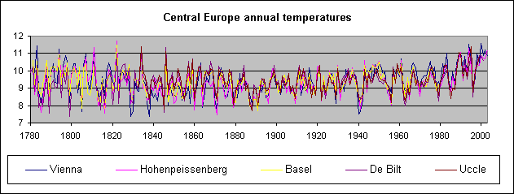

[🠔 Zur Übersicht: Klimawandel - Cui bono?](7argus.md)  
# 14. Wie funktioniert der Ökoschwindel / Klimaschutz-Betrug 1?
**Wie funktioniert eigentlich der uns in allen Lebensbereichen überfallende Ökoterror der Ökopiraten rund um die „globale Erwärmung“ und den „menschengemachten Klimawandel“, was sind seine Voraussetzungen, Grundlagen und Werkzeuge?**  
_von Konrad Fischer_

## Klimawandel - Wieso? Klimahorror - Cui bono?

## Wollt ihr den totalen Klimaschutz? Ökofaschismus Brutal 
Der gröbste Klotz auf den groben Keil 14

##### Wetter-Aufklärung, Kritik + Ketzereien an Politikkatastrophe, am Klimaschutz-Terrorismus, Treibhausschwindel + CO2-Emissions/Ausstoß-Minderungsprogramm, Klimaveränderung, Globale Erwärmung, Klimaerwärmung, Klimawandel-Hysterie, Panikmache + Klimafakten

> [!abstract]+ Kapitelübersicht: Ökoschwindel 101  
> 1. **14. Wie funktioniert der Ökoschwindel / Klimaschutz-Betrug 1?**
> 2. [15. Wie funktioniert der Ökoschwindel / Klimaschutz-Betrug 2? - Politik, Wissenschaft und Ökomedien](7arg15.md)
> 3. [16. Wie funktioniert der Ökoschwindel / Klimaschutz-Betrug 3? Al Gore - ein polnischer Lügner?](7arg16.md)
> 4. [17. Wie funktioniert der Ökoschwindel / Klimaschutz-Betrug 4? Sogar in Bayern!](7arg17.md)
> 5. [18. Wie funktioniert der Ökoschwindel / Klimaschutz-Betrug 5? Klimaschutz-Gewinner und -Verlierer](7arg18.md)

## 14. Wie funktioniert der Ökoschwindel / Klimaschutz-Betrug 1?

Wie funktioniert eigentlich der uns in allen Lebensbereichen überfallende Ökoterror der Ökopiraten rund um die "globale Erwärmung" und den "menschengemachten Klimawandel", was sind seine Voraussetzungen, Grundlagen und Werkzeuge? Wissenschaftliche Fakten, treusorgende Klimapolitik hochmögender Volksvertreter, die sich geradezu bis zum geht nicht mehr verzehren in treueschwur- und amtseidbesiegelter Sorge um das ihnen von der großen Masse der Wähler demokratisch anvertraute Staatsvolk? Die wahren Temperaturdaten aber - seit urdenklichen Zeiten in sog. Geoarchiven (Eisbohrkerne, Sedimente, Baumringe, ...) gespeichert, seit jüngerer Zeit in soliden Temperaturmesswerten, lassen einen Rückschluß auf eine menschengemachte Erwärmung gar nicht zu - siehe z.B. diese Grafik "Central Europe annual temperatures" seit 1780 (Grundlage: Temperatur-Meßdaten!) und all die anderen aus Hans Erren: "A debatable European summer temperature since 1500" in [members.lycos.nl/errenwijlens/co2/errenvsluterbacher.htm](http://members.lycos.nl/errenwijlens/co2/errenvsluterbacher.htm): 

 oder die Grafiken und wissenschaftlichen Bewertungen in John P. Bluemle (State Geologist and Director, North Dakota Geological Survey): ["John P. Bluemle: GLOBAL WARMING: A GEOLOGICAL PERSPECTIVE (PDF)"](https://www.dmr.nd.gov/ndgs/Newsletter/NL99W/PDF/globlwrmw99.pdf). 

Warum mutieren Staat, Wissenschaft, Wirtschaft und Medien, gleichgeschaltet und entchristlicht wie Anno Dunnemals, dennoch immer weiter zu frankensteinmonströsen Ökoterroristen, verbreiten das Schauermärchen vom menschengemachten Weltuntergang und erpressen damit Klimaschutzgelder? Energiesparlampenzwang durch Glühbirnen-Verbot, Altauto-Zwangsverkauf nach Afrika dank Besteuerung des CO2-Ausstoßes der Motoren und Klimaabgabe für "umweltschädliche" PKW's / Autos / Kraftfahrzeuge, neue Zukunft der nuklearen Unfälle dank Atomenergie, bürgerbelastender Handel mit Luftverschmutzungsrechten (CO2-Zertifikate - von der Regierung aus dem Nichts geschaffen, teuer unter den CO2-Emittenten versteigert und auf die klimasündigen Bürger als Ablaß umgelegt - eine neue Quelle zur Hinauszögerung des Staatsbankrotts!), ineffizienteste Öko-Alternativen von Solarkollektoren über Erdsonden bis zu Biogasanlagen als "Zukunftstechnologie", klimaschutzdiktatorische Regierungsvollmachten - alles zur Reduzierung des Kohlendioxidausstoßes? 

Warum beten auch ökotranceverzückte Kirchenkreise die sonnengoldenen Kälber des Öko-Aberglaubens der GAIA-Religion und Klimaschutz-Prawda aus dem IPCC-Kreml so heftig an? Was soll all die sozialistische und subventionsbetrügerische Planwirtschaft unserer ökofrontvereinigten GRÜNEN+ROTEN, KONSERVATIV-CHRISTLICHEN+LIBERALEN Parteimißwirtschaftler und Polithanseln als Selbstmordattentat auf Raten? Warum zocken die Ökogangster ungeheuerliche Geldströme aus dem privaten und gewerblichen Sektor immer raffinierter, unverschämter und perfiderer ab und spendieren/stopfen/versenken sie in allerunsinnigste "Goldmacherprojekte" bis zum totalen Staatsbankrott, wer füllt sich da die Taschen? Soll das der schauerliche Gipfel, der gefürchtete Endsieg des Kapitalismus sein, der totale Krieg bis zur ultimativen Endlösung der Ökofrage - die Ausrottung des Menschengeschlechts (in den Augen der Ökofaschos ohnehin nur die lepröse Pest der Mutter Gaia-Erde)? 

Widerliche Abnahmegarantien, zigjährig staatlich verbürgte Förderszenarien für nahezu jeden Ökoblödsinn und Ökoschrott, Taschenstopfen bis zum Anschlag, lobbymäßig anonymes Sponsorieren von Regierung und Ministerien (!), Bauzwang und Brutalförderung für [Dämmstoff, der gar nicht dämmt und den Energieverbrauch vermehrt](7fehrtab.md), schauerliche Schreckensszenarien mit [angeblich ausgehenden angeblich fossiler Energien](8buch22.md#gold), Ausmerzung [preisgünstiger und sicherer Energiegewinnung](7boet2.md), sonstige Untreuehandlungen, Bestechung und Vorteilsnahme an allen Ecken und Enden auf Teufel komm raus und keinerlei Wirtschaftlichkeit bis zum St. Nimmerleinstag trotz aller abgefeimten Heucheleien und KfW-Kreditierung - natürlich mal abgesehen von den Begünstigten auf Seiten der Vorteilsgewährer und Vorteilsempfänger? 

Na klar, der Hauptantreiber des Schwindels sind die ungedeckten Irrsinnsgeldsummen, die die Privat-Besitzer der Gelddruckpresse in die Welt setzen. Sie brauchen für ihr immer schlechter werdendes Geld aus dem Nichts - fiat money -, das sie gegen Zins und Zinseszins an Staat und Privat ausleihen, eine Deckung aus dem Nichts. Da kommen CO2-Zertifikate, Emissionsrechte, gewillkürte Verteuerung eigentlich wohlfeiler Güter, Zwangsabgaben auf dieses und jenes usw. grad recht. Und die Banker-Marionetten - "unsere" Polithanseln - und sonstigen Großschuldner wie Industrie und die an das Bereicherungs- und Geldfälschungssystem angeschlossenen Banken müssen daß decken und dem doofen Muffi verkaufen. Ebenso wie den güterzerstörenden und bedarfsweckenden Krieg gegen Terror, West gegen Ost, Nord gegen Süd usw.usf. Sonst wird der Hahn abgedreht und notfalls Rübe ab. Auch nur eine Verschwörungstheorie? Sei's drum. 

Wieso läßt sich unsere "Gesellschaft" - vom deutschen Volke können und wollen und dürfen wir Totalglobalisierten ja gar nicht mehr reden - die lachhaften Fußball-Patriotismus-Tobsuchtsanfälle sind schon lange verdampft, der Rest ist PISA - vom übelbeleumundetsten und totalentsittlichten Partei- und Regierungsgesochse und den allzubekannten "Klima"-Pfeifen (Namen werden nicht genannt, schaun Sie bitte selber in Ihre göbbelisierte Volksverhetzungs-/Volksempfänger-Glotze und Ihr Streicher-schmieriges Käsblättla) dermaßen hereinlegen und immer weiter gängeln und kirre machen? Ist ein normales Leben künftig nur noch als Öko-Mitläufer und Klimaschutz-Jünger all der falschen Propheten möglich? Wer nicht mitmachen will, wird dann sicher bald mit den gerade hierzulande bestens bewährten Meinungsgesetzen zur Terrorstaatsräson gebracht, wenn notwendig lebenslänglich weggesperrt oder zumindest totgeschwiegen. Wie lange wird es noch dauern bis zur totalen Machtübernahme der geldgeschäftsgesteuerten Ökofaschisten? Wo doch der gezähmte Widerstand wie immer nur noch mit Dünnpfiff in der Unterhose rumdruckst ... 

Weiter Teil 15: [15. Wie funktioniert der Ökoschwindel / Klimaschutz-Betrug 2? - Politik, Wissenschaft und Ökomedien](7arg15.md) 

---

Martin Durkin: **The Great Global Warming Swindle** , CD mit dem sensationellen Klimaschocker-Film, der die mediale Aufklärung rund um den Ökoterrorismus kräftig anfeuerte.

**Empfohlene Literatur der führenden deutschen und internationalen Ökokritiker / Klimaleugner / Klimaschutzskeptiker / Wetterkundler / Klimahistoriker:** 

---

Empfohlene Links: 
[Bücher Pro & Contra Ökowahn (Crichton, Rahmstorf, Schellnhuber, Hug, Thüne, Gold u.v.a.)](8buch22.md) - Fetzige Buchrezensionen: Klimaschocker, Klimalügen und Klimaaufklärung 
[IN formation F ür A ufgeklärte S teuerbüger der F orschungsgruppe A bgeordneteninduzierte Q ualen (INFAS/FAQ)](7thu62.md) 
[Argus: Glaubensbekenntnis: Ökologie + Ökonomie müssen keine Gegensätze sein - Wie man mit einfachem Abschalten von Standby-Geräten das Klima retten kann.](7argus2.md) 
[Hintergründe, Fakten, Emotionen - Vergnügliches und Verdrießliches zur Klimaschutzsauerei und Treibhauseffektlüge](7thuene1.md) - da geht die Post ab ... 
[Zur staatlichen Vergeudung der Klimaschutzsubventionen aus Steuermitteln mittels Günstlingswirtschaft - aus einem Bundesrechnungshofbericht"](7thu54.md) 
Maria Ackermann: "[Klimawandel und Klimalügen - Fakten und Aufklärung zum Klimaschutz-Beschiß](7klima.md)" 
Marcel Ott, Anton Schönfeld: "[Der Globale Klimawandel](7klima2.md)" 
[Die Filme/Videos/Fernsehsendungen zum Klimaschwindel und Klimaschutzterror](7video.md) +++ [Dr. Helmut Böttiger: Rette die Erde und bringe Dich um!](7boet1.md) - Die Klimaapokalypse als Massenmordwaffe / Massenvernichtungswaffe 
[Dr. Helmut Böttiger: Klimakatastrophe - Warum gerade CO2? / Massenbesteuerungswaffen + Finanzsystemschutz](7boet3.md) Der Treibhausschwindel, die Klimaschutzdiktatur und ihre Klimaschutzlüge - Cui Bono? Ein entlarvender Striptease 
Dr. Albert Glatzle: "[Klimaschädlich? Kohlendioxydemissionen aus Landwirtschaft und Viehwirtschaft](7klima3.md)" 
**Brisant:**[Die perverse Geschichte der GRÜNEN](7thu68.md) 
[1. FDP EIKE Klima-Abend am 17.4.08 in Berlin](http://www.eike-klima-energie.eu/?WCMSGroup_4_3=6&WCMSGroup_6_3=1247&WCMSArticle_3_1247=350 ) - mit Dr. Hans Labohm (Ökonom, IPCC Reviewer), Prof. Dr. Horst Malberg (ehem.Direktor des Instituts für Meteorologie der Freien Universität Berlin), Dr. Dietmar Ufer (Energiewirtschaftler), Thomas Heinzow (Diplom-Sozialökonom, Diplom-Betriebswirt, Meteorologe, Forschungsstelle Nachhaltige Umweltentwicklung Uni Hamburg) +++ [Norbert Deul/Hausgeld-Vergleich entlarvt den Klimaschutzsatanismus der Poliducker und Ministerialratten](http://hausgeld-vergleich.de/Deul_weitereNews_112.htm) 
[Deutsche Webseite des Tschech. Präs. Vaclav Claus - Gegen den ÖKOTERROR](http://de.liberty.li/magazine/url.php?id=4226) 
[Prof. Dr. Gerhard Gerlich: Physikal. Grundlagen des Treibhauseffektes + fiktiver Treibhauseffekte](http://www.ib-rauch.de/datenbank/vortrag-leipzig.html) 
[Dipl.-Phys. Alvo von Alvensleben - Die falschen Klimawandel-Argumente des Merkelberaters Prof. Rahmstorf!](http://www.schulphysik.de/klima/alvens/antwort.html) 
[Dipl. Phys. M. Müller: Gedanken zum Treibhaus Erde / Widerlegung der CO2-Hypothese](http://home.arcor.de/meino/klimanews/index.html#53531198c90bc3305#53531198c90bc3305) 
[www.klimamanifest-von-heiligenroth.de/](http://www.klimamanifest-von-heiligenroth.de/) 
[www.naturschutzparadox.de/](http://www.naturschutzparadox.de/) - Naturschutzverbände und Klimahysterie 
[Ein Hammer: muslim-markt.de interviewt Prof. Dr. Gerhard Gerlich zum amtlichen Klimabeschiß](http://www.muslim-markt.de/interview/2007/gerlich.htm) 
[tcsdaily.com - Hans H.J. Labohm: Proliferation of Climate Scepticism in Europe](http://www.tcsdaily.com/article.aspx?id=110107A) 
[Climate science at it's best - global warming a hoax? See here the facts!](http://www.oism.org/pproject/s33p36.htm) 
[www.globalwarmingskeptics.info/](http://www.globalwarmingskeptics.info/) - Boring for few, exciting for many! The name is the program! 
[Andrew's "The Anti "Man-Made" Global Warming Resource, STOP the hysteria"](http://z4.invisionfree.com/Popular_Technology/index.php?showtopic=2050) - Great hot stuff! 
[Die kritisch-informative Seite des Wissenschaftsjournalists Edgar Gärtner, Autor von "Öko-Nihilismus": Analysen - Konzepte - Trends](http://www.gaertner-online.de/) 
[Marc Moreno's Thrilling Climate News and Comments - Denialism at it's best](http://www.climatedepot.com/) 
[Energiespar- und Klimaseite - Hintergründe der Klimawandel-Panikmache](7wsvoant.md) 
[ <======== **ZeitGeist 1/09: Kontra Ökobetrug**](https://zeitgeist-online.de/index.php/printausgabe/13-heft-nr-29-1-2009/96-qpottdicht-isolierte-raeume-sind-die-bausuende-nummer-einsq) 
[ **Das Skeptiker-Handbuch - Bildklick zum Download**](http://www.eike-klima-energie.eu/klima-anzeige/skeptiker-handbuch-fuer-den-rest-von-uns/?tx_ttnews%5Bpointer%5D=1) ========> 
[ZeitGeist-Magazin: Zur Klimareligion und anderen brennenden Fragen](http://zeitgeist-online.de/) 
[Joanne Nova - Das Skeptiker-Handbuch (deutsch)](http://joannenova.com.au/2009/05/16/das-skeptiker-handbuch-has-arrived/#comment-6926#comment-6926) 
[Sensation kontra Ökommunismus! Aus Monatszeitung der Kommunistischen Partei Deutschlands KPD(B): 'From Silent Spring to Global Warming – eine kleine Geschichte des Ökologismus'](http://ta.kpdb.de/archiv/16-maerz-2009/106-from-silent-spring-to-global-warming--eine-kleine-geschichte-des-oekologismus) 
[Spannend: Ein Klimaschwindler beichtet seine politisch erpressten Betrügereien](http://www.beichthaus.com/index.php?h=index&c=00023746&PHPSESSID=a8bf26ce197d1f22f8325c7289bb6cfe) 
[Steve McIntyre's Website / Blog Climateaudit](http://www.climateaudit.org/) 
[Steven Milloy presents www.junkscience.com/ - Junk climate science at it's best!](http://www.junkscience.com/) 
[Wolf Lotter in brand eins 3/2007: "Kommentar: Zweifel im Klimakterium - Das eigentliche Problem mit dem Weltklima ist der Verlust des Denkvermögens."](http://www.brandeins.de/home/inhalt_detail.asp?id=2254&MenuID=8&MagID) 
[Frankfurter Allgemeine Zeitung FAZ 3.4.07: "Wider die Klimahysterie - Mehr Licht im Dunkel des Klimawandels"](http://www.faz.net/s/RubC5406E1142284FB6BB79CE581A20766E/Doc~E128116B52BAB4E73A398F4CC7CC6388A~ATpl~Ecommon~Scontent.html) - von Christian Bartsch 
[Prof. Rahmstorf und der verzweifelte Versuch, die Klimakatstrophe zu retten](http://klimakatastrophe.wordpress.com/2008/03/16/prof-rahmstorf-und-der-verzweifelte-versuch-die-klimaerwarmung-zu-retten/#comment-456#comment-456) 
[BILD 30.3.07: "Klima-Alarm - Hat die Erderwärmung nichts mit CO2 zu tun?"](http://www.bild.t-online.de/BTO/news/2007/03/30/klima-alarm/oeko-luege.html) 
[Campo News Blog: Schönes Grün: 2022 - die nicht überleben wollen](http://www.campodecriptana.de/blog/2007/09/13/921.html) 
[EIKE, Europäisches Institut für Klima und Energie, Jena](http://www.eike-klima-energie.eu/) - der Zusammenschluß deutscher Klimaskeptiker 
[Wetter und Klima Fakten ](http://www.wetterklimafakten.eu/) - eine kritische Betrachtung der Klimadiskussion! 
[Rainer Hoffmanns Sammlung klimakritischer Dokumente ](http://web.archive.org/web/20071127014442/www.solarresearch.org/1478062.htm) - Ein Muß! 
[Financial Times Deutschland FTD: Gastkommentar von Vaclav Klaus: "Klima-Wahrheiten. Nicht die Umwelt ist gefährdet, sondern die Freiheit. ..."](http://www.ftd.de/meinung/kommentare/:Gastkommentar Klima Wahrheiten/213649.html) 
["Klimakatastrophe: Entwarnung aus dem Umweltministerium"](http://www.ef-online.de/?p=95) - Muß die Kernkraft das Klima retten? Oder die "erneuerbaren" Energien? Oder die Klimaschutzpolitik? Oder Ich und Du, Müllers Esel oder wer sonst? 
[Dipl.-Biol. E. Beck: "Der Wasserplanet. Dokumentation einer anthropogenen Irrlehre."](http://www.egbeck.de/treibhaus/) - Seriöseste Facts gegen die anschwellende Ökodiktatur der internationalen Klimaschutzterroristen 
[Klimasimulation - ein Werk von Lügnern, Wahrheits-Leugnern oder gar Schwindlern? Bilden Sie sich weiter und eine eigene Meinung zum Treibhauseffekt, lesen Sie hier!](http://www.biokurs.de/treibhaus/otreibh2.htm) 
[Hartmut Bachmann: Klimaüberraschung](http://www.klimaueberraschung.de) 
[Klimanotizen.de und feinsinnigste Klimaketzereien](http://www.Klimanotizen.de) 
[Vereinigung gegen abiträre Steuerpolitik in Luxemburg und gegen die CO2-Hysterie](http://www.gaspl.eu.tt) 
[Burghard Schmanck: Schmanckerl zum Klimaterror, Linkliste, historische und theologische Entlarvungen](http://www.schmanck.de/) - Ein Lateiner reißt allerlei Schwindeleien die Maske runter 
[Der Treibhausgas- und CO2-Betrug und die CO2-Lüge, der Hochwasser-Schwindel, das Ozon-Märchen und sonstige Grausamkeiten der Ökodiktatur - von Joh. Maas](http://www.www.co2betrug.de/) 
[Treibhauseffekt, Klimawandel, Ozonloch - profitable Lügen](http://www.chemtrails-info.de/chemtrails/klimawandel-luegen.htm) 
[treibhausluege.de - Ein neuer Info-Blog](http://www.treibhausluege.de/) 
[wahrheiten.org - Info zur Klimalüge](http://www.wahrheiten.org/blog/klimaluge/) 
[klimaskeptiker.info - Der Name ist Programm](http://www.klimaskeptiker.info/) 
[Der kritische Wissenschaftsjournalist und Hydrobiologe Edgar Gärtner im Magazin Novo über auf Eis gelegte Fakten und Klimaesoterik: "Es gibt keine globale Erwärmung!"](http://www.novo-magazin.de/85/novo8518.htm) 
[Oliver Marc Hartwich, CAPITAL 13.5.07: "Die grünen Geister, die Frau Thatcher mit ihrer Klimadebatte rief"](http://www.capital.de/politik/100006382.html?eid=100005249) 
[http://www.naeb.info/ - Nationale Anti-EEG-Bewegung](http://www.naeb.info/) 
[Der Exxon/Esso-Klimabeschiß - Scenes from the climate inqusition](http://www.nowpublic.com/scenes_from_the_climate_inquisition) [www.warwickhughes.com/hoyt/scorecard.htm - Greenhouse Warming Scorecard - a comparison of greenhouse model predictions with actual observations](http://www.warwickhughes.com/hoyt/scorecard.htm) 
[John Ray, Brisbane: Antigreen Blogspot - Greenie Watch](http://antigreen.blogspot.com/) 
[Jens Christian Heuer: weltenwetter.blogspot.com - Klimaaufklärung durch Wetterbeobachtung](http://weltenwetter.blogspot.com/) 
[Klimawandel, Apokalypse und der Staat: Eine nüchterne Betrachtung auf dem Weg zur &Oumlkodiktatur](http://de.liberty.li/magazine/?id=3843) 
[Deutsche Welle, Panorama: "Die Kultur des Klimas" - Der Klimawandel war schon immer - Kein Grund zur aktuellen Besorgnis](http://www.dw-world.de/dw/article/0,2144,1036298,00.html) 
[Die Ministerin für den Ländlichen Raum BW, Pressemitteilung 110/2000: Weinreben gediehen sogar in Grönland - so war das Klima früher](http://www.mlr.baden-wuerttemberg.de/content.pl?ARTIKEL_ID=3193) 
[Ökologismus.de - Aufklärung gegen den Ökolügismus & für Klimaketzer](http://www.oekologismus.de/) 
[SCIENCE & ENVIRONMENTAL POLICY PROJECT](http://www.sepp.org/) - Prof Fred Singer's Site for Climate skeptics / Mass of info, links & documents 
[Gibt es überhaupt eine globale Erwärmung? - Is Global Warming real ?](http://www.geocraft.com/WVFossils/global_warming.html) - Offizielle Tatsachen, Belege und Beweise gegen den Ökoirrsin und CO2-Abzockschwindel 
[GEOPHYSICAL RESEARCH LETTERS, VOL. 34, L01602, doi:10.1029/2006GL028492, 2007: S. J. Holgate: On the decadal rates of sea level change during the twentieth century - Der Meeresspiegelanstieg hat sich in den letzten 50 Jahren verlangsamt!](http://www.agu.org/pubs/crossref/2007/2006GL028492.shtml) 
[Wahrheitssuche: Der Treibhaus-Schwindel - Alle Facts auf einen Blick](http://www.wahrheitssuche.org/treibhaus.html) 
[Oliver Lehmann: CO2-Diskussion, oder: Wie zocke ich zu Beginn des 21. Jahrhundert den Autofahrer erneut ab, ohne dass er es sofort bemerkt?](http://w463.de/co2.htm) 
**Texte zur Rekonstruktion des Faschismus in Deutschland:** [Das Antidiskriminierungs-Bundessicherheitshauptamt](8philipp.md#das) 
[Staat - Provinz - Kolonie?](8philipp.md#staat)

---

Themen auf dieser und den anderen Seiten dieser Homepage: Treibhauseffekt, Treibhaus Erde, Unwetter, Tornados, Abschmelzende Polkappen, Schmelzende Gletscher, Gletscherschmelze, Zunahme Hochwasser, Hochwasserrereignisse, Tornado, Hurrikan, Stürme, Kleine Eiszeit, Wetterkontrolle, Klimakontrolle, Klimaschutzprotokoll, Kioto-Protokoll, Kyoto-Prozeß, IPPC, Klima-Verbrecher-Jagd, Klimaterror und Pseudowissenschaft, Klimasünder, Klimasünderbestrafung, Klimaleugnerverfolgung, Betrug, Betrügerei, Taktik, Strategie, politischer Schwindel, Simulation, pseudowissenschaftliche Klimasimulation, Klima, Klimaschutz, Klimasünder im Visier: Kühe, Kuhherden, Schafe, Schafherden, Rind, Rinder, Rinderherden, Ziegen, Ziegenherden, Hühner, Schweine, Fried Chicken, Freilandschweine, Ökoschwein, Ökoschweine, Ökosau, Ökosäue, Ökodrecksau, Ökodrecksäue mit Naturschützer - Naturschutz - / Klimaschutz - Ökosiegel, McDonald - Hamburger, Steakhouse, Hamburgerketten + Big Mac + Burgerking. Klimaschützer, Umwelt, Klimaapokalypse, Klimasarkasmus, Klimaironie, Klimagroteske, Klimazynismus, Klimahysterie, Klimakatastrophismus, Klimaschutzhysterie, Klimapanik, Klimapanikmache, Klimaschwindel, Klimaschutzschwindel, Klimalüge, Klimaschutzlüge, Klimaterroror, Ökoterror, Ökologische Tyrannis, Ökoterrorismus, Ökodiktatur, Ökomärchen, co ², Ökoverbrecher, Öko-Abzocke, Klimaabzocke, Klimaschutz-Abzocke, Klimaschutzgelder, Klimaverängstigung, Tyrannei, Weltklimarat, falsche Wetter-Prophetie, Klima-Propheten, Weltklimabericht, Klimaschutzabgaben, Durchschnitt, Klimaschutzsteuer, Klimamafia, Wissenschaftsschwindel, Wissenschaftsbetrug, Wissenschaftsmärchen, Wissenschaftslügen, Klimatyrannei, Klimatyrannis, Klimaschutztyrannei, Klimaschutztyrannis, Ökotyrannis, Ökotyrannei, Junk science, Öko-Revolution, Klimawissenschaft, Klimaschutz-Profit, Klima-Profiteure, Energie-Monopole, Atomkraft, Atom-Industrie, Kernkraft, Klimawissenschaftler, Klimaschutz-Prognostiker, Klimaprognose, Vorhersage, Klimavorhersage, Klimaschutzmärchen, Klimasimulation, Klimasimulanten, Wettervorhersage, Wetterwechsel, Wetteränderung, Klimavorhersage, Pro und Kontra, Skepsis, Skeptiker, Stromwirtschaft, Erdöl, Ö-Lobby, Lobbykratur, Lobbyisten, CO2, Kohlendioxid, Meteorologie, Meteorologe, Klimamessung, Klimaänderung, Klimawechsel, Klimawandel, Klimaforscher, Klimaforschung, Natur, Naturschutz, Naturschützer, Ökologie, Umwelt, Umweltschutz, Klimafolgen-Forschung, Mojib Latif, Professor Stefan Rahmstorf, Prof. Dr. Hans Joachim Schellnhuber, Umweltschützer, Klimaberater, Klimaexperten, Potsdam-Institut für Klimafolgenforschung, Globale Erwärmung, Klimasimulation, Global Warming, Climatic Change, Fossile Energie, Alternative Energie, nachwachsende Rohstoffe, Kohle, Erdgas, Gas, Strom, Verstromung.
