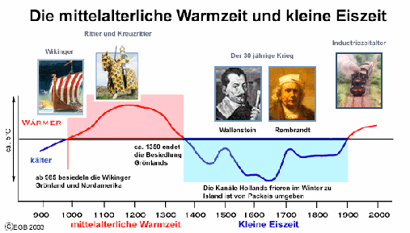
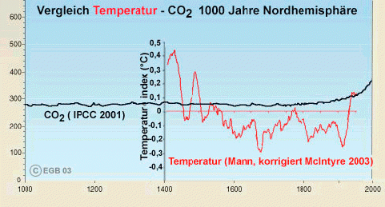
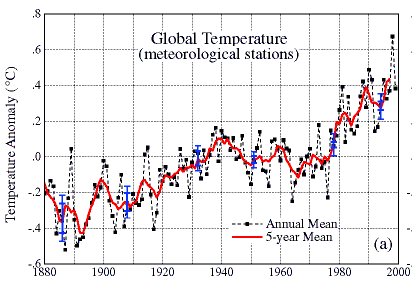
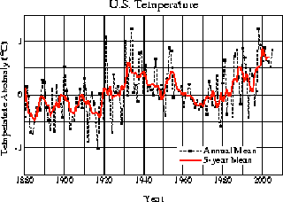
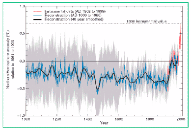
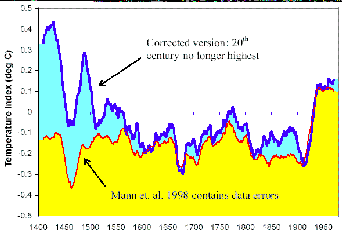
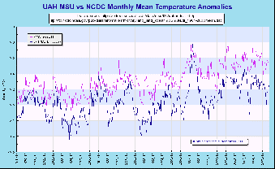

[🠔 Zur Übersicht: Was ist dran?](7arg21.md)  
# Die Klimakatastrophe - 1. Gibt es eine wesentliche Erwärmung über die normalen Schwankungen hinaus?
**Wetter-Aufklärung, Kritik und Ketzereien an Politikkatastrophe, Klimaschutz-Terrorismus, Treibhausschwindel und CO2-Emissionsminderungsprogrammen. Analyse von Klimaveränderung, globaler Erwärmung und Panikmache.**  
_von Argus_

## Klimawandel - Wieso? Klimahorror - Cui bono?

## Wollt ihr den totalen Klimaschutz? Ökofaschismus Brutal 
Der gröbste Klotz auf den groben Keil 22

##### Wetter-Aufklärung, Kritik + Ketzereien an Politikkatastrophe, am Klimaschutz-Terrorismus, Treibhausschwindel + CO2-Emissions/Ausstoß-Minderungsprogramm, Klimaveränderung, Globale Erwärmung, Klimaerwärmung, Klimawandel-Hysterie, Panikmache + Klimafakten

Vom Autor "Argus" den ["Altbau + Denkmal Informationen"](index.md) dankenswerterweise zur Verfügung gestellt: 

## 22. Die Klimakatastrophe - Kapitel 1

## Gibt es eine wesentliche Erwärmung über die normalen Schwankungen hinaus? 

Schon diese einfach klingende Frage ist nicht einfach zu beantworten. Warum? Es gibt schlicht keine präzisen Aufzeichnungen der Durchschnittstemperatur der Erde, noch der nördlichen Halbkugel, die präzise Aussagen über mehrere hundert Jahre zulassen. Was es gibt -und es wird auch genutzt- sind indirekte Messungen aus Baumringen, Ernteaufzeichnungen, historische Beschreibungen, Isotopenbestimmungen in Eisbohrkernen etc. Seit ca. 145 Jahren gibt es dazu breit angelegte methodische Temperaturaufzeichnungen, erst in Europa, dann in den USA und Australien zum Schluß auch im Rest der Welt. Im Jahre 1970 waren weltweit ca. 6000 Wetterstationen im Einsatz. Danach wurde abgebaut auf nur noch 2000. Erst seit 1979 umrunden Wettersatelliten die Erde, die eine verläßliche Datenbasis für die Entwicklung der Durchschnittstemperaturen der oberen Atmosphärenschichten geben. 

## Die Durchschnittstemperatur der Erde

Warum ist das denn so kompliziert, fragt man sich, ein Thermometer lesen kann doch jeder. Sicher, nur nicht alle gleich gut, nicht alle gleich genau und nicht alle regelmäßig genug und vor allem: Diese Thermometer zeigen die Gesamttemperatur der lokalen Umgebung in ca. 2 m Höhe an. Und diese Umgebung änderte sich fast überall rasant im Laufe der letzten ungefähr 145 Jahre. John Daly, ein privater Klimaforscher der ersten Stunde, hat sich der mühsamen Aufgabe unterzogen, die Genauigkeit und Zuverlässigkeit dieser bodennahen Meßstationen zu überprüfen. Er fand heraus daß nur eine sehr kleine Anzahl von Bodenmeßstationen - die ausschließlich in menschenleeren Zonen in den entwickelten Ländern liegen, zuverlässige Zeitreihen für die Temperaturen erbringen. Diese und nur diese stimmen dann bis auf wenige 1/100 Grad mit den Satellitenmessungen überein, auch mit den Wetterballonmessungen, reichen aber für eine Durchschnittsbildung der ganzen Erde oder auch nur der nördlichen Halbkugel, bei weitem nicht aus. Ihre Distanz zueinander beträgt um die 2000 km und mehr, d.h. die Temperaturen von Berlin und Madrid werden miteinander verglichen. Tatsache ist, daß kein Mensch weiß, wie groß die Erwärmung wirklich ist, zumal die zugrundeliegenden Datenkollektive stets verändert werden, so wie die Inflationswarenkörbe! Die Globaltemperatur von 1860 z.B. beruhte nur auf 300 nordhemisphärischen Wetterstationen. Heute sind es nach WMO 1400, wobei für je eine Fläche von 250 000 km (Gitterpunktweite 250 km) eine Temperatur genommen wird, die vorher noch auf NN reduziert wurde mit einem mittleren Gradienten von 0,65° C pro 100 m nach unten. Bleibt außerdem noch zu erwähnen, daß 70 % der Erdoberfläche von Wasser bedeckt sind und aus mehrmals pro Jahr über die Gitterquadrate fahrende Schiffe **aus Schöpfeimern** Jahresmitteltemperaturen konstruiert werden. Die Gruppe um Phol Jones hat 1982 erstmals die Zeitreihe 1860-1980, die zu den angeblichen 0,6° C führten, konstruiert, natürlich strengst wissenschaftlich!! 

Das kann nicht gut gehen. Als das IPCC (International Panel on Climate Change, der UN Arm für diesen Wirbel) sich zur Vorbereitung des kommenden Assessments No. 4 mit dieser Frage auseinandersetzte, stellten sie fest, daß nur die beiden Meßmethoden: Wetterballon und Satellitenmessung; sehr gut übereinstimmen, starke Abweichungen aber sind zu den terrestrischen Messungen gegeben (Sie zeigen - wider alle Theorie, die höhere Temperaturen gerade in den oberen denn in den unteren Luftschichten fordert – deutlich zu hohe Werte an). Statt nun diese Werte wegzulassen, einigte man sich darauf, daß diese Unterschiede - die sehr gravierend sind und vor allem in den Vorhersagemodellen wirken - , Ursachen in einer noch unverstandenen Atmosphärenphysik hätten, die es genauer zu untersuchen gälte. So schafft man Arbeitsplätze in Wissenschaft Forschung und Verwaltung.

## Die aktuelle Entwicklung

Sei es wie es sei: Bis 1979 sind alle Experten auf ungenaue und zu hohe Temperaturmeßreihen angewiesen, seit dieser Zeit nicht mehr. Das folgende Bild zeigt daher die bis ca. 1860 nur indirekt erforschte, ab 1860 mit vielen Unstimmigkeiten gemessene und seit 1979 gemessene Temperaturkurve der Erde.

Wie man sieht, gab es einen dicken Buckel im Mittelalter, die Experten streiten sich noch, ob dieser Buckel etwas größer oder etwas kleiner als + 2 ° C über unserer heutigen Durchschnittstemperatur gelegen hat. Drüber lag er auf jeden Fall. Man erinnere sich an die Schulzeit, daß die Wikinger im Jahre um 980 Grönland besiedelten. Immerhin soweit erwärmt, daß es die Besiedlung und den Ackerbau (Grünland) erlaubte. Oder wie Menzies glaubt, daß die Chinesen um 1420 mit ihren Erkundungsflotten auch das arktische Meer befuhren und dort kaum Eis vorfanden. Es war eben schön warm. Die Ernten reichlich, die Menschen konnten überwiegend gut leben.

Die große Frage ist. Wie haben es die Menschen geschafft im ausgehenden Mittelalter die Globaltemperatur zu beinflussen. Durch das CO2 ihrer Kamine, ihrer Lagerfeuer? Industrie und Verkehr in heutiger technologischer Ausprägung und Menge gab es ja noch nicht. Es war doch so schön alles im Einklang mit der Natur. Ein großes Rätsel, zu dem das IPCC bisher keine so richtigen Erklärung fand.

Um das Jahr 1900 begann dann ein Verlauf wie er detaillierter und überlagert mit dem "errechneten" CO2-Verlauf in der folgenden Grafik gezeigt wird.

Dort sehen wir den vom IPCC 2001 im 3. Assessment-Report herausgegebenen Wert der CO2 Kurve überlagert vom (korrigierten) Temperaturverlauf den in seinem Originalverlauf ein Dr. Mann 1998 errechnet hatte, die so genannte "Hockeystickkurve“. Die, weil sie z.B. die mittelalterliche Wärmeperiode nicht zeigte, von den kanadischen Wissenschaftlern Stephen McIntyre & Ross McKitrick kurze Zeit später und gegen viele Widerstände, korrigiert wurde. Gezeigt wird hier die korrigierte Kurve der beiden. Diese "Hockeystickkurve" hat eine eigene denkwürdige Geschichte, die ich den Lesern nicht vorenthalten will. Aber zuerst gucken wir uns mal den Verlauf der beiden Kurven an. Wir sehen starke Schwankungen der Temperatur, aber so gut wie keine Schwankungen des CO2 Anteiles der Atmosphäre. In keiner erkennbaren Weise verknüpft oder eng korreliert mit dem Temperaturverlauf. Nur im letzten Rest, so gegen 1920 steigt die Temperatur an (es wirkt stärker weil, durch den Maßstab verzerrt) dto. der CO2 Anteil. Sollte plötzlich die Physik Kapriolen schlagen und CO2 auf die Temperatur heftig wirken lassen, oder war es vielleicht umgekehrt?

Ich komme noch darauf zurück, aber zuerst wollen wir die bodennahe Temperaturentwicklung bis zur Gegenwart verfolgen. Das Goddard Institute (GISS) in den USA hat diese Werte ermittelt, wie gesagt auf Basis der bodennahen ungenauen und unzuverlässigen Meßstationen. 

Wir sehen dort einen Abfall ab 1880 dann einen recht starken Anstieg bis 1940 dann wieder einen Abfall bis 1976 (obwohl in diesem Zeitraum die CO2 Emissionen um 400 % anstiegen!) und von dort einen Anstieg bis 1998, dem Jahr mit der höchsten Spitze bedingt durch die El Niño-Kapriolen und weiter bis 2005. (Dieser Abfall bis 1976 veranlaßte übrigens damals, den immer noch berühmten IPCC Forscher Prof. Stephen Schneider eine fürchterliche Eiszeit ab 2000 vorher zu sagen, heute prognostiziert er und mit ihm die UN eine mindestens so fürchterliche Warmzeit )

Wie stark die Ungenauigkeiten der zusammengefaßten Trendmeldungen sich auswirken können zeigt die Kurve der Temperaturentwicklung nur für die USA, wo hunderte von präzise gewarteten Wetterstationen über das 20.te Jahrhundert die folgenden Werte zeigte:

Man sieht viel, nur keine globale Erwärmung, (außer der El Niño-Spitze 1998) vor der inzwischen auch - Al Gore sei Dank - die Amerikaner soviel Angst haben, wie wir. Beide Grafiken wurden vom GISS in Zusammenarbeit mit der NASA produziert).

## Die Hockeystickkurve

Nun - wie versprochen- die Geschichte der Mann´schen Hockeystickkurve. Der amerikanische Wissenschafter Dr. Mann und die Seinen untersuchten 1998 die Baumringe -überwiegend nordamerikanischer- Nadelbäume und leiteten aus ihnen ein Rechnermodell ab, das den folgenden Verlauf der Temperatur der nördlichen Hemisphäre errechnete: Es entstand eine wunderbare Temperaturkurve ab dem Jahre 1000, die den erschröcklichen Anstieg zur Mitte des 20. Jahrhunderts zeigte: und das war genau das, was die leitenden Herren des IPCC haben wollten.

Diese Kurve, 1998 berechnet, fand sofort und an prominenter Stelle Einlaß in den IPCC Bericht von 2001, wurde zigmal dort zitiert und nahm seinen Siegeszug durch die mediale und politische Welt. Wunderbar, der Mensch und sein CO2 ist schuld, hier sieht man´s ja. Einsetzen der Industrialisierung und Anstieg der Global Temperatur gingen eng gekoppelt - nicht mehr nur korreliert - Hand in Hand. Die Champagnerkorken knallten beim IPCC. Endlich hatte man was in der Hand, um den astronomischen Forderungen an die Kyotoländer Nachdruck zu verleihen. Hier war der Beweis. . Die Frage darf erlaubt sein: Ließen sich deshalb prominente Vertreter des IPCC – allen voran Sir Houghton – mit dieser Kurve im Hintergrund interviewen? Sie hatte allerdings einige Schönheitsfehler. Als Stephen McIntyre & Ross McKitrick und andere - darunter Hans von Storch in Deutschland - einen zweiten Blick auf diese Kurve warfen, fiel ihnen auf, daß die ganze schöne, mittelalterliche Warmzeit schlicht nicht vorhanden war. Obwohl sie - weil gut dokumentiert - einwandfrei nachweisbar war. Auch die dann folgende - noch besser dokumentierte - kleine Eiszeit war nicht so recht erkennbar. Den IPCC Oberen war das irgendwann auch aufgefallen. Statt jedoch zuzugeben, daß ihre so schöne Grafik schwere Fehler enthielt, versuchten sie zu verhindern, daß die Kurve offiziell korrigiert wurde. Ein mit dieser Aufgabe befaßter IPCC Wissenschaftler faßte diese Versuche in der Bemerkung zusammen: _"We have to get rid of this medievial warm up period"_ : in gut Deutsch: "Wir müssen irgendwie diese mittelalterliche Warmzeit loswerden" Diese Bemerkung wurde 2004 gegenüber Dr. Deming - einem amerikanischen Palaeoklimatologen gemacht- weil dieser fälschlicherweise vom IPCC Mann als Gesinnungsgenosse eingestuft wurde. Er hat sie überliefert.

Stephen McIntyre & Ross McKitrick versuchten nun das Computer - Modell nachzubauen (die Zusammenarbeit mit Dr. Mann war nicht sehr ergiebig) schaffte es aber dann doch und fütterte dieses Computerspiel nun mit allen möglichen Daten, auch den Originaldaten des Dr. Mann. Zuletzt und viele 10.000 Durchläufe später einfach mit Zufallszahlen. Und heraus kam - o Wunder- immer und immer ein Hockeystick. Das Modell konnte gar nicht anders. Es war auf diesen Schlenker hin programmiert.

Die UN und alle ihr folgenden Regierungen und NGO´s oder GO´s haben sich übrigens bis heute nicht für diesen bewußte Irreführung entschuldigt. Man kann sich ja mal irren, nicht wahr? Übrigens hatte sich die gesamte wissenschaftliche Fachpresse - auf wessen Druck wohl - geweigert, diese Korrekturen öffentlich zu machen. Ein Schelm der Schlechtes dabei denkt. Die dann ordentlich überarbeitete Hockeystickkurve finden Sie hier noch einmal schön mit der IPCC–Kurve übereinander gelegt.

## Erdtemperaturverlauf bis Ende 2005

Nun zur meßtechnischen Neuzeit. Die Temperaturentwicklung im Satellitenzeitalter: (Sie finden die Messungen der NASA und des GISS unter Angabe der Quellen in unten stehender Grafik)

Sie zeigt den aktuellsten Temperaturverlauf der Erde, von 1979 bis Ende 2005, wie er von div. Instituten im offiziellen Auftrag und mit verschiedenen Methoden gemessen wurde. "NCDC (lila gefärbt) Anomalies" sind Temperaturen der terrestrischen Stationen, deren Zahl seit 1970 von ca. 5000 auf jetzt nur noch 2000(!) weltweit zurückgegangen sind. Sie befinden sich meist in oder in der Nähe von urbanen Zentren und zeigen als solche - u.a. durch den Wärmeinseleffekt- starke Abweichungen von den Meßreihen, die in unberührter Natur z.B. Arktis oder Antarktis, Tundra etc. durchgeführt werden. Das Problem: Korrekturen sind zwar möglich, aber nicht standardisierbar, da fast jede Meßreihe jeder Meßstation anderen Einflüsse unterliegt. Im Grunde sind diese Messungen, für den o.a Zweck, also mit ihnen die Erderwärmung zu messen, nutzlos. "UAH" Messungen (blau gefärbt) sind solche mit Satelliten, die seit 1979 die Erde umrunden und eine sehr genaue Messung der durchschnittlichen Erwärmung erlauben. Sie zeigen sehr starke Abweichungen zu den terrestrischen Messungen. Nicht gezeigt sind die Wetterballonmessungen, die sich in sehr guter Übereinstimmung mit den Satellitenmessungen befinden. Näheres hierzu: unter [www.john-daly.com/ges/surftmp/surftemp.htm.](http://www.john-daly.com/ges/surftmp/surftemp.htm)

Wie man sieht, steigt die gemessene Oberflächentemperatur aus den bekannten Gründen deutlich stärker an, als es die Satelliten zeigen. Sie wird daher in fast allen Veröffentlichungen der Medien benutzt. Die Satelliten und Ballonmessungen steigen deutlich weniger an und auch nur bis zum Jahre 1998, dann setzt ein leichter Abfall ein, oder auch ein flacher Verlauf, so genau weiß man das noch nicht, aber kaum ein weiterer Anstieg.

Es wäre aber unredlich daraus schon einen Trend abzuleiten, aber wahrnehmen kann man ihn - auch im Hinblick auf Nairobi- schon.

Mein Fazit: Es gibt Erhöhungen der Globaltemperatur im 1/10 Grad Bereich seit Ausgang des 19. Jahrhunderts (ca. 0,6 ± 0,2 °C sagt das IPCC), davon ein großer Anteil vor 1940, als die CO2 Produktion der Industrienationen kaum begonnen hatte). Sie liegen - mit Blick auf die mittelalterliche Warmzeit- innerhalb der natürlichen Schwankungen. Ein geringer Einfluß des Menschen ist vielleicht trotzdem anzunehmen. Irgendetwas Bleibendes müssen wir doch hinterlassen. Aber sie rechtfertigt weder ein Kyotoprotokoll noch andere Enteignungs- und Zwangsmaßnahmen, wie sie die Glaubensgemeinde der 6000 Erleuchteten in Nairobi derzeit vorbereitet.

Weiter Teil 23:[23. Die Klimakatastrophe - 2. Ist der CO2-Anstieg der in der Atmosphäre seit ca. 100 Jahren zu beobachten ist, die wesentliche Ursache dafür? Und wenn ja, hat der Mensch mit seiner technischen CO2-Erzeugung daran einen maßgeblichen Anteil?](7arg23.md) 

---

Martin Durkin: **The Great Global Warming Swindle** , CD mit dem sensationellen Klimaschocker-Film, der die mediale Aufklärung rund um den Ökoterrorismus kräftig anfeuerte.

**Empfohlene Literatur der führenden deutschen und internationalen Ökokritiker / Klimaleugner / Klimaschutzskeptiker / Wetterkundler / Klimahistoriker:** 

---

Empfohlene Links: 
[Bücher Pro & Contra Ökowahn (Crichton, Rahmstorf, Schellnhuber, Hug, Thüne, Gold u.v.a.)](8buch22.md) - Fetzige Buchrezensionen: Klimaschocker, Klimalügen und Klimaaufklärung 
[IN formation F ür A ufgeklärte S teuerbüger der F orschungsgruppe A bgeordneteninduzierte Q ualen (INFAS/FAQ)](7thu62.md) 
[Argus: Glaubensbekenntnis: Ökologie + Ökonomie müssen keine Gegensätze sein - Wie man mit einfachem Abschalten von Standby-Geräten das Klima retten kann.](7argus2.md) 
[Hintergründe, Fakten, Emotionen - Vergnügliches und Verdrießliches zur Klimaschutzsauerei und Treibhauseffektlüge](7thuene1.md) - da geht die Post ab ... 
[Zur staatlichen Vergeudung der Klimaschutzsubventionen aus Steuermitteln mittels Günstlingswirtschaft - aus einem Bundesrechnungshofbericht"](7thu54.md) 
Maria Ackermann: "[Klimawandel und Klimalügen - Fakten und Aufklärung zum Klimaschutz-Beschiß](7klima.md)" 
Marcel Ott, Anton Schönfeld: "[Der Globale Klimawandel](7klima2.md)" 
[Die Filme/Videos/Fernsehsendungen zum Klimaschwindel und Klimaschutzterror](7video.md) +++ [Dr. Helmut Böttiger: Rette die Erde und bringe Dich um!](7boet1.md) - Die Klimaapokalypse als Massenmordwaffe / Massenvernichtungswaffe 
[Dr. Helmut Böttiger: Klimakatastrophe - Warum gerade CO2? / Massenbesteuerungswaffen + Finanzsystemschutz](7boet3.md) Der Treibhausschwindel, die Klimaschutzdiktatur und ihre Klimaschutzlüge - Cui Bono? Ein entlarvender Striptease 
Dr. Albert Glatzle: "[Klimaschädlich? Kohlendioxydemissionen aus Landwirtschaft und Viehwirtschaft](7klima3.md)" 
**Brisant:**[Die perverse Geschichte der GRÜNEN](7thu68.md) 
[1. FDP EIKE Klima-Abend am 17.4.08 in Berlin](http://www.eike-klima-energie.eu/?WCMSGroup_4_3=6&WCMSGroup_6_3=1247&WCMSArticle_3_1247=350 ) - mit Dr. Hans Labohm (Ökonom, IPCC Reviewer), Prof. Dr. Horst Malberg (ehem.Direktor des Instituts für Meteorologie der Freien Universität Berlin), Dr. Dietmar Ufer (Energiewirtschaftler), Thomas Heinzow (Diplom-Sozialökonom, Diplom-Betriebswirt, Meteorologe, Forschungsstelle Nachhaltige Umweltentwicklung Uni Hamburg) +++ [Norbert Deul/Hausgeld-Vergleich entlarvt den Klimaschutzsatanismus der Poliducker und Ministerialratten](http://hausgeld-vergleich.de/Deul_weitereNews_112.htm) 
[Deutsche Webseite des Tschech. Präs. Vaclav Claus - Gegen den ÖKOTERROR](http://de.liberty.li/magazine/url.php?id=4226) 
[Prof. Dr. Gerhard Gerlich: Physikal. Grundlagen des Treibhauseffektes + fiktiver Treibhauseffekte](http://www.ib-rauch.de/datenbank/vortrag-leipzig.html) 
[Dipl.-Phys. Alvo von Alvensleben - Die falschen Klimawandel-Argumente des Merkelberaters Prof. Rahmstorf!](http://www.schulphysik.de/klima/alvens/antwort.html) 
[Dipl. Phys. M. Müller: Gedanken zum Treibhaus Erde / Widerlegung der CO2-Hypothese](http://home.arcor.de/meino/klimanews/index.html#53531198c90bc3305#53531198c90bc3305) 
[www.klimamanifest-von-heiligenroth.de/](http://www.klimamanifest-von-heiligenroth.de/) 
[www.naturschutzparadox.de/](http://www.naturschutzparadox.de/) - Naturschutzverbände und Klimahysterie 
[Ein Hammer: muslim-markt.de interviewt Prof. Dr. Gerhard Gerlich zum amtlichen Klimabeschiß](http://www.muslim-markt.de/interview/2007/gerlich.htm) 
[tcsdaily.com - Hans H.J. Labohm: Proliferation of Climate Scepticism in Europe](http://www.tcsdaily.com/article.aspx?id=110107A) 
[Climate science at it's best - global warming a hoax? See here the facts!](http://www.oism.org/pproject/s33p36.htm) 
[www.globalwarmingskeptics.info/](http://www.globalwarmingskeptics.info/) - Boring for few, exciting for many! The name is the program! 
[Andrew's "The Anti "Man-Made" Global Warming Resource, STOP the hysteria"](http://z4.invisionfree.com/Popular_Technology/index.php?showtopic=2050) - Great hot stuff! 
[Die kritisch-informative Seite des Wissenschaftsjournalists Edgar Gärtner, Autor von "Öko-Nihilismus": Analysen - Konzepte - Trends](http://www.gaertner-online.de/) 
[Marc Moreno's Thrilling Climate News and Comments - Denialism at it's best](http://www.climatedepot.com/) 
[Energiespar- und Klimaseite - Hintergründe der Klimawandel-Panikmache](7wsvoant.md) 
[ <======== **ZeitGeist 1/09: Kontra Ökobetrug**](https://zeitgeist-online.de/index.php/printausgabe/13-heft-nr-29-1-2009/96-qpottdicht-isolierte-raeume-sind-die-bausuende-nummer-einsq) 
[ **Das Skeptiker-Handbuch - Bildklick zum Download**](http://www.eike-klima-energie.eu/klima-anzeige/skeptiker-handbuch-fuer-den-rest-von-uns/?tx_ttnews%5Bpointer%5D=1) ========> 
[ZeitGeist-Magazin: Zur Klimareligion und anderen brennenden Fragen](http://zeitgeist-online.de/) 
[Joanne Nova - Das Skeptiker-Handbuch (deutsch)](http://joannenova.com.au/2009/05/16/das-skeptiker-handbuch-has-arrived/#comment-6926#comment-6926) 
[Sensation kontra Ökommunismus! Aus Monatszeitung der Kommunistischen Partei Deutschlands KPD(B): 'From Silent Spring to Global Warming – eine kleine Geschichte des Ökologismus'](http://ta.kpdb.de/archiv/16-maerz-2009/106-from-silent-spring-to-global-warming--eine-kleine-geschichte-des-oekologismus) 
[Spannend: Ein Klimaschwindler beichtet seine politisch erpressten Betrügereien](http://www.beichthaus.com/index.php?h=index&c=00023746&PHPSESSID=a8bf26ce197d1f22f8325c7289bb6cfe) 
[Steve McIntyre's Website / Blog Climateaudit](http://www.climateaudit.org/) 
[Steven Milloy presents www.junkscience.com/ - Junk climate science at it's best!](http://www.junkscience.com/) 
[Wolf Lotter in brand eins 3/2007: "Kommentar: Zweifel im Klimakterium - Das eigentliche Problem mit dem Weltklima ist der Verlust des Denkvermögens."](http://www.brandeins.de/home/inhalt_detail.asp?id=2254&MenuID=8&MagID) 
[Frankfurter Allgemeine Zeitung FAZ 3.4.07: "Wider die Klimahysterie - Mehr Licht im Dunkel des Klimawandels"](http://www.faz.net/s/RubC5406E1142284FB6BB79CE581A20766E/Doc~E128116B52BAB4E73A398F4CC7CC6388A~ATpl~Ecommon~Scontent.html) - von Christian Bartsch 
[Prof. Rahmstorf und der verzweifelte Versuch, die Klimakatstrophe zu retten](http://klimakatastrophe.wordpress.com/2008/03/16/prof-rahmstorf-und-der-verzweifelte-versuch-die-klimaerwarmung-zu-retten/#comment-456#comment-456) 
[BILD 30.3.07: "Klima-Alarm - Hat die Erderwärmung nichts mit CO2 zu tun?"](http://www.bild.t-online.de/BTO/news/2007/03/30/klima-alarm/oeko-luege.html) 
[Campo News Blog: Schönes Grün: 2022 - die nicht überleben wollen](http://www.campodecriptana.de/blog/2007/09/13/921.html) 
[EIKE, Europäisches Institut für Klima und Energie, Jena](http://www.eike-klima-energie.eu/) - der Zusammenschluß deutscher Klimaskeptiker 
[Wetter und Klima Fakten ](http://www.wetterklimafakten.eu/) - eine kritische Betrachtung der Klimadiskussion! 
[Rainer Hoffmanns Sammlung klimakritischer Dokumente ](http://web.archive.org/web/20071127014442/www.solarresearch.org/1478062.htm) - Ein Muß! 
[Financial Times Deutschland FTD: Gastkommentar von Vaclav Klaus: "Klima-Wahrheiten. Nicht die Umwelt ist gefährdet, sondern die Freiheit. ..."](http://www.ftd.de/meinung/kommentare/:Gastkommentar Klima Wahrheiten/213649.html) 
["Klimakatastrophe: Entwarnung aus dem Umweltministerium"](http://www.ef-online.de/?p=95) - Muß die Kernkraft das Klima retten? Oder die "erneuerbaren" Energien? Oder die Klimaschutzpolitik? Oder Ich und Du, Müllers Esel oder wer sonst? 
[Dipl.-Biol. E. Beck: "Der Wasserplanet. Dokumentation einer anthropogenen Irrlehre."](http://www.egbeck.de/treibhaus/) - Seriöseste Facts gegen die anschwellende Ökodiktatur der internationalen Klimaschutzterroristen 
[Klimasimulation - ein Werk von Lügnern, Wahrheits-Leugnern oder gar Schwindlern? Bilden Sie sich weiter und eine eigene Meinung zum Treibhauseffekt, lesen Sie hier!](http://www.biokurs.de/treibhaus/otreibh2.htm) 
[Hartmut Bachmann: Klimaüberraschung](http://www.klimaueberraschung.de) 
[Klimanotizen.de und feinsinnigste Klimaketzereien](http://www.Klimanotizen.de) 
[Vereinigung gegen abiträre Steuerpolitik in Luxemburg und gegen die CO2-Hysterie](http://www.gaspl.eu.tt) 
[Burghard Schmanck: Schmanckerl zum Klimaterror, Linkliste, historische und theologische Entlarvungen](http://www.schmanck.de/) - Ein Lateiner reißt allerlei Schwindeleien die Maske runter 
[Der Treibhausgas- und CO2-Betrug und die CO2-Lüge, der Hochwasser-Schwindel, das Ozon-Märchen und sonstige Grausamkeiten der Ökodiktatur - von Joh. Maas](http://www.www.co2betrug.de/) 
[Treibhauseffekt, Klimawandel, Ozonloch - profitable Lügen](http://www.chemtrails-info.de/chemtrails/klimawandel-luegen.htm) 
[treibhausluege.de - Ein neuer Info-Blog](http://www.treibhausluege.de/) 
[wahrheiten.org - Info zur Klimalüge](http://www.wahrheiten.org/blog/klimaluge/) 
[klimaskeptiker.info - Der Name ist Programm](http://www.klimaskeptiker.info/) 
[Der kritische Wissenschaftsjournalist und Hydrobiologe Edgar Gärtner im Magazin Novo über auf Eis gelegte Fakten und Klimaesoterik: "Es gibt keine globale Erwärmung!"](http://www.novo-magazin.de/85/novo8518.htm) 
[Oliver Marc Hartwich, CAPITAL 13.5.07: "Die grünen Geister, die Frau Thatcher mit ihrer Klimadebatte rief"](http://www.capital.de/politik/100006382.html?eid=100005249) 
[http://www.naeb.info/ - Nationale Anti-EEG-Bewegung](http://www.naeb.info/) 
[Der Exxon/Esso-Klimabeschiß - Scenes from the climate inqusition](http://www.nowpublic.com/scenes_from_the_climate_inquisition) [www.warwickhughes.com/hoyt/scorecard.htm - Greenhouse Warming Scorecard - a comparison of greenhouse model predictions with actual observations](http://www.warwickhughes.com/hoyt/scorecard.htm) 
[John Ray, Brisbane: Antigreen Blogspot - Greenie Watch](http://antigreen.blogspot.com/) 
[Jens Christian Heuer: weltenwetter.blogspot.com - Klimaaufklärung durch Wetterbeobachtung](http://weltenwetter.blogspot.com/) 
[Klimawandel, Apokalypse und der Staat: Eine nüchterne Betrachtung auf dem Weg zur &Oumlkodiktatur](http://de.liberty.li/magazine/?id=3843) 
[Deutsche Welle, Panorama: "Die Kultur des Klimas" - Der Klimawandel war schon immer - Kein Grund zur aktuellen Besorgnis](http://www.dw-world.de/dw/article/0,2144,1036298,00.html) 
[Die Ministerin für den Ländlichen Raum BW, Pressemitteilung 110/2000: Weinreben gediehen sogar in Grönland - so war das Klima früher](http://www.mlr.baden-wuerttemberg.de/content.pl?ARTIKEL_ID=3193) 
[Ökologismus.de - Aufklärung gegen den Ökolügismus & für Klimaketzer](http://www.oekologismus.de/) 
[SCIENCE & ENVIRONMENTAL POLICY PROJECT](http://www.sepp.org/) - Prof Fred Singer's Site for Climate skeptics / Mass of info, links & documents 
[Gibt es überhaupt eine globale Erwärmung? - Is Global Warming real ?](http://www.geocraft.com/WVFossils/global_warming.html) - Offizielle Tatsachen, Belege und Beweise gegen den Ökoirrsin und CO2-Abzockschwindel 
[GEOPHYSICAL RESEARCH LETTERS, VOL. 34, L01602, doi:10.1029/2006GL028492, 2007: S. J. Holgate: On the decadal rates of sea level change during the twentieth century - Der Meeresspiegelanstieg hat sich in den letzten 50 Jahren verlangsamt!](http://www.agu.org/pubs/crossref/2007/2006GL028492.shtml) 
[Wahrheitssuche: Der Treibhaus-Schwindel - Alle Facts auf einen Blick](http://www.wahrheitssuche.org/treibhaus.html) 
[Oliver Lehmann: CO2-Diskussion, oder: Wie zocke ich zu Beginn des 21. Jahrhundert den Autofahrer erneut ab, ohne dass er es sofort bemerkt?](http://w463.de/co2.htm) 
**Texte zur Rekonstruktion des Faschismus in Deutschland:** [Das Antidiskriminierungs-Bundessicherheitshauptamt](8philipp.md#das) 
[Staat - Provinz - Kolonie?](8philipp.md#staat)

---

Themen auf dieser und den anderen Seiten dieser Homepage: Treibhauseffekt, Treibhaus Erde, Unwetter, Tornados, Abschmelzende Polkappen, Schmelzende Gletscher, Gletscherschmelze, Zunahme Hochwasser, Hochwasserrereignisse, Tornado, Hurrikan, Stürme, Kleine Eiszeit, Wetterkontrolle, Klimakontrolle, Klimaschutzprotokoll, Kioto-Protokoll, Kyoto-Prozeß, IPPC, Klima-Verbrecher-Jagd, Klimaterror und Pseudowissenschaft, Klimasünder, Klimasünderbestrafung, Klimaleugnerverfolgung, Betrug, Betrügerei, Taktik, Strategie, politischer Schwindel, Simulation, pseudowissenschaftliche Klimasimulation, Klima, Klimaschutz, Klimasünder im Visier: Kühe, Kuhherden, Schafe, Schafherden, Rind, Rinder, Rinderherden, Ziegen, Ziegenherden, Hühner, Schweine, Fried Chicken, Freilandschweine, Ökoschwein, Ökoschweine, Ökosau, Ökosäue, Ökodrecksau, Ökodrecksäue mit Naturschützer - Naturschutz - / Klimaschutz - Ökosiegel, McDonald - Hamburger, Steakhouse, Hamburgerketten + Big Mac + Burgerking. Klimaschützer, Umwelt, Klimaapokalypse, Klimasarkasmus, Klimaironie, Klimagroteske, Klimazynismus, Klimahysterie, Klimakatastrophismus, Klimaschutzhysterie, Klimapanik, Klimapanikmache, Klimaschwindel, Klimaschutzschwindel, Klimalüge, Klimaschutzlüge, Klimaterroror, Ökoterror, Ökologische Tyrannis, Ökoterrorismus, Ökodiktatur, Ökomärchen, co ², Ökoverbrecher, Öko-Abzocke, Klimaabzocke, Klimaschutz-Abzocke, Klimaschutzgelder, Klimaverängstigung, Tyrannei, Weltklimarat, falsche Wetter-Prophetie, Klima-Propheten, Weltklimabericht, Klimaschutzabgaben, Durchschnitt, Klimaschutzsteuer, Klimamafia, Wissenschaftsschwindel, Wissenschaftsbetrug, Wissenschaftsmärchen, Wissenschaftslügen, Klimatyrannei, Klimatyrannis, Klimaschutztyrannei, Klimaschutztyrannis, Ökotyrannis, Ökotyrannei, Junk science, Öko-Revolution, Klimawissenschaft, Klimaschutz-Profit, Klima-Profiteure, Energie-Monopole, Atomkraft, Atom-Industrie, Kernkraft, Klimawissenschaftler, Klimaschutz-Prognostiker, Klimaprognose, Vorhersage, Klimavorhersage, Klimaschutzmärchen, Klimasimulation, Klimasimulanten, Wettervorhersage, Wetterwechsel, Wetteränderung, Klimavorhersage, Pro und Kontra, Skepsis, Skeptiker, Stromwirtschaft, Erdöl, Ö-Lobby, Lobbykratur, Lobbyisten, CO2, Kohlendioxid, Meteorologie, Meteorologe, Klimamessung, Klimaänderung, Klimawechsel, Klimawandel, Klimaforscher, Klimaforschung, Natur, Naturschutz, Naturschützer, Ökologie, Umwelt, Umweltschutz, Klimafolgen-Forschung, Mojib Latif, Professor Stefan Rahmstorf, Prof. Dr. Hans Joachim Schellnhuber, Umweltschützer, Klimaberater, Klimaexperten, Potsdam-Institut für Klimafolgenforschung, Globale Erwärmung, Klimasimulation, Global Warming, Climatic Change, Fossile Energie, Alternative Energie, nachwachsende Rohstoffe, Kohle, Erdgas, Gas, Strom, Verstromung.
