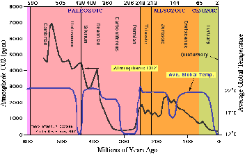
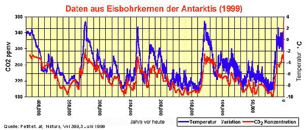

[🠔 Zur Übersicht: Was ist dran?](7arg21.md)  
# Ist der CO2-Anstieg, der in der Atmosphäre seit ca. 100 Jahren zu beobachten ist, die wesentliche Ursache dafür? Und wenn ja, hat der Mensch mit seiner technischen CO2-Erzeugung daran einen maßgeblichen Anteil?
**CO2 ist als sog. Spurengas mit ca. 0,038 Prozent Anteil am Volumen (oder 380 p(art) p(er) m(illion)) in trockener Luft enthalten.**  
_von Argus_

## Klimawandel - Wieso? Klimahorror - Cui bono?

## Wollt ihr den totalen Klimaschutz? Ökofaschismus Brutal 
Der gröbste Klotz auf den groben Keil 23

##### Wetter-Aufklärung, Kritik + Ketzereien an Politikkatastrophe, am Klimaschutz-Terrorismus, Treibhausschwindel + CO2-Emissions/Ausstoß-Minderungsprogramm, Klimaveränderung, Globale Erwärmung, Klimaerwärmung, Klimawandel-Hysterie, Panikmache + Klimafakten

Vom Autor "Argus" den ["Altbau + Denkmal Informationen"](index.md) dankenswerterweise zur Verfügung gestellt: 

## 23. Die Klimakatastrophe - Kapitel 2

## Ist der CO2-Anstieg, der in der Atmosphäre seit ca. 100 Jahren zu beobachten ist, die wesentliche Ursache dafür? Und wenn ja, hat der Mensch mit seiner technischen CO2-Erzeugung daran einen maßgeblichen Anteil?

CO2 ist als sog. Spurengas mit ca. 0,038 Prozent Anteil am Volumen (oder 380 p(art) p(er) m(illion)) in trockener Luft enthalten. Dieses Schicksal als Spurengas teilt es mit anderen Spurengasen wie Methan (CH4), Ozon etc. Der große Rest trockener Luft besteht aus Stickstoff (ca. 78%) Sauerstoff (ca. 21%) und Argon (0,9%). Der stark wetterbestimmende Wasserdampf ist zwischen 0 und 4 %– im Mittel mit 2%- in der dann feuchten Luft enthalten.

Diese geringe Menge CO2macht nun so viel Wirbel, und wird zum allerschlimmsten Killer der Menschheit ausgerufen. Was tut dieses böse CO2denn so Schlimmes? Es treibt die Temperatur der Erde hoch, ist die inzwischen von allen Politikern und Medien ständig wiederholte Ansage, darunter müssen ganz schrecklich viele Menschen leiden, jetzt schon und in naher Zukunft noch viel mehr. Und - noch viel Schlimmer - wir im Westen sind daran schuld. Die bösen Industrienationen. Pfui Teufel.

Da sollte sich doch jeder Mitbürger der einigermaßen klar im Kopf ist und eine Vor-Pisa-Bildung genossen hat fragen: Ja, stimmt denn das? Einig sind sich alle Wissenschaftler, daß der Anteil von CO2 an der Atmosphäre seit einiger Zeit angestiegen ist. Von 280 ppm auf ca. 380 ppm z.Zt. Unstrittig ist auch, daß dieser Anstieg mit der Industrialisierung einher ging. Also korreliert ist, wie man es auch vornehm ausdrücken kann. Korrelation bedeutet nun aber nicht, daß die korrelierten Prozesse voneinander abhängen. Sie können, aber sie müssen nicht. Gar nicht unstrittig ist, woher dieser Anstieg rührt. Überwiegend oder ganz aus den Aktivitäten des Menschen bei der Verbrennung fossiler Brennstoffe, wie es uns die Grünen und inzwischen die ganze politische Klasse immer wieder vorwirft. Oder hat der Anstieg überwiegend oder ganz, natürliche Ursachen? Auch dafür sprechen sehr gute Argumente.

Welche Kapriolen das CO2 mit und ohne korrelierte Temperatur in der Erdvergangenheit geschlagen hat zeigt uns die folgende Grafik:

## Erst die Erwärmung, dann die CO2-Konzentration

Einige davon sehen wir auch in der untenstehenden Grafik, 
die den Temperaturverlauf und die CO2Schwankungen in der Antarktis der letzten 420.000 Jahre darstellt, wie er aus Eisbohrkernen aus der Antarktis - wenn auch recht grob- hergeleitet werden kann. Wir erkennen sofort, daß der CO2-Anteil periodisch schwankt und mit ihm die Temperatur. Bei genauem Hinsehen erkennen wir aber auch, daß erst die Temperatur ansteigt und dann das CO2. Dieser Abstand liegt je nach betrachtetem Abschnitt zwischen 500 und 1500 Jahren

Mit anderen Worten: Erst kommt die Temperatur, dann das CO2. Jeder, der mal eine Flasche Bier einige Zeit in der Sonne stehen ließ, kann bestätigen, da ist was dran. Wärme treibt gelöstes CO2aus dem Wasser heraus und wohin, in die Atmosphäre.

Nun kann man auf Grund dieser Grafik leicht zu dem Schluß kommen: Ja, der Zyklus - erst Temperatur, dann CO2-Anstieg - mag ja sein, aber was ist mit dem absoluten Werten des CO2. So hoch wie heute waren sie ja wohl die letzten 420.000 Jahre nicht. So dachten bis vor kurzem auch alle, aber heute nur noch diejenigen die partout keine aktuellen Erkenntnisse zulassen, die ihrer Meinung entgegenstehen.

(Folgende Zitate sind entnommen einer Arbeit von A. von Alvensleben, der diese Informationen an Prof. Rahmstorf im Rahmen einer Erwiderung von Vorwürfen erarbeitet hat):

_"Die Messungen des CO 2-Gehalts in Eisbohrkernen haben sich, wie man erst seit wenigen Jahren weiß, doch als ziemlich ungenau erwiesen – wohl als Folge von Diffusionseffekten im Eis, durch die größere Schwankungen des CO2-Gehaltes nivelliert wurden. Daher ist zur Zeit noch die Meinung verbreitet, in den letzten 420 000 Jahren habe der CO2-Gehalt nur zwischen 190 ppm in den kältesten Zeiten und 280 ppm in den Warmzeiten gependelt. Daraus haben Botaniker gefolgert, der Anstieg des CO2 in der Atmosphäre um rund 30% in den letzten 140 Jahren sei in der jüngeren Erdgeschichte ein einzigartiger Vorgang, und die Natur werde sich darauf nicht einstellen können, mit katastrophalen Folgen für die Pflanzenvielfalt. Obwohl die Eisbohrkerne dies nicht erkennen lassen, zeigt das neue Meßverfahren, wie die atmosphärische CO2-Konzentration von 260 ppm am Ende der letzten Eiszeit schnell auf 335 ppm im Preboreal (vor 11500 Jahren) anstieg, dann wieder auf 300 ppm abfiel und vor 9300 Jahren 365 ppm erreichte__..."_ Zitat Ende.

**Nach soviel Naturwissenschaft wollen wir mal ein wenig zusammenfassen:**

**1. Die Konzentration von CO 2 steigt und fällt in der Atmosphäre im Wesentlichen aus natürlichen Ursachen.**

**2. Die Konzentration von CO 2 lag in den vergangenen 10.000 Jahren schon mal bei 365 ppm, evtl sogar darüber. Davor sogar noch wesentlich höher. (siehe Grafik weiter unten)**

**3. Die Konzentrationszu- oder abnahme von CO 2 folgt dem Temperaturverlauf mit einer Verzögerung zwischen 500 bis 1500 Jahren.Die ursachen dafür können immer noch nur vermutet werden. **

Des ungeachtet muß erwähnt werden, daß die menschliche Aktivität ebenfalls - jedenfalls einigermaßen wahrscheinlich - zum Anstieg der CO2-Konzentration beiträgt. Aber wieviel und mit welchen Wirkungen, das ist schlicht nicht genau bekannt. Es könnte ja gut sein, daß der einzige wirklich nachgewiesene Treibhauseffekt des CO2, nämlich das Pflanzenwachstum zu beschleunigen (ich komme weiter unten noch ausführlicher darauf) das zusätzlich entstehende CO2schlicht absorbiert. Wir wissen es nicht. Es gibt zwar interessante Hypothesen, aber keine wirklichen Beweise s.o.

## Kann CO2 _das_ Treibhausgas sein, welches die Globaltemperatur nach oben treibt?

Wie ist es nun mit der These, daß CO2**_das_** Treibhausgas ist, welches die Globaltemperatur nach oben treibt? Sehr viele Untersuchungen wurden angestellt und alle möglichen physikalischen und chemischen Effekte in der Atmosphäre wurden untersucht. Immerhin fließen jährlich ca. 8 Mrd $ in diese Forschung, davon 4 Mrd in die USA und den weitaus größten Teil der zweiten Hälfte erbringt die EU. Danach wirkt das CO2 hauptsächlich über seine Abstrahlung (Strahlungsantrieb) aufgenommener Energie, das ist überwiegend Energie direkt von der Sonne. Das IPCC schätzte 2001 den für die Wirkung entscheidenden Wert der Klimasensitivität **CS** - auf Grund von Modellrechnungen und Datenbankanalysen- auf ca. 2,8° C, Prof. Stephen Schneider - einer der führenden US-Klimaforscher und häufiger Katastrophenmahner, Mitglied in div. Forschungsgremien, so auch dem IPCC - konstatierte noch im Oktober 2000 ganz ehrlich: _"Die Klimasensitivität (CS) der Erde für CO 2 sei unbekannt, es werde jedoch für Simulationsrechnungen angenommen, daß der wahrscheinlichste (Gleichgewichts-)wert CS für eine CO2 Verdoppelung zwischen 1,5 und 4,5 ° C liegt"_. Na, wenn das keine klare Ansage ist. Unbekannt, aber wir schätzen eben mal einen Wert für unsere Modelle irgendetwas zwischen 1,5 und 4,5 ° C. Andere Forscher haben nicht nur Modellrechnungen (Dietze, Barett u.a.) sondern aus **den gemessenen** Verläufen Regressionsanalysen gemacht. Daraus ergibt sich dieser Wert mit ca. 0,7° C. Also eine Verdoppelung des CO2Anteiles (bei sonst unveränderten sonstigen Werten z.B. der Sonneneinstrahlung), ergibt – als Korrelation! – eine Erhöhung der Temperatur um schlappe 0,7 °. **Das ist ein Viertel des IPCC Wertes**! Sechs schöne und übeberaus plausible Methoden den CS-Wert aus realen Meßdaten zu ermitteln, finden sich hier: <http://www.john-daly.com/miniwarm.htm>. Sie haben aber - aus Sicht des IPCC- einen gewaltigen Schönheitsfehler, sie ergeben nur CS-Werte zwischen 0,17°C bis 0,33°C. Wahrscheinlich ist das der Hauptgrund, warum das IPCC sie verschmäht. Sie passen so garnicht in die Mär von der menschengemachten Erderwärmung.

Das IPCC bereitet z.Zt. seinen 4. Bericht vor. Darin soll wieder ein höherer CS-Wert genannt werden. Wie auch anders, daß Bedrohungsscenario gilt es aufrecht zu halten. Wir haben aber keine Verdoppelung des CO2 bisher erlebt, sondern einen Anstieg um 20 bis 30 %, je nach dem auf welchen Eingangswert man sich bezieht. Die Untersuchungen von P. Dietze - offizieller Berichterstatter des IPCC - deckten des weiteren erhebliche Parameterfehler in den IPCC-Modellen auf, die bis 2100 insgesamt zu einer Überschätzung der CO2- bedingten Erwärmung um etwa 600% führen. Man stelle sich vor: 600 % zu viel!

Führende IPCC Forscher wie Prof. Lennart Bengtsson et al. vom Klimarechenzentrum Hamburg gaben sogar zu, daß die Erwärmung weit geringer ausfällt und langsamer erfolgt, als bisher berechnet wurde. Hinsichtlich der Übertreibung der Klimaerwärmung sei auch an Prof. Stephen Schneider mit seiner bekannten Aussage von 1989 erinnert _“To capture the public imagination, we have to offer up some scary scenarios, make simplified dramatic statements and little mention of any doubts one might have. Each of us has to decide the right balance between being effective, and being honest“_ Auf gut Deutsch: _"Um Aufmerksamkeit zu erregen, brauchen wir dramatische Statements und keine Zweifel am Gesagten, jeder von uns (Forschern) muß entscheiden wie weit er eher ehrlich oder eher effektiv sein will"_ Wir haben jedenfalls sehr effektive Forscher auf diesem Feld, ansonsten kein weiterer Kommentar nötig.

Außerdem geht das IPCC von einem progressiven Anstieg des weiteren CO2-Gehaltes der Atmosphäre aus, die anderen und das deckt sich mit den Messungen, aber nur von einem linearen Anstieg. Zitat dazu von Juri Israel (Direktor des Instituts für Weltklima und Ökologie der Russischen Akademie der Wissenschaften, IPCC-Vizepräsident: _"Viele Wissenschaftler sprechen von einem CO 2-Anteil in der Atmosphäre von 400 ppm als dem Grenzwert. Unsere Berechnungen ergaben: Selbst wenn die gesamten erkundeten und gewonnenen Kraftstoffe der Erde im Laufe von wenigen Stunden verbrannt würden, stiege die CO2-Konzentration lediglich auf 800 ppm. Aber unsere Erde erlebte in ihrer Geschichte 6000 ppm, nämlich im Karbon, und das Leben, wie wir sehen, geht weiter._"

Ein linearer Anstieg würde - vorausgesetzt alles andere bliebe so wie es jetzt ist- zu einer Erhöhung der Temperatur um nur 0,24 ° C (bedingt durch den CO2 Anteil) bis 2100 führen, bezogen auf heute. Gleichzeitig würde das CO2nicht über 470 ppm steigen können, schlicht aus Verfügbarkeits- und Preisgründen. Die fossilen Brennstoffe würden sich so verteuern, daß man es sich nicht mehr leisten kann sie zu verbrennen.

Gibt es bei diesen Werten genügend Gründe aktiv zu werden? Ja, es gibt welche! Und das sind (durch Angstmache von uns) erpreßte Steuern und Abgaben! Das haben die Bürokratien der Welt, die politische Klasse und mit einiger Verzögerung, auch die Wirtschaft erkannt. Ich werde darauf zurückkommen. Übrigens, mal etwas zur Verhältnismäßigkeit: rechnet man 4 Menschen auf den m2 wie im Fahrstuhl, dann paßt die gesamte Menschheit auf die Fläche des Saarlandes, und es ist immer noch nur zu 60 % belegt. Das Saarland seinerseits paßt knapp 200.000 mal in die Oberfläche der Welt und immerhin noch gut 32.000 mal in die bebaubare Fläche der Erde.

Weiter Teil 24: [24. Die Klimakatastrophe - 3. Ist dieser Klimawandel insgesamt schädlich oder eher nützlich?](7arg24.md) 

---

Martin Durkin: **The Great Global Warming Swindle** , CD mit dem sensationellen Klimaschocker-Film, der die mediale Aufklärung rund um den Ökoterrorismus kräftig anfeuerte.

**Empfohlene Literatur der führenden deutschen und internationalen Ökokritiker / Klimaleugner / Klimaschutzskeptiker / Wetterkundler / Klimahistoriker:** 

---

Empfohlene Links: 
[Bücher Pro & Contra Ökowahn (Crichton, Rahmstorf, Schellnhuber, Hug, Thüne, Gold u.v.a.)](8buch22.md) - Fetzige Buchrezensionen: Klimaschocker, Klimalügen und Klimaaufklärung 
[IN formation F ür A ufgeklärte S teuerbüger der F orschungsgruppe A bgeordneteninduzierte Q ualen (INFAS/FAQ)](7thu62.md) 
[Argus: Glaubensbekenntnis: Ökologie + Ökonomie müssen keine Gegensätze sein - Wie man mit einfachem Abschalten von Standby-Geräten das Klima retten kann.](7argus2.md) 
[Hintergründe, Fakten, Emotionen - Vergnügliches und Verdrießliches zur Klimaschutzsauerei und Treibhauseffektlüge](7thuene1.md) - da geht die Post ab ... 
[Zur staatlichen Vergeudung der Klimaschutzsubventionen aus Steuermitteln mittels Günstlingswirtschaft - aus einem Bundesrechnungshofbericht"](7thu54.md) 
Maria Ackermann: "[Klimawandel und Klimalügen - Fakten und Aufklärung zum Klimaschutz-Beschiß](7klima.md)" 
Marcel Ott, Anton Schönfeld: "[Der Globale Klimawandel](7klima2.md)" 
[Die Filme/Videos/Fernsehsendungen zum Klimaschwindel und Klimaschutzterror](7video.md) +++ [Dr. Helmut Böttiger: Rette die Erde und bringe Dich um!](7boet1.md) - Die Klimaapokalypse als Massenmordwaffe / Massenvernichtungswaffe 
[Dr. Helmut Böttiger: Klimakatastrophe - Warum gerade CO2? / Massenbesteuerungswaffen + Finanzsystemschutz](7boet3.md) Der Treibhausschwindel, die Klimaschutzdiktatur und ihre Klimaschutzlüge - Cui Bono? Ein entlarvender Striptease 
Dr. Albert Glatzle: "[Klimaschädlich? Kohlendioxydemissionen aus Landwirtschaft und Viehwirtschaft](7klima3.md)" 
**Brisant:**[Die perverse Geschichte der GRÜNEN](7thu68.md) 
[1. FDP EIKE Klima-Abend am 17.4.08 in Berlin](http://www.eike-klima-energie.eu/?WCMSGroup_4_3=6&WCMSGroup_6_3=1247&WCMSArticle_3_1247=350 ) - mit Dr. Hans Labohm (Ökonom, IPCC Reviewer), Prof. Dr. Horst Malberg (ehem.Direktor des Instituts für Meteorologie der Freien Universität Berlin), Dr. Dietmar Ufer (Energiewirtschaftler), Thomas Heinzow (Diplom-Sozialökonom, Diplom-Betriebswirt, Meteorologe, Forschungsstelle Nachhaltige Umweltentwicklung Uni Hamburg) +++ [Norbert Deul/Hausgeld-Vergleich entlarvt den Klimaschutzsatanismus der Poliducker und Ministerialratten](http://hausgeld-vergleich.de/Deul_weitereNews_112.htm) 
[Deutsche Webseite des Tschech. Präs. Vaclav Claus - Gegen den ÖKOTERROR](http://de.liberty.li/magazine/url.php?id=4226) 
[Prof. Dr. Gerhard Gerlich: Physikal. Grundlagen des Treibhauseffektes + fiktiver Treibhauseffekte](http://www.ib-rauch.de/datenbank/vortrag-leipzig.html) 
[Dipl.-Phys. Alvo von Alvensleben - Die falschen Klimawandel-Argumente des Merkelberaters Prof. Rahmstorf!](http://www.schulphysik.de/klima/alvens/antwort.html) 
[Dipl. Phys. M. Müller: Gedanken zum Treibhaus Erde / Widerlegung der CO2-Hypothese](http://home.arcor.de/meino/klimanews/index.html#53531198c90bc3305#53531198c90bc3305) 
[www.klimamanifest-von-heiligenroth.de/](http://www.klimamanifest-von-heiligenroth.de/) 
[www.naturschutzparadox.de/](http://www.naturschutzparadox.de/) - Naturschutzverbände und Klimahysterie 
[Ein Hammer: muslim-markt.de interviewt Prof. Dr. Gerhard Gerlich zum amtlichen Klimabeschiß](http://www.muslim-markt.de/interview/2007/gerlich.htm) 
[tcsdaily.com - Hans H.J. Labohm: Proliferation of Climate Scepticism in Europe](http://www.tcsdaily.com/article.aspx?id=110107A) 
[Climate science at it's best - global warming a hoax? See here the facts!](http://www.oism.org/pproject/s33p36.htm) 
[www.globalwarmingskeptics.info/](http://www.globalwarmingskeptics.info/) - Boring for few, exciting for many! The name is the program! 
[Andrew's "The Anti "Man-Made" Global Warming Resource, STOP the hysteria"](http://z4.invisionfree.com/Popular_Technology/index.php?showtopic=2050) - Great hot stuff! 
[Die kritisch-informative Seite des Wissenschaftsjournalists Edgar Gärtner, Autor von "Öko-Nihilismus": Analysen - Konzepte - Trends](http://www.gaertner-online.de/) 
[Marc Moreno's Thrilling Climate News and Comments - Denialism at it's best](http://www.climatedepot.com/) 
[Energiespar- und Klimaseite - Hintergründe der Klimawandel-Panikmache](7wsvoant.md) 
[ <======== **ZeitGeist 1/09: Kontra Ökobetrug**](https://zeitgeist-online.de/index.php/printausgabe/13-heft-nr-29-1-2009/96-qpottdicht-isolierte-raeume-sind-die-bausuende-nummer-einsq) 
[ **Das Skeptiker-Handbuch - Bildklick zum Download**](http://www.eike-klima-energie.eu/klima-anzeige/skeptiker-handbuch-fuer-den-rest-von-uns/?tx_ttnews%5Bpointer%5D=1) ========> 
[ZeitGeist-Magazin: Zur Klimareligion und anderen brennenden Fragen](http://zeitgeist-online.de/) 
[Joanne Nova - Das Skeptiker-Handbuch (deutsch)](http://joannenova.com.au/2009/05/16/das-skeptiker-handbuch-has-arrived/#comment-6926#comment-6926) 
[Sensation kontra Ökommunismus! Aus Monatszeitung der Kommunistischen Partei Deutschlands KPD(B): 'From Silent Spring to Global Warming – eine kleine Geschichte des Ökologismus'](http://ta.kpdb.de/archiv/16-maerz-2009/106-from-silent-spring-to-global-warming--eine-kleine-geschichte-des-oekologismus) 
[Spannend: Ein Klimaschwindler beichtet seine politisch erpressten Betrügereien](http://www.beichthaus.com/index.php?h=index&c=00023746&PHPSESSID=a8bf26ce197d1f22f8325c7289bb6cfe) 
[Steve McIntyre's Website / Blog Climateaudit](http://www.climateaudit.org/) 
[Steven Milloy presents www.junkscience.com/ - Junk climate science at it's best!](http://www.junkscience.com/) 
[Wolf Lotter in brand eins 3/2007: "Kommentar: Zweifel im Klimakterium - Das eigentliche Problem mit dem Weltklima ist der Verlust des Denkvermögens."](http://www.brandeins.de/home/inhalt_detail.asp?id=2254&MenuID=8&MagID) 
[Frankfurter Allgemeine Zeitung FAZ 3.4.07: "Wider die Klimahysterie - Mehr Licht im Dunkel des Klimawandels"](http://www.faz.net/s/RubC5406E1142284FB6BB79CE581A20766E/Doc~E128116B52BAB4E73A398F4CC7CC6388A~ATpl~Ecommon~Scontent.html) - von Christian Bartsch 
[Prof. Rahmstorf und der verzweifelte Versuch, die Klimakatstrophe zu retten](http://klimakatastrophe.wordpress.com/2008/03/16/prof-rahmstorf-und-der-verzweifelte-versuch-die-klimaerwarmung-zu-retten/#comment-456#comment-456) 
[BILD 30.3.07: "Klima-Alarm - Hat die Erderwärmung nichts mit CO2 zu tun?"](http://www.bild.t-online.de/BTO/news/2007/03/30/klima-alarm/oeko-luege.html) 
[Campo News Blog: Schönes Grün: 2022 - die nicht überleben wollen](http://www.campodecriptana.de/blog/2007/09/13/921.html) 
[EIKE, Europäisches Institut für Klima und Energie, Jena](http://www.eike-klima-energie.eu/) - der Zusammenschluß deutscher Klimaskeptiker 
[Wetter und Klima Fakten ](http://www.wetterklimafakten.eu/) - eine kritische Betrachtung der Klimadiskussion! 
[Rainer Hoffmanns Sammlung klimakritischer Dokumente ](http://web.archive.org/web/20071127014442/www.solarresearch.org/1478062.htm) - Ein Muß! 
[Financial Times Deutschland FTD: Gastkommentar von Vaclav Klaus: "Klima-Wahrheiten. Nicht die Umwelt ist gefährdet, sondern die Freiheit. ..."](http://www.ftd.de/meinung/kommentare/:Gastkommentar Klima Wahrheiten/213649.html) 
["Klimakatastrophe: Entwarnung aus dem Umweltministerium"](http://www.ef-online.de/?p=95) - Muß die Kernkraft das Klima retten? Oder die "erneuerbaren" Energien? Oder die Klimaschutzpolitik? Oder Ich und Du, Müllers Esel oder wer sonst? 
[Dipl.-Biol. E. Beck: "Der Wasserplanet. Dokumentation einer anthropogenen Irrlehre."](http://www.egbeck.de/treibhaus/) - Seriöseste Facts gegen die anschwellende Ökodiktatur der internationalen Klimaschutzterroristen 
[Klimasimulation - ein Werk von Lügnern, Wahrheits-Leugnern oder gar Schwindlern? Bilden Sie sich weiter und eine eigene Meinung zum Treibhauseffekt, lesen Sie hier!](http://www.biokurs.de/treibhaus/otreibh2.htm) 
[Hartmut Bachmann: Klimaüberraschung](http://www.klimaueberraschung.de) 
[Klimanotizen.de und feinsinnigste Klimaketzereien](http://www.Klimanotizen.de) 
[Vereinigung gegen abiträre Steuerpolitik in Luxemburg und gegen die CO2-Hysterie](http://www.gaspl.eu.tt) 
[Burghard Schmanck: Schmanckerl zum Klimaterror, Linkliste, historische und theologische Entlarvungen](http://www.schmanck.de/) - Ein Lateiner reißt allerlei Schwindeleien die Maske runter 
[Der Treibhausgas- und CO2-Betrug und die CO2-Lüge, der Hochwasser-Schwindel, das Ozon-Märchen und sonstige Grausamkeiten der Ökodiktatur - von Joh. Maas](http://www.www.co2betrug.de/) 
[Treibhauseffekt, Klimawandel, Ozonloch - profitable Lügen](http://www.chemtrails-info.de/chemtrails/klimawandel-luegen.htm) 
[treibhausluege.de - Ein neuer Info-Blog](http://www.treibhausluege.de/) 
[wahrheiten.org - Info zur Klimalüge](http://www.wahrheiten.org/blog/klimaluge/) 
[klimaskeptiker.info - Der Name ist Programm](http://www.klimaskeptiker.info/) 
[Der kritische Wissenschaftsjournalist und Hydrobiologe Edgar Gärtner im Magazin Novo über auf Eis gelegte Fakten und Klimaesoterik: "Es gibt keine globale Erwärmung!"](http://www.novo-magazin.de/85/novo8518.htm) 
[Oliver Marc Hartwich, CAPITAL 13.5.07: "Die grünen Geister, die Frau Thatcher mit ihrer Klimadebatte rief"](http://www.capital.de/politik/100006382.html?eid=100005249) 
[http://www.naeb.info/ - Nationale Anti-EEG-Bewegung](http://www.naeb.info/) 
[Der Exxon/Esso-Klimabeschiß - Scenes from the climate inqusition](http://www.nowpublic.com/scenes_from_the_climate_inquisition) [www.warwickhughes.com/hoyt/scorecard.htm - Greenhouse Warming Scorecard - a comparison of greenhouse model predictions with actual observations](http://www.warwickhughes.com/hoyt/scorecard.htm) 
[John Ray, Brisbane: Antigreen Blogspot - Greenie Watch](http://antigreen.blogspot.com/) 
[Jens Christian Heuer: weltenwetter.blogspot.com - Klimaaufklärung durch Wetterbeobachtung](http://weltenwetter.blogspot.com/) 
[Klimawandel, Apokalypse und der Staat: Eine nüchterne Betrachtung auf dem Weg zur &Oumlkodiktatur](http://de.liberty.li/magazine/?id=3843) 
[Deutsche Welle, Panorama: "Die Kultur des Klimas" - Der Klimawandel war schon immer - Kein Grund zur aktuellen Besorgnis](http://www.dw-world.de/dw/article/0,2144,1036298,00.html) 
[Die Ministerin für den Ländlichen Raum BW, Pressemitteilung 110/2000: Weinreben gediehen sogar in Grönland - so war das Klima früher](http://www.mlr.baden-wuerttemberg.de/content.pl?ARTIKEL_ID=3193) 
[Ökologismus.de - Aufklärung gegen den Ökolügismus & für Klimaketzer](http://www.oekologismus.de/) 
[SCIENCE & ENVIRONMENTAL POLICY PROJECT](http://www.sepp.org/) - Prof Fred Singer's Site for Climate skeptics / Mass of info, links & documents 
[Gibt es überhaupt eine globale Erwärmung? - Is Global Warming real ?](http://www.geocraft.com/WVFossils/global_warming.html) - Offizielle Tatsachen, Belege und Beweise gegen den Ökoirrsin und CO2-Abzockschwindel 
[GEOPHYSICAL RESEARCH LETTERS, VOL. 34, L01602, doi:10.1029/2006GL028492, 2007: S. J. Holgate: On the decadal rates of sea level change during the twentieth century - Der Meeresspiegelanstieg hat sich in den letzten 50 Jahren verlangsamt!](http://www.agu.org/pubs/crossref/2007/2006GL028492.shtml) 
[Wahrheitssuche: Der Treibhaus-Schwindel - Alle Facts auf einen Blick](http://www.wahrheitssuche.org/treibhaus.html) 
[Oliver Lehmann: CO2-Diskussion, oder: Wie zocke ich zu Beginn des 21. Jahrhundert den Autofahrer erneut ab, ohne dass er es sofort bemerkt?](http://w463.de/co2.htm) 
**Texte zur Rekonstruktion des Faschismus in Deutschland:** [Das Antidiskriminierungs-Bundessicherheitshauptamt](8philipp.md#das) 
[Staat - Provinz - Kolonie?](8philipp.md#staat)

---

Themen auf dieser und den anderen Seiten dieser Homepage: Treibhauseffekt, Treibhaus Erde, Unwetter, Tornados, Abschmelzende Polkappen, Schmelzende Gletscher, Gletscherschmelze, Zunahme Hochwasser, Hochwasserrereignisse, Tornado, Hurrikan, Stürme, Kleine Eiszeit, Wetterkontrolle, Klimakontrolle, Klimaschutzprotokoll, Kioto-Protokoll, Kyoto-Prozeß, IPPC, Klima-Verbrecher-Jagd, Klimaterror und Pseudowissenschaft, Klimasünder, Klimasünderbestrafung, Klimaleugnerverfolgung, Betrug, Betrügerei, Taktik, Strategie, politischer Schwindel, Simulation, pseudowissenschaftliche Klimasimulation, Klima, Klimaschutz, Klimasünder im Visier: Kühe, Kuhherden, Schafe, Schafherden, Rind, Rinder, Rinderherden, Ziegen, Ziegenherden, Hühner, Schweine, Fried Chicken, Freilandschweine, Ökoschwein, Ökoschweine, Ökosau, Ökosäue, Ökodrecksau, Ökodrecksäue mit Naturschützer - Naturschutz - / Klimaschutz - Ökosiegel, McDonald - Hamburger, Steakhouse, Hamburgerketten + Big Mac + Burgerking. Klimaschützer, Umwelt, Klimaapokalypse, Klimasarkasmus, Klimaironie, Klimagroteske, Klimazynismus, Klimahysterie, Klimakatastrophismus, Klimaschutzhysterie, Klimapanik, Klimapanikmache, Klimaschwindel, Klimaschutzschwindel, Klimalüge, Klimaschutzlüge, Klimaterroror, Ökoterror, Ökologische Tyrannis, Ökoterrorismus, Ökodiktatur, Ökomärchen, co ², Ökoverbrecher, Öko-Abzocke, Klimaabzocke, Klimaschutz-Abzocke, Klimaschutzgelder, Klimaverängstigung, Tyrannei, Weltklimarat, falsche Wetter-Prophetie, Klima-Propheten, Weltklimabericht, Klimaschutzabgaben, Durchschnitt, Klimaschutzsteuer, Klimamafia, Wissenschaftsschwindel, Wissenschaftsbetrug, Wissenschaftsmärchen, Wissenschaftslügen, Klimatyrannei, Klimatyrannis, Klimaschutztyrannei, Klimaschutztyrannis, Ökotyrannis, Ökotyrannei, Junk science, Öko-Revolution, Klimawissenschaft, Klimaschutz-Profit, Klima-Profiteure, Energie-Monopole, Atomkraft, Atom-Industrie, Kernkraft, Klimawissenschaftler, Klimaschutz-Prognostiker, Klimaprognose, Vorhersage, Klimavorhersage, Klimaschutzmärchen, Klimasimulation, Klimasimulanten, Wettervorhersage, Wetterwechsel, Wetteränderung, Klimavorhersage, Pro und Kontra, Skepsis, Skeptiker, Stromwirtschaft, Erdöl, Ö-Lobby, Lobbykratur, Lobbyisten, CO2, Kohlendioxid, Meteorologie, Meteorologe, Klimamessung, Klimaänderung, Klimawechsel, Klimawandel, Klimaforscher, Klimaforschung, Natur, Naturschutz, Naturschützer, Ökologie, Umwelt, Umweltschutz, Klimafolgen-Forschung, Mojib Latif, Professor Stefan Rahmstorf, Prof. Dr. Hans Joachim Schellnhuber, Umweltschützer, Klimaberater, Klimaexperten, Potsdam-Institut für Klimafolgenforschung, Globale Erwärmung, Klimasimulation, Global Warming, Climatic Change, Fossile Energie, Alternative Energie, nachwachsende Rohstoffe, Kohle, Erdgas, Gas, Strom, Verstromung.
