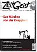
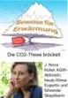

[🠔 Zur Übersicht: Was ist dran?](7arg21.md)  
# Die Klimakatastrophe - 6. Wie konnte es zu dieser weltweiten Hysterie kommen?
**Eine künstlich erzeugte und am Kochen gehaltene Massenpsychose, befeuert von Sozialisten, Gutmenschen und Profitjägern, die die Klimakatastrophe als Mittel zur Macht und zum Geldverdienen nutzen.**  
_von Argus_

## Klimawandel - Wieso? Klimahorror - Cui bono?

## Wollt ihr den totalen Klimaschutz? Ökofaschismus Brutal 
Der gröbste Klotz auf den groben Keil 27

##### Wetter-Aufklärung, Kritik + Ketzereien an Politikkatastrophe, am Klimaschutz-Terrorismus, Treibhausschwindel + CO2-Emissions/Ausstoß-Minderungsprogramm, Klimaveränderung, Globale Erwärmung, Klimaerwärmung, Klimawandel-Hysterie, Panikmache + Klimafakten

Vom Autor "Argus" den ["Altbau + Denkmal Informationen"](index.md) dankenswerterweise zur Verfügung gestellt: 

## 27. Die Klimakatastrophe - Kapitel 6

# Wie konnte es zu dieser weltweiten Hysterie kommen?

## Einige Motive und Aktionen der Klimakatastrophiker in Wissenschaft, Medien und Politik

Wenn man das obige alles unvoreingenommen liest, dann dürfte der erste Eindruck sein. Dieser Mann, der Autor, hat sie nicht mehr alle. Das kann doch gar nicht wahr sein. Warum sollen denn alle die honorigen Forscher und sonstigen Offiziellen so lügen? So eine Riesenverschwörung gibt es doch nicht.

Nein, die gibt es nicht, aber was es gibt, ist eine künstlich erzeugte und am Kochen gehaltene Massenpsychose. Am Kochen gehalten von Sozialisten der ersten Stunde und Gutmenschen, die zurück zur Natur wollen und all jenen, die gemerkt haben, daß damit schnell viel gutes Geld einfach zu verdienen ist. Was es gibt, sind schnöde Motive vieler unserer Wissenschaftler ("dienende Forscher" wie sie Dr. Hartkopf, Staatssekretär und UBA Gründer seinerzeit treffend genannt hat) und Offizielle, zunehmend auch Wirtschaftsbosse, die sofort erkannt haben, daß sich mit diesem Megathema wunderbar riesige Bürokratien aufbauen lassen, Steuermittel in Milliardenhöhe gerne genommen und gegeben werden und sich die Macht, der Einfluß und die Reputation auf einfache Weise steigern läßt. Viel leichter als auf ehrliche Weise! Wenn mühsam für Steuern und Abgaben geworben werden muß, wenn knappe Forschungsmittel im Wettbewerb eingeworben werden müssen, ohne diesen Angstaspekt. Wenn man obendrein noch, bei normaler Ausübung seiner Geschäfte von sog. NGO´s den unkontrollierbaren, völlig intransparenten Organisationen vieler idealistisch denkender Menschen, als Umweltverschmutzer, gar Umweltverbrecher, beschimpft oder gar boykottiert wird. Wer erinnert sich nicht an die Kampagne von Greenpeace gegen Shell bezüglich der geplanten - völlig sauberen und vernünftigen - Versenkung der Bohrinsel Brent Spar. Solche Verleumdungskampagnen machen auch große Unternehmen nicht gerne durch. Da heißt es sich anpassen. Und nebenbei einige Milliarden abgreifen. Wer wüßte heute z.B., daß das Alfred Wegener Institut für Polarforschung sich mit der Erkundung des Eises in der Antarktis beschäftigt. Das wäre keine Nachricht wert. Aber wenn man dort dem Ganzen das Etikett "Klimawandel" umhängt, dann berichtet auch "Der Spiegel" an prominenter Stelle.

## Wie kam es denn nun zu dieser Hysterie?

Seit den 50er Jahren gab es Konferenzen auf Grund von Beobachtungen, die dem CO2 eine besondere Rolle in Bezug auf das Klima zuwiesen. Da sie keine bemerkenswerten Ergebnisse zeitigten, wurden sie nicht besonders beachtet, vorher zugestandene Mittel gekürzt. Die Welt hatte andere, dringlichere Sorgen. (Wie heute auch, möchte ich zufügen) Doch gegen Ende der 60er Jahre änderte sich das. Die Umweltbewegungen erhielten einen höheren Stellenwert, maßgeblich beeinflußt vom reißerischen Buch der Angestellten im US-amerikanischen Fischereiministerium Rachel Carson. “Der stumme Frühling“. Ein Buch aufwühlend und anklagend, aber voller inhaltlicher Falschaussagen und systematischer Fehler.

Im Jahre 1970 hielt die berühmte Anthroplogin Frau Prof. Margaret Mead in Bethesda einen wegweisenden Vortrag : _"Wir stehen vor einer Periode, in der die Gesellschaft Entscheidungen im globalen Rahmen treffen muss ... Was wir von Wissenschaftlern brauchen, sind plausible, möglichst widerspruchsfreie Abschätzungen, die Politiker nutzen können,**ein System künstlicher, aber wirkungsvoller Warnungen aufzubauen, Warnungen, die den Instinkten entsprechen, die Tiere vor den Hurrikan fliehen lassen**. Es geht darum, dass die notwendige Fähigkeit, Opfer zu erbringen, **stimuliert** wird. Es ist deswegen wichtig, unsere Aufmerksamkeit auf die Betonung großer möglicher Gefahren für die Menschheit zu konzentrieren."_

Das fiel auf fruchtbaren Boden. In den USA wurden die Mittel für die Beobachtung weltweiter Veränderung deutlich erhöht. NOAA und UNEP wurden aufgebaut. Allerdings hatte man um die Zeit noch die Sorge, die Erde könne sehr bald an einer neuen Eiszeit leiden.

In Deutschland (1971) war der Staatssekretär im Innenministerium noch unter Hans Dietrich Genscher, Dr. Günther Hartkopf, einer der ersten auf Regierungsseite, der diese von Frau Mead angesprochenen "Systeme künstlicher aber wirkungsvoller Warnungen aufzubauen" als himmlische Möglichkeiten in der Umweltpolitik erkannt hatte. Hartkopf war später der Hauptakteur bei der Gründung des Umweltbundesamtes und bei der Gründung und Finanzierung einiger NGO´s.

## Die Rolle des Dr. Hartkopf

Angeregt durch Frau Mead und ihre Idee, später befeuert durch Märchen des Buches "Die Grenzen des Wachstums" von Dennis Meadows & Jay Forester und bestärkt durch die Honoratioren des Club of Rome, betrieb er effektiv und fast immer am Parlament vorbei, die Gründung und Unterstützung von Hunderten von Bürgerinitiativen und Umweltgruppen, lenkte Forschungsgelder in Institute und ihm genehme Wissenschaftsbetriebe. Nach getaner Arbeit zog er 1986 stolz Bilanz wie Dr. Hug in seinem Buch ["Die Angsttrompeter"](8buch22.md) so treffend berichtet (Alle Fett gesetzten Texte im folgenden Zitat sind Originalzitate, der Rest - nur kursiv - ist der Text des Autors Dr. Heinz Hug):

_**Originalton Hartkopf: "Hohe Beamte in wichtigen Ressorts, die das Buch über die "Grenzen des Wachstums" nicht nur gelesen, sondern auch verstanden hatten, organisierten daraufhin im Vorfeld des Treffens den Teilnehmerkreis so um, dass eine beachtliche Umweltstreitmacht den Wirtschaftsbossen gegenübergestellt wurde." Der argumentative Sieg der Verwaltung über die Wirtschaft und die ihr nahe stehenden Politiker war gegen Abend des denkwürdigen Tages eindeutig. Die Wirtschaft hat nie mehr versucht, ein zweites Gymnicher Gespräch zu verlangen."**_ und weiter

_In Bad Kissingen offenbarte Hartkopf dem Auditorium weitere erstaunliche Details.**"Die Umweltverwaltung - die ja zum weit überwiegenden Teil aus Beamten besteht - (setzt) mit langem Atem einen Großteil ihrer Vorstellungen durch, weil sie genau weiß, wann die Zeit gekommen ist, neue Grenzwerte in die politische Entscheidung einzubringen. Eine reine Staatsorganisation könnte auch nicht übermäßige Erfolge vorweisen, weil als Gegner fortschrittlichen Umweltschutzes große finanzkräftige Wirtschaftsorganisationen mit Verbündeten innerhalb und außerhalb der Verwaltungseinheiten vorhanden sind. Zur Organisation des Umweltschutzes und damit zur Unterstützung der Umwelt bedarf es daher einer Lobby, die außerhalb von Verwaltung und Parlament Forderungen für Umweltschutz erhebt und damit in Politik und Medien gehört wird"**_

_Nun folgt das Interessanteste. Hartkopf erklärt, wie Bürger mithilfe hoher Beamter der Ökodressur unterworfen und Bürgerinitiativen mit Steuergeldern (!) produziert wurden. Im Originalton:**"Nachdem zu Beginn der eigentlichen bundesdeutschen Umweltpolitik eine solche potente Gegenseite nicht vorhanden war, musste sie geschaffen werden... Es waren vorwiegend Beamte, die den Grundstein für die Arbeitsgemeinschaft für Umweltfragen legten und sie mit Leben und sachlichen Mitteln ausstatteten... Doch die Arbeitsgemeinschaft für Umweltfragen ist kein umweltpolitischer Kampfverband. Weil ein solcher fehlte, musste er eben gebildet werden. Es waren wiederum Beamte, die den Plan vorwärts trieben, örtliche Bürgerinitiativen zu einem Dachverband zusammenzuschließen, und die die Gründungsversammlung und noch einiges finanzierten."** (Fast ein Staatsstreich!) Was die Beamten mit Steuergeldern aus der Taufe hoben, waren Ökosingsangvereine, wie der "Bundesverband Bürgerinitiativen Umweltschutz„ (BBU), der die bürgerkriegsähnlichen Schlachten um Brokdorf und Gorleben leitete und finanzierte. Nicht zu vergessen: Auch bei der Startbahn West, wo ein Polizist von einem der "kritischen jungen Leutchen" erschossen wurde, mischte der BBU mit. Hartkopf nennt 1986 in Bad Kissingen auch eine bemerkenswerte Zahl: **"Eine Mitgliedschaft von rund vier Millionen Bürgern kann jederzeit mobilisiert werden und bildet daher ein beachtliches Potenzial, an dem die Politik nicht vorbeigehen kann."** Das muss man sich noch einmal durch den Kopf gehen lassen. Da schaffen sich Politiker und politische Beamte mit Steuergeldern (!) eine Öko-Sturmabteilung, um auf deren Druck hin der Bevölkerung gutmenschliche Öko-Correctness und später höhere Steuern zu verordnen! _

_In seiner Rede geht Hartkopf auch darauf ein, wie die Ökoquisition die Medien zu nützlichen Idioten machte. Er spricht das vornehmer aus und spricht von**"Tendenzinformationen** mit denen die Zeitungsmacher besser wäre die Zeitgeistmacher gefüttert wurden**"**. Zur Glaubwürdigkeitssteigerung der gezielt in die Welt gesetzten Tartarenmeldungen erschienen Berichte in Wissenschaftsjournalen, die nach Hartkopf **"aus der Feder von Beamten stammen, wenn man die Veröffentlichungen von Professoren und ihren beamteten Mitarbeitern an Universitäten mit einbezieht. Die Fülle der substanziellen Fachartikel ist so groß, dass die Wirtschaft weder von der Menge noch von der Qualität her mithalten kann"**. Als einzelne Bundesländer in den 70er-Jahren versuchten, überzogene Grenzwerte im Interesse des gesunden Menschenverstands und der Wirtschaft abzuschwächen, wurden sie nach Hartkopfs Aussagen "**mithilfe der Medien wegadministriert."**_

## Die Rolle des Journalisten Franz Alt

Und Franz Alt, bekennender CO2Bekämpfer und Journalist sagte vor einiger Zeit zum Thema Wahrheit und Objektivität. _:**"Meine Erfahrungen beschränken sich... auf die politischen Magazine. Aber natürlich gibt es hier keinen objektiven Journalismus, aber natürlich müssen wir manipulieren - im Fernsehen noch mehr als beim Rundfunk und bei der Zeitung und im Magazin noch mehr als bei der Tagesschau. Ein Journalist, der sein Tun reflektiert, wird die Subjektivität seiner Arbeit nicht bestreiten können... Diese Manipulation ist nötig und möglich. Da sich aber in einem Ordnungssystem mit freier Publizistik die intentionale Manipulation nicht ausschließen lässt, ist wesentlich, dass es einen Pluralismus der Manipulationen, Manipulationsziele und Manipulationstechniken gibt. Es gibt keine Information ohne Manipulation."**_ Zitat Ende. Franz Alt ist übrigens auch derjenige, der 2004 in einer Sendung von "hart aber fair" über die Windkraftanlagen, CO2als Dreck bezeichnete, das es gälte zu beseitigen, z.B. mit einer Drecksteuer. Wir sind dicht dran!

## Die sozialistische Internationale und die Riokonferenz von 1992

Hierbei sollte man auch nicht die Aussage des kanadischen Ölmagnaten (nach eigener Angabe auch Kommunisten! und Mao-Freundes) Maurice Strong (Generalsekretär der Rio-Konferenz 1992 unter Gro Harlem Brundtland) über die von ihm angedachte verschwörerische Gruppe der “Planetenretter“ vergessen, welche Basis für die angestrebte Global Governance ist. _“So in order to save the planet, the group decides: Isn't the only hope for the planet that the industrial civilizations collapse? Isn't it our responsibility to bring that about? This group of world leaders form a secret society to bring about an economic collapse“. Und wie man offenbar richtig erkannte, läßt sich der wirtschaftliche Kollaps am besten durch Umweltschutz sowie Verkehrs-, Produktions- und Konsumbeschränkung in Kombination mit drastischer Rationierung und Verteuerung von Energie erreichen._

Zurück zu den Anfängen. Damals war ja nur das Waldsterben erfunden, DDT bereits verboten (mit vielen 100 Millionen Toten bis heute, die der Malaria seither zum Opfer fielen, eine Malaria die Ende der 70er Jahre fast ausgerottet war!) Der Atomkrieg drohte alle auszulöschen und am Wetter waren die Atombomben schuld. Das war sehr übersichtlich, der Atomwaffensperrvertrag war aber schon unterschrieben. Es galt neue Bedrohungen zu erfinden. Von Margaret Mead und anderen!

Jay Forester und Dennis Meadows sagten in "Die Grenzen des Wachstums" das Ende der Verfügbarkeit fast aller Rohstoffe noch im letzten Jahrhundert, und u.a. Prof. Stephen Schneider sah die nahende Eiszeit voraus. Und UThant UN-Generalsekretär organisierte in Kopenhagen 1972 die erste Umweltschutzkonferenz. Dann kamen die Amerikaner auf die Idee, daß CO2 zu verdammen, um die Kernenergie zu fördern. Sie fanden einen cleveren Verbündeten in Maggie Thatcher. Günter Ederer beschreibt dies in seinem Buch " Die Sehnsucht nach einer verlogenen Welt" S 349 ff. (wie seherisch dieser Titel doch geradezu anmutet!) was Frau Sonja Boehmer-Christiansen in einer Forschungsarbeit über die politischen Quellen der Treibhausgashysterie herausgefunden hat. Maggie Thatcher, als erbitterte Gegnerin der Gewerkschaften - vor allem der Bergarbeiter-Gewerkschaft - bekannt, hatte andrerseits ein starkes Faible (und aus guten Gründen, wie ich anfügen möchte) für die Kernenergie. Mit den Bergarbeiter Gewerkschaften lag sie in ständiger Fehde. Um Sellarfield -der ersten Wiederaufbereitungs-anlage in Europa- mußte sie, wegen häufiger Pannen dort, bangen. Ausgerechnet der schon bekannte Al Gore, damals noch US-Senator, berichtete ihr von den noch nicht so bekannten CO2-Hypothesen. Sie sah ihre Chance sofort und ergriff sie: Um die Erde zu retten - a la Gore - benötigen wir Atomstrom, aber wir müssen CO2 verhindern. Denn, CO2 ist ja, nach dieser Hypothese, Haupt-Verursacher der Erwärmung, und ist gleich Verbrennung, gleich Kohle, gleich Bergarbeiter, gleich Gewerkschaft. Gedacht, getan! So überzeugten die Briten im Auftrag ihrer Premierministerin und zusammen mit den Amerikanern erst noch Australien, Kanada und Neuseeland. Dann stampften sie mit ihnen gemeinsam über die UN die erste IPCC-Konferenz aus dem Boden. Willfährige Wissenschaftler wurden mit üppigen Forschungsgeldern geködert und um das Ganze rund zu machen, durften auch Wissenschaftler aus Dritte-Welt-Staaten als Stellvertreter der Angelsachsen mitmachen. Ähnlich war das Verhältnis bei den Amerikanern. Und, während die überwältigende Mehrheit der unabhängigen Wissenschaftler die CO2-Hypothese ablehnt, wurde sie von den regierungsabhängigen Wissenschaftlern tatkräftig unterstützt. Und das mit Erfolg, wie wir heute wissen.

Nur, der Schuß ging, bezüglich der Atomkraft und was unser Land betrifft, nach hinten los. Während erst die Grünen begeistert die CO2-Hypothese aufgriffen, gefolgt von der politischen Klasse, und jetzt von der verängstigten Mehrheit im Volke, lehnten sie den 2. Teil dieses Konzepts, den Ausbau und Förderung der Kernenergie, vehement ab. Und hatten Erfolg damit. Deutschland gilt heute bei allen IPCC und sonstigen Klimakonferenzen als Scharfmacher bei gleichzeitig totaler Ablehnung der Kernkraft. Ein toller Erfolg!

Aber es kam noch besser. Nachdem die ersten IPCC Konferenzen für genügend Aufregung gesorgt hatte, schaltete sich die sozialistische Internationale ein, die ehemalige norwegischen Ministerpräsidentin Gro Harlem Brundtland war eine ihrer Vizepräsidenten. Frau Brundtland erreichte, daß die UN sie 1988 mit Leitung der Brundtland-Kommission beauftragte, welche die erste große UN-Konferenz 1992 in Rio organisieren sollte. Bei dieser Konferenz wurde das Konzept der nachhaltigen Entwicklung (sustainable development) beschossen, aus dieser ging dann die Agenda 21 hervor. Wenig danach bekannte Frau Brundtland freimütig im Interview eines kanadischem Reporter Zitat: _"Das Programm der Sozialistischen Internationale ist die Basis der Riokonferenz"._ Der Realsozialismus ist zwar tot aber es lebe die nachhaltige (grüne) Entwicklung mit "gerechter" Zuteilung aller lebenswichtigen Ressourcen. Und jetzt ergibt das an den Eingang gestellte Zitat der britischen Außenministerin noch mehr Sinn: _On Thursday, Margaret Beckett, the Foreign Secretary, compared climate sceptics to advocates of Islamic terror. Neither, she said, should have access to the media."_. Sie wird wissen warum.

Da ist nicht mehr viel hinzufügen. Nur das noch. Die Umweltbürokratie hat sich – nach Anfängen in den USA- europaweit durchgesetzt, jetzt wird die Welt in Angriff genommen. Siehe jüngstes Beispiel: Nairobi mit 6000 Delegierten aus 188 Ländern. Besser und einfacher lassen sich die Bürger gar nicht schröpfen und gängeln. Das begreifen fast alle. Auch Dritte Welt Staaten. Nur wir nicht!

Nun die letzte Frage: Können wir etwas dagegen tun? Noch ja, zum Glück: Die "verschwindende Minderheit" der Klimaskeptiker, wie es der Spiegel im letzten Umwelttitel (Ausgabe 44) formulierte, ist sehr aktiv und wird täglich stärker und lauter. Genaueres findet man in den Veröffentlichungen der 400 (inzwischen über 2000) Wissenschaftler -einschließlich Nobelpreisträgern-), die den "Heidelberger Appell" unterzeichnet haben, sowie der 19.000 Wissenschaftler und Fachleute, welche sich mit der so genannten "Oregon-Deklaration" gegen das Kyoto-Protokoll gewandt haben Vielleicht demnächst Sie auch? Das gäbe doch Anlaß zur Hoffnung.

**Argus im November 2006**

 Christopher Monckton im Telegraph 15.11.06 [www.telegraph.co.uk/news/main.jhtml?xml=/news/2006/11/12/nclim12.xml](http://www.telegraph.co.uk/news/main.jhtml?xml=/news/2006/11/12/nclim12.xml)

 bei seiner Eröffnungsrede in Nairobi Nov. 2006 der ganze Absatz lautete: _"This is not science fiction, These are plausible scenarios, based on clear and rigorous scientific modeling. A few diehard skeptics continue trying to sow doubt. They should he seen for what they are: out of step, out of arguments and out of the time. In fact, the scientific consensus is becoming not only more complete, but also more alarming. Many scientists long known for their caution are now saying that global warming trends are perilously close to a point of no return."_

 Professor Dr. Helmut Kraus, emeritierter Direktor des Meteorologischen Institutes der Universität Bonn hat das Lehrbuch "Die Atmosphäre der Erde" geschrieben (2002). Dort steht im Kapitel "Bodennahe Klima Änderungen" der Satz: _"Am Beispiel beider Stationen (Anm.: Wien und Hohenpeißenberg) erkennt man deutlich, dass es zum Ende des 18. Jahrhunderts noch etwas wärmer war als heute“_

 Näheres hier: [www.john-daly.com/ges/surftmp/surftemp.htm](http://www.john-daly.com/ges/surftmp/surftemp.htm)

 Die Daten, die Mann und Co unterdrückt hatten, fanden sich in seinem Computermodell, das zuletzt doch zugänglich gemacht wurde, im Ordner "Censored Data". Das spricht für sich.

 (Zur Güte der Vorhersagen der Computermodelle unserer Wissenschaftler vom Max Plank Institut für Meteorologie oder anderen IPCC UNO Nutznießern komme ich noch mal separat zu sprechen)

 von Arrhenius 1890 - und viele haben sehr gute Gründe zu meinen - zu niedrig geschätzen - 280 ppp

 Bestes Beispiel für eine - sogar enge - Korrelation ist die Menge der Störche und die Menge an Babys, die geboren werden. Diese beiden Prozesse sind eng korrelliert (wir zählen weniger Störche und haben weniger Babys), aber daß sie voneinander abhängen, das hat noch niemand ernsthaft behauptet.

 Quelle: Fischer et al. Science Vol 283, 1999

 _**"Ein neues Meßverfahren - und überraschende Ergebnisse** (Frederike Wagner, Universtät Utrecht)_

_Eine neue, robuste Technik zur Bestimmung der CO 2-Gehalte der Luft in der Vergangenheit wurde nun in den späten Neunziger Jahren eingeführt. Zwischen der Flächendichte der Spaltöffnungen (Stomatae) in den Blättern bedecktsamiger Pflanzen (Angiospermen) und der umgebenden atmosphärischen CO2-Konzentration besteht ein enger inverser Zusammenhang. Dieser macht es möglich, den einstigen CO2-Gehalt der Atmosphäre aus fossilen Blättern zu bestimmen. Für weniger weit zurückliegende Epochen können CO2-Gehalte abgeleitet werden aus Blättern, die man im Torfmoor findet._

Obwohl die Eisbohrkerne dies nicht erkennen lassen, zeigt das neue Meßverfahren, wie die atmosphärische CO2-Konzentration von 260 ppm am Ende der letzten Eiszeit schnell auf 335 ppm im Preboreal (vor 11500 Jahren) anstieg, dann wieder auf 300 ppm abfiel und vor 9300 Jahren 365 ppm erreichte. **Diese Beobachtungen widerlegen die Annahme einer stabilen "vorindustriellen" Atmosphäre** und zeigen, daß CO2-Niveaus wie das heutige das Ergebnis sonnengesteuerter Temperaturzunahmen mit darauffolgender Ozean-Entgasung sind. Der rekonstruierte Verlauf aus der Zeit vor 9000 Jahren gibt Auskunft über CO2-Zunahmen von 65 ppm pro Jahrhundert, die zu CO2-Niveaus wie dem heutigen führten, bei Temperaturen ebenfalls ähnlich den heutigen. **Daraus folgt, daß man nach Beweisen für Effekte der industriellen CO 2-Emissionen vergeblich suchen wird. Weder die heutigen Temperaturen noch die heutige atmosphärische Chemie zeigen Anomalien." **(Ende des Zitats)

 das ist die Temperaturerhöhung, die rechnerisch bei einer**_Verdoppelung_** des CO2-Anteiles in der Luft auftritt.

 das sind mathematische Methoden zur Herleitungen von Formeln aus aufgezeichneten Verläufen, aus denen sich die Parameter dann bestimmen lassen

 im Journal of Geophysical Research 104, S. 3865 (Februar 1999) unter dem Titel “Why is the global warming proceeding much slower than expected?“

 [www.john-daly.com/schneidr.htm](http://www.john-daly.com/schneidr.htm)

 zumindest mit dieser Aussage kann man wohl Wikipedia als verläßliche Wissensquelle betrachten. Obwohl sonst viele Zweifel erlaubt sein dürfen.

 Das haben erst kürzlich Wingham, D.J., Shepherd, A., Muir, A. und Marshall, G.J. (2006. Mass balance of the Antarctic ice sheet. Philosophical Transactions of the Royal Society A 364: 1627-1635.) wieder festgestellt.

 CO2 Science Magazine, 18 October 2006, In einer kürzlich durchgeführten Untersuchung über den globalen Anstieg der Meeresspiegel kommen Wissenschaftler zu der Erkenntnis: daß, wenn man dekadische Veränderungen mittels statistischer Computeranalysen des Meerespiegels untersucht, dann erkennt man daß es keine signifikanten Anstiege von 1950 bis 2000 zu erkennen sind. Die Zahlen von 1993 bis 2000 und die Zahlen von 1920 bis 1945 sind so gut wie gleich groß. (2,4 ± 1.0 mm/Jahr zu 2,6 ± 0,7 mm/Jahr)!

 Kohlendioxid und Klima Vortrag vor Old Table Freiburg am 21.2.2002 von Dipl.-Phys. Alvo v. Alvensleben Revidierte Fassung März 2002, [www.schulphysik.de/klima/alvens/klima.html](http://www.schulphysik.de/klima/alvens/klima.html)

 Zitat aus den IPCC Veröffentlichungen, gefunden bei [www.science.orf.at/science/n#56150E](http://www.science.orf.at/science/n#56150E#56150E)

 Viel Wissenswertes über inhaltliche und methodische Fehler und Verfälschungen der IPCC Modelle findet sich hier: [www.john-daly.com/tar-20#5C5247](http://www.john-daly.com/tar-20#5C5247#5C5247)

 Amtliche Schätzung auf der letzten Marrakesch Klimakonferenz

 ... (also unter Rot/Grün) auf eine kleine Anfrage zur Bennennung der Kosten von Kyoto

 ... so in einer Phönix-Runde zur Nairobi-Konferenz am 15.11.06

 1 % des BSP jährlich, weltweit sind das in 2005 ca. 450 Mrd $ der Löwenanteil davon für die EU& USA, Stern schätzt dann auch großzügig ca. 500 Mrd $

 [www.telegraph.co.uk/news/main.jhtml?xml=/news/2006/11/12/nclim12.xml](http://www.telegraph.co.uk/news/main.jhtml?xml=/news/2006/11/12/nclim12.xml)

 Auszüge entnommen dem Buch, "Die Angsttrompeter" von Heinz Hug:

 Dennis Meadows gestand später ein, daß er und seine Mitarbeiter nur 0,1 Prozent ihres Wissens auf die Datenbasis verwendeten. D.h., sie errechneten Modelle ohne jeden Bezug zur Wirklichkeit. Wie heute wieder!

 Alle Fett gesetzten Texte im folgenden Zitat sind Originalzitate, der Rest - nur kursiv - ist der Text des Autors Dr. Heinz Hug.

Zitat _"Nein, die Hysterie ist nachweislich ein von er sozialliberalen Regierung Brandt/Schmidt veranstalteter Klamauk, der als politisches Perpetuum terribile unter Töpfer während der Ära Kohl unaufhörlich weiterklapperte. Wie das ablief, schildert Hartkopf 1986 in Bad Kissingen. Klar und deutlich beschreibt er in einer Rede die Kriegführung der Politik gegen die Wohlstandsgesellschaft, die Industrie und deren Arbeitnehmer. Zunächst berichtet er, wie die Vorstände großer Unternehmen am 3. Juli 1975 auf Schloss Gymnich geleimt wurden, als sie sich gegen überzogene Umweltauflagen zur Wehr setzen wollten."_

 Dr. Hug: _"... Spiel, Satz und Sieg für die Okoquisition! Im Rückblick verwundert es nicht allzu sehr weshalb die Vorstandschefs großer Industrieunternehmen - von Ausnahmen abgesehen - sofort der Ökofahne nacheilten und ihre leitenden Mitarbeiter die Suppe auslöffeln ließen, während die kleineren Angestellten zu Hause fleißig den Müll trennten, Dies hat Folgen, denn die allgemein akzeptierte vollsynthetische Scheinrealität macht Unternehmen erpressbar wie der Fall der Brent Spar. Und genau aus diesem Grund haben deutsche, Firmen inclusive Shell die freie Meinung aufgegeben und sich bei der Ökopolonaise eingereiht."_

 Franz Alt 1976 in einem Anfall von Ehrlichkeit in Bild der Wissenschaft

 Zitat aus Dixy Lee Ray und Lou Guzzo (1993) “Environmental Overkill“, S.1143

 Die Zusammensetzung der ersten Konferenz nach Herkunftsländern zeigt das deutlich: 25 Neuseeländer, 72 Australier, 38 Kanadier, 29 Briten, 135 US Amerikaner, standen gerade mal 6 Russen, 8 Chinesen, 9 Franzosen, und 2 Indern gegenüber. Nigel Calder - der berühmte Wissenschaftsjournalist und Autor des Bestsellers von "Die launische Sonne" kennt fast alle Teilnehmer persönlich und auch ihre Herkunft. 60 % der britischen Teilnehmer stammten aus regierungsabhängigen Organisationen, (wieviel mögen es derzeit in Nairobi sein?), nur zu 40 % waren es unabhängige Wissenschaftler.

 Die Angsttrompeter S. 105

---

Martin Durkin: **The Great Global Warming Swindle** , CD mit dem sensationellen Klimaschocker-Film, der die mediale Aufklärung rund um den Ökoterrorismus kräftig anfeuerte.

**Empfohlene Literatur der führenden deutschen und internationalen Ökokritiker / Klimaleugner / Klimaschutzskeptiker / Wetterkundler / Klimahistoriker:** 

---

Empfohlene Links: 
[Bücher Pro & Contra Ökowahn (Crichton, Rahmstorf, Schellnhuber, Hug, Thüne, Gold u.v.a.)](8buch22.md) - Fetzige Buchrezensionen: Klimaschocker, Klimalügen und Klimaaufklärung 
[IN formation F ür A ufgeklärte S teuerbüger der F orschungsgruppe A bgeordneteninduzierte Q ualen (INFAS/FAQ)](7thu62.md) 
[Argus: Glaubensbekenntnis: Ökologie + Ökonomie müssen keine Gegensätze sein - Wie man mit einfachem Abschalten von Standby-Geräten das Klima retten kann.](7argus2.md) 
[Hintergründe, Fakten, Emotionen - Vergnügliches und Verdrießliches zur Klimaschutzsauerei und Treibhauseffektlüge](7thuene1.md) - da geht die Post ab ... 
[Zur staatlichen Vergeudung der Klimaschutzsubventionen aus Steuermitteln mittels Günstlingswirtschaft - aus einem Bundesrechnungshofbericht"](7thu54.md) 
Maria Ackermann: "[Klimawandel und Klimalügen - Fakten und Aufklärung zum Klimaschutz-Beschiß](7klima.md)" 
Marcel Ott, Anton Schönfeld: "[Der Globale Klimawandel](7klima2.md)" 
[Die Filme/Videos/Fernsehsendungen zum Klimaschwindel und Klimaschutzterror](7video.md) +++ [Dr. Helmut Böttiger: Rette die Erde und bringe Dich um!](7boet1.md) - Die Klimaapokalypse als Massenmordwaffe / Massenvernichtungswaffe 
[Dr. Helmut Böttiger: Klimakatastrophe - Warum gerade CO2? / Massenbesteuerungswaffen + Finanzsystemschutz](7boet3.md) Der Treibhausschwindel, die Klimaschutzdiktatur und ihre Klimaschutzlüge - Cui Bono? Ein entlarvender Striptease 
Dr. Albert Glatzle: "[Klimaschädlich? Kohlendioxydemissionen aus Landwirtschaft und Viehwirtschaft](7klima3.md)" 
**Brisant:**[Die perverse Geschichte der GRÜNEN](7thu68.md) 
[1. FDP EIKE Klima-Abend am 17.4.08 in Berlin](http://www.eike-klima-energie.eu/?WCMSGroup_4_3=6&WCMSGroup_6_3=1247&WCMSArticle_3_1247=350 ) - mit Dr. Hans Labohm (Ökonom, IPCC Reviewer), Prof. Dr. Horst Malberg (ehem.Direktor des Instituts für Meteorologie der Freien Universität Berlin), Dr. Dietmar Ufer (Energiewirtschaftler), Thomas Heinzow (Diplom-Sozialökonom, Diplom-Betriebswirt, Meteorologe, Forschungsstelle Nachhaltige Umweltentwicklung Uni Hamburg) +++ [Norbert Deul/Hausgeld-Vergleich entlarvt den Klimaschutzsatanismus der Poliducker und Ministerialratten](http://hausgeld-vergleich.de/Deul_weitereNews_112.htm) 
[Deutsche Webseite des Tschech. Präs. Vaclav Claus - Gegen den ÖKOTERROR](http://de.liberty.li/magazine/url.php?id=4226) 
[Prof. Dr. Gerhard Gerlich: Physikal. Grundlagen des Treibhauseffektes + fiktiver Treibhauseffekte](http://www.ib-rauch.de/datenbank/vortrag-leipzig.html) 
[Dipl.-Phys. Alvo von Alvensleben - Die falschen Klimawandel-Argumente des Merkelberaters Prof. Rahmstorf!](http://www.schulphysik.de/klima/alvens/antwort.html) 
[Dipl. Phys. M. Müller: Gedanken zum Treibhaus Erde / Widerlegung der CO2-Hypothese](http://home.arcor.de/meino/klimanews/index.html#53531198c90bc3305#53531198c90bc3305) 
[www.klimamanifest-von-heiligenroth.de/](http://www.klimamanifest-von-heiligenroth.de/) 
[www.naturschutzparadox.de/](http://www.naturschutzparadox.de/) - Naturschutzverbände und Klimahysterie 
[Ein Hammer: muslim-markt.de interviewt Prof. Dr. Gerhard Gerlich zum amtlichen Klimabeschiß](http://www.muslim-markt.de/interview/2007/gerlich.htm) 
[tcsdaily.com - Hans H.J. Labohm: Proliferation of Climate Scepticism in Europe](http://www.tcsdaily.com/article.aspx?id=110107A) 
[Climate science at it's best - global warming a hoax? See here the facts!](http://www.oism.org/pproject/s33p36.htm) 
[www.globalwarmingskeptics.info/](http://www.globalwarmingskeptics.info/) - Boring for few, exciting for many! The name is the program! 
[Andrew's "The Anti "Man-Made" Global Warming Resource, STOP the hysteria"](http://z4.invisionfree.com/Popular_Technology/index.php?showtopic=2050) - Great hot stuff! 
[Die kritisch-informative Seite des Wissenschaftsjournalists Edgar Gärtner, Autor von "Öko-Nihilismus": Analysen - Konzepte - Trends](http://www.gaertner-online.de/) 
[Marc Moreno's Thrilling Climate News and Comments - Denialism at it's best](http://www.climatedepot.com/) 
[Energiespar- und Klimaseite - Hintergründe der Klimawandel-Panikmache](7wsvoant.md) 
[ <======== **ZeitGeist 1/09: Kontra Ökobetrug**](https://zeitgeist-online.de/index.php/printausgabe/13-heft-nr-29-1-2009/96-qpottdicht-isolierte-raeume-sind-die-bausuende-nummer-einsq) 
[ **Das Skeptiker-Handbuch - Bildklick zum Download**](http://www.eike-klima-energie.eu/klima-anzeige/skeptiker-handbuch-fuer-den-rest-von-uns/?tx_ttnews%5Bpointer%5D=1) ========> 
[ZeitGeist-Magazin: Zur Klimareligion und anderen brennenden Fragen](http://zeitgeist-online.de/) 
[Joanne Nova - Das Skeptiker-Handbuch (deutsch)](http://joannenova.com.au/2009/05/16/das-skeptiker-handbuch-has-arrived/#comment-6926#comment-6926) 
[Sensation kontra Ökommunismus! Aus Monatszeitung der Kommunistischen Partei Deutschlands KPD(B): 'From Silent Spring to Global Warming – eine kleine Geschichte des Ökologismus'](http://ta.kpdb.de/archiv/16-maerz-2009/106-from-silent-spring-to-global-warming--eine-kleine-geschichte-des-oekologismus) 
[Spannend: Ein Klimaschwindler beichtet seine politisch erpressten Betrügereien](http://www.beichthaus.com/index.php?h=index&c=00023746&PHPSESSID=a8bf26ce197d1f22f8325c7289bb6cfe) 
[Steve McIntyre's Website / Blog Climateaudit](http://www.climateaudit.org/) 
[Steven Milloy presents www.junkscience.com/ - Junk climate science at it's best!](http://www.junkscience.com/) 
[Wolf Lotter in brand eins 3/2007: "Kommentar: Zweifel im Klimakterium - Das eigentliche Problem mit dem Weltklima ist der Verlust des Denkvermögens."](http://www.brandeins.de/home/inhalt_detail.asp?id=2254&MenuID=8&MagID) 
[Frankfurter Allgemeine Zeitung FAZ 3.4.07: "Wider die Klimahysterie - Mehr Licht im Dunkel des Klimawandels"](http://www.faz.net/s/RubC5406E1142284FB6BB79CE581A20766E/Doc~E128116B52BAB4E73A398F4CC7CC6388A~ATpl~Ecommon~Scontent.html) - von Christian Bartsch 
[Prof. Rahmstorf und der verzweifelte Versuch, die Klimakatstrophe zu retten](http://klimakatastrophe.wordpress.com/2008/03/16/prof-rahmstorf-und-der-verzweifelte-versuch-die-klimaerwarmung-zu-retten/#comment-456#comment-456) 
[BILD 30.3.07: "Klima-Alarm - Hat die Erderwärmung nichts mit CO2 zu tun?"](http://www.bild.t-online.de/BTO/news/2007/03/30/klima-alarm/oeko-luege.html) 
[Campo News Blog: Schönes Grün: 2022 - die nicht überleben wollen](http://www.campodecriptana.de/blog/2007/09/13/921.html) 
[EIKE, Europäisches Institut für Klima und Energie, Jena](http://www.eike-klima-energie.eu/) - der Zusammenschluß deutscher Klimaskeptiker 
[Wetter und Klima Fakten ](http://www.wetterklimafakten.eu/) - eine kritische Betrachtung der Klimadiskussion! 
[Rainer Hoffmanns Sammlung klimakritischer Dokumente ](http://web.archive.org/web/20071127014442/www.solarresearch.org/1478062.htm) - Ein Muß! 
[Financial Times Deutschland FTD: Gastkommentar von Vaclav Klaus: "Klima-Wahrheiten. Nicht die Umwelt ist gefährdet, sondern die Freiheit. ..."](http://www.ftd.de/meinung/kommentare/:Gastkommentar Klima Wahrheiten/213649.html) 
["Klimakatastrophe: Entwarnung aus dem Umweltministerium"](http://www.ef-online.de/?p=95) - Muß die Kernkraft das Klima retten? Oder die "erneuerbaren" Energien? Oder die Klimaschutzpolitik? Oder Ich und Du, Müllers Esel oder wer sonst? 
[Dipl.-Biol. E. Beck: "Der Wasserplanet. Dokumentation einer anthropogenen Irrlehre."](http://www.egbeck.de/treibhaus/) - Seriöseste Facts gegen die anschwellende Ökodiktatur der internationalen Klimaschutzterroristen 
[Klimasimulation - ein Werk von Lügnern, Wahrheits-Leugnern oder gar Schwindlern? Bilden Sie sich weiter und eine eigene Meinung zum Treibhauseffekt, lesen Sie hier!](http://www.biokurs.de/treibhaus/otreibh2.htm) 
[Hartmut Bachmann: Klimaüberraschung](http://www.klimaueberraschung.de) 
[Klimanotizen.de und feinsinnigste Klimaketzereien](http://www.Klimanotizen.de) 
[Vereinigung gegen abiträre Steuerpolitik in Luxemburg und gegen die CO2-Hysterie](http://www.gaspl.eu.tt) 
[Burghard Schmanck: Schmanckerl zum Klimaterror, Linkliste, historische und theologische Entlarvungen](http://www.schmanck.de/) - Ein Lateiner reißt allerlei Schwindeleien die Maske runter 
[Der Treibhausgas- und CO2-Betrug und die CO2-Lüge, der Hochwasser-Schwindel, das Ozon-Märchen und sonstige Grausamkeiten der Ökodiktatur - von Joh. Maas](http://www.www.co2betrug.de/) 
[Treibhauseffekt, Klimawandel, Ozonloch - profitable Lügen](http://www.chemtrails-info.de/chemtrails/klimawandel-luegen.htm) 
[treibhausluege.de - Ein neuer Info-Blog](http://www.treibhausluege.de/) 
[wahrheiten.org - Info zur Klimalüge](http://www.wahrheiten.org/blog/klimaluge/) 
[klimaskeptiker.info - Der Name ist Programm](http://www.klimaskeptiker.info/) 
[Der kritische Wissenschaftsjournalist und Hydrobiologe Edgar Gärtner im Magazin Novo über auf Eis gelegte Fakten und Klimaesoterik: "Es gibt keine globale Erwärmung!"](http://www.novo-magazin.de/85/novo8518.htm) 
[Oliver Marc Hartwich, CAPITAL 13.5.07: "Die grünen Geister, die Frau Thatcher mit ihrer Klimadebatte rief"](http://www.capital.de/politik/100006382.html?eid=100005249) 
[http://www.naeb.info/ - Nationale Anti-EEG-Bewegung](http://www.naeb.info/) 
[Der Exxon/Esso-Klimabeschiß - Scenes from the climate inqusition](http://www.nowpublic.com/scenes_from_the_climate_inquisition) [www.warwickhughes.com/hoyt/scorecard.htm - Greenhouse Warming Scorecard - a comparison of greenhouse model predictions with actual observations](http://www.warwickhughes.com/hoyt/scorecard.htm) 
[John Ray, Brisbane: Antigreen Blogspot - Greenie Watch](http://antigreen.blogspot.com/) 
[Jens Christian Heuer: weltenwetter.blogspot.com - Klimaaufklärung durch Wetterbeobachtung](http://weltenwetter.blogspot.com/) 
[Klimawandel, Apokalypse und der Staat: Eine nüchterne Betrachtung auf dem Weg zur &Oumlkodiktatur](http://de.liberty.li/magazine/?id=3843) 
[Deutsche Welle, Panorama: "Die Kultur des Klimas" - Der Klimawandel war schon immer - Kein Grund zur aktuellen Besorgnis](http://www.dw-world.de/dw/article/0,2144,1036298,00.html) 
[Die Ministerin für den Ländlichen Raum BW, Pressemitteilung 110/2000: Weinreben gediehen sogar in Grönland - so war das Klima früher](http://www.mlr.baden-wuerttemberg.de/content.pl?ARTIKEL_ID=3193) 
[Ökologismus.de - Aufklärung gegen den Ökolügismus & für Klimaketzer](http://www.oekologismus.de/) 
[SCIENCE & ENVIRONMENTAL POLICY PROJECT](http://www.sepp.org/) - Prof Fred Singer's Site for Climate skeptics / Mass of info, links & documents 
[Gibt es überhaupt eine globale Erwärmung? - Is Global Warming real ?](http://www.geocraft.com/WVFossils/global_warming.html) - Offizielle Tatsachen, Belege und Beweise gegen den Ökoirrsin und CO2-Abzockschwindel 
[GEOPHYSICAL RESEARCH LETTERS, VOL. 34, L01602, doi:10.1029/2006GL028492, 2007: S. J. Holgate: On the decadal rates of sea level change during the twentieth century - Der Meeresspiegelanstieg hat sich in den letzten 50 Jahren verlangsamt!](http://www.agu.org/pubs/crossref/2007/2006GL028492.shtml) 
[Wahrheitssuche: Der Treibhaus-Schwindel - Alle Facts auf einen Blick](http://www.wahrheitssuche.org/treibhaus.html) 
[Oliver Lehmann: CO2-Diskussion, oder: Wie zocke ich zu Beginn des 21. Jahrhundert den Autofahrer erneut ab, ohne dass er es sofort bemerkt?](http://w463.de/co2.htm) 
**Texte zur Rekonstruktion des Faschismus in Deutschland:** [Das Antidiskriminierungs-Bundessicherheitshauptamt](8philipp.md#das) 
[Staat - Provinz - Kolonie?](8philipp.md#staat)

---

Themen auf dieser und den anderen Seiten dieser Homepage: Treibhauseffekt, Treibhaus Erde, Unwetter, Tornados, Abschmelzende Polkappen, Schmelzende Gletscher, Gletscherschmelze, Zunahme Hochwasser, Hochwasserrereignisse, Tornado, Hurrikan, Stürme, Kleine Eiszeit, Wetterkontrolle, Klimakontrolle, Klimaschutzprotokoll, Kioto-Protokoll, Kyoto-Prozeß, IPPC, Klima-Verbrecher-Jagd, Klimaterror und Pseudowissenschaft, Klimasünder, Klimasünderbestrafung, Klimaleugnerverfolgung, Betrug, Betrügerei, Taktik, Strategie, politischer Schwindel, Simulation, pseudowissenschaftliche Klimasimulation, Klima, Klimaschutz, Klimasünder im Visier: Kühe, Kuhherden, Schafe, Schafherden, Rind, Rinder, Rinderherden, Ziegen, Ziegenherden, Hühner, Schweine, Fried Chicken, Freilandschweine, Ökoschwein, Ökoschweine, Ökosau, Ökosäue, Ökodrecksau, Ökodrecksäue mit Naturschützer - Naturschutz - / Klimaschutz - Ökosiegel, McDonald - Hamburger, Steakhouse, Hamburgerketten + Big Mac + Burgerking. Klimaschützer, Umwelt, Klimaapokalypse, Klimasarkasmus, Klimaironie, Klimagroteske, Klimazynismus, Klimahysterie, Klimakatastrophismus, Klimaschutzhysterie, Klimapanik, Klimapanikmache, Klimaschwindel, Klimaschutzschwindel, Klimalüge, Klimaschutzlüge, Klimaterroror, Ökoterror, Ökologische Tyrannis, Ökoterrorismus, Ökodiktatur, Ökomärchen, co ², Ökoverbrecher, Öko-Abzocke, Klimaabzocke, Klimaschutz-Abzocke, Klimaschutzgelder, Klimaverängstigung, Tyrannei, Weltklimarat, falsche Wetter-Prophetie, Klima-Propheten, Weltklimabericht, Klimaschutzabgaben, Durchschnitt, Klimaschutzsteuer, Klimamafia, Wissenschaftsschwindel, Wissenschaftsbetrug, Wissenschaftsmärchen, Wissenschaftslügen, Klimatyrannei, Klimatyrannis, Klimaschutztyrannei, Klimaschutztyrannis, Ökotyrannis, Ökotyrannei, Junk science, Öko-Revolution, Klimawissenschaft, Klimaschutz-Profit, Klima-Profiteure, Energie-Monopole, Atomkraft, Atom-Industrie, Kernkraft, Klimawissenschaftler, Klimaschutz-Prognostiker, Klimaprognose, Vorhersage, Klimavorhersage, Klimaschutzmärchen, Klimasimulation, Klimasimulanten, Wettervorhersage, Wetterwechsel, Wetteränderung, Klimavorhersage, Pro und Kontra, Skepsis, Skeptiker, Stromwirtschaft, Erdöl, Ö-Lobby, Lobbykratur, Lobbyisten, CO2, Kohlendioxid, Meteorologie, Meteorologe, Klimamessung, Klimaänderung, Klimawechsel, Klimawandel, Klimaforscher, Klimaforschung, Natur, Naturschutz, Naturschützer, Ökologie, Umwelt, Umweltschutz, Klimafolgen-Forschung, Mojib Latif, Professor Stefan Rahmstorf, Prof. Dr. Hans Joachim Schellnhuber, Umweltschützer, Klimaberater, Klimaexperten, Potsdam-Institut für Klimafolgenforschung, Globale Erwärmung, Klimasimulation, Global Warming, Climatic Change, Fossile Energie, Alternative Energie, nachwachsende Rohstoffe, Kohle, Erdgas, Gas, Strom, Verstromung.
