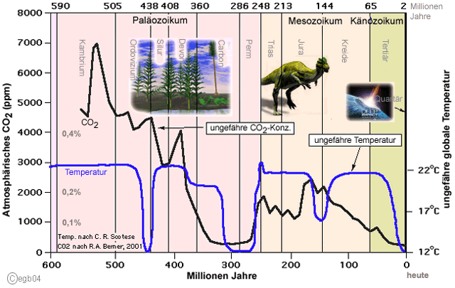
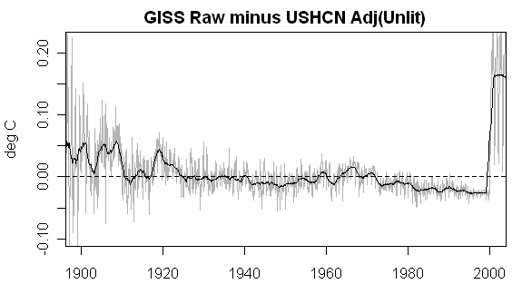
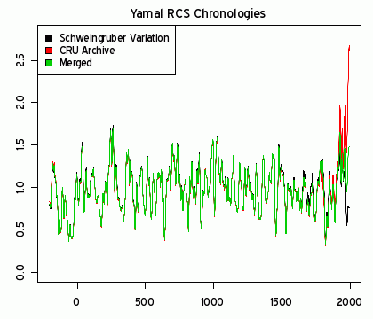

[🠔 Zur Übersicht: Klima](7thuene1.md)  
# Klimawandel - Wieso? Klimahorror - Cui bono? + Argus-Kommentar Nairobi Report
**Wetter-Aufklärung, Kritik + Ketzereien an Politikkatastrophe, am Klimaschutz-Terrorismus, Treibhausschwindel + CO2-Emissions/Ausstoß-Minderungsprogramm, Klimaveränderung, Globale Erwärmung, Klimaerwärmung, Klima**  
_von Konrad Fischer • aktualisiert 22.11.2009_

****AKTUELL:**** 22.11.2009: Climategate 1 - **[Angloamerikanische Wissenschaftskriminelle erfanden den Klimaschwindel - auch Deutsche Professoren dabei!](http://www.welt.de/wissenschaft/article5294872/Die-Tricks-der-Forscher-beim-Klimawandel.html)** 
Climategate 2 - **[Entlarvt: Menschengemachte Erderwärmung - ein Schwindel der Grünen Klimaschutzgelderpresser](http://www.eike-klima-energie.eu/news-anzeige/dreiste-manipulation-der-wichtigsten-temperaturdaten-zur-welttemperatur-nicht-mehr-auszuschliessen-das-daten-desaster-der-ipcc-klimazentrums-cru-climate-research-unit-der-universitaet-east-anglia/)** 
Schon wieder? Umweltbundesamt: [Staatlich organisierter **Völkermord mittels Entgasung/Klimaschutz/CO2-Reduktion?**](7thu51.md)

## Wollt ihr den totalen Klimaschutz? Ökofaschismus Brutal 
Der gröbste Klotz auf den groben Keil 1

##### Wetter-Aufklärung, Kritik + Ketzereien an Politikkatastrophe, am Klimaschutz-Terrorismus, Treibhausschwindel + CO2-Emissions/Ausstoß-Minderungsprogramm, Klimaveränderung, Globale Erwärmung, Klimaerwärmung, Klimawandel-Hysterie, Panikmache + Klimafakten

> [!abstract]+ Kapitelübersicht: Klimawandel - Cui bono?  
> 1. **Klimawandel - Wieso? Klimahorror - Cui bono? + Argus-Kommentar Nairobi Report**
> 2. [Klimawandel 2: Panik-Publizistik bis zum Abwinken - Einige boshafte Tiraden](7arg02.md)
> 3. [3. Heil Öko!](7arg03.md)
> 4. [4. Ökohetze und Öko-Aberglauben](7arg04.md)
> 5. [5. Klimaschutz-Manipulation der Generation Sponge-Bob](7arg05.md)
> 6. [Klimawandel - Wieso? Klimahorror - Cui bono?](7arg06.md)
> 7. [7. CO2-Lügen und -Wahrheiten 1](7arg07.md)
> 8. [Klimawandel - Wieso? Klimahorror - Cui bono?](7arg09.md)
> 9. [10. Klimaleugner ins KZ! Vergasen! (Aber bitte CO2-frei!)](7arg10.md)
> 10. [Atommärchen für PISAner](7arg11.md)
> 11. [Klimawandel - Wieso? Klimahorror - Cui bono?](7arg12.md)
> 12. [13. Ökobrain-Controlling im Totenkopf](7arg13.md)
> 13. [14. Wie funktioniert der Ökoschwindel / Klimaschutz-Betrug 1?](7arg14.md)
> 14. [19. Öko-Katastrophismus/-Alarmismus und Verknappung als Herrschafts- und Marketinginstrumente](7arg19.md)
> 15. [Klima, Klimaforscher, der IPCC Vorbericht und die Wahrheit](7arg20.md)
> 16. [21. Argus: Nairobi Report (Vers. 3.3) - Die Klimakatastrophe - was ist wirklich dran?](7arg21.md)

Was keiner wagt, das sollt ihr wagen, 
Was keiner sagt, das sagt heraus, 
Was keiner denkt, sollt ihr befragen, 
Was keiner anfängt, das führt aus.

Wenn keiner ja sagt, sollt ihr's sagen, 
Wenn keiner nein sagt, sagt doch nein, 
Wenn alle zweifeln, wagt zu glauben, 
Wenn alle mittun, steht allein!

Wo alle loben, habt Bedenken, 
Wo alle spotten, spottet nicht, 
Wo alle geizen, wagt zu schenken, 
Wo alles dunkel ist, macht Licht! 

Walter Flex (6.7.1887 - 16.10.1917)

  Friedrich Nietzsche (1844-1900): 
_"Sprachverwirrung des Guten und Bösen: dieses Zeichen gebe ich euch als Zeichen des Staates. 

Unschuldige Korruption. — In allen Instituten, in welche nicht die scharfe Luft der öffentlichen Kritik hineinweht, wächst eine unschuldige Korruption auf, wie ein Pilz (also zum Beispiel in gelehrten Körperschaften und Senaten). 

Im Dienste des Fürsten [KF: der Klimaschutz-Profiteure]. — Ein Staatsmann wird, um völlig rücksichtslos handeln zu können, am besten tun, nicht für sich, sondern für einen Fürsten sein Werk auszuführen. Von dem Glanze dieser allgemeinen Uneigennützigkeit wird das Auge des Beschauers geblendet, so dass er jene Tücken und Härten, welche das Werk des Staatsmannes mit sich bringt, nicht sieht. 

Benutzung der kleinsten Unredlichkeit. — Die Macht der Presse besteht darin, dass jeder Einzelne, der ihr dient, sich nur ganz wenig verpflichtet und verbunden fühlt. Er sagt für gewöhnlich seine Meinung, aber sagt sie einmal auch nicht, um seiner Partei oder der Politik seines Landes oder endlich sich selbst zu nützen. Solche kleine Vergehen der Unredlichkeit oder vielleicht nur einer unredlichen Verschwiegenheit sind von dem Einzelnen nicht schwer zu tragen, doch sind die Folgen außerordentlich, weil diese kleinen Vergehen von Vielen zu gleicher Zeit begangen werden. Jeder von Diesen sagt sich: "für so geringe Dienste lebe ich besser, kann ich mein Auskommen finden; durch den Mangel solcher kleinen Rücksichten mache ich mich unmöglich". Weil es beinahe sittlich gleichgültig erscheint, eine Zeile, noch dazu vielleicht ohne Namensunterschrift, mehr zu schreiben oder nicht zu schreiben, so kann Einer, der Geld und Einfluss hat, jede Meinung zur öffentlichen machen. Wer da weiß, dass die meisten Menschen in Kleinigkeiten schwach sind, und seine eigenen Zwecke durch sie erreichen will, ist immer ein gefährlicher Mensch. 

Allzu lauter Ton bei Beschwerden. — Dadurch, dass ein Notstand (zum Beispiel die Gebrechen einer Verwaltung, Bestechlichkeit und Gunstwillkür in politischen oder gelehrten Körperschaften) stark übertrieben dargestellt wird, verliert zwar die Darstellung bei den Einsichtigen ihre Wirkung, aber wirkt um so stärker auf die Nichteinsichtigen (welche bei einer sorgsamen maßvollen Darlegung gleichgültig geblieben wären). Da diese aber bedeutend in der Mehrzahl sind und stärkere Willenskräfte, ungestümere Lust zum Handeln in sich beherbergen, so wird jene Übertreibung zum Anlass von Untersuchungen, Bestrafungen, Versprechen, Reorganisationen. — Insofern ist es nützlich, Notstände übertrieben darzustellen."_ 

**_"Ich halte die globale Erwärmung für viel weniger gefährlich, als die globale Verblödung!"_** 
Lisa Fitz, Kabarettistin, in RTL 11.06.2007, 23.10: "Der Klimawandel - Alles Schwindel?" zum Thema Mißbrauch der Klimahysterie 

**_"Die Klimakatastrophe ist die große Geschäftemacherei unserer Zeit."_** 
[Matthias Horx](http://www.horx.com), Trend- und Zukunftsforscher 

_**"Die Menschen mögen sich im ganzen täuschen, im einzelnen täuschen sie sich nie. 
Die Völker täuschen sich in der allgemeinen Beurteilung der Begebenheiten und deren Ursachen; lernen sie dieselben aber im einzelnen kennen, so sehen sie ihren Irrtum ein. 

Man kann einem Volk rasch die Augen öffnen, wenn man bei der Wahrnehmung, daß es sich im ganzen täuscht, ein Mittel findet, wodurch es genötigt wird, aufs einzelne einzugehen. 
Auch läßt sich der Schluß ziehen, daß ein kluger Mann nie das Urteil des Volkes in einzelnen Dingen ... zu scheuen braucht; denn gerade hierin täuscht sich das Volk nie. Und selbst, wenn es sich manchmal täuschen sollte, so kommt dies doch seltener vor als bei einem kleinen Kreis, in dessen Hände die Vergebung von Ämtern und Würden gelegt ist."**_ 
[Niccolò Machiavelli](http://de.wikipedia.org/wiki/Niccolò_Machiavelli), Dichter, Staatsphilosoph, Historiker und Politiker, 1469-1527 

 14. April 2010! Die erste Lücke ist in die Klimaschutzfront der etablierten politischen Spitzenverbrecher geschlagen. Die CDU-Ratsfraktion Hannover gibt das verbrecherische Klimalügen auf und zeigt als erste CDU-Gruppierung bundesweit unfaßbare, da von politikfernen, unabhängigen und echten Experten induzierte Einsicht (während alle anderen bei der auf puren Lug und Trug des Climategate ausgebauten CO2-Abzocke der Klimakanzlerin und ihrer weltweit agierenden Helfershelfer noch mitmachen, von den Klima-Perversen und Öko-Volksschädlingen der RotGrünLinkenLiberalen ganz zu schweigen). Doch lesen Sie selbst: 

## P R E S S E M I T T E I L U N G

Für Nachfragen steht Ihnen unser Fraktionsvorsitzender Jens Seidel unter der Tel.-Nr.: 0151 – 40 400 463 zur Verfügung 
14.04.2010 

Expertenrunde zum Klimawandel zu Gast bei der CDU-Ratsfraktion 

Die CDU-Ratsfraktion begrüßte in ihrer gestrigen Fraktionssitzung ca. 60 Gäste aus der Fraktion, der Region und den Bezirksräten zu einer Expertenrunde mit dem Thema „Klimawandel“. Als Referenten konnten Herr Dipl.-Met. Klaus-Eckart Puls und Herr Prof. Dr. Horst Malberg, ehem. Direktor des Instituts für Meteorologie der FU–Berlin, gewonnen werden. Die Vortragenden debattierten die Frage, ob es einen Klimawandel überhaupt gibt, wenn ja, welchen Einfluss der Mensch, die Sonne bzw. CO2-Werte darauf haben. 

Herr Puls führte anhand von Messdaten des deutschen Wetterdienstes aus, dass von einem Erwärmungstrend in Deutschland keine Rede sein kann, von einem globalen Trend schon gar nicht. Es lässt sich im Gegenteil aus den erhobenen Daten vielmehr ableiten, dass die Temperaturen im Durchschnitt seit 1998 sinken. Die Untersuchungen zum CO2 haben ergeben, dass dessen Werte kontinuierlich ansteigen. Ein Zusammenhang mit einem Temperaturanstieg sei dagegen nicht herzustellen, da auch in Zeiten eines Temperaturabfalls die CO2 – Kurve weiter ansteigt. Die Behauptung die Naturkatastrophen nehmen ständig zu, widerlegte Herr Puls anhand wissenschaftlicher Daten. Weder bei Tornados noch Hurrikans, noch bei Stürmen oder Sturmfluten gäbe es einen zunehmenden Trend. Amerikanische Wissenschaftler beobachten sogar einen abnehmenden Trend bei schweren Tornados. 

Herr Prof. Dr. Malberg referierte weiter, dass es einen permanenten Klimawandel gibt und ein stabiles Klima eine ebensolche Illusion sei wie eine Festlegung der Erderwärmung auf max. + 2 °C. Er erläuterte die Auswirkungen der Sonnenaktivitäten auf die Temperatur. 

Demnach hängen die Temperaturschwankungen auf der Erde mit der Schrägstellung der Erdachse und der solaren Aktivität zusammen. Aufgrund von Untersuchungen steht fest, dass die solare Aktivität sich zurzeit in einer abnehmenden Phase befindet. Aus diesem Grund ist mit einer langsamen und kontinuierlichen Temperaturreduzierung in den nächsten Jahren zu rechnen. Abschließend hielt Prof. Dr. Malberg fest, dass alle Maßnahmen, die der Mensch unternimmt, um das Klima zu verändern nutzlos sind, da die Sonne unser Klima dominiert und nicht das CO2. Auf das Klima könne der Mensch keinen Einfluss nehmen, auf den Umweltschutz sehr wohl. 

„Die gestrige Veranstaltung und die anschließende Diskussion war für die gesamte Fraktion sehr aufschlussreich. Wir wollen uns auch zukünftig kontrovers und kritisch mit dem Thema auseinandersetzen. Wir finden es sehr bedauerlich, dass Rot-Grün nicht einmal ansatzweise bereit ist, sich mit den neusten Erkenntnissen und den weltweiten Zweifeln an den bisherigen Untersuchungen und Ergebnissen zum Klimawandel auseinander zu setzen“, so Jens Seidel, Vorsitzender der CDU-Ratsfraktion. 
Diese in Anbetracht üblicher Politkriminalität unserer Politiker doch sehr verblüffende Meldung hat ihren Ursprung in der fast ebenso sensationellen Veranstaltung ["Über die KlimaBlase ... oder der Eisbär stirbt zuletzt"](http://www.hallosuedstadtbult.de/2010/html/bericht_01-10.html). 

---

## Zum Ein- oder Abgewöhnen

**Deutsche sind Klimaschweine, das Volk muß sich entscheidend ändern, der Mensch ist ein schädlicher Virus** 

Haben Sie sich im Web verlaufen? Sind sie als weltzerstörend-globalerhitzender CO2-Ausscheider durch Öko-Tugendterror desorientiert und schon heftig in Klima-Katastrophenstimmung oder gar besorgniserregendster Endzeitstimmung? Was suchen Sie eigentlich hier? Monsterklima und Klimamonster? Environmentalismus? Sind Sie überhaupt Deutscher? Auf der Suche nach der ewigen Schuld? 

Wissen Sie vielleicht noch gar nicht, was Ihnen der GRÜNEN-Chef Reinhard Bütikofer ins Stammbuch geschrieben hat? Bitteschön: 

**[_"Pro Kopf sind die Deutschen beim CO2-Ausstoß die größten Umweltschweine"_](http://www.focus.de/politik/deutschland/zitat_nid_45452.html)**

(im Fernsehsender n-tv). Und wie bezeichnen wir unsere "deutschen" Schuld-und-Sühne-Politiker, wohlstgenährt am überfett gefüllten Fraß-Trog der Lobbyisten? Jeder suche selbst die korrekte Antwort. 

Und was sind die GRÜNEN? Volksfreunde? Volksschädlinge? Volksverächter? Volksverräter? Urteilen Sie selbst: 

_**"Wir hatten nie den Anspruch, Volkspartei zu sein, und wir haben ihn auch weiter nicht. Dazu müsste sich das Volk entscheidend ändern."**_ 
(Sepp Dürr, GRÜNEN-Fraktionschef im bayerischen Landtag, nach Pressemeldung Neue Presse Coburg, 11.03.08) 

Was ist nun der Mensch in Augen der Ökoterroristen? Eine auszurottende Bazille? Ein Krebsgeschwür? 

_**"Die Erde hat Fieber, unser Planet ist krank. Und der Mensch ist der Virus, der das Fieber in die Höhe treibt."**_ 
(Motto aus Michael Müller, Ursula Fuentes, Harald Kohl, Jochem Marotzke, Hans-Joachim Schellnhuber, Sigmar Gabriel, Annette Schavan u.v.a: _"UN - Weltklimareport - Bericht über eine aufhaltsame Katastrophe."_ 

Auch nicht schlecht, sondern noch schlechter: 

_**"Ist es nicht die einzige Hoffnung des Planeten, dass die industrialisierte Zivilisation zusammenbricht? Ist es nicht unsere Pflicht, das umzusetzen?"**_ 
Maurice Strong, ehemaliger Stellvertreter des UNO-Generalssekretärs, nach Václav Klaus: Blauer Planet in grünen Fesseln, Seite 14 - und hier die [offenbarten Geheimnisse der GRÜNEN AGENDA zur Vernichtung des Wohlstands der Völker](http://green-agenda.com/). 

 Anläßlich der Vorbereitungen zu dem direkt nach der Bilderberger-Geheimkonferenz in Istanbul stattfindenen G8-Treffen in Heiligendamm (welch scheinheiliger Ortsname für uns verdummt-verdammte Klimasünder!) Anfang Juni 2007 warnte ausgerechnet mein oberfränkischer Abgeordneter des Deutschen Bundestags, Karl-Theodor (gr. für Gottesgeschenk) Freiherr zu Guttenberg, damals Obmann der Unions-Bundestagsfraktion im Auswärtigen Ausschuß des Bundestags, später CSU-Generalsekretär, Wirtschaftsminister, Verteidigungsminister und damit CSU-Shootingstar, die Kanzlerin Frau Dr. rer. nat. (phys.) Angela Merkel, als ehem. Atomministerin unter Kohl eine der vehementesten Verfechterin der [CO2-Treibhaus-Lüge der Atompropaganda](7thu67.md#waas) vor einem _"windelweichen Kompromißvorschlag"_ , um den klimaschutzwiderspenstigen Präsidenten der Vereinigten Staaten, George W. Bush jr. vielleicht doch noch zu zähmen. Und das, obwohl ich den sehr verehrten Baron aus dem fränkischen Uradel seit Jahren liebevoll und fleißig mit all den wissenschaftlichen Widerlegungen der widerlichen Klimamärchen versorge. Haste Töne? Sollten die kritischen Betrachtungen zum Bildungsniveau des Landadels im 19. Jh. auch heute noch zutreffen? Oder verdirbt Politik tatsächlich den Charakter? Und schon bald zeigt sich die Merkelsche Wirkung - der Präsident der imperialistischen Terrormacht USA, George W. Bush lädt zur Klimakonferenz vom 27.-28. September 2007 nach Washington, um eine internationale Vereinbarung zum Kampf gegen den Klimawandel zu erzielen, als Nachfolgeabkommen für das von ihr selbst mit durchgepeitschte unselige Kyoto-Protokoll. Was herauskommt, wenn der für seine ungeheuerlichen Verbrechen nicht erst seit der Indianerausrottung sowie Negerversklavung und -diskriminierung bekannte Weltherrscher USA und eine ehemalige moskautreue DDR-Propagandistin die Strippen ziehen, dürfte jedem klar sein. Man muß also nicht gespannt sein. 

Und wem ist schon bewußt, daß selbst der "anerkannte" Physiker und Meteorologe Tom Wigley - u.a. auch Berater der [Klimaschutz-Abzock-Heuschrecke "Goracle" Al Gore](http://green-agenda.com/) - auf der Marrakesch Klimakonferenz 2001 herausließ, daß - wenn alle Kyotoländer ihre Verpflichtungen erfüllen würden - der angebliche Temperaturanstieg des Global Warming / der globalen Erwärmung nur um 7/100 °C abgebremst werden könnte. Später reduzierte er das nochmals auf 0,02 °C (vgl.: [T.M.L. Wigley, National Center for Atmospheric Research, 1850 Table Mesa Drive, Suite 168 Boulder, CO 80307-3000 U.S.A.: The Kyoto Protocol: CO2, CH4 and climate implications, Geophysical Res. Ltrs. 98GL01855, Vol. 25 , No. 13 , p. 2285 ](http://www.agu.org/pubs/abs/ngl/98GL01855/tmp.html))! 

Und laßt Euch von ökogeilen Politkaspern und käuflichen Wissenschaftlern, die im Dezember 2009 auf dem Klimagipfel bzw. der Vertragsstaatenkonferenz (Conference of the Parties COP) COP 15 in Kopenhagen zur ultimativen Errichtung der globalen Ökodiktatur und Klimaschutz-Zwangsabgabe mittels Klimaschutzabkommen / Klimaschutzvertrag / Klimarahmenkonvention zusammenkamen, bitte, bitte, nicht verarschen: 
 
Es gab seit 600 Millionen Jahren und gibt auch heute gar keine Korrelation zwischen CO2 und der Globaltemperatur - Grafik, Quellen und weitere Aufklärung bei: [E.G. Beck: Klimaänderungen der Vergangenheit](http://www.biokurs.de/treibhaus/treibhgl2.htm) 

Die politische Dimension des Klimaterrors entlarvt Vera Lengsfeld in ihrem Vortrag auf der ersten Münchner EIKE-Klimakonferenz: ["Bei der Erlösung des Klimas stört der Mensch"](http://www.achgut.com/dadgdx/index.php/dadgd/article/bei_der_erloesung_des_klimas_stoert_der_mensch/) 

Konrad Fischer: Praktischer Klimaschutz - Fassaden energetisch richtig und kostensparend sanieren 1 

[Teil 2](http://www.youtube.com/watch?v=Y1NSxAW15Cc) [Teil 3](http://www.youtube.com/watch?v=RAT7VzBo8k0) [Teil 4](http://www.youtube.com/watch?v=6TBII25iVQk) [Teil 5](http://www.youtube.com/watch?v=Kb0C4KiZvVA) 

Außerdem: 

Wie der berühmte Steve McIntyre nach der Aufdeckung der Kurvenfälschung von Mann (Hockeystick-Kurve) 2009 herausfand, sind die ganzen IPCC-Temperaturerhöhungskurven in gröbster Weise durch den NASA-GISS-Verantwortlichen Hansen - wie alle CO2-Scharlatane (Lovelock, Tindale, Häfele, Angela ([IM Erika](http://womblog.de/2009/08/17/im-erika-fragen-an-angela-merkel/)?) Merkel ...) übrigens ein mehr oder minder offen auftretender vehementer Befürworter / Lobbyist des unbehinderten Ausbaues der Atomenergie - vorsätzlich gefälscht worden, wie es dann auch der Climategate-Skandal offenbarte! 

 

In der obigen Grafik von [McIntyre's Webseite / Blog Climateaudit](http://www.climateaudit.org/?p=1868) sehen Sie das am Temperatur-Sprung im Jahre 2000 ins Absurdistan. Inzwischen (09/2009) ist durch erzwungene Preisgabe der Rohdatenund deren Auswertung durch McIntyre darüberhinaus bekanntgeworden, daß das englische Klimaforscherzentrum in Hadley - UK Met Office/Hadley Centre mit seinem führenden IPCC-Zuträger Keith Briffa - unfaßbare Manipulationen bei der Auswertung der Yamal-Baumringdaten - wesentliches Fundament der Verteidigung der Mann'schen Datenreihe, begangen hat. In bester englischer Tradition beim Umgang mit Wahrheit und Lüge, Information und Propaganda? Bei wissenschaftlich vollständiger Bewertung gibt es demnach jedenfalls gar keine in irgendeine Richtung wie auch immer dramatische Erwärmung. 

 
Die manipulativ gefilterte Hadley-Daten-Kurve (CRU Archive - rot), die Kurve aus den manipulativ weggelassenen "Schweingruber"-Baumringdaten (Schweingruber Variation - schwarz) und die Yamal-Gesamtkurve aus allen verfügbaren Baumring-Daten (Merged - grün) - von [McIntyre's Webseite / Blog Climateaudit](http://www.climateaudit.org/?p=7168) 

Genaueres in Deutsch dazu finden Sie hier: [Die Hockeystick-Affäre: Erklären oder zurücktreten!](http://www.eike-klima-energie.eu/news-anzeige/die-hockeystick-affaere-erklaeren-oder-zuruecktreten/) 

 Warum stürzen sich unsere ach so freien Medien nicht auf solche Ungeheuerlichkeiten, sondern lassen uns [wehrlos ausbluten?](7wdvs02.md) Für nix und nochmal nix??? 

Lobenswerte Ausnahme von der jede Hitlerzeit links überholenden Mitläuferei, Sprachregelung und Gleichschaltung übrigens 

[Magazin 2000plus Spezial "Klima" (10/07)](http://www.shopargoverlag.de/product_info.php?products_id=136&XTCsid=011249cd77f54c3e332c9c64374ede88) 

mit an die 100 augenöffenden Seiten gegen Klimaschwindel 

Bildlink ===> 

Und die perversen Antichristen und teuflischen Schleimscheisser an der Spitze der sich in dramatischer Auflösung befindlichen "kirchlichen" Institutionen lassen für bzw. gegen den Klimawandel die Glocken ihrer wehrlosen Gläubigen läuten - lesen hierzu den nachfolgenden Leserbrief aufgebrachter Christen in der Recklinghäuser Zeitung vom 18.12.2009: 

_"Munter gegen Erderw &aumlrmung angebimmelt 

- Von: Angestellte der Kirche, die der Red. bekannt sind 
- Betr.: Glockengeläut für das Klima vom 12. Dezember 
Die Glockenweihe und der damit verbundene Brauch des Wetterläutens muss schon im frühen Mittelalter von so überragender Bedeutung für die damalige Bevölkerung gewesen sein, dass Karl der Große sich im Jahr 789 genötigt sah, dagegen vorzugehen. Er verfügte, dass man die Glocken nicht mehr taufen, "noch an solche Papiere anhängen solle, um das Hagelwetter abzuhalten". Er wies seine Bischöfe an, gegen diesen "schändlichen Aberglauben" vorzugehen. Sein Verbot blieb jedoch folgenlos" (Aufsatz des Bauernhofmuseums Bielefeld). 

Er wäre höchstwahrscheinlich auch im Jahr 2009 am streng CO2-gläubigen "Ökumenischen Rat der Kirchen" kläglich gescheitert. 

Anlässlich des Weltklimagipfels in Kopenhagen, der sich mit virtuellen Modellen, Szenarien und Zertifikaten befassen wird, empfahl der Rat allen ernstes vorchristliches Know-how ("seit alters her haben Kulturen in aller Welt Instrumente wie Glocken und Trommeln benutzt, um vor drohenden Gefahren zu warnen"). So kam es, dass sogar hier, im einstigen Beritt von Karl dem Großen, an einem nasskalten Advenstsonntag munter gegen die Erderwärmung angebimmelt wurde. Was bringt es schon, dagegen vorzugehen?"_ 

Im Vergleich zu Klimawissenschafts-Scharlatanen aus Universitäten und den politischen Parteien nehmen sich ihre Vorgänger im Geiste - die historischen Staatskontenplünderer namens Goldmacher, Stein-der-Weisen-Sucher und Hofastrologen sowie die im staatlich-kirchlichen Auftrag den Leuten das letzte Hemd ausplündernden Ablaßhändler geradezu wie harmloseste Waisenknaben aus. Wenn ein Professor Graßl (laut SZ am 11.12.09 "Hartmut Graßl, 69, ... einer der renommiertesten Klimaforscher Deutschlands ... Physiker und Meteorologe, der aus der Ramsau in Oberbayern stammt, lehrte viele Jahre an der Universität Hamburg und leitete das Max-Planck-Institut für Meteorologie ... war auch Chef des Weltklimaforschungsprogramms der World Meteorological Organization in Genf ... Vorsitzender des Klimaschutzrates ... der wichtigste Berater der Staatsregierung in Sachen Klimaschutz.") in der Süddeutschen frech und dreist zum natürlicherweise sich seit Urzeiten wandelnden Klima und vor allem Wetter in geradezu unfaßbarer Hybris (für Doofe: Anmaßung/Überheblichkeit) zum Besten geben darf: 

_"Noch können wir umsteuern, dann fallen die Klimaerwärmung und damit all die Folgen in den Alpen, aber auch überall sonst auf der Welt nicht so dramatisch aus. ... Was dann passiert, hängt davon ab, was die Regierungen jetzt tun, um den Ausstoß von Klimagasen zu senken. ... Umweltminister Markus Söder zum Beispiel hat völlig recht, wenn er den Klimaschutz die zentrale Herausforderung überhaupt nennt. ... Der Klimaschutz sollte zentrales Kriterium staatlicher Förderpolitik werden. ..."_ 

zeigt das mehr als deutlich, wie weit der Misthaufen entfernt ist, auf den all die Bevölkerungsschädlinge aus Wissenschaft, Politik und Medien die einst heiliggesprochenen Prinzipien der Aufklärung weggeworfen haben und abscheulichster Wettermacherei als eitriger Ausfluß und Abschaum ihres CO2-Aberglaubens frönen. Und niemandem stinkt das mehr. Man/frau hat sich ja so treudeutschbrav an geradezu jeden Dreck da oben schon gewöhnt, egal ob ehem. kommunistische Propagandistinnen, Stasi- und/oder US-Spione und Einflußagenten, Steinewerfer, koksende Zwangshurenkäufer, Kinderficker, bevölkerungsvermindernde Ausrottungsfanatiker, Kindsmord- und Abtreiberbefürworter oder sonstige Perverse. 

Weiter geht's mit noch Schlimmerem: Teil 2: **[2. Panik-Publizistik bis zum Abwinken - Einige boshafte Tiraden](7arg02.md)** 

---

---

[Die Lüge der Klimakatastrophe](http://c1.websale.net/cgi/wsaffil/wsaffil.cgi?act=callshop&shopid=kopp-verlag&subshopid=01-aa&idx=dynamic&affid=30&prod_index=111737) 
von [Hartmut Bachmann](http://c1.websale.net/cgi/wsaffil/wsaffil.cgi?act=callshop&shopid=kopp-verlag&subshopid=01-aa&idx=dynamic&affid=30&prod_index=111737)

[The Great Global Warming Swindle](http://c1.websale.net/cgi/wsaffil/wsaffil.cgi?act=callshop&shopid=kopp-verlag&subshopid=01-aa&idx=dynamic&affid=30&prod_index=113639) 
von 

[Der Energie-Irrtum](http://c1.websale.net/cgi/wsaffil/wsaffil.cgi?act=callshop&shopid=kopp-verlag&subshopid=01-aa&idx=dynamic&affid=30&prod_index=113563) 
von [Hans-Joachim Zillmer](http://c1.websale.net/cgi/wsaffil/wsaffil.cgi?act=callshop&shopid=kopp-verlag&subshopid=01-aa&idx=dynamic&affid=30&prod_index=113563)

[Rote Lügen in grünem Gewand](http://c1.websale.net/cgi/wsaffil/wsaffil.cgi?act=callshop&shopid=kopp-verlag&subshopid=01-aa&idx=dynamic&affid=30&prod_index=914400) 
von [Torsten Mann](http://c1.websale.net/cgi/wsaffil/wsaffil.cgi?act=callshop&shopid=kopp-verlag&subshopid=01-aa&idx=dynamic&affid=30&prod_index=914400)

[Der Klimaschwindel](http://c1.websale.net/cgi/wsaffil/wsaffil.cgi?act=callshop&shopid=kopp-verlag&subshopid=01-aa&idx=dynamic&affid=30&prod_index=112695) 
von [Kurt G. Blüchel](http://c1.websale.net/cgi/wsaffil/wsaffil.cgi?act=callshop&shopid=kopp-verlag&subshopid=01-aa&idx=dynamic&affid=30&prod_index=112695)

[Die Angsttrompeter](http://c1.websale.net/cgi/wsaffil/wsaffil.cgi?act=callshop&shopid=kopp-verlag&subshopid=01-aa&idx=dynamic&affid=30&prod_index=109551) 
von [Heinz Hug](http://c1.websale.net/cgi/wsaffil/wsaffil.cgi?act=callshop&shopid=kopp-verlag&subshopid=01-aa&idx=dynamic&affid=30&prod_index=109551)

**Empfohlene Literatur der führenden deutschen und internationalen Ökokritiker / Klimaleugner / Klimaschutzskeptiker / Wetterkundler / Klimahistoriker:** 

---

Empfohlene Links: 
[Bücher Pro & Contra Ökowahn (Crichton, Rahmstorf, Schellnhuber, Hug, Thüne, Gold u.v.a.)](8buch22.md) - Fetzige Buchrezensionen: Klimaschocker, Klimalügen und Klimaaufklärung 
[IN formation F ür A ufgeklärte S teuerbüger der F orschungsgruppe A bgeordneteninduzierte Q ualen (INFAS/FAQ)](7thu62.md) 
[Argus: Glaubensbekenntnis: Ökologie + Ökonomie müssen keine Gegensätze sein - Wie man mit einfachem Abschalten von Standby-Geräten das Klima retten kann.](7argus2.md) 
[Hintergründe, Fakten, Emotionen - Vergnügliches und Verdrießliches zur Klimaschutzsauerei und Treibhauseffektlüge](7thuene1.md) - da geht die Post ab ... 
[Zur staatlichen Vergeudung der Klimaschutzsubventionen aus Steuermitteln mittels Günstlingswirtschaft - aus einem Bundesrechnungshofbericht"](7thu54.md) 
Maria Ackermann: "[Klimawandel und Klimalügen - Fakten und Aufklärung zum Klimaschutz-Beschiß](7klima.md)" 
Marcel Ott, Anton Schönfeld: "[Der Globale Klimawandel](7klima2.md)" 
[Die Filme/Videos/Fernsehsendungen zum Klimaschwindel und Klimaschutzterror](7video.md) +++ [Dr. Helmut Böttiger: Rette die Erde und bringe Dich um!](7boet1.md) - Die Klimaapokalypse als Massenmordwaffe / Massenvernichtungswaffe 
[Dr. Helmut Böttiger: Klimakatastrophe - Warum gerade CO2? / Massenbesteuerungswaffen + Finanzsystemschutz](7boet3.md) Der Treibhausschwindel, die Klimaschutzdiktatur und ihre Klimaschutzlüge - Cui Bono? Ein entlarvender Striptease 
Dr. Albert Glatzle: "[Klimaschädlich? Kohlendioxydemissionen aus Landwirtschaft und Viehwirtschaft](7klima3.md)" 
**Brisant:**[Die perverse Geschichte der GRÜNEN](7thu68.md) 
[1. FDP EIKE Klima-Abend am 17.4.08 in Berlin](http://www.eike-klima-energie.eu/?WCMSGroup_4_3=6&WCMSGroup_6_3=1247&WCMSArticle_3_1247=350 ) - mit Dr. Hans Labohm (Ökonom, IPCC Reviewer), Prof. Dr. Horst Malberg (ehem.Direktor des Instituts für Meteorologie der Freien Universität Berlin), Dr. Dietmar Ufer (Energiewirtschaftler), Thomas Heinzow (Diplom-Sozialökonom, Diplom-Betriebswirt, Meteorologe, Forschungsstelle Nachhaltige Umweltentwicklung Uni Hamburg) +++ [Norbert Deul/Hausgeld-Vergleich entlarvt den Klimaschutzsatanismus der Poliducker und Ministerialratten](http://hausgeld-vergleich.de/Deul_weitereNews_112.htm) 
[Deutsche Webseite des Tschech. Präs. Vaclav Claus - Gegen den ÖKOTERROR](http://de.liberty.li/magazine/url.php?id=4226) 
[Prof. Dr. Gerhard Gerlich: Physikal. Grundlagen des Treibhauseffektes + fiktiver Treibhauseffekte](http://www.ib-rauch.de/datenbank/vortrag-leipzig.html) 
[Dipl.-Phys. Alvo von Alvensleben - Die falschen Klimawandel-Argumente des Merkelberaters Prof. Rahmstorf!](http://www.schulphysik.de/klima/alvens/antwort.html) 
[Dipl. Phys. M. Müller: Gedanken zum Treibhaus Erde / Widerlegung der CO2-Hypothese](http://home.arcor.de/meino/klimanews/index.html#53531198c90bc3305#53531198c90bc3305) 
[Die Ökoreligion](http://oekoreligion.npage.de/) - und ihre Widersprüche 
[www.naturschutzparadox.de/](http://www.naturschutzparadox.de/) - Naturschutzverbände und Klimahysterie 
[Ein Hammer: muslim-markt.de interviewt Prof. Dr. Gerhard Gerlich zum amtlichen Klimabeschiß](http://www.muslim-markt.de/interview/2007/gerlich.htm) 
[tcsdaily.com - Hans H.J. Labohm: Proliferation of Climate Scepticism in Europe](http://www.tcsdaily.com/article.aspx?id=110107A) 
[Climate science at it's best - global warming a hoax? See here the facts!](http://www.oism.org/pproject/s33p36.htm) 
[www.globalwarmingskeptics.info/](http://www.globalwarmingskeptics.info/) - Boring for few, exciting for many! The name is the program! 
[Andrew's "The Anti "Man-Made" Global Warming Resource, STOP the hysteria"](http://z4.invisionfree.com/Popular_Technology/index.php?showtopic=2050) - Great hot stuff! 
[Die kritisch-informative Seite des Wissenschaftsjournalists Edgar Gärtner, Autor von "Öko-Nihilismus": Analysen - Konzepte - Trends](http://www.gaertner-online.de/) 
[Marc Moreno's Thrilling Climate News and Comments - Denialism at it's best](http://www.climatedepot.com/) 
[Energiespar- und Klimaseite - Hintergründe der Klimawandel-Panikmache](7wsvoant.md) 
[ <======== **ZeitGeist 1/09: Kontra Ökobetrug**](https://zeitgeist-online.de/index.php/printausgabe/13-heft-nr-29-1-2009/96-qpottdicht-isolierte-raeume-sind-die-bausuende-nummer-einsq) 
[ **Das Skeptiker-Handbuch - Bildklick zum Download**](http://www.eike-klima-energie.eu/klima-anzeige/skeptiker-handbuch-fuer-den-rest-von-uns/?tx_ttnews%5Bpointer%5D=1) ========> 
[ZeitGeist-Magazin: Zur Klimareligion und anderen brennenden Fragen](http://zeitgeist-online.de/) 
[Joanne Nova - Das Skeptiker-Handbuch (deutsch)](http://joannenova.com.au/2009/05/16/das-skeptiker-handbuch-has-arrived/#comment-6926#comment-6926) 
[Sensation kontra Ökommunismus! Aus Monatszeitung der Kommunistischen Partei Deutschlands KPD(B): 'From Silent Spring to Global Warming – eine kleine Geschichte des Ökologismus'](http://ta.kpdb.de/archiv/16-maerz-2009/106-from-silent-spring-to-global-warming--eine-kleine-geschichte-des-oekologismus) 
[Spannend: Ein Klimaschwindler beichtet seine politisch erpressten Betrügereien](http://www.beichthaus.com/index.php?h=index&c=00023746&PHPSESSID=a8bf26ce197d1f22f8325c7289bb6cfe) 
[Steve McIntyre's Website / Blog Climateaudit](http://www.climateaudit.org/) 
[Steven Milloy presents www.junkscience.com/ - Junk climate science at it's best!](http://www.junkscience.com/) 
[Wolf Lotter in brand eins 3/2007: "Kommentar: Zweifel im Klimakterium - Das eigentliche Problem mit dem Weltklima ist der Verlust des Denkvermögens."](http://www.brandeins.de/home/inhalt_detail.asp?id=2254&MenuID=8&MagID) 
[Frankfurter Allgemeine Zeitung FAZ 3.4.07: "Wider die Klimahysterie - Mehr Licht im Dunkel des Klimawandels"](http://www.faz.net/s/RubC5406E1142284FB6BB79CE581A20766E/Doc~E128116B52BAB4E73A398F4CC7CC6388A~ATpl~Ecommon~Scontent.html) - von Christian Bartsch 
[Prof. Rahmstorf und der verzweifelte Versuch, die Klimakatstrophe zu retten](http://klimakatastrophe.wordpress.com/2008/03/16/prof-rahmstorf-und-der-verzweifelte-versuch-die-klimaerwarmung-zu-retten/#comment-456#comment-456) 
[BILD 30.3.07: "Klima-Alarm - Hat die Erderwärmung nichts mit CO2 zu tun?"](http://www.bild.t-online.de/BTO/news/2007/03/30/klima-alarm/oeko-luege.html) 
[Campo News Blog: Schönes Grün: 2022 - die nicht überleben wollen](http://www.campodecriptana.de/blog/2007/09/13/921.html) 
[EIKE, Europäisches Institut für Klima und Energie, Jena](http://www.eike-klima-energie.eu/) - der Zusammenschluß deutscher Klimaskeptiker 
[Wetter und Klima Fakten ](http://www.wetterklimafakten.eu/) - eine kritische Betrachtung der Klimadiskussion! 
[Rainer Hoffmanns Sammlung klimakritischer Dokumente ](http://web.archive.org/web/20071127014442/www.solarresearch.org/1478062.htm) - Ein Muß! 
[Financial Times Deutschland FTD: Gastkommentar von Vaclav Klaus: "Klima-Wahrheiten. Nicht die Umwelt ist gefährdet, sondern die Freiheit. ..."](http://www.ftd.de/meinung/kommentare/:Gastkommentar Klima Wahrheiten/213649.html) 
["Klimakatastrophe: Entwarnung aus dem Umweltministerium"](http://www.ef-online.de/?p=95) - Muß die Kernkraft das Klima retten? Oder die "erneuerbaren" Energien? Oder die Klimaschutzpolitik? Oder Ich und Du, Müllers Esel oder wer sonst? 
[Dipl.-Biol. E. Beck: "Der Wasserplanet. Dokumentation einer anthropogenen Irrlehre."](http://www.egbeck.de/treibhaus/) - Seriöseste Facts gegen die anschwellende Ökodiktatur der internationalen Klimaschutzterroristen 
[Klimasimulation - ein Werk von Lügnern, Wahrheits-Leugnern oder gar Schwindlern? Bilden Sie sich weiter und eine eigene Meinung zum Treibhauseffekt, lesen Sie hier!](http://www.biokurs.de/treibhaus/otreibh2.htm) 
[Hartmut Bachmann: Klimaüberraschung](http://www.klimaueberraschung.de) 
[Klimanotizen.de und feinsinnigste Klimaketzereien](http://www.Klimanotizen.de) 
[Ketzerisches Interview mit Professor Norbert Bolz über die Klimareligion, ihre perversen Hohepriester, ihre Dogmatik und ihre Inquisition](http://alles-schallundrauch.blogspot.com/2010/02/interview-mit-professor-norbert-bolz.html) 
[Vereinigung gegen abiträre Steuerpolitik in Luxemburg und gegen die CO2-Hysterie](http://www.gaspl.eu.tt) 
[Burghard Schmanck: Schmanckerl zum Klimaterror, Linkliste, historische und theologische Entlarvungen](http://www.schmanck.de/) - Ein Lateiner reißt allerlei Schwindeleien die Maske runter 
[Der Treibhausgas- und CO2-Betrug und die CO2-Lüge, der Hochwasser-Schwindel, das Ozon-Märchen und sonstige Grausamkeiten der Ökodiktatur - von Joh. Maas](http://www.www.co2betrug.de/) 
[Treibhauseffekt, Klimawandel, Ozonloch - profitable Lügen](http://www.chemtrails-info.de/chemtrails/klimawandel-luegen.htm) 
[treibhausluege.de - Ein neuer Info-Blog](http://www.treibhausluege.de/) 
[wahrheiten.org - Info zur Klimalüge](http://www.wahrheiten.org/blog/klimaluge/) 
[klimaskeptiker.info - Der Name ist Programm](http://www.klimaskeptiker.info/) 
[Der kritische Wissenschaftsjournalist und Hydrobiologe Edgar Gärtner im Magazin Novo über auf Eis gelegte Fakten und Klimaesoterik: "Es gibt keine globale Erwärmung!"](http://www.novo-magazin.de/85/novo8518.htm) 
[Oliver Marc Hartwich, CAPITAL 13.5.07: "Die grünen Geister, die Frau Thatcher mit ihrer Klimadebatte rief"](http://www.capital.de/politik/100006382.html?eid=100005249) 
[http://www.naeb.info/ - Nationale Anti-EEG-Bewegung](http://www.naeb.info/) 
[Der Exxon/Esso-Klimabeschiß - Scenes from the climate inqusition](http://www.nowpublic.com/scenes_from_the_climate_inquisition) [www.warwickhughes.com/hoyt/scorecard.htm - Greenhouse Warming Scorecard - a comparison of greenhouse model predictions with actual observations](http://www.warwickhughes.com/hoyt/scorecard.htm) 
[John Ray, Brisbane: Antigreen Blogspot - Greenie Watch](http://antigreen.blogspot.com/) 
[Jens Christian Heuer: weltenwetter.blogspot.com - Klimaaufklärung durch Wetterbeobachtung](http://weltenwetter.blogspot.com/) 
[Klimawandel, Apokalypse und der Staat: Eine nüchterne Betrachtung auf dem Weg zur &Oumlkodiktatur](http://de.liberty.li/magazine/?id=3843) 
[Deutsche Welle, Panorama: "Die Kultur des Klimas" - Der Klimawandel war schon immer - Kein Grund zur aktuellen Besorgnis](http://www.dw-world.de/dw/article/0,2144,1036298,00.html) 
[Die Ministerin für den Ländlichen Raum BW, Pressemitteilung 110/2000: Weinreben gediehen sogar in Grönland - so war das Klima früher](http://www.mlr.baden-wuerttemberg.de/content.pl?ARTIKEL_ID=3193) 
[Ökologismus.de - Aufklärung gegen den Ökolügismus & für Klimaketzer](http://www.oekologismus.de/) 
[SCIENCE & ENVIRONMENTAL POLICY PROJECT](http://www.sepp.org/) - Prof Fred Singer's Site for Climate skeptics / Mass of info, links & documents 
[Gibt es überhaupt eine globale Erwärmung? - Is Global Warming real ?](http://www.geocraft.com/WVFossils/global_warming.html) - Offizielle Tatsachen, Belege und Beweise gegen den Ökoirrsin und CO2-Abzockschwindel 
[GEOPHYSICAL RESEARCH LETTERS, VOL. 34, L01602, doi:10.1029/2006GL028492, 2007: S. J. Holgate: On the decadal rates of sea level change during the twentieth century - Der Meeresspiegelanstieg hat sich in den letzten 50 Jahren verlangsamt!](http://www.agu.org/pubs/crossref/2007/2006GL028492.shtml) 
[Wahrheitssuche: Der Treibhaus-Schwindel - Alle Facts auf einen Blick](http://www.wahrheitssuche.org/treibhaus.html) 
[Oliver Lehmann: CO2-Diskussion, oder: Wie zocke ich zu Beginn des 21. Jahrhundert den Autofahrer erneut ab, ohne dass er es sofort bemerkt?](http://w463.de/co2.htm) 
**Texte zur Rekonstruktion des Faschismus in Deutschland:** [Das Antidiskriminierungs-Bundessicherheitshauptamt](8philipp.md#das) 
[Staat - Provinz - Kolonie?](8philipp.md#staat)

---

Themen auf dieser und den anderen Seiten dieser Homepage: Treibhauseffekt, Treibhaus Erde, Unwetter, Tornados, Abschmelzende Polkappen, Schmelzende Gletscher, Gletscherschmelze, Zunahme Hochwasser, Hochwasserrereignisse, Tornado, Hurrikan, Stürme, Kleine Eiszeit, Wetterkontrolle, Klimakontrolle, Klimaschutzprotokoll, Kioto-Protokoll, Kyoto-Prozeß, IPPC, Klima-Verbrecher-Jagd, Klimaterror und Pseudowissenschaft, Klimasünder, Klimasünderbestrafung, Klimaleugnerverfolgung, Betrug, Betrügerei, Taktik, Strategie, politischer Schwindel, Simulation, pseudowissenschaftliche Klimasimulation, Klima, Klimaschutz, Klimasünder im Visier: Kühe, Kuhherden, Schafe, Schafherden, Rind, Rinder, Rinderherden, Ziegen, Ziegenherden, Hühner, Schweine, Fried Chicken, Freilandschweine, Ökoschwein, Ökoschweine, Ökosau, Ökosäue, Ökodrecksau, Ökodrecksäue mit Naturschützer - Naturschutz - / Klimaschutz - Ökosiegel, McDonald - Hamburger, Steakhouse, Hamburgerketten + Big Mac + Burgerking. Klimaschützer, Umwelt, Klimaapokalypse, Klimasarkasmus, Klimaironie, Klimagroteske, Klimazynismus, Klimahysterie, Klimakatastrophismus, Klimaschutzhysterie, Klimapanik, Klimapanikmache, Klimaschwindel, Klimaschutzschwindel, Klimalüge, Klimaschutzlüge, Klimaterroror, Ökoterror, Ökologische Tyrannis, Ökoterrorismus, Ökodiktatur, Ökomärchen, co ², Ökoverbrecher, Öko-Abzocke, Klimaabzocke, Klimaschutz-Abzocke, Klimaschutzgelder, Klimaverängstigung, Tyrannei, Weltklimarat, falsche Wetter-Prophetie, Klima-Propheten, Weltklimabericht, Klimaschutzabgaben, Durchschnitt, Klimaschutzsteuer, Klimamafia, Wissenschaftsschwindel, Wissenschaftsbetrug, Wissenschaftsmärchen, Wissenschaftslügen, Klimatyrannei, Klimatyrannis, Klimaschutztyrannei, Klimaschutztyrannis, Ökotyrannis, Ökotyrannei, Junk science, Öko-Revolution, Klimawissenschaft, Klimaschutz-Profit, Klima-Profiteure, Energie-Monopole, Atomkraft, Atom-Industrie, Kernkraft, Klimawissenschaftler, Klimaschutz-Prognostiker, Klimaprognose, Vorhersage, Klimavorhersage, Klimaschutzmärchen, Klimasimulation, Klimasimulanten, Wettervorhersage, Wetterwechsel, Wetteränderung, Klimavorhersage, Pro und Kontra, Skepsis, Skeptiker, Stromwirtschaft, Erdöl, Ö-Lobby, Lobbykratur, Lobbyisten, CO2, Kohlendioxid, Meteorologie, Meteorologe, Klimamessung, Klimaänderung, Klimawechsel, Klimawandel, Klimaforscher, Klimaforschung, Natur, Naturschutz, Naturschützer, Ökologie, Umwelt, Umweltschutz, Klimafolgen-Forschung, Mojib Latif, Professor Stefan Rahmstorf, Prof. Dr. Hans Joachim Schellnhuber, Umweltschützer, Klimaberater, Klimaexperten, Potsdam-Institut für Klimafolgenforschung, Globale Erwärmung, Klimasimulation, Global Warming, Climatic Change, Fossile Energie, Alternative Energie, nachwachsende Rohstoffe, Kohle, Erdgas, Gas, Strom, Verstromung.
