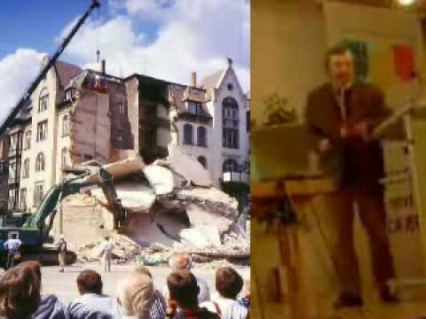

[🠔 Zur Startseite](index.md) 
# Das malträtierte Haus - Kontra falsche Wärmedämmung
**Energiesparen - aber wie! Der Schwindel mit Dämmstoffen, Energieausweis und Klimaschutz.**  
_von Prof. Dr.-Ing. habil. Claus Meier (Nürnberg)_  
_erschienen in: "Deutsche Wohnungswirtschaft" (DWW), November 2006 S. 363, doch ewig aktuell!_  

> [!abstract]+ Kapitelübersicht: Das malträtierte Haus  
> * **[🏠 Startseite](index.md)** • **[🧱 Altbau Restaurieren](20bausto.md)** • **[📐 Planen im Altbau](11planme.md)** • **🏚️ Das malträtierte Haus** • **[🌍 Klima](7thuene1.md)**
>
> ---
> 1. **Das malträtierte Haus - Kontra falsche Wärmedämmung**
> 2. [Contra EnEV 2000](7waefe.md)
> 3. [Wärme- und Feuchteschutz beim Altbau - Theorie und Wirklichkeit 1](7waefe02.md)
> 4. [Dämmschichtdicke, Vollziegelwand, Natursteinfassade, Bruchsteinfassade - Prof. Meiers kontroverse Beiträge zum Energiesparen 10](7waefe10.md)
> 5. [Wohnungsbestand und Wärmeschutz 1](7waefe12.md)
> 6. [Rechtliche Randbedingungen des Gebäudewärmeschutzes 1](7waefe19.md)
> 7. [Niedrigenergie- und Passivhaus im Kreuzfeuer 1](7waefe22.md)
> 8. [Widersprüche im Wärmeschutz - Die allgegenwärtige k/U-Wert Euphorie 1](7waefe33.md)
> 9. [DIN-Normen im Spiegel der Rechtsprechung und öffentlichen Kritik](2mbu.md)

Weitere Info zum [Schwindel mit dem Energieausweis](7wdvs02.md) 
(inkl. Fristenregelung und Ausnahmen) 

## Einleitung 

Nach der EU-Energieeffizienzrichtlinie 2002/91/EG soll nun auch für den Gebäudebestand ein [Energieausweis](7wdvs02.md) zur Pflicht gemacht werden. Dabei wird nach der Gesamtenergieeffizienz der Gebäude gefragt, wobei die EU-Richtlinie unterschiedliche Energieausweise zuläßt. In der Begründung zur Richtlinie heißt es: "Nach dem vorliegenden Entwurf sollen Energieausweise auf der Grundlage sowohl des errechneten Energiebedarfs als auch des gemessenen Energieverbrauchs in allen Fällen zulässig sein". Selbst die Energieeinsparverordnung sieht im § 13, Absatz (5) die Möglichkeit eines “Energieverbrauchskennwertes vor. Sehr entscheidend ist dabei der Unterschied beider Ausweise: Der Bedarf wird vorher berechnet (Energiebedarfsausweis), der Verbrauch wird nachher gemessen (Energieverbrauchsausweis). Die Frage lautet nun: "Worauf kann man sich verlassen?" 

Von der "dena" (Deutsche Energie-Agentur) wurde im Auftrag der Bundesregierung ein [bedarfsbasierter Energiepass](7wdvs02.md) entwickelt. Hier also wird das vorherige Rechnen favorisiert. Diese administrative Einseitigkeit stößt auf erhebliche Bedenken, zumal noch nirgends nachgewiesen werden konnte, dass die im Planungs-Vorfeld vorgeschlagenen Energieeinsparmaßnahmen, basierend eben auf Bedarfsberechnungen, tatsächlich zutreffen und darüber hinaus auch noch “energieeffizient“ seien – dies wird immer nur behauptet, erzählt und kolportiert. Konkrete Beispiele nämlich bezeugen unwiderlegbar das Gegenteil. Deshalb schlagen Kritiker wie der Autor Prof. Meier Alarm: 

## Heizkostenvergleiche

Ob nun für die Einhaltung der EU-Richtlinie Bedarfsrechungen oder Verbrauchsmessungen zu wählen sind, das kann allein schon aufgrund bereits vorliegender Veröffentlichungen entschieden werden. Nur drei dieser Belege werden genannt: 

Im Rahmen eines Auftrages der Stadt Wedel im Jahre 1988 wurden neben den errechneten Energiebedarfswerten auch die Energieverbrauchsdaten der Stadtwerke statistisch ausgewertet. Dabei wurden Trends für die in Massivbauweise erstellten Gebäude vor 1945 sowie für Gebäude von 1977 bis 1988, die damit in die Periode der Wärmeschutzverordnungen fielen, in Form von Regressionsgeraden festgestellt. 

Konrad Fischer: Fassaden energetisch richtig und kostensparend sanieren 1  

  
[Teil 2](http://www.youtube.com/watch?v=Y1NSxAW15Cc) [Teil 3](http://www.youtube.com/watch?v=RAT7VzBo8k0) [Teil 4](http://www.youtube.com/watch?v=6TBII25iVQk) [Teil 5](http://www.youtube.com/watch?v=Kb0C4KiZvVA) 

Die Ergebnisse sind ernüchternd. Bei den vor 1945 errichteten Massivbauten wird ein höherer Bedarf berechnet als der tatsächlich anfallende Verbrauch. Bei den von 1977 bis 1988 errichteten Gebäuden, die somit einer Wärmeschutzverordnung und damit weitgehend einer rechnerisch motivierten “Dämmerei“ unterliegen, wird jedoch ein niedrigerer Bedarf berechnet, als der tatsächlich anfallende Verbrauch. Es wird bei den mit Dämmstoff versehenden Bauten in Realität also mehr verbraucht, als die Rechnung vorgibt. Da einmal mehr (Massivbau) und einmal weniger (mit Dämmschichten versehen) “berechnet“ wurde, liegt hier beim Rechnen ein methodischer Fehler vor. 

Ein [sehr interessantes Ergebnis zur Energieverbrauchsanalyse steuert auch Prof. Fehrenberg aus Hildesheim bei](7fehrtab.md). Es wurden die Heizkosten dreier gleichartiger und großer Wohngebäude ab dem Jahre 1976 miteinander verglichen, die Heizkosten verliefen fast völlig synchron. Dann wurde im Jahre 1988 ein Haus mit einem WDV-System versehen (4 cm Polystyrol + 1 cm Verblender). Was war der energetische Erfolg? Die Heizkosten verliefen weiterhin synchron, damit aber war die energetische Aufrüstung mit Dämmstoff zwecklos. Die ausgesperrte Solarenergie machte alles zunichte. Vor allem aber wurden durch diese “energetische Sanierung“ die Feuchteverhältnisse der Außenhülle verschlechtert. Die Dämmstoffe sammeln infolge dampfdichterer Außenputze Tauwasser an und durchfeuchten die Konstruktion – Feuchthäuser sind die Folge. 

### Welche Aussagekraft hat nun ein Energiebedarfswert? 

Ein bundesweiter zeitnaher Feldversuch, bei dem die EU-Richtlinie zur Berechnung der Energiebilanz getestet wurde, erbrachte beim Nürnberger Rathaus für die Bedarfsanalyse, aufgestellt von einem renommierten Bauphysiker, ein überraschendes Ergebnis. "Nach der neuen EU-Richtlinie liegt der Heizenergiebedarf mit 252 Kilowattstunden pro Quadratmeter und Jahr rein rechnerisch doppelt so hoch wie der tatsächlich bisherige Verbrauchswert" wird gemeldet und weiter heißt es dann: "Das zeige die derzeitigen Schwächen der neuen Rechenmethodik". Zum Schluß wird zu diesem katastrophalen "Rechen-Ergebnis" als Entschuldigung beschwichtigend noch angemerkt: "Der Energiepass sei vielmehr eine Bewußtseinssache und soll die gesamte Öffentlichkeit zum Energiesparen animieren". Deutlicher kann das ganze Fiasko einer fehlerhaften Rechnerei nicht dokumentiert werden. 

Konsequenz: Allein diese drei Beispiele zeigen: Hände weg von einer rechnerisch ermittelten Energiebedarfszahl. Es handelt sich eben nicht nur, wie erläutert, um derzeitige "Schwächen", sondern ausnahmslos um einen methodischen Rechensalat, der einem Energiebedarfsausweis zugrunde liegt. Es wird schlichtweg falsch gerechnet. Nur allein die Verbrauchszahlen ergeben ein realistisches Bild. Deshalb darf bei einer freien Wahlmöglichkeit nur der Energieverbrauchsausweis eingeführt werden. Hier sind die Gründe: 

## Wärmeschutz 

Das derzeitige Bauen wird durch die praktizierende Bauphysik, die sich fast ausschließlich auf Rechnungen stützt, zu stark beeinflußt. Laut herkömmlicher bauphysikalischer Meinung ist das Haus, die dritte Haut des Menschen, meist nicht genug gegen Kälte gedämmt und auch nicht luftdicht genug. Deshalb propagieren "Experten" der Szene einen besseren Wärmeschutz und die Dichtheit der Gebäude, damit Wärme weniger entweichen könne. Ein klettenhaft verbundenes Netzwerk von Bauphysikern, Energieberatern und die "dena", empfiehlt deshalb, allein gestützt auf Berechnungen, unter anderem stets Wärmedämmungen und dichte Fenster - und die Regierung unterstützt dies mit entsprechenden Verordnungen. 

### Instationäre Betrachtungsweise

Schon seit jeher wird unser Klima von der Sonne und der Solarstrahlung bestimmt. Da der 24stündige Tag/Nacht-Rhythmus stets vorliegt, gibt es bei speicherfähigem Material, also bei Massivbauten und damit auch beim Gebäudebestand, Phasen der Solarenergieaufladung durch Speicherung am Tage und Phasen der Energieentladung bei Nacht. Dieses Wechselspiel von Energieflüssen wird als instationär bezeichnet und führt infolge der Nutzung kostenloser Solarenergie zur Entlastung der Heizanlage. Wärmeverluste werden damit deutlich reduziert. Die offizielle Bauphysik allerdings ignoriert den Einfluß der Solarenergie bei massiven Wänden und denkt somit stationär. 

### Stationäre Betrachtungsweise

In Fachbüchern wird hier vom Beharrungszustand gesprochen. Er besagt, dass sich bei konstanten Lufttemperaturen innen und außen die geradlinige Temperaturverteilung im Bauteil, ein Charakteristikum für den Beharrungszustand, eingependelt und stabilisiert hat. Bei massiven Bauteilen kann dies viele Tage oder sogar Wochen dauern. Da der 24stündige Tag/Nacht-Rhythmus zu ständig wechselnden Luft- und auch Oberflächentemperaturen führt, verhindert allein dies das Einpendeln in den Beharrungszustand. Die Temperaturverhältnisse im Bauteil sind somit nie in Ruhe, so dass ein Beharrungszustand in Realität nie eintreten kann. Das aber bedeutet: 

### Der U-Wert ist unbrauchbar

Alle Energiebedarfsberechnungen basieren auf dem Beharrungszustand; das kann in jedem Fachbuch und auch in der DIN nachgelesen werden. Das Maß dieser Rechnerei ist dabei ausschließlich der U-Wert. Somit ist dieser für die Berechnung von realen Wärmeverlusten nicht brauchbar. G. Hauser, ein glühender Vertreter des Beharrungszustandes, bestätigt dies sogar und beschreibt die Wirkungsweise des U-Wertes wie folgt: 

"Folgendes ist vorauszuschicken: der k-Wert (jetzt U-Wert) eines Bauteils beschreibt dessen Wärmeverlust unter stationären, d. h. zeitlich unveränderlichen Randbedingungen. Die Wärmespeicherfähigkeit und somit die Masse des Bauteils geht nicht in den k-Wert ein. Außerdem beschreibt der k-Wert nur die Wärmeverluste infolge einer Temperaturdifferenz zwischen der Raum- und der Außenluft. Die auch während der Heizperiode auf Außenbauteile auftreffende Sonneneinstrahlung bleibt unberücksichtigt". 

Präziser kann die einschränkende Gültigkeit des U-Wertes nicht beschrieben werden. Voraussetzungen für die Anwendbarkeit sind zeitlich unveränderliche Randbedingungen, keine Speicherfähigkeit, keine Sonne. All dies ist in Realität jedoch nicht gegeben, somit kann der U-Wert ad acta gelegt werden. Aber gerade Hauser forciert in beschämender Weise die Einführung eines Energiebedarfsausweises. 

Auch Gösele/Schüle schreiben in ihrem Bauphysik-Buch: "Beim Aufheizen und Auskühlen eines Raumes, bei Sonnenzustrahlung zu einem Bauteil, schnellen Änderungen der Lufttemperaturen zu beiden Seiten von Bauteilen treten Temperaturänderungen und Änderungen von Wärmeströmen auf, die durch die Werte 1/( (oder R in m²K/W) und k (jetzt U in W/m²K) nicht erfaßt werden können. In diesen Fällen spielt das Wärmespeichervermögen der Stoffe und Bauteile im Zusammenhang mit der Zeit die entscheidende Rolle". 

Wärmespeichervermögen und "die Zeit" sind also maßgebend. Welche Zeit aber ist anzusetzen? Hier kann auf K. Gertis zurückgegriffen werden, der als glühender Vertreter der U-Wert-Ideologie zum Lichtenfelser Experiment feststellt: "Es handelt sich nämlich um einen Aufheizvorgang, an dessen Ende erst der stationäre Temperaturzustand erreicht worden wäre". In einer Grafik wird "das Ende" dann der Zeit zugeordnet und es heißt dann weiter: "Der stationäre Endzustand wird durch die Wärmeleitfähigkeit geprägt. Den instationären Zustand davor würde demgegenüber jedoch durch die Temperaturleitfähigkeit a bestimmt und diese enthalte zusätzlich das Raumgewicht und die spezifische Wärmekapazität c". 

Na bitte, hier also wird endlich klipp und klar bestätigt, dass der stationäre Temperaturzustand, eben der Beharrungszustand, nie eintreten kann (Zeit (). Da der U-Wert nur für den Beharrungszustand gilt (er enthält ja lediglich die Wärmeleitfähigkeit), kann er als realistische Rechengröße nun wirklich vergessen werden. 
Diese Aussagen sind eindeutig. Argumentative Versuche, den U-Wert auch für instationäre Verhältnisse, also für speicherfähige Stoffe und Bauteile, gelten zu lassen (dies wird immer wieder versucht), bedeuten insofern stets Täuschung und Betrug auf der ganzen Linie. Alles "Rechnen" mit dem U-Wert ist somit fehlerhaft – nachweisbar und nachvollziehbar. Insofern gehören mit dem U-Wert erfolgte Energiebedarfsberechnungen in den Papierkorb. 

Die überproportional hohen Energieverluste gegenüber den "Bedarfsberechnungen" mittels U-Wert werden nun in ablenkender Weise auch noch den "Wärmebrücken" angelastet. Dies ist wiederum der Versuch, die grundsätzliche Fehlerhaftigkeit der Rechnung durch herbeigezauberte Fremdeinflüsse zu erklären. Insofern werden fälschlicherweise die Wärmebrückeneffekte völlig überbewertet; eine "Wärmebrückenhysterie" ist ausgebrochen. 

### Viel Dämmstoff ist unnütz

Wird der Beharrungszustand nun trotzdem zur Grundlage energetischer Überlegungen gemacht und die nicht vorliegende Gültigkeit des U-Wertes lediglich nur angenommen, z. B. bei den weitgehend speicherlosen Leichtbauten, so ist folgendes festzustellen: 

Die U-Wert-Funktion ist eine Hyperbel. Das Typische der Hyperbel ist: 

4 bis 6 cm Dämmstoff erbringen eine große U-Wert-Verbesserung, dagegen bedeutet eine Dämmung ab 8 bis 10 cm eine nur noch sehr geringe zusätzliche U-Wert-Verbesserung. Der Effizienzabfall ist gewaltig: In Zahlen ausgedrückt bedeutet dies: 

Dämmstoffdicke U-Wert Verbesserung um 
5 cm 0,8 W/m²K 
10 cm 0,4 W/m²K 50% 
20 cm 0,2 W/m²K 50% 
40 cm 0,1 W/m²K 50% 

Die Verdoppelung der Dämmstoffmenge (also der Aufwand) führt lediglich zur Halbierung des U-Wertes (der angenommene Nutzen); das ist das Dilemma der Hyperbel (Hyperbeltragik). Bei kleinen U-Werten kann deshalb keineswegs von "Effizienz" gesprochen werden. In der Energieeinsparverordnung (EnEV) jedoch werden kleine U-Werte gefordert. Es grenzt deshalb an Betrug und Heuchelei, aufgrund einer "Energieeffizienz-Richtlinie" nun effizienzlose U-Werte und damit eine effizienzlose Massierung von Dämmstoff zu fordern. Aus diesem Grunde dient dies alles allein der Steigerung des Dämmstoffumsatzes; die Dämmstoffverkäufer können jubilieren, ihre Gewinnmaximierungsstrategie geht vollends auf. 

Die immer wieder ständig prognostizierten und geforderten zusätzlichen Energieeinsparungen sind, selbst bei stationärer Rechnung, nominell immer eine Fata Morgana. Deshalb wird auch ständig von "prozentualen" Verbesserungen gesprochen. Immerhin kann bei der obigen Abfolge jeweils eine 50%ige "Verbesserung" festgestellt werden (ist doch einfach toll), obgleich die nominellen Verbesserungen gegen Null gehen. Wenn ein Kunde 15, 20, 30 oder sogar 40 cm Dämmstoff für sinnvoll hält (Niedrigenergiehäuser), geht er den Dämmstoff-Lobbyisten auf den berühmten Leim, er wird vehement an der Nase herumgeführt. 

Infolge dieser unausrottbaren U-Wert-Ideologie wird beim "verordneten" Wärmeschutz deshalb auch nur die Dämmung berücksichtigt. Es wird ständig von der "Dämmverbesserung" gesprochen und eine U-Wert-Minimierung gefordert – diese "Werbesprüche" aber sind irreführend, unfair und falsch. Ein guter Wärmeschutz besteht aus Dämmung und Speicherung. 

Deshalb sind Energiebedarfsberechnungen mit dem U-Wert Scheinrechnungen und dienen nur der Vermarktung von Dämmstoff, der jedoch für eine zu erzielende Behaglichkeit von Gebäuden ungeeignet ist. 

### Lichtenfelser Experiment

Die Hilflosigkeit von Dämmstoff bei Temperaturveränderungen, die ja ständig auftreten, zeigt sehr eindrucksvoll das [Lichtenfelser Experiment](2139bau.md). Hierbei wurden Temperaturveränderungen verschiedener Baustoffe ermittelt, wobei die Einstrahlung einer 150 W Lampe nach 10 Minuten auf der Rückseite einer 4 cm Schicht zu sehr unterschiedlichen Temperaturen führte: 

Baustoff Anfangstemperatur rückseitige Temperatur 
Mineralwolle 21,4°C 59,8°C 
Polystyrol 21,4°C 35,4°C 
Holzfaserplatte 21,4°C 22,2°C 
Fichte 20,6°C 20,9°C 

Vollziegel 20,9°C 23,4°C 

Diese Ergebnisse lösten Überraschung und Erstaunen, aber auch Protest aus, denn immerhin wird der Fachwelt seit über 30 Jahren erzählt, die Dämmung (sprich U-Wert) sei der entscheidende Part im Wärmeschutz von Gebäuden. Der Tabelle jedoch ist zu entnehmen, dass bei den "Dämmstoffen" die Wärme im Bauteil sehr schnell hindurcheilt und auf der Rückseite zu hohen Oberflächentemperaturen von knapp 36 und 60°C führt. Dies aber ist eine Folge fehlenden Speichervermögens. Immerhin sagt Cords-Parchim in seinem Buch "Technische Bauhygiene": "Für alle Räume, die unter Sonneneinstrahlung leiden können, sollte ein gewisser Wärmeinhalt der Wände sichergestellt sein". Hohe Wärmeinhalte bieten aber nur schwere, massive Baustoffe. 

### Temperaturstabilität

Da infolge der ständigen Temperaturveränderungen im Tagesrhythmus Temperaturstabilität gefragt ist, kann auf die Speicherfähigkeit (und damit auf die Schwere des Baustoffes) nicht verzichtet werden. Dämmstoff ist hierfür unbrauchbar, da das notwendige Speichervermögen fehlt. 

Dies wird auch im Buch von Gösele/Schüle: "Schall, Wärme, Feuchte" bestätigt, es heißt dort: "Schwankungen der Außentemperatur bzw. der Sonnenzustrahlung sollen sich innerhalb der Bauten möglichst wenig auswirken. Wie stark sich solche Schwankungen innerhalb der Bauten bemerkbar machen, wird durch die Wärmeträgheit oder das Wärmebeharrungsvermögen der Bauten bzw. der Bauteile bestimmt". Ein Maß für die Temperaturstabilität ist das Temperatur-Amplituden-Verhältnis TAV. Massive Baustoffe haben ein günstiges TAV, Dämmstoffe dagegen ein äußerst schlechtes TAV. Bemerkenswert ist nun aber, dass von Gertis und Hauser das Temperatur-Amplituden-Verhältnis als Beurteilungskriterium für Außenkonstruktionen abgeschafft wurde. Es wird, weil für Dämmstoff negativ, einfach "für überflüssig gehalten" – auch dies ist ein Ergebnis "fortschrittlicher" Bauphysik, erarbeitet allerdings im Fahrwasser der beauftragenden Dämmstoff- und Fertighausindustrie. 

Da "Niedrigenergiehäuser" und "Passivhäuser" weitgehend aus "Dämmstoff" bestehen, sind diese nicht temperaturstabil – es entsteht ein Barackenklima, das durch eine aufwendige Lüftungstechnik nur unzureichend gemildert werden kann. Von einer mechanischen Lüftungsanlage aber muss aus hygienischen Gründen abgeraten werden. Temperaturstabile Bauten benötigen deshalb schwere, massive Konstruktionen, die Literatur und das "Lichtenfelser Experiment" zeigen dies sehr deutlich. 

Um wohnbehagliche Räume zu schaffen, darf auf eine schwere, massive, also speicherfähige Konstruktion nicht verzichtet werden. Dies bezieht sich auf Wände, aber auch auf Dächer; hier muss dann statt Dämmstoff Massivholz verwendet werden. 

### Thermografie

Stets wird auch versucht, die vorliegenden bautechnisch sehr fragwürdigen Dämm-Tendenzen durch bunte Bilder der [Thermografie](7wdvs06.md) zu untermauern. Bei diesem im Moment sehr beliebten Messverfahren zeigen Infrarotbilder die Temperaturen der Außenfronten eines Hauses. In den roten, gelben und weißen Bereichen sind die Temperaturen am höchsten und angeblich verliert das Haus hier am meisten Wärme. Stimmt das denn? 

Die Infrarot-Kamera misst lediglich Oberflächentemperaturen. Einer Temperatur kann jedoch nie Richtung und Größe eines vorliegenden Wärmestromes entnommen werden. Deshalb muss eine hohe Temperatur nicht von einem hohen Wärmedurchgang von innen nach außen herrühren. Dies ist der kapitale Trugschluss. Gerade bei massiven Altbauten ergeben sich die hohen Temperaturen aus der Absorption der von außen wirkenden Solarstrahlung. Insofern handelt es sich dann um einen Wärmefluss von außen nach innen und die kostenlos gewonnene Wärme wird gespeichert – und führt automatisch zu Energieeinsparungen. 

Eine hohe Oberflächentemperatur wird damit schlichtweg falsch gedeutet, diese physikalische Fehlinterpretaion der Solarstrahlung führt dann aber auch zu fehlerhaften Schlußfolgerungen. Unsinnige "Therapievorschläge" sind dann leider die Folge – es heißt dann lapidar: "Um den Wärmedurchfluß zu mindern, muß wegen "schlechter" Dämmung die Wand gedämmt werden". Die "schlechte Dämmung" jedoch wird dann ausschließlich mit dem "schlechten" U-Wert einer massiven Wand begründet. Die Speicherfähigkeit der Konstruktion wird dabei jedoch strikt negiert und ausgeklammert. Dies ist verantwortungslos, denn es führt zu den im Energiebedarfsausweis berechneten fehlerhaften Energiebedarfszahlen. Es ist schlichtweg absurd und kriminell, was hier abläuft. 
Den sehr eindrucksvollen, farbigen Thermografiebildern muss man mit Vorsicht begegnen; meist wird damit nur versucht, eine unsinnige "Dämmverbesserung" der Fassade zu begründen und durchzusetzen – es locken eben halt die großen Aufträge. 

## Feuchteschutz

[Algen- und Schimmelhäuser](7schim.md) gehören bereits zum Alltag. Was sind die Ursachen? 

Algenbildung bei Wärmedämmverbundsystemen tritt in letzter Zeit in zunehmendem Maße auf. Infolge ungenügender Wärmespeicherfähigkeit der äußeren dünnen Putzschale, die durch die Dämmschicht thermisch von der massiven Wand getrennt ist, unterkühlt nachts die Fassade durch Abstrahlung und es kommt zur Kondensation der kühlen Nachtluft – eine Durchfeuchtung ist die Folge. Weil dadurch ein Wärmedämmverbundsystem die Algenbildung begünstigt, verlangt nun die Industrie zur Vermeidung von Algen vom Handwerker, der äußeren Putzschale Fungizide beizumischen. Geschieht dies nicht, wird der Handwerker sogar zur Schadensbehebung verurteilt. Das Gifthaus wird damit zum Baustandard, zum "Stand der Technik", juristisch bekräftigt vom Landgericht Frankfurt durch das Urteil vom 1. Dez. 1999. Jeder Bauherr sollte sich überlegen, ob er tatsächlich eine Giftfassade an seinem Hause dulden will und dies gegenüber der Umwelt auch verantworten kann. 

Eine gute Konstruktion muß den Feuchtetransport von innen nach außen gewährleisten. Darunter fällt der Transport in Form von Wasserdampf (Wasserdampfdiffusion) und der Transport von Wasser in flüssiger Form (kapillarer Feuchtetransport). Ein Schichtenaufbau der Konstruktion sowie Folien zur Luftdichtheit, Dampfbremsen (Dampfsperren) und dichte Außenputze (z. B. kunststoffvergütet) be- und verhindern besonders diesen notwendigen und wichtigen kapillaren Feuchtetransport. 

Durchfeuchtete Dämmungen sind die Folge, die Entfeuchtung erfolgt verstärkt nach innen, dies aber begünstigt den Schimmelpilz. Wärmedämmverbundsysteme fördern diese negativen Tendenzen. Derartige Feucht-Konstruktionen sind deshalb bautechnisch schlecht und müssen vermieden werden. 
Bei Schimmelpilzbildung müssen drei Voraussetzungen gegeben sein: 

Eine Optimaltemperatur von 20° bis 30°C. Die ist immer gegeben. 

Eine ausreichende Feuchte. Dies ist der entscheidende Part im Kampf gegen den Schimmel. Es werden heutzutage einfach zu viel "Feuchtbuden" gebaut, die sogar durch DIN-Vorgaben empfohlen und damit unsinnigerweise sogar toleriert und sanktioniert werden. 

Ein guter Nährboden (Zucker, Eiweiß, Lignin) und ein saures Milieu mit pH-Werten zwischen 4,5 und 6,5 (neutral pH = 7). Stark alkalische Materialien wie Kalkputz, Kalkmilch und Kalkanstriche wären damit die probaten Mittel zur Vermeidung von Schimmelpilz. Rauhfasertapeten in Verbindung mit Dispersionsfarben begünstigen dagegen den Schimmel. 

Die dominierende Ursache für Schimmelpilz ist neben fragwürdigen und problembehafteten Dämmkonstruktionen die zu hohe relative Feuchte im Innenraum. Wenn es sich also um eine Konvektionsheizung handelt, dann muss dafür gesorgt werden, dass diese hohe Feuchte erst garnicht entstehen kann. Dies geschieht durch Heizen und Lüften. 

### Lüftungsgewohnheiten

Ursprünglich geschah dies meist durch die [Kippstellung des Fensters](23bausto.md). Diese Art des Lüftens muss jedoch verworfen werden, weil damit der aufsteigende warme Luftstrom beim Heizkörper direkt ins Freie geleitet wird. Energieverschwendung ist die Folge. 

Gegenwärtig wird die Stoßlüftung propagiert. In regelmäßigen Abständen (etwa morgens, mittags, abends) soll durch Querlüftung die Raumluft ausgetauscht werden. Aber auch dies ist bedenklich, weil bei geschlossenen, dichten Fenstern in der Zeit zwischen dem Lüften langsam die relative Feuchte ansteigt. Eine feuchte Luft jedoch enthält mehr Energie (Wärmeinhalt) als trockene. Wenn also sehr feuchte Luft ausgetauscht wird, dann wird damit auch sehr energiereiche Luft hinausgelüftet. Auch dies bedeutet Energieverschwendung. 

Es muss also eine Lüftungsart gefunden werden, die ein Ansteigen der relativen Feuchte verhindert. Das aber ist die permanente Lüftung. Hier gibt es zwei Möglichkeiten: Die stetig wirksame Lüftungsanlage (von der muss aus hygienischen Gründen jedoch strikt abgeraten werden) und das undichte Fenster. Nur die zweite Variante kann empfohlen werden. Immerhin werden ja bereits beim Neubau besondere Lüftungskanäle im Rahmen vorgesehen; zur Sanierung von schimmelpilzbelasteten Räumen wird ebenfalls vorgeschlagen, Lüftungsschlitze in den Rahmen einzufräsen. Die unsinnig geforderte Dichtheit der Fenster wird damit wieder aufgehoben – Schizophrenie des Denkens und des Konstruierens. 

Die Dämmfanatiker sind allerdings der Meinung, Ursache des Schimmels sei eine unzureichende Dämmung. Weit gefehlt, dies ist auch eine der großen Irrtümer der Bauphysikbranche. Bei zu hoher relativer Luftfeuchte kann selbst ein "guter U-Wert" den Schimmel nicht verhindern, dagegen besteht bei einer normalen relativen Feuchte von etwa 50% überhaupt keine Gefahr einer Schimmelpilzbildung. Bei einer Strahlungsheizung ist die Gefahr sowieso gebannt, weil eine Strahlungsheizung keine Luft, sondern nur die Raumumschließungsflächen erwärmt. Die Oberflächen sind deshalb wärmer als die Luft, demzufolge kann es zu keiner Kondensatbildung kommen. 

Verursacht werden diese bautechnischen Mißstände durch eine "medienwirksam inszenierte Energieeinsparungshystherie". Weil ständig von den hohen "Lüftungswärmeverlusten" geredet wird, glaubt der Bewohner, diese nun reduzieren zu müssen, indem er nicht oder kaum lüftet. Eine mangelhafte Lüftung wird allerdings auch unterstützt durch den Einbau der in der Energieeinsparverordnung geforderten dichten Fenster. Es wurde festgestellt, dass sich etwa zwei Jahre nach Einbau "neuer" Fenster meist Schimmelbildung einstellt. 

Die fehlerhafte Annahme, eine mangelhafte Dämmung sei schuld an der Schimmelpilzbildung, wird nun auch in den DIN-Normen übernommen. Es wird dort zur Vermeidung von Schimmelpilz ein Verfahren vorgeschrieben, das die eigentliche Ursache, nämlich die zu hohe relative Feuchte, überhaupt nicht enthält. Dies aber ist absurd und ist ein weiteres Beispiel für völlig verworrene DIN-Normen. Nicht die Ursachen von Schäden werden erkannt, sondern es wird nebulös an den Symptomen herumlaboriert – und das noch mit fehlerhaften und unsinnigen Empfehlungen. 

Stets werden von “Energieberatern“ und neuerdings auch von "zertifizierten Schimmelpilzsanierern" Wärmedämmverbundsysteme in Verbindung mit dem Einbau "neuer", also dichter Fenster vorgeschlagen. Es gibt bereits den "Bundesverband Schimmelpilzsanierung e. V.", der diese neuen "Dienstleister" sogar ausbildet – Absurdität des Bauens; selbst an den (vorgeschriebenen) Fehlern wird noch kräftig verdient. Die nächsten "Sanierungen" aber werden unausweichlich, die Auftragslage für die Zukunft ist damit gesichert – eine betrugsintensive Wachstumsbranche in unserer vielgelobten "Dienstleistungsgesellschaft". Ist dies vielleicht alles sogar Absicht? 

Es muß deshalb mit Nachdruck auf die schadenträchtigen Nachteile einer "energetischen Sanierung" mit Wärmedämmverbundsystemen und neuen Fenstern hingewiesen werden. 

## Wirtschaftlichkeit

Das im Energieeinsparungsgesetz (EnEG § 5) und der Energieeinsparungsverordnung (EnEV § 25) enthaltene Wirtschaftlichkeitsgebot wird durch das geforderte Anforderungsniveau permanent mißachtet. Selbst die mit dem U-Wert zu groß berechneten Energieeinsparungen (richtige Zahlen würden die wirtschaftliche Situation noch verschlimmern) sind viel zu gering, um eine Amortisation der Investitionskosten sicherzustellen - man investiert für eine unwirtschaftliche Maßnahme, halt für die Katz. Die nach der EnEV durchgeführten Energieeinsparungsmaßnahmen sind deshalb auch aus wirtschaftlicher Sicht abzulehnen. Geforderte Superdämmungen mit kleinen U-Werten sind allein schon wegen der Hyperbeltragik automatisch unwirtschaftlich - und damit sogar gesetzwidrig. "Dämmstoff-Maximierung" bedeutet deshalb Täuschung der Kunden; dies aber geschieht stetig und systematisch. 

### EnEV-Befreiung

Der in der EnEV enthaltene § 25 "Befreiungen" [früher 17] weist hier den Weg aus der wirtschaftlichen Sackgasse. Dieser lautet: 

"Die nach Landesrecht zuständigen Stellen können auf Antrag von den Anforderungen dieser Verordnung befreien, soweit die Anforderungen im Einzelfall wegen besonderer Umstände durch einen unangemessenen Aufwand oder in sonstiger Weise zu einer unbilligen Härte führen. Eine unbillige Härte liegt insbesondere vor, wenn die erforderlichen Aufwendungen innerhalb der üblichen Nutzungsdauer, bei Anforderungen an bestehende Gebäude innerhalb angemessener Frist durch die eintretenden Einsparungen nicht erwirtschaftet werden können". 

Dieser [Paragraph ermöglicht den Einstieg zum Ausstieg aus der Energieeinsparverordnung](7temp24.md), denn die in der EnEV geforderten Maßnahmen sind durchweg unwirtschaftlich. Der §17 "Befreiungen" wird deshalb zur generellen Anwendung empfohlen. 

### Bayerische Regelung

In Bayern gibt es darüber hinaus noch eine "Zuständigkeits- und Durchführungsverordnung EnEV" (ZVEnEV, ab 2017 AVEn mit neuen, nahezu gleichlautenden §§), die im § 9 die Zuständigkeit und Durchführung des § 25 (17 alt) EnEV (Befreiungen) regelt. Dieser § 9 in der ZVEnEV lautet: 

"Das Vorliegen der Voraussetzungen für eine Befreiung wegen besonderer Umstände, die durch unangemessenen Aufwand zu einer unbilligen Härte führen, muß von einem Sachverständigen im Sinn des § 2 Abs. 1 bescheinigt werden" 
. 
Es genügt also, dass das [Vorliegen der Voraussetzungen lediglich bescheinigt](7temp24.md) wird; ein Nachweis ist somit nicht erforderlich. 

Der entsprechende "§ 2 Sachverständige" der ZVEnEV lautet: 

"(1) Sachverständige im Sinn dieser Verordnung sind: 

Architekten und im Bauwesen tätige Ingenieure nach Art. 4 Abs. 2 Bayerisches Ingenieurkammergesetz Bau (BayIKaBauG) mit mindestens drei Jahren zusammenhängender Berufserfahrung in der Erstellung oder Prüfung von Nachweisen des baulichen und energiesparenden Wärmeschutzes (Bilanzverfahren) 

oder 

im Bauwesen tätige Ingenieure nach Art. 4 Abs. 2 (BayIKaBauG) mit mindestens drei Jahren zusammenhängender Berufserfahrung in der energetischen Planung oder Bewertung von Anlagen für Heizung, Warmwasser und Lüftung, die in einer von der Bayerischen Architektenkammer oder von der Bayerischen Ingenieurkammer geführten Liste eingetragen sind. 

(2) Sachverständige dürfen nicht tätig werden, wenn sie oder ihre Mitarbeiter bereits, insbesondere als Entwurfsverfasser, Nachweisersteller, Vorgutachter, Bauleiter oder Unternehmer, mit dem Gegenstand der Bescheinigung befaßt waren oder wenn ein sonstiger Befangenheitsgrund vorliegt." 

Die Eintragung in die Liste der Kammern muss beantragt werden. Diese [Prozedur zur Vermeidung von bautechnischem Unfug](7temp24.md) sollte auch von den anderen Bundesländern übernommen werden. Bauwilligen, die sich dem Dämm-Diktat der EnEV entziehen möchten, könnte so definitiv geholfen werden. 

## Fragwürdige Energieeinsparverordnung

Bei den immensen inhaltlichen und methodischen Fehlern in der "angewandten Bauphysik" kann dann natürlich auch die Energieeinsparverordnung (EnEV) nicht stimmen. Unwirtschaftlichkeit und bautechnische Fehlerhaftigkeit werden somit zum Standard neuzeitlichen Bauens. Widersprüchlicher und absurder kann die Bausituation nicht sein. 

### Verheerende Streuungen

In Kenntnis der vielen bautechnischen Mißstände muß dann auch die Aussagekraft der EnEV gesehen und bewertet werden – und die ist miserabel. Die Ungenauigkeit in den Energiebedarfsberechnungen wird sogar durch eine DIN-Norm bestätigt. Die DIN EN 832 "Berechnung des Heizenergiebedarfs" gilt für die EnEV als rechnerische Grundlage. Das vorgeschriebene Nachweisverfahren wird im Anhang L an einem Beispiel erläutert, das Ergebnis für die Heizperiode lautet: 

30 000 MJ - 13 000 MJ 
oder in kWh: 8333 kWh ± 3611 kWh 

Mit solchen Abweichungen von - 43,3% werden alle ernst zu nehmenden Berechnungen in den Ingenieurwissenschaften verhöhnt. Mögliche Ergebnisse liegen dann zwischen: 

4722 kWh und 11944 kWh 

bzw. zwischen 52,8 kWh/m²a und 133,5 kWh/m²a 

und das ist immerhin das 2,53 fache. Eine derartige Streuung entbehrt jeder soliden wissenschaftlichen Arbeit und bestätigt die Unzuverlässigkeit der verwendeten Rechenmethoden. Bei den Rechenverfahren handelt es sich um exzellente Scharlatanerie; Dilettantismus gepaart mit Unvermögen standen hier getreulich Pate. 

Die Ergebnisse einer "Energiebedarfsrechnung" sind deshalb als äußerst fehlerhaft einzustufen, sie sind eine Fata Morgana. Dies wird unausweichlich offenkundig, wenn später der Energieverbrauch vorliegt. 

### Absurde Rechnerei

Wer glaubt, mit der EnEV würden annehmbare Ergebnisse berechnet werden können, der irrt, denn diese immensen Streuungen sind hausgemacht. Immerhin steht auf dem Formular für die Energiebedarfsberechnung: "Die angegebenen Werte des Jahres-Primärenergiebedarfs und des Endenergiebedarfs sind vornehmlich für die überschlägig vergleichende Beurteilung von Gebäuden und Gebäudeentwürfen vorgesehen. Sie erlauben nur bedingt Rückschlüsse auf den tatsächlichen Energieverbrauch, weil die Berechnung dieser Werte auch normierte Randbedingungen etwa hinsichtlich des Klimas, der Heizdauer, der Innentemperaturen, des Luftwechsels, der solaren und internen Wärmegewinne und des Warmwasserbedarfs zugrunde liegen". 

Bei diesen vielen "normierten Randbedingungen" kann ja dann auch wirklich kein realistisches Ergebnis herauskommen; es wird ja doch hier alles "normiert"! Die Ergebnisse sind deshalb reine Zufallszahlen. Was also bleibt von der ganzen Rechnerei übrig? Nur Schrott. 

Die Kompliziertheit und Unübersichtlichkeit sind weitere Indizien für die Fehlerhaftigkeit der Rechenmethoden. Das rechnerische Chaos wird dramatisch gesteigert, weil für die Berechnung von Energiebedarfszahlen gemäß EnEV eine Unmenge von DIN-Vorschriften und Richtlinien mit herangezogen werden müssen. Die EnEV weist mindestens auf 13 Vorschriften hin, die allein für diesen schmalen bauphysikalischen Sektor weit über 750 Seiten umfassen. Diese Informationsschwemme wird damit automatisch zum umfangreichen Informationsmüll. In der Begründung zur EnEV heißt es allerdings sibyllinisch: "Die Energieeinsparverordnung soll nicht mit umfänglichen technischen Regelungen befrachtet werden". Statt dessen wird lapidar auf umfangreiche Normen verwiesen. 

Dieses Berechnungsdurcheinander mit Phantomergebnissen kann nur mit einer undurchsichtigen Software bewältigt werden, wie z. B. "Bautherm EnEV 1.0". Der Fraunhofer IRB Verlag macht damit Geschäfte. Man kauft ein Programm, versteht überhaupt nichts mehr von den Dingen, die da gerechnet werden und ist trotzdem plötzlich glanzvoller Experte. Sicher wird dies auch angestrebt, denn nichts braucht eine gewinnträchtige Industrie mehr als willfährige Helfershelfer, die das alles für richtig halten. 

Ein Prospekt von G+H ISOVER preist ihr Programm "Sophia – Schöpfung mit System" mit dem Slogan an: "Schneller durch den Dschungel der Bauphysik". Dies ist ein Eldorado für Scharlatane, die sich ein Vergnügen daraus machen, die Baufachwelt mit einem bauphysikalischen Dschungel zu beglücken und mit Fehlaussagen zu überschütten. 

Die Kritik an der EnEV ist berechtigt. Verantwortungsloser kann sich Ingenieursdenken nicht manifestieren. Berechnungen sind nicht ernst zu nehmen, die EnEV ist ein monströses Machwerk mit Phantomergebnissen. Es ist Bauherren nicht zuzumuten, dass sie sich dem bautechnischen Unfug verschreiben und dafür auch noch geschröpft werden. 

Wenn die Möglichkeit zur Befreiung von der EnEV nach § 25 (17 alt) genutzt wird, sollte bei zu erwartendem Widerspruch immer darauf bestanden werden, dass für die vorgebrachten Gegenargumente und offerierten Aussagen Garantie und Haftung übernommen werden. Es ist dann sehr schnell zu erkennen, dass man davor – aus verständlichen Gründen – zurückschreckt und dieses Ansinnen zurückweisen wird. Damit aber trennt sich dann beim Bauen sehr schnell die Spreu vom Weizen. Die Scharlatane entlarven sich selbst, wenn sie für ihre Aussagen Verantwortung übernehmen sollen und dafür garantieren und haften müssen. 

### Fehlerhafte DIN-Vorschriften

Die Vorstellungen vieler Fachleute über DIN müssen korrigiert werden. All die bauphysikalisch-technischen Widersprüche und Fehler beim Bauen sind nun auch in DIN-Vorschriften zu finden. Fehlerhaftes Bauen wird damit durch DIN legitimiert. Dies ist nicht verwunderlich, denn DIN ist ein privatrechtlicher Verein und ein Instrument der Wirtschaft. DIN sagt selbst: 

"Durch das Anwenden von Normen entzieht sich niemand der Verantwortung für eigenes Handeln. Jeder handelt insoweit auf eigene Gefahr. 
Die DIN-Normen haben kraft Entstehung, Trägerschaft, Inhalt und Anwendungsbereich den Charakter von Empfehlungen. 
DIN-Normen an sich haben keine rechtliche Verbindlichkeit. 
DIN-Normen dienen der Ausfüllung unbestimmter Rechtsbegriffe, z. B. des Begriffes Stand der Technik." 

Beim Anwenden von DIN-Normen sichert sich DIN juristisch ab, denn die Verantwortung liegt beim Anwender. Auf DIN-Normen ist somit kein Verlaß und "Empfehlungen" müssen doch auch nicht übernommen werden. Der Begriff "Stand der Technik", also eine DIN-Norm, ist auch nur ein unbestimmter Rechtsbegriff. Maßgebend für das Bauen und juristisch relevant sind deshalb nur die allgemein anerkannte Regeln der Technik. DIN-Normen (Stand der Technik) sind deshalb den allgemein anerkannten Regeln der Technik nicht gleichzusetzen.– dies muß klar unterschieden werden. Da auch der Begriff "anerkannte Regel der Technik" herumgeistert, stellt sich hier die Frage: "Von wem denn anerkannt"? Sind es ausgewählte Leute? Sind es Lobbyisten, ist es die Wirtschaft, ist es vielleicht sogar DIN selbst? All dies jedoch zählt nicht, denn nur die "allgemeine" Anerkennung ist maßgebend. Diese ist dann gegeben, wenn kein Meinungsstreit vorliegt. 

Wie und wodurch kommen DIN-Vorschriften zustande? Dazu äußert sich DIN ebenfalls: 

"Die Mitgliedschaft im DIN sichert einen Einfluß auf die normungspolitischen Entscheidungen des DIN. 
DIN ist auf Kostenbeiträge der Wirtschaft angewiesen, mit denen die Arbeit der Normenausschüsse gefördert wird. Die Förder- und Kostenbeiträge sind ein Gradmesser für die Notwendigkeit von Normungsvorhaben und ein praxisnahes Steuerungsinstrument für die Normungsprogramme. 
An der Normungsarbeit interessierte Firmen, Institutionen und Verbände können Förderbeiträge zentral abführen. 
Wer die Normungsarbeit weder durch einen Förderbeitrag noch durch einen Kostenbeitrag finanziell unterstützt, kann von der Mitarbeit ausgeschlossen werden." 

Wer also zum finanziellen Gedeihen des DIN beiträgt, kann mit entsprechenden Normungsleistungen rechnen, die den Geldeinsatz dann mehr als ausgleichen. 

Dazu sei gesagt: 

Im DIN gibt es einen "Ausschuß Normenpraxis" (ANP), der sich als Bindeglied zwischen dem Normungsinstitut auf der einen und den normungsinteressierten Kreisen der Wirtschaft auf der anderen Seite versteht und seine Stimme zu Gehör und Geltung bringt auch zu dem Thema: "Wirtschaftlichkeit der Normung – Aufwand und Nutzen für den eigenen Betrieb". 

Dies wird konkretisiert, indem es dort weiter heißt: 

"Die Teilnahme an den ANP-Sitzungen und die Mitgliedschaft im ANP bringen für ihre Firma eindeutige Vorteile. Wirtschaftlichkeitsberechnungen belegen, dass den zeitlichen und finanziellen Aufwendungen für ein Mitwirken im ANP das 6 bis 7 fache an Nutzeffekt gegenübersteht". 

Also bitte sehr, Normungsarbeit ist für die Wirtschaft äußerst lukrativ und "wirtschaftlich", leider aber nicht für den Kunden. Die Anwender, die Bauherren werden nur zur Kasse gebeten. Das Zustandekommen so mancher dubioser, fragwürdiger und fehlerhafter DIN-Norm wird damit verständlich. 
Bei entsprechenden finanziellen Beiträgen der Wirtschaft wird dann auch viel genormt. Die festzustellende Verordnungs- und Normenschwemme läßt darauf schließen, dass hier Gelder zur Genüge fließen. Da es sich bei den DIN-Normen um Vereinbarungen interessierter Kreise, keineswegs jedoch um wissenschaftliche Erkenntnisse handelt, häufen sich leider auch die genormten Fehler - die Folge ist dann produzierter Normungsschrott. Diesem Treiben stehen "Wissenschaft" und Administration allerdings äußerst hilfreich zur Seite. 

Dies zeigt die Fragwürdigkeit von DIN-Normen. Maßgebend für das Bauen sind deshalb ausschließlich die "anerkannten Regeln der Technik". Insofern ist es wiederum ein Fauxpas der Administration, wenn sie in der Energieeinsparverordnung (EnEV) im § 15 "Regeln der Technik" über die Hintertür versucht, den Anwendern von DIN-Normen glauben machen zu wollen, es handle sich hierbei um die "anerkannten Regeln der Technik". Da kaum der Unterschied zwischen "Regel" und "Stand" der Technik allgemein bekannt zu sein scheint, wird ein Unterschied zwischen "allgemein anerkannt" und "anerkannt" erst recht nicht gesehen. Wie gesagt: Maßgebend für richtiges Bauen sind allein nur die "allgemein anerkannten Regeln der Technik". 

DIN-Normen werden allerdings rechtsverbindlich, wenn sie vertraglich vereinbart werden (wie z. B. in den Vertragsbedingungen der Leistungsverzeichnisse). Dies birgt eine großes bautechnisches Risiko. DIN-Normen sollten deshalb kritisch unter die Lupe genommen werden, bevor sie Vertragsbestandteil werden. 
Was passiert, wenn nachweislich eine fehlerhafte und falsche Norm – und die gibt es wirklich zuhauf - unfreiwillig zum Vertragsbestandteil wird, wie dies mit jedem Leistungsverzeichnis geschieht? Juristisch gesehen handelt es sich hier dann um eine völlig verfahrene Situation. Baut man richtig, wird gegen den Vertrag verstoßen; beachtet man jedoch den Vertrag, dann wird falsch gebaut. Damit ergibt sich ein bautechnisches Chaos und ein Eldorado für juristische Streitereien. 
Konsequenz: Wer sich also in bautechnischen Fragen auf DIN stützt, kann böse Überraschungen erleben - es sei denn, zur Rechtfertigung von gemachten bautechnischen Fehlern beruft man sich vehement auf DIN, um dem Schadenersatz nach BGB eventuell entkommen zu können; hierfür finden sich DIN-gläubige"Gutachter" und "Sachverständige" zur Genüge. 

### Nur der Verbauch zählt

Dass nur der Verbrauch und nicht irgend eine zusammengewürfelte Zahl maßgebend ist, wird auch vom Bundesgerichtshof in Karlsruhe bestätigt. Im Az. ZR VII 212/05 wird klargestellt, dass Kosten für die zentrale Beheizung und die Warmwasserversorgung grundsätzlich verbrauchsabhängig abgerechnet werden müssen. 

Wird nun der Energieverbrauchsausweis, aus welchen Gründen auch immer, verhindert, bedeutet dies Fälschung, Täuschung und Betrug. All derjenigen, die glauben, dem Energiebedarfsausweis vertrauen zu können, werden genarrt. Verstärkt wird diese Fehlerhaftigkeit neuerdings noch durch das Zugeständnis, aus "Kostengründen", welch eine Heuchelei, eine vereinfachte Aufnahme der Gebäudedaten, die Verwendung von Erfahrungs- und Tabellenwerten sowie die Einbeziehung des Eigentümers zur Datenerfassung zuzulassen. 

Es wird eben alles getan, um das spätere Fiasko einer durch einen Energiebedarfsausweis bedingten blamablen Fehlprognose erklären zu können. Schuld daran sind dann immer "die anderen", wie z. B. die Nutzer, die ja nicht in der Lage seien, die genialen Vorstellungen und Empfehlungen einer "Energiespar-Elite" umzusetzen. Dabei handelt es sich hierbei doch wahrlich nur um ausgesprochene Stümperei! Das böse Erwachen kommt spätestens bei der Heizkostenabrechnung. Deshalb kann, weil nur Verbrauchsmessungen realistische Zahlen hergeben, wenn überhaupt, nur der Energieverbrauchsausweis eingeführt werden. 

## Schlußbemerkung

Die fehlerhaften bautechnischen Entwicklungen im Sinne der Industrie-Lobbyisten und Gewinnmaximierer können nur durch die Einführung des Energiebedarfsausweises forciert und durchgesetzt werden. Damit wird dann den vorgetragenen Wünschen der Bauindustrie entsprochen, die sich mit diesen fragwürdigen Aktionen volle Auftragsbücher verspricht. 

Dass bei dieser Sachlage die gesamte Dämmstoffbranche gegen den Energieverbrauchsausweis votiert, ist wohl einleuchtend, denn nur damit kann die "Gebäude-Verpackungsindustrie" ihre Expansionsvorstellungen realisieren – gegen den Willen der wissenden Bauwilligen. Mit der These der "Pluralität der Meinungen" nistet sich überall Lug und Trug ein. Die Baconsche Aufforderung zur Verwirklichung "nützlicher" Wissenschaft wird konsequent im lobbyistischen Sinne umgesetzt. 

Wenn Erkenntnisse der Vergangenheit vergessen und stattdessen dubiose Richtlinien und Vorschriften – national und europaweit - offeriert werden, dann führt dies zu einem produzierten bautechnischen Chaos. Das Märchen "Des Kaisers neue Kleider" wird zur traurigen Wirklichkeit. Es wird mehr falsch als richtig gemacht; die Bauten sind die Leidtragenden, die tagtägliche Praxis und die vielen Bauschadensseminare beweisen es. 

Immer werden vollendete Tatsachen geschaffen. Dabei wird die reale Welt des Seins ersetzt durch die virtuelle Welt des Scheins. Die Bauphysik baut eine pseudowissenschaftliche Märchenwelt auf, die gläubig akzeptiert werden soll. Eloquente Rhetorik vernebelt die Wirklichkeit. Das (manipulierte) Geschäft steht im Vordergrund. Die Tyrannei der Meinungsbildung nimmt immer schlimmere Formen an. Nicht Wissen, also Erkenntnisse, sondern wirtschaftsideologische Bekenntnisse sind gefragt. Es werden Glaubenssätze verbreitet. 

Aufgrund des bisher Gesagten wird, um sich realistischen Verhältnissen wieder zu nähern, ein durchaus umfangreiches Umdenken notwendig. Grundlagenarbeit ist gefragt, sie wird aber nicht geleistet – die "tonangebende" Industrie ist daran nicht interessiert. Sie erwartet vielmehr von der "Wissenschaft" im Rahmen der Drittmittelforschung die Bestätigung ihrer auf Gewinnmaximierung abgestimmten Aktivitäten. Es muss deshalb immer wieder betont werden: Anzustreben ist der Speicherung wegen der monolithische Massivbau ohne Folien und Dampfbremsen, damit keine Feuchteschäden entstehen. Für richtiges Bauen ist deshalb ein unveränderter Altbau hervorragend geeignet. Auch der Massivholzbau (z. B. Bohlen im Dach) in Verbindung mit einer Strahlungsheizung, die von Natur aus keinen Schimmelpilz aufkommen läßt, sind richtige Schritte zum richtigen Bauen. Der Gebäudebestand ist vom Grundsatz her einfach die richtige Bauweise. Schicht- und Leichtkonstruktionen dagegen sind zu vermeiden. 

Es muß ein gemeinsamer Nenner gefunden werden, der die Basis für sachbezogene bautechnische Empfehlungen abgeben kann. Naturgesetze, die Mathematik und die Logik sind deshalb unverzichtbare Werkzeuge, um hier zügig voranzukommen. Die Zeit ist reif. Wenn es gelingt, kursierende Aussagen zu widerlegen, so muß dieses Vorgehen im Interesse einer notwendigen Wahrheitsfindung akzeptiert werden. Alles andere führt am Thema vorbei. 

## Literatur zum Thema:

Berner, U.; Streif H.: "Klimafakten – Der Rückblick, ein Schlüssel für die Zukunft". Hrsg. von: Bundesanstalt für Geowissenschaften und Rohstoffe Hannover; Institut für Geowissenschaftliche Gemeinschaftsaufgaben Hannover; Niedersächsische Landesamt für Bodenforschung Hannover. E. Schweizerbart´sche Verlagsbuchhandlung Stuttgart, 2000. 
Cords-Parchim, W.: "Technische Bauhygiene". Teubner Verlag Leipzig, 1953. 
DIN – "Die Finanzierung des DIN" und "DIN - etwas über DIN". Herausgeber: Deutsches Institut für Normung e. V. 1998 sowie "Ausschuß Normenpraxis", Deutsches Institut für Normung e. V. 2005. 
Di Trocchio, F.: "Der große Schwindel, Betrug und Fälschung in der Wissenschaft". Campus Verlag Frankfurt/Main New York, 1995. 
Gertis, K.: "Dämmen wir uns krank? Werden Energieeinsparung und Schimmelpilz sachlich diskutiert?" in: VBN-Info Sonderheft "Topthema Wärme Energie" 2003, VBN Seminare GmbH Bremerhaven, S. 59. 
Gösele, K.; Schüle, W.: "Schall, Wärme, Feuchte". Bauverlag Wiesbaden Berlin 1985. 
Hauser, G.: "Der k-Wert im Kreuzfeuer - ist der Wärmedurchgangskoeffizient ein Maß für Transmissionswärmeverluste?" Bauphysik 1981, H. 1, S. 3. 
Markl, H.: "Wissenschaft: zur Rede gestellt - Über die Verantwortung der Forschung", R. Pieper Verlag, München 1989, Serie Pieper - Aktuell. 
Meier, C.: "Energieeinsparung im Bestand – Grenzen und Möglichkeiten". Wohnen 2001, H. 2, S. 52. 
Meier, C.: "Energieeinsparverordnung – ein Mißgriff. Methodische und inhaltliche Kritik". in: VBN-Info Sonderheft “Topthema Wärme Energie“ 2003, VBN Seminare GmbH Bremerhaven, S. 85. 
Meier, C.: "Richtig bauen – Bauphysik im Zwielicht – Probleme und Lösungen". Renningen: expert verlag; 5. völlig neu bearbeitete und erweiterte Auflage 2008 
Postman, N.: "Die zweite Aufklärung". 1999, Berlin Verlag 
Steinbuch, K.: "Maßlos informiert. Die Enteignung unseres Denkens". Goldmann Sachbuch 11248, 11/1979. 

## Der Autor

Prof. Dr.-Ing. habil. Claus Meier 
Jahrgang 1932, Architekt SRL, Studium TU Berlin. Tätigkeit im Industriebau. Assistent am Institut für Städtebau TU Berlin (Promotion, Habilitation), Lehrtätigkeit an der TU Berlin bis 1997. Leiter des Hochbauamtes Nürnberg, Wissenschaftlicher Direktor am Baureferat Nürnberg bis 1997. Mitglied des Beirates für Denkmalerhaltung (BFD) der Deutschen Burgenvereinigung (DBV). Mitglied des Arbeitskreises Gesundes Haus (AGH). 
Methodische Grundlagenarbeiten auf den Gebieten Wärmeschutz, Feuchteschutz, Schallschutz, Ökonomie und Ökologie. Autor von Fachbüchern und umfangreichen Fachveröffentlichungen. Bundesweite Aktivitäten zur bauphysikalischen Versachlichung des Bauens. 

---

Weiterführend: [Der organisierte Schwindel mit dem Energieausweis](7wdvs02.md) 

---

## Nachträge des Herausgebers: 

### 1. Vorsicht Rechtssprechung! 

Wie sich nun der Energiepaß zum Nachteil des Mieters auswirkt, zeigen zwei Fälle aus der jüngeren Rechtssprechung: 

Das Landgericht Hamburg hat im Urteil vom 11.9.2009, Az. 311 S 106/08, entschieden, daß eine Wärmedämmung als "wohnwerterhöhendes Merkmal" eine saftige Mieterhöhung begründet, obwohl die damit angeblich verbundene dolle Energieeinsparung nur "laut Bescheinigung des Wärmepassbüros" existiert, ohne tatsächlich bei der Heizkostenabrechnung des Vermieters nachvollziehbar zu sein. Im Klartext: Der Mieter zahlt weiter die Heizkosten, die anfallen - auch wenn diese nun durch Aussperren der Solarenergie und naß werdendem WDVS faktisch gegenüberd em ungedämmten Vorzustand steigen. Plus die frech erhöhte Miete. Leck mich fett, könnte es einem da rausrutschen. 

Und auch das Amtsgerichts Hamburg-Barmbeck verurteilt den Mieter einer Wohnungsgenossenschaft zur drastischen Mieterhöhung nach Wärmedämmung. Aus den Entscheidungsgründen (bitte vor dem Lesen anschnallen und mindestens fünnef Beruhigungstabletten reinhauen!): 

"_Der durch das das Sachverständigengutachten ermittelte jährliche Heizenergiebedarf von 39-42 kWh/m² entspricht dem im Energiepass angegebenen Wert C und damit dem Bestwert für einen modernisierten Altbau. 

Das Gericht sieht es als allgemeinkundig an, dass bis 2007 nur ein geringer Teil des Altbaubestandes energetisch saniert worden ist. 

... allgemein zugängliche Quelle ist ... der CO2-Gebäudereport 2007 des Fraunhofer-Instituts, der im Auftrag der Bundesministeriums für Wirtschaft erstellt wurde und im Internet frei verfügbar ist. [Danach] sind bei einer momentanen jährlichen Sanierungsquote von etwa 2,2% weniger als 30% des deutschen Gebäudebestands der Baujahre 1900 bis 1979 energetisch saniert worden. Dieser Wert lässt auf den konkreten Hamburger Sanierungsstand 2007 schließen ..."_ 

Und weil nun u.a. der doofe Verieter im Unterschied zu der vom Fraunhofer-Institut bestätigten Masse der klugen Hausbesitzer sein Geld mit energetischer Sanierung verjuckt hat, und irgend ein Energieberater / Wärmepassausteller / Sachverständiger [rein fiktive und in der Praxis allermeist nicht vorhandene Einsparungen](7fehrtab.md) gegenüber dem möglicherweise genau für solche gräßlichen Schwindeleien erfundenen "Energiebedarf" gem. "Energiebedarfsberechnung" behauptet, verliert der mit WDVS und Mietkostensteigerung schon zweimal beschissene Mieter zum dritten auch den Prozeß. Wegen nur angeblicher, aber gerichtlich bestätigter doller "Wohnwertverbesserung". Heilix Blechla! 

### 2. Das EEG 

Ein besonders heimtückischer Streich zur Maximierung der Einkünfte aus der Dämmstoffproduktion ist dann die Einführung des Erneuerbare Energien Wärme Gesetzes, kurz EEWärmeG, zum 1.1.09. Da die Erfüllung der damit eingeführten Quoten zur Zwangsbeteiligung angeblich erneuerbarer Energien an der Wärmeerzeugung in neuen Gebäuden (im gräßlich ökodurchseuchten Land Baden-Württemberg auch in Altbauten) sich kaum ein normaler Mensch leisten kann - wer außer Opfern der Ökoprofitpropaganda baut schon gerne zwei Heizsysteme in die Bude, wenn doch eines genügt? - haben sich die Gesetzeserlasser bzw. deren Hintermänner ein schönes Mausloch ausgedacht: Mehr Dämmen!: 

[Das BMU gibt bekannt](http://www.erneuerbare-energien.de/inhalt/40704) (Auszug): 
_"Gibt es Ersatzmaßnahmen? 
Nicht jeder Eigentümer kann erneuerbare Energie nutzen. Und nicht immer ist der Einsatz erneuerbarer Energien sinnvoll. Deshalb können anstelle erneuerbarer Energien andere Maßnahmen ergriffen werden, die ähnlich Klima schonend sind (Ersatzmaßnahmen): 
[...] die verbesserte Dämmung des Gebäudes, die deutlich über das gesetzlich vorgeschriebene Niveau hinausgeht: Wer so seinen Jahres-Primärenergiebedarf durch Dämmung reduziert, dass er 15 Prozent mehr tut als von der Energieeinsparverordnung (EnEV) gefordert wird, verbraucht erheblich weniger Energie und muss deshalb keine erneuerbaren Energien mehr zusätzlich nutzen. [...] 

Gibt es Ausnahmen zur Nutzungspflicht? 
Niemand soll finanziell überfordert werden. Ein Ausnahmetatbestand sieht die Befreiung von der Nutzungspflicht nicht nur dann vor, wenn die Nutzung erneuerbarer Energien technisch unmöglich ist oder gar andere öffentlich-rechtliche Pflichten entgegenstehen. Auch wenn es für den Gebäudeeigentümer finanziell unzumutbar ist, auf regenerative Energiequellen zurückzugreifen, kann er von seiner Pflicht befreit werden. Liegt eine solche besondere Härte vor, muss der Eigentümer des Gebäudes allerdings einen entsprechenden Antrag bei der zuständigen Behörde stellen. Die Zuständigkeit der Behörde richtet sich nach Landesrecht; zuständig ist in der Regel die untere Baubehörde. 

Eine Ausnahme gilt für bestimmte Gebäude, bei denen der Einsatz erneuerbarer Energien typischer Weise unmöglich ist oder keinen Sinn macht. Dazu zählen z.B. Zelte, Treibhäuser, Häuser mit einer Nutzfläche von weniger als 50 m², bestimmte Betriebsgebäude, Gotteshäuser oder unterirdische Bauten."_ 

Wir erinnern uns: Niemand hatte auch vor, eine Mauer zu bauen. 

Für das nun seit 1. Januar 2009 (in Baden-Württemberg schon seit 1. Januar 2008) geltende Erneuerbare-Energien-Wärmegesetz (EEWärmeG / EEWG), das für Neubauten (in Baden-Württemberg auch Altbauten) alternativ die Deckungsrate des Wärmeenergiebedarfs mit Solarenergie (mindestens 15 Prozent), Biogas (mindestens 30 Prozent), Flüssige Biomasse (mindestens 50 Prozent), Feste Biomasse (mindestens 50 Prozent), Geothermie/Umweltwärme (mindestens 50 Prozent), Abwärme oder Kraft-Wärme-Kopplungsanlagen KWK-Anlagen (mindestens 50 Prozent), Nah- oder Fernwärmenetz mit wesentlichem Anteil aus erneuerbaren Energien, Abwärme oder KWK-Anlagen (100 Prozent), alternativ die Unterschreitung der EnEV-Anforderungen (Jahres-Primärenergiebedarf und Wärmeschutz) um mindestens 15 Prozent gesetzlich vorschreibt, bietet im [§ 9 ebenfalls die Befreiungsmöglichkeit im fast immer gegebenen Härtefall](http://www.buzer.de/gesetz/8335/a156081.htm), sinngemäß wie oben beschrieben. Wortlaut des § 9 Abs. 2: "Von der Pflicht (zum Einsatz Erneuerbarer Energie) ist zu befreien, soweit ihre Erfüllung und die Durchführung von Ersatzmaßnahmen nach § 7 im Einzelfall wegen besonderer Umstände durch einen unangemessenen Aufwand oder in sonstiger Weise zu einer unbilligen Härte führen." Der Hinweis auf die Befreiung gehört als Beratungspflicht zu den unabdingbaren Nebenpflichten der für den Bauherren treuhänderisch tätig werdenden Architekten und Ingenieure, die Mitwirkung bei der Durchführung des Befreiungsverfahrens ist eine Besondere Leistung gem. HOAI. 

Unterbleibt der Hinweis, kann der Bauherr wirtschaftlich geschädigt werden, wofür dann dem Planer nicht nur Honorarverlust, sondern auch Schadensersatzpflicht droht, vgl. hierzu das "BGH Urteil vom 22.01.1998 - VII ZR 259/96 - Muß der Architekt die Wirtschaftlichkeit eines Gebäudes optimieren?" und "OLG Düsseldorf, Urteil vom 22.01.2008 - 23 U 88/07 - Nach welchen Anforderungen muß der Architekt, der als Sachwalter des Bauherrn regelmäßig die finanziellen und wirtschaftlichen Interessen und Kostenvorgaben/-vorstellungen des Bauherrn zu berücksichtigen hat, über eine fehlende Wirtschaftlichkeit der Baumaßnahme aufklären?". 

Die Bezifferung des Schadens für den Bauherren gelingt auch im Nachhinein sehr einfach durch eine finanzmathematische Wirtschaftlichkeitsberechnung bzw. Kosten-Nutzen-Analyse mit den Kostendaten zum Zeitpunkt der Planung. 

Das Deutsche Architektenblatt DABregional Niedersachsen 2/09 - Autor Tim Wameling - prognostiziert wohl mehr als zutreffend, daß "in vielen Fällen" die 15-prozentige EnEV-Unterschreitung "angewandt werden" wird und in Anbetracht der neuerlichen Verschärfung der EnEV 09 - "noch einmal eine 30-prozentige Anhebung des primärenergetischen und wärmeschutztechnischen Anforderungsniveaus in Neubau und Bestand" - "die 45-prozentige Anforderungsanhebung im Neubau gegenüber 2008 mit einer signifikanten Steigerung der Baukosten verbunden sein" wird (und geht auf die auch haftungsrechtlich begründete Pflicht der Architekten zur wirtschaftlichen Beratung der Bauherren und ggf. Betreuung im Befreiungsverfahren nicht weiter ein!!?). Ja, genau um diese nochmalige Baukostensteigerung geht es den Ökolobbyisten und ihren Sklaven in der ministeriellen Administration und den Gesetzgebungsorganen, deren dreckiges Wühlen hinter den Kulissen zu diesen grundsätzlich jeder Wirtschaftlichkeit Hohn sprechenden Klimaschutz-Erlassen im Jahresturnus führt: Geld aus den Bauherrentaschen in ihre Fässer ohne Boden zu spülen. Und der deutsche Michel - seit jeher für seine Engels- nein Schafsgeduld bekannt - läßt sich das freilich weiter klagslos gefallen. Bäh, Mäh! Blöck! 

Weitere Ausführungen dazu erfolgen noch, bleiben Sie dran ...
