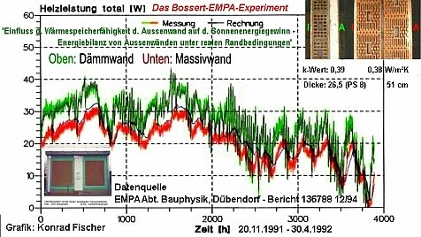

[🠔 Zur Übersicht: Energiesparen](7wsvoant.md)  
# Dämmstoff/Wärmedämmung/WDVS ja oder nein? Teil 2
**Praktische Heizkostenvergleiche zur Dämmung im Bauwerk und an der Fassade. Mit Studien von Prof. Jens Fehrenberg, Prof. Dr. Werner, Prof. Dr.-Ing. Karl Gertis (Fraunhofer-Institut).**  
_von Konrad Fischer_

## Wärmedämmung / Wärmedämmverbundsystem / WDVS ja oder nein?

Oder: 

## Wie dämmen Dämmstoffe? - Teil 2

## Zurück: [Wie dämmen Dämmstoffe? - Teil 1](7fehrtab.md)

Grüß Gott und herzlich willkommen! Schön, daß Sie hier gelandet sind. 

Hinweis 

Die hier ursprünglich publizierten Daten der Tollenbrink-Appartementhäuser mit und ohne Fassadendämmung von Prof. Fehrenberg bzw. einem WEG-Mitglied dort werden vor einer genaueren Abklärung der Datengrundlage und -interpretation nicht mehr verwendet. Nach neuen Erkenntnissen waren die daraus abgeleiteten Aussagen unpräzise, da keine echten Wärmeverbrauchsmessungen zugrundelagen, sondern nur die einem Umlageverfahren verteilten Heizkosten. 

Fehrenberg-Untersuchung Hannover

 Die hier zusammengefaßte Untersuchung dreier Großbauten in Hannover durch Prof. Jens Fehrenberg, Autor dieser Grafik, zeigt sich die energetische Unwirksamkeit von teurem Dämmstoffverbau im Hinblick auf den Heizwärmebedarf. Die dunkelblaue Kurve zeigt die von +1 (oben) bis +9 (unten) gespiegelt dargestellte Durchschnittstemperatur der Winterhalbjahre von 1988 bis 2001 (Quelle: Wetteramt Hannover). Die anderen Kurven zeigen den Erdgasverbrauch der Bauwerke. Mit vertikalen Strichen und der Beischrift "San." wird der Zeitpunkt zusätzlich aufgebrachter WDVS (türkis: 1995, magenta: 1996) dokumentiert. Dieser Vorgang bleibt vergleichsweise ohne Beeinflussung des Energieverbrauchs. Nur kältere oder wärmere Winter beeinflussen diesen - nicht mehr oder weniger WDVS, nicht mehr oder weniger Umsetzen der lobbyistenbedienenden WSVO/ENEV - Wärmeschutzverordnung/ab 2002 Energieeinsparverordnung! Alles mehrmals [publiziert](8buch.md#vbn-info).

Also: Lohnen sich Dämmstoffinvestitionen durch Verbau von Dämmstoffen wie z.B. organische, keramische, natürliche oder mineralische Wärmedämmung wie (Werbe-Details vergleiche Herstellerinfomationen) PUR, EPS und XPS, Multipor, Neopor, Styropor, Styrofoam und Styrodur, Rockwool und Isover, Foamglas, Dämmputz, Dämmanstrich, Dämmplatten, Wärmedämmschüttung, Gutex, Pavatex, Weichholzfaserplatten, Calciumsilikatplatten / Kalziumsilikatplatten, Gipskarton, alukaschierte Luftpolster, thermokeramische Anstriche mit ceramic bubbles, Thermolut, Kooltherm, Isofloc, Isocell (aus Zellulose-/Cellulose-/Altpapier-Flocken) und Thermofloc, Austrotherm, Linitherm, Lobatherm und Homatherm, Thermolehm und Thermohanf, Porenziegel, Poroton, Thermoton, Bisotherm, Porotherm, Liapor, Blähton, Blähziegel, Blähschiefer, Blähglas, Gasbeton, Porenbeton, Leichtbeton, Kalksandstein + WDVS, Seegras, Schilfrohr, Schilfmatte, Schafwolle, Kuhdung, Adobe, Moos, Porenschwammm, Bärenfell, Ritterrüstung, Eulengewöll, Daunenfeder, Baumwolle, Recyclat, Watte, Leinen, Sisal, Kork, Mäudreck, Hundekot, Mückenschiß usw.usf. wirklich? 

Die passende Lektüre für eine umfassende und kontroverse Aufklärung rund um den offiziellen Bauphysik-Beschiß ist übrigens auch: 

Prof. Dr.-Ing. habil. Claus Meier: **Richtig bauen. Bauphysik im Widerstreit + Mythos Bauphysik** ==> 

Braucht es nun tatsächlich Isolation, Isolierung und Wärmedämmung, Wärmedämmverbundsystem WDVS, Dämmtapete, Kellerdeckendämmung, Kellerdecken-Dämmplatte, Perimeterdämmung vielleicht sogar mit Drainagewirkung im Grundwasserbereich / wasserbeaufschlagten Bodenbereich, im Erdreich an erdberührten Bauteilen und vor den Kellermauern auch als Abdichtung gegen Feuchtigkeit / Feuchte /drückende und stauende Nässe / Bodenfeuchte: vor dem Fundament unter der Bodenplatte und auf dem Flachdach, Dämmschaum, Wärmeschutz und Vollwärmeschutz, Vollwärmedämmung, Innendämmung, Dämmstoff, Dachdämmung, Dachbodendämmung, Wanddämmung, Fassadendämmung und Dämmfassade, Dämmschicht, Einblasdämmung, Schüttdämmung, Kerndämmung, Mauerkerndämmung, nachträgliche Hohlschichtdämmung, Hohlschichtverfüllung, Dämmung der Hohlschicht, Schalendämmung, Mauerschalendämmung, Wandschalendämmung - oder genügt der vorsintflutliche Massivbau auch heute noch? Sie entscheiden - niemand sonst!!! 

### Auszug der Dämmforschung des Fraunhofer-Instituts für Bauphysik, Holzkirchen

Als Extra-Zuckerstückchen für den herzallerliebsten Dämmstoffaffen:

1. Die [_"Untersuchungen über den effektiven Wärmeschutz verschiedener Ziegelaußenwandkonstruktionen - Bericht über den 1. und 2. Untersuchungsabschnitt, B Ho 8/83-II"_](http://www.baufachinformation.de/artikel.jsp?v=214722) vom 5. Juli 1983 

Die zumindest auch den leichtestgläubigen Laien und den dämmstoffvernarrtesten und k/U-Wert-hörigsten "Experten" verblüffenden Meßergebnisse vom Institut für Bauphysik IBP der Fraunhofer-Gesellschaft, erhoben an einer 25-Tage-Meßperiode im Januar 1983 (!!), durchschnittliche Außentemperatur 2,5 °C, unter dem Projektleiter Dr.-Ing. H. Werner (Grafik Fischer nach vorliegenden Grafik-Daten des IBP):

[ Erläuterung der Grafik (Nur Massivwand mit "schlechtestem" k(heute U)-Wert 0,46 ist ungedämmt - und verbraucht am wenigsten!)](21312bau.md#fhg)

Der Mißerfolg der gedämmten Testbuden wurde dann im Bericht - gestützt auf eine abenteuerliche Berechnung - sogenannten "Wärmebrückeneffekten" zugeschrieben. Sinngemäß: Wenn gedämmt wird, verbraucht das Haus mehr Heizenergie als ungedämmte Häuser, weil sich dann Wärmebrücken an Bauteilanschlüssen und Öffnung dramatisch schlecht auswirken. Doch es kommt noch besser: Im folgenden 

_3. Untersuchungsbericht - Effektiver Wärmeschutz von Ziegelaußenwandkonstruktionen - Auswirkung der Strahlungsabsorption von Außenwandoberflächen und Nachtabsenkung der Raumlufttemperaturen auf den Transmissionswärmeverlust und den Heizenergieverbrauch EB-8/1985"_ , Holzkirchen 20. Dezember 1985 - wurde an Ziegelmauerwerk-Testgebäuden mit klassischem Polystyrol-WDVS (λ 0,04) - und ohne Dämmung mit hellem oder dunklem Fassadenanstrich, aber immer GLEICHEM U-Wert 0,46 festgestellt, daß die gedämmten Testgebäude - egal ob hell oder dunkel gestrichen - einmal tagsüber sehr viel heißere und nachts sehr viel kältere Oberflächen aufweisen und zum anderen auch mehr Heizenergie verbrauchen, als die ungedämmten. 

Besonders pikant: Die gedämmten Testgebäude wurden beim 3. Untersuchungsabschnitt im Unterschied zu den Untersuchungen 1 und 2 nun extra zusatzgedämmt, um alle bösen, überraschenden und gemeinen Wärmebrückeneffekte bestmöglichst zu beseitigen. Doch damit hat sich die drittmittelmäßige Fraunhoferei endgültig selbst ins Knie geschossen und die wohlfeile Ausrede aus den vorangegangenen Untersuchungsergebnissen zunichte gemacht. 

Vielleicht gerade deswegen wurde dieser die positive Dämmwirkung jeglicher Dämmschwarten total vernichtende 3. Bericht lange nicht veröffentlicht und blieb in der Schublade. Erst gegen Ende 2014 bequemte sich das Fraunhofer-Institut für Bauphysik, die Untersuchungsberichte auf der Webseite zum Download anzubieten - garniert mit allerlei Ausreden über deren Brisanz. Sie finden hier den Link auf die [Fraunhofer-IBP-Seite](http://www.ibp.fraunhofer.de/de/Presse_und_Medien/Presseinformationen/sn-21-09-2014-studien-effektiver-waermeschutz.html) und hier [meine Stellungnahme zu den Ausreden](../medien/KFVSIBP.PDF), die im Zusammenhang mit der ersten kritischen Auseinandersetzung in der Immobilienwirtschaft des Haufe Verlags erdacht und seitem nicht verbessert wurden. 

Die folgende Grafik zeigt all die Heizergebnisse des 1.-3. Untersuchungsabschnittes auf einen Blick in Prozentangaben, der Heizenergieverbrauch hinter der ungedämmten Massivwand ist jeweils auf 100 % gesetzt: 

Fassade mit Außendämmung (WDVS) verzehrt immer mehr Heizenergie als ohne! 

 

Und bestätigt wird diese dem Dämmwahnsinn hohnspottende wissenschaftliche Widerlegung der Dämmwirkung von WDVS-Fassaden durch eine eben dieses aussagende Praxisuntersuchung "Heizenergieverbrauch von Mehrfamilienhäusern im Vergleich", Bonn, Juli 1996. Das Hamburger GEWOS Institut für Stadt-, Regional- und Wohnforschung GmbH hat nach entsprechender Feldforschung rausgefunden, daß im Vergleich von knapp 50 Mehrfamilienhäusern mit und ohne Fassadendämmung immer dann mehr Heizenergie verbraucht wird, wenn ein WDVS die Fassade verklebt. Das nennt sich Solarblockade durch Wärmdämmverbundsysteme (WDVS). Hier das entscheidende Grafikzitat aus der Studie: 

 

Und so wird Deutschland heutzutage von den Dämmscharlatanen an allen Ecken und Kanten mit [gar ekelhaften und pfuschigen Dämmschwarten](213baust.md) zugemüllt, ohne daß sich irgendwo - außer auf dem Papier der heimtückischen "Energiebedarfsberechnungen" - irgendwelche Heizkostenersparnisse einstellen. Es sei denn, durch effektive Heizungsmodernisierung oder andere bauliche Maßnahmen. 

Und unsere BRD-Regierung und ihre perversen oder abgrundtief doofen Helfershelfer allerorten inklusive aller gleichgeschalteten Propagandamedien machen dem deutschen Volk weis, es müsse und könne künftig durch außergewöhnliche Dämmanstrengungen quasi ohne CO2-Emissionen (alleine diese Zielsetzung zeigt die Betrugsabsicht hinter all den diesbezüglichen "Bescheißereien" (Volksmund) deutlich an, ist doch CO2 alles andere, als ein Klimakillergiftgas!) und ohne Heizung auskommen. Mit der Konsequenz, mehr und mehr arme Mieter aus den frisch kaputtgedämmten Buden rauszuekeln. Die können nämlich die mit dem Dämmpfusch verbundenen Mieterhöhungen (Modernisierung!) nicht mehr blechen. Und die BRD-Ökofaschoregierung hilft dabei mit und nimmt den Mietern alle Rechte auf Widerspruch gegen diesen unfaßbaren Schwindel, bei dem viele "Partner" nach schlechtesten Kräften mithelfen: Mieterbund, Verbraucherschutz, Sozialdemokraten und der Rest der nur einer Partei - dem schnöden Mammon - verpflichteten Politgünstlinge. Geht's noch? Ich finde, nein! 

### Ironisch-Satirischer Dämmsarkasmus unter Nordlichtern und Norddunklern

Ein jüngerer Fall der Bürgerirreführung ist in Bremen zu bewundern. Dort gibt es eine Lobbyistengruppe namens "energiekonsens", die zusammen mit dem Senator für Umwelt, Bau und Verkehr der Freien Hansestadt Bremen im Rahmen von "Bremer modernisieren - Mehrwert für Ihren Altbau" die Broschüre ["Energieeffizient modernisieren - Fassaden erhalten. Teil 1: Altbauten bis Baujahr 1945"](http://www.energiekonsens.de/cms/upload/Downloads/Bremer_Altbaustudie_1_web.pdf) die "Ergebnisse" der Studie "Strategien und Potenziale energieeffizienter Sanierung für den Bremer Wohnungsbestand" verbrauchernah - bzw. verbrauchertäuschend??? - aufarbeiten. 

Wie funktioniert dieser Klimbim? Hosen runter!: Unter dem selbstgewählten Motto _"Modernisieren mit Köpfchen"_ wird dem Bremer Hausbesitzer nach besten Kräften der Kopf verdreht. Selbstverständlich sollen die _"Altbauten intelligent energetisch modernisiert"_ werden, damit sie _"nachhaltig Energie sparen"_ (Intro S. 3 für Interview mit Umweltsenator Dr. Joachim Lohse und Martin Grocholl, dem umtriebigen _"Geschäftsführer energiekonsens"_ - man beachte die sprachvergewaltigende Kleinschreibe - wer so firmiert, schreibt dann wohl auch die wahrheit und den verbraucherschutz modernitätshalber in kleinstlettern) - also maximal unwirtschaftlich kaputtsaniert werden, das ist ja die traurige Praxis allerorten. 

Auf Seite 4 ff. wird dann verraten, worauf es hinausgehen soll: _"Auch wenn die meisten dieser Altbauten [mit attraktiven Schmuckfassaden] nicht unter Denkmalschutz stehen, wollen viele Hauseigentümer die Fassade nicht durch eine Außendämmung verändern. Außenwände lassen sich jedoch auch von innen effektiv dämmen. Selbst sinnvolle Modernisierungsmaßnahmen ohne Straßenfassadendämmung bringen energieeffiziente Ergebnisse. Das belegt die aktuelle Studie**„Strategien und Potenziale energieeffizienter Sanierung für den Bremer Wohnungsbestand“.** ... Die Studie wurde vom Bremer Senator für Umwelt, Bau und Verkehr sowie der Klimaschutzagentur energiekonsens in Auftrag gegeben, um die technischen Möglichkeiten und Vorteile einer Modernisierung aufzuzeigen. ... Hauseigentümer finden für vier beispielhafte Gebäudetypen konkrete Berechnungen_ [KF: SIC!] _zu den Energieeinsparpotenzialen und den damit verbundenen Investitionen. Auf diese Weise steht Ihnen eine fundierte Planungsgrundlage für ihr eigenes Sanierungsvorhaben zur Verfügung."_ 

Aha. Neben dem irren Wechsel zwischen dem "Ihnen" großgeschrieben und "ihr" kleingeschrieben und dem verräterisch-massenweisen Gebrauch verunklärender Fremdworte und dichtem Begriffsnebel namens intelligent und effizient und effektiv und nachhaltig etc. - gemäß stilkritischer Textanalyse vorzugsweise im Nahkampfeinsatz, wenn dem Leser das Hirn vernebelt und letztlich ausgeschaltet werden soll, hat das ökopolitisierte System also dem steuerzahlenden Bürger und via Schulden auch der kommenden Generationen massenweise Geld abgezwackt und in die fürchterliche Studie gestopft. Was kam da raus? 

_"Die Studie „Strategien und Potenziale energieeffizienter Sanierung für den Bremer Wohnungsbestand“ gibt einfache und praktische Hilfestellungen ... Die Autoren haben vier exemplarische Haustypen herausgearbeitet und dafür jeweils konkrete Berechnungen angestellt, die für Hausbesitzer wertvolle Richtwerte sind."_ 

Das muß man sich auf der Zunge zergehen lassen: Auf der Basis der seit ewig als ungenügend nachgewiesenen U-Wert-Studienberechnungen wird dem gutgläubigen Leser sonstwas an hin- und herberechneten Sparereien vorgeflunkert, die in aller Regel mit den tatsächlichen Effekten der vorgeschlagenen Maßnahmen rein gar nix zu tun haben. So geht der ganze Trick. 

Weiter im Text (S. 6): _"Die Einsparpotenziale lassen sich fünf Bereichen zuordnen: Die Dämmung der Außenwände kann laut der Studie 32 Prozent Heizkosten einsparen. Auf die Heizung entfallen knapp 10 Prozent, auf das Dach 18, die Fenster 16 sowie den Keller 5 Prozent. Ein optimales Ergebnis wird jedoch nur durch eine umfassende Modernisierung erreicht. ... In der Regel werden Außenwände von außen gedämmt, da hierdurch die höchste Energieeinsparung erzielt wird."_ 

Nehmen wir mit dem gutgläubigen Leser mal an, optimal bedeutet optimal für den Hauseigentümer bzw. betroffenen Mieter. Dann schlägt das Geseiere aber erst recht dem Jauchefaß den Boden aus. Wieso? Da lassen wir doch mal die Realität mittels perfekt vom WDR entlarvtem Dämmschwindel aufdecken, genießen Sie also erst mal diese beiden Bauernfängerei-Enthüllungsschocker gegen die Profi-Verkohlung des dämmwütigen Verbrauchers - die ultimate Steigerung von "Nepper, Schlepper, Bauernfänger": 

  

O-Ton-Zitate aus "Könnes kämpft": 

Zur Aussagekraft der dena-Studien - dena-chef stefan kohler: _"Wenn (der Verbraucher) Studien oder Arbeiten oder Projekte von uns die Ergebnisse liest, dann kann er sich sehr darauf verlassen, weil wir sind als Deutsche Energieagentur neutral."_ 

Nachfrage Könnes, was denn dann die BASF-Mitbearbeitung an der Studie bedeute, gleich auf zweiter Seite der dena-Studie frech und bunt eingeprangt - _"Zufall oder freundliche Unterstützung"_? Kohler: _"Ne, also was sie bei uns auf jeden Fall verlassen können, daß wir eine fachlich neutrale Untersuchung ... durchführen. ... Uns hat noch nie jemand nachweisen können, daß die Fakten, die wir verwendet haben, und die Analysen, die wir durchgeführt haben, irgendwie geprägt waren von irgendeinem Interessensgruppe."_ 

Oha, läßt Freud da wild um sich grüßen? Soll ich die dena-PRÄGUNG durch die DÄMMSTOFFINDUSTRIE mal irgendwie nachzuweisen versuchen? Gleich jetzt? Warum hat man denn die Eingangsverbrauchswerte in den dena-Studien ausgerechnet vom Höchstverbrauch irgendwelcher Hütten abgeleitet und eingerechnet? Um möglichst realistische Einsparpotenziale vorzugeben? Oddä? Und dann die überzogenen Einsparwerte, die praktisch zigtausendfach widerlegt wurden, errechnet? Und keine echt nachweisbaren Einsparquoten angeben können? Zufall, alles Zufall??? Hat die BASF gegen dieses verkohlernde Getürke vielleicht sogar vergeblich Einspruch erhoben? 

Dr. Wolfgang Setzler, Geschäftsführer des WDVS-Verbands, der als Marketingprofi weiß und sinngemäß schreibt, daß _"nichts absatzfördernder wirkt"_ , als staatlicher Dämmzwang, zur vom WDR-Journalisten Könnes perfekt herausgearbeiteten Werbebehauptung des WDVS-Verbands, daß man schon nach acht Jahren die Dämmkosten wieder rausholen kann, weil energetische Sanierung mehr Spareffekt bringt, als die Fassade überhaupt verliert und der Verbraucher also denkt, daß er mehr Heizkosten durch Dämmeffekt spart, als theoretisch überhaupt möglich wäre: _"Und des wäre auch gut, wenn er so denken würde"._ Kriminalrat Könnes: _"Aber wir haben gerade ausgerechnet, daß des gar nicht so ist."_ Auf frischer Tat öffentlich ertappter Setzler: _"Nein, das ist 'ne Unterstellung._ [Unterbrechung auf Wunsch des Angeklagten, danach dann doch - gnadenlos und unbarmherzig in die Enge getrieben - das mehr als überraschende und von allen ehrlichen Baumenschen seit Jahrtausenden erhoffte Geständnis:] _Wir müssen auch aufhören mit Übertreibung von Einsparquoten."_ Bürgeranwalt: Wurde der Verbaucher also bewußt mit betrügerischen Falschaussagen _"geködert"_? Setzler immer entsetzter: _"Nein, so würde ich das nicht ausdrücken. Sondern wir haben am Anfang im Fokus der Begeisterung unserer Leistung den Einsparwert in einem zu großen Fokus gesehen. Und dadurch hat sich etwas falsch entwickelt, daß Wärmedämmung nur noch gesehen wird über den Amortisationsbereich und das ist falsch."_ Könnes: _"Der Verbandschef der Dämmstoffindustrie gibt zu, daß dem Verbraucher jahrelang überzogene Einsparversprechen gemacht wurden."_ Und hat entlarvenderweise noch nie probiert, seinen eigenen Geschäftssitzvermieter zur Dämmung der ungedämmten Massivbaubude zu veranlassen. 

Zur Auflockerung hier noch das bisher unveröffentlichte wissenschaftliches Ergebnis der denkwürdigen und vom Schweizer Dämmexperten Paul Bossert angestoßenen Felduntersuchung der bauphysikalischen Abteilung der Eidgenössischen Materialprüfanstalt EMPA in Dübendorf (Schweiz), das über eine gesamte Heizperiode 1991-1992 zeigt, wie die WDVS-Konstruktion annähernd gleichen Dämmwerts wie die mitgeprüfte Massivziegelwand immer deutlich mehr Heizenergie verzehrt, um die gleiche Innentemperatur zu halten: 

So ist das also mit den dämmbedingten Einsparwerten, und wollmer wetten, auch in Bremen? Und was wäre angesichts der Gesetzeslage eigentlich so falsch zumindest für den gesetzestreuen Bürger und Hausbesitzer daran, die Dämminvestition pflichtschuldigst und gesetzeskonform am wirtschaftlich zu definierenden Amortisationsergebnis zu bemessen und wenn nein vom ganzen EnEV-Blödsinn befreien zu lassen? Warum dann der energiekonsens weiter mit seinen Fakedaten um die Bremer Bürgerschaft mächtig und gewaltig herumschwurbelt, muß dann leider nicht das leuchtturmausfalldunkle Geheimnis von hein blöd, des umweltsenators und seiner ssspießgesellen bleben, watt? Ne, der plöde Hanseat muß hereingelegt werden und mit maximal Dämmflusen - durch Flunkereien betört - seine einst vielleicht sogar mal ehrbare Hütte verunzieren. Freunde des Nordens, auch Fischköppe fangen vom Kopf zu stinken an. Pfui Deibi, Fischers Fritze fängt nur frische Fische, host mi? (boarisch) 

Hier möchte ich meinen vielen ungläubigen Lesern noch einen interessanten Fall aus meiner Energieberatung für Aufgeweckte vorführen: 

### Das Ossi-Energiesparwunder

Ein unscheinbares [Wohnungsbauserie-(WBS-)70-Hochhaus](http://www.iemb.de/veroeffentlichungen/schriftenreihen/leitfaden/Wbs70/wbs70_02.htm) aus guter alter Ostzonenzeit, wie es fast überall herumsteht: 

 Der mickrige Wandaufbau mit systemtypischer "Dreischichtplatte" aus Betonfertigteilen: 

15 cm Tragschicht, 5 cm auch noch 2008 ausweislich 2er Kernbohrungen (Angabe Besitzer) trockener Polystyroldämmung, 6 cm Wetterschutzschicht. 

Insgesamt also lediglich 21 cm massive Bauteile. Das kommt schon in die Nähe des historischen Skelettbaus/Riegelbaus: Das Fachwerkhaus. 

Dazu perfekte Solarenergieabsorption durch die dunkle Wetterschutz-Waschbetonplatte, deren körnige Oberfläche nicht nur besonders absorptionsfähig ist, sondern auch den konvektionsbedingten Energieabtrag mindert. 

Die gleichsam profilierte Oberfläche bremst nämlich aus strömungstechnischen Gesichtspunkten die Geschwindigkeit des anblasenden Windes und damit den Energieabtrag ab. 

Obendrein verringert das optimale Grundflächen-Fassadenflächen-Verhältnis (A/V-Verhältnis) eines Hochhauses die Wärmabgabe je Qudratmeter. Daß ein optimal nach den Himmelsrichtungen ausgerichtetes, unverschattetes und ideal befenstertes Hochhaus besonders viel Solarenergie einfangen kann, kommt ja noch dazu. 

Und dann der Gipfel der kapitalismusfeindlichen Ossi-Energiespartechnik, eindeutig gegen den Klassenfeind gerichtet und die Energie-Oligopolisten mit der Schlauheit der deutschen Arbeiterklasse bekämpfend: 

 Mit schönen DDR-Plattenheizkörpern einfachster und heiztechnisch bester Bauart, damit vorwiegend mit Wärmestrahlung beheizt und in der Nachwendezeit mit Raumluft-Thermostat RLT ergänzt. Selbstverständlich mit kostengünstiger und energetisch vorteilhafter offener Heizrohrführung -ein flinkes Systemohne die bekannten Nachteile verputzter oder im Bodenestrich versteckter Heizrohrschlangen (Wandheizung, Fußbodenheizung), die neben teuerer Rohrlängenmaximierung, unsinniger Ausheizung von gar nicht raumwirksamer Baumasse (es hätte ja nur eine warme Wandoberfläche genügt!) thermisch träger und verzögerter Heizungsregelbarkeit auch mit hoher Havarieempfindlichkeit aufzuwarten weiß. 

Die Heizenergie der Bude kommt als zentralistische Fernwärme daher. Von wegen jeder Genosse sein eigenes verschroben-unsinniges Heizsystemchen mit Solaridiotie auf dem Dach und Erdwärmetauscher-Wärmepumpen in Buddellöchern bis nach Australien (Fluchtgefahr!) aus der Propagandaschwindelwerbung der Heizschlawinerindustrie - alles erwiesene Feinde der Arbeiter- und Kolchosen/LPG-Bauernklasse. 10 kWh-Preis z.B. 2007: 0,65 EUR. 

Fensteraustausch war schon 1999 (hat sich freilich nicht gerechnet, wieder mal auf die raffinierte Westpropaganda reingefallen, das passiert ...), die Kellersockelwände wurden 2003 mit wenig Aufwand ca. 1,20 Meter hoch nachträglich gedämmt, die Warmwasserbereitung wurde 2007 von der Heizung abgekoppelt und auf neu eingebaute Durchlauferhitzer umgestellt. 

Was kann man nun machen, um den Energieverbrauch noch weiter zu senken? 

Die industriegesteuerten Energieberater kennen da nur eins: 

Wärmedämmung bis zum Halskragen. Und zwar möglichst dicke Pakete synthetische Dämmfilze oder Isolierschäume diverser Provenienzen. Kosten 110 EUR je Quadratmeter plus, plus, alle Beiarbeiten inklusive. Da kommen schöne Beträge heraus für die ca. 4.000 qm Fassade (probieren Sie es doch einfach mal mit Kopfrechnen!). 

Und die aus bauphysikalischen Gründen feuchtesaufen Fassadendämmungen sehen dann einem langsamen Vergammeln entgegen, wie auf dieser Seite ja ausgiebigst vorgeführt und reich bebildert. 

Nach der bauphysikalisch nutzlosen und praktisch oft falschen Wärmebedarfsberechnung gem. DIN / EnEV braucht so ein dünn gebautes Büdli unwahrscheinlich viel Heizenergie und wird deswegen von dahergelaufenen Energieberatern und gewissenlosen EnEV-Fanatikern frech als Energieschleuder beschimpft. 

 
Der zweigeschoßige Flachbau, 2002 heiztechnisch an das Hochhaus angeschlossen.

Doch wie sieht denn die Realität in so einem unscheinbaren Massivplattenbau eigentlich aus, von der sich ein Bauherr bitteschön viel lieber verführen lassen sollte, als von den regierungsamtlich vorgeschriebenen Rechenutopien? 

 Hier der wahre Heizenergieverbrauch per Anno je Qudaratmeter, umgerechnet in Liter Heizöl (alle Angaben vom Hausbesitzer, Adresse auf Anfrage): 

1996: 11,16 Liter, 1997: Unterlagen nicht auffindbar, 1998: 8,91 Liter, 1999: 8,45 Liter, 2000: 7,35 Liter, 2001: 5,99 Liter, 2002: 6,36 Liter - ab diesem Jahr wird auch der angebaute Flachbau mit beheizt, 2003: 7,03 Liter, 2004: 6,64 Liter, 2005: 6,43 Liter, 2006: 6,19 Liter, ab 2007 ohne Warmwasserbereitung: 5,42 Liter. 

Das unterschreitet den Neubau-Niedrigenergiehaus-Standard. Und mindert die wirtschaftlich vertretbaren Energiesparinvestitionen ins Bodenlose. Wer da noch dämmt, ist selber schuld. Selbst der schon erfolgte Fensteraustausch für 60.000 EUR bekommt aufgrund der damit (vielleicht!) erreichbaren Energiekostenersparnis eine Amortisationszeit bis zum St. Nimmerleinstag. Alles, was zu tun bleibt, ist eine simple Optimierung des Heizungsbetriebs, um den immer noch gegebenen Konvektionsanteil und damit die Lüftungswärmeverluste noch etwas weiter abzusenken - doch das kost ja fast nix. 

Hier die Grafik des Jahresverbrauchs je Quadratmeter geheizter Fläche, deren zunächst steil abfallende Verbrauchskurve selbstverständlich auch den lokalen Verlauf der Winterdurchschnittstemperaturen repräsentiert: 

 Da muß es einen schon wundern, daß nach einer 2008er Frühjahrs-Umfrage der Deutschen Energieagentur dena unter 3.500 Ausstellern von Energieausweisen sich über 52 Prozent der profi(t)mäßig verblödeten Hausbesitzern für den utopischen "Bedarfsausweis" entschieden haben. Bei so viel Einfalt auf der Kundenseite nimmt es wiederum nicht Wunder, daß die befragten Energieberater zu 90 Prozent mit stärker gefüllten Auftragsbüchern rechnen, und über 50 Prozent meinen, daß durch ihren Ausweis der Modernisierungsmarkt belebt werde. 

Ja, da haben wir ihn wieder, den deutschen Energiesparer: 

Weltmeister in der Disziplin "Mit dem Schinken nach der Wurst werfen" bzw. "Saving the Penny, losing the Pound". 

Was denken sich eigentlich die Leute, die den armen Bauherrn so frech vorschwindeln, mit Dämmung ließe sich wirtschaftlich Heizenergie einsparen? Worauf stützen die sich - auf bisher unveröffentlichte Erfindungen? 

Und wie ist da die Fachpresse vom Deutschen Architektenblatt bis zu werbeabhängigen Bauglanzmagazinen zu bewerten, die doch vorwiegend den Dämmaposteln Gehör verschaffen? Ich sag dazu nix. Höchstens Ätsch.

Aus einer Untersuchung der "Stiftung Warentest" aus dem Jahr 2007 an einem Einfamilienhaus, Baujahr 1973, 150 Quadratmeter, 3.650 Liter Heizölverbrauch / Jahr ergibt sich vorbehaltlich aller Bedenken wg. überhöht angesetzter / berechneter Ersparnispotentiale dank U-Wert-Berechnung folgender Unterschied bei der Beurteilung der Wirtschaftlichkeit von sog. "Energiesparmaßnahmen (zitiert nach Susanne Dohrn: "Spechte, Milben, Schimmelpilze", in: "Berliner Republik" 06/2008): 

 Maßnahme Kosten EUR Berechnete Ersparnis / Jahr EUR Investitionslimit bei MNV 
(Mehrkosten-Nutzen-Verhältnis) 12 (12 x Jahresersparnis) EUR Überschuß / Fehlbetrag EUR 
Neue Heizung 5.930 669,60 8.035,20 2.105,20 
Fassade dämmen 15.020 788,60 9.463,20 -5.556,80 
Neue Fenster 10.500 133,90 1.606,80 -8.893,20 

Fazit: Zumindest die gravierende Unwirtschaftlichkeit der Fassadendämmung und des Fensteraustauschs stimmt vollkommen überein mit allen meinen bisherigen Wirtschaftlichkeitsberechnungen als EnEV-Sachverständiger im Zusammenhang mit der Prüfung von Energieberatungsgutachten und Antragsverfahren gem. § 25 EnEV (Befreiung wg. Unwirtschaftlichkeit der EnEV-Maßnahmen). Ein Hoch auf die Stiftung Warentest! 

Da können einen die Beschwörungen von sogenannten Energieexperten wie beispielsweise ein gewisser Stefan Lechtenböhmer vom für seine Energieeffizienzlereien einschlägig bekannten Wuppertal-Institut wahrlich nur noch wundern: 

_"Die Mehrkosten für eine gute Wärmedämmung bei einer Sanierung sind nicht das Problem, die sind ja bald über die eingesparten Heizkosten wieder drin. Aber die Sanierung selbst muüssen Sie sich erst einmal leisten können. Kein Wunder, dass viele Hausbesitzer sie lange aufschieben, auch wenn sie nach allen technischen und wirtschaftlichen Kriterien fällig wäre."_ 

Das klingt zumindest "wunderlich", wo doch Jeder an einem Finger ausrechnen kann, daß sich nachträgliche Wärmedämmung an Altbauten sogut wie niemals durch Heizkostenensparungen gegenfinanzieren. 1 + 1 muß man dafürallerdings schon zusammenrechnen können. Sonst fällt man auf den Wärmedämmschwindel halt wie so trotzdem überraschend viele Hauseigentümer rein. Aber der brave Deutsche bringt ja auch sein Altauto lieber wg. "Prämie" zum Abwracken, anstelle es für wesentlich mehr Geld gewinnbringend noch meistbietend zu verhökern oder gar umweltsparend und klimaschützend noch ein paar Jährchen mit geringem Wartungsaufwand weiterzufahren. 

Und wie verhält sich eigentlich die Gesamtwirtschaftlichkeit eines Fassadensystems, wenn man eine längere Zeitperiode betrachtet? Dirk Fanslau-Görlitz, Martin Pfeiffer, Janet Simon und Yasemin Wildebrand stellten sich diese drängende Frage auch und geben in ihrem "Atlas - Bauen im Bestand", Verlagsges. Müller, 2008, im Kapitel I.3: "Nachhaltige Modernisierung" auf Seite 59 eine Tabelle an, aus der die folgenden Kostendaten und Instandsetzungszyklen für verschiedene Fassadensysteme bei Betrachtung einer Periode von 80 Jahren aufgeführt werden. Dieses Buch kann als wahre Fundgrube bezeichnet werden, soweit man sich für Baukosten und Wirtschaftlichkeitsbetrachtungen gerade im Zusammenhang mit derzeit anstehenden Neubauten oder auch Sanierungen interessiert. 

Und wenn der schlaumeiernde Leser denkt, daß man ja die Instandhaltungszyklen fast nach Belieben dehnen kann, nur das: Dann steigen halt die jeweils anfallenden Instandhaltungskosten entsprechend. Vielleicht sogar exponentiell. 

Hier nun ein wohl mehr als aufschlußreicher Auszug aus der aufschlußreichen Tabelle, die auf einer entsprechende Untersuchung des Instituts für Bauforschung e.V. IFB in Hannover (Erklärte Ziele u.a.: Kostengünstiges Planen, Bauen und Betreiben) aus dem Jahre 2001 aufbaut: 

Tabelle I.45: 
**Instandsetzungsintervalle und Instandsetzungskosten ausgewählter Bauteile im Wohnungsbau** [Auszug] 
Bauteil, Art der Leistung Instand- 
setzungs- 
intervall Kosten Jahre Kosten nach 80 Jahren 
[inkl. Neben- 
kosten + Ust 
Inflation 2%] Kosten im 
Jahresdurch- 
schnitt 
Außenwände [Jahre] [EUR/m²] 5 10 15 20 25 30 35 40 45 50 55 60 65 70 75 80 [EUR/m²] [EUR/m²] 
Außenwand mit Verblendmauerwerk 284,73 3,56 
Verfugung ausbessern 20 7,67 . . . x . . . x . . . x . . . x 89,10 1,11 
Gerüstvorhaltung 20 7,67 . . . x . . . x . . . x . . . x 89,10 1,11 
Mauerwerk säubern 40 15,34 . . . . . . . x . . . . . . . x 106,53 1,33 
Außenwand mit Standardputz (mit Anstrich) 566,36 7,08 
Neuer Anstrich 15 25,56 . . x . . x . . x . . x . . x . 333,09 4,16 
Putzausbesserung 15 10,23 . . x . . x . . x . . x . . x . 133,32 1,67 
Gerüstvorhaltung 15 7,67 . . x . . x . . x . . x . . x . 99,95 1,25 
Außenwand aus Holzständerwerk mit Holzschalung 650,47 8,13 
Streichen 5 5,11 x x x x x x x x x x x x x x x x 205,92 2,57 
Gerüstvorhaltung 5 7,67 x x x x x x x x x x x x x x x x 309,63 3,87 
neue Holzschalung 50 51,13 . . . . . . . . . x . . . . . . 134,92 1,69 
Außenwand mit Wärmedämm-Verbundsystem 1.314,05 16,43 
Reinigung und Pflege 5 7,67 x x x x x x x x x x x x x x x x 309,63 3,87 
Gerüstvorhaltung 5 7,67 x x x x x x x x x x x x x x x x 309,63 3,87 
Putzausbesserung 10 7,67 . x . x . x . x . x . x . x . x 162,21 2,03 
Neues WDVS 40 76,69 . . . . . . . x . . . . . . . x 532,58 6,66 

Nun soll mir mal ein Planer oder Energieberater erklären, wie sich das grottige WDVS-Ergebnis in der oberen Tabelle mit dem Umweltschutz, dem Klimaschutz, der Energieeinsparung und vor allem der Wirtschaftlichkeit verträgt? Ist es angesichts dieser wissenschaftlich erhobenen Daten nicht geradezu ein abscheulicher Betrug, unkundigen und vertrauensseligen Bauherren weiszumachen, daß WDVS zu großen Vorteilen führe? Und selbst der dickste KfW-Zuschuß - von den mickrigen Zinsvorteilen gar nicht zu reden - kann die hier wohl Jedem auf den ersten Blick sichtbare Unwirtschaftlichkeit der WDVS-Bauweise jemals heilen. Geschweige denn die selbst gemäß DIN und EnEV "regelrechte" Ermittlung der Heizkostenersparnis als Grundlage der Anfangsinvestition in ein Wärmedämmverbundsystem. Und aufgepaßt: Ein Bauherr kann wohl mit Fug und Recht erwarten, daß sein studierter Planer und auch sein zertifizierter Energieberater die einschlägige Fachliteratur zum Thema beherrscht und seinen Bauherrn deswegen auf Basis gesicherter Erkenntnis vollumfänglich auch wirtschaftlich korrekt berät! Wenn nicht? Das ist dann eine Frage für die Gerichte ... 

[DSB e.V. - Ein Dämmstoffmärchen](http://web.archive.org/web/20100223183327/http://www.siedlerbund.de/bv/on7654) (Fehrenbergs Daten, nach Kostenunterschieden ausgewertet in "Familienheim und Garten", Deutscher Siedlerbund)

[Typische Bauschäden an WDVS: Rißbildung, Blasenbildung, Schimmel- und Algenwuchs, Absaufen - aus der Praxis](7wdvs13.md)

[Warum Dämmung gar nichts nützt](213baust.md)

Hier können Sie im Detail nachprüfen, wie Umweltminister Siegmar Gabriel (in Fachkreisen als "Ökoschmerzbengel" verschrieen) mit seiner durch nichts belegbaren, aber lobbyistenfreundlichen "Meinung" der Bevölkerung weismacht, daß durch Dämmung was zu sparen wäre:[ Hammerharte statistische Energieverbrauchsdaten!](http://www.richtigbauen.de/info/wd/wd55.htm)
