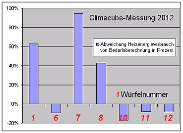

[🠔 Zur Übersicht: Energiesparen](7wsvoant.md)  
# Wärmedämmung / Wärmedämmverbundsystem / WDVS ja oder nein?
**Dämmt Dämmstoff wie versprochen und berechnet? Lohnt sich Dämmstoffeinsatz im Bauwerk und an der Fassade? Heizkostenvergleiche aus der Praxis und die Folgen unsachgemäßer Dämmung.**  
_von Konrad Fischer_

Oder: 

## Dämmt Dämmstoff wie versprochen und berechnet? Und wenn nein - Wieso nicht?

Grüß Gott und herzlich willkommen! Schön, daß Sie hier gelandet sind. 

Und was suchen Sie hier? Darf ich raten? Sicher wollen Sie als vorbildlicher Klimaschützer gaaaaaaanz viel Energie sparen. Weltrettung soll sich ja lohnen, wenigstens bei Ihnen. Nur wie? Kilometerdicke Dämmpakete aus Hochleistungs-Isoliermaterialien unter den Kellerboden die Erdgeschoßdecke, vor oder hinter die Wand? Gar auf den Dachspitzfußboden? Zwischen die Sparren geklemmt? Mit diesen Folgen? 

 
_Beschimmelte / Schimmelbefallene Kalziumsilikatplatte als Innendämmung ([Bild: Flickr-Album von Edi Bromm](http://www.flickr.com/photos/11672694@N08/sets/72157601498882984/)): 

   
Veralgte Wärmedämmverbundsysteme WDVS als Fassadendämmung / Außenisolierung 

 
Schwarzer Schimmelpilzbefall in der Dachdämmung aus Mineralwolle_

Oder doch lieber nur die superteuren edelgasargonkryptonisierten Wärmeschutzglas-Energiesparfenster? Vielleicht auch die Heizung erneuert? Oder, oder, oder? Auf den Wahnsinns-Schwindel der "Energieagenturen" hereinfallen? _"Erst müssen die alten Verglasungen oder ... gleich die kompletten Fenster getauscht und die Fassade des Hauses gedämmt werden"_ , zitiert die Neue Presse Coburg am 19.6.08 einen "Glas-Experten" und beschwört: _"Nur so kann der unnötige Wärmeverlust in der Heizperiode wirksam gestoppt werden - und erst dann kommt die Heizung an die Reihe. Die verbesserte Dämmung zahlt sich sofort aus: Bis zu 80 Prozent der Heizenergiekosten lassen sich nach Berechnungen der Energieagentur NRW damit einsparen. ... Eine neue Heizungsanlage sollte erst angeschafft werden, nachdem Fensteraustausch und Fassadendämmung erledigt wurden."_ Und auch im Januar 2013 werden solche Zusagen gegeben, diesmal von dem bayerischen Bundsbauminister Peter Ramsauer von der Amigopartei CSU. Er startet zur Baumesse BAU in München eine _"Kampagne zur Senkung der Heizkosten"_ und prahlt dazu: 

[_"Durch modernes Sanieren können teilweise bis zu 80 Prozent des Energiebedarfs eingespart werden"_](http://www.cio.de/news/wirtschaftsnachrichten/2904041/) 

Aha. Teilweise. Wo denn, bitte? Und wie sieht solch modernes Sanieren praktisch aus? Es hört sich nach Rückbau an. Kloanerös Gebäude - kloanerer Energiebedarf, logisch. Doch gmoant ist eppas andreas, und der Ramsauer is öhm a boarischer Pullerdicker, und dös san fei rafünierte Schpeizln. Und dessentweng sagt er "EnergieBedarf" und nicht "EnergieVerbrauch". Denn er woaß: Der Energiebedarf ist das Ergebnis einer getürkten Verrechnung namens WärmeBEDARFSberechnung, da kann freilich alles rauskemma, "teilweise" eben auch "80 Prozent". Wohingegen in Aecht niemals 80 Prozent Einsparung beim Energieverbrauch durch "moderne Sanierung" drin ist. Denn es gibt dafür bisher keinen einzigen Beweis. So schön kann boarische Energiepolitik für volldepperte Bazis heute sein! Und auf die Anfrage der Verbraucherschutzorganisation für Wohnungseigentümer und Mieter Hausgeld-Vergleich e.V. am 4. Oktober 2010 betr. einer _"Langzeitstudie über real erzielte Energieeinsparung nach Durchführung von Wärmedämm-Maßnahmen an Bestandsgebäuden"_ läßt Ramsauer irgendeinen hofschranzigen Ministerialrat namens Peter Rathert am 5.11.2010 antworten: _"Die realen Verbrauchswerte von Bestandsgebäuden lassen nicht im Einzelfall auf die energetische Qualität des Gebäudes schließen, da u.a. Einflüsse des Nutzers nicht "Normiert" werden können. Eine flächendeckende, systematische Erfassung der Energieeinsparung durch Wärmedämmung ist wirtschaftlich nicht begründbar. Dennoch lassen Untersuchungen darauf schließen, dass durch Verbesserungen der energetischen Gebäudequalität auch insgesamt im Gebäudebestand der Energieverbrauch signifikat sinkt (z.B. Techem-Studie)."_ 

Host mi? Es gibt also keinen Beweis, egal ob mit oder ohne Nutzer, daß der Dämmstoff auf der Wand was bringt. Und es wird auch nie einen geben, da dem die Wirtschaftlichkeit entgegensteht. Schön blöd wäre da das Bundesbauministerium, das näher und anhand der echten Verbrauchsdaten zu untersuchen. Und wenn dann rauskommt, daß die Sparberechnungen nach energetischer Sanierung oft mit über 100% Mehrverbrauch lächerlich gemacht werden - Beispiel vom 17. Januar 2017: ["Das Rätsel der Energieeffizienzlücke"](https://www.springerprofessional.de/energieeffizienz/buerobau/-das-raetsel-der-energieeffizienzluecke-ist-da-/12002306) - dann bleibt als vorgeschriebener Ausweg nur das _"energetisch unsachgemäße inklusiv verschwenderische Verhalten eines Gebäudenutzers ... (als) energiekritisches Nutzerverhalten"_ , dem wohl bald in brutalster Form entgegenzutreten ist. Nun wird in eingeweihten Kreisen durchaus zugegeben, wie es sich mit der Schuldzuweisung an den "Nutzer" tatsächlich verhält: _"Bisher gibt es jedoch – auch, aber nicht nur aufgrund mangelnder Gebäudeleittechnik – weder ein systematisches Verfahren um festzustellen, ob die Nutzer ein Gebäude energetisch übersteuern, noch ist das genaue Ausmaß solcher nutzerbedingter Effekte abschätzbar."_ (Prof. Dr. Friedrich Sick, HTW Berlin, in [FEEL Real Estate: Forschung EnergieEffizienzLücke](http://www.htw-berlin.de/forschung/online-forschungskatalog/projekte/projekt/?id=2179)" Im Klartext: Es gibt bisher nicht den geringsten Beweis, für die Schutzbehauptungen der Klimastußbranche, nutzerbedingte Prebound- und Rebound-Effekte machten die korrekt berechneten Spareffekte dank Energiesparinvestition zunichte. Wenn die Wissenschaft dank Steuergeldfinanzierung dann endlich weit genug gekommen ist, dem Nutzer dank regierungsgesteuerter Daten-, Steuer- und Maschinentechnik von oben unerbittlich den Hahn zuzudrehen, ist es aus mit lustig für den Globalparasiten Mensch. Daß die Rechnungen Fiktion sein könnten? Daß die Energiesparexperten irren könnten? Gar gekauft? Nein, niemals! Denn dann würde das ganze Lügenmachwerk namens "Energiewende" und "Energiesparen" durch Wärmedämmung und sonstigen Schmonz wie ein Kartenhaus in sich zusammenfallen. Dann wäre auch das ständige Teuerhalten des Bauens und Mietens dank Gesetzeslage - in Wahrheit von den etablierten Lobby-Parteien zum Schutz des Bestandes und der Investitionen der Immobilienbranche und keinesfalls im Interesse der Häuslebauer und Mieter ersonnen und gegen besseres Wissen ständig verschärft - gefährdet. Und genau daran wird hier gearbeitet. Weil seit ewigen Zeiten bekannt ist, daß Politik und Administration genau und im Detail bescheidwissen, daß der ganze Energiesparschmonz total für die Katz ist und nur von interessierten pseudowissenschaftlichen und geldgierigen Kreisen aufrechterhalten und immer weiterbetrieben wird. 

Auf diesen Seiten sollen Sie praktische und auf Fakten beruhende Anregungen bekommen, was Ihrer Hausbauerei nützt und was nicht. 

Die Entscheidung kann ich Ihnen nicht abnehmen, denken und handeln muß immer noch jeder selber, auch wenn es Ihnen die von der Klimaschutzlobby bestellte Umweltschutzpolitik unserer Ökodiktatur am liebsten mit der Peitsche oder besser gleich an Ihre Schläfe gedrücktem Colt (Learning from Las Vegas) beibringen will und Ihnen deswegen im EEWärmeG und mangels Gegenwehr bestimmt auch allen folgenden Klimaschutzgesetzen das Grundgesetz aushebelt ([§ 13: Unverletzlichkeit Wohnung](http://de.wikipedia.org/wiki/Unverletzlichkeit_der_Wohnung)) und irrwitzige Bußgelder (50.000 EUR!) kassiert, wenn Sie nicht nach derer Pfeife tanzen, unter der behördlichen Knute kuschen, auf ministerielle Klimaschutz- und Dämmstoffpropaganda (_"(Der Nutzen von WDVS) ist auch für Nicht-Experten schnell ersichtlich: Wer sein Haus mit WDVS saniert, kann viel Geld sparen. Eine Reduzierung der Wärmeverluste um 50 Prozent ist üblich, eine Absenkung um bis zu 90 Prozent im Einzelfall durchaus realistisch."_ [Zitat Quelle: richtigsanieren.de - Informationen für Bauherren](http://www.richtigsanieren.de/info/wd/wd29.htm)) hereinfallen und brav Energiesparmännchen machen, die Pfötchen heben und sich dann das Geld aus der Tasche ziehen lassen. 

Ist das lobbyistengesteuerte Energiespargesumse wirklich purer Beschiß? Bitte denken Sie mal mit Ihrem nach all der Dämmstoffpropaganda noch verbliebenen gesunden Menschenverstand darüber nach, wie eine Fassadendämmung im allerbesten Idealfall überhaupt wirken könnte, wenn sich die Verluste der Wärmeenergie wie folgt und nicht nach dem [System der Speisung der 5.000](http://www.bibel-online.net/buch/43.johannes/6.html) verteilen: 

"_Typische Wärmeverluste eines freistehenden Einfamilienhauses (Baujahr vor 1984): Heizung: 30-35 % 
Dach: 15-20 % 
Wand: 20-25 % 
Fenster: 20-25 % 
Lüftung: 10-20 % 
Boden [Kellerdecke]: 5-10 % 

"_ (Quelle: www.wordtmann.com/zahlen.html. 

Diese Prozentangaben werden auch von meinen eigenen Wärmebedarfsberechnungen verschiedenster Haustypen gestützt, bei denen die Wirkung der Energiesparmaßnahmen an verschiedenen Bau- und Anlagenteilen geprüft werden, um die damit verbundenen Kosten und Ersparnisse in einer Kosten-Nutzen-Analyse zu vergleichen. Dabei wird - aus Gründen der Vorlage bei Behörden im Befreiungsverfahren gem. Energieeinsparverordnung - selbstverständlich der offizielle Rechenweg bemüht, obwohl die tatsächlichen Verbräuche meist wesentlich unter dem errechneten Bedarf liegen. 

Erst 2012 hat eine Studie aus Cambridge schön herausgearbeitet, daß mit den Energieprognosen auf Basis des U-Werts so gut wie gar nix stimmt und eine riesige Kluft zwischen der berechneten und verbrauchten Energie besteht: In U-Wert-optimierten "modernen" Pfuschbuden wird folglich mehr verbraucht, als berechnet, und in den schönen alten und guten Massivbauten wesentlich weniger, als berechnet. 

Der Witz ist, daß die dabei ausgewerteten - massenweise (!) belegten und damit mit statistischer Signifikanz bestätigten und somit zu verallgemeinernden - Daten überwiegend aus Deutschland stammen, in unserem schönen Lande der Deppen und des zwischen Wirtschaft, Medien und Politik organsierten Krimiellen-Eldorados kaum bis gar keine Beachtung fanden und finden und finden werden. (Hier der Link auf die Cambridge-Studie: Minna Sunikka-Blank & Ray Galvin (2012): [Introducing the prebound effect: the gap between performance and actual energy consumption, Building Research & Information, 40:3, 260-273](http://dx.doi.org/10.1080/09613218.2012.690952), Kurzinfo: University of Cambridge, Research News, [The prebound effect](http://www.cam.ac.uk/research/news/the-prebound-effect/), 3. July 2012.) 

Und stimmt es, daß Studien beweisen, daß Wärmedämmung auf der Fassade die Heizkosten nicht senkt, sondern steigert? 

 
Jedenfalls sendet der WDR am 14.10.2010: [Energiewende absurd - Wärmedämmung kann Heizkosten steigern](http://www1.wdr.de/fernsehen/aks/themen/waermedaemmung104.html) 

Und auch die interessante Studie des Heizkostenabrechners Techem: Kähler, Ohl, Pawellek, Klein, [Einsparpotentiale der Wärmeversorgung](http://www.tab.de/artikel/tab_Einsparpotentiale_der_Waermeversorgung_1717235.html), tab 5/2013, zeigte anhand 300.000 untersuchter Mehrfamilienhäuser auf, daß die Massivbauten bis 1983 wesentlich weniger als U-Wert-berechnet verbrauchen, dafür die neueren Dämm-Leichtbauten wesentlich mehr, als berechnet. Was natürlich die Wirtschaftlichkeit mangels Erreichen der versprochenen Einsparpotentiale ins feuchte Dämmstoffgrab beerdigt. Schauen Sie sich die im gelinkten Artikel enthaltenen Grafiken _"Ideallinie und Ausgleichsgerade Wärmebedarf und -verbrauch für die Raumheizung"_ und _"Ideallinie und AusgleichsgeradeWärmebedarf und -verbrauch für die Raumheizung"_ an, um die maßgeblichen Ergebnisse selber zu besichtigen. Und wenn Sie sich noch etwas baukonstruktive Detaillierung durch das geplagte Köpfchen gehen ließen, stießen auch Sie nach einigem Grübeln auf eine ungeheuere Tatsache: 

Würden wir nämlich die Verbrauchsangaben der Heizenergie auf den beheizten Kubikmeter anstelle auf den Quadratmeter beziffern, stellt sich der ungeheuere Energiesparcharakter der alten Wohnbauten in Wahrheit heraus. Deren Räume waren nämlich weit über drei Meter, teils über vier Meter hoch. Und die Neubauten der Jetztzeit? Messen Sie bitte selber, um wieviele Kilometer Ihr miefiges Büdli die Dreimetermarke unterschreitet! Allet Chlor? Da staunste, wat? 

Schon im März 2005 rückte der Deutsche Siedlerbund mit den Ergebnissen seiner groß angelegten [Mitgliederbefragung betr. Heizenergieverbrauch](http://web.archive.org/web/20080226012232/http://www.fug-verlag.de/on1619) in den gedämmten und ungedämmten Eigenheimen heraus, wobei klar wurde, daß die Dämmbuden im Vergleich zur EnergieBEDARFSberechnung ungeheuer mehr - nämlich gleichviel! - verbrauchten, wie die ungedämmten. Davon will mann dort offensichtlich nix mehr wissen, hat die Information im eigenen Webportal gelöscht und verkündigt dort und in der Mitgliederzeitung nur noch das hohe Lied der Dämmstoffindustrie. Ob das die effekte der massiven Werbeanzeigen aus den einschlägig berüchtigten Kreisen sind? Trau, schau, wem? 

Schön arbeitet auch die empirica-Studie _["Energetische Sanierung von Ein- und Zweifamilienhäusern - Energetischer Zustand, Sanierungsfortschritte und politische Instrumente"](http://www.bausparkassen.de/fileadmin/user_upload/pdf_service/empirica_Energetische_Sanierung.pdf)_ , Verfasser: Prof. Dr. Harald Simons, Berlin, Oktober 2012, die beschämenden Energiesparfakten heraus: 

"Energetische Sanierungen sind im Regelfall unwirtschaftlich in dem Sinne, dass die eingesparten Energiekosten nicht die Kosten der energetischen Sanierung decken. ... Bei Energiekosten von 0,08 €/kWh belaufen sich die Energiekosten vor Sanierung auf 13,36 €/(m²a). Unterstellt, durch eine energetische Sanierung ließen sich tatsächlich 60 % der Energie einsparen – ein ambitioniertes Einsparziel, das in der Realität nur selten erreicht wird – so sinken die Energiekosten um 8,01 €/(m²a). Innerhalb von 15 Jahren summieren sich die eingesparten Energiekosten entsprechend auf 120 €/m² und damit bei Weitem nicht auf die Sanierungskosten, die bereits bei einfachen Fällen zwischen 300 und 500 €/m² liegen. Selbst die Einbindung der energetischen Sanierung in eine ohnehin notwendige Sanierung führt nur bedingt in die Wirtschaftlichkeit. ... Die theoretischen DIN-Normen zum Nutzerverhalten sind ähnlich unrealistisch wie die Normzyklen der Pkw-Hersteller, nur dass diesmal der tatsächliche Verbrauch von im Mittel kaum sanierter Häuser mit 167 kWh/(m²a) weit niedriger liegt als der theoretische Verbrauch. Der Energieausweis zeigt einen theoretischen Verbrauch von 400 kWh/(m²a) für ein unsaniertes Einfamilienhaus an. ... Die politisch erwünschte Verdoppelung der energetischen Sanierungsrate ist unrealistisch. Ein Sanierungsstau, den es aufzulösen gilt, existiert im deutschen Einfamilienhausbestand nicht. ... Soll die energetische Sanierungsrate trotzdem erhöht werden, sind hohe Subventionen notwendig, aber nicht einmal hinreichend. Da kein allgemeiner Sanierungsstau existiert – wie im Übrigen auch jede Besichtigung eines Einfamilienhausgebietes zeigt –, bedeutet eine energetische Sanierung immer eine vorgezogene Sanierung außerhalb des Sanierungszyklus. Sämtliche Wirtschaftlichkeitsberechnungen zeigen aber, dass dies grob unwirtschaftlich ist." 

Und das gilt geradezu selbstverständlich nicht nur für das selbst genutzte Eigenheim, sondern ebenso für den gesamten Mietwohungsbestand. Wieder hat das bemerkenswerte empirica-Institut aus Berlin, diesmal zusammen mit LUWOGE consult aus Ludwigshafen, das fein säuberlich herausgearbeitet - sogar (da technisch offenbar total verdämmert?) unter Ansetzung der üblicherweise mit der U-Wert-Theorie immer falschberechneten "Einsparpotentiale" diverser Dämmereien. So liest man in [_"Wirtschaftlichkeit energetischer Sanierungen im Berliner Mietwohnungsbestand"_](http://www.ibb.de/portaldata/1/resources/content/download/ibb_service/publikationen/IIB-Studie-Endbericht_2008174_mit_IBB_Logo.pdf), Endbericht, auf Seite 2 schon März 2010: _"Es zeigt sich, dass die eingesparten Energiekosten allein niemals ausreichen, die Investitionen zu refinanzieren."_ Dies müßten sie aber, wenn es nach Recht und Gesetz zuginge (ich weiß, wie lächerlich das in unserer demokratieverfassten BRD klingt! Kaiser Rotbart Lobesam, schnarch' ruhig weiter deinen ewigen Kyffhäusertraum!). 

Und damit liegt - wie ich es seit Jahrhunderten predige - eben immer ein berechtigter Grund vor, sich von den verordneten Anforderungen der EnEV - meist auch von dem EEWärmeG - befreien zu lassen. Diese durch einfachste Berechnungsanalytik herauszuarbeitende Erkenntnis schulden Architekten, Ingenieure, sonstige Planer und sogar alle Energieberater ihrem potentiellen Auftraggeber von Energiesparinvestitionen. Alles andere wäre strafrechtlich relevant und zöge Schadensersatzforderungen, Honorarverlust und sogar strafrechtliche Konsequenzen nach sich, da es sich - Vorsatz und/oder grobe Fahrlässigkeit vorausgesetzt - um Betrug im strafrechtlichen Sinn handeln kann. 

Doch wer will diese brisanten Fakten gelten lassen, solange die eingelullten Bauherren so dermaßen professionell mit unsinnigsten Energiesparinvestitionen um ihr Geld gebracht werden können? Lieber umschifft man - nicht nur in der profitgierigen Baubranche, sondern auch unter den Volksschädlingspolitikern übelster Prägung diese bitteren Tatsachen. Bei denen es sich obendrein um einen krassen Verstoß gegen das Wirtschaftlichkeitsgebot im § 5 Energieeinsparungsgesetz EnEG handelt. Zwei tragische Beispiele aus dem Tierreich - denken Sie mal an Lafontaines Fabeln - verdeutlichen, was da abgeht: Hauptsache, der Hausbesitzer - die dümmste Sau im ganzen Land? - wird auf dem Altar der Gleichmacherei geopfert. Da man ihn ja nicht mit einem gezielten Schutz sofort abschlachtet, wird er offenbar bei lebendigem Leib und medial leicht betäubtem Bewußtsein geschächtet (ausgeblutet). Man darf freilich auch an den Kochfrosch denken, den man lieber ins lauwarme Wasser setzt, um ihn dann rettungslos zu garen. 

Und so verrät - jetzt schlägt's aber 2013! - ausgerechnet die SPD-Bundestagsfraktion anläßlich einer erbetenen Stellungnahme zur Gebäudesanierung in Jürgen Pöschk (Hrsg.): _"Energieeffizienz in Gebäuden - Jahrbuch 2013"_ , Verlag und Medienservice Energie, Berlin 2013, auf Seite 49, daß _"die Einsparungen an Energiekosten nie die nötigen Investitionen - auch nicht langfristig - amortisieren"_ und deshalb - ganz die in den Staatsbankrott führende sozialistisch-utopische Weltverbesserei um jeden Preis - "müssen wir die richtigen Förderinstrumente als Ausgleich und Entlastung bereitstellen." Do leckst di nieda! 

Selbst im dermaßen energiesparvergeilten Österreich wird man im Nachhinein schlauer. Eine [Passivhausstudie](http://www.rhombergbau.at/de/home/allgemein_informationen/media_center/news_archiv/presseaussendungen.html?tx_ttnews%5Btt_news%5D=443&cHash=9cdbe98eb3c08baccda6ee809483e3f2) zeigt schon 2013!, daß diese mit 39,9 kWh/m²a über vier mal mehr Energie verbrauchen, als mit 9,03 kWh/²a vorgerechnet. Und damit wirtschaftlich zur Vollkatastrophe mutieren. Allerdings hat man auch schon den urdeutschen Entschuldigungstrick drauf: Der Nutzer muß dran schuld sein. Eben selbst schuld: 

_"Die Ursachen für diese Abweichungen, die von Experten als nicht ungewöhnlich bezeichnet werden, liegen vor allem im individuellen Nutzerverhalten der Bewohner begründet. So wurden im Beobachtungszeitraum die Heizungen auch außerhalb der üblichen Heizzeiten von Anfang Oktober bis Ende April betrieben."_ 

Ja, das hat man eben davon, wenn man ausschließlich verfrorene Greise und klapprige Damen in kuschelweiche Passivhäuser steckt. Oder waren es doch ganz normale Ösis, denen es halt mangels guter aktiver Solareinstrahlung in ihr passiviertes Leichtbüdchen so schnell nächtens kalt wurde, daß sie eben bis in den Sommer und lange vor dem Winter heizen müssen, wenn sie es wohlig kuschelwarm haben wollen? Dreimal dürfen Sie raten. 

Mein Motto - Wir lassen es uns den offiziellen Energiesparschnulli seitens staatlicher, halbstaatlicher, gewerblicher und privater Institutionen, von umsatzmaximierender Herstellerseite, von Pseudo-Beratern sowie Handwerkern und das alles garniert von anzeigengeilen bzw. mainstreamhörigen Medien nicht mehr gefallen. Zu frech? Terroristische Hetze? Populistische Pöbelei? Nazipropaganda? Na ja. Doch lernen Sie erst mal die Argumente der anderen Seite kennen. Genau dafür sind diese Seiten da. 

 Hochhaus-Fassade / Altbau sanieren oder mit WDVS dämmen? Fassadendämmung / Fassadenisolierung / Vollwärmeschutz / Wärmedämmverbundsystem (WDVS) - Macht das Sinn? 
 

Ökommunismus, Klimaschutzterror & Energie-Planwirtschaft - Aufklärungsvortrag auf dem Deutschen Sachverständigentag 
 

Konrad Fischer: Fassaden energetisch richtig und kostensparend sanieren 
 
und neu: 
 
Bayer. Fernsehen: "Geld & Leben - Wenn Dämmung unwirtschaftlich wird 
 

 Herzlich willkommen also und bringen Sie ruhig etwas Zeit mit, wenn Sie sich aufklären wollen. Sapere aude! (wörtlich: Wage es, verständig zu sein! Frei: Habe den Mut, dich deines eigenen Verstandes zu bedienen. Motto der Aufklärung nach Immanuel Kant.) und: Carpe diem! 

Das sagt Horaz in seinem ersten Büchl namens Carmen (1, 11): 

 Tu ne quaesieris (scire nefas) quem mihi, quem tibi 
finem di dederint, Leuconoe, nec Babylonios 
temptaris numeros. Ut melius quicquid erit pati! 
Seu pluris hiemes seu tribuit Iuppiter ultimam, 

quae nunc oppositis debilitat pumicibus mare 
Tyrrhenum: sapias, vina liques et spatio brevi 
spem longam reseces. Dum loquimur, fugerit invida 
aetas: carpe diem, quam minimum credula postero. 

 Was auf etwas geholpertem Deutsch etwa heißt: 

Frag' Du nicht (es zu wissen wäre frevelhaft), welches Ende mir, welches dir, 
die Götter ausersehen haben, Leuconoe [die klar Denkende], und die babylonische 
Astrologie [heute: die Bauphysik] meide! Um wieviel besser ist's doch, was immer auch sein mag, zu erdulden! 
Ob noch viele Winter uns zugeteilt hat Jupiter oder den letzten, 
der jetzt an den steilen Klippen bricht das Tyrrhenische Meer: 
Leb' mit Verstand, kläre den Wein und auf kurze Dauer 
ferne Hoffnung beschränke! Noch während wir reden, ist schon entflohen die missgünstige 
Zeit: Pflück' dir den Tag, und glaub' so wenig wie möglich an den nächsten! 

 Hier geht es im speziellen um Ihren nächsten Winter, doch auch um die wirtschaftliche Betrachtung Ihres Geldbeutels auf etwas längere Dauer und genau deswegen auch um die energetische Wirkung von üblichen Leicht-Dämmstoffen. Die auf dieser Webseite [auch theoretisch](7fourier.md) aufgezeigte energetische Fragwürdigkeit von Dämmstoff in Bezug auf die Verwertung der Solarstrahlung - denken Sie auch an die - trotz Dämmung! sommerheißen Dachgeschoße - ergibt sich auch aus unverfälschten Vergleichsdaten des Energieverbrauchs von gedämmten und ungedämmten Häusern. 

Dazu lernen Sie auf dieser Seite mehr, als Sie jemals ahnten. 

## Jodel-Bauforschung: Die lustigen Südtiroler Climacubes

Steigen wir mal mit einer lustigen, teils sogar interessanten Bauforschung aus Südtirol ein. Der angehende Bachelor of Science in Engineering im Studiengang Umwelt-, Verfahrens- und Energietechnik am "Management Center" in Innsbruck, ein Südtiroler Landsmann namens Dietmar Holzner, hat dafür ein Forschungsprojekt, genannt "Climacubes - Auswirkungen verschiedener Bauweisen auf Raumklima und Energieverbrauch", aufgelegt, dessen Grundidee und Ergebnisse wir hier mal in einigen maßgeblichen Auszügen etwas genauer betrachten wollen. Sie finden die Originalarbeit auf diesem Link: [www.tfo-meran.it/wp-content/uploads/2012/09/Projektdokumentation%20Climacubes.pdf](http://www.tfo-meran.it/wp-content/uploads/2012/09/Projektdokumentation Climacubes.pdf) 

Zunächst mal Wissenschaftstheoretisches: Selbstverständlich hängt alle Erkenntnis aus einem Experiment in starkem Maße von der Erkenntnis des Experimentators ab. Ist diese eingeschränkt, macht sich das leider sehr stark schon im Versuchsaufbau und natürlich auch bei der Interpretation der Experimentalergebnisse bemerkbar. Oft werden diese von Anfang an gegebenen Einschränkungen dann vom Experimentator auch nicht bemerkt. Geschweige denn von seinen Betreuern, die ja mindestens ebenso - wenn nicht gar noch mehr - eingeschränkt und holzwurmgleich im Brett vor dem Kopf verbohrt sind. Nur ein Genie oder ein vom Glück gesegneter Experimentator kann dann derartige Einschränkungen von sich aus überwinden. Was freilich durchaus vorkommen kann. 

Was hat Holzner nun gemacht? Er baute 12 Würfel aus verschiedenen Werkstoffen, baute eine elektrische Heizung und Meßgeräte hinein, in zwei sogar Öffnungen mit Fenster, umhüllte die Würfel mit Dichtfolie und stellte die Würfel auf das Dach seiner Oskar-von-Miller-Fachoberschule in Meran. Von 2008 bis 2012 wurden nun die einen Kubikmeter großen Würfel auf 20 Grad am Tag geheizt und von 20.00 Uhr bis 8.00 Uhr wurde auf 13 Grad abgesenkt. Hier sind gleich mehrere Denkfehler zu konstatieren. Erstens mal bekamen die Würfel eine nach individueller Berechnung bemessene Heizung, die dann - oh, welch' Überraschung! - nicht genügte, um jedes Würfelchen auch in der Winterperiode ordentlich auf 20 Grad hochzuheizen, sondern fallweise mehrere Grad darunter blieb. Und dann - oh Wunder über Wunder - hat das unterernährte Würfelchen dann mangels Heizenergieeinsatz auch den niedrigsten Energieverbrauch. Warum Holzner nicht schlichtweg jedem Würfel die gleiche Heizkraft gönnte - ohne Wenn und Aber - ist jedenfall mir nicht klar geworden. Er schreibt dazu auf Seite 17: 

_"Durch sinnvolle Kombination der Nennwiderstände von 3,3 Ohm, 6,8 Ohm, 12 Ohm und 22 Ohm wurde versucht, die Heizleistung so genau wie möglich der in Gleichung 3.1 ermittelten Wärmeverlustleistung anzupassen."_ 

Damit wird ausgesagt, daß Experimentator Holzner an die Wärmebedarfsrechnerei glaubt und sich dadurch zum Nachteil einer einheitlichen Messung nachteilig beeinflussen läßt, was sich dann zwangsweise in Nachteile beim Experiment selbst und seiner nachfolgenden Auswertung bemerkbar machte. 

Zum anderen ist natürlich die "sollgemäße" Heizungsabsenkung ein bestens geeignetes Mittel, unklare Meßergebnisse zwischen den mit mehr oder weniger effizienten Heizungen beheizten Würfeln unterschiedlicher Bauart und Masse zu erzwingen. Hätte Holzner einheitlich auf 20 Grad geheizt, wären die Würfel nämlich nach der Anheizphase in eine quasi stabile Lage geraten, bei der sich dann eine besser vergleichbare, da von den je nach Würfelgewicht mehr oder weniger starken Verlusten des Anheizens und Abkühlens weniger beeinflußte Beurteilung des Energieverbrauchs der unterschiedlichen Bauarten eingestellt hätte. Was Holzner wohl übersehen haben dürfte, ist nämlich das für den Energieverbrauch grundsätzlich nachteilige Stop-and-Go-Geheize, das vom Autofahren bekanntermaßen für erhöhten Spritverbrauch sorgt und keineswegs irgendeine Energie spart, sondern diese vergeudet. Und sich je nach Karrengewicht natürlich in seiner nachteiligen Wirkung potenzieren kann. So muß Holzner die sich aus den traurigen Messungen ergebenden Ungereimtheiten dann folgendermaßen konjunktivieren: 

_"Je größer die Speichermasse und je kleiner die Heizleistung, umso länger dauerte es, bis die gewünschte Raumtemperatur erreicht wurde. Cube 9 erreichte die 20 °C erst gegen 13 Uhr. Um aber zu den gewünschten Zeiten die 20 °C zu erreichen, hätte keine oder eine nur sehr geringe Nachtabsenkung durchgeführt werden dürfen, was wiederum den Heizenergieverbrauch deutlich erhöht hätte."_ 

Im Klartext: Durch die diversen Ungereimtheiten des Versuchsaufbaues kommt es massiv zu Äpfel-Birnen-Vergleichen, die nur bei detailliertester und unbefangenster Betrachtung zu irgendwelchen logisch brauchbaren Schlüssen führen. 

Ja, und dann die Bauweise selbst. Wo es doch beim Energiesparen aufgrund der gegebenen Bebauung hauptsächlich den Altbaubestand trifft, und dabei die Frage, ob die nachträgliche Dämmerei irgendwas zum Energiesparen beitragen könnte?, hat der gute Holzner lediglich Neubauten aus unterschiedlichen Werkstoffen simuliert und dann - oh welche Überraschung!!! - herausbekommen, daß schwere Buden mehr Heizenergie benötigen, um irgendwelche Temperaturniveaus zu erreichen und zu halten, als leichte. Um zu wissen, daß ein Kubikmeter Blei mehr Heizenergie braucht, als ein Kubikmeter Daunenfedern, um erwärmt und dann auf Temperatur gehalten zu werden, hätte es eigentlich nicht so ne dolle Forschungsanstrengung gebraucht, oder? Schöner wäre doch bestimmt gewesen, Massivwürfel mit diversen Dämmpaketen innen und außen zu behängen, um damit zu beurteilen, ob diese beliebte Bauweise tatsächlich irgendwas bringt? Da Holzner die einschlägigen Meßaufbauten der Bauforschung in Österreich wohl ebenso unbekannt geblieben waren, wie die in Finnland und Deutschland, hat er halt wieder mal bei Null anfangen müssen. Fast ein bisserl schade. Seine 12 Würfel haben dann folgenden Aufbau und U-Wert: 

1: 2 cm OSB + 4 cm WF, U = 0,73; 
2: wie 1; 
3: 2 cm OSB + 12 cm WF, U = 0,29; 
4: 2 cm OSB + 12 cm 12 PS, U = 0,27; 
5: 2 cm OSB + MW, U = 0,29; 
6: 2 cm OSB + 12 cm MS, U = 0,12; 
7: 2 cm OSB + 3 cm VI, U = 0,12; 
8: 12 cm PU, U = 0,18; 
9: 5,5 cm VZ + 2 cm OSB + 4 cm WF, U = 0,69; 
10: 1,5 PC + 2 cm OSB + 4 cm WF, U = 0,69; 
11: 2 cm OSB + 12 cm WF + 2 WSV, U = 0,32; 
12: 2 cm OSB + 12 cm WF + 3 WSV, U = 0,30; 

Die Kürzel: OSB: OSB-Platte, WF: Weichholzfaser, PS: Expandiertes Polystyrol (Styropor), MW: Mineralwolle, MF: Mineralschaum, VI: Vakuumisolierung (Vakuum Insulated Panel VIP), PU: Polyurethanschaum, PC: Phasenwechselmaterial (Phase Change Material PCM), 2WSV: 2fach-Wärmeschutzverglasung mit Argonfüllung, 3WSV: 3fach-Wärmeschutzverglasung mit Kryptonfüllung. 

Kommen wir zu den Ergebnissen. Die sind einmal tirolerisch lustig und auch einmal schön. Zunächst kommt also raus, daß generell die leichten Würfel weniger verbrauchen. Aha. Was ist nun daran lustig, außer, daß es traurig ist, daß sowas in Südtirol erst erforscht werden mußte? Auf Seite 22 wird das Ergebnis auf Seite 22 so diskutiert: 

_"Die Cubes 3, 4, 5, 6 und 8 haben annähernd denselben Verbrauch. Die U-Werte unterscheiden sich bis auf Cube 8 kaum voneinander. Cube 8 hat zwar einen deutlich kleineren U-Wert, aber trotzdem denselben Energieverbrauch. Allerdings unterscheidet sich die Verteilung auf Tag- und Nachtverbrauch: Cube 8 hat einen deutlich geringeren Tages-Heizwärmebedarf als die anderen, dafür einen deutlich höheren Heizwärmebedarf in der Nacht. ... Cube 7 hat den mit Abstand geringsten Energieverbrauch."_ 

 
Bei wenigen Würfeln stimmt der gemessene mit dem vorher berechneten Heizenergieverbauch quasi zufällig überein. Auf Seite 25 aber dokumentiert Holzner die teils sehr krassen Abweichungen des Meßwerts (erste Zahl) vom Rechenwert (zweite Zahl) für die Mehrzahl der Würfel: 

1: 345 zu 212 kWh - Abweichung Verbrauch vom Bedarf: + 62,7 %, 6: 111 zu 122 kWh - Abweichung: -9,0%, 7: 74 zu 38 kWh - Abweichung: \+ 62,7%, 8: 100 zu 70 kWh - Abweichung: + 42,9%, 10: 163 zu 196 kWh - Abweichung: 16,8%, 11: 92 zu 100 kWh - Abweichung: - 8,0%, 12: 89 zu 97 kWh - Abweichung: - 8,2%. 

Fazit: Bei derartigen Späßchen im Abweichen vom Rechenwert kann nun niemand mehr mit Fug und Recht behaupten, daß U-Werte irgendwas Sinnvolles bedeuten, wenn es um Bauwerke in der freien Natur geht. Wer das gleichwohl tut, muß deshalb entweder hirnverbrannt, doof, kriminell oder alles zusammen sein. Und auch Holzner bemüht wieder mal - wie weiland die hochmögenden Experimentatoren des Instituts für Bauphysik IBP der Fraunhofer-Gesellschaft 1983-58 - die unselige Wärmebrückentheorie, um die Extremstabweichungen zwischen Verbrauch und Berechnung beim Würfel 7 schönzureden. Was ja dann das IBP durch seine bis heute geheimgehaltenen - mir aber vorliegenden - Nachfolgemessungen bei "weggedämmten" Wärmebrücken 1985 selber widerlegte, da auch danach die Unterschiede da waren. 

Nun hat der 8er-Würfel aus Dämmstoff pur mit Super-U-Wert 0,18 - Oho! - denselben Energieverbrauch wie die auf 2cm-OSB-Platte gedämmten 0,3er. Und der Sensationswürfel 7 mit 0,12er U hat - oh welch' Freude! - auch den "mit Abstand"! geringesten Verbrauch. Liest man dann aber auf Seite 40 genauer nach, mischen sich doch bittere Tränen in die Glückseligkeit [in eckigen Klammern meine Ergänzungen]: 

_"Bei entsprechender Auslegung der Heizung wäre der Heizenergiebedarf [von Cube 7] wohl deutlich~~ab~~ gestiegen [Freud'sche Verschreibung?!]. Die Cubes 1, 7 und 8 verzeichneten einen deutlich höheren Heizenergieverbrauch als berechnet. ... Cube 8 fehlte ohne die OSB-Unterkonstruktion der Wärmespeicher. Es scheint also so zu sein, dass übliche vereinfachte Wärmebedarfsberechnungen, wie sie von den nationalen und europäischen Energieeinsparverordnungen vorgeschlagen werden, bei geringer oder fehlender Speichermasse der raumumschließenden Flächen nicht zutreffen. ... Cube 7 schaffte die 20 °C aufgrund des zu klein dimensionierten Heizmoduls gar nicht. ... Der Abkühlvorgang von 20 °C auf 13 °C, der am Abend um 20 Uhr beginnt, verlief eindeutiger, weil keine Störquellen durch unterschiedliche Heizmodule oder Sonnenstrahlung vorlagen."_ 

Oha! Auch Südtirol hat endlich - und das fast ein bisserl zufällig, dafür nicht weniger eindeutig - herausbekommen, daß die U-Wert-Hauserei ein blödsinniger - nein betrügerischer!!! - Rechenschwindel ist und nur von den Dämmirren und den Dämmverkäufern genutzt wird, um allerorten Dämmstoffmaximierung als wesentlicher Bestandteil der Erlösung der Menschheit und vor allem des Universums vor allem Leid - vorzugsweise der menschengemachten Erwärmung - nicht nur zu predigen, sondern dank bestochener oder bestenfalls vollidiotischer Politiker und Ministerialer gesetzlich zu erzwingen. Und trompetet der Experimentator Holzner das nun den am U-Wert festgenagelten - wenn nicht sogar erkrankten - Klimahaus-Gläubigen Südtirols ins verholzte oder gar versteinerte Öko-Abzock-Gewissen? Weit gefehlt. Totenstille! Ei, warum denn nur? 

Spaßig auch die Holznersche Fehlinterpretation seiner Thermografieaufnahmen: Ausgerechnet _"um Mitternacht vom 22. auf den 23. Jänner 2010"_ (S. 37) schlich sich der Thermograf heran. Als alle Leichtbau-Dämmwürfeloberflächen dank Luftikusbauweise zwengs "Wärmeschutz" mangels Wärmespeichermasse schon lange eisigkalt ausgekühlt waren und nur der wärmespeicherfähige Würfel 8 noch gemütlich vor sich hinglühte, was er tagsüber an Sonnenstrahlen empfangen hatte. Doch wie sieht Holzner die Angelegenheit?: 

_"Je besser der Wärmeschutz, umso kälter (blauer) war die äußere Oberfächentemperatur."_ (S. 38) 

Dieser Holzweg führt natürlich in die Sackgasse des üblichen Energieberaters. 

Doch es kommt noch schlimmer. Der gute Experimentator Holzner hat unvorsichtigerweise auch die zwei bauartgleichen Würfel 11 und 12 einmal mit vergastem Doppelglasfenster und einmal mit vergastem Dreifachglasfenster ausgestattet: 2WSV 2fach-Wärmeschutzverglasung 4/18/4 mm, Argonfüllung und 3WSV 3fach-Wärmeschutzverglasung 4/10/4/10/4 mm, Kryptonfüllung. Und jetzt kommt's: Beide verbrauchen gleich viel Energie. In Holzners Worten - Seite 39: 

_"Die solaren Gewinne durch die 50x50cm-Verglasung bewirkten eine geringfügige Energieeinsparung von etwa 10%. Dabei spielte es bei Südfenstern keine Rolle, ob 2fach- oder 3fach-Verglasung verwendet wurde. Während die Energieverluste bei der 3fach-Verglasung kleiner waren, waren die Gewinne bei 2fach-Verglasung durch den höheren g-Wert größer. Allerdings waren die inneren Oberfächentemperaturen bei einer 3fach-Verglasung höher und damit für den Bewohner angenehmer."_ 

Was Dreifach also dank irren Aufwands weniger verliert, gewinnt Zweifach kostenlos von der Sonne. Die auch in Südtirol täglich scheint. So liefert Holzner ganz nonchalant und elegant den Beweis, was das beste und wirtschaftlichste und energiesparendste und nachhaltigste Fenster ist: 

Das ältestbekannte Einfachglasfenster mit Fensterladen von Uropa Almöhi, meinetwegen auch mit Rolladen von Opa Bergfex. Denn dieses fängt durch seine hauchdünne Billigstglasscheibe mit extremstbestem Solardurchlaßwert am Tag die meiste Sonne ein und verhindert dank Massivholzladen tagsüber Überhitzung und allnächtlich am allerbesten den Wärmeverlust durch das Fensterloch und liefert damit auch die angenehmsten inneren Oberflächentemperaturen. Das gilt nun für alle Himmelsrichtungen gleichermaßen, denn überall gibt es zumindest diffuse Sonnenenergie einzufangen - auch an bedeckten Nebeltagen. Wer hätte das gedacht, bei all der Finsternis in der Südtiroler Klimahausszene? Bei all den gewissenlosen Energiesparbetrügereien und den heimtückischen Mordattacken, den die Fensterbauszene ihren Kunden, die mit überteuren und hermetisch erwürgenden und erstickenden Schimmelzuchtdichtlippenblindanlaufisolierfenster bergauf und -ab reingelegt wurden und werden, angedeihen ließ und läßt! Bravo! Nur verstehen müßte man halt die Ergebnisse der Südtirolerischen Hausmacher-Bau(ern)forschung noch. Vielleicht in 100.000 Jahren? Auf Wiedersehen, liebe Ötzis, beim nächsten Gletscherschmelzer! 

[ 
© Götz-Wiedenroth-Karikatur: Klima-Kamikaze (durch Energiepass-Weltklasse): 
"Ich habe mich zur CO2-Einsparung für Maximaldämmung entschieden - Für die Schimmelpilze in dieser Wohnung hat sich das Klima schon total verbessert!"](http://gwiedenroth.googlepages.com/)

## Wie der Bauherr hereingelegt wird

Die Beeinflussung bautechnischer Laien ist weit verbreitet und immer kassenwirksam. So geht es: 

### 1. Experten-Fälschung

Durch falsche Meß- und Rechenmethoden - mit dem nur im Labor im stationären Zustand anwendbaren k/U-Wert. 

Unterschlagen wird dabei (systematisch?) die Speicherfähigkeit von Massivbaustoffen gegenüber der eingestrahlten Solarenergie. 

Daß da draußen am Bau die Sonne scheint, ist den Laborratten offenbar unbekannt geblieben. Der Tages- und Nachtrhythmus mit ständig wechselnden solaren Aufheizvorgängen und Abkühlphasen, ebenso der Wärmegewinn auch aus Umgebungssstrahlung - freilich auch auf Nordfassaden beispielsweise aus gegenüberliegenden Südfassaden und der Abstrahlung des Erdbodens - wird konsequenterweise ebenfalls unterschlagen. 

Allerlei krause Ausreden der Wissenschaftsscharlatanerie mag es dafür geben, an diesen Fakten ändert das nichts. Im Klartext: Jedes Massivbauteil ist ein Wärmeabsorber, im Falle der äußeren Hüllfläche mit der Funktion eines Solarabsorbers. Diese Wärmequelle kann das Haus nutzen, die Solarabsorption der Massivbauteile erfolgt sowohl als Ergebnis der Absorption der direkten Solarstrahlung (Ost-, West-, Südfassade) wie auch der diffusen Solarstrahlung von bewölktem Tageshimmel wie auch an der Nordfassade. 

Für die Heizperiode September bis Mai können nach Koblin, Krüger, Schuh: Handbuch Passive Nutzung der Sonnenenergie, Schriftenreihe des BMBau 1984, immerhin folgende Werte für die gemittelt 12 Stunden Sonne am Tag angesetzt werden: 

Südwand 145 W/qm, Ost-/Westwand 110 W/qm und Nordwand immerhin 65 W/qm. 

Diese von der Sonne gelieferten Energiemengen stehen erst mal kostenlos zur Verfügung. Derartige Details und ihre sachgerechte Bewertung erfährt der werbungsgeplagte Hausbesitzer und Bauplaner aber nur noch, wenn er ausnahmesweise noch selber liest - wie beispielsweise das Buch "Richtig bauen" von Prof. Dr. Claus Meier. 

Ja, es ist wirklich wahr: Sonnenlicht, egal ob direkt oder indirekt, ist eine Energiequelle. Und außen auf die Fassade geschnallte Außendämmung behindert deren maximale Absorbtion / Vereinnahmung durch den speicherfähigen Massivabsorber namens Mauerwerk. 

Folge: Längere Betriebsdauer der Heizungsanlage in den Übergangsperioden Herbst und Frühjahr. Und mehr als logisch dürfte sein, daß Stoffe höherer Rohdichte mehr absorbieren können und damit dem Haus mehr nutzbare Solarwärme zur Verfügung stellen können, als leichtere Baustoffe. Dies zum Thema porosierte Steine, Hochlochsteine (HLZ) und Gasbetonsteine (Schaumbeton, Leichtbeton). 

Meine Empfehlung: Machen Sie es wie ich und messen Sie die Solarabsorbtion Ihrer Außenwände (oder denen des Nachbars) mit einem IR-Thermometer. Sie fallen in Ohnmacht, auch an der Nordseite! Und vergessen Sie nicht, auch die Temperatur des Himmels und der Außenluft zu messen. Günstige Meßzeitpunkte: Abends vor dem Sonnenuntergang und morgens vor dem Sonnenaufgang. 

Viel Spaß bei der Überraschung über die Wirkung und Effizienz Ihrer Massivabsorber! 

Und wenn Sie die gleiche Messung zeitgleich an außen gedämmten Fassaden (z.B. WDVS) durchführen - bitte nicht erschrecken: 

Die Vorhersage des Ergebnisses lautet: Abends nach Sonnenuntergang schnell kälter als die Außentemperatur (Kondensatfanggarantie!) und morgens erst recht. Dafür tagsüber heißer als jedes Massivbauteil (maximale und zerstörerischste Temperaturdehnung garantiert). Bitte überprüfen! All diese Tatsachen werden im U-Wert-Labor unterschlagen. Warum wohl?

### 2. Experten-Maipulationen

Durch manipulierte Energiesparnachweise (angebliche Meßfehlerberichtigung / "Herausrechnen" falschen Nutzerverhaltens / Fehlinterpretation der technisch und gesundheitlich schädigenden übermäßigen Wohnraumabdichtung, Übergehen der positiven Auswirkungen einer Heizungsumstellung und sonstiger Baumaßnahmen), meist jedoch nur durch geschönte Wärmebedarfsberechnungen mit verheißungsvollsten Prognosen. Die leider nie überprüft bzw. nach einigen Jahren in Vergleich mit benachbarten Bauwerken gleicher Bauart ohne "energetische Dämmstoff-Sanierung" gesetzt werden. Auch drin: Unfaßbar dicke und teure Dämmstoffstärken, gerne auch vergesellschaftet mit hochwirksamen Holzbauteilen (Tafeln, Brettschalungen), die dann eben auch Energiesparwirkung zeigen, bis das durch zwangsläufige Kondensation nasse Dämm-System mit Wärmeleitgruppe WLG 020, WLG 022, WLG 025, WLG 030, WLG 032, WLG 035 oder WLG 040 (EPS 032 WDV, EPS 035 WDV, EPS 040 WDV) abgerupft werden muß oder gleich von selber abspringt. 

Das Deutsche Ingenieurblatt, Kammerorgan der Ingenieure, Heft 11 2008 läßt uns zum Energiesparbeschiß endlich mal folgendes lesen: 

_"Wahrscheinlich ist ... eine geringere Energieeinsparung als im (nach DIN/EnEV) unterstellten Gebäudemodell berechnet, da die Studie ("Wirtschaftlichkeit energiesparender Maßnahmen für die selbst genutzte Wohnimmobilie und den vermieteten Bestand in Bezug auf die Anforderungen der Einergieeinsparverordnung (EnEV) ab 2009" des Institutes Wohnen und Umwelt IWU Darmstadt für die Bundesvereinigung der Spitzenverbände der Immobilienwirtschaft BSI) als Ausgangspunkt der Wirtschaftlichkeitsberechnungen beim theoretischen Energiebedarf festgelegter Mustergebäude ansetzt. Eine aktuelle Auswertung von Energieausweisen der Arbeitsgemeinschaft für zeitgemäßes Bauen zeigt, dass der tatsächliche Energiebedarf in der Praxis erheblich niedriger ist, als der theoretische Energiebedarf. Eine Sanierung, die sich bei einem hohen Energiebedarf für den Eigentümer "theoretisch" rechnet, kann praktisch trotzdem unwirtschaftlich sein. ... Es ist erkennbar, dass sich für jeden Eigentümer die Notwendigkeit einer belastbaren Ermittlung des tatsächlichen Einsparpotenzials ergibt, die auch den gegenwärtigen tatsächlichen Energieverbrauch in Bezug nimmt. Energieberatung, Planung und Qualitätskontrolle sind in den Investitionskosten der Studie nicht veranschlagt."_ 

Das Ingenieurblatt drückt es vorsichtshalber äußerst vornehm aus, was sich Kritiker des einschlägig bekannten Darmstädter Instituts schon lange fragen: Vielleicht es geht dort nämlich doch nicht ganz mit rechten Dingen zu und in manchen Studien wird u.U. solange gelinkt, bis was Gutes für die Dämmpropaganda herauskommt? Wirtschaftlichkeitsberechnungen ohne Ansatz der wahren Einsparpotenziale, ohne Ansatz der Vollkosten und vielleicht noch ein paar andere Schlawinereien - darf man die heutzutage seriös nennen? Peinlich für die so hochmögenden Auftraggeber, die sowas kommentarlos schlucken und aus den Beiträgen ihrer einfaltspinselingen Mitglieder bezahlen! Oder war es wieder mal nur Spezlwirtschaft auf höchstem BRD-Niveau, wer weiß das schon in diesen unseren Zeiten?

 Aufklärungsliteratur zum richtigen Energiesparen: 

### 3. Experten-Rafinesse vs. Kundenblödheit

Falsch verstandene Thermographie-Aufnahmen mit der Wärmebildkamera macht den Bauherren bis hin zu Wohnungseigentümergemeinschaften WEGs ganzer Hochhäuser und sowieso den ja immer spitzenmäßigst und fachkundigst besetzten und damit auch immer kompetentest entscheidenden (Rechnungshofkritiken verachten wir achtlos) öffentlichen Bauherren weis, die bunten Bilder bewiesen die Erfordernis einer irre teuren und niemals wirtschaftlichen Wärmedämmung. Dabei bilden die Wärmebildchen nur die Abstrahlung der Bauteile ab - und massive Bauteile speichern Solarstrahlung eben länger ein und länger ab. Details: [Korrekte Thermografie-Interpretation - eine große und seltene Kunst!](7wdvs06.md) 

Oft wird dann die ganze bestehende und anstandslos - höchstens etwas Aufwertung durch vergleichsweise billige Kleinreparaturen, Reinigung und Anstrich bedürfende - funktionierende Fassadenbekleidung weggerissen und durch instabile und wenig dauerhafte Dämmsysteme Marke WDVS-Wärmedämmverbundsystem ersetzt. 

Das kostet irre und kann durch keine Energieersparnis der Welt wieder reingewirtschaftet werden. Selbst für aufgewecktere Eigentümer in Streitfällen begutachtet und den wirtschaftlichen Schaden berechnet in verschiedenen Fällen, klaro! Wer ist für den so entstandenen und in die zigtausende Euros gehenden wirtschaftlichen Schaden wohl haftbar zu machen - noch bietet das BGB für Schadensersatz ja die nettesten Paragraphen? Der untreue Wohnungsverwalter / die evtl. am blödsinnigen Geldrausschmeißend vorteilnehmend beteiligte Wohnungsverwaltung oder gar Bauverwaltung? Der mit Dämmblödsinn die Baukosten selbstprofitierend in die Höhe treibende Planer / Ingenieur? Der sogenannte Bauphysiker bzw. gar zertifizierte Energieberater, die "hin und wieder" ihrer unabdingbaren Beratungs-Nebenpflicht (mit seeehr langer Nachhaftung, fallweise weit über die üblichen Gewährleistungsfristen hinaus) nachkommen und die dann so sicher wie das Amen in der Kirche empfohlene Dämmung niemals auf den Prüfstand einer Kosten-Nutzen-Analyse / Wirtschaftlichkeitsberechnung stellen?

Mein TIPP - Der Härtetest: Bitte fordern Sie den Dämmstofffuzzis doch mal unbestechliche Beweise ab, daß ein Haus alleine durch zusätzliche Dämmung weniger Heizenergie verbraucht als ohne Dämmung, aber sonst gleicher Bauart! Lassen Sie sich eine Geld-zurück-Garantie geben, wenn dies in einer Ihre Spekulationswut angepaßter Amortisationszeit nicht wirtschaftlich gelingt. Und weiden Sie sich an den Ausflüchten betr. Nutzerverhalten hin und Haustierverhalten her. Kommen Sie mit Dämmen auf den Hund und was ist des Dämm-Pudels Kern? Ist Dämmen vielleicht ganz und gar für die Katz?

Link: [k/U-Wert-Narretei](2139bau.md#u-narretei)

## [Hier erhalten Sie ausnahmsweise echte Daten ... Wie dämmen Dämmstoffe, spart Dämmen wirklich Energie und Kosten? - Teil 2](7fehrta2.md)
