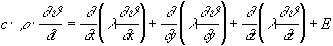
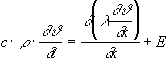
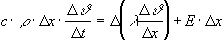
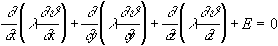
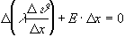
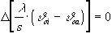
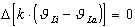
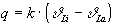
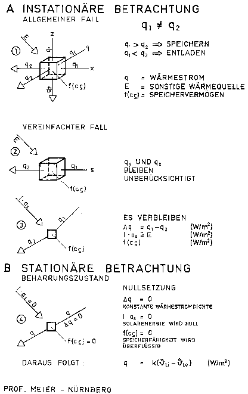

[🠔 Zur Übersicht: Widersprüche 1](7waefe33.md)  
# Anwendung und Grenzen der Fourierschen Wärmeleitungsgleichung
**Prof. Dr.-Ing. habil. Claus Meier entlarvt die mathematischen Tricks, mit denen der deutsche Hausbau durch Pervertierung der Fourierschen Wärmeleitungsgleichung unter die Räder kam.**  
_von Claus Meier_

## Claus Meier, Nürnberg

## Die Fouriersche Wärmeleitungsgleichung

### Vorbemerkung des Herausgebers

Im nachfolgenden Text zeigt Prof. Dr.-Ing. habil. Meier die mathematischen Tricks auf, mit denen der deutsche Hausbau durch Pervertierung der Fourierschen Wärmeleitungsgleichung in den Wahnsinn getrieben wird, Bewohner der Dämmbuden in den Tod (wir sind Weltmeister bei den Kinderasthma-Todesfällen, führend in der Asthmarate der Bevölkerung!) und der Bauinvestor in den Ruin. 

Wer war dieser Formelerfinder und warum rechnete sich Fourier so heiß? 

Aus [www.quantum-chemistry-history.com](http://www.quantum-chemistry-history.com/Four_Dat/Fourier-Bio/Fouri_1a-ww2000.htm):

_"Der Grund übrigens, warum sich Fourier mit der Wärme beschäftigte wird allgemein auf eine rein biographische Tatsache zurückgeführt. 

Seit St. Benoit litt Fourier, neben der dort gleichfalls erstmalig aufgetretenen Schlaflosigkeit, unter Rheuma, Asthma und Atembeschwerden. Und vielleicht hatte er in Ägypten bemerkt, daß Wärme seine Leiden lindere. 

Zeitgenossen berichten jedenfalls, daß er seit seinem Aufenthalt in Ägypten seine Wohnung derartig unangenehm heiß hielt, daß sich Besucher häufig beschwerten, während er sich zusätzlich noch in dicke Mäntel einhüllte. ... 

Der Gesundheitszustand Fouriers verschlechterte sich ... immer mehr. Schlaflosigkeit, Asthma und Rheuma erlaubten ihm nur noch, fast aufrecht stehend, in einem selbstgebautem Gestell wenigstens zeitweise Ruhe zu finden. 

Eine Angina kam dazu und so verstarb Fourier 1830 in Paris im relativ frühen Alter von 62 Jahren." _

Oh, dieser arme Asthma-Kauz! Opfer seiner Dämmsucht. Friede seiner Asche. 

Wie viele müssen seinem grausen Schicksal als Dämmopfer wohl noch folgen, bis "unser" Gesetzgeber ein Einsehen hat? Von der Wunschvorstellung, daß Dämmstoff immer und unter allen Umständen zur bemerkenswerten Energieeinsparung und Heizkostenminderung führt, heilt vielleicht ein Blick auf diese Seite: [Vergeblich verdämmt](7fehrtab.md). 

Und lesen Sie auch mal hier: 

_[DIE WELT am 08.02.2008: "Rückkehr der Schimmelpilze in Deutschland](http://www.welt.de/wirtschaft/article1647581/Rueckkehr_der_Schimmelpilze_in_Deutschland.html) - Dieser Pilz kann lebensbedrohlich sein – und er ist auf dem Vormarsch in Deutschland. Bundesweit sind schon mehr als drei Millionen Wohnungen vom Schimmel betroffen. Die Situation wird schlimmer, denn seit 2002 gilt eine Verordnung, nach der Neubauten und Sanierungen luftdicht ausgeführt werden müssen. ... 

Vor Einführung der Energieeinsparverordnung hatten ökologisch orientierte Architekten und Politiker von SPD und Grünen argumentiert, eine stärkere Wärmedämmung werde verhindern, dass Feuchtigkeit an den Innenwänden kondensiert und eine Schimmelbildung damit unmöglich machen. "Die Praxis beweist in vielen Fällen das Gegenteil", heißt es nun in einem weiteren, 

["Dicke Luft in luftdichten Gebäuden"](http://www.umweltbundesamt.de/gesundheit/innenraumhygiene/dicke-luft.htm) 

betitelten Papier des Umweltbundesamtes. "Es kann in solchen Häusern durch falsche Lüftungszeiten sogar im Sommer Schimmel geben. ...""_ 

kf 

Link: [k/U-Wert-Narretei](2139bau.md#u-narretei) \+ [Fourierrechnung total](7wdvs10.md) 

---

## Claus Meier

## Die Fouriersche Wärmeleitungsgleichung

Der allgegenwärtige k-Wert [heute U-Wert] als Grundlage aller Energieberechnungen wird aus der Fourierschen Wärmeleitungsgleichung abgeleitet. Wie geschieht dies? 

### Die Herkunft des k-Wertes

Für den _instationären_ Fall mit sonstigen Wärmequellen lautet der Ausdruck (Skizze 1) [1], [2]:

(1)  (W/m³)

Wird nur das eindimensionale Temperaturfeld in x-Richtung beschrieben (dann auch mit der Dimension s), dann folgt in etwas anderer Zuordnung (Skizze 2):

(2)  (W/m³)

Diese reduzierte Fouriersche Gleichung als Differentialgleichung zweiter Ordnung kann in Differenzen-Schreibweise, etwas umgestellt, auch wie folgt geschrieben werden (Skizze 3):

(3)  (W/m²)

Konrad Fischer: Fassaden energetisch richtig und kostensparend sanieren 1 

[Teil 2](http://www.youtube.com/watch?v=Y1NSxAW15Cc) [Teil 3](http://www.youtube.com/watch?v=RAT7VzBo8k0) [Teil 4](http://www.youtube.com/watch?v=6TBII25iVQk) [Teil 5](http://www.youtube.com/watch?v=Kb0C4KiZvVA) 

Erläuterung der Formel (3): 

Die rechte Seite beschreibt einmal die Differenz unterschiedlicher Wärmestromdichten q1 und q2, die bei instationären Verhältnissen _immer_ auftreten (unterschiedliche Temperaturgradienten, also Temperaturkurven und keine Geraden) und zum anderen eine sonstige Wärmequelle (E

× D x oder analog I× as), wie sie z. B. bei der Solarstrahlung vorliegt. Die Wärmestromdifferenz D q und die sonstige Wärmequelle E ×D x entsprechen dann der eingespeicherten Energie f(c r ) auf der linken Seite der Formel. 

Für die Energiebilanz einer Außenwand - und nur darum geht es - ist die Tatsache entscheidend, daß bei vorliegenden instationären Verhältnissen der linke Ausdruck, der die Speicherfähigkeit eines Bauteils kennzeichnet, nicht weggelassen werden darf. Dies jedoch geschieht, wenn der stationäre Fall weiterverfolgt wird.

Für den _stationären Fall_ (Beharrungszustand) geht die allgemeine Fouriersche Wärmeleitungsgleichung (1) durch Nullsetzung in die Laplace-Gleichung (Potentialgleichung) über [3]:

(4)  (W/m³)

Wird nun wiederum nur das eindimensionale Temperaturfeld in x-Richtung betrachtet, dann folgt daraus in Differenzen-Schreibweise analog Formel (3) gemäß Skizze 4:

(5)  (W/m²)

_Hier wird deutlich:_

1. Die linke Seite der Fourierschen Wärmeleitungsgleichung (s. Formel 3), also die Speicherkomponente mit dem charakteristischen Speicherwert c und dem Massewert r, wird zu Null. Speicherfähigkeit wird somit ignoriert, wird nicht mehr benötigt. Der Grund ist:

2. Die Differenz zweier Wärmestromdichten in der x-Richtung (s-Richtung) wird auch zu Null. Wenn jedoch die Differenz zu Null wird, dann muß überall die gleiche Wärmestromdichte q vorliegen. Der einem Volumenteilchen zufließende Wärmestrom ist also gleich dem abfließenden Wärmestrom; Energie wird also nicht eingespeichert - und auch nicht abgegeben. Charakteristikum des Beharrungszustandes, des stationären Zustandes, ist also die konstante Wärmestromdichte q mit geradlinigen Temperaturverteilungen.

3. Auch die sonstige Wärmequelle, wie z. B. die Solarstrahlung, wird zu Null, Solarenergie wird also nicht berücksichtigt.

Durch Nullsetzung der Fourierschen Wärmeleitungsgleichung werden somit die Speicherfähigkeit der Außenbauteile negiert, die konstante Wärmestromdichte im Bauteil erzwungen und dieSolarstrahlung ignoriert. Die konstante, linearisierte Wärmestromdichte ist ein Charakteristikum des Beharrungszustandes.

Diese rigorose Vorgehensweise führt dann bei der Ableitung des k-Wertes, wenn nun für eine monolithische Konstruktion die entsprechenden Abmessungen und Temperaturdifferenzen eingesetzt werden, zu folgender Wärmestromdifferenz:

(6)  (W/m²)

Wird der k-Wert verwendet, dann wird:

(7)  (W/m²)

Erläuterung der Formel (7): 

Die eckige Klammer beschreibt die Wärmestromdichte q. Die Differenz ist Null. Dies bedeutet: Die einem Volumenteilchen zugeführte Energie ist gleich der abgeführten Energie, die Wärmestromdichte q in W/m² ist somit konstant, die Temperaturlinie ist eine Gerade, Speicherung findet nicht statt.

Diese konstante Wärmestromdichte wird dann demzufolge:

(8)  (W/m²)

Erst diese stationäre Deutung der konstanten Wärmestromdichte q führt zu der in der DIN 4108 aufgeführten und nur für den Beharrungszustand geltenden Formel. Von der ursprünglich aus fünf Komponenten bestehenden Fourierschen Wärmeleitungsgleichung verbleibt durch Nichtberücksichtigung zweier Wärmeströme (y und z-Richtung) sowie durch Nullsetzung der verbleibenden Komponenten nur ein Ausdruck übrig.

Dieses Überbleibsel der Forierschen Wärmeleitungsgleichung ist dann die heilige Kuh des Gebäudewärmeschutzes, nämlich der allgegenwärtige k-Wert (heute U-Wert), der das gesamte Bauwesen wärmetechnisch beherrscht und mit seiner Ausschließlichkeit förmlich stranguliert.

_Quintessenz:_ Da der Beharrungszustand bei Verwendung speicherfähigen Materials nie eintreten kann, ist der k-Wert nicht aussagefähig, die Berechnung fehlerhaft. 

Deshalb steht auch in [4]:

_"Beim Anheizen oder Auskühlen von Räumen oder bei Sonnenzustrahlung liegen jedoch instationäre Verhältnisse vor, so daß diese durch die Werte 1/L (oder R in m²K/W) und k (oder U in W/m²K)_nicht_ erfaßt werden"._

Diesen Satz sollten sich die k-Wert-Dogmatiker immer wieder durchlesen und einprägen.

Diese Tatsache aber ist seit langem bekannt. Nach Cammerer benötigt eine massive 38 cm Ziegelwand konstante Lufttemperaturen über einen Zeitraum von mindestens drei Tagen, um den Beharrungszustand zu erreichen [5]. Da jedoch konstante Lufttemperaturen über einen derart langen Zeitraum in Realität nicht vorliegen, bedeutet der "Beharrungszustand" nur eine Fiktion. 

Insofern ist es schon richtig, wenn in [4] geschrieben steht: 

_"Die Wärmeleitung durch eine ebene Platte eines Baustoffes im Beharrungszustand der Temperaturverteilung, das heißt nach genügend langer Zeit bei konstanten Temperaturen zu beiden Seiten der Platte, erfolgt nach der Gleichung ..."_ 

und nun wird die allseits bekannte, nur für den Beharrungszustand gültige Formel genannt.

Prof. Werner (FHS München) hält für herkömmlich schwere Gebäude, bei dem der stationäre k-Wert auch für instationäre Verhältnisse in etwa zutrifft, einen notwendigen Zeitraum konstanter Lufttemperaturen auf beiden Seiten der Konstruktion von bis zu drei Wochen für erforderlich [10]. Bei drei Wochen könnten in der Tat die notwendigen Einpendelungszeiten zum Beharrungszustand am Anfang und am Ende in etwa vernachlässigt werden, so daß die Fehler nicht allzu groß werden. 

Allerdings macht er dann den Denkfehler, statt der hierfür notwendigen konstanten Lufttemperaturen über diesen Zeitraum nun ebenso die statistischen Mittelwerte (z. B. Monatsmittelwerte) verwenden zu können und glaubt wirklich, damit die täglichen Temperaturschwankungen [Anm. KF: und Solarstrahlungsgewinne] umgehen zu können. Welch ein kapitaler Irrtum ist dies; doch Trugschlüsse sind in der offiziellen Bauphysikszene offensichtlich weit verbreitet.

Den Grundstein für diesen Irrtum legte bereits Prof. Gertis in [6], indem er schrieb: 

_"Der Dämmwert (und damit der k-Wert) beschreibt die Transmissionswärmeverluste durch ebene Außenbauteile nicht nur im stationären Temperaturzustand, sondern auch bei beliebig periodisch-instationären Randbedingungen im Periodenmittel in zutreffender Weise, dabei kann es sich um eine Tagesperiode, eine Heizperiode oder einen ganzen Jahres. bzw. Mehrjahreszyklus handeln. Der k-Wert stellt somit auch eine instationäre Kenngröße dar, welche den stationären Sonderfall mit einschließt"._

Hier wird in fataler Weise von einer falschen Ausgangsposition ausgegangen. Diese Lesart gilt nämlich nur dann, wenn statt der Fourierschen Wärmeleitungsgleichung (Gleichung 1) die "Laplace-Gleichung" (Potentialgleichung), gültig nur für den Beharrungszustand (Gleichung 4), nun als Diffentialgleichung zweiter Ordnung numerisch weiterbehandelt wird - und hierfür kann dann in der Tat auch der Mittelwert verwendet werden. 

Beim Beharrungszustand jedoch werden durch die Nullsetzung der Fourierschen Wärmeleitungsgleichung, und daran muß hier besonders erinnert werden, folgende Randbedingungen vorausgesetzt und angenommen:

1. Die Solarstrahlung wird nicht berücksichtigt. 

Aber gerade diese garantiert doch die entscheidenden Vorteile bei der Energiebilanz einer Außenwand. Immerhin ergeben sich äußere Wandoberflächentemperaturen von etwa 10 bis 30°C, die das Wärmegefälle in der Außenwand umdrehen.

2. Die Wärmestromdichte im Außenbauteil bleibt generell konstant. Jedem Bauphysikbuch kann dies entnommen werden; bei seriösen Büchern wird dann auch besonders auf den Beharrungszustand hingewiesen. 

Bei Außentemperaturänderungen und Solarstrahlung tritt jedoch dieser Beharrungszustand nicht sofort ein, sondern benötigt wegen der Speicherfähigkeit der Wand dazu eine gewisse Zeit (bei speicherfähigen Baustoffen dauert das Einpendeln bis zu drei Tage). Konstante Wärmestromdichten sind deshalb nur fiktiv.

3. Erst durch 1. (Solarstrahlung gleich null) und 2. (konstante Wärmestromdichte) wird die Speicherfähigkeit nicht beansprucht, sie spielt dann keine Rolle mehr. 

Diese Randbedingungen sind im täglichen 24 Stunden Rhythmus jedoch reine Fiktion, denn bei Temperaturänderungen und Sonnenzustrahlung wird ein neuer Beharrungszustand, also die gerade Temperaturlinie, nicht schlagartig und sofort erreicht, sondern erst nach Stunden oder Tagen. Allein nur wenig speicherfähiges Material (wie z. B. Styropor oder Mineralwolle) ist in der Lage, den neuen Beharrungszustand relativ schnell zu erreichen und damit dem k-Wert entgegenzukommen. Eventuelle Simulationsrechnungen behandeln somit entweder eine Situation, die es in Realität überhaupt nicht gibt oder sie gelten nur für speicherloses Material. Damit aber dominiert auf der ganzen Linie die rechnerische Utopie. 

Da jetzt durch die EnEV 2000 die Altbausubstanz, also massive, speicherfähige Wände, der k-Wert Doktrin unterworfen werden sollen, beruht diese Verpackungskampagne auf Fehlschlüssen und Falschaussagen. Es ist schon recht erstaunlich, daß gerade die besonders fatalen Irrtümer derart Furore machen und eine lawinenartige Verbreitung finden. Dies aber ist im Lobbyistenstaat wohl kein Einzelfall.

Fragt man nach der Ursache, warum nun trotz dieser Widersprüche der k-Wert allerorts verwendet wird, so liefert vielleicht ein Satz aus [1] den Grund:

_"Weiterhin liegt in den wenigsten Fällen ein stationäres Temperaturprofil vor. Die Zeitabhängigkeit bedingt, daß die Fouriersche Wärmeleitgleichung nicht mehr geschlossen lösbar ist und daß man auf umfangreiche mathematische Methoden oder grafische Verfahren übergehen muß"_.

Es wird gerechterweise bestätigt, daß in den wenigsten Fällen ein stationäres Temperaturprofil vorliegt. Dies ist positiv zu werten. Es wird aber auch unmißverständlich festgestellt, daß ein instationäres Temperaturprofil _"umfangreiche Methoden"_ oder _"grafische Verfahren"_ erfordert.

[_Erg. KF: Hier ein Beispiel aus einer Februarmessung von Temperaturwerten am Justus-Knecht-Gymnasium, Bruchsal. Autoren sind die Ingenieure Wichmann und Varsek. Die grafisch dargestellten Ergebnisse belegen die tatsächlichen Verhältnisse bei der Energieaufnahme einer SSW-Massivwand im Winterfall (20.-21. Februar, tagsüber bedeckter Himmel). Demnach ergeben sich an der solar bestrahlten Massivoberfläche Temperaturen bis 30 Grad bei einer Außenlufttemperatur von ca. 8 Grad. Durch die nächtliche Wärmeabgabe sinkt die Temperatur der Massivwand wieder ab, bleibt aber dank der hervorragenden Speicherfähigkeit der massiven Ziegelwand immer wärmer als die Außenlufttemperatur und dadurch kondensatfrei. 

Bildquelle: Rationeller Bauen, Februar 1983

 Der rechnerisch berücksichtigte k- bzw. U-Wert ist in der linken Grafik als gestrichelte Linie zwischen Innentemperatur und Außentemperatur eingetragen. Er korrespondiert nicht (!) mit den gemessenen Werten. Und das trifft für viele - allzuviele! - Perioden eines geheizten und witterungsexponierten Bauwerkshülle zu.]_

Sind es nun die umfangreichen Methoden, warum man sich vehement sträubt, bei massiven Außenwänden die instationär wirkende Solarstrahlung und die Speicherfähigkeit einer Außenwand mit in die Berechnung einzubeziehen? Deshalb wird ja auch ständig behauptet, die Solarstrahlung und die Speicherfähigkeit hätten nur einen sehr geringen Einfluß auf die Transmissionswärmeverluste einer Außenwand. Auch wird die k-Wert-Berechnung ja damit begründet, daß es sich hierbei um ein _"Vereinfachtes Berechnungsverfahren"_ handele.

Ehe man aber mit dem k-Wert wegen der Scheu vor _"schwierigen Rechenmechanismen"_ völlig falsch rechnet, wäre es doch erstrebenswerter, ein Rechenverfahren einzusetzen, das, in deduktiver Weise abgeleitet, die wirklichen Verhältnisse ziemlich genau beschreibt und zu Ergebnissen kommt, die realistisch sind [7], [8]. [_Erg. KF:[Zum besseren Rechnen mit dem keff-Wert (heute Ueff-Wert) nach Prof. Meier](keff.md)_] Empirische Untersuchungen [_Erg. KF:[Fehlgeschlagene Hausisolierung mit Dämmstoffen](7fehrtab.md)_] zeigen ja die Diskrepanz zwischen Rechnung und Realität.

_Resümee:_

Die reduzierte Fouriersche Wärmeleitungsgleichung in Differenzen-Schreibweise (3) wird trotz des in der Wirklichkeit nie vorliegenden Beharrungszustandes in unzulässiger Weise zu Null gesetzt. Man erhält damit eine reduzierte Laplace-Gleichung (5) und damit die Formel für den im Gebäudewärmeschutz alles bestimmenden k-Wert nach DIN 4108 (8). 
Alle Berechnungen mit diesem, nur für den Beharrungszustand gültigen k-Wert entsprechen somit nicht der Wirklichkeit, der k-Wert ist schlichtweg ein Phantom, eine Fiktion [9].

---

**Die Skizzen 1-4:**

---

**Literatur:**

[1] Cziesielski, E.; Daniels, K.; Trümper, H.: Ruhrgas Handbuch - Haustechnische Planung. Hrsg. Ruhrgas AG, Karl Krämer Verlag Stuttgart 1985. 
[2] Lutz, P.; Jenisch, R.; Klopfer, H.; Freymuth, H.; Krampf, L; Petzold, K.: Lehrbuch der Bauphysik, Teubner Verlag Stuttgart, 3. Auflage 1994. 
[3] Klement, E.; Rudolphi, R.: Zur numerischen Abschätzung der stationären Temperaturverteilung im Querschnitt von Schornsteinen. Technische Mitteilungen 1979, H. 2/3/4, S. 323. 
[4] Gösele, K.; Schüle, W.: Schall, Wärme, Feuchte. Bauverlag Wiesbaden Berlin 1985. ] 
[5] Cords-Parchim, W.: Technische Bauhygiene. Teubner Verlag Leipzig, 1953. 
[6] Gertis, K.: Das hochgedämmte massive Haus. Bundesbaublatt 1983, H. 3, S. 149 und H. 4, S. 203. 
[7] Meier, C.: Gut gespeichert ist auch gedämmt. deutsche bauzeitung 1999, H. 5, S. 138. 
[8] Meier, C.: Entwickelt der Wärmeschutz sich zum Phantom. Deutsches Ingenieurblatt 1999, H. 5, S. 16. 
[9] Meier, C.: Richtig oder falsch. Ist der k-Wert als Maß für den Energieverbrauch gültig? bausubstanz 1999, H. 7-8, S. 46. 
Werner, H.: Leserbrief zu [7] in deutsche bauzeitung 1999, H. 8, S. 30.
