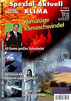

Climategate 1 - **[Angloamerikanische Wissenschaftskriminelle erfanden den Klimaschwindel - auch Deutsche Professoren dabei!](http://www.welt.de/wissenschaft/article5294872/Die-Tricks-der-Forscher-beim-Klimawandel.html)** 
Climategate 2 - **[Entlarvt: Menschengemachte Erderwärmung - ein Schwindel der Grünen Klimaschutzgelderpresser](http://www.eike-klima-energie.eu/news-anzeige/dreiste-manipulation-der-wichtigsten-temperaturdaten-zur-welttemperatur-nicht-mehr-auszuschliessen-das-daten-desaster-der-ipcc-klimazentrums-cru-climate-research-unit-der-universitaet-east-anglia/)** 
Schon wieder? Umweltbundesamt: [Staatlich organisierter **Völkermord mittels Entgasung/Klimaschutz/CO2-Reduktion?**](7thu51.md)

# **Klimawandel**

und 

# ****Klimaschwindel****

Eine Belegarbeit am Geschwister-Scholl-Gymnasium Löbau im Schuljahr 2004/2005 über den großen Klimaschwindel, von der Autorin dankenswerterweise den Altbau und Denkmalpflege Informationen zur Veröffentlichung freigegeben. 

**_Ich halte die globale Erwärmung für viel weniger gefährlich, als die globale Verblödung!"_** ([Lisa Fitz](http://www.youtube.com/watch?v=EwULS4XmPew&feature=related), Kabarettistin, in RTL 11.06.2007, 23.10: "Der Klimawandel - Alles Schwindel?" zum Thema Mißbrauch der Klimahysterie) 

**_"Die Klimakatastrophe ist die große Geschäftemacherei unserer Zeit."_** ([Matthias Horx](http://www.horx.com), Trend- und Zukunftsforscher) 

**_"Wenn Menschen aufhören, an Gott zu glauben, dann glauben sie nicht an nichts, sondern an alles Mögliche. Das ist die Chance der Propheten – und sie kommen in Scharen."_** ([Gilbert Keith Chesterton](http://de.wikipedia.org/wiki/G._K._Chesterton), Autor von "Pater Brown") 

**_"Nie haben die Massen nach Wahrheit gedürstet. Von den Tatsachen, die ihnen mißfallen, wenden sie sich ab und ziehen es vor, den Irrtum zu vergöttern, wenn er sie zu verführen vermag. Wer sie zu täuschen versteht, wird leicht ihr Herr, wer sie aufzuklären sucht, stets ihr Opfer._** ([Gustave Le Bon: Psychologie der Massen](http://www.textlog.de/35465.html)) 

Belegarbeit: 
**Klimawandel und Klimaschwindel**

erarbeitet von: Maria Ackermann 
Unterrichtsfach: Geographie 
Betreuer: Herr Rabel

Ó Maria Ackermann, Jg. 1987 
Lehdehäuser 1b 
02708 Lawalde-Lauba

Links: Der Klimahammer von Argus 
Rechts: Bildlink zu [aktualisiertem Beitrag](http://www.shopargoverlag.de/product_info.php?products_id=136&XTCsid=011249cd77f54c3e332c9c64374ede88) u.a. Augenöffnern gegen Klimaschwindel in Magazin 2000plus Spezial "Klima" 

**Inhaltsverzeichnis**

1.Klimawandel in der Vergangenheit

1.1. Die Erforschung des Klimas der Vergangenheit 
1.2. Die frühe Klimageschichte 
1.3. Das Quartäre Eiszeitalter 
1.4. Die letzten 2000 Jahre 
1.5. Klimaentwicklung seit dem Beginn der Wetteraufzeichnungen bis Heute 
1.6. Klima ist relativ!

2. Klimaschwindel von Heute

2.1 Betrachtungen zu dem Phänomen des Treibhauseffektes 
2.1.1. Zu welchen Assoziationen zwingt uns allein das Wort "Treibhauseffekt"? 
2.1.2 Die weit verbreitete Erklärung für den Treibhauseffekt 
2.1.3 Gegendarstellung zum Treibhauseffekt 
2.1.4 Irrtümer der etablierten Klimatologie 
2.1.5. Zusammenfassung Treibhauseffekt 
2.2. Klimaschutzpolitik und ihre Folgen 

3. Zusammenfassung

Literaturverzeichnis

Anhang: Interview mit Herrn Konrad Fischer 
Grafiken zur Erläuterung

## 1.Klimawandel in der Vergangenheit

Um unser derzeitiges Klima besser verstehen zu können, ist es notwendig sich die Erde im bisherigen Klimawandel näher an zu sehen. Denn das Klima war, wie man heute weiß, von Warm- und Kaltzeiten geprägt.

### 1.1 Die Erforschung des Klimas der Vergangenheit

Forscher aus aller Welt versuchen Anhaltpunkte für Klimaveränderungen in der Vergangenheit sowohl im polaren Eis als auch in den Tropen zu finden. Das polare Eis ist in sofern aufschlussreich, als das es die Luft und mit ihr auch die Partikel von vergangenen Jahrtausenden in winzigen Luftbläschen konserviert hält.

Die Tropen sind im Gegensatz zu den polaren Gebieten aber eher ein neueres Forschungsgebiet, wenn es um die Erforschung des Klimas geht. Dennoch sind sie nicht weniger interessant als das polare Eis. Im Gegenteil: Die Rolle der Tropen wird heute als viel wichtiger angesehen als noch vor zehn Jahren, bestätigt auch David Lea von der Universität Kalifornien/Santa Barbara.

Untersuchungen, z. B. die des Briten Gideon Henderson, zeigen, dass sich das Klima in den Tropen bis zu 15.000 Jahre früher verändert hat als in mittleren und hohen Breiten der Nordhemisphäre.

Auch Trauth, einer der wenigen deutschen Forscher, die sich mit der Bedeutung der Tropen für den globalen Klimawandel beschäftigen, führte gemeinsam mit Kollegen aus den USA und Frankreich Untersuchungen in Ostafrika durch. Die Erforschung von Sedimenten am Ufer des Lake Naivasha in Kenia hat ergeben, dass das Klima dort wahrscheinlich bereits vor 150.000 Jahren zu kippen begann.

Konrad Fischer: Praktischer Klimaschutz - Fassaden energetisch richtig und kostensparend sanieren 1 

[Teil 2](http://www.youtube.com/watch?v=Y1NSxAW15Cc) [Teil 3](http://www.youtube.com/watch?v=RAT7VzBo8k0) [Teil 4](http://www.youtube.com/watch?v=6TBII25iVQk) [Teil 5](http://www.youtube.com/watch?v=Kb0C4KiZvVA) 

Wie man sieht, können ältere Klimaereignisse nur mittels indirekter Daten bestimmt werden. Dazu zählen die Dendrologie (Baumringanalyse), Untersuchungen von Meeressedimenten, Eisbohrkernen, Korallen und die Auswertung historischer Darstellungen. Weiterhin können an Pflanzenresten Messungen zum Gehalt von Kohlenstoffisotopen durchgeführt werden. Das Isotop Beryllium 10 kann zur Bestimmung der früheren Sonneneinstrahlung genutzt werden.

[Weltoktober](http://c1.websale.net/cgi/wsaffil/wsaffil.cgi?act=callshop&shopid=kopp-verlag&subshopid=01-aa&idx=dynamic&affid=30&prod_index=903100) 
von [Torsten Mann](http://c1.websale.net/cgi/wsaffil/wsaffil.cgi?act=callshop&shopid=kopp-verlag&subshopid=01-aa&idx=dynamic&affid=30&prod_index=903100)

### 1.2. Die frühe Klimageschichte

Nach der Entstehung der Erde vor 4,6 Mrd. Jahren konnte sich erst vor ca. 2 Mrd. Jahren eine stabile Atmosphäre aufbauen. Darauf folgte auch schon vor 2,3 Mrd. Jahren das erste Eiszeitalter. Etwa ab dieser Zeit kann das Klima heute rekonstruiert werden, was vor allem durch die Analyse von Sedimenten geschieht. 

Dieses erste Eiszeitalter wird "Archaisches Eiszeitalter" genannt. Es begann vor 2,3 Mrd. Jahren und dauerte etwa 300 Mio. Jahre. In dieser Zeit waren beide Pole mit Eis bedeckt.

Das zweite ("Algonkisches Eiszeitalter") begann fast eine Mrd. Jahre später, also vor 950 Mio. Jahren. Dieses mal war nur der Nordpol mit Eis bedeckt. Europa befand sich noch am Nordpol, deshalb gibt es auch nur hier Hinweise auf dieses Eiszeitalter.

Nach einer Warmzeit, die bis vor 750 Mio. Jahren anhielt, folgten die "Sturtische Vereisung" und die "Varanger Vereisung", die bis vor 620 Mio. Jahre andauerten. Da diese beiden Vereisungen relativ kurz aufeinander folgten und beide bipolar waren, also auf beiden Erdhalbkugeln Eis entstehen ließen, werden sie zusammen als das "Eokambrische Eiszeitalter" bezeichnet.

Das darauf folgende "Silur- Ordivizisches Eiszeitalter" begann vor 440 Mio. Jahren und war höchstwahrscheinlich ein sehr schwaches Eiszeitalter, weil es sich vermutlich nur auf die Sahara beschränkte und daher vereinzelt als "Sahara Vereisung" genannt wird. Allerdings wird noch über eine Vereisung von Südamerika und Südafrika spekuliert. 

Vor 280 Mio. Jahren folgte dann das wieder stärkere "Permkarbonische Eiszeitalter", das auch als "Gondwana Vereisung" bekannt ist. 

Das Eiszeitalter, das bis heute anhält, begann vor 2 bis 3 Mio. Jahren und ist unser derzeitiges "Quartäres Eiszeitalter". Dies ist am besten von allen Eiszeitaltern erforscht und deshalb gibt es eine Fülle von Daten. 

### 1.3. Das Quartäre Eiszeitalter

Tiefseesedimente belegen, dass es vor ca. 3,2 Mio. Jahren einen starken Temperaturabfall auf der Erde gab. Diese Veränderung sehen viele Wissenschaftler als Beginn des Quartärs an. Eis entstand jedoch nicht sofort, sondern erst mit einer Verzögerung, denn die Erde musste sich erst so weit abkühlen, dass wieder große Gletscher und Eispanzer entstehen konnten. 

Hier möchte ich darauf hinweisen, dass man zwischen "Eiszeitalter" und "Eiszeit", wie vielleicht schon bemerkt, unterscheiden muss. Ein Eiszeitalter besteht aus Eiszeiten und Warmzeiten. Eiszeiten sind also besonders kalte Perioden und Warmzeiten besonders warme Perioden in einem Eiszeitalter.

Deshalb sind die Namensgebungen für unsere Zeit auch etwas verwirrend. Die Geologen nennen sie "Holozän" und von den Geografen wird sie als "Postglazial" bezeichnet. Geologen und Geographen sind sich also nicht einig, ob diese unsere Zeit nun eine weitere Warmzeit ist oder der Beginn eines völlig neuen Klimarhythmuses, denn "Postglazial" bedeutet "nach der Eiszeit".

Für die Frage des Beginns des Eiszeitalters vor 2,7 Millionen haben Potsdamer Wissenschaftler des Geoforschungszentrums (GFZ) und des Instituts für Klimaforschung (PIK) eine verblüffende Lösung gefunden:

Eine Art "Süßwasserdeckel" nur 50 bis 200 Metern unter der Meeresoberfläche des Nordpazifik habe die Ozeanströmungen gebremst oder sie ganz unterbrochen. Durch die gebremsten Strömungen im Pazifik habe sich nun im Sommer das Oberflächenwasser erwärmt. Es war zwar nur eine dünne Schicht von vielleicht 50 Metern, dafür sei deren Temperatur um bis zu sieben Grad gegenüber den vorher üblichen Werten gestiegen, berichtete Gerald Haug, Professor und Klimaforscher vom GEZ der Sächsischen Zeitung. Die Experten überraschten dann jedoch die Folgen dieser Erwärmung. Gleich einer warmen Badewanne in einem kalten Raum habe der Nordpazifik im kühlen Herbst und frühen Winter zu dampfen begonnen. In der eiskalten Luft über den Landmassen und über dem Nordpol seien daraufhin gigantische Schneemassen niedergegangen. Das war mehr, als die Sonne im darauf folgenden Sommer habe wegtauen können. Weil Grönland, Nordamerika und große Teile Nordasiens von kilometerdicken Eisschilden bedeckt gewesen sein sollen, sei der Meeresspiegel um 120 Meter gesunken. Die Abkühlung habe daraufhin nochmals zugenommen, da der viele Schnee nun auch die letzten wärmenden Sonnenstrahlen im Sommer zum großen Teil wieder reflektiert habe soll, schilderte Haug. Seit dem habe sich das Klima als Pendel zwischen kalt und warm eingependelt.

Bisher gab es allein in den letzten 500.000 Jahren des Quartärs bereits gut untersuchte Warm- und Kaltzeiten im Bereich der Alpen und des nördlichen Mitteleuropas (Übersicht im Anhang).

Wenn diese Warm- und Kaltzeiten schon relativ große Temperaturunterschiede und damit Klimaveränderungen anzeigen, so gibt es doch auch noch Unterschiedliche Temperaturschwankungen innerhalb dieser Warm- und Kaltzeiten. Es gab allein während der Würmkaltzeit 3 Stadiale, d.h. relativ kalte Zeiten vor 60.000, 40.000 und 18.000 Jahren. Die kalten Temperaturen, die um ca. 4-5 °C unter unseren heutigen Erdmitteltemperatur lagen, führten dazu, dass auf der Erde 3 mal so viel Eis vorhanden war als heute. 

Die Januarmitteltemperatur lag im deutschen Gebiet zum Beispiel bei etwa 20°C. Zum Vergleich: heute ist dieser Mittelwert bei 0,3°C. Das hatte vor 18.000 Jahren zur Folge, dass auch der Meeresspiegel drastisch sank, nämlich auf einen Wert von 135 Meter unter der heutigen Marke. Diese Klimamerkmale hatten natürlich auch Einfluss auf die Tierwelt. Der Eisbär war beispielsweise zu dieser Zeit in Norddeutschland heimisch.

Der offizielle Wechsel von der letzen Kaltzeit zur Warmzeit wird auf 11.000 Jahre vor heute datiert. Dennoch erfolgte der Wechsel zwar in relativ kurzer Zeit aber immerhin über mehrere Tausend Jahre. Das lag daran, dass die großen Eisschilde nicht so schnell schmelzen konnten. Das skandinavische Schild war vor etwa 7.000 Jahren verschwunden. Dieser Vorgang ging im Vergleich zu den Schilden in Nordamerika und Nordasien relativ schnell, denn das Laurentische Schild in Nordamerika war erst vor 4.000 Jahren völlig abgeschmolzen. 

Doch wie konnte es zu solch einem Wechsel kommen? Haben die Steinzeitmenschen damals zu viele Feuer angezündet und durch die Kohlenstoffdioxidproduktion die Warmzeit eingeleitet?

Von 16.000 Jahren bis 10.000 Jahren vor unserer Zeit stieg der CO2 –Gehalt der Atmosphäre von 180 ml/m³ auf 260 ml/m³. Diese Erhöhung ist damit zu erklären, dass die Ozeane durch eine Temperaturerhöhung weniger CO2 lösen konnten und so mehr in der Atmosphäre zurück blieb. Wie gesagt, der CO2 –Gehalt stieg _durch_ eine Erwärmung und _verursachte_ sie nicht.

In der Zeit des sogenannten "Atlantikums", das vor etwa 6.500 Jahren begann und bis vor etwa 4.500 Jahren dauerte, hatte die aktuelle Warmzeit ihren Höhepunkt überschritten. Bei diesem optimalen und warmen Klima entstanden auch die ersten Hochkulturen in Mesopotamien und Ägypten. Heute sind diese Regionen eher trocken. Deshalb mag es vielleicht erstaunlich sein, doch damals herrschte dort ein niederschlagsreiches Klima. Das ergaben verschiedene Untersuchungen und Satellitenbilder, die sehr umfangreiche, mittlerweile aber meist ausgetrocknete Flusssysteme zeigen. 

Trotz, dass das Holozän bis jetzt am besten untersucht wurde, sind doch die ersten drei Viertel noch weitgehend unerforscht. D. h. je jünger die Quellen der Information über das Klima sind, um so detaillierter werden sie.

### 1.4. Die letzten 2000 Jahre

Aufzeichnungen oder andere Funde über die Landwirtschaft geben Anhaltspunkte für das damalige Klima. Dort wo es warm war, konnte die Landwirtschaft gedeihen und mit ihr auch die Kultur wachsen. Weinanbau ist z. B. ein guter Indikator für warmes Klima. So wurde beispielsweise in der "Mittelalterlichen Warmperiode" zwischen dem 9. und 14. Jahrhundert Wein in Südschottland, Pommern und Ostpreußen angebaut. Heute liegt die Weinbaugrenze 500 Kilometer weiter südlich. Im Jahr 985 zieht der Wikinger Erik der Rote von Island nach Grönland. Das "Grünland" ist - wie der Name sagt - fruchtbares Land. Über die eisfreie Nord-Ost-Passage segelt Eriks Sohn Leif 500 Jahre vor Kolumbus als erster Europäer nach Amerika.

Auf diese Warmperiode folgte wieder ein "Kleine Eiszeit", die um 1300 beginnt und bis Mitte des 19. Jahrhunderts dauert. Das Wetter ist wechselhaft, kühl und regnerisch. 1342 wird Mitteleuropa von einer Hochwasserkatastrophe heimgesucht. Die Folge: Hungersnot und Seuchen. Die Pest rafft 40 Prozent der Bevölkerung dahin. Mitte des 17. Jahrhunderts, zur Zeit des Dreißigjährigen Krieges, rücken die Eismassen der Alpen wieder vor. In den nasskalten Sommern der nächsten 200 Jahre verfaulen nicht selten Getreide und Kartoffeln. Die Menschen hungern.

### 1.5 Klimaentwicklung seit dem Beginn der Wetteraufzeichnungen bis Heute

Der Temperaturanstieg seit Mitte des 19. Jahrhunderts fällt zeitlich zusammen mit dem Beginn der Industrialisierung und Bevölkerungsexplosion. Allerdings endete in diesem Zeitraum auch die "Kleine Eiszeit" und die Wetteraufzeichnungen begannen.

"Der eskalierende Verbrauch fossiler Brennstoffe und die landschaftsschädigende Bevölkerungsexplosion dürften aber zu diesem Zeitpunkt noch kein klimasteuerndes Ausmaß erreicht haben." , vermutet Klimaforscher und Paläontologe Professor Wolf Dieter Blümel. Dennoch werden die derzeitigen Klimaverhältnisse dem Treibhauseffekt zugeschrieben, der ja durch eben diese Einflüsse bestärkt werden soll.

Vielmehr sollten die Ursachen aber in den Ozeanen zu suchen sein.

Beispiel Golfstrom: Er entsteht in der Karibik und sorgt dafür, dass zum Beispiel die Häfen von Grönland oder Murmansk auch im Winter eisfrei sind. Wenn die Polkappen abschmelzen und nicht mehr genügend Kaltwasser produzieren, dann funktioniert der Wärmetauscher nicht mehr. Ausdehnung oder Schwund der polaren Eiskappen beeinflussen die Zirkulation von kaltem und warmem Wasser und damit die Großwetterlage über den Meeren. Wenn also der Golfstrom durch das kalte Schmelzwasser der polaren Eismassen abgedrängt wird und nicht mehr so weit in den Norden reicht, wird es in Nordeuropa kälter. 

Es ist paradox:

In Nordeuropa droht eine neue Kältezeit, während sich andernorts das Klima aufheizt. 

### 1.6 Klima ist relativ!

In den letzten 12.000 Jahren hat die Erde mehrere Wechsel von Warm- und Kaltzeiten erlebt. Während der letzten Eiszeit fand sich mal mehr und mal weniger Eis auf der Erdoberfläche. In dem Zeitraum der letzten eine Million Jahre wiesen die Temperaturen starke Schwankungen in Zyklen von etwa 100.000 Jahren auf. Dennoch waren die Schwankungen im Vergleich zu den letzten 100 Mio. Jahren _relativ_ gering. Denn, wenn man unsere derzeitigen Temperaturen mit denen aus diesem großen Zeitraum vergleicht, so wären sie relativ kalt, weil wir uns in einem Eiszeitalter befinden. Da wir uns aber seit etwa 11.000 Jahren in einer Warmzeit des Eiszeitalters befinden, sind die Temperaturen in Relation zu dem derzeitigen Eiszeitalter des Quartärs relativ warm. 

In den vergangenen Warmzeiten lagen die Durchschnittstemperaturen um 2 bis 2,5 Grad höher als heute. Untersuchungen der jüngeren und jüngsten Klimageschichte zeigen, dass Warmphasen gleichbedeutend sind mit Luxus und Überfluss. Kaltphasen zwingen zu radikaler Anpassung. Ein Forscherteam der Harvard University hat 240 wissenschaftliche Studien zu den Klimaveränderungen der letzten 1000 Jahre ausgewertet. Ergebnis: Weder die europäischen "Jahrhundertsommer" von 1947 oder 2003 noch die Häufung von Extremwetterlagen mit Orkan, Flut und Überschwemmungen sind - historisch gesehen - in irgendeiner Weise dramatisch. Das Horrorszenario der unkontrollierten "globalen Erderwärmung" wird relativiert: Seit 1850 steigen die Durchschnittstemperaturen tatsächlich wieder, und zwar auf ganz natürliche Weise. Trotzdem gehen viele Wissenschaftler davon aus, dass der sogenannte anthropogene Treibhauseffekt an der Erwärmung maßgeblich beteiligt sei.

Weiter - Teil 2 und Schluß: **[2. Klimaschwindel von Heute](7klima02.md)**
