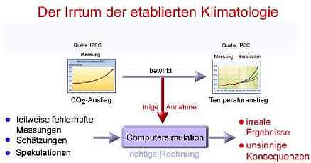
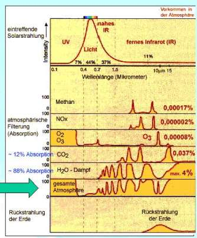
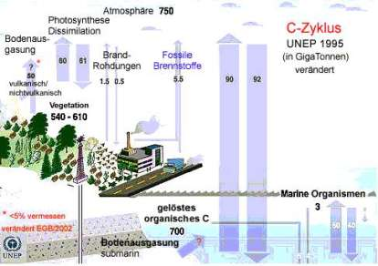
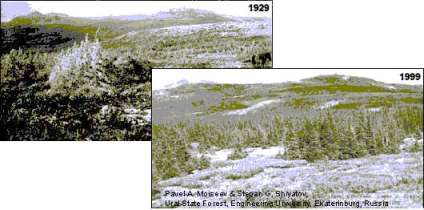
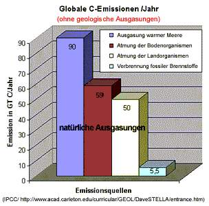
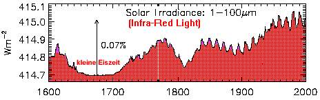
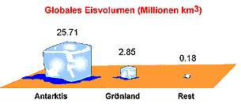
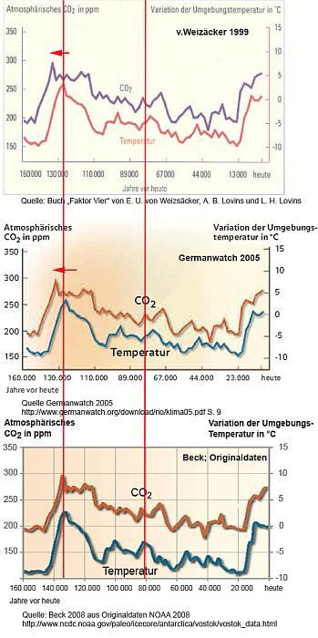

[🠔 Zur Übersicht: Klimaschwindel TV](7video.md)  
# Klimawandel und Klimaschwindel 2
**Maria Ackermann: Aufklärung, Fakten und Hintergründe zum Klimaschutz und zur sog. menschengemachten globalen Erwärmung.**  
_von Maria Ackermann_

Breaking News 12.11.09: Climategate 1 - **[Angloamerikanische Wissenschaftskriminelle erfanden den Klimaschwindel - auch Deutsche Professoren dabei!](http://www.welt.de/wissenschaft/article5294872/Die-Tricks-der-Forscher-beim-Klimawandel.html)** 
Climategate 2 - **[Entlarvt: Menschengemachte Erderwärmung - ein Schwindel der Grünen Klimaschutzgelderpresser](http://www.eike-klima-energie.eu/news-anzeige/dreiste-manipulation-der-wichtigsten-temperaturdaten-zur-welttemperatur-nicht-mehr-auszuschliessen-das-daten-desaster-der-ipcc-klimazentrums-cru-climate-research-unit-der-universitaet-east-anglia/)** 
Schon wieder? Umweltbundesamt: [Staatlich organisierter **Völkermord mittels Entgasung/Klimaschutz/CO2-Reduktion?**](7thu51.md)

## **Klimawandel**

und 

## ****Klimaschwindel - Teil 2****

Eine Belegarbeit am Geschwister-Scholl-Gymnasium Löbau im Schuljahr 2004/2005 über den großen Klimaschwindel, von der Autorin dankenswerterweise den Altbau und Denkmalpflege Informationen zur Veröffentlichung freigegeben. 

Belegarbeit: 
**Klimawandel und Klimaschwindel**

erarbeitet von: Maria Ackermann 
Unterrichtsfach: Geographie 
Betreuer: Herr Rabel

Ó Maria Ackermann, Jg. 1987 
Lehdehäuser 1b 
02708 Lawalde-Lauba

  **Inhaltsverzeichnis**

[1. Klimawandel in der Vergangenheit](7klima.md)

1.1. Die Erforschung des Klimas der Vergangenheit 
1.2. Die frühe Klimageschichte 
1.3. Das Quartäre Eiszeitalter 
1.4. Die letzten 2000 Jahre 
1.5. Klimaentwicklung seit dem Beginn der Wetteraufzeichnungen bis Heute 
1.6. Klima ist relativ!

2. Klimaschwindel von Heute

2.1 Betrachtungen zu dem Phänomen des Treibhauseffektes 
2.1.1. Zu welchen Assoziationen zwingt uns allein das Wort "Treibhauseffekt"? 
2.1.2 Die weit verbreitete Erklärung für den Treibhauseffekt 
2.1.3 Gegendarstellung zum Treibhauseffekt 
2.1.4 Irrtümer der etablierten Klimatologie 
2.1.5. Zusammenfassung Treibhauseffekt 
2.2. Klimaschutzpolitik und ihre Folgen 

3. Zusammenfassung

Literaturverzeichnis

Anhang: Interview mit Herrn Konrad Fischer 
Grafiken zur Erläuterung

## 2. Klimaschwindel von Heute

Jeder weiß um die Bemühungen vor allem der deutschen Regierung das Klima zu schützen. Dabei steht vor allem die Senkung des Treibhauseffektes durch Verringerung der Produktion der sogenannten Treibhausgase im Vordergrund. Im Folgenden wären also die Theorien der vermeintlichen Experten zu erläutern, oder auch durch Kenntnisse der Physik und anderen Naturwissenschaften zu widerlegen. Die gewonnenen Erkenntnisse werden dann dafür nötig sein, um die Folgen der Klimapolitik in Deutschland zu erkennen.

### 2.1 Betrachtungen zu dem Phänomen des Treibhauseffektes

Die Sonnenenergie gelangt als Infrarotstrahlung, sichtbares Licht und UV-Strahlung auf die Erde. Etwa ein Drittel wird wieder in den Weltraum zurückgeworfen: von der Atmosphäre rund 25% und von der Erdoberfläche rund 5%. Die Atmosphäre und die Wolken schlucken rund 25%, so dass nur 45% die Erdoberfläche erreichen. Mit aufsteigender Luft und mitgeführtem Wasserdampf gibt die Erde Energie wieder ab. Ein Teil der Infrarotstrahlung, die von der Erde zurückgeworfen wird, verschwindet im Weltraum. Ein großer Teil wird aber von den Treibhausgasen abgefangen. Auch von der isolierenden Treibhausschicht gelangt Wärme in den Weltraum. Den größten Teil strahlt sie jedoch zur Erdoberfläche zurück, was zur Erwärmung der Troposphäre beiträgt.(Grafik (1) im Anhang)

Als Treibhausgase versteht man im Übrigen Gase, die bei der Nutzung fossiler Brennstoffe, wie Kohle und Erdöl, in die Umwelt abgegeben werden. Sie absorbieren die Sonnenenergie, die von der Erde in Form von Infrarotstrahlen reflektiert wird, und heizen so die Atmosphäre auf.

Man kennt 6 wichtige "Treibhausgase":

* Kohlenstoffdioxid CO2
* Distickstoffmonoxid N2O
* Methan CH4
* Fluorchlorkohlenwasserstoffe FCKW
* Ozon O3
* Wasserdampf H2O

### 2.1.1 Zu welchen Assoziationen zwingt uns allein das Wort "Treibhauseffekt"?

Ich stelle mir die Erde in einer Glashülle vor, die nur die Hitze der Sonne hineinlässt und fast nichts von der Wärme wieder heraus. Da diese "Glaskuppel" hauptsächlich durch CO2 verursacht sein soll, müsste es sozusagen eine CO2 –Hülle sein, die die Wärmestrahlung wieder auf die Erde reflektiert. Doch etwas stimmt an dieser Vorstellung nicht. CO2 ist schwerer als Luft und verbleibt deshalb am Erdboden. Besonders eindrucksvoll ist das an folgendem Ereignis zu erkennen:

In Kamerun im August 1986 starben über Nacht 1.700 Menschen an den Folgen einer Kohlendioxidvergiftung. Lange blieb unklar, woher das tödliche Gas kam. Dann war klar: Es stammte aus dem nahegelegenen Lake Nyos, ein tödlicher Killer-See. Der Vulkan unter dem See speiste über viele Jahrzehnte giftiges Kohlendioxid in das Wasser ein. Das Gas sammelte sich in 200 Meter Tiefe und setzte sich plötzlich explosionsartig frei. 
In der verhängnisvollen Nacht im Jahr 1986 kam es nämlich zu einer Kettenreaktion. Ein Teil des Kraterrandes brach ab, stürzte in die Tiefe und wirbelte die hochkonzentrierte Kohlensäure am Seeboden auf. Die Druckentlastung führte zu einer schlagartigen Entgasung der im Wasser gelösten Kohlensäure. Über eine Millionen Kubikmeter Kohlendioxid wurden in wenigen Sekunden freigesetzt. Sie lösten bis zu 25 Meter hohe Flutwellen aus. Das geruchlose Gas schwappte über die Kraterränder. Da es schwerer ist als Luft, kroch es die Hänge hinab und legte sich lautlos wie ein unsichtbarer Teppich über die umliegenden Felder und Dörfer. Tiere und Menschen erstickten dadurch im Schlaf. 

_[Anmerkung des Herausgebers: CO2 / Kohlendioxid ist selber - im Unterschied zum Kohlenmonoxid CO - also kein Gift und nicht toxisch und beispielsweise in Mineralwasser, Bier, Sekt und unserer ausgeatmeten Luft enthalten. Im beschriebenen Fall verdrängte das gegenüber dem Luftgemisch schwerere CO2-Gas jedoch die Luft und damit den lebenswichtigen Sauerstoff. Resultat: Erstickung - nicht "Vergiftung". 

Weitere folgenschwere Unfälle mit Kohlendioxidgas - das die Klimaschutzpolitik nun in unseren Bodenformationen - zum Beispiel unweit von Berlin in Beeskow als sogenannte CO2-Abscheidung aus Kohlekraftwerken mit CCS-Endlagerung (Carbon Capture and Storage - Kohlendioxid Einfangen und Speichern/Lagern) verpressen lassen will - hier gleich um die Ecke: 
[Mönchengladbach 16.08.2008: Über 100 Verletzte bei Kohlendioxidunfall](http://www.abendblatt.de/vermischtes/article556214/Ueber-100-Verletzte-bei-Chemieunfall.html) 
[Atemschocks und Todesfälle in bäuerlichen Gärsilos](http://www.bauernzeitung-online.net/index.php?id=2500,42642,,,bnBmX3NldF9wb3NbaGl0c109NSZ4X0tFWVdPUkRfQVswXT0xNjA=) 
[Bewußtlosigkeit, Atemstillstandund Ersticken durch Kohelndioxid-Gärgase in österreichischen Gärkellern/Weinkellern - viele Todesfälle!](http://www.wien-konkret.at/gesundheit/sicherheit/schutz-gaergase/) 
[CO2-Endlagerung - Die Risiken für die Bevölkerung - eine ungeschminckte Stellungnahme von Dr. Lutz Niemann](http://www.buerger-fuer-technik.de/body_endlager_fur_co2.html) 
[Tödliches Risiko infolge Sauerstoff-Verdrängung durch kohlendioxidhaltige Faulgase/Stickgase/Deponiegase in Biogasanlagen, Kanalisationen, Kläranlagen, Güllegruben, abwassertechnischen Anlagen der Lebensmittelindustrie: Sammelbehälter, Pumpenschächte, Fettabscheider](http://www.arbeitssicherheit.de/de/html/fachbeitraege/anzeigen/drucken/210) 
[CO2 - Die tödliche Gefahr für den Bauern - Gefahrstoff-Informationen](http://www.auva.at/mediaDB/MMDB119744_Gefahrstoffe.pdf) 
[Die CO2-Narkose mit tödlichen Folgen](http://de.wikipedia.org/wiki/CO2-Narkose)]_

Wir sehen also, dass eine CO2-Hülle, die die Wärmestrahlung wieder auf die Erde reflektiert, so nicht existieren kann. Was also ist mit dem Treibhauseffekt wirklich gemeint? 

### 2.1.2 Die weit verbreitete Erklärung für den Treibhauseffekt 

Laut _www.ilexikon.com_ : "Der Treibhauseffekt bewirkt, dass hinter Glasscheiben und dadurch im Innenraum eines verglasten Gewächshauses die Temperaturen ansteigen, solange die Sonne darauf scheint. Mithilfe dieser Wärme können Pflanzen vorzeitig austreiben, blühen und fruchten. Heute fasst man den Begriff jedoch viel weiter und bezeichnet davon abgeleitet den atmosphärischen Wärmestau der von der Sonne beschienenen Erde als atmosphärischen Treibhauseffekt,_da die beiden Situationen physikalisch sehr ähnlich sind._ Der Effekt im Gewächshaus wird auch spezifisch benannt durch den Begriff Glashauseffekt. Der durch menschliche Eingriffe _vermutete_ Anteil am atmosphärischen Treibhauseffekt wird anthropogener Treibhauseffekt genannt.Zumeist tritt der Treibhauseffekt dann auf, wenn die Durchlässigkeits- und Absorptionskoeffizienten der Begrenzungen eines Volumens wellenlängenabhängig sind. Dazu muss der Hauptteil der inneren Strahlung im eingeschlossenen Volumen entsprechend den Temperaturen von den Begrenzungen reflektiert oder (hauptsächlich) absorbiert werden. Zu dieser inneren Strahlung kommt eine weitere Strahlung (hauptsächlich von der Sonne), die einen Teil der Begrenzung (_Glasscheiben beziehungsweise die Schicht der Treibhausgase_) wegen der anderen Wellenlänge fast mühelos durchdringt und von einem anderen Teil der Begrenzungsfläche (beispielsweise Erdboden) absorbiert wird. Durch die Summe der beiden Strahlungen (innere Strahlung eines Hohlraums, die von allen Begrenzungsflächen ausgeht, plus der durchgelassenen Strahlung) werden die getroffenen Stellen stärker erwärmt und diese stärkere Erwärmung breitet sich über das ganze Volumen aus. Eine Gasfüllung des Volumens ist dazu nicht notwendig, stört aber auch nicht." 

### 2.1.3 Gegendarstellung zum Treibhauseffekt

Zunächst geht man davon aus, dass die Vorgänge des echten Treibhauseffektes und die des atmosphärischen sich physikalisch sehr ähnlich sind. Dennoch wird in einem Bericht des United States Department of Energy ("Projecting the Climatic Effects of Increasing Carbon Dioxide, DOE/ER 0237, December 1985), auf den Seiten 27/28, in dem ausdrücklich darauf hingewiesen, dass die Bennennungen "greenhouse gas" und "greenhouse effect" irreführend sind. 

Der echte Treibhauseffekt des Glashauses ist nämlich mit der unterdrückten Konvektion (Luftkühlung) zu erklären und nicht mit irgendwelchen Absorptionseigenschaften der Glasscheiben. Das ist auch der Grund, weshalb dieser Effekt in keinem ordentlichen Physikbuch vorkommt. Ein Treibhauseffekt kann also nicht existieren, weil ein Treibhaus ein geschlossenes System voraussetzt – im Gegensatz zur Erde, die gegenüber dem Weltall keine Systemgrenze aufweist.

Danach ist von einem vermuteten Anteil des Menschen am Treibhauseffekt die Rede. Von Klimatologen wird dann behauptet, dass die durch menschliche Aktivitäten freigesetzten Treibhausgase zum dominierenden Faktor im Klimageschehen geworden wären. Diese Aussage ist schon deshalb zweifelhaft, weil allein Wasserdampf etwa 62% der Infrarotstrahlen absorbiert, die die Sonne auf die Erde abstrahlt. Da der Wasserdampfgehalt der Atmosphäre stark schwankt, wird er in den IPCC-Klimamodellen nicht berücksichtigt. Das bedeutet, dass zwei Drittel des Treibhauseffektes in den UNO-Prognosen unbeachtet bleiben, während dem verbleibenden Drittel, für das die Treibhausgase verantwortlich sind, hingegen eine ausschlaggebende Bedeutung zuerkannt wird, weil sich das Intergovernmental Panel on Climate Change (IPCC) als oberste wissenschaftliche Instanz in Fragen der Klimaforschung der Vereinten Nationen versteht. Alle Daten von dieser Organisation werden als gültig angesehen, ohne nach zu fragen. Deshalb bleibt es eben auch nur bei Vermutungen.

Tatsächlich gehen nur 3% des Kohlendioxids, dass jährlich in die Atmosphäre gelangt, auf menschliche Einflüsse zurück, die restlichen 97% stammen aus natürlichen Quellen, wie verdunstendes Meereswasser, verrottende organische Materie und der Atmung von Pflanzen und Tieren. Oder anders ausgedrückt: Eine Luftsäule über einem Quadratmeter Erdoberfläche wiegt 10 Tonnen. Darin können 400 kg Wasser und 3kg CO2 enthalten sein. Von diesen 3000g CO2 seien 90g vom Menschen verursacht und würden das globale Weltklima zum kippen bringen. (Grafik (7) im Anhang) Das ist schon aufgrund der Größenverhältnisse nicht möglich und außerdem fehlen die physikalischen Beweise. 

Da nur eine Organisation, die Informationen über das Klima kontrolliert, ist es naheliegend, dass es auch zu manchen Irrtümern kommen kann. Seien sie nun bewusst oder unbewusst entstanden.

### 2.1.4 Irrtümer der etablierten Klimatologie

Aus zum Teil fehlerhaften Messungen und daraus entstehenden Schätzungen und Spekulationen werden Computermodelle entworfen, die noch spekulativer sind weil sie weder die zyklischen Schwankungen der Temperatur und ihre Ursachen, noch den Einfluss des Wassers zureichend berücksichtigen. (Grafik (2) im Anhang)

Der derzeit offiziell beschriebene "Treibhauseffekt" kommt also nur durch Computermodelle zustande, die nur wenig von der tatsächlichen Realität zeigen, weil es für die Wetterparameter keine lösbaren Gleichungen gibt. Marc Lucotte von der Quebec-Universität, Montreal**** sagte am 3.Mai 2005 in "Luftverschmutzung zu verkaufen" auf arte: "Chemie, Physik und Biologie machen das Meer aus, die Meeresoberfläche, wie die Tiefsee. Aber diese drei wirken auch so zusammen, dass kein Mensch, kein auch noch so komplexes Modell und kein Computer im Stande ist ihr Zusammenspiel zu berechnen, es vollständig zu erfassen. Wir spekulieren hier mit ständig wachsenden Variablen. Je größer das System, desto größer die Unbekannte, und wir können einfach nicht wissen, wohin der Weg führt, wenn wir das Gefüge unseres Planeten manipulieren." Dasselbe gilt auch für Modelle über das Klima der Atmosphäre.

Der Treibhauseffekt ist also auch nur eine "geradezu idiotische Lüge", die keinerlei Überprüfung standhält, wie es Herr Konrad Fischer in seinem Interview im Anhang so schön formuliert hat. Denn schließlich ist dieser "Effekt" bereits von mehreren Meteorologen und Physikern eindeutig widerlegt worden. 

Es ist richtig, dass die Temperaturen seit 150 Jahren steigen. Von Klimaexperten wird aber behauptet, dass der Mensch an der Klimaerwärmung schuld sei, weil er durch die Produktion von CO2 und anderer Treibhausgase den anthropogenen Treibhauseffekt verursachen würde, der die Atmosphäre aufheizt. Infolge der Erhöhung der Treibhausgase würden die Gletscher und Polkappen abschmelzen. Dabei ist aber einiges nicht beachtet worden:

Dummerweise fiel der Beginn der Wetteraufzeichnungen gerade in eine Zeit, in der die Temperaturen gerade wieder stiegen und die Industrialisierung begann. Wie die Klimageschichte zeigt, gab es bis Mitte des 19. Jh. eine kleine Eiszeit und die Wetteraufzeichnungen begannen 1860. Ein idealer Anfangspunkt also für Klimatologen, die eine Temperaturerhöhung durch den Menschen verteufeln. Dabei hat sich das Klima der Erde schon in der Vergangenheit auch ohne menschlichen Einfluss zyklisch verändert, wie die Klimageschichte zeigt. Da die Experten aber trotzdem der Meinung sind, die vom Menschen produzierten Treibhausgase sind für klimatische Veränderungen verantwortlich, müssen sie reduziert werden. 

Vor allem CO2 wird als Klimakiller schlechthin gehandelt. Tatsächlich erwärmt sich aber die Erde seit ca. 450.000 Jahren und mit ihr steigt die CO2- Konzentration in der Atmosphäre. Allerdings geschieht dies mit einigen Schwankungen mit der Periodendauer von ca.100.000 Jahren. Das zeigen allgemein anerkannte Bohrungen im antarktischen Eis und deren Analyse, z.B. Petit et al. 1999, die auch dem IPCC bekannt sind. (Die aus den Originaldaten generierte Grafik (3) im Anhang). Außerdem war die CO2- Konzentration in der Erdgeschichte meist wesentlich höher als heute. Davon zeugen die vielen fossilen Energiequellen. Weil damals die Konzentration höher war, konnten viele Pflanzen üppiger wachsen und auch verrotten, um dann schließlich durch den Inkohlungsprozess in Kohle umgewandelt zu werden. Heut verhält es sich genauso. Mit 0,037% CO2 in der Atmosphäre sind wir derzeit an der unteren Grenze dessen, was Pflanzen benötigen. Da sich der CO2- Gehalt etwas vergrößert hat, können nun auch einige Pflanzen üppiger wachsen. Im Anhang findet sich dazu ein Beispiel aus Russland (Ural) (6). 

Warum wird also das CO2 für die Erwärmung verantwortlich gemacht? Die vom Menschen fühlbare Wärme beruht im Wesentlichen auf der Steuerung der Wolkenbildung durch Feinstaub und wie seit einiger Zeit vermutet wird, durch kosmische Strahlung und Sonnenwind, der Strahlungsabsorption und Reflektion an der Erdoberfläche und dem in der Atmosphäre enthaltenem Wasser und in geringem Maße CO2 mit nachfolgender Thermalisierung, zyklischen Kondensationsprozessen in der feuchten Atmosphäre und der Wärmespeicherfähigkeit der Ozeane. "Treibhausgase" wie CO2, Ozon, Methan und FCKW strahlen ihre absorbierte Energie unterhalb von 10 km auch nur in geringem Maße ab, denn sie übertragen die Energie durch Kollision mit anderen Luftmolekülen, wie N2 und O2. Dies ist zweifelsfrei nachgewiesen und ergibt sich aus der**** Thermodynamik (Maxwell, Bolzmann, Physikbücher!).

CO2 und andere sogenannte "Treibhausgase" absorbieren zwar geringe Mengen Wärmestrahlung, sind jedoch in so geringer Konzentration vorhanden, dass sie an der Thermalisierung nur einen geringen Anteil haben (siehe Grafik (4) im Anhang). Weiterhin lösen sich die vom Menschen an die Atmosphäre abgegebenen Mengen CO2 relativ schnell (ca. 5 -38 Jahre im Meer bzw. werden von Pflanzen verstoffwechselt). Die Verbrennung fossiler Brennstoffe produziert etwa 3 % der gesamten Kohlenstoffmenge, die durch die Lösung im Wasser und die Photosynthese/Zellatmung bestimmt wird. (Die Grafik hierzu im Anhang). Dies ist zu wenig, um die Mengen-Verhältnisse zu kippen. Die Bodenausgasungen der gesamten Erdoberfläche sind weit größer als die anthropogenen Emissionen und bestimmen deshalb wesentlich die CO2-Konzentration der Atmosphäre (es gibt in der Natur keine Gleichgewichte!).

Schließlich ist Wasser mit max. 4% in der Atmosphäre vorhanden, absorbiert ca. 88% der Strahlungsenergie und bestimmt wesentlich das Wetter!

Außerdem hat**** die Existenz der sog. Treibhausgase, nichts mit dem Schmelzen von Eismassen zu tun. Die Menge des globalen Eises verändert sich zyklisch im Laufe der Erdgeschichte. (Arctic ocean Model; Milankovitch-Zyklen) Es gibt derzeit KEINEN globalen Trend der Gletscherschmelze (R.J. Braithwaite 2002" Glacier mass balance: the first 50 years of international monitoring" (Progress in Physical Geography 26: 76-95). Selbst wenn alle Gletscher abschmelzen, ist das wegen der minimalen Eismasse belanglos.(Grafik (9) im Anhang) An beiden Polen wird es kälter. Obendrein nimmt die Eismasse der Antarktis nicht ab. 

Es gibt auch KEINEN globalen Trend zur Meersspiegelerhöhung, wie das IPCC behauptet. Ein umfassende Analyse aller verfügbaren Daten durch die INQUA Commission on Sea Level Changes and Coastal Evolution beweist dies. ("A History and Projection of Global Sea Level "von Moerner et al. 2004)

Weiterhin ist es auch theoretisch unmöglich die Eiskappen der Erde abzuschmelzen und damit den Meeresspiegel zu erhöhen, indem man die Wärme der Atmosphäre um ein paar Prozent erhöht (z.B. durch die Zugabe wärmeabsorbierendem anthropogenem CO2 in der Troposphäre. 
Nachgewiesenermaßen steigen keine Meeresspiegel, sondern schwanken auf natürliche Weise.

Hierzu ergänzend: 
[Christopher Booker: Rise of sea levels is 'the greatest lie ever told'](http://www.telegraph.co.uk/comment/columnists/christopherbooker/5067351/Rise-of-sea-levels-is-the-greatest-lie-ever-told.html) 
[Rudolf Kipp: Beschleunigt sich der Anstieg der Meeresspiegel?](http://www.science-skeptical.de/blog/beschleunigt-sich-der-anstieg-der-meeresspiegel/0063/) 

### 2.1.5 Zusammenfassung Treibhauseffekt

Betrachtet man also das Klimageschehen mit sämtlichen Kenntnissen der Naturwissenschaften, so werden einem folgende Konsequenzen klar: 

1. Der atmosphärische Wärmeeffekt beruht im wesentlichen nicht auf Strahlungsemission, sondern auf Wärmetransport durch H2O und Wolken, der durch Solar- und kosmische Strahlung gesteuert wird. Das heißt, Wasserdampf ist der wirksame Wärmetransporter in der Atmosphäre. Die Wirkungen der anderen Spurengase wie CO2, Methan Ozon oder FCKW sind so gering, dass sie vernachlässigbar sind. Weiterhin spielt die Wärmespeicherfähigkeit der Ozeane eine wesentliche Rolle beim globalen Klima. Weil die solare Infrarotstrahlung seit 300 Jahren steigt, wird es also auch wärmer. (Grafik (8) im Anhang)

2. Die Temperaturvariabilität der Erdgeschichte ist ein natürlicher Prozess und beruht auf der solaren Variabilität samt kosmischer Strahlung. Der Mensch ist also nicht an der Erwärmung beteiligt! Die Kalt- und Warmzeiten der Erdgeschichte werden durch unterschiedlich starke Beeinflussung der Wolkenbildung, durch kosmische Strahlung und Sonnenwind hervorgerufen.

3. Die Ursachen der globalen Erwärmung sind nur in paläoklimatischen Zusammenhängen zu sehen und weitgehend solaren und astrophysikalischen Ursprungs.

4. Dadurch, dass sich die Ozeane erwärmen, können sie weniger CO2 lösen, das Kohlenstoffgleichgewicht wird verschoben und die CO2-Konzentration in der Atmosphäre steigt. Weil somit mehr CO2 für die Pflanzen zur Verfügung steht, hat das positive Auswirkungen auf die Natur. 

### 2.2. Klimaschutzpolitik und ihre Folgen 

Wenn gerade die Einflüsse des Wassers nicht berücksichtigt werden, und der Einfluss der eigentlich bedeutungslosen Spurengase in die Höhe gehoben wird, was sind diese Klimamodelle dann überhaupt wert? Sagen sie doch nichts über die Realität aus! 

Diese Modelle gelten aber für die Klimapolitiker als wichtige (und einzige?) Quellen. Das Problem bei der Erforschung der Erderwärmung ist, dass es noch so lange dauern wird, bis die Klimaforscher ihre Hypothesen überprüfen können. Viele von ihnen werden das nicht mehr erleben, da sie mit ihren Forschungen erst am Anfang stehen. Trotzdem wird jetzt schon über das Klima spekuliert und viel Geld damit gemacht ... 

1992 wurde nach langen Verhandlungen in New York die Klimarahmenkonvention unterzeichnet, die international unter dem Kürzel UNFCCC bekannt ist. Sie heißt _Rahmen_ konvention, weil sie im wesentlichen nur eine allgemeine Verständigung über die Zielsetzung des Klimaschutzes festschreibt, die Erarbeitung eines Instrumentariums zur Erreichung dieses Ziels aber weiteren Verträgen überließ. Dies geschah erst fünf Jahre später in Form des Kyoto-Protokolls. 

Am 16.02.05 ist das Kyoto-Protokoll in Kraft getreten. 141 Länder verpflichten sich, den weltweiten Ausstoß von sechs Treibhausgasen bis 2012 um mindestens 5,2 % gegenüber 1990 zu reduzieren. Übrigens würde das die befürchtete Klimaerwärmung selbst nach Berechnungen der Klimabehörde der UNO des IPCC nur um 0,07 °C mindern und das liegt nicht im messbaren Bereich der Messinstrumente!

Um der Wirtschaft trotzdem einen Anreiz zu bieten, die CO2-Emission zu verringern, gibt es verschiedene Möglichkeiten von Investitionen, um bei dem Klimaschutz zu profitieren. Die Firmen haben die Wahl: entweder in den Abbau ihrer CO2-Emission investieren, oder Verschmutzungsrechte kaufen. Mittlerweile beginnt sich sogar daraus ein neuer Wirtschaftszweig zu entwickeln.

Da der CO2-Ausstoß in vielen Ländern seit der Ratifizierung des Kyoto-Protokolls verringert werden soll, können sich Länder oder Unternehmen CO2 Guthaben sichern, in dem sie in Entwicklungsländer investieren. Geschieht dies mit alternativen Energiequellen, profitieren sie in zweierlei Hinsicht davon. Einerseits bekommen sie Geld für den Strom, den sie dort produzieren und andererseits werden ihnen CO2 -Guthaben gut geschrieben, obwohl sie im eigenen Land eigentlich keinen CO2-Austoß verringert haben. Zusätzlich dienen den Ländern auch sogenannte Kohlenstoffsenken zur Erhöhung der Verschmutzungsrechte. Dazu gehört der Anteil an Wald im Land, das Meer und die CO2-Speicherung im Erdinneren. 

Es wurde festgestellt, dass ein Drittel der CO2-Emission durch den Menschen auf den Verkehr zurück zu führen ist. D.h. soviel, dass 0,001% des Treibhauseffektes vom Verkehr verursacht werden. Ich frage mich, wie man so etwas messen kann und wie viel Einfluss 0,001% überhaupt haben soll.

Trotzdem sollten effektivere Motoren entwickelt werden. Nach Meinung der Klimaschützer, um den CO2-Ausstoß zu verringern und, wahrscheinlich nach Meinung von allen anderen, um den Treibstoffverbrauch zu senken, um Geld ein zu sparen, natürlich außer denen, die den Treibstoff verkaufen. Mit neu entwickelten Technologien, wie der Brennstoffzelle wäre so etwas schon möglich. 

Eine weitere Absurdität ist die Energiepolitik in Deutschland. Weltweit arbeiten 434 Kernkraftwerke. Allein 128 davon befinden sich in Nordamerika, denn dort denkt man nicht an einen Ausstieg. In Europa arbeiten 148 Kernreaktoren und davon 58 in Frankreich. Zehn europäische Länder beziehen 35% ihres elektrischen Stromes aus Kernkraftwerken. Frankreich liegt mit 76% nur auf dem zweiten Platz – hinter Litauen. Dagegen decken die hochgelobten alternativen Energiequellen in Deutschland gerade 2,6% des Bedarfs. Daraus lässt sich schließen, dass Deutschland im eigenen Land selber zu wenig Energie produziert. Was machen wir also? Wir importieren 8,5% des Stromverbrauchs, also mehr als das Vierfache, aus dem Ausland, vor allem aus der Ukraine und Frankreich. Und das nur, weil die Grünen den Treibhauseffekt dermaßen propagieren, dass jeder denkt, es kommt demnächst zu einer Katastrophe, obwohl die "Gegenmaßnahmen" nicht einmal Veränderungen im messbaren Bereich zustande bringen. Aber schließlich ist es ja ein altbekanntes Mittel, dass man durch Angstmache der Bevölkerung alles aufschwatzen kann, so eben auch den Ausstieg aus der Atomenergie. Doch was hat der Ausstieg aus der Atomenergie aus Angst vor einem Gau nur für einen Sinn, wenn es so viele Kernkraftwerke um Deutschland herum gibt? Ist es nicht egal, ob sie nun links- oder rechtsrheinisch stehen? 

Bei so vielen Spekulationen, die auf falschen Annahmen und Computermodellen aufbauen, muss es doch jemanden geben, der davon profitiert.

Dazu Professor Dr. Dr. Hans Hompesch, Dortmund in Leserbrief zum Thema "Treibhauseffekt", Quelle: F.A.Z. vom 18.05.1996, Artikel von [Dr. Wolfgang Thüne](7thu40.md), zit. in: <http://www.dimagb.de/info/bauphys/umwelt/thdikt.htm>:

"Lassen wir die Frage, ob es bei Anlegung strenger wissenschaftlicher Kriterien haltbar ist, die Gefahr einer Klimakatastrophe für die Zukunft vorherzusagen, so kommt man doch zu folgender Feststellung: Ein mit Umweltschutzgedanken angetriebenes ,,Klimakatastrophenkarussell", wie ich es nennen möchte, ganz im Sinne von Leser Dr. Thüne, wird in Fahrt gehalten: Unter anderem von Politikern, die keine Gelegenheit zur Profilierung auslassen; von verschiedenen Forschungsinstituten, bei denen Kosten und Personalstopp nun weniger Themen sind, ganz zu schweigen von Profilierungsmöglichkeiten; durch Ökoinstitute, bei denen die Klimakatastrophe einen nicht unwesentlichen Anteil an ihrer Existenz ausmacht, durch Meteorologen und andere Wissenschaftler, die vom Frust früherer Jahre erlöst und zum begehrten Fachmann werden mit wesentlich erweitertem Messgerätepark.

Hinzu kommen Gesellschaften, Vereine und Stiftungen, die ein zusätzliches Identifikationsobjekt gefunden und damit weitere Argumente für Mitglieder- und Spendenwerbung haben, sowie nicht zu vergessen - Journalisten, die zu gefragten und beachteten Fachreportern geworden sind. Gegenkräfte gibt es praktisch kaum. Jeder wird durch den anderen bestätigt, angesteckt, gedeckt rückgekoppelt, in Resonanz versetzt." 

Die Industrie wird hingegen durch die CO2-Beschränkungegen belastet, vor allem die der Entwicklungsländer. Denn weil die Industrie noch hauptsächlich fossile Brennstoffe verwendet und die nun einmal CO2 produzieren, wird die Wirtschaft belastet. Die Folge sind geringes Wirtschaftswachstum, steigende Arbeitslosenzahlen und folglich eine höhere Verschuldung des Staates – ein Teufelskreis.

## 3. Zusammenfassung

Wie man schon aus der Klimageschichte erkennen konnte, befindet sich unser Planet in einem periodischen Wechsel von Kalt- und Warmzeiten, in denen es wiederum auch Temperaturschwankungen gibt. Vor 30 Jahren wurde noch eine Eiszeit propagiert, als diese dann auf sich warten ließ, kam die Theorie der Erderwärmung durch den vom Menschen verursachten Treibhauseffekt gerade recht, obwohl sie nachweislich falsch ist. _"Lüge und Angst sind allezeit die bevorzugten Steuerungsinstrumente der Unterdrückung."_ , meint auch Konrad Fischer in seinem Interview im Anhang. Nichts anderes wird derzeit in der Klimapolitik getrieben. Die Stimmen der Kritiker werden praktisch von den Experten für nichtig erklärt. Fragt man einen Vertreter der Treibhaustheorie nach Klimakritikern, so meint er, dass es gar nicht so viele sind und im Grunde die Wissenschaft mit einer Stimme spricht. Weiter geht auch der Experte Jean Jouzel, französischer Klimatologe, CNRS, in der Gesprächsrunde am 03.05.05 auf Arte nicht auf die Kritiker ein. Doch wenn alle sich einig sind, ist es immer noch möglich, dass sie sich irren (nach Bertrand Russell). 

Meine Arbeit an diesem Thema hat mir die Augen geöffnet, über die Klimapolitik und die Wissenschaft. Es ist traurig, dass die Wissenschaft im Sinne der Politik handeln muss, weil nur Institute gefördert werden, die sich für den Treibhauseffekt aussprechen.

Deshalb werde ich in Zukunft alle Berichte und Äußerungen von Politikern kritischer betrachten und gegebenenfalls weiter nachforschen, was dahinter steht, denn in der Politik ist vieles nicht so, wie es scheint.

---

### Literaturverzeichnis

**Zeitung**

* "Fauler Kompromiss" Sächsische Zeitung, 20.12.04
* "Der Klimaschutz steht am Scheideweg" Sächsische Zeitung. 20.12.04
* "Rote Karte für Windanlagen in Herrnhut und Umgebung" Oberlausitzer-Kurier 15.01.05
* "Bakterien schaden Ozon" Sächsische Zeitung, 10.02.05
* "Warme Wanne in eisiger Zeit" Sächsische Zeitung 26.02.05
* "Ozonloch rückt nach Europa vor" Sächsische Zeitung 10.03.05

**Internet**

_[Wetter.de](http://www.wetter.de)_

* <http://wetter.rtl.de/redaktion/news_300.php>
* <http://wetter.rtl.de/redaktion/news_316.php>
* <http://wetter.rtl.de/redaktion/news_560.php>
* <http://wetter.rtl.de/redaktion/news_562.php>
* <http://wetter.rtl.de/redaktion/news_564.php>
* <http://wetter.rtl.de/redaktion/news_566.php>
* <http://wetter.rtl.de/redaktion/news_568.php>

_[Dw-world.de](http://www.dw-world.de)_

* <http://www.dw-world.de/dw/article/0,1564,1432269,00.html>
* <http://www.dw-world.de/dw/article/0,1564,1368075,00.html>
* <http://www.dw-world.de/dw/article/0,1564,1033673,00.html>
* <http://www.dw-world.de/dw/article/0,1564,1036298,00.html>
* <http://www.dw-world.de/dw/article/0,1564,1041861,00.html>
* <http://www.dw-world.de/dw/article/0,1564,1041070,00.html>

_Weltderwunder.rtl2.de_

* <http://weltderwunder.rtl2.de/archiv/2004/04/wdw/Natur/Naturgewalten/LautloseKiller/2_HochexplosiveGefahrAmKivuSee/index.html>
* <http://weltderwunder.rtl2.de/archiv/2004/04/wdw/Natur/Naturgewalten/LautloseKiller/index.html>
* <http://weltderwunder.rtl2.de/archiv/2004/04/wdw/Natur/Naturgewalten/LautloseKiller/1_DasSzenarioDerWissenschaftler/index.html>

_Andere_

* <http://www.elisabeth-schroedter.de/meine_themen/europa/d-eu-02-03-04.htm>
* <http://rhein-zeitung.de/on/01/07/13/topnews/klimahin.html?a>
* <http://www.umweltbundesamt.de/luft/emissionen/situation_de/schadstoffe/thg/thgstart.htm>
* <http://science.orf.at/science/news/132571>
* [http://www.konrad-fischer-info.de/7wsvoant.htm](7wsvoant.md)
* <http://www.co2science.org/journal/v7/v7n5c3.htm>
* [http://www.uio.no/%7Etomvs/esef/esef0.htm](http://www.uio.no/~tomvs/esef/esef0.htm)
* <http://news.bbc.co.uk/hi/english/sci/tech/newsid_467000/467007.stm>
* <http://www.john-daly.com/forcing/moderr.htm>
* <http://www.wasserplanet.biokurs.de/> - Info des Bio- und Chemielehrers Ernst Georg Beck, Freiburg

**andere Quellen**

* "Umweltpolitik - Klimawandel und Konflikte", Bundesministerium für Umwelt, Naturschutz und Reaktorsicherheit
* Presseinformation der europäischen Umweltagentur, 18.08.04
* Nachrichten im Radio zum 10. Klimagipfel in Buenos Aires am 6.12. 04 

---

### Grafiken zur Erläuterung

Übersicht der letzten Warm- und Kaltzeiten des Quartärs im Bereich der Alpen und des nördlichen Mitteleuropas:

**Alpen** **Nördliches Mitteleuropa** 
* ab etwa vor 450.000 Jahren: Waal-Warmzeit
* ab etwa vor 400.000 Jahren: Günz-Kaltzeit
* ab etwa vor 350.000 Jahren: Cromer-Warmzeit
* ab etwa vor 320.000 Jahren: Mindel-Kaltzeit
* ab etwa vor 270.000 Jahren: Saale-Warmzeit
* ab etwa vor 200.000 Jahren: Riß-Kaltzeit
* ab etwa vor 125.000 Jahren: Eem-Warmzeit
* ab etwa vor 70.000 Jahren: Würm-Kaltzeit
* seit etwa 11.000 Jahren: Neo-Warmzeit

* vor etwa 500.000 Jahren: Cromer Warmzeit

* ab etwa vor 370.000 Jahren: Elsterkaltzeit

* ab etwa vor 250.000 Jahren: Holsteinwarmzeit
* ab etwa vor 230.000 Jahren: Saalekaltzeit
* ab etwa vor 110.000 Jahren: Eemwarmzeit
* ab etwa vor 90.000 Jahren: Weichselkaltzeit
* seit etwa vor 8500 Jahren: Holozän 

Darstellung des Treibhauseffektes (1) 

(2) 

Quelle für den Irrtum der Modelle - Daten aus Eisbohrkernen der Antarktis 1999: <http://www.spiegel.de/wissenschaft/erde/0,1518,204408,00.html>

(3) 

Konzentration und Absorbierungseigenschaften der Treibhausgase (4) 

Der Kohlenstoffzyklus (5) 

Veränderungen in Russland (Ural) durch den CO2-Anstieg (6) 

Globale C-Emissionen / Carbon-Emission (7) 

Zunahme der solaren Infrarot-Strahlung seit 300 Jahren (8) 

Globales Eis-Volumen Grönland, Antarktis, Rest (9) 

---

### Anhang

Interview mit Herrn [Konrad Fischer ](1refernz.md)

(Architekt und Klimakritiker)

_Ackermann: Herr Fischer, wie kamen Sie dazu, sich so intensiv mit der Klimaproblematik auseinander zu setzen, wie es Ihre Homepage[www.konrad-fischer-info.de](index.md) zeigt?_

Fischer: Als ich vor etwa 10 Jahren herausfand, wie menschenverachtend der Verbraucher von der Industrie und deren interessensgeleiteten Wissenschaftlern, Bauphysikern, Planerkollegen, Handwerkern, aber auch Politikern und Ministerialbürokraten mit der [Dämmstofflüge](2139bau.md) hereingelegt wird, wollte ich wissen, ob wenigstens die Grundlage dieses [Energiesparwahns](7fehrtab.md) stimmt – der unbedingt notwendige "Klimaschutz".

Und siehe da, auch die [CO2-Story](7argus.md) und der auf den Weltuntergang hinauslaufende [Treibhauseffekt](7thu40.md), die [ausgehenden "fossilen" Rohstoffe](8buch22.md), das Waldsterben, die Unwetterhäufung, die globale Erwärmung als Bedrohungsszenario, [das Ozonloch](7argus.md) - alles geradezu idiotische Lügen, die keinerlei Überprüfung standhalten. Simulantentum auf der ganzen Linie!

Die eigentlich notwenige kritische Recherche dazu findet in den Medien leider so gut wie nicht statt. Es riecht alles nach Zensur, wie es in diktatorischen Regimes üblich ist. Dagegen kann und will ich auf meiner Homepage angehen. Gottseidank ist das in unserem Meinungsterrorstaat der Gutmenschen und PC-Anhänger noch nicht verboten. Meine Hauptmotivation ist dabei die Verantwortung für die Zukunft, die wir doch eigentlich alle haben. Gerade auch meine vier Kinder und die bitteren Lehren aus der Geschichte verpflichten mich dazu. (Klingt wie Politkauderwelsch, ich weiß - trotzdem).

_Ackermann: Was haben Sie für Vorstellungen von der Wahrheit über der Treibhauseffekt und andere Klimaerscheinungen?_

Fischer: Es gibt weder den Treibhauseffekt im technischen Sinn, noch irgendeine besorgniserregende Klimaerscheinung, die menschengemacht wäre. Alles das haben interessierte Kreisen ausgedacht, um mit diesem Ökoaberglauben das dumme Volk in Schach halten und geradezu absurden Profit daraus schlagen. Das Fegefeuer wäre mir fast lieber.

Lüge und Angst sind allezeit die bevorzugten Steuerungsinstrumente der Unterdrückung. Unsere Eliten haben aus den Fehlern der Vergangenheit gelernt, die Folterinstrumente werden immer subtiler benutzt. Der Grieche nennt so eine Regierungsform Ochlokratie und Tyrannis.

_Ackermann: Was, denken Sie, könnte man gegen diese Desinformationen über den Klimawandel etc. tun?_

Fischer: Ich persönlich habe noch keinen anderen Weg gefunden, als über das hier noch unzensierte Internet, in [Vorträgen](12akt.md) und Fachartikeln aufzuklären. [Kritische Leserbriefe an die Tagespresse](7lesbrif.md) werden meist abgewürgt, auch wenn die Schreibe kurz und ohne persönliche Beleidigungen ist.

Die Massenmedien verweigern sich der Fundamentalkritik. Ihre Chefredakteure kommen auf drängende Nachfrage sehr schnell darauf, wer die größten Kapitaleigner und Anzeigenschalter ihres Mediums sind.

Schauen Sie nur mal die Wochenendbeilagen "Bauen und Wohnen" jeder Tageszeitung an. Werbeplatzierter "Klimaschutz" und "Energiesparen" auf Teuro komm raus. Die angeblich neutralen Seiten von "Politik" bis "Vermischtes" liefern auf dem Medien-Marktplatz lediglich die Begleitmusik. Schlimmer kann man treuherzige Leser nicht veralbern.

Bringt ein Journalist mich ins Fernsehen - im Ersten war ich tatsächlich schon mehrmals (u.a. [Rechnet sich Dämmung wirklich?](http://web.archive.org/web/20080110203008/http://www.wdr.de/tv/service/bauen/inhalt/20030919/b_1.phtml), [Fensteraustausch](http://web.archive.org/web/20080112074801/http://www.wdr.de/tv/service/bauen/inhalt/20040514/b_4.phtml)) mit meiner Kritik zu sehen - setzte ein konzertierte Hetzjagd auf den Sender und die mutigen Journalisten ein - wer verbrennt sich da schon gerne zweimal die Finger?

Sobald Politiker versuchen, kritische Themen aufzugreifen, werden sie parteiintern und über Medienhetze sofort zum Schweigen gebracht. Als Nebenerwerbler, Lobbyisten und Volksverräter lebt es sich freilich bequemer.

Harte Worte? Denken Sie nur an die einstimmige Auslieferung der deutschen Bürger an den unseren Rechtstraditionen hohnsprechende EU-Haftbefehl und an die gesetzlich geschützte Abzocke mittels "Ökostrom", "Dämmstoff" und [Heizkesseltauschzwang](7temp24.md).

Eine wirkliche Veränderung könnte ich mir nur durch die Jugend vorstellen. Doch wenn ein junger Mensch ins Berufsleben tritt, wird er sich wie alle Generationen vorher der Karriereleiter, dem Nestbau, der Existenzsorge zuwenden. Kompromisse muss man doch schließen, heißt es dann. Dadurch wird alles käuflich.

Ein Abwenden der Profiteure von dieser Abzockerei und Desinformatin sehe ich bisher noch nicht, auch nicht am Horizont. Fällt endlich eine der Lügen, sprießen sieben neue hervor. Nix Genaues weiß man nicht, wir machen alles zur Vorsorge, heuchelt es allerorten. Sie reißen uns eben die Wolle aus, damit wir dummen Schafe niemals schwitzen müssen. Dennoch - als überzeugter Lutheraner werde ich auch auch morgen wieder updaten, bzw. mein Apfelbäumchen pflanzen.

Auch wenn die Kirche den Ökoaberglauben auf ihre Dächer montiert, die Pfarrhoffassaden mit Dämmmüll zubappt und jeglicher Frohbotschaft abgeschworen hat. Beim Tanz ums Goldene Solarkalb will ich aber nicht mitmachen!

_Ackermann: Wer vertritt eine gleiche / ähnliche Meinung wie Sie?_

Fischer: Es gibt viele Bürger, aber auch andere [abtrünnige Fachleute](7waefe.md). Sie sind oft resigniert und rotten sich über Email-Netzwerke zum Jammern zusammen, den Hosenboden voll Schiss und verquollener Wut.

Einige versuchen wie ich über Webseiten und Leserbriefe etwas zu bewirken. Doch nur mit dröger Beschwerde, bitterer Polemik und noch so tabellenfundierter Rechthaberei ist hier keine Wirkung zu erzielen. Den Leser in der Masse fesselt das nicht. Deswegen muß Humor als Fußangel wirken. Das wird dann wenigstens von vergnügungssüchtigen Witzbolden gelesen ;-)

_Ackermann: Wie lassen sich Ihre Auffassungen wissenschaftlich begründen?_

Fischer: Wir brauchen nur die frei verfügbaren Quellen zu nutzen, die sich mit der Klimageschichte befassen. Schon die erste Datensammlung mit hiesigen oder weltweiten Wetterdaten der ersten hundert Jahre vor 1860 bringt den ganzen Schwindel zutage. Das [staatliche Institut für Geowissenschaften in Hannover hat dazu genug publiziert](7thu55.md).

Vor den gefälschten bzw. falschen Daten wie Mann´s Hockeystickkurve und die angeblichen CO2-Messergebnisse vom Mauna Loa - Grundlage des menschengemachten Erwärmungshypes - müssen wir uns aber hüten. Datenquellen wollen kritisch hinterfragt werden, aus den oft verheimlichten "Rohdaten" kommt oft etwas anderes raus, bevor der "Klimaforscher" Hand anlegt! Dahinter stehen ja wie bei allen Informationen - teils raffiniert verdeckte - Interessen der Infosammler und -spender.

In den nur kurz zurückliegenden Epochen gab es also viel wärmere Zeiten als heutzutage. In Vinland florierte der Weinbau, auch in Norwegen und England. Der Mensch war und ist eben kein Wettermacher – Schamanen meinetwegen ausgeschlossen.

Das Ozonloch, das Wetter, der sterbende Wald, der Regen, die Überschwemmung - alles Funktionen der Sonnenaktivität und Erdumlaufbahn. Sogar Tag und Nacht, Sommer und Winter - ei, wer hätte das je gedacht?

Den [Dämmstoffschwindel bringt jede Heizkostenabrechnung hervor](7fehrtab.md). Milliarden wurden verdämmt, Deutschlands Energieverbrauch steigt aber immer weiter an, die gedämmten Bauwerke schimmeln innen und veralgen außen, ihre Bewohner werden krank. Für die Ölprinzen und Energiebarone ist das spitze. Die Fakten sind auf meiner Webseite dokumentiert.

[ 
© Götz-Wiedenroth-Karikatur: Klima-Kamikaze (durch Energiepass-Weltklasse): 
"Ich habe mich zur CO2-Einsparung für Maximaldämmung entschieden - Für die Schimmelpilze in dieser Wohnung hat sich das Klima schon total verbessert!"](http://gwiedenroth.googlepages.com/)

Dass außerdem alle "alternativen" Energien die wohl abgefeimteste Abzocke seit Tetzels Ablasstreiben sind, dürfte inzwischen allgemein bekannt sein. Wir müssen nur auf die Stromrechnung gucken. Es hilft bloß nichts. Der neueste Trick heißt Umstellung der Überland-Stromleitungen auf ein irre teures Kabelsystem, neuerdings auch Zwangsabsatz für unsinnigste Dämm- und Ökotechnik bis ins letzte Haus. "Unsere" Volksvertreter wollen uns damit wieder einmal retten. Achten Sie lieber auf die betreffenden Aktienkurse.

_Ackermann: Wer verbreitet die ganzen Lügen über das Klima? Und was halten Sie von der Klimapolitik in Deutschland?_

Fischer: Die von den Profiteuren aus Wirtschaft und Politik abhängigen Medien verbreiten die Lügen. Wem ist schon bewußt, daß selbst der "anerkannte" Physiker und Meteorologe Tom Wigley - u.a. auch Berater von "Goracle" Al Gore - auf der Marrakesch Klimakonferenz 2001 herausließ, daß - wenn alle Kyotoländer ihre Verpflichtungen erfüllen würden - der angebliche Temperaturanstieg des Global Warming / der globalen Erwärmung nur um 7/100 °C abgebremst werden könnte. Später reduzierte er das auch 0,02 °C (vgl.: [T.M.L. Wigley, National Center for Atmospheric Research, 1850 Table Mesa Drive, Suite 168 Boulder, CO 80307-3000 U.S.A.: The Kyoto Protocol: CO2, CH4 and climate implications, Geophysical Res. Ltrs. 98GL01855, Vol. 25 , No. 13 , p. 2285 ](http://www.agu.org/pubs/abs/ngl/98GL01855/tmp.html))! Warum stürzen sich unsere ach so freien Medien nicht auf solche Ungeheuerlichkeiten, sondern lassen uns wehrlos ausbluten? Für nix und nochmal nix??? 

Ihre tarnende Pseudo-Aufklärung dient bestenfalls als Spiegelfechterei, ist Rangelei im Wettbewerb zwischen den Beteiligten. Sie schaut nicht hinter die brüchigen Kulissen des Ökoaberglaubens. Dort steuern überparteiliche und konkurrenzübergreifende Abspracherunden die Abzockgesetze und Kampagnen.

Shareholder value geht den Energie- und Chemiemonopolisten über alles. Mit Geld können sie Meinung, aber auch Politik und Verwaltung kaufen. Die Details des schmierigen Geschäfts hören Sie doch fast von jedem Journalisten und Politiker - jedoch nur im Inoffiz. Nach Jutta Ditfurth ist sogar Trittin wie einst Engholm ein verkappter Vertreter der Atomindustrie. Richtig herrschen heißt, auch die Opposition regieren.

Unsere Politik - nicht nur die Klimapolitik - ist also vom Kapital gefangengenommen. Aber das war schon immer so. Die Frage ist doch nur, spiele ich mit und sichere mir mein Stück vom Kuchen, oder bleibe ich verdrossen in meinem ungeheizten Stübchen?

Mein persönlicher Tipp für Idealisten: Auch Don-Quichotterie ist eine echte Alternative. Der Ausritt für Dulcinea erfreut einen jeden Tag wieder, selbst wenn sich die Ökowindmühlen schneller als Karnickel vermehren und als Voltaikplatten und Hackschnitzelheizung wiedergeboren werden. Es lohnt sich trotzdem - zumindest mental und im Hinblick auf das unausweichliche letzte Treffen mit Bruder Hein. Und darauf kommt’s doch letztlich an.

In meinem schönen Frankenland sagen wir: A weng a Spaß muss sei, sunst geht kanner mit auf die Leich.

---

Ansprache des Diplom-Meteorologen Dr. Wolfgang Thüne an die Bundeskanzlerin und Physikerin, Frau Dr. Angela Merkel 

---

 Last, but not least: Wußten Sie schon, daß die solar bedingte Global-Erwärmung eine CO2-Erhöhung zur Folge! hat, und nicht umgekehrt - siehe hierzu auch **__die Grafik links__** , in der Ernst-Georg Beck die gemeine Täuschung auf Grundlage der [tatsächlichen Daten (Petit et al. 1999 - Data)](http://www.ncdc.noaa.gov/paleo/icecore/antarctica/vostok/vostok_co2.html) herausgearbeitet hat, mit der uns von ach so seriösen Quellen (Ernst von Weizsäcker, SPD-Mann und GermanWatch, die neuen Ökoblockwarte?) weisgemacht wird, CO2 würde Temperaturerhöhungen bewirken. So funktioniert der Irrsinn, den uns ehem. SED-Propagandistinnen als Grundlage der ach so klimawirksamen Klimaschutzpolitik reinzwingen! Weiter mit 

der [RTL-Pressemitteilung zur Sendung am 11.06.2007, 22.15 Uhr "EXTRA Spezial: Der Klima-Schwindel":](http://www.presseportal.de/pm/7847/999133/rtl) 

"Die Kernthesen der Dokumentation lauten: 

- Klimawandel hat es immer gegeben. Es gab schon viel kältere und viel wärmere Spannen in der vorindustriellen Zeit. Klimaschwankungen haben natürliche Ursachen. 

- Der Mensch trägt keine Schuld daran. 

- Der von Menschen verursachte CO2-Ausstoß ist nicht für die Erderwärmung verantwortlich. CO2 ist ein untergeordnetes Treibhausgas 
im Vergleich zu Wasserdampf. 

- Die Sonne verursacht den Klimawandel. Der Zusammenhang zwischen Klimawandel und Sonnenaktivität ist eindeutig. 

- Die Politik nutzt den Klimawandel. Die Klimaforschung wird verfälscht durch politische Ideologien. 

- Der Klimawandel ist ein Riesen-Geschäft. Wenn man eine gewisse Panik kreiert, dann fließen Forschungsgelder. Ohne Klimaprobleme bekommen Forscher keine Gelder bewilligt. 

Dazu die wichtigsten Aussagen aus der Dokumentation: 

Dr. Hans Labohm, Expertengutachter für den zwischenstaatlichen Ausschuss der Klimaänderungen (IPPC) der Vereinten Nationen: 

"Es gibt zehntausende von Wissenschaftlern, die nicht einverstanden sind mit der Hypothese, dass der Mensch einen bedeutenden Beitrag liefert zum Klimawandel. Unter diesen 10.000 Wissenschaftlern sind allein 70 Nobelpreisträger." 

Dirk Maxeiner, Wissenschaftsautor: 

"Da adoptiert unser Umweltminister doch glatt Knut und erzählt allen Kindern, die diesen Knut nun lieben, die Eisbären müssen aussterben. Jetzt schaut man sich mal die Zahlen an, 1950 gab es 5000 Eisbären, heute haben wir 25000. Also fünf Mal so viel! "Die Eisbären sind wirklich ein klassisches Beispiel für Panikmache, also insofern ist das wirklich ein Beispiel dafür, wie hier schamlos populistisch Panik geschürt wird" 

Prof. Nir Shaviv, Professor für Physik, Jerusalem: 

"In der Erdgeschichte gab es Zeiten mit dreimal, ja, sogar zehnmal so viel CO2 wie heute. Wenn CO2 aber einen so großen Einfluss auf das Klima hat, dann hätte sich die Erde auch damals massiv erwärmen müssen." 

Prof. Tim Ball, Klimatologe und Klimaskeptiker: 

"Bis 1940 stiegen die Temperaturen massiv - zu einer Zeit, als es wenig CO2-Ausstoß gab. Aber dann, in der Nachkriegszeit ... nahmen Industrieproduktion und Konjunktur weltweit Fahrt auf und mit ihnen der C02-Ausstoß - doch es wurde nicht wärmer, sondern kälter. Weltweit. Die Theorie haut also nicht hin." 

Dr. Piers Corbyn: 

"Die Sonne steckt hinter dem Klimawandel, CO2 spielt keine Rolle." 

Prof. Philip Stott, emeritierter Prof. für Biogeographie, Universität London: 

"Der Gedanke ist schon ein bisschen albern, dass wir Menschen das Klima beeinflussen, wenn wir unser Auto voll tanken oder das Licht anknipsen. Guckt doch mal in den Himmel, das Riesending da, die Sonne. Dagegen sind wir 6 ½ Milliarden Menschen ein Nichts." 

Dr. Gerd-Rainer Weber, ehemaliger Gutachter im Weltklimarat der Vereinten Nationen, Meteorologe: 

"Man muss sagen, dass weltweit Milliarden Dollar ausgegeben werden, für Klimaforschung und das ist eine signifikante Industrie. Wenn ich von heute auf morgen sage: Nein, die Klimakatastrophe kommt nicht, dann wird mir die Regierung sagen, ja wieso, dann brauchst du auch nicht mehr zu forschen. Dann kannste aufhören damit, dann brauchen wir dich nicht mehr." 

Nigel Calder, britischer Wissenschaftsautor: 

"Wenn ich zum Beispiel Forschung betreiben wollte - sagen wir, über das südenglische Eichhörnchen - müsste mein Förderantrag, um das Geld zu bekommen, lauten: 'Erforschung des Nusssammelverhaltens des Eichhörnchens in Bezug auf die Erderwärmung'. Sollte ich diesen Bezug vergessen, adé Fördergelder." 

Dirk Maxeiner, Wissenschafts-Autor: 

"Klimamodelle sind noch nicht einmal in der Lage, die Wolkenbildung nach zu stellen oder zu simulieren. Man muss sich das wie so ein Poolbillard vorstellen. Wenn man den ersten Stoß nur geringfügig ändert, kommt ein komplett anderes Ergebnis raus, und wir wissen beim Klima noch nicht einmal, wie viele Kugeln im Spiel sind."" 

Zum Thema der angeblich dramatischen Eisschmelze an den Polen ein Nachtrag - GIF-Bild von Mathias Bumann, Datenquelle NOAA: 
 
Nördliche Hemisphäre, Arktis, Nordpol - Eis und Schnee-Bildung im Wandel der Jahrsezeiten

---

**Klimaschwindel-Blogs:** 
[Steve McIntyre's Website / Blog Climateaudit](http://www.climateaudit.org/?p=1868) 
[www.globalwarmingskeptics.info/](http://www.globalwarmingskeptics.info/) - Boring for few, exciting for many! The name is the program! 
[Global Warming: What Media Won’t Tell You About U.N. Climate Panel](http://faxanadu.gnn.tv/blogs/24999/Global_Warming_What_Media_Won_t_Tell_You_About_U_N_Climate_Panel) - Details to the IPCC-made global climate protection conspiracy! - Die IPCC-Wissenschaftler sind sich einig? Von wegen! 
[boeblingen.wordpress.com: Die große arktische Eisschmelze: Alles ungerechtfertigte Panikmache](http://boeblingen.wordpress.com/2007/12/30/die-grose-arktische-eisschmelze-alles-ungerechtfertigte-panikmache/) 
[treibhausluege.de - Ein neuer Info-Blog](http://www.treibhausluege.de/) 
[wahrheiten.org - Info zur Klimalüge](http://www.wahrheiten.org/blog/klimaluge/) 
[Spannend: Ein Klimaschwindler beichtet seine politisch erpressten Betrügereien](http://www.beichthaus.com/index.php?h=index&c=00023746&PHPSESSID=a8bf26ce197d1f22f8325c7289bb6cfe) 
[Campo News Blog: Schönes Grün: 2022 - die nicht überleben wollen](http://www.campodecriptana.de/blog/2007/09/13/921.html) 
[seeblog.seelicht.ch - Das Klima und die Nazis](http://www.seeblog.seelicht.ch/das-klima-und-die-nazis/) 
[www.derwesten.de: BUND-, Greenpeace-, WWF-, Google-, ProSieben-Aktion "Licht aus" - Dunkelheit für fünf Minuten am 8.12.2007 von 20.00-20.05 Uhr - Bittere Kommentare](http://www.derwesten.de/nachrichten/waz/2007/12/7/news-9167925/detail.html) 
[Alles besser wissen: Wo ist sie jetzt? Wo ist jetzt eure verdammte Klimaerwärmung? Ich vermisse sie nämlich. Ich habe kalt.](http://allesbesserwissen.blogspot.com/2007/09/wo-ist-sie-jetzt.html) 
[Anderer Ansicht Blogspot: "Live Earth" - Singen, tanzen, trinken, feiern, und nebenbei die Welt retten](http://anderer-ansicht.blogspot.com/2007/07/live-earth-singen-tanzen-trinken-feiern_07.html) 
[Infowars: Klima-Wahrheiten von Vaclav Klaus](http://infowars.wordpress.com/2007/07/12/klima-wahrheiten/) 
[blog.rainbownet.ch: N-TV Klimalüge: Der Klimawandel - alles Schwindel?](http://blog.rainbownet.ch/umwelt/n-tv-klimaluge-der-klimawandel-alles-schwindel) 
[Der Physiker: Fernsehtip und Hinweise für Zuschauer: Klimaschwindel bei RTL](http://derphysiker.magix.net/blog/moderne-mythen/archives/28-Fernsehtip-und-Hinweise-fuer-Zuschauer.html) 
[Readers Edition: Live Earth-Konzerte - Kritik durch Musiker](http://www.readers-edition.de/2007/07/06/live-earth-konzerte-kritik-durch-musiker/) 
[Ernst-Georg Beck bei Readers Edition: "The Great Global Warming Swindle" - die unbequeme Wahrheit](http://www.readers-edition.de/2007/07/02/the-great-global-warming-swindle-die-unbequeme-wahrheit/) 
[Franz Alt bei Readers Edition: Gorbatschow: "Deutschland wird Öko-Weltmacht" - mit unbequemen Kommentaren](http://www.readers-edition.de/2007/07/06/gorbatschow-deutschland-wird-oeko-weltmacht) 
[Ernst-Georg Beck bei Readers Edition: "Der CO2-Betrug, der größte Skandal der Wissenschaftsgeschichte der Neuzeit?"](http://www.readers-edition.de/2007/05/07/der-co2-betrug-der-groesste-skandal-der-wissenschaftsgeschichte-der-neuzeit) 
[Curious Creatures: Klimaschwindel auf deutsch bei RTL](http://www.curious-creatures.de/?p=2477) 
[Frank Wettert: Klimawandel! Globale Erwärmung! (2)](http://www.frank-wettert.de/klimawandel-globale-erwarmung-2/) 
[Frank Wettert: “Live Earth”: 7 Mal heucheln für das Klima](http://www.frank-wettert.de/live-earth-7-mal-heucheln-fuer-das-klima/) 
[Frank Wettert: 10. Juli 2007: Schnee und Tornados!](http://www.frank-wettert.de/schnee-und-tornados/) 
[Der Klima-Schwindel- GOLSER.info BLOG: Klimawandel-Klimaschwindel-Klimalüge](http://www.golser.info/klimawandel-klimaschwindel-klimaluege-12062007) 
[Dieter Ber bei Readers Edition: Erneuerbare Energien! - Gibt es das?](http://www.readers-edition.de/2007/07/02/erneuerbare-energien-gibt-es-das/) 
[Ghattas bei Readers Edition: CO2: Ein Gas erzählt](http://www.readers-edition.de/2007/07/01/co2-ein-gas-erzaehlt/) 
[Thomas Kastura bei Readers Edition: Glosse: Der Klimawandel in der deutschen Literatur](http://www.readers-edition.de/2007/06/12/glosse-der-klimawandel-in-der-deutschen-literatur/) 
[Thomas bei gruenes-klima.de: Klimawandel? Alles Schwindel. Meint jedenfalls RTL](http://www.gruenes-klima.de/blog/thomas/klimawandel-alles-schwindel-meint-jedenfalls-rtl) 
[Klixi.de: Klimaschwindel oder Klimawandel?](http://www.klixi.de/index.php/aktuelles/klimaschwindel-oder-klimawandel/) 
[Medienblogger: RTL kommt auf den Klimaschwindel](http://www.medienblogger.net/index.php/mattscheibe/rtl-kommt-auf-den-klimaschwindel/) 
[Medienhandbuch: „Live Earth“: 2 Milliarden Menschen über TV und Internet erreicht? - Neuer Madonna-Song](http://www.medienhandbuch.de/prchannel/details-11806.html) 
[Medienhandbuch: Klimaerwärmung ist für Report München „wissenschaftlicher Unfug“ und „Propaganda“](http://www.medienhandbuch.de/prchannel/details-11820.html) 
[TVBlogger: Der Klima-Schwindel - kontroverse Doku bei RTL](http://www.tvblogger.de/der-klima-schwindel-kontroverse-doku-bei-rtl/) 
[Denquer: Klimaschwindel-Diskussion im TV: Von Klimahysterie, kommerziellen Interessen der Forscher und Scheinheiligkeit der Politik](http://www.denquer.de/wirmachengruen/klimaschwindel-diskussion-im-tv.html) 
[Kreidebleich: Klimaschwindel oder ist was dran?](http://www.diekreide.net/?p=465) 
[Wir machen Grün / Der grosse Klimaschwindel und die Wahrheit über den Treibhauseffekt](http://www.http://www.denquer.de/wirmachengruen/der-grosse-klimaschwindel-und-die-wahrheit-ueber-den-treibhauseffekt.html) 
[Memento Diem: Der Klimaschwindel](http://www.mementodiem.de/archiv/2007/06/11/der-klimaschwindel/) 
[Globale Umweltpolitik, Klimawandel, Ressourcenstress und Wachstumsgrenzen: Umweltskeptizismus](http://globaleumweltpolitik.wordpress.com/2007/06/06/umweltskeptizismus/) 
[Steba-Blogger/Kartoffel-Kopfsalat: Klimaschwindel](http://steba.blogger.de/topics/Klimaschwindel/) 
[Taxiblogger: Alles Schwindel?](http://www.taxiblogger.de/?p=719) 
[Alles was bewegt: Klimaschwindel](http://alleswasbewegt.de/index.php/2007/06/11/klimaschwindel/#comment-1436#comment-1436) 
[Schutzkreis: Das Arktis-Experiment oder - Die Lüge vom Klimawandel](http://www.schutzkreis.de/?p=17174) 
[Schutzkreis: “The Great Global Warming Swindle“ auf Deutsch!](http://www.schutzkreis.de/?p=18771) 
[blogigo: Klimaluege-Teil-4-Oekofaschismus](http://www.blogigo.de/Bigblog/Klimaluege-Teil-4-Oekofaschismus/7/) 
[rtzapper.blog: Extra spezial: Der Klimawandel - Alles Schwindel?](http://rtzapper.blog.de/2007/06/11/extra_spezial_der_klimawandel_alles_schw~2436388) 
[M.marschflugkoerper: Klimakonspiration](http://marschflugkoerper.wordpress.com/2007/05/07/klimakonspiration/) 
[Sebbis Blog: Der Klimaschwindel?](http://www.sebbi.de/archives/2007/06/11/der-klimaschwindel/) 
[Burgschule Obergrombach: Engagement gegen den Klimawandel-Blog](http://burgschule-gegen-den-klimawandel.blogspot.com/): Klimaschutz-Enthusiasmus bei unseren Schülern ausgerechnet im Musterländle. Doch BRAVO! Ein Fünkchen Kritik ist trotz allem AlGorismus auch dabei: Am 4.3.08 entdeckte ich in der dortigen Linksammlung einen Ausbruch aus der Scheuklappenmentalität - einen offenbar von den Schülern selbst eingestellten Link auf diese Seite! Gibt es doch noch Hoffnung? 
[Readers Edition: Klima-Kritik: Daten- und Grafikmanipulation - hat Beck Mist gemacht bei der CO2-Kurven-Entlarvung?](http://www.readers-edition.de/2007/06/20/klima-kritik-daten-und-grafikmanipulation/) 
[Planckis Nachrichten-Blog: Die Skpetiker](http://plancki.blog.de/2007/04/15/gemuse_online_2_die_skeptiker~2097536) 
[medienblogger: "RTL kommt auf den Klimaschwindel"](http://www.medienblogger.net/index.php/mattscheibe/rtl-kommt-auf-den-klimaschwindel/) 
[Ogee.de: Videos: RTL Extra - Der Klimaschwindel](http://www.ogee.de/blog/2007/06/12/videos-rtl-extra-der-klimaschwindel/) 
[trice.de: RTL Klimaschwindel](http://www.trice.de/2007/06/13/rtl-klimaschwindel/) 
[think eMeidi: "RTL enttarnt morgen den Klimaschwindel"](https://www.blogger.com/comment.g?blogID=12774588&postID=5499582190405582642) 
[anenglishmanscastle.com: "Ernst-Georg Beck's paper 180 Years accurate CO2 Gas analysis of Air by Chemical Methods"](http://www.anenglishmanscastle.com/archives/003818.html) 
[Süddeutsche Zeitung, Christoph Schrader: "Klimaabend auf RTL - Der große Schwindel" + zensierte Leserkommentare](http://www.sueddeutsche.de/wissen/artikel/281/118149/) 
Und hier zur Sendeankündigung bei n-tv am 3.7.2007: ["Klimawandel? Alles Schwindel!"](http://www.n-tv.de/821345.html) 
[Oliver Lehmann: CO2-Diskussion, oder: Wie zocke ich zu Beginn des 21. Jahrhundert den Autofahrer erneut ab, ohne dass er es sofort bemerkt?](http://w463.de/co2.htm) 

Sterben Knuts Eisbärengeschwister bald wegen Klimawandel/ohne CO2-Emissions-Minderungsprogramm aus? In [forum.jowood.com](http://forum.jowood.com/showthread.php?t=143352) äußert sich dazu "Acropolis", offenbar ein sachkundiger Fachmann: 

_"Die Population der Eisbären ist eine knifflige und scheinheilige Statistik die uns geboten wird. (Traue keiner Statistik, die du nicht selbst gefälscht hast!). 

Die aktuellen Szenarien über das Aussterben der Eisbären, beruhen auf der Bärenpopulation der Hudson Bay. Diese ist tatsächlich um 1/4 geschrumpft und das wird auf die Zukunft hochgerechnet. Tatsächlich aber bleiben in 11 von 13 kanadischen Eisbären-Populationen die Anzahl stabil oder nehmen zu. 

Seit dem Zählen der Eisbären in den 1940er Jahren sind diese von 5.000 auf heute 25.000 gestiegen. 

Ebenso gab es vor 15.000 Jahren eine Zwischeneiszeit, die deutlich wärmer war als heute und diese haben die Eisbären auch überlebt, obwohl als sicher gilt, dass das Polarmeer komplett eisfrei war. 

Wenn entkräftete Bären gefunden werden, dann nicht, weil das Eis ab schmilzt, sondern weil der Mensch die Meere überfischt hat und die Bären keine Nahrung finden."_ 
[RBB: Knuts Blog: Gemüse ist gesund](http://blog.rbb-online.de/roller/knut/entry/200707021) - Aus dem Leben von Eisbär Knut 

Was ich Ihnen keinesfalls vorenthalten möchte: 
[Stefan Rahmstorf: "Klimaschwindel bei RTL"](http://www.pik-potsdam.de/~stefan/klimaschwindel.html) - ein typischer "Widerlegungsversuch": Nebelkerzerei, Mauslochgesuche, ad-hominem-Verächtlichmachung, innig gepaart mit Industrie-Verschwörungstheorie vom Feinsten. Zu mehr hat's wieder mal net gelangt. Tut uns wirklich leid um die menschengemachte globale Erwärmung ... 

---

Die passenden Titel zum Klimaschutzbetrug: Hartmut Bachmann: Die Lüge der Klimakatastrophe (hier der Link auf sein sensationelles [Sevret-TV-Interview als Teilnehmer der Klimaschutz-Abzock-Abspracherunden](http://www.secret.tv/artikel4994425/Wem_nuetzt_die_Klimaluege) in den USA, in der er die GRÜNEN als Verhinderungstool der US-Profis gegen die europäische Unabhängigkeit in der Energiepolitik entlarvt), und Tanja Krienen: Schönes Grün - 2022 - Die nicht überleben wollen. 

Must read! Left-wing columnist accuses fellow liberals of 'swallowing, with religious fervor' the 'nonsense' of global warming fears

Excerpt: ‘Global warming is strictly an imaginary problem of the First World middle-class. Nobody else cares about global warming. Exploited factory workers in the Third World don't care about global warming. Depleted uranium genetically mutilated children in Iraq don't care about global warming. Devastated aboriginal populations the world over also can't relate to global warming, except maybe as representing the only solidarity that we might volunteer.’

[Top geoscientist debunks climate change: 'Global warming is not a word of science, it's a word of politics'](http://www.counterpunch.com/cockburn06092007.html) 
[Volcano expert warns big eruptions could trigger global cooling (10 Celsius drop possible)](http://www.mineweb.net/mineweb/view/mineweb/en/page68?oid=21959&sn=Detail) 
[Famed climate skeptic Augie Auer dies suddenly (Recently predicated climate fears would be joke in 5 years see:](http://www.adn.com/life/story/8965573p-8881281c.html) 
<http://www.stuff.co.nz/timaruherald/4064691a6571.html> 
<http://www.stuff.co.nz/stuff/4091347a10.html> 
[Washington Post caught falsely claiming Bush can ratify treaties - Paper ignored Senate's role in ratification](http://www.washingtonpost.com/wp-dyn/content/article/2007/06/08/AR2007060802280.html) 
[Czech president scoffs at G8 climate concerns, says environmentalists are 'the real global danger'](http://www.ceskenoviny.cz/news/index_view.php?id=256664) 
[May 2007 was 0.35 C cooler than January 2007](http://motls.blogspot.com/2007/06/may-2007-was-035-c-cooler-than-january.html) 
[Top UK scientist calls biofuels a 'scam' which will increase greenhouse gas emissions](http://www.timesonline.co.uk/tol/news/uk/article1909827.ece) 
[Adventures in Global Warming:](http://www.humanevents.com/article.php?id=21068) [Excerpt: “solutions“ are ‘going to line the pockets of those insiders who can figure out how to play the game, or force other people (us) to pay for it. It’s going to drive inflation up and decrease the economy’s efficiency the way taxes always do.’] 
[Researchers find past ice ages dried up African monsoons](http://environment.newscientist.com/article/dn12030-ice-ages-dried-up-african-monsoons.html) 
[Following accusations of hypocrisy, Gore now claims 'green' home renovations almost complete](http://news.yahoo.com/s/ap/20070608/ap_on_el_pr/gore_tennessee_home_2) 
[Colorado Springs sees record cold, temperatures break 1906 record](http://www.gazette.com/articles/weather_23393___article.html/springs_colorado.html) 
[Record snowfall brings best year on record for Canadian Resort](http://www.canada.com/vancouversun/news/business/story.html?id=2dccb2ea-2b47-42ff-b7bf-3190354fcf47&k=11252) 
[Kyoto Protocol pronounced dead after G8 summit](http://www.canada.com/nationalpost/news/editorialsletters/story.html?id=3d9f41ab-86d6-4265-820a-965e044cf661) 
[200 Nude bicyclists in UK call attention to global warming](http://www.msnbc.msn.com/id/19141092/) 

Marc Morano

Communications Director 
Senate Environment and Public Works Committee (EPW) Inhofe Staff 
202-224-5762 
202-224-5167 (fax) 
marc_morano@epw.senate.gov 
[www.epw.senate.gov](http://www.epw.senate.gov)
