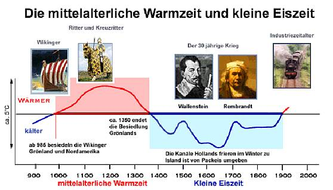
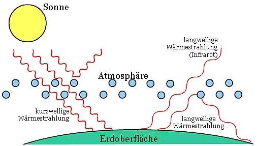
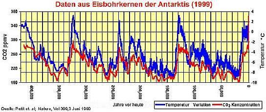
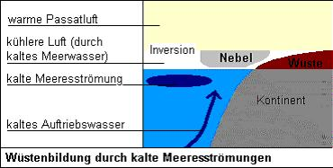

[🠔 Zur Übersicht: Klimaschwindel TV](7video.md)  
# Der Globale Klimawandel
**Klimakatastrophe und globale Erwärmung - menschengemacht und durch CO2? Eine Schulpräsentation von Marcel Ott und Anton Schönfeld**  
_von Marcel Ott und Anton Schönfeld_

### Marcel Ott und Anton Schönfeld

## Zusammenfassung einer Präsentation am Technischen Gymnasium der Handwerkerschule Chemnitz, Berufliches SchulZentrum für Technik II, Klasse: 07TG1 (11), Fach: Chemie/Bio im Schuljahr 2007/2008

Von den Autoren dankenswerterweise den Altbau und Denkmalpflege Informationen zur Veröffentlichung freigegeben. 

Anton Schönfeld und Marcel Ott 

**1. Was ist Klimawandel ?** 

**Begriffe** 

- Klima ist nicht dasselbe wie "Wetter" 
- Klima bezeichnet das Verhalten das Wetters über einen längeren Zeitraum (30 Jahre o.g.) 
- In das Klima fließen ein: 

- charakteristische Extremwerte (besondere Erscheinungen) 
- Häufigkeitsverteilungen u.a. der meteorologischen Größen (Druck, Bewölkung, Temperatur, Niederschlag) 

_Man spricht daher von einem Wandel, wenn es sich ändert._ 

**2. Klimawandel in der Vergangenheit** 

**Eiszeitalter und mehr (Begriffe)** 

Man spricht von einem Eiszeitalter, wenn Eis auf der Erde vorhanden ist (an den Polen und/oder Bergspitzen). 

Man spricht von einem Warmklima wenn die Erde komplett eisfrei ist. 

Eiszeitalter und Warmklimas beinhalten Warm- und Eiszeiten. 

Man spricht von einer Warmzeit, wenn die Jahresmitteltemperaturen deutlich höher sind (22°C). 

Man spricht von einer Eiszeit, wenn die Jahresmitteltemperaturen deutlich niedriger sind (12°C). 

Warm-/Eiszeiten beinhalten Warm-/Kaltperioden 

Eine Warmperiode ist eine Erwärmung. 
Eine Kaltperiode ist eine Abkühlung. 

**Übersicht der Eiszeitalter** 

Eine stabile Atmosphäre baute sich erst vor ca. 2 Mrd. Jahren auf. Dadurch erwärmte sich die Erde und beendete das Erste Eiszeitalter (EZA): 

1. EZA: "Archaisches Eiszeitalter" (vor 2,3 bis 2 Mrd. Jahre) 

Das 2. Eiszeitalter folgte ca. 1 Mrd Jahre später und vereiste dabei beide Pole. 

2. EZA: "Algonkisches Eiszeitalter" (vor 950 bis 750 Mio. Jahre) 

Das 3. Eiszeitalter wurde von 2 Eiszeiten durchzogen, welche die kältesten Zeiten überhaupt waren, die unser Planet erlebte. In dieser Zeit war die Erde so eingefroren, dass sie wie ein "Schneeball" aussah. Jedoch entstanden in dieser Zeit auch die ersten Lebenwesen in den Ozeanen. 

3. EZA: "Eokambrische Eiszeitalter" 
– "Sturtische Vereisung" (750 bis 700 Mio. Jahre) 
– "Varanger Vereisung" (620 bis 580 Mio. Jahre) 

Das 4. und 5. Eiszeitalter war relativ unspektakulär. Sie waren nicht so stark wie die Eiszeitalter davor und man kann auch nicht ganz genau ihr Ende bestimmen, da noch einiges unklar ist. 

4. EZA: "Silur- Ordivizisches Eiszeitalter" (vor 440 Mio. Jahren) 
5. EZA: "Permkarbonische Eiszeitalter" ( vor 280 Mio. Jahren) 

Das 6. Eiszeitalter, in welchem wir auch heute noch leben, ist das Eiszeitalter, von dem man das meiste weiß. Jedoch macht dies auch nur ¼ des gesamten aus, von daher ist man noch lange nicht mit dem Erforschen der Vergangenheit fertig. 

6. EZA: "Quartäres Eiszeitalter" (Beginn vor 2,3 Mio. Jahre) 

Letzter Wechsel zwischen einer Kalt- und Warmzeit 

Vor 11.000 Jahren wurde der letzte Wechsel einer Kalt- auf eine Warmzeit datiert. Der Wechsel verlief dabei im Vergleich zu anderen relativ kurz (über 1000 Jahre). Aber warum dieser Wechsel? Haben die Menschen zu viele Feuer gezündet und haben so mehr CO2 ausgestoßen? Dies scheint relativ unlogisch, da dieser Wechsel andere Ursachen hat. 

Zwischen 16.000 und 10.000 Jahren stieg der CO2-Gehalt (in der Atmosphäre) von 180 ppm/m³ auf 260 ppm/m³. ppm meint dabei den Anteil pro einer Million (part per million) und ist in Prozent 0,018% zu 0,026%. 

Dieser Anstieg lässt sich so erklären: 

Ozeane können, wenn es kalt ist, mehr CO2 speichern und mehr aus der Luft aufnehmen. Wenn es nun wärmer wird, geben sie das CO2 ab und können auch weniger CO2 aus der Luft aufnehmen. Es verbleibt so mehr CO2 in der Atmosphäre. 

Da es wärmer wurde, stieg nun auch der Anteil von CO2 in der Atmosphäre. Die Erhöhung der Temperatur lässt sich anders erklären: 

Eine erhöhte Sonnenaktivität (genannt: Sonnenflecken) bewirkt, dass Wasser verdampft und in der Atmossphäre so langwellige IR-Strahlung (Wärmestrahlung der Sonne) reflektiert. Es kommt zu einer Temperaturerhöhung. 

Der CO2-Gehalt stieg durch eine Erwärmung und verursachte sie nicht. 

**Klimawandel der letzten 2000 Jahre** 

– 600 bis 200 v. Chr. Kaltperiode 
– 200 v. Chr. bis 600 n. Chr. römische Warmperiode 
– 600 bis 900 Kaltperiode des frühen Mittelalter 
– 900 bis 1350 Warmperiode des späten Mittelalter 
– 1350 bis 1850 Kaltperiode, kleine Eiszeit 
– 1850 bis heute Warmperiode 

Wenn man sich diese Übersicht anschaut, so erkennt man, dass es einen Wechsel zwischen einer Warm- und Kaltperiode ungefähr aller 400 Jahre ergibt. Diese Zahl ist dabei ein Durchschnittswert, da es auch Zeiten gab, die länger als 400 Jahre waren (800 Jahre die römische Wärmeperiode), als auch kürzere Zeiten gab (300 Jahre Kaltperiode des frühen Mittelalters). Dieser Wechsel lässt sich durch die verschiedenen und sich wiederholenden Zyklen der Sonnenaktivitäten erklären. 

**Die Mittelalterliche Warmperiode** 

Die Mittelalterliche Warmperiode dauerte von 900 bis 1350 n. Chr. Dabei hatte sie ihren Höhepunkt von 1100 bis 1250 n. Chr., soll heißen, dass sie in dieser Zeit 4° höhere Temperaturen hatte als heute. Allgemein waren die Temperaturen im Durchschnitt 2°-4° wärmer als heute. 
Dies läst sich durch folgendes Beispiel beweisen: 

In England wurde Wein angebaut. Wie jeder weiß, ist ein Weinanbau nur in Regionen möglich, wo ein mild-warmes Wetter vorherrscht. Heute ist die Weinbaugrenze viel weiter südlich in der Mitte von Frankreich, da es heute kälter ist. 

Es wurden gefundene Eichen in Island in dieser Zeit nachgewiesen (anhand von Jahresringen). Eichen gibt es auch nur in wärmeren Gebieten und heute gibt es in Island keine Eichen mehr, da das Wetter einfach zu ungünstig dafür ist. Auch wurde in Island Weizen und Gerste angebaut, welche ebenfalls heute nicht mehr dort angebaut werden können. 

**"Die kleine Eiszeit"** 

Die "kleine Eiszeit" dauerte von 1350 bis 1850 n. Chr. Dabei hatte sie ihren Höhepunkt von 1600 bis 1700 n. Chr., soll heißen, dass sie in dieser Zeit 5° niedrigere Temperaturen hatte, als heute. Allgemein waren die Temperaturen im Durchschnitt 2-5 °C kälter als heute. 

Das Wetter war nicht allgemein sehr kalt. Eher wechselhaft, kühl und regnerisch. Die Winter waren sehr, sehr hart (so stark, dass z.B. die Ostsee einfror und man mit einer Kutsche über sie nach Dänemark kommen konnte. Das zeigen die vielen Malerein aus dieser Zeit) und die Sommer waren eher kühl und sehr regnerisch. 

Die Kleine Eiszeit wurde in der Mittelalterlichen Warmperiode 1342 von einer Hochwasserkatastrophe "angekündigt". Die Folge dieser Katastrophe war eine große Hungersnot. Das schlimmere Übel jedoch waren Seuchen, die durch die Katastrophe hervorgerufen und durch das Wetter verstärkt wurden, da das kalte Wetter die Erreger der Seuchen weniger schädigten, als ein wärmeres Wetter. Eine Seuche, welche dem Namen "Die Pest" trägt, tötete dadurch 40% der europäischen Bevölkerung. 

In der Mitte des 17. Jahrhundert rückten die Eismassen der Alpen wieder vor. Zudem haben die folgenden naßkalten Sommer der nächsten Jahre (bis 1820) die Ernten von Getreide von Kartoffeln öfter verfaulen lassen. Die Menschen hungerten daher sehr. Man nimmt daher das Wetter dieser Jahre auch als eine der Ursachen für die Revolution, da die Bevölkerung sehr unzufrieden dadurch war. 

 
Quelle: Ernst-Georg Beck: [Wissenschaftliche Fakten zur Atmosphäre, Strahlung, CO2, Wetter, Klima, Thermodynamik](http://www.zum.de/Faecher/Materialien/beck/13/bs13-73.htm) 

**Fazit** 

- Wir befinden uns derzeit in einer Warmzeit, welche sich im Quartären Eiszeitalter befindet. 
- Warm- und Kaltperioden wechseln ca. alle 400 Jahre. 
- Vor unserer heutigen Zeit gab es schon Klimawandel. 
- Es gab Zeiten, wo das Klima wärmer oder kälter war. 

**3. Klimawandel in der Gegenwart** 

**Was ist der Treibhauseffekt?** 

Der Treibhauseffekt ist nach der gängigen Theorie ein Vorgang in unserer Atmosphäre, der zu einer Erwärmung der Atmosphäre führen soll und somit die Erde warm hält. Die Treibhausgase reflektieren demnach auch die Wärmstrahlung der Sonne und erwärmen so die Erde. Ohne den angenommenen Treibhauseffekt würde demnach unser Planet eine Durchschnittstemperatur von –17 °C haben. So wäre kein Leben auf der Erde möglich. 

 
Quelle: Welthungerhilfe: [Der Treibhauseffekt - kurz und knapp erklärt](http://www.welthungerhilfe.de/treibhauseffekt-erklaerung.html) 

Treibhausgase sind nach der gängigen Theorie z.B.: 

- Wasserdampf H2O 
- Kohlenstoffdioxid CO2 
- Distickstoffmonoxid N2O 
- Methan CH4 
- Fluorchlorkohlenwasserstoffe FCKW 
- Ozon O3 

Dies sollen die für den Treibhauseffekt maßgeblichen Treibhausgase sein. Stimmt das? Warum beispielsweise Kohlenstoffdioxid den Treibhauseffekt nicht verstärkt, erfahren Sie nachfolgend. 

Was bewirkt CO2 wirklich? 

Wenn Kohlenstoffdioxid Wärmestrahlung wirklich so reflektieren würde, dass sich die Erde erwärmt, müsste es eine CO2 Hülle geben, wie wir heute eine Lufthülle haben. Da CO2 aber schwerer als Luft ist, kann CO2 nicht als Hauptgas in der Atmosphäre existieren. Da es eben schwerer als Luft ist, bleibt CO2 am Erdboden. Bestes Beispiel dafür ist der Vorfall des Lake Nyos in Kamerun 1986. 

_"Lake Nyos ist ein Maarsee. Das Wasser in dem schlauchförmig in die Tiefe reichenden ehemaligen Vulkanschlot ist sehr, sehr tief. Die geometrische Form des Wasserkörpers behindert eine Wasserzirkulation im See und fördert eine stabile Wasserschichtung. 

Im Untergrund liegt bis heute eine Magmakammer, aus der Kohlendioxid (CO2) entweicht. Dieses Gas gelangt auch in die tiefen Wasserschichten des Sees, wo es sich im Wasser löst. DasCO2-haltige Wasser ist etwas dichter als normales Wasser im oberen Bereich des Sees und der Druck der darüber lastenden Wassersäule hält das Gas in Lösung - eine für lange Zeit stabile Situation. 

Was die Katastrophe auslöste, kann man bis heute nur vermuten. Möglicherweise störte ein Erdrutsch im See das Gleichgewicht. Jedenfalls gelangte CO2-gesättigtes Tiefenwasser weiter nach oben, Blasen bildeten sich, strebten nach oben, rissen weiteres Wasser mit sich, das nun auch aufschäumte... Ein sich selbst verstärkender Prozeß der Kohlendioxid-Freisetzung kam in Gang, der so lange anhielt, bis Druckausgleich erreicht war. 

CO2 ist dichter als Luft, so daß es sich nur langsam mit Luft mischt und statt dessen am Boden entlang hangabwärts strömt. Das tat die schätzungsweise einen Kubikkilometer umfassende CO2-Wolke am Lake Nyos ebenfalls. Das CO2 folgte dem Verlauf zweier Flußtälern, in denen zahlreiche Dörfer und Siedlungen lagen. Dort erstickten 1700 Menschen und 3000 Stück Vieh."_ 

Quelle: http://141.84.51.10/palmuc/sammlung_geologie/seiten/museum/geoforum/vulkan/LakeNyos.html 

Es ist also nicht möglich, dass CO2 in der Atmosphäre als Haupt-Gas Wärmestrahlung reflektiert. Jedoch ignorieren Klimatologen weiterhin Kritiker, welche auch Klimatologen sind. 

Wasserdampf absorbiert ca. 62% der Infrarotstrahlen, wird aber wegen starken Schwankungen in Klimamodellen ignoriert, da er sich nicht in einem Modell korrekt anzeigen lässt. Zwei Drittel des Treibhauseffektes wird dabei unbeachtet gelassen! 

Zum zweiten gelangen nur 3% des Kohlendioxids in der Atmossphäre durch menschliche Einflüsse in die Atmosphäre. Die restlichen 97% stammen aus natürlichen Quellen (verdunstendes Meereswasser, verrottende organische Materie, Atmung von Pflanzen und Tieren). 

 
Aus: Ernst-Georg Beck: [Wissenschaftliche Fakten zur Atmosphäre, Strahlung, CO2, Wetter, Klima, Thermodynamik](http://www.zum.de/Faecher/Materialien/beck/13/bs13-73.htm) 

Eisbohrungen in der Antarktis haben auch bewiesen, dass Kohlenstoffdioxid immer einer Temperaturerhöhung folgen. Man merkt, das erst die blaue Kurve (Temperatur) steigt und wenig später (wobei man mit "wenig" hier durch die Einteilung ca. 1000 Jahre meint) die Kohlenstoffdioxid-Konzentration steigt. Warum es so lange dauert ist einfach zu sagen. Die Ozeane geben ja bei einer Erwärmung mehr CO2 ab. Da aber unser Planet zu ca. 2/3 aus Ozeanen/Meeren, eben Wasser besteht, dauert es seine Jahre, bis es sich stark genug erwärmt hat um CO2 abzugeben. (Dies kann eben durch die große Menge bis zu 1000 Jahre dauern, wenn nicht sogar mehr.) 

**Viel CO 2 hat auch Vorteile** 

Alle Pflanzen benötigen Kohlenstoffdioxid zur Photosynthese, um so Sauerstoff herstellen zu können. Dabei ist Kohlenstoffdioxid auch die einzige Kohlenstoffquelle, woraus sie ihre Energie beziehen können. Wenn eben eine höhere CO2-Konzentration in unserer Atmossphäre ist, so können die Pflanzen schneller wachsen. Die derzeitige Konzentration liegt bei 0,037%. In Gewächshäusern wird mithilfe von Gasflaschen CO2 zugegeben, um so einen 0.2% Anteil zu erreichen, welcher eine optimale Konzetration darstellt. Jedoch ist mehr als 0,2% CO2 in der Luft schädlich für Pflanzen (ab ca. 0,23%). Da aber dann auch die Pflanzen durch mehr CO2 in der Luft schneller wachsen kann sich auch so der Ertrag von Ernten steigern.Mehr CO2 bedeutet auch einen messbar geringeren Wasserbedarf der Pflanzen. So ist ein erweiterter Anbau von Pflanzen in trockenen Gebieten möglich. 

**Was beeinflusst das Klima?** 

Es ist klar das der Motor des Erdklimas die Sonne ist. Sie liefert die Energie, die von der Atmosphäre und Erdoberfläche aufgenommen und durch Winde und Meeresströmungen auf der Erde verteilt wird. 

Sonne: 

– Ihre kosmische Strahlung bestimmt den Wasserkreislauf, 
– beim Auftreffen auf die Erdatmosphäre beeinflusst die kosmische Strahlung auch die Wolkenbildung. 

Eine hohe Sonnenaktivität bewirkt, dass das Magnetfeld der Sonne wächst und kosmische Strahlung von der Erde weggelenkt wird. Jedoch verändert die Sonne sich, z. B. entwickeln sich periodisch Sonnenflecken (ca. 1500°C kälter als Umgebung). Dabei gilt: 

Je mehr Sonnenflecken, desto mehr ultraviolette Strahlung geht von der Sonne aus. Hinzu kommt, dass gewaltige Materie-Eruptionen elektrisch geladene Teilchen zur Erde schleudern. 

Wissenschaftler meinen, dass Schwankungen der Sonnenhelligkeit zu gering seinen, um starken Einfluss auf die Erde zu haben. Sie schließen jedoch nicht aus, dass die ultraviolette Strahlung der Sonne oder der Sonnenwind, ein Teilchenstrom (Materie-Eruptionen), das Klima beeinflussen könnten. 

Weitere Ursachen für Klimaveränderung: 

- sich ändernde Anzahl der Vulkanausbrüche (Vulkane speien Aerosole aus, die das Sonnenlicht reflektieren und somit kühlend wirken) 
- sich ändernde Meeresströmungen (Wüstenbildung durch kalte Meeresströmung, denn diese verhindert die Entwicklung von Regenwolken) 

 
Quelle: Ernst-Georg Beck: [Wissenschaftliche Fakten zur Atmosphäre, Strahlung, CO2, Wetter, Klima, Thermodynamik](http://www.zum.de/Faecher/Materialien/beck/13/bs13-73.htm) 

**4. Blick in die Zukunft** 

**Fazit des Gesamten** 

- Der Klimawandel ist natürlich. 
- Das Klima ändert sich ohne den Menschen. 
- CO2 hat keinen Einfluss auf das Klima. 
- Wichtigkeit des CO2 wird nebensächlich. 
- Der Mensch trägt keine Schuld. 
- Genauer Einfluss ist (noch) nicht geklärt! 

→ Es wird diskutiert → bisher ohne überzeugendes Ergebnis! 

Die Zukunft ist leider ungewiss, da sich die Forscher immer noch darüber streiten, was kommen mag in den nächsten Jahren. Viele rechnen mit einer Erwärmung. Jedoch ist es möglich, dass uns auch eine Abkühlung bevorsteht. Anhand dieser geteilten Meinungen ist es uns in dieser Präsentation nicht möglich, genau zu sagen was kommen wird. Die Streitereien der Forscher gehen ja selbst soweit, dass sie schon Wetten untereinander anehmen, um zu sehen, was 2011 sich nun bewahrheitet. Wer es mitverfolgen will, sollte in diesem Jahr besonders gut zuhören. Jedoch auch kritisch zuhören, da sich nur einem klugem Verstand in dieser Zeit die Wahrheit offenbaren kann. 

Aber es gibt auch positiven Seiten der gesamten Panikmache" durch CO2: 

Die "Panikmache" bewirkt einen vernünftigeren Umgang mit immer teurer werdenden Energieträgern. Man nimmt öfters das Fahrad und spart so Benzin. Dies ist nur ein Beispiel, aber das, was wir am Ende unserer Präsentation anbringen wollen, ist, dass jeder eines erkennt: 

Der Mensch muss verantwortungsvoll leben, da er von der Natur abhängig ist! 

Denn die Natur kann ohne den Menschen existieren. Jedoch der Mensch nicht ohne die Natur. Wer das verstanden hat (und das denkt man, weiß jeder), weiß auch die Natur zu schätzen. 

**Quellen** 

[www.konrad-fischer-info.de/7klima.htm](7klima.md) 
[www.zum.de/Faecher/Materialien/beck/13/bs13-73.htm](http://www.zum.de/Faecher/Materialien/beck/13/bs13-73.htm) 
[formel-dino.de/proterozoikum.htm](http://formel-dino.de/proterozoikum.htm) 
[141.84.51.10/palmuc/sammlung_geologie/seiten/museum/geoforum/vulkan/LakeNyos.html](http://141.84.51.10/palmuc/sammlung_geologie/seiten/museum/geoforum/vulkan/LakeNyos.html) 
[alles-schallundrauch.blogspot.com/2007/12/der-zyklus-der-sonne-steuert-das-klima.html](http://alles-schallundrauch.blogspot.com/2007/12/der-zyklus-der-sonne-steuert-das-klima.html) [www.deutsches-museum.de/dmznt/klima/klimawandel/naturundklima/sonne/index.html](http://www.deutsches-museum.de/dmznt/klima/klimawandel/naturundklima/sonne/index.html) 
[www.steinkohle-portal.de/content.php?id=330](http://www.steinkohle-portal.de/content.php?id=330) 
[www.sven-feddersen.de/klima.htm](http://www.sven-feddersen.de/klima.htm) 
[www.konrad-fischer-info.de/7wdvs04.htm](7wdvs04.md) 
[www.innovations-report.de/html/berichte/geowissenschaften/bericht-31964.html](http://www.innovations-report.de/html/berichte/geowissenschaften/bericht-31964.html) 
[www.konrad-fischer-info.de/7argus.htm](7argus.md) 
[www.focus.de/wissen/wissenschaft/klima/frage-von-w-knoblauch_aid_56527.html](http://www.focus.de/wissen/wissenschaft/klima/frage-von-w-knoblauch_aid_56527.html) 
[www.liberalismus-portal.de/klimawandel.htm](http://www.liberalismus-portal.de/klimawandel.htm) 
[www.welt.de/wissenschaft/article1020783/Sonne_traegt_keine_Schuld_am_Klimawandel.html](http://www.welt.de/wissenschaft/article1020783/Sonne_traegt_keine_Schuld_am_Klimawandel.html) 
[www.umweltbundesamt.de/klimaschutz/klimaaenderungen/faq/skeptiker.htm](http://www.umweltbundesamt.de/themen/klima-energie/klimawandel/haeufige-fragen-klimawandel) [www.stern.de/wissenschaft/natur/:Klimawandel-Die-Sonne-Statist/581145.html](http://www.stern.de/wissenschaft/natur/:Klimawandel-Die-Sonne-Statist/581145.html) 
[www.astronews.com/frag/antworten/frage314.html](http://www.astronews.com/frag/antworten/frage314.html) 
[www.3sat.de/3sat.php?http://www.3sat.de/nano/astuecke/108880/index.html](http://www.3sat.de/3sat.php?http://www.3sat.de/nano/astuecke/108880/index.html) 
[www.nosa.de/projekte/downloads/vereisungszyklen.pdf](http://www.nosa.de/projekte/downloads/vereisungszyklen.pdf) 
[www.netzeitung.de/spezial/klimawandel/440257.html](http://www.netzeitung.de/spezial/klimawandel/440257.html) 
[www.m-forkel.de/klima/atacama.html](http://www.m-forkel.de/klima/atacama.html) 
[www.kirikou.com/chile/chile.htm](http://www.kirikou.com/chile/chile.htm) 
[www.geocraft.com/WVFossils/greenhouse_data.html](http://www.geocraft.com/WVFossils/greenhouse_data.html) 

**Die Autoren** 

Marcel Ott 
Wittgensdorfer Str. 19 
09114 Chemnitz 
[Email](mailto:ottmarcel@web.de) 

Anton Schönfeld 
Albrecht-Thaer-Straße 8 
09117 Chemnitz 

Schule: 

BSZ für Technik II 
Schloßstraße 3 
09111 Chemnitz 
Klasse: 07TG1 (11) 
Fach: Chemie/Bio 

---

Langversion der Präsentation: 

Der Globale Klimawandel 

Von Anton Schönfeld und Marcel Ott 

1. Was ist Klimawandel ? 

Begriffe 

- Klima ist nicht dasselbe wie "Wetter" 
- Klima bezeichnet das Verhalten das Wetters über einen längeren Zeitraum (30 Jahre o.g.) 
- In das Klima fließen ein: 
- charakteristische Extremwerte (besondere Erscheinungen) 
- Häufigkeitsverteilungen u.a. der meteorologischen Größen (Druck, Bewölkung, Temperatur, Niederschlag) 

Man spricht daher von einem Wandel, wenn es sich ändert. 

2. Klimawandel in der Vergangenheit 

Eiszeitalter und mehr (Begriffe) 

Man spricht von einem Eiszeitalter, wenn Eis auf der Erde vorhanden ist (an den Polen und/oder Bergspitzen). 

Man spricht von einem Warmklima, wenn die Erde komplett eisfrei ist. 

Eiszeitalter und Warmklimata beinhalten Warm- und Eiszeiten 

Man spricht von einer Warmzeit, wenn die Jahresmitteltemperaturen deutlich höher sind (22 °C). 

Man spricht von einer Eiszeit, wenn die Jahresmitteltemperaturen deutlich niedriger sind (12 °C). 

Warm-/Eiszeiten beinhalten Warm-/Kaltperioden 

Eine Warmperiode ist eine Erwärmung. 
Eine Kaltperiode ist eine Abkühlung. 

Übersicht der Eiszeitalter 

Eine stabile Atmosphäre baute sich erst vor ca. 2 Mrd. Jahren auf. Dadurch erwärmte sich die Erde und beendete das erste Eiszeitalter: 

1. EZA: "Archaisches Eiszeitalter" (vor 2,3 bis 2 Mrd. Jahre) 

Das 2. Eiszeitalter folgte ca. 1 Mrd. Jahre später und vereiste dabei beide Pole. 

2. EZA: "Algonkisches Eiszeitalter" (vor 950 bis 750 Mio. Jahre) 

Das 3. Eiszeitalter wurde von 2 Eiszeiten durchzogen, welche die kältesten Zeiten überhaupt waren, die unser Planet erlebte. In dieser Zeit war die Erde so eingefroren, dass sie wie ein "Schneeball" aussah. Jedoch entstanden in dieser Zeit auch die ersten Lebewesen in den Ozeanen. 

3. EZA: "Eokambrische Eiszeitalter" 
– "Sturtische Vereisung" (750 bis 700 Mio. Jahre) 
– "Varanger Vereisung" (620 bis 580 Mio. Jahre) 

Das 4. und 5. Eiszeitalter war relativ unspektakulär. Sie waren nicht so stark wie die Eiszeitalter davor und man kann auch nicht ganz genau ihr Ende bestimmen, da noch einiges unklar ist. 

4. EZA: "Silur- Ordivizisches Eiszeitalter" (vor 440 Mio. Jahren) 
5. EZA: "Permkarbonische Eiszeitalter" ( vor 280 Mio. Jahren) 

Das 6. Eiszeitalter, in welchem wir auch heute noch leben, ist das Eiszeitalter, von dem man das meiste weiß. Jedoch macht dies auch nur ¼ des gesamten aus, von daher ist man noch lange nicht mit dem Erforschen der Vergangenheit fertig. 

6. EZA: "Quartäres Eiszeitalter" (Beginn vor 2,3 Mio. Jahre) 

Letzter Wechsel zwischen einer Kalt- und Warmzeit 

Vor 11.000 Jahren wurde der letzte Wechsel einer Kalt- auf eine Warmzeit datiert. Der Wechsel verlief dabei im Vergleich zu anderen relativ kurz (über 1000 Jahre). Aber warum dieser Wechsel? Haben die Menschen zu viele Feuer gezündet und haben so mehr CO2 ausgestoßen? Dies scheint relativ unlogisch, da dieser Wechsel andere Ursachen hat. 

Zwischen 16.000 und 10.000 Jahren stieg der CO2 Gehalt (in der Atmosphäre) von 180 ppm/m³ auf 260 ppm/m³. ppm meint dabei den Anteil pro einer Million (part per million) und ist in Prozent 0,018% zu 0,026%. 

Dieser Anstieg lässt sich so erklären: 

Ozeane können, wenn es kalt ist, mehr CO2 speichern und mehr aus der Luft aufnehmen. Wenn es nun wärmer wird, geben sie das CO2 ab und können auch weniger CO2 aus der Luft aufnehmen. Es verbleibt so mehr in der Atmosphäre. Da es wärmer wurde, stieg nun auch der Anteil von CO2 in der Atmosphäre. 

Die Erhöhung der Temperatur lässt sich anders erklären: 

Eine erhöhte Sonnenaktivität (genannt: Sonnenflecken) bewirkt, dass Wasser verdampft und in der Atmosphäre so langwellige IR-Strahlung (Wärmestrahlung der Sonne) reflektiert. Es kommt zu einer Temperaturerhöhung. 

Der CO2-Gehalt stieg durch eine Erwärmung und verursachte sie nicht. 

Dann war noch eine Zeit, genannt "Atlantikum", in welcher die Warmzeit ihren Höhepunkt überschritten hatte und so in dieser Zeit sich erste Hochkulturen in Ägypten und Mesopotamien entwickelten. 

Klimawandel der letzten 2000 Jahre 

– 600 bis 200 v. Chr. Kaltperiode 
– 200 v. Chr. bis 600 n. Chr. römische Warmperiode 
– 600 bis 900 Kaltperiode des frühen Mittelalter 
– 900 bis 1350 Warmperiode des späten Mittelalter 
– 1350 bis 1850 Kaltperiode, kleine Eiszeit 
– 1850 bis heute Warmperiode 

Wenn man sich diese Übersicht anschaut, so erkennt man, dass es einen Wechsel zwischen einer Warm- und Kaltperiode ungefähr aller 400 Jahre ergibt. Diese Zahl ist dabei ein Durchschnittswert, da es auch Zeiten gab, die länger als 400 Jahre waren (800 Jahre die römische Wärmeperiode) und auch kürzere Zeiten (300 Jahre Kaltperiode des frühen Mittelalters). 

Dieser Wechsel lässt sich durch die verschiedenen und sich wiederholenden Zyklen der Sonnen erklären. 

Die Mittelalterliche Warmperiode 

Die Mittelalterliche Warmperiode dauerte von 900 bis 1350 n. Chr. Dabei hatte sie ihren Höhepunkt von 1100 bis 1250 n. Chr., soll heißen, dass sie in dieser Zeit 4° höhere Temperaturen hatte als heute. Allgemein waren die Temperaturen im Durchschnitt 2-4 °C wärmer als heute. Dies läst sich durch folgende Beispiele beweisen: 

Grönland wurde 985 n. Chr. durch die Wikinger besiedelt. Da Grönland heute eine Eislandschaft ist und nur schwer durch Schiffe zu erreichen, muss es damals so warm gewesen sein, dass die Wikinger mit ihren Schiffen zur Insel konnten. Die Wikinger gaben der Insel auch ihren Namen. Grönland bedeutet "Grünes Land" und lässt darauf schließen, dass die Insel damals fruchtbares Land war. 

Das Packeis zog sich weiter nach Norden zurück, da es bei einer warmen Temperatur weniger wurde und so zurück zu den Polen trieb. 

In England und Grönland wurde Wein angebaut. Wie jeder weiß, ist ein Weinanbau nur in Regionen möglich, in denen ein mild-warmes Wetter vorherscht. Heute ist die Weinbaugrenze viel weiter südlich in der Mitte von Frankreich, da es heute kälter ist. 

Es wurden gefundene Eichen in Island in dieser Zeit nachgewiesen (anhand von Jahresringen). Eichen gibt es auch nur in wärmeren Gebieten. Heute gibt es in Island keine Eichen mehr, da das Wetter einfach zu ungünstig dafür ist. Auch wurde in Island Weizen und Gerste angebaut, welche ebenfalls heute nicht mehr dort angebaut werden können. 

"Die kleine Eiszeit" 

Die "kleine Eiszeit" dauerte von 1350 bis 1850 n. Chr. Dabei hatte sie ihren Höhepunkt von 1600 bis 1700 n. Chr., soll heißen, dass sie in dieser Zeit 5 °C niedrigere Temperaturen hatte als heute. Allgemein waren die Temperaturen im Durchschnitt 2-5 °C kälter als heute. 

Das Wetter war nicht allgemein sehr kalt. Eher wechselhaft, kühl und regnerisch. Die Winter waren sehr, sehr hart, dass z.B. die Ostsee einfror und man mit einer Kutsche über sie nach Dänemark kommen konnte. Das zeigen die vielen Malerein aus dieser Zeit. Die Sommer waren damals eher kühl und sehr regnerisch. 

Die Kleine Eiszeit wurde in der Mittelalterlichen Warmperiode 1342 von einer Hochwasserkatastrophe "angekündigt". Die Folge dieser Katastrophe waren eine große Hungersnot. Das schlimmere Übel jedoch waren Seuchen, die durch die Katastrophe hervorgerufen und durch das Wetter verstärkt wurden, da das kalte Wetter die Ereger der Seuchen weniger schädigten als ein wärmeres Wetter. Eine Seuche, welche dem Namen "Die Pest" trägt, tötete dadurch 40% der europäischen Bevölkerung. 

In der Mitte des 17. Jahrhundert rückten die Eismassen der Alpen wieder vor. Zudem haben die folgenden naßkalten Sommer der nächsten Jahre (bis 1820) die Ernten von Getreide und Kartoffeln öfter verfaulen lassen. Die Menschen hungerten daher sehr. Man vermutet daher das Wetter dieser Jahre auch als eine der Ursachen für die Revolution, da die Bevölkerung sehr unzufrieden dadurch war. 

Fazit 

Wir befinden uns derzeit in einer Warmzeit, welche sich im Quartären Eiszeitalter befindet. 
Warm- und Kaltperioden wechseln ca. alle 400 Jahre. 
Vor unserer heutigen Zeit gab es schon Klimawandel. 
Es gab Zeiten, in denen das Klima wärmer und kälter war. 

3. Klimawandel in der Gegenwart 

Was ist der Treibhauseffekt? 

Der Treibhauseffekt soll nach der Theorie ein Vorgang in unserer Atmosphäre sein, der zu einer Erwärmung der Atmosphäre führt und somit die Erde warm hält. Die Treibhausgase reflektieren demnach auch die von der Erdoberfläche aufgenommene und wieder abgegebene Wärmstrahlung der Sonne und sollen so die Erde erwärmen. Ohne den Treibhauseffekt würde der Planet angeblich eine Durchschnittstemperatur von – 17 °C haben. Somit wäre kein Leben auf der Erde möglich. 

Die Sonnenenergie gelangt als Infrarotstrahlung, sichtbares Licht und UV-Strahlung auf die Erde. Etwa ein Drittel wird wieder reflektiert: von der Atmosphäre ca. 25% und von der Erdoberfläche ca. 5 %. 

Die Atmosphäre und die Wolken schlucken ca. 25 %, so dass nur 45 % die Erdoberfläche erreichen. Mit aufsteigender Luft und mitgeführtem Wasserdampf gibt die Erde Energie wieder ab. Ein Teil der Infrarotstrahlung, die von der Erde zurückgeworfen wird, verschwindet im Weltraum. Ein großer Teil soll aber von den Treibhausgasen abgefangen und wieder zurückgestrahlt werden. Auch von der "isolierenden" Treibhausschicht gelangt Wärme in den Weltraum. Den größten Teil strahlt sie nach der Treibhaustheorie jedoch zur Erdoberfläche zurück, was zur Erwärmung der Troposphäre beiträgt. 

 
Quelle: Welthungerhilfe: [Der Treibhauseffekt - kurz und knapp erklärt](http://www.welthungerhilfe.de/treibhauseffekt-erklaerung.html) 

Treibhausgase sind z.B.: 

- Wasserdampf H2O 
- Kohlenstoffdioxid CO2 
- Distickstoffmonoxid N2O 
- Methan CH4 
- Fluorchlorkohlenwasserstoffe FCKW 
- Ozon O3 

Als Treibhausgase versteht man Gase, die bei der Nutzung fossiler Brennstoffe (Kohle, Erdöl) in die Umwelt abgegeben werden. Sie absorbieren die Sonnenenergie, die von der Erde in Form von Infrarotstrahlen reflektiert wird, und sollen so die Atmosphäre aufheizen. Dies sind zwar Treibhausgase, da sie in der Atmosphäre vorhanden sind, jedoch nehmen einige Gase davon wenig bis gar keinen verstärkten Einfluss auf den Treibhauseffekt, da manche eine zu geringe Konzentration haben, um überhaupt Strahlung zurückwerfen zu können. Warum Kohlenstoffdioxid den Treibhauseffekt jedoch nicht verstärkt, erfahren Sie nachfolgend. 

Was bewirkt CO2 wirklich? 

Man stelle sich also die aus Gasen bestehende Atmosphäre der Erde als eine Glashülle vor, die nur die Hitze der Sonne hineinlässt und fast nichts wieder heraus.Wenn Kohlenstoffdioxid Wärmestrahlung wirklich so reflektieren würde, dass sich die Erde erwärmt, müsste es eine entsprechend dichte CO2-Hülle geben, wie es eine Glashülle wäre. Da CO2 aber schwerer als Luft ist, kann CO2 nicht als als dicht geschlossene Schicht oben in der Atmosphäre existieren. Da es schwerer als Luft ist, bleibt CO2 trotz aller Durchmischungsvorgänge vorzugsweise am Erdboden. Bestes Beispiel dafür ist der Vorfall des Lake Nyos in Kamerun 1986. 

_"Lake Nyos ist ein Maarsee. Das Wasser in dem schlauchförmig in die Tiefe reichenden ehemaligen Vulkanschlot ist sehr, sehr tief. Die geometrische Form des Wasserkörpers behindert eine Wasserzirkulation im See und fördert eine stabile Wasserschichtung. Im Untergrund liegt bis heute eine Magmakammer, aus der Kohlendioxid (CO2) entweicht. Dieses Gas gelangt auch in die tiefen Wasserschichten des Sees, wo es sich im Wasser löst. Das CO2-haltige Wasser ist etwas dichter als normales Wasser im oberen Bereich des Sees und der Druck der darüber lastenden Wassersäule hält das Gas in Lösung - eine für lange Zeit stabile Situation. 

Was die Katastrophe auslöste, kann man bis heute nur vermuten. Möglicherweise störte ein Erdrutsch im See das Gleichgewicht. Jedenfalls gelangte CO2-gesättigtes Tiefenwasser weiter nach oben, Blasen bildeten sich, strebten nach oben, rissen weiteres Wasser mit sich, das nun auch aufschäumte ... Ein sich selbst verstärkender Prozeß der Kohlendioxid-Freisetzung kam in Gang, der so lange anhielt, bis Druckausgleich erreicht war. 

CO2 ist dichter als Luft, so daß es sich nur langsam mit Luft mischt und statt dessen am Boden entlang hangabwärts strömt. Das tat die schätzungsweise einen Kubikkilometer umfassende CO2-Wolke am Lake Nyos ebenfalls. Das CO2 folgte dem Verlauf zweier Flußtälern, in denen zahlreiche Dörfer und Siedlungen lagen. Dort erstickten 1700 Menschen und 3000 Stück Vieh."_ 

Quelle: [141.84.51.10/palmuc/sammlung_geologie/seiten/museum/geoforum/vulkan/LakeNyos.html](http://141.84.51.10/palmuc/sammlung_geologie/seiten/museum/geoforum/vulkan/LakeNyos.html) 

Es ist also nicht möglich, dass CO2 in der Atmosphäre als Haupt-Gas Wärmestrahlung reflektiert. 

Klimatologen behaupten trotzdem, dass die durch menschliche Aktivitäten freigesetzten Treibhausgase zum dominierenden Faktor im Klimageschehen geworden wären. Diese Aussage ist schon deshalb zweifelhaft, weil allein Wasserdampf etwa 62% der Infrarotstrahlen absorbiert, die die Sonne auf die Erde abstrahlt. Da der Wasserdampfgehalt der Atmosphäre stark schwankt, wird er in den Klimamodellen nicht berücksichtigt. Das bedeutet aber, dass ca. zwei Drittel des wasserdampfbedingten Treibhauseffektes unbeachtet gelassen werden, während dem restlichen Drittel ausschlaggebende Bedeutung zuerkannt wird. 

Nur ca. 3 % des Kohlendioxids gelangen durch menschliche Einflüsse in die Atmosphäre, die restlichen 97 % stammen aus natürlichen Quellen, wie verdunstendes Meereswasser, verrottende organische Materie und aus der Atmung von Pflanzen und Tieren. 

Vor allem CO2 wird als Klimakiller schlechthin gehandelt. Tatsächlich erwärmt sich aber die Erde seit ca. 450.000 Jahren immer mal wieder und mit ihr steigt auch die CO2- Konzentration in der Atmosphäre einige Jahren nach der Erwärmung. Da die Erde zu 2/3 aus Wasser besteht, dauert es eben auch lange, bis sich das Meer/die Ozeane genug erwärmt haben, um CO2 wieder abzugeben. Allerdings geschieht dies mit einigen Schwankungen und mit einer Periodendauer von ca.100.000 Jahren. Das zeigen allgemein anerkannte Bohrungen im antarktischen Eis und deren Analyse. 

 
Aus: Ernst-Georg Beck: [Wissenschaftliche Fakten zur Atmosphäre, Strahlung, CO2, Wetter, Klima, Thermodynamik](http://www.zum.de/Faecher/Materialien/beck/13/bs13-73.htm) 

Eisbohrungen in der Antarktis haben auch bewiesen, dass der Anstieg der Kohlenstoffdioxid-Konzentration in der Luft immer einer Temperaturerhöhung folgte. Man merkt, dass erst die blaue Kurve (Temperatur) steigt und wenig später (wobei man mit "wenig" hier durch die Einteilung ca. 1000 Jahre meint) die Kohlenstoffdioxid-Konzentration steigt. Warum es so lange dauert, ist einfach zu sagen. Die Ozeane geben ja bei einer Erwärmung mehr CO2 ab. Da aber unser Planet zu ca. 2/3 aus Ozeanen/Meeren, eben Wasser besteht, dauert es seine Jahre, bis es sich stark genug erwärmt hat, um CO2 abzugeben. (Dies kann eben durch die große Menge bis zu 1000 Jahre dauern, wenn nicht sogar mehr.) 

Viel CO2 hat auch Vorteile 

Alle Pflanzen benötigen Kohlenstoffdioxid zur Photosynthese, um so Sauerstoff herstellen zu können. Dabei ist Kohlenstoffdioxid auch die einzige Kohlenstoffquelle, woraus sie ihre Energie beziehen können. Wenn eben eine höhere CO2-Konzentration in unserer Atmossphäre ist, so können die Pflanzen schneller wachsen. Die derzeitige Konzentration liegt bei 0,037 %. In Gewächshäusern wird mithilfe von Gasflaschen CO2 zugegeben, um so einen 0,2 %-Anteil zu erreichen, welcher eine optimale Konzetration darstellt. Jedoch ist mehr als 0,2 % CO2 in der Luft schädlich für Pflanzen (ab ca. 0,23 %). Da aber dann auch die Pflanzen durch mehr CO2 in der Luft schneller wachsen können, kann sich so der Ertrag von Ernten steigern. 

Was beeinflusst das Klima? 

Eines ist klar: Motor des Erdklimas ist die Sonne. Sie liefert die Energie, die von Atmosphäre und Erdoberfläche aufgenommen und durch Winde und Meeresströmungen auf der Erde verteilt wird. 

Die kosmische Strahlung bestimmt den Wasserkreislauf auf der Erde. Beim Auftreffen auf die Erdatmosphäre beeinflusst sie die Wolkenbildung. Wolken schirmen die Erde vor der Sonnenwärme ab, indem sie die thermische Energie ins Weltall zurückstrahlen. Umgekehrt bilden sich bei geringer kosmischer Strahlung weniger Wolken, die Sonne kann die Erde erwärmen. Bei höherer Sonnenaktivität wächst auch das Magnetfeld der Sonne und lenkt dadurch kosmische Strahlung von der Erde weg. Es treffen weniger kosmische Partikel auf die Erdatmosphäre, es entwickeln sich weniger Wolken und es wird wärmer 

Auch die Sonne verändert sich. Zum Beispiel entwickeln sich periodisch mehr oder weniger Sonnenflecken, die mit erhöhter Aktivität der Sonne einhergehen. Diese Sonnenflecken sind ca. um 1500 °Celsius kälter als ihre Umgebung. Parallel zur steigenden Anzahl der Sonnenflecken steigt auch die ultraviolette Strahlung, die von der Sonne zur Erde gesendet wird. 

Wissenschaftler haben herausgefunden, dass Schwankungen der Sonnenhelligkeit (abhängig von Anzahl der Sonnenflecken) zu gering seien, um das Erdklima stark zu beeinflussen. Sie schließen jedoch nicht aus, dass die ultraviolette Strahlung der Sonne oder der so genannte Sonnenwind, ein Teilchenstrom, das Erdklima beeinflussen könnten. Diese Phänomene seien jedoch bislang nicht weit genug erforscht, um ihre Auswirkungen auf das Klima zuverlässig in Modellen simulieren zu können. 

Weitere Ursachen für Klimaveränderung: 

- sich ändernde Anzahl der Vulkanausbrüche 
Vulkane können ein weiterer Einflussfaktor auf das Klima sein. Bei Vulkanausbrüchen speien sie mit ihrer Asche Aerosole aus, kleine Partikel, die das Sonnenlicht reflektieren und somit kühlend wirken. Ohne Vulkanaktivität fehlen die Aerosole und somit die Kühlung, die Erde wird wärmer. 

- sich ändernde Meeresströmungen (Wüstenbildung durch kalte Meeresströmung, denn diese verhindert die Entwicklung von Regenwolken) 
Kalte Meeresströmungen in Küstennähe haben den Effekt, dass die Entwicklung von Regenwolken verhindert wird. Durch die kalten Meeresströmungen und das kalte Auftriebswasser sind die wassernahen Luftschichten kühler als die restliche warme Passatluft, die darüber liegt. Man nennt das Inversion. Zwischen den zwei Luftmassen bildet sich eine Sperrschicht - es findet kein Austausch statt, denn die leichtere Warmluft liegt auf der schwereren Kaltluft. D.h. auch, dass es kein Aufsteigen der Luft gibt - und so auch keine Wolkenbildung mit Niederschlägen. In der kalten Meeresluft sammelt sich Dunst an, aus dem sich Nebel bildet, weil die Meeresluft feucht ist. Ein Beispiel wäre die Atacama Wüste in Nordchile. 

 
Nebelbildung in der Wüste Atacama, Quelle: [www.m-forkel.de/klima/atacama.html](http://www.m-forkel.de/klima/atacama.html) 

4. Blick in die Zukunft 

Fazit des Gesamten 

- Der Klimawandel ist natürlich 
- Das Klima ändert sich ohne den Menschen 
- CO2 hat keinen Einfluss auf das Klima 
- Wichtigkeit des CO2 wird nebensächlich 
- Der Mensch trägt keine Schuld 
- Genauer Einfluss ist (noch) nicht geklärt! 
→ Es wird diskutiert → bisher ohne überzeugendes Ergebnis! 

Die Zukunft ist leider ungewiss, da sich die Forscher immer noch darüber streiten, was kommen mag in den nächsten Jahren. Viele rechnen mit einer Erwärmung. Jedoch ist es möglich, dass uns auch eine Abkühlung bevorsteht. Anhand dieser geteilten Meinungen ist es uns in dieser Präsentation nicht möglich, genau zu sagen was kommen wird. Die Streiterein der Forscher gehen ja selbst soweit, dass sie schon Wetten untereinander anehmen, um zu sehen, was 2011 sich nun bewahrheitet. Wer es mitverfolgen will, sollte in diesem Jahr besonders gut zuhören. Jedoch auch kritisch zuhören, da sich nur einem klugem Verstand in dieser Zeit die Wahrheit offenbaren kann. 

Aber es gibt auch positiven Seiten der gesamten "Panikmache" durch CO2: 

Die "Panikmache" bewirkt einen vernünftigeren Umgang mit begrenzten Energieträgern. Man nimmt öfters das Fahrad und spart so Benzin. Dies ist nur ein Beispiel, aber das, was wir am Ende unserer Präsentation anbringen wollen ist es, dass jeder eines erkennt: 

Der Mensch muss verantwortungsvoll leben, da er von der Natur abhängig ist! Denn die Natur kann ohne den Menschen existieren. Jedoch der Mensch nicht ohne die Natur. Wer das verstanden hat (und das denkt man, weiß jeder), weiß auch die Natur zu schätzen.
