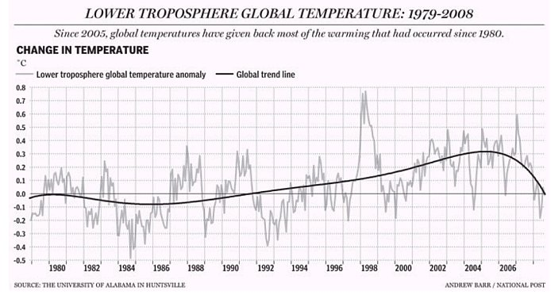

[🠔 Zur Übersicht: Klimaschwindel TV](7video.md)  
# Dr. Albrecht Glatzle: Kohlendioxydemissionen aus Land- und Viehwirtschaft: Sind sie klimaschädlich?
**Sind die CO2-Emissionen der Landwirtschaft und Viehwirtschaft tatsächlich klimaschädlich? Eine Widerlegung von Dr. Albrecht Glatzle, Paraguay**  
_von Dr. Albrecht Glatzle_

Dr. Albrecht Glatzle, [INTTAS](http://www.inttas.org/) 

## Kohlendioxydemissionen aus Land- und Viehwirtschaft

Sind sie klimaschädlich?

**_Ich halte die globale Erwärmung für viel weniger gefährlich, als die globale Verblödung!"_** (Lisa Fitz, Kabarettistin, in RTL 11.06.2007, 23.10: "Der Klimawandel - Alles Schwindel?" zum Thema Mißbrauch der Klimahysterie) 

**_"Die Klimakatastrophe ist die große Geschäftemacherei unserer Zeit."_** ([Matthias Horx](http://www.horx.com), Trend- und Zukunftsforscher) 

**_"Nie haben die Massen nach Wahrheit gedürstet. Von den Tatsachen, die ihnen mißfallen, wenden sie sich ab und ziehen es vor, den Irrtum zu vergöttern, wenn er sie zu verführen vermag. Wer sie zu täuschen versteht, wird leicht ihr Herr, wer sie aufzuklären sucht, stets ihr Opfer._** ([Gustave Le Bon: Psychologie der Massen](http://www.textlog.de/35465.html)) 

## Kohlendioxydemissionen aus Land- und Viehwirtschaft: 
Sind sie klimaschädlich?

Agrobiólogo diplomado, Dr. sc. agr. Albrecht Glatzle, [INTTAS - Iniciativa para la Investigación y Transferencia de Tecnología Agraria Sostenible](http://www.inttas.org/) 

### Einführung

Täglich liest man es in der Zeitung, hört es im Radio und sieht es im Fernsehen: Um das Weltklima vor katastrophaler Erwärmung zu retten, müssen wir weniger „klimaschädliches“ CO2 (Kohlendioxyd) produzieren. Politiker verabschieden Gesetze und unterzeichnen internationale Abkommen, die darauf abzielen, den CO2-Ausstoss zu verringern (mittels Kraftstoffsteuern, Emissionshöchstgrenzen für Autos und Industrie, Handel mit Emissionsrechten etc.). Entscheidungsträger aus Wirtschaft und Industrie versuchen, ihr Image in Sachen Umweltschutz aufzubessern, indem sie ihre Produktionsverfahren oder Produkte auf niedrige CO2-Werte umstellen. Institutionen, die den Trend der Zeit erkannt haben, lassen sich hinsichtlich ihrer CO2-Bilanz von offiziell anerkannten Zertifikatoren „Klimaneutralität“ bescheinigen, um auch weiterhin bei der Vergabe von öffentlichen oder privaten Forschungs- oder Projektmitteln bevorzugt berücksichtigt zu werden. Die Scheu vor dem „Klimakiller“ CO2 macht auch vor der Landwirtschaft nicht halt. In Industriestaaten wird aus Gründen des Klimaschutzes Werbung für lokal hergestellte Lebensmittel gemacht, die keine langen Transportwege hinter sich haben. Bald sollen alle Nahrungsmittel mit Etiketten gekennzeichnet werden, aus denen eine zertifizierte Abschätzung der „Umweltbelastung“ durch CO2 bei Herstellung und Vermarktung ersichtlich werden soll. Auch in Asunción ist schon eine Veranstaltung der FAO für nächstes Jahr geplant, bei der Wege zur Emissionsreduktion von so genannten Klimagasen in Land- und Viehwirtschaft diskutiert und wahrscheinlich auch die Idee neuer Steuern (z.B. CO2-Steuer bei Rodung oder Methansteuer bei Rinderhaltung) und verschärfter Vorschriften bei der Landnutzung sozialisiert werden soll. 

Der Weg zu diesen „Vorsorgemaßnahmen“ für das Klima der Zukunft (an denen deren Urheber schon in der Gegenwart ganz erheblich profitieren!!!) wurde vom Weltklimarat (IPCC) bereitet, ein von mächtigen Regierungen dieser Erde eingesetztes Gremium innerhalb des UN-Umweltprogramms UNEP, dessen erklärte Aufgabe es ist, den Stand der Forschungen zur angeblichen Klimaschädlichkeit menschlichen Handelns zusammenzustellen und Maßnahmen zu einem „wirksamen Klimaschutz“ vorzuschlagen. Die Funktionäre des IPCC sammelten in bisher 4 „Klimasachstandsberichten“ (von 1990, 1997, 2001 und 2007) Beiträge von rund 2500 Wissenschaftlern aller denkbaren Disziplinen, darunter natürlich auch echte Klimawissenschaftler. Diese wissenschaftlichen Beiträge wurden in hunderte von Seiten umfassenden technischen Berichten zusammengefasst, die sehr viele wertvolle und lesenswerte Informationen enthalten. Von Entscheidungsträgern in Politik und Wirtschaft gelesen wurde und wird jedoch ausschließlich der „Synthesis Report“, d.h. die „Summary for Policy Makers“ (SPM), die allein von IPCC-Funktionären verfasst und mit den Auftrag gebenden Regierungen abgestimmt wurde. Für die „Summary for Policy Makers“ wurden jedoch Informationen und Forschungsergebnisse der technischen IPCC-Berichte nur auf recht selektive Weise verwendet, so dass man kaum bestreiten kann, dass die Schlussfolgerungen des IPCC eher politischen als wissenschaftlichen Vorgaben folgten. Die zentrale Schlussfolgerung des letzten IPCC-Synthesis-Reports ist die, dass nur mit drastischen Maßnahmen zur Minderung anthropogener CO2-Emissionen eine katastrophale Klimaerwärmung von mehr als 2OC bis 2100 verhindert werden kann. 

Eine größere Gruppe unabhängiger und hochkarätiger Klimawissenschaftler um den ersten, mehrfach ausgezeichneten Direktor des „North American Weather Satellite Service“ Prof. Dr. Fred Singer herum, kam jedoch auf der Basis der Technischen IPCC-Berichte zu einer ganz anderen Schlussfolgerung, dass nämlich die Natur und nicht der Mensch das Klima bestimmt. Dieser so genannte NIPCC-Bericht wurde anlässlich einer internationalen Klimakonferenz in New York im März 2008 der Öffentlichkeit präsentiert ([Nature, Not Human Activity, Rules The Climate (pdf)](https://iehost.net/pdf/22835.pdf)). 

Wie die Wissenschaftsgeschichte schon oft gezeigt hat (bis in die heutige Zeit hinein!!!), folgen Naturerscheinungen glücklicherweise keinen Mehrheitsmeinungen und auch keinem politischen Konsens. Komplexe natürliche Vorgänge wie das tägliche Wetter und sein statistischer Mittelwert, das Klima, sind die Folge eines hoch komplizierten Zusammenspiels einer unüberschaubaren Anzahl von Einflussfaktoren, die sich nicht simulieren lassen und sich daher einer längerfristigen Prognose entziehen. Daher kann das Wetter nur auf einige wenige Tage hinaus mit einer gewissen Wahrscheinlichkeit vorhergesagt werden. Eine langfristige Vorhersage von Klimaänderungen ist blanker Unfug und nichts Weiteres als Ausdruck menschlichen Größenwahns. 

Im Folgenden will ich einige unbestrittene Eigenschaften des atmosphärischen Spurengases Kohlendioxyd (CO2) aufzählen, dann die im Kyoto-Protokoll vorgesehenen Maßnahmen zur CO2-Bindung durch Landnutzungsänderung kritisch beleuchten und schließlich mit wenigen griffigen Argumenten begründen, warum Kohlendioxyd auch in Sachen Klimawandel uneingeschränkten Freispruch verdient. 

### Eigenschaften und Dynamik des Kohlendioxyds

CO2 ist die chemische Grundlage allen Lebens. Im Rahmen der Photosynthese der Pflanzen wird mit Hilfe von CO2 unter Nutzung von Sonnenenergie zunächst pflanzliche organische Substanz (Biomasse) aufgebaut, die später (gegebenenfalls nach Durchlaufen einer Nahrungskette) durch Atmung, Verwesung oder Verbrennung unter erneuter Freisetzung von CO2 wieder zersetzt wird. 

Jedes Ökosystem (von der Wüste bis zum Tropischen Regenwald), das sich im Gleichgewicht befindet, setzt im Mittel der Jahre genau so viel CO2 frei wie es in der Biomasse bindet. Erst durch Verbrennung fossiler Energieträger (die nach gängiger Ansicht vor Millionen von Jahren aus Biomasse entstanden sind) oder durch großflächige Abholzung von Wäldern setzt der Mensch zusätzliches CO2 frei. Daher ist seit der Industrialisierung der CO2 –Gehalt in der Atmosphäre um etwa 30% angestiegen und liegt heute bei knapp 0,04%. Nennenswerte CO2 –Emissionen erzeugt der Mensch erst seit Beginn der Industrialisierung mit einem rapiden Anstieg seit etwa 1945. Aber nur knapp die Hälfte der vom Menschen verursachten, zusätzlichen CO2-Emissionen befindet sich noch in der Erdatmosphäre. Die andere Hälfte ist längst in den so genannten CO2-Senken wieder verschwunden. Recht effiziente CO2-Senken sind die pflanzliche Biomasse (z.B. Holz), vor allem aber der Ozean, der mittels seiner Myriaden von Kalkbildnern atmosphärisches CO2 in Form von Kalkablagerungen auf dem Meeresboden für geologische Zeiträume dem biologischen Kohlenstoffkreislauf entzieht. Da CO2 ein knapper Pflanzennährstoff ist, führte seine Konzentrationserhöhung in der Atmosphäre durch anthropogene Emissionen zu messbaren Ertragssteigerungen auf unseren Weiden und Äckern. 

Das erwähnte Fliessgleichgewicht zwischen CO2-Freisetzung und CO2-Bindung (Sequestrierung) in natürlichen Ökosystemen gilt auch für traditionelle Agro-Ökosysteme. Aber der Verbrauch fossiler Energie bei Bodenbearbeitung und Ernte und bei der Herstellung von Düngern und Pflanzenschutzmitteln stellt eine zusätzliche Emissionsquelle von CO2 im landwirtschaftlichen Produktionssystem dar. Wenn der Energiebedarf jedoch durch so genannte Biokraftstoffe abgedeckt wird, führt der CO2-Ausstoss zu keiner Konzentrationserhöhung in der Luft, weil das CO2 ja vorher schon während des Wachstumsprozesses der Energiepflanze (z.B. Jatropha) der Atmosphäre entzogen worden war. Außer durch Verbrennung fossiler Energieträger kommt eine Störung der CO2-Bilanz auch durch eine Änderung der Landnutzungsart zustande. So wird z.B. durch Rodung von Busch im Chaco mit anschließendem Abbrennen der Rodungsrückstände einmalig pro Hektar etwa so viel CO2 freigesetzt wie 5 Durchschnittsamerikaner jedes Jahr aus fossilen Energieträgern freisetzen. Umgekehrt bewirkt eine Aufforstung auf einer Weide- oder Ackerfläche oder die Einrichtung eines Sylvopastoralsystems (z.B. mit Leucaena oder Algarrobo) eine zusätzliche Netto-CO2 –Bindung im aufwachsenden Holz – im Vergleich zum Gleichgewichtszustand auf Weide- oder Ackerland. Nicht nur der Mensch, auch seltene Naturereignisse wie Vulkanausbrüche und CO2-Ausgasung aus dem Meer können zu erheblichen Störungen der globalen CO2-Bilanz führen. 

Neben der zentralen Rolle im Stoffwechsel allen Lebens, die das CO2 einnimmt, werden diesem atmosphärischen Spurengas von fast allen Klimawissenschaftlern (mit einigen wenigen hochkarätigen Ausnahmen wie z.B. Physik–Prof. Dr. Gerlich von der Universität Braunschweig) auch noch „Treibhauseigenschaften“ beigemessen. Es ist messbar, dass CO2 (wie übrigens auch der viel höher konzentrierte Wasserdampf und auch Methan und andere Spurengase, nicht aber die Hauptkomponenten der Luft, Sauerstoff und Stickstoff) bestimmte Wellenlängen der Wärmestrahlung (Infrarotstrahlung), die die von der Sonne erhitze Erde wieder Richtung Weltraum zurückstrahlt, absorbiert. Diese Aufnahme von energiereicher Strahlung löst einen vorübergehenden „Wärmestau“ aus, da die von den Treibhausgasmolekülen absorbierte Energie wieder in alle Richtungen (also auch teilweise zurück zur Erdoberfläche) abgestrahlt werden kann. Tatsächlich wirkt jedoch der Treibhauseffekt viel komplizierter, weil die durch absorbierte Strahlung angeregten Treibhausgasmoleküle ihre Energie überwiegend durch Stöße (Konvektion) an benachbarte Luftmoleküle abgeben. Die dadurch erwärmte Luft steigt auf und kühlt dabei aber „adiabatisch“ (durch Ausdehnung) wieder ab, bevor eine erneute, in der Intensität reduzierte Abstrahlung der aufgenommenen Strahlungsenergie durch Treibhausgasmoleküle möglich wird. 

Auch wird von niemandem bestritten, dass bereits bei der aktuellen CO2–Konzentration in der Luft die Absorption derjenigen Wellenlängen, für die CO2 „undurchlässig“ ist, praktisch vollständig ist, so dass eine weitere CO2-Zunahme nur zu einer geringfügigen Erhöhung der Absorption von Wärmestrahlung führen kann. (Ein Fensterladen mit doppelter Dicke macht den Raum ja auch nicht dunkler). Seit gut 2 Jahren habe ich das Privileg als Beobachter an einer Diskussion zwischen Fachleuten aus aller Welt über den Treibhauseffekt in Form von hunderten von E-Mails teilzuhaben. Der Heftigkeit dieser Diskussion und die ausweichenden Antworten von Naturwissenschaftlern auf kritische Fragen zu den jeweiligen Schwachpunkten in ihren Gedankengebäuden zeigen mir, dass den Treibhauseffekt im Grunde niemand vollständig verstanden hat, auch und vor allem die Funktionäre des IPCC nicht (obwohl sie von sich das Gegenteil behaupten), denn weder folgt die aktuelle Temperaturentwicklung der Erde den IPCC-Projektionen noch stimmen die so genannten „Fingerprints“, die angeblich die Temperaturwirksamkeit anthropogener CO2-Emissionen beweisen sollen, mit der gemessenen Realität überein (siehe dazu den Abschnitt CO2 ist kein Klimakiller). 

Kann man als Landnutzer durch CO2-Sequestrierung Geld verdienen? 
Dies ist eine Frage, die weltweit viele Bauern beschäftigt, denn durch die In-Kraft-Setzung des Kyoto-Protokolls wurde CO2 zu einer Art Anti-Produkt gekürt (je mehr man davon erzeugt, desto mehr muss man zahlen, und je mehr davon verbraucht, desto mehr Geld bekommt man). Industriezweige, die mehr CO2 emittieren, als sie dürfen, müssen Emissionsrechte kaufen, solche, die weniger emittieren oder CO2 festlegen (sequestrieren), können Emissionszertifikate an extra dafür eingerichteten Börsen verkaufen (z.B. Chicago Climate Exchange, an der der ehemalige US-Vizepräsident Al Gore erhebliche Anteile hält). Alle Experten (mir ist keine ernst zu nehmende Ausnahme bekannt) sind sich darin einig, dass das Kyoto-Protokoll in seiner laufenden Verpflichtungsperiode (Laufzeit bis 2012) trotz seiner Aber-Milliarden-Dollar-Kosten höchstens symbolischen „Erziehungswert“ haben kann, denn selbst wenn CO2 stark klimawirksam wäre (was es nicht ist, siehe dazu den folgenden Abschnitt), kann das Abkommen nicht einmal zu einer Verlangsamung des Anstiegs der weltweiten CO2 –Emissionen führen, da die USA das Protokoll nicht ratifiziert haben und Schwellenländer wie China, Indien, Brasilien und Mexiko immenses Wirtschaftswachstum aufweisen aber keiner Reduktionsverpflichtung unterliegen. Man kann jetzt schon mit an Sicherheit grenzender Wahrscheinlichkeit sagen, dass sich diese Länder hüten werden, sich für die Zeit nach 2012 „Entwicklungsfesseln“ anlegen zu lassen. 

Nach den im Kyoto-Protokoll festgelegten Regeln kann mit sehr viel Glück auch sequestriertes CO2 (z.B. durch Aufforstung) im Zertifikatehandel verkauft werden, vorausgesetzt man kann glaubhaft machen, 
- dass die Aufforstungsfläche schon vor 1990 gerodet worden war (sonst würde man ja am Ende Rodung zum Zweck späterer Wiederaufforstung belohnen) 
- dass die Aufforstung nicht auch ohne Zertifikatehandel gemacht worden wäre (sonst hätte man die Fläche ja ohnehin aus Gründen der Wirtschaftlichkeit oder weil es gesetzlich vorgeschrieben ist, und nicht aus Gründen der zusätzlichen CO2-Bindung aufgeforstet: Prinzip der Additionalität), 
- dass die Aufforstungsfläche langfristig (in der Regel mindestens 30 Jahre) erhalten bleibt und nicht vorher schon einer Landnutzungsänderung oder einem Feuer zum Opfer fällt, 
- dass die Aufforstung an dieser Stelle nicht zu Rodung an anderer Stelle führt. 
- und vorausgesetzt, die Aufforstungsfläche ist groß genug, um die hohen Kosten der Zertifizierung obiger Bedingungen (zwischen 20.000 und 100.000 US$) auch bei schwächelndem Zertifikatehandel durch den Verkauf von Emissionsrechten wieder sicher hereinholen zu können. 
Die Bedingungen für den Einstieg in den Handel mit Emissionsreduktionszertifikaten aus CO2-Sequestrierung sind so anspruchsvoll, dass sie überhaupt nur in absoluten Ausnahmefällen unter Inkaufnahme von großen wirtschaftlichen Risiken erfüllt werden können. Von INTTAS aus haben wir beim BioCarbon Fund der Weltbank ein Projekt zur Einrichtung von einigen tausend Hektaren von Sylvopastoralsystemen im Chaco mit Leucaena vorgestellt und waren bereits auf dem besten Weg, die oben genannten Hürden mit glaubhaften Argumenten zu überwinden. Aber das Projekt scheiterte letztlich am Futterbusch Leucaena, der im Chaco eine „exotische“ Art ist, die in manchen Listen im Internet als invasives Unkraut geführt wird. Deshalb machte die Weltbank aus Furcht vor möglichen Angriffen durch grüne Aktivistengruppen einen beschämenden Rückzieher. 

Inzwischen bin ich der Überzeugung, dass sich Landnutzer und Regierungsstellen in Entwicklungsländern über den potentiellen Handel mit Emissionsrechten, die durch CO2-Sequestrierung gewonnenen werden, illusionäre Hoffnungen machen. Auch unterlassene Rodung kann im Rahmen des Kyoto Protokolls nicht gehandelt werden. Selbst wenn sich dies für die Zeit nach 2012 formell ändern sollte, ist es für Industriestaaten viel preiswerter, einige Politiker aus Entwicklungsländern mit Projekten und anderen Vorteilen zu locken (eine neue Form von Bestechung?), damit sie Gesetze zum Zeck der Rodungseindämmung verabschieden, als tausende von Landbesitzern für Einkommensausfälle infolge unterlassener Landnutzung (Landhabilitierung durch Rodung) entschädigen zu müssen. Persönlich bin ich der guten Hoffnung, dass angesichts der Übermacht der Argumente, dass CO2 kein Klimakiller ist (siehe Folgeabschnitt), und dass die aktuelle Finanzkrise auch die Industrieländer zwingt, sich wieder um existentielle statt um virtuelle Probleme zu kümmern, schon vor 2012 die Klimahysterie, der Handel mit Emissionsrechten und der damit verbundene gigantische bürokratische Apparat wie ein Kartenhaus in sich zusammenfallen werden. 

Am Rande sei erwähnt, dass es jedoch außerhalb des Kyoto-Protokolls einige Beispiele gibt (vor allem in der Quasi-Provinz der USA, Costa Rica), wonach große Unternehmen und auch reiche Einzelpersonen Aufforstungsprojekte und Urwaldschutzaktionen zum Zweck der eigenen Imageaufbesserung finanzierten. 

### CO2 ist kein Klimakiller

Kohlendioxyd ist kein Schadstoff. Die Behauptung, CO2 sei klimaschädlich ist trotz IPCC-Bericht wissenschaftlich nicht belastbar. Die meisten Klimawissenschaftler sind sich wohl darin einig, dass wir den Treibhausgasen der Atmosphäre die angenehme Durchschnittstemperatur von etwa 14 OC auf der Erdoberfläche verdanken. Ohne Treibhausgase würde sie etwa minus 18 OC betragen (mit extremen Tag-Nacht-Differenzen). Aber für diesen natürlichen Treibhauseffekt ist vor allem der reichlich vorhandene Wasserdampf verantwortlich. Spurengase wie CO2 spielen eine völlig untergeordnete Rolle, vor allem angesichts der Tatsache, dass bei heutiger Konzentration die Absorptionskapazität von Wärmestrahlung bereits weitgehend gesättigt ist (siehe Abschnitt Eigenschaften und Dynamik des Kohlendioxyds). Dass es aber auch ernst zu nehmende Stimmen unter den Klimafachleuten gibt, die mit guten Argumenten behaupten, wir würden auf der Erde kochen, wenn die Atmosphäre nur aus Sauerstoff und Stickstoff bestünde, und dass die Treibhausgase (infolge ihrer Fähigkeit zur Absorption von Wärmestrahlung und vor allem zur Emission der durch konvektive Erwärmung aufgenommenen Energie) letztlich zur Kühlung der Atmosphäre beitragen, sei hier wenigstens am Rande erwähnt. 

Obwohl in der Öffentlichkeit das Thema „Klimaschutz“ immer noch fast ausschließlich im Zusammenhang mit der Emissionsreduktion von Treibhausgasen, vor allem CO2 diskutiert wird, und obwohl zu diesem Thema nach wie vor üppige Forschungsgelder bereitgestellt werden, schmilzt die Zahl derjenigen Wissenschaftler zusehends dahin, die den Einfluss anthropogener Kohlendioxidemissionen auf die Globaltemperatur für nennenswert oder bewiesen halten. Der Weltklimarat IPCC hält dagegen diesen Zusammenhang für sehr wahrscheinlich („very likely“). Dem kritischen Leser des Weltklimaberichts fallen jedoch einerseits Diskrepanzen zur aktuellen Klimaentwicklung und andererseits die selektive Informationsbereitstellung, vor allem in der zwischen IPCC-Funktionären und Politik abgestimmten Zusammenfassung für politische Entscheidungsträger (Summary for Policy Makers, SPM) auf. 

Nachfolgend wird versucht, mit wenigen griffigen Argumenten zu begründen, warum das Spurengas Kohlendioxyd, die chemische Grundlage allen Lebens, in Sachen Klimawandel völlig unbedeutend ist: 

1) Im Widerspruch zu allen Klimaprojektionen im letzten IPCC-Bericht AR4 ist trotz weiter ansteigender CO2-Konzentrationen in der Atmosphäre die Globaltemperatur in den letzten Jahren wieder auf den Stand von Anfang der 80-er Jahre zurückgefallen. Dies geht aus der jüngsten Veröffentlichung von David Douglass von der University of Rochester und John Christy von der University of Alabama hervor ([arxiv.org/ftp/arxiv/papers/0809/0809.0581.pdf](http://arxiv.org/ftp/arxiv/papers/0809/0809.0581.pdf)). Prof. Christy ist für die Verrechnung und Auswertung von täglich über 300.000 gleichmäßig über den Globus verteilten Temperaturmessungen der acht NASA-Wettersatelliten zuständig. Die monatlichen Abweichungen von der Mitteltemperatur der unteren Troposphäre seit 1979 gehen aus folgender Abbildung hervor. 

 

Auffällig ist, dass es trotz dieser Temperaturentwicklung immer wieder alarmistische Pressemeldungen gibt, wonach neue regionale und sogar globale Temperaturmaxima erreicht worden seien. So meldete kürzlich z.B. das NASA-Goddard-Institute for Space Studies (GISS), geleitet von Al Gores Berater Dr. James Hansen, der durch eine Rede vor dem Amerikanischen Kongress schon im Jahre 1988 die aktuelle Klimahysterie und CO2-Phobie im wesentlichen losgetreten hatte, dass der Oktober 2008 der wärmste aller Zeiten gewesen sei, und dies trotz vorheriger Rekordkältemeldungen von vielen Orten. So schneite es im Oktober erstmalig in London seit über 60 Jahren. Kurz darauf musste Hansen das beschämende Eingeständnis machen, dass sich sein Institut geirrt habe und von Russland und anderen Ländern „versehentlich“ die Septemberdaten verwendet hätte, siehe [www.telegraph.co.uk/opinion/main.jhtml?xml=/opinion/2008/11/16/do1610.xml](http://www.telegraph.co.uk/opinion/main.jhtml?xml=/opinion/2008/11/16/do1610.xml). Kritischen Beobachtern ist der fast unglaubliche Umgang mit Daten durch das Hansen–Institut schon früher aufgefallen. So wurden historische Temperaturdaten mehrfach „korrigiert“ und zwar systematisch diejenigen vor 1973 nach unten die diejenigen nach 1973 nach oben, siehe [www.theregister.co.uk/2008/06/05/goddard_nasa_thermometer/](http://www.theregister.co.uk/2008/06/05/goddard_nasa_thermometer/) 

2) Bis vor acht Jahren (in Al Gores „Dokumentarfilm“ „An Inconvenient Truth“ sogar noch bis letztes Jahr) galt als klarer Beweis für die temperaturtreibende Wirkung von atmosphärischem CO2 die enge Korrelation zwischen CO2 und Temperaturindikatoren aus Eisbohrkernen der Antarktis und Grönlands aus den letzten Eiszeiten und Zwischeneiszeiten. Mittlerweile gehört es aber schon zum Lehrbuchwissen, dass Änderungen der CO2-Konzentration während der (Zwischen-)Eiszeiten der Temperaturentwicklung konsistent um Jahrhunderte hinterherhinkten und deshalb für die Temperaturänderung nicht der Auslöser sein konnten. Ursache und Wirkung waren verwechselt worden: Der sich erwärmende Ozean gaste CO2 aus, das sich im abkühlenden Ozean wieder löste (Prinzip Gaseosaflasche). Die verzweifelten Versuche mancher Wissenschaftler, doch noch den Ruf des CO2 als Temperaturtreiber zu Beginn der Zwischeneiszeiten zu „retten“, sind nur vor dem Hintergrund der Schmerzhaftigkeit des Eingestehens eines Irrtums nachvollziehbar. 

3) Die im IPCC-Bericht dargestellten diversen „Strahlungsantriebe“ („radiative forcings“) für die Erderwärmung sind unvollständig. (Sie sind in Figure SPM.2 in der ersten Ausgabe der „Summary for Policy Makers“ von Anfang 2007dargestellt, die noch vor der Herausgabe der Technischen Berichte vom IPCC als zitierfähiges Synthesepapier verbreitet wurde. In der SPM-Nachbesserung vom November 2007, die ein Jahr später immer noch als Konzept, also „draft“, bezeichnet wird, figuriert die genannte Abbildung nicht mehr, sie ist jedoch weiterhin als Figure TS.5 in der „Technical Summary“ enthalten). Darin werden zwar eine ganze Reihe von so genannten anthropogenen „Strahlungsantrieben“ (darunter natürlich besonders markant das CO2) dargestellt, unter den natürlichen „Strahlungsantrieben“ wird jedoch nur die direkte Sonneneinstrahlung mit einem kleinen Wert berücksichtigt. Indirekte Solareffekte, wie z.B. der in hunderten von Veröffentlichungen belegte, klare Zusammenhang zwischen Sonnenfleckenaktivität und Temperaturverlauf während der vergangenen Jahrhunderte, bleiben in der genannten Abbildung ebenso unberücksichtigt wie das wichtigste Treibhausgas überhaupt, der Wasserdampf, sowie die kaum berechenbare, da sehr wechselhafte aber temperaturwirksame natürliche Wolkenbedeckung (Albedo). Diese natürlichen „Strahlungsantriebe“ werden zwar im Text diskutiert, unter ausdrücklichem Hinweis auf das geringe wissenschaftliche Verständnis von diesen Dingen wurden sie jedoch in der genannten zusammenfassenden Abbildung weg gelassen. Der Verdacht liegt nahe, dass hier höchst temperaturwirksame natürliche, teilweise aber wenig verstandene Einflussgrößen mit sehr hohem Grad an Unsicherheit (Konfidenzintervallen) einfach unterschlagen wurden, um daneben die Summe der anthropogenen „Strahlungsantriebe“ nicht als völlig vernachlässigbare Größe erscheinen zu lassen, die vom „Rauschen“ natürlicher Faktoren einfach geschluckt werden. 

4) Dass trotz des – vom IPCC durchaus eingeräumten – unvollständigen und sogar fehlenden wissenschaftlichen Verständnisses wesentlicher Einflussgrößen auf das Klima ein deutliches Auseinanderklaffen der aufgrund natürlicher „Strahlungsantriebe“ erwarteten Temperaturen und der tatsächlich gemessenen Temperaturen in den letzten 30 Jahren herausmodelliert werden konnte (Figure SPM.4), lässt auf eine selektive Berücksichtigung dieser Einflussgrößen schließen. Denn schon vor Redaktionsschluss sind die Temperaturen den IPCC-Vorgaben nicht mehr gefolgt, und auch andere so genannte „Fingerprints“ menschlicher Klimabeeinflussung haben die IPCC-Erwartungen nicht erfüllt (siehe [heartland.temp.siteexecutive.com/pdf/22835.pdf](http://heartland.temp.siteexecutive.com/pdf/22835.pdf)). Vermutlich hat zum Beispiel die außergewöhnlich lange Ruhephase der Sonne, die wir derzeit erleben, doch einen sehr viel größeren Temperatureinfluss als es der IPCC zum Zweck der Hervorhebung anthropogener „Fingerprints“ für möglich hielt. 

5) Zur Projektion eines Temperaturanstiegs von bis zu 4,5OC in 100 Jahren, kommen die IPCC-Modelle ohne eine Vervielfachung der errechneten direkten CO2-Treibhauswirkung durch Wasserdampf (Rückkopplungseffekt) nicht aus. Die leichte Temperaturerhöhung durch den Treibhauseffekt des zusätzlichen CO2 in der Atmosphäre soll zu verstärkter Verdunstung von Wasser führen. Das Treibhausgas Wasserdampf soll dann den CO2-Effekt noch einmal vervielfachen, eine Annahme in allen IPCC-Modellen, die durch nichts bewiesen ist. Es ist stattdessen sehr wahrscheinlich, dass die theoretisch angenommene Wasserdampf-Rückkopplung im natürlichen „Rauschen“ des extrem variablen Luftfeuchtegehalts völlig verschwindet (vgl. Punkt 2). 

6) Ein peinlicher Fauxpas ist den IPCC-Funktionären schon im Dritten Klimasachstandsbericht (TAR-2001) unterlaufen, in dem sie die später so genannte „Hockeyschlägerkurve“ prominent herausstellten. Diese von Mann et al. (Nature 392, 1998) aufgrund von mehreren Temperaturproxies, vor allem Jahresringdaten, generierte Temperaturkurve zeigte über Jahrhunderte einen flachen Verlauf, um plötzlich im 20-sten Jahrhundert sprunghaft anzusteigen. Dieser „Hockeyschläger“ wurde inzwischen in mehreren „peer-reviewed papers“ anderer Autoren klar diskreditiert. Als Agrarbiologe genügt es mir zu wissen, dass die Wikinger über mehrere Jahrhunderte auf Grönland Rinder weideten, ohne Einfuhr von Kraftfutter aus dem dänischen Mutterland, von dem die vor ganz wenigen Jahren erneut auf Grönland angesiedelten Rinder heute zum großen Teil abhängen, um beurteilen zu können, dass dort im Hochmittelalter, also noch zu Zeiten vorindustrieller CO2-Werte, die Temperaturen über den heutigen liegen mussten. Dies ist nicht vereinbar mit der postulierten Klimawirksamkeit des CO2. Die hohen Temperaturen während des mittelalterlichen Klimaoptimums (wohlgemerkt nicht –pessimums!) wurden noch im ersten IPCC-Bericht von 1990 eingeräumt. 

7) In vielen Arbeiten wird auf die Gefahren des Meeresspiegelanstiegs durch den Klimawandel hingewiesen, der durch Vermeidung von CO2-Emissionen verhindert werden könne. Hier sei auf ein Interview mit Nils-Axel Mörner von der Stockholm University, langjähriger Präsident der internationalen „Commission on Sea Level Changes and Coastal Evolution“ verwiesen, der keinen beschleunigten Anstieg des Meeresspiegels bestätigen und vor allem keinen Zusammenhang zwischen CO2 und Meeresspiegel erkennen kann: [www.climatechangefacts.info/ClimateChangeDocuments/NilsAxelMornerinterview.pdf](http://www.climatechangefacts.info/ClimateChangeDocuments/NilsAxelMornerinterview.pdf). Im Übrigen vermeldete kürzlich das in Äußerungen von IPCC-Funktionären schon dem Untergang geweihte Bangladesh einen Landgewinn von rund 1000 km2 innerhalb der letzten 30 Jahre (Institut für Umwelt und Geographie in Dhaka). 

### Aktuelle Beobachtungen 

wie 

- die Zunahme der Arktischen Eisfläche um fast 30% zwischen Oktober 2007 und Oktober 2008 ([www.ijis.iarc.uaf.edu/en/home/seaice_extent.htm](http://www.ijis.iarc.uaf.edu/en/home/seaice_extent.htm)), 
- die ungewöhnlich kalten Winter 2007 und 2008 auf der Südhalbkugel und 2007/08 auf der nördlichen Hemisphäre (mit Ausnahme von Westeuropa) 
- und die Antarktische Eisfläche auf Rekordniveau ([www.climate-skeptic.com/2007/09/antarctic-sea-i.html](http://www.climate-skeptic.com/2007/09/antarctic-sea-i.html)) 

stehen in Einklang mit obigen Ausführungen. Das viel gehörte Argument, es handle sich dabei um kurzfristige, natürliche Schwankungen, die keinerlei Beachtung verdienten, ist unzulässig aus zweierlei Gründen: 

1) Auch kurzfristige Schwankungen haben Ursachen, die wirkungsvoller sein müssen als eventuelle Einflüsse des kontinuierlich ansteigenden CO2-Pegels. 

2) Die selektive Sensitivität der Massenmedien für jeden kurzfristigen, regionalen Temperaturpeak und jedes Extremwetterereignis rechtfertigt durchaus auch einmal das Hervorheben eines nun schon seit einigen Jahren anhaltenden Temperaturtrends in die Gegenrichtung. 

### Fazit

Mit dieser Arbeit denke ich, das CO2 umfassend entlastet zu haben. Wenn auch zusätzliches CO2 in der Atmosphäre viel mehr positive als negative Eigenschaften entfaltet, so soll dies keine Rechtfertigung für den sorglosen Umgang mit endlichen Ressourcen wie fossilen Energieträgern darstellen [Anmerkung KF: [Jüngere Erkenntnisse der Forschung](8buch22.md#gold) widersprechen jedoch der gängigen Theorie der "endlichen Ressourcen wie fossilen Energieträgern"]. Energiesparen ist grundsätzlich richtig. Auch Biobrennstoffe haben ihre Berechtigung, solange ihr Anbau ohne staatlichen Protektionismus (das Grundübel der Weltwirtschaft!!!) rentabel ist und keine unangemessene Konkurrenz mit der Nahrungsmittelerzeugung darstellt. Auch die Mäßigung beim Abholzen von Wäldern und die Beachtung von vernünftigen Regeln bei der Landhabilitierung, sowie die Einrichtung von Agroforstsystemen sind zum Zweck der Erhaltung der biologischen Artenvielfalt wichtig. Diese Entwicklungen aber unter dem Vorwand des „Klimaschutzes“ mit Milliardenbeträgen auf Kosten der Steuerzahler (und damit der produktiven Bevölkerung) dieser Erde zu betreiben und dem Lebensspender Kohlendioxyd Klimaschädlichkeit nachzusagen ist Unfug, der jetzt schon eine gefährliche Glaubwürdigkeitskrise für den seriösen Umweltschutz und für die Wissenschaft hervorgerufen hat.
