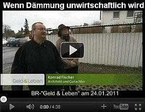

[🠔 Zur Übersicht: Schweizer Energiepolitik](7eneb.md)  
# Energie verschleudern, Geld vergeuden und Gesundheit ruinieren!
**Der MINERGIE-Standard als dümmste Leistung der Schweizer ÖKO-Demokratur, ihrer Mitläufer und Helfershelfer**  
_von Paul Bossert • aktualisiert 15.10.1999_

Der MINERGIE-Standard als dümmste Leistung der Schweizer ÖKO-Demokratur, ihrer Mitläufer und Helfershelfer 

Kritische Anmerkungen des wohl einzig echten Schweizer Energieexperten Arch.- & Ing. Paul Bossert

Der MINERGIE-Standard soll nach Meinung einiger "Energiefachexperten", Wärmedämmstoff-Fabrikanten und Hersteller von Klima- und Lüftungsgeräten auch in Deutschland zum Standard erhoben werden. Siehe, <http://www.minergie.ch>

## MINERGIE-Standard bedeutet:

Der MINERGIE-Standard wurde ursprünglich vom Amt für Abfall, Wasser, Energie und Luft (AWEL) des Kantons Zürich in die Welt gesetzt. Dieser Standard basiert hauptsächlich auf rein theoretischen Annahmen, die bis heute wissenschaftlich nicht gesichert sind. Der MINERGIE-Standard orientiert sich an der fiktiven und fixen Behauptung, dass massgebliche Energieeinsparungen im Wesentlichen nur durch die Verminderung der Wärmeleitung - sogenannter U-Wert (früher k-Wert) - bei der Gebüdehülle erzielbar seien.

Das schweizerische Bundesamt für Energie (BfE) übernimmt diesen Standard ungeprüft als Nachfolgeprogramm für zu Ende gehende Energieeinsparprogramm Energie 2000, dem in der Vergangenheit betreffend Energieeffizienz kein Erfolg beschieden war. Das BfE setzt sich dafür ein, dass der MINERGIE-Standard gesamtschweizerisch zur Anwendung gelangt, in die eidgenössischen und kantonalen Energiegesetze einfliesst und schlussendlich dem Volk aufgezwungen wird.

Die heutige Lehrmeinung, in der Schweiz vornehmlich repräsentiert durch die Eidgenössische Technische Hochschule (ETH) in Zürich und Lausanne behauptet federführend, dass nur der U-Wert die dominante Wärmeenergie-Einspargrösse darstellt. Dass die U-Wert-Theorie mit der Realität nicht übereinstimmt, wird von den hehren Physik-Professoren an der ETH - die noch nie in ihrem Leben neben einem Backstein geschlafen haben - seit Jahrzehnten verdrängt.

Nebst der Tatsache, dass die behaupteten Energieeinsparungen bei der Anwendung des MINERGIE-Standards im allgemeinen nicht erzielt werden können, führt das Bauen nach dem MINERGIE-Standard zu einer totalen Verluderung der anerkannten Regeln der Baukunst. Baumaterialien und Konstruktionen werden favorisiert, welche für Bauzwecke absolut ungeeignet sind. Dadurch wird die Gebrauchstauglichkeit und die Zeitstandsfestigkeit der Gebäudehülle von Hochbauten drastisch vermindert und das Geld in den Sand gesetzt. Gleichzeitig wird unbedarft auch ein erhöhtes Brandrisiko und Schallrisiko in Neubauten wie auch bei Sanierungen in Kauf genommen.

Da auch die materialtechnischen Probleme der Wärmedämmstoffe beim MINERGIE-Standard nicht gelöst sind, weil die Wände nicht mehr "Atmen" können und deshalb die Wohnungen zu feucht werden, wird mittels kontrollierter Lüftung versucht, diesen Mangel auszugleichen. Für dieses Szenario fehlen aber die wissenschaftlichen Untersuchungen, die einen flächendeckenden Einsatz dieser Ventilatoren-Methode zulassen würden. Zu hohe Raumfeuchtigkeit und kontrollierte Lüftung bilden Krankheitsherde und deshalb ein unverantwortliches Gesundheitsrisiko.

Konrad Fischer: Fassaden energetisch richtig und kostensparend sanieren 1 

[Teil 2](http://www.youtube.com/watch?v=Y1NSxAW15Cc) [Teil 3](http://www.youtube.com/watch?v=RAT7VzBo8k0) [Teil 4](http://www.youtube.com/watch?v=6TBII25iVQk) [Teil 5](http://www.youtube.com/watch?v=Kb0C4KiZvVA) 

 

Der MINERGIE-Stanard verursacht auch viel zu hohe Baukosten, die sich nicht auszahlen bzw. niemals amortisieren lassen, er treibt den Energieverbrauch in die Höhe und bewirkt infolge ungesunder Wohnungen permanent steigende Gesundheitskosten.

Im Artikel über Energiesparen im schweizerischen Limmattaler Tagblatt vom 15. 10. 1999 wird ein theoretischer zulässiger MINERGIE-Verbrauchswert von 45 Kilowattstunden pro Quadratmeter Gebäudefläche und Jahr (45 kWh/m2a) genannt. Dieser Wert entspricht einem Energieverbrauch von 16 Kilowattstunden Energie bzw. 1.6 Liter Heizöl pro beheiztem Gebäude-Kubikmeter im Jahr (kWh/m3a). Bei MINERGIE-Bauten liegt der effektive Verbrauch zwischen 30 und 40 kWh/m3a, wobei er für nichtwärmegedämmte Altbauten der Jahrgänge 1900 bis 1940 - die dem heutigen Dämmstandard nicht entsprechen – im Mittel lediglich 20 kWh/m3a beträgt!

Fazit: Architekten und Ingenieure sollten anstatt dem MINERGIE-Standard zu huldigen, das richtige Bauen wiedererlernen!

Arch.- & Ing. Paul Bossert, CH-8953 Dietikon, 15. 10. 1999

Und hier eine neuerliche Stellungnahme vom Kollegen Paul Bossert: 

## Thema: MINERGIE-Standard und neues Energiegesetz

Fragwürdige Effizienz des MINERGIE-Standard 

Der Grosse Rat und die Baudirektion des Kantons Basel-Stadt haben quasi per Dekret den MINERGIE-Standard auf Kantonsebene per Gesetz eingeführt. Die Einführung geschieht auf Druck des Bundesrates, welcher die Massnahme mit der Verminderung des CO2-Ausstosses zur Rettung der Welt begründet. MINERGIE-P vereinigt MINERGIE und Passivhaus. 

Zum MINERGIE-Standard fehlen nach wie vor noch immer vergleichende Energie-Verbrauchs-Analysen (EVA), welche derartige Massnahmen aus baufachlicher Sicht erlauben würden. Ebenso werden die Langzeit-Auswirkungen dieses Standards hinsichtlich der SIA-Normen betreffend Schallschutz, Brandschutz, sommerlicher Wärmeschutz, Haltbarkeit und der Schutz der Gesundheit sträflich negiert. Wegen der Widersprüchlichkeit zwischen dem technischen und individuellen Energieverbrauch, ist beim Versagen des MINERGIE-Standard ein juristisches Einklagen nicht möglich. Auch der Tatsache, dass MINERGIE-Bauten in der Regel spezifisch mehr Heizenergie verbrauchen als gute Altbauten der Baujahre 1850 bis 1950, wird nicht Rechnung getragen. 

Obwohl mit dem MINERGIE-Standard vergleichsweise keine Energie eingespart wird, müssen laut dem Bundesamt für Energie (BFE) auch Altbauten mit Polystyrol und Mineralwolle verklebt werden, auch wenn ihr aktueller Energieverbrauch wesentlich tiefer ist, als derjenige von MINERGIE-Bauten, denn die SIA-Norm 380/1 ist gemäss BFE unbedingt einzuhalten. Vergleichende wissenschaftlich, experimentelle Untersuchungen verschiedener Aussenwandkonstruktionen existieren in der Schweiz nicht. 

Bis heute wurde (ausser der von Bossert initiierten und mitfinanzierten EMPA-Untersuchung Nr. 136788) keine einzige Wandkonstruktion an der EMPA hinsichtlich ihrer Energie-Effizienz getestet und geprüft. Da nur noch die Wärmedämmstärke einer Gebäudehülle massgebend ist, existiert der Wettbewerb im Bauangebot nicht mehr. Der MINERGIE-Verein ist eine private Organisation, welche sich für die Einhaltung von staatlichen Vorschriften hoch bezahlen lässt, obwohl die Mitglieder seit Jahren darauf aufmerksam gemacht werden, dass die durch den MINERGIE-Standard erzielten Energieeinsparungen vergleichsweise nur auf dem Papier stattfinden und in der Realität nicht existieren. 

Der MINERGIE-Standard stützt sich auf die Pullover-Theorie bzw. die U-Wert-Theorie ab, die nur in Ausnahmefällen Gültigkeit hat. Diese Theorie geht im Allgemeinen davon aus, dass zur Energie-Einsparung eines Gebäudes nur die Verbesserung der Wärmedämmung der Gebäudehülle massgeblich sei. Die Institutionen ETH, EMPA, SIA und BFE sowie die Konferenz der kantonalen Energiedirektoren behaupten deshalb seit 30 Jahren, dass der Wärmedämmwert, der U-Wert, die dominante Energie-Einspargrösse eines Gebäudes sei, ohne je die erforderlichen Beweise beigebracht zu haben. ETH, EMPA und SIA weigern sich zu akzeptieren, dass ihre Theorie falsch ist. Der wissenschaftlich vorgegeben Pfad von Theorie und Experiment wurde/wird vorsätzlich negiert. 

Früher wurde die Pullover-Theorie nur zur Bestimmung der Heizleistung eines Gebäudes verwendet. Ausgehend davon, dass es ausserhalb eines Gebäudes kalt und dunkel sei und deshalb nur der Wärmewiderstand der Gebäudehülle zu beachten wäre, liefert diese Berechnung zur Dimensionierung der Heizungsanlage gute Resultate, die für den Bauherrn auf der sicheren Seite liegen. Für die Berechnung des Energieverbrauchs eignet sich die U-Wert-Theorie hingegen nicht, weil sie den Einfluss der Sonnenstrahlung (ausser bei den Fenstern) nicht beachtet. In der Pullover-Theorie werden deshalb sieben (7!) wichtige, energierelevante Faktoren wie: Wandstärke, Wärmespeicherung, Farbe, Oberflächenstruktur, Feuchtigkeit, positive Wärmebrücken-Effekte und Wärme-Eindringgeschwindigkeit nicht beachtet. 

Wie Energie-Verbrauchs-Analysen aus Basel eindeutig beweisen, bildet der nur mit der U-Wert-Theorie begründete MINERGIE-Standard einen gewaltigen Trugschluss, weil vergleichende, wissenschaftliche Experimente zum MINERGIE-Standard und der U-Wert-Theorie im In- und Ausland nicht existieren. Deshalb gibt auch keinen naturwissenschaftlich gesicherten Grund, an MINERGIE- oder MINERGIE-P Bauten Förder-Beiträge auszurichten. 

Pikant ist, dass das IWB seit Jahrzehnten über genaue Messwerte von Bauten in der Stadt-Basel verfügt, aus denen eindeutig hervorgeht, dass der MINERGIE-Standard ineffizient ist. Allerdings hält das IWB diese Daten unter Verschluss, denn das Kerngeschäft des IWB ist ja Energie zu verkaufen. Warum auch das AUE trotz Zugriff auf den IWB-Computer die Fakten nicht wahrhaben will, entzieht sich meiner Kenntnis. 

Weil das IWB ja in diverse Wohn- und Geschäftsgebäude Erdgas und Fernwärme liefert und die beheizten Wohnflächen auch bekannt sind, ist auch der spezifische Energieverbrauch bekannt! Und weil dieser bei den gut unterhaltenen Altbauten tiefer ist als bei MINERGIE- und Niedrig-Energie Häusern, sind deshalb auch die geplanten Energiegesetzänderungen falsch. 

Die Kantonalen Wärmedämmvorschriften sind deshalb unverzüglich aufzuheben und durch Zielvorgaben eines spezifischen Energie-Verbrauchs wie z.B. W/m3K zu ersetzen, welcher bereits vor über 80 Jahren europaweit gültig war. 

Oetwil. 23. Juni 2008 Paul Bossert

**[Onlinereports.ch - Regierung will Heizen und Kühlen im Freien verbieten - "Effizienz des Minergie-Standards ist fragwürdig", Stellungnahme von Paul Bossert](http://www.onlinereports.ch/News.109+M5a1a7a6a756.0.html#echos#echos)** 

Paul Bossert, Dipl. Bauingenieur FH und Architekt, Bauphysiker, Energie- und Bauschadenexperte 
Rainstrasse 23, CH - 8955 Oetwil a. d. Limmat, Tel. +41 (0)44 740 83 93 - Fax +41 (0)44 742 04 56 

Besuchen Sie mein Baukritik-Forum: 
**_Richtig Bauen - Besser Leben_** - [www.paul-bossert.ch](http://www.paul-bossert.ch/) 

Hier können Sie unterschreiben: [www.klimamanifest-von-heiligenroth.de](http://www.klimamanifest-von-heiligenroth.de/) 

Und hier als Zugabe die 

Aktennotiz 

z.K. Strategiegruppe Energie Schweiz 
Sitzung vom 15. September 2009 in Bern 
verfasst von Paul Bossert für alt NR Rolf Hegetschweiler 

## Über die energetisch wirksamen Massnahmen beheizter Hochbauten.

Seit über drei Jahrzehnten gehen die Bildungs- und Normeninstitutionen der Schweiz (ETH, EMPA, SIA) davon aus, dass die Wärmedämmung die prioritäre Massnahme bildet, um bei Gebäuden Heizenergie einzusparen. Hierbei handelt es sich um eine These welche sich auf die U-Wert-Theorie abstützt, die allerdings bis heute wissenschaftlich-experimentell noch nicht validiert wurde. Der U-Wert (früher k-Wert) beschreibt die Energiemenge, welche aus einem Gebäude bei konstanten Randbedingungen von innen nach aussen abfliesst. Die Masseinheit des U-Wertes ist: W/m2K. 

Generell wurde und wird der U-Wert als dominante Grösse für die Dimensionierung einer Heizanlage verwendet. Für die Berechnung des Energie-Verbrauchs eines Gebäudes ist der U-Wert unbrauchbar, weil die auf ein Gebäude einwirkenden Randbedingungen des Wetters ständig ändern. 

Ausgehend von der Energiekrise im Jahr 1973 wurden im nachfolgenden GEK-Bericht Szenarien entwickelt, welche sich zwecks Energieeinsparung bei Gebäuden nur am U-Wert orientierten. Der GEK-Bericht (1978) stützte sich nur auf den effektiven Energieverbrauch, der bis heute nicht analysiert wurde, weshalb sich auch keines der ausgedachten Szenarien einstellte. 

Bereits ab dem Jahr 1976 machte Bossert die Mitarbeiter des damaligen Amtes für Energiewirtschaft (BEW), die Herren: Roux, Schmid, Binz, Decoulon, Kohler, Mosimann, Favre, Luginbühl, Kiener darauf aufmerksam, dass die alleinige Favorisierung des U-Wertes aus naturwissenschaftlicher Sicht unzulässig sei. Dennoch veröffentlichte Bundesrat Willy Ritschard (EVED) am 1. März 1979 die Musternormen für Wärmedämmvorschriften, welche sich nur auf den stationären U-Wert bezogen. 

Nebst dem U-Wert sind jedoch noch 7 weitere, relevante Energiefaktoren bei der Gebäudehülle zu beachten wie: Wanddicke, Wärmespeicherfähigkeit, Strahlungsaufnahmefähigkeit, Oberflächenstruktur, Feuchtigkeit, Wärmebrücken und Wärmeeindringgeschwindigkeit, welche in der U-Wert-Theorie nicht oder zu wenig berücksichtigt werden. 

Die Wärmedämmung von Kellerdecken, Dachböden, Flachdächern und Heizleitungen können zwar nach dem U-Wert dimensioniert werden, doch ist die Hyperbeltragik zu beachten, wo die Energie-Effizienz und Wirtschaftlichkeit bei U-Werten kleiner 0,4 W/m2K nicht mehr gegeben ist. 

Merke: Überall, wo die Direkt- und Diffus-Strahlung der Sonne wirkt, sollten kein Aussen-Wärme-Dämmungen (AWD) oder Kerndämmungen (Zweischalenmauerwerk) verwendet werden, weil die passive Solareinstrahlung nicht genutzt werden kann. In Ausnahmefällen können Innendämmungen mit dampfgepresstem Kork bis max. 4 cm Stärke zu Anwendung kommen. 

Die oben erwähnten Argumente wurden anlässlich einer Aussprache vom 29. Januar 1980 mittels Energie-Verbrauchs-Analysen von Bossert und Nagel belegt und von den Professoren: Berchtold, Hauri, Kneubühl und Peters gutgeheissen. Die Herren: Kiener (BWE), Sagelsdorff (EMPA) und Meier (SIA) negierten jedoch die vorgebrachten Fakten und favorisierten in der Folge weiterhin die U-Wert-Theorie. 

Das ist bis heute der Fall, wobei die Gebäudehülle inzwischen nur noch auf den theoretischen Energieverbrauch nach den SIA-Normen 180 und 380/1 reduziert wird. Aus diesem Grund ist es auch nicht möglich, mit einer Systemberechnung nach SIA 380/1 den mutmasslichen Energieverbrauch zu berechnen. Weitere SIA-Normen wie: Brand- und Schallschutz, Feuchtigkeit, sommerlicher Wärmeschutz können nicht mehr eingehalten werden. 

Da seit über 40 Jahren die Bau-Forschung im Energie-Bereich ausblieb, wird es – wenn überhaupt - bestenfalls in 20 bis 30 Jahren möglich sein, einen allgemein gültigen Berechnungsansatz für den Energieverbrauch beheizter Gebäude zu entwickeln. Fakt ist: Die Grundlagenforschung fehlt. 

In der Regel haben MINERGIE-Bauten einen spezifisch höheren Energieverbrauch, als gut gebaute Altbauten der Baujahre 1850 bis 1930. 

MINERGIE täuscht einen Standard vor, welcher sich nur auf die U-Wert-Theorie bezieht. MINERGIE ist ein Verein, der eine Idee verkauft, die wissenschaftlich nicht validiert ist. MINERGIE hat nach über 10 Jahren des Bestehens noch keine einzige ihrer vorgeschlagenen Konstruktionen an der EMPA hinsichtlich Energie-Effizienz messen lassen. 

Da es aus energetischer Sicht keinen Sinn macht, dem Volk weiterhin ohne Nachkontrolle vorzuschreiben, wie es mit Wärmedämmvorschriften nach SIA 380/1 Bauen muss, drängt sich eine Änderung der Masseinheit auf. 

Der Staat soll als neue Masseinheit eine Energie-Verbrauchs-Leistung (EVL) in W/m3K vorschreiben, die hinterher kontrolliert und bei Nichterfüllung finanziell geahndet wird. Dem BFE (Herren: Steinmann, Kaufmann, Eckmanns) wurde diese Masseinheit in W/m3K von Bossert längst vorgeschlagen, zumal diese seit 1925 europaweit als „Kennziffer“ bekannt ist. 

Aus o.a. Gründen sind VHKA, GEAK und Klimarappen sofort aufzuheben. 
15. 9. 2009 Bo 

[Paul Bossert zum bundesdeutschen Steuergeldskandal CO2-Gebäudesanierungsprogramm](7bo.md) 
[Paul Bossert zum staatlichen Energiefaschismus](7enfasch.md) 
[Paul Bossert zum Polystyrol-Dämmverbrechen](7poly.md) 
[Paul Bossert zum eidgenössischen Energieschwindel](7eneb.md) 
[Paul Bossert zum fiktiven Rechnen mit der DIN EN 823](7d41082e.md#823)
