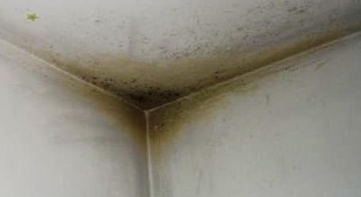
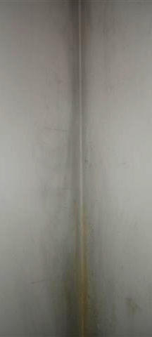
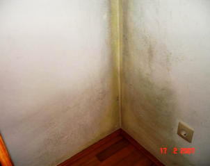
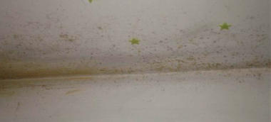
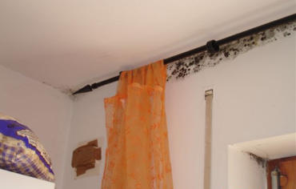
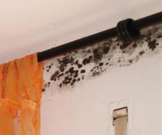
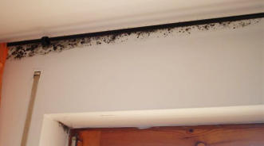
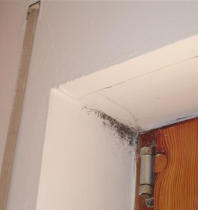
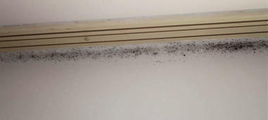

[🠔 Zur Übersicht: Schimmel im Haus](7schim.md)  
# Schimmelsachverstand/Schimmel-Sachverständige & Schwachverstand, Schimmelgutachter und Schlechtachter [4]
**Analyse von Schimmelpilzbefall durch Dämmung, kritische Betrachtung von Schimmelsachverständigen und Gutachtern. Rechtliche Aspekte und häufige Fehlannahmen bei der Schimmelbeseitigung.**  
_von Konrad Fischer_

## Schimmel und Haussanierung: Schimmelpilzbefall durch und trotz Dämmung
Aus der Arbeit der Schimmelscharlatanerie

Aus dem Tagungsbericht zum gemeinsamen Schimmelpilzsymposium von VBN (Verband der Bausachverständigen Norddeutschlands) und BVS (Bundesverband ö.b.u.v. Sachverständiger) am 16.2.02 in Würzburg, Verf. Dieter Warmbrunn aus: Der Sachverständige 4/02: 

_"Dr.-Ing. Heinz-Jörn Moriske (Umweltbundesamt Berlin) führte ... aus:_ 

_"Im Umweltbundesamt häufen sich seit Jahren die Anfragen über Schimmelpilzbelastungen (die) zunehmend auch in aus energetischen Gründen aufwendig abgedichteten Gebäuden auftreten. ... Nicht immer ist dieses Problem nur durch eine Veränderung des Nutzerverhaltens (mehr aktives Lüften) zu vermeiden bzw. zu beseitigen."_ 
_[Prof. Dr.-Ing. habil. Claus Meier](7waefe.md) referierte über "Schimmelpilz und die bauphysikalischen Zusammenhänge". Er führte aufgrund seiner langjährigen Beobachtungen und Forschungen aus, dass Feuchteschäden und damit Schimmelpilze und Algen wohl fast schon zum Standard eines "modernen" Hauses dazugehören. ... meist beherrschen Irrtümer und Fehlinterpretationen die Szene - und die Bauschadensbehebung feiert Triumphe. ... Mit der derzeitigen Entwicklung der Bautechnik (sind) neue Feuchte- und Schimmelpilzprobleme sozusagen vorprogrammiert. ..._ 
_Bernd Walterscheidt aus Leverkusen, Richter am Amtsgericht Lüdenscheidt ("Schimmelpilz und Justitia") ... kritisierte ..., dass viele Sachverständige mit ihren Untersuchungsmethoden und Beurteilungskriterien gerade bei dem Schimmelpilz-Problem häufig "neben der Sache" liegen würden. Stichwort: DIN-Gläubigkeit._ 
_... einem Mieter (kann aus Sicht der Rechtssprechung) nicht zugemutet werden:_
* _das Halten einer Tagestemperatur von 22 Grad bei 5-6 maligem täglichen Lüften,_
* _ein tägliches mehrfaches Stoßlüften und ein Halten der Raumtemperatur nicht unter 19 Grad auch in den Schlafräumen, bzw._
* _die ständige Beheizung des Schlafzimmers auf 20 Grad Celsius oder_
* _dass er sämtliche Möbel etwas 10 cm von der Wandfläche entfernt aufzustellen habe, um Feuchteschäden zu vermeiden._
(Die in der Diskussion von Prof. Dr. Erich Cziesielski erhobene Forderung, Prof. Meiers Tagungsskript "als "überholt" zur Seite zu legen" regte die Bauschadenssachverständigen zum "Nachdenken" an) 
* _ob wir uns mit der gegenwärtigen "Dämmschichtdicken-Olympiade" und den "Superdichtungen der Häuser" wirklich auf dem richtigen Weg befinden,_
_oder auch,_
* _ob wir uns der herrschenden Mehrheitsmeinung (wg. EnEV, DIN 4108 etc.) zum Thema Dämmen und Dichten anschließen wollen bzw. müssen. ..."_

Dabei wünsche ich viel Erfolg! 

Links zum Nachdenken: [Dämmt Dämmung?](2139bau.md)<>[Wem DIeNt DIN?](2mbu.md)<>[Dichten oder Lüften?](23bausto.md)<>[Falsch und richtig heizen](7temper.md)<>[Energiesparen im Altbau](7wsvoant.md)<>[EnEV brutal](enev.md)<>[Wider falsche Normen](7din4108.md)<>[Der ö.b.u.v. Schwachverständige](3gutacht.md)

Es läßt leider sehr tief blicken, wie wenig dieser Herr Moriske beim Seminar aufgepaßt hat. Wird er doch in der Neuen Presse Coburg am 13.3.04 in einer dpa/gms-Meldung _"Große Flächen muß der Fachmann sehen"_ wie folgt zitiert: 

_""Feuchtigkeits- und Schimmelschäden bilden sich oft nach dem Einbau fugendichter, isolierverglaster Fenster, wenn die Außenmauern nicht zusätzlich isoliert werden", erklärte Heinz-Jörn Moriske vom Umweltbundesamt in Berlin."_ 
Das ist erstens goldrichtig, zweitens grottenfalsch. Denn nicht unzureichend isolierte Außenmauern führen zur Kondensat- und Schimmelbildung, sondern die dramatisch erhöhte Feuchte dank plötzlich überdichter Fenster in Verbindung mit ungenügender Erwärmung kritischer Stellen mangels ausreichender Versorgung mit dem Warmluftstrom der Konvektionsheizung. Die Umweltbundesbeamten-Narretei steigert sich aber noch bis zum kompletten Irrsinn: 
_""Schimmelpilzbefall sollte in Eigenregie nur bei Flächen bis zu einem halben Quadratmeter Größe entfernt werden", sagte Moriske. Bei ausgedehnten Flächen müsse zunächst die Ursache des Schadens von einem Fachmann diagnostiziert werden, damit über eventuell nötige Sanierungsmaßnahmen beraten werden kann. Erst danach sollte mit der optischen Beseitigung des Schadens begonnen werden."_ 
Selbstverständlich muß jeder Schimmelbefall - egal ob großflächig oder klein als Stockflecken - fachmännisch korrekt beurteilt werden. Das kann auch der Geschädigte selbst, soweit er die hier beschriebenen feuchte- und heiztechnischen Zusammenhänge verstanden hat. Kommt aber ein _"Fachmann"_ im Sinne Moriskes zum Zug, wird er dem armen Schimmelgeschädigten normalerweise empfehlen, sein Geld mit sinnlosen und geradezu schädlichen Dämmmaßnahmen an der Fassade innen zw. außen zu vergeuden. Und die ungeheuerlichsten Schlaumeier unter den Schimmelexperten scheuen auch nicht davor zurück, den weiteren Einbau von Isolierglasfenstern zu fordern. Was gegen Schimmel eben gar nichts, dafür aber dem Fachmann und seinen bauwirtschaftlichen Helfershelfern dicke nützt. Oder? 

Wie BGB und Schimmelgefahr zusammenhängen, hat das KG Berlin am 26.2.04 geurteilt (U 1493/00, ZMR 2004, 513): Schimmelpilzbefall in Mieträumen kann eine erhebliche Gesundheitsgefährdung im Sinne des § 569 BGB sein - Folge: Der Mieter darf außerordentlich und fristlos kündigen. Voraussetzung: Der Mieter belegt, daß die festgestellten Schimmelpilze in ihrem gegebenen Umfang toxinbildend (vergiftend) und krankmachend (z.B. Asthma) sind. Also: sachverständig erhobene Meßwerte + ärztliche Stellungnahme zum konkreten Fall. 

Und um derart kostenintensive Spielchen evtl. ganz einzusparen, gäbe es ja auch die Möglichkeit, im Streitfall zwischen Mieter und Vermieter, wer denn nun den vermaledeiten Schimmelpilzbefall zu vertreten habe - Mieter: "Ich lüfte und heize ausreichend, es sind vermieterseits zu vertretende und zu behebende Baumängel dran schuld, daß die ganze Wohnung / das Kinderzimmer / das Schlafzimmer / die Küche / das Treppenhaus vom Schwarzschimmel befallen sind, und deswegen erfolgt zurecht eine Mietminderung" - Vermieter: "Aber nein, der geizknauserige Mieter (Hartz 4!) spart Heizkosten und heizt und lüftet deswegen nur wenig bis gar nicht" - die aufklärenden Fakten selbst zu erheben. Mit im Handel (auch bei Amazon, s.u.) erhältlichen Klimameßgeräten mit Datenlogger, die also über einen angemessenen Zeitraum hinweg die Raumtemperatur und Raumluftfeuchte aufzeichnen und damit den unbestechlichen Nachweis bringen, wie nun tatsächlich mieterseits geheizt und gelüftet wurde, läßt sich der Streit entscheiden und beilegen. Mein Gott Walter, was das Geld und Ärger spart / sparen könnte!

Was es dann wirklich bringt oder nicht, irgend einen beliebigen Schimmel-Sachverständigen im Streitfall einzuschalten, geht aus vielen sog. Schimmelpilzgutachten hervor, die mir verzweifelte Beratungskunden vorlegen. Nur ein Beispiel sei hier auszugsweise zitiert, es gutachtet ein sog. sachverständiger Baubiologe mit einem Laden für Umweltanalytik und Messtechnik": 

Zunächst wird - obwohl der unmäßige Schwarzschimmelpilzbefall sozusagen mit unbewehrtem Auge jedem auch noch so Blinden sichtbar und riechbar ist - ein unmäßges und kostenfressendes Gemesse (Raumluftmessung mit Luftkeimsammler) und Kontrolliere mit mehrfachem Ortsbesuch durchgezogen, das neben einigen Pfund Belastungstabellen mit hohen Schimmelwerten (Koloniebildende Einheiten KBE, aufgrund vor Ort genommener Meßwerte von einem weiteren hinzugezogenen Institut für Umweltmykologie mit zig Dr.rer.nat.s ermittelt) ein "Gutachten" mit u.a. folgenden "Einschätzungen" und "Empfehlungen" hervorbringt (Rechtschreibfehler und Formulierkunst gem. Original): 

_"In der Wohnung von Fanilie L. war starker, offener Schimmelbefall in Schlaf- und Esszimmer mit deutlicher Geruchsbelästigung vorzufinden. Alle Räume incl. Bäder haben vollwertige Fenster ... Meine Gesamtbeurteilung: ... Bei dem Gebäude handelt es sich aus energetischer Sicht um einen Altbau, weil an den Außenwänden keine zusätzliche Wärmedämmung angebracht ist. ... Dort kühlen die raumseitigen Außenwände an Problemstellen [raumseitige Eckbereiche der Außenwände, Fensterleibungen, Ringanker, durchbetonierte Betondecken] so weit ab, dass dort Tauwasser entsteht und dann auf Materialien mit entsprechend günstigen Nährböden zu Schimmelbildung führt. ... Erschwerend kommt hier hinzu, dass in den vorhandenen Gebäudestandard ... problematische Eingriffe erfolgt sind. ... nämlich dichte Isolierglasfenster eingebaut ... ohne parallel eine Fassadendämmung vorzunehmen ... verlagert sich die Tauwasserproblematik zunehmend an die Wandflächen, weil die Feuchtigkeit aus dem Innenraum nicht mehr über Undichtigkeiten von Fugen und Ritzen abgeführt werden kann. ... weitere Probleme ..., weil Dispersionsfarben die Oberflächen absperren, so dass dort die Diffusionsmöglichkeiten zur Pufferung von Feuchtigkeit über die Verpuzflächen aufgehoben wird. Dispersionsfarben reagieren dann bei erhöhter Feuchtigkeit sehr schnell mit Schimmelbildung, weil dort ein idealer Nährboden gegeben ist. ..."_ 

Es folgen weitere wohlklingende Selbstverständlichkeiten und Textbausteine, bei deren verquaster Formulierung der Verdacht naheliegt, daß es sich lediglich um angelesenes, abgeschriebenes, beim Rosenheimer Baubiologenseminar aufgeschnapptes, doch keinesfalls voll in allen Konsequenzen oder überhaupt verstandenes "Fachwissen" handelt. Allein der Hinweis auf die so arg für den Neubaustandard vermißte "zusätzliche Wärmedämmung" und die "vollwertigen Fenster" - gemeint sind die schimmelverursachenden Isolierglasfenster mit extrem abdichtenden Dichtungslippen! - spricht ja Bände. Gehen wir weiter zu den 

_"Abhilfeempfehlungen: Als Erstmaßnahmen müssen die schimelbefallenen Flächen mit (giftigem XY-)Schimmelentferner behandelt werden. und dann mit einem Schutzsauger (HEPA oder S-KLasse) gereinigt werden. ... Zur weiteren Sporenausleitung müssen dann einige Luftreiniger mit HEPA-Filter aufgestellt werden (z.B. Fabrikat XX). Die Geräte müssen ca. 3 - 4 Wochen betrieben werden. Im Anschluss muss eine Kontrollmessung erfolgen. Bei den Sanierungsarbeiten ist persönliche Schutzausrüstung zu tragen. Die beiden Möbelstücke ... sind auch nach der Desinfektion noch mit Sporen befallen, so dass hier ein Austausch erforderlich wird. Hintergrund ist, dass bei unversiegelten Oberflächen (Spannplatten) ein direkter Befall häufig nicht reparabel ist. Damit die eigentlichen Ursachen grundsätzlich behoben werden, müssen bauliche Maßnahmen eingeleitet werden ... folgende Alternativen (sind) möglich: 

1. Anbringen einer Innendämmung ... aus Calciumsilikatplatten, Mindeststärke 2,5 cm (z:B. Fa. X, Y) ... Austausch des alten Fensters im Schlafzimmer EG gegen ein neues Holzfenster mit Isolierverglasung. Weiterhin müssen in den Küchen Dunstabzüge mit Abluft eingebaut werden. Nach diesen Maßnahmen müssen große Schränke noch mit ca. 5 cm Abstand eingebaut werden. ... 

2. Anbringen einer vollständigen Fassadenaußendämmung. Wenn den Mietern das regelmäßige Lüften nicht möglich ist, sollten auch noch die automatischen Fensterlüfter nachgerüstet werden. ..."_ 

Ob hier wieder mal das Prinzip "Der Schwachverständige macht sich dem Richter (und Laien) durch möglichst krasse und teure Ratschläge wichtig und unangreifbar" greift? Urteilen Sie selbst. 

Auf jeden Fall ist das empfohlene Gesumse teils übertrieben, teils nicht zielführend, teils schädlich für die Gesundheit und das Bauwerk und selber schimmelfördernd. Und das Ganze kostet eine dicke Stange Geld, die der von seinen Super-Isolierfenstern - darin ist ja neben dem nicht mal ansatzweise analysierten (grobe Fahrlässigkeit oder Vorsatz des Schwachverständigen!) mangelbehafteten Heizbetrieb die wahre Ursache des Schimmelbefalls schnell auszumachen, ohne hochtrabende Analysiererei von keimsammelnden Raumluftproben und Objektabstrichen durch doktorierte Schaumschlägerei - geplagte Vermieter niemals durch seine Mieteinnahmen wiederbekommen wird. Viel Spaß! wünsche ich allen, die solch gefährlichen Fachexperten in die Hände fallen, ob nun bei Schimmelpilzmessung, Umweltanalytik und Sanierempfehlung der Rosenheimer Standard der Baubiologischen Messtechnik (SBM) für Schlafbereiche zum Einsatz kommen darf oder Empfehlungen des Umweltbundesamtes, des Arbeitskreises "Qualitätssicherung - Schimmelpilze in Innenräumen" am Landesgesundheitsamt Baden-Württemberg (LGA-Richtlinien) oder die Richtlinien des Berufsverbandes Deutscher Baubiologen e.V. (VDB-Richtlinien). 

Und nur nebenbei: Nach der Rechtssprechung des Langerichts Mannheim vom 14.02.2007, Aktenzeichen: 4 S 62/06, darf der Mieter seine Möbel pfeilgrad so nahe an die Außenwände seiner Mietwohnung stellen, wie er halt lustig ist. Das gehört zum vertragsgemäßen Gebrauch seiner Mietsache. 

Ein Sachverständiger hatte im zugrundeliegenden Fall behauptet, daß eine Innendämmung nur ausreicht, wenn die Möbel in einem Abstand von zehn bis 15 Zentimetern zur Wand aufgestellt werden (aus der selben trüben Quelle schöpfte auch der oben zitierte Meister des Schimmelpilzexpertentums). Und deswegen wäre es nun am Vermieter, die wesentlich teurere Außendämmung ausführen zu lassen, um die Mietwohnung schimmelfrei zu bekommen. Dem Vermieter stehe es zwar grundsätzlich frei, wie er den Mietmangel beseitige, im gegebenen Fall verurteilten die Richter den armen Vermieter aber expressis verbis zur teuren Außendämmung - und zur Zahlung eines saftigen Schadensersatzes für die angeschimmelten Möbelstücke. 

Die kostengünstigere Innendämmung entfiel, weil dann der Mieter die Wohnung nicht mehr vertragsgemäß nutzen könne. Soweit das Langericht. Echt kraß und ein typisches Zeichen für die teils vollständige Ahnungslosigkeit von Sachverständigen und Gerichten sowie deren Unrechtssprechung, daß unter anderem ausgerechnet Prof. Dr. usw. Karl Gertis vom Fraunhofer-Institut für Bauphysik zigfach auch in Druckschriften / allgemein zugänglichen Fachpublikationen von Schimmelfällen berichtete, die sich trotz und ausgerechnet und gerade nach zusätzlicher Außendämmung einstellten. 

Warum wohl? 

Weil es vorrangig und zuerst mal auf die Raumluftfeuchte und dann die Raumlufttemperatur und nicht die Dämmstärke bzw. den U-Wert einer Außenwand ankommt, ob und wann sich Schimmelpilz entwickeln kann. Wobei sowohl die prinzipiell! [auffeuchtungsgefährdete Innendämmung und Außendämmung](213baust.md) genau deswegen ausgerechnet den folgenden Schimmelpilzbefall fördern kann. 

Und hier noch ein paar Auszüge aus einem Schimmelgutachten eines ganz besonders sachverständigen "Sachverständigen für Schäden an Gebäuden", von der IHK XY "öffentlich bestellt und vereidigt für Stahlbeton und Spannbetonbau": 

 Die folgenden Bilder aus [meinem Beratungsfall](2berat.md) illustrieren den vom Gutachter vorgefundenen Schimmelpilzbefall, und jetzt die Passagen aus dem Gutachten: 

_"Der Beweisbeschluss vom ... lautet: 

I. Es ist Beweis zu erheben über den Vortrag der Antragsteller, dass in der von diesen innegehaltenen Wohnung im ersten Obergeschoss des Anwesens ... sich baubedingte Schimmelpilzbildung in folgenden Bereichen findet: 

1. in der Küche im Bereich des Rollladenkastens, der Balkontüre und im Bereich der rechten Ecke an der Südseite 

2. im Wohnzimmer im Bereich des Rollladenkastens an der Südseite 

3. im Kinderzimmer im Bereich der Außenwände der West- und Nordseite 

4. im sogenannten kleinen Zimmer im Bereich des Rolladenkastens an der Nordseite 

5. im Bad im Bereich des Fensters und des Rolladenkastens. Der Beweis ist durch Einholung eines schriftlichen Sachverständigengutachtens zu erheben. 

II. Darüber hinaus ist im Wege des Sachverständigengutachtens Beweis zu erheben zum Vortrag des Antragsteller, dass sämtliche Fenster im ersten  Obergeschoss des streitgegenständlichen Anwesens mit Ausnahme des Küchenfensters undicht sind. Es ist auch Beweis zu erheben zum Vortrag, dass aufgrund der Undichtigkeit der Fenster Feuchtigkeit in die Wohnung eindringt und aufgrund der undichten Fenster kein ausreichender Wärmeschutz besteht. 

III. Der Sachverständige hat auch Feststellungen dazu zu treffen, ob der vorhandene Schimmelpilzbefall gesundheitsgefährdend ist. 

IV. Der Sachverständige hat sich dazu zu äußern, ob der vorhandene Schimmelbefall beseitigt werden kann, welche geeigneten Maßnahmen hierzu erforderlich sind und welche Kosten dadurch ausgelöst werden. ... 

C. FESTSTELLUNGEN UND ANGABEN BEIM ORTSTERMIN 

... Im Bereich des Rolladenkastens ist am Deckenrand sowie auf eine Breite von bis zu ca. 10 cm auch am Rolladenkasten Schimmelpilzbefall festzustellen ...(folgen Bilder vom Schimmelpilzbefall und Bildbeschreibungen) ... Beim Küchenfenster handelt es sich um ein neueres Fenster mit Anschlag bzw. Falzdichtung und Isolierverglasung. An der Außenseite kragt oberhalb die Geschossdecke zum Speicher aus ... Balkon mit der darüber auskragenden  Geschossdecke über dem Obergeschoss. Die Unterseite der Decke über Obergeschoss sowie die Fassade sind außenseitig nicht extra gedäammt. ... Nach Angabe der (inzwischen ausgezogenen) Mieter soll die Isolierverglasung der Balkontüre (eine 60 mm dickes Fenster-Tür-Element mit Isolierverglasung ohne Falzdichtung - / Dichtungslippe / Lippendichtung) bei kalter Witterung fast bis zur halben Höhe beschlagen haben. Die Glashalteleiste ist auffällig schwarz verfärbt. Letzteres trifft auch auf die Glashalteleiste des Wohnzimmerfensters zu. ... Beide Fenster weisen Isolierverglasung auf. ...Im Bereich der Außenecke (des Kinderzimmers) ist das typische Schadensbild eines früheren Schimmelpilzbefalls festzustellen. Betroffen soll nach Angaben (des Mieters) die Außenecke bis zu einer Höhe von 1,30 m gewesen sein. Der Bereich ist nach unten hyperbelartig verfärbt, ebenso in der oberen Raumecke. Auch hier zeichnet sich der frühere Schimmelpilzbefall deutlich ab. Es ist auch jetzt noch schwarzer Schimmel zu sehen. ... Der Spielschrank soll ca. 5 cm von der Wand abgerückt gewesen sein. ... In der Mitte der nordseitigen Außenwand hing ... ein Bild. Hinter diesem Bild hat sich augenscheinlich Schimmelpilz gebildet. ... Im Kinderzimmer ist wieder ein älteres Fenster eingebaut. An dem Fenster ist am Fensterflügel im vertikalen Falz eine Lippendichtung eingebaut. Am Blendrahmen bzw. dem unteren Wetterschenkel und dem oberen Querholz ist ebenfalls eine Lippendichtung im Falz eingebaut. ... Am Fensterflügel ist an der Unterkante eine Tropfnase ausgebildet. Der Wetterschenkel weist Öffnungen nach außen auf. Es sind keine Baumängel zu erkennen, die Wassereintritt begünstigen würden. ... Der  Kniestock ist ... aufgemauert. Die Dachfläche (des Kaltdachs / unbeheizten Speichers) ist nicht gedämmt. Auf dem Speicherboden ist ein Estrich verlegt ... Aus der (Estrichfuge) wird ein Styroporstück aus der Dämmung unter dem Estrich entnommen, dich Schichtdicke beträgt ca. 9 mm, die Gesamtaufbauhöhe einschließlich Estrich ca. 40 mm. Die Außenwandstärke einschließlich beidseitigem Putz beträgt ca. 34 cm. ... In der Baubeschreibung ist zum Außenmauerwerk aufgeführt: "Außenwände Bims". Die Decken bestehen aus Stahlbeton. ... Bei der Balkontür in der Kücke wird umlaufend in geschlossenem Zustand ein Blatt Papier eingeklemmt. Das Blatt lässt sich lediglich im Sturzbereich in geschlossenem Zustand mit etwas Kraftaufwand herausziehen. Somit ist ein guter Türschluss feststellen. ... Am Wohnzimmerfenster lässt sich ein eingeklemmtes Blatt Papier lediglich im Sturzbereich mit etwas Kraftaufwand herausziehen. Es ist keine Dichtung eingebaut. ... Bei der Balkontür im Wohnzimmer lässt sich wieder ein eingeklemmtes Blatt Papier im geschlossenen Zustand lediglich im Sturzbereich mit etwas Kraftaufwand herausziehen (bei abgesenkter Türe). Es handelt sich um altbautypische Hebetüren. ... Bei dem Fenster im Kinderzimmer lässt sich umlaufend in geschlossenem Zustand ein eingeklemmtes Blatt Papier nicht herausziehen (ebenfalls nicht im kleinen Zimmer und den beiden Fenstern im Bad). ... Die Antragsteller geben auf die Frage, wie gelüftet wurde, an, dass morgens nach dem Aufstehen die Räume mit  Duchzug ca. 10 Minuten bei geöffneten Fenstern und Türen gelüftet wurde, genauso mittags und abends. 

Nach Angabe der Antragssteller wurde das Wohnzimmer gut beheizt. Das Kinderzimmer wurde ... weniger als das Wohnzimmer beheizt. Die Küche wurde ... ebenfalls etwas weniger beheizt. Im Wohnzimmer war es ... am wärmsten. Die Zimmertüren waren ... immer offen. 

Die Antragsgegner (der Vermieter) gibt an, dass beobachtet worden sei, dass tagsüber relativ oft die Jalousien (Rolläden) heruntergelassen und die Fenster geschlossen waren. 

D. STELLUNGNAHME 

... Der Vortrag der Antragsteller trifft zu. In Küche, Wohnzimmer, Kinderzimmer, kleinem Zimmer und Bad konnte an den genannten stellen Schimmelpilzbefall festgestellt bzw. bestätigt werden. Im Kinderzimmer sind zusätzlich auf größerer Fläche Anzeichen eines früheren Pilzbefalls festzustellen. ... 

Zur genaueren Beurteilung von Umfang und Ausmaß wären labortechnische Untersuchungen erforderlich. 

... In dem Schimmelpilzleitfaden des Umweltbundesamtes wird das Schadensausmaß bei Schimmelpilzschäden in 3 unterschiedliche Kategorien eingeteilt: 

Kategorie 1: Normalzustand bzw. geringfügiger Schaden, keine bzw. sehr geringe Biomasse (z. B. geringe Oberflächenschäden < 20 cm²), in der regel keine Maßnahmen erforderlich. 

 Kategorie 2: geringer bis mittlerer baulicher nutzungsbedingter Schaden mittlere Biomasse; oberflächliche Ausdehnung < 0,5 m². Die Freisetzung von Pilzbestandteilen sollte unmittelbar unterbunden werden, die Ursache sollte mittelfristig ermittelt und saniert werden. 

Kategorie 3: großer baulicher nutzungsbedingter Schaden, große Biomasse; großflächige Ausdehnung > 0,5 m². Die Freisetzung von Pilzbestandteilen sollte unmittelbar unterbunden werden und die Ursache des Schadens ist kurzfristig zu ermitteln und zu beseitigen. Nach abgeschlossener Sanierung sollte der Sanierungserfolg durch Freimessung überprüft werden."_ 

Oha! Was steht eigentlich wirklich im Schimmelpilzleitfaden des Umweltbundesamtes? Natürlich _"baulicher oder nutzungsbedingter Schaden."_. Doch für Gerichtssachverständige gelten die Zitierregeln offensichtlich nicht. Und viele angebliche Schimmelexperten klauen den Text des Umweltbundesamtes und geben ihn auf ihrer Webseite als eigene Geistesfrucht aus - einfach durch Verschweigen der Urheberschaft. Solche Feinheiten prädestinieren diese Profis natürlich zuvörderst zur Erstellung von Schimmelpilzgutachten, oddä? Weiter im Text: 

_"Nach den bisherigen Feststellungen ist der Schaden in dem kleinen Zimmer der Kategorie 1, in Küche, Wohnzimmer und Bad der Katgorie 2 und im Kinderzimmer der Kategorie 3 zuzuordnen. Zur Beantwortung der Frage, ob der Pilzbefall baubedingt ist, ist die Schadensursache zu klären. Die entscheidende Wachstumsvoraussetzung für Schimmelpilze ist ein Feuchtigkeitsangebot an der raumseitigen Oberfläche. Die Feuchtigkeit kann dabei entweder von außen kommen (z. B. Undichtigkeiten in der Fassade) oder auf Tauwasserbildung zurückzuführen sein. ... ist es auszuschliessen, dass an den betreffenden Stellen Wasser von außen eindringt. ... 

 Wenn der Schimmelpilz in Wand- und Raumecken und hinter Möbeln auftritt, ist dies erfahrungsgemäß meist auf Tauwasserbildung zurückzuführen. An diesen Stellen treten nämlich die niedrigsten Oberflächentemperaturen auf. Ferner ist dort die Luftzirkulation etwas behindert. Beides begünstigt die Bildung von Tauwasser bzw. die Kapillarkondensation an diesen Stellen. Die Ursachen für Tauwasserbildung können unzureichender Wärmeschutz der Außenbauteile und/oder ein falsches Heiz- und Lüftungsverhalten der Bewohner sein. Auch die Möblierung kann eine Rolle spielen. Unzureichender Wärmeschutz oder Wärmebrücken sind häufig Ursachen für Tauwasserbildung. ... 

Mit den ... Bauteilschichtdicken zuzüglich einer 1 cm dicken Putzschicht un den zugehörigen Wärmeleitzahlen der jeweiligen Baustoffe gem. DIN 4108 (1960) ergibt sich für die Geschossdecke über dem Obergeschoss folgender Wärmedurchlasswiderstand: ... 0,43 M²h°/kcal < 0,55 m²h°/kcal - Nachweis nicht erfüllt. Damit sind die zur Bauzeit geltenden Wärmeschutzanforderungen nicht erfüllt. ... Trotz (der im Kinderzimmer zutreffenden) eher günstigen Annahme (einer Wärmeleitfähigkeit der Außenwand von 0,40 W/mK) ergibt sich rechnerisch in der Außenecke unter den Normklimabedingungen der DIN 4108 eine Oberflächentemperatur ≥ 12, 6 °C, Temperaturfaktor ≥0,70) und auch unter dem Grenzwert für Altbauten (Temperaturfaktor ≥ 0,65). Die Außenecke des Kinderzimmers ist somit entsprechend schimmelpilzgefährdet. ... 

Im Ergebnis ist festzuhalten, dass die Temperaturfaktoren am Deckenrand deutlich unter den Grenzwerten des Schimmelpilzkriteriums liegen (Temperaturfaktor = 0,70, Oberflächentemperatur = 12,6 °C) und auch deutlich den Grenzwert für Altbauten von 0,65 unterschreiten. Das bedeutet, dass der Deckenrand, insbesondere im Bereich der Gebäudeecken und der Rolladenkästen in erhöhtem Maße schimmelpilzgefährdet ist. ... 

Man geht davon aus, dass kalte Außenluft in den Rollladenkasten eindringt. Der Auflagerbereich ist nicht gedämmt. Das hat zur Folge, dass die Fenster- oder Türleibung unterhalb des Rolladenkastens abkühlt. Letzteres begünstigt die Tauwasser- und Schimmelbildung. Das heißt, der Schimmelpilzbefall im Bereich der Rollladenkastenauflager ... ist baubedingt. ... 

Die Angaben der Antragsteller zum  Lüftungsverhalten entsprechen zwar ungefähr den ... Regeln, so dass sich daraus erst einmal keine auffälligen oder eindeutigen Hinweise für ein falsches Lüftungsverhalten ableiten lassen. ... Ob die Antragsteller ausreichend geheizt haben, wäre im Zweifelsfall in einem weiteren Schritt zu untersuchen. ... 

Fazit: ... Die Geschossdecke über der streitgegenständlichen Wohnung ist unzureichend gedämmt., die zur Bauzeit geltenden Anforderungen des Mindestwärmeschutzes sind hier nicht erfüllt. ... Die rechnersiche Betrachtung der schadensrelevanten Wärmebrückenbereiche hat gezeigt, dass die Deckenränder in erhöhtem Maße schimmelpilzgefährdet sind. Der dortige Schimmelpilzbefall ist somit in der Hauptsache baubedingt. Der Pilzbefall in der Außeneckedes Kinderzimmers ist zum Teil baubedingt, zum Teil aber auch durch die Möblierung begünstigt worden. Der Pilzbefall im bereich der Rolladenkastenauflager ist ebenfalls baubedingt. Es gibt aber auch Hinweise, daß der Pilzbefall durch ein falsches Wohnverhalten begünstigt worden ist. ... 

Die Luftdichtheit der Fenster und Fenstertüren ist unter Berücksichtigung der Bauart und des Gebäudealters nicht zu beanstanden, der Wärmeschutz der Fenster ist ausreichend. ... Wichtiger Hinweis: Zur Vermeidung eines neuerlichen Pilzbefalls muss schädliche Tauwasserbildung dauerhaft vermieden werden. Dazu sollte der Wärmeschutz verbessert werden. Die Geschossdecke über dem 1. Obergeschoss muss in jedem Fall besser gedämmt werden. ... 

 E. ZUSAMMENFASSUNG 

... Der Schimmelpilzbefall ist auf Tauwasserbildung zurückzuführen. Ursächlich ist das niedrige Wärmeschutzniveau des Gebäudes ... Es gibt aber auch Hinweise, dass der Pilzbefall durch ein falsches Wohnverhalten begünstigt worden ist. ... Die Luftdichtheit der Fenster und Fenstertüren ist unter Berücksichtigung der Bauart und des Gebäudealters nicht zu beanstanden, der Wärmeschutz ist ausreichend. ... Unterschrift"_ 

Haste Töne! Da sifft eine Mietpartei nach besten Kräften die Mietwohnung voll, in diesem Fall sind beide arbeitslose Eltern und ihre vier kleinen Kinder fast dauernd bei geschlossenem und durch originale oder nachträglich eingeklebte Lippendichtungen pottdichte - vom Sachverständigen ungeheuerlicherweise nicht beanstandete! - Fenster zuhause (so leid einem das wirklich tun kann! Aber warum müssen die nun herummiefen und die Miete mindern und die Wohnung versauen und dem Vermieter die Schuld für ihren Muff andrehen?) und produzieren täglich an die sieben bis weit über 10 Liter Wasser, der auch bei dreimaligem (wer's glaubt, muß ein Schimmelsachverständiger sein!) und ohnehin gegenüber stetiger Lüftung zwecklosem Stoßlüften als Wasserdampf die Raumluftfeuchte bis zum Abwinken nach oben treibt. Die Brühe läuft schon an den angeschimmelten Isolierfenster herab, der Heizbetrieb erfolgt zusätzlich zum sinnlosen Gespare in den kühleren "Nebenräumen" mit [nutzloser Nachtabsenkung](7temp24.md) - was der ahnungslose Schwachverständige nicht abfragt - schlimmer kann man doch Schimmelpilzbefall nicht erzwingen - egal wie dick die Bude in Dämmstoff eingeplustert wird! 

Und dann ist - ach welch' unüberraschende Überraschung, - wer hätte denn das gedacht? - überwiegend der Bau - also der Vermieter dran schuld. Weil der ungnädige Herr Gerichtsgutachter "gerechnet" hat! Und zwar nach einer Norm, bei der die Dämm-Mafia kräftigstens gedreht hat, um maximalen Dämmstoffbedarf rauszupressen. Jawohl Euer Ehren, verdonnern Sie den maximalschuldigen Hausbesitzer bitte zu über 90 Prozent, alle hassen den doch und stinkige Geldsäcke sind unbedingt zu erleichtern. Wohneigentum in privater Hand muß bestraft werden! Schon aus sozialistischen Gründen! 

Damit der Sachverständige daran noch mehr partizipiert, versteckt er noch ein paar raffinierte Hinweise im Gutachten - bzw. Schlechtachten, die auf das schwachsinnige Nutzerverhalten hinweisen und dem verratzten Hausbesitzer etwas Hoffnungsschimmer in seine blaugeschlagenen Äuglein treiben. Denn der brave Sachverständige will ja gerne, allzugerne etwas sybillinisch herumeiern, weil er weiß: 'Nachfragen kost nix', gilt für ihn nicht: Es kostet, wenn man nachfrägt, und zwar fett! Gem. ZPO auf Vorschuß! Wenn schon keine vollkommen nutzlosen Laboruntersuchungen anstehen. 

Oh je, so sieht es leider allzuoft aus in Deutschlands Sachverständigenlandschaft rund um IHK, Handwerkskammer, Architekten- und Ingenieurkammer sowie ö.b.u.v.S. Wer an solche gerät, hat schon verloren. Und zwar selbst, wenn der Mieter vor dem Herren Schimmelpilz-Gutachter auf seinem knietiefen Dunst in der Wohnung herumschwimmt. Der Herr Sachverständige kann ja rechnen. Zu wessen Gunsten eigentlich? Und was kann er sonst? 

Die Brutalprofiteure der so weit verbreiteten Schimmelpilzirrtümer sind die Dämmstoffmafiosi. Die freuen sich über die weitestverbreitete Falschbeurteilung des deutschen Isolierfensterschimmels bis zum Abwinken. Und lassen die ihnen in die Hand schlechtachtenden Gutachter gerne ebenfalls daran profitieren. Oh, ihr Unrechter, oh ihr Schwachverständigen! Wer Euch in die Hände fällt, muß schon sehr schlimme Sünden auf dem Kerbholz haben, soweit man an den Tun-Ergehens-Zusammenhang (nach Klaus Koch, 1955) glaubt ... 

Wie sich die Giftstoffkompositionen moderner Bauweisen, es muß nicht immer Holzschutzgift und Algizid/Fungizid sein - weit mehr Giftstoffe finden ja den Weg in industriell "optimierte" Baustoffe - dann in den superdichten "Energiespar"-Wohnräumen aufkonzentrieren, liegt auf der Hand. Es geht eben nichts über eine normale Fensterlüftung und für den lebenswichtigen Luftwechsel ausreichende Fugendurchlässigkeit der Fenster. Moderne Fenster dürfen wir da ruhig vergessen, wenn wir den Chemiewaffenangriff einigermaßen gesund und nicht in selbstverseuchten Gaskammern überleben wollen ... 

Mit Raumluftproben beurteilt man den Schadstoffgehalt der durch eklige Industrie-Materialausdünstungen (VOC) (das sind vor allem produktionstechnisch beigegebene Giftstoffe der Bauchemie, die sich in ungeheuerlicher Menge und Zahl in nahezu allen Baustoffen, Teppichen, Möbelwerkstoffen und auch Reinigungsmitteln verbergen), mikrobiellen Befall, Schädlingsgestank (Ratten, Mäuse, z.T. mumifiziert) oder auch Nutzerabgase kontaminierten Räume. Hier wird ein vorschriftsgemäßes Holzschutzgift entdeckt, das Jahrzehnte seinen Giftgruselcocktail in die Luft abgibt und bei Beseitigung / Maskierung und Baumaßnahmen im Umfeld besondere Anforderungen stellt. 

Besser, man kennt die Schadstoff-Befrachtung des Bauwerks / Gebäudes / der Räume / der Baukonstruktion / des Mobiliars / der sonstigen Ausstattung vorher und kann das bei der Planung, Kostenschätzung und Ausschreibung berücksichtigen. 

Ansonsten drohen ungeheuerliche Nachträge im Bauablauf. Die einschlägigen Firmen sind darauf zu allermeist spezialisiert! Einen sehr hilfreichen Aufsatz zur weltweit typischen Schlafzimmer-Problematik haben wir dem Physiker Dr. Christian Schubert zu verdanken, den er zur Publikation auf dieser Webseite dankenswerterweise freigab. Mögen möglichst viele Seitenbesucher Nutzen daraus ziehen, die vielleicht nicht mal wissen, daß Sie bei knapp 100%iger Raumluftfeuchte in einem typischen Badezimmer - etwa der bald nach dem Duschstart kommende Moment, in dem es am Spiegel zu beschlagen beginnt - knapp drei Weingläser bzw. einen dreiviertel Liter Wasser in ihrer Raumluft drinhaben, die sich dann ihr Pfützentümpelchen in der Bausubstanz suchen, aus der sie jedenfalls mit auch noch so frischer Eiskaltluft nicht herauszudampfen sind! 

## Das feuchte Schlafzimmer – eine Modellrechnung

Folgende Situation ist frei erfunden, aber keinesfalls unrealistisch oder selten: es schimmelt in einem ganz normalen deutschen Schlafzimmer. Vielleicht sogar sichtbar in der Nordost-Ecke, vielleicht hat man den Schimmel aber auch nach Wegrücken eines Schrankes an der Außenwand gefunden. Nun entbrennt der übliche Streit: wer hat schuld? Der Vermieter verweist auf die ausgehändigte Lüftungsanleitung, nach der früh und abends die Wohnung (und also auch das Schlafzimmer) 5 – 10 Minuten lang mittels „Stoßlüftung“ zu lüften sei. Der Mieter bestätigt, das auch so getan zu haben, und dennoch kam es zum Schimmelbefall – und die Angelegenheit kommt mitunter sogar bis vor ein Gericht. 

Schauen wir doch einmal nach, wie der Mieter hätte lüften müssen, um den Schimmel sicher zu vermeiden. 

Annahme: ein normales, nicht allzu großes Schlafzimmer, wie es in vielen Neubauten und Altneubauten üblich ist. Die Fenster wurden natürlich erneuert, statt der alten Holzfenster mit Einfachverglasung sind nun moderne, energetisch „optimale“ Fenster mit doppelter oder dreifacher Gummilippendichtung und Isolierverglasung verbaut. Vielleicht sind die Außenwände inzwischen wärmegedämmt oder es handelt sich sogar um einen Neubau, bei dem man alles nach den aktuell geltenden „anerkannten Regeln der Technik“ gebaut hat. 

Ein Luftaustausch durch die gummilippendichten Fenster ist nicht mehr möglich – das war ja auch der vermeintliche Grund der immer zu hohen Heizkosten. Auch die Schlafzimmertür hat eine umlaufende Gummidichtung im Rahmen und nur noch über dem Fußboden existiert ein kleiner Spalt. Luft kann da aber auch kaum hinein oder heraus, da das die einzige Öffnung des Schlafzimmers ist. Der wutentbrannte Mieter kann nicht einmal die Tür laut zuschlagen – die wird durch das Luftpolster des Raumes auf den letzten 3 cm sanft abgebremst. 

Das Schlafzimmer wird von den Bewohnern auf 17°C gehalten, da sie bei 20°C oder noch mehr nur schlecht schlafen können. Oma schlief schließlich immer bei 10°C und klagte nie über schlechten Schlaf und Schimmel hatte ihre Wohnung auch keinen... 

Die Wände haben zu den Innenräumen eine Temperatur von 17°C an der Oberfläche und die Außenwand hat mittig im Winter bei 0°C Außentemperatur eine Wandtemperatur von 14°C. In der Außenwand-Ecke finden sich sogar nur 11°C – durchaus realistische Werte. 

Schlafzimmer-Fläche: 3,4 × 4 m = 13,6 m² 
Schlafzimmer-Höhe: 2,6 m 

=> Volumen: 35 m³ 

Wir nehmen an, dass von diesem Volumen nichts durch verschlossene Schränke o.ä. weggeht. Das gesamte Volumen sei mit Raumluft gefüllt und zugänglich. 

Weiterhin nehmen wir an, dass Wände und Einrichtung des Schlafzimmers nicht saugfähig sind, also keine Feuchtigkeit aufnehmen können. Dies ist eigentlich eine unzulässige Annahme, da Tapete, Putz, Teppiche, Matratzen usw. Feuchtigkeit sehr wohl aufnehmen, speichern und wieder abgeben können. Da wir unsere Betrachtungen aber für ein gedachtes Gleichgewicht zwischen Wandfeuchte und Raumluftfeuchte durchführen, können wir die Annahme von keinerlei Feuchtigkeitsaustausch treffen. Im Mittelwert soll alles so feucht oder so trocken bleiben, wie es ist. Unsere grobe Rechnung wird gleich zeigen, wie falsch diese Annahme ist. Mittels des Taupunkt-Rechners auf http://www.bauphysik-zimmer.de/feuchterechner/ kommen wir nun schnell und bequem zu entsprechenden Zahlen. 

Eine Aussage ist noch wichtig: ein schlafender Mensch – so nicht durch Alpträume geplagt schweißüberströmt – gibt durch seine Atmung und über die Körperoberfläche je Stunde ca. 60 ml Wasser an den Raum ab, also 60 g/h. 

Je Kubikmeter Raumluft sind das also 60 / 35 = 1,7 g/h. 

Draußen ist trockener Winter, 2°C Lufttemperatur, relative Feuchte der Außenluft 75%. Das entspricht einem Wassergehalt von 4,2 g/m³ in der Außenluft. 

Kurz vor 22 Uhr wird nach Anleitung gelüftet und dabei werde die gesamte Raumluft gegen trockene Außenluft ausgetauscht (was real schon nicht erreicht wird). Die Luft im Schlafzimmer hat nun einen Wassergehalt von 4,2 g/m³ und wird auf 17°C geheizt. Die sich dann einstellende relative Luftfeuchte beträgt nur 29%, bei 20°C Raumtemperatur betrüge sie gar nur 24%. 

Wir unterschlagen einen weiteren Effekt, der die folgende Berechnung nur noch schlimmer machen würde: wir gehen davon aus, dass Wände und Mobiliar keine Feuchtigkeit an diese trockene Luft abgeben. Real tun sie das – auch ohne Bewohner würde die Luftfeuchtigkeit wieder steigen. Wir unterschlagen dies aber und lassen nur unseren schlafenden Bewohner das Schlafzimmer befeuchten. 

Und das geht eindrucksvoll schnell. Je Stunde Schlaf bringt der Bewohner 60 g Wasser in den Raum, also 1,7 g/m³ Raumluft. 

Stunden abs. Wassergehalt rel. Feuchte bei 17°C rel. Feuchte bei 20°C Taupunkt 80%-Temperatur 
0 4,2 g/m³ 29 % 24 % -1,1°C 1,9°C 
1 5,9 g/m³ 41 % 34 % 3,7°C 6,9°C 
2 7,6 g/m³ 52 % 43 % 7,1°C 10,4°C 
3 9,3 g/m³ 64 % 53 % 10,2°C 13,5°C 
4 11,0 g/m³ 76 % 63 % 12,7°C 16,2°C 
5 12,7 g/m³ 88 % 73 % 15,0°C 18,5°C 
6 14,4 g/m³ 99 % 82 % 16,8°C 20,4°C 
7 16,1 g/m³ 111 % 92 % 18,7°C 22,3°C 

Bereits nach 7 Stunden geht es feuchtetechnisch nicht mehr weiter nach oben – die Raumluft mit 17°C Temperatur kann die Wassermenge gar nicht mehr binden. Real war schon viel eher Schluss: schon nach 4 Stunden Schlaf hat die Luftfeuchte von „gerade einmal“ 76% rel. bei 17°C eine höhere Taupunkt-Temperatur zur Folge als die Raumecke warm bzw. kalt ist. Wir erinnern uns: 11°C waren in der Außenwand-Ecke gemessen worden. 

Ab Stunde 4 bereits klatscht weitere Feuchtigkeit munter in dieser Ecke an die Wand und verlangsamt den Anstieg der Raumluftfeuchte durch Wasserentzug. Früher hätte das Eisblumen auf den einfachverglasten Fensterscheiben gegeben – Wasser perfekt schadensfrei aus dem Raum entzogen. Heute sind die Isolierglasscheiben warm, da kondensiert nichts mehr. Die Raumecke muss stattdessen dafür herhalten und bedankt sich mit immer höherer Feuchtigkeit und damit guten Bedingungen für Schimmelwachstum. Bereits nach 3 Stunden waren es in der Raumecke mehr als 80% relative Luftfeuchte unmittelbar vor der Wand – schon das genügt für Schimmelwachstum. 

Die sich zunehmend mit Wasser vollsaugende Wand verliert so auch die Fähigkeit, den Wärmestrom nach außen zu minimieren. Der Wärmedurchgangswiderstand nimmt mit zunehmender Wandfeuchte ab, die Wand wird dadurch innen noch kälter und das Spiel verstärkt sich. Zusätzlich wird mehr Heizenergie gebraucht, die munter durch die Wand verschwindet. 

Vielleicht ist unser Modell-Mieter gar nicht alleine, sondern schläft zu zweit in diesem Raum. Dann verdoppelt sich die Feuchtigkeitsbelastung und die Zeiten halbieren sich. Der arme Mensch hätte sich den Wecker stellen müssen, immer nach spätestens 2 Stunden Schlaf hätte er aufstehen und kräftig lüften müssen, um die Feuchtigkeit im Raum auf einem „schimmelfeindlichen“ Niveau zu halten. 

Frage: ist dies einem Mieter zuzumuten? 

Ein Gericht, das sich mit dieser Problematik befasst, sollte hoffentlich zu der Erkenntnis gelangen, dass ein solches Lüftungsregime unzumutbar ist. 

Bleibt noch die Frage, wie 60 g Wasser je Stunde (ein Bewohner) bzw. 120 g Wasser je Stunde (zwei Bewohner) aus dem Raum kontinuierlich entfernt werden können. 

Raumlufttemperatur: 17°C 
sinnvolle Luftfeuchtigkeit: 45% rel. 

Dieses Wertepaar führt auf eine Taupunkt-Temperatur von 5°C und eine 80%-Temperatur von 8,2°C. Da kann nichts durchfeuchten, was 11°C (äußere Raumecke) oder wärmer (Außenwand mittig 14°C, Innenwand und Mobiliar 17°C) ist. Diese Werte wollen wir halten. 

Zu 17°C und 45% rel. Luftfeuchtigkeit gehört ein Wassergehalt von 6,5 g/m³ Luft. Stündlich bringt ein Bewohner nun 60 g Wasser dazu. Diese Wassermenge muss wieder abgeführt werden. 

Die Außenluft habe (Winter) 2°C bei 75% rel. Luftfeuchtigkeit und damit einen absoluten Wassergehalt von 4,2 g/m³. Erwärmt sich ein Kubikmeter Außenluft nach dem Einlassen in den Raum auf 17°C, so kann er natürlich dann auch 6,5 g Wasser binden, wenn 45% rel. Luftfeuchtigkeit bestehen. Die Differenz von 2,3 g zwischen 2°C und 17°C ist entscheidend. 

Um die Feuchtigkeit, die eine schlafende Person je Stunde in den Raum einbringt (60 g), zu entfernen, sind damit 60 / 2,3 = 26 m³ Frischluft notwendig, also ein 26 / 35 = 0,75-facher vollständiger (!) Luftwechsel je Stunde. Bei 2 Personen sind das bereits 52 m³ Frischluft je Stunde und damit 52 / 35 = 1,5-facher vollständiger Luftwechsel je Stunde. Binnen 8 Stunden Schlaf müssen damit für 2 Personen 8 × 1,5 = 12 vollständige Luftwechsel stattfinden. Manuelle Lüftung kann dies, wie gezeigt, nicht erbringen. 

Übrigens: die DIN 4108-2 fordert eine Mindest-Luftwechselrate von 0,5/h – ohne zusätzliche Feuchtigkeit durch Bewohner, sondern einfach „nur so“ zum Feuchteschutz des Gebäudes. Die Zahlen sind also nicht aus der Luft gegriffen, sondern sehr praxisnah. Dumm nur, dass die Bau- und Modernisierungspraxis heute dies meist komplett ignoriert. 

Dipl.-Phys. Dr.rer.nat. Christian Schubert, Berlin / 8.12.2014 

Weiter zu [Kapitel 5](7sch05.md)
