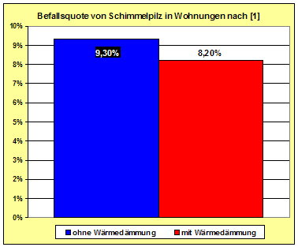
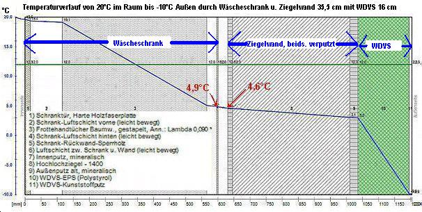

[🠔 Zur Übersicht: Schimmel im Haus](7schim.md)  
# Schimmelpilzbefall durch und trotz Dämmung
**Wie Sie durch rücksichtsloses Energiesparen Ihr Haus kaputtdämmen. Schimmelpilzbefall inklusive.**  
_von Konrad Fischer_

Wie Sie durch rücksichtsloses Energiesparen Ihr Haus kaputtdämmen 

Schimmelpilzbefall inklusive

## Schimmel durch Wärmedämmung? [5]

Ein nach wie vor aktueller Leserbrief zu bausubstanz 9/98: 
**"Schimmelbefall läßt sich vermeiden - Wärmedämmverbundsysteme im Bestand"** 
von Wilhelm Michel, Pressereferent Fachverband Fassaden-Vollwärmeschutz, 
[darin Befürwortung Wärmedämmverbundsysteme (WDVS) als wirksame Maßnahme gegen Schimmelbefall], 
erschienen in bausubstanz 11/98: 
_Seit wann brauchenspeicherfähige Massivbauten nachträgliche Dämmung? Damit wird doch nur der kostenlose Energiegewinn durch Solarstrahlung blockiert. Nach Praxismessungen an massiv gebauten Nordfassaden (z.B. Schule Bruchsal) ergibt sich daraus auch im Winter ein deutliches Plus gegenüber der Wärmeabstrahlung._

_Der ganzen von Herrn Michel als WDVS-Vertreter aus naheliegenden Gründen vertretenen Auffassung liegt der Irrtum zugrunde, daß die Berechnungsvorgänge der WSVO_ [EnEV] _auf speicherfähige Bauteile anwendbar wären. Dies ist falsch! Der k-Wert beschreibt nur stationäre Zustände, die ausschließlich für nicht speicherfähiges Dämmmstoffe und im Labor zutreffen mögen._

_In der Praxis herrschen aber instationäre, also veränderliche Bauzustände, hervorgerufen durch Tag-Nacht- und Klimawechsel. Nur speicherfähige, massive Bauweisen sind dafür energetisch sinnvoll. Bei ihnen führt die Anwendung der WSVO[EnEV] in der vorliegenden Form zu wirklichkeitsfernen, wissenschaftlich unhaltbaren und insgesamt sinnlosen Ergebnissen. Sie schädigen Umwelt, Bauwerk, Benutzer und Besitzer._

_Die Wirklichkeit betreffend Schimmel und Feuchte sieht anders aus:_

_1. Bei speicherfähigen Bauten können mit der WSVO[EnEV]-Berechnung keine hygienisch sinnvollen Maßnahmen errechnet werden (vgl. Dr. F. Khoda: Baubiologie und Gips, Sonderdruck baustofftechnik, Fachzeitschrift für Baustoffe und Baustoff-Anwendung, o.J.)._

_2. Die anzuwendende DIN 4108 und auch Herr Michel lassen fälschlicherweise unberücksichtigt, daß bau- und gesundheitsgefährdendes "Schimmelwachstum bereits bei geringen Oberflächenfeuchten einsetzt" (Univ.-Prog. Dr.-Ing. G. Hauser: Wärme und Feuchteschutz, in: Wohngesundheit im Holzbau, Informationsdienst Holz, DGfH, München 1998). Diese Feuchten entstehen sehr schnell bei "modern" dichten Fenstern. Umfangreiche Praxismessungen von Prof. Dr. Ing. Roloff, TU Dresden haben ergeben, daß die von Michel propagierte "Stoßlüftung" dagegen überhaupt nichts nützt._

_3. Die erhöhten Wachstumsraten von Schimmelpilzen sind gerade bei gem. WSVO [EnEV] gedämmten Gebäuden üblich (vgl. Prof. Dr.-Ing. habil. Dr. h.c. mult. Dr. E.h. mult K. Gertis u.a., Fraunhofer Institut für Bauphysik: Klimawirkungen und Schimmelpilzbildung bei sanierten Gebäuden, in: DFG-Forschungsschwerpunkt Bauphysik der Aussenwände, Int. Bauphysikkongress TU Berlin 1997, Fraunhofer IRB Verlag, Stuttgart 1997)._

_Zusammenfassung:_

_Wer speicherfähige Altbauten nachträglich dämmt, ist einer gewissenlosen Wärmedämmreklame aufgesessen, die das Wohl der Umwelt, des Bauwerks und dessen Bewohner sowie des Investors anderen Interessen unterordnet. Außerdem ist nachträgliche Dämmung - und das zeigen alle ernstzunehmenden Wirtschaftlichkeitsberechnungen - ein absolutes Verlustgeschäft für den Investor und deswegen gem. § 5 Energieeinsparungsgesetz verboten._

_Dipl.-Ing. Konrad Fischer, Architekt BYAK_

Und schon 1990 schrieb Dr.-Ing. H. Künzel vom Fraunhofer-Institut für Bauphysik zu den Tatsachen im überfeucheteten Raumluftklima in: 

_Sollen Hausaußenwände atmungsfähig sein? in: Physik unserer Zeit, 21 (1990) Heft 6:_

_"Man muss bedenken, dass durch einmaliges, kurzes Lüften zwar die Feuchtigkeit aus der Luft, nicht aber die in Oberflächenschichten absorbierte Feuchte abgeführt werden kann. Dies war nur bei den früher verwendeten undichten Fenstern möglich, die einen ständigen Luft- und Feuchteaustausch mit der Außenluft zuließen."_

Es geht also nicht um vergebliches Stoßlüften oder gar Dämmen, sondern um ein bisserl praktischen Bauverstand. Wo ist der heute noch zu finden? 

Aus einer Publikationswerbung Thema Schimmelpilzbefall in hochwärmegedämmten Bauwerken im Vergleich zu ungedämmten Altbauten: 

_"**[Schimmelpilzbefall bei hochwärmegedämmten Neu- und Altbauten](http://www.baufachinformation.de/artikel.jsp?v=224934)** 
Erhebung von Schadensfällen - Ursachen und Konsequenzen. Abschlussbericht Bau- und Wohnforschung, F 2506 
Rainer Oswald, Geraldine Liebert, Ralf Spilker, 2008, 91 S., 32 Abb., 22 Tab., 
ISBN 978-3-8167-7480-8 | Fraunhofer IRB Verlag 

Das Aachener Institut für Bauschadensforschung und angewandte Bauphysik (AIBau gGmbH), das seit über 30 Jahren auf dem Gebiet der Bauschadensforschung tätig ist, hat eine Forschungsarbeit zu Schimmelpilzschäden bei hochwärmegedämmten Neu- und Altbauten vorgelegt, die vom Bundesamt für Bauwesen und Raumordnung (BBR) gefördert wurde. Die These, dass hochwärmegedämmte, luftdichte Gebäude vermehrt zur Schimmelpilzbildung neigen, konnte nicht bestätigt werden. Die Arbeit beruht im Wesentlichen auf zwei Untersuchungen: 

Durch eine Studie der Arbeitsgruppe Raumklimatologie (ark) am Universitätsklinikum Jena zu der speziellen Gruppe der hochwärmegedämmten Gebäude war eine quantitative Beurteilung möglich. Während Schimmelschäden am Gesamtbestand in Deutschland bei etwa 9,3 Proz. der Wohnungen auftreten, liegt diese Zahl bei der Gruppe gut wärmegedämmter Gebäude bei ca. 8,2 Proz. Ebenso kommt eine bundesweite Umfrage des AlBau unter öffentlich bestellten und vereidigten Bausachverständigen zu dem Ergebnis, dass ein vermehrtes Auftreten von Schäden bei hochwärmegedämmten Gebäuden von den weitaus meisten Befragten nicht festgestellt wurde."_[1] 

Dieses Jenenser Forschungsergebnis hat [Matthias Bumann](http://www.schimmelpilz-sanieren.de/info/wd/wd01.htm) mal in der linken Grafik veranschaulicht. Dazu drängen sich mindestens dem kritisch-hinterfragenden Zeitgeist eines junggebliebenen Alt68er folgende Fragen auf: 

Wieviele der verschimmelten Altbauwohnungen ("9,3 Prozent") hatten erstens gummilippendichte Isolierfenster als erste allseits lobbygestützte (und dank perfidem Mietrecht sogar als "Modernisierung" auf die armen Mieter umzulegende) "Energiesparmaßnahme" zur "Wohnwertverbesserung"? 

Und wieso liegt der Schimmelbefall zum Zweiten in hochwärmegedämmten Gebäuden (System Passivhaus, Niedrigenergiehaus, KfW-Energiesparhäuser 40, 60) bzw. nach energetischer Sanierung nur so dermaßen gering (!!!) unter den schimmelbefallenen Altbauten? 

War das nicht drittens ganz anders versprochen und ist viertens die geringfügigste "Abnahme" des Befall vielleicht durch die konsequente Information ("Lüftungsleitfaden") und Bewußtseinsbildung der betroffenen Verdämmten hinsichtlich besserem Lüften geschuldet, gab es fünftens vielleicht sogar den Einbau zusätzlicher Lüftungstechnik? In der Dissertation ["Ursachen, begünstigende Faktoren, Auswirkungen und Prophylaxe von Feuchtigkeit und Schimmelpilzbildung in Wohnräumen"](http://www.db-thueringen.de/servlets/DerivateServlet/Derivate-2077/Fleisch.pdf) der Ärztin Sabine Fleischmann an der Friedrich-Schiller-Universität Jena 2003 ist auf Seite 58 folgender Zusammenhang zwischen Wärmedämmung, Fensterdichtung und Schimmelpilzbefall zu finden: 

_"In fast jeder Wohnung (befallen und unbefallen) wurden nach Juli 1990 besser wärmedämmende Fenster eingebaut und in einzelnen feuchten Wohnungen die Fenster nachträglich noch abgedichtet. Daraufhin traten in zwei Drittel der derzeit befallenen Wohnungen erstmalig (46,5%) oder vermehrt (18,6%) Feuchtigkeit und Schimmelbefall auf. In jeder dritten feuchten und trockenen Wohnung wurden noch andere Dämmmaßnahmen durchgeführt, wie z. B. Außendämmung, Deckendämmung und Horizontalisolierung."_ 

[Eingeführt wird die Dissertation](http://www.db-thueringen.de/servlets/DocumentServlet?id=1014) so (Auszug): 

_"In den letzten Jahren ist eine Zunahme von feuchte- und schimmelpilzbelasteten Wohnungen in Deutschland in Folge gesteigerter Isolierungsmaßnahmen mit verstärkter Fenstererneuerung festzustellen. Schimmelpilze können Sporen, Myzelbestandteile, Toxine und flüchtige organische Verbindungen (MVOC) an die Raumluft abgeben und geruchsbelästigend, schleimhautreizend, allergisierend, infektiös und toxisch wirken. Am Institut für Allgemeine, Krankenhaus- und Umwelthygiene führten wir in Jena und Umgebung von 1998 bis 2000 eine umfangreiche Untersuchung über Feuchtigkeit und Schimmelpilzbefall in Innenräumen durch. Unter den aktuellen Bedingungen im Raum Jena ermittelten wir Ursachen und begünstigende Faktoren von Schimmelbefall in Wohnungen und deren gesundheitliche Auswirkungen ..."_ 

Leider ist die Verfasserin wie so viele auch auf das nur auf getürktem Rechenmodell und interessierten Falschdarlegungen in der angeblichen Fachliteratur beruhenden Dämmstoffmärchen hereingefallen, wonach sich durch Außendämmung der Wände innen höhere Wandoberflächentemperaturen einstellen würden. Genau diese Theorie ist aber durch die langfristigen Messungen des Fraunhofer-Instituts für Bauphysik (1985) widerlegt worden. Und meßtechnische Beweise für die Falschtheorie einer Wanderwärmung innen durch Wärmedämmung außen? Wo bitteschön? Und für den Sommerfall informieren die Dämmfans ausnahmsweise mal die Wahrheit: _"Durch die gute Außendämmung bleibt im Sommer die Hitze draußen."_ (aus: www.das-energieportal.de/energieberatung/kuehlung/auch-bei-hitze-cool-bleiben/) Wobei das dann im Winter nach den einschlägigen Berechnungen wieder nicht gelten soll, denn da soll ausgerechnet die alltäglich solaraussperrende Dämmung plötzlich wärmen und für höhere Innenwandtemperaturen sorgen, die doch eigentlich nur vom Heizsystem nach entsprechender Thermostatregelung geliefert werden und dann nur noch von der an der Innenseite gegebenen Beschaffenheit der Oberfläche hinsichtlich deren spezifischer Wärme(ab-und-ein)leitung und der Wärmespeicherung sind. Lassen wir also den Raum allnächtlich auskühlen, werden die mehr wärmedämmenden und weniger wärmespeichernden Oberflächen schneller und tiefer auskühlen, wogegen es beim Aufheizen gerade andersrum ist. 

Ist sechstens der grundsätzlich wegen der damit verbundenen irren Kosten extrem höher anzunehmende Sozialstatus der typischen Besitzer hochwärmegedämmter Einfamilien-Dämmbüdli (z.B. kinderlose Lehrer, Banker, Manager, Chefärzte, Immobilienhaie, Heuschrecken, Topjournaille, Planer, Handwerker und sonstig erfolgreiche Ökoprofiteure) verantwortlich für eine geringere Belegungsdichte, Wohnintensität und damit auch Schimmelgefahr? Und wie wird siebtens diese fröhliche Darstellung kontrastiert durch derartige News?: 

[Experte warnt: Jede dritte Wohnung mit Schimmelpilzen verseucht](http://www.enius.de/presse/848.html) - Zitat daraus: "In den so genannten Energiesparhäusern gibt es häufig Probleme mit Feuchtigkeit und, daraus resultierend, mit Schimmelpilzen", bestätigt der Vorsitzende des Umweltausschusses der Kassenärztlichen Vereinigung Schleswig-Holstein, Ralph Urban." 

[Schimmelpilz in Gebäuden: Zwei Würzburger Experten überzeugen bei Münchner Fachkongress](http://openpr.de/news/76772/Schimmelpilz-in-Gebaeuden-Zwei-Wuerzburger-Experten-ueberzeugen-bei-Muenchner-Fachkongress.html) - Zitat: _"Jede 2. Wohnung könnte mit (verstecktem) Schimmelpilzwachstum betroffen sein."_ 

[Schimmelpilz u. Feuchtigkeit](http://www.mietrecht-forum.com/topic,436,-schimmelpilz-u-feuchtigkeit.html) - Zitat: _"Werden ... Außenmauern und Dach zu sehr gedämmt, kann sich in der Wohnung leichter Schimmel bilden. ... Die EnEV könnte dafür sorgen, dass die Häuser noch luftdichter verpackt werden und die Bewohner der Feuchtigkeitsbildng nur entgegenwirken können, wenn sie mehr lüften und so möglicherweise mehr Energie vergeuden als vor einer umfangreichen Gebäudedämmung. ... Schimmelpilz durch Isolierglasfenster ..."_ 

[Keimverseuchung in den eigenen vier Wänden - Schimmel - Versteckte Gefahr in der Wohnung](http://www.swr.de/swr1/rp/tipps/alltag/-/id=446800/nid=446800/did=473710/78zwc8/index.html) - Zitat: _"In 75 Prozent aller Wohnungen lassen sich Keime nachweisen", so der Experte. Dabei sind nur in 10 Prozent aller Fälle, die er begutachtet hat, auf falsches Lüften zurückzuführen. Meist sind die verwendeten Baustoffe die Ursache für Schimmelbefall. Außerdem spielt die Tatsache, dass die heutige Bauweise von Häusern keine natürlichen Luftaustausch mehr ermöglichen, eine entscheidende Rolle."_ 

["Schimmelpilzschnüffler im Einsatz" - HR3](http://www.gaea-umweltconsulting.de/aktuelles/single-news/index.html?tx_ttnews%5Btt_news%5D=2&tx_ttnews%5BbackPid%5D=6&cHash=d1b7f5f446) - Zitat: _"In rund 40 Prozent aller Wohnungen gibt es ein Schimmelproblem. ... problematisch: Die Sanierung von alten Häusern mit ungeeigneten Materialien. Werden hier stark isolierende Fenster und wärmedämmende oder abdichtende Stoffe verwendet, funktioniert die frühere Feuchtigkeitsregulation nicht mehr: Schimmel entsteht. Betroffen sind auch Neubauten, mit einer zu kurzen Trocknungsphase vor dem Bezug. Nur in 10 bis 15 Prozent aller Fälle ist falsches Lüften oder Heizen Grund für Schimmel!"_ 

Fazit: Die Wahrheit hat mehr als zwei Gesichter ... 

Und um zu verdeutlichen, was hier in bauphysikalischer Hinsicht wirklich läuft, wenn angebliche Schimmelexperten die Dämmung von Außenwänden empfehlen, erst mal etwas Bauphysik: 

 Taupunkttemperatur für +10 °C bis +30 °C 
bei einer relativen Luftfeuchte von 30% bis 95% 
°C 30% 35% 40% 45% 50% 55% 60% 65% 70% 75% 80% 85% 90% 95% 
30 10,5 12,9 14,9 16,8 18,4 20,0 21,4 22,7 23,9 25,1 26,2 27,2 28,2 29,1 
29 9,7 12,0 14,0 15,9 17,5 19,0 20,4 21,7 23,0 24,1 25,2 26,2 27,2 28,1 
28 8,8 11,1 13,1 15,0 16,6 18,1 19,5 20,8 22,0 23,2 24,2 25,2 26,2 27,1 
27 8,0 10,2 12,2 14,1 15,7 17,2 18,6 19,9 21,1 22,2 23,3 24,3 25,2 26,1 
26 7,1 9,4 11,4 13,2 14,8 16,3 17,6 18,9 20,1 21,2 22,3 23,3 24,2 25,1 
25 6,2 8,5 10,5 12,2 13,9 15,3 16,7 18,0 19,1 20,3 21,3 22,3 23,2 24,1 
24 5,4 7,6 9,6 11,3 12,9 14,4 15,8 17,0 18,2 19,3 20,3 21,3 22,3 23,1 
23 4,5 6,7 8,7 10,4 12,0 13,5 14,8 16,1 17,2 18,3 19,4 20,3 21,3 22,2 
22 3,6 5,9 7,8 9,5 11,1 12,5 13,9 15,1 16,3 17,4 18,4 19,4 20,3 21,2 
21 2,8 5,0 6,9 8,6 10,2 11,6 12,9 14,2 15,3 16,4 17,4 18,4 19,3 20,2 
20 1,9 4,1 6,0 7,7 9,3 10,7 12,0 13,2 14,4 15,4 16,4 17,4 18,3 19,2 
19 1,0 3,2 5,1 6,8 8,3 9,8 11,1 12,3 13,4 14,5 15,5 16,4 17,3 18,2 
18 0,2 2,3 4,2 5,9 7,4 8,8 10,1 11,3 12,5 13,5 14,5 15,4 16,3 17,2 
17 -0,6 1,4 3,3 5,0 6,5 7,9 9,2 10,4 11,5 12,5 13,5 14,5 15,3 16,2 
16 -1,4 0,5 2,4 4,1 5,6 7,0 8,2 9,4 10,5 11,6 12,6 13,5 14,4 15,2 
15 -2,2 -0,3 1,5 3,2 4,7 6,1 7,3 8,5 9,6 10,6 11,6 12,5 13,4 14,2 
14 -2,9 -1,0 0,6 2,3 3,7 5,1 6,4 7,5 8,6 9,6 10,6 11,5 12,4 13,2 
13 -3,7 -1,9 -0,1 1,3 2,8 4,2 5,5 6,6 7,7 8,7 9,6 10,5 11,4 12,2 
12 -4,5 -2,6 -1,0 0,4 1,9 3,2 4,5 5,7 6,7 7,7 8,7 9,6 10,4 11,2 
11 -5,2 -3,4 -1,8 -0,4 1,0 2,3 3,5 4,7 5,8 6,7 7,7 8,6 9,4 10,2 
10 -6,0 -4,2 -2,6 -1,2 0,1 1,4 2,6 3,7 4,8 5,8 6,7 7,6 8,4 9,2 

Dieser Datenbereich entspricht den üblichen Raumtemperaturen in Wohnungen und sonstigen Aufenthaltsräumen. Die kritische Oberflächentemperatur, ab der es gewöhnlicherweise (ca. 60 % rel. Feuchte) zum Kondensatausfall kommt, liegt bei etwa +12 °C. 

Der für 50% rel. Luftfeuchte und +20 °C Raumlufttemperatur gekennzeichnete Wert heißt für die Luft, daß darin je m³ 8,65 g Wasser enthalten sind, die Taupunkttemperatur liegt dafür bei +9,3 °C. Bei einer relativen Raumluftfeuchte von 70% - schnell in allen Räumen erreichbar in den mit Isolierfenstern ausgestatteten Wohnungen, außerdem in jedem Bad, jeder Dusche und Küche und jedem Waschraum - ist dann 10,2 g Wasserfracht / m³ Raumluft enthalten. Die dann schon bei 14,4 °C Oberflächentemperatur auskondensiert. Und diese "Unterkühlung" stellt sich bei Ihrer [Konvektionsheizung](7temper.md) so gut wie von selbst ein, und zwar in der Außenwand-Boden-Ecke und an der Außenwand-Decken-Ecke, wo Ihre Heizluftwalze eben nicht so schön hinkommt - aus strömungstechnischen Gründen. Jedes Infrarotthermometer kann Ihnen hierzu ungeheuerliche Erkenntnisgewinne bieten. 

Fazit: Die Taupunkttemperatur nähert sich mit zunehmender relativer Luftfeuchte immer mehr der Raumlufttemperatur. Es ist also die relative Raumluftfeuchte, die bei angenehmer Raumtemperatur (und auch, wenn Sie energiesparend vor sich hinbibbern) den Schimmelpilzbefall fördert. 

Und wenn Sie glauben, daß Schimmelbuden durch bessere Wärmedämmung weniger schimmeln, hier eine weitere bauphysikalische Betrachtung: 

 Links sehen Sie, was nach offizieller Berechnung gem. EnEV und DIN in Ihrem Wäscheschrank als quasi unbeabsichtigte Innendämmung an der Außenwand los ist, wenn Sie Ihre schöne Altbau-Ziegelwand aus 36,5er beidseitig verputztem Hochlochziegel-Mauerwerk für Zigtausende mit 16 cm Polystyrol-Wärmedämmverbundsystem WDVS bebappen, weil es der Experte so wollte. 

_"Zur Erhöhung der Temperatur an den schimmelbefallenen Oberflächen, als vorrangige (und gottseidank teuerste) Maßnahme gegen den Schimmel"_ , der schon vorher hinter Ihrem oder Ihres Mieters Wäscheschrank blühte, hat es so hoffnungsfroh geheißen. 

Und wenn Sie wegen eines Augenleidens oder weil Sie wegen Ihrer schon getätigten Sinnlosinvestition in die Dämmfassade so sehr greinen müssen, daß Sie jetzt nicht so genau hinstieren können, damit auch Ihnen deutlich wird, wie bitter kalt es hinter dem Schrank bei 20 Grad Celsius Raumlufttemperatur und minus 10 Grad draußen / Außentemperatur bei nur 50-prozentiger relativer Raumluftfeuchte wird, bitteschön: 

4,9 °C an der Schrankwand und 4,6 °C am Innenputz. 

Und da wir oben gelernt haben, daß bei diesen Konditionen ab 9,4 Grad das Kondensat zu plätschern beginnt, können Sie sich selber ausmalen, wo es dann im Wäscheschrank das Aufnässen beginnt, und wie sehr es selbst bei günstigeren Außentemperaturen noch drum herum das Schimmeln beginnt. Ach so, die waagrechte grüne Linie zeigt die kritischen 12 °C an. 

Und nie mehr kann etwas warmer Sonnenschein die Situation an der speicherfähigen Massiv-Ziegelwand soweit verbessern, daß derartige Temperaturereignisse weitgehend vermieden werden. 

Da rinnt Ihr Raumluftkondensat nicht nur bei 50 Prozent relative Raumluftfeuchte als Bächlein die Wände runter und Ihre Energiesparinvestition den Bach, nein, es schimmelt weiter wie wild. Trotz energetischer Sanierung und Schimmelvermeidungsdämmung. Klaro? Und übrigens, auch Ihr Experte und vor allem Ihr Energieberater kann mit seiner Software das gleiche herausbekommen. Doch vielleicht sind diese Brüder und Schwestern eher auf die Bedürfnisse und Umsatzerwartungen der Ökoprofiteure ausgebildet, nicht auf Ihr Wohl und Wehe? Trau, schau, wem? 

Was tun? Lesen Sie doch erst mal weiter ... 

Link: [k/U-Wert-Narretei](2139bau.md#u-narretei)

Weiter: [6 - Schimmelpilz und Medizin](7sch06.md)
