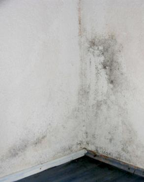
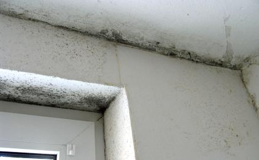

# Die Schimmelpest 7: Weisser, brauner, schwarzer, grüner, roter Schimmel an der Wand - Sanierung - Leitfaden 1

### Schimmelbefall in Wohnung/Bad/Schlafzimmer/Wohnzimmer bekämpfen + sanieren - Schimmelpilzbefall - Ursachen und Beseitigung: Feuchte, Pilzbefall / Stockflecken durch Dichten und Dämmung - Ratgeber

 Inhaltsverzeichnis: 
Kapitel [1 Einleitung und Fallbeispiele](7schim.md) [2 - Fogging](7sch02.md) [3 - Das Schimmelgeschäft](7sch03.md) [4 - Schimmelsachverstand](7sch04.md) [5 - Schimmel durch Wärmedämmung?](7sch05.md) [6 - Schimmelpilz und Medizin](7sch06.md) **7 - Schimmel an der Wand - Ursache und Beseitigung / Ratgeber und Leitfaden 1** [8 - Schimmel an der Wand - Ursache und Beseitigung 2](7sch08.md) [9 - Schimmel an der Wand - Ursache und Beseitigung 3](7sch09.md) [10 - Schimmel an der Wand - Ursache und Beseitigung 4](7sch10.md) [11 - Schimmel an der Wand - Ursache und Beseitigung 5 ](7sch11.md) [12 - Schimmel an der Wand - Ursache und Beseitigung 6](7sch12.md) 

[Combating black mold infestation](7mold.md) [Attaque de moisissure - humidité, asthme et allergie dans le bâtiment - Que faire?](moisissure.md) [El ataque del moho - ¿qué hacer? Una guía](7moho.md) 

Nachfolgend ein kostenloser Leitfaden für Hausbesitzer, Vermieter und Mieter zum Schimmelpilzbefall an der Wand, der als Vortrag (DECHEMA, Frankfurt a.Main) und in Fachzeitschriften (u. a. "Der Vermieter") Aufmerksamkeit fand. Vielleicht auch für die mit Schimmelbefall kämpfenden Leser hier von Nutzen: 

**Schimmel an der Wand - Ursachen und Beseitigung 1 [7]**

_Das Thema Schimmel ist heute zum Dauerbrenner geworden. Meist geht es um falsche Bauweise nach ungeeigneten bauphysikalischen Rechentheorien, falsches Lüften und ungenügende Heiztechnik. Auf die häufigsten Fallgestaltungen soll hier eingegangen werden._

**Voraus:** Schimmelbefall ist nicht nur ein baulicher Mangel. Oft ist er mit krankmachenden Bakterien vergesellschaftet und scheidet selbst Giftstoffe aus - egal, ob als schwarzer, brauner, grüner, roter, gelber oder weißer Schimmelpilz auftretend. Erhebliche Gesundheitsgefahren sind damit verbunden. Nicht nur für Kinder und Heranwachsende, sondern auch viele immungeschwächte und streßüberlastete Erwachsene werden Opfer typischer Schimmelsymptome wie beispielsweise Asthma und Allergie, Kopfschmerz, Augentränen, Nasenlaufen, Gliederschmerzen, Erschöpfungszustände und Müdigkeit. 

 .  
Aus meiner [Bauberatung](2berat.md): Zwei typische Befallssituationen von Schimmelpilz in Wohnungen - im Schlafzimmer und Badezimmer (Bildautor: Rüdiger Thume)

Da die überhöhte Feuchte als Auslöser des meist an den Raumoberflächen als "Stockflecken" erstmals sichtbar werdenden Schimmelpilzbefalls die Bauwerksteile aus Holz betreffen kann, ist auch ein Befall mit feuchteliebenden Holzschädlingen wie Echter Hausschwamm, Weißer Porenschwamm, Brauner Kellerschwamm, Blättling und andere Naßfäulepilze sowie holzzerstörende Insekten wie der Gemeine Nagekäfer, der Trotzkopf und der Hausbock nicht auszuschließen. Deswegen dürfen die nachfolgenden Empfehlungen nicht als verbindliche Lösungen verstanden werden, sondern sind durch medizinischen, mykologischen, holzschutz- und bautechnischen Sachverstand zu ergänzen. 

[ 
© Götz-Wiedenroth-Karikatur: Klima-Kamikaze (durch Energiepass-Weltklasse): 
"Ich habe mich zur CO2-Einsparung für Maximaldämmung entschieden - Für die Schimmelpilze in dieser Wohnung hat sich das Klima schon total verbessert!"](http://gwiedenroth.googlepages.com/)

**Begutachtung des Schimmelbefalls**

Werden aus Beweissicherungsgründen, zur Begutachtung gesundheitlicher Risiken oder bei unklarer Befallslage detaillierte Untersuchungen über Umfang und Art des Schimmelpilzbefalls erforderlich, sollte man sich zunächst vom staatlichen Gesundheitsamt beraten lassen. Diese können dann Sachverständige für die weitere Untersuchung benennen. Tipp: Mehrere Angebote einholen und den Auftrag mit dem Gesundheitsamt abstimmen.

Und vor diesem kostenintensiven Weg in einen Rechtstreit gäbe es auch die Möglichkeit, die Ursache des Schimmelbefalls durch kostengünstige Eigenleistung faktensicher festzustellen, indem in der Wohnung über eine angemessene Zeitdauer Klimamessungen durch ein Meßgerät für Raumlufttemperatur und Raumluftfeuchte mit integriertem Datenlogger durchgeführt werden. Die eindeutig erfaßten und zweifelsfrei dokumentierten Klimadaten können dann beweisen, ob die Wohnung / Mietwohnung nutzerseits / vom Mieter ausreichend geheizt und gelüftet wurde.

Ist eine möglicherweise schimmelinduzierte Gesundheitsstörung vorhanden, wird hier auf das von Dr. med. Frank Bartram, Weißenburg, entwickelte Schimmel-Selbsttest-Set verwiesen. Im Zusammenhang mit einer Blutwertanalyse kann damit der Ort des gesundheitsschädlichen Befalls im Wohn-, Arbeits- oder Freizeitbereich genau lokalisiert werden.

Konrad Fischer: Fassaden energetisch richtig und kostensparend sanieren 1 

[Teil 2](http://www.youtube.com/watch?v=Y1NSxAW15Cc) [Teil 3](http://www.youtube.com/watch?v=RAT7VzBo8k0) [Teil 4](http://www.youtube.com/watch?v=6TBII25iVQk) [Teil 5](http://www.youtube.com/watch?v=Kb0C4KiZvVA) 

 Weiter [8 - Schimmel an der Wand - Leitfaden 2](7sch08.md)
