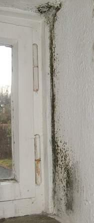
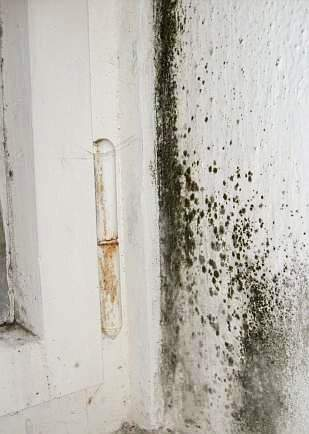
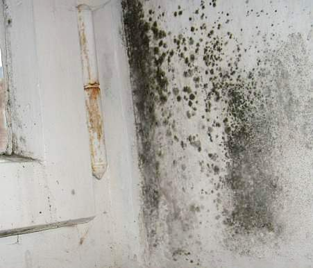
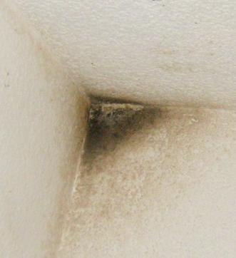

[🠔 Zur Übersicht: Schimmel im Haus](7schim.md)  
# Schimmel an der Wand - Ursache und Beseitigung 2
**Meistens geht es um als Stockflecken beginnenden Schimmelbefall in wenig geheizten Schlafräumen und anderen untertemperierten Bereichen, oft in Folge von Temperaturabsenkung bei unstetigem Heizungsbetrieb.**  
_von Konrad Fischer_

## Schimmelpilzbefall - ein Leitfaden 2

## Schimmelpilz im Wohnzimmer und Schlafzimmer, 

im Konderzimmer, Bad 

und auf der Dämmtapete - wieso?

[English version](7mould.md) 

## Schimmel an der Wand - Ursache und Beseitigung 2 [8]

## Fallgruppe Feuchte und Schimmel im Wohnbereich

Meistens geht es um als Stockflecken beginnenden Schimmelbefall in wenig geheizten Schlafräumen und anderen untertemperierten Bereichen, oft in Folge von Temperaturabsenkung bei unstetigem Heizungsbetrieb. Soll man nun Außendämmung anbringen, um die Wandtemperatur zu erhöhen und die "eiskalte Wand" zu vermeiden? Um das ecklige Hautjucken, Asthma, Allergie, Hustenanfälle mit Reizhusten, tränenden Augen und rotzenden, verheulten Kindern in den überdichten und oft vergeblich gedämmten Wohnräumen/Wohnungen abzuschaffen? Dazu rät der gewöhnliche und gemeingefährliche Schimmelberater als bauschwachverständiger Schlechtachter dank unverstandener Bauphysik immer wieder und fordert als "Baugutachter" oder gar öffentlich bestellter und vereidigter Sachverständiger für Schäden an Bauwerken, insbesondere Schimmelpilzbefall kostenintensive und schadensanfällige Baumaßnahmen wie Zusatzdämmung an der Außenwand, Zwangslüftung, Kalziumsilikatplatten, ... und weist dann die Schimmelpilzursache dem Bauwerk zu. Vielleicht sogar nach teurer Suche nach "wärmeschutztechnischen Schwachstellen" mithilfe aufwendiger Gerätetechnik wie Infrarot-Thermographie dank Wärmebildkamera oder IR-Thermometer (kostet extra). Folge: Der gelackmeierte Hauseigentümer hat schuld am Scharzschimmelbefall oder grünen Schimmelpilzrasen, weil er nicht richtig gedämmt hat. Dabei ist wirklichen Fachleuten seit Ewigkeiten bekannt, daß es erstens keinerlei meßtechnischen Beweis für die Anhebung der Innenwandtemperatur durch solarstrahlungsblockierende Außendämmung gibt und zweitens die ganz im Gegenteil quasi immer kühlende Wirkung von Außendämmung sogar frech beworben wird: [Verbraucherschutz: "Sommerhitze: Gute Wärmedämmung hilft"](https://www.verbraucherzentrale.de/sommerhitze-waermedaemmung) - bei gleichzeitiger Anpreisung des Wunders, daß eine Fassadendämmung im Winter urplötzlich umschaltet, um ab dann das Haus zu wärmen.

Wenn Sie also einen solchen Experten suchen, achten Sie darauf, daß er die falsche Bauphysik ohne Sonne beherrscht, fleißig von "Wärmebrücken" und mangelhafter Wärmedämmung / mangelhaftem Wärmeschutz und der irrsinnigen Stoßlüftung schwätzt und möglichst viel wärmetechnische und feuchtetechnische Meßtechnik einsetzt, garniert von mehrdimensionalen Wärmestromberechnungen zum Vergleich mit dem seit interessensgeleitet vom entsprechenden DIN-Ausschuß extrem angehobenen ["Mindestwärmeschutz" nach DIN 4108](7din4108.md), wenn es um Schimmel geht. Denn [Normentreue](2mbu.md) und Vorschriftenglaube auf der Schleimspur der interessensgeleiteten Vereinsmeier-Akteure in den DIN-ev.V.-Ausschüssen, dem industriehonorierten DIBt und der lobbyistenregierten Regierungsadministration und Politik ist bei der vergeblichen Suche nach Bauproblemen und -lösungen bestimmt durch nichts zu ersetzen.

All die sachverständig empfohlenen Kanonschläge gegen den spatzigen Schimmelpilzbefall helfen natürlich gar nichts oder nicht wirklich oder nicht genug und sind trotzdem teuer, oft genug sogar verschlimmbessernd. Schimmel braucht erst mal Feuchte. Diese kommt - von Extremfällen wie Baufeuchte aus neuen Betonböden, frischen Estrichen und Putzen oder Leitungswasserschäden, undichten Regenrinnen, Fallrohren, Grundleitungen, undichtem Dach, [feuchteanlagernden Schadsalzen in Baustoffen](2aufstfe.md) oder nässendem Altkamin mal abgesehen - aus der überhöhten Raumluftfeuchte. Ab ca. 55 % rel. Feuchte / Raumluftfeuchte kann für den Schimmelbefall schon genügen, denn die Luft kühlt an den unterkühlten Bauteilen (vgl. Kondensation an Bierflasche aus Kühlschrank im Sommer) mehr oder weniger ab und dabei steigt ihr relativer Feuchtegehalt schnell auf ungeahnte Prozentwerte. Genau dieses Problem macht sich nun die idiotenmäßige Stoßlüftung zunutze: Sie treibt zwar ein paar Gramm Wasser mit der Feuchtwarmluft aus der Raumluft, kein Gramm jedoch aus dem infolge vorheriger Nichtlüftung schon ins Bauwerk und dessen Ausstattung (Möbel, Textilien, Bilder, ...) eingetauten Kondensat, das sich in den Poren flüssig niedergeschlagen hat. Dann kühlt die eisige Kaltluft der Stoßlüftung die außenwandnahen Bauteilzonen ein paar Grad herunter - und diese werden dann nach dem folgenden Fensterverschluß, wenn die arme Heizung mühselig ein Paar Tropfen aus dem aufgenäßten Bau heraustrocknet und neuerlich der Raumluft zuführt, in den dann stoßlüftungsgekühlten fassadennahen Bereichen gerne wieder hineingetaut. Bei höheren Raumluftfeuchten genügen dem Tauwasserausfall schon geringste Temperaturunterschiede. 

Und nochmals: Es kommt immer zuerst auf die Feuchte an, nicht auf die Dämmung oder die Temperatur der Wand! Da muß jede Sanierung ansetzen, nicht am Geldrausschmeißen mit Wärmedämmung - der Lieblingsvorschlag der Schimmelpilzscharlatane und Dämmfans. Vielleicht sogar garniert mit krankmachender Zwangslüftung, heute ohne unwirtschaftlich verteuernde Wärmerückgewinnung fast nicht mehr zu haben. 

   
_Schimmelpilzbefall in der Fensterleibung. Einige Tage geschlossenes Fenster in der ungeheizten Speisekammer genügten, um das Kondensat aus der tagsüber ein paar mal einströmenden warmfeuchten Küchenluft im Fensterbereich soweit anzureichern, daß Schwarzschimmel-Befall einsetzte. 

Beachte: Aufgrund der Frostperiode war das Mauerwerk tagsüber kälter als die Einfachglasscheibe, die damit ausgerechnet während des Haupt-Kondensatanfalls nicht als Sollkondensator funktionieren konnte._ 

Ein Vierpersonenhaushalt gibt täglich durch Kochen, Waschen, Baden, Duschen, Blumengießen, Atmen usw. zwischen ca. 7 - 15 Liter Wasser in die Raumluft ab. Im Ruhezustand gibt der Mensch ca. 0,1 Liter/Stunde an die Raumluft ab, bei mäßiger Bewegung bis ca. 0,5 Liter, tobende Kinder sogar bis 1 Liter. Und dagegen hilft die auch von Bauphysikern beschworene "Stoßlüftung" - also eine minutenlange Querlüftung durch Fensteröffnung - gar nichts. 

Ist die Luft durch die dauernde Feuchteabgabe "zu" feucht, kondensiert sie zwangsläufig an kühlen Oberflächen und bildet flüssiges Wasser in den Baustoffporen. Um dieses zu verdampfen, müßte Energie aufgewendet werden. 

Stoßlüftung - und ebenso ständig gekippte Fenster - liefern aber keine Energie in die durchnässten Baustoffporen. Im Gegenteil: die Außenwände kühlen weiter ab, oft unterstützt durch ausgerechnet bei nächtlicher Abkühlung verminderte Heizung (Nachtabsenkung), der Kondensateintrag nimmt weiter zu. Dabei lagert sich das Kondensat genau da an, wo der Konvektionsluftstrom der [lufterhitzenden Heizung](7temper.md) nicht ausreichend hinkommt: 

In Wand-Decken-Zwickeln, in Raumecken, an Sockelzonen, im fensternahen Bereich der Kaltluftströmung nur zeitweise, aber insgesamt unzureichend gekippter Fenster und hinter Möbeln. Gerade die feuchte Luft ist nun besonders leicht und beweglich - die leichteren H2O-Moleküle verdrängen ja schwerere O2-Moleküle. Deswegen kann Feuchtluft besonders gut an unterkühlte, von trockener, warmer und schwererer Luft schlechter erreichbare Bereiche anströmen und einkondensieren. Mit den stationären Berechnungen der Bauphysik (Glaserdiagramm) kann man diesem nassen und instationären Gesetzen unterworfenen Treiben nicht auf die Schliche kommen, da ihre Tunnelblicktheorie dafür keine ausreichenden Voraussetzungen bietet. 

 
_Schimmel im Wohnzimmer: Im vom Heizluftstrom unterversorgten Wand-Decken-Zwickel /-Ixel ist es kälter, als an den sonstigen Flächen der Raumhülle. Dank der Isolierfenster steigt die Raumluftfeuchte ins Unermeßliche, kondensiert auf der scheußlichen Plastiktapete und unterstützt dort die Schimmelpilzzucht._

Diese strömungstechnisch von warmer Trockenluft unterversorgten Bereiche werden dann von den [normhörigen](2mbu.md) "Bauphysikern" als sog. Wärmebrücken mißgedeutet (Ausnahmen: Wandschwächung durch Nische oder Rollokasten sowie Bauteile in der Raumhülle, die höhere Wärmeleitfähigkeit haben, als ihre Umgebung: Stahlbetonflächen, Stahlträger, Zementmörtel zwischen wärmedämmenden Mauersteinen, ..., die dann aber auch durch noch so viel Außendämmung mit Raumheizung von innen her nicht schneller zu erwärmen sind, als ihre weniger wärmeleitende Umgebung!). Folglich fordern sie [bauphysikalisch unsinnigste Dämmmaßnahmen](http://www.waerme-im-dialog.de). Einige Bilder aus meinen Beratungsfällen können das verdeutlichen: 

 
_Schimmel im Bad 1: Geflieste Wände sind stark wärmeleitend, werden deswegen weniger schnell warm als Putz und können kurzfristig auftretende hohe Luftfeuchte nicht abpuffern. Das sorgt für besonders hohe Feuchtebelastung der restlichen Putzflächen, gerade im kalten, da beim kurzfristigen Lüften immer wieder unterkühlten Fensterbereich. Wobei der Befall entspechend der Kippstellung oben am umfangreichsten auftritt und nach unten abnimmt. Unmöglich, wenn es wirklich eine "Wärmebrücke" wäre._

 
_Schimmel im Bad 2: Saure Dispersionsanstriche (auch die als sog. "Mineralfarben" oder "Silikatfarben" verkauften Dispersionssilikatfarben mit Kunstharzbestandteilen sowie zellulose- oder auch kaseinhaltige Kalkanstriche gehören dazu) bieten im Gegensatz zu den[alkalischen Kalktünchen](2kalk.md) dem Schimmel guten Nährboden im kühlen Fensterbereich. Das Stoßlüften nach dem Duschen kann gerade bei üblichen [Isolierfenstern mit Lippendichtung](23bausto.md) die überschüssige Luftfeuchte nicht beseitigen, sie kondensiert vorher und nachher an der unterkühlten Wand-Decken-Ecke (keine Balkonplatte, linke Wand ist Innenwand!)._

 
Schimmel am Wand-Boden- und Wand-Decken-Übergang (Ixel/Zwickel). Blowerdoordichte Isofenster dumpfdeutschester Bauart, Konvektion der Heizluft - nach wie vor das Lieblingssystem auch der (ein)gebildetsten Heizungsbauern und -bäuerinnen, nächtliche Temperaturabsenkung - der Bewohner geizt an der falschen Stelle, da er jeden Morgen erhöhte Heizenergie verbraucht! - und mangelhafte Zustrahlung von innenliegenden Wärmequellen unterkühlen die strömungstechnisch unterversorgten Problemzonen der Außenwand. Überhöhter Kondensateintrag und Schimmel sind die logische Folge. Motto: Hautkranke Asthmatikerkinder husten besser.

 
Feuchte und Schmutz transportierender Heizluftstrom an Wandverschmutzung sichtbar gemacht. Hell bleiben die von Strömung unterversorgten Bereiche in Raumecken und hinter luftstromabweisenden Rißkanten.

 
Diese schimmelbefallene Wandecke steht rundherum drei Meter im Boden. Hat hier jemand ausgerechnet vor der Ecke Eiswürfel deponiert? Nein: Hier handelt es sich um Leckagen der außenliegenden Grundleitungen und eindringende Staunässe.

 
Schimmel an der Dachschalung. Folge unzureichender Ablüftung bei erheblicher Feuchtluftzufuhr. Wie es wohl direkt unter der Dachpappe aussehen mag?

... 
Schimmelpest dank durchfeuchteter Mineralfaser-Dachdämmung. Der Versuch, in beweglichen und teils konstruktiv komplizierten Leichtbauten dauerhaft luftdichte Anschlüsse herzustellen, muß fehlschlagen!

[Mineralfaserdurchfeuchtung](http://web.archive.org/web/20060127205126/http://atriumhaus.at/1999/feuchte-mineralwolle.htm) innen + [Mineralfaserverrottung](http://web.archive.org/web/20060127195321/http://atriumhaus.at/1999/wifi-ooe-mineralwolle.htm) an der Fassade - Super Bilder von Mag. Bammer aus Österreich

 
_Schimmel und Stockflecken auf der volldurchnässten dispersionsgestrichenen Polystyrol-Rauhfaser-Dämmtapete. Dank krankmachender Konvektionsheizung, aufnässender Innendämmung und superdichten Isofenstern._

Zwei einfache Maßnahmen können helfen: 

Einmal die ausreichende Fugendurchlässigkeit der Fenster. Gummilippendichte Fenster sind regelmäßig die Auslöser des Schimmelproblems. Abhilfe auf einfachste Art leistet das Entfernen der Lippendichtungen am oberen Rahmenanschluß (Sturzbereich). Nicht an den Seiten, es könnte Schlagregen eindringen! Und nicht unbedingt an jedem Fenster, sondern stufenweise, bis sich der Erfolg einstellt. 

Also: geringfügige Dauerlüftung durch die Fensterfugen tauscht ständig Raumluftfeuchte gegen trockene Außenluft ab. Stoßlüftung alleine - nach dem Duschen sicher sehr sinnvoll, kann Kondensat in der Außenwand jedoch nicht sicher vermeiden. 

Die alten Fenster ohne Gummilippendichtung waren also raumlufttechnisch perfekt und entsorgten überschüssige Feuchte schimmelfrei durch Kondensation am Glas. Besteht man jedoch unbedingt auf pottdichten Fenstern, wird eine künstliche Lüftung erforderlich. Sie kann natürlich auch eine [Brutstätte für Schimmel und Raumverkeimung](23bau02.md) werden, schnell sind die Filter verbraucht und lagern sich besiedlungsfähige Bakterienschleime in den kondensatempfindlich-kalten Lüftungskanälen an. 

 
_Schwarzgräßliche Kondenstunke suppt aus der Verkleidung des Lüftungskanals an der Decke. Wie mag es darin aussehen?_

 
Am Boden darunter schimmelt die durchnässte Tapete. Auch ein Lüftungssystem kann bei entsprechend hoher Feuchte (Nassraum) das Kondensat in mangels ausreichender Heizluftversorgung kühlen Bauteilecken nicht zuverlässig verhindern. 

Zum anderen hilft eine ausreichende Wärmeversorgung der betroffenen Schimmelwand mittels [stetiger Hüllflächentemperierung](7temper.md) - teils auch als "Strahlungsheizung" bezeichnet (obwohl jede mit im Vergleich zur Raumlufttemperatur höheren Übertemperatur betriebene Heiztechnik selbstverständlich auch Konvektionsheizluft erzeugt). Der üblichen Nachtabsenkbetrieb unserer Heizungen erwärmt vorrangig die Raumluft und hinterläßt die besonders kondensatgefährdeten Außenwände unterkühlt. Dabei sorgt der morgendlich wegen Nachheizbedarf für die allnächtlich verlorene Wärme überhöhte Heizluftstrom für dolle Zugerscheinungen - nicht die fälschlicherweise verdächtigten alten Fenster! Im Gegensatz zur alten Ofenheizung kann die Zentralheizung auch die verbrauchte Feuchtluft nicht durch den Kamin entsorgen und trockene Frischluft durch die Fensterritzen nachführen. Wandkondensat und Schimmel sind die Folge.

Eine einfache Ergänzung der vorhandenen Heizungsrohre kann das Problem mit wenigen Metern Rohrverlegung lösen: als offen geführte "Heizschleife" mit dauernder Warmwasserzirkulation mittels ungedämmter Heizleitung auf der Sockelleiste. Außerdem kann die Bauteilerwärmung auch befallsgefährdete Holzkonstruktionen so weit trocken halten, daß ein Befall mit tierischen und pflanzlichen Holzschädlingen nahezu ausgeschlossen ist und ein vorhandener Befall am Ausbreiten behindert und bekämpft wird. Die [stetige Hüllflächentemperierung](7temper.md) ist deswegen nicht nur aus Gründen des Schimmelschutzes sinnvoll. Sie kann selbstverständlich auch mit anderer Heiztechnik erreicht werden und setzt auch kein investitionsintensives Warmwasserheizungssystem voraus. 

Weiter: [9 - Schimmel an der Wand - Ursache und Beseitigung 3](7sch09.md)
